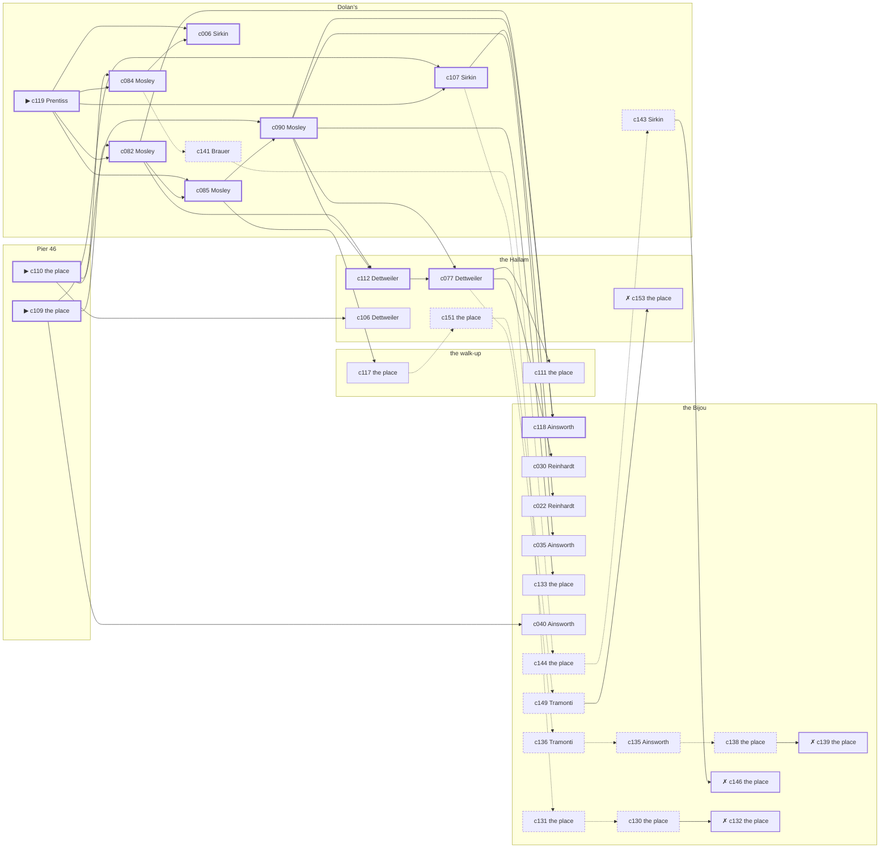

# Chelsea — case 1

**Seed** 1 · **Difficulty** 2 · **Attempts** 1 · **Detective** Dashiell

**Par** 12 actions · **Slack** 6 · **Budget** 18 · **Findable** 34 (spine 12, corroboration 8, noise 10 + 4 disqualifiers) · **Noise ratio** 41% · **Candidate pool** 154

## 1. The Truth

Percival Prentiss, a ward heeler, a witness against the people the victim worked for, killed Edward Corrigan, a retired dry-goods wholesaler, with a blunt object at Pier 46 at 8:00 PM. Prentiss needed the victim silent (silence-a-witness). Prentiss had been at the walk-up earlier in the evening, where the weapon lived, and was alone with Corrigan when it happened. Prentiss is also the client: the killer hired us.

## 2. Dramatis Personae

| Name | Role | Relationship | Class of secret | Motive | Found at | Killer |
| --- | --- | --- | --- | --- | --- | --- |
| Edward Corrigan | a retired dry-goods wholesaler | the victim | — | — | — | — |
| Esther Sirkin | an insurance adjuster | a witness against the people the victim worked for | gambling-debt | — | Dolan’s | — |
| Bella Abramowitz | the night manager at the hotel | the victim’s brother-in-law | secret-drinking | — | the Bijou | — |
| Ilse Reinhardt | a society columnist | a witness against the people the victim worked for | dope | — | the Bijou | — |
| Thaddeus Ainsworth | a doorman at a club with no sign on it | a childhood friend of the victim’s from the same block | dope | debt | the Bijou | — |
| Percival Prentiss (client) | a ward heeler | a witness against the people the victim worked for | murder (+ gambling-debt) | silence-a-witness | Dolan’s | **YES** |
| Wilhelm Brauer | a lawyer with one clerk | the victim’s creditor | blackmail | — | Dolan’s | — |
| Angelina Tramonti | the ticket-taker | fixture (ticket-taker) | — | — | the Bijou | — |
| Rudolf Dettweiler | the elevator man | fixture (elevator-man) | — | — | the Hallam | — |
| Augustus Mosley | the bartender | fixture (bartender) | — | — | Dolan’s | — |

## 3. Places

- **the victim’s walk-up over the drugstore** (private) — unwatched; objects: a bronze bookend, a bottle of chloral drops, a stack of hatboxes — the victim’s address; where the weapon lived
- **the Bijou picture house** (public) — watched by ticket-taker (Tramonti); objects: a silver cigarette case, a standing ashtray, a length of sash cord — within earshot of the scene
- **the ferry slip at the foot of the street** (public) — unwatched; objects: a strapped suitcase, a pasted-up timetable — within earshot of the scene
- **the vestibule of the Hallam apartments** (private) — watched by elevator-man (Dettweiler); objects: a camel-hair overcoat on a hook, a brass umbrella stand, a day ledger
- **Dolan’s Bar** (semi) — watched by bartender (Mosley); objects: a seltzer siphon, an ice pick
- **Pier 46, under the shed** (private) — unwatched; objects: a mechanic’s toolbox — **THE SCENE**

## 4. Anchors

The coroner gives 7:00 PM–8:30 PM, four ticks wide. These are what close it: **church-bells** and **fuse**.

- **the fuse going in the building** — at 7:30 PM; at the Hallam. You can time things by it: a crack in the cellar and every light on the riser out at once. Only those present know that it was the second floor that went dark and not the whole house. Those present carry it: candle smoke on the ceilings of everyone who sat it out.
- **the bells at St. Malachy’s** — at 6:00 PM, 7:00 PM, 8:00 PM, 9:00 PM, 10:00 PM, 11:00 PM; across the whole neighbourhood. You can time things by it: the half hours are rung and the whole hours are rung twice.

## 5. Timelines

### Corrigan — the victim

| Tick | Time | Truth | Claimed | Companion claimed |
| --- | --- | --- | --- | --- |
| 0 | 6:00 PM | the Hallam | the Hallam | — |
| 1 | 6:30 PM | Dolan’s | Dolan’s | — |
| 2 | 7:00 PM | Dolan’s | Dolan’s | — |
| 3 | 7:30 PM | the Hallam | the Hallam | — |
| 4 | 8:00 PM | Pier 46 ☠ | Pier 46 | — |
| 5 | 8:30 PM | — | — | — |
| 6 | 9:00 PM | — | — | — |
| 7 | 9:30 PM | — | — | — |
| 8 | 10:00 PM | — | — | — |
| 9 | 10:30 PM | — | — | — |
| 10 | 11:00 PM | — | — | — |
| 11 | 11:30 PM | — | — | — |

### Sirkin

| Tick | Time | Truth | Claimed | Companion claimed |
| --- | --- | --- | --- | --- |
| 0 | 6:00 PM | the walk-up | the walk-up | — |
| 1 | 6:30 PM | the walk-up | the walk-up | — |
| 2 | 7:00 PM | the walk-up | the walk-up | — |
| 3 | 7:30 PM | Dolan’s | **the Bijou** | Ainsworth |
| 4 | 8:00 PM | Dolan’s | **the Bijou** | Ainsworth |
| 5 | 8:30 PM | Dolan’s | Dolan’s | — |
| 6 | 9:00 PM | Dolan’s | Dolan’s | — |
| 7 | 9:30 PM | Dolan’s | Dolan’s | — |
| 8 | 10:00 PM | Dolan’s | Dolan’s | — |
| 9 | 10:30 PM | Dolan’s | Dolan’s | — |
| 10 | 11:00 PM | Dolan’s | Dolan’s | — |
| 11 | 11:30 PM | the Hallam | the Hallam | — |

### Abramowitz

| Tick | Time | Truth | Claimed | Companion claimed |
| --- | --- | --- | --- | --- |
| 0 | 6:00 PM | the walk-up | the walk-up | — |
| 1 | 6:30 PM | the Bijou | the Bijou | — |
| 2 | 7:00 PM | the Bijou | the Bijou | — |
| 3 | 7:30 PM | the Bijou | **Dolan’s** | Ainsworth |
| 4 | 8:00 PM | the Bijou | **Dolan’s** | Ainsworth |
| 5 | 8:30 PM | the ferry slip | the ferry slip | — |
| 6 | 9:00 PM | the ferry slip | the ferry slip | — |
| 7 | 9:30 PM | the Bijou | the Bijou | — |
| 8 | 10:00 PM | the Bijou | the Bijou | — |
| 9 | 10:30 PM | the Bijou | the Bijou | — |
| 10 | 11:00 PM | Dolan’s | Dolan’s | — |
| 11 | 11:30 PM | Dolan’s | Dolan’s | — |

### Reinhardt

| Tick | Time | Truth | Claimed | Companion claimed |
| --- | --- | --- | --- | --- |
| 0 | 6:00 PM | the walk-up | the walk-up | — |
| 1 | 6:30 PM | the Bijou | **the Hallam** | Sirkin |
| 2 | 7:00 PM | Dolan’s | Dolan’s | — |
| 3 | 7:30 PM | Dolan’s | Dolan’s | — |
| 4 | 8:00 PM | Dolan’s | Dolan’s | — |
| 5 | 8:30 PM | the ferry slip | the ferry slip | — |
| 6 | 9:00 PM | the Hallam | the Hallam | — |
| 7 | 9:30 PM | the Hallam | the Hallam | — |
| 8 | 10:00 PM | the Bijou | the Bijou | — |
| 9 | 10:30 PM | the Bijou | the Bijou | — |
| 10 | 11:00 PM | the Bijou | the Bijou | — |
| 11 | 11:30 PM | the Bijou | the Bijou | — |

### Ainsworth

| Tick | Time | Truth | Claimed | Companion claimed |
| --- | --- | --- | --- | --- |
| 0 | 6:00 PM | the walk-up | the walk-up | — |
| 1 | 6:30 PM | the walk-up | the walk-up | — |
| 2 | 7:00 PM | the walk-up | the walk-up | — |
| 3 | 7:30 PM | the walk-up | the walk-up | — |
| 4 | 8:00 PM | Dolan’s | Dolan’s | — |
| 5 | 8:30 PM | Dolan’s | Dolan’s | — |
| 6 | 9:00 PM | the Bijou | the Bijou | — |
| 7 | 9:30 PM | the Bijou | the Bijou | — |
| 8 | 10:00 PM | the Bijou | **the Hallam** | — |
| 9 | 10:30 PM | the Bijou | **the Hallam** | — |
| 10 | 11:00 PM | the Bijou | the Bijou | — |
| 11 | 11:30 PM | Dolan’s | Dolan’s | — |

### Prentiss — the killer

| Tick | Time | Truth | Claimed | Companion claimed |
| --- | --- | --- | --- | --- |
| 0 | 6:00 PM | the walk-up | the walk-up | — |
| 1 | 6:30 PM | Dolan’s | **the Hallam** | Brauer |
| 2 | 7:00 PM | Pier 46 | **the Bijou** | Sirkin |
| 3 | 7:30 PM | Pier 46 | **the Bijou** | Sirkin |
| 4 | 8:00 PM | Pier 46 ☠ | **the Bijou** | Sirkin |
| 5 | 8:30 PM | Dolan’s | Dolan’s | — |
| 6 | 9:00 PM | Dolan’s | Dolan’s | — |
| 7 | 9:30 PM | Dolan’s | Dolan’s | — |
| 8 | 10:00 PM | Dolan’s | Dolan’s | — |
| 9 | 10:30 PM | Dolan’s | Dolan’s | — |
| 10 | 11:00 PM | Dolan’s | Dolan’s | — |
| 11 | 11:30 PM | Dolan’s | Dolan’s | — |

### Brauer

| Tick | Time | Truth | Claimed | Companion claimed |
| --- | --- | --- | --- | --- |
| 0 | 6:00 PM | the Hallam | **the Bijou** | — |
| 1 | 6:30 PM | Dolan’s | Dolan’s | — |
| 2 | 7:00 PM | Dolan’s | Dolan’s | — |
| 3 | 7:30 PM | Dolan’s | Dolan’s | — |
| 4 | 8:00 PM | Dolan’s | Dolan’s | — |
| 5 | 8:30 PM | Dolan’s | Dolan’s | — |
| 6 | 9:00 PM | the Hallam | the Hallam | — |
| 7 | 9:30 PM | Dolan’s | Dolan’s | — |
| 8 | 10:00 PM | Dolan’s | Dolan’s | — |
| 9 | 10:30 PM | Dolan’s | Dolan’s | — |
| 10 | 11:00 PM | the Bijou | the Bijou | — |
| 11 | 11:30 PM | the Bijou | the Bijou | — |

### Fixtures (never lie, never withhold)

| Tick | Time | Tramonti (the ticket-taker) | Dettweiler (the elevator man) | Mosley (the bartender) |
| --- | --- | --- | --- | --- |
| 0 | 6:00 PM | the Bijou | the Hallam | Dolan’s |
| 1 | 6:30 PM | the Bijou | the Hallam | Dolan’s |
| 2 | 7:00 PM | the Bijou | the Hallam | Dolan’s |
| 3 | 7:30 PM | the Bijou | the Hallam | Dolan’s |
| 4 | 8:00 PM | the Bijou | the Bijou | Dolan’s |
| 5 | 8:30 PM | the Bijou | the Hallam | Dolan’s |
| 6 | 9:00 PM | the Bijou | the Hallam | Dolan’s |
| 7 | 9:30 PM | the Bijou | the Hallam | Dolan’s |
| 8 | 10:00 PM | the Bijou | the Hallam | Dolan’s |
| 9 | 10:30 PM | the Bijou | the Hallam | Dolan’s |
| 10 | 11:00 PM | the Bijou | the Hallam | the walk-up |
| 11 | 11:30 PM | the Bijou | the Hallam | Dolan’s |

## 6. Secrets in play

- **Sirkin** (gambling-debt): Sirkin slips off to Dolan’s from 7:30 PM to 8:00 PM to settle with a bookmaker.
- **Abramowitz** (secret-drinking): Abramowitz drinks alone at the Bijou from 7:30 PM to 8:00 PM and will claim to have been anywhere else.
- **Reinhardt** (dope): Reinhardt buys morphine at the Bijou from 6:30 PM and would rather be thought a murderer than a hop-head.
- **Ainsworth** (dope): Ainsworth buys morphine at the Bijou from 10:00 PM to 10:30 PM and would rather be thought a murderer than a hop-head.
- **Prentiss** (murder): Prentiss is at Pier 46 from 7:00 PM to 8:00 PM, alone with Corrigan when it happens at 8:00 PM.
- **Prentiss** also (gambling-debt): Prentiss slips off to Dolan’s from 6:30 PM to settle with a bookmaker.
- **Brauer** (blackmail): Brauer meets the victim alone at the Hallam from 6:00 PM and asks for money.

## 7. Clue list — the 34 findable

The opening three, free at the start: c109, c110, c119. Everything else has to be led to. The full candidate pool is in the companion file.

### At the walk-up

- **c117** [corroboration] (document; the place itself) → c151
  - Found at the walk-up: A subpoena naming Corrigan before the grand jury, with Prentiss’s name written in the margin.
  - _establishes: Prentiss had a motive (silence-a-witness)_
- **c111** [corroboration] (physical; the place itself) → (end)
  - A bronze bookend is gone from the walk-up. There is a clean square in the dust where it stood.
  - _establishes: something gone from the walk-up; how it was done_

### At the Bijou

- **c118** [spine] (overheard; Ainsworth on Prentiss and Corrigan) → (end)
  - Ainsworth says Corrigan said to Prentiss that a man who testifies sleeps better.
  - _establishes: Prentiss had a motive (silence-a-witness)_
- **c030** [corroboration] (observation; Reinhardt on Prentiss) → (end)
  - Reinhardt says Prentiss was at the walk-up at 6:00 PM.
  - _establishes: Prentiss at the walk-up, 6:00 PM; Prentiss could reach the weapon_
- **c022** [corroboration] (observation; Reinhardt on Sirkin) → (end)
  - Reinhardt says Sirkin was at the walk-up at 6:00 PM.
  - _establishes: Sirkin at the walk-up, 6:00 PM; Sirkin could reach the weapon_
- **c035** [corroboration] (observation; Ainsworth on Sirkin) → (end)
  - Ainsworth says Sirkin was at Dolan’s from 8:00 PM to 8:30 PM.
  - _establishes: Sirkin at Dolan’s, 8:00 PM–8:30 PM_
- **c133** [corroboration] (overheard; the place itself) → (end)
  - The tab at the Bijou is dated and timed, from 7:30 PM to 8:00 PM, and Abramowitz was there to run it up.
  - _establishes: Abramowitz’s secret-drinking accounted for; Abramowitz at the Bijou, 7:30 PM–8:00 PM_
- **c040** [corroboration] (observation; Ainsworth on Reinhardt) → (end)
  - Ainsworth says Reinhardt was at Dolan’s at 8:00 PM.
  - _establishes: Reinhardt at Dolan’s, 8:00 PM_
- **c136** [noise {b1}] (overheard; Tramonti on Reinhardt) → c135
  - Tramonti on Reinhardt: Reinhardt was steady at nine and shaking at seven, and it was not nerves about the police.
  - _establishes: context only_
- **c135** [noise {b1}] (overheard; Ainsworth on Reinhardt) → c138
  - Ainsworth on Reinhardt: Somebody at the Bijou sells what a druggist will not, and Reinhardt knows which door.
  - _establishes: context only_
- **c138** [noise {b1}] (physical; the place itself) → c139
  - A prescription blank at the Bijou signed by a doctor who has been dead since the spring.
  - _establishes: context only_
- **c139** [disqualifier {b1}] (overheard; the place itself) → (end)
  - The man who sells it at the Bijou gives it up rather than be held: Reinhardt was there from 6:30 PM, and stayed until it took hold.
  - _establishes: Reinhardt’s dope accounted for; Reinhardt at the Bijou, 6:30 PM_
- **c144** [noise {b2}] (physical; the place itself) → c143
  - A paper of powder at the Bijou, folded the way one particular hand folds them.
  - _establishes: context only_
- **c146** [disqualifier {b2}] (overheard; the place itself) → (end)
  - The man who sells it at the Bijou gives it up rather than be held: Ainsworth was there from 10:00 PM to 10:30 PM, and stayed until it took hold.
  - _establishes: Ainsworth’s dope accounted for; Ainsworth at the Bijou, 10:00 PM–10:30 PM_
- **c149** [noise {b3}] (overheard; Tramonti on Brauer) → c153
  - Tramonti on Brauer: Brauer has come into money lately and has no visible way of having come into money.
  - _establishes: context only_
- **c131** [noise {b4}] (physical; the place itself) → c130
  - A tab at the Bijou in a name that is not Abramowitz’s, in Abramowitz’s handwriting.
  - _establishes: context only_
- **c130** [noise {b4}] (physical; the place itself) → c132
  - A bottle at the Bijou pushed behind the pipes, the seal broken and the level down.
  - _establishes: context only_
- **c132** [disqualifier {b4}] (overheard; the place itself) → (end)
  - The man behind the counter at the Bijou knows exactly: Abramowitz was on the same stool from 7:30 PM to 8:00 PM and was in no condition to walk anywhere, let alone do this.
  - _establishes: Abramowitz’s secret-drinking accounted for; Abramowitz at the Bijou, 7:30 PM–8:00 PM_

### At the Hallam

- **c112** [spine] (anchor; Dettweiler on Corrigan that evening) → c077
  - Dettweiler puts Corrigan at the Hallam when the lights went, which was 7:30 PM, and alive enough to argue about the weather.
  - _establishes: the victim alive at 7:30 PM; Corrigan at the Hallam, 7:30 PM_
- **c077** [spine] (observation; Dettweiler on Abramowitz) → c030, c111, c136
  - Dettweiler says Abramowitz was at the Bijou at 8:00 PM.
  - _establishes: Abramowitz at the Bijou, 8:00 PM_
- **c106** [corroboration] (observation; Dettweiler on Prentiss’s account) → (end)
  - Dettweiler was at the Bijou at 8:00 PM and says Prentiss was not.
  - _establishes: Prentiss not at the Bijou, 8:00 PM_
- **c151** [noise {b3}] (physical; the place itself) → c149
  - An envelope at the Hallam with nothing in it, addressed in the victim’s hand to no one.
  - _establishes: context only_
- **c153** [disqualifier {b3}] (overheard; the place itself) → (end)
  - The victim’s bank book settles it: four payments, and Brauer at the Hallam from 6:00 PM collecting the fifth. It is extortion, and an extortionist wants the man alive.
  - _establishes: Brauer’s blackmail accounted for; Brauer at the Hallam, 6:00 PM_

### At Dolan’s

- **c119** [spine ⟨opening⟩] (client; Prentiss on why I was hired) → c082, c085, c084, c006, c107
  - Prentiss hired us, and wants it known that Ainsworth owed the victim money, and would rather we started there.
  - _establishes: Ainsworth had a motive (debt)_
- **c082** [spine] (observation; Mosley on Sirkin) → c085, c112, c118
  - Mosley says Sirkin was at Dolan’s from 7:30 PM to 10:30 PM.
  - _establishes: Sirkin at Dolan’s, 7:30 PM–10:30 PM_
- **c085** [spine] (observation; Mosley on Ainsworth) → c090, c117
  - Mosley says Ainsworth was at Dolan’s from 8:00 PM to 8:30 PM.
  - _establishes: Ainsworth at Dolan’s, 8:00 PM–8:30 PM_
- **c084** [spine] (observation; Mosley on Reinhardt) → c006, c141
  - Mosley says Reinhardt was at Dolan’s from 7:00 PM to 8:00 PM.
  - _establishes: Reinhardt at Dolan’s, 7:00 PM–8:00 PM_
- **c006** [spine] (observation; Sirkin on Prentiss) → (end)
  - Sirkin says Prentiss was at the walk-up at 6:00 PM.
  - _establishes: Prentiss at the walk-up, 6:00 PM; Prentiss could reach the weapon_
- **c090** [spine] (observation; Mosley on Brauer) → c112, c077, c118, c035, c133
  - Mosley says Brauer was at Dolan’s from 6:30 PM to 8:30 PM.
  - _establishes: Brauer at Dolan’s, 6:30 PM–8:30 PM_
- **c107** [spine] (denial; Sirkin on Prentiss’s account) → c022, c131
  - Prentiss names Sirkin as the company for the Bijou from 7:00 PM to 8:00 PM. Sirkin says they were not together that evening.
  - _establishes: Prentiss not at the Bijou, 7:00 PM–8:00 PM_
- **c141** [noise {b2}] (overheard; Brauer on Ainsworth) → c144
  - Brauer on Ainsworth: Ainsworth’s sleeves are buttoned at the wrist in a warm room.
  - _establishes: context only_
- **c143** [noise {b2}] (overheard; Sirkin on Ainsworth) → c146
  - Sirkin on Ainsworth: Ainsworth was steady at nine and shaking at seven, and it was not nerves about the police.
  - _establishes: context only_

### At Pier 46

- **c109** [spine ⟨opening⟩] (scene; the place itself) → c082, c107, c040
  - Corrigan was found at Pier 46. The lamp came down with him and the bulb is still warm in its socket, unbroken. The bells rang the half hour at 8:00 PM. The sexton rings them off the sacristy clock and it keeps good time.
  - _establishes: the victim dead by 8:00 PM; how it was done_
- **c110** [spine ⟨opening⟩] (morgue; the place itself) → c084, c090, c106
  - The coroner puts death between 7:00 PM and 8:30 PM — two hours of nothing useful. One depressed fracture at the back of the skull. Death was not instant.
  - _establishes: death between 7:00 PM and 8:30 PM; how it was done_

## 8. Clue graph

## 9. Deduction path

Par is **12 actions** and the budget is par plus 6: **18**. Every id below is a spine clue; the inference is the sheet’s, not the clue’s.

**Time of death.** The coroner gives four ticks. The anchors close it to 8:00 PM: one puts Corrigan alive at 7:30 PM, the other times the scene at 8:00 PM. _(c110, c112, c109)_

**Clearing the innocent.**

- Sirkin was not at Pier 46 at 8:00 PM. _(c082; + 1 corroborating)_
- Abramowitz was not at Pier 46 at 8:00 PM. _(c077; + 2 corroborating)_
- Reinhardt was not at Pier 46 at 8:00 PM. _(c084; + 1 corroborating)_
- Ainsworth was not at Pier 46 at 8:00 PM. _(c085)_
- Brauer was not at Pier 46 at 8:00 PM. _(c090)_

**Naming the killer.** Prentiss claims the Bijou at 8:00 PM. Two independent sources put that out of the question. _(c107; + 1 corroborating)_

**The weapon.** Prentiss was at the walk-up before 8:00 PM, where a bronze bookend was kept. _(c006; + 1 corroborating)_

**Method.** A blunt object, on two physical sources. _(c109, c110; + 1 corroborating)_

**Motive.** silence-a-witness, on two independent sources. _(c118; + 1 corroborating)_

## 10. Red herrings

**Innocents who lie about the murder tick:**

- Sirkin claims the Bijou at 8:00 PM and was really at Dolan’s. Reason: Sirkin slips off to Dolan’s from 7:30 PM to 8:00 PM to settle with a bookmaker.
- Abramowitz claims Dolan’s at 8:00 PM and was really at the Bijou. Reason: Abramowitz drinks alone at the Bijou from 7:30 PM to 8:00 PM and will claim to have been anywhere else.

**Innocents with a motive:**

- Ainsworth — debt: owed the victim money.

**Noise branches, and what knocks each one down:**

- **b1** (Reinhardt, dope): c136 → c135 → c138 → **c139** — The man who sells it at the Bijou gives it up rather than be held: Reinhardt was there from 6:30 PM, and stayed until it took hold.
- **b2** (Ainsworth, dope): c141 → c144 → c143 → **c146** — The man who sells it at the Bijou gives it up rather than be held: Ainsworth was there from 10:00 PM to 10:30 PM, and stayed until it took hold.
- **b3** (Brauer, blackmail): c151 → c149 → **c153** — The victim’s bank book settles it: four payments, and Brauer at the Hallam from 6:00 PM collecting the fifth. It is extortion, and an extortionist wants the man alive.
- **b4** (Abramowitz, secret-drinking): c131 → c130 → **c132** — The man behind the counter at the Bijou knows exactly: Abramowitz was on the same stool from 7:30 PM to 8:00 PM and was in no condition to walk anywhere, let alone do this.

