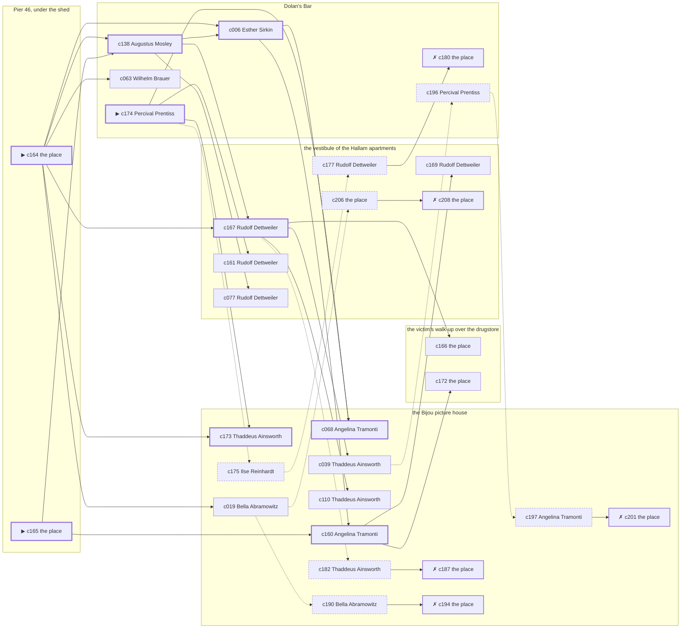

# Chelsea — case 1

**Seed** 1 · **Difficulty** 2 · **Attempts** 1 · **Detective** Humphrey

**Par** 9 actions · **Budget** 20 · **Slack** 11 · **Findable** 30 (spine 9, corroboration 9, noise 7 + 5 disqualifiers) · **Noise ratio** 40% · **Candidate pool** 209

## 1. The Truth

Percival Prentiss, a ward heeler, the victim’s rival in trade, killed Edward Corrigan, a retired dry-goods wholesaler, with a blunt object at Pier 46, under the shed at 8:00 PM. Percival Prentiss was about to be exposed by the victim (exposure). Percival Prentiss had been at the victim’s walk-up over the drugstore earlier in the evening, where the weapon lived, and was alone with Edward Corrigan when it happened. Percival Prentiss is also the client: the killer hired us.

## 2. Dramatis Personae

| Name | Role | Relationship | Class of secret | Motive | Found at | Killer |
| --- | --- | --- | --- | --- | --- | --- |
| Edward Corrigan | a retired dry-goods wholesaler | the victim | — | — | — | — |
| Esther Sirkin | an insurance adjuster | a witness against the people the victim worked for | gambling-debt | — | Dolan’s Bar | — |
| Bella Abramowitz | the night manager at the hotel | the victim’s business partner | secret-drinking | — | the Bijou picture house | — |
| Ilse Reinhardt | a society columnist | the victim’s neighbour across the airshaft | dope | — | the Bijou picture house | — |
| Thaddeus Ainsworth | a doorman at a club with no sign on it | a childhood friend of the victim’s from the same block | dope | debt | the Bijou picture house | — |
| Percival Prentiss (client) | a ward heeler | the victim’s rival in trade | murder (+ gambling-debt) | exposure | Dolan’s Bar | **YES** |
| Wilhelm Brauer | a lawyer with one clerk | the victim’s business partner | blackmail | — | Dolan’s Bar | — |
| Angelina Tramonti | the ticket-taker | fixture (ticket-taker) | — | — | the Bijou picture house | — |
| Rudolf Dettweiler | the elevator man | fixture (elevator-man) | — | — | the vestibule of the Hallam apartments | — |
| Augustus Mosley | the bartender | fixture (bartender) | — | — | Dolan’s Bar | — |

## 3. Places

- **the victim’s walk-up over the drugstore** (private) — unwatched; objects: a bronze bookend, a bottle of chloral drops, a stack of hatboxes — the victim’s address; where the weapon lived
- **the Bijou picture house** (public) — watched by ticket-taker (Angelina Tramonti); objects: a silver cigarette case, a standing ashtray, a length of sash cord — within earshot of the scene
- **the ferry slip at the foot of the street** (public) — unwatched; objects: a strapped suitcase, a pasted-up timetable — within earshot of the scene
- **the vestibule of the Hallam apartments** (private) — watched by elevator-man (Rudolf Dettweiler); objects: a camel-hair overcoat on a hook, a brass umbrella stand, a day ledger
- **Dolan’s Bar** (semi) — watched by bartender (Augustus Mosley); objects: a seltzer siphon, an ice pick
- **Pier 46, under the shed** (private) — unwatched; objects: a mechanic’s toolbox — **THE SCENE**

## 4. Anchors

The coroner gives 7:00 PM–8:30 PM, four ticks wide. These are what close it: **church-bells** and **fuse**.

- **the fuse going in the building** — at 7:30 PM; at the vestibule of the Hallam apartments. You can time things by it: a crack in the cellar and every light on the riser out at once. Those present carry it: candle smoke on the ceilings of everyone who sat it out.
- **the bells at St. Malachy’s** — at 6:00 PM, 7:00 PM, 8:00 PM, 9:00 PM, 10:00 PM, 11:00 PM; across the whole neighbourhood. You can time things by it: the half hours are rung and the whole hours are rung twice.

## 5. Timelines

### Edward Corrigan — the victim

| Tick | Time | Truth | Claimed | Companion claimed |
| --- | --- | --- | --- | --- |
| 0 | 6:00 PM | the vestibule of the Hallam apartments | the vestibule of the Hallam apartments | — |
| 1 | 6:30 PM | Dolan’s Bar | Dolan’s Bar | — |
| 2 | 7:00 PM | Dolan’s Bar | Dolan’s Bar | — |
| 3 | 7:30 PM | the vestibule of the Hallam apartments | the vestibule of the Hallam apartments | — |
| 4 | 8:00 PM | Pier 46, under the shed ☠ | Pier 46, under the shed | — |
| 5 | 8:30 PM | — | — | — |
| 6 | 9:00 PM | — | — | — |
| 7 | 9:30 PM | — | — | — |
| 8 | 10:00 PM | — | — | — |
| 9 | 10:30 PM | — | — | — |
| 10 | 11:00 PM | — | — | — |
| 11 | 11:30 PM | — | — | — |

### Esther Sirkin

| Tick | Time | Truth | Claimed | Companion claimed |
| --- | --- | --- | --- | --- |
| 0 | 6:00 PM | the victim’s walk-up over the drugstore | the victim’s walk-up over the drugstore | — |
| 1 | 6:30 PM | the victim’s walk-up over the drugstore | the victim’s walk-up over the drugstore | — |
| 2 | 7:00 PM | the victim’s walk-up over the drugstore | the victim’s walk-up over the drugstore | — |
| 3 | 7:30 PM | Dolan’s Bar | **the Bijou picture house** | Thaddeus Ainsworth |
| 4 | 8:00 PM | Dolan’s Bar | **the Bijou picture house** | Thaddeus Ainsworth |
| 5 | 8:30 PM | Dolan’s Bar | Dolan’s Bar | — |
| 6 | 9:00 PM | Dolan’s Bar | Dolan’s Bar | — |
| 7 | 9:30 PM | Dolan’s Bar | Dolan’s Bar | — |
| 8 | 10:00 PM | Dolan’s Bar | Dolan’s Bar | — |
| 9 | 10:30 PM | Dolan’s Bar | Dolan’s Bar | — |
| 10 | 11:00 PM | Dolan’s Bar | Dolan’s Bar | — |
| 11 | 11:30 PM | the vestibule of the Hallam apartments | the vestibule of the Hallam apartments | — |

### Bella Abramowitz

| Tick | Time | Truth | Claimed | Companion claimed |
| --- | --- | --- | --- | --- |
| 0 | 6:00 PM | the victim’s walk-up over the drugstore | the victim’s walk-up over the drugstore | — |
| 1 | 6:30 PM | the Bijou picture house | the Bijou picture house | — |
| 2 | 7:00 PM | the Bijou picture house | the Bijou picture house | — |
| 3 | 7:30 PM | the Bijou picture house | **Dolan’s Bar** | Thaddeus Ainsworth |
| 4 | 8:00 PM | the Bijou picture house | **Dolan’s Bar** | Thaddeus Ainsworth |
| 5 | 8:30 PM | the ferry slip at the foot of the street | the ferry slip at the foot of the street | — |
| 6 | 9:00 PM | the ferry slip at the foot of the street | the ferry slip at the foot of the street | — |
| 7 | 9:30 PM | the Bijou picture house | the Bijou picture house | — |
| 8 | 10:00 PM | the Bijou picture house | the Bijou picture house | — |
| 9 | 10:30 PM | the Bijou picture house | the Bijou picture house | — |
| 10 | 11:00 PM | Dolan’s Bar | Dolan’s Bar | — |
| 11 | 11:30 PM | Dolan’s Bar | Dolan’s Bar | — |

### Ilse Reinhardt

| Tick | Time | Truth | Claimed | Companion claimed |
| --- | --- | --- | --- | --- |
| 0 | 6:00 PM | the victim’s walk-up over the drugstore | the victim’s walk-up over the drugstore | — |
| 1 | 6:30 PM | the Bijou picture house | **the vestibule of the Hallam apartments** | Esther Sirkin |
| 2 | 7:00 PM | Dolan’s Bar | Dolan’s Bar | — |
| 3 | 7:30 PM | Dolan’s Bar | Dolan’s Bar | — |
| 4 | 8:00 PM | Dolan’s Bar | Dolan’s Bar | — |
| 5 | 8:30 PM | the ferry slip at the foot of the street | the ferry slip at the foot of the street | — |
| 6 | 9:00 PM | the vestibule of the Hallam apartments | the vestibule of the Hallam apartments | — |
| 7 | 9:30 PM | the vestibule of the Hallam apartments | the vestibule of the Hallam apartments | — |
| 8 | 10:00 PM | the Bijou picture house | the Bijou picture house | — |
| 9 | 10:30 PM | the Bijou picture house | the Bijou picture house | — |
| 10 | 11:00 PM | the Bijou picture house | the Bijou picture house | — |
| 11 | 11:30 PM | the Bijou picture house | the Bijou picture house | — |

### Thaddeus Ainsworth

| Tick | Time | Truth | Claimed | Companion claimed |
| --- | --- | --- | --- | --- |
| 0 | 6:00 PM | the victim’s walk-up over the drugstore | the victim’s walk-up over the drugstore | — |
| 1 | 6:30 PM | the victim’s walk-up over the drugstore | the victim’s walk-up over the drugstore | — |
| 2 | 7:00 PM | the victim’s walk-up over the drugstore | the victim’s walk-up over the drugstore | — |
| 3 | 7:30 PM | the victim’s walk-up over the drugstore | the victim’s walk-up over the drugstore | — |
| 4 | 8:00 PM | Dolan’s Bar | Dolan’s Bar | — |
| 5 | 8:30 PM | Dolan’s Bar | Dolan’s Bar | — |
| 6 | 9:00 PM | the Bijou picture house | the Bijou picture house | — |
| 7 | 9:30 PM | the Bijou picture house | the Bijou picture house | — |
| 8 | 10:00 PM | the Bijou picture house | **the vestibule of the Hallam apartments** | — |
| 9 | 10:30 PM | the Bijou picture house | **the vestibule of the Hallam apartments** | — |
| 10 | 11:00 PM | the Bijou picture house | the Bijou picture house | — |
| 11 | 11:30 PM | Dolan’s Bar | Dolan’s Bar | — |

### Percival Prentiss — the killer

| Tick | Time | Truth | Claimed | Companion claimed |
| --- | --- | --- | --- | --- |
| 0 | 6:00 PM | the victim’s walk-up over the drugstore | the victim’s walk-up over the drugstore | — |
| 1 | 6:30 PM | Dolan’s Bar | **the vestibule of the Hallam apartments** | Wilhelm Brauer |
| 2 | 7:00 PM | Pier 46, under the shed | **the Bijou picture house** | Esther Sirkin |
| 3 | 7:30 PM | Pier 46, under the shed | **the Bijou picture house** | Esther Sirkin |
| 4 | 8:00 PM | Pier 46, under the shed ☠ | **the Bijou picture house** | Esther Sirkin |
| 5 | 8:30 PM | Dolan’s Bar | Dolan’s Bar | — |
| 6 | 9:00 PM | Dolan’s Bar | Dolan’s Bar | — |
| 7 | 9:30 PM | Dolan’s Bar | Dolan’s Bar | — |
| 8 | 10:00 PM | Dolan’s Bar | Dolan’s Bar | — |
| 9 | 10:30 PM | Dolan’s Bar | Dolan’s Bar | — |
| 10 | 11:00 PM | Dolan’s Bar | Dolan’s Bar | — |
| 11 | 11:30 PM | Dolan’s Bar | Dolan’s Bar | — |

### Wilhelm Brauer

| Tick | Time | Truth | Claimed | Companion claimed |
| --- | --- | --- | --- | --- |
| 0 | 6:00 PM | the vestibule of the Hallam apartments | **the Bijou picture house** | — |
| 1 | 6:30 PM | Dolan’s Bar | Dolan’s Bar | — |
| 2 | 7:00 PM | Dolan’s Bar | Dolan’s Bar | — |
| 3 | 7:30 PM | Dolan’s Bar | Dolan’s Bar | — |
| 4 | 8:00 PM | Dolan’s Bar | Dolan’s Bar | — |
| 5 | 8:30 PM | Dolan’s Bar | Dolan’s Bar | — |
| 6 | 9:00 PM | the vestibule of the Hallam apartments | the vestibule of the Hallam apartments | — |
| 7 | 9:30 PM | Dolan’s Bar | Dolan’s Bar | — |
| 8 | 10:00 PM | Dolan’s Bar | Dolan’s Bar | — |
| 9 | 10:30 PM | Dolan’s Bar | Dolan’s Bar | — |
| 10 | 11:00 PM | the Bijou picture house | the Bijou picture house | — |
| 11 | 11:30 PM | the Bijou picture house | the Bijou picture house | — |

### Fixtures (never lie, never withhold)

| Tick | Time | Angelina Tramonti (the ticket-taker) | Rudolf Dettweiler (the elevator man) | Augustus Mosley (the bartender) |
| --- | --- | --- | --- | --- |
| 0 | 6:00 PM | the Bijou picture house | the vestibule of the Hallam apartments | Dolan’s Bar |
| 1 | 6:30 PM | the Bijou picture house | the vestibule of the Hallam apartments | Dolan’s Bar |
| 2 | 7:00 PM | the Bijou picture house | the vestibule of the Hallam apartments | Dolan’s Bar |
| 3 | 7:30 PM | the Bijou picture house | the vestibule of the Hallam apartments | Dolan’s Bar |
| 4 | 8:00 PM | the Bijou picture house | the Bijou picture house | Dolan’s Bar |
| 5 | 8:30 PM | the Bijou picture house | the vestibule of the Hallam apartments | Dolan’s Bar |
| 6 | 9:00 PM | the Bijou picture house | the vestibule of the Hallam apartments | Dolan’s Bar |
| 7 | 9:30 PM | the Bijou picture house | the vestibule of the Hallam apartments | Dolan’s Bar |
| 8 | 10:00 PM | the Bijou picture house | the vestibule of the Hallam apartments | Dolan’s Bar |
| 9 | 10:30 PM | the Bijou picture house | the vestibule of the Hallam apartments | Dolan’s Bar |
| 10 | 11:00 PM | the Bijou picture house | the vestibule of the Hallam apartments | the victim’s walk-up over the drugstore |
| 11 | 11:30 PM | the Bijou picture house | the vestibule of the Hallam apartments | Dolan’s Bar |

## 6. Secrets in play

- **Esther Sirkin** (gambling-debt): Esther Sirkin slips off to Dolan’s Bar from 7:30 PM to 8:00 PM to settle with a bookmaker.
- **Bella Abramowitz** (secret-drinking): Bella Abramowitz drinks alone at the Bijou picture house from 7:30 PM to 8:00 PM and will claim to have been anywhere else.
- **Ilse Reinhardt** (dope): Ilse Reinhardt buys morphine at the Bijou picture house from 6:30 PM and would rather be thought a murderer than a hop-head.
- **Thaddeus Ainsworth** (dope): Thaddeus Ainsworth buys morphine at the Bijou picture house from 10:00 PM to 10:30 PM and would rather be thought a murderer than a hop-head.
- **Percival Prentiss** (murder): Percival Prentiss is at Pier 46, under the shed from 7:00 PM to 8:00 PM, alone with Edward Corrigan when it happens at 8:00 PM.
- **Percival Prentiss** also (gambling-debt): Percival Prentiss slips off to Dolan’s Bar from 6:30 PM to settle with a bookmaker.
- **Wilhelm Brauer** (blackmail): Wilhelm Brauer meets the victim alone at the vestibule of the Hallam apartments from 6:00 PM and asks for money.

## 7. Clue list — the 30 findable

The opening three, free at the start: c164, c165, c174. Everything else has to be led to. The full candidate pool is in the companion file.

### At the victim’s walk-up over the drugstore

- **c166** [corroboration] (physical; the place itself) → (end)
  - A bronze bookend is gone from the victim’s walk-up over the drugstore. There is a clean square in the dust where it stood.
  - _establishes: something gone from the victim’s walk-up over the drugstore; how it was done_
- **c172** [corroboration] (document; the place itself) → (end)
  - Found at the victim’s walk-up over the drugstore: A typed page of dates and sums in Edward Corrigan’s file, headed with Percival Prentiss’s name.
  - _establishes: Percival Prentiss had a motive (exposure)_

### At the Bijou picture house

- **c173** [spine] (overheard; Thaddeus Ainsworth on Percival Prentiss and Edward Corrigan) → (end)
  - Thaddeus Ainsworth says Edward Corrigan told Percival Prentiss that the story would run whether Percival Prentiss liked it or not.
  - _establishes: Percival Prentiss had a motive (exposure)_
- **c068** [spine] (observation; Angelina Tramonti on Bella Abramowitz) → (end)
  - Angelina Tramonti says Bella Abramowitz was at the Bijou picture house from 6:30 PM to 8:00 PM.
  - _establishes: Bella Abramowitz at the Bijou picture house, 6:30 PM–8:00 PM_
- **c160** [spine] (observation; Angelina Tramonti on Percival Prentiss’s account) → c172, c169
  - Angelina Tramonti was at the Bijou picture house from 7:00 PM to 8:00 PM and says Percival Prentiss was not.
  - _establishes: Percival Prentiss not at the Bijou picture house, 7:00 PM–8:00 PM_
- **c110** [corroboration] (observation; Thaddeus Ainsworth on who was there at 8:00 PM) → (end)
  - Thaddeus Ainsworth runs through it: at 8:00 PM there were Esther Sirkin, Ilse Reinhardt, Wilhelm Brauer at Dolan’s Bar, and nobody else worth naming.
  - _establishes: Esther Sirkin at Dolan’s Bar, 8:00 PM; Ilse Reinhardt at Dolan’s Bar, 8:00 PM; Wilhelm Brauer at Dolan’s Bar, 8:00 PM_
- **c019** [corroboration] (observation; Bella Abramowitz on Percival Prentiss) → c206, c190
  - Bella Abramowitz says Percival Prentiss was at the victim’s walk-up over the drugstore at 6:00 PM.
  - _establishes: Percival Prentiss at the victim’s walk-up over the drugstore, 6:00 PM; Percival Prentiss could reach the weapon_
- **c039** [corroboration] (observation; Thaddeus Ainsworth on Ilse Reinhardt) → c196
  - Thaddeus Ainsworth says Ilse Reinhardt was at the victim’s walk-up over the drugstore at 6:00 PM.
  - _establishes: Ilse Reinhardt at the victim’s walk-up over the drugstore, 6:00 PM; Ilse Reinhardt could reach the weapon_
- **c175** [noise {b2}] (overheard; Ilse Reinhardt on Esther Sirkin) → c177
  - Ilse Reinhardt on Esther Sirkin: Esther Sirkin was asking around for a hundred dollars in a hurry earlier in the week.
  - _establishes: context only_
- **c182** [noise {b3}] (overheard; Thaddeus Ainsworth on Bella Abramowitz) → c187
  - Thaddeus Ainsworth on Bella Abramowitz: Bella Abramowitz had taken a drink and had gone to some trouble about the smell of it.
  - _establishes: context only_
- **c187** [disqualifier {b3}] (overheard; the place itself) → (end)
  - The man behind the counter at the Bijou picture house knows exactly: Bella Abramowitz was on the same stool from 7:30 PM to 8:00 PM and was in no condition to walk anywhere, let alone do this.
  - _establishes: Bella Abramowitz’s secret-drinking accounted for; Bella Abramowitz at the Bijou picture house, 7:30 PM–8:00 PM_
- **c190** [noise {b4}] (overheard; Bella Abramowitz on Ilse Reinhardt) → c194
  - Bella Abramowitz on Ilse Reinhardt: Somebody at the Bijou picture house sells what a druggist will not, and Ilse Reinhardt knows which door.
  - _establishes: context only_
- **c194** [disqualifier {b4}] (overheard; the place itself) → (end)
  - The man who sells it at the Bijou picture house gives it up rather than be held: Ilse Reinhardt was there from 6:30 PM, and stayed until it took hold.
  - _establishes: Ilse Reinhardt’s dope accounted for; Ilse Reinhardt at the Bijou picture house, 6:30 PM_
- **c197** [noise {b5}] (overheard; Angelina Tramonti on Thaddeus Ainsworth) → c201
  - Angelina Tramonti on Thaddeus Ainsworth: Somebody at the Bijou picture house sells what a druggist will not, and Thaddeus Ainsworth knows which door.
  - _establishes: context only_
- **c201** [disqualifier {b5}] (overheard; the place itself) → (end)
  - The man who sells it at the Bijou picture house gives it up rather than be held: Thaddeus Ainsworth was there from 10:00 PM to 10:30 PM, and stayed until it took hold.
  - _establishes: Thaddeus Ainsworth’s dope accounted for; Thaddeus Ainsworth at the Bijou picture house, 10:00 PM–10:30 PM_

### At the vestibule of the Hallam apartments

- **c167** [spine] (anchor; Rudolf Dettweiler on Edward Corrigan that evening) → c110, c166, c039, c182
  - Rudolf Dettweiler puts Edward Corrigan at the vestibule of the Hallam apartments when the lights went, which was 7:30 PM, and alive enough to argue about the weather.
  - _establishes: the victim alive at 7:30 PM; Edward Corrigan at the vestibule of the Hallam apartments, 7:30 PM_
- **c161** [corroboration] (observation; Rudolf Dettweiler on Percival Prentiss’s account) → (end)
  - Rudolf Dettweiler was at the Bijou picture house at 8:00 PM and says Percival Prentiss was not.
  - _establishes: Percival Prentiss not at the Bijou picture house, 8:00 PM_
- **c077** [corroboration] (observation; Rudolf Dettweiler on Bella Abramowitz) → (end)
  - Rudolf Dettweiler says Bella Abramowitz was at the Bijou picture house at 8:00 PM.
  - _establishes: Bella Abramowitz at the Bijou picture house, 8:00 PM_
- **c169** [corroboration] (anchor; Rudolf Dettweiler on the noise that evening) → (end)
  - Rudolf Dettweiler was at the Bijou picture house at 8:00 PM and heard a heavy fall and a cry cut short from the direction of Pier 46, under the shed, as the bells were going.
  - _establishes: noise at Pier 46, under the shed at 8:00 PM; the victim dead by 8:00 PM; how it was done_
- **c206** [noise {b1}] (physical; the place itself) → c208
  - An envelope at the vestibule of the Hallam apartments with nothing in it, addressed in the victim’s hand to no one.
  - _establishes: context only_
- **c208** [disqualifier {b1}] (overheard; the place itself) → (end)
  - The victim’s bank book settles it: four payments, and Wilhelm Brauer at the vestibule of the Hallam apartments from 6:00 PM collecting the fifth. It is extortion, and an extortionist wants the man alive.
  - _establishes: Wilhelm Brauer’s blackmail accounted for; Wilhelm Brauer at the vestibule of the Hallam apartments, 6:00 PM_
- **c177** [noise {b2}] (overheard; Rudolf Dettweiler on Esther Sirkin) → c180
  - Rudolf Dettweiler on Esther Sirkin: Esther Sirkin goes very quiet when the racing wire is mentioned.
  - _establishes: context only_

### At Dolan’s Bar

- **c174** [spine ⟨opening⟩] (client; Percival Prentiss on why I was hired) → c173, c068, c161, c175
  - Percival Prentiss hired us. Percival Prentiss wants it known that Thaddeus Ainsworth owed the victim money, and would rather we started there.
  - _establishes: Thaddeus Ainsworth had a motive (debt)_
- **c138** [spine] (observation; Augustus Mosley on who was there at 8:00 PM) → c006, c167, c077
  - Augustus Mosley runs through it: at 8:00 PM there were Esther Sirkin, Ilse Reinhardt, Thaddeus Ainsworth, Wilhelm Brauer at Dolan’s Bar, and nobody else worth naming.
  - _establishes: Esther Sirkin at Dolan’s Bar, 8:00 PM; Ilse Reinhardt at Dolan’s Bar, 8:00 PM; Thaddeus Ainsworth at Dolan’s Bar, 8:00 PM; Wilhelm Brauer at Dolan’s Bar, 8:00 PM_
- **c006** [spine] (observation; Esther Sirkin on Percival Prentiss) → c068, c160
  - Esther Sirkin says Percival Prentiss was at the victim’s walk-up over the drugstore at 6:00 PM.
  - _establishes: Percival Prentiss at the victim’s walk-up over the drugstore, 6:00 PM; Percival Prentiss could reach the weapon_
- **c063** [corroboration] (observation; Wilhelm Brauer on Thaddeus Ainsworth) → (end)
  - Wilhelm Brauer says Thaddeus Ainsworth was at Dolan’s Bar from 8:00 PM to 8:30 PM.
  - _establishes: Thaddeus Ainsworth at Dolan’s Bar, 8:00 PM–8:30 PM_
- **c180** [disqualifier {b2}] (overheard; the place itself) → (end)
  - The bookmaker’s runner is found and will say it: Esther Sirkin was at Dolan’s Bar from 7:30 PM to 8:00 PM paying off eleven hundred dollars, a dollar at a time, and went nowhere near the killing.
  - _establishes: Esther Sirkin’s gambling-debt accounted for; Esther Sirkin at Dolan’s Bar, 7:30 PM–8:00 PM_
- **c196** [noise {b5}] (overheard; Percival Prentiss on Thaddeus Ainsworth) → c197
  - Percival Prentiss on Thaddeus Ainsworth: Thaddeus Ainsworth’s sleeves are buttoned at the wrist in a warm room.
  - _establishes: context only_

### At Pier 46, under the shed

- **c164** [spine ⟨opening⟩] (scene; the place itself) → c138, c006, c173, c167, c063, c019
  - Edward Corrigan was found at Pier 46, under the shed. The lamp came down with him and the bulb is still warm in its socket, unbroken. The bells at St. Malachy’s came at 8:00 PM, and the bells fix it: the sexton rings them off the sacristy clock and it keeps good time. That puts the killing in that half hour and no later.
  - _establishes: the victim dead by 8:00 PM; how it was done_
- **c165** [spine ⟨opening⟩] (morgue; the place itself) → c138, c160
  - The coroner puts death between 7:00 PM and 8:30 PM — two hours of nothing useful. One depressed fracture at the back of the skull. Death was not instant.
  - _establishes: death between 7:00 PM and 8:30 PM; how it was done_

## 8. Clue graph

## 9. Deduction path

Par is **9 actions** against a budget of 20: 11 spare. Every id below is a spine clue.

**Time of death.** The coroner gives four ticks. The anchors close it to 8:00 PM: one puts Edward Corrigan alive at 7:30 PM, the other times the scene at 8:00 PM. _(c165, c167, c164; + 1 corroborating)_

**Clearing the innocent.**

- Esther Sirkin was not at Pier 46, under the shed at 8:00 PM, on two independent sources. _(c138; + 2 corroborating)_
- Bella Abramowitz was not at Pier 46, under the shed at 8:00 PM, on two independent sources. _(c068; + 2 corroborating)_
- Ilse Reinhardt was not at Pier 46, under the shed at 8:00 PM, on two independent sources. _(c138; + 1 corroborating)_
- Thaddeus Ainsworth was not at Pier 46, under the shed at 8:00 PM, on two independent sources. _(c138; + 1 corroborating)_
- Wilhelm Brauer was not at Pier 46, under the shed at 8:00 PM, on two independent sources. _(c138; + 1 corroborating)_

**Naming the killer.** Percival Prentiss claims the Bijou picture house at 8:00 PM. Two independent sources put that out of the question. _(c160; + 1 corroborating)_

**The weapon.** Percival Prentiss was at the victim’s walk-up over the drugstore before 8:00 PM, where a bronze bookend was kept. _(c006; + 1 corroborating)_

**Method.** A blunt object, on two physical sources. _(c164, c165; + 2 corroborating)_

**Motive.** exposure, on two independent sources. _(c173; + 1 corroborating)_

## 10. Red herrings

**Innocents who lie about the murder tick:**

- Esther Sirkin claims the Bijou picture house at 8:00 PM and was really at Dolan’s Bar. Reason: Esther Sirkin slips off to Dolan’s Bar from 7:30 PM to 8:00 PM to settle with a bookmaker.
- Bella Abramowitz claims Dolan’s Bar at 8:00 PM and was really at the Bijou picture house. Reason: Bella Abramowitz drinks alone at the Bijou picture house from 7:30 PM to 8:00 PM and will claim to have been anywhere else.

**Innocents with a motive:**

- Thaddeus Ainsworth — debt: owed the victim money.

**Noise branches, and what knocks each one down:**

- **b1** (Wilhelm Brauer, blackmail): c206 → **c208** — The victim’s bank book settles it: four payments, and Wilhelm Brauer at the vestibule of the Hallam apartments from 6:00 PM collecting the fifth. It is extortion, and an extortionist wants the man alive.
- **b2** (Esther Sirkin, gambling-debt): c175 → c177 → **c180** — The bookmaker’s runner is found and will say it: Esther Sirkin was at Dolan’s Bar from 7:30 PM to 8:00 PM paying off eleven hundred dollars, a dollar at a time, and went nowhere near the killing.
- **b3** (Bella Abramowitz, secret-drinking): c182 → **c187** — The man behind the counter at the Bijou picture house knows exactly: Bella Abramowitz was on the same stool from 7:30 PM to 8:00 PM and was in no condition to walk anywhere, let alone do this.
- **b4** (Ilse Reinhardt, dope): c190 → **c194** — The man who sells it at the Bijou picture house gives it up rather than be held: Ilse Reinhardt was there from 6:30 PM, and stayed until it took hold.
- **b5** (Thaddeus Ainsworth, dope): c196 → c197 → **c201** — The man who sells it at the Bijou picture house gives it up rather than be held: Thaddeus Ainsworth was there from 10:00 PM to 10:30 PM, and stayed until it took hold.

