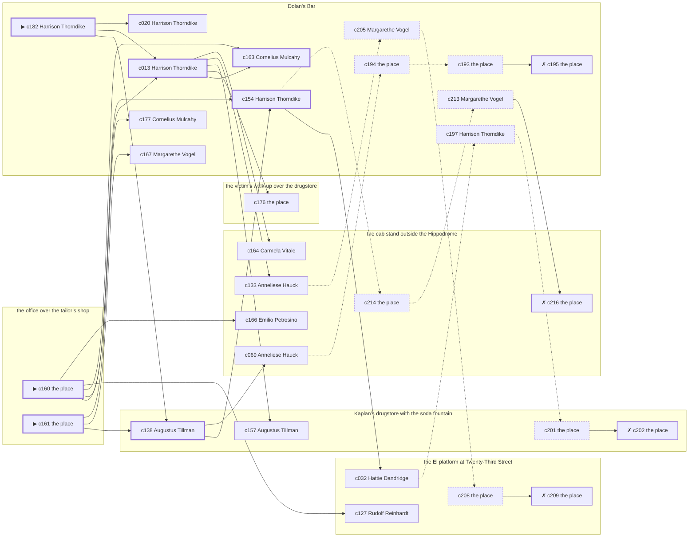

# Yorkville — case 10

**Seed** 10 · **Difficulty** 2 · **Attempts** 1 · **Detective** Humphrey

**Par** 6 actions · **Budget** 20 · **Slack** 14 · **Findable** 30 (spine 7, corroboration 11, noise 8 + 4 disqualifiers) · **Noise ratio** 40% · **Candidate pool** 217

## 1. The Truth

Hattie Dandridge, a switchboard operator, the victim’s former employee, killed Alonzo Ashby, a pawnbroker, with strangling with a cord at the office over the tailor’s shop at 11:00 PM. Hattie Dandridge was about to be exposed by the victim (exposure). Hattie Dandridge had been at the victim’s walk-up over the drugstore earlier in the evening, where the weapon lived, and was alone with Alonzo Ashby when it happened. Harrison Thorndike hired us.

## 2. Dramatis Personae

| Name | Role | Relationship | Class of secret | Motive | Found at | Killer |
| --- | --- | --- | --- | --- | --- | --- |
| Alonzo Ashby | a pawnbroker | the victim | — | — | — | — |
| Cornelius Mulcahy | the victim’s nephew, at loose ends | the victim’s brother-in-law | dope | — | Dolan’s Bar | — |
| Harrison Thorndike (client) | a stringer for the evening papers | a witness against the people the victim worked for | gambling-debt | — | Dolan’s Bar | — |
| Carmela Vitale | a widow with rooms on the avenue | the victim’s cousin | hidden-family | inheritance | the cab stand outside the Hippodrome | — |
| Hattie Dandridge | a switchboard operator | the victim’s former employee | murder | exposure | the El platform at Twenty-Third Street | **YES** |
| Rudolf Reinhardt | a bookmaker in a small way | in the victim’s debt | forged-identity | revenge | the El platform at Twenty-Third Street | — |
| Anneliese Hauck | a bookkeeper | the victim’s former employee | gambling-debt | debt | the cab stand outside the Hippodrome | — |
| Emilio Petrosino | the hackman on the stand | fixture (cabbie) | — | — | the cab stand outside the Hippodrome | — |
| Augustus Tillman | the druggist | fixture (druggist) | — | — | Kaplan’s drugstore with the soda fountain | — |
| Margarethe Vogel | the bartender | fixture (bartender) | — | — | Dolan’s Bar | — |
| Pasquale Moretti | the patrolman on the beat | fixture (beat-cop) | — | — | the El platform at Twenty-Third Street | — |

## 3. Places

- **the office over the tailor’s shop** (private) — unwatched; objects: a japanned cash box, a bronze bookend — **THE SCENE**
- **the cab stand outside the Hippodrome** (public) — watched by cabbie (Emilio Petrosino); objects: a nickel-plated revolver, a pasted-up timetable
- **Kaplan’s drugstore with the soda fountain** (public) — watched by druggist (Augustus Tillman); objects: an ice pick, a bottle of chloral drops
- **the El platform at Twenty-Third Street** (public) — unwatched; objects: a folded stack of evening papers — within earshot of the scene
- **the victim’s walk-up over the drugstore** (private) — unwatched; objects: a length of sash cord, a stack of hatboxes, a strapped suitcase — the victim’s address; where the weapon lived
- **Dolan’s Bar** (semi) — watched by bartender (Margarethe Vogel); objects: a seltzer siphon, a silver cigarette case — within earshot of the scene

## 4. Anchors

The coroner gives 9:30 PM–11:00 PM, four ticks wide. These are what close it: **ice-delivery** and **last-edition**.

- **the last edition coming off the truck** — at 10:30 PM; at the cab stand outside the Hippodrome. Somebody reliable notes who was there. Those present carry it: ink still wet enough to come off on a glove.
- **the ice being brought in** — at 11:00 PM; at Dolan’s Bar. Somebody reliable notes who was there. Those present carry it: a wet patch down one side of a coat.
- **the beat cop’s pass** — at 7:00 PM, 8:30 PM, 10:00 PM, 11:30 PM; on a round through the El platform at Twenty-Third Street → Kaplan’s drugstore with the soda fountain → Dolan’s Bar → the cab stand outside the Hippodrome. Somebody reliable notes who was there.

## 5. Timelines

### Alonzo Ashby — the victim

| Tick | Time | Truth | Claimed | Companion claimed |
| --- | --- | --- | --- | --- |
| 0 | 6:00 PM | the El platform at Twenty-Third Street | the El platform at Twenty-Third Street | — |
| 1 | 6:30 PM | the victim’s walk-up over the drugstore | the victim’s walk-up over the drugstore | — |
| 2 | 7:00 PM | the victim’s walk-up over the drugstore | the victim’s walk-up over the drugstore | — |
| 3 | 7:30 PM | the victim’s walk-up over the drugstore | the victim’s walk-up over the drugstore | — |
| 4 | 8:00 PM | the victim’s walk-up over the drugstore | the victim’s walk-up over the drugstore | — |
| 5 | 8:30 PM | the victim’s walk-up over the drugstore | the victim’s walk-up over the drugstore | — |
| 6 | 9:00 PM | the El platform at Twenty-Third Street | the El platform at Twenty-Third Street | — |
| 7 | 9:30 PM | the El platform at Twenty-Third Street | the El platform at Twenty-Third Street | — |
| 8 | 10:00 PM | the cab stand outside the Hippodrome | the cab stand outside the Hippodrome | — |
| 9 | 10:30 PM | the cab stand outside the Hippodrome | the cab stand outside the Hippodrome | — |
| 10 | 11:00 PM | the office over the tailor’s shop ☠ | the office over the tailor’s shop | — |
| 11 | 11:30 PM | — | — | — |

### Cornelius Mulcahy

| Tick | Time | Truth | Claimed | Companion claimed |
| --- | --- | --- | --- | --- |
| 0 | 6:00 PM | Dolan’s Bar | Dolan’s Bar | — |
| 1 | 6:30 PM | Dolan’s Bar | Dolan’s Bar | — |
| 2 | 7:00 PM | Dolan’s Bar | Dolan’s Bar | — |
| 3 | 7:30 PM | Dolan’s Bar | Dolan’s Bar | — |
| 4 | 8:00 PM | Dolan’s Bar | Dolan’s Bar | — |
| 5 | 8:30 PM | Dolan’s Bar | Dolan’s Bar | — |
| 6 | 9:00 PM | the office over the tailor’s shop | the office over the tailor’s shop | — |
| 7 | 9:30 PM | the office over the tailor’s shop | the office over the tailor’s shop | — |
| 8 | 10:00 PM | the El platform at Twenty-Third Street | the El platform at Twenty-Third Street | — |
| 9 | 10:30 PM | the cab stand outside the Hippodrome | the cab stand outside the Hippodrome | — |
| 10 | 11:00 PM | Kaplan’s drugstore with the soda fountain | **the cab stand outside the Hippodrome** | — |
| 11 | 11:30 PM | Kaplan’s drugstore with the soda fountain | **the cab stand outside the Hippodrome** | — |

### Harrison Thorndike

| Tick | Time | Truth | Claimed | Companion claimed |
| --- | --- | --- | --- | --- |
| 0 | 6:00 PM | Dolan’s Bar | Dolan’s Bar | — |
| 1 | 6:30 PM | Dolan’s Bar | Dolan’s Bar | — |
| 2 | 7:00 PM | Dolan’s Bar | Dolan’s Bar | — |
| 3 | 7:30 PM | Dolan’s Bar | Dolan’s Bar | — |
| 4 | 8:00 PM | Dolan’s Bar | Dolan’s Bar | — |
| 5 | 8:30 PM | the El platform at Twenty-Third Street | the El platform at Twenty-Third Street | — |
| 6 | 9:00 PM | the victim’s walk-up over the drugstore | the victim’s walk-up over the drugstore | — |
| 7 | 9:30 PM | Dolan’s Bar | Dolan’s Bar | — |
| 8 | 10:00 PM | Dolan’s Bar | **the cab stand outside the Hippodrome** | Rudolf Reinhardt |
| 9 | 10:30 PM | Dolan’s Bar | Dolan’s Bar | — |
| 10 | 11:00 PM | Kaplan’s drugstore with the soda fountain | Kaplan’s drugstore with the soda fountain | — |
| 11 | 11:30 PM | the cab stand outside the Hippodrome | the cab stand outside the Hippodrome | — |

### Carmela Vitale

| Tick | Time | Truth | Claimed | Companion claimed |
| --- | --- | --- | --- | --- |
| 0 | 6:00 PM | Dolan’s Bar | Dolan’s Bar | — |
| 1 | 6:30 PM | Dolan’s Bar | Dolan’s Bar | — |
| 2 | 7:00 PM | Dolan’s Bar | Dolan’s Bar | — |
| 3 | 7:30 PM | the El platform at Twenty-Third Street | the El platform at Twenty-Third Street | — |
| 4 | 8:00 PM | the El platform at Twenty-Third Street | the El platform at Twenty-Third Street | — |
| 5 | 8:30 PM | the victim’s walk-up over the drugstore | the victim’s walk-up over the drugstore | — |
| 6 | 9:00 PM | the cab stand outside the Hippodrome | the cab stand outside the Hippodrome | — |
| 7 | 9:30 PM | the cab stand outside the Hippodrome | the cab stand outside the Hippodrome | — |
| 8 | 10:00 PM | the cab stand outside the Hippodrome | the cab stand outside the Hippodrome | — |
| 9 | 10:30 PM | the cab stand outside the Hippodrome | the cab stand outside the Hippodrome | — |
| 10 | 11:00 PM | Kaplan’s drugstore with the soda fountain | **Dolan’s Bar** | — |
| 11 | 11:30 PM | Kaplan’s drugstore with the soda fountain | **Dolan’s Bar** | — |

### Hattie Dandridge — the killer

| Tick | Time | Truth | Claimed | Companion claimed |
| --- | --- | --- | --- | --- |
| 0 | 6:00 PM | the El platform at Twenty-Third Street | the El platform at Twenty-Third Street | — |
| 1 | 6:30 PM | the El platform at Twenty-Third Street | the El platform at Twenty-Third Street | — |
| 2 | 7:00 PM | the El platform at Twenty-Third Street | the El platform at Twenty-Third Street | — |
| 3 | 7:30 PM | the El platform at Twenty-Third Street | the El platform at Twenty-Third Street | — |
| 4 | 8:00 PM | the El platform at Twenty-Third Street | the El platform at Twenty-Third Street | — |
| 5 | 8:30 PM | Dolan’s Bar | Dolan’s Bar | — |
| 6 | 9:00 PM | the victim’s walk-up over the drugstore | the victim’s walk-up over the drugstore | — |
| 7 | 9:30 PM | the cab stand outside the Hippodrome | the cab stand outside the Hippodrome | — |
| 8 | 10:00 PM | the office over the tailor’s shop | **Kaplan’s drugstore with the soda fountain** | Carmela Vitale |
| 9 | 10:30 PM | the office over the tailor’s shop | **Kaplan’s drugstore with the soda fountain** | Carmela Vitale |
| 10 | 11:00 PM | the office over the tailor’s shop ☠ | **Kaplan’s drugstore with the soda fountain** | Carmela Vitale |
| 11 | 11:30 PM | Kaplan’s drugstore with the soda fountain | Kaplan’s drugstore with the soda fountain | — |

### Rudolf Reinhardt

| Tick | Time | Truth | Claimed | Companion claimed |
| --- | --- | --- | --- | --- |
| 0 | 6:00 PM | the El platform at Twenty-Third Street | the El platform at Twenty-Third Street | — |
| 1 | 6:30 PM | the victim’s walk-up over the drugstore | the victim’s walk-up over the drugstore | — |
| 2 | 7:00 PM | the victim’s walk-up over the drugstore | the victim’s walk-up over the drugstore | — |
| 3 | 7:30 PM | Dolan’s Bar | Dolan’s Bar | — |
| 4 | 8:00 PM | Dolan’s Bar | Dolan’s Bar | — |
| 5 | 8:30 PM | the office over the tailor’s shop | the office over the tailor’s shop | — |
| 6 | 9:00 PM | the victim’s walk-up over the drugstore | the victim’s walk-up over the drugstore | — |
| 7 | 9:30 PM | the victim’s walk-up over the drugstore | the victim’s walk-up over the drugstore | — |
| 8 | 10:00 PM | the victim’s walk-up over the drugstore | the victim’s walk-up over the drugstore | — |
| 9 | 10:30 PM | the El platform at Twenty-Third Street | the El platform at Twenty-Third Street | — |
| 10 | 11:00 PM | Kaplan’s drugstore with the soda fountain | Kaplan’s drugstore with the soda fountain | — |
| 11 | 11:30 PM | Kaplan’s drugstore with the soda fountain | Kaplan’s drugstore with the soda fountain | — |

### Anneliese Hauck

| Tick | Time | Truth | Claimed | Companion claimed |
| --- | --- | --- | --- | --- |
| 0 | 6:00 PM | the El platform at Twenty-Third Street | the El platform at Twenty-Third Street | — |
| 1 | 6:30 PM | the cab stand outside the Hippodrome | **Kaplan’s drugstore with the soda fountain** | — |
| 2 | 7:00 PM | the cab stand outside the Hippodrome | **Kaplan’s drugstore with the soda fountain** | — |
| 3 | 7:30 PM | Dolan’s Bar | Dolan’s Bar | — |
| 4 | 8:00 PM | the victim’s walk-up over the drugstore | the victim’s walk-up over the drugstore | — |
| 5 | 8:30 PM | the El platform at Twenty-Third Street | the El platform at Twenty-Third Street | — |
| 6 | 9:00 PM | the victim’s walk-up over the drugstore | the victim’s walk-up over the drugstore | — |
| 7 | 9:30 PM | the victim’s walk-up over the drugstore | the victim’s walk-up over the drugstore | — |
| 8 | 10:00 PM | the cab stand outside the Hippodrome | the cab stand outside the Hippodrome | — |
| 9 | 10:30 PM | the cab stand outside the Hippodrome | the cab stand outside the Hippodrome | — |
| 10 | 11:00 PM | Kaplan’s drugstore with the soda fountain | Kaplan’s drugstore with the soda fountain | — |
| 11 | 11:30 PM | the El platform at Twenty-Third Street | the El platform at Twenty-Third Street | — |

### Fixtures (never lie, never withhold)

| Tick | Time | Emilio Petrosino (the hackman on the stand) | Augustus Tillman (the druggist) | Margarethe Vogel (the bartender) | Pasquale Moretti (the patrolman on the beat) |
| --- | --- | --- | --- | --- | --- |
| 0 | 6:00 PM | the cab stand outside the Hippodrome | Kaplan’s drugstore with the soda fountain | Dolan’s Bar | — |
| 1 | 6:30 PM | the cab stand outside the Hippodrome | Kaplan’s drugstore with the soda fountain | Dolan’s Bar | — |
| 2 | 7:00 PM | the cab stand outside the Hippodrome | Kaplan’s drugstore with the soda fountain | Dolan’s Bar | the El platform at Twenty-Third Street |
| 3 | 7:30 PM | the cab stand outside the Hippodrome | Dolan’s Bar | Dolan’s Bar | — |
| 4 | 8:00 PM | the cab stand outside the Hippodrome | Kaplan’s drugstore with the soda fountain | Dolan’s Bar | — |
| 5 | 8:30 PM | the cab stand outside the Hippodrome | Kaplan’s drugstore with the soda fountain | Dolan’s Bar | Kaplan’s drugstore with the soda fountain |
| 6 | 9:00 PM | the cab stand outside the Hippodrome | Kaplan’s drugstore with the soda fountain | Dolan’s Bar | — |
| 7 | 9:30 PM | the cab stand outside the Hippodrome | Kaplan’s drugstore with the soda fountain | Dolan’s Bar | — |
| 8 | 10:00 PM | the cab stand outside the Hippodrome | Kaplan’s drugstore with the soda fountain | the El platform at Twenty-Third Street | Dolan’s Bar |
| 9 | 10:30 PM | the cab stand outside the Hippodrome | Kaplan’s drugstore with the soda fountain | Dolan’s Bar | — |
| 10 | 11:00 PM | the cab stand outside the Hippodrome | Kaplan’s drugstore with the soda fountain | Dolan’s Bar | — |
| 11 | 11:30 PM | the cab stand outside the Hippodrome | Kaplan’s drugstore with the soda fountain | Dolan’s Bar | the cab stand outside the Hippodrome |

## 6. Secrets in play

- **Cornelius Mulcahy** (dope): Cornelius Mulcahy buys morphine at Kaplan’s drugstore with the soda fountain from 11:00 PM to 11:30 PM and would rather be thought a murderer than a hop-head.
- **Harrison Thorndike** (gambling-debt): Harrison Thorndike slips off to Dolan’s Bar from 10:00 PM to settle with a bookmaker.
- **Carmela Vitale** (hidden-family): Carmela Vitale goes to Kaplan’s drugstore with the soda fountain from 11:00 PM to 11:30 PM to see a child nobody is supposed to know about.
- **Hattie Dandridge** (murder): Hattie Dandridge is at the office over the tailor’s shop from 10:00 PM to 11:00 PM, alone with Alonzo Ashby when it happens at 11:00 PM.
- **Rudolf Reinhardt** (forged-identity): Rudolf Reinhardt is not the person the papers say. Nothing about the evening is hidden; the lie is all in the paperwork.
- **Anneliese Hauck** (gambling-debt): Anneliese Hauck slips off to the cab stand outside the Hippodrome from 6:30 PM to 7:00 PM to settle with a bookmaker.

## 7. Clue list — the 30 findable

The opening three, free at the start: c160, c161, c182. Everything else has to be led to. The full candidate pool is in the companion file.

### At the office over the tailor’s shop

- **c160** [spine ⟨opening⟩] (scene; the place itself) → c013, c154, c163, c127, c166
  - Alonzo Ashby was found at the office over the tailor’s shop. His watch glass broke against the floor and the hands have not moved since. The ice being brought in came at 11:00 PM, and the iceman’s book has the delivery timed and signed for. That puts the killing in that half hour and no later.
  - _establishes: the victim dead by 11:00 PM; how it was done_
- **c161** [spine ⟨opening⟩] (morgue; the place itself) → c138, c167, c177
  - The coroner puts death between 9:30 PM and 11:00 PM — two hours of nothing useful. A ligature furrow across the throat. Three fibres of hemp in the skin.
  - _establishes: death between 9:30 PM and 11:00 PM; how it was done_

### At the cab stand outside the Hippodrome

- **c069** [corroboration] (observation; Anneliese Hauck on Hattie Dandridge) → c194
  - Anneliese Hauck says Hattie Dandridge was at the victim’s walk-up over the drugstore at 9:00 PM.
  - _establishes: Hattie Dandridge at the victim’s walk-up over the drugstore, 9:00 PM; Hattie Dandridge could reach the weapon_
- **c133** [corroboration] (observation; Anneliese Hauck on who was there at 11:00 PM) → c205
  - Anneliese Hauck runs through it: at 11:00 PM there were Cornelius Mulcahy, Harrison Thorndike, Carmela Vitale, Rudolf Reinhardt at Kaplan’s drugstore with the soda fountain, and nobody else worth naming.
  - _establishes: Cornelius Mulcahy at Kaplan’s drugstore with the soda fountain, 11:00 PM; Harrison Thorndike at Kaplan’s drugstore with the soda fountain, 11:00 PM; Carmela Vitale at Kaplan’s drugstore with the soda fountain, 11:00 PM; Rudolf Reinhardt at Kaplan’s drugstore with the soda fountain, 11:00 PM_
- **c166** [corroboration] (anchor; Emilio Petrosino on Alonzo Ashby that evening) → (end)
  - Emilio Petrosino puts Alonzo Ashby at the cab stand outside the Hippodrome when the last edition came up, which was 10:30 PM, and alive enough to argue about the weather.
  - _establishes: the victim alive at 10:30 PM; Alonzo Ashby at the cab stand outside the Hippodrome, 10:30 PM_
- **c164** [corroboration] (anchor; Carmela Vitale on Alonzo Ashby that evening) → (end)
  - Carmela Vitale puts Alonzo Ashby at the cab stand outside the Hippodrome when the last edition came up, which was 10:30 PM, and alive enough to argue about the weather.
  - _establishes: the victim alive at 10:30 PM; Alonzo Ashby at the cab stand outside the Hippodrome, 10:30 PM_
- **c214** [noise {b3}] (physical; the place itself) → c213
  - Betting slips at the cab stand outside the Hippodrome in Anneliese Hauck’s pocketbook, all of them losers, all of them this month.
  - _establishes: context only_
- **c216** [disqualifier {b3}] (overheard; the place itself) → (end)
  - The bookmaker’s runner is found and will say it: Anneliese Hauck was at the cab stand outside the Hippodrome from 6:30 PM to 7:00 PM paying off eleven hundred dollars, a dollar at a time, and went nowhere near the killing.
  - _establishes: Anneliese Hauck’s gambling-debt accounted for; Anneliese Hauck at the cab stand outside the Hippodrome, 6:30 PM–7:00 PM_

### At Kaplan’s drugstore with the soda fountain

- **c138** [spine] (observation; Augustus Tillman on who was there at 11:00 PM) → c154, c069
  - Augustus Tillman runs through it: at 11:00 PM there were Cornelius Mulcahy, Harrison Thorndike, Carmela Vitale, Rudolf Reinhardt, Anneliese Hauck at Kaplan’s drugstore with the soda fountain, and nobody else worth naming.
  - _establishes: Cornelius Mulcahy at Kaplan’s drugstore with the soda fountain, 11:00 PM; Harrison Thorndike at Kaplan’s drugstore with the soda fountain, 11:00 PM; Carmela Vitale at Kaplan’s drugstore with the soda fountain, 11:00 PM; Rudolf Reinhardt at Kaplan’s drugstore with the soda fountain, 11:00 PM; Anneliese Hauck at Kaplan’s drugstore with the soda fountain, 11:00 PM_
- **c157** [corroboration] (observation; Augustus Tillman on Hattie Dandridge’s account) → (end)
  - Augustus Tillman was at Kaplan’s drugstore with the soda fountain from 10:00 PM to 11:00 PM and says Hattie Dandridge was not.
  - _establishes: Hattie Dandridge not at Kaplan’s drugstore with the soda fountain, 10:00 PM–11:00 PM_
- **c201** [noise {b1}] (physical; the place itself) → c202
  - A child’s shoe at Kaplan’s drugstore with the soda fountain, and nobody at Kaplan’s drugstore with the soda fountain has any children.
  - _establishes: context only_
- **c202** [disqualifier {b1}] (overheard; the place itself) → (end)
  - The woman who keeps the child says it straight out: Carmela Vitale was at Kaplan’s drugstore with the soda fountain from 11:00 PM to 11:30 PM, the same as every week, and left with the same face as always.
  - _establishes: Carmela Vitale’s hidden-family accounted for; Carmela Vitale at Kaplan’s drugstore with the soda fountain, 11:00 PM–11:30 PM_

### At the El platform at Twenty-Third Street

- **c127** [corroboration] (observation; Rudolf Reinhardt on who was there at 11:00 PM) → (end)
  - Rudolf Reinhardt runs through it: at 11:00 PM there were Cornelius Mulcahy, Harrison Thorndike, Carmela Vitale, Anneliese Hauck at Kaplan’s drugstore with the soda fountain, and nobody else worth naming.
  - _establishes: Cornelius Mulcahy at Kaplan’s drugstore with the soda fountain, 11:00 PM; Harrison Thorndike at Kaplan’s drugstore with the soda fountain, 11:00 PM; Carmela Vitale at Kaplan’s drugstore with the soda fountain, 11:00 PM; Anneliese Hauck at Kaplan’s drugstore with the soda fountain, 11:00 PM_
- **c032** [corroboration] (observation; Hattie Dandridge on Harrison Thorndike) → c197
  - Hattie Dandridge says Harrison Thorndike was at the victim’s walk-up over the drugstore at 9:00 PM.
  - _establishes: Harrison Thorndike at the victim’s walk-up over the drugstore, 9:00 PM; Harrison Thorndike could reach the weapon_
- **c208** [noise {b2}] (physical; the place itself) → c209
  - A steamship ticket stub among Rudolf Reinhardt’s things, in the name of a man who died at Belleau Wood.
  - _establishes: context only_
- **c209** [disqualifier {b2}] (overheard; the place itself) → (end)
  - The name Rudolf Reinhardt was born with turns up on a desertion warrant from 1918. Rudolf Reinhardt has been hiding from the Army for eleven years and from nobody else.
  - _establishes: Rudolf Reinhardt’s forged-identity accounted for_

### At the victim’s walk-up over the drugstore

- **c176** [corroboration] (document; the place itself) → (end)
  - Found at the victim’s walk-up over the drugstore: A typed page of dates and sums in Alonzo Ashby’s file, headed with Hattie Dandridge’s name.
  - _establishes: Hattie Dandridge had a motive (exposure)_

### At Dolan’s Bar

- **c182** [spine ⟨opening⟩] (client; Harrison Thorndike on why I was hired) → c138, c013, c020
  - Harrison Thorndike hired us. Harrison Thorndike wants it known that Hattie Dandridge was about to be exposed by the victim, and would rather we started there.
  - _establishes: Hattie Dandridge had a motive (exposure)_
- **c013** [spine] (observation; Harrison Thorndike on Hattie Dandridge) → c163, c176, c157, c133, c164
  - Harrison Thorndike says Hattie Dandridge was at the victim’s walk-up over the drugstore at 9:00 PM.
  - _establishes: Hattie Dandridge at the victim’s walk-up over the drugstore, 9:00 PM; Hattie Dandridge could reach the weapon_
- **c154** [spine] (observation; Harrison Thorndike on Hattie Dandridge’s account) → c032, c214
  - Harrison Thorndike was at Kaplan’s drugstore with the soda fountain at 11:00 PM and says Hattie Dandridge was not.
  - _establishes: Hattie Dandridge not at Kaplan’s drugstore with the soda fountain, 11:00 PM_
- **c163** [spine] (anchor; Cornelius Mulcahy on Alonzo Ashby that evening) → (end)
  - Cornelius Mulcahy puts Alonzo Ashby at the cab stand outside the Hippodrome when the last edition came up, which was 10:30 PM, and alive enough to argue about the weather.
  - _establishes: the victim alive at 10:30 PM; Alonzo Ashby at the cab stand outside the Hippodrome, 10:30 PM_
- **c167** [corroboration] (anchor; Margarethe Vogel on the noise that evening) → (end)
  - Margarethe Vogel was at Dolan’s Bar at 11:00 PM and heard a scuffle and a chair dragging from the direction of the office over the tailor’s shop, when the ice came.
  - _establishes: noise at the office over the tailor’s shop at 11:00 PM; the victim dead by 11:00 PM; how it was done_
- **c177** [corroboration] (overheard; Cornelius Mulcahy on Hattie Dandridge and Alonzo Ashby) → (end)
  - Cornelius Mulcahy says Alonzo Ashby told Hattie Dandridge that the story would run whether Hattie Dandridge liked it or not.
  - _establishes: Hattie Dandridge had a motive (exposure)_
- **c020** [corroboration] (observation; Harrison Thorndike on Anneliese Hauck) → (end)
  - Harrison Thorndike says Anneliese Hauck was at Kaplan’s drugstore with the soda fountain at 11:00 PM.
  - _establishes: Anneliese Hauck at Kaplan’s drugstore with the soda fountain, 11:00 PM_
- **c197** [noise {b1}] (overheard; Harrison Thorndike on Carmela Vitale) → c201
  - Harrison Thorndike on Carmela Vitale: Carmela Vitale sends money out of every pay envelope and cannot say where it goes.
  - _establishes: context only_
- **c205** [noise {b2}] (overheard; Margarethe Vogel on Rudolf Reinhardt) → c208
  - Margarethe Vogel on Rudolf Reinhardt: Two signatures of Rudolf Reinhardt’s, a month apart, are in different hands.
  - _establishes: context only_
- **c213** [noise {b3}] (overheard; Margarethe Vogel on Anneliese Hauck) → c216
  - Margarethe Vogel on Anneliese Hauck: Anneliese Hauck goes very quiet when the racing wire is mentioned.
  - _establishes: context only_
- **c194** [noise {b4}] (physical; the place itself) → c193
  - A book of markers at Dolan’s Bar with Harrison Thorndike’s initials against four of them.
  - _establishes: context only_
- **c193** [noise {b4}] (physical; the place itself) → c195
  - Betting slips at Dolan’s Bar in Harrison Thorndike’s pocketbook, all of them losers, all of them this month.
  - _establishes: context only_
- **c195** [disqualifier {b4}] (overheard; the place itself) → (end)
  - The bookmaker’s runner is found and will say it: Harrison Thorndike was at Dolan’s Bar from 10:00 PM paying off eleven hundred dollars, a dollar at a time, and went nowhere near the killing.
  - _establishes: Harrison Thorndike’s gambling-debt accounted for; Harrison Thorndike at Dolan’s Bar, 10:00 PM_

## 8. Clue graph

## 9. Deduction path

Par is **6 actions** against a budget of 20: 14 spare. Every id below is a spine clue.

**Time of death.** The coroner gives four ticks. The anchors close it to 11:00 PM: one puts Alonzo Ashby alive at 10:30 PM, the other times the scene at 11:00 PM. _(c161, c163, c160; + 3 corroborating)_

**Clearing the innocent.**

- Cornelius Mulcahy was not at the office over the tailor’s shop at 11:00 PM, on two independent sources. _(c138; + 2 corroborating)_
- Harrison Thorndike was not at the office over the tailor’s shop at 11:00 PM, on two independent sources. _(c138; + 2 corroborating)_
- Carmela Vitale was not at the office over the tailor’s shop at 11:00 PM, on two independent sources. _(c138; + 3 corroborating)_
- Rudolf Reinhardt was not at the office over the tailor’s shop at 11:00 PM, on two independent sources. _(c138; + 1 corroborating)_
- Anneliese Hauck was not at the office over the tailor’s shop at 11:00 PM, on two independent sources. _(c138; + 2 corroborating)_

**Naming the killer.** Hattie Dandridge claims Kaplan’s drugstore with the soda fountain at 11:00 PM. Two independent sources put that out of the question. _(c154; + 1 corroborating)_

**The weapon.** Hattie Dandridge was at the victim’s walk-up over the drugstore before 11:00 PM, where a length of sash cord was kept. _(c013; + 1 corroborating)_

**Method.** Strangling with a cord, on two physical sources. _(c160, c161; + 1 corroborating)_

**Motive.** exposure, on two independent sources. _(c182; + 2 corroborating)_

## 10. Red herrings

**Innocents who lie about the murder tick:**

- Cornelius Mulcahy claims the cab stand outside the Hippodrome at 11:00 PM and was really at Kaplan’s drugstore with the soda fountain. Reason: Cornelius Mulcahy buys morphine at Kaplan’s drugstore with the soda fountain from 11:00 PM to 11:30 PM and would rather be thought a murderer than a hop-head.
- Carmela Vitale claims Dolan’s Bar at 11:00 PM and was really at Kaplan’s drugstore with the soda fountain. Reason: Carmela Vitale goes to Kaplan’s drugstore with the soda fountain from 11:00 PM to 11:30 PM to see a child nobody is supposed to know about.

**Innocents with a motive:**

- Carmela Vitale — inheritance: stands to inherit.
- Rudolf Reinhardt — revenge: blamed the victim for a ruin.
- Anneliese Hauck — debt: owed the victim money.

**Noise branches, and what knocks each one down:**

- **b1** (Carmela Vitale, hidden-family): c197 → c201 → **c202** — The woman who keeps the child says it straight out: Carmela Vitale was at Kaplan’s drugstore with the soda fountain from 11:00 PM to 11:30 PM, the same as every week, and left with the same face as always.
- **b2** (Rudolf Reinhardt, forged-identity): c205 → c208 → **c209** — The name Rudolf Reinhardt was born with turns up on a desertion warrant from 1918. Rudolf Reinhardt has been hiding from the Army for eleven years and from nobody else.
- **b3** (Anneliese Hauck, gambling-debt): c214 → c213 → **c216** — The bookmaker’s runner is found and will say it: Anneliese Hauck was at the cab stand outside the Hippodrome from 6:30 PM to 7:00 PM paying off eleven hundred dollars, a dollar at a time, and went nowhere near the killing.
- **b4** (Harrison Thorndike, gambling-debt): c194 → c193 → **c195** — The bookmaker’s runner is found and will say it: Harrison Thorndike was at Dolan’s Bar from 10:00 PM paying off eleven hundred dollars, a dollar at a time, and went nowhere near the killing.

