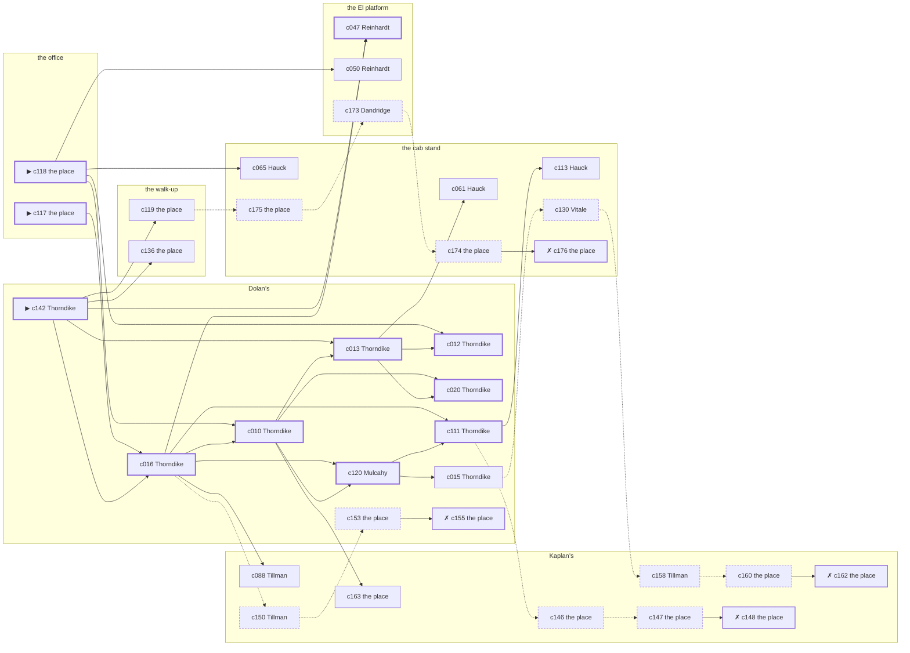

# Yorkville — case 10

**Seed** 10 · **Difficulty** 2 · **Attempts** 1 · **Detective** Dashiell

**Par** 10 actions · **Slack** 6 · **Budget** 16 · **Findable** 34 (spine 11, corroboration 9, noise 10 + 4 disqualifiers) · **Noise ratio** 41% · **Candidate pool** 177

## 1. The Truth

Hattie Dandridge, a switchboard operator, the victim’s former employee, killed Alonzo Ashby, a pawnbroker, with strangling with a cord at the office at 11:00 PM. Dandridge was about to be exposed by the victim (exposure). Dandridge had been at the walk-up earlier in the evening, where the weapon lived, and was alone with Ashby when it happened. Thorndike hired us.

## 2. Dramatis Personae

| Name | Role | Relationship | Class of secret | Motive | Found at | Killer |
| --- | --- | --- | --- | --- | --- | --- |
| Alonzo Ashby | a pawnbroker | the victim | — | — | — | — |
| Cornelius Mulcahy | a young man living on expectations | the victim’s brother-in-law | dope | — | Dolan’s | — |
| Harrison Thorndike (client) | a stringer for the evening papers | a witness against the people the victim worked for | gambling-debt | — | Dolan’s | — |
| Carmela Vitale | a widow with rooms on the avenue | the victim’s neighbour across the airshaft | hidden-family | jealousy | the cab stand | — |
| Hattie Dandridge | a switchboard operator | the victim’s former employee | murder | exposure | the El platform | **YES** |
| Rudolf Reinhardt | a bookmaker in a small way | in the victim’s debt | forged-identity | revenge | the El platform | — |
| Anneliese Hauck | a bookkeeper | the victim’s former employee | gambling-debt | debt | the cab stand | — |
| Emilio Petrosino | the hackman on the stand | fixture (cabbie) | — | — | the cab stand | — |
| Augustus Tillman | the druggist | fixture (druggist) | — | — | Kaplan’s | — |
| Margarethe Vogel | the bartender | fixture (bartender) | — | — | Dolan’s | — |
| Pasquale Moretti | the patrolman on the beat | fixture (beat-cop) | — | — | the El platform | — |

## 3. Places

- **the office over the tailor’s shop** (private) — unwatched; objects: a japanned cash box, a bronze bookend — **THE SCENE**
- **the cab stand outside the Hippodrome** (public) — watched by cabbie (Petrosino); objects: a nickel-plated revolver, a pasted-up timetable
- **Kaplan’s drugstore with the soda fountain** (public) — watched by druggist (Tillman); objects: an ice pick, a bottle of chloral drops
- **the El platform at Twenty-Third Street** (public) — unwatched; objects: a folded stack of evening papers — within earshot of the scene
- **the victim’s walk-up over the drugstore** (private) — unwatched; objects: a length of sash cord, a stack of hatboxes, a strapped suitcase — the victim’s address; where the weapon lived
- **Dolan’s Bar** (semi) — watched by bartender (Vogel); objects: a seltzer siphon, a silver cigarette case — within earshot of the scene

## 4. Anchors

The coroner gives 9:30 PM–11:00 PM, four ticks wide. These are what close it: **ice-delivery** and **last-edition**.

- **the last edition coming off the truck** — at 10:30 PM; at the cab stand. Somebody reliable notes who was there. Only those present know that the late edition led with the bridge contract and not the hold-up. Those present carry it: ink still wet enough to come off on a glove.
- **the ice being brought in** — at 11:00 PM; at Dolan’s. Somebody reliable notes who was there. Only those present know that the iceman dropped a block on the step and it went in three. Those present carry it: a wet patch down one side of a coat.
- **the beat cop’s pass** — at 7:00 PM, 8:30 PM, 10:00 PM, 11:30 PM; on a round through the El platform → Kaplan’s → Dolan’s → the cab stand. Somebody reliable notes who was there.

## 5. Timelines

### Ashby — the victim

| Tick | Time | Truth | Claimed | Companion claimed |
| --- | --- | --- | --- | --- |
| 0 | 6:00 PM | the El platform | the El platform | — |
| 1 | 6:30 PM | the walk-up | the walk-up | — |
| 2 | 7:00 PM | the walk-up | the walk-up | — |
| 3 | 7:30 PM | the walk-up | the walk-up | — |
| 4 | 8:00 PM | the walk-up | the walk-up | — |
| 5 | 8:30 PM | the walk-up | the walk-up | — |
| 6 | 9:00 PM | the El platform | the El platform | — |
| 7 | 9:30 PM | the El platform | the El platform | — |
| 8 | 10:00 PM | the cab stand | the cab stand | — |
| 9 | 10:30 PM | the cab stand | the cab stand | — |
| 10 | 11:00 PM | the office ☠ | the office | — |
| 11 | 11:30 PM | — | — | — |

### Mulcahy

| Tick | Time | Truth | Claimed | Companion claimed |
| --- | --- | --- | --- | --- |
| 0 | 6:00 PM | Dolan’s | Dolan’s | — |
| 1 | 6:30 PM | Dolan’s | Dolan’s | — |
| 2 | 7:00 PM | Dolan’s | Dolan’s | — |
| 3 | 7:30 PM | Dolan’s | Dolan’s | — |
| 4 | 8:00 PM | Dolan’s | Dolan’s | — |
| 5 | 8:30 PM | Dolan’s | Dolan’s | — |
| 6 | 9:00 PM | the office | the office | — |
| 7 | 9:30 PM | the office | the office | — |
| 8 | 10:00 PM | the El platform | the El platform | — |
| 9 | 10:30 PM | the cab stand | the cab stand | — |
| 10 | 11:00 PM | Kaplan’s | **the cab stand** | — |
| 11 | 11:30 PM | Kaplan’s | **the cab stand** | — |

### Thorndike

| Tick | Time | Truth | Claimed | Companion claimed |
| --- | --- | --- | --- | --- |
| 0 | 6:00 PM | Dolan’s | Dolan’s | — |
| 1 | 6:30 PM | Dolan’s | Dolan’s | — |
| 2 | 7:00 PM | Dolan’s | Dolan’s | — |
| 3 | 7:30 PM | Dolan’s | Dolan’s | — |
| 4 | 8:00 PM | Dolan’s | Dolan’s | — |
| 5 | 8:30 PM | the El platform | the El platform | — |
| 6 | 9:00 PM | the walk-up | the walk-up | — |
| 7 | 9:30 PM | Dolan’s | Dolan’s | — |
| 8 | 10:00 PM | Dolan’s | **the cab stand** | Reinhardt |
| 9 | 10:30 PM | Dolan’s | Dolan’s | — |
| 10 | 11:00 PM | Kaplan’s | Kaplan’s | — |
| 11 | 11:30 PM | the cab stand | the cab stand | — |

### Vitale

| Tick | Time | Truth | Claimed | Companion claimed |
| --- | --- | --- | --- | --- |
| 0 | 6:00 PM | Dolan’s | Dolan’s | — |
| 1 | 6:30 PM | Dolan’s | Dolan’s | — |
| 2 | 7:00 PM | Dolan’s | Dolan’s | — |
| 3 | 7:30 PM | the El platform | the El platform | — |
| 4 | 8:00 PM | the El platform | the El platform | — |
| 5 | 8:30 PM | the walk-up | the walk-up | — |
| 6 | 9:00 PM | the cab stand | the cab stand | — |
| 7 | 9:30 PM | the cab stand | the cab stand | — |
| 8 | 10:00 PM | the cab stand | the cab stand | — |
| 9 | 10:30 PM | the cab stand | the cab stand | — |
| 10 | 11:00 PM | Kaplan’s | **Dolan’s** | — |
| 11 | 11:30 PM | Kaplan’s | **Dolan’s** | — |

### Dandridge — the killer

| Tick | Time | Truth | Claimed | Companion claimed |
| --- | --- | --- | --- | --- |
| 0 | 6:00 PM | the El platform | the El platform | — |
| 1 | 6:30 PM | the El platform | the El platform | — |
| 2 | 7:00 PM | the El platform | the El platform | — |
| 3 | 7:30 PM | the El platform | the El platform | — |
| 4 | 8:00 PM | the El platform | the El platform | — |
| 5 | 8:30 PM | Dolan’s | Dolan’s | — |
| 6 | 9:00 PM | the walk-up | the walk-up | — |
| 7 | 9:30 PM | the cab stand | the cab stand | — |
| 8 | 10:00 PM | the office | **Kaplan’s** | Vitale |
| 9 | 10:30 PM | the office | **Kaplan’s** | Vitale |
| 10 | 11:00 PM | the office ☠ | **Kaplan’s** | Vitale |
| 11 | 11:30 PM | Kaplan’s | Kaplan’s | — |

### Reinhardt

| Tick | Time | Truth | Claimed | Companion claimed |
| --- | --- | --- | --- | --- |
| 0 | 6:00 PM | the El platform | the El platform | — |
| 1 | 6:30 PM | the walk-up | the walk-up | — |
| 2 | 7:00 PM | the walk-up | the walk-up | — |
| 3 | 7:30 PM | Dolan’s | Dolan’s | — |
| 4 | 8:00 PM | Dolan’s | Dolan’s | — |
| 5 | 8:30 PM | the office | the office | — |
| 6 | 9:00 PM | the walk-up | the walk-up | — |
| 7 | 9:30 PM | the walk-up | the walk-up | — |
| 8 | 10:00 PM | the walk-up | the walk-up | — |
| 9 | 10:30 PM | the El platform | the El platform | — |
| 10 | 11:00 PM | Kaplan’s | Kaplan’s | — |
| 11 | 11:30 PM | Kaplan’s | Kaplan’s | — |

### Hauck

| Tick | Time | Truth | Claimed | Companion claimed |
| --- | --- | --- | --- | --- |
| 0 | 6:00 PM | the El platform | the El platform | — |
| 1 | 6:30 PM | the cab stand | **Kaplan’s** | — |
| 2 | 7:00 PM | the cab stand | **Kaplan’s** | — |
| 3 | 7:30 PM | Dolan’s | Dolan’s | — |
| 4 | 8:00 PM | the walk-up | the walk-up | — |
| 5 | 8:30 PM | the El platform | the El platform | — |
| 6 | 9:00 PM | the walk-up | the walk-up | — |
| 7 | 9:30 PM | the walk-up | the walk-up | — |
| 8 | 10:00 PM | the cab stand | the cab stand | — |
| 9 | 10:30 PM | the cab stand | the cab stand | — |
| 10 | 11:00 PM | Kaplan’s | Kaplan’s | — |
| 11 | 11:30 PM | the El platform | the El platform | — |

### Fixtures (never lie, never withhold)

| Tick | Time | Petrosino (the hackman on the stand) | Tillman (the druggist) | Vogel (the bartender) | Moretti (the patrolman on the beat) |
| --- | --- | --- | --- | --- | --- |
| 0 | 6:00 PM | the cab stand | Kaplan’s | Dolan’s | — |
| 1 | 6:30 PM | the cab stand | Kaplan’s | Dolan’s | — |
| 2 | 7:00 PM | the cab stand | Kaplan’s | Dolan’s | the El platform |
| 3 | 7:30 PM | the cab stand | Dolan’s | Dolan’s | — |
| 4 | 8:00 PM | the cab stand | Kaplan’s | Dolan’s | — |
| 5 | 8:30 PM | the cab stand | Kaplan’s | Dolan’s | Kaplan’s |
| 6 | 9:00 PM | the cab stand | Kaplan’s | Dolan’s | — |
| 7 | 9:30 PM | the cab stand | Kaplan’s | Dolan’s | — |
| 8 | 10:00 PM | the cab stand | Kaplan’s | the El platform | Dolan’s |
| 9 | 10:30 PM | the cab stand | Kaplan’s | Dolan’s | — |
| 10 | 11:00 PM | the cab stand | Kaplan’s | Dolan’s | — |
| 11 | 11:30 PM | the cab stand | Kaplan’s | Dolan’s | the cab stand |

## 6. Secrets in play

- **Mulcahy** (dope): Mulcahy buys morphine at Kaplan’s from 11:00 PM to 11:30 PM and would rather be thought a murderer than a hop-head.
- **Thorndike** (gambling-debt): Thorndike slips off to Dolan’s from 10:00 PM to settle with a bookmaker.
- **Vitale** (hidden-family): Vitale goes to Kaplan’s from 11:00 PM to 11:30 PM to see a child nobody is supposed to know about.
- **Dandridge** (murder): Dandridge is at the office from 10:00 PM to 11:00 PM, alone with Ashby when it happens at 11:00 PM.
- **Reinhardt** (forged-identity): Reinhardt is not the person the papers say. Nothing about the evening is hidden; the lie is all in the paperwork.
- **Hauck** (gambling-debt): Hauck slips off to the cab stand from 6:30 PM to 7:00 PM to settle with a bookmaker.

## 7. Clue list — the 34 findable

The opening three, free at the start: c117, c118, c142. Everything else has to be led to. The full candidate pool is in the companion file.

### At the office

- **c117** [spine ⟨opening⟩] (scene; the place itself) → c016
  - Ashby was found at the office. His watch glass broke against the floor and the hands have not moved since. The ice was brought in at 11:00 PM and the iceman’s book has the delivery timed and signed for.
  - _establishes: the victim dead by 11:00 PM; how it was done_
- **c118** [spine ⟨opening⟩] (morgue; the place itself) → c010, c012, c050, c065
  - The coroner puts death between 9:30 PM and 11:00 PM — two hours of nothing useful. A ligature furrow across the throat. Three fibres of hemp in the skin.
  - _establishes: death between 9:30 PM and 11:00 PM; how it was done_

### At the cab stand

- **c113** [corroboration] (observation; Hauck on Dandridge’s account) → (end)
  - Hauck was at Kaplan’s at 11:00 PM and says Dandridge was not.
  - _establishes: Dandridge not at Kaplan’s, 11:00 PM_
- **c061** [corroboration] (observation; Hauck on Mulcahy) → (end)
  - Hauck says Mulcahy was at Kaplan’s at 11:00 PM.
  - _establishes: Mulcahy at Kaplan’s, 11:00 PM_
- **c065** [corroboration] (observation; Hauck on Thorndike) → (end)
  - Hauck says Thorndike was at Kaplan’s at 11:00 PM.
  - _establishes: Thorndike at Kaplan’s, 11:00 PM_
- **c130** [noise {b1}] (anchor; Vitale on the ice being brought in) → c158
  - Vitale claims Dolan’s at 11:00 PM, which is when the ice being brought in was on. Asked about it, Vitale cannot say that the iceman dropped a block on the step and it went in three — and everybody who was there can.
  - _establishes: Vitale not at Dolan’s, 11:00 PM_
- **c175** [noise {b2}] (physical; the place itself) → c173
  - A book of markers at the cab stand with Hauck’s initials against four of them.
  - _establishes: context only_
- **c174** [noise {b2}] (physical; the place itself) → c176
  - Betting slips at the cab stand in Hauck’s pocketbook, all of them losers, all of them this month.
  - _establishes: context only_
- **c176** [disqualifier {b2}] (overheard; the place itself) → (end)
  - The bookmaker’s runner is found and will say it: Hauck was at the cab stand from 6:30 PM to 7:00 PM paying off eleven hundred dollars, a dollar at a time, and went nowhere near the killing.
  - _establishes: Hauck’s gambling-debt accounted for; Hauck at the cab stand, 6:30 PM–7:00 PM_

### At Kaplan’s

- **c163** [corroboration] (overheard; the place itself) → (end)
  - The parish register at Kaplan’s has the christening in it, and the board money receipted through the evening in question.
  - _establishes: Vitale’s hidden-family accounted for; Vitale at Kaplan’s, 11:00 PM–11:30 PM_
- **c088** [corroboration] (observation; Tillman on Reinhardt) → (end)
  - Tillman says Reinhardt was at Kaplan’s from 11:00 PM to 11:30 PM.
  - _establishes: Reinhardt at Kaplan’s, 11:00 PM–11:30 PM_
- **c158** [noise {b1}] (overheard; Tillman on Vitale) → c160
  - Tillman on Vitale: A woman at Kaplan’s asked for Vitale by a name Vitale has not used in years.
  - _establishes: context only_
- **c160** [noise {b1}] (physical; the place itself) → c162
  - A board-and-keep receipt at Kaplan’s, monthly, eight years of them.
  - _establishes: context only_
- **c162** [disqualifier {b1}] (overheard; the place itself) → (end)
  - The woman who keeps the child says it straight out: Vitale was at Kaplan’s from 11:00 PM to 11:30 PM, the same as every week, and left with the same face as always.
  - _establishes: Vitale’s hidden-family accounted for; Vitale at Kaplan’s, 11:00 PM–11:30 PM_
- **c146** [noise {b3}] (physical; the place itself) → c147
  - A paper of powder at Kaplan’s, folded the way one particular hand folds them.
  - _establishes: context only_
- **c147** [noise {b3}] (physical; the place itself) → c148
  - A prescription blank at Kaplan’s signed by a doctor who has been dead since the spring.
  - _establishes: context only_
- **c148** [disqualifier {b3}] (overheard; the place itself) → (end)
  - The man who sells it at Kaplan’s gives it up rather than be held: Mulcahy was there from 11:00 PM to 11:30 PM, and stayed until it took hold.
  - _establishes: Mulcahy’s dope accounted for; Mulcahy at Kaplan’s, 11:00 PM–11:30 PM_
- **c150** [noise {b4}] (overheard; Tillman on Thorndike) → c153
  - Tillman on Thorndike: Thorndike was asking around for a hundred dollars in a hurry earlier in the week.
  - _establishes: context only_

### At the El platform

- **c047** [spine] (observation; Reinhardt on Thorndike) → (end)
  - Reinhardt says Thorndike was at Kaplan’s at 11:00 PM.
  - _establishes: Thorndike at Kaplan’s, 11:00 PM_
- **c050** [corroboration] (observation; Reinhardt on Dandridge) → (end)
  - Reinhardt says Dandridge was at the walk-up at 9:00 PM.
  - _establishes: Dandridge at the walk-up, 9:00 PM; Dandridge could reach the weapon_
- **c173** [noise {b2}] (overheard; Dandridge on Hauck) → c174
  - Dandridge on Hauck: Hauck goes very quiet when the racing wire is mentioned.
  - _establishes: context only_

### At the walk-up

- **c119** [corroboration] (physical; the place itself) → c175
  - A length of sash cord is gone from the walk-up. A cut end of the same hemp is still tied to the fitting it was taken from.
  - _establishes: something gone from the walk-up; how it was done_
- **c136** [corroboration] (document; the place itself) → (end)
  - Found at the walk-up: A typed page of dates and sums in Ashby’s file, headed with Dandridge’s name.
  - _establishes: Dandridge had a motive (exposure)_

### At Dolan’s

- **c142** [spine ⟨opening⟩] (client; Thorndike on why I was hired) → c016, c013, c047, c119, c136
  - Thorndike hired us, and wants it known that Dandridge was about to be exposed by the victim, and would rather we started there.
  - _establishes: Dandridge had a motive (exposure)_
- **c016** [spine] (observation; Thorndike on Reinhardt) → c010, c120, c111, c047, c088, c150
  - Thorndike says Reinhardt was at Kaplan’s at 11:00 PM.
  - _establishes: Reinhardt at Kaplan’s, 11:00 PM_
- **c010** [spine] (observation; Thorndike on Mulcahy) → c013, c120, c020, c163
  - Thorndike says Mulcahy was at Kaplan’s at 11:00 PM.
  - _establishes: Mulcahy at Kaplan’s, 11:00 PM_
- **c013** [spine] (observation; Thorndike on Dandridge) → c012, c020, c061
  - Thorndike says Dandridge was at the walk-up at 9:00 PM.
  - _establishes: Dandridge at the walk-up, 9:00 PM; Dandridge could reach the weapon_
- **c120** [spine] (anchor; Mulcahy on Ashby that evening) → c111, c015
  - Mulcahy puts Ashby at the cab stand when the last edition came up, which was 10:30 PM, and alive enough to argue about the weather.
  - _establishes: the victim alive at 10:30 PM; Ashby at the cab stand, 10:30 PM_
- **c012** [spine] (observation; Thorndike on Vitale) → (end)
  - Thorndike says Vitale was at Kaplan’s at 11:00 PM.
  - _establishes: Vitale at Kaplan’s, 11:00 PM_
- **c020** [spine] (observation; Thorndike on Hauck) → (end)
  - Thorndike says Hauck was at Kaplan’s at 11:00 PM.
  - _establishes: Hauck at Kaplan’s, 11:00 PM_
- **c111** [spine] (observation; Thorndike on Dandridge’s account) → c113, c146
  - Thorndike was at Kaplan’s at 11:00 PM and says Dandridge was not.
  - _establishes: Dandridge not at Kaplan’s, 11:00 PM_
- **c015** [corroboration] (observation; Thorndike on Reinhardt) → c130
  - Thorndike says Reinhardt was at the walk-up at 9:00 PM.
  - _establishes: Reinhardt at the walk-up, 9:00 PM; Reinhardt could reach the weapon_
- **c153** [noise {b4}] (physical; the place itself) → c155
  - Betting slips at Dolan’s in Thorndike’s pocketbook, all of them losers, all of them this month.
  - _establishes: context only_
- **c155** [disqualifier {b4}] (overheard; the place itself) → (end)
  - The bookmaker’s runner is found and will say it: Thorndike was at Dolan’s from 10:00 PM paying off eleven hundred dollars, a dollar at a time, and went nowhere near the killing.
  - _establishes: Thorndike’s gambling-debt accounted for; Thorndike at Dolan’s, 10:00 PM_

## 8. Clue graph

## 9. Deduction path

Par is **10 actions** and the budget is par plus 6: **16**. Every id below is a spine clue; the inference is the sheet’s, not the clue’s.

**Time of death.** The coroner gives four ticks. The anchors close it to 11:00 PM: one puts Ashby alive at 10:30 PM, the other times the scene at 11:00 PM. _(c118, c120, c117)_

**Clearing the innocent.**

- Mulcahy was not at the office at 11:00 PM. _(c010; + 2 corroborating)_
- Thorndike was not at the office at 11:00 PM. _(c047; + 1 corroborating)_
- Vitale was not at the office at 11:00 PM. _(c012; + 2 corroborating)_
- Reinhardt was not at the office at 11:00 PM. _(c016; + 1 corroborating)_
- Hauck was not at the office at 11:00 PM. _(c020)_

**Naming the killer.** Dandridge claims Kaplan’s at 11:00 PM. Two independent sources put that out of the question. _(c111; + 1 corroborating)_

**The weapon.** Dandridge was at the walk-up before 11:00 PM, where a length of sash cord was kept. _(c013; + 1 corroborating)_

**Method.** Strangling with a cord, on two physical sources. _(c117, c118; + 1 corroborating)_

**Motive.** exposure, on two independent sources. _(c142; + 1 corroborating)_

## 10. Red herrings

**Innocents who lie about the murder tick:**

- Mulcahy claims the cab stand at 11:00 PM and was really at Kaplan’s. Reason: Mulcahy buys morphine at Kaplan’s from 11:00 PM to 11:30 PM and would rather be thought a murderer than a hop-head.
- Vitale claims Dolan’s at 11:00 PM and was really at Kaplan’s. Reason: Vitale goes to Kaplan’s from 11:00 PM to 11:30 PM to see a child nobody is supposed to know about.

**Innocents with a motive:**

- Vitale — jealousy: was jealous of the victim.
- Reinhardt — revenge: blamed the victim for a ruin.
- Hauck — debt: owed the victim money.

**Noise branches, and what knocks each one down:**

- **b1** (Vitale, hidden-family): c130 → c158 → c160 → **c162** — The woman who keeps the child says it straight out: Vitale was at Kaplan’s from 11:00 PM to 11:30 PM, the same as every week, and left with the same face as always.
- **b2** (Hauck, gambling-debt): c175 → c173 → c174 → **c176** — The bookmaker’s runner is found and will say it: Hauck was at the cab stand from 6:30 PM to 7:00 PM paying off eleven hundred dollars, a dollar at a time, and went nowhere near the killing.
- **b3** (Mulcahy, dope): c146 → c147 → **c148** — The man who sells it at Kaplan’s gives it up rather than be held: Mulcahy was there from 11:00 PM to 11:30 PM, and stayed until it took hold.
- **b4** (Thorndike, gambling-debt): c150 → c153 → **c155** — The bookmaker’s runner is found and will say it: Thorndike was at Dolan’s from 10:00 PM paying off eleven hundred dollars, a dollar at a time, and went nowhere near the killing.

