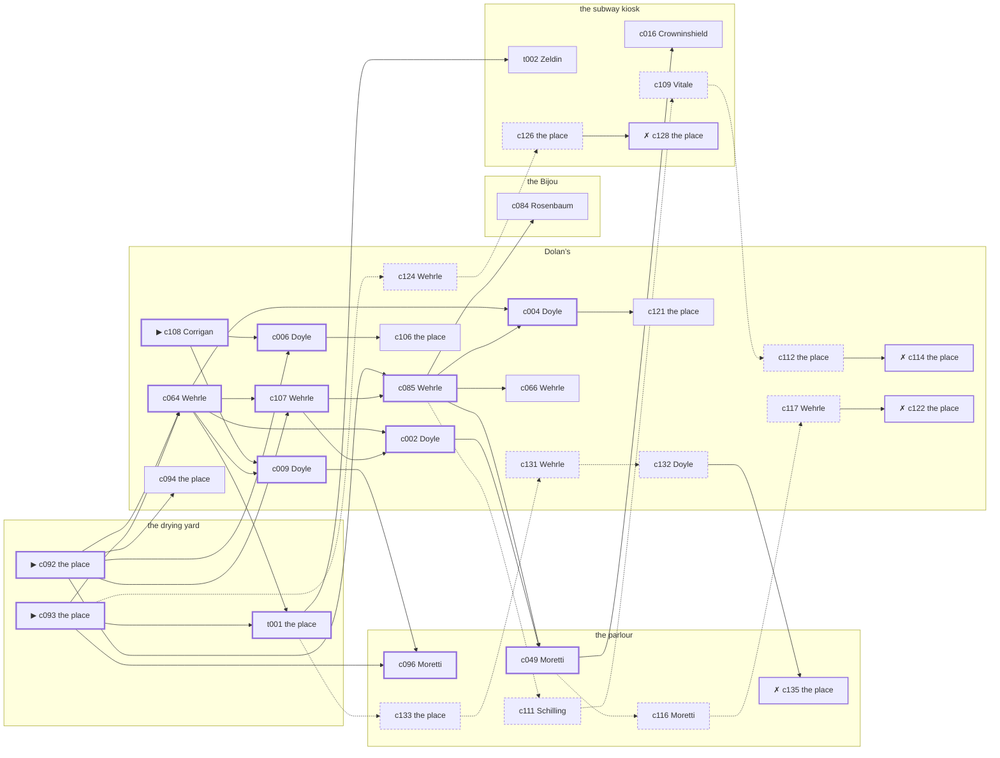

# the Tenderloin — case 11

**Seed** 11 · **Difficulty** 2 · **Attempts** 1 · **Detective** Dashiell

**Type** murder · **Trope** body-at-scene · **Unknowns** who, why, when

**Par** 12 actions · **Slack** 6 · **Budget** 18 · **Findable** 34 (spine 13, corroboration 7, noise 10 + 4 disqualifiers) · **Noise ratio** 41% · **Candidate pool** 145

## 1. The Truth

Martin Corrigan, a private secretary, engaged to Vogel’s daughter, killed Otto Vogel, a bail bondsman, with an ice pick at the drying yard at 7:00 PM. Corrigan was jealous of Vogel over Adelaide Havemeyer (jealousy). Corrigan had been at Dolan’s earlier in the evening, where the means lived, and was alone with Vogel when it happened. Corrigan is also the client: the one who did it hired us.

## 2. The Act

**murder** · **body-at-scene** · actor **Corrigan** · at **the drying yard** · at **7:00 PM**

- found at the drying yard
- fate: dead

**Givens** — what the briefing states and the report does not ask:

- Vogel was found dead at the drying yard.
- Vogel was killed at the drying yard, and nothing was carried out of the room afterwards.
- The coroner puts it between 6:00 PM and 7:30 PM, which is two hours of nothing useful.
- It was an ice pick.

**Unknowns** — exactly what the report asks: **who**, **why**, **when**.

## 3. Dramatis Personae

| Name | Role | Relationship | Class of secret | Motive | Found at | Killer |
| --- | --- | --- | --- | --- | --- | --- |
| Otto Vogel | a bail bondsman | the victim | — | — | — | — |
| Agnes Doyle | a dentist with a chair and a waiting room | Vogel’s tenant | forged-identity | — | Dolan’s | — |
| Carmine Vitale | the owner of the block | Vogel’s business partner | fence | — | the subway kiosk | — |
| Ellsworth Crowninshield | a longshoreman | in Vogel’s debt | gambling-debt | revenge | the subway kiosk | — |
| Martin Corrigan (client) | a private secretary | engaged to Vogel’s daughter | murder | jealousy | Dolan’s | **YES** |
| Lurline Bledsoe | a widow with rooms on the avenue | Vogel’s neighbour across the airshaft | hidden-family | — | Dolan’s | — |
| Ernst Schilling | a policy runner | a childhood friend of Vogel’s from the same block | gambling-debt | — | the parlour | — |
| Concetta Moretti | the landlady | fixture (landlady) | — | — | the parlour | — |
| Meyer Rosenbaum | the ticket-taker | fixture (ticket-taker) | — | — | the Bijou | — |
| Rudolf Wehrle | the bartender | fixture (bartender) | — | — | Dolan’s | — |
| Louis Zeldin | the patrolman on the beat | fixture (beat-cop) | — | — | the subway kiosk | — |

## 4. Dossiers

Every person, by layer: **0** on sight, **1** volunteered, **2** from other people, **3** in the documents.

### Vogel — the victim

38, a man, a bail bondsman. Wants: to-be-feared.

- **Standing** — Vogel was the first telephone call anybody on the street made at two in the morning.
- **Profession** — Vogel took a house or a wedding ring as security and kept the paper on both.
- **Found** — Doyle found Vogel at the drying yard at 11:30 PM. By Doyle, at the drying yard, at 11:30 PM. Precinct: took-a-statement.

**Layer 0, on sight**

- _gender_ — A man.
- _age_ — In his thirties.

**Layer 1, volunteered**

- _profession_ — A bail bondsman.
- _detail_ — Vogel took a house or a wedding ring as security and kept the paper on both.

**Layer 2, from other people**

- _tie_ — Vogel was the first telephone call anybody on the street made at two in the morning.
- _want_ — Vogel wants to be the one people are careful around.

**Self-account** (layer 1, what they say when asked about themselves)

- Vogel is 38 years old and a bail bondsman.
- Vogel took a house or a wedding ring as security and kept the paper on both.
- Vogel is the one this is about.

### Doyle

47, a woman, a dentist with a chair and a waiting room. Wants: money. Tie: Vogel’s tenant, four years in the same rooms.

**Layer 0, on sight**

- _gender_ — A woman.
- _age_ — In her forties.

**Layer 1, volunteered**

- _profession_ — A dentist with a chair and a waiting room.
- _detail_ — Doyle pulls teeth for the neighbourhood at a dollar a time.

**Layer 2, from other people**

- _tie_ — Doyle took the rooms over the brownstone from Vogel and has been two weeks behind since the spring.
- _want_ — Doyle wants money, and is not particular about the shape it arrives in.
- _since_ — Doyle has been Vogel’s tenant, four years in the same rooms.

**Layer 3, in the documents**

- _secret-hint_ — Doyle’s registration card gives an address on a street that does not exist.

**Self-account** (layer 1, what they say when asked about themselves)

- Doyle is 47 years old and a dentist with a chair and a waiting room.
- Doyle pulls teeth for the neighbourhood at a dollar a time.
- Doyle is Vogel’s tenant.

### Vitale

46, a man, the owner of the block. Wants: to-be-feared. Tie: Vogel’s business partner, since ’22.

**Layer 0, on sight**

- _gender_ — A man.
- _age_ — In his forties.

**Layer 1, volunteered**

- _profession_ — The owner of the block.
- _detail_ — Vitale has a boilerman, a lawyer and no partners.

**Layer 2, from other people**

- _tie_ — Vitale put up the money and Vogel put up the name, and neither of them ever wrote it down.
- _want_ — Vitale wants to be the one people are careful around.
- _since_ — Vitale has been Vogel’s business partner, since ’22.

**Layer 3, in the documents**

- _secret-hint_ — Vitale was carrying a parcel into Dolan’s and came out without it.

**Self-account** (layer 1, what they say when asked about themselves)

- Vitale is 46 years old and the owner of the block.
- Vitale has a boilerman, a lawyer and no partners.
- Vitale is Vogel’s business partner.

### Crowninshield

33, a man, a longshoreman. Wants: to-keep-what-they-have. Tie: in Vogel’s debt, since ’18.

**Layer 0, on sight**

- _gender_ — A man.
- _age_ — In his thirties.
- _profession_ — A longshoreman.

**Layer 1, volunteered**

- _detail_ — Crowninshield works the Elizabeth Street pier when there is work.

**Layer 2, from other people**

- _tie_ — Vogel carried Crowninshield through a bad winter and has been collecting on it ever since.
- _want_ — Crowninshield wants to keep what they have and add nothing to it.
- _since_ — Crowninshield has been in Vogel’s debt, since ’18.

**Layer 3, in the documents**

- _secret-hint_ — Crowninshield was asking around for a hundred dollars in a hurry earlier in the week.

**Self-account** (layer 1, what they say when asked about themselves)

- Crowninshield is 33 years old and a longshoreman.
- Crowninshield works the Elizabeth Street pier when there is work.
- Crowninshield is in Vogel’s debt.

### Corrigan — the killer — the client

25, a man, a private secretary. Wants: respectability. Tie: engaged to Vogel’s daughter, since ’22.

**Layer 0, on sight**

- _gender_ — A man.
- _age_ — In the late twenties.

**Layer 1, volunteered**

- _profession_ — A private secretary.
- _detail_ — Corrigan has worked for three men in six years and left none of them badly.

**Layer 2, from other people**

- _tie_ — Corrigan and Vogel’s daughter have been engaged since ’22, and Isaiah Hargrove calls it a long engagement.
- _want_ — Corrigan wants to be thought respectable by people who are not.
- _since_ — Corrigan has been engaged to Vogel’s daughter, since ’22.
- _third_ — Isaiah Hargrove is a younger brother in trouble upstate.

**Self-account** (layer 1, what they say when asked about themselves)

- Corrigan is 25 years old and a private secretary.
- Corrigan has worked for three men in six years and left none of them badly.
- Corrigan is engaged to Vogel’s daughter.

### Bledsoe

56, a woman, a widow with rooms on the avenue. Wants: to-keep-what-they-have. Tie: Vogel’s neighbour across the airshaft, since ’23.

**Layer 0, on sight**

- _gender_ — A woman.
- _age_ — In her fifties.

**Layer 1, volunteered**

- _profession_ — A widow with rooms on the avenue.
- _detail_ — Bledsoe lives on an annuity and the rent from a house in Flushing.

**Layer 2, from other people**

- _tie_ — Bledsoe lives across the airshaft from Vogel and can hear the wireless through it.
- _want_ — Bledsoe wants to keep what they have and add nothing to it.
- _since_ — Bledsoe has been Vogel’s neighbour across the airshaft, since ’23.

**Layer 3, in the documents**

- _secret-hint_ — Bledsoe sends money out of every pay envelope and cannot say where it goes.

**Self-account** (layer 1, what they say when asked about themselves)

- Bledsoe is 56 years old and a widow with rooms on the avenue.
- Bledsoe lives on an annuity and the rent from a house in Flushing.
- Bledsoe is Vogel’s neighbour across the airshaft.

### Schilling

20, a man, a policy runner. Wants: money. Tie: a childhood friend of Vogel’s from the same block, since ’18.

**Layer 0, on sight**

- _gender_ — A man.
- _age_ — Not much past twenty.

**Layer 1, volunteered**

- _profession_ — A policy runner.
- _detail_ — Schilling carries the slips between four corners and a candy store.

**Layer 2, from other people**

- _tie_ — Schilling, Vogel and Roscoe Whitfield were inseparable for ten years and have not been in a room together since.
- _want_ — Schilling wants money, and is not particular about the shape it arrives in.
- _since_ — Schilling has been a childhood friend of Vogel’s from the same block, since ’18.
- _third_ — Roscoe Whitfield is an old friend who once put up the bail.

**Layer 3, in the documents**

- _secret-hint_ — Schilling was asking around for a hundred dollars in a hurry earlier in the week.

**Self-account** (layer 1, what they say when asked about themselves)

- Schilling is 20 years old and a policy runner.
- Schilling carries the slips between four corners and a candy store.
- Schilling is a childhood friend of Vogel’s from the same block.

### Moretti

64, a woman, the landlady. Wants: to-keep-what-they-have. Tie: the keeper of the parlour.

**Layer 0, on sight**

- _gender_ — A woman.
- _age_ — In her sixties.
- _profession_ — The landlady.

**Layer 1, volunteered**

- _detail_ — Moretti keeps the parlour and sits where she can see the stairs.

**Layer 2, from other people**

- _tie_ — Moretti is the keeper of the parlour.
- _want_ — Moretti wants to keep what they have and add nothing to it.

**Self-account** (layer 1, what they say when asked about themselves)

- Moretti is 64 years old and the landlady.
- Moretti keeps the parlour and sits where she can see the stairs.
- Moretti is the keeper of the parlour.

### Rosenbaum

47, a man, the ticket-taker. Wants: money. Tie: on the door at the Bijou, every performance.

**Layer 0, on sight**

- _gender_ — A man.
- _age_ — In his forties.
- _profession_ — The ticket-taker.

**Layer 1, volunteered**

- _detail_ — Rosenbaum stands the box at the Bijou from seven until the last house goes in.

**Layer 2, from other people**

- _tie_ — Rosenbaum is on the door at the Bijou, every performance.
- _want_ — Rosenbaum wants money, and is not particular about the shape it arrives in.

**Self-account** (layer 1, what they say when asked about themselves)

- Rosenbaum is 47 years old and the ticket-taker.
- Rosenbaum stands the box at the Bijou from seven until the last house goes in.
- Rosenbaum is on the door at the Bijou, every performance.

### Wehrle

42, a man, the bartender. Wants: to-keep-what-they-have. Tie: behind the bar at Dolan’s, every night of the week.

**Layer 0, on sight**

- _gender_ — A man.
- _age_ — In his forties.
- _profession_ — The bartender.

**Layer 1, volunteered**

- _detail_ — Wehrle works Dolan’s from four until they lock the door.

**Layer 2, from other people**

- _tie_ — Wehrle is behind the bar at Dolan’s, every night of the week.
- _want_ — Wehrle wants to keep what they have and add nothing to it.

**Self-account** (layer 1, what they say when asked about themselves)

- Wehrle is 42 years old and the bartender.
- Wehrle works Dolan’s from four until they lock the door.
- Wehrle is behind the bar at Dolan’s, every night of the week.

### Zeldin

27, a man, the patrolman on the beat. Wants: to-be-feared. Tie: the patrolman whose post takes in the subway kiosk.

**Layer 0, on sight**

- _gender_ — A man.
- _age_ — In the late twenties.
- _profession_ — The patrolman on the beat.

**Layer 1, volunteered**

- _detail_ — Zeldin came on at six and will go off at two, the same as every night.

**Layer 2, from other people**

- _tie_ — Zeldin is the patrolman whose post takes in the subway kiosk.
- _want_ — Zeldin wants to be the one people are careful around.

**Self-account** (layer 1, what they say when asked about themselves)

- Zeldin is 27 years old and the patrolman on the beat.
- Zeldin came on at six and will go off at two, the same as every night.
- Zeldin is the patrolman whose post takes in the subway kiosk.

## 5. The Client

**Corrigan**, engaged to Vogel’s daughter. Purpose: **clear-my-name** — and the killer.

- **Why** — Corrigan wants it established that it was not them, before anybody says otherwise.
- **What it costs** — Corrigan was near enough to it that night to know exactly how it looks, and says so first.
- **Points at** — Crowninshield: Crowninshield blamed Vogel for the ruin of Crowninshield’s business. Honest: **no**.

**Tells:**

- Vogel was found dead at the drying yard.
- Vogel was killed at the drying yard, and nothing was carried out of the room afterwards.
- The coroner puts it between 6:00 PM and 7:30 PM, which is two hours of nothing useful.
- It was an ice pick.
- Corrigan would rather we started with Crowninshield: Crowninshield blamed Vogel for the ruin of Crowninshield’s business.

**Withholds:**

- Corrigan does not mention being at the drying yard at 7:00 PM, which is where Corrigan was.

**Their own evening, as they tell it:**

- Corrigan says he was at Dolan’s from 6:00 PM to 8:00 PM.
- Corrigan says he was at the subway kiosk from 8:30 PM to 9:00 PM.
- Corrigan says he was at Dolan’s from 9:30 PM to 11:30 PM.

## 6. The Briefing

16 plain sentences, derived. This is the model of the plain register: the engine renders it, and Phase 2 measures pages against it.

1. A man came up the stairs after midnight, and sat down.
2. Martin Corrigan is 25 years old and a private secretary.
3. Corrigan has worked for three men in six years and left none of them badly.
4. Vogel was the first telephone call anybody on the street made at two in the morning.
5. Vogel was found dead at the drying yard.
6. Vogel was killed at the drying yard, and nothing was carried out of the room afterwards.
7. The coroner puts it between 6:00 PM and 7:30 PM, which is two hours of nothing useful.
8. It was an ice pick.
9. Doyle found Vogel at the drying yard at 11:30 PM.
10. The precinct took a statement at the desk and filed it.
11. Corrigan is engaged to Vogel’s daughter.
12. Corrigan and Vogel’s daughter have been engaged since ’22, and Isaiah Hargrove calls it a long engagement.
13. Corrigan wants it established that it was not them, before anybody says otherwise.
14. Corrigan was near enough to it that night to know exactly how it looks, and says so first.
15. Corrigan wants us to start with Crowninshield.
16. Crowninshield blamed Vogel for the ruin of Crowninshield’s business.

## 7. Mentions

- **Adelaide Havemeyer** (m-1) — a woman they had both been seeing. Adelaide Havemeyer is a woman they had both been seeing.
- **Isaiah Hargrove** (m-2) — a younger brother in trouble upstate. Isaiah Hargrove is a younger brother in trouble upstate.
- **Roscoe Whitfield** (m-3) — an old friend who once put up the bail. Roscoe Whitfield is an old friend who once put up the bail.

## 8. Places

- **the parlour of Mrs. Teague’s boarding house** (semi) — watched by landlady (Moretti); objects: the roof-door key, a length of sash cord, a bronze bookend — within earshot of the scene
- **the subway kiosk at the corner** (public) — unwatched; objects: a folded stack of evening papers, a pasted-up timetable, a brass umbrella stand
- **the Bijou picture house** (public) — watched by ticket-taker (Rosenbaum); objects: a standing ashtray, a silver cigarette case — within earshot of the scene
- **the drying yard behind the laundry** (private) — unwatched; objects: a mop and bucket — **THE SCENE**
- **Vogel’s rooms in the brownstone** (private) — unwatched; objects: a framed photograph, a bottle of chloral drops, a wall telephone — the victim’s address
- **Dolan’s Bar** (semi) — watched by bartender (Wehrle); objects: an ice pick, a seltzer siphon — where the weapon lived

## 9. Anchors

The coroner gives 6:00 PM–7:30 PM, four ticks wide. These are what close it: **drunk-singing** and **last-edition**.

- **the drunk singing under the window** — at 6:30 PM; at the parlour. You can time things by it: the same two verses until somebody threw a shoe. Only those present know that it was a shoe, and it was thrown by a woman, and it did not land.
- **the last edition coming off the truck** — at 7:00 PM; at the Bijou. Somebody reliable notes who was there. Only those present know that the late edition led with the bridge contract and not the hold-up. Those present carry it: ink still wet enough to come off on a glove.
- **the beat cop’s pass** — at 6:30 PM, 8:00 PM, 9:30 PM, 11:00 PM; on a round through the subway kiosk → Dolan’s → the parlour → the Bijou. Somebody reliable notes who was there.

## 10. Timelines

### Vogel — the victim

| Tick | Time | Truth | Claimed | Companion claimed |
| --- | --- | --- | --- | --- |
| 0 | 6:00 PM | the brownstone | the brownstone | — |
| 1 | 6:30 PM | the parlour | the parlour | — |
| 2 | 7:00 PM | the drying yard ☠ | the drying yard | — |
| 3 | 7:30 PM | — | — | — |
| 4 | 8:00 PM | — | — | — |
| 5 | 8:30 PM | — | — | — |
| 6 | 9:00 PM | — | — | — |
| 7 | 9:30 PM | — | — | — |
| 8 | 10:00 PM | — | — | — |
| 9 | 10:30 PM | — | — | — |
| 10 | 11:00 PM | — | — | — |
| 11 | 11:30 PM | — | — | — |

### Doyle

| Tick | Time | Truth | Claimed | Companion claimed |
| --- | --- | --- | --- | --- |
| 0 | 6:00 PM | Dolan’s | Dolan’s | — |
| 1 | 6:30 PM | Dolan’s | Dolan’s | — |
| 2 | 7:00 PM | the parlour | the parlour | — |
| 3 | 7:30 PM | the parlour | the parlour | — |
| 4 | 8:00 PM | the Bijou | the Bijou | — |
| 5 | 8:30 PM | the Bijou | the Bijou | — |
| 6 | 9:00 PM | the brownstone | the brownstone | — |
| 7 | 9:30 PM | the brownstone | the brownstone | — |
| 8 | 10:00 PM | the brownstone | the brownstone | — |
| 9 | 10:30 PM | Dolan’s | Dolan’s | — |
| 10 | 11:00 PM | Dolan’s | Dolan’s | — |
| 11 | 11:30 PM | the drying yard | the drying yard | — |

### Vitale

| Tick | Time | Truth | Claimed | Companion claimed |
| --- | --- | --- | --- | --- |
| 0 | 6:00 PM | Dolan’s | Dolan’s | — |
| 1 | 6:30 PM | Dolan’s | Dolan’s | — |
| 2 | 7:00 PM | Dolan’s | **the parlour** | Corrigan |
| 3 | 7:30 PM | the subway kiosk | the subway kiosk | — |
| 4 | 8:00 PM | the subway kiosk | the subway kiosk | — |
| 5 | 8:30 PM | the subway kiosk | the subway kiosk | — |
| 6 | 9:00 PM | the subway kiosk | the subway kiosk | — |
| 7 | 9:30 PM | the subway kiosk | the subway kiosk | — |
| 8 | 10:00 PM | the subway kiosk | the subway kiosk | — |
| 9 | 10:30 PM | the subway kiosk | the subway kiosk | — |
| 10 | 11:00 PM | the subway kiosk | the subway kiosk | — |
| 11 | 11:30 PM | the subway kiosk | the subway kiosk | — |

### Crowninshield

| Tick | Time | Truth | Claimed | Companion claimed |
| --- | --- | --- | --- | --- |
| 0 | 6:00 PM | the Bijou | the Bijou | — |
| 1 | 6:30 PM | the subway kiosk | the subway kiosk | — |
| 2 | 7:00 PM | the parlour | the parlour | — |
| 3 | 7:30 PM | the parlour | the parlour | — |
| 4 | 8:00 PM | the parlour | the parlour | — |
| 5 | 8:30 PM | the brownstone | the brownstone | — |
| 6 | 9:00 PM | the parlour | the parlour | — |
| 7 | 9:30 PM | the subway kiosk | **Dolan’s** | — |
| 8 | 10:00 PM | the subway kiosk | the subway kiosk | — |
| 9 | 10:30 PM | Dolan’s | Dolan’s | — |
| 10 | 11:00 PM | Dolan’s | Dolan’s | — |
| 11 | 11:30 PM | the subway kiosk | the subway kiosk | — |

### Corrigan — the killer

| Tick | Time | Truth | Claimed | Companion claimed |
| --- | --- | --- | --- | --- |
| 0 | 6:00 PM | Dolan’s | Dolan’s | — |
| 1 | 6:30 PM | the drying yard | **Dolan’s** | Schilling |
| 2 | 7:00 PM | the drying yard ☠ | **Dolan’s** | Schilling |
| 3 | 7:30 PM | Dolan’s | Dolan’s | — |
| 4 | 8:00 PM | Dolan’s | Dolan’s | — |
| 5 | 8:30 PM | the subway kiosk | the subway kiosk | — |
| 6 | 9:00 PM | the subway kiosk | the subway kiosk | — |
| 7 | 9:30 PM | Dolan’s | Dolan’s | — |
| 8 | 10:00 PM | Dolan’s | Dolan’s | — |
| 9 | 10:30 PM | Dolan’s | Dolan’s | — |
| 10 | 11:00 PM | Dolan’s | Dolan’s | — |
| 11 | 11:30 PM | Dolan’s | Dolan’s | — |

### Bledsoe

| Tick | Time | Truth | Claimed | Companion claimed |
| --- | --- | --- | --- | --- |
| 0 | 6:00 PM | the parlour | the parlour | — |
| 1 | 6:30 PM | the Bijou | the Bijou | — |
| 2 | 7:00 PM | the parlour | **Dolan’s** | Schilling |
| 3 | 7:30 PM | the Bijou | the Bijou | — |
| 4 | 8:00 PM | the Bijou | the Bijou | — |
| 5 | 8:30 PM | the brownstone | the brownstone | — |
| 6 | 9:00 PM | Dolan’s | Dolan’s | — |
| 7 | 9:30 PM | Dolan’s | Dolan’s | — |
| 8 | 10:00 PM | Dolan’s | Dolan’s | — |
| 9 | 10:30 PM | Dolan’s | Dolan’s | — |
| 10 | 11:00 PM | Dolan’s | Dolan’s | — |
| 11 | 11:30 PM | the parlour | the parlour | — |

### Schilling

| Tick | Time | Truth | Claimed | Companion claimed |
| --- | --- | --- | --- | --- |
| 0 | 6:00 PM | the parlour | the parlour | — |
| 1 | 6:30 PM | the parlour | the parlour | — |
| 2 | 7:00 PM | the parlour | the parlour | — |
| 3 | 7:30 PM | the parlour | the parlour | — |
| 4 | 8:00 PM | Dolan’s | **the parlour** | — |
| 5 | 8:30 PM | Dolan’s | Dolan’s | — |
| 6 | 9:00 PM | Dolan’s | Dolan’s | — |
| 7 | 9:30 PM | the subway kiosk | the subway kiosk | — |
| 8 | 10:00 PM | the subway kiosk | the subway kiosk | — |
| 9 | 10:30 PM | the subway kiosk | the subway kiosk | — |
| 10 | 11:00 PM | the brownstone | the brownstone | — |
| 11 | 11:30 PM | the Bijou | the Bijou | — |

### Fixtures (never lie, never withhold)

| Tick | Time | Moretti (the landlady) | Rosenbaum (the ticket-taker) | Wehrle (the bartender) | Zeldin (the patrolman on the beat) |
| --- | --- | --- | --- | --- | --- |
| 0 | 6:00 PM | the parlour | the Bijou | Dolan’s | — |
| 1 | 6:30 PM | the parlour | the Bijou | Dolan’s | the subway kiosk |
| 2 | 7:00 PM | the parlour | Dolan’s | Dolan’s | — |
| 3 | 7:30 PM | the parlour | the Bijou | Dolan’s | — |
| 4 | 8:00 PM | the parlour | the Bijou | Dolan’s | Dolan’s |
| 5 | 8:30 PM | the parlour | the Bijou | Dolan’s | — |
| 6 | 9:00 PM | the parlour | the Bijou | Dolan’s | — |
| 7 | 9:30 PM | the parlour | the Bijou | Dolan’s | the parlour |
| 8 | 10:00 PM | the parlour | the Bijou | Dolan’s | — |
| 9 | 10:30 PM | the parlour | the Bijou | Dolan’s | — |
| 10 | 11:00 PM | the parlour | the Bijou | Dolan’s | the Bijou |
| 11 | 11:30 PM | the parlour | the Bijou | Dolan’s | — |

## 11. Secrets in play

- **Doyle** (forged-identity): Doyle is not the person the papers say. Nothing about the evening is hidden; the lie is all in the paperwork.
- **Vitale** (fence): Vitale hands a parcel of stolen goods to a man at Dolan’s from 7:00 PM.
- **Crowninshield** (gambling-debt): Crowninshield slips off to the subway kiosk from 9:30 PM to settle with a bookmaker.
- **Corrigan** (murder): Corrigan is at the drying yard from 6:30 PM to 7:00 PM, alone with Vogel when it happens at 7:00 PM.
- **Bledsoe** (hidden-family): Bledsoe goes to the parlour from 7:00 PM to see a child nobody is supposed to know about.
- **Schilling** (gambling-debt): Schilling slips off to Dolan’s from 8:00 PM to settle with a bookmaker.

## 12. Clue list — the 34 findable

The opening three, free at the start: c092, c093, c108. Everything else has to be led to. The full candidate pool is in the companion file.

### At the parlour

- **c049** [spine] (observation; Moretti on Doyle) → c016, c116
  - Moretti says Doyle was at the parlour from 7:00 PM to 7:30 PM.
  - _establishes: Doyle at the parlour, 7:00 PM–7:30 PM_
- **c096** [spine] (anchor; Moretti on Vogel that evening) → (end)
  - Moretti puts Vogel at the parlour while the singing was still going on, which was 6:30 PM, and alive enough to argue about the weather.
  - _establishes: the victim alive at 6:30 PM; Vogel at the parlour, 6:30 PM_
- **c111** [noise {b1}] (overheard; Schilling on Doyle) → c109
  - Schilling on Doyle: Doyle answers to the name a half-second late, every time.
  - _establishes: context only_
- **c133** [noise {b2}] (physical; the place itself) → c131
  - A board-and-keep receipt at the parlour, monthly, eight years of them.
  - _establishes: context only_
- **c135** [disqualifier {b2}] (overheard; the place itself) → (end)
  - The woman who keeps the child says it straight out: Bledsoe was at the parlour from 7:00 PM, the same as every week, and left with the same face as always.
  - _establishes: Bledsoe’s hidden-family accounted for; Bledsoe at the parlour, 7:00 PM_
- **c116** [noise {b3}] (overheard; Moretti on Vitale) → c117
  - Moretti on Vitale: Vitale was carrying a parcel into Dolan’s and came out without it.
  - _establishes: context only_

### At the subway kiosk

- **t002** [corroboration] (overheard; Zeldin on the drying yard that evening) → (end)
  - Zeldin says the door at the drying yard was shut from 7:00 PM on, and nobody came out of it carrying anything.
  - _establishes: Vogel at the drying yard, 7:00 PM_
- **c016** [corroboration] (observation; Crowninshield on Doyle) → (end)
  - Crowninshield says Doyle was at the parlour from 7:00 PM to 7:30 PM.
  - _establishes: Doyle at the parlour, 7:00 PM–7:30 PM_
- **c109** [noise {b1}] (overheard; Vitale on Doyle) → c112
  - Vitale on Doyle: Doyle’s registration card gives an address on a street that does not exist.
  - _establishes: context only_
- **c126** [noise {b4}] (physical; the place itself) → c128
  - Betting slips at the subway kiosk in Crowninshield’s pocketbook, all of them losers, all of them this month.
  - _establishes: context only_
- **c128** [disqualifier {b4}] (overheard; the place itself) → (end)
  - The bookmaker’s runner is found and will say it: Crowninshield was at the subway kiosk from 9:30 PM paying off eleven hundred dollars, a dollar at a time, and went nowhere near the killing.
  - _establishes: Crowninshield’s gambling-debt accounted for; Crowninshield at the subway kiosk, 9:30 PM_

### At the Bijou

- **c084** [corroboration] (observation; Rosenbaum on Corrigan’s account) → (end)
  - Rosenbaum was at Dolan’s at 7:00 PM and says Corrigan was not.
  - _establishes: Corrigan not at Dolan’s, 7:00 PM_

### At the drying yard

- **c092** [spine ⟨opening⟩] (scene; the place itself) → c064, c006, c107, c085, c094
  - Vogel was found at the drying yard. The tap was left running and the basin had overflowed a clean ring onto the boards. The last edition came off the truck at 7:00 PM, and a paper from that run is here with the ink still wet.
  - _establishes: the victim dead by 7:00 PM; how it was done_
- **c093** [spine ⟨opening⟩] (morgue; the place itself) → c064, t001, c096, c124
  - The coroner puts death between 6:00 PM and 7:30 PM — two hours of nothing useful. A single narrow puncture under the ribs. Very little blood outside the body.
  - _establishes: death between 6:00 PM and 7:30 PM; how it was done_
- **t001** [spine] (physical; the place itself) → t002, c133
  - The rug at the drying yard is rucked up under Vogel and the chair beside it went over backwards. Nothing was carried out of the room.
  - _establishes: Vogel at the drying yard, 7:00 PM_

### At Dolan’s

- **c108** [spine ⟨opening⟩] (client; Corrigan on why I was hired) → c006, c009
  - Corrigan hired us, and wants it known that Crowninshield blamed Vogel for the ruin of Crowninshield’s business, and would rather we started there.
  - _establishes: Crowninshield had a motive (revenge)_
- **c064** [spine] (observation; Wehrle on Vitale) → t001, c107, c002, c009, c004
  - Wehrle says Vitale was at Dolan’s from 6:00 PM to 7:00 PM.
  - _establishes: Vitale at Dolan’s, 6:00 PM–7:00 PM; Vitale could reach the weapon_
- **c006** [spine] (observation; Doyle on Bledsoe) → c106
  - Doyle says Bledsoe was at the parlour at 7:00 PM.
  - _establishes: Bledsoe at the parlour, 7:00 PM_
- **c107** [spine] (overheard; Wehrle on Corrigan and Vogel) → c085, c002
  - Wehrle says Corrigan told Vogel to keep away from Adelaide Havemeyer, loud enough to turn heads.
  - _establishes: Corrigan had a motive (jealousy)_
- **c085** [spine] (observation; Wehrle on Corrigan’s account) → c004, c049, c084, c066, c111
  - Wehrle was at Dolan’s from 6:30 PM to 7:00 PM and says Corrigan was not.
  - _establishes: Corrigan not at Dolan’s, 6:30 PM–7:00 PM_
- **c002** [spine] (observation; Doyle on Crowninshield) → c049
  - Doyle says Crowninshield was at the parlour from 7:00 PM to 7:30 PM.
  - _establishes: Crowninshield at the parlour, 7:00 PM–7:30 PM_
- **c009** [spine] (observation; Doyle on Schilling) → c096
  - Doyle says Schilling was at the parlour from 7:00 PM to 7:30 PM.
  - _establishes: Schilling at the parlour, 7:00 PM–7:30 PM_
- **c004** [spine] (observation; Doyle on Corrigan) → c121
  - Doyle says Corrigan was at Dolan’s at 6:00 PM.
  - _establishes: Corrigan at Dolan’s, 6:00 PM; Corrigan could reach the weapon_
- **c066** [corroboration] (observation; Wehrle on Corrigan) → (end)
  - Wehrle says Corrigan was at Dolan’s at 6:00 PM.
  - _establishes: Corrigan at Dolan’s, 6:00 PM; Corrigan could reach the weapon_
- **c094** [corroboration] (physical; the place itself) → (end)
  - An ice pick is gone from Dolan’s. The block is out and half melted and the pick that belongs with it is gone.
  - _establishes: something gone from Dolan’s; how it was done_
- **c106** [corroboration] (document; the place itself) → (end)
  - Found at Dolan’s: Three letters in Vogel’s hand to Adelaide Havemeyer, kept in Corrigan’s drawer, the last one opened.
  - _establishes: Corrigan had a motive (jealousy)_
- **c121** [corroboration] (overheard; the place itself) → (end)
  - The receiver at Dolan’s would rather talk than be held: Vitale was there from 7:00 PM handing over a parcel of somebody else’s silver, which is a charge Vitale will take over this one.
  - _establishes: Vitale’s fence accounted for; Vitale at Dolan’s, 7:00 PM_
- **c112** [noise {b1}] (physical; the place itself) → c114
  - A union card in Doyle’s coat lining carries a different surname and a 1919 date.
  - _establishes: context only_
- **c114** [disqualifier {b1}] (overheard; the place itself) → (end)
  - The name Doyle was born with turns up on a desertion warrant from 1918. Doyle has been hiding from the Army for eleven years and from nobody else.
  - _establishes: Doyle’s forged-identity accounted for_
- **c131** [noise {b2}] (overheard; Wehrle on Bledsoe) → c132
  - Wehrle on Bledsoe: A woman at the parlour asked for Bledsoe by a name Bledsoe has not used in years.
  - _establishes: context only_
- **c132** [noise {b2}] (overheard; Doyle on Bledsoe) → c135
  - Doyle on Bledsoe: Bledsoe keeps a photograph and will not be asked about it twice.
  - _establishes: context only_
- **c117** [noise {b3}] (overheard; Wehrle on Vitale) → c122
  - Wehrle on Vitale: There is a man who meets people at Dolan’s and nobody will say his name out loud.
  - _establishes: context only_
- **c122** [disqualifier {b3}] (overheard; the place itself) → (end)
  - The goods turn up, tagged and dated, and the tag puts Vitale at Dolan’s from 7:00 PM with both hands full.
  - _establishes: Vitale’s fence accounted for; Vitale at Dolan’s, 7:00 PM_
- **c124** [noise {b4}] (overheard; Wehrle on Crowninshield) → c126
  - Wehrle on Crowninshield: A man nobody knew was waiting for Crowninshield at the subway kiosk and would not give a name.
  - _establishes: context only_

## 13. Clue graph

## 14. Deduction path

Par is **12 actions** and the budget is par plus 6: **18**. Every id below is a spine clue; the inference is the sheet’s, not the clue’s.

**Time of death.** The coroner gives four ticks. The anchors close it to 7:00 PM: one puts Vogel alive at 6:30 PM, the other times the scene at 7:00 PM. _(c093, c096, c092)_

**Clearing the innocent.**

- Doyle was not at the drying yard at 7:00 PM. _(c049; + 1 corroborating)_
- Vitale was not at the drying yard at 7:00 PM. _(c064; + 2 corroborating)_
- Crowninshield was not at the drying yard at 7:00 PM. _(c002)_
- Bledsoe was not at the drying yard at 7:00 PM. _(c006; + 1 corroborating)_
- Schilling was not at the drying yard at 7:00 PM. _(c009)_

**Naming the killer.** Corrigan claims Dolan’s at 7:00 PM. Two independent sources put that out of the question. _(c085; + 1 corroborating)_

**The weapon.** Corrigan was at Dolan’s before 7:00 PM, where an ice pick was kept. _(c004; + 1 corroborating)_

**Method.** An ice pick, on two physical sources. _(c092, c093; + 1 corroborating)_

**Motive.** jealousy, on two independent sources. _(c107; + 1 corroborating)_

## 15. Red herrings

**Innocents who lie about the murder tick:**

- Vitale claims the parlour at 7:00 PM and was really at Dolan’s. Reason: Vitale hands a parcel of stolen goods to a man at Dolan’s from 7:00 PM.
- Bledsoe claims Dolan’s at 7:00 PM and was really at the parlour. Reason: Bledsoe goes to the parlour from 7:00 PM to see a child nobody is supposed to know about.

**Innocents with a motive:**

- Crowninshield — revenge: blamed Vogel for the ruin of Crowninshield’s business.

**Noise branches, and what knocks each one down:**

- **b1** (Doyle, forged-identity): c111 → c109 → c112 → **c114** — The name Doyle was born with turns up on a desertion warrant from 1918. Doyle has been hiding from the Army for eleven years and from nobody else.
- **b2** (Bledsoe, hidden-family): c133 → c131 → c132 → **c135** — The woman who keeps the child says it straight out: Bledsoe was at the parlour from 7:00 PM, the same as every week, and left with the same face as always.
- **b3** (Vitale, fence): c116 → c117 → **c122** — The goods turn up, tagged and dated, and the tag puts Vitale at Dolan’s from 7:00 PM with both hands full.
- **b4** (Crowninshield, gambling-debt): c124 → c126 → **c128** — The bookmaker’s runner is found and will say it: Crowninshield was at the subway kiosk from 9:30 PM paying off eleven hundred dollars, a dollar at a time, and went nowhere near the killing.

