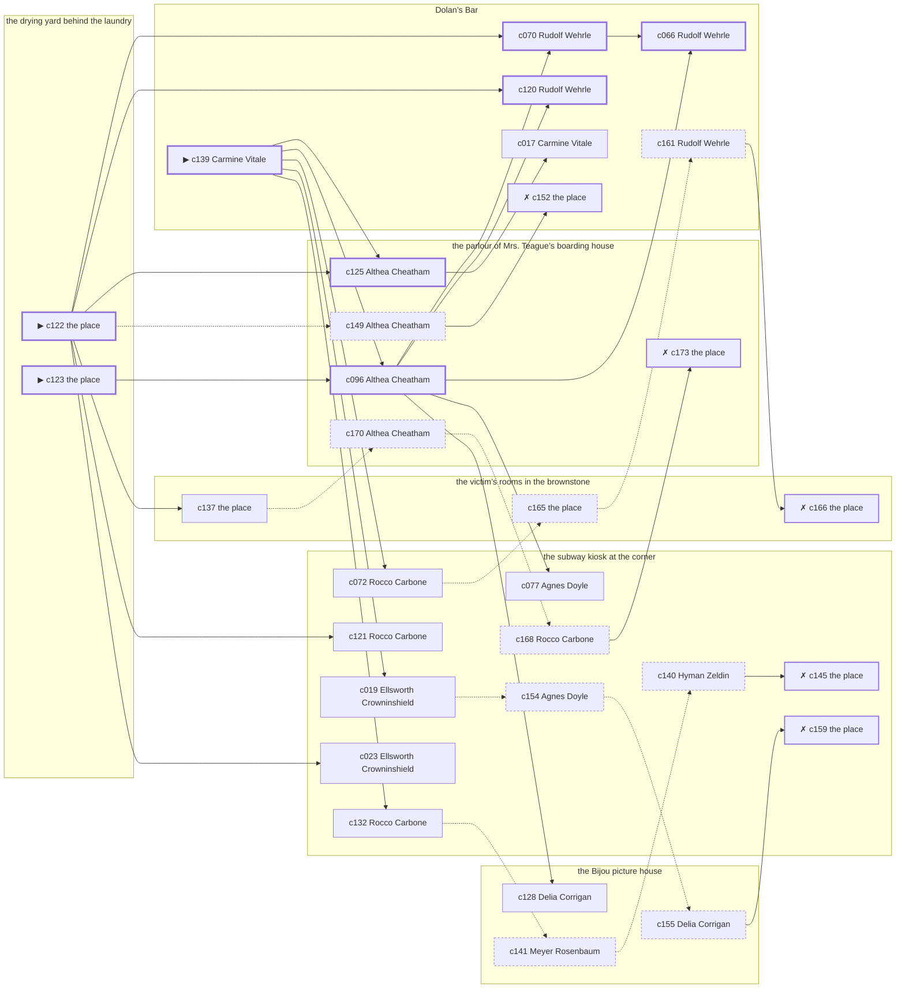

# the Tenderloin — case 11

**Seed** 11 · **Difficulty** 2 · **Attempts** 2 · **Detective** Humphrey

**Par** 7 actions · **Budget** 20 · **Slack** 13 · **Findable** 31 (spine 8, corroboration 9, noise 9 + 5 disqualifiers) · **Noise ratio** 45% · **Candidate pool** 174

## 1. The Truth

Hyman Zeldin, a policy runner, in the victim’s debt, killed Otto Vogel, a bail bondsman, with an ice pick at the drying yard behind the laundry at 8:00 PM. Hyman Zeldin blamed the victim for a ruin (revenge). Hyman Zeldin had been at Dolan’s Bar earlier in the evening, where the weapon lived, and was alone with Otto Vogel when it happened. Carmine Vitale hired us.

## 2. Dramatis Personae

| Name | Role | Relationship | Class of secret | Motive | Found at | Killer |
| --- | --- | --- | --- | --- | --- | --- |
| Otto Vogel | a bail bondsman | the victim | — | — | — | — |
| Agnes Doyle | a dentist with rooms on the third floor | the victim’s tenant | dope | — | the subway kiosk at the corner | — |
| Carmine Vitale (client) | the owner of the block | the victim’s rival in trade | fence | property | Dolan’s Bar | — |
| Ellsworth Crowninshield | a longshoreman | in the victim’s debt | fence | — | the subway kiosk at the corner | — |
| Delia Corrigan | a private secretary | the victim’s former employee | blackmail | — | the Bijou picture house | — |
| Assunta Moretti | a widow with rooms on the avenue | the victim’s cousin | hidden-family | — | the parlour of Mrs. Teague’s boarding house | — |
| Hyman Zeldin | a policy runner | in the victim’s debt | murder (+ gambling-debt) | revenge | the subway kiosk at the corner | **YES** |
| Althea Cheatham | the landlady | fixture (landlady) | — | — | the parlour of Mrs. Teague’s boarding house | — |
| Meyer Rosenbaum | the ticket-taker | fixture (ticket-taker) | — | — | the Bijou picture house | — |
| Rudolf Wehrle | the bartender | fixture (bartender) | — | — | Dolan’s Bar | — |
| Rocco Carbone | the patrolman on the beat | fixture (beat-cop) | — | — | the subway kiosk at the corner | — |

## 3. Places

- **the parlour of Mrs. Teague’s boarding house** (semi) — watched by landlady (Althea Cheatham); objects: the roof-door key, a length of sash cord, a bronze bookend — within earshot of the scene
- **the subway kiosk at the corner** (public) — unwatched; objects: a folded stack of evening papers, a pasted-up timetable, a brass umbrella stand
- **the Bijou picture house** (public) — watched by ticket-taker (Meyer Rosenbaum); objects: a standing ashtray, a silver cigarette case — within earshot of the scene
- **the drying yard behind the laundry** (private) — unwatched; objects: a mop and bucket — **THE SCENE**
- **the victim’s rooms in the brownstone** (private) — unwatched; objects: a framed photograph, a bottle of chloral drops, a wall telephone — the victim’s address
- **Dolan’s Bar** (semi) — watched by bartender (Rudolf Wehrle); objects: an ice pick, a seltzer siphon — where the weapon lived

## 4. Anchors

The coroner gives 8:00 PM–9:30 PM, four ticks wide. These are what close it: **drunk-singing** and **last-edition**.

- **the drunk singing under the window** — at 7:30 PM; at the parlour of Mrs. Teague’s boarding house. You can time things by it: the same two verses until somebody threw a shoe. Only those present know that it was a shoe, and it was thrown by a woman, and it did not land.
- **the last edition coming off the truck** — at 8:00 PM; at the Bijou picture house. Somebody reliable notes who was there. Those present carry it: ink still wet enough to come off on a glove.
- **the beat cop’s pass** — at 6:30 PM, 8:00 PM, 9:30 PM, 11:00 PM; on a round through the subway kiosk at the corner → Dolan’s Bar → the parlour of Mrs. Teague’s boarding house → the Bijou picture house. Somebody reliable notes who was there.

## 5. Timelines

### Otto Vogel — the victim

| Tick | Time | Truth | Claimed | Companion claimed |
| --- | --- | --- | --- | --- |
| 0 | 6:00 PM | the victim’s rooms in the brownstone | the victim’s rooms in the brownstone | — |
| 1 | 6:30 PM | Dolan’s Bar | Dolan’s Bar | — |
| 2 | 7:00 PM | Dolan’s Bar | Dolan’s Bar | — |
| 3 | 7:30 PM | the parlour of Mrs. Teague’s boarding house | the parlour of Mrs. Teague’s boarding house | — |
| 4 | 8:00 PM | the drying yard behind the laundry ☠ | the drying yard behind the laundry | — |
| 5 | 8:30 PM | — | — | — |
| 6 | 9:00 PM | — | — | — |
| 7 | 9:30 PM | — | — | — |
| 8 | 10:00 PM | — | — | — |
| 9 | 10:30 PM | — | — | — |
| 10 | 11:00 PM | — | — | — |
| 11 | 11:30 PM | — | — | — |

### Agnes Doyle

| Tick | Time | Truth | Claimed | Companion claimed |
| --- | --- | --- | --- | --- |
| 0 | 6:00 PM | the Bijou picture house | the Bijou picture house | — |
| 1 | 6:30 PM | the subway kiosk at the corner | the subway kiosk at the corner | — |
| 2 | 7:00 PM | the subway kiosk at the corner | the subway kiosk at the corner | — |
| 3 | 7:30 PM | the subway kiosk at the corner | the subway kiosk at the corner | — |
| 4 | 8:00 PM | the parlour of Mrs. Teague’s boarding house | the parlour of Mrs. Teague’s boarding house | — |
| 5 | 8:30 PM | the Bijou picture house | the Bijou picture house | — |
| 6 | 9:00 PM | the subway kiosk at the corner | **Dolan’s Bar** | Ellsworth Crowninshield |
| 7 | 9:30 PM | the subway kiosk at the corner | **Dolan’s Bar** | Ellsworth Crowninshield |
| 8 | 10:00 PM | the victim’s rooms in the brownstone | the victim’s rooms in the brownstone | — |
| 9 | 10:30 PM | the victim’s rooms in the brownstone | the victim’s rooms in the brownstone | — |
| 10 | 11:00 PM | Dolan’s Bar | Dolan’s Bar | — |
| 11 | 11:30 PM | the parlour of Mrs. Teague’s boarding house | the parlour of Mrs. Teague’s boarding house | — |

### Carmine Vitale

| Tick | Time | Truth | Claimed | Companion claimed |
| --- | --- | --- | --- | --- |
| 0 | 6:00 PM | Dolan’s Bar | Dolan’s Bar | — |
| 1 | 6:30 PM | Dolan’s Bar | Dolan’s Bar | — |
| 2 | 7:00 PM | the subway kiosk at the corner | the subway kiosk at the corner | — |
| 3 | 7:30 PM | Dolan’s Bar | **the subway kiosk at the corner** | — |
| 4 | 8:00 PM | Dolan’s Bar | **the subway kiosk at the corner** | — |
| 5 | 8:30 PM | Dolan’s Bar | Dolan’s Bar | — |
| 6 | 9:00 PM | Dolan’s Bar | Dolan’s Bar | — |
| 7 | 9:30 PM | Dolan’s Bar | Dolan’s Bar | — |
| 8 | 10:00 PM | Dolan’s Bar | Dolan’s Bar | — |
| 9 | 10:30 PM | Dolan’s Bar | Dolan’s Bar | — |
| 10 | 11:00 PM | Dolan’s Bar | Dolan’s Bar | — |
| 11 | 11:30 PM | the parlour of Mrs. Teague’s boarding house | the parlour of Mrs. Teague’s boarding house | — |

### Ellsworth Crowninshield

| Tick | Time | Truth | Claimed | Companion claimed |
| --- | --- | --- | --- | --- |
| 0 | 6:00 PM | the drying yard behind the laundry | the drying yard behind the laundry | — |
| 1 | 6:30 PM | the drying yard behind the laundry | the drying yard behind the laundry | — |
| 2 | 7:00 PM | the drying yard behind the laundry | the drying yard behind the laundry | — |
| 3 | 7:30 PM | the Bijou picture house | the Bijou picture house | — |
| 4 | 8:00 PM | the parlour of Mrs. Teague’s boarding house | the parlour of Mrs. Teague’s boarding house | — |
| 5 | 8:30 PM | the subway kiosk at the corner | the subway kiosk at the corner | — |
| 6 | 9:00 PM | the subway kiosk at the corner | the subway kiosk at the corner | — |
| 7 | 9:30 PM | the subway kiosk at the corner | the subway kiosk at the corner | — |
| 8 | 10:00 PM | the subway kiosk at the corner | the subway kiosk at the corner | — |
| 9 | 10:30 PM | the subway kiosk at the corner | the subway kiosk at the corner | — |
| 10 | 11:00 PM | the subway kiosk at the corner | **the parlour of Mrs. Teague’s boarding house** | — |
| 11 | 11:30 PM | the subway kiosk at the corner | **the parlour of Mrs. Teague’s boarding house** | — |

### Delia Corrigan

| Tick | Time | Truth | Claimed | Companion claimed |
| --- | --- | --- | --- | --- |
| 0 | 6:00 PM | the victim’s rooms in the brownstone | **the parlour of Mrs. Teague’s boarding house** | Assunta Moretti |
| 1 | 6:30 PM | Dolan’s Bar | Dolan’s Bar | — |
| 2 | 7:00 PM | Dolan’s Bar | Dolan’s Bar | — |
| 3 | 7:30 PM | the subway kiosk at the corner | the subway kiosk at the corner | — |
| 4 | 8:00 PM | the parlour of Mrs. Teague’s boarding house | the parlour of Mrs. Teague’s boarding house | — |
| 5 | 8:30 PM | Dolan’s Bar | Dolan’s Bar | — |
| 6 | 9:00 PM | the Bijou picture house | the Bijou picture house | — |
| 7 | 9:30 PM | the Bijou picture house | the Bijou picture house | — |
| 8 | 10:00 PM | the victim’s rooms in the brownstone | the victim’s rooms in the brownstone | — |
| 9 | 10:30 PM | the subway kiosk at the corner | the subway kiosk at the corner | — |
| 10 | 11:00 PM | the Bijou picture house | the Bijou picture house | — |
| 11 | 11:30 PM | the Bijou picture house | the Bijou picture house | — |

### Assunta Moretti

| Tick | Time | Truth | Claimed | Companion claimed |
| --- | --- | --- | --- | --- |
| 0 | 6:00 PM | the Bijou picture house | the Bijou picture house | — |
| 1 | 6:30 PM | the parlour of Mrs. Teague’s boarding house | the parlour of Mrs. Teague’s boarding house | — |
| 2 | 7:00 PM | the parlour of Mrs. Teague’s boarding house | the parlour of Mrs. Teague’s boarding house | — |
| 3 | 7:30 PM | Dolan’s Bar | Dolan’s Bar | — |
| 4 | 8:00 PM | the parlour of Mrs. Teague’s boarding house | **the Bijou picture house** | — |
| 5 | 8:30 PM | the parlour of Mrs. Teague’s boarding house | the parlour of Mrs. Teague’s boarding house | — |
| 6 | 9:00 PM | the parlour of Mrs. Teague’s boarding house | the parlour of Mrs. Teague’s boarding house | — |
| 7 | 9:30 PM | the parlour of Mrs. Teague’s boarding house | the parlour of Mrs. Teague’s boarding house | — |
| 8 | 10:00 PM | the subway kiosk at the corner | the subway kiosk at the corner | — |
| 9 | 10:30 PM | the subway kiosk at the corner | the subway kiosk at the corner | — |
| 10 | 11:00 PM | the subway kiosk at the corner | the subway kiosk at the corner | — |
| 11 | 11:30 PM | the subway kiosk at the corner | the subway kiosk at the corner | — |

### Hyman Zeldin — the killer

| Tick | Time | Truth | Claimed | Companion claimed |
| --- | --- | --- | --- | --- |
| 0 | 6:00 PM | Dolan’s Bar | Dolan’s Bar | — |
| 1 | 6:30 PM | the subway kiosk at the corner | **Dolan’s Bar** | — |
| 2 | 7:00 PM | the subway kiosk at the corner | **Dolan’s Bar** | — |
| 3 | 7:30 PM | the drying yard behind the laundry | **Dolan’s Bar** | Ellsworth Crowninshield |
| 4 | 8:00 PM | the drying yard behind the laundry ☠ | **Dolan’s Bar** | Ellsworth Crowninshield |
| 5 | 8:30 PM | the subway kiosk at the corner | the subway kiosk at the corner | — |
| 6 | 9:00 PM | the subway kiosk at the corner | the subway kiosk at the corner | — |
| 7 | 9:30 PM | the subway kiosk at the corner | the subway kiosk at the corner | — |
| 8 | 10:00 PM | the subway kiosk at the corner | the subway kiosk at the corner | — |
| 9 | 10:30 PM | the subway kiosk at the corner | the subway kiosk at the corner | — |
| 10 | 11:00 PM | the subway kiosk at the corner | the subway kiosk at the corner | — |
| 11 | 11:30 PM | the subway kiosk at the corner | the subway kiosk at the corner | — |

### Fixtures (never lie, never withhold)

| Tick | Time | Althea Cheatham (the landlady) | Meyer Rosenbaum (the ticket-taker) | Rudolf Wehrle (the bartender) | Rocco Carbone (the patrolman on the beat) |
| --- | --- | --- | --- | --- | --- |
| 0 | 6:00 PM | the parlour of Mrs. Teague’s boarding house | the Bijou picture house | Dolan’s Bar | — |
| 1 | 6:30 PM | the parlour of Mrs. Teague’s boarding house | the Bijou picture house | Dolan’s Bar | the subway kiosk at the corner |
| 2 | 7:00 PM | the parlour of Mrs. Teague’s boarding house | Dolan’s Bar | Dolan’s Bar | — |
| 3 | 7:30 PM | the parlour of Mrs. Teague’s boarding house | the Bijou picture house | Dolan’s Bar | — |
| 4 | 8:00 PM | the parlour of Mrs. Teague’s boarding house | the Bijou picture house | Dolan’s Bar | Dolan’s Bar |
| 5 | 8:30 PM | the parlour of Mrs. Teague’s boarding house | the Bijou picture house | Dolan’s Bar | — |
| 6 | 9:00 PM | the parlour of Mrs. Teague’s boarding house | the Bijou picture house | Dolan’s Bar | — |
| 7 | 9:30 PM | the parlour of Mrs. Teague’s boarding house | the Bijou picture house | Dolan’s Bar | the parlour of Mrs. Teague’s boarding house |
| 8 | 10:00 PM | the parlour of Mrs. Teague’s boarding house | the Bijou picture house | Dolan’s Bar | — |
| 9 | 10:30 PM | the parlour of Mrs. Teague’s boarding house | the Bijou picture house | Dolan’s Bar | — |
| 10 | 11:00 PM | the parlour of Mrs. Teague’s boarding house | the Bijou picture house | Dolan’s Bar | the Bijou picture house |
| 11 | 11:30 PM | the parlour of Mrs. Teague’s boarding house | the Bijou picture house | Dolan’s Bar | — |

## 6. Secrets in play

- **Agnes Doyle** (dope): Agnes Doyle buys morphine at the subway kiosk at the corner from 9:00 PM to 9:30 PM and would rather be thought a murderer than a hop-head.
- **Carmine Vitale** (fence): Carmine Vitale hands a parcel of stolen goods to a man at Dolan’s Bar from 7:30 PM to 8:00 PM.
- **Ellsworth Crowninshield** (fence): Ellsworth Crowninshield hands a parcel of stolen goods to a man at the subway kiosk at the corner from 11:00 PM to 11:30 PM.
- **Delia Corrigan** (blackmail): Delia Corrigan meets the victim alone at the victim’s rooms in the brownstone from 6:00 PM and asks for money.
- **Assunta Moretti** (hidden-family): Assunta Moretti goes to the parlour of Mrs. Teague’s boarding house from 8:00 PM to see a child nobody is supposed to know about.
- **Hyman Zeldin** (murder): Hyman Zeldin is at the drying yard behind the laundry from 7:30 PM to 8:00 PM, alone with Otto Vogel when it happens at 8:00 PM.
- **Hyman Zeldin** also (gambling-debt): Hyman Zeldin slips off to the subway kiosk at the corner from 6:30 PM to 7:00 PM to settle with a bookmaker.

## 7. Clue list — the 31 findable

The opening three, free at the start: c122, c123, c139. Everything else has to be led to. The full candidate pool is in the companion file.

### At the parlour of Mrs. Teague’s boarding house

- **c096** [spine] (observation; Althea Cheatham on who was there at 8:00 PM) → c070, c066, c120, c077, c128
  - Althea Cheatham runs through it: at 8:00 PM there were Agnes Doyle, Ellsworth Crowninshield, Delia Corrigan, Assunta Moretti at the parlour of Mrs. Teague’s boarding house, and nobody else worth naming.
  - _establishes: Agnes Doyle at the parlour of Mrs. Teague’s boarding house, 8:00 PM; Ellsworth Crowninshield at the parlour of Mrs. Teague’s boarding house, 8:00 PM; Delia Corrigan at the parlour of Mrs. Teague’s boarding house, 8:00 PM; Assunta Moretti at the parlour of Mrs. Teague’s boarding house, 8:00 PM_
- **c125** [spine] (anchor; Althea Cheatham on Otto Vogel that evening) → c017
  - Althea Cheatham puts Otto Vogel at the parlour of Mrs. Teague’s boarding house while the singing was still going on, which was 7:30 PM, and alive enough to argue about the weather.
  - _establishes: the victim alive at 7:30 PM; Otto Vogel at the parlour of Mrs. Teague’s boarding house, 7:30 PM_
- **c170** [noise {b1}] (overheard; Althea Cheatham on Assunta Moretti) → c168
  - Althea Cheatham on Assunta Moretti: Assunta Moretti keeps a photograph and will not be asked about it twice.
  - _establishes: context only_
- **c173** [disqualifier {b1}] (overheard; the place itself) → (end)
  - The woman who keeps the child says it straight out: Assunta Moretti was at the parlour of Mrs. Teague’s boarding house from 8:00 PM, the same as every week, and left with the same face as always.
  - _establishes: Assunta Moretti’s hidden-family accounted for; Assunta Moretti at the parlour of Mrs. Teague’s boarding house, 8:00 PM_
- **c149** [noise {b5}] (overheard; Althea Cheatham on Carmine Vitale) → c152
  - Althea Cheatham on Carmine Vitale: Carmine Vitale has been selling things that were never Carmine Vitale’s to sell.
  - _establishes: context only_

### At the subway kiosk at the corner

- **c077** [corroboration] (observation; Agnes Doyle on who was there at 8:00 PM) → (end)
  - Agnes Doyle runs through it: at 8:00 PM there were Ellsworth Crowninshield, Delia Corrigan, Assunta Moretti at the parlour of Mrs. Teague’s boarding house, and nobody else worth naming.
  - _establishes: Ellsworth Crowninshield at the parlour of Mrs. Teague’s boarding house, 8:00 PM; Delia Corrigan at the parlour of Mrs. Teague’s boarding house, 8:00 PM; Assunta Moretti at the parlour of Mrs. Teague’s boarding house, 8:00 PM_
- **c019** [corroboration] (observation; Ellsworth Crowninshield on Agnes Doyle) → c154
  - Ellsworth Crowninshield says Agnes Doyle was at the parlour of Mrs. Teague’s boarding house at 8:00 PM.
  - _establishes: Agnes Doyle at the parlour of Mrs. Teague’s boarding house, 8:00 PM_
- **c121** [corroboration] (observation; Rocco Carbone on Hyman Zeldin’s account) → (end)
  - Rocco Carbone was at Dolan’s Bar at 8:00 PM and says Hyman Zeldin was not.
  - _establishes: Hyman Zeldin not at Dolan’s Bar, 8:00 PM_
- **c132** [corroboration] (anchor; Rocco Carbone on the 8:00 PM round) → c141
  - The beat cop’s pass at 8:00 PM puts Carmine Vitale at Dolan’s Bar.
  - _establishes: Carmine Vitale at Dolan’s Bar, 8:00 PM_
- **c023** [corroboration] (observation; Ellsworth Crowninshield on Assunta Moretti) → (end)
  - Ellsworth Crowninshield says Assunta Moretti was at the parlour of Mrs. Teague’s boarding house at 8:00 PM.
  - _establishes: Assunta Moretti at the parlour of Mrs. Teague’s boarding house, 8:00 PM_
- **c072** [corroboration] (observation; Rocco Carbone on Carmine Vitale) → c165
  - Rocco Carbone says Carmine Vitale was at Dolan’s Bar at 8:00 PM.
  - _establishes: Carmine Vitale at Dolan’s Bar, 8:00 PM_
- **c168** [noise {b1}] (overheard; Rocco Carbone on Assunta Moretti) → c173
  - Rocco Carbone on Assunta Moretti: Assunta Moretti sends money out of every pay envelope and cannot say where it goes.
  - _establishes: context only_
- **c140** [noise {b3}] (overheard; Hyman Zeldin on Agnes Doyle) → c145
  - Hyman Zeldin on Agnes Doyle: Agnes Doyle’s sleeves are buttoned at the wrist in a warm room.
  - _establishes: context only_
- **c145** [disqualifier {b3}] (overheard; the place itself) → (end)
  - The man who sells it at the subway kiosk at the corner gives it up rather than be held: Agnes Doyle was there from 9:00 PM to 9:30 PM, and stayed until it took hold.
  - _establishes: Agnes Doyle’s dope accounted for; Agnes Doyle at the subway kiosk at the corner, 9:00 PM–9:30 PM_
- **c154** [noise {b4}] (overheard; Agnes Doyle on Ellsworth Crowninshield) → c155
  - Agnes Doyle on Ellsworth Crowninshield: Ellsworth Crowninshield was carrying a parcel into the subway kiosk at the corner and came out without it.
  - _establishes: context only_
- **c159** [disqualifier {b4}] (overheard; the place itself) → (end)
  - The receiver at the subway kiosk at the corner would rather talk than be held: Ellsworth Crowninshield was there from 11:00 PM to 11:30 PM handing over a parcel of somebody else’s silver, which is a charge Ellsworth Crowninshield will take over this one.
  - _establishes: Ellsworth Crowninshield’s fence accounted for; Ellsworth Crowninshield at the subway kiosk at the corner, 11:00 PM–11:30 PM_

### At the Bijou picture house

- **c128** [corroboration] (anchor; Delia Corrigan on the noise that evening) → (end)
  - Delia Corrigan was at the parlour of Mrs. Teague’s boarding house at 8:00 PM and heard a struggle and something going over from the direction of the drying yard behind the laundry, when the last edition came up.
  - _establishes: noise at the drying yard behind the laundry at 8:00 PM; the victim dead by 8:00 PM; how it was done_
- **c141** [noise {b3}] (overheard; Meyer Rosenbaum on Agnes Doyle) → c140
  - Meyer Rosenbaum on Agnes Doyle: Somebody at the subway kiosk at the corner sells what a druggist will not, and Agnes Doyle knows which door.
  - _establishes: context only_
- **c155** [noise {b4}] (overheard; Delia Corrigan on Ellsworth Crowninshield) → c159
  - Delia Corrigan on Ellsworth Crowninshield: There is a man who meets people at the subway kiosk at the corner and nobody will say his name out loud.
  - _establishes: context only_

### At the drying yard behind the laundry

- **c122** [spine ⟨opening⟩] (scene; the place itself) → c070, c125, c120, c137, c121, c023, c149
  - Otto Vogel was found at the drying yard behind the laundry. The tap was left running and the basin had overflowed a clean ring onto the boards. The last edition coming off the truck came at 8:00 PM, and the truck run is timed to the minute and the papers were out on the stand. That puts the killing in that half hour and no later.
  - _establishes: the victim dead by 8:00 PM; how it was done_
- **c123** [spine ⟨opening⟩] (morgue; the place itself) → c096
  - The coroner puts death between 8:00 PM and 9:30 PM — two hours of nothing useful. A single narrow puncture under the ribs. Very little blood outside the body.
  - _establishes: death between 8:00 PM and 9:30 PM; how it was done_

### At the victim’s rooms in the brownstone

- **c137** [corroboration] (document; the place itself) → c170
  - Found at the victim’s rooms in the brownstone: A clipping about the failure of Hyman Zeldin’s business, with Otto Vogel’s name underlined twice in pencil.
  - _establishes: Hyman Zeldin had a motive (revenge)_
- **c165** [noise {b2}] (physical; the place itself) → c161
  - A photograph at the victim’s rooms in the brownstone, folded small, of something the victim would have paid to keep folded.
  - _establishes: context only_
- **c166** [disqualifier {b2}] (overheard; the place itself) → (end)
  - The victim’s bank book settles it: four payments, and Delia Corrigan at the victim’s rooms in the brownstone from 6:00 PM collecting the fifth. It is extortion, and an extortionist wants the man alive.
  - _establishes: Delia Corrigan’s blackmail accounted for; Delia Corrigan at the victim’s rooms in the brownstone, 6:00 PM_

### At Dolan’s Bar

- **c139** [spine ⟨opening⟩] (client; Carmine Vitale on why I was hired) → c096, c125, c019, c132, c072
  - Carmine Vitale hired us. Carmine Vitale wants it known that Hyman Zeldin blamed the victim for a ruin, and would rather we started there.
  - _establishes: Hyman Zeldin had a motive (revenge)_
- **c070** [spine] (observation; Rudolf Wehrle on Hyman Zeldin) → c066
  - Rudolf Wehrle says Hyman Zeldin was at Dolan’s Bar at 6:00 PM.
  - _establishes: Hyman Zeldin at Dolan’s Bar, 6:00 PM; Hyman Zeldin could reach the weapon_
- **c066** [spine] (observation; Rudolf Wehrle on Carmine Vitale) → (end)
  - Rudolf Wehrle says Carmine Vitale was at Dolan’s Bar from 7:30 PM to 11:00 PM.
  - _establishes: Carmine Vitale at Dolan’s Bar, 7:30 PM–11:00 PM; Carmine Vitale could reach the weapon_
- **c120** [spine] (observation; Rudolf Wehrle on Hyman Zeldin’s account) → (end)
  - Rudolf Wehrle was at Dolan’s Bar from 6:30 PM to 8:00 PM and says Hyman Zeldin was not.
  - _establishes: Hyman Zeldin not at Dolan’s Bar, 6:30 PM–8:00 PM_
- **c017** [corroboration] (observation; Carmine Vitale on Hyman Zeldin) → (end)
  - Carmine Vitale says Hyman Zeldin was at Dolan’s Bar at 6:00 PM.
  - _establishes: Hyman Zeldin at Dolan’s Bar, 6:00 PM; Hyman Zeldin could reach the weapon_
- **c161** [noise {b2}] (overheard; Rudolf Wehrle on Delia Corrigan) → c166
  - Rudolf Wehrle on Delia Corrigan: Delia Corrigan and the victim were heard at the victim’s rooms in the brownstone, and one of them was doing all the talking.
  - _establishes: context only_
- **c152** [disqualifier {b5}] (overheard; the place itself) → (end)
  - The receiver at Dolan’s Bar would rather talk than be held: Carmine Vitale was there from 7:30 PM to 8:00 PM handing over a parcel of somebody else’s silver, which is a charge Carmine Vitale will take over this one.
  - _establishes: Carmine Vitale’s fence accounted for; Carmine Vitale at Dolan’s Bar, 7:30 PM–8:00 PM_

## 8. Clue graph

## 9. Deduction path

Par is **7 actions** against a budget of 20: 13 spare. Every id below is a spine clue.

**Time of death.** The coroner gives four ticks. The anchors close it to 8:00 PM: one puts Otto Vogel alive at 7:30 PM, the other times the scene at 8:00 PM. _(c123, c125, c122; + 1 corroborating)_

**Clearing the innocent.**

- Agnes Doyle was not at the drying yard behind the laundry at 8:00 PM, on two independent sources. _(c096; + 1 corroborating)_
- Carmine Vitale was not at the drying yard behind the laundry at 8:00 PM, on two independent sources. _(c066; + 3 corroborating)_
- Ellsworth Crowninshield was not at the drying yard behind the laundry at 8:00 PM, on two independent sources. _(c096; + 1 corroborating)_
- Delia Corrigan was not at the drying yard behind the laundry at 8:00 PM, on two independent sources. _(c096; + 1 corroborating)_
- Assunta Moretti was not at the drying yard behind the laundry at 8:00 PM, on two independent sources. _(c096; + 3 corroborating)_

**Naming the killer.** Hyman Zeldin claims Dolan’s Bar at 8:00 PM. Two independent sources put that out of the question. _(c120; + 1 corroborating)_

**The weapon.** Hyman Zeldin was at Dolan’s Bar before 8:00 PM, where an ice pick was kept. _(c070; + 1 corroborating)_

**Method.** An ice pick, on two physical sources. _(c122, c123; + 1 corroborating)_

**Motive.** revenge, on two independent sources. _(c139; + 1 corroborating)_

## 10. Red herrings

**Innocents who lie about the murder tick:**

- Carmine Vitale claims the subway kiosk at the corner at 8:00 PM and was really at Dolan’s Bar. Reason: Carmine Vitale hands a parcel of stolen goods to a man at Dolan’s Bar from 7:30 PM to 8:00 PM.
- Assunta Moretti claims the Bijou picture house at 8:00 PM and was really at the parlour of Mrs. Teague’s boarding house. Reason: Assunta Moretti goes to the parlour of Mrs. Teague’s boarding house from 8:00 PM to see a child nobody is supposed to know about.

**Innocents with a motive:**

- Carmine Vitale — property: wanted the victim out of a lease.

**Noise branches, and what knocks each one down:**

- **b1** (Assunta Moretti, hidden-family): c170 → c168 → **c173** — The woman who keeps the child says it straight out: Assunta Moretti was at the parlour of Mrs. Teague’s boarding house from 8:00 PM, the same as every week, and left with the same face as always.
- **b2** (Delia Corrigan, blackmail): c165 → c161 → **c166** — The victim’s bank book settles it: four payments, and Delia Corrigan at the victim’s rooms in the brownstone from 6:00 PM collecting the fifth. It is extortion, and an extortionist wants the man alive.
- **b3** (Agnes Doyle, dope): c141 → c140 → **c145** — The man who sells it at the subway kiosk at the corner gives it up rather than be held: Agnes Doyle was there from 9:00 PM to 9:30 PM, and stayed until it took hold.
- **b4** (Ellsworth Crowninshield, fence): c154 → c155 → **c159** — The receiver at the subway kiosk at the corner would rather talk than be held: Ellsworth Crowninshield was there from 11:00 PM to 11:30 PM handing over a parcel of somebody else’s silver, which is a charge Ellsworth Crowninshield will take over this one.
- **b5** (Carmine Vitale, fence): c149 → **c152** — The receiver at Dolan’s Bar would rather talk than be held: Carmine Vitale was there from 7:30 PM to 8:00 PM handing over a parcel of somebody else’s silver, which is a charge Carmine Vitale will take over this one.

