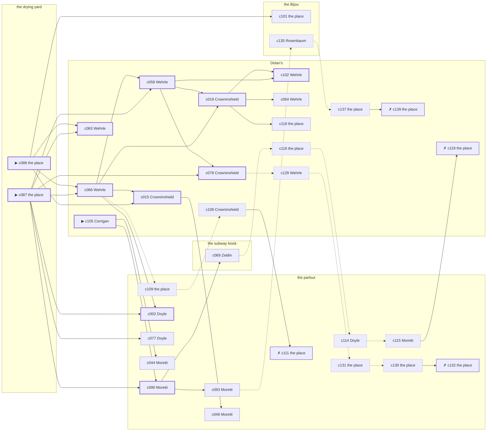

# the Tenderloin — case 11

**Seed** 11 · **Difficulty** 2 · **Attempts** 1 · **Detective** Humphrey

**Par** 11 actions · **Slack** 6 · **Budget** 17 · **Findable** 34 (spine 12, corroboration 8, noise 10 + 4 disqualifiers) · **Noise ratio** 41% · **Candidate pool** 140

## 1. The Truth

Martin Corrigan, a private secretary, engaged to the victim’s daughter, killed Otto Vogel, a bail bondsman, with an ice pick at the drying yard at 8:30 PM. Corrigan was jealous of the victim (jealousy). Corrigan had been at Dolan’s earlier in the evening, where the weapon lived, and was alone with Vogel when it happened. Corrigan is also the client: the killer hired us.

## 2. Dramatis Personae

| Name | Role | Relationship | Class of secret | Motive | Found at | Killer |
| --- | --- | --- | --- | --- | --- | --- |
| Otto Vogel | a bail bondsman | the victim | — | — | — | — |
| Agnes Doyle | a dentist with rooms on the third floor | the victim’s tenant | forged-identity | property | the parlour | — |
| Carmine Vitale | the owner of the block | the victim’s business partner | fence | — | the Bijou | — |
| Ellsworth Crowninshield | a longshoreman | in the victim’s debt | gambling-debt | revenge | Dolan’s | — |
| Martin Corrigan (client) | a private secretary | engaged to the victim’s daughter | murder (+ blackmail) | jealousy | Dolan’s | **YES** |
| Lurline Bledsoe | a widow with rooms on the avenue | the victim’s neighbour across the airshaft | hidden-family | — | Dolan’s | — |
| Ernst Schilling | a policy runner | a childhood friend of the victim’s from the same block | gambling-debt | debt | Dolan’s | — |
| Concetta Moretti | the landlady | fixture (landlady) | — | — | the parlour | — |
| Meyer Rosenbaum | the ticket-taker | fixture (ticket-taker) | — | — | the Bijou | — |
| Rudolf Wehrle | the bartender | fixture (bartender) | — | — | Dolan’s | — |
| Louis Zeldin | the patrolman on the beat | fixture (beat-cop) | — | — | the subway kiosk | — |

## 3. Places

- **the parlour of Mrs. Teague’s boarding house** (semi) — watched by landlady (Moretti); objects: the roof-door key, a length of sash cord, a bronze bookend — within earshot of the scene
- **the subway kiosk at the corner** (public) — unwatched; objects: a folded stack of evening papers, a pasted-up timetable, a brass umbrella stand
- **the Bijou picture house** (public) — watched by ticket-taker (Rosenbaum); objects: a standing ashtray, a silver cigarette case — within earshot of the scene
- **the drying yard behind the laundry** (private) — unwatched; objects: a mop and bucket — **THE SCENE**
- **the victim’s rooms in the brownstone** (private) — unwatched; objects: a framed photograph, a bottle of chloral drops, a wall telephone — the victim’s address
- **Dolan’s Bar** (semi) — watched by bartender (Wehrle); objects: an ice pick, a seltzer siphon — where the weapon lived

## 4. Anchors

The coroner gives 7:00 PM–8:30 PM, four ticks wide. These are what close it: **drunk-singing** and **last-edition**.

- **the drunk singing under the window** — at 8:00 PM; at the parlour. You can time things by it: the same two verses until somebody threw a shoe. Only those present know that it was a shoe, and it was thrown by a woman, and it did not land.
- **the last edition coming off the truck** — at 8:30 PM; at the Bijou. Somebody reliable notes who was there. Only those present know that the late edition led with the bridge contract and not the hold-up. Those present carry it: ink still wet enough to come off on a glove.
- **the beat cop’s pass** — at 6:30 PM, 8:00 PM, 9:30 PM, 11:00 PM; on a round through the subway kiosk → Dolan’s → the parlour → the Bijou. Somebody reliable notes who was there.

## 5. Timelines

### Vogel — the victim

| Tick | Time | Truth | Claimed | Companion claimed |
| --- | --- | --- | --- | --- |
| 0 | 6:00 PM | the parlour | the parlour | — |
| 1 | 6:30 PM | the brownstone | the brownstone | — |
| 2 | 7:00 PM | the brownstone | the brownstone | — |
| 3 | 7:30 PM | the brownstone | the brownstone | — |
| 4 | 8:00 PM | the parlour | the parlour | — |
| 5 | 8:30 PM | the drying yard ☠ | the drying yard | — |
| 6 | 9:00 PM | — | — | — |
| 7 | 9:30 PM | — | — | — |
| 8 | 10:00 PM | — | — | — |
| 9 | 10:30 PM | — | — | — |
| 10 | 11:00 PM | — | — | — |
| 11 | 11:30 PM | — | — | — |

### Doyle

| Tick | Time | Truth | Claimed | Companion claimed |
| --- | --- | --- | --- | --- |
| 0 | 6:00 PM | the subway kiosk | the subway kiosk | — |
| 1 | 6:30 PM | the Bijou | the Bijou | — |
| 2 | 7:00 PM | the Bijou | the Bijou | — |
| 3 | 7:30 PM | the Bijou | the Bijou | — |
| 4 | 8:00 PM | the Bijou | the Bijou | — |
| 5 | 8:30 PM | the parlour | the parlour | — |
| 6 | 9:00 PM | the parlour | the parlour | — |
| 7 | 9:30 PM | the parlour | the parlour | — |
| 8 | 10:00 PM | the parlour | the parlour | — |
| 9 | 10:30 PM | the parlour | the parlour | — |
| 10 | 11:00 PM | the parlour | the parlour | — |
| 11 | 11:30 PM | the brownstone | the brownstone | — |

### Vitale

| Tick | Time | Truth | Claimed | Companion claimed |
| --- | --- | --- | --- | --- |
| 0 | 6:00 PM | the drying yard | the drying yard | — |
| 1 | 6:30 PM | the Bijou | the Bijou | — |
| 2 | 7:00 PM | the Bijou | the Bijou | — |
| 3 | 7:30 PM | the subway kiosk | the subway kiosk | — |
| 4 | 8:00 PM | the subway kiosk | the subway kiosk | — |
| 5 | 8:30 PM | Dolan’s | **the parlour** | Corrigan |
| 6 | 9:00 PM | Dolan’s | Dolan’s | — |
| 7 | 9:30 PM | the Bijou | the Bijou | — |
| 8 | 10:00 PM | the brownstone | the brownstone | — |
| 9 | 10:30 PM | the brownstone | the brownstone | — |
| 10 | 11:00 PM | Dolan’s | Dolan’s | — |
| 11 | 11:30 PM | the parlour | the parlour | — |

### Crowninshield

| Tick | Time | Truth | Claimed | Companion claimed |
| --- | --- | --- | --- | --- |
| 0 | 6:00 PM | Dolan’s | Dolan’s | — |
| 1 | 6:30 PM | Dolan’s | Dolan’s | — |
| 2 | 7:00 PM | Dolan’s | Dolan’s | — |
| 3 | 7:30 PM | Dolan’s | **the subway kiosk** | — |
| 4 | 8:00 PM | Dolan’s | **the subway kiosk** | — |
| 5 | 8:30 PM | the parlour | the parlour | — |
| 6 | 9:00 PM | the parlour | the parlour | — |
| 7 | 9:30 PM | Dolan’s | Dolan’s | — |
| 8 | 10:00 PM | Dolan’s | Dolan’s | — |
| 9 | 10:30 PM | Dolan’s | Dolan’s | — |
| 10 | 11:00 PM | Dolan’s | Dolan’s | — |
| 11 | 11:30 PM | the parlour | the parlour | — |

### Corrigan — the killer

| Tick | Time | Truth | Claimed | Companion claimed |
| --- | --- | --- | --- | --- |
| 0 | 6:00 PM | the drying yard | the drying yard | — |
| 1 | 6:30 PM | the drying yard | the drying yard | — |
| 2 | 7:00 PM | the drying yard | the drying yard | — |
| 3 | 7:30 PM | the brownstone | **the parlour** | — |
| 4 | 8:00 PM | Dolan’s | Dolan’s | — |
| 5 | 8:30 PM | the drying yard ☠ | **the parlour** | Vitale |
| 6 | 9:00 PM | the Bijou | the Bijou | — |
| 7 | 9:30 PM | the brownstone | the brownstone | — |
| 8 | 10:00 PM | the brownstone | the brownstone | — |
| 9 | 10:30 PM | the brownstone | the brownstone | — |
| 10 | 11:00 PM | the brownstone | the brownstone | — |
| 11 | 11:30 PM | the brownstone | the brownstone | — |

### Bledsoe

| Tick | Time | Truth | Claimed | Companion claimed |
| --- | --- | --- | --- | --- |
| 0 | 6:00 PM | the parlour | the parlour | — |
| 1 | 6:30 PM | Dolan’s | Dolan’s | — |
| 2 | 7:00 PM | Dolan’s | Dolan’s | — |
| 3 | 7:30 PM | Dolan’s | Dolan’s | — |
| 4 | 8:00 PM | the subway kiosk | the subway kiosk | — |
| 5 | 8:30 PM | the parlour | **Dolan’s** | — |
| 6 | 9:00 PM | Dolan’s | Dolan’s | — |
| 7 | 9:30 PM | the Bijou | the Bijou | — |
| 8 | 10:00 PM | the Bijou | the Bijou | — |
| 9 | 10:30 PM | the brownstone | the brownstone | — |
| 10 | 11:00 PM | the subway kiosk | the subway kiosk | — |
| 11 | 11:30 PM | the Bijou | the Bijou | — |

### Schilling

| Tick | Time | Truth | Claimed | Companion claimed |
| --- | --- | --- | --- | --- |
| 0 | 6:00 PM | the parlour | the parlour | — |
| 1 | 6:30 PM | the brownstone | the brownstone | — |
| 2 | 7:00 PM | the brownstone | the brownstone | — |
| 3 | 7:30 PM | the brownstone | the brownstone | — |
| 4 | 8:00 PM | the brownstone | the brownstone | — |
| 5 | 8:30 PM | Dolan’s | **the parlour** | Corrigan |
| 6 | 9:00 PM | Dolan’s | **the parlour** | Corrigan |
| 7 | 9:30 PM | Dolan’s | Dolan’s | — |
| 8 | 10:00 PM | Dolan’s | Dolan’s | — |
| 9 | 10:30 PM | Dolan’s | Dolan’s | — |
| 10 | 11:00 PM | the subway kiosk | the subway kiosk | — |
| 11 | 11:30 PM | the subway kiosk | the subway kiosk | — |

### Fixtures (never lie, never withhold)

| Tick | Time | Moretti (the landlady) | Rosenbaum (the ticket-taker) | Wehrle (the bartender) | Zeldin (the patrolman on the beat) |
| --- | --- | --- | --- | --- | --- |
| 0 | 6:00 PM | the parlour | the Bijou | Dolan’s | — |
| 1 | 6:30 PM | the parlour | the Bijou | Dolan’s | the subway kiosk |
| 2 | 7:00 PM | the parlour | the Bijou | Dolan’s | — |
| 3 | 7:30 PM | the parlour | the Bijou | Dolan’s | — |
| 4 | 8:00 PM | the parlour | the Bijou | Dolan’s | Dolan’s |
| 5 | 8:30 PM | the parlour | Dolan’s | Dolan’s | — |
| 6 | 9:00 PM | the parlour | the Bijou | Dolan’s | — |
| 7 | 9:30 PM | the parlour | the Bijou | Dolan’s | the parlour |
| 8 | 10:00 PM | the parlour | the Bijou | Dolan’s | — |
| 9 | 10:30 PM | the parlour | the Bijou | Dolan’s | — |
| 10 | 11:00 PM | the parlour | the Bijou | Dolan’s | the Bijou |
| 11 | 11:30 PM | the parlour | the Bijou | Dolan’s | — |

## 6. Secrets in play

- **Doyle** (forged-identity): Doyle is not the person the papers say. Nothing about the evening is hidden; the lie is all in the paperwork.
- **Vitale** (fence): Vitale hands a parcel of stolen goods to a man at Dolan’s from 8:30 PM.
- **Crowninshield** (gambling-debt): Crowninshield slips off to Dolan’s from 7:30 PM to 8:00 PM to settle with a bookmaker.
- **Corrigan** (murder): Corrigan is at the drying yard from 8:30 PM, alone with Vogel when it happens at 8:30 PM.
- **Corrigan** also (blackmail): Corrigan meets the victim alone at the brownstone from 7:30 PM and asks for money.
- **Bledsoe** (hidden-family): Bledsoe goes to the parlour from 8:30 PM to see a child nobody is supposed to know about.
- **Schilling** (gambling-debt): Schilling slips off to Dolan’s from 8:30 PM to 9:00 PM to settle with a bookmaker.

## 7. Clue list — the 34 findable

The opening three, free at the start: c087, c088, c105. Everything else has to be led to. The full candidate pool is in the companion file.

### At the parlour

- **c090** [spine] (anchor; Moretti on Vogel that evening) → c069, c093
  - Moretti puts Vogel at the parlour while the singing was still going on, which was 8:00 PM, and alive enough to argue about the weather.
  - _establishes: the victim alive at 8:00 PM; Vogel at the parlour, 8:00 PM_
- **c002** [spine] (observation; Doyle on Crowninshield) → (end)
  - Doyle says Crowninshield was at the parlour from 8:30 PM to 9:00 PM.
  - _establishes: Crowninshield at the parlour, 8:30 PM–9:00 PM_
- **c093** [corroboration] (anchor; Moretti on the noise that evening) → c135
  - Moretti was at the parlour at 8:30 PM and heard a struggle and something going over from the direction of the drying yard, as the last edition was coming up.
  - _establishes: noise at the drying yard at 8:30 PM; the victim dead by 8:30 PM; how it was done_
- **c077** [corroboration] (observation; Doyle on Corrigan’s account) → (end)
  - Doyle was at the parlour at 8:30 PM and says Corrigan was not.
  - _establishes: Corrigan not at the parlour, 8:30 PM_
- **c044** [corroboration] (observation; Moretti on Doyle) → (end)
  - Moretti says Doyle was at the parlour from 8:30 PM to 11:00 PM.
  - _establishes: Doyle at the parlour, 8:30 PM–11:00 PM_
- **c046** [corroboration] (observation; Moretti on Crowninshield) → (end)
  - Moretti says Crowninshield was at the parlour from 8:30 PM to 9:00 PM.
  - _establishes: Crowninshield at the parlour, 8:30 PM–9:00 PM_
- **c131** [noise {b1}] (physical; the place itself) → c130
  - A child’s shoe at the parlour, and nobody at the parlour has any children.
  - _establishes: context only_
- **c130** [noise {b1}] (physical; the place itself) → c132
  - A board-and-keep receipt at the parlour, monthly, eight years of them.
  - _establishes: context only_
- **c132** [disqualifier {b1}] (overheard; the place itself) → (end)
  - The woman who keeps the child says it straight out: Bledsoe was at the parlour from 8:30 PM, the same as every week, and left with the same face as always.
  - _establishes: Bledsoe’s hidden-family accounted for; Bledsoe at the parlour, 8:30 PM_
- **c114** [noise {b2}] (overheard; Doyle on Vitale) → c115
  - Doyle on Vitale: There is a man who meets people at Dolan’s and nobody will say his name out loud.
  - _establishes: context only_
- **c115** [noise {b2}] (overheard; Moretti on Vitale) → c119
  - Moretti on Vitale: Vitale has been selling things that were never Vitale’s to sell.
  - _establishes: context only_
- **c109** [noise {b4}] (physical; the place itself) → c108
  - A union card in Doyle’s coat lining carries a different surname and a 1919 date.
  - _establishes: context only_
- **c111** [disqualifier {b4}] (overheard; the place itself) → (end)
  - The name Doyle was born with turns up on a desertion warrant from 1918. Doyle has been hiding from the Army for eleven years and from nobody else.
  - _establishes: Doyle’s forged-identity accounted for_

### At the subway kiosk

- **c069** [corroboration] (observation; Zeldin on Corrigan) → c116
  - Zeldin says Corrigan was at Dolan’s at 8:00 PM.
  - _establishes: Corrigan at Dolan’s, 8:00 PM; Corrigan could reach the weapon_

### At the Bijou

- **c101** [corroboration] (document; the place itself) → (end)
  - Found at the Bijou: Three letters in Vogel’s hand to a woman Corrigan is engaged to, kept in a drawer, the last one opened.
  - _establishes: Corrigan had a motive (jealousy)_
- **c135** [noise {b3}] (overheard; Rosenbaum on Schilling) → c137
  - Rosenbaum on Schilling: A man nobody knew was waiting for Schilling at Dolan’s and would not give a name.
  - _establishes: context only_

### At the drying yard

- **c087** [spine ⟨opening⟩] (scene; the place itself) → c063, c066, c059, c078, c090, c002, c077
  - Vogel was found at the drying yard. The tap was left running and the basin had overflowed a clean ring onto the boards. The last edition came off the truck at 8:30 PM, and a paper from that run is here with the ink still wet.
  - _establishes: the victim dead by 8:30 PM; how it was done_
- **c088** [spine ⟨opening⟩] (morgue; the place itself) → c063, c066, c015, c101
  - The coroner puts death between 7:00 PM and 8:30 PM — two hours of nothing useful. A single narrow puncture under the ribs. Very little blood outside the body.
  - _establishes: death between 7:00 PM and 8:30 PM; how it was done_

### At Dolan’s

- **c105** [spine ⟨opening⟩] (client; Corrigan on why I was hired) → c090, c044
  - Corrigan hired us, and wants it known that Doyle wanted the victim out of a lease, and would rather we started there.
  - _establishes: Doyle had a motive (property)_
- **c063** [spine] (observation; Wehrle on Corrigan) → (end)
  - Wehrle says Corrigan was at Dolan’s at 8:00 PM.
  - _establishes: Corrigan at Dolan’s, 8:00 PM; Corrigan could reach the weapon_
- **c066** [spine] (observation; Wehrle on Schilling) → c059, c019, c015, c002, c109
  - Wehrle says Schilling was at Dolan’s from 8:30 PM to 10:30 PM.
  - _establishes: Schilling at Dolan’s, 8:30 PM–10:30 PM_
- **c059** [spine] (observation; Wehrle on Vitale) → c019, c078, c102
  - Wehrle says Vitale was at Dolan’s from 8:30 PM to 9:00 PM.
  - _establishes: Vitale at Dolan’s, 8:30 PM–9:00 PM_
- **c019** [spine] (observation; Crowninshield on Bledsoe) → c102, c064, c118
  - Crowninshield says Bledsoe was at the parlour at 8:30 PM.
  - _establishes: Bledsoe at the parlour, 8:30 PM_
- **c015** [spine] (observation; Crowninshield on Doyle) → c046
  - Crowninshield says Doyle was at the parlour from 8:30 PM to 9:00 PM.
  - _establishes: Doyle at the parlour, 8:30 PM–9:00 PM_
- **c078** [spine] (observation; Crowninshield on Corrigan’s account) → c129
  - Crowninshield was at the parlour at 8:30 PM and says Corrigan was not.
  - _establishes: Corrigan not at the parlour, 8:30 PM_
- **c102** [spine] (overheard; Wehrle on Corrigan and Vogel) → (end)
  - Wehrle says Corrigan told Vogel to keep away, loud enough to turn heads.
  - _establishes: Corrigan had a motive (jealousy)_
- **c064** [corroboration] (observation; Wehrle on Bledsoe) → (end)
  - Wehrle says Bledsoe was at Dolan’s from 6:30 PM to 7:30 PM.
  - _establishes: Bledsoe at Dolan’s, 6:30 PM–7:30 PM; Bledsoe could reach the weapon_
- **c118** [corroboration] (overheard; the place itself) → (end)
  - The receiver at Dolan’s would rather talk than be held: Vitale was there from 8:30 PM handing over a parcel of somebody else’s silver, which is a charge Vitale will take over this one.
  - _establishes: Vitale’s fence accounted for; Vitale at Dolan’s, 8:30 PM_
- **c129** [noise {b1}] (overheard; Wehrle on Bledsoe) → c131
  - Wehrle on Bledsoe: Bledsoe keeps a photograph and will not be asked about it twice.
  - _establishes: context only_
- **c116** [noise {b2}] (physical; the place itself) → c114
  - Wrapping paper and a cut string at Dolan’s, and the shop it came from closed two years ago.
  - _establishes: context only_
- **c119** [disqualifier {b2}] (overheard; the place itself) → (end)
  - The goods turn up, tagged and dated, and the tag puts Vitale at Dolan’s from 8:30 PM with both hands full.
  - _establishes: Vitale’s fence accounted for; Vitale at Dolan’s, 8:30 PM_
- **c137** [noise {b3}] (physical; the place itself) → c139
  - Betting slips at Dolan’s in Schilling’s pocketbook, all of them losers, all of them this month.
  - _establishes: context only_
- **c139** [disqualifier {b3}] (overheard; the place itself) → (end)
  - The bookmaker’s runner is found and will say it: Schilling was at Dolan’s from 8:30 PM to 9:00 PM paying off eleven hundred dollars, a dollar at a time, and went nowhere near the killing.
  - _establishes: Schilling’s gambling-debt accounted for; Schilling at Dolan’s, 8:30 PM–9:00 PM_
- **c108** [noise {b4}] (overheard; Crowninshield on Doyle) → c111
  - Crowninshield on Doyle: Doyle answers to the name a half-second late, every time.
  - _establishes: context only_

## 8. Clue graph

## 9. Deduction path

Par is **11 actions** and the budget is par plus 6: **17**. Every id below is a spine clue; the inference is the sheet’s, not the clue’s.

**Time of death.** The coroner gives four ticks. The anchors close it to 8:30 PM: one puts Vogel alive at 8:00 PM, the other times the scene at 8:30 PM. _(c088, c090, c087; + 1 corroborating)_

**Clearing the innocent.**

- Doyle was not at the drying yard at 8:30 PM. _(c015; + 1 corroborating)_
- Vitale was not at the drying yard at 8:30 PM. _(c059; + 2 corroborating)_
- Crowninshield was not at the drying yard at 8:30 PM. _(c002; + 1 corroborating)_
- Bledsoe was not at the drying yard at 8:30 PM. _(c019; + 1 corroborating)_
- Schilling was not at the drying yard at 8:30 PM. _(c066; + 1 corroborating)_

**Naming the killer.** Corrigan claims the parlour at 8:30 PM. Two independent sources put that out of the question. _(c078; + 1 corroborating)_

**The weapon.** Corrigan was at Dolan’s before 8:30 PM, where an ice pick was kept. _(c063; + 1 corroborating)_

**Method.** An ice pick, on two physical sources. _(c087, c088; + 1 corroborating)_

**Motive.** jealousy, on two independent sources. _(c102; + 1 corroborating)_

## 10. Red herrings

**Innocents who lie about the murder tick:**

- Vitale claims the parlour at 8:30 PM and was really at Dolan’s. Reason: Vitale hands a parcel of stolen goods to a man at Dolan’s from 8:30 PM.
- Bledsoe claims Dolan’s at 8:30 PM and was really at the parlour. Reason: Bledsoe goes to the parlour from 8:30 PM to see a child nobody is supposed to know about.
- Schilling claims the parlour at 8:30 PM and was really at Dolan’s. Reason: Schilling slips off to Dolan’s from 8:30 PM to 9:00 PM to settle with a bookmaker.

**Innocents with a motive:**

- Doyle — property: wanted the victim out of a lease.
- Crowninshield — revenge: blamed the victim for a ruin.
- Schilling — debt: owed the victim money.

**Noise branches, and what knocks each one down:**

- **b1** (Bledsoe, hidden-family): c129 → c131 → c130 → **c132** — The woman who keeps the child says it straight out: Bledsoe was at the parlour from 8:30 PM, the same as every week, and left with the same face as always.
- **b2** (Vitale, fence): c116 → c114 → c115 → **c119** — The goods turn up, tagged and dated, and the tag puts Vitale at Dolan’s from 8:30 PM with both hands full.
- **b3** (Schilling, gambling-debt): c135 → c137 → **c139** — The bookmaker’s runner is found and will say it: Schilling was at Dolan’s from 8:30 PM to 9:00 PM paying off eleven hundred dollars, a dollar at a time, and went nowhere near the killing.
- **b4** (Doyle, forged-identity): c109 → c108 → **c111** — The name Doyle was born with turns up on a desertion warrant from 1918. Doyle has been hiding from the Army for eleven years and from nobody else.

