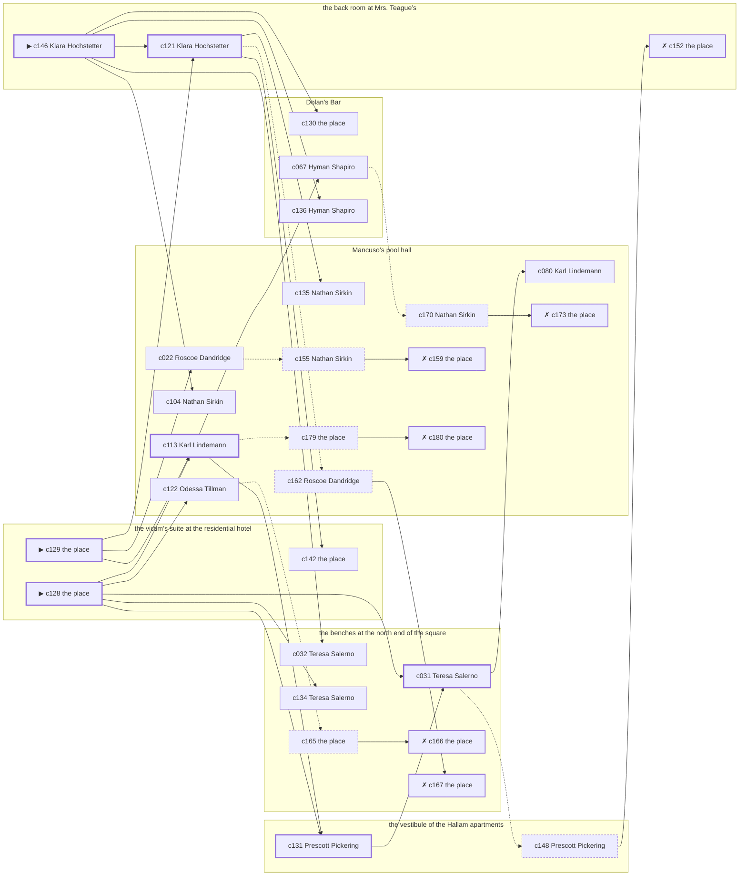

# Chelsea — case 12

**Seed** 12 · **Difficulty** 2 · **Attempts** 1 · **Detective** Humphrey

**Par** 8 actions · **Budget** 20 · **Slack** 12 · **Findable** 30 (spine 7, corroboration 11, noise 6 + 6 disqualifiers) · **Noise ratio** 40% · **Candidate pool** 181

## 1. The Truth

Roscoe Dandridge, a ward heeler, the victim’s business partner, killed Vincenzo Grasso, a buildings inspector, with poison in a drink at the victim’s suite at the residential hotel at 10:30 PM. Roscoe Dandridge wanted the victim out of a lease (property). Roscoe Dandridge had been at Dolan’s Bar earlier in the evening, where the weapon lived, and was alone with Vincenzo Grasso when it happened. Klara Hochstetter hired us.

## 2. Dramatis Personae

| Name | Role | Relationship | Class of secret | Motive | Found at | Killer |
| --- | --- | --- | --- | --- | --- | --- |
| Vincenzo Grasso | a buildings inspector | the victim | — | — | — | — |
| Klara Hochstetter (client) | a piano teacher | the victim’s tenant | hidden-family | — | the back room at Mrs. Teague’s | — |
| Odessa Tillman | a curb broker | in the victim’s debt | fence | exposure | Mancuso’s pool hall | — |
| Roscoe Dandridge | a ward heeler | the victim’s business partner | murder (+ blackmail) | property | Mancuso’s pool hall | **YES** |
| Teresa Salerno | a dentist with rooms on the third floor | in the victim’s debt | forged-identity | — | the benches at the north end of the square | — |
| Nunzio Lanza | a longshoreman | the victim’s tenant | gambling-debt | revenge | Mancuso’s pool hall | — |
| Gretchen Steinbach | a lawyer with one clerk | the victim’s lawyer | gambling-debt | — | the benches at the north end of the square | — |
| Nathan Sirkin | the man behind the counter | fixture (counterman) | — | — | Mancuso’s pool hall | — |
| Hyman Shapiro | the bartender | fixture (bartender) | — | — | Dolan’s Bar | — |
| Lorraine Prentiss | the landlady | fixture (landlady) | — | — | the back room at Mrs. Teague’s | — |
| Prescott Pickering | the elevator man | fixture (elevator-man) | — | — | the vestibule of the Hallam apartments | — |
| Karl Lindemann | the patrolman on the beat | fixture (beat-cop) | — | — | Mancuso’s pool hall | — |

## 3. Places

- **Mancuso’s pool hall** (semi) — watched by counterman (Nathan Sirkin); objects: a silver cigarette case, an ice pick, a nickel-plated revolver — within earshot of the scene
- **the victim’s suite at the residential hotel** (private) — unwatched; objects: a day ledger, a camel-hair overcoat on a hook — **THE SCENE**; the victim’s address
- **Dolan’s Bar** (semi) — watched by bartender (Hyman Shapiro); objects: a bottle of chloral drops, a seltzer siphon — where the weapon lived; within earshot of the scene
- **the benches at the north end of the square** (public) — unwatched; objects: a folded stack of evening papers, a brass umbrella stand
- **the back room at Mrs. Teague’s** (private) — watched by landlady (Lorraine Prentiss); objects: a length of sash cord, a bronze bookend, the roof-door key
- **the vestibule of the Hallam apartments** (private) — watched by elevator-man (Prescott Pickering); objects: none

## 4. Anchors

The coroner gives 10:00 PM–11:30 PM, four ticks wide. These are what close it: **el-train** and **fuse**.

- **the fuse going in the building** — at 10:00 PM; at the vestibule of the Hallam apartments. You can time things by it: a crack in the cellar and every light on the riser out at once. Those present carry it: candle smoke on the ceilings of everyone who sat it out.
- **the El going over** — at 6:30 PM, 7:30 PM, 8:30 PM, 9:30 PM, 10:30 PM, 11:30 PM; across the whole neighbourhood. You can time things by it: everything under the structure stops being audible for twenty seconds.
- **the beat cop’s pass** — at 6:00 PM, 7:30 PM, 9:00 PM, 10:30 PM; on a round through Mancuso’s pool hall → Dolan’s Bar → the benches at the north end of the square. Somebody reliable notes who was there.

## 5. Timelines

### Vincenzo Grasso — the victim

| Tick | Time | Truth | Claimed | Companion claimed |
| --- | --- | --- | --- | --- |
| 0 | 6:00 PM | the vestibule of the Hallam apartments | the vestibule of the Hallam apartments | — |
| 1 | 6:30 PM | the vestibule of the Hallam apartments | the vestibule of the Hallam apartments | — |
| 2 | 7:00 PM | Dolan’s Bar | Dolan’s Bar | — |
| 3 | 7:30 PM | Dolan’s Bar | Dolan’s Bar | — |
| 4 | 8:00 PM | the victim’s suite at the residential hotel | the victim’s suite at the residential hotel | — |
| 5 | 8:30 PM | Mancuso’s pool hall | Mancuso’s pool hall | — |
| 6 | 9:00 PM | Mancuso’s pool hall | Mancuso’s pool hall | — |
| 7 | 9:30 PM | Mancuso’s pool hall | Mancuso’s pool hall | — |
| 8 | 10:00 PM | the vestibule of the Hallam apartments | the vestibule of the Hallam apartments | — |
| 9 | 10:30 PM | the victim’s suite at the residential hotel ☠ | the victim’s suite at the residential hotel | — |
| 10 | 11:00 PM | — | — | — |
| 11 | 11:30 PM | — | — | — |

### Klara Hochstetter

| Tick | Time | Truth | Claimed | Companion claimed |
| --- | --- | --- | --- | --- |
| 0 | 6:00 PM | Mancuso’s pool hall | Mancuso’s pool hall | — |
| 1 | 6:30 PM | the benches at the north end of the square | the benches at the north end of the square | — |
| 2 | 7:00 PM | Dolan’s Bar | Dolan’s Bar | — |
| 3 | 7:30 PM | the back room at Mrs. Teague’s | **Dolan’s Bar** | — |
| 4 | 8:00 PM | the back room at Mrs. Teague’s | the back room at Mrs. Teague’s | — |
| 5 | 8:30 PM | the back room at Mrs. Teague’s | the back room at Mrs. Teague’s | — |
| 6 | 9:00 PM | Mancuso’s pool hall | Mancuso’s pool hall | — |
| 7 | 9:30 PM | the back room at Mrs. Teague’s | the back room at Mrs. Teague’s | — |
| 8 | 10:00 PM | the benches at the north end of the square | the benches at the north end of the square | — |
| 9 | 10:30 PM | Mancuso’s pool hall | Mancuso’s pool hall | — |
| 10 | 11:00 PM | Dolan’s Bar | Dolan’s Bar | — |
| 11 | 11:30 PM | Dolan’s Bar | Dolan’s Bar | — |

### Odessa Tillman

| Tick | Time | Truth | Claimed | Companion claimed |
| --- | --- | --- | --- | --- |
| 0 | 6:00 PM | Dolan’s Bar | Dolan’s Bar | — |
| 1 | 6:30 PM | the victim’s suite at the residential hotel | the victim’s suite at the residential hotel | — |
| 2 | 7:00 PM | the victim’s suite at the residential hotel | the victim’s suite at the residential hotel | — |
| 3 | 7:30 PM | the benches at the north end of the square | the benches at the north end of the square | — |
| 4 | 8:00 PM | the benches at the north end of the square | the benches at the north end of the square | — |
| 5 | 8:30 PM | the benches at the north end of the square | the benches at the north end of the square | — |
| 6 | 9:00 PM | Mancuso’s pool hall | **the back room at Mrs. Teague’s** | — |
| 7 | 9:30 PM | Mancuso’s pool hall | **the back room at Mrs. Teague’s** | — |
| 8 | 10:00 PM | Mancuso’s pool hall | Mancuso’s pool hall | — |
| 9 | 10:30 PM | Mancuso’s pool hall | Mancuso’s pool hall | — |
| 10 | 11:00 PM | Dolan’s Bar | Dolan’s Bar | — |
| 11 | 11:30 PM | Dolan’s Bar | Dolan’s Bar | — |

### Roscoe Dandridge — the killer

| Tick | Time | Truth | Claimed | Companion claimed |
| --- | --- | --- | --- | --- |
| 0 | 6:00 PM | Mancuso’s pool hall | Mancuso’s pool hall | — |
| 1 | 6:30 PM | Mancuso’s pool hall | Mancuso’s pool hall | — |
| 2 | 7:00 PM | Mancuso’s pool hall | Mancuso’s pool hall | — |
| 3 | 7:30 PM | Mancuso’s pool hall | Mancuso’s pool hall | — |
| 4 | 8:00 PM | Mancuso’s pool hall | Mancuso’s pool hall | — |
| 5 | 8:30 PM | the vestibule of the Hallam apartments | **the back room at Mrs. Teague’s** | Gretchen Steinbach |
| 6 | 9:00 PM | Dolan’s Bar | Dolan’s Bar | — |
| 7 | 9:30 PM | Dolan’s Bar | Dolan’s Bar | — |
| 8 | 10:00 PM | Dolan’s Bar | Dolan’s Bar | — |
| 9 | 10:30 PM | the victim’s suite at the residential hotel ☠ | **Mancuso’s pool hall** | — |
| 10 | 11:00 PM | the back room at Mrs. Teague’s | the back room at Mrs. Teague’s | — |
| 11 | 11:30 PM | the vestibule of the Hallam apartments | the vestibule of the Hallam apartments | — |

### Teresa Salerno

| Tick | Time | Truth | Claimed | Companion claimed |
| --- | --- | --- | --- | --- |
| 0 | 6:00 PM | the benches at the north end of the square | the benches at the north end of the square | — |
| 1 | 6:30 PM | the benches at the north end of the square | the benches at the north end of the square | — |
| 2 | 7:00 PM | the victim’s suite at the residential hotel | the victim’s suite at the residential hotel | — |
| 3 | 7:30 PM | the victim’s suite at the residential hotel | the victim’s suite at the residential hotel | — |
| 4 | 8:00 PM | the victim’s suite at the residential hotel | the victim’s suite at the residential hotel | — |
| 5 | 8:30 PM | the benches at the north end of the square | the benches at the north end of the square | — |
| 6 | 9:00 PM | Dolan’s Bar | Dolan’s Bar | — |
| 7 | 9:30 PM | Dolan’s Bar | Dolan’s Bar | — |
| 8 | 10:00 PM | Dolan’s Bar | Dolan’s Bar | — |
| 9 | 10:30 PM | Mancuso’s pool hall | Mancuso’s pool hall | — |
| 10 | 11:00 PM | Mancuso’s pool hall | Mancuso’s pool hall | — |
| 11 | 11:30 PM | the benches at the north end of the square | the benches at the north end of the square | — |

### Nunzio Lanza

| Tick | Time | Truth | Claimed | Companion claimed |
| --- | --- | --- | --- | --- |
| 0 | 6:00 PM | the victim’s suite at the residential hotel | the victim’s suite at the residential hotel | — |
| 1 | 6:30 PM | Mancuso’s pool hall | Mancuso’s pool hall | — |
| 2 | 7:00 PM | Mancuso’s pool hall | Mancuso’s pool hall | — |
| 3 | 7:30 PM | Mancuso’s pool hall | Mancuso’s pool hall | — |
| 4 | 8:00 PM | Mancuso’s pool hall | Mancuso’s pool hall | — |
| 5 | 8:30 PM | Mancuso’s pool hall | Mancuso’s pool hall | — |
| 6 | 9:00 PM | Mancuso’s pool hall | Mancuso’s pool hall | — |
| 7 | 9:30 PM | Mancuso’s pool hall | Mancuso’s pool hall | — |
| 8 | 10:00 PM | Mancuso’s pool hall | **the vestibule of the Hallam apartments** | — |
| 9 | 10:30 PM | Mancuso’s pool hall | **the vestibule of the Hallam apartments** | — |
| 10 | 11:00 PM | the benches at the north end of the square | the benches at the north end of the square | — |
| 11 | 11:30 PM | the benches at the north end of the square | the benches at the north end of the square | — |

### Gretchen Steinbach

| Tick | Time | Truth | Claimed | Companion claimed |
| --- | --- | --- | --- | --- |
| 0 | 6:00 PM | Dolan’s Bar | Dolan’s Bar | — |
| 1 | 6:30 PM | Dolan’s Bar | Dolan’s Bar | — |
| 2 | 7:00 PM | the back room at Mrs. Teague’s | the back room at Mrs. Teague’s | — |
| 3 | 7:30 PM | the back room at Mrs. Teague’s | the back room at Mrs. Teague’s | — |
| 4 | 8:00 PM | Mancuso’s pool hall | Mancuso’s pool hall | — |
| 5 | 8:30 PM | the victim’s suite at the residential hotel | the victim’s suite at the residential hotel | — |
| 6 | 9:00 PM | the victim’s suite at the residential hotel | the victim’s suite at the residential hotel | — |
| 7 | 9:30 PM | the benches at the north end of the square | the benches at the north end of the square | — |
| 8 | 10:00 PM | the benches at the north end of the square | the benches at the north end of the square | — |
| 9 | 10:30 PM | Mancuso’s pool hall | **the vestibule of the Hallam apartments** | — |
| 10 | 11:00 PM | the benches at the north end of the square | the benches at the north end of the square | — |
| 11 | 11:30 PM | the benches at the north end of the square | the benches at the north end of the square | — |

### Fixtures (never lie, never withhold)

| Tick | Time | Nathan Sirkin (the man behind the counter) | Hyman Shapiro (the bartender) | Lorraine Prentiss (the landlady) | Prescott Pickering (the elevator man) | Karl Lindemann (the patrolman on the beat) |
| --- | --- | --- | --- | --- | --- | --- |
| 0 | 6:00 PM | Mancuso’s pool hall | Dolan’s Bar | the back room at Mrs. Teague’s | the vestibule of the Hallam apartments | Mancuso’s pool hall |
| 1 | 6:30 PM | Dolan’s Bar | Dolan’s Bar | the back room at Mrs. Teague’s | the vestibule of the Hallam apartments | — |
| 2 | 7:00 PM | Mancuso’s pool hall | Dolan’s Bar | the back room at Mrs. Teague’s | the vestibule of the Hallam apartments | — |
| 3 | 7:30 PM | Mancuso’s pool hall | Dolan’s Bar | the back room at Mrs. Teague’s | the vestibule of the Hallam apartments | Dolan’s Bar |
| 4 | 8:00 PM | Mancuso’s pool hall | Dolan’s Bar | the back room at Mrs. Teague’s | the vestibule of the Hallam apartments | — |
| 5 | 8:30 PM | Mancuso’s pool hall | Dolan’s Bar | the back room at Mrs. Teague’s | the vestibule of the Hallam apartments | — |
| 6 | 9:00 PM | Mancuso’s pool hall | Dolan’s Bar | the back room at Mrs. Teague’s | the vestibule of the Hallam apartments | the benches at the north end of the square |
| 7 | 9:30 PM | Mancuso’s pool hall | Dolan’s Bar | the back room at Mrs. Teague’s | the vestibule of the Hallam apartments | — |
| 8 | 10:00 PM | Mancuso’s pool hall | Dolan’s Bar | the back room at Mrs. Teague’s | the vestibule of the Hallam apartments | — |
| 9 | 10:30 PM | Mancuso’s pool hall | Dolan’s Bar | the back room at Mrs. Teague’s | the vestibule of the Hallam apartments | Mancuso’s pool hall |
| 10 | 11:00 PM | Mancuso’s pool hall | Dolan’s Bar | the back room at Mrs. Teague’s | the vestibule of the Hallam apartments | — |
| 11 | 11:30 PM | Mancuso’s pool hall | Dolan’s Bar | the back room at Mrs. Teague’s | the vestibule of the Hallam apartments | — |

## 6. Secrets in play

- **Klara Hochstetter** (hidden-family): Klara Hochstetter goes to the back room at Mrs. Teague’s from 7:30 PM to see a child nobody is supposed to know about.
- **Odessa Tillman** (fence): Odessa Tillman hands a parcel of stolen goods to a man at Mancuso’s pool hall from 9:00 PM to 9:30 PM.
- **Roscoe Dandridge** (murder): Roscoe Dandridge is at the victim’s suite at the residential hotel from 10:30 PM, alone with Vincenzo Grasso when it happens at 10:30 PM.
- **Roscoe Dandridge** also (blackmail): Roscoe Dandridge meets the victim alone at the vestibule of the Hallam apartments from 8:30 PM and asks for money.
- **Teresa Salerno** (forged-identity): Teresa Salerno is not the person the papers say. Nothing about the evening is hidden; the lie is all in the paperwork.
- **Nunzio Lanza** (gambling-debt): Nunzio Lanza slips off to Mancuso’s pool hall from 10:00 PM to 10:30 PM to settle with a bookmaker.
- **Gretchen Steinbach** (gambling-debt): Gretchen Steinbach slips off to Mancuso’s pool hall from 10:30 PM to settle with a bookmaker.

## 7. Clue list — the 30 findable

The opening three, free at the start: c128, c129, c146. Everything else has to be led to. The full candidate pool is in the companion file.

### At Mancuso’s pool hall

- **c113** [spine] (observation; Karl Lindemann on who was there at 10:30 PM) → c131, c067, c179
  - Karl Lindemann runs through it: at 10:30 PM there were Klara Hochstetter, Odessa Tillman, Teresa Salerno, Nunzio Lanza, Gretchen Steinbach at Mancuso’s pool hall, and nobody else worth naming.
  - _establishes: Klara Hochstetter at Mancuso’s pool hall, 10:30 PM; Odessa Tillman at Mancuso’s pool hall, 10:30 PM; Teresa Salerno at Mancuso’s pool hall, 10:30 PM; Nunzio Lanza at Mancuso’s pool hall, 10:30 PM; Gretchen Steinbach at Mancuso’s pool hall, 10:30 PM_
- **c104** [corroboration] (observation; Nathan Sirkin on who was there at 10:30 PM) → (end)
  - Nathan Sirkin runs through it: at 10:30 PM there were Klara Hochstetter, Odessa Tillman, Teresa Salerno, Nunzio Lanza, Gretchen Steinbach at Mancuso’s pool hall, and nobody else worth naming.
  - _establishes: Klara Hochstetter at Mancuso’s pool hall, 10:30 PM; Odessa Tillman at Mancuso’s pool hall, 10:30 PM; Teresa Salerno at Mancuso’s pool hall, 10:30 PM; Nunzio Lanza at Mancuso’s pool hall, 10:30 PM; Gretchen Steinbach at Mancuso’s pool hall, 10:30 PM_
- **c122** [corroboration] (observation; Odessa Tillman on Roscoe Dandridge’s account) → c165
  - Odessa Tillman was at Mancuso’s pool hall at 10:30 PM and says Roscoe Dandridge was not.
  - _establishes: Roscoe Dandridge not at Mancuso’s pool hall, 10:30 PM_
- **c135** [corroboration] (anchor; Nathan Sirkin on the noise that evening) → (end)
  - Nathan Sirkin was at Mancuso’s pool hall at 10:30 PM and heard a chair going over from the direction of the victim’s suite at the residential hotel, just as the El went over.
  - _establishes: noise at the victim’s suite at the residential hotel at 10:30 PM; the victim dead by 10:30 PM; how it was done_
- **c080** [corroboration] (observation; Karl Lindemann on Klara Hochstetter) → (end)
  - Karl Lindemann says Klara Hochstetter was at Mancuso’s pool hall at 10:30 PM.
  - _establishes: Klara Hochstetter at Mancuso’s pool hall, 10:30 PM_
- **c022** [corroboration] (observation; Roscoe Dandridge on Teresa Salerno) → c155
  - Roscoe Dandridge says Teresa Salerno was at Dolan’s Bar from 9:00 PM to 10:00 PM.
  - _establishes: Teresa Salerno at Dolan’s Bar, 9:00 PM–10:00 PM; Teresa Salerno could reach the weapon_
- **c170** [noise {b2}] (overheard; Nathan Sirkin on Nunzio Lanza) → c173
  - Nathan Sirkin on Nunzio Lanza: Nunzio Lanza goes very quiet when the racing wire is mentioned.
  - _establishes: context only_
- **c173** [disqualifier {b2}] (overheard; the place itself) → (end)
  - The bookmaker’s runner is found and will say it: Nunzio Lanza was at Mancuso’s pool hall from 10:00 PM to 10:30 PM paying off eleven hundred dollars, a dollar at a time, and went nowhere near the killing.
  - _establishes: Nunzio Lanza’s gambling-debt accounted for; Nunzio Lanza at Mancuso’s pool hall, 10:00 PM–10:30 PM_
- **c155** [noise {b3}] (overheard; Nathan Sirkin on Odessa Tillman) → c159
  - Nathan Sirkin on Odessa Tillman: There is a man who meets people at Mancuso’s pool hall and nobody will say his name out loud.
  - _establishes: context only_
- **c159** [disqualifier {b3}] (overheard; the place itself) → (end)
  - The receiver at Mancuso’s pool hall would rather talk than be held: Odessa Tillman was there from 9:00 PM to 9:30 PM handing over a parcel of somebody else’s silver, which is a charge Odessa Tillman will take over this one.
  - _establishes: Odessa Tillman’s fence accounted for; Odessa Tillman at Mancuso’s pool hall, 9:00 PM–9:30 PM_
- **c179** [noise {b4}] (physical; the place itself) → c180
  - A book of markers at Mancuso’s pool hall with Gretchen Steinbach’s initials against four of them.
  - _establishes: context only_
- **c180** [disqualifier {b4}] (overheard; the place itself) → (end)
  - The bookmaker’s runner is found and will say it: Gretchen Steinbach was at Mancuso’s pool hall from 10:30 PM paying off eleven hundred dollars, a dollar at a time, and went nowhere near the killing.
  - _establishes: Gretchen Steinbach’s gambling-debt accounted for; Gretchen Steinbach at Mancuso’s pool hall, 10:30 PM_
- **c162** [noise {b6}] (overheard; Roscoe Dandridge on Teresa Salerno) → c167
  - Roscoe Dandridge on Teresa Salerno: Two signatures of Teresa Salerno’s, a month apart, are in different hands.
  - _establishes: context only_

### At the victim’s suite at the residential hotel

- **c128** [spine ⟨opening⟩] (scene; the place itself) → c113, c131, c031, c122, c134
  - Vincenzo Grasso was found at the victim’s suite at the residential hotel. A glass is on its side and the spill had not yet reached the edge of the table when it dried. The El going over came at 10:30 PM, and the El was running to timetable and it covers the half hour exactly. That puts the killing in that half hour and no later.
  - _establishes: the victim dead by 10:30 PM; how it was done_
- **c129** [spine ⟨opening⟩] (morgue; the place itself) → c113, c121, c022
  - The coroner puts death between 10:00 PM and 11:30 PM — two hours of nothing useful. Chloral hydrate in the stomach. No wound, no bruising, no sign of a struggle.
  - _establishes: death between 10:00 PM and 11:30 PM; how it was done_
- **c142** [corroboration] (document; the place itself) → (end)
  - Found at the victim’s suite at the residential hotel: A lease assignment made out in Roscoe Dandridge’s name, waiting only on Vincenzo Grasso’s signature.
  - _establishes: Roscoe Dandridge had a motive (property)_

### At Dolan’s Bar

- **c130** [corroboration] (physical; the place itself) → (end)
  - A bottle of chloral drops is gone from Dolan’s Bar. The bottle is gone from the shelf and the ring of dust it stood in is still there.
  - _establishes: something gone from Dolan’s Bar; how it was done_
- **c067** [corroboration] (observation; Hyman Shapiro on Roscoe Dandridge) → c170
  - Hyman Shapiro says Roscoe Dandridge was at Dolan’s Bar from 9:00 PM to 10:00 PM.
  - _establishes: Roscoe Dandridge at Dolan’s Bar, 9:00 PM–10:00 PM; Roscoe Dandridge could reach the weapon_
- **c136** [corroboration] (anchor; Hyman Shapiro on the noise that evening) → (end)
  - Hyman Shapiro was at Dolan’s Bar at 10:30 PM and heard a chair going over from the direction of the victim’s suite at the residential hotel, just as the El went over.
  - _establishes: noise at the victim’s suite at the residential hotel at 10:30 PM; the victim dead by 10:30 PM; how it was done_

### At the benches at the north end of the square

- **c031** [spine] (observation; Teresa Salerno on Roscoe Dandridge) → c080, c148
  - Teresa Salerno says Roscoe Dandridge was at Dolan’s Bar from 9:00 PM to 10:00 PM.
  - _establishes: Roscoe Dandridge at Dolan’s Bar, 9:00 PM–10:00 PM; Roscoe Dandridge could reach the weapon_
- **c032** [corroboration] (observation; Teresa Salerno on Nunzio Lanza) → (end)
  - Teresa Salerno says Nunzio Lanza was at Mancuso’s pool hall at 10:30 PM.
  - _establishes: Nunzio Lanza at Mancuso’s pool hall, 10:30 PM_
- **c134** [corroboration] (anchor; Teresa Salerno on the noise that evening) → (end)
  - Teresa Salerno was at Mancuso’s pool hall at 10:30 PM and heard a chair going over from the direction of the victim’s suite at the residential hotel, just as the El went over.
  - _establishes: noise at the victim’s suite at the residential hotel at 10:30 PM; the victim dead by 10:30 PM; how it was done_
- **c165** [noise {b1}] (physical; the place itself) → c166
  - A steamship ticket stub among Teresa Salerno’s things, in the name of a man who died at Belleau Wood.
  - _establishes: context only_
- **c166** [disqualifier {b1}] (overheard; the place itself) → (end)
  - The name Teresa Salerno was born with turns up on a desertion warrant from 1918. Teresa Salerno has been hiding from the Army for eleven years and from nobody else.
  - _establishes: Teresa Salerno’s forged-identity accounted for_
- **c167** [disqualifier {b6}] (overheard; the place itself) → (end)
  - The papers are forged and the reason is plain: Teresa Salerno was put out of the country once already and does not mean to be put out twice.
  - _establishes: Teresa Salerno’s forged-identity accounted for_

### At the back room at Mrs. Teague’s

- **c146** [spine ⟨opening⟩] (client; Klara Hochstetter on why I was hired) → c121, c104, c130, c032, c136
  - Klara Hochstetter hired us. Klara Hochstetter wants it known that Roscoe Dandridge wanted the victim out of a lease, and would rather we started there.
  - _establishes: Roscoe Dandridge had a motive (property)_
- **c121** [spine] (observation; Klara Hochstetter on Roscoe Dandridge’s account) → c142, c135, c162
  - Klara Hochstetter was at Mancuso’s pool hall at 10:30 PM and says Roscoe Dandridge was not.
  - _establishes: Roscoe Dandridge not at Mancuso’s pool hall, 10:30 PM_
- **c152** [disqualifier {b5}] (overheard; the place itself) → (end)
  - The woman who keeps the child says it straight out: Klara Hochstetter was at the back room at Mrs. Teague’s from 7:30 PM, the same as every week, and left with the same face as always.
  - _establishes: Klara Hochstetter’s hidden-family accounted for; Klara Hochstetter at the back room at Mrs. Teague’s, 7:30 PM_

### At the vestibule of the Hallam apartments

- **c131** [spine] (anchor; Prescott Pickering on Vincenzo Grasso that evening) → c031
  - Prescott Pickering puts Vincenzo Grasso at the vestibule of the Hallam apartments when the lights went, which was 10:00 PM, and alive enough to argue about the weather.
  - _establishes: the victim alive at 10:00 PM; Vincenzo Grasso at the vestibule of the Hallam apartments, 10:00 PM_
- **c148** [noise {b5}] (overheard; Prescott Pickering on Klara Hochstetter) → c152
  - Prescott Pickering on Klara Hochstetter: A woman at the back room at Mrs. Teague’s asked for Klara Hochstetter by a name Klara Hochstetter has not used in years.
  - _establishes: context only_

## 8. Clue graph

## 9. Deduction path

Par is **8 actions** against a budget of 20: 12 spare. Every id below is a spine clue.

**Time of death.** The coroner gives four ticks. The anchors close it to 10:30 PM: one puts Vincenzo Grasso alive at 10:00 PM, the other times the scene at 10:30 PM. _(c129, c131, c128; + 3 corroborating)_

**Clearing the innocent.**

- Klara Hochstetter was not at the victim’s suite at the residential hotel at 10:30 PM, on two independent sources. _(c113; + 2 corroborating)_
- Odessa Tillman was not at the victim’s suite at the residential hotel at 10:30 PM, on two independent sources. _(c113; + 1 corroborating)_
- Teresa Salerno was not at the victim’s suite at the residential hotel at 10:30 PM, on two independent sources. _(c113; + 1 corroborating)_
- Nunzio Lanza was not at the victim’s suite at the residential hotel at 10:30 PM, on two independent sources. _(c113; + 3 corroborating)_
- Gretchen Steinbach was not at the victim’s suite at the residential hotel at 10:30 PM, on two independent sources. _(c113; + 2 corroborating)_

**Naming the killer.** Roscoe Dandridge claims Mancuso’s pool hall at 10:30 PM. Two independent sources put that out of the question. _(c121; + 1 corroborating)_

**The weapon.** Roscoe Dandridge was at Dolan’s Bar before 10:30 PM, where a bottle of chloral drops was kept. _(c031; + 1 corroborating)_

**Method.** Poison in a drink, on two physical sources. _(c128, c129; + 4 corroborating)_

**Motive.** property, on two independent sources. _(c146; + 1 corroborating)_

## 10. Red herrings

**Innocents who lie about the murder tick:**

- Nunzio Lanza claims the vestibule of the Hallam apartments at 10:30 PM and was really at Mancuso’s pool hall. Reason: Nunzio Lanza slips off to Mancuso’s pool hall from 10:00 PM to 10:30 PM to settle with a bookmaker.
- Gretchen Steinbach claims the vestibule of the Hallam apartments at 10:30 PM and was really at Mancuso’s pool hall. Reason: Gretchen Steinbach slips off to Mancuso’s pool hall from 10:30 PM to settle with a bookmaker.

**Innocents with a motive:**

- Odessa Tillman — exposure: was about to be exposed by the victim.
- Nunzio Lanza — revenge: blamed the victim for a ruin.

**Noise branches, and what knocks each one down:**

- **b1** (Teresa Salerno, forged-identity): c165 → **c166** — The name Teresa Salerno was born with turns up on a desertion warrant from 1918. Teresa Salerno has been hiding from the Army for eleven years and from nobody else.
- **b2** (Nunzio Lanza, gambling-debt): c170 → **c173** — The bookmaker’s runner is found and will say it: Nunzio Lanza was at Mancuso’s pool hall from 10:00 PM to 10:30 PM paying off eleven hundred dollars, a dollar at a time, and went nowhere near the killing.
- **b3** (Odessa Tillman, fence): c155 → **c159** — The receiver at Mancuso’s pool hall would rather talk than be held: Odessa Tillman was there from 9:00 PM to 9:30 PM handing over a parcel of somebody else’s silver, which is a charge Odessa Tillman will take over this one.
- **b4** (Gretchen Steinbach, gambling-debt): c179 → **c180** — The bookmaker’s runner is found and will say it: Gretchen Steinbach was at Mancuso’s pool hall from 10:30 PM paying off eleven hundred dollars, a dollar at a time, and went nowhere near the killing.
- **b5** (Klara Hochstetter, hidden-family): c148 → **c152** — The woman who keeps the child says it straight out: Klara Hochstetter was at the back room at Mrs. Teague’s from 7:30 PM, the same as every week, and left with the same face as always.
- **b6** (Teresa Salerno, forged-identity): c162 → **c167** — The papers are forged and the reason is plain: Teresa Salerno was put out of the country once already and does not mean to be put out twice.

