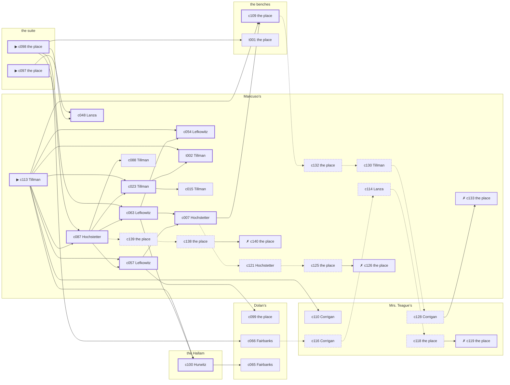

# Chelsea — case 12

**Seed** 12 · **Difficulty** 2 · **Attempts** 1 · **Detective** Dashiell

**Type** murder · **Trope** body-moved · **Unknowns** who, why, when, where

**Par** 13 actions · **Slack** 6 · **Budget** 19 · **Findable** 34 (spine 13, corroboration 7, noise 10 + 4 disqualifiers) · **Noise ratio** 41% · **Candidate pool** 150

## 1. The Truth

Roscoe Dandridge, a ward heeler, Grasso’s business partner, killed Vincenzo Grasso, a buildings inspector, with poison in a drink at the suite at 6:30 PM. Dandridge wanted Grasso out of the lease and the lease in Dandridge’s name (property). Dandridge had been at Dolan’s earlier in the evening, where the means lived, and was alone with Grasso when it happened. Tillman hired us.

## 2. The Act

**murder** · **body-moved** · actor **Dandridge** · at **the suite** · at **6:30 PM**

- found at the benches
- fate: dead

**Givens** — what the briefing states and the report does not ask:

- Grasso was found dead at the benches.
- Grasso was not killed at the benches: there is no blood there and no sign of a struggle.
- The coroner puts it between 6:00 PM and 7:30 PM.
- It was poison in a drink, and it happened somewhere else.

**Unknowns** — exactly what the report asks: **who**, **why**, **when**, **where**.

## 3. Dramatis Personae

| Name | Role | Relationship | Class of secret | Motive | Found at | Killer |
| --- | --- | --- | --- | --- | --- | --- |
| Vincenzo Grasso | a buildings inspector | the victim | — | — | — | — |
| Klara Hochstetter | a piano teacher | Grasso’s tenant | hidden-family | — | Mancuso’s | — |
| Odessa Tillman (client) | a curb broker | in Grasso’s debt | fence | exposure | Mancuso’s | — |
| Roscoe Dandridge | a ward heeler | Grasso’s business partner | murder | property | the benches | **YES** |
| Teresa Salerno | a dentist with a chair and a waiting room | in Grasso’s debt | forged-identity | — | Mancuso’s | — |
| Nunzio Lanza | a longshoreman | Grasso’s tenant | gambling-debt | revenge | Mancuso’s | — |
| Gretchen Steinbach | a lawyer with one clerk | Grasso’s lawyer | gambling-debt | — | Mancuso’s | — |
| Hyman Lefkowitz | the man behind the counter | fixture (counterman) | — | — | Mancuso’s | — |
| Ellsworth Fairbanks | the bartender | fixture (bartender) | — | — | Dolan’s | — |
| Kathleen Corrigan | the landlady | fixture (landlady) | — | — | Mrs. Teague’s | — |
| Louis Hurwitz | the elevator man | fixture (elevator-man) | — | — | the Hallam | — |
| Cornelius Hanrahan | the patrolman on the beat | fixture (beat-cop) | — | — | Mancuso’s | — |

## 4. Dossiers

Every person, by layer: **0** on sight, **1** volunteered, **2** from other people, **3** in the documents.

### Grasso — the victim

50, a man, a buildings inspector. Wants: money.

- **Standing** — Grasso could close a building with a signature, and had closed two.
- **Profession** — Grasso had a district and a price for everything in it.
- **Found** — Tillman found Grasso at the benches at 7:00 PM. By Tillman, at the benches, at 7:00 PM. Precinct: called-it-a-fall.

**Layer 0, on sight**

- _gender_ — A man.
- _age_ — In his fifties.

**Layer 1, volunteered**

- _profession_ — A buildings inspector.
- _detail_ — Grasso had a district and a price for everything in it.

**Layer 2, from other people**

- _tie_ — Grasso could close a building with a signature, and had closed two.
- _want_ — Grasso wants money, and is not particular about the shape it arrives in.

**Self-account** (layer 1, what they say when asked about themselves)

- Grasso is 50 years old and a buildings inspector.
- Grasso had a district and a price for everything in it.
- Grasso is the one this is about.

### Hochstetter

37, a woman, a piano teacher. Wants: to-be-forgiven. Tie: Grasso’s tenant, since the flu year.

**Layer 0, on sight**

- _gender_ — A woman.
- _age_ — In her thirties.

**Layer 1, volunteered**

- _profession_ — A piano teacher.
- _detail_ — Hochstetter takes pupils in the front room from four until seven and hears every scale twice.

**Layer 2, from other people**

- _tie_ — Hochstetter took the rooms over the Hallam from Grasso and has been two weeks behind since the spring.
- _want_ — Hochstetter wants to be forgiven for something nobody else remembers.
- _since_ — Hochstetter has been Grasso’s tenant, since the flu year.

**Layer 3, in the documents**

- _secret-hint_ — Hochstetter sends money out of every pay envelope and cannot say where it goes.

**Self-account** (layer 1, what they say when asked about themselves)

- Hochstetter is 37 years old and a piano teacher.
- Hochstetter takes pupils in the front room from four until seven and hears every scale twice.
- Hochstetter is Grasso’s tenant.

### Tillman — the client

47, a woman, a curb broker. Wants: to-be-somebody. Tie: in Grasso’s debt, since the flu year.

**Layer 0, on sight**

- _gender_ — A woman.
- _age_ — In her forties.

**Layer 1, volunteered**

- _profession_ — A curb broker.
- _detail_ — Tillman trades on the street for men who would rather not be seen doing it.

**Layer 2, from other people**

- _tie_ — Grasso carried Tillman through a bad winter and has been collecting on it ever since.
- _want_ — Tillman wants a name people know.
- _since_ — Tillman has been in Grasso’s debt, since the flu year.

**Layer 3, in the documents**

- _secret-hint_ — Tillman was carrying a parcel into Mancuso’s and came out without it.

**Self-account** (layer 1, what they say when asked about themselves)

- Tillman is 47 years old and a curb broker.
- Tillman trades on the street for men who would rather not be seen doing it.
- Tillman is in Grasso’s debt.

### Dandridge — the killer

37, a man, a ward heeler. Wants: money. Tie: Grasso’s business partner, since ’23.

**Layer 0, on sight**

- _gender_ — A man.
- _age_ — In his thirties.

**Layer 1, volunteered**

- _profession_ — A ward heeler.
- _detail_ — Dandridge carries the district for the club and is paid in favours.

**Layer 2, from other people**

- _tie_ — Dandridge bought into Grasso’s business the year Emilio Vitale walked out of it.
- _want_ — Dandridge wants money, and is not particular about the shape it arrives in.
- _since_ — Dandridge has been Grasso’s business partner, since ’23.
- _third_ — Emilio Vitale is a partner who walked out of the business.

**Self-account** (layer 1, what they say when asked about themselves)

- Dandridge is 37 years old and a ward heeler.
- Dandridge carries the district for the club and is paid in favours.
- Dandridge is Grasso’s business partner.

### Salerno

49, a woman, a dentist with a chair and a waiting room. Wants: respectability. Tie: in Grasso’s debt, since the flu year.

**Layer 0, on sight**

- _gender_ — A woman.
- _age_ — In her forties.

**Layer 1, volunteered**

- _profession_ — A dentist with a chair and a waiting room.
- _detail_ — Salerno bought the practice second-hand and is still paying for the chair.

**Layer 2, from other people**

- _tie_ — Salerno has owed Grasso money since ’20 and has not been asked for it lately.
- _want_ — Salerno wants to be thought respectable by people who are not.
- _since_ — Salerno has been in Grasso’s debt, since the flu year.

**Layer 3, in the documents**

- _secret-hint_ — Salerno’s registration card gives an address on a street that does not exist.

**Self-account** (layer 1, what they say when asked about themselves)

- Salerno is 49 years old and a dentist with a chair and a waiting room.
- Salerno bought the practice second-hand and is still paying for the chair.
- Salerno is in Grasso’s debt.

### Lanza

34, a man, a longshoreman. Wants: to-be-feared. Tie: Grasso’s tenant, since the flu year.

**Layer 0, on sight**

- _gender_ — A man.
- _age_ — In his thirties.
- _profession_ — A longshoreman.

**Layer 1, volunteered**

- _detail_ — Lanza has a hook, a union button and three days a week.

**Layer 2, from other people**

- _tie_ — Grasso put Lanza’s rent up twice in a year and Lanza paid it twice.
- _want_ — Lanza wants to be the one people are careful around.
- _since_ — Lanza has been Grasso’s tenant, since the flu year.

**Layer 3, in the documents**

- _secret-hint_ — Lanza was asking around for a hundred dollars in a hurry earlier in the week.

**Self-account** (layer 1, what they say when asked about themselves)

- Lanza is 34 years old and a longshoreman.
- Lanza has a hook, a union button and three days a week.
- Lanza is Grasso’s tenant.

### Steinbach

48, a woman, a lawyer with one clerk. Wants: money. Tie: Grasso’s lawyer, going back to the war.

**Layer 0, on sight**

- _gender_ — A woman.
- _age_ — In her forties.

**Layer 1, volunteered**

- _profession_ — A lawyer with one clerk.
- _detail_ — Steinbach practises alone and takes whatever walks up the stairs.

**Layer 2, from other people**

- _tie_ — Grasso brought Steinbach the business Concetta Marchetti would not touch.
- _want_ — Steinbach wants money, and is not particular about the shape it arrives in.
- _since_ — Steinbach has been Grasso’s lawyer, going back to the war.
- _third_ — Concetta Marchetti is a woman they had both been seeing.

**Layer 3, in the documents**

- _secret-hint_ — Steinbach was asking around for a hundred dollars in a hurry earlier in the week.

**Self-account** (layer 1, what they say when asked about themselves)

- Steinbach is 48 years old and a lawyer with one clerk.
- Steinbach practises alone and takes whatever walks up the stairs.
- Steinbach is Grasso’s lawyer.

### Lefkowitz

45, a man, the man behind the counter. Wants: to-be-left-alone. Tie: behind the counter at Mancuso’s.

**Layer 0, on sight**

- _gender_ — A man.
- _age_ — In his forties.
- _profession_ — The man behind the counter.

**Layer 1, volunteered**

- _detail_ — Lefkowitz serves at Mancuso’s and has never once been asked his name.

**Layer 2, from other people**

- _tie_ — Lefkowitz is behind the counter at Mancuso’s.
- _want_ — Lefkowitz wants to be left alone.

**Self-account** (layer 1, what they say when asked about themselves)

- Lefkowitz is 45 years old and the man behind the counter.
- Lefkowitz serves at Mancuso’s and has never once been asked his name.
- Lefkowitz is behind the counter at Mancuso’s.

### Fairbanks

44, a man, the bartender. Wants: to-be-left-alone. Tie: behind the bar at Dolan’s, every night of the week.

**Layer 0, on sight**

- _gender_ — A man.
- _age_ — In his forties.
- _profession_ — The bartender.

**Layer 1, volunteered**

- _detail_ — Fairbanks pours at Dolan’s six nights a week and takes Mondays.

**Layer 2, from other people**

- _tie_ — Fairbanks is behind the bar at Dolan’s, every night of the week.
- _want_ — Fairbanks wants to be left alone.

**Self-account** (layer 1, what they say when asked about themselves)

- Fairbanks is 44 years old and the bartender.
- Fairbanks pours at Dolan’s six nights a week and takes Mondays.
- Fairbanks is behind the bar at Dolan’s, every night of the week.

### Corrigan

67, a woman, the landlady. Wants: to-keep-what-they-have. Tie: the keeper of Mrs. Teague’s.

**Layer 0, on sight**

- _gender_ — A woman.
- _age_ — In her sixties.
- _profession_ — The landlady.

**Layer 1, volunteered**

- _detail_ — Corrigan lets the rooms at Mrs. Teague’s and collects on Saturdays.

**Layer 2, from other people**

- _tie_ — Corrigan is the keeper of Mrs. Teague’s.
- _want_ — Corrigan wants to keep what they have and add nothing to it.

**Self-account** (layer 1, what they say when asked about themselves)

- Corrigan is 67 years old and the landlady.
- Corrigan lets the rooms at Mrs. Teague’s and collects on Saturdays.
- Corrigan is the keeper of Mrs. Teague’s.

### Hurwitz

49, a man, the elevator man. Wants: money. Tie: in the car at the Hallam.

**Layer 0, on sight**

- _gender_ — A man.
- _age_ — In his forties.
- _profession_ — The elevator man.

**Layer 1, volunteered**

- _detail_ — Hurwitz has the car at the Hallam from three until eleven.

**Layer 2, from other people**

- _tie_ — Hurwitz is in the car at the Hallam.
- _want_ — Hurwitz wants money, and is not particular about the shape it arrives in.

**Self-account** (layer 1, what they say when asked about themselves)

- Hurwitz is 49 years old and the elevator man.
- Hurwitz has the car at the Hallam from three until eleven.
- Hurwitz is in the car at the Hallam.

### Hanrahan

37, a man, the patrolman on the beat. Wants: respectability. Tie: the patrolman whose post takes in Mancuso’s.

**Layer 0, on sight**

- _gender_ — A man.
- _age_ — In his thirties.
- _profession_ — The patrolman on the beat.

**Layer 1, volunteered**

- _detail_ — Hanrahan has had this post for four years and can time the round to the minute.

**Layer 2, from other people**

- _tie_ — Hanrahan is the patrolman whose post takes in Mancuso’s.
- _want_ — Hanrahan wants to be thought respectable by people who are not.

**Self-account** (layer 1, what they say when asked about themselves)

- Hanrahan is 37 years old and the patrolman on the beat.
- Hanrahan has had this post for four years and can time the round to the minute.
- Hanrahan is the patrolman whose post takes in Mancuso’s.

## 5. The Client

**Tillman**, in Grasso’s debt. Purpose: **clear-my-name**.

- **Why** — Tillman wants it established that it was not them, before anybody says otherwise.
- **What it costs** — Tillman was near enough to it that night to know exactly how it looks, and says so first.
- **Points at** — Lanza: Lanza blamed Grasso for the ruin of Lanza’s business. Honest: **yes**.

**Tells:**

- Grasso was found dead at the benches.
- Grasso was not killed at the benches: there is no blood there and no sign of a struggle.
- The coroner puts it between 6:00 PM and 7:30 PM.
- It was poison in a drink, and it happened somewhere else.
- Tillman would rather we started with Lanza: Lanza blamed Grasso for the ruin of Lanza’s business.

**Withholds:**

- Tillman does not mention it, but Tillman hands a parcel of stolen goods to a man at Mancuso’s from 11:00 PM to 11:30 PM.

**Their own evening, as they tell it:**

- Tillman says she was at Mancuso’s from 6:00 PM to 6:30 PM.
- Tillman says she was at the benches from 7:00 PM to 8:30 PM.
- Tillman says she was at Mrs. Teague’s from 9:00 PM to 9:30 PM.
- Tillman says she was at Mancuso’s from 10:00 PM to 10:30 PM.

## 6. The Briefing

16 plain sentences, derived. This is the model of the plain register: the engine renders it, and Phase 2 measures pages against it.

1. A woman came up the stairs after midnight, and sat down.
2. Odessa Tillman is 47 years old and a curb broker.
3. Tillman trades on the street for men who would rather not be seen doing it.
4. Grasso could close a building with a signature, and had closed two.
5. Grasso was found dead at the benches.
6. Grasso was not killed at the benches: there is no blood there and no sign of a struggle.
7. The coroner puts it between 6:00 PM and 7:30 PM.
8. It was poison in a drink, and it happened somewhere else.
9. Tillman found Grasso at the benches at 7:00 PM.
10. The precinct wrote it down as a fall and closed the book on it.
11. Tillman is in Grasso’s debt.
12. Grasso carried Tillman through a bad winter and has been collecting on it ever since.
13. Tillman wants it established that it was not them, before anybody says otherwise.
14. Tillman was near enough to it that night to know exactly how it looks, and says so first.
15. Tillman wants us to start with Lanza.
16. Lanza blamed Grasso for the ruin of Lanza’s business.

## 7. Mentions

- **Emilio Vitale** (m-1) — a partner who walked out of the business. Emilio Vitale is a partner who walked out of the business.
- **Concetta Marchetti** (m-2) — a woman they had both been seeing. Concetta Marchetti is a woman they had both been seeing.

## 8. Places

- **Mancuso’s pool hall** (semi) — watched by counterman (Lefkowitz); objects: a silver cigarette case, an ice pick, a nickel-plated revolver — within earshot of the scene
- **Grasso’s suite at the residential hotel** (private) — unwatched; objects: a day ledger, a camel-hair overcoat on a hook — **THE SCENE**; the victim’s address
- **Dolan’s Bar** (semi) — watched by bartender (Fairbanks); objects: a bottle of chloral drops, a seltzer siphon — where the weapon lived; within earshot of the scene
- **the benches at the north end of the square** (public) — unwatched; objects: a folded stack of evening papers, a brass umbrella stand
- **the back room at Mrs. Teague’s** (private) — watched by landlady (Corrigan); objects: a length of sash cord, a bronze bookend, the roof-door key
- **the vestibule of the Hallam apartments** (private) — watched by elevator-man (Hurwitz); objects: none

## 9. Anchors

The coroner gives 6:00 PM–7:30 PM, four ticks wide. These are what close it: **el-train** and **fuse**.

- **the fuse going in the building** — at 6:00 PM; at the Hallam. You can time things by it: a crack in the cellar and every light on the riser out at once. Only those present know that it was the second floor that went dark and not the whole house. Those present carry it: candle smoke on the ceilings of everyone who sat it out.
- **the El going over** — at 6:30 PM, 7:30 PM, 8:30 PM, 9:30 PM, 10:30 PM, 11:30 PM; across the whole neighbourhood. You can time things by it: everything under the structure stops being audible for twenty seconds.
- **the beat cop’s pass** — at 6:00 PM, 7:30 PM, 9:00 PM, 10:30 PM; on a round through Mancuso’s → Dolan’s → the benches. Somebody reliable notes who was there.

## 10. Timelines

### Grasso — the victim

| Tick | Time | Truth | Claimed | Companion claimed |
| --- | --- | --- | --- | --- |
| 0 | 6:00 PM | the Hallam | the Hallam | — |
| 1 | 6:30 PM | the suite ☠ | the suite | — |
| 2 | 7:00 PM | — | — | — |
| 3 | 7:30 PM | — | — | — |
| 4 | 8:00 PM | — | — | — |
| 5 | 8:30 PM | — | — | — |
| 6 | 9:00 PM | — | — | — |
| 7 | 9:30 PM | — | — | — |
| 8 | 10:00 PM | — | — | — |
| 9 | 10:30 PM | — | — | — |
| 10 | 11:00 PM | — | — | — |
| 11 | 11:30 PM | — | — | — |

### Hochstetter

| Tick | Time | Truth | Claimed | Companion claimed |
| --- | --- | --- | --- | --- |
| 0 | 6:00 PM | Dolan’s | Dolan’s | — |
| 1 | 6:30 PM | Mancuso’s | Mancuso’s | — |
| 2 | 7:00 PM | Mancuso’s | Mancuso’s | — |
| 3 | 7:30 PM | the benches | the benches | — |
| 4 | 8:00 PM | the benches | the benches | — |
| 5 | 8:30 PM | Mancuso’s | Mancuso’s | — |
| 6 | 9:00 PM | Mrs. Teague’s | **the Hallam** | — |
| 7 | 9:30 PM | Mrs. Teague’s | Mrs. Teague’s | — |
| 8 | 10:00 PM | Mrs. Teague’s | Mrs. Teague’s | — |
| 9 | 10:30 PM | Mrs. Teague’s | Mrs. Teague’s | — |
| 10 | 11:00 PM | Mancuso’s | Mancuso’s | — |
| 11 | 11:30 PM | Mancuso’s | Mancuso’s | — |

### Tillman

| Tick | Time | Truth | Claimed | Companion claimed |
| --- | --- | --- | --- | --- |
| 0 | 6:00 PM | Mancuso’s | Mancuso’s | — |
| 1 | 6:30 PM | Mancuso’s | Mancuso’s | — |
| 2 | 7:00 PM | the benches | the benches | — |
| 3 | 7:30 PM | the benches | the benches | — |
| 4 | 8:00 PM | the benches | the benches | — |
| 5 | 8:30 PM | the benches | the benches | — |
| 6 | 9:00 PM | Mrs. Teague’s | Mrs. Teague’s | — |
| 7 | 9:30 PM | Mrs. Teague’s | Mrs. Teague’s | — |
| 8 | 10:00 PM | Mancuso’s | Mancuso’s | — |
| 9 | 10:30 PM | Mancuso’s | Mancuso’s | — |
| 10 | 11:00 PM | Mancuso’s | **the Hallam** | — |
| 11 | 11:30 PM | Mancuso’s | **the Hallam** | — |

### Dandridge — the killer

| Tick | Time | Truth | Claimed | Companion claimed |
| --- | --- | --- | --- | --- |
| 0 | 6:00 PM | Dolan’s | Dolan’s | — |
| 1 | 6:30 PM | the suite ☠ | **Mancuso’s** | — |
| 2 | 7:00 PM | Mrs. Teague’s | Mrs. Teague’s | — |
| 3 | 7:30 PM | Mrs. Teague’s | Mrs. Teague’s | — |
| 4 | 8:00 PM | the benches | the benches | — |
| 5 | 8:30 PM | the benches | the benches | — |
| 6 | 9:00 PM | the benches | the benches | — |
| 7 | 9:30 PM | the benches | the benches | — |
| 8 | 10:00 PM | the benches | the benches | — |
| 9 | 10:30 PM | the benches | the benches | — |
| 10 | 11:00 PM | the benches | the benches | — |
| 11 | 11:30 PM | Mrs. Teague’s | Mrs. Teague’s | — |

### Salerno

| Tick | Time | Truth | Claimed | Companion claimed |
| --- | --- | --- | --- | --- |
| 0 | 6:00 PM | Mrs. Teague’s | Mrs. Teague’s | — |
| 1 | 6:30 PM | Mancuso’s | Mancuso’s | — |
| 2 | 7:00 PM | Mancuso’s | Mancuso’s | — |
| 3 | 7:30 PM | the benches | the benches | — |
| 4 | 8:00 PM | the benches | the benches | — |
| 5 | 8:30 PM | Dolan’s | Dolan’s | — |
| 6 | 9:00 PM | the benches | the benches | — |
| 7 | 9:30 PM | Mrs. Teague’s | Mrs. Teague’s | — |
| 8 | 10:00 PM | Mancuso’s | Mancuso’s | — |
| 9 | 10:30 PM | Mancuso’s | Mancuso’s | — |
| 10 | 11:00 PM | Mancuso’s | Mancuso’s | — |
| 11 | 11:30 PM | Mancuso’s | Mancuso’s | — |

### Lanza

| Tick | Time | Truth | Claimed | Companion claimed |
| --- | --- | --- | --- | --- |
| 0 | 6:00 PM | Dolan’s | Dolan’s | — |
| 1 | 6:30 PM | Mancuso’s | **the Hallam** | Steinbach |
| 2 | 7:00 PM | the benches | the benches | — |
| 3 | 7:30 PM | Mancuso’s | Mancuso’s | — |
| 4 | 8:00 PM | Mancuso’s | Mancuso’s | — |
| 5 | 8:30 PM | Mancuso’s | Mancuso’s | — |
| 6 | 9:00 PM | Mancuso’s | Mancuso’s | — |
| 7 | 9:30 PM | Mancuso’s | Mancuso’s | — |
| 8 | 10:00 PM | the benches | the benches | — |
| 9 | 10:30 PM | the benches | the benches | — |
| 10 | 11:00 PM | the benches | the benches | — |
| 11 | 11:30 PM | the benches | the benches | — |

### Steinbach

| Tick | Time | Truth | Claimed | Companion claimed |
| --- | --- | --- | --- | --- |
| 0 | 6:00 PM | Mancuso’s | **Dolan’s** | — |
| 1 | 6:30 PM | Mancuso’s | **Dolan’s** | — |
| 2 | 7:00 PM | Mancuso’s | Mancuso’s | — |
| 3 | 7:30 PM | the Hallam | the Hallam | — |
| 4 | 8:00 PM | the Hallam | the Hallam | — |
| 5 | 8:30 PM | Mrs. Teague’s | Mrs. Teague’s | — |
| 6 | 9:00 PM | Mancuso’s | Mancuso’s | — |
| 7 | 9:30 PM | Mancuso’s | Mancuso’s | — |
| 8 | 10:00 PM | Dolan’s | Dolan’s | — |
| 9 | 10:30 PM | Dolan’s | Dolan’s | — |
| 10 | 11:00 PM | Dolan’s | Dolan’s | — |
| 11 | 11:30 PM | Dolan’s | Dolan’s | — |

### Fixtures (never lie, never withhold)

| Tick | Time | Lefkowitz (the man behind the counter) | Fairbanks (the bartender) | Corrigan (the landlady) | Hurwitz (the elevator man) | Hanrahan (the patrolman on the beat) |
| --- | --- | --- | --- | --- | --- | --- |
| 0 | 6:00 PM | Mancuso’s | Dolan’s | Mrs. Teague’s | the Hallam | Mancuso’s |
| 1 | 6:30 PM | Mancuso’s | Dolan’s | Mrs. Teague’s | the Hallam | — |
| 2 | 7:00 PM | Mancuso’s | Dolan’s | Mrs. Teague’s | the Hallam | — |
| 3 | 7:30 PM | Mancuso’s | Dolan’s | Mrs. Teague’s | the Hallam | Dolan’s |
| 4 | 8:00 PM | Mancuso’s | Dolan’s | Mrs. Teague’s | the Hallam | — |
| 5 | 8:30 PM | Mancuso’s | Dolan’s | Mrs. Teague’s | the Hallam | — |
| 6 | 9:00 PM | Mancuso’s | Dolan’s | Mrs. Teague’s | the Hallam | the benches |
| 7 | 9:30 PM | Mancuso’s | Dolan’s | Mrs. Teague’s | the Hallam | — |
| 8 | 10:00 PM | Mancuso’s | Dolan’s | Mrs. Teague’s | the Hallam | — |
| 9 | 10:30 PM | Mancuso’s | Dolan’s | Mrs. Teague’s | the Hallam | Mancuso’s |
| 10 | 11:00 PM | Mancuso’s | Dolan’s | Mrs. Teague’s | the Hallam | — |
| 11 | 11:30 PM | Mancuso’s | Dolan’s | Mrs. Teague’s | the Hallam | — |

## 11. Secrets in play

- **Hochstetter** (hidden-family): Hochstetter goes to Mrs. Teague’s from 9:00 PM to see a child nobody is supposed to know about.
- **Tillman** (fence): Tillman hands a parcel of stolen goods to a man at Mancuso’s from 11:00 PM to 11:30 PM.
- **Dandridge** (murder): Dandridge is at the suite from 6:30 PM, alone with Grasso when it happens at 6:30 PM.
- **Salerno** (forged-identity): Salerno is not the person the papers say. Nothing about the evening is hidden; the lie is all in the paperwork.
- **Lanza** (gambling-debt): Lanza slips off to Mancuso’s from 6:30 PM to settle with a bookmaker.
- **Steinbach** (gambling-debt): Steinbach slips off to Mancuso’s from 6:00 PM to 6:30 PM to settle with a bookmaker.

## 12. Clue list — the 34 findable

The opening three, free at the start: c097, c098, c113. Everything else has to be led to. The full candidate pool is in the companion file.

### At Mancuso’s

- **c113** [spine ⟨opening⟩] (client; Tillman on why I was hired) → c087, c057, c023, c054, t002, c100, c109, c110
  - Tillman hired us, and wants it known that Lanza blamed Grasso for the ruin of Lanza’s business, and would rather we started there.
  - _establishes: Lanza had a motive (revenge)_
- **c087** [spine] (observation; Hochstetter on Dandridge’s account) → c063, c057, c023, c088, c139
  - Hochstetter was at Mancuso’s at 6:30 PM and says Dandridge was not.
  - _establishes: Dandridge not at Mancuso’s, 6:30 PM_
- **c063** [spine] (observation; Lefkowitz on Steinbach) → c007, c054, c100
  - Lefkowitz says Steinbach was at Mancuso’s from 6:00 PM to 7:00 PM.
  - _establishes: Steinbach at Mancuso’s, 6:00 PM–7:00 PM_
- **c048** [spine] (observation; Lanza on Dandridge) → (end)
  - Lanza says Dandridge was at Dolan’s at 6:00 PM.
  - _establishes: Dandridge at Dolan’s, 6:00 PM; Dandridge could reach the weapon_
- **c057** [spine] (observation; Lefkowitz on Tillman) → c007, c099
  - Lefkowitz says Tillman was at Mancuso’s from 6:00 PM to 6:30 PM.
  - _establishes: Tillman at Mancuso’s, 6:00 PM–6:30 PM_
- **c007** [spine] (observation; Hochstetter on Salerno) → c109, c121
  - Hochstetter says Salerno was at Mancuso’s from 6:30 PM to 7:00 PM.
  - _establishes: Salerno at Mancuso’s, 6:30 PM–7:00 PM_
- **c023** [spine] (observation; Tillman on Lanza) → t002, c015
  - Tillman says Lanza was at Mancuso’s at 6:30 PM.
  - _establishes: Lanza at Mancuso’s, 6:30 PM_
- **c054** [spine] (observation; Lefkowitz on Hochstetter) → (end)
  - Lefkowitz says Hochstetter was at Mancuso’s from 6:30 PM to 7:00 PM.
  - _establishes: Hochstetter at Mancuso’s, 6:30 PM–7:00 PM_
- **t002** [spine] (overheard; Tillman on a heavy fare that evening) → (end)
  - Tillman says somebody carried a heavy thing down from the suite to the benches in the half hour after 6:30 PM, wrapped in a rug, and did not want help with it.
  - _establishes: Grasso at the suite, 6:30 PM_
- **c088** [corroboration] (observation; Tillman on Dandridge’s account) → (end)
  - Tillman was at Mancuso’s at 6:30 PM and says Dandridge was not.
  - _establishes: Dandridge not at Mancuso’s, 6:30 PM_
- **c015** [corroboration] (observation; Tillman on Hochstetter) → (end)
  - Tillman says Hochstetter was at Mancuso’s at 6:30 PM.
  - _establishes: Hochstetter at Mancuso’s, 6:30 PM_
- **c114** [noise {b1}] (overheard; Lanza on Hochstetter) → c118
  - Lanza on Hochstetter: Hochstetter sends money out of every pay envelope and cannot say where it goes.
  - _establishes: context only_
- **c132** [noise {b2}] (physical; the place itself) → c130
  - A steamship ticket stub among Salerno’s things, in the name of a man who died at Belleau Wood.
  - _establishes: context only_
- **c130** [noise {b2}] (overheard; Tillman on Salerno) → c128
  - Tillman on Salerno: Salerno answers to the name a half-second late, every time.
  - _establishes: context only_
- **c133** [disqualifier {b2}] (overheard; the place itself) → (end)
  - The name Salerno was born with turns up on a desertion warrant from 1918. Salerno has been hiding from the Army for eleven years and from nobody else.
  - _establishes: Salerno’s forged-identity accounted for_
- **c139** [noise {b3}] (physical; the place itself) → c138
  - A book of markers at Mancuso’s with Lanza’s initials against four of them.
  - _establishes: context only_
- **c138** [noise {b3}] (physical; the place itself) → c140
  - Betting slips at Mancuso’s in Lanza’s pocketbook, all of them losers, all of them this month.
  - _establishes: context only_
- **c140** [disqualifier {b3}] (overheard; the place itself) → (end)
  - The bookmaker’s runner is found and will say it: Lanza was at Mancuso’s from 6:30 PM paying off eleven hundred dollars, a dollar at a time, and went nowhere near the killing.
  - _establishes: Lanza’s gambling-debt accounted for; Lanza at Mancuso’s, 6:30 PM_
- **c121** [noise {b4}] (overheard; Hochstetter on Tillman) → c125
  - Hochstetter on Tillman: Tillman was carrying a parcel into Mancuso’s and came out without it.
  - _establishes: context only_
- **c125** [noise {b4}] (physical; the place itself) → c126
  - A pawn ticket at Mancuso’s in a name that does not exist, made out at the hour in question.
  - _establishes: context only_
- **c126** [disqualifier {b4}] (overheard; the place itself) → (end)
  - The receiver at Mancuso’s would rather talk than be held: Tillman was there from 11:00 PM to 11:30 PM handing over a parcel of somebody else’s silver, which is a charge Tillman will take over this one.
  - _establishes: Tillman’s fence accounted for; Tillman at Mancuso’s, 11:00 PM–11:30 PM_

### At the suite

- **c097** [spine ⟨opening⟩] (scene; the place itself) → c048, c066
  - Grasso was found at the benches. A glass is on its side and the spill had not yet reached the edge of the table when it dried. The El went over at 6:30 PM, running to timetable, and for twenty seconds nothing under the structure can be heard at all.
  - _establishes: the victim dead by 6:30 PM; how it was done_
- **c098** [spine ⟨opening⟩] (morgue; the place itself) → c087, c063, c048, t001
  - The coroner puts death between 6:00 PM and 7:30 PM — two hours of nothing useful. Chloral hydrate in the stomach. No wound, no bruising, no sign of a struggle.
  - _establishes: death between 6:00 PM and 7:30 PM; how it was done_

### At Dolan’s

- **c099** [corroboration] (physical; the place itself) → (end)
  - A bottle of chloral drops is gone from Dolan’s. The bottle is gone from the shelf and the ring of dust it stood in is still there.
  - _establishes: something gone from Dolan’s; how it was done_
- **c066** [corroboration] (observation; Fairbanks on Dandridge) → c116
  - Fairbanks says Dandridge was at Dolan’s at 6:00 PM.
  - _establishes: Dandridge at Dolan’s, 6:00 PM; Dandridge could reach the weapon_
- **c065** [corroboration] (observation; Fairbanks on Hochstetter) → (end)
  - Fairbanks says Hochstetter was at Dolan’s at 6:00 PM.
  - _establishes: Hochstetter at Dolan’s, 6:00 PM; Hochstetter could reach the weapon_

### At the benches

- **c109** [spine] (document; the place itself) → c132
  - Found at the benches: A lease assignment made out in Dandridge’s name, waiting only on Grasso’s signature.
  - _establishes: Dandridge had a motive (property)_
- **t001** [corroboration] (physical; the place itself) → (end)
  - The stairs down to the benches are scuffed the whole way in two parallel lines, and the dust in the scuffs is the grey dust off the floor at the suite.
  - _establishes: Grasso at the suite, 6:30 PM_

### At Mrs. Teague’s

- **c110** [corroboration] (overheard; Corrigan on Dandridge and Grasso) → (end)
  - Corrigan says Grasso told Dandridge the lease would go to somebody else at the quarter day.
  - _establishes: Dandridge had a motive (property)_
- **c116** [noise {b1}] (overheard; Corrigan on Hochstetter) → c114
  - Corrigan on Hochstetter: Hochstetter keeps a photograph and will not be asked about it twice.
  - _establishes: context only_
- **c118** [noise {b1}] (physical; the place itself) → c119
  - A child’s shoe at Mrs. Teague’s, and nobody at Mrs. Teague’s has any children.
  - _establishes: context only_
- **c119** [disqualifier {b1}] (overheard; the place itself) → (end)
  - The woman who keeps the child says it straight out: Hochstetter was at Mrs. Teague’s from 9:00 PM, the same as every week, and left with the same face as always.
  - _establishes: Hochstetter’s hidden-family accounted for; Hochstetter at Mrs. Teague’s, 9:00 PM_
- **c128** [noise {b2}] (overheard; Corrigan on Salerno) → c133
  - Corrigan on Salerno: Salerno’s registration card gives an address on a street that does not exist.
  - _establishes: context only_

### At the Hallam

- **c100** [spine] (anchor; Hurwitz on Grasso that evening) → c065
  - Hurwitz puts Grasso at the Hallam when the lights went, which was 6:00 PM, and alive enough to argue about the weather.
  - _establishes: the victim alive at 6:00 PM; Grasso at the Hallam, 6:00 PM_

## 13. Clue graph

## 14. Deduction path

Par is **13 actions** and the budget is par plus 6: **19**. Every id below is a spine clue; the inference is the sheet’s, not the clue’s.

**Time of death.** The coroner gives four ticks. The anchors close it to 6:30 PM: one puts Grasso alive at 6:00 PM, the other times the scene at 6:30 PM. _(c098, c100, c097)_

**Clearing the innocent.**

- Hochstetter was not at the suite at 6:30 PM. _(c054; + 1 corroborating)_
- Tillman was not at the suite at 6:30 PM. _(c057)_
- Salerno was not at the suite at 6:30 PM. _(c007)_
- Lanza was not at the suite at 6:30 PM. _(c023; + 1 corroborating)_
- Steinbach was not at the suite at 6:30 PM. _(c063)_

**Naming the killer.** Dandridge claims Mancuso’s at 6:30 PM. Two independent sources put that out of the question. _(c087; + 1 corroborating)_

**The weapon.** Dandridge was at Dolan’s before 6:30 PM, where a bottle of chloral drops was kept. _(c048; + 1 corroborating)_

**Method.** Poison in a drink, on two physical sources. _(c097, c098; + 1 corroborating)_

**Motive.** property, on two independent sources. _(c109; + 1 corroborating)_

## 15. Red herrings

**Innocents who lie about the murder tick:**

- Lanza claims the Hallam at 6:30 PM and was really at Mancuso’s. Reason: Lanza slips off to Mancuso’s from 6:30 PM to settle with a bookmaker.
- Steinbach claims Dolan’s at 6:30 PM and was really at Mancuso’s. Reason: Steinbach slips off to Mancuso’s from 6:00 PM to 6:30 PM to settle with a bookmaker.

**Innocents with a motive:**

- Tillman — exposure: was about to be exposed by Grasso.
- Lanza — revenge: blamed Grasso for the ruin of Lanza’s business.

**Noise branches, and what knocks each one down:**

- **b1** (Hochstetter, hidden-family): c116 → c114 → c118 → **c119** — The woman who keeps the child says it straight out: Hochstetter was at Mrs. Teague’s from 9:00 PM, the same as every week, and left with the same face as always.
- **b2** (Salerno, forged-identity): c132 → c130 → c128 → **c133** — The name Salerno was born with turns up on a desertion warrant from 1918. Salerno has been hiding from the Army for eleven years and from nobody else.
- **b3** (Lanza, gambling-debt): c139 → c138 → **c140** — The bookmaker’s runner is found and will say it: Lanza was at Mancuso’s from 6:30 PM paying off eleven hundred dollars, a dollar at a time, and went nowhere near the killing.
- **b4** (Tillman, fence): c121 → c125 → **c126** — The receiver at Mancuso’s would rather talk than be held: Tillman was there from 11:00 PM to 11:30 PM handing over a parcel of somebody else’s silver, which is a charge Tillman will take over this one.

