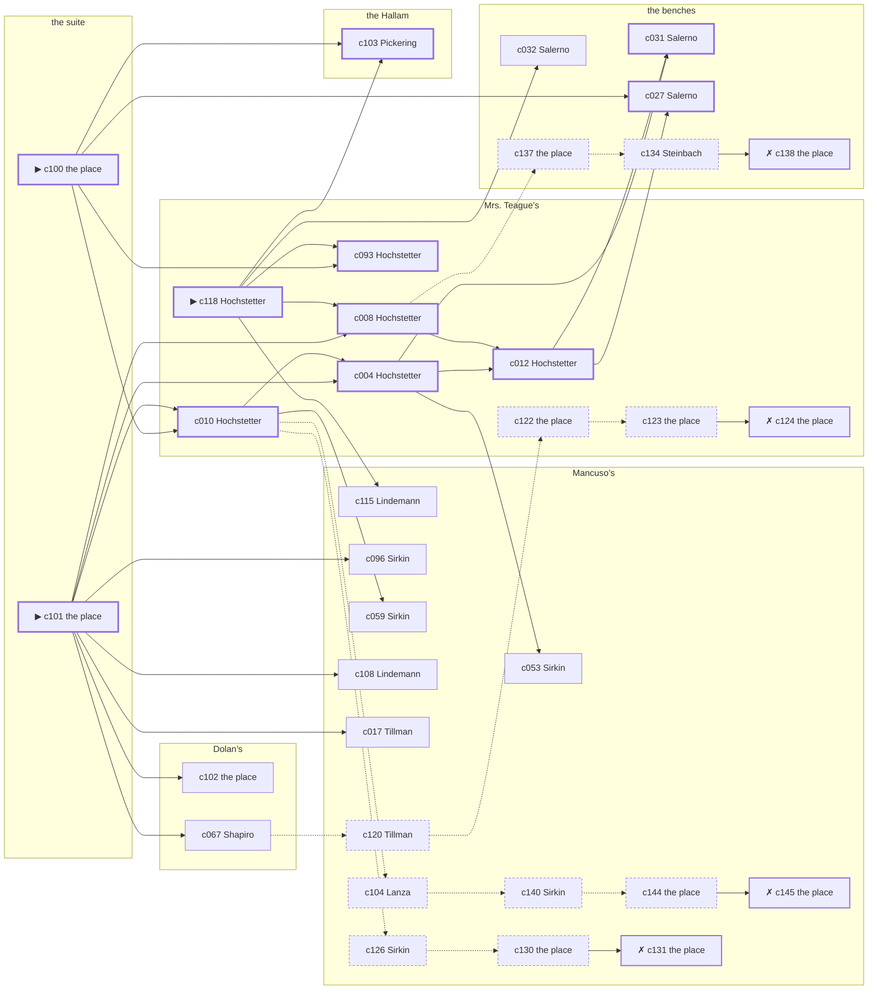

# Chelsea — case 12

**Seed** 12 · **Difficulty** 2 · **Attempts** 1 · **Detective** Humphrey

**Par** 11 actions · **Slack** 6 · **Budget** 17 · **Findable** 34 (spine 11, corroboration 9, noise 10 + 4 disqualifiers) · **Noise ratio** 41% · **Candidate pool** 153

## 1. The Truth

Roscoe Dandridge, a ward heeler, the victim’s business partner, killed Vincenzo Grasso, a buildings inspector, with poison in a drink at the suite at 10:30 PM. Dandridge wanted the victim out of a lease (property). Dandridge had been at Dolan’s earlier in the evening, where the weapon lived, and was alone with Grasso when it happened. Hochstetter hired us.

## 2. Dramatis Personae

| Name | Role | Relationship | Class of secret | Motive | Found at | Killer |
| --- | --- | --- | --- | --- | --- | --- |
| Vincenzo Grasso | a buildings inspector | the victim | — | — | — | — |
| Klara Hochstetter (client) | a piano teacher | the victim’s tenant | hidden-family | — | Mrs. Teague’s | — |
| Odessa Tillman | a curb broker | in the victim’s debt | fence | exposure | Mancuso’s | — |
| Roscoe Dandridge | a ward heeler | the victim’s business partner | murder (+ blackmail) | property | Mancuso’s | **YES** |
| Teresa Salerno | a dentist with rooms on the third floor | in the victim’s debt | forged-identity | — | the benches | — |
| Nunzio Lanza | a longshoreman | the victim’s tenant | gambling-debt | revenge | Mancuso’s | — |
| Gretchen Steinbach | a lawyer with one clerk | the victim’s lawyer | gambling-debt | — | the benches | — |
| Nathan Sirkin | the man behind the counter | fixture (counterman) | — | — | Mancuso’s | — |
| Hyman Shapiro | the bartender | fixture (bartender) | — | — | Dolan’s | — |
| Lorraine Prentiss | the landlady | fixture (landlady) | — | — | Mrs. Teague’s | — |
| Prescott Pickering | the elevator man | fixture (elevator-man) | — | — | the Hallam | — |
| Karl Lindemann | the patrolman on the beat | fixture (beat-cop) | — | — | Mancuso’s | — |

## 3. Places

- **Mancuso’s pool hall** (semi) — watched by counterman (Sirkin); objects: a silver cigarette case, an ice pick, a nickel-plated revolver — within earshot of the scene
- **the victim’s suite at the residential hotel** (private) — unwatched; objects: a day ledger, a camel-hair overcoat on a hook — **THE SCENE**; the victim’s address
- **Dolan’s Bar** (semi) — watched by bartender (Shapiro); objects: a bottle of chloral drops, a seltzer siphon — where the weapon lived; within earshot of the scene
- **the benches at the north end of the square** (public) — unwatched; objects: a folded stack of evening papers, a brass umbrella stand
- **the back room at Mrs. Teague’s** (private) — watched by landlady (Prentiss); objects: a length of sash cord, a bronze bookend, the roof-door key
- **the vestibule of the Hallam apartments** (private) — watched by elevator-man (Pickering); objects: none

## 4. Anchors

The coroner gives 10:00 PM–11:30 PM, four ticks wide. These are what close it: **el-train** and **fuse**.

- **the fuse going in the building** — at 10:00 PM; at the Hallam. You can time things by it: a crack in the cellar and every light on the riser out at once. Only those present know that it was the second floor that went dark and not the whole house. Those present carry it: candle smoke on the ceilings of everyone who sat it out.
- **the El going over** — at 6:30 PM, 7:30 PM, 8:30 PM, 9:30 PM, 10:30 PM, 11:30 PM; across the whole neighbourhood. You can time things by it: everything under the structure stops being audible for twenty seconds.
- **the beat cop’s pass** — at 6:00 PM, 7:30 PM, 9:00 PM, 10:30 PM; on a round through Mancuso’s → Dolan’s → the benches. Somebody reliable notes who was there.

## 5. Timelines

### Grasso — the victim

| Tick | Time | Truth | Claimed | Companion claimed |
| --- | --- | --- | --- | --- |
| 0 | 6:00 PM | the Hallam | the Hallam | — |
| 1 | 6:30 PM | the Hallam | the Hallam | — |
| 2 | 7:00 PM | Dolan’s | Dolan’s | — |
| 3 | 7:30 PM | Dolan’s | Dolan’s | — |
| 4 | 8:00 PM | the suite | the suite | — |
| 5 | 8:30 PM | Mancuso’s | Mancuso’s | — |
| 6 | 9:00 PM | Mancuso’s | Mancuso’s | — |
| 7 | 9:30 PM | Mancuso’s | Mancuso’s | — |
| 8 | 10:00 PM | the Hallam | the Hallam | — |
| 9 | 10:30 PM | the suite ☠ | the suite | — |
| 10 | 11:00 PM | — | — | — |
| 11 | 11:30 PM | — | — | — |

### Hochstetter

| Tick | Time | Truth | Claimed | Companion claimed |
| --- | --- | --- | --- | --- |
| 0 | 6:00 PM | Mancuso’s | Mancuso’s | — |
| 1 | 6:30 PM | the benches | the benches | — |
| 2 | 7:00 PM | Dolan’s | Dolan’s | — |
| 3 | 7:30 PM | Mrs. Teague’s | **Dolan’s** | — |
| 4 | 8:00 PM | Mrs. Teague’s | Mrs. Teague’s | — |
| 5 | 8:30 PM | Mrs. Teague’s | Mrs. Teague’s | — |
| 6 | 9:00 PM | Mancuso’s | Mancuso’s | — |
| 7 | 9:30 PM | Mrs. Teague’s | Mrs. Teague’s | — |
| 8 | 10:00 PM | the benches | the benches | — |
| 9 | 10:30 PM | Mancuso’s | Mancuso’s | — |
| 10 | 11:00 PM | Dolan’s | Dolan’s | — |
| 11 | 11:30 PM | Dolan’s | Dolan’s | — |

### Tillman

| Tick | Time | Truth | Claimed | Companion claimed |
| --- | --- | --- | --- | --- |
| 0 | 6:00 PM | Dolan’s | Dolan’s | — |
| 1 | 6:30 PM | the suite | the suite | — |
| 2 | 7:00 PM | the suite | the suite | — |
| 3 | 7:30 PM | the benches | the benches | — |
| 4 | 8:00 PM | the benches | the benches | — |
| 5 | 8:30 PM | the benches | the benches | — |
| 6 | 9:00 PM | Mancuso’s | **Mrs. Teague’s** | — |
| 7 | 9:30 PM | Mancuso’s | **Mrs. Teague’s** | — |
| 8 | 10:00 PM | Mancuso’s | Mancuso’s | — |
| 9 | 10:30 PM | Mancuso’s | Mancuso’s | — |
| 10 | 11:00 PM | Dolan’s | Dolan’s | — |
| 11 | 11:30 PM | Dolan’s | Dolan’s | — |

### Dandridge — the killer

| Tick | Time | Truth | Claimed | Companion claimed |
| --- | --- | --- | --- | --- |
| 0 | 6:00 PM | Mancuso’s | Mancuso’s | — |
| 1 | 6:30 PM | Mancuso’s | Mancuso’s | — |
| 2 | 7:00 PM | Mancuso’s | Mancuso’s | — |
| 3 | 7:30 PM | Mancuso’s | Mancuso’s | — |
| 4 | 8:00 PM | Mancuso’s | Mancuso’s | — |
| 5 | 8:30 PM | the Hallam | **Mrs. Teague’s** | Steinbach |
| 6 | 9:00 PM | Dolan’s | Dolan’s | — |
| 7 | 9:30 PM | Dolan’s | Dolan’s | — |
| 8 | 10:00 PM | Dolan’s | Dolan’s | — |
| 9 | 10:30 PM | the suite ☠ | **Mancuso’s** | — |
| 10 | 11:00 PM | Mrs. Teague’s | Mrs. Teague’s | — |
| 11 | 11:30 PM | the Hallam | the Hallam | — |

### Salerno

| Tick | Time | Truth | Claimed | Companion claimed |
| --- | --- | --- | --- | --- |
| 0 | 6:00 PM | the benches | the benches | — |
| 1 | 6:30 PM | the benches | the benches | — |
| 2 | 7:00 PM | the suite | the suite | — |
| 3 | 7:30 PM | the suite | the suite | — |
| 4 | 8:00 PM | the suite | the suite | — |
| 5 | 8:30 PM | the benches | the benches | — |
| 6 | 9:00 PM | Dolan’s | Dolan’s | — |
| 7 | 9:30 PM | Dolan’s | Dolan’s | — |
| 8 | 10:00 PM | Dolan’s | Dolan’s | — |
| 9 | 10:30 PM | Mancuso’s | Mancuso’s | — |
| 10 | 11:00 PM | Mancuso’s | Mancuso’s | — |
| 11 | 11:30 PM | the benches | the benches | — |

### Lanza

| Tick | Time | Truth | Claimed | Companion claimed |
| --- | --- | --- | --- | --- |
| 0 | 6:00 PM | the suite | the suite | — |
| 1 | 6:30 PM | Mancuso’s | Mancuso’s | — |
| 2 | 7:00 PM | Mancuso’s | Mancuso’s | — |
| 3 | 7:30 PM | Mancuso’s | Mancuso’s | — |
| 4 | 8:00 PM | Mancuso’s | Mancuso’s | — |
| 5 | 8:30 PM | Mancuso’s | Mancuso’s | — |
| 6 | 9:00 PM | Mancuso’s | Mancuso’s | — |
| 7 | 9:30 PM | Mancuso’s | Mancuso’s | — |
| 8 | 10:00 PM | Mancuso’s | **the Hallam** | — |
| 9 | 10:30 PM | Mancuso’s | **the Hallam** | — |
| 10 | 11:00 PM | the benches | the benches | — |
| 11 | 11:30 PM | the benches | the benches | — |

### Steinbach

| Tick | Time | Truth | Claimed | Companion claimed |
| --- | --- | --- | --- | --- |
| 0 | 6:00 PM | Dolan’s | Dolan’s | — |
| 1 | 6:30 PM | Dolan’s | Dolan’s | — |
| 2 | 7:00 PM | Mrs. Teague’s | Mrs. Teague’s | — |
| 3 | 7:30 PM | Mrs. Teague’s | Mrs. Teague’s | — |
| 4 | 8:00 PM | Mancuso’s | Mancuso’s | — |
| 5 | 8:30 PM | the suite | the suite | — |
| 6 | 9:00 PM | the suite | the suite | — |
| 7 | 9:30 PM | the benches | the benches | — |
| 8 | 10:00 PM | the benches | the benches | — |
| 9 | 10:30 PM | Mancuso’s | **the Hallam** | — |
| 10 | 11:00 PM | the benches | the benches | — |
| 11 | 11:30 PM | the benches | the benches | — |

### Fixtures (never lie, never withhold)

| Tick | Time | Sirkin (the man behind the counter) | Shapiro (the bartender) | Prentiss (the landlady) | Pickering (the elevator man) | Lindemann (the patrolman on the beat) |
| --- | --- | --- | --- | --- | --- | --- |
| 0 | 6:00 PM | Mancuso’s | Dolan’s | Mrs. Teague’s | the Hallam | Mancuso’s |
| 1 | 6:30 PM | Dolan’s | Dolan’s | Mrs. Teague’s | the Hallam | — |
| 2 | 7:00 PM | Mancuso’s | Dolan’s | Mrs. Teague’s | the Hallam | — |
| 3 | 7:30 PM | Mancuso’s | Dolan’s | Mrs. Teague’s | the Hallam | Dolan’s |
| 4 | 8:00 PM | Mancuso’s | Dolan’s | Mrs. Teague’s | the Hallam | — |
| 5 | 8:30 PM | Mancuso’s | Dolan’s | Mrs. Teague’s | the Hallam | — |
| 6 | 9:00 PM | Mancuso’s | Dolan’s | Mrs. Teague’s | the Hallam | the benches |
| 7 | 9:30 PM | Mancuso’s | Dolan’s | Mrs. Teague’s | the Hallam | — |
| 8 | 10:00 PM | Mancuso’s | Dolan’s | Mrs. Teague’s | the Hallam | — |
| 9 | 10:30 PM | Mancuso’s | Dolan’s | Mrs. Teague’s | the Hallam | Mancuso’s |
| 10 | 11:00 PM | Mancuso’s | Dolan’s | Mrs. Teague’s | the Hallam | — |
| 11 | 11:30 PM | Mancuso’s | Dolan’s | Mrs. Teague’s | the Hallam | — |

## 6. Secrets in play

- **Hochstetter** (hidden-family): Hochstetter goes to Mrs. Teague’s from 7:30 PM to see a child nobody is supposed to know about.
- **Tillman** (fence): Tillman hands a parcel of stolen goods to a man at Mancuso’s from 9:00 PM to 9:30 PM.
- **Dandridge** (murder): Dandridge is at the suite from 10:30 PM, alone with Grasso when it happens at 10:30 PM.
- **Dandridge** also (blackmail): Dandridge meets the victim alone at the Hallam from 8:30 PM and asks for money.
- **Salerno** (forged-identity): Salerno is not the person the papers say. Nothing about the evening is hidden; the lie is all in the paperwork.
- **Lanza** (gambling-debt): Lanza slips off to Mancuso’s from 10:00 PM to 10:30 PM to settle with a bookmaker.
- **Steinbach** (gambling-debt): Steinbach slips off to Mancuso’s from 10:30 PM to settle with a bookmaker.

## 7. Clue list — the 34 findable

The opening three, free at the start: c100, c101, c118. Everything else has to be led to. The full candidate pool is in the companion file.

### At Mancuso’s

- **c115** [corroboration] (overheard; Lindemann on Dandridge and Grasso) → (end)
  - Lindemann says Grasso told Dandridge the lease would go to somebody else at the quarter day.
  - _establishes: Dandridge had a motive (property)_
- **c096** [corroboration] (observation; Sirkin on Dandridge’s account) → (end)
  - Sirkin was at Mancuso’s at 10:30 PM and says Dandridge was not.
  - _establishes: Dandridge not at Mancuso’s, 10:30 PM_
- **c059** [corroboration] (observation; Sirkin on Steinbach) → (end)
  - Sirkin says Steinbach was at Dolan’s at 6:30 PM.
  - _establishes: Steinbach at Dolan’s, 6:30 PM; Steinbach could reach the weapon_
- **c053** [corroboration] (observation; Sirkin on Hochstetter) → (end)
  - Sirkin says Hochstetter was at Mancuso’s at 10:30 PM.
  - _establishes: Hochstetter at Mancuso’s, 10:30 PM_
- **c108** [corroboration] (anchor; Lindemann on Tillman) → (end)
  - Lindemann came round at 10:30 PM and had Tillman at Mancuso’s.
  - _establishes: Tillman at Mancuso’s, 10:30 PM_
- **c017** [corroboration] (observation; Tillman on Salerno) → (end)
  - Tillman says Salerno was at Mancuso’s at 10:30 PM.
  - _establishes: Salerno at Mancuso’s, 10:30 PM_
- **c104** [noise {b1}] (anchor; Lanza on the fuse going in the building) → c140
  - Lanza claims the Hallam at 10:00 PM, which is when the fuse going in the building was on. Asked about it, Lanza cannot say that it was the second floor that went dark and not the whole house — and everybody who was there can.
  - _establishes: Lanza not at the Hallam, 10:00 PM_
- **c140** [noise {b1}] (overheard; Sirkin on Lanza) → c144
  - Sirkin on Lanza: Lanza was asking around for a hundred dollars in a hurry earlier in the week.
  - _establishes: context only_
- **c144** [noise {b1}] (physical; the place itself) → c145
  - A book of markers at Mancuso’s with Lanza’s initials against four of them.
  - _establishes: context only_
- **c145** [disqualifier {b1}] (overheard; the place itself) → (end)
  - The bookmaker’s runner is found and will say it: Lanza was at Mancuso’s from 10:00 PM to 10:30 PM paying off eleven hundred dollars, a dollar at a time, and went nowhere near the killing.
  - _establishes: Lanza’s gambling-debt accounted for; Lanza at Mancuso’s, 10:00 PM–10:30 PM_
- **c120** [noise {b2}] (overheard; Tillman on Hochstetter) → c122
  - Tillman on Hochstetter: A woman at Mrs. Teague’s asked for Hochstetter by a name Hochstetter has not used in years.
  - _establishes: context only_
- **c126** [noise {b4}] (overheard; Sirkin on Tillman) → c130
  - Sirkin on Tillman: Tillman was carrying a parcel into Mancuso’s and came out without it.
  - _establishes: context only_
- **c130** [noise {b4}] (physical; the place itself) → c131
  - A pawn ticket at Mancuso’s in a name that does not exist, made out at the hour in question.
  - _establishes: context only_
- **c131** [disqualifier {b4}] (overheard; the place itself) → (end)
  - The receiver at Mancuso’s would rather talk than be held: Tillman was there from 9:00 PM to 9:30 PM handing over a parcel of somebody else’s silver, which is a charge Tillman will take over this one.
  - _establishes: Tillman’s fence accounted for; Tillman at Mancuso’s, 9:00 PM–9:30 PM_

### At the suite

- **c100** [spine ⟨opening⟩] (scene; the place itself) → c010, c093, c027, c103
  - Grasso was found at the suite. A glass is on its side and the spill had not yet reached the edge of the table when it dried. The El went over at 10:30 PM, running to timetable, and for twenty seconds nothing under the structure can be heard at all.
  - _establishes: the victim dead by 10:30 PM; how it was done_
- **c101** [spine ⟨opening⟩] (morgue; the place itself) → c010, c004, c008, c102, c096, c067, c108, c017
  - The coroner puts death between 10:00 PM and 11:30 PM — two hours of nothing useful. Chloral hydrate in the stomach. No wound, no bruising, no sign of a struggle.
  - _establishes: death between 10:00 PM and 11:30 PM; how it was done_

### At Dolan’s

- **c102** [corroboration] (physical; the place itself) → (end)
  - A bottle of chloral drops is gone from Dolan’s. The bottle is gone from the shelf and the ring of dust it stood in is still there.
  - _establishes: something gone from Dolan’s; how it was done_
- **c067** [corroboration] (observation; Shapiro on Dandridge) → c120
  - Shapiro says Dandridge was at Dolan’s from 9:00 PM to 10:00 PM.
  - _establishes: Dandridge at Dolan’s, 9:00 PM–10:00 PM; Dandridge could reach the weapon_

### At the benches

- **c031** [spine] (observation; Salerno on Dandridge) → (end)
  - Salerno says Dandridge was at Dolan’s from 9:00 PM to 10:00 PM.
  - _establishes: Dandridge at Dolan’s, 9:00 PM–10:00 PM; Dandridge could reach the weapon_
- **c027** [spine] (observation; Salerno on Hochstetter) → (end)
  - Salerno says Hochstetter was at Mancuso’s at 10:30 PM.
  - _establishes: Hochstetter at Mancuso’s, 10:30 PM_
- **c032** [corroboration] (observation; Salerno on Lanza) → (end)
  - Salerno says Lanza was at Mancuso’s at 10:30 PM.
  - _establishes: Lanza at Mancuso’s, 10:30 PM_
- **c137** [noise {b3}] (physical; the place itself) → c134
  - A steamship ticket stub among Salerno’s things, in the name of a man who died at Belleau Wood.
  - _establishes: context only_
- **c134** [noise {b3}] (overheard; Steinbach on Salerno) → c138
  - Steinbach on Salerno: Two signatures of Salerno’s, a month apart, are in different hands.
  - _establishes: context only_
- **c138** [disqualifier {b3}] (overheard; the place itself) → (end)
  - The name Salerno was born with turns up on a desertion warrant from 1918. Salerno has been hiding from the Army for eleven years and from nobody else.
  - _establishes: Salerno’s forged-identity accounted for_

### At Mrs. Teague’s

- **c118** [spine ⟨opening⟩] (client; Hochstetter on why I was hired) → c093, c008, c103, c115, c032
  - Hochstetter hired us, and wants it known that Dandridge wanted the victim out of a lease, and would rather we started there.
  - _establishes: Dandridge had a motive (property)_
- **c010** [spine] (observation; Hochstetter on Lanza) → c004, c059, c104, c126
  - Hochstetter says Lanza was at Mancuso’s at 10:30 PM.
  - _establishes: Lanza at Mancuso’s, 10:30 PM_
- **c004** [spine] (observation; Hochstetter on Tillman) → c012, c031, c053
  - Hochstetter says Tillman was at Mancuso’s at 10:30 PM.
  - _establishes: Tillman at Mancuso’s, 10:30 PM_
- **c093** [spine] (observation; Hochstetter on Dandridge’s account) → (end)
  - Hochstetter was at Mancuso’s at 10:30 PM and says Dandridge was not.
  - _establishes: Dandridge not at Mancuso’s, 10:30 PM_
- **c008** [spine] (observation; Hochstetter on Salerno) → c012, c137
  - Hochstetter says Salerno was at Mancuso’s at 10:30 PM.
  - _establishes: Salerno at Mancuso’s, 10:30 PM_
- **c012** [spine] (observation; Hochstetter on Steinbach) → c031, c027
  - Hochstetter says Steinbach was at Mancuso’s at 10:30 PM.
  - _establishes: Steinbach at Mancuso’s, 10:30 PM_
- **c122** [noise {b2}] (physical; the place itself) → c123
  - A board-and-keep receipt at Mrs. Teague’s, monthly, eight years of them.
  - _establishes: context only_
- **c123** [noise {b2}] (physical; the place itself) → c124
  - A child’s shoe at Mrs. Teague’s, and nobody at Mrs. Teague’s has any children.
  - _establishes: context only_
- **c124** [disqualifier {b2}] (overheard; the place itself) → (end)
  - The woman who keeps the child says it straight out: Hochstetter was at Mrs. Teague’s from 7:30 PM, the same as every week, and left with the same face as always.
  - _establishes: Hochstetter’s hidden-family accounted for; Hochstetter at Mrs. Teague’s, 7:30 PM_

### At the Hallam

- **c103** [spine] (anchor; Pickering on Grasso that evening) → (end)
  - Pickering puts Grasso at the Hallam when the lights went, which was 10:00 PM, and alive enough to argue about the weather.
  - _establishes: the victim alive at 10:00 PM; Grasso at the Hallam, 10:00 PM_

## 8. Clue graph

## 9. Deduction path

Par is **11 actions** and the budget is par plus 6: **17**. Every id below is a spine clue; the inference is the sheet’s, not the clue’s.

**Time of death.** The coroner gives four ticks. The anchors close it to 10:30 PM: one puts Grasso alive at 10:00 PM, the other times the scene at 10:30 PM. _(c101, c103, c100)_

**Clearing the innocent.**

- Hochstetter was not at the suite at 10:30 PM. _(c027; + 1 corroborating)_
- Tillman was not at the suite at 10:30 PM. _(c004; + 1 corroborating)_
- Salerno was not at the suite at 10:30 PM. _(c008; + 1 corroborating)_
- Lanza was not at the suite at 10:30 PM. _(c010; + 2 corroborating)_
- Steinbach was not at the suite at 10:30 PM. _(c012)_

**Naming the killer.** Dandridge claims Mancuso’s at 10:30 PM. Two independent sources put that out of the question. _(c093; + 1 corroborating)_

**The weapon.** Dandridge was at Dolan’s before 10:30 PM, where a bottle of chloral drops was kept. _(c031; + 1 corroborating)_

**Method.** Poison in a drink, on two physical sources. _(c100, c101; + 1 corroborating)_

**Motive.** property, on two independent sources. _(c118; + 1 corroborating)_

## 10. Red herrings

**Innocents who lie about the murder tick:**

- Lanza claims the Hallam at 10:30 PM and was really at Mancuso’s. Reason: Lanza slips off to Mancuso’s from 10:00 PM to 10:30 PM to settle with a bookmaker.
- Steinbach claims the Hallam at 10:30 PM and was really at Mancuso’s. Reason: Steinbach slips off to Mancuso’s from 10:30 PM to settle with a bookmaker.

**Innocents with a motive:**

- Tillman — exposure: was about to be exposed by the victim.
- Lanza — revenge: blamed the victim for a ruin.

**Noise branches, and what knocks each one down:**

- **b1** (Lanza, gambling-debt): c104 → c140 → c144 → **c145** — The bookmaker’s runner is found and will say it: Lanza was at Mancuso’s from 10:00 PM to 10:30 PM paying off eleven hundred dollars, a dollar at a time, and went nowhere near the killing.
- **b2** (Hochstetter, hidden-family): c120 → c122 → c123 → **c124** — The woman who keeps the child says it straight out: Hochstetter was at Mrs. Teague’s from 7:30 PM, the same as every week, and left with the same face as always.
- **b3** (Salerno, forged-identity): c137 → c134 → **c138** — The name Salerno was born with turns up on a desertion warrant from 1918. Salerno has been hiding from the Army for eleven years and from nobody else.
- **b4** (Tillman, fence): c126 → c130 → **c131** — The receiver at Mancuso’s would rather talk than be held: Tillman was there from 9:00 PM to 9:30 PM handing over a parcel of somebody else’s silver, which is a charge Tillman will take over this one.

