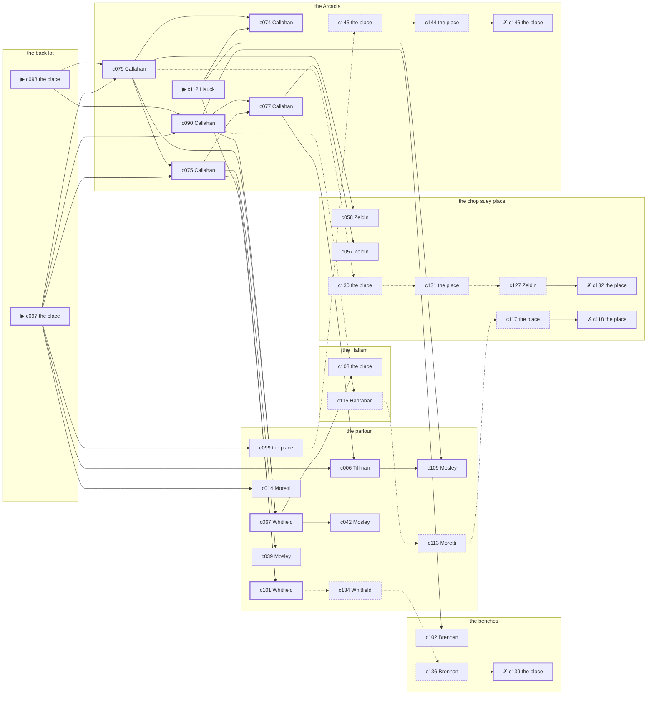

# Chelsea — case 13

**Seed** 13 · **Difficulty** 2 · **Attempts** 5 · **Detective** Dashiell

**Par** 11 actions · **Slack** 6 · **Budget** 17 · **Findable** 34 (spine 12, corroboration 8, noise 10 + 4 disqualifiers) · **Noise ratio** 41% · **Candidate pool** 147

## 1. The Truth

Patrick Brennan, a lawyer with one clerk, the victim’s creditor, killed Nora Mulcahy, a society columnist, with a push from the parapet at the back lot at 10:30 PM. Brennan wanted the victim out of a lease (property). Brennan had been at the parlour earlier in the evening, where the weapon lived, and was alone with Mulcahy when it happened. Hauck hired us.

## 2. Dramatis Personae

| Name | Role | Relationship | Class of secret | Motive | Found at | Killer |
| --- | --- | --- | --- | --- | --- | --- |
| Nora Mulcahy | a society columnist | the victim | — | — | — | — |
| Rufus Tillman | a policy runner | in the victim’s debt | dope | debt | the parlour | — |
| Nunzio Moretti | a young man living on expectations | the victim’s cousin | secret-drinking | inheritance | the parlour | — |
| Patrick Brennan | a lawyer with one clerk | the victim’s creditor | murder (+ gambling-debt) | property | the benches | **YES** |
| Margarethe Hauck (client) | a dentist with rooms on the third floor | in the victim’s debt | dope | — | the Arcadia | — |
| Althea Mosley | a stagehand at the Selwyn | a childhood friend of the victim’s from the same block | gambling-debt | revenge | the parlour | — |
| Verity Coffin | a piano teacher | the victim’s tenant | secret-drinking | — | the parlour | — |
| Gittel Zeldin | the man behind the counter | fixture (counterman) | — | — | the chop suey place | — |
| Cornelius Hanrahan | the elevator man | fixture (elevator-man) | — | — | the Hallam | — |
| Hattie Whitfield | the landlady | fixture (landlady) | — | — | the parlour | — |
| Agnes Callahan | the ticket-taker | fixture (ticket-taker) | — | — | the Arcadia | — |

## 3. Places

- **the victim’s house on the back lot** (private) — unwatched; objects: a framed photograph, a bronze bookend — **THE SCENE**; the victim’s address
- **the benches at the north end of the square** (public) — unwatched; objects: a folded stack of evening papers, a brass umbrella stand
- **the chop suey place over the laundry** (semi) — watched by counterman (Zeldin); objects: an ice pick, a bottle of chloral drops, a wall telephone — within earshot of the scene
- **the vestibule of the Hallam apartments** (private) — watched by elevator-man (Hanrahan); objects: a day ledger, a camel-hair overcoat on a hook, a nickel-plated revolver
- **the parlour of Mrs. Teague’s boarding house** (semi) — watched by landlady (Whitfield); objects: the roof-door key, a length of sash cord — where the weapon lived
- **the Arcadia dance hall** (public) — watched by ticket-taker (Callahan); objects: a silver cigarette case, a standing ashtray — within earshot of the scene

## 4. Anchors

The coroner gives 9:00 PM–10:30 PM, four ticks wide. These are what close it: **bar-radio** and **piano-lesson**.

- **the piano lesson on the floor above** — at 10:00 PM; at the parlour. You can time things by it: the same four bars, over and over, and then nothing. Only those present know that the child never did get the passage right.
- **the fight card on the bar radio** — at 10:30 PM; at the Arcadia. Only those present know that the challenger went down in the fourth and the crowd booed it. You can time things by it: the set was turned up loud enough to carry into the street.
- **the fuse going in the building** — at 9:00 PM; at the Hallam. You can time things by it: a crack in the cellar and every light on the riser out at once. Only those present know that it was the second floor that went dark and not the whole house. Those present carry it: candle smoke on the ceilings of everyone who sat it out.

## 5. Timelines

### Mulcahy — the victim

| Tick | Time | Truth | Claimed | Companion claimed |
| --- | --- | --- | --- | --- |
| 0 | 6:00 PM | the chop suey place | the chop suey place | — |
| 1 | 6:30 PM | the Arcadia | the Arcadia | — |
| 2 | 7:00 PM | the Arcadia | the Arcadia | — |
| 3 | 7:30 PM | the Arcadia | the Arcadia | — |
| 4 | 8:00 PM | the Arcadia | the Arcadia | — |
| 5 | 8:30 PM | the Arcadia | the Arcadia | — |
| 6 | 9:00 PM | the Arcadia | the Arcadia | — |
| 7 | 9:30 PM | the parlour | the parlour | — |
| 8 | 10:00 PM | the parlour | the parlour | — |
| 9 | 10:30 PM | the back lot ☠ | the back lot | — |
| 10 | 11:00 PM | — | — | — |
| 11 | 11:30 PM | — | — | — |

### Tillman

| Tick | Time | Truth | Claimed | Companion claimed |
| --- | --- | --- | --- | --- |
| 0 | 6:00 PM | the parlour | the parlour | — |
| 1 | 6:30 PM | the parlour | the parlour | — |
| 2 | 7:00 PM | the Arcadia | the Arcadia | — |
| 3 | 7:30 PM | the chop suey place | the chop suey place | — |
| 4 | 8:00 PM | the chop suey place | the chop suey place | — |
| 5 | 8:30 PM | the Hallam | the Hallam | — |
| 6 | 9:00 PM | the Hallam | the Hallam | — |
| 7 | 9:30 PM | the parlour | the parlour | — |
| 8 | 10:00 PM | the parlour | the parlour | — |
| 9 | 10:30 PM | the Arcadia | the Arcadia | — |
| 10 | 11:00 PM | the chop suey place | **the Arcadia** | Mosley |
| 11 | 11:30 PM | the chop suey place | **the Arcadia** | Mosley |

### Moretti

| Tick | Time | Truth | Claimed | Companion claimed |
| --- | --- | --- | --- | --- |
| 0 | 6:00 PM | the parlour | the parlour | — |
| 1 | 6:30 PM | the parlour | the parlour | — |
| 2 | 7:00 PM | the parlour | the parlour | — |
| 3 | 7:30 PM | the parlour | the parlour | — |
| 4 | 8:00 PM | the parlour | the parlour | — |
| 5 | 8:30 PM | the parlour | the parlour | — |
| 6 | 9:00 PM | the parlour | the parlour | — |
| 7 | 9:30 PM | the parlour | the parlour | — |
| 8 | 10:00 PM | the Arcadia | **the Hallam** | Tillman |
| 9 | 10:30 PM | the Arcadia | **the Hallam** | Tillman |
| 10 | 11:00 PM | the Arcadia | the Arcadia | — |
| 11 | 11:30 PM | the benches | the benches | — |

### Brennan — the killer

| Tick | Time | Truth | Claimed | Companion claimed |
| --- | --- | --- | --- | --- |
| 0 | 6:00 PM | the benches | **the Arcadia** | — |
| 1 | 6:30 PM | the benches | **the Arcadia** | — |
| 2 | 7:00 PM | the benches | the benches | — |
| 3 | 7:30 PM | the benches | the benches | — |
| 4 | 8:00 PM | the benches | the benches | — |
| 5 | 8:30 PM | the benches | the benches | — |
| 6 | 9:00 PM | the benches | the benches | — |
| 7 | 9:30 PM | the parlour | the parlour | — |
| 8 | 10:00 PM | the back lot | **the Arcadia** | — |
| 9 | 10:30 PM | the back lot ☠ | **the Arcadia** | — |
| 10 | 11:00 PM | the benches | the benches | — |
| 11 | 11:30 PM | the benches | the benches | — |

### Hauck

| Tick | Time | Truth | Claimed | Companion claimed |
| --- | --- | --- | --- | --- |
| 0 | 6:00 PM | the benches | the benches | — |
| 1 | 6:30 PM | the chop suey place | the chop suey place | — |
| 2 | 7:00 PM | the benches | the benches | — |
| 3 | 7:30 PM | the Arcadia | the Arcadia | — |
| 4 | 8:00 PM | the Arcadia | the Arcadia | — |
| 5 | 8:30 PM | the Arcadia | the Arcadia | — |
| 6 | 9:00 PM | the Arcadia | the Arcadia | — |
| 7 | 9:30 PM | the Arcadia | the Arcadia | — |
| 8 | 10:00 PM | the Arcadia | the Arcadia | — |
| 9 | 10:30 PM | the chop suey place | **the benches** | — |
| 10 | 11:00 PM | the chop suey place | **the benches** | — |
| 11 | 11:30 PM | the chop suey place | the chop suey place | — |

### Mosley

| Tick | Time | Truth | Claimed | Companion claimed |
| --- | --- | --- | --- | --- |
| 0 | 6:00 PM | the parlour | the parlour | — |
| 1 | 6:30 PM | the parlour | the parlour | — |
| 2 | 7:00 PM | the benches | **the Arcadia** | — |
| 3 | 7:30 PM | the benches | **the Arcadia** | — |
| 4 | 8:00 PM | the back lot | the back lot | — |
| 5 | 8:30 PM | the parlour | the parlour | — |
| 6 | 9:00 PM | the parlour | the parlour | — |
| 7 | 9:30 PM | the parlour | the parlour | — |
| 8 | 10:00 PM | the Arcadia | the Arcadia | — |
| 9 | 10:30 PM | the Arcadia | the Arcadia | — |
| 10 | 11:00 PM | the parlour | the parlour | — |
| 11 | 11:30 PM | the parlour | the parlour | — |

### Coffin

| Tick | Time | Truth | Claimed | Companion claimed |
| --- | --- | --- | --- | --- |
| 0 | 6:00 PM | the benches | the benches | — |
| 1 | 6:30 PM | the benches | the benches | — |
| 2 | 7:00 PM | the parlour | the parlour | — |
| 3 | 7:30 PM | the parlour | the parlour | — |
| 4 | 8:00 PM | the parlour | the parlour | — |
| 5 | 8:30 PM | the parlour | the parlour | — |
| 6 | 9:00 PM | the parlour | the parlour | — |
| 7 | 9:30 PM | the Arcadia | the Arcadia | — |
| 8 | 10:00 PM | the benches | the benches | — |
| 9 | 10:30 PM | the Arcadia | **the chop suey place** | — |
| 10 | 11:00 PM | the Arcadia | **the chop suey place** | — |
| 11 | 11:30 PM | the Arcadia | the Arcadia | — |

### Fixtures (never lie, never withhold)

| Tick | Time | Zeldin (the man behind the counter) | Hanrahan (the elevator man) | Whitfield (the landlady) | Callahan (the ticket-taker) |
| --- | --- | --- | --- | --- | --- |
| 0 | 6:00 PM | the chop suey place | the Hallam | the parlour | the Arcadia |
| 1 | 6:30 PM | the chop suey place | the Hallam | the parlour | the Arcadia |
| 2 | 7:00 PM | the parlour | the Hallam | the parlour | the Arcadia |
| 3 | 7:30 PM | the chop suey place | the Hallam | the parlour | the Arcadia |
| 4 | 8:00 PM | the chop suey place | the Arcadia | the parlour | the Arcadia |
| 5 | 8:30 PM | the chop suey place | the Hallam | the parlour | the Arcadia |
| 6 | 9:00 PM | the chop suey place | the Hallam | the parlour | the Arcadia |
| 7 | 9:30 PM | the chop suey place | the Hallam | the parlour | the Arcadia |
| 8 | 10:00 PM | the chop suey place | the Hallam | the parlour | the Arcadia |
| 9 | 10:30 PM | the chop suey place | the Hallam | the chop suey place | the Arcadia |
| 10 | 11:00 PM | the chop suey place | the Hallam | the parlour | the Arcadia |
| 11 | 11:30 PM | the chop suey place | the Hallam | the parlour | the Arcadia |

## 6. Secrets in play

- **Tillman** (dope): Tillman buys morphine at the chop suey place from 11:00 PM to 11:30 PM and would rather be thought a murderer than a hop-head.
- **Moretti** (secret-drinking): Moretti drinks alone at the Arcadia from 10:00 PM to 10:30 PM and will claim to have been anywhere else.
- **Brennan** (murder): Brennan is at the back lot from 10:00 PM to 10:30 PM, alone with Mulcahy when it happens at 10:30 PM.
- **Brennan** also (gambling-debt): Brennan slips off to the benches from 6:00 PM to 6:30 PM to settle with a bookmaker.
- **Hauck** (dope): Hauck buys morphine at the chop suey place from 10:30 PM to 11:00 PM and would rather be thought a murderer than a hop-head.
- **Mosley** (gambling-debt): Mosley slips off to the benches from 7:00 PM to 7:30 PM to settle with a bookmaker.
- **Coffin** (secret-drinking): Coffin drinks alone at the Arcadia from 10:30 PM to 11:00 PM and will claim to have been anywhere else.

## 7. Clue list — the 34 findable

The opening three, free at the start: c097, c098, c112. Everything else has to be led to. The full candidate pool is in the companion file.

### At the back lot

- **c097** [spine ⟨opening⟩] (scene; the place itself) → c079, c075, c090, c006, c014, c099
  - Mulcahy was found at the back lot. The dust on the parapet is scored where his heels went over, and the scuff has not weathered. The fight card was on the bar radio at 10:30 PM, turned up loud enough to carry into the street, and off when the card ended.
  - _establishes: the victim dead by 10:30 PM; how it was done_
- **c098** [spine ⟨opening⟩] (morgue; the place itself) → c079, c090
  - The coroner puts death between 9:00 PM and 10:30 PM — two hours of nothing useful. Fractures consistent with a fall of six storeys. Two fingernails torn back.
  - _establishes: death between 9:00 PM and 10:30 PM; how it was done_

### At the benches

- **c102** [corroboration] (anchor; Brennan on the fight card on the bar radio) → (end)
  - Brennan claims the Arcadia at 10:30 PM, which is when the fight card on the bar radio was on. Asked about it, Brennan cannot say that the challenger went down in the fourth and the crowd booed it — and everybody who was there can.
  - _establishes: Brennan not at the Arcadia, 10:30 PM_
- **c136** [noise {b4}] (overheard; Brennan on Mosley) → c139
  - Brennan on Mosley: Mosley goes very quiet when the racing wire is mentioned.
  - _establishes: context only_
- **c139** [disqualifier {b4}] (overheard; the place itself) → (end)
  - The bookmaker’s runner is found and will say it: Mosley was at the benches from 7:00 PM to 7:30 PM paying off eleven hundred dollars, a dollar at a time, and went nowhere near the killing.
  - _establishes: Mosley’s gambling-debt accounted for; Mosley at the benches, 7:00 PM–7:30 PM_

### At the chop suey place

- **c058** [corroboration] (observation; Zeldin on Coffin) → (end)
  - Zeldin says Coffin was at the parlour at 7:00 PM.
  - _establishes: Coffin at the parlour, 7:00 PM; Coffin could reach the weapon_
- **c057** [corroboration] (observation; Zeldin on Hauck) → (end)
  - Zeldin says Hauck was at the chop suey place from 10:30 PM to 11:30 PM.
  - _establishes: Hauck at the chop suey place, 10:30 PM–11:30 PM_
- **c130** [noise {b1}] (physical; the place itself) → c131
  - A paper of powder at the chop suey place, folded the way one particular hand folds them.
  - _establishes: context only_
- **c131** [noise {b1}] (physical; the place itself) → c127
  - A prescription blank at the chop suey place signed by a doctor who has been dead since the spring.
  - _establishes: context only_
- **c127** [noise {b1}] (overheard; Zeldin on Hauck) → c132
  - Zeldin on Hauck: Hauck’s sleeves are buttoned at the wrist in a warm room.
  - _establishes: context only_
- **c132** [disqualifier {b1}] (overheard; the place itself) → (end)
  - The man who sells it at the chop suey place gives it up rather than be held: Hauck was there from 10:30 PM to 11:00 PM, and stayed until it took hold.
  - _establishes: Hauck’s dope accounted for; Hauck at the chop suey place, 10:30 PM–11:00 PM_
- **c117** [noise {b2}] (physical; the place itself) → c118
  - A prescription blank at the chop suey place signed by a doctor who has been dead since the spring.
  - _establishes: context only_
- **c118** [disqualifier {b2}] (overheard; the place itself) → (end)
  - The man who sells it at the chop suey place gives it up rather than be held: Tillman was there from 11:00 PM to 11:30 PM, and stayed until it took hold.
  - _establishes: Tillman’s dope accounted for; Tillman at the chop suey place, 11:00 PM–11:30 PM_

### At the Hallam

- **c108** [corroboration] (document; the place itself) → (end)
  - Found at the Hallam: A lease assignment made out in Brennan’s name, waiting only on Mulcahy’s signature.
  - _establishes: Brennan had a motive (property)_
- **c115** [noise {b2}] (overheard; Hanrahan on Tillman) → c113
  - Hanrahan on Tillman: Tillman was steady at nine and shaking at seven, and it was not nerves about the police.
  - _establishes: context only_

### At the parlour

- **c101** [spine] (anchor; Whitfield on Mulcahy that evening) → c134
  - Whitfield puts Mulcahy at the parlour while the lesson was still going on overhead, which was 10:00 PM, and alive enough to argue about the weather.
  - _establishes: the victim alive at 10:00 PM; Mulcahy at the parlour, 10:00 PM_
- **c006** [spine] (observation; Tillman on Brennan) → c109
  - Tillman says Brennan was at the parlour at 9:30 PM.
  - _establishes: Brennan at the parlour, 9:30 PM; Brennan could reach the weapon_
- **c109** [spine] (overheard; Mosley on Brennan and Mulcahy) → (end)
  - Mosley says Mulcahy told Brennan the lease would go to somebody else at the quarter day.
  - _establishes: Brennan had a motive (property)_
- **c067** [spine] (observation; Whitfield on Hauck) → c108, c042
  - Whitfield says Hauck was at the chop suey place at 10:30 PM.
  - _establishes: Hauck at the chop suey place, 10:30 PM_
- **c014** [corroboration] (observation; Moretti on Brennan) → (end)
  - Moretti says Brennan was at the parlour at 9:30 PM.
  - _establishes: Brennan at the parlour, 9:30 PM; Brennan could reach the weapon_
- **c099** [corroboration] (physical; the place itself) → c145
  - The roof-door key is gone from the parlour. The key is not on its hook and the door it opens was found standing wide.
  - _establishes: something gone from the parlour; how it was done_
- **c039** [corroboration] (observation; Mosley on Tillman) → (end)
  - Mosley says Tillman was at the Arcadia at 10:30 PM.
  - _establishes: Tillman at the Arcadia, 10:30 PM_
- **c042** [corroboration] (observation; Mosley on Moretti) → (end)
  - Mosley says Moretti was at the Arcadia from 10:00 PM to 10:30 PM.
  - _establishes: Moretti at the Arcadia, 10:00 PM–10:30 PM_
- **c113** [noise {b2}] (overheard; Moretti on Tillman) → c117
  - Moretti on Tillman: Tillman’s sleeves are buttoned at the wrist in a warm room.
  - _establishes: context only_
- **c134** [noise {b4}] (overheard; Whitfield on Mosley) → c136
  - Whitfield on Mosley: Mosley was asking around for a hundred dollars in a hurry earlier in the week.
  - _establishes: context only_

### At the Arcadia

- **c112** [spine ⟨opening⟩] (client; Hauck on why I was hired) → c074, c101, c109
  - Hauck hired us, and wants it known that Tillman owed the victim money, and would rather we started there.
  - _establishes: Tillman had a motive (debt)_
- **c079** [spine] (observation; Callahan on Coffin) → c075, c074, c067, c058, c130
  - Callahan says Coffin was at the Arcadia from 10:30 PM to 11:30 PM.
  - _establishes: Coffin at the Arcadia, 10:30 PM–11:30 PM_
- **c075** [spine] (observation; Callahan on Moretti) → c077, c101, c039
  - Callahan says Moretti was at the Arcadia from 10:00 PM to 11:00 PM.
  - _establishes: Moretti at the Arcadia, 10:00 PM–11:00 PM_
- **c074** [spine] (observation; Callahan on Tillman) → (end)
  - Callahan says Tillman was at the Arcadia at 10:30 PM.
  - _establishes: Tillman at the Arcadia, 10:30 PM_
- **c090** [spine] (observation; Callahan on Brennan’s account) → c077, c067, c102, c115
  - Callahan was at the Arcadia from 10:00 PM to 10:30 PM and says Brennan was not.
  - _establishes: Brennan not at the Arcadia, 10:00 PM–10:30 PM_
- **c077** [spine] (observation; Callahan on Mosley) → c006, c057
  - Callahan says Mosley was at the Arcadia from 10:00 PM to 10:30 PM.
  - _establishes: Mosley at the Arcadia, 10:00 PM–10:30 PM_
- **c145** [noise {b3}] (physical; the place itself) → c144
  - A tab at the Arcadia in a name that is not Coffin’s, in Coffin’s handwriting.
  - _establishes: context only_
- **c144** [noise {b3}] (physical; the place itself) → c146
  - A bottle at the Arcadia pushed behind the pipes, the seal broken and the level down.
  - _establishes: context only_
- **c146** [disqualifier {b3}] (overheard; the place itself) → (end)
  - The man behind the counter at the Arcadia knows exactly: Coffin was on the same stool from 10:30 PM to 11:00 PM and was in no condition to walk anywhere, let alone do this.
  - _establishes: Coffin’s secret-drinking accounted for; Coffin at the Arcadia, 10:30 PM–11:00 PM_

## 8. Clue graph

## 9. Deduction path

Par is **11 actions** and the budget is par plus 6: **17**. Every id below is a spine clue; the inference is the sheet’s, not the clue’s.

**Time of death.** The coroner gives four ticks. The anchors close it to 10:30 PM: one puts Mulcahy alive at 10:00 PM, the other times the scene at 10:30 PM. _(c098, c101, c097)_

**Clearing the innocent.**

- Tillman was not at the back lot at 10:30 PM. _(c074; + 1 corroborating)_
- Moretti was not at the back lot at 10:30 PM. _(c075; + 1 corroborating)_
- Hauck was not at the back lot at 10:30 PM. _(c067; + 2 corroborating)_
- Mosley was not at the back lot at 10:30 PM. _(c077)_
- Coffin was not at the back lot at 10:30 PM. _(c079; + 1 corroborating)_

**Naming the killer.** Brennan claims the Arcadia at 10:30 PM. Two independent sources put that out of the question. _(c090; + 1 corroborating)_

**The weapon.** Brennan was at the parlour before 10:30 PM, where the roof-door key was kept. _(c006; + 1 corroborating)_

**Method.** A push from the parapet, on two physical sources. _(c097, c098; + 1 corroborating)_

**Motive.** property, on two independent sources. _(c109; + 1 corroborating)_

## 10. Red herrings

**Innocents who lie about the murder tick:**

- Moretti claims the Hallam at 10:30 PM and was really at the Arcadia. Reason: Moretti drinks alone at the Arcadia from 10:00 PM to 10:30 PM and will claim to have been anywhere else.
- Hauck claims the benches at 10:30 PM and was really at the chop suey place. Reason: Hauck buys morphine at the chop suey place from 10:30 PM to 11:00 PM and would rather be thought a murderer than a hop-head.
- Coffin claims the chop suey place at 10:30 PM and was really at the Arcadia. Reason: Coffin drinks alone at the Arcadia from 10:30 PM to 11:00 PM and will claim to have been anywhere else.

**Innocents with a motive:**

- Tillman — debt: owed the victim money.
- Moretti — inheritance: stands to inherit.
- Mosley — revenge: blamed the victim for a ruin.

**Noise branches, and what knocks each one down:**

- **b1** (Hauck, dope): c130 → c131 → c127 → **c132** — The man who sells it at the chop suey place gives it up rather than be held: Hauck was there from 10:30 PM to 11:00 PM, and stayed until it took hold.
- **b2** (Tillman, dope): c115 → c113 → c117 → **c118** — The man who sells it at the chop suey place gives it up rather than be held: Tillman was there from 11:00 PM to 11:30 PM, and stayed until it took hold.
- **b3** (Coffin, secret-drinking): c145 → c144 → **c146** — The man behind the counter at the Arcadia knows exactly: Coffin was on the same stool from 10:30 PM to 11:00 PM and was in no condition to walk anywhere, let alone do this.
- **b4** (Mosley, gambling-debt): c134 → c136 → **c139** — The bookmaker’s runner is found and will say it: Mosley was at the benches from 7:00 PM to 7:30 PM paying off eleven hundred dollars, a dollar at a time, and went nowhere near the killing.

