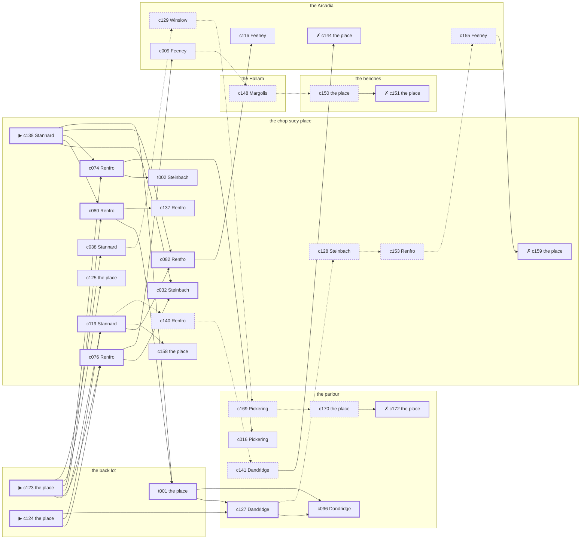

# Chelsea — case 13

**Seed** 13 · **Difficulty** 2 · **Attempts** 1 · **Detective** Dashiell

**Type** murder · **Trope** body-at-scene · **Unknowns** who, why, when

**Par** 11 actions · **Slack** 6 · **Budget** 17 · **Findable** 34 (spine 12, corroboration 8, noise 10 + 4 disqualifiers) · **Noise ratio** 41% · **Candidate pool** 175

## 1. The Truth

Albrecht Lindemann, a bookmaker in a small way, a customer of Feldman’s, killed Bernard Feldman, a bail bondsman, with an ice pick at the back lot at 9:00 PM. Lindemann blamed Feldman for the ruin of Lindemann’s business (revenge). Lindemann had been at the chop suey place earlier in the evening, where the means lived, and was alone with Feldman when it happened. Stannard hired us.

## 2. The Act

**murder** · **body-at-scene** · actor **Lindemann** · at **the back lot** · at **9:00 PM**

- found at the back lot
- fate: dead

**Givens** — what the briefing states and the report does not ask:

- Feldman was found dead at the back lot.
- Feldman was killed at the back lot, and nothing was carried out of the room afterwards.
- The coroner puts it between 7:30 PM and 9:00 PM, which is two hours of nothing useful.
- It was an ice pick.

**Unknowns** — exactly what the report asks: **who**, **why**, **when**.

## 3. Dramatis Personae

| Name | Role | Relationship | Class of secret | Motive | Found at | Killer |
| --- | --- | --- | --- | --- | --- | --- |
| Bernard Feldman | a bail bondsman | the victim | — | — | — | — |
| Michael Feeney | a young man living on expectations | Feldman’s brother-in-law | secret-drinking | jealousy | the Arcadia | — |
| Prudence Pickering | an insurance adjuster | a witness against the people Feldman worked for | gambling-debt | exposure | the parlour | — |
| Margarethe Steinbach | the night manager at the hotel | Feldman’s former employee | fence | debt | the chop suey place | — |
| Lyman Stannard (client) | a tailor | a customer of Feldman’s | hidden-family | — | the chop suey place | — |
| Albrecht Lindemann | a bookmaker in a small way | a customer of Feldman’s | murder (+ forged-identity) | revenge | the chop suey place | **YES** |
| Adelaide Winslow | a private nurse | Feldman’s private nurse | hidden-family | — | the Arcadia | — |
| Isaiah Renfro | the man behind the counter | fixture (counterman) | — | — | the chop suey place | — |
| Meyer Margolis | the elevator man | fixture (elevator-man) | — | — | the Hallam | — |
| Odessa Dandridge | the landlady | fixture (landlady) | — | — | the parlour | — |
| Hyman Kessler | the ticket-taker | fixture (ticket-taker) | — | — | the Arcadia | — |

## 4. Dossiers

Every person, by layer: **0** on sight, **1** volunteered, **2** from other people, **3** in the documents.

### Feldman — the victim

46, a man, a bail bondsman. Wants: to-keep-what-they-have.

- **Standing** — Feldman was the first telephone call anybody on the street made at two in the morning.
- **Profession** — Feldman took a house or a wedding ring as security and kept the paper on both.
- **Found** — Feeney found Feldman at the back lot at 11:30 PM. By Feeney, at the back lot, at 11:30 PM. Precinct: took-a-statement.

**Layer 0, on sight**

- _gender_ — A man.
- _age_ — In his forties.

**Layer 1, volunteered**

- _profession_ — A bail bondsman.
- _detail_ — Feldman took a house or a wedding ring as security and kept the paper on both.

**Layer 2, from other people**

- _tie_ — Feldman was the first telephone call anybody on the street made at two in the morning.
- _want_ — Feldman wants to keep what they have and add nothing to it.

**Self-account** (layer 1, what they say when asked about themselves)

- Feldman is 46 years old and a bail bondsman.
- Feldman took a house or a wedding ring as security and kept the paper on both.
- Feldman is the one this is about.

### Feeney

34, a man, a young man living on expectations. Wants: money. Tie: Feldman’s brother-in-law, since ’26.

**Layer 0, on sight**

- _gender_ — A man.
- _age_ — In his thirties.

**Layer 1, volunteered**

- _profession_ — A young man living on expectations.
- _detail_ — Feeney keeps a desk at a brokerage where nobody expects him before noon.

**Layer 2, from other people**

- _tie_ — Feldman stood up at Feeney’s wedding and Harriet Thorndike has never let either of them forget it.
- _want_ — Feeney wants money, and is not particular about the shape it arrives in.
- _since_ — Feeney has been Feldman’s brother-in-law, since ’26.
- _third_ — Harriet Thorndike is the landlady at the old address.

**Layer 3, in the documents**

- _secret-hint_ — Feeney had taken a drink and had gone to some trouble about the smell of it.

**Self-account** (layer 1, what they say when asked about themselves)

- Feeney is 34 years old and a young man living on expectations.
- Feeney keeps a desk at a brokerage where nobody expects him before noon.
- Feeney is Feldman’s brother-in-law.

### Pickering

33, a woman, an insurance adjuster. Wants: respectability. Tie: a witness against the people Feldman worked for, since ’23.

**Layer 0, on sight**

- _gender_ — A woman.
- _age_ — In her thirties.

**Layer 1, volunteered**

- _profession_ — An insurance adjuster.
- _detail_ — Pickering walks fire jobs for the company and writes up what he finds.

**Layer 2, from other people**

- _tie_ — Pickering talked to the district attorney in ’23 and Cornelius Hanrahan has not spoken to Pickering since.
- _want_ — Pickering wants to be thought respectable by people who are not.
- _since_ — Pickering has been a witness against the people Feldman worked for, since ’23.
- _third_ — Cornelius Hanrahan is a younger brother in trouble upstate.

**Layer 3, in the documents**

- _secret-hint_ — Pickering was asking around for a hundred dollars in a hurry earlier in the week.

**Self-account** (layer 1, what they say when asked about themselves)

- Pickering is 33 years old and an insurance adjuster.
- Pickering walks fire jobs for the company and writes up what he finds.
- Pickering is a witness against the people Feldman worked for.

### Steinbach

32, a woman, the night manager at the hotel. Wants: respectability. Tie: Feldman’s former employee, until last winter.

**Layer 0, on sight**

- _gender_ — A woman.
- _age_ — In her thirties.
- _profession_ — The night manager at the hotel.

**Layer 1, volunteered**

- _detail_ — Steinbach keeps the register, the keys, and a memory of who is not in the register.

**Layer 2, from other people**

- _tie_ — Feldman put Steinbach out of a job over forty dollars that was never found.
- _want_ — Steinbach wants to be thought respectable by people who are not.
- _since_ — Steinbach has been Feldman’s former employee, until last winter.

**Layer 3, in the documents**

- _secret-hint_ — Steinbach was carrying a parcel into the chop suey place and came out without it.

**Self-account** (layer 1, what they say when asked about themselves)

- Steinbach is 32 years old and the night manager at the hotel.
- Steinbach keeps the register, the keys, and a memory of who is not in the register.
- Steinbach is Feldman’s former employee.

### Stannard — the client

39, a man, a tailor. Wants: to-keep-what-they-have. Tie: a customer of Feldman’s, since the shop opened.

**Layer 0, on sight**

- _gender_ — A man.
- _age_ — In his thirties.
- _profession_ — A tailor.

**Layer 1, volunteered**

- _detail_ — Stannard has a shop under the stairs and a boy who delivers.

**Layer 2, from other people**

- _tie_ — Stannard has been on Feldman’s books as a customer since ’24.
- _want_ — Stannard wants to keep what they have and add nothing to it.
- _since_ — Stannard has been a customer of Feldman’s, since the shop opened.

**Layer 3, in the documents**

- _secret-hint_ — Stannard sends money out of every pay envelope and cannot say where it goes.

**Self-account** (layer 1, what they say when asked about themselves)

- Stannard is 39 years old and a tailor.
- Stannard has a shop under the stairs and a boy who delivers.
- Stannard is a customer of Feldman’s.

### Lindemann — the killer

51, a man, a bookmaker in a small way. Wants: to-be-left-alone. Tie: a customer of Feldman’s, for years.

**Layer 0, on sight**

- _gender_ — A man.
- _age_ — In his fifties.

**Layer 1, volunteered**

- _profession_ — A bookmaker in a small way.
- _detail_ — Lindemann runs a book on the horses for four blocks and no further.

**Layer 2, from other people**

- _tie_ — Lindemann has been on Feldman’s books as a customer since ’23.
- _want_ — Lindemann wants to be left alone.
- _since_ — Lindemann has been a customer of Feldman’s, for years.

**Layer 3, in the documents**

- _secret-hint_ — Lindemann’s registration card gives an address on a street that does not exist.

**Self-account** (layer 1, what they say when asked about themselves)

- Lindemann is 51 years old and a bookmaker in a small way.
- Lindemann runs a book on the horses for four blocks and no further.
- Lindemann is a customer of Feldman’s.

### Winslow

30, a woman, a private nurse. Wants: respectability. Tie: Feldman’s private nurse, since ’19.

**Layer 0, on sight**

- _gender_ — A woman.
- _age_ — In her thirties.
- _profession_ — A private nurse.

**Layer 1, volunteered**

- _detail_ — Winslow sits nights with patients the hospitals have sent home.

**Layer 2, from other people**

- _tie_ — Winslow knows what Feldman took, and when, and how much of it was necessary.
- _want_ — Winslow wants to be thought respectable by people who are not.
- _since_ — Winslow has been Feldman’s private nurse, since ’19.

**Layer 3, in the documents**

- _secret-hint_ — Winslow sends money out of every pay envelope and cannot say where it goes.

**Self-account** (layer 1, what they say when asked about themselves)

- Winslow is 30 years old and a private nurse.
- Winslow sits nights with patients the hospitals have sent home.
- Winslow is Feldman’s private nurse.

### Renfro

47, a man, the man behind the counter. Wants: to-be-left-alone. Tie: behind the counter at the chop suey place.

**Layer 0, on sight**

- _gender_ — A man.
- _age_ — In his forties.
- _profession_ — The man behind the counter.

**Layer 1, volunteered**

- _detail_ — Renfro has the counter at the chop suey place from four until midnight.

**Layer 2, from other people**

- _tie_ — Renfro is behind the counter at the chop suey place.
- _want_ — Renfro wants to be left alone.

**Self-account** (layer 1, what they say when asked about themselves)

- Renfro is 47 years old and the man behind the counter.
- Renfro has the counter at the chop suey place from four until midnight.
- Renfro is behind the counter at the chop suey place.

### Margolis

61, a man, the elevator man. Wants: to-keep-what-they-have. Tie: in the car at the Hallam.

**Layer 0, on sight**

- _gender_ — A man.
- _age_ — In his sixties.
- _profession_ — The elevator man.

**Layer 1, volunteered**

- _detail_ — Margolis has the car at the Hallam from three until eleven.

**Layer 2, from other people**

- _tie_ — Margolis is in the car at the Hallam.
- _want_ — Margolis wants to keep what they have and add nothing to it.

**Self-account** (layer 1, what they say when asked about themselves)

- Margolis is 61 years old and the elevator man.
- Margolis has the car at the Hallam from three until eleven.
- Margolis is in the car at the Hallam.

### Dandridge

43, a woman, the landlady. Wants: money. Tie: the keeper of the parlour.

**Layer 0, on sight**

- _gender_ — A woman.
- _age_ — In her forties.
- _profession_ — The landlady.

**Layer 1, volunteered**

- _detail_ — Dandridge lets the rooms at the parlour and collects on Saturdays.

**Layer 2, from other people**

- _tie_ — Dandridge is the keeper of the parlour.
- _want_ — Dandridge wants money, and is not particular about the shape it arrives in.

**Self-account** (layer 1, what they say when asked about themselves)

- Dandridge is 43 years old and the landlady.
- Dandridge lets the rooms at the parlour and collects on Saturdays.
- Dandridge is the keeper of the parlour.

### Kessler

43, a man, the ticket-taker. Wants: respectability. Tie: on the door at the Arcadia, every performance.

**Layer 0, on sight**

- _gender_ — A man.
- _age_ — In his forties.
- _profession_ — The ticket-taker.

**Layer 1, volunteered**

- _detail_ — Kessler has taken tickets at the Arcadia since the house opened.

**Layer 2, from other people**

- _tie_ — Kessler is on the door at the Arcadia, every performance.
- _want_ — Kessler wants to be thought respectable by people who are not.

**Self-account** (layer 1, what they say when asked about themselves)

- Kessler is 43 years old and the ticket-taker.
- Kessler has taken tickets at the Arcadia since the house opened.
- Kessler is on the door at the Arcadia, every performance.

## 5. The Client

**Stannard**, a customer of Feldman’s. Purpose: **settle-a-debt-with-the-dead**.

- **Why** — Stannard has something owing with Feldman that death did not settle.
- **What it costs** — Stannard is spending money Stannard was owed and may never see.
- **Points at** — Lindemann: Lindemann blamed Feldman for the ruin of Lindemann’s business. Honest: **yes**.

**Tells:**

- Feldman was found dead at the back lot.
- Feldman was killed at the back lot, and nothing was carried out of the room afterwards.
- The coroner puts it between 7:30 PM and 9:00 PM, which is two hours of nothing useful.
- It was an ice pick.
- Stannard would rather we started with Lindemann: Lindemann blamed Feldman for the ruin of Lindemann’s business.

**Withholds:**

- Stannard does not mention it, but Stannard goes to the parlour from 8:00 PM to 8:30 PM to see a child nobody is supposed to know about.

**Their own evening, as they tell it:**

- Stannard says he was at the Hallam from 6:00 PM to 6:30 PM.
- Stannard says he was at the chop suey place from 7:00 PM to 7:30 PM.
- Stannard says he was at the benches from 8:00 PM to 8:30 PM.
- Stannard says he was at the chop suey place from 9:00 PM to 10:30 PM.

## 6. The Briefing

16 plain sentences, derived. This is the model of the plain register: the engine renders it, and Phase 2 measures pages against it.

1. A man came up the stairs after midnight, and sat down.
2. Lyman Stannard is 39 years old and a tailor.
3. Stannard has a shop under the stairs and a boy who delivers.
4. Feldman was the first telephone call anybody on the street made at two in the morning.
5. Feldman was found dead at the back lot.
6. Feldman was killed at the back lot, and nothing was carried out of the room afterwards.
7. The coroner puts it between 7:30 PM and 9:00 PM, which is two hours of nothing useful.
8. It was an ice pick.
9. Feeney found Feldman at the back lot at 11:30 PM.
10. The precinct took a statement at the desk and filed it.
11. Stannard is a customer of Feldman’s.
12. Stannard has been on Feldman’s books as a customer since ’24.
13. Stannard has something owing with Feldman that death did not settle.
14. Stannard is spending money Stannard was owed and may never see.
15. Stannard wants us to start with Lindemann.
16. Lindemann blamed Feldman for the ruin of Lindemann’s business.

## 7. Mentions

- **Rose Donnelly** (m-1) — a woman they had both been seeing. Rose Donnelly is a woman they had both been seeing.
- **Harriet Thorndike** (m-2) — the landlady at the old address. Harriet Thorndike is the landlady at the old address.
- **Cornelius Hanrahan** (m-3) — a younger brother in trouble upstate. Cornelius Hanrahan is a younger brother in trouble upstate.

## 8. Places

- **Feldman’s house on the back lot** (private) — unwatched; objects: a mechanic’s toolbox, a framed photograph — **THE SCENE**; the victim’s address
- **the benches at the north end of the square** (public) — unwatched; objects: a folded stack of evening papers, a brass umbrella stand
- **the chop suey place over the laundry** (semi) — watched by counterman (Renfro); objects: an ice pick, a wall telephone, a bottle of chloral drops — where the weapon lived; within earshot of the scene
- **the vestibule of the Hallam apartments** (private) — watched by elevator-man (Margolis); objects: a camel-hair overcoat on a hook, a day ledger, the roof-door key
- **the parlour of Mrs. Teague’s boarding house** (semi) — watched by landlady (Dandridge); objects: a bronze bookend, a length of sash cord
- **the Arcadia dance hall** (public) — watched by ticket-taker (Kessler); objects: a standing ashtray, a silver cigarette case — within earshot of the scene

## 9. Anchors

The coroner gives 7:30 PM–9:00 PM, four ticks wide. These are what close it: **bar-radio** and **piano-lesson**.

- **the piano lesson on the floor above** — at 8:30 PM; at the parlour. You can time things by it: the same four bars, over and over, and then nothing. Only those present know that the child never did get the passage right.
- **the fight card on the bar radio** — at 9:00 PM; at the Arcadia. Only those present know that the challenger went down in the fourth and the crowd booed it. You can time things by it: the set was turned up loud enough to carry into the street.
- **the fuse going in the building** — at 7:30 PM; at the Hallam. You can time things by it: a crack in the cellar and every light on the riser out at once. Only those present know that it was the second floor that went dark and not the whole house. Those present carry it: candle smoke on the ceilings of everyone who sat it out.

## 10. Timelines

### Feldman — the victim

| Tick | Time | Truth | Claimed | Companion claimed |
| --- | --- | --- | --- | --- |
| 0 | 6:00 PM | the Arcadia | the Arcadia | — |
| 1 | 6:30 PM | the Arcadia | the Arcadia | — |
| 2 | 7:00 PM | the benches | the benches | — |
| 3 | 7:30 PM | the benches | the benches | — |
| 4 | 8:00 PM | the benches | the benches | — |
| 5 | 8:30 PM | the parlour | the parlour | — |
| 6 | 9:00 PM | the back lot ☠ | the back lot | — |
| 7 | 9:30 PM | — | — | — |
| 8 | 10:00 PM | — | — | — |
| 9 | 10:30 PM | — | — | — |
| 10 | 11:00 PM | — | — | — |
| 11 | 11:30 PM | — | — | — |

### Feeney

| Tick | Time | Truth | Claimed | Companion claimed |
| --- | --- | --- | --- | --- |
| 0 | 6:00 PM | the Arcadia | the Arcadia | — |
| 1 | 6:30 PM | the chop suey place | the chop suey place | — |
| 2 | 7:00 PM | the chop suey place | the chop suey place | — |
| 3 | 7:30 PM | the Arcadia | the Arcadia | — |
| 4 | 8:00 PM | the Arcadia | **the Hallam** | — |
| 5 | 8:30 PM | the Arcadia | **the Hallam** | — |
| 6 | 9:00 PM | the chop suey place | the chop suey place | — |
| 7 | 9:30 PM | the Arcadia | the Arcadia | — |
| 8 | 10:00 PM | the Arcadia | the Arcadia | — |
| 9 | 10:30 PM | the Hallam | the Hallam | — |
| 10 | 11:00 PM | the Hallam | the Hallam | — |
| 11 | 11:30 PM | the back lot | the back lot | — |

### Pickering

| Tick | Time | Truth | Claimed | Companion claimed |
| --- | --- | --- | --- | --- |
| 0 | 6:00 PM | the parlour | the parlour | — |
| 1 | 6:30 PM | the chop suey place | the chop suey place | — |
| 2 | 7:00 PM | the parlour | the parlour | — |
| 3 | 7:30 PM | the parlour | the parlour | — |
| 4 | 8:00 PM | the parlour | the parlour | — |
| 5 | 8:30 PM | the parlour | the parlour | — |
| 6 | 9:00 PM | the chop suey place | the chop suey place | — |
| 7 | 9:30 PM | the benches | **the Arcadia** | Stannard |
| 8 | 10:00 PM | the chop suey place | the chop suey place | — |
| 9 | 10:30 PM | the benches | the benches | — |
| 10 | 11:00 PM | the benches | the benches | — |
| 11 | 11:30 PM | the benches | the benches | — |

### Steinbach

| Tick | Time | Truth | Claimed | Companion claimed |
| --- | --- | --- | --- | --- |
| 0 | 6:00 PM | the benches | the benches | — |
| 1 | 6:30 PM | the benches | the benches | — |
| 2 | 7:00 PM | the chop suey place | the chop suey place | — |
| 3 | 7:30 PM | the chop suey place | the chop suey place | — |
| 4 | 8:00 PM | the chop suey place | the chop suey place | — |
| 5 | 8:30 PM | the chop suey place | the chop suey place | — |
| 6 | 9:00 PM | the chop suey place | **the Arcadia** | Stannard |
| 7 | 9:30 PM | the chop suey place | **the Arcadia** | Stannard |
| 8 | 10:00 PM | the Arcadia | the Arcadia | — |
| 9 | 10:30 PM | the benches | the benches | — |
| 10 | 11:00 PM | the parlour | the parlour | — |
| 11 | 11:30 PM | the parlour | the parlour | — |

### Stannard

| Tick | Time | Truth | Claimed | Companion claimed |
| --- | --- | --- | --- | --- |
| 0 | 6:00 PM | the Hallam | the Hallam | — |
| 1 | 6:30 PM | the Hallam | the Hallam | — |
| 2 | 7:00 PM | the chop suey place | the chop suey place | — |
| 3 | 7:30 PM | the chop suey place | the chop suey place | — |
| 4 | 8:00 PM | the parlour | **the benches** | Winslow |
| 5 | 8:30 PM | the parlour | **the benches** | Winslow |
| 6 | 9:00 PM | the chop suey place | the chop suey place | — |
| 7 | 9:30 PM | the chop suey place | the chop suey place | — |
| 8 | 10:00 PM | the chop suey place | the chop suey place | — |
| 9 | 10:30 PM | the chop suey place | the chop suey place | — |
| 10 | 11:00 PM | the parlour | the parlour | — |
| 11 | 11:30 PM | the benches | the benches | — |

### Lindemann — the killer

| Tick | Time | Truth | Claimed | Companion claimed |
| --- | --- | --- | --- | --- |
| 0 | 6:00 PM | the benches | the benches | — |
| 1 | 6:30 PM | the benches | the benches | — |
| 2 | 7:00 PM | the chop suey place | the chop suey place | — |
| 3 | 7:30 PM | the chop suey place | the chop suey place | — |
| 4 | 8:00 PM | the back lot | **the chop suey place** | — |
| 5 | 8:30 PM | the back lot | **the chop suey place** | — |
| 6 | 9:00 PM | the back lot ☠ | **the chop suey place** | — |
| 7 | 9:30 PM | the Arcadia | the Arcadia | — |
| 8 | 10:00 PM | the chop suey place | the chop suey place | — |
| 9 | 10:30 PM | the chop suey place | the chop suey place | — |
| 10 | 11:00 PM | the chop suey place | the chop suey place | — |
| 11 | 11:30 PM | the chop suey place | the chop suey place | — |

### Winslow

| Tick | Time | Truth | Claimed | Companion claimed |
| --- | --- | --- | --- | --- |
| 0 | 6:00 PM | the Arcadia | the Arcadia | — |
| 1 | 6:30 PM | the benches | the benches | — |
| 2 | 7:00 PM | the chop suey place | the chop suey place | — |
| 3 | 7:30 PM | the chop suey place | the chop suey place | — |
| 4 | 8:00 PM | the Arcadia | the Arcadia | — |
| 5 | 8:30 PM | the parlour | **the Arcadia** | Pickering |
| 6 | 9:00 PM | the parlour | **the Arcadia** | Pickering |
| 7 | 9:30 PM | the chop suey place | the chop suey place | — |
| 8 | 10:00 PM | the Arcadia | the Arcadia | — |
| 9 | 10:30 PM | the Arcadia | the Arcadia | — |
| 10 | 11:00 PM | the benches | the benches | — |
| 11 | 11:30 PM | the benches | the benches | — |

### Fixtures (never lie, never withhold)

| Tick | Time | Renfro (the man behind the counter) | Margolis (the elevator man) | Dandridge (the landlady) | Kessler (the ticket-taker) |
| --- | --- | --- | --- | --- | --- |
| 0 | 6:00 PM | the chop suey place | the Hallam | the parlour | the Arcadia |
| 1 | 6:30 PM | the chop suey place | the Hallam | the parlour | the Arcadia |
| 2 | 7:00 PM | the chop suey place | the Hallam | the parlour | the Arcadia |
| 3 | 7:30 PM | the parlour | the Hallam | the parlour | the Arcadia |
| 4 | 8:00 PM | the chop suey place | the Hallam | the parlour | the Arcadia |
| 5 | 8:30 PM | the chop suey place | the Hallam | the parlour | the Arcadia |
| 6 | 9:00 PM | the chop suey place | the parlour | the parlour | the Arcadia |
| 7 | 9:30 PM | the chop suey place | the Hallam | the parlour | the Arcadia |
| 8 | 10:00 PM | the chop suey place | the Hallam | the parlour | the Arcadia |
| 9 | 10:30 PM | the chop suey place | the Hallam | the parlour | the Arcadia |
| 10 | 11:00 PM | the chop suey place | the Hallam | the parlour | the Arcadia |
| 11 | 11:30 PM | the chop suey place | the Hallam | the parlour | the Arcadia |

## 11. Secrets in play

- **Feeney** (secret-drinking): Feeney drinks alone at the Arcadia from 8:00 PM to 8:30 PM and will claim to have been anywhere else.
- **Pickering** (gambling-debt): Pickering slips off to the benches from 9:30 PM to settle with a bookmaker.
- **Steinbach** (fence): Steinbach hands a parcel of stolen goods to a man at the chop suey place from 9:00 PM to 9:30 PM.
- **Stannard** (hidden-family): Stannard goes to the parlour from 8:00 PM to 8:30 PM to see a child nobody is supposed to know about.
- **Lindemann** (murder): Lindemann is at the back lot from 8:00 PM to 9:00 PM, alone with Feldman when it happens at 9:00 PM.
- **Lindemann** also (forged-identity): Lindemann is not the person the papers say. Nothing about the evening is hidden; the lie is all in the paperwork.
- **Winslow** (hidden-family): Winslow goes to the parlour from 8:30 PM to 9:00 PM to see a child nobody is supposed to know about.

## 12. Clue list — the 34 findable

The opening three, free at the start: c123, c124, c138. Everything else has to be led to. The full candidate pool is in the companion file.

### At the back lot

- **c123** [spine ⟨opening⟩] (scene; the place itself) → c076, c119, c080, c074, c125, c038
  - Feldman was found at the back lot. The tap was left running and the basin had overflowed a clean ring onto the boards. The fight card was on the bar radio at 9:00 PM, turned up loud enough to carry into the street, and off when the card ended.
  - _establishes: the victim dead by 9:00 PM; how it was done_
- **c124** [spine ⟨opening⟩] (morgue; the place itself) → c076, c119, c127
  - The coroner puts death between 7:30 PM and 9:00 PM — two hours of nothing useful. A single narrow puncture under the ribs. Very little blood outside the body.
  - _establishes: death between 7:30 PM and 9:00 PM; how it was done_
- **t001** [spine] (physical; the place itself) → c127, c096
  - The rug at the back lot is rucked up under Feldman and the chair beside it went over backwards. Nothing was carried out of the room.
  - _establishes: Feldman at the back lot, 9:00 PM_

### At the benches

- **c150** [noise {b3}] (physical; the place itself) → c151
  - A book of markers at the benches with Pickering’s initials against four of them.
  - _establishes: context only_
- **c151** [disqualifier {b3}] (overheard; the place itself) → (end)
  - The bookmaker’s runner is found and will say it: Pickering was at the benches from 9:30 PM paying off eleven hundred dollars, a dollar at a time, and went nowhere near the killing.
  - _establishes: Pickering’s gambling-debt accounted for; Pickering at the benches, 9:30 PM_

### At the chop suey place

- **c138** [spine ⟨opening⟩] (client; Stannard on why I was hired) → c032, c080, c074, c082, t001
  - Stannard hired us, and wants it known that Lindemann blamed Feldman for the ruin of Lindemann’s business, and would rather we started there.
  - _establishes: Lindemann had a motive (revenge)_
- **c076** [spine] (observation; Renfro on Pickering) → c032, c009
  - Renfro says Pickering was at the chop suey place at 9:00 PM.
  - _establishes: Pickering at the chop suey place, 9:00 PM_
- **c119** [spine] (observation; Stannard on Lindemann’s account) → c082, c158, c140
  - Stannard was at the chop suey place at 9:00 PM and says Lindemann was not.
  - _establishes: Lindemann not at the chop suey place, 9:00 PM_
- **c032** [spine] (observation; Steinbach on Lindemann) → (end)
  - Steinbach says Lindemann was at the chop suey place from 7:00 PM to 7:30 PM.
  - _establishes: Lindemann at the chop suey place, 7:00 PM–7:30 PM; Lindemann could reach the weapon_
- **c080** [spine] (observation; Renfro on Steinbach) → t001, c137
  - Renfro says Steinbach was at the chop suey place from 8:00 PM to 9:30 PM.
  - _establishes: Steinbach at the chop suey place, 8:00 PM–9:30 PM; Steinbach could reach the weapon_
- **c074** [spine] (observation; Renfro on Feeney) → t002, c016
  - Renfro says Feeney was at the chop suey place at 9:00 PM.
  - _establishes: Feeney at the chop suey place, 9:00 PM_
- **c082** [spine] (observation; Renfro on Stannard) → c116
  - Renfro says Stannard was at the chop suey place from 9:00 PM to 10:30 PM.
  - _establishes: Stannard at the chop suey place, 9:00 PM–10:30 PM_
- **t002** [corroboration] (overheard; Steinbach on the back lot that evening) → (end)
  - Steinbach says the door at the back lot was shut from 9:00 PM on, and nobody came out of it carrying anything.
  - _establishes: Feldman at the back lot, 9:00 PM_
- **c137** [corroboration] (overheard; Renfro on Lindemann and Feldman) → (end)
  - Renfro says Lindemann said Feldman had taken everything and would be made to feel it.
  - _establishes: Lindemann had a motive (revenge)_
- **c125** [corroboration] (physical; the place itself) → (end)
  - An ice pick is gone from the chop suey place. The block is out and half melted and the pick that belongs with it is gone.
  - _establishes: something gone from the chop suey place; how it was done_
- **c038** [corroboration] (observation; Stannard on Pickering) → c129
  - Stannard says Pickering was at the chop suey place at 9:00 PM.
  - _establishes: Pickering at the chop suey place, 9:00 PM_
- **c158** [corroboration] (overheard; the place itself) → (end)
  - The receiver at the chop suey place would rather talk than be held: Steinbach was there from 9:00 PM to 9:30 PM handing over a parcel of somebody else’s silver, which is a charge Steinbach will take over this one.
  - _establishes: Steinbach’s fence accounted for; Steinbach at the chop suey place, 9:00 PM–9:30 PM_
- **c128** [noise {b1}] (anchor; Steinbach on the fight card on the bar radio) → c153
  - Steinbach claims the Arcadia at 9:00 PM, which is when the fight card on the bar radio was on. Asked about it, Steinbach cannot say that the challenger went down in the fourth and the crowd booed it — and everybody who was there can.
  - _establishes: Steinbach not at the Arcadia, 9:00 PM_
- **c153** [noise {b1}] (overheard; Renfro on Steinbach) → c155
  - Renfro on Steinbach: Steinbach was carrying a parcel into the chop suey place and came out without it.
  - _establishes: context only_
- **c159** [disqualifier {b1}] (overheard; the place itself) → (end)
  - The goods turn up, tagged and dated, and the tag puts Steinbach at the chop suey place from 9:00 PM to 9:30 PM with both hands full.
  - _establishes: Steinbach’s fence accounted for; Steinbach at the chop suey place, 9:00 PM–9:30 PM_
- **c140** [noise {b4}] (overheard; Renfro on Feeney) → c141
  - Renfro on Feeney: Feeney is on a temperance pledge that Feeney mentions before anybody asks.
  - _establishes: context only_

### At the Hallam

- **c148** [noise {b3}] (overheard; Margolis on Pickering) → c150
  - Margolis on Pickering: Pickering goes very quiet when the racing wire is mentioned.
  - _establishes: context only_

### At the parlour

- **c127** [spine] (anchor; Dandridge on Feldman that evening) → c096, c128
  - Dandridge puts Feldman at the parlour while the lesson was still going on overhead, which was 8:30 PM, and alive enough to argue about the weather.
  - _establishes: the victim alive at 8:30 PM; Feldman at the parlour, 8:30 PM_
- **c096** [spine] (observation; Dandridge on Winslow) → (end)
  - Dandridge says Winslow was at the parlour from 8:30 PM to 9:00 PM.
  - _establishes: Winslow at the parlour, 8:30 PM–9:00 PM_
- **c016** [corroboration] (observation; Pickering on Feeney) → (end)
  - Pickering says Feeney was at the chop suey place at 9:00 PM.
  - _establishes: Feeney at the chop suey place, 9:00 PM_
- **c169** [noise {b2}] (overheard; Pickering on Winslow) → c170
  - Pickering on Winslow: Winslow keeps a photograph and will not be asked about it twice.
  - _establishes: context only_
- **c170** [noise {b2}] (physical; the place itself) → c172
  - A board-and-keep receipt at the parlour, monthly, eight years of them.
  - _establishes: context only_
- **c172** [disqualifier {b2}] (overheard; the place itself) → (end)
  - The woman who keeps the child says it straight out: Winslow was at the parlour from 8:30 PM to 9:00 PM, the same as every week, and left with the same face as always.
  - _establishes: Winslow’s hidden-family accounted for; Winslow at the parlour, 8:30 PM–9:00 PM_
- **c141** [noise {b4}] (overheard; Dandridge on Feeney) → c144
  - Dandridge on Feeney: Somebody at the Arcadia says Feeney is in more often than Feeney lets on.
  - _establishes: context only_

### At the Arcadia

- **c116** [corroboration] (observation; Feeney on Lindemann’s account) → (end)
  - Feeney was at the chop suey place at 9:00 PM and says Lindemann was not.
  - _establishes: Lindemann not at the chop suey place, 9:00 PM_
- **c009** [corroboration] (observation; Feeney on Lindemann) → c148
  - Feeney says Lindemann was at the chop suey place at 7:00 PM.
  - _establishes: Lindemann at the chop suey place, 7:00 PM; Lindemann could reach the weapon_
- **c155** [noise {b1}] (overheard; Feeney on Steinbach) → c159
  - Feeney on Steinbach: Steinbach has been selling things that were never Steinbach’s to sell.
  - _establishes: context only_
- **c129** [noise {b2}] (anchor; Winslow on the fight card on the bar radio) → c169
  - Winslow claims the Arcadia at 9:00 PM, which is when the fight card on the bar radio was on. Asked about it, Winslow cannot say that the challenger went down in the fourth and the crowd booed it — and everybody who was there can.
  - _establishes: Winslow not at the Arcadia, 9:00 PM_
- **c144** [disqualifier {b4}] (overheard; the place itself) → (end)
  - The man behind the counter at the Arcadia knows exactly: Feeney was on the same stool from 8:00 PM to 8:30 PM and was in no condition to walk anywhere, let alone do this.
  - _establishes: Feeney’s secret-drinking accounted for; Feeney at the Arcadia, 8:00 PM–8:30 PM_

## 13. Clue graph

## 14. Deduction path

Par is **11 actions** and the budget is par plus 6: **17**. Every id below is a spine clue; the inference is the sheet’s, not the clue’s.

**Time of death.** The coroner gives four ticks. The anchors close it to 9:00 PM: one puts Feldman alive at 8:30 PM, the other times the scene at 9:00 PM. _(c124, c127, c123)_

**Clearing the innocent.**

- Feeney was not at the back lot at 9:00 PM. _(c074; + 1 corroborating)_
- Pickering was not at the back lot at 9:00 PM. _(c076; + 1 corroborating)_
- Steinbach was not at the back lot at 9:00 PM. _(c080; + 2 corroborating)_
- Stannard was not at the back lot at 9:00 PM. _(c082)_
- Winslow was not at the back lot at 9:00 PM. _(c096; + 1 corroborating)_

**Naming the killer.** Lindemann claims the chop suey place at 9:00 PM. Two independent sources put that out of the question. _(c119; + 1 corroborating)_

**The weapon.** Lindemann was at the chop suey place before 9:00 PM, where an ice pick was kept. _(c032; + 1 corroborating)_

**Method.** An ice pick, on two physical sources. _(c123, c124; + 1 corroborating)_

**Motive.** revenge, on two independent sources. _(c138; + 1 corroborating)_

## 15. Red herrings

**Innocents who lie about the murder tick:**

- Steinbach claims the Arcadia at 9:00 PM and was really at the chop suey place. Reason: Steinbach hands a parcel of stolen goods to a man at the chop suey place from 9:00 PM to 9:30 PM.
- Winslow claims the Arcadia at 9:00 PM and was really at the parlour. Reason: Winslow goes to the parlour from 8:30 PM to 9:00 PM to see a child nobody is supposed to know about.

**Innocents with a motive:**

- Feeney — jealousy: was jealous of Feldman over Rose Donnelly.
- Pickering — exposure: was about to be exposed by Feldman.
- Steinbach — debt: owed Feldman four thousand dollars and was past due on it.

**Noise branches, and what knocks each one down:**

- **b1** (Steinbach, fence): c128 → c153 → c155 → **c159** — The goods turn up, tagged and dated, and the tag puts Steinbach at the chop suey place from 9:00 PM to 9:30 PM with both hands full.
- **b2** (Winslow, hidden-family): c129 → c169 → c170 → **c172** — The woman who keeps the child says it straight out: Winslow was at the parlour from 8:30 PM to 9:00 PM, the same as every week, and left with the same face as always.
- **b3** (Pickering, gambling-debt): c148 → c150 → **c151** — The bookmaker’s runner is found and will say it: Pickering was at the benches from 9:30 PM paying off eleven hundred dollars, a dollar at a time, and went nowhere near the killing.
- **b4** (Feeney, secret-drinking): c140 → c141 → **c144** — The man behind the counter at the Arcadia knows exactly: Feeney was on the same stool from 8:00 PM to 8:30 PM and was in no condition to walk anywhere, let alone do this.

