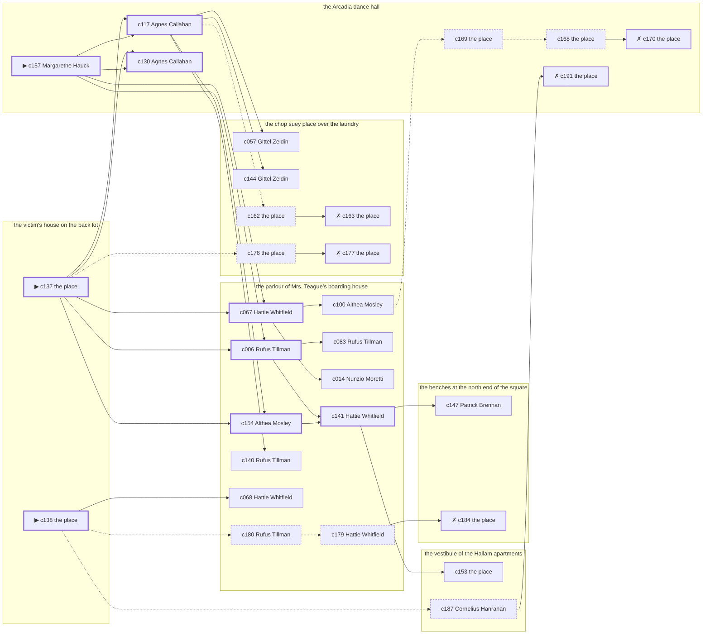

# Chelsea — case 13

**Seed** 13 · **Difficulty** 2 · **Attempts** 5 · **Detective** Humphrey

**Par** 8 actions · **Budget** 20 · **Slack** 12 · **Findable** 30 (spine 9, corroboration 9, noise 7 + 5 disqualifiers) · **Noise ratio** 40% · **Candidate pool** 192

## 1. The Truth

Patrick Brennan, a lawyer with one clerk, the victim’s business partner, killed Nora Mulcahy, a society columnist, with a push from the parapet at the victim’s house on the back lot at 10:30 PM. Patrick Brennan was about to be exposed by the victim (exposure). Patrick Brennan had been at the parlour of Mrs. Teague’s boarding house earlier in the evening, where the weapon lived, and was alone with Nora Mulcahy when it happened. Margarethe Hauck hired us.

## 2. Dramatis Personae

| Name | Role | Relationship | Class of secret | Motive | Found at | Killer |
| --- | --- | --- | --- | --- | --- | --- |
| Nora Mulcahy | a society columnist | the victim | — | — | — | — |
| Rufus Tillman | a policy runner | in the victim’s debt | dope | debt | the parlour of Mrs. Teague’s boarding house | — |
| Nunzio Moretti | the victim’s nephew, at loose ends | the victim’s cousin | secret-drinking | inheritance | the parlour of Mrs. Teague’s boarding house | — |
| Patrick Brennan | a lawyer with one clerk | the victim’s business partner | murder (+ gambling-debt) | exposure | the benches at the north end of the square | **YES** |
| Margarethe Hauck (client) | a dentist with rooms on the third floor | in the victim’s debt | dope | — | the Arcadia dance hall | — |
| Althea Mosley | a stagehand at the Selwyn | a childhood friend of the victim’s from the same block | gambling-debt | revenge | the parlour of Mrs. Teague’s boarding house | — |
| Verity Coffin | a piano teacher | the victim’s tenant | secret-drinking | — | the parlour of Mrs. Teague’s boarding house | — |
| Gittel Zeldin | the man behind the counter | fixture (counterman) | — | — | the chop suey place over the laundry | — |
| Cornelius Hanrahan | the elevator man | fixture (elevator-man) | — | — | the vestibule of the Hallam apartments | — |
| Hattie Whitfield | the landlady | fixture (landlady) | — | — | the parlour of Mrs. Teague’s boarding house | — |
| Agnes Callahan | the ticket-taker | fixture (ticket-taker) | — | — | the Arcadia dance hall | — |

## 3. Places

- **the victim’s house on the back lot** (private) — unwatched; objects: a framed photograph, a bronze bookend — **THE SCENE**; the victim’s address
- **the benches at the north end of the square** (public) — unwatched; objects: a folded stack of evening papers, a brass umbrella stand
- **the chop suey place over the laundry** (semi) — watched by counterman (Gittel Zeldin); objects: an ice pick, a bottle of chloral drops, a wall telephone — within earshot of the scene
- **the vestibule of the Hallam apartments** (private) — watched by elevator-man (Cornelius Hanrahan); objects: a day ledger, a camel-hair overcoat on a hook, a nickel-plated revolver
- **the parlour of Mrs. Teague’s boarding house** (semi) — watched by landlady (Hattie Whitfield); objects: the roof-door key, a length of sash cord — where the weapon lived
- **the Arcadia dance hall** (public) — watched by ticket-taker (Agnes Callahan); objects: a silver cigarette case, a standing ashtray — within earshot of the scene

## 4. Anchors

The coroner gives 9:00 PM–10:30 PM, four ticks wide. These are what close it: **bar-radio** and **piano-lesson**.

- **the piano lesson on the floor above** — at 10:00 PM; at the parlour of Mrs. Teague’s boarding house. You can time things by it: the same four bars, over and over, and then nothing. Only those present know that the child never did get the passage right.
- **the fight card on the bar radio** — at 10:30 PM; at the Arcadia dance hall. Only those present know that the challenger went down in the fourth and the crowd booed it. You can time things by it: the set was turned up loud enough to carry into the street.
- **the fuse going in the building** — at 9:00 PM; at the vestibule of the Hallam apartments. You can time things by it: a crack in the cellar and every light on the riser out at once. Those present carry it: candle smoke on the ceilings of everyone who sat it out.

## 5. Timelines

### Nora Mulcahy — the victim

| Tick | Time | Truth | Claimed | Companion claimed |
| --- | --- | --- | --- | --- |
| 0 | 6:00 PM | the chop suey place over the laundry | the chop suey place over the laundry | — |
| 1 | 6:30 PM | the Arcadia dance hall | the Arcadia dance hall | — |
| 2 | 7:00 PM | the Arcadia dance hall | the Arcadia dance hall | — |
| 3 | 7:30 PM | the Arcadia dance hall | the Arcadia dance hall | — |
| 4 | 8:00 PM | the Arcadia dance hall | the Arcadia dance hall | — |
| 5 | 8:30 PM | the Arcadia dance hall | the Arcadia dance hall | — |
| 6 | 9:00 PM | the Arcadia dance hall | the Arcadia dance hall | — |
| 7 | 9:30 PM | the parlour of Mrs. Teague’s boarding house | the parlour of Mrs. Teague’s boarding house | — |
| 8 | 10:00 PM | the parlour of Mrs. Teague’s boarding house | the parlour of Mrs. Teague’s boarding house | — |
| 9 | 10:30 PM | the victim’s house on the back lot ☠ | the victim’s house on the back lot | — |
| 10 | 11:00 PM | — | — | — |
| 11 | 11:30 PM | — | — | — |

### Rufus Tillman

| Tick | Time | Truth | Claimed | Companion claimed |
| --- | --- | --- | --- | --- |
| 0 | 6:00 PM | the parlour of Mrs. Teague’s boarding house | the parlour of Mrs. Teague’s boarding house | — |
| 1 | 6:30 PM | the parlour of Mrs. Teague’s boarding house | the parlour of Mrs. Teague’s boarding house | — |
| 2 | 7:00 PM | the Arcadia dance hall | the Arcadia dance hall | — |
| 3 | 7:30 PM | the chop suey place over the laundry | the chop suey place over the laundry | — |
| 4 | 8:00 PM | the chop suey place over the laundry | the chop suey place over the laundry | — |
| 5 | 8:30 PM | the vestibule of the Hallam apartments | the vestibule of the Hallam apartments | — |
| 6 | 9:00 PM | the vestibule of the Hallam apartments | the vestibule of the Hallam apartments | — |
| 7 | 9:30 PM | the parlour of Mrs. Teague’s boarding house | the parlour of Mrs. Teague’s boarding house | — |
| 8 | 10:00 PM | the parlour of Mrs. Teague’s boarding house | the parlour of Mrs. Teague’s boarding house | — |
| 9 | 10:30 PM | the Arcadia dance hall | the Arcadia dance hall | — |
| 10 | 11:00 PM | the chop suey place over the laundry | **the Arcadia dance hall** | Althea Mosley |
| 11 | 11:30 PM | the chop suey place over the laundry | **the Arcadia dance hall** | Althea Mosley |

### Nunzio Moretti

| Tick | Time | Truth | Claimed | Companion claimed |
| --- | --- | --- | --- | --- |
| 0 | 6:00 PM | the parlour of Mrs. Teague’s boarding house | the parlour of Mrs. Teague’s boarding house | — |
| 1 | 6:30 PM | the parlour of Mrs. Teague’s boarding house | the parlour of Mrs. Teague’s boarding house | — |
| 2 | 7:00 PM | the parlour of Mrs. Teague’s boarding house | the parlour of Mrs. Teague’s boarding house | — |
| 3 | 7:30 PM | the parlour of Mrs. Teague’s boarding house | the parlour of Mrs. Teague’s boarding house | — |
| 4 | 8:00 PM | the parlour of Mrs. Teague’s boarding house | the parlour of Mrs. Teague’s boarding house | — |
| 5 | 8:30 PM | the parlour of Mrs. Teague’s boarding house | the parlour of Mrs. Teague’s boarding house | — |
| 6 | 9:00 PM | the parlour of Mrs. Teague’s boarding house | the parlour of Mrs. Teague’s boarding house | — |
| 7 | 9:30 PM | the parlour of Mrs. Teague’s boarding house | the parlour of Mrs. Teague’s boarding house | — |
| 8 | 10:00 PM | the Arcadia dance hall | **the vestibule of the Hallam apartments** | Rufus Tillman |
| 9 | 10:30 PM | the Arcadia dance hall | **the vestibule of the Hallam apartments** | Rufus Tillman |
| 10 | 11:00 PM | the Arcadia dance hall | the Arcadia dance hall | — |
| 11 | 11:30 PM | the benches at the north end of the square | the benches at the north end of the square | — |

### Patrick Brennan — the killer

| Tick | Time | Truth | Claimed | Companion claimed |
| --- | --- | --- | --- | --- |
| 0 | 6:00 PM | the benches at the north end of the square | **the Arcadia dance hall** | — |
| 1 | 6:30 PM | the benches at the north end of the square | **the Arcadia dance hall** | — |
| 2 | 7:00 PM | the benches at the north end of the square | the benches at the north end of the square | — |
| 3 | 7:30 PM | the benches at the north end of the square | the benches at the north end of the square | — |
| 4 | 8:00 PM | the benches at the north end of the square | the benches at the north end of the square | — |
| 5 | 8:30 PM | the benches at the north end of the square | the benches at the north end of the square | — |
| 6 | 9:00 PM | the benches at the north end of the square | the benches at the north end of the square | — |
| 7 | 9:30 PM | the parlour of Mrs. Teague’s boarding house | the parlour of Mrs. Teague’s boarding house | — |
| 8 | 10:00 PM | the victim’s house on the back lot | **the Arcadia dance hall** | — |
| 9 | 10:30 PM | the victim’s house on the back lot ☠ | **the Arcadia dance hall** | — |
| 10 | 11:00 PM | the benches at the north end of the square | the benches at the north end of the square | — |
| 11 | 11:30 PM | the benches at the north end of the square | the benches at the north end of the square | — |

### Margarethe Hauck

| Tick | Time | Truth | Claimed | Companion claimed |
| --- | --- | --- | --- | --- |
| 0 | 6:00 PM | the benches at the north end of the square | the benches at the north end of the square | — |
| 1 | 6:30 PM | the chop suey place over the laundry | the chop suey place over the laundry | — |
| 2 | 7:00 PM | the benches at the north end of the square | the benches at the north end of the square | — |
| 3 | 7:30 PM | the Arcadia dance hall | the Arcadia dance hall | — |
| 4 | 8:00 PM | the Arcadia dance hall | the Arcadia dance hall | — |
| 5 | 8:30 PM | the Arcadia dance hall | the Arcadia dance hall | — |
| 6 | 9:00 PM | the Arcadia dance hall | the Arcadia dance hall | — |
| 7 | 9:30 PM | the Arcadia dance hall | the Arcadia dance hall | — |
| 8 | 10:00 PM | the Arcadia dance hall | the Arcadia dance hall | — |
| 9 | 10:30 PM | the chop suey place over the laundry | **the benches at the north end of the square** | — |
| 10 | 11:00 PM | the chop suey place over the laundry | **the benches at the north end of the square** | — |
| 11 | 11:30 PM | the chop suey place over the laundry | the chop suey place over the laundry | — |

### Althea Mosley

| Tick | Time | Truth | Claimed | Companion claimed |
| --- | --- | --- | --- | --- |
| 0 | 6:00 PM | the parlour of Mrs. Teague’s boarding house | the parlour of Mrs. Teague’s boarding house | — |
| 1 | 6:30 PM | the parlour of Mrs. Teague’s boarding house | the parlour of Mrs. Teague’s boarding house | — |
| 2 | 7:00 PM | the benches at the north end of the square | **the Arcadia dance hall** | — |
| 3 | 7:30 PM | the benches at the north end of the square | **the Arcadia dance hall** | — |
| 4 | 8:00 PM | the victim’s house on the back lot | the victim’s house on the back lot | — |
| 5 | 8:30 PM | the parlour of Mrs. Teague’s boarding house | the parlour of Mrs. Teague’s boarding house | — |
| 6 | 9:00 PM | the parlour of Mrs. Teague’s boarding house | the parlour of Mrs. Teague’s boarding house | — |
| 7 | 9:30 PM | the parlour of Mrs. Teague’s boarding house | the parlour of Mrs. Teague’s boarding house | — |
| 8 | 10:00 PM | the Arcadia dance hall | the Arcadia dance hall | — |
| 9 | 10:30 PM | the Arcadia dance hall | the Arcadia dance hall | — |
| 10 | 11:00 PM | the parlour of Mrs. Teague’s boarding house | the parlour of Mrs. Teague’s boarding house | — |
| 11 | 11:30 PM | the parlour of Mrs. Teague’s boarding house | the parlour of Mrs. Teague’s boarding house | — |

### Verity Coffin

| Tick | Time | Truth | Claimed | Companion claimed |
| --- | --- | --- | --- | --- |
| 0 | 6:00 PM | the benches at the north end of the square | the benches at the north end of the square | — |
| 1 | 6:30 PM | the benches at the north end of the square | the benches at the north end of the square | — |
| 2 | 7:00 PM | the parlour of Mrs. Teague’s boarding house | the parlour of Mrs. Teague’s boarding house | — |
| 3 | 7:30 PM | the parlour of Mrs. Teague’s boarding house | the parlour of Mrs. Teague’s boarding house | — |
| 4 | 8:00 PM | the parlour of Mrs. Teague’s boarding house | the parlour of Mrs. Teague’s boarding house | — |
| 5 | 8:30 PM | the parlour of Mrs. Teague’s boarding house | the parlour of Mrs. Teague’s boarding house | — |
| 6 | 9:00 PM | the parlour of Mrs. Teague’s boarding house | the parlour of Mrs. Teague’s boarding house | — |
| 7 | 9:30 PM | the Arcadia dance hall | the Arcadia dance hall | — |
| 8 | 10:00 PM | the benches at the north end of the square | the benches at the north end of the square | — |
| 9 | 10:30 PM | the Arcadia dance hall | **the chop suey place over the laundry** | — |
| 10 | 11:00 PM | the Arcadia dance hall | **the chop suey place over the laundry** | — |
| 11 | 11:30 PM | the Arcadia dance hall | the Arcadia dance hall | — |

### Fixtures (never lie, never withhold)

| Tick | Time | Gittel Zeldin (the man behind the counter) | Cornelius Hanrahan (the elevator man) | Hattie Whitfield (the landlady) | Agnes Callahan (the ticket-taker) |
| --- | --- | --- | --- | --- | --- |
| 0 | 6:00 PM | the chop suey place over the laundry | the vestibule of the Hallam apartments | the parlour of Mrs. Teague’s boarding house | the Arcadia dance hall |
| 1 | 6:30 PM | the chop suey place over the laundry | the vestibule of the Hallam apartments | the parlour of Mrs. Teague’s boarding house | the Arcadia dance hall |
| 2 | 7:00 PM | the parlour of Mrs. Teague’s boarding house | the vestibule of the Hallam apartments | the parlour of Mrs. Teague’s boarding house | the Arcadia dance hall |
| 3 | 7:30 PM | the chop suey place over the laundry | the vestibule of the Hallam apartments | the parlour of Mrs. Teague’s boarding house | the Arcadia dance hall |
| 4 | 8:00 PM | the chop suey place over the laundry | the Arcadia dance hall | the parlour of Mrs. Teague’s boarding house | the Arcadia dance hall |
| 5 | 8:30 PM | the chop suey place over the laundry | the vestibule of the Hallam apartments | the parlour of Mrs. Teague’s boarding house | the Arcadia dance hall |
| 6 | 9:00 PM | the chop suey place over the laundry | the vestibule of the Hallam apartments | the parlour of Mrs. Teague’s boarding house | the Arcadia dance hall |
| 7 | 9:30 PM | the chop suey place over the laundry | the vestibule of the Hallam apartments | the parlour of Mrs. Teague’s boarding house | the Arcadia dance hall |
| 8 | 10:00 PM | the chop suey place over the laundry | the vestibule of the Hallam apartments | the parlour of Mrs. Teague’s boarding house | the Arcadia dance hall |
| 9 | 10:30 PM | the chop suey place over the laundry | the vestibule of the Hallam apartments | the chop suey place over the laundry | the Arcadia dance hall |
| 10 | 11:00 PM | the chop suey place over the laundry | the vestibule of the Hallam apartments | the parlour of Mrs. Teague’s boarding house | the Arcadia dance hall |
| 11 | 11:30 PM | the chop suey place over the laundry | the vestibule of the Hallam apartments | the parlour of Mrs. Teague’s boarding house | the Arcadia dance hall |

## 6. Secrets in play

- **Rufus Tillman** (dope): Rufus Tillman buys morphine at the chop suey place over the laundry from 11:00 PM to 11:30 PM and would rather be thought a murderer than a hop-head.
- **Nunzio Moretti** (secret-drinking): Nunzio Moretti drinks alone at the Arcadia dance hall from 10:00 PM to 10:30 PM and will claim to have been anywhere else.
- **Patrick Brennan** (murder): Patrick Brennan is at the victim’s house on the back lot from 10:00 PM to 10:30 PM, alone with Nora Mulcahy when it happens at 10:30 PM.
- **Patrick Brennan** also (gambling-debt): Patrick Brennan slips off to the benches at the north end of the square from 6:00 PM to 6:30 PM to settle with a bookmaker.
- **Margarethe Hauck** (dope): Margarethe Hauck buys morphine at the chop suey place over the laundry from 10:30 PM to 11:00 PM and would rather be thought a murderer than a hop-head.
- **Althea Mosley** (gambling-debt): Althea Mosley slips off to the benches at the north end of the square from 7:00 PM to 7:30 PM to settle with a bookmaker.
- **Verity Coffin** (secret-drinking): Verity Coffin drinks alone at the Arcadia dance hall from 10:30 PM to 11:00 PM and will claim to have been anywhere else.

## 7. Clue list — the 30 findable

The opening three, free at the start: c137, c138, c157. Everything else has to be led to. The full candidate pool is in the companion file.

### At the victim’s house on the back lot

- **c137** [spine ⟨opening⟩] (scene; the place itself) → c117, c130, c006, c154, c067, c176
  - Nora Mulcahy was found at the victim’s house on the back lot. The dust on the parapet is scored where his heels went over, and the scuff has not weathered. The fight card on the bar radio came at 10:30 PM, and the set was loud enough to cover it, and it was only loud for that half hour. That puts the killing in that half hour and no later.
  - _establishes: the victim dead by 10:30 PM; how it was done_
- **c138** [spine ⟨opening⟩] (morgue; the place itself) → c068, c187, c180
  - The coroner puts death between 9:00 PM and 10:30 PM — two hours of nothing useful. Fractures consistent with a fall of six storeys. Two fingernails torn back.
  - _establishes: death between 9:00 PM and 10:30 PM; how it was done_

### At the benches at the north end of the square

- **c147** [corroboration] (anchor; Patrick Brennan on the fight card on the bar radio) → (end)
  - Patrick Brennan claims to have been at the Arcadia dance hall at 10:30 PM but cannot say that the challenger went down in the fourth and the crowd booed it, which everybody there can.
  - _establishes: Patrick Brennan not at the Arcadia dance hall, 10:30 PM_
- **c184** [disqualifier {b4}] (overheard; the place itself) → (end)
  - The bookmaker’s runner is found and will say it: Althea Mosley was at the benches at the north end of the square from 7:00 PM to 7:30 PM paying off eleven hundred dollars, a dollar at a time, and went nowhere near the killing.
  - _establishes: Althea Mosley’s gambling-debt accounted for; Althea Mosley at the benches at the north end of the square, 7:00 PM–7:30 PM_

### At the chop suey place over the laundry

- **c057** [corroboration] (observation; Gittel Zeldin on Margarethe Hauck) → (end)
  - Gittel Zeldin says Margarethe Hauck was at the chop suey place over the laundry from 10:30 PM to 11:30 PM.
  - _establishes: Margarethe Hauck at the chop suey place over the laundry, 10:30 PM–11:30 PM_
- **c144** [corroboration] (anchor; Gittel Zeldin on the noise that evening) → (end)
  - Gittel Zeldin was at the chop suey place over the laundry at 10:30 PM and heard a shout and then something hitting the areaway from the direction of the victim’s house on the back lot, while the fight was on the radio.
  - _establishes: noise at the victim’s house on the back lot at 10:30 PM; the victim dead by 10:30 PM; how it was done_
- **c162** [noise {b1}] (physical; the place itself) → c163
  - A prescription blank at the chop suey place over the laundry signed by a doctor who has been dead since the spring.
  - _establishes: context only_
- **c163** [disqualifier {b1}] (overheard; the place itself) → (end)
  - The man who sells it at the chop suey place over the laundry gives it up rather than be held: Rufus Tillman was there from 11:00 PM to 11:30 PM, and stayed until it took hold.
  - _establishes: Rufus Tillman’s dope accounted for; Rufus Tillman at the chop suey place over the laundry, 11:00 PM–11:30 PM_
- **c176** [noise {b5}] (physical; the place itself) → c177
  - A prescription blank at the chop suey place over the laundry signed by a doctor who has been dead since the spring.
  - _establishes: context only_
- **c177** [disqualifier {b5}] (overheard; the place itself) → (end)
  - The man who sells it at the chop suey place over the laundry gives it up rather than be held: Margarethe Hauck was there from 10:30 PM to 11:00 PM, and stayed until it took hold.
  - _establishes: Margarethe Hauck’s dope accounted for; Margarethe Hauck at the chop suey place over the laundry, 10:30 PM–11:00 PM_

### At the vestibule of the Hallam apartments

- **c153** [corroboration] (document; the place itself) → (end)
  - Found at the vestibule of the Hallam apartments: A typed page of dates and sums in Nora Mulcahy’s file, headed with Patrick Brennan’s name.
  - _establishes: Patrick Brennan had a motive (exposure)_
- **c187** [noise {b3}] (overheard; Cornelius Hanrahan on Verity Coffin) → c191
  - Cornelius Hanrahan on Verity Coffin: Verity Coffin is on a temperance pledge that Verity Coffin mentions before anybody asks.
  - _establishes: context only_

### At the parlour of Mrs. Teague’s boarding house

- **c006** [spine] (observation; Rufus Tillman on Patrick Brennan) → c141, c083
  - Rufus Tillman says Patrick Brennan was at the parlour of Mrs. Teague’s boarding house at 9:30 PM.
  - _establishes: Patrick Brennan at the parlour of Mrs. Teague’s boarding house, 9:30 PM; Patrick Brennan could reach the weapon_
- **c154** [spine] (overheard; Althea Mosley on Patrick Brennan and Nora Mulcahy) → c141
  - Althea Mosley says Nora Mulcahy told Patrick Brennan that the story would run whether Patrick Brennan liked it or not.
  - _establishes: Patrick Brennan had a motive (exposure)_
- **c067** [spine] (observation; Hattie Whitfield on Margarethe Hauck) → c014, c100
  - Hattie Whitfield says Margarethe Hauck was at the chop suey place over the laundry at 10:30 PM.
  - _establishes: Margarethe Hauck at the chop suey place over the laundry, 10:30 PM_
- **c141** [spine] (anchor; Hattie Whitfield on Nora Mulcahy that evening) → c153, c147
  - Hattie Whitfield puts Nora Mulcahy at the parlour of Mrs. Teague’s boarding house while the lesson was still going on overhead, which was 10:00 PM, and alive enough to argue about the weather.
  - _establishes: the victim alive at 10:00 PM; Nora Mulcahy at the parlour of Mrs. Teague’s boarding house, 10:00 PM_
- **c083** [corroboration] (observation; Rufus Tillman on who was there at 10:30 PM) → (end)
  - Rufus Tillman runs through it: at 10:30 PM there were Nunzio Moretti, Althea Mosley, Verity Coffin at the Arcadia dance hall, and nobody else worth naming.
  - _establishes: Nunzio Moretti at the Arcadia dance hall, 10:30 PM; Althea Mosley at the Arcadia dance hall, 10:30 PM; Verity Coffin at the Arcadia dance hall, 10:30 PM_
- **c014** [corroboration] (observation; Nunzio Moretti on Patrick Brennan) → (end)
  - Nunzio Moretti says Patrick Brennan was at the parlour of Mrs. Teague’s boarding house at 9:30 PM.
  - _establishes: Patrick Brennan at the parlour of Mrs. Teague’s boarding house, 9:30 PM; Patrick Brennan could reach the weapon_
- **c100** [corroboration] (observation; Althea Mosley on who was there at 10:30 PM) → c169
  - Althea Mosley runs through it: at 10:30 PM there were Rufus Tillman, Nunzio Moretti, Verity Coffin at the Arcadia dance hall, and nobody else worth naming.
  - _establishes: Rufus Tillman at the Arcadia dance hall, 10:30 PM; Nunzio Moretti at the Arcadia dance hall, 10:30 PM; Verity Coffin at the Arcadia dance hall, 10:30 PM_
- **c140** [corroboration] (anchor; Rufus Tillman on Nora Mulcahy that evening) → (end)
  - Rufus Tillman puts Nora Mulcahy at the parlour of Mrs. Teague’s boarding house while the lesson was still going on overhead, which was 10:00 PM, and alive enough to argue about the weather.
  - _establishes: the victim alive at 10:00 PM; Nora Mulcahy at the parlour of Mrs. Teague’s boarding house, 10:00 PM_
- **c068** [corroboration] (observation; Hattie Whitfield on Althea Mosley) → (end)
  - Hattie Whitfield says Althea Mosley was at the parlour of Mrs. Teague’s boarding house from 6:00 PM to 6:30 PM.
  - _establishes: Althea Mosley at the parlour of Mrs. Teague’s boarding house, 6:00 PM–6:30 PM; Althea Mosley could reach the weapon_
- **c180** [noise {b4}] (overheard; Rufus Tillman on Althea Mosley) → c179
  - Rufus Tillman on Althea Mosley: A man nobody knew was waiting for Althea Mosley at the benches at the north end of the square and would not give a name.
  - _establishes: context only_
- **c179** [noise {b4}] (overheard; Hattie Whitfield on Althea Mosley) → c184
  - Hattie Whitfield on Althea Mosley: Althea Mosley was asking around for a hundred dollars in a hurry earlier in the week.
  - _establishes: context only_

### At the Arcadia dance hall

- **c157** [spine ⟨opening⟩] (client; Margarethe Hauck on why I was hired) → c117, c130, c006, c067
  - Margarethe Hauck hired us. Margarethe Hauck wants it known that Rufus Tillman owed the victim money, and would rather we started there.
  - _establishes: Rufus Tillman had a motive (debt)_
- **c117** [spine] (observation; Agnes Callahan on who was there at 10:30 PM) → c154, c057, c144, c140, c162
  - Agnes Callahan runs through it: at 10:30 PM there were Rufus Tillman, Nunzio Moretti, Althea Mosley, Verity Coffin at the Arcadia dance hall, and nobody else worth naming.
  - _establishes: Rufus Tillman at the Arcadia dance hall, 10:30 PM; Nunzio Moretti at the Arcadia dance hall, 10:30 PM; Althea Mosley at the Arcadia dance hall, 10:30 PM; Verity Coffin at the Arcadia dance hall, 10:30 PM_
- **c130** [spine] (observation; Agnes Callahan on Patrick Brennan’s account) → (end)
  - Agnes Callahan was at the Arcadia dance hall from 10:00 PM to 10:30 PM and says Patrick Brennan was not.
  - _establishes: Patrick Brennan not at the Arcadia dance hall, 10:00 PM–10:30 PM_
- **c169** [noise {b2}] (physical; the place itself) → c168
  - A tab at the Arcadia dance hall in a name that is not Nunzio Moretti’s, in Nunzio Moretti’s handwriting.
  - _establishes: context only_
- **c168** [noise {b2}] (physical; the place itself) → c170
  - A bottle at the Arcadia dance hall pushed behind the pipes, the seal broken and the level down.
  - _establishes: context only_
- **c170** [disqualifier {b2}] (overheard; the place itself) → (end)
  - The man behind the counter at the Arcadia dance hall knows exactly: Nunzio Moretti was on the same stool from 10:00 PM to 10:30 PM and was in no condition to walk anywhere, let alone do this.
  - _establishes: Nunzio Moretti’s secret-drinking accounted for; Nunzio Moretti at the Arcadia dance hall, 10:00 PM–10:30 PM_
- **c191** [disqualifier {b3}] (overheard; the place itself) → (end)
  - The man behind the counter at the Arcadia dance hall knows exactly: Verity Coffin was on the same stool from 10:30 PM to 11:00 PM and was in no condition to walk anywhere, let alone do this.
  - _establishes: Verity Coffin’s secret-drinking accounted for; Verity Coffin at the Arcadia dance hall, 10:30 PM–11:00 PM_

## 8. Clue graph

## 9. Deduction path

Par is **8 actions** against a budget of 20: 12 spare. Every id below is a spine clue.

**Time of death.** The coroner gives four ticks. The anchors close it to 10:30 PM: one puts Nora Mulcahy alive at 10:00 PM, the other times the scene at 10:30 PM. _(c138, c141, c137; + 2 corroborating)_

**Clearing the innocent.**

- Rufus Tillman was not at the victim’s house on the back lot at 10:30 PM, on two independent sources. _(c117; + 1 corroborating)_
- Nunzio Moretti was not at the victim’s house on the back lot at 10:30 PM, on two independent sources. _(c117; + 3 corroborating)_
- Margarethe Hauck was not at the victim’s house on the back lot at 10:30 PM, on two independent sources. _(c067; + 2 corroborating)_
- Althea Mosley was not at the victim’s house on the back lot at 10:30 PM, on two independent sources. _(c117; + 1 corroborating)_
- Verity Coffin was not at the victim’s house on the back lot at 10:30 PM, on two independent sources. _(c117; + 3 corroborating)_

**Naming the killer.** Patrick Brennan claims the Arcadia dance hall at 10:30 PM. Two independent sources put that out of the question. _(c130; + 1 corroborating)_

**The weapon.** Patrick Brennan was at the parlour of Mrs. Teague’s boarding house before 10:30 PM, where the roof-door key was kept. _(c006; + 1 corroborating)_

**Method.** A push from the parapet, on two physical sources. _(c137, c138; + 1 corroborating)_

**Motive.** exposure, on two independent sources. _(c154; + 1 corroborating)_

## 10. Red herrings

**Innocents who lie about the murder tick:**

- Nunzio Moretti claims the vestibule of the Hallam apartments at 10:30 PM and was really at the Arcadia dance hall. Reason: Nunzio Moretti drinks alone at the Arcadia dance hall from 10:00 PM to 10:30 PM and will claim to have been anywhere else.
- Margarethe Hauck claims the benches at the north end of the square at 10:30 PM and was really at the chop suey place over the laundry. Reason: Margarethe Hauck buys morphine at the chop suey place over the laundry from 10:30 PM to 11:00 PM and would rather be thought a murderer than a hop-head.
- Verity Coffin claims the chop suey place over the laundry at 10:30 PM and was really at the Arcadia dance hall. Reason: Verity Coffin drinks alone at the Arcadia dance hall from 10:30 PM to 11:00 PM and will claim to have been anywhere else.

**Innocents with a motive:**

- Rufus Tillman — debt: owed the victim money.
- Nunzio Moretti — inheritance: stands to inherit.
- Althea Mosley — revenge: blamed the victim for a ruin.

**Noise branches, and what knocks each one down:**

- **b1** (Rufus Tillman, dope): c162 → **c163** — The man who sells it at the chop suey place over the laundry gives it up rather than be held: Rufus Tillman was there from 11:00 PM to 11:30 PM, and stayed until it took hold.
- **b2** (Nunzio Moretti, secret-drinking): c169 → c168 → **c170** — The man behind the counter at the Arcadia dance hall knows exactly: Nunzio Moretti was on the same stool from 10:00 PM to 10:30 PM and was in no condition to walk anywhere, let alone do this.
- **b3** (Verity Coffin, secret-drinking): c187 → **c191** — The man behind the counter at the Arcadia dance hall knows exactly: Verity Coffin was on the same stool from 10:30 PM to 11:00 PM and was in no condition to walk anywhere, let alone do this.
- **b4** (Althea Mosley, gambling-debt): c180 → c179 → **c184** — The bookmaker’s runner is found and will say it: Althea Mosley was at the benches at the north end of the square from 7:00 PM to 7:30 PM paying off eleven hundred dollars, a dollar at a time, and went nowhere near the killing.
- **b5** (Margarethe Hauck, dope): c176 → **c177** — The man who sells it at the chop suey place over the laundry gives it up rather than be held: Margarethe Hauck was there from 10:30 PM to 11:00 PM, and stayed until it took hold.

