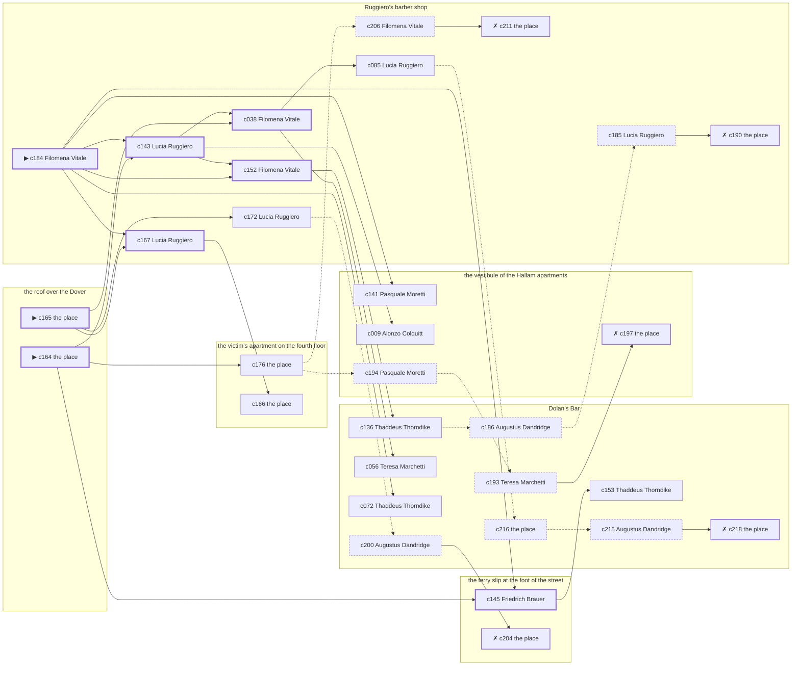

# Harlem — case 14

**Seed** 14 · **Difficulty** 2 · **Attempts** 2 · **Detective** Humphrey

**Par** 7 actions · **Budget** 20 · **Slack** 13 · **Findable** 31 (spine 8, corroboration 10, noise 8 + 5 disqualifiers) · **Noise ratio** 42% · **Candidate pool** 219

## 1. The Truth

Gretchen Vogel, a pawnbroker’s man, a customer of the victim’s, killed Roscoe Whitfield, a bootlegger with the lease on the top floor, with a gunshot at the roof over the Dover at 8:30 PM. Gretchen Vogel blamed the victim for a ruin (revenge). Gretchen Vogel had been at the victim’s apartment on the fourth floor earlier in the evening, where the weapon lived, and was alone with Roscoe Whitfield when it happened. Filomena Vitale hired us.

## 2. Dramatis Personae

| Name | Role | Relationship | Class of secret | Motive | Found at | Killer |
| --- | --- | --- | --- | --- | --- | --- |
| Roscoe Whitfield | a bootlegger with the lease on the top floor | the victim | — | — | — | — |
| Alonzo Colquitt | a policy runner | a childhood friend of the victim’s from the same block | fence | — | the vestibule of the Hallam apartments | — |
| Gretchen Vogel | a pawnbroker’s man | a customer of the victim’s | murder | revenge | the ferry slip at the foot of the street | **YES** |
| Augustus Dandridge | a society columnist | a witness against the people the victim worked for | blackmail | silence-a-witness | Dolan’s Bar | — |
| Filomena Vitale (client) | a switchboard operator | the victim’s neighbour across the airshaft | hidden-family | — | Ruggiero’s barber shop | — |
| Maureen Sweeney | a chambermaid | the victim’s former employee | fence | debt | the ferry slip at the foot of the street | — |
| Teresa Marchetti | a widow with rooms on the avenue | the victim’s estranged spouse | secret-drinking | jealousy | Dolan’s Bar | — |
| Thaddeus Thorndike | the bartender | fixture (bartender) | — | — | Dolan’s Bar | — |
| Pasquale Moretti | the elevator man | fixture (elevator-man) | — | — | the vestibule of the Hallam apartments | — |
| Lucia Ruggiero | the man behind the counter | fixture (counterman) | — | — | Ruggiero’s barber shop | — |
| Friedrich Brauer | the patrolman on the beat | fixture (beat-cop) | — | — | the ferry slip at the foot of the street | — |

## 3. Places

- **Dolan’s Bar** (semi) — watched by bartender (Thaddeus Thorndike); objects: a silver cigarette case, a seltzer siphon, a bottle of chloral drops — within earshot of the scene
- **the victim’s apartment on the fourth floor** (private) — unwatched; objects: a nickel-plated revolver, a bronze bookend, a length of sash cord, a framed photograph — the victim’s address; where the weapon lived
- **the ferry slip at the foot of the street** (public) — unwatched; objects: a folded stack of evening papers, a strapped suitcase
- **the vestibule of the Hallam apartments** (private) — watched by elevator-man (Pasquale Moretti); objects: a brass umbrella stand, a day ledger, a camel-hair overcoat on a hook
- **Ruggiero’s barber shop** (semi) — watched by counterman (Lucia Ruggiero); objects: an ice pick — within earshot of the scene
- **the roof over the Dover** (private) — unwatched; objects: a terracotta flower pot, the roof-door key — **THE SCENE**

## 4. Anchors

The coroner gives 7:30 PM–9:00 PM, four ticks wide. These are what close it: **church-bells** and **regular-stool**.

- **the regular who takes the same seat every night** — at 8:00 PM; at Ruggiero’s barber shop. Somebody reliable notes who was there.
- **the bells at St. Malachy’s** — at 6:30 PM, 7:30 PM, 8:30 PM, 9:30 PM, 10:30 PM, 11:30 PM; across the whole neighbourhood. You can time things by it: the half hours are rung and the whole hours are rung twice.
- **the beat cop’s pass** — at 7:00 PM, 8:30 PM, 10:00 PM, 11:30 PM; on a round through the ferry slip at the foot of the street → Dolan’s Bar → Ruggiero’s barber shop. Somebody reliable notes who was there.

## 5. Timelines

### Roscoe Whitfield — the victim

| Tick | Time | Truth | Claimed | Companion claimed |
| --- | --- | --- | --- | --- |
| 0 | 6:00 PM | Dolan’s Bar | Dolan’s Bar | — |
| 1 | 6:30 PM | Dolan’s Bar | Dolan’s Bar | — |
| 2 | 7:00 PM | Ruggiero’s barber shop | Ruggiero’s barber shop | — |
| 3 | 7:30 PM | the vestibule of the Hallam apartments | the vestibule of the Hallam apartments | — |
| 4 | 8:00 PM | Ruggiero’s barber shop | Ruggiero’s barber shop | — |
| 5 | 8:30 PM | the roof over the Dover ☠ | the roof over the Dover | — |
| 6 | 9:00 PM | — | — | — |
| 7 | 9:30 PM | — | — | — |
| 8 | 10:00 PM | — | — | — |
| 9 | 10:30 PM | — | — | — |
| 10 | 11:00 PM | — | — | — |
| 11 | 11:30 PM | — | — | — |

### Alonzo Colquitt

| Tick | Time | Truth | Claimed | Companion claimed |
| --- | --- | --- | --- | --- |
| 0 | 6:00 PM | the vestibule of the Hallam apartments | the vestibule of the Hallam apartments | — |
| 1 | 6:30 PM | the victim’s apartment on the fourth floor | the victim’s apartment on the fourth floor | — |
| 2 | 7:00 PM | Dolan’s Bar | Dolan’s Bar | — |
| 3 | 7:30 PM | Dolan’s Bar | Dolan’s Bar | — |
| 4 | 8:00 PM | Dolan’s Bar | Dolan’s Bar | — |
| 5 | 8:30 PM | Ruggiero’s barber shop | **Dolan’s Bar** | — |
| 6 | 9:00 PM | the vestibule of the Hallam apartments | the vestibule of the Hallam apartments | — |
| 7 | 9:30 PM | the vestibule of the Hallam apartments | the vestibule of the Hallam apartments | — |
| 8 | 10:00 PM | the victim’s apartment on the fourth floor | the victim’s apartment on the fourth floor | — |
| 9 | 10:30 PM | the ferry slip at the foot of the street | the ferry slip at the foot of the street | — |
| 10 | 11:00 PM | the ferry slip at the foot of the street | the ferry slip at the foot of the street | — |
| 11 | 11:30 PM | the ferry slip at the foot of the street | the ferry slip at the foot of the street | — |

### Gretchen Vogel — the killer

| Tick | Time | Truth | Claimed | Companion claimed |
| --- | --- | --- | --- | --- |
| 0 | 6:00 PM | the victim’s apartment on the fourth floor | the victim’s apartment on the fourth floor | — |
| 1 | 6:30 PM | the victim’s apartment on the fourth floor | the victim’s apartment on the fourth floor | — |
| 2 | 7:00 PM | the victim’s apartment on the fourth floor | the victim’s apartment on the fourth floor | — |
| 3 | 7:30 PM | the victim’s apartment on the fourth floor | the victim’s apartment on the fourth floor | — |
| 4 | 8:00 PM | the victim’s apartment on the fourth floor | the victim’s apartment on the fourth floor | — |
| 5 | 8:30 PM | the roof over the Dover ☠ | **Dolan’s Bar** | — |
| 6 | 9:00 PM | the victim’s apartment on the fourth floor | the victim’s apartment on the fourth floor | — |
| 7 | 9:30 PM | Ruggiero’s barber shop | Ruggiero’s barber shop | — |
| 8 | 10:00 PM | the ferry slip at the foot of the street | the ferry slip at the foot of the street | — |
| 9 | 10:30 PM | the ferry slip at the foot of the street | the ferry slip at the foot of the street | — |
| 10 | 11:00 PM | Dolan’s Bar | Dolan’s Bar | — |
| 11 | 11:30 PM | Dolan’s Bar | Dolan’s Bar | — |

### Augustus Dandridge

| Tick | Time | Truth | Claimed | Companion claimed |
| --- | --- | --- | --- | --- |
| 0 | 6:00 PM | Dolan’s Bar | Dolan’s Bar | — |
| 1 | 6:30 PM | the victim’s apartment on the fourth floor | the victim’s apartment on the fourth floor | — |
| 2 | 7:00 PM | Ruggiero’s barber shop | Ruggiero’s barber shop | — |
| 3 | 7:30 PM | the vestibule of the Hallam apartments | **Ruggiero’s barber shop** | — |
| 4 | 8:00 PM | the vestibule of the Hallam apartments | the vestibule of the Hallam apartments | — |
| 5 | 8:30 PM | Dolan’s Bar | Dolan’s Bar | — |
| 6 | 9:00 PM | Dolan’s Bar | Dolan’s Bar | — |
| 7 | 9:30 PM | Dolan’s Bar | Dolan’s Bar | — |
| 8 | 10:00 PM | the ferry slip at the foot of the street | the ferry slip at the foot of the street | — |
| 9 | 10:30 PM | the ferry slip at the foot of the street | the ferry slip at the foot of the street | — |
| 10 | 11:00 PM | the ferry slip at the foot of the street | the ferry slip at the foot of the street | — |
| 11 | 11:30 PM | the ferry slip at the foot of the street | the ferry slip at the foot of the street | — |

### Filomena Vitale

| Tick | Time | Truth | Claimed | Companion claimed |
| --- | --- | --- | --- | --- |
| 0 | 6:00 PM | the victim’s apartment on the fourth floor | the victim’s apartment on the fourth floor | — |
| 1 | 6:30 PM | the victim’s apartment on the fourth floor | the victim’s apartment on the fourth floor | — |
| 2 | 7:00 PM | Ruggiero’s barber shop | Ruggiero’s barber shop | — |
| 3 | 7:30 PM | the ferry slip at the foot of the street | the ferry slip at the foot of the street | — |
| 4 | 8:00 PM | the ferry slip at the foot of the street | the ferry slip at the foot of the street | — |
| 5 | 8:30 PM | Dolan’s Bar | Dolan’s Bar | — |
| 6 | 9:00 PM | Dolan’s Bar | Dolan’s Bar | — |
| 7 | 9:30 PM | Dolan’s Bar | Dolan’s Bar | — |
| 8 | 10:00 PM | the vestibule of the Hallam apartments | the vestibule of the Hallam apartments | — |
| 9 | 10:30 PM | the ferry slip at the foot of the street | **the vestibule of the Hallam apartments** | Alonzo Colquitt |
| 10 | 11:00 PM | Ruggiero’s barber shop | Ruggiero’s barber shop | — |
| 11 | 11:30 PM | Ruggiero’s barber shop | Ruggiero’s barber shop | — |

### Maureen Sweeney

| Tick | Time | Truth | Claimed | Companion claimed |
| --- | --- | --- | --- | --- |
| 0 | 6:00 PM | the victim’s apartment on the fourth floor | the victim’s apartment on the fourth floor | — |
| 1 | 6:30 PM | the victim’s apartment on the fourth floor | the victim’s apartment on the fourth floor | — |
| 2 | 7:00 PM | the victim’s apartment on the fourth floor | the victim’s apartment on the fourth floor | — |
| 3 | 7:30 PM | the victim’s apartment on the fourth floor | the victim’s apartment on the fourth floor | — |
| 4 | 8:00 PM | the roof over the Dover | the roof over the Dover | — |
| 5 | 8:30 PM | Ruggiero’s barber shop | **Dolan’s Bar** | Gretchen Vogel |
| 6 | 9:00 PM | Ruggiero’s barber shop | Ruggiero’s barber shop | — |
| 7 | 9:30 PM | Ruggiero’s barber shop | Ruggiero’s barber shop | — |
| 8 | 10:00 PM | the ferry slip at the foot of the street | the ferry slip at the foot of the street | — |
| 9 | 10:30 PM | the ferry slip at the foot of the street | the ferry slip at the foot of the street | — |
| 10 | 11:00 PM | the ferry slip at the foot of the street | the ferry slip at the foot of the street | — |
| 11 | 11:30 PM | the ferry slip at the foot of the street | the ferry slip at the foot of the street | — |

### Teresa Marchetti

| Tick | Time | Truth | Claimed | Companion claimed |
| --- | --- | --- | --- | --- |
| 0 | 6:00 PM | Ruggiero’s barber shop | Ruggiero’s barber shop | — |
| 1 | 6:30 PM | the victim’s apartment on the fourth floor | the victim’s apartment on the fourth floor | — |
| 2 | 7:00 PM | the victim’s apartment on the fourth floor | the victim’s apartment on the fourth floor | — |
| 3 | 7:30 PM | the victim’s apartment on the fourth floor | the victim’s apartment on the fourth floor | — |
| 4 | 8:00 PM | Dolan’s Bar | **the vestibule of the Hallam apartments** | — |
| 5 | 8:30 PM | Dolan’s Bar | **the vestibule of the Hallam apartments** | — |
| 6 | 9:00 PM | Dolan’s Bar | Dolan’s Bar | — |
| 7 | 9:30 PM | Dolan’s Bar | Dolan’s Bar | — |
| 8 | 10:00 PM | Dolan’s Bar | Dolan’s Bar | — |
| 9 | 10:30 PM | Dolan’s Bar | Dolan’s Bar | — |
| 10 | 11:00 PM | Dolan’s Bar | Dolan’s Bar | — |
| 11 | 11:30 PM | Dolan’s Bar | Dolan’s Bar | — |

### Fixtures (never lie, never withhold)

| Tick | Time | Thaddeus Thorndike (the bartender) | Pasquale Moretti (the elevator man) | Lucia Ruggiero (the man behind the counter) | Friedrich Brauer (the patrolman on the beat) |
| --- | --- | --- | --- | --- | --- |
| 0 | 6:00 PM | Dolan’s Bar | the vestibule of the Hallam apartments | Ruggiero’s barber shop | — |
| 1 | 6:30 PM | the victim’s apartment on the fourth floor | the vestibule of the Hallam apartments | Ruggiero’s barber shop | — |
| 2 | 7:00 PM | Dolan’s Bar | the vestibule of the Hallam apartments | Ruggiero’s barber shop | the ferry slip at the foot of the street |
| 3 | 7:30 PM | Dolan’s Bar | the vestibule of the Hallam apartments | Ruggiero’s barber shop | — |
| 4 | 8:00 PM | Dolan’s Bar | the vestibule of the Hallam apartments | Ruggiero’s barber shop | — |
| 5 | 8:30 PM | Dolan’s Bar | Ruggiero’s barber shop | Ruggiero’s barber shop | Dolan’s Bar |
| 6 | 9:00 PM | Dolan’s Bar | the vestibule of the Hallam apartments | Ruggiero’s barber shop | — |
| 7 | 9:30 PM | Dolan’s Bar | the vestibule of the Hallam apartments | Ruggiero’s barber shop | — |
| 8 | 10:00 PM | Dolan’s Bar | the vestibule of the Hallam apartments | Ruggiero’s barber shop | Ruggiero’s barber shop |
| 9 | 10:30 PM | Dolan’s Bar | the vestibule of the Hallam apartments | Ruggiero’s barber shop | — |
| 10 | 11:00 PM | Dolan’s Bar | the vestibule of the Hallam apartments | Ruggiero’s barber shop | — |
| 11 | 11:30 PM | Dolan’s Bar | the vestibule of the Hallam apartments | Ruggiero’s barber shop | the ferry slip at the foot of the street |

## 6. Secrets in play

- **Alonzo Colquitt** (fence): Alonzo Colquitt hands a parcel of stolen goods to a man at Ruggiero’s barber shop from 8:30 PM.
- **Gretchen Vogel** (murder): Gretchen Vogel is at the roof over the Dover from 8:30 PM, alone with Roscoe Whitfield when it happens at 8:30 PM.
- **Augustus Dandridge** (blackmail): Augustus Dandridge meets the victim alone at the vestibule of the Hallam apartments from 7:30 PM and asks for money.
- **Filomena Vitale** (hidden-family): Filomena Vitale goes to the ferry slip at the foot of the street from 10:30 PM to see a child nobody is supposed to know about.
- **Maureen Sweeney** (fence): Maureen Sweeney hands a parcel of stolen goods to a man at Ruggiero’s barber shop from 8:30 PM.
- **Teresa Marchetti** (secret-drinking): Teresa Marchetti drinks alone at Dolan’s Bar from 8:00 PM to 8:30 PM and will claim to have been anywhere else.

## 7. Clue list — the 30 findable

The opening three, free at the start: c164, c165, c184. Everything else has to be led to. The full candidate pool is in the companion file.

### At Dolan’s Bar

- **c136** [corroboration] (observation; Thaddeus Thorndike on who was there at 8:30 PM) → c186
  - Thaddeus Thorndike runs through it: at 8:30 PM there were Augustus Dandridge, Filomena Vitale, Teresa Marchetti at Dolan’s Bar, and nobody else worth naming.
  - _establishes: Augustus Dandridge at Dolan’s Bar, 8:30 PM; Filomena Vitale at Dolan’s Bar, 8:30 PM; Teresa Marchetti at Dolan’s Bar, 8:30 PM_
- **c056** [corroboration] (observation; Teresa Marchetti on Gretchen Vogel) → (end)
  - Teresa Marchetti says Gretchen Vogel was at the victim’s apartment on the fourth floor from 6:30 PM to 7:30 PM.
  - _establishes: Gretchen Vogel at the victim’s apartment on the fourth floor, 6:30 PM–7:30 PM; Gretchen Vogel could reach the weapon_
- **c153** [corroboration] (observation; Thaddeus Thorndike on Gretchen Vogel’s account) → (end)
  - Thaddeus Thorndike was at Dolan’s Bar at 8:30 PM and says Gretchen Vogel was not.
  - _establishes: Gretchen Vogel not at Dolan’s Bar, 8:30 PM_
- **c072** [corroboration] (observation; Thaddeus Thorndike on Filomena Vitale) → (end)
  - Thaddeus Thorndike says Filomena Vitale was at Dolan’s Bar from 8:30 PM to 9:30 PM.
  - _establishes: Filomena Vitale at Dolan’s Bar, 8:30 PM–9:30 PM_
- **c216** [noise {b1}] (physical; the place itself) → c215
  - A bottle at Dolan’s Bar pushed behind the pipes, the seal broken and the level down.
  - _establishes: context only_
- **c215** [noise {b1}] (overheard; Augustus Dandridge on Teresa Marchetti) → c218
  - Augustus Dandridge on Teresa Marchetti: Somebody at Dolan’s Bar says Teresa Marchetti is in more often than Teresa Marchetti lets on.
  - _establishes: context only_
- **c218** [disqualifier {b1}] (overheard; the place itself) → (end)
  - The man behind the counter at Dolan’s Bar knows exactly: Teresa Marchetti was on the same stool from 8:00 PM to 8:30 PM and was in no condition to walk anywhere, let alone do this.
  - _establishes: Teresa Marchetti’s secret-drinking accounted for; Teresa Marchetti at Dolan’s Bar, 8:00 PM–8:30 PM_
- **c186** [noise {b3}] (overheard; Augustus Dandridge on Alonzo Colquitt) → c185
  - Augustus Dandridge on Alonzo Colquitt: There is a man who meets people at Ruggiero’s barber shop and nobody will say his name out loud.
  - _establishes: context only_
- **c193** [noise {b4}] (overheard; Teresa Marchetti on Augustus Dandridge) → c197
  - Teresa Marchetti on Augustus Dandridge: Augustus Dandridge has come into money lately and has no visible way of having come into money.
  - _establishes: context only_
- **c200** [noise {b5}] (overheard; Augustus Dandridge on Filomena Vitale) → c204
  - Augustus Dandridge on Filomena Vitale: A woman at the ferry slip at the foot of the street asked for Filomena Vitale by a name Filomena Vitale has not used in years.
  - _establishes: context only_

### At the victim’s apartment on the fourth floor

- **c176** [corroboration] (document; the place itself) → c206, c194
  - Found at the victim’s apartment on the fourth floor: A clipping about the failure of Gretchen Vogel’s business, with Roscoe Whitfield’s name underlined twice in pencil.
  - _establishes: Gretchen Vogel had a motive (revenge)_
- **c166** [corroboration] (physical; the place itself) → (end)
  - A nickel-plated revolver is gone from the victim’s apartment on the fourth floor. The drawer it was kept in is open and the oiled cloth is still in it.
  - _establishes: something gone from the victim’s apartment on the fourth floor; how it was done_

### At the ferry slip at the foot of the street

- **c145** [spine] (observation; Friedrich Brauer on who was there at 8:30 PM) → c153
  - Friedrich Brauer runs through it: at 8:30 PM there were Augustus Dandridge, Filomena Vitale, Teresa Marchetti at Dolan’s Bar, and nobody else worth naming.
  - _establishes: Augustus Dandridge at Dolan’s Bar, 8:30 PM; Filomena Vitale at Dolan’s Bar, 8:30 PM; Teresa Marchetti at Dolan’s Bar, 8:30 PM_
- **c204** [disqualifier {b5}] (overheard; the place itself) → (end)
  - The woman who keeps the child says it straight out: Filomena Vitale was at the ferry slip at the foot of the street from 10:30 PM, the same as every week, and left with the same face as always.
  - _establishes: Filomena Vitale’s hidden-family accounted for; Filomena Vitale at the ferry slip at the foot of the street, 10:30 PM_

### At the vestibule of the Hallam apartments

- **c141** [corroboration] (observation; Pasquale Moretti on who was there at 8:30 PM) → (end)
  - Pasquale Moretti runs through it: at 8:30 PM there were Alonzo Colquitt, Maureen Sweeney at Ruggiero’s barber shop, and nobody else worth naming.
  - _establishes: Alonzo Colquitt at Ruggiero’s barber shop, 8:30 PM; Maureen Sweeney at Ruggiero’s barber shop, 8:30 PM_
- **c009** [corroboration] (observation; Alonzo Colquitt on Teresa Marchetti) → (end)
  - Alonzo Colquitt says Teresa Marchetti was at the victim’s apartment on the fourth floor at 6:30 PM.
  - _establishes: Teresa Marchetti at the victim’s apartment on the fourth floor, 6:30 PM; Teresa Marchetti could reach the weapon_
- **c194** [noise {b4}] (overheard; Pasquale Moretti on Augustus Dandridge) → c193
  - Pasquale Moretti on Augustus Dandridge: The victim had been drawing cash in amounts that did not match anything in the accounts.
  - _establishes: context only_
- **c197** [disqualifier {b4}] (overheard; the place itself) → (end)
  - The victim’s bank book settles it: four payments, and Augustus Dandridge at the vestibule of the Hallam apartments from 7:30 PM collecting the fifth. It is extortion, and an extortionist wants the man alive.
  - _establishes: Augustus Dandridge’s blackmail accounted for; Augustus Dandridge at the vestibule of the Hallam apartments, 7:30 PM_

### At Ruggiero’s barber shop

- **c184** [spine ⟨opening⟩] (client; Filomena Vitale on why I was hired) → c145, c143, c152, c167, c141, c072
  - Filomena Vitale hired us. Filomena Vitale wants it known that Gretchen Vogel blamed the victim for a ruin, and would rather we started there.
  - _establishes: Gretchen Vogel had a motive (revenge)_
- **c143** [spine] (observation; Lucia Ruggiero on who was there at 8:30 PM) → c152, c038, c009
  - Lucia Ruggiero runs through it: at 8:30 PM there were Alonzo Colquitt, Maureen Sweeney at Ruggiero’s barber shop, and nobody else worth naming.
  - _establishes: Alonzo Colquitt at Ruggiero’s barber shop, 8:30 PM; Maureen Sweeney at Ruggiero’s barber shop, 8:30 PM_
- **c152** [spine] (observation; Filomena Vitale on Gretchen Vogel’s account) → c136
  - Filomena Vitale was at Dolan’s Bar at 8:30 PM and says Gretchen Vogel was not.
  - _establishes: Gretchen Vogel not at Dolan’s Bar, 8:30 PM_
- **c038** [spine] (observation; Filomena Vitale on Gretchen Vogel) → c056, c085
  - Filomena Vitale says Gretchen Vogel was at the victim’s apartment on the fourth floor from 6:00 PM to 6:30 PM.
  - _establishes: Gretchen Vogel at the victim’s apartment on the fourth floor, 6:00 PM–6:30 PM; Gretchen Vogel could reach the weapon_
- **c167** [spine] (anchor; Lucia Ruggiero on Roscoe Whitfield that evening) → c166
  - Lucia Ruggiero puts Roscoe Whitfield at Ruggiero’s barber shop when the regular came in for his seat, which was 8:00 PM, and alive enough to argue about the weather.
  - _establishes: the victim alive at 8:00 PM; Roscoe Whitfield at Ruggiero’s barber shop, 8:00 PM_
- **c172** [corroboration] (anchor; Lucia Ruggiero on the noise that evening) → c200
  - Lucia Ruggiero was at Ruggiero’s barber shop at 8:30 PM and heard a shot from the direction of the roof over the Dover, as the bells were going.
  - _establishes: noise at the roof over the Dover at 8:30 PM; the victim dead by 8:30 PM; how it was done_
- **c085** [corroboration] (observation; Lucia Ruggiero on Alonzo Colquitt) → c216
  - Lucia Ruggiero says Alonzo Colquitt was at Ruggiero’s barber shop at 8:30 PM.
  - _establishes: Alonzo Colquitt at Ruggiero’s barber shop, 8:30 PM_
- **c206** [noise {b2}] (overheard; Filomena Vitale on Maureen Sweeney) → c211
  - Filomena Vitale on Maureen Sweeney: Maureen Sweeney was carrying a parcel into Ruggiero’s barber shop and came out without it.
  - _establishes: context only_
- **c211** [disqualifier {b2}] (overheard; the place itself) → (end)
  - The receiver at Ruggiero’s barber shop would rather talk than be held: Maureen Sweeney was there from 8:30 PM handing over a parcel of somebody else’s silver, which is a charge Maureen Sweeney will take over this one.
  - _establishes: Maureen Sweeney’s fence accounted for; Maureen Sweeney at Ruggiero’s barber shop, 8:30 PM_
- **c185** [noise {b3}] (overheard; Lucia Ruggiero on Alonzo Colquitt) → c190
  - Lucia Ruggiero on Alonzo Colquitt: Alonzo Colquitt was carrying a parcel into Ruggiero’s barber shop and came out without it.
  - _establishes: context only_
- **c190** [disqualifier {b3}] (overheard; the place itself) → (end)
  - The receiver at Ruggiero’s barber shop would rather talk than be held: Alonzo Colquitt was there from 8:30 PM handing over a parcel of somebody else’s silver, which is a charge Alonzo Colquitt will take over this one.
  - _establishes: Alonzo Colquitt’s fence accounted for; Alonzo Colquitt at Ruggiero’s barber shop, 8:30 PM_

### At the roof over the Dover

- **c164** [spine ⟨opening⟩] (scene; the place itself) → c145, c143, c176
  - Roscoe Whitfield was found at the roof over the Dover. The cigarette he had going burned itself out on the sill where it fell. The bells at St. Malachy’s came at 8:30 PM, and the bells fix it: the sexton rings them off the sacristy clock and it keeps good time. That puts the killing in that half hour and no later.
  - _establishes: the victim dead by 8:30 PM; how it was done_
- **c165** [spine ⟨opening⟩] (morgue; the place itself) → c038, c167, c172
  - The coroner puts death between 7:30 PM and 9:00 PM — two hours of nothing useful. One bullet below the sternum. Powder burns on the shirt front: fired close.
  - _establishes: death between 7:30 PM and 9:00 PM; how it was done_

## 8. Clue graph

## 9. Deduction path

Par is **7 actions** against a budget of 20: 13 spare. Every id below is a spine clue.

**Time of death.** The coroner gives four ticks. The anchors close it to 8:30 PM: one puts Roscoe Whitfield alive at 8:00 PM, the other times the scene at 8:30 PM. _(c165, c167, c164; + 1 corroborating)_

**Clearing the innocent.**

- Alonzo Colquitt was not at the roof over the Dover at 8:30 PM, on two independent sources. _(c143; + 3 corroborating)_
- Augustus Dandridge was not at the roof over the Dover at 8:30 PM, on two independent sources. _(c145; + 1 corroborating)_
- Filomena Vitale was not at the roof over the Dover at 8:30 PM, on two independent sources. _(c145; + 2 corroborating)_
- Maureen Sweeney was not at the roof over the Dover at 8:30 PM, on two independent sources. _(c143; + 2 corroborating)_
- Teresa Marchetti was not at the roof over the Dover at 8:30 PM, on two independent sources. _(c145; + 2 corroborating)_

**Naming the killer.** Gretchen Vogel claims Dolan’s Bar at 8:30 PM. Two independent sources put that out of the question. _(c152; + 1 corroborating)_

**The weapon.** Gretchen Vogel was at the victim’s apartment on the fourth floor before 8:30 PM, where a nickel-plated revolver was kept. _(c038; + 1 corroborating)_

**Method.** A gunshot, on two physical sources. _(c164, c165; + 2 corroborating)_

**Motive.** revenge, on two independent sources. _(c184; + 1 corroborating)_

## 10. Red herrings

**Innocents who lie about the murder tick:**

- Alonzo Colquitt claims Dolan’s Bar at 8:30 PM and was really at Ruggiero’s barber shop. Reason: Alonzo Colquitt hands a parcel of stolen goods to a man at Ruggiero’s barber shop from 8:30 PM.
- Maureen Sweeney claims Dolan’s Bar at 8:30 PM and was really at Ruggiero’s barber shop. Reason: Maureen Sweeney hands a parcel of stolen goods to a man at Ruggiero’s barber shop from 8:30 PM.
- Teresa Marchetti claims the vestibule of the Hallam apartments at 8:30 PM and was really at Dolan’s Bar. Reason: Teresa Marchetti drinks alone at Dolan’s Bar from 8:00 PM to 8:30 PM and will claim to have been anywhere else.

**Innocents with a motive:**

- Augustus Dandridge — silence-a-witness: needed the victim silent.
- Maureen Sweeney — debt: owed the victim money.
- Teresa Marchetti — jealousy: was jealous of the victim.

**Noise branches, and what knocks each one down:**

- **b1** (Teresa Marchetti, secret-drinking): c216 → c215 → **c218** — The man behind the counter at Dolan’s Bar knows exactly: Teresa Marchetti was on the same stool from 8:00 PM to 8:30 PM and was in no condition to walk anywhere, let alone do this.
- **b2** (Maureen Sweeney, fence): c206 → **c211** — The receiver at Ruggiero’s barber shop would rather talk than be held: Maureen Sweeney was there from 8:30 PM handing over a parcel of somebody else’s silver, which is a charge Maureen Sweeney will take over this one.
- **b3** (Alonzo Colquitt, fence): c186 → c185 → **c190** — The receiver at Ruggiero’s barber shop would rather talk than be held: Alonzo Colquitt was there from 8:30 PM handing over a parcel of somebody else’s silver, which is a charge Alonzo Colquitt will take over this one.
- **b4** (Augustus Dandridge, blackmail): c194 → c193 → **c197** — The victim’s bank book settles it: four payments, and Augustus Dandridge at the vestibule of the Hallam apartments from 7:30 PM collecting the fifth. It is extortion, and an extortionist wants the man alive.
- **b5** (Filomena Vitale, hidden-family): c200 → **c204** — The woman who keeps the child says it straight out: Filomena Vitale was at the ferry slip at the foot of the street from 10:30 PM, the same as every week, and left with the same face as always.

