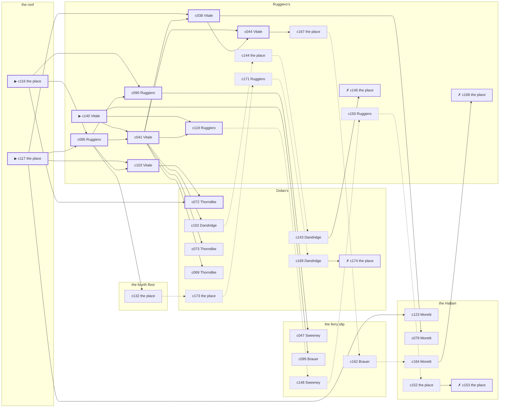

# Harlem — case 14

**Seed** 14 · **Difficulty** 2 · **Attempts** 2 · **Detective** Humphrey

**Par** 10 actions · **Slack** 6 · **Budget** 16 · **Findable** 34 (spine 11, corroboration 9, noise 10 + 4 disqualifiers) · **Noise ratio** 41% · **Candidate pool** 175

## 1. The Truth

Gretchen Vogel, a pawnbroker’s man, a customer of the victim’s, killed Roscoe Whitfield, a bootlegger with the lease on the top floor, with a gunshot at the roof at 8:30 PM. Vogel blamed the victim for a ruin (revenge). Vogel had been at the fourth floor earlier in the evening, where the weapon lived, and was alone with Whitfield when it happened. Vitale hired us.

## 2. Dramatis Personae

| Name | Role | Relationship | Class of secret | Motive | Found at | Killer |
| --- | --- | --- | --- | --- | --- | --- |
| Roscoe Whitfield | a bootlegger with the lease on the top floor | the victim | — | — | — | — |
| Alonzo Colquitt | a policy runner | a childhood friend of the victim’s from the same block | fence | — | the Hallam | — |
| Gretchen Vogel | a pawnbroker’s man | a customer of the victim’s | murder | revenge | the ferry slip | **YES** |
| Augustus Dandridge | a society columnist | a witness against the people the victim worked for | blackmail | silence-a-witness | Dolan’s | — |
| Filomena Vitale (client) | a switchboard operator | the victim’s neighbour across the airshaft | hidden-family | — | Ruggiero’s | — |
| Maureen Sweeney | a chambermaid | the victim’s former employee | fence | debt | the ferry slip | — |
| Teresa Marchetti | a widow with rooms on the avenue | named in the victim’s will | secret-drinking | inheritance | Dolan’s | — |
| Thaddeus Thorndike | the bartender | fixture (bartender) | — | — | Dolan’s | — |
| Pasquale Moretti | the elevator man | fixture (elevator-man) | — | — | the Hallam | — |
| Lucia Ruggiero | the man behind the counter | fixture (counterman) | — | — | Ruggiero’s | — |
| Friedrich Brauer | the patrolman on the beat | fixture (beat-cop) | — | — | the ferry slip | — |

## 3. Places

- **Dolan’s Bar** (semi) — watched by bartender (Thorndike); objects: a silver cigarette case, a seltzer siphon, a bottle of chloral drops — within earshot of the scene
- **the victim’s apartment on the fourth floor** (private) — unwatched; objects: a nickel-plated revolver, a bronze bookend, a length of sash cord, a framed photograph — the victim’s address; where the weapon lived
- **the ferry slip at the foot of the street** (public) — unwatched; objects: a folded stack of evening papers, a strapped suitcase
- **the vestibule of the Hallam apartments** (private) — watched by elevator-man (Moretti); objects: a brass umbrella stand, a day ledger, a camel-hair overcoat on a hook
- **Ruggiero’s barber shop** (semi) — watched by counterman (Ruggiero); objects: an ice pick — within earshot of the scene
- **the roof over the Dover** (private) — unwatched; objects: a terracotta flower pot, the roof-door key — **THE SCENE**

## 4. Anchors

The coroner gives 7:30 PM–9:00 PM, four ticks wide. These are what close it: **church-bells** and **regular-stool**.

- **the regular who takes the same seat every night** — at 8:00 PM; at Ruggiero’s. Somebody reliable notes who was there. Only those present know that the regular was drinking sherry, and said twice what he thought of the beer.
- **the bells at St. Malachy’s** — at 6:30 PM, 7:30 PM, 8:30 PM, 9:30 PM, 10:30 PM, 11:30 PM; across the whole neighbourhood. You can time things by it: the half hours are rung and the whole hours are rung twice.
- **the beat cop’s pass** — at 7:00 PM, 8:30 PM, 10:00 PM, 11:30 PM; on a round through the ferry slip → Dolan’s → Ruggiero’s. Somebody reliable notes who was there.

## 5. Timelines

### Whitfield — the victim

| Tick | Time | Truth | Claimed | Companion claimed |
| --- | --- | --- | --- | --- |
| 0 | 6:00 PM | Dolan’s | Dolan’s | — |
| 1 | 6:30 PM | Dolan’s | Dolan’s | — |
| 2 | 7:00 PM | Ruggiero’s | Ruggiero’s | — |
| 3 | 7:30 PM | the Hallam | the Hallam | — |
| 4 | 8:00 PM | Ruggiero’s | Ruggiero’s | — |
| 5 | 8:30 PM | the roof ☠ | the roof | — |
| 6 | 9:00 PM | — | — | — |
| 7 | 9:30 PM | — | — | — |
| 8 | 10:00 PM | — | — | — |
| 9 | 10:30 PM | — | — | — |
| 10 | 11:00 PM | — | — | — |
| 11 | 11:30 PM | — | — | — |

### Colquitt

| Tick | Time | Truth | Claimed | Companion claimed |
| --- | --- | --- | --- | --- |
| 0 | 6:00 PM | the Hallam | the Hallam | — |
| 1 | 6:30 PM | the fourth floor | the fourth floor | — |
| 2 | 7:00 PM | Dolan’s | Dolan’s | — |
| 3 | 7:30 PM | Dolan’s | Dolan’s | — |
| 4 | 8:00 PM | Dolan’s | Dolan’s | — |
| 5 | 8:30 PM | Ruggiero’s | **Dolan’s** | — |
| 6 | 9:00 PM | the Hallam | the Hallam | — |
| 7 | 9:30 PM | the Hallam | the Hallam | — |
| 8 | 10:00 PM | the fourth floor | the fourth floor | — |
| 9 | 10:30 PM | the ferry slip | the ferry slip | — |
| 10 | 11:00 PM | the ferry slip | the ferry slip | — |
| 11 | 11:30 PM | the ferry slip | the ferry slip | — |

### Vogel — the killer

| Tick | Time | Truth | Claimed | Companion claimed |
| --- | --- | --- | --- | --- |
| 0 | 6:00 PM | the fourth floor | the fourth floor | — |
| 1 | 6:30 PM | the fourth floor | the fourth floor | — |
| 2 | 7:00 PM | the fourth floor | the fourth floor | — |
| 3 | 7:30 PM | the fourth floor | the fourth floor | — |
| 4 | 8:00 PM | the fourth floor | the fourth floor | — |
| 5 | 8:30 PM | the roof ☠ | **Dolan’s** | — |
| 6 | 9:00 PM | the fourth floor | the fourth floor | — |
| 7 | 9:30 PM | Ruggiero’s | Ruggiero’s | — |
| 8 | 10:00 PM | the ferry slip | the ferry slip | — |
| 9 | 10:30 PM | the ferry slip | the ferry slip | — |
| 10 | 11:00 PM | Dolan’s | Dolan’s | — |
| 11 | 11:30 PM | Dolan’s | Dolan’s | — |

### Dandridge

| Tick | Time | Truth | Claimed | Companion claimed |
| --- | --- | --- | --- | --- |
| 0 | 6:00 PM | Dolan’s | Dolan’s | — |
| 1 | 6:30 PM | the fourth floor | the fourth floor | — |
| 2 | 7:00 PM | Ruggiero’s | Ruggiero’s | — |
| 3 | 7:30 PM | the Hallam | **Ruggiero’s** | — |
| 4 | 8:00 PM | the Hallam | the Hallam | — |
| 5 | 8:30 PM | Dolan’s | Dolan’s | — |
| 6 | 9:00 PM | Dolan’s | Dolan’s | — |
| 7 | 9:30 PM | Dolan’s | Dolan’s | — |
| 8 | 10:00 PM | the ferry slip | the ferry slip | — |
| 9 | 10:30 PM | the ferry slip | the ferry slip | — |
| 10 | 11:00 PM | the ferry slip | the ferry slip | — |
| 11 | 11:30 PM | the ferry slip | the ferry slip | — |

### Vitale

| Tick | Time | Truth | Claimed | Companion claimed |
| --- | --- | --- | --- | --- |
| 0 | 6:00 PM | the fourth floor | the fourth floor | — |
| 1 | 6:30 PM | the fourth floor | the fourth floor | — |
| 2 | 7:00 PM | Ruggiero’s | Ruggiero’s | — |
| 3 | 7:30 PM | the ferry slip | the ferry slip | — |
| 4 | 8:00 PM | the ferry slip | the ferry slip | — |
| 5 | 8:30 PM | Dolan’s | Dolan’s | — |
| 6 | 9:00 PM | Dolan’s | Dolan’s | — |
| 7 | 9:30 PM | Dolan’s | Dolan’s | — |
| 8 | 10:00 PM | the Hallam | the Hallam | — |
| 9 | 10:30 PM | the ferry slip | **the Hallam** | Colquitt |
| 10 | 11:00 PM | Ruggiero’s | Ruggiero’s | — |
| 11 | 11:30 PM | Ruggiero’s | Ruggiero’s | — |

### Sweeney

| Tick | Time | Truth | Claimed | Companion claimed |
| --- | --- | --- | --- | --- |
| 0 | 6:00 PM | the fourth floor | the fourth floor | — |
| 1 | 6:30 PM | the fourth floor | the fourth floor | — |
| 2 | 7:00 PM | the fourth floor | the fourth floor | — |
| 3 | 7:30 PM | the fourth floor | the fourth floor | — |
| 4 | 8:00 PM | the roof | the roof | — |
| 5 | 8:30 PM | Ruggiero’s | **Dolan’s** | Vogel |
| 6 | 9:00 PM | Ruggiero’s | Ruggiero’s | — |
| 7 | 9:30 PM | Ruggiero’s | Ruggiero’s | — |
| 8 | 10:00 PM | the ferry slip | the ferry slip | — |
| 9 | 10:30 PM | the ferry slip | the ferry slip | — |
| 10 | 11:00 PM | the ferry slip | the ferry slip | — |
| 11 | 11:30 PM | the ferry slip | the ferry slip | — |

### Marchetti

| Tick | Time | Truth | Claimed | Companion claimed |
| --- | --- | --- | --- | --- |
| 0 | 6:00 PM | Ruggiero’s | Ruggiero’s | — |
| 1 | 6:30 PM | the fourth floor | the fourth floor | — |
| 2 | 7:00 PM | the fourth floor | the fourth floor | — |
| 3 | 7:30 PM | the fourth floor | the fourth floor | — |
| 4 | 8:00 PM | Dolan’s | **the Hallam** | — |
| 5 | 8:30 PM | Dolan’s | **the Hallam** | — |
| 6 | 9:00 PM | Dolan’s | Dolan’s | — |
| 7 | 9:30 PM | Dolan’s | Dolan’s | — |
| 8 | 10:00 PM | Dolan’s | Dolan’s | — |
| 9 | 10:30 PM | Dolan’s | Dolan’s | — |
| 10 | 11:00 PM | Dolan’s | Dolan’s | — |
| 11 | 11:30 PM | Dolan’s | Dolan’s | — |

### Fixtures (never lie, never withhold)

| Tick | Time | Thorndike (the bartender) | Moretti (the elevator man) | Ruggiero (the man behind the counter) | Brauer (the patrolman on the beat) |
| --- | --- | --- | --- | --- | --- |
| 0 | 6:00 PM | Dolan’s | the Hallam | Ruggiero’s | — |
| 1 | 6:30 PM | the fourth floor | the Hallam | Ruggiero’s | — |
| 2 | 7:00 PM | Dolan’s | the Hallam | Ruggiero’s | the ferry slip |
| 3 | 7:30 PM | Dolan’s | the Hallam | Ruggiero’s | — |
| 4 | 8:00 PM | Dolan’s | the Hallam | Ruggiero’s | — |
| 5 | 8:30 PM | Dolan’s | Ruggiero’s | Ruggiero’s | Dolan’s |
| 6 | 9:00 PM | Dolan’s | the Hallam | Ruggiero’s | — |
| 7 | 9:30 PM | Dolan’s | the Hallam | Ruggiero’s | — |
| 8 | 10:00 PM | Dolan’s | the Hallam | Ruggiero’s | Ruggiero’s |
| 9 | 10:30 PM | Dolan’s | the Hallam | Ruggiero’s | — |
| 10 | 11:00 PM | Dolan’s | the Hallam | Ruggiero’s | — |
| 11 | 11:30 PM | Dolan’s | the Hallam | Ruggiero’s | the ferry slip |

## 6. Secrets in play

- **Colquitt** (fence): Colquitt hands a parcel of stolen goods to a man at Ruggiero’s from 8:30 PM.
- **Vogel** (murder): Vogel is at the roof from 8:30 PM, alone with Whitfield when it happens at 8:30 PM.
- **Dandridge** (blackmail): Dandridge meets the victim alone at the Hallam from 7:30 PM and asks for money.
- **Vitale** (hidden-family): Vitale goes to the ferry slip from 10:30 PM to see a child nobody is supposed to know about.
- **Sweeney** (fence): Sweeney hands a parcel of stolen goods to a man at Ruggiero’s from 8:30 PM.
- **Marchetti** (secret-drinking): Marchetti drinks alone at Dolan’s from 8:00 PM to 8:30 PM and will claim to have been anywhere else.

## 7. Clue list — the 34 findable

The opening three, free at the start: c116, c117, c140. Everything else has to be led to. The full candidate pool is in the companion file.

### At Dolan’s

- **c072** [spine] (observation; Thorndike on Vitale) → (end)
  - Thorndike says Vitale was at Dolan’s from 8:30 PM to 9:30 PM.
  - _establishes: Vitale at Dolan’s, 8:30 PM–9:30 PM_
- **c102** [corroboration] (observation; Dandridge on Vogel’s account) → c144
  - Dandridge was at Dolan’s at 8:30 PM and says Vogel was not.
  - _establishes: Vogel not at Dolan’s, 8:30 PM_
- **c073** [corroboration] (observation; Thorndike on Sweeney) → (end)
  - Thorndike says Sweeney was at the fourth floor at 6:30 PM.
  - _establishes: Sweeney at the fourth floor, 6:30 PM; Sweeney could reach the weapon_
- **c069** [corroboration] (observation; Thorndike on Dandridge) → (end)
  - Thorndike says Dandridge was at Dolan’s from 8:30 PM to 9:30 PM.
  - _establishes: Dandridge at Dolan’s, 8:30 PM–9:30 PM_
- **c173** [noise {b2}] (physical; the place itself) → c171
  - A tab at Dolan’s in a name that is not Marchetti’s, in Marchetti’s handwriting.
  - _establishes: context only_
- **c169** [noise {b2}] (overheard; Dandridge on Marchetti) → c174
  - Dandridge on Marchetti: Marchetti had taken a drink and had gone to some trouble about the smell of it.
  - _establishes: context only_
- **c174** [disqualifier {b2}] (overheard; the place itself) → (end)
  - The man behind the counter at Dolan’s knows exactly: Marchetti was on the same stool from 8:00 PM to 8:30 PM and was in no condition to walk anywhere, let alone do this.
  - _establishes: Marchetti’s secret-drinking accounted for; Marchetti at Dolan’s, 8:00 PM–8:30 PM_
- **c143** [noise {b4}] (overheard; Dandridge on Colquitt) → c146
  - Dandridge on Colquitt: Colquitt has been selling things that were never Colquitt’s to sell.
  - _establishes: context only_

### At the fourth floor

- **c132** [corroboration] (document; the place itself) → c173
  - Found at the fourth floor: A clipping about the failure of Vogel’s business, with Whitfield’s name underlined twice in pencil.
  - _establishes: Vogel had a motive (revenge)_

### At the ferry slip

- **c047** [corroboration] (observation; Sweeney on Vogel) → (end)
  - Sweeney says Vogel was at the fourth floor from 6:00 PM to 7:30 PM.
  - _establishes: Vogel at the fourth floor, 6:00 PM–7:30 PM; Vogel could reach the weapon_
- **c095** [corroboration] (observation; Brauer on Vitale) → (end)
  - Brauer says Vitale was at Dolan’s at 8:30 PM.
  - _establishes: Vitale at Dolan’s, 8:30 PM_
- **c148** [noise {b1}] (overheard; Sweeney on Dandridge) → c150
  - Sweeney on Dandridge: Dandridge and the victim were heard at the Hallam, and one of them was doing all the talking.
  - _establishes: context only_
- **c162** [noise {b3}] (overheard; Brauer on Sweeney) → c164
  - Brauer on Sweeney: Sweeney was carrying a parcel into Ruggiero’s and came out without it.
  - _establishes: context only_

### At the Hallam

- **c123** [corroboration] (anchor; Moretti on the noise that evening) → (end)
  - Moretti was at Ruggiero’s at 8:30 PM and heard a shot from the direction of the roof, while the bells were going.
  - _establishes: noise at the roof at 8:30 PM; the victim dead by 8:30 PM; how it was done_
- **c079** [corroboration] (observation; Moretti on Colquitt) → (end)
  - Moretti says Colquitt was at Ruggiero’s at 8:30 PM.
  - _establishes: Colquitt at Ruggiero’s, 8:30 PM_
- **c152** [noise {b1}] (physical; the place itself) → c153
  - A photograph at the Hallam, folded small, of something the victim would have paid to keep folded.
  - _establishes: context only_
- **c153** [disqualifier {b1}] (overheard; the place itself) → (end)
  - The victim’s bank book settles it: four payments, and Dandridge at the Hallam from 7:30 PM collecting the fifth. It is extortion, and an extortionist wants the man alive.
  - _establishes: Dandridge’s blackmail accounted for; Dandridge at the Hallam, 7:30 PM_
- **c164** [noise {b3}] (overheard; Moretti on Sweeney) → c168
  - Moretti on Sweeney: Sweeney has been selling things that were never Sweeney’s to sell.
  - _establishes: context only_

### At Ruggiero’s

- **c140** [spine ⟨opening⟩] (client; Vitale on why I was hired) → c041, c119, c095
  - Vitale hired us, and wants it known that Vogel blamed the victim for a ruin, and would rather we started there.
  - _establishes: Vogel had a motive (revenge)_
- **c085** [spine] (observation; Ruggiero on Colquitt) → c090, c041, c103, c132
  - Ruggiero says Colquitt was at Ruggiero’s at 8:30 PM.
  - _establishes: Colquitt at Ruggiero’s, 8:30 PM_
- **c090** [spine] (observation; Ruggiero on Sweeney) → c047
  - Ruggiero says Sweeney was at Ruggiero’s from 8:30 PM to 9:30 PM.
  - _establishes: Sweeney at Ruggiero’s, 8:30 PM–9:30 PM_
- **c041** [spine] (observation; Vitale on Dandridge) → c038, c119, c044, c102, c073, c069
  - Vitale says Dandridge was at Dolan’s from 8:30 PM to 9:30 PM.
  - _establishes: Dandridge at Dolan’s, 8:30 PM–9:30 PM_
- **c038** [spine] (observation; Vitale on Vogel) → c044, c079
  - Vitale says Vogel was at the fourth floor from 6:00 PM to 6:30 PM.
  - _establishes: Vogel at the fourth floor, 6:00 PM–6:30 PM; Vogel could reach the weapon_
- **c103** [spine] (observation; Vitale on Vogel’s account) → c072
  - Vitale was at Dolan’s at 8:30 PM and says Vogel was not.
  - _establishes: Vogel not at Dolan’s, 8:30 PM_
- **c119** [spine] (anchor; Ruggiero on Whitfield that evening) → c148
  - Ruggiero puts Whitfield at Ruggiero’s when the regular came in for his seat, which was 8:00 PM, and alive enough to argue about the weather.
  - _establishes: the victim alive at 8:00 PM; Whitfield at Ruggiero’s, 8:00 PM_
- **c044** [spine] (observation; Vitale on Marchetti) → c167
  - Vitale says Marchetti was at Dolan’s from 8:30 PM to 9:30 PM.
  - _establishes: Marchetti at Dolan’s, 8:30 PM–9:30 PM_
- **c167** [corroboration] (overheard; the place itself) → c162
  - The receiver at Ruggiero’s would rather talk than be held: Sweeney was there from 8:30 PM handing over a parcel of somebody else’s silver, which is a charge Sweeney will take over this one.
  - _establishes: Sweeney’s fence accounted for; Sweeney at Ruggiero’s, 8:30 PM_
- **c150** [noise {b1}] (overheard; Ruggiero on Dandridge) → c152
  - Ruggiero on Dandridge: The victim had been drawing cash in amounts that did not match anything in the accounts.
  - _establishes: context only_
- **c171** [noise {b2}] (overheard; Ruggiero on Marchetti) → c169
  - Ruggiero on Marchetti: Somebody at Dolan’s says Marchetti is in more often than Marchetti lets on.
  - _establishes: context only_
- **c168** [disqualifier {b3}] (overheard; the place itself) → (end)
  - The goods turn up, tagged and dated, and the tag puts Sweeney at Ruggiero’s from 8:30 PM with both hands full.
  - _establishes: Sweeney’s fence accounted for; Sweeney at Ruggiero’s, 8:30 PM_
- **c144** [noise {b4}] (physical; the place itself) → c143
  - Wrapping paper and a cut string at Ruggiero’s, and the shop it came from closed two years ago.
  - _establishes: context only_
- **c146** [disqualifier {b4}] (overheard; the place itself) → (end)
  - The receiver at Ruggiero’s would rather talk than be held: Colquitt was there from 8:30 PM handing over a parcel of somebody else’s silver, which is a charge Colquitt will take over this one.
  - _establishes: Colquitt’s fence accounted for; Colquitt at Ruggiero’s, 8:30 PM_

### At the roof

- **c116** [spine ⟨opening⟩] (scene; the place itself) → c085, c090, c072
  - Whitfield was found at the roof. The cigarette he had going burned itself out on the sill where it fell. The bells rang the half hour at 8:30 PM. The sexton rings them off the sacristy clock and it keeps good time.
  - _establishes: the victim dead by 8:30 PM; how it was done_
- **c117** [spine ⟨opening⟩] (morgue; the place itself) → c085, c038, c103, c123
  - The coroner puts death between 7:30 PM and 9:00 PM — two hours of nothing useful. One bullet below the sternum. Powder burns on the shirt front: fired close.
  - _establishes: death between 7:30 PM and 9:00 PM; how it was done_

## 8. Clue graph

## 9. Deduction path

Par is **10 actions** and the budget is par plus 6: **16**. Every id below is a spine clue; the inference is the sheet’s, not the clue’s.

**Time of death.** The coroner gives four ticks. The anchors close it to 8:30 PM: one puts Whitfield alive at 8:00 PM, the other times the scene at 8:30 PM. _(c117, c119, c116; + 1 corroborating)_

**Clearing the innocent.**

- Colquitt was not at the roof at 8:30 PM. _(c085; + 2 corroborating)_
- Dandridge was not at the roof at 8:30 PM. _(c041; + 1 corroborating)_
- Vitale was not at the roof at 8:30 PM. _(c072; + 1 corroborating)_
- Sweeney was not at the roof at 8:30 PM. _(c090; + 2 corroborating)_
- Marchetti was not at the roof at 8:30 PM. _(c044; + 1 corroborating)_

**Naming the killer.** Vogel claims Dolan’s at 8:30 PM. Two independent sources put that out of the question. _(c103; + 1 corroborating)_

**The weapon.** Vogel was at the fourth floor before 8:30 PM, where a nickel-plated revolver was kept. _(c038; + 1 corroborating)_

**Method.** A gunshot, on two physical sources. _(c116, c117; + 1 corroborating)_

**Motive.** revenge, on two independent sources. _(c140; + 1 corroborating)_

## 10. Red herrings

**Innocents who lie about the murder tick:**

- Colquitt claims Dolan’s at 8:30 PM and was really at Ruggiero’s. Reason: Colquitt hands a parcel of stolen goods to a man at Ruggiero’s from 8:30 PM.
- Sweeney claims Dolan’s at 8:30 PM and was really at Ruggiero’s. Reason: Sweeney hands a parcel of stolen goods to a man at Ruggiero’s from 8:30 PM.
- Marchetti claims the Hallam at 8:30 PM and was really at Dolan’s. Reason: Marchetti drinks alone at Dolan’s from 8:00 PM to 8:30 PM and will claim to have been anywhere else.

**Innocents with a motive:**

- Dandridge — silence-a-witness: needed the victim silent.
- Sweeney — debt: owed the victim money.
- Marchetti — inheritance: stands to inherit.

**Noise branches, and what knocks each one down:**

- **b1** (Dandridge, blackmail): c148 → c150 → c152 → **c153** — The victim’s bank book settles it: four payments, and Dandridge at the Hallam from 7:30 PM collecting the fifth. It is extortion, and an extortionist wants the man alive.
- **b2** (Marchetti, secret-drinking): c173 → c171 → c169 → **c174** — The man behind the counter at Dolan’s knows exactly: Marchetti was on the same stool from 8:00 PM to 8:30 PM and was in no condition to walk anywhere, let alone do this.
- **b3** (Sweeney, fence): c162 → c164 → **c168** — The goods turn up, tagged and dated, and the tag puts Sweeney at Ruggiero’s from 8:30 PM with both hands full.
- **b4** (Colquitt, fence): c144 → c143 → **c146** — The receiver at Ruggiero’s would rather talk than be held: Colquitt was there from 8:30 PM handing over a parcel of somebody else’s silver, which is a charge Colquitt will take over this one.

