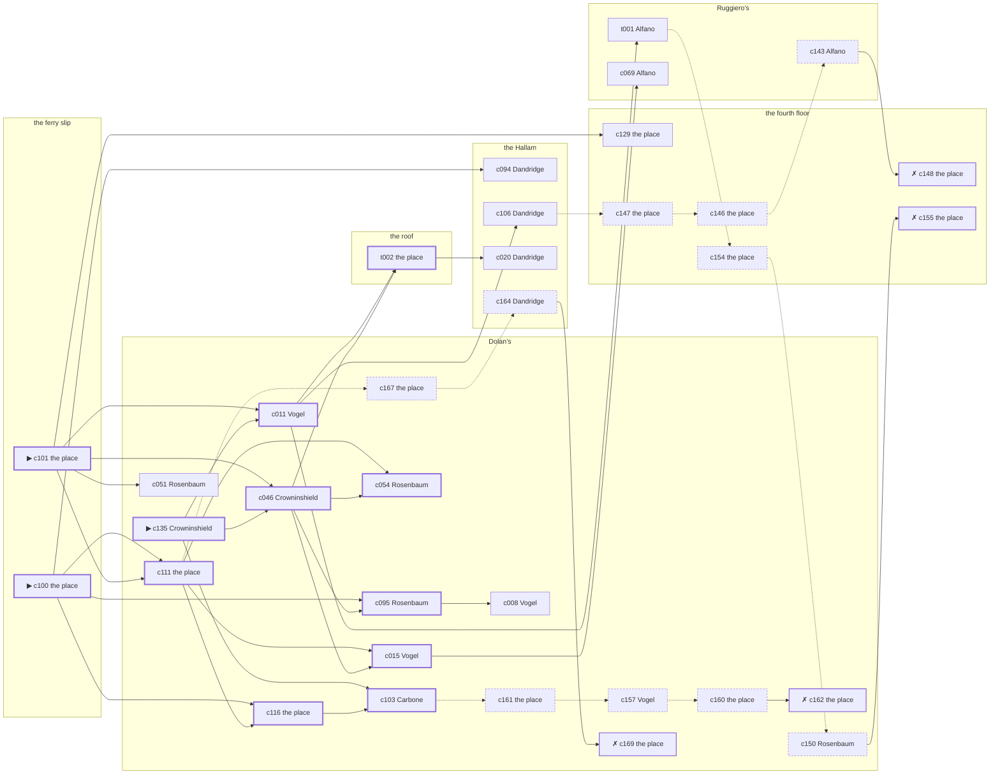

# Harlem — case 14

**Seed** 14 · **Difficulty** 2 · **Attempts** 1 · **Detective** Dashiell

**Type** robbery · **Trope** payroll · **Unknowns** who, goods, how

**Par** 11 actions · **Slack** 6 · **Budget** 17 · **Findable** 34 (spine 12, corroboration 8, noise 10 + 4 disqualifiers) · **Noise ratio** 41% · **Candidate pool** 172

## 1. The Truth

Eunice Hargrove, a bookkeeper, in Tramonti’s debt, took a payroll envelope from the ferry slip, which belonged to Teresa Tramonti, a theatrical agent, at 8:30 PM, by a cord made fast to the fire escape. Hargrove blamed Tramonti for the ruin of Hargrove’s business (revenge). Hargrove had been at Ruggiero’s earlier in the evening, where the means lived, and was alone at the ferry slip when it happened. Crowninshield hired us.

## 2. The Act

**robbery** · **payroll** · actor **Hargrove** · at **the ferry slip** · at **8:30 PM**

- taken: a payroll envelope
- entry: window
- goods went to the roof

**Givens** — what the briefing states and the report does not ask:

- A payroll envelope went from the Hallam to the ferry slip the way it goes every Friday, and Tramonti carried it.
- Tramonti had it at the Hallam at 8:00 PM, buttoned into an inside pocket.
- It was gone from the ferry slip by 8:30 PM.
- Nobody was hurt and nothing was broken.

**Unknowns** — exactly what the report asks: **who**, **goods**, **how**.

## 3. Dramatis Personae

| Name | Role | Relationship | Class of secret | Motive | Found at | Killer |
| --- | --- | --- | --- | --- | --- | --- |
| Teresa Tramonti | a theatrical agent | the victim | — | — | — | — |
| Lyman Lathrop | a policy runner | a childhood friend of Tramonti’s from the same block | gambling-debt | — | Dolan’s | — |
| Gretchen Vogel | a switchboard operator | Tramonti’s tenant | blackmail | — | Dolan’s | — |
| Augustus Dandridge | an insurance adjuster | a witness against the people Tramonti worked for | embezzling | exposure | the Hallam | — |
| Eunice Hargrove | a bookkeeper | in Tramonti’s debt | murder | revenge | Ruggiero’s | **YES** |
| Carmela Carbone | a chambermaid | Tramonti’s former employee | fence | debt | Dolan’s | — |
| Harriet Crowninshield (client) | a widow with rooms on the avenue | named in Tramonti’s will | secret-drinking | inheritance | Dolan’s | — |
| Hannah Rosenbaum | the bartender | fixture (bartender) | — | — | Dolan’s | — |
| Wilhelm Hochstetter | the elevator man | fixture (elevator-man) | — | — | the Hallam | — |
| Carmine Alfano | the man behind the counter | fixture (counterman) | — | — | Ruggiero’s | — |
| Daniel Brennan | the patrolman on the beat | fixture (beat-cop) | — | — | Dolan’s | — |

## 4. Dossiers

Every person, by layer: **0** on sight, **1** volunteered, **2** from other people, **3** in the documents.

### Tramonti — the victim

48, a woman, a theatrical agent. Wants: to-be-somebody.

- **Standing** — Tramonti had half the neighbourhood waiting on a telephone call that never came.
- **Profession** — Tramonti had the say over who worked in the spring and who did not.
- **Found** — Lathrop found the door at the ferry slip shut and a payroll envelope gone, at 11:30 PM. By Lathrop, at the ferry slip, at 11:30 PM. Precinct: took-a-statement.

**Layer 0, on sight**

- _gender_ — A woman.
- _age_ — In her forties.

**Layer 1, volunteered**

- _profession_ — A theatrical agent.
- _detail_ — Tramonti had the say over who worked in the spring and who did not.

**Layer 2, from other people**

- _tie_ — Tramonti had half the neighbourhood waiting on a telephone call that never came.
- _want_ — Tramonti wants a name people know.

**Self-account** (layer 1, what they say when asked about themselves)

- Tramonti is 48 years old and a theatrical agent.
- Tramonti had the say over who worked in the spring and who did not.
- Tramonti is the one this is about.

### Lathrop

27, a man, a policy runner. Wants: money. Tie: a childhood friend of Tramonti’s from the same block, since they were boys on the same stoop.

**Layer 0, on sight**

- _gender_ — A man.
- _age_ — In the late twenties.

**Layer 1, volunteered**

- _profession_ — A policy runner.
- _detail_ — Lathrop runs policy for a bank uptown and is trusted with the bag.

**Layer 2, from other people**

- _tie_ — Lathrop and Tramonti were boys together and neither of them ever left the neighbourhood.
- _want_ — Lathrop wants money, and is not particular about the shape it arrives in.
- _since_ — Lathrop has been a childhood friend of Tramonti’s from the same block, since they were boys on the same stoop.

**Layer 3, in the documents**

- _secret-hint_ — Lathrop was asking around for a hundred dollars in a hurry earlier in the week.

**Self-account** (layer 1, what they say when asked about themselves)

- Lathrop is 27 years old and a policy runner.
- Lathrop runs policy for a bank uptown and is trusted with the bag.
- Lathrop is a childhood friend of Tramonti’s from the same block.

### Vogel

22, a woman, a switchboard operator. Wants: to-be-somebody. Tie: Tramonti’s tenant, since ’22.

**Layer 0, on sight**

- _gender_ — A woman.
- _age_ — Not much past twenty.
- _profession_ — A switchboard operator.

**Layer 1, volunteered**

- _detail_ — Vogel sits the board from four until midnight and hears both ends of everything.

**Layer 2, from other people**

- _tie_ — Vogel took the rooms over Dolan’s from Tramonti and has been two weeks behind since the spring.
- _want_ — Vogel wants a name people know.
- _since_ — Vogel has been Tramonti’s tenant, since ’22.

**Layer 3, in the documents**

- _secret-hint_ — Vogel and Tramonti were heard at the fourth floor, and one of them was doing all the talking.

**Self-account** (layer 1, what they say when asked about themselves)

- Vogel is 22 years old and a switchboard operator.
- Vogel sits the board from four until midnight and hears both ends of everything.
- Vogel is Tramonti’s tenant.

### Dandridge

36, a man, an insurance adjuster. Wants: to-keep-what-they-have. Tie: a witness against the people Tramonti worked for, since ’22.

**Layer 0, on sight**

- _gender_ — A man.
- _age_ — In his thirties.

**Layer 1, volunteered**

- _profession_ — An insurance adjuster.
- _detail_ — Dandridge settles claims for a casualty office and is paid to doubt people.

**Layer 2, from other people**

- _tie_ — Dandridge gave a statement about the people Tramonti worked for and has been careful ever since.
- _want_ — Dandridge wants to keep what they have and add nothing to it.
- _since_ — Dandridge has been a witness against the people Tramonti worked for, since ’22.

**Layer 3, in the documents**

- _secret-hint_ — Dandridge had a key to the fourth floor that Dandridge had no business having.

**Self-account** (layer 1, what they say when asked about themselves)

- Dandridge is 36 years old and an insurance adjuster.
- Dandridge settles claims for a casualty office and is paid to doubt people.
- Dandridge is a witness against the people Tramonti worked for.

### Hargrove — the killer

40, a woman, a bookkeeper. Wants: money. Tie: in Tramonti’s debt, two winters running.

**Layer 0, on sight**

- _gender_ — A woman.
- _age_ — In her forties.

**Layer 1, volunteered**

- _profession_ — A bookkeeper.
- _detail_ — Hargrove does the payroll on Thursdays and the ledgers the rest of the week.

**Layer 2, from other people**

- _tie_ — Hargrove has owed Tramonti money since ’21 and has not been asked for it lately.
- _want_ — Hargrove wants money, and is not particular about the shape it arrives in.
- _since_ — Hargrove has been in Tramonti’s debt, two winters running.

**Self-account** (layer 1, what they say when asked about themselves)

- Hargrove is 40 years old and a bookkeeper.
- Hargrove does the payroll on Thursdays and the ledgers the rest of the week.
- Hargrove is in Tramonti’s debt.

### Carbone

25, a woman, a chambermaid. Wants: money. Tie: Tramonti’s former employee, until last winter.

**Layer 0, on sight**

- _gender_ — A woman.
- _age_ — In the late twenties.
- _profession_ — A chambermaid.

**Layer 1, volunteered**

- _detail_ — Carbone does eleven rooms a day and the linen after.

**Layer 2, from other people**

- _tie_ — Carbone worked for Tramonti for four years and was let go in ’26 without a reference.
- _want_ — Carbone wants money, and is not particular about the shape it arrives in.
- _since_ — Carbone has been Tramonti’s former employee, until last winter.

**Layer 3, in the documents**

- _secret-hint_ — Carbone was carrying a parcel into Dolan’s and came out without it.

**Self-account** (layer 1, what they say when asked about themselves)

- Carbone is 25 years old and a chambermaid.
- Carbone does eleven rooms a day and the linen after.
- Carbone is Tramonti’s former employee.

### Crowninshield — the client

63, a woman, a widow with rooms on the avenue. Wants: to-be-left-alone. Tie: named in Tramonti’s will, since ’27.

**Layer 0, on sight**

- _gender_ — A woman.
- _age_ — In her sixties.

**Layer 1, volunteered**

- _profession_ — A widow with rooms on the avenue.
- _detail_ — Crowninshield has not worked since her marriage and does not mean to start.

**Layer 2, from other people**

- _tie_ — Tramonti told Crowninshield there was something in the will and never said how much.
- _want_ — Crowninshield wants to be left alone.
- _since_ — Crowninshield has been named in Tramonti’s will, since ’27.

**Layer 3, in the documents**

- _secret-hint_ — Crowninshield had taken a drink and had gone to some trouble about the smell of it.

**Self-account** (layer 1, what they say when asked about themselves)

- Crowninshield is 63 years old and a widow with rooms on the avenue.
- Crowninshield has not worked since her marriage and does not mean to start.
- Crowninshield is named in Tramonti’s will.

### Rosenbaum

32, a woman, the bartender. Wants: to-be-left-alone. Tie: behind the bar at Dolan’s, every night of the week.

**Layer 0, on sight**

- _gender_ — A woman.
- _age_ — In her thirties.
- _profession_ — The bartender.

**Layer 1, volunteered**

- _detail_ — Rosenbaum pours at Dolan’s six nights a week and takes Mondays.

**Layer 2, from other people**

- _tie_ — Rosenbaum is behind the bar at Dolan’s, every night of the week.
- _want_ — Rosenbaum wants to be left alone.

**Self-account** (layer 1, what they say when asked about themselves)

- Rosenbaum is 32 years old and the bartender.
- Rosenbaum pours at Dolan’s six nights a week and takes Mondays.
- Rosenbaum is behind the bar at Dolan’s, every night of the week.

### Hochstetter

55, a man, the elevator man. Wants: money. Tie: in the car at the Hallam.

**Layer 0, on sight**

- _gender_ — A man.
- _age_ — In his fifties.
- _profession_ — The elevator man.

**Layer 1, volunteered**

- _detail_ — Hochstetter has the car at the Hallam from three until eleven.

**Layer 2, from other people**

- _tie_ — Hochstetter is in the car at the Hallam.
- _want_ — Hochstetter wants money, and is not particular about the shape it arrives in.

**Self-account** (layer 1, what they say when asked about themselves)

- Hochstetter is 55 years old and the elevator man.
- Hochstetter has the car at the Hallam from three until eleven.
- Hochstetter is in the car at the Hallam.

### Alfano

40, a man, the man behind the counter. Wants: to-get-out. Tie: behind the counter at Ruggiero’s.

**Layer 0, on sight**

- _gender_ — A man.
- _age_ — In his forties.
- _profession_ — The man behind the counter.

**Layer 1, volunteered**

- _detail_ — Alfano has the counter at Ruggiero’s from four until midnight.

**Layer 2, from other people**

- _tie_ — Alfano is behind the counter at Ruggiero’s.
- _want_ — Alfano wants out of the neighbourhood and has wanted it for years.

**Self-account** (layer 1, what they say when asked about themselves)

- Alfano is 40 years old and the man behind the counter.
- Alfano has the counter at Ruggiero’s from four until midnight.
- Alfano is behind the counter at Ruggiero’s.

### Brennan

36, a man, the patrolman on the beat. Wants: to-be-feared. Tie: the patrolman whose post takes in Dolan’s.

**Layer 0, on sight**

- _gender_ — A man.
- _age_ — In his thirties.
- _profession_ — The patrolman on the beat.

**Layer 1, volunteered**

- _detail_ — Brennan came on at six and will go off at two, the same as every night.

**Layer 2, from other people**

- _tie_ — Brennan is the patrolman whose post takes in Dolan’s.
- _want_ — Brennan wants to be the one people are careful around.

**Self-account** (layer 1, what they say when asked about themselves)

- Brennan is 36 years old and the patrolman on the beat.
- Brennan came on at six and will go off at two, the same as every night.
- Brennan is the patrolman whose post takes in Dolan’s.

## 5. The Client

**Crowninshield**, named in Tramonti’s will. Purpose: **get-it-back**.

- **Why** — Crowninshield wants it back, and does not much care who took it.
- **What it costs** — Crowninshield cannot report the loss without saying where the thing came from.
- **Points at** — Hargrove: Hargrove blamed Tramonti for the ruin of Hargrove’s business. Honest: **yes**.

**Tells:**

- A payroll envelope went from the Hallam to the ferry slip the way it goes every Friday, and Tramonti carried it.
- Tramonti had it at the Hallam at 8:00 PM, buttoned into an inside pocket.
- It was gone from the ferry slip by 8:30 PM.
- Nobody was hurt and nothing was broken.
- Crowninshield would rather we started with Hargrove: Hargrove blamed Tramonti for the ruin of Hargrove’s business.

**Withholds:**

- Crowninshield does not mention it, but Crowninshield drinks alone at Dolan’s from 8:00 PM to 8:30 PM and will claim to have been anywhere else.

**Their own evening, as they tell it:**

- Crowninshield says she was at Ruggiero’s from 6:00 PM to 7:00 PM.
- Crowninshield says she was at the Hallam at 7:30 PM.
- Crowninshield says she was at the fourth floor from 8:00 PM to 8:30 PM.
- Crowninshield says she was at Dolan’s from 9:00 PM to 10:30 PM.

## 6. The Briefing

16 plain sentences, derived. This is the model of the plain register: the engine renders it, and Phase 2 measures pages against it.

1. A woman came up the stairs after midnight, and sat down.
2. Harriet Crowninshield is 63 years old and a widow with rooms on the avenue.
3. Crowninshield has not worked since her marriage and does not mean to start.
4. Tramonti had half the neighbourhood waiting on a telephone call that never came.
5. A payroll envelope went from the Hallam to the ferry slip the way it goes every Friday, and Tramonti carried it.
6. Tramonti had it at the Hallam at 8:00 PM, buttoned into an inside pocket.
7. It was gone from the ferry slip by 8:30 PM.
8. Nobody was hurt and nothing was broken.
9. Lathrop found the door at the ferry slip shut and a payroll envelope gone, at 11:30 PM.
10. The precinct took a statement at the desk and filed it.
11. Crowninshield is named in Tramonti’s will.
12. Tramonti told Crowninshield there was something in the will and never said how much.
13. Crowninshield wants it back, and does not much care who took it.
14. Crowninshield cannot report the loss without saying where the thing came from.
15. Crowninshield wants us to start with Hargrove.
16. Hargrove blamed Tramonti for the ruin of Hargrove’s business.

## 7. Mentions

- Nobody outside the case is named.

## 8. Places

- **Dolan’s Bar** (semi) — watched by bartender (Rosenbaum); objects: a silver cigarette case, a bottle of chloral drops, a seltzer siphon — within earshot of the scene
- **Tramonti’s apartment on the fourth floor** (private) — unwatched; objects: a framed photograph, a japanned cash box — the victim’s address
- **the ferry slip at the foot of the street** (public) — unwatched; objects: a payroll envelope, a folded stack of evening papers, a pasted-up timetable, a strapped suitcase — **THE SCENE**
- **the vestibule of the Hallam apartments** (private) — watched by elevator-man (Hochstetter); objects: a nickel-plated revolver, a day ledger
- **Ruggiero’s barber shop** (semi) — watched by counterman (Alfano); objects: a length of sash cord, an ice pick — where the weapon lived; within earshot of the scene
- **the roof over the Dover** (private) — unwatched; objects: a terracotta flower pot, the roof-door key

## 9. Anchors

The coroner gives 8:30 PM–10:00 PM, four ticks wide. These are what close it: **fuse** and **ice-delivery**.

- **the fuse going in the building** — at 8:00 PM; at the Hallam. You can time things by it: a crack in the cellar and every light on the riser out at once. Only those present know that it was the second floor that went dark and not the whole house. Those present carry it: candle smoke on the ceilings of everyone who sat it out.
- **the ice being brought in** — at 8:30 PM; at Dolan’s. Somebody reliable notes who was there. Only those present know that the iceman dropped a block on the step and it went in three. Those present carry it: a wet patch down one side of a coat.
- **the beat cop’s pass** — at 6:30 PM, 8:00 PM, 9:30 PM, 11:00 PM; on a round through Dolan’s → Ruggiero’s. Somebody reliable notes who was there.

## 10. Timelines

### Tramonti — the victim

| Tick | Time | Truth | Claimed | Companion claimed |
| --- | --- | --- | --- | --- |
| 0 | 6:00 PM | Dolan’s | Dolan’s | — |
| 1 | 6:30 PM | the Hallam | the Hallam | — |
| 2 | 7:00 PM | the fourth floor | the fourth floor | — |
| 3 | 7:30 PM | Ruggiero’s | Ruggiero’s | — |
| 4 | 8:00 PM | the Hallam | the Hallam | — |
| 5 | 8:30 PM | the Hallam | the Hallam | — |
| 6 | 9:00 PM | the Hallam | the Hallam | — |
| 7 | 9:30 PM | the Hallam | the Hallam | — |
| 8 | 10:00 PM | the Hallam | the Hallam | — |
| 9 | 10:30 PM | the Hallam | the Hallam | — |
| 10 | 11:00 PM | the roof | the roof | — |
| 11 | 11:30 PM | the roof | the roof | — |

### Lathrop

| Tick | Time | Truth | Claimed | Companion claimed |
| --- | --- | --- | --- | --- |
| 0 | 6:00 PM | the ferry slip | the ferry slip | — |
| 1 | 6:30 PM | the ferry slip | the ferry slip | — |
| 2 | 7:00 PM | the ferry slip | the ferry slip | — |
| 3 | 7:30 PM | the ferry slip | the ferry slip | — |
| 4 | 8:00 PM | Ruggiero’s | Ruggiero’s | — |
| 5 | 8:30 PM | Dolan’s | **the Hallam** | Carbone |
| 6 | 9:00 PM | Ruggiero’s | Ruggiero’s | — |
| 7 | 9:30 PM | Dolan’s | Dolan’s | — |
| 8 | 10:00 PM | Dolan’s | Dolan’s | — |
| 9 | 10:30 PM | Dolan’s | Dolan’s | — |
| 10 | 11:00 PM | Dolan’s | Dolan’s | — |
| 11 | 11:30 PM | the ferry slip | the ferry slip | — |

### Vogel

| Tick | Time | Truth | Claimed | Companion claimed |
| --- | --- | --- | --- | --- |
| 0 | 6:00 PM | Ruggiero’s | Ruggiero’s | — |
| 1 | 6:30 PM | Ruggiero’s | Ruggiero’s | — |
| 2 | 7:00 PM | the fourth floor | **the Hallam** | — |
| 3 | 7:30 PM | the fourth floor | the fourth floor | — |
| 4 | 8:00 PM | the fourth floor | the fourth floor | — |
| 5 | 8:30 PM | Dolan’s | Dolan’s | — |
| 6 | 9:00 PM | Dolan’s | Dolan’s | — |
| 7 | 9:30 PM | Dolan’s | Dolan’s | — |
| 8 | 10:00 PM | Dolan’s | Dolan’s | — |
| 9 | 10:30 PM | Dolan’s | Dolan’s | — |
| 10 | 11:00 PM | Ruggiero’s | Ruggiero’s | — |
| 11 | 11:30 PM | Ruggiero’s | Ruggiero’s | — |

### Dandridge

| Tick | Time | Truth | Claimed | Companion claimed |
| --- | --- | --- | --- | --- |
| 0 | 6:00 PM | the ferry slip | the ferry slip | — |
| 1 | 6:30 PM | the ferry slip | the ferry slip | — |
| 2 | 7:00 PM | the ferry slip | the ferry slip | — |
| 3 | 7:30 PM | the ferry slip | the ferry slip | — |
| 4 | 8:00 PM | the ferry slip | the ferry slip | — |
| 5 | 8:30 PM | Dolan’s | Dolan’s | — |
| 6 | 9:00 PM | Ruggiero’s | Ruggiero’s | — |
| 7 | 9:30 PM | the Hallam | the Hallam | — |
| 8 | 10:00 PM | the fourth floor | **Ruggiero’s** | Crowninshield |
| 9 | 10:30 PM | the fourth floor | **Ruggiero’s** | Crowninshield |
| 10 | 11:00 PM | the fourth floor | the fourth floor | — |
| 11 | 11:30 PM | the Hallam | the Hallam | — |

### Hargrove — the killer

| Tick | Time | Truth | Claimed | Companion claimed |
| --- | --- | --- | --- | --- |
| 0 | 6:00 PM | Ruggiero’s | Ruggiero’s | — |
| 1 | 6:30 PM | the roof | the roof | — |
| 2 | 7:00 PM | Dolan’s | Dolan’s | — |
| 3 | 7:30 PM | Ruggiero’s | Ruggiero’s | — |
| 4 | 8:00 PM | the ferry slip | the ferry slip | — |
| 5 | 8:30 PM | the ferry slip ☠ | **Dolan’s** | — |
| 6 | 9:00 PM | the Hallam | the Hallam | — |
| 7 | 9:30 PM | the Hallam | the Hallam | — |
| 8 | 10:00 PM | the Hallam | the Hallam | — |
| 9 | 10:30 PM | Ruggiero’s | Ruggiero’s | — |
| 10 | 11:00 PM | Ruggiero’s | Ruggiero’s | — |
| 11 | 11:30 PM | the roof | the roof | — |

### Carbone

| Tick | Time | Truth | Claimed | Companion claimed |
| --- | --- | --- | --- | --- |
| 0 | 6:00 PM | Dolan’s | Dolan’s | — |
| 1 | 6:30 PM | Dolan’s | Dolan’s | — |
| 2 | 7:00 PM | the fourth floor | the fourth floor | — |
| 3 | 7:30 PM | the fourth floor | the fourth floor | — |
| 4 | 8:00 PM | the Hallam | the Hallam | — |
| 5 | 8:30 PM | Dolan’s | **Ruggiero’s** | — |
| 6 | 9:00 PM | Dolan’s | **Ruggiero’s** | — |
| 7 | 9:30 PM | the roof | the roof | — |
| 8 | 10:00 PM | Ruggiero’s | Ruggiero’s | — |
| 9 | 10:30 PM | Ruggiero’s | Ruggiero’s | — |
| 10 | 11:00 PM | Ruggiero’s | Ruggiero’s | — |
| 11 | 11:30 PM | Ruggiero’s | Ruggiero’s | — |

### Crowninshield

| Tick | Time | Truth | Claimed | Companion claimed |
| --- | --- | --- | --- | --- |
| 0 | 6:00 PM | Ruggiero’s | Ruggiero’s | — |
| 1 | 6:30 PM | Ruggiero’s | Ruggiero’s | — |
| 2 | 7:00 PM | Ruggiero’s | Ruggiero’s | — |
| 3 | 7:30 PM | the Hallam | the Hallam | — |
| 4 | 8:00 PM | Dolan’s | **the fourth floor** | — |
| 5 | 8:30 PM | Dolan’s | **the fourth floor** | — |
| 6 | 9:00 PM | Dolan’s | Dolan’s | — |
| 7 | 9:30 PM | Dolan’s | Dolan’s | — |
| 8 | 10:00 PM | Dolan’s | Dolan’s | — |
| 9 | 10:30 PM | Dolan’s | Dolan’s | — |
| 10 | 11:00 PM | Ruggiero’s | Ruggiero’s | — |
| 11 | 11:30 PM | Dolan’s | Dolan’s | — |

### Fixtures (never lie, never withhold)

| Tick | Time | Rosenbaum (the bartender) | Hochstetter (the elevator man) | Alfano (the man behind the counter) | Brennan (the patrolman on the beat) |
| --- | --- | --- | --- | --- | --- |
| 0 | 6:00 PM | Dolan’s | the Hallam | Ruggiero’s | — |
| 1 | 6:30 PM | Dolan’s | the Hallam | Ruggiero’s | Dolan’s |
| 2 | 7:00 PM | Dolan’s | the Hallam | Ruggiero’s | — |
| 3 | 7:30 PM | Dolan’s | the Hallam | the roof | — |
| 4 | 8:00 PM | Dolan’s | the Hallam | Ruggiero’s | Ruggiero’s |
| 5 | 8:30 PM | Dolan’s | the Hallam | Ruggiero’s | — |
| 6 | 9:00 PM | Dolan’s | the Hallam | Ruggiero’s | — |
| 7 | 9:30 PM | Dolan’s | the Hallam | Ruggiero’s | Dolan’s |
| 8 | 10:00 PM | Dolan’s | the Hallam | Ruggiero’s | — |
| 9 | 10:30 PM | Dolan’s | the Hallam | Ruggiero’s | — |
| 10 | 11:00 PM | Dolan’s | the Hallam | Ruggiero’s | Ruggiero’s |
| 11 | 11:30 PM | Dolan’s | the Hallam | Ruggiero’s | — |

## 11. Secrets in play

- **Lathrop** (gambling-debt): Lathrop slips off to Dolan’s from 8:30 PM to settle with a bookmaker.
- **Vogel** (blackmail): Vogel meets Tramonti alone at the fourth floor from 7:00 PM and asks for money.
- **Dandridge** (embezzling): Dandridge goes through the books at the fourth floor from 10:00 PM to 10:30 PM, while there is nobody to see.
- **Hargrove** (murder): Hargrove is at the ferry slip from 8:30 PM, alone with what Tramonti kept there, and takes it at 8:30 PM.
- **Carbone** (fence): Carbone hands a parcel of stolen goods to a man at Dolan’s from 8:30 PM to 9:00 PM.
- **Crowninshield** (secret-drinking): Crowninshield drinks alone at Dolan’s from 8:00 PM to 8:30 PM and will claim to have been anywhere else.

## 12. Clue list — the 34 findable

The opening three, free at the start: c100, c101, c135. Everything else has to be led to. The full candidate pool is in the companion file.

### At Dolan’s

- **c135** [spine ⟨opening⟩] (client; Crowninshield on why I was hired) → c011, c046, c103
  - Crowninshield hired us, and wants it known that Hargrove blamed Tramonti for the ruin of Hargrove’s business, and would rather we started there.
  - _establishes: Hargrove had a motive (revenge)_
- **c111** [spine] (anchor; the place itself) → c116, c015, c054, c167
  - The ice being brought in was at 8:30 PM, and Vogel was at Dolan’s for it.
  - _establishes: Vogel at Dolan’s, 8:30 PM_
- **c116** [spine] (physical; the place itself) → c103
  - Lathrop still carries it: a wet patch down one side of a coat. The ice being brought in was at 8:30 PM, at Dolan’s.
  - _establishes: Lathrop at Dolan’s, 8:30 PM_
- **c011** [spine] (observation; Vogel on Carbone) → t002, t001, c106
  - Vogel says Carbone was at Dolan’s from 8:30 PM to 9:00 PM.
  - _establishes: Carbone at Dolan’s, 8:30 PM–9:00 PM_
- **c046** [spine] (observation; Crowninshield on Hargrove) → c015, c095, c054, t002
  - Crowninshield says Hargrove was at Ruggiero’s at 6:00 PM.
  - _establishes: Hargrove at Ruggiero’s, 6:00 PM; Hargrove could reach the weapon_
- **c015** [spine] (observation; Vogel on Crowninshield) → c069
  - Vogel says Crowninshield was at Dolan’s from 8:30 PM to 10:30 PM.
  - _establishes: Crowninshield at Dolan’s, 8:30 PM–10:30 PM_
- **c095** [spine] (observation; Rosenbaum on Hargrove’s account) → c008
  - Rosenbaum was at Dolan’s at 8:30 PM and says Hargrove was not.
  - _establishes: Hargrove not at Dolan’s, 8:30 PM_
- **c054** [spine] (observation; Rosenbaum on Dandridge) → (end)
  - Rosenbaum says Dandridge was at Dolan’s at 8:30 PM.
  - _establishes: Dandridge at Dolan’s, 8:30 PM_
- **c103** [spine] (anchor; Carbone on Tramonti that evening) → c161
  - Carbone puts Tramonti at the Hallam when the lights went, which was 8:00 PM, and nothing had been touched then.
  - _establishes: the victim alive at 8:00 PM; Tramonti at the Hallam, 8:00 PM_
- **c008** [corroboration] (observation; Vogel on Hargrove) → (end)
  - Vogel says Hargrove was at Ruggiero’s at 6:00 PM.
  - _establishes: Hargrove at Ruggiero’s, 6:00 PM; Hargrove could reach the weapon_
- **c051** [corroboration] (observation; Rosenbaum on Lathrop) → (end)
  - Rosenbaum says Lathrop was at Dolan’s at 8:30 PM.
  - _establishes: Lathrop at Dolan’s, 8:30 PM_
- **c161** [noise {b2}] (physical; the place itself) → c157
  - A pawn ticket at Dolan’s in a name that does not exist, made out at the hour in question.
  - _establishes: context only_
- **c157** [noise {b2}] (overheard; Vogel on Carbone) → c160
  - Vogel on Carbone: Carbone was carrying a parcel into Dolan’s and came out without it.
  - _establishes: context only_
- **c160** [noise {b2}] (physical; the place itself) → c162
  - Wrapping paper and a cut string at Dolan’s, and the shop it came from closed two years ago.
  - _establishes: context only_
- **c162** [disqualifier {b2}] (overheard; the place itself) → (end)
  - The receiver at Dolan’s would rather talk than be held: Carbone was there from 8:30 PM to 9:00 PM handing over a parcel of somebody else’s silver, which is a charge Carbone will take over this one.
  - _establishes: Carbone’s fence accounted for; Carbone at Dolan’s, 8:30 PM–9:00 PM_
- **c150** [noise {b3}] (overheard; Rosenbaum on Dandridge) → c155
  - Rosenbaum on Dandridge: Dandridge had a key to the fourth floor that Dandridge had no business having.
  - _establishes: context only_
- **c167** [noise {b4}] (physical; the place itself) → c164
  - A bottle at Dolan’s pushed behind the pipes, the seal broken and the level down.
  - _establishes: context only_
- **c169** [disqualifier {b4}] (overheard; the place itself) → (end)
  - The man behind the counter at Dolan’s knows exactly: Crowninshield was on the same stool from 8:00 PM to 8:30 PM and was in no condition to walk anywhere, let alone do this.
  - _establishes: Crowninshield’s secret-drinking accounted for; Crowninshield at Dolan’s, 8:00 PM–8:30 PM_

### At the fourth floor

- **c129** [corroboration] (document; the place itself) → (end)
  - Found at the fourth floor: A clipping about the failure of Hargrove’s business, with Tramonti’s name underlined twice in pencil.
  - _establishes: Hargrove had a motive (revenge)_
- **c147** [noise {b1}] (physical; the place itself) → c146
  - A photograph at the fourth floor, folded small, of something Tramonti would have paid to keep folded.
  - _establishes: context only_
- **c146** [noise {b1}] (physical; the place itself) → c143
  - An envelope at the fourth floor with nothing in it, addressed in Tramonti’s hand to no one.
  - _establishes: context only_
- **c148** [disqualifier {b1}] (overheard; the place itself) → (end)
  - Tramonti’s bank book settles it: four payments, and Vogel at the fourth floor from 7:00 PM collecting the fifth. It is extortion, and an extortionist wants Tramonti alive.
  - _establishes: Vogel’s blackmail accounted for; Vogel at the fourth floor, 7:00 PM_
- **c154** [noise {b3}] (physical; the place itself) → c150
  - Ledger pages at the fourth floor where the totals have been rubbed and written over.
  - _establishes: context only_
- **c155** [disqualifier {b3}] (overheard; the place itself) → (end)
  - The bank confirms the account: Dandridge has been taking two hundred a month for a year, and was at the fourth floor doing exactly that from 10:00 PM to 10:30 PM. It is theft, and it is not murder.
  - _establishes: Dandridge’s embezzling accounted for; Dandridge at the fourth floor, 10:00 PM–10:30 PM_

### At the ferry slip

- **c100** [spine ⟨opening⟩] (scene; the place itself) → c111, c116, c095, c094
  - A payroll envelope is gone from the ferry slip, which is Tramonti’s. The window is down but not latched, and there is grit from the fire escape on the sill. The ice was brought in at 8:30 PM and the iceman’s book has the delivery timed and signed for.
  - _establishes: the victim dead by 8:30 PM; how it was done_
- **c101** [spine ⟨opening⟩] (morgue; the place itself) → c111, c011, c046, c129, c051
  - The desk sergeant's report puts it between 8:30 PM and 10:00 PM — two hours of nothing useful. The precinct report says the window catch was sprung from outside and the sill was scraped.
  - _establishes: death between 8:30 PM and 10:00 PM; how it was done_

### At the Hallam

- **c094** [corroboration] (observation; Dandridge on Hargrove’s account) → (end)
  - Dandridge was at Dolan’s at 8:30 PM and says Hargrove was not.
  - _establishes: Hargrove not at Dolan’s, 8:30 PM_
- **c106** [corroboration] (anchor; Dandridge on the noise that evening) → c147
  - Dandridge was at Dolan’s at 8:30 PM and heard a window going up and somebody on the iron outside from the direction of the ferry slip, as the ice was being brought in.
  - _establishes: noise at the ferry slip at 8:30 PM; the victim dead by 8:30 PM; how it was done_
- **c020** [corroboration] (observation; Dandridge on Vogel) → (end)
  - Dandridge says Vogel was at Dolan’s at 8:30 PM.
  - _establishes: Vogel at Dolan’s, 8:30 PM_
- **c164** [noise {b4}] (overheard; Dandridge on Crowninshield) → c169
  - Dandridge on Crowninshield: Crowninshield had taken a drink and had gone to some trouble about the smell of it.
  - _establishes: context only_

### At Ruggiero’s

- **t001** [corroboration] (overheard; Alfano on the route that evening) → c154
  - Alfano sees Tramonti come past the Hallam at 8:00 PM every week of the year, and saw it that evening, with the envelope still buttoned in.
  - _establishes: Tramonti at the Hallam, 8:00 PM_
- **c069** [corroboration] (observation; Alfano on Vogel) → (end)
  - Alfano says Vogel was at Ruggiero’s from 6:00 PM to 6:30 PM.
  - _establishes: Vogel at Ruggiero’s, 6:00 PM–6:30 PM; Vogel could reach the weapon_
- **c143** [noise {b1}] (overheard; Alfano on Vogel) → c148
  - Alfano on Vogel: Vogel and Tramonti were heard at the fourth floor, and one of them was doing all the talking.
  - _establishes: context only_

### At the roof

- **t002** [spine] (physical; the place itself) → c020
  - A payroll envelope turned up at the roof, behind the pipes, empty and slit along the fold.
  - _establishes: something gone from the ferry slip_

## 13. Clue graph

## 14. Deduction path

Par is **11 actions** and the budget is par plus 6: **17**. Every id below is a spine clue; the inference is the sheet’s, not the clue’s.

**Time of death.** The coroner gives four ticks. The anchors close it to 8:30 PM: one puts Tramonti alive at 8:00 PM, the other times the scene at 8:30 PM. _(c101, c103, c100; + 1 corroborating)_

**Clearing the innocent.**

- Lathrop was not at the ferry slip at 8:30 PM. _(c116; + 1 corroborating)_
- Vogel was not at the ferry slip at 8:30 PM. _(c111; + 1 corroborating)_
- Dandridge was not at the ferry slip at 8:30 PM. _(c054)_
- Carbone was not at the ferry slip at 8:30 PM. _(c011; + 1 corroborating)_
- Crowninshield was not at the ferry slip at 8:30 PM. _(c015; + 1 corroborating)_

**Naming the killer.** Hargrove claims Dolan’s at 8:30 PM. Two independent sources put that out of the question. _(c095; + 1 corroborating)_

**The weapon.** Hargrove was at Ruggiero’s before 8:30 PM, where a length of sash cord was kept. _(c046; + 1 corroborating)_

**Method.** A cord made fast to the fire escape, on two physical sources. _(c100, c101; + 1 corroborating)_

**Motive.** revenge, on two independent sources. _(c135; + 1 corroborating)_

## 15. Red herrings

**Innocents who lie about the murder tick:**

- Lathrop claims the Hallam at 8:30 PM and was really at Dolan’s. Reason: Lathrop slips off to Dolan’s from 8:30 PM to settle with a bookmaker.
- Carbone claims Ruggiero’s at 8:30 PM and was really at Dolan’s. Reason: Carbone hands a parcel of stolen goods to a man at Dolan’s from 8:30 PM to 9:00 PM.
- Crowninshield claims the fourth floor at 8:30 PM and was really at Dolan’s. Reason: Crowninshield drinks alone at Dolan’s from 8:00 PM to 8:30 PM and will claim to have been anywhere else.

**Innocents with a motive:**

- Dandridge — exposure: was about to be exposed by Tramonti.
- Carbone — debt: owed Tramonti four thousand dollars and was past due on it.
- Crowninshield — inheritance: stands to inherit from Tramonti.

**Noise branches, and what knocks each one down:**

- **b1** (Vogel, blackmail): c147 → c146 → c143 → **c148** — Tramonti’s bank book settles it: four payments, and Vogel at the fourth floor from 7:00 PM collecting the fifth. It is extortion, and an extortionist wants Tramonti alive.
- **b2** (Carbone, fence): c161 → c157 → c160 → **c162** — The receiver at Dolan’s would rather talk than be held: Carbone was there from 8:30 PM to 9:00 PM handing over a parcel of somebody else’s silver, which is a charge Carbone will take over this one.
- **b3** (Dandridge, embezzling): c154 → c150 → **c155** — The bank confirms the account: Dandridge has been taking two hundred a month for a year, and was at the fourth floor doing exactly that from 10:00 PM to 10:30 PM. It is theft, and it is not murder.
- **b4** (Crowninshield, secret-drinking): c167 → c164 → **c169** — The man behind the counter at Dolan’s knows exactly: Crowninshield was on the same stool from 8:00 PM to 8:30 PM and was in no condition to walk anywhere, let alone do this.

