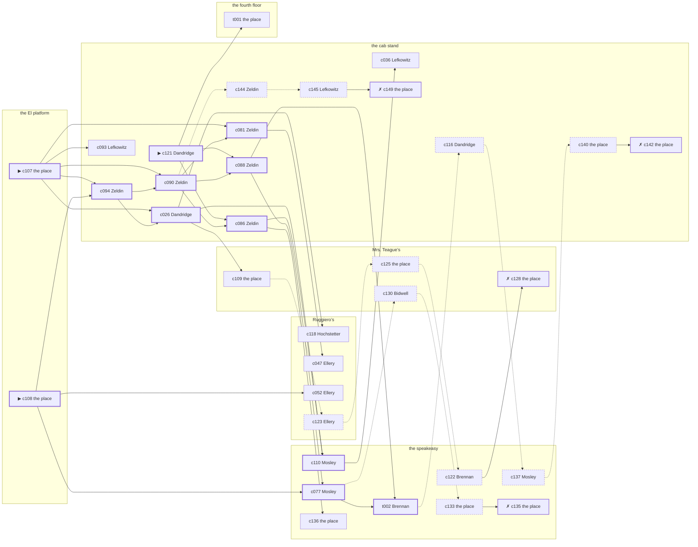

# Little Italy — case 15

**Seed** 15 · **Difficulty** 2 · **Attempts** 2 · **Detective** Dashiell

**Type** missing · **Trope** left · **Unknowns** whereabouts, why

**Par** 11 actions · **Slack** 6 · **Budget** 17 · **Findable** 34 (spine 12, corroboration 8, noise 10 + 4 disqualifiers) · **Noise ratio** 41% · **Candidate pool** 152

## 1. The Truth

Rudolf Brauer, a longshoreman, a childhood friend of Havemeyer’s from the same block, was the last to be with Ellsworth Havemeyer, the landlord of three tenements on Ninth Avenue, at the El platform at 7:00 PM, and saw them off by a case packed in a hurry. Brauer blamed Havemeyer for the ruin of Brauer’s business (revenge). Brauer had been at Mrs. Teague’s earlier in the evening, where the means lived, and was alone with Havemeyer when it happened. Dandridge hired us.

## 2. The Act

**missing** · **left** · actor **Havemeyer** · at **the El platform** · at **7:00 PM**

- whereabouts: the fourth floor
- fate: left

**Givens** — what the briefing states and the report does not ask:

- Havemeyer has not been seen since 6:30 PM on Tuesday evening.
- Mosley saw Havemeyer at the speakeasy at 6:30 PM, and nobody has seen Havemeyer since.
- Havemeyer’s rooms were left tidy and the rent was paid to the end of the month.
- The precinct took a statement and filed it, because a grown person may go where they like.

**Unknowns** — exactly what the report asks: **whereabouts**, **why**.

## 3. Dramatis Personae

| Name | Role | Relationship | Class of secret | Motive | Found at | Killer |
| --- | --- | --- | --- | --- | --- | --- |
| Ellsworth Havemeyer | the landlord of three tenements on Ninth Avenue | the victim | — | — | — | — |
| Ilse Hochstetter | a seamstress | Havemeyer’s former employee | affair | — | Ruggiero’s | — |
| Rudolf Brauer | a longshoreman | a childhood friend of Havemeyer’s from the same block | murder | revenge | Ruggiero’s | **YES** |
| Francis Brennan | a stagehand at the Selwyn | a childhood friend of Havemeyer’s from the same block | secret-drinking | — | the speakeasy | — |
| Willa Dandridge (client) | a private nurse | named in Havemeyer’s will | dope | inheritance | the cab stand | — |
| Gittel Lefkowitz | a society columnist | Havemeyer’s neighbour across the airshaft | affair | — | the cab stand | — |
| Grafton Ellery | a policy runner | a customer of Havemeyer’s | dope | — | Ruggiero’s | — |
| Harrison Pickering | the man behind the counter | fixture (counterman) | — | — | Ruggiero’s | — |
| Marion Bidwell | the landlady | fixture (landlady) | — | — | Mrs. Teague’s | — |
| Ezekiel Mosley | the bartender | fixture (bartender) | — | — | the speakeasy | — |
| Morris Zeldin | the hackman on the stand | fixture (cabbie) | — | — | the cab stand | — |

## 4. Dossiers

Every person, by layer: **0** on sight, **1** volunteered, **2** from other people, **3** in the documents.

### Havemeyer — the victim

55, a man, the landlord of three tenements on Ninth Avenue. Wants: money.

- **Standing** — Havemeyer held three houses on Ninth Avenue, and half the block was behind on the rent for one of them.
- **Profession** — Havemeyer held three tenements on Ninth Avenue and the mortgages on two more.
- **Last seen** — Mosley saw Havemeyer at the speakeasy at 6:30 PM, and nobody has seen Havemeyer since. By Mosley, at the speakeasy, at 6:30 PM.

**Layer 0, on sight**

- _gender_ — A man.
- _age_ — In his fifties.

**Layer 1, volunteered**

- _profession_ — The landlord of three tenements on Ninth Avenue.
- _detail_ — Havemeyer held three tenements on Ninth Avenue and the mortgages on two more.

**Layer 2, from other people**

- _tie_ — Havemeyer held three houses on Ninth Avenue, and half the block was behind on the rent for one of them.
- _want_ — Havemeyer wants money, and is not particular about the shape it arrives in.

**Self-account** (layer 1, what they say when asked about themselves)

- Havemeyer is 55 years old and the landlord of three tenements on Ninth Avenue.
- Havemeyer held three tenements on Ninth Avenue and the mortgages on two more.
- Havemeyer is the one this is about.

### Hochstetter

32, a woman, a seamstress. Wants: money. Tie: Havemeyer’s former employee, since ’23.

**Layer 0, on sight**

- _gender_ — A woman.
- _age_ — In her thirties.
- _profession_ — A seamstress.

**Layer 1, volunteered**

- _detail_ — Hochstetter sews for a house on the avenue and is never named in it.

**Layer 2, from other people**

- _tie_ — Hochstetter kept Havemeyer’s books until Wilhelmina Obermann was brought in over Hochstetter’s head.
- _want_ — Hochstetter wants money, and is not particular about the shape it arrives in.
- _since_ — Hochstetter has been Havemeyer’s former employee, since ’23.
- _third_ — Wilhelmina Obermann is a daughter who married and moved to Newark.

**Layer 3, in the documents**

- _secret-hint_ — Hochstetter was seen going into Mrs. Teague’s alone and came out with somebody half an hour later.

**Self-account** (layer 1, what they say when asked about themselves)

- Hochstetter is 32 years old and a seamstress.
- Hochstetter sews for a house on the avenue and is never named in it.
- Hochstetter is Havemeyer’s former employee.

### Brauer — the killer

48, a man, a longshoreman. Wants: money. Tie: a childhood friend of Havemeyer’s from the same block, since ’22.

**Layer 0, on sight**

- _gender_ — A man.
- _age_ — In his forties.
- _profession_ — A longshoreman.

**Layer 1, volunteered**

- _detail_ — Brauer works the Elizabeth Street pier when there is work.

**Layer 2, from other people**

- _tie_ — Brauer, Havemeyer and Cornelius Quill were inseparable for ten years and have not been in a room together since.
- _want_ — Brauer wants money, and is not particular about the shape it arrives in.
- _since_ — Brauer has been a childhood friend of Havemeyer’s from the same block, since ’22.
- _third_ — Cornelius Quill is a younger brother in trouble upstate.

**Self-account** (layer 1, what they say when asked about themselves)

- Brauer is 48 years old and a longshoreman.
- Brauer works the Elizabeth Street pier when there is work.
- Brauer is a childhood friend of Havemeyer’s from the same block.

### Brennan

28, a man, a stagehand at the Selwyn. Wants: to-be-left-alone. Tie: a childhood friend of Havemeyer’s from the same block, since ’18.

**Layer 0, on sight**

- _gender_ — A man.
- _age_ — In the late twenties.
- _profession_ — A stagehand at the Selwyn.

**Layer 1, volunteered**

- _detail_ — Brennan has been on the same crew since the house opened.

**Layer 2, from other people**

- _tie_ — Brennan and Havemeyer were boys together and neither of them ever left the neighbourhood.
- _want_ — Brennan wants to be left alone.
- _since_ — Brennan has been a childhood friend of Havemeyer’s from the same block, since ’18.

**Layer 3, in the documents**

- _secret-hint_ — Brennan had taken a drink and had gone to some trouble about the smell of it.

**Self-account** (layer 1, what they say when asked about themselves)

- Brennan is 28 years old and a stagehand at the Selwyn.
- Brennan has been on the same crew since the house opened.
- Brennan is a childhood friend of Havemeyer’s from the same block.

### Dandridge — the client

28, a woman, a private nurse. Wants: to-be-left-alone. Tie: named in Havemeyer’s will, since ’27.

**Layer 0, on sight**

- _gender_ — A woman.
- _age_ — In the late twenties.
- _profession_ — A private nurse.

**Layer 1, volunteered**

- _detail_ — Dandridge has a registry card and takes the cases nobody else will.

**Layer 2, from other people**

- _tie_ — Havemeyer told Dandridge there was something in the will and never said how much.
- _want_ — Dandridge wants to be left alone.
- _since_ — Dandridge has been named in Havemeyer’s will, since ’27.

**Layer 3, in the documents**

- _secret-hint_ — Dandridge’s sleeves are buttoned at the wrist in a warm room.

**Self-account** (layer 1, what they say when asked about themselves)

- Dandridge is 28 years old and a private nurse.
- Dandridge has a registry card and takes the cases nobody else will.
- Dandridge is named in Havemeyer’s will.

### Lefkowitz

48, a woman, a society columnist. Wants: money. Tie: Havemeyer’s neighbour across the airshaft, five years on the same landing.

**Layer 0, on sight**

- _gender_ — A woman.
- _age_ — In her forties.

**Layer 1, volunteered**

- _profession_ — A society columnist.
- _detail_ — Lefkowitz has a standing table at a place the bill never comes to.

**Layer 2, from other people**

- _tie_ — Lefkowitz lives across the airshaft from Havemeyer and can hear the wireless through it.
- _want_ — Lefkowitz wants money, and is not particular about the shape it arrives in.
- _since_ — Lefkowitz has been Havemeyer’s neighbour across the airshaft, five years on the same landing.

**Layer 3, in the documents**

- _secret-hint_ — Lefkowitz was seen going into Mrs. Teague’s alone and came out with somebody half an hour later.

**Self-account** (layer 1, what they say when asked about themselves)

- Lefkowitz is 48 years old and a society columnist.
- Lefkowitz has a standing table at a place the bill never comes to.
- Lefkowitz is Havemeyer’s neighbour across the airshaft.

### Ellery

23, a man, a policy runner. Wants: to-get-out. Tie: a customer of Havemeyer’s, since ’22.

**Layer 0, on sight**

- _gender_ — A man.
- _age_ — Not much past twenty.

**Layer 1, volunteered**

- _profession_ — A policy runner.
- _detail_ — Ellery collects the plays in the morning and pays out in the afternoon.

**Layer 2, from other people**

- _tie_ — Ellery came to Havemeyer on Rutherford Lathrop’s introduction and has stayed a customer.
- _want_ — Ellery wants out of the neighbourhood and has wanted it for years.
- _since_ — Ellery has been a customer of Havemeyer’s, since ’22.
- _third_ — Rutherford Lathrop is the foreman who did the hiring.

**Layer 3, in the documents**

- _secret-hint_ — Ellery’s sleeves are buttoned at the wrist in a warm room.

**Self-account** (layer 1, what they say when asked about themselves)

- Ellery is 23 years old and a policy runner.
- Ellery collects the plays in the morning and pays out in the afternoon.
- Ellery is a customer of Havemeyer’s.

### Pickering

51, a man, the man behind the counter. Wants: to-get-out. Tie: behind the counter at Ruggiero’s.

**Layer 0, on sight**

- _gender_ — A man.
- _age_ — In his fifties.
- _profession_ — The man behind the counter.

**Layer 1, volunteered**

- _detail_ — Pickering has the counter at Ruggiero’s from four until midnight.

**Layer 2, from other people**

- _tie_ — Pickering is behind the counter at Ruggiero’s.
- _want_ — Pickering wants out of the neighbourhood and has wanted it for years.

**Self-account** (layer 1, what they say when asked about themselves)

- Pickering is 51 years old and the man behind the counter.
- Pickering has the counter at Ruggiero’s from four until midnight.
- Pickering is behind the counter at Ruggiero’s.

### Bidwell

48, a woman, the landlady. Wants: money. Tie: the keeper of Mrs. Teague’s.

**Layer 0, on sight**

- _gender_ — A woman.
- _age_ — In her forties.
- _profession_ — The landlady.

**Layer 1, volunteered**

- _detail_ — Bidwell lets the rooms at Mrs. Teague’s and collects on Saturdays.

**Layer 2, from other people**

- _tie_ — Bidwell is the keeper of Mrs. Teague’s.
- _want_ — Bidwell wants money, and is not particular about the shape it arrives in.

**Self-account** (layer 1, what they say when asked about themselves)

- Bidwell is 48 years old and the landlady.
- Bidwell lets the rooms at Mrs. Teague’s and collects on Saturdays.
- Bidwell is the keeper of Mrs. Teague’s.

### Mosley

35, a man, the bartender. Wants: to-be-left-alone. Tie: behind the bar at the speakeasy, every night of the week.

**Layer 0, on sight**

- _gender_ — A man.
- _age_ — In his thirties.
- _profession_ — The bartender.

**Layer 1, volunteered**

- _detail_ — Mosley works the speakeasy from four until they lock the door.

**Layer 2, from other people**

- _tie_ — Mosley is behind the bar at the speakeasy, every night of the week.
- _want_ — Mosley wants to be left alone.

**Self-account** (layer 1, what they say when asked about themselves)

- Mosley is 35 years old and the bartender.
- Mosley works the speakeasy from four until they lock the door.
- Mosley is behind the bar at the speakeasy, every night of the week.

### Zeldin

31, a man, the hackman on the stand. Wants: to-keep-what-they-have. Tie: on the stand at the cab stand.

**Layer 0, on sight**

- _gender_ — A man.
- _age_ — In his thirties.
- _profession_ — The hackman on the stand.

**Layer 1, volunteered**

- _detail_ — Zeldin sits the stand at the cab stand and takes the fares as they come.

**Layer 2, from other people**

- _tie_ — Zeldin is on the stand at the cab stand.
- _want_ — Zeldin wants to keep what they have and add nothing to it.

**Self-account** (layer 1, what they say when asked about themselves)

- Zeldin is 31 years old and the hackman on the stand.
- Zeldin sits the stand at the cab stand and takes the fares as they come.
- Zeldin is on the stand at the cab stand.

## 5. The Client

**Dandridge**, named in Havemeyer’s will. Purpose: **clear-my-name**.

- **Why** — Dandridge wants it established that it was not them, before anybody says otherwise.
- **What it costs** — Dandridge was near enough to it that night to know exactly how it looks, and says so first.
- **Points at** — Brauer: Brauer blamed Havemeyer for the ruin of Brauer’s business. Honest: **yes**.

**Tells:**

- Havemeyer has not been seen since 6:30 PM on Tuesday evening.
- Mosley saw Havemeyer at the speakeasy at 6:30 PM, and nobody has seen Havemeyer since.
- Havemeyer’s rooms were left tidy and the rent was paid to the end of the month.
- The precinct took a statement and filed it, because a grown person may go where they like.
- Dandridge would rather we started with Brauer: Brauer blamed Havemeyer for the ruin of Brauer’s business.

**Withholds:**

- Dandridge does not mention it, but Dandridge buys morphine at the cab stand from 7:00 PM and would rather be thought a murderer than a hop-head.

**Their own evening, as they tell it:**

- Dandridge says she was at Mrs. Teague’s from 6:00 PM to 6:30 PM.
- Dandridge says she was at the speakeasy at 7:00 PM.
- Dandridge says she was at the cab stand from 7:30 PM to 10:30 PM.
- Dandridge says she was at Mrs. Teague’s from 11:00 PM to 11:30 PM.

## 6. The Briefing

15 plain sentences, derived. This is the model of the plain register: the engine renders it, and Phase 2 measures pages against it.

1. A woman came up the stairs after midnight, and sat down.
2. Willa Dandridge is 28 years old and a private nurse.
3. Dandridge has a registry card and takes the cases nobody else will.
4. Havemeyer held three houses on Ninth Avenue, and half the block was behind on the rent for one of them.
5. Havemeyer has not been seen since 6:30 PM on Tuesday evening.
6. Mosley saw Havemeyer at the speakeasy at 6:30 PM, and nobody has seen Havemeyer since.
7. Havemeyer’s rooms were left tidy and the rent was paid to the end of the month.
8. The precinct took a statement and filed it, because a grown person may go where they like.
9. Mosley saw Havemeyer at the speakeasy at 6:30 PM, and nobody has seen Havemeyer since.
10. Dandridge is named in Havemeyer’s will.
11. Havemeyer told Dandridge there was something in the will and never said how much.
12. Dandridge wants it established that it was not them, before anybody says otherwise.
13. Dandridge was near enough to it that night to know exactly how it looks, and says so first.
14. Dandridge wants us to start with Brauer.
15. Brauer blamed Havemeyer for the ruin of Brauer’s business.

## 7. Mentions

- **Wilhelmina Obermann** (m-1) — a daughter who married and moved to Newark. Wilhelmina Obermann is a daughter who married and moved to Newark.
- **Cornelius Quill** (m-2) — a younger brother in trouble upstate. Cornelius Quill is a younger brother in trouble upstate.
- **Rutherford Lathrop** (m-3) — the foreman who did the hiring. Rutherford Lathrop is the foreman who did the hiring.

## 8. Places

- **Ruggiero’s barber shop** (semi) — watched by counterman (Pickering); objects: an ice pick, a folded stack of evening papers
- **the back room at Mrs. Teague’s** (private) — watched by landlady (Bidwell); objects: a strapped suitcase, a framed photograph, a length of sash cord — where the weapon lived
- **the speakeasy under the hat shop** (semi) — watched by bartender (Mosley); objects: a seltzer siphon, a bottle of chloral drops, a nickel-plated revolver — within earshot of the scene
- **the cab stand outside the Hippodrome** (public) — watched by cabbie (Zeldin); objects: a pasted-up timetable — within earshot of the scene
- **the El platform at Twenty-Third Street** (public) — unwatched; objects: none — **THE SCENE**
- **Havemeyer’s apartment on the fourth floor** (private) — unwatched; objects: a japanned cash box, a bronze bookend — the victim’s address

## 9. Anchors

The coroner gives 6:00 PM–7:30 PM, four ticks wide. These are what close it: **bar-radio** and **drunk-singing**.

- **the fight card on the bar radio** — at 6:30 PM; at the speakeasy. Only those present know that the challenger went down in the fourth and the crowd booed it. You can time things by it: the set was turned up loud enough to carry into the street.
- **the drunk singing under the window** — at 7:00 PM; at the speakeasy. You can time things by it: the same two verses until somebody threw a shoe. Only those present know that it was a shoe, and it was thrown by a woman, and it did not land.
- **the dumbwaiter squeal** — at 6:00 PM, 7:30 PM, 9:00 PM, 10:30 PM; at Mrs. Teague’s. You can time things by it: a noise the whole shaft hears and nobody in the building can sleep through. Only those present know that the car came up with somebody’s wash still in it, and stuck halfway.

## 10. Timelines

### Havemeyer — the victim

| Tick | Time | Truth | Claimed | Companion claimed |
| --- | --- | --- | --- | --- |
| 0 | 6:00 PM | the cab stand | the cab stand | — |
| 1 | 6:30 PM | the speakeasy | the speakeasy | — |
| 2 | 7:00 PM | the El platform ☠ | the El platform | — |
| 3 | 7:30 PM | the fourth floor | the fourth floor | — |
| 4 | 8:00 PM | the fourth floor | the fourth floor | — |
| 5 | 8:30 PM | the fourth floor | the fourth floor | — |
| 6 | 9:00 PM | the fourth floor | the fourth floor | — |
| 7 | 9:30 PM | the fourth floor | the fourth floor | — |
| 8 | 10:00 PM | the fourth floor | the fourth floor | — |
| 9 | 10:30 PM | the fourth floor | the fourth floor | — |
| 10 | 11:00 PM | the fourth floor | the fourth floor | — |
| 11 | 11:30 PM | the fourth floor | the fourth floor | — |

### Hochstetter

| Tick | Time | Truth | Claimed | Companion claimed |
| --- | --- | --- | --- | --- |
| 0 | 6:00 PM | Ruggiero’s | Ruggiero’s | — |
| 1 | 6:30 PM | Ruggiero’s | Ruggiero’s | — |
| 2 | 7:00 PM | the cab stand | the cab stand | — |
| 3 | 7:30 PM | Ruggiero’s | Ruggiero’s | — |
| 4 | 8:00 PM | the speakeasy | the speakeasy | — |
| 5 | 8:30 PM | the speakeasy | the speakeasy | — |
| 6 | 9:00 PM | the speakeasy | the speakeasy | — |
| 7 | 9:30 PM | the speakeasy | the speakeasy | — |
| 8 | 10:00 PM | Mrs. Teague’s | **the fourth floor** | — |
| 9 | 10:30 PM | Mrs. Teague’s | **the fourth floor** | — |
| 10 | 11:00 PM | Mrs. Teague’s | **the fourth floor** | — |
| 11 | 11:30 PM | Ruggiero’s | Ruggiero’s | — |

### Brauer — the killer

| Tick | Time | Truth | Claimed | Companion claimed |
| --- | --- | --- | --- | --- |
| 0 | 6:00 PM | Mrs. Teague’s | Mrs. Teague’s | — |
| 1 | 6:30 PM | the El platform | **the cab stand** | Brennan |
| 2 | 7:00 PM | the El platform ☠ | **the cab stand** | Brennan |
| 3 | 7:30 PM | the cab stand | the cab stand | — |
| 4 | 8:00 PM | Ruggiero’s | Ruggiero’s | — |
| 5 | 8:30 PM | Ruggiero’s | Ruggiero’s | — |
| 6 | 9:00 PM | Ruggiero’s | Ruggiero’s | — |
| 7 | 9:30 PM | Ruggiero’s | Ruggiero’s | — |
| 8 | 10:00 PM | Ruggiero’s | Ruggiero’s | — |
| 9 | 10:30 PM | the cab stand | the cab stand | — |
| 10 | 11:00 PM | the cab stand | the cab stand | — |
| 11 | 11:30 PM | the cab stand | the cab stand | — |

### Brennan

| Tick | Time | Truth | Claimed | Companion claimed |
| --- | --- | --- | --- | --- |
| 0 | 6:00 PM | the El platform | the El platform | — |
| 1 | 6:30 PM | the speakeasy | **Ruggiero’s** | Lefkowitz |
| 2 | 7:00 PM | the speakeasy | **Ruggiero’s** | Lefkowitz |
| 3 | 7:30 PM | the speakeasy | the speakeasy | — |
| 4 | 8:00 PM | Ruggiero’s | Ruggiero’s | — |
| 5 | 8:30 PM | Ruggiero’s | Ruggiero’s | — |
| 6 | 9:00 PM | the cab stand | the cab stand | — |
| 7 | 9:30 PM | the fourth floor | the fourth floor | — |
| 8 | 10:00 PM | Mrs. Teague’s | Mrs. Teague’s | — |
| 9 | 10:30 PM | Mrs. Teague’s | Mrs. Teague’s | — |
| 10 | 11:00 PM | Mrs. Teague’s | Mrs. Teague’s | — |
| 11 | 11:30 PM | Ruggiero’s | Ruggiero’s | — |

### Dandridge

| Tick | Time | Truth | Claimed | Companion claimed |
| --- | --- | --- | --- | --- |
| 0 | 6:00 PM | Mrs. Teague’s | Mrs. Teague’s | — |
| 1 | 6:30 PM | Mrs. Teague’s | Mrs. Teague’s | — |
| 2 | 7:00 PM | the cab stand | **the speakeasy** | — |
| 3 | 7:30 PM | the cab stand | the cab stand | — |
| 4 | 8:00 PM | the cab stand | the cab stand | — |
| 5 | 8:30 PM | the cab stand | the cab stand | — |
| 6 | 9:00 PM | the cab stand | the cab stand | — |
| 7 | 9:30 PM | the cab stand | the cab stand | — |
| 8 | 10:00 PM | the cab stand | the cab stand | — |
| 9 | 10:30 PM | the cab stand | the cab stand | — |
| 10 | 11:00 PM | Mrs. Teague’s | Mrs. Teague’s | — |
| 11 | 11:30 PM | Mrs. Teague’s | Mrs. Teague’s | — |

### Lefkowitz

| Tick | Time | Truth | Claimed | Companion claimed |
| --- | --- | --- | --- | --- |
| 0 | 6:00 PM | the El platform | the El platform | — |
| 1 | 6:30 PM | the cab stand | the cab stand | — |
| 2 | 7:00 PM | the cab stand | the cab stand | — |
| 3 | 7:30 PM | the cab stand | the cab stand | — |
| 4 | 8:00 PM | Ruggiero’s | Ruggiero’s | — |
| 5 | 8:30 PM | Ruggiero’s | Ruggiero’s | — |
| 6 | 9:00 PM | Ruggiero’s | Ruggiero’s | — |
| 7 | 9:30 PM | the cab stand | the cab stand | — |
| 8 | 10:00 PM | Mrs. Teague’s | **Ruggiero’s** | Hochstetter |
| 9 | 10:30 PM | Mrs. Teague’s | **Ruggiero’s** | Hochstetter |
| 10 | 11:00 PM | Mrs. Teague’s | **Ruggiero’s** | Hochstetter |
| 11 | 11:30 PM | Mrs. Teague’s | Mrs. Teague’s | — |

### Ellery

| Tick | Time | Truth | Claimed | Companion claimed |
| --- | --- | --- | --- | --- |
| 0 | 6:00 PM | Mrs. Teague’s | Mrs. Teague’s | — |
| 1 | 6:30 PM | Ruggiero’s | Ruggiero’s | — |
| 2 | 7:00 PM | the cab stand | **Mrs. Teague’s** | — |
| 3 | 7:30 PM | the cab stand | the cab stand | — |
| 4 | 8:00 PM | Mrs. Teague’s | Mrs. Teague’s | — |
| 5 | 8:30 PM | Ruggiero’s | Ruggiero’s | — |
| 6 | 9:00 PM | Ruggiero’s | Ruggiero’s | — |
| 7 | 9:30 PM | Ruggiero’s | Ruggiero’s | — |
| 8 | 10:00 PM | Ruggiero’s | Ruggiero’s | — |
| 9 | 10:30 PM | Ruggiero’s | Ruggiero’s | — |
| 10 | 11:00 PM | the cab stand | the cab stand | — |
| 11 | 11:30 PM | the cab stand | the cab stand | — |

### Fixtures (never lie, never withhold)

| Tick | Time | Pickering (the man behind the counter) | Bidwell (the landlady) | Mosley (the bartender) | Zeldin (the hackman on the stand) |
| --- | --- | --- | --- | --- | --- |
| 0 | 6:00 PM | Ruggiero’s | Mrs. Teague’s | the speakeasy | the cab stand |
| 1 | 6:30 PM | Ruggiero’s | Mrs. Teague’s | the speakeasy | the cab stand |
| 2 | 7:00 PM | the speakeasy | Mrs. Teague’s | the speakeasy | the cab stand |
| 3 | 7:30 PM | Ruggiero’s | Mrs. Teague’s | the speakeasy | the cab stand |
| 4 | 8:00 PM | Ruggiero’s | Mrs. Teague’s | the speakeasy | the cab stand |
| 5 | 8:30 PM | Ruggiero’s | Mrs. Teague’s | the speakeasy | the speakeasy |
| 6 | 9:00 PM | Ruggiero’s | Mrs. Teague’s | the speakeasy | the cab stand |
| 7 | 9:30 PM | Ruggiero’s | Mrs. Teague’s | the speakeasy | the cab stand |
| 8 | 10:00 PM | Ruggiero’s | Mrs. Teague’s | Mrs. Teague’s | the cab stand |
| 9 | 10:30 PM | Ruggiero’s | Mrs. Teague’s | the speakeasy | the cab stand |
| 10 | 11:00 PM | Ruggiero’s | Mrs. Teague’s | the speakeasy | the cab stand |
| 11 | 11:30 PM | Ruggiero’s | Mrs. Teague’s | the speakeasy | the cab stand |

## 11. Secrets in play

- **Hochstetter** (affair): Hochstetter is with Lefkowitz at Mrs. Teague’s from 10:00 PM to 11:00 PM, and both will say they were somewhere else.
- **Brauer** (murder): Brauer is at the El platform from 6:30 PM to 7:00 PM, alone with Havemeyer, who is not seen again after 7:00 PM.
- **Brennan** (secret-drinking): Brennan drinks alone at the speakeasy from 6:30 PM to 7:00 PM and will claim to have been anywhere else.
- **Dandridge** (dope): Dandridge buys morphine at the cab stand from 7:00 PM and would rather be thought a murderer than a hop-head.
- **Lefkowitz** (affair): Lefkowitz is with Hochstetter at Mrs. Teague’s from 10:00 PM to 11:00 PM, and both will say they were somewhere else.
- **Ellery** (dope): Ellery buys morphine at the cab stand from 7:00 PM and would rather be thought a murderer than a hop-head.

## 12. Clue list — the 34 findable

The opening three, free at the start: c107, c108, c121. Everything else has to be led to. The full candidate pool is in the companion file.

### At Ruggiero’s

- **c118** [corroboration] (overheard; Hochstetter on Brauer and Havemeyer) → (end)
  - Hochstetter says Brauer said Havemeyer had taken everything and would be made to feel it.
  - _establishes: Brauer had a motive (revenge)_
- **c047** [corroboration] (observation; Ellery on Brauer) → (end)
  - Ellery says Brauer was at Mrs. Teague’s at 6:00 PM.
  - _establishes: Brauer at Mrs. Teague’s, 6:00 PM; Brauer could reach the weapon_
- **c052** [corroboration] (observation; Ellery on Dandridge) → (end)
  - Ellery says Dandridge was at Mrs. Teague’s at 6:00 PM.
  - _establishes: Dandridge at Mrs. Teague’s, 6:00 PM; Dandridge could reach the weapon_
- **c123** [noise {b2}] (overheard; Ellery on Hochstetter) → c125
  - Ellery on Hochstetter: Somebody asked Hochstetter a plain question about the evening and got three different answers.
  - _establishes: context only_

### At Mrs. Teague’s

- **c109** [corroboration] (physical; the place itself) → c123
  - A strapped suitcase is gone from Mrs. Teague’s. The strapped case is gone from the press, and the straps were bought new last week.
  - _establishes: something gone from Mrs. Teague’s; how it was done_
- **c125** [noise {b2}] (physical; the place itself) → c122
  - Two glasses at Mrs. Teague’s, one of them with a lip print on it, and only one of them paid for.
  - _establishes: context only_
- **c128** [disqualifier {b2}] (overheard; the place itself) → (end)
  - Lefkowitz breaks and says it plainly: Lefkowitz was with Hochstetter at Mrs. Teague’s for the whole of it, from 10:00 PM to 11:00 PM, and it is a marriage they are hiding, not a killing.
  - _establishes: Hochstetter’s affair accounted for; Hochstetter at Mrs. Teague’s, 10:00 PM–11:00 PM; Lefkowitz’s affair accounted for; Lefkowitz at Mrs. Teague’s, 10:00 PM–11:00 PM_
- **c130** [noise {b4}] (overheard; Bidwell on Brennan) → c133
  - Bidwell on Brennan: Brennan had taken a drink and had gone to some trouble about the smell of it.
  - _establishes: context only_

### At the speakeasy

- **c077** [spine] (observation; Mosley on Brennan) → t002, c130
  - Mosley says Brennan was at the speakeasy from 6:30 PM to 7:30 PM.
  - _establishes: Brennan at the speakeasy, 6:30 PM–7:30 PM_
- **c110** [spine] (anchor; Mosley on Havemeyer that evening) → c036
  - Mosley puts Havemeyer at the speakeasy while the fight was on the radio, which was 6:30 PM, and in no hurry to be anywhere.
  - _establishes: the victim alive at 6:30 PM; Havemeyer at the speakeasy, 6:30 PM_
- **t002** [spine] (overheard; Brennan on Havemeyer since Tuesday) → c116
  - Brennan says there was somebody at the fourth floor at 8:30 PM reading the departures off a timetable, and that it was Havemeyer.
  - _establishes: Havemeyer at the fourth floor, 8:30 PM_
- **c136** [corroboration] (overheard; the place itself) → (end)
  - The tab at the speakeasy is dated and timed, from 6:30 PM to 7:00 PM, and Brennan was there to run it up.
  - _establishes: Brennan’s secret-drinking accounted for; Brennan at the speakeasy, 6:30 PM–7:00 PM_
- **c137** [noise {b1}] (overheard; Mosley on Dandridge) → c140
  - Mosley on Dandridge: Dandridge’s sleeves are buttoned at the wrist in a warm room.
  - _establishes: context only_
- **c122** [noise {b2}] (overheard; Brennan on Hochstetter) → c128
  - Brennan on Hochstetter: Hochstetter was seen going into Mrs. Teague’s alone and came out with somebody half an hour later.
  - _establishes: context only_
- **c133** [noise {b4}] (physical; the place itself) → c135
  - A bottle at the speakeasy pushed behind the pipes, the seal broken and the level down.
  - _establishes: context only_
- **c135** [disqualifier {b4}] (overheard; the place itself) → (end)
  - The man behind the counter at the speakeasy knows exactly: Brennan was on the same stool from 6:30 PM to 7:00 PM and was in no condition to walk anywhere, let alone do this.
  - _establishes: Brennan’s secret-drinking accounted for; Brennan at the speakeasy, 6:30 PM–7:00 PM_

### At the cab stand

- **c121** [spine ⟨opening⟩] (client; Dandridge on why I was hired) → c088, c086, t001
  - Dandridge hired us, and wants it known that Brauer blamed Havemeyer for the ruin of Brauer’s business, and would rather we started there.
  - _establishes: Brauer had a motive (revenge)_
- **c094** [spine] (observation; Zeldin on Brauer’s account) → c026, c090
  - Zeldin was at the cab stand from 6:30 PM to 7:00 PM and says Brauer was not.
  - _establishes: Brauer not at the cab stand, 6:30 PM–7:00 PM_
- **c026** [spine] (observation; Dandridge on Brauer) → c110, c118, c109
  - Dandridge says Brauer was at Mrs. Teague’s at 6:00 PM.
  - _establishes: Brauer at Mrs. Teague’s, 6:00 PM; Brauer could reach the weapon_
- **c090** [spine] (observation; Zeldin on Ellery) → c081, c088, c086, c144
  - Zeldin says Ellery was at the cab stand from 7:00 PM to 7:30 PM.
  - _establishes: Ellery at the cab stand, 7:00 PM–7:30 PM_
- **c081** [spine] (observation; Zeldin on Hochstetter) → c047
  - Zeldin says Hochstetter was at the cab stand at 7:00 PM.
  - _establishes: Hochstetter at the cab stand, 7:00 PM_
- **c088** [spine] (observation; Zeldin on Lefkowitz) → c077, t002
  - Zeldin says Lefkowitz was at the cab stand from 6:30 PM to 7:30 PM.
  - _establishes: Lefkowitz at the cab stand, 6:30 PM–7:30 PM_
- **c086** [spine] (observation; Zeldin on Dandridge) → c110, c136
  - Zeldin says Dandridge was at the cab stand from 7:00 PM to 8:00 PM.
  - _establishes: Dandridge at the cab stand, 7:00 PM–8:00 PM_
- **c093** [corroboration] (observation; Lefkowitz on Brauer’s account) → (end)
  - Lefkowitz was at the cab stand from 6:30 PM to 7:00 PM and says Brauer was not.
  - _establishes: Brauer not at the cab stand, 6:30 PM–7:00 PM_
- **c036** [corroboration] (observation; Lefkowitz on Hochstetter) → (end)
  - Lefkowitz says Hochstetter was at the cab stand at 7:00 PM.
  - _establishes: Hochstetter at the cab stand, 7:00 PM_
- **c116** [noise {b1}] (anchor; Dandridge on the drunk singing under the window) → c137
  - Dandridge claims the speakeasy at 7:00 PM, which is when the drunk singing under the window was on. Asked about it, Dandridge cannot say that it was a shoe, and it was thrown by a woman, and it did not land — and everybody who was there can.
  - _establishes: Dandridge not at the speakeasy, 7:00 PM_
- **c140** [noise {b1}] (physical; the place itself) → c142
  - A paper of powder at the cab stand, folded the way one particular hand folds them.
  - _establishes: context only_
- **c142** [disqualifier {b1}] (overheard; the place itself) → (end)
  - The man who sells it at the cab stand gives it up rather than be held: Dandridge was there from 7:00 PM, and stayed until it took hold.
  - _establishes: Dandridge’s dope accounted for; Dandridge at the cab stand, 7:00 PM_
- **c144** [noise {b3}] (overheard; Zeldin on Ellery) → c145
  - Zeldin on Ellery: Ellery’s sleeves are buttoned at the wrist in a warm room.
  - _establishes: context only_
- **c145** [noise {b3}] (overheard; Lefkowitz on Ellery) → c149
  - Lefkowitz on Ellery: Somebody at the cab stand sells what a druggist will not, and Ellery knows which door.
  - _establishes: context only_
- **c149** [disqualifier {b3}] (overheard; the place itself) → (end)
  - The man who sells it at the cab stand gives it up rather than be held: Ellery was there from 7:00 PM, and stayed until it took hold.
  - _establishes: Ellery’s dope accounted for; Ellery at the cab stand, 7:00 PM_

### At the El platform

- **c107** [spine ⟨opening⟩] (scene; the place itself) → c094, c026, c090, c081, c093
  - Havemeyer is not at the El platform and has not been since that evening. Two drawers are open and the good coat is off its hanger. The singing under the window stopped at 7:00 PM, when the shoe came down.
  - _establishes: the victim dead by 7:00 PM; how it was done_
- **c108** [spine ⟨opening⟩] (morgue; the place itself) → c094, c077, c052
  - Nobody can put it closer than between 6:00 PM and 7:30 PM, which is two hours of nothing useful. The precinct took a statement and filed it. Nobody at the desk thought it was a police matter.
  - _establishes: death between 6:00 PM and 7:30 PM; how it was done_

### At the fourth floor

- **t001** [corroboration] (document; the place itself) → (end)
  - A pawn ticket written at the fourth floor at 7:30 PM, for a ring, in a hand that matches the rent book Havemeyer signs.
  - _establishes: Havemeyer at the fourth floor, 7:30 PM_

## 13. Clue graph

## 14. Deduction path

Par is **11 actions** and the budget is par plus 6: **17**. Every id below is a spine clue; the inference is the sheet’s, not the clue’s.

**Time of death.** The coroner gives four ticks. The anchors close it to 7:00 PM: one puts Havemeyer alive at 6:30 PM, the other times the scene at 7:00 PM. _(c108, c110, c107)_

**Clearing the innocent.**

- Hochstetter was not at the El platform at 7:00 PM. _(c081; + 1 corroborating)_
- Brennan was not at the El platform at 7:00 PM. _(c077; + 2 corroborating)_
- Dandridge was not at the El platform at 7:00 PM. _(c086; + 1 corroborating)_
- Lefkowitz was not at the El platform at 7:00 PM. _(c088)_
- Ellery was not at the El platform at 7:00 PM. _(c090; + 1 corroborating)_

**Naming the killer.** Brauer claims the cab stand at 7:00 PM. Two independent sources put that out of the question. _(c094; + 1 corroborating)_

**The weapon.** Brauer was at Mrs. Teague’s before 7:00 PM, where a strapped suitcase was kept. _(c026; + 1 corroborating)_

**Method.** A case packed in a hurry, on two physical sources. _(c107, c108; + 1 corroborating)_

**Motive.** revenge, on two independent sources. _(c121; + 1 corroborating)_

## 15. Red herrings

**Innocents who lie about the murder tick:**

- Brennan claims Ruggiero’s at 7:00 PM and was really at the speakeasy. Reason: Brennan drinks alone at the speakeasy from 6:30 PM to 7:00 PM and will claim to have been anywhere else.
- Dandridge claims the speakeasy at 7:00 PM and was really at the cab stand. Reason: Dandridge buys morphine at the cab stand from 7:00 PM and would rather be thought a murderer than a hop-head.
- Ellery claims Mrs. Teague’s at 7:00 PM and was really at the cab stand. Reason: Ellery buys morphine at the cab stand from 7:00 PM and would rather be thought a murderer than a hop-head.

**Innocents with a motive:**

- Dandridge — inheritance: stands to inherit from Havemeyer.

**Noise branches, and what knocks each one down:**

- **b1** (Dandridge, dope): c116 → c137 → c140 → **c142** — The man who sells it at the cab stand gives it up rather than be held: Dandridge was there from 7:00 PM, and stayed until it took hold.
- **b2** (Hochstetter, affair): c123 → c125 → c122 → **c128** — Lefkowitz breaks and says it plainly: Lefkowitz was with Hochstetter at Mrs. Teague’s for the whole of it, from 10:00 PM to 11:00 PM, and it is a marriage they are hiding, not a killing.
- **b3** (Ellery, dope): c144 → c145 → **c149** — The man who sells it at the cab stand gives it up rather than be held: Ellery was there from 7:00 PM, and stayed until it took hold.
- **b4** (Brennan, secret-drinking): c130 → c133 → **c135** — The man behind the counter at the speakeasy knows exactly: Brennan was on the same stool from 6:30 PM to 7:00 PM and was in no condition to walk anywhere, let alone do this.

