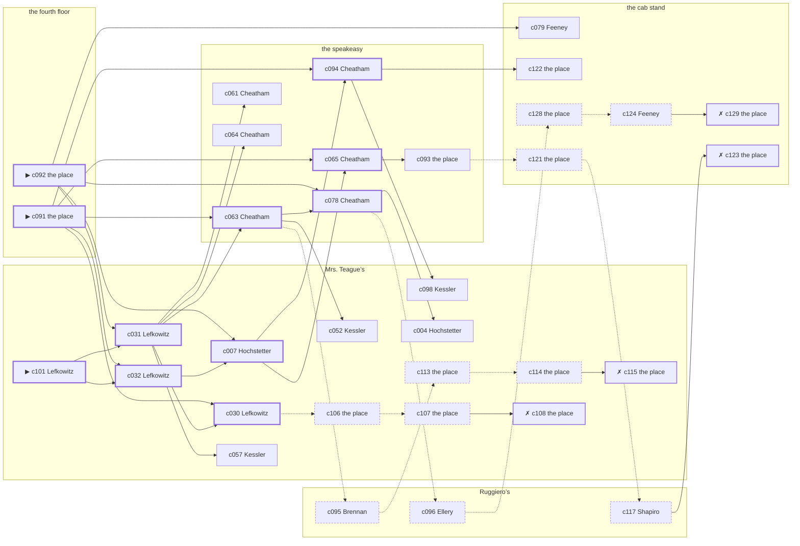

# Little Italy — case 15

**Seed** 15 · **Difficulty** 2 · **Attempts** 1 · **Detective** Dashiell

**Par** 10 actions · **Slack** 6 · **Budget** 16 · **Findable** 34 (spine 11, corroboration 9, noise 10 + 4 disqualifiers) · **Noise ratio** 41% · **Candidate pool** 130

## 1. The Truth

Rudolf Brauer, a longshoreman, a childhood friend of the victim’s from the same block, killed Ellsworth Havemeyer, the landlord of three tenements on Ninth Avenue, with a gunshot at the fourth floor at 8:30 PM. Brauer blamed the victim for a ruin (revenge). Brauer had been at the speakeasy earlier in the evening, where the weapon lived, and was alone with Havemeyer when it happened. Lefkowitz hired us.

## 2. Dramatis Personae

| Name | Role | Relationship | Class of secret | Motive | Found at | Killer |
| --- | --- | --- | --- | --- | --- | --- |
| Ellsworth Havemeyer | the landlord of three tenements on Ninth Avenue | the victim | — | — | — | — |
| Ilse Hochstetter | a seamstress | the victim’s former employee | affair | — | Mrs. Teague’s | — |
| Rudolf Brauer | a longshoreman | a childhood friend of the victim’s from the same block | murder (+ gambling-debt) | revenge | the speakeasy | **YES** |
| Francis Brennan | a stagehand at the Selwyn | a childhood friend of the victim’s from the same block | secret-drinking | — | Ruggiero’s | — |
| Willa Dandridge | a private nurse | named in the victim’s will | dope | inheritance | the cab stand | — |
| Gittel Lefkowitz (client) | a society columnist | the victim’s neighbour across the airshaft | affair | — | Mrs. Teague’s | — |
| Grafton Ellery | a policy runner | a customer of the victim’s | dope | — | Ruggiero’s | — |
| Ida Shapiro | the man behind the counter | fixture (counterman) | — | — | Ruggiero’s | — |
| Esther Kessler | the landlady | fixture (landlady) | — | — | Mrs. Teague’s | — |
| Althea Cheatham | the bartender | fixture (bartender) | — | — | the speakeasy | — |
| Nora Feeney | the hackman on the stand | fixture (cabbie) | — | — | the cab stand | — |

## 3. Places

- **Ruggiero’s barber shop** (semi) — watched by counterman (Shapiro); objects: an ice pick, a folded stack of evening papers
- **the back room at Mrs. Teague’s** (private) — watched by landlady (Kessler); objects: a framed photograph, a length of sash cord
- **the speakeasy under the hat shop** (semi) — watched by bartender (Cheatham); objects: a nickel-plated revolver, a seltzer siphon, a bottle of chloral drops, a silver cigarette case — where the weapon lived; within earshot of the scene
- **the cab stand outside the Hippodrome** (public) — watched by cabbie (Feeney); objects: a pasted-up timetable
- **the El platform at Twenty-Third Street** (public) — unwatched; objects: none — within earshot of the scene
- **the victim’s apartment on the fourth floor** (private) — unwatched; objects: a japanned cash box, a bronze bookend — **THE SCENE**; the victim’s address

## 4. Anchors

The coroner gives 7:30 PM–9:00 PM, four ticks wide. These are what close it: **drunk-singing** and **el-train**.

- **the drunk singing under the window** — at 8:00 PM; at the speakeasy. You can time things by it: the same two verses until somebody threw a shoe. Only those present know that it was a shoe, and it was thrown by a woman, and it did not land.
- **the El going over** — at 6:30 PM, 7:30 PM, 8:30 PM, 9:30 PM, 10:30 PM, 11:30 PM; across the whole neighbourhood. You can time things by it: everything under the structure stops being audible for twenty seconds.

## 5. Timelines

### Havemeyer — the victim

| Tick | Time | Truth | Claimed | Companion claimed |
| --- | --- | --- | --- | --- |
| 0 | 6:00 PM | Mrs. Teague’s | Mrs. Teague’s | — |
| 1 | 6:30 PM | Mrs. Teague’s | Mrs. Teague’s | — |
| 2 | 7:00 PM | the speakeasy | the speakeasy | — |
| 3 | 7:30 PM | the cab stand | the cab stand | — |
| 4 | 8:00 PM | the speakeasy | the speakeasy | — |
| 5 | 8:30 PM | the fourth floor ☠ | the fourth floor | — |
| 6 | 9:00 PM | — | — | — |
| 7 | 9:30 PM | — | — | — |
| 8 | 10:00 PM | — | — | — |
| 9 | 10:30 PM | — | — | — |
| 10 | 11:00 PM | — | — | — |
| 11 | 11:30 PM | — | — | — |

### Hochstetter

| Tick | Time | Truth | Claimed | Companion claimed |
| --- | --- | --- | --- | --- |
| 0 | 6:00 PM | Ruggiero’s | Ruggiero’s | — |
| 1 | 6:30 PM | Mrs. Teague’s | Mrs. Teague’s | — |
| 2 | 7:00 PM | Mrs. Teague’s | **Ruggiero’s** | — |
| 3 | 7:30 PM | Mrs. Teague’s | **Ruggiero’s** | — |
| 4 | 8:00 PM | Mrs. Teague’s | **Ruggiero’s** | — |
| 5 | 8:30 PM | Mrs. Teague’s | Mrs. Teague’s | — |
| 6 | 9:00 PM | Mrs. Teague’s | Mrs. Teague’s | — |
| 7 | 9:30 PM | the El platform | the El platform | — |
| 8 | 10:00 PM | the El platform | the El platform | — |
| 9 | 10:30 PM | the speakeasy | the speakeasy | — |
| 10 | 11:00 PM | the El platform | the El platform | — |
| 11 | 11:30 PM | the El platform | the El platform | — |

### Brauer — the killer

| Tick | Time | Truth | Claimed | Companion claimed |
| --- | --- | --- | --- | --- |
| 0 | 6:00 PM | the speakeasy | the speakeasy | — |
| 1 | 6:30 PM | the El platform | **the cab stand** | — |
| 2 | 7:00 PM | the El platform | the El platform | — |
| 3 | 7:30 PM | the fourth floor | **the cab stand** | Brennan |
| 4 | 8:00 PM | the fourth floor | **the cab stand** | Brennan |
| 5 | 8:30 PM | the fourth floor ☠ | **the cab stand** | Brennan |
| 6 | 9:00 PM | Ruggiero’s | Ruggiero’s | — |
| 7 | 9:30 PM | the speakeasy | the speakeasy | — |
| 8 | 10:00 PM | the speakeasy | the speakeasy | — |
| 9 | 10:30 PM | the speakeasy | the speakeasy | — |
| 10 | 11:00 PM | the El platform | the El platform | — |
| 11 | 11:30 PM | the El platform | the El platform | — |

### Brennan

| Tick | Time | Truth | Claimed | Companion claimed |
| --- | --- | --- | --- | --- |
| 0 | 6:00 PM | Mrs. Teague’s | Mrs. Teague’s | — |
| 1 | 6:30 PM | Ruggiero’s | Ruggiero’s | — |
| 2 | 7:00 PM | Ruggiero’s | Ruggiero’s | — |
| 3 | 7:30 PM | Ruggiero’s | Ruggiero’s | — |
| 4 | 8:00 PM | Mrs. Teague’s | **the speakeasy** | Ellery |
| 5 | 8:30 PM | Mrs. Teague’s | **the speakeasy** | Ellery |
| 6 | 9:00 PM | Mrs. Teague’s | Mrs. Teague’s | — |
| 7 | 9:30 PM | Ruggiero’s | Ruggiero’s | — |
| 8 | 10:00 PM | Ruggiero’s | Ruggiero’s | — |
| 9 | 10:30 PM | Ruggiero’s | Ruggiero’s | — |
| 10 | 11:00 PM | Ruggiero’s | Ruggiero’s | — |
| 11 | 11:30 PM | Ruggiero’s | Ruggiero’s | — |

### Dandridge

| Tick | Time | Truth | Claimed | Companion claimed |
| --- | --- | --- | --- | --- |
| 0 | 6:00 PM | the cab stand | the cab stand | — |
| 1 | 6:30 PM | the cab stand | the cab stand | — |
| 2 | 7:00 PM | Mrs. Teague’s | Mrs. Teague’s | — |
| 3 | 7:30 PM | the cab stand | the cab stand | — |
| 4 | 8:00 PM | the cab stand | the cab stand | — |
| 5 | 8:30 PM | the cab stand | **Ruggiero’s** | — |
| 6 | 9:00 PM | the cab stand | **Ruggiero’s** | — |
| 7 | 9:30 PM | Ruggiero’s | Ruggiero’s | — |
| 8 | 10:00 PM | the El platform | the El platform | — |
| 9 | 10:30 PM | the El platform | the El platform | — |
| 10 | 11:00 PM | the El platform | the El platform | — |
| 11 | 11:30 PM | the El platform | the El platform | — |

### Lefkowitz

| Tick | Time | Truth | Claimed | Companion claimed |
| --- | --- | --- | --- | --- |
| 0 | 6:00 PM | the speakeasy | the speakeasy | — |
| 1 | 6:30 PM | the speakeasy | the speakeasy | — |
| 2 | 7:00 PM | Mrs. Teague’s | **Ruggiero’s** | — |
| 3 | 7:30 PM | Mrs. Teague’s | **Ruggiero’s** | — |
| 4 | 8:00 PM | Mrs. Teague’s | **Ruggiero’s** | — |
| 5 | 8:30 PM | Mrs. Teague’s | Mrs. Teague’s | — |
| 6 | 9:00 PM | Mrs. Teague’s | Mrs. Teague’s | — |
| 7 | 9:30 PM | Mrs. Teague’s | Mrs. Teague’s | — |
| 8 | 10:00 PM | Ruggiero’s | Ruggiero’s | — |
| 9 | 10:30 PM | Ruggiero’s | Ruggiero’s | — |
| 10 | 11:00 PM | Ruggiero’s | Ruggiero’s | — |
| 11 | 11:30 PM | Ruggiero’s | Ruggiero’s | — |

### Ellery

| Tick | Time | Truth | Claimed | Companion claimed |
| --- | --- | --- | --- | --- |
| 0 | 6:00 PM | Ruggiero’s | Ruggiero’s | — |
| 1 | 6:30 PM | Ruggiero’s | Ruggiero’s | — |
| 2 | 7:00 PM | Ruggiero’s | Ruggiero’s | — |
| 3 | 7:30 PM | the cab stand | the cab stand | — |
| 4 | 8:00 PM | the cab stand | **the speakeasy** | Hochstetter |
| 5 | 8:30 PM | the cab stand | **the speakeasy** | Hochstetter |
| 6 | 9:00 PM | Ruggiero’s | Ruggiero’s | — |
| 7 | 9:30 PM | Ruggiero’s | Ruggiero’s | — |
| 8 | 10:00 PM | Ruggiero’s | Ruggiero’s | — |
| 9 | 10:30 PM | Ruggiero’s | Ruggiero’s | — |
| 10 | 11:00 PM | Ruggiero’s | Ruggiero’s | — |
| 11 | 11:30 PM | the speakeasy | the speakeasy | — |

### Fixtures (never lie, never withhold)

| Tick | Time | Shapiro (the man behind the counter) | Kessler (the landlady) | Cheatham (the bartender) | Feeney (the hackman on the stand) |
| --- | --- | --- | --- | --- | --- |
| 0 | 6:00 PM | Ruggiero’s | Mrs. Teague’s | the speakeasy | the cab stand |
| 1 | 6:30 PM | Ruggiero’s | Mrs. Teague’s | the speakeasy | the cab stand |
| 2 | 7:00 PM | Ruggiero’s | Mrs. Teague’s | the speakeasy | the cab stand |
| 3 | 7:30 PM | Ruggiero’s | Mrs. Teague’s | the speakeasy | the cab stand |
| 4 | 8:00 PM | Ruggiero’s | Mrs. Teague’s | the speakeasy | the cab stand |
| 5 | 8:30 PM | Ruggiero’s | Mrs. Teague’s | the cab stand | the cab stand |
| 6 | 9:00 PM | Ruggiero’s | Mrs. Teague’s | the speakeasy | the cab stand |
| 7 | 9:30 PM | Ruggiero’s | Mrs. Teague’s | the speakeasy | the cab stand |
| 8 | 10:00 PM | Ruggiero’s | Mrs. Teague’s | the speakeasy | the cab stand |
| 9 | 10:30 PM | Ruggiero’s | the El platform | the speakeasy | the cab stand |
| 10 | 11:00 PM | Ruggiero’s | Mrs. Teague’s | the speakeasy | the cab stand |
| 11 | 11:30 PM | Ruggiero’s | Mrs. Teague’s | the speakeasy | the cab stand |

## 6. Secrets in play

- **Hochstetter** (affair): Hochstetter is with Lefkowitz at Mrs. Teague’s from 7:00 PM to 8:00 PM, and both will say they were somewhere else.
- **Brauer** (murder): Brauer is at the fourth floor from 7:30 PM to 8:30 PM, alone with Havemeyer when it happens at 8:30 PM.
- **Brauer** also (gambling-debt): Brauer slips off to the El platform from 6:30 PM to settle with a bookmaker.
- **Brennan** (secret-drinking): Brennan drinks alone at Mrs. Teague’s from 8:00 PM to 8:30 PM and will claim to have been anywhere else.
- **Dandridge** (dope): Dandridge buys morphine at the cab stand from 8:30 PM to 9:00 PM and would rather be thought a murderer than a hop-head.
- **Lefkowitz** (affair): Lefkowitz is with Hochstetter at Mrs. Teague’s from 7:00 PM to 8:00 PM, and both will say they were somewhere else.
- **Ellery** (dope): Ellery buys morphine at the cab stand from 8:00 PM to 8:30 PM and would rather be thought a murderer than a hop-head.

## 7. Clue list — the 34 findable

The opening three, free at the start: c091, c092, c101. Everything else has to be led to. The full candidate pool is in the companion file.

### At Ruggiero’s

- **c095** [noise {b1}] (anchor; Brennan on the drunk singing under the window) → c113
  - Brennan claims the speakeasy at 8:00 PM, which is when the drunk singing under the window was on. Asked about it, Brennan cannot say that it was a shoe, and it was thrown by a woman, and it did not land — and everybody who was there can.
  - _establishes: Brennan not at the speakeasy, 8:00 PM_
- **c096** [noise {b2}] (anchor; Ellery on the drunk singing under the window) → c128
  - Ellery claims the speakeasy at 8:00 PM, which is when the drunk singing under the window was on. Asked about it, Ellery cannot say that it was a shoe, and it was thrown by a woman, and it did not land — and everybody who was there can.
  - _establishes: Ellery not at the speakeasy, 8:00 PM_
- **c117** [noise {b3}] (overheard; Shapiro on Dandridge) → c123
  - Shapiro on Dandridge: Dandridge’s sleeves are buttoned at the wrist in a warm room.
  - _establishes: context only_

### At Mrs. Teague’s

- **c101** [spine ⟨opening⟩] (client; Lefkowitz on why I was hired) → c031, c032
  - Lefkowitz hired us, and wants it known that Brauer blamed the victim for a ruin, and would rather we started there.
  - _establishes: Brauer had a motive (revenge)_
- **c031** [spine] (observation; Lefkowitz on Brauer) → c030, c063, c061, c064, c057
  - Lefkowitz says Brauer was at the speakeasy at 6:00 PM.
  - _establishes: Brauer at the speakeasy, 6:00 PM; Brauer could reach the weapon_
- **c032** [spine] (observation; Lefkowitz on Brennan) → c007
  - Lefkowitz says Brennan was at Mrs. Teague’s from 8:30 PM to 9:00 PM.
  - _establishes: Brennan at Mrs. Teague’s, 8:30 PM–9:00 PM_
- **c030** [spine] (observation; Lefkowitz on Hochstetter) → c106
  - Lefkowitz says Hochstetter was at Mrs. Teague’s from 8:30 PM to 9:00 PM.
  - _establishes: Hochstetter at Mrs. Teague’s, 8:30 PM–9:00 PM_
- **c007** [spine] (observation; Hochstetter on Lefkowitz) → c094, c065
  - Hochstetter says Lefkowitz was at Mrs. Teague’s from 8:30 PM to 9:00 PM.
  - _establishes: Lefkowitz at Mrs. Teague’s, 8:30 PM–9:00 PM_
- **c098** [corroboration] (overheard; Kessler on Brauer and Havemeyer) → (end)
  - Kessler says Brauer said Havemeyer had taken everything and would be made to feel it.
  - _establishes: Brauer had a motive (revenge)_
- **c052** [corroboration] (observation; Kessler on Hochstetter) → (end)
  - Kessler says Hochstetter was at Mrs. Teague’s from 6:30 PM to 9:00 PM.
  - _establishes: Hochstetter at Mrs. Teague’s, 6:30 PM–9:00 PM_
- **c004** [corroboration] (observation; Hochstetter on Brennan) → (end)
  - Hochstetter says Brennan was at Mrs. Teague’s from 8:30 PM to 9:00 PM.
  - _establishes: Brennan at Mrs. Teague’s, 8:30 PM–9:00 PM_
- **c057** [corroboration] (observation; Kessler on Lefkowitz) → (end)
  - Kessler says Lefkowitz was at Mrs. Teague’s from 7:00 PM to 9:30 PM.
  - _establishes: Lefkowitz at Mrs. Teague’s, 7:00 PM–9:30 PM_
- **c113** [noise {b1}] (physical; the place itself) → c114
  - A bottle at Mrs. Teague’s pushed behind the pipes, the seal broken and the level down.
  - _establishes: context only_
- **c114** [noise {b1}] (physical; the place itself) → c115
  - A tab at Mrs. Teague’s in a name that is not Brennan’s, in Brennan’s handwriting.
  - _establishes: context only_
- **c115** [disqualifier {b1}] (overheard; the place itself) → (end)
  - The man behind the counter at Mrs. Teague’s knows exactly: Brennan was on the same stool from 8:00 PM to 8:30 PM and was in no condition to walk anywhere, let alone do this.
  - _establishes: Brennan’s secret-drinking accounted for; Brennan at Mrs. Teague’s, 8:00 PM–8:30 PM_
- **c106** [noise {b4}] (physical; the place itself) → c107
  - A note in a woman’s hand at Mrs. Teague’s, no name on it, naming a time and nothing else.
  - _establishes: context only_
- **c107** [noise {b4}] (physical; the place itself) → c108
  - A man’s hat at Mrs. Teague’s that fits nobody who admits to being there.
  - _establishes: context only_
- **c108** [disqualifier {b4}] (overheard; the place itself) → (end)
  - Lefkowitz breaks and says it plainly: Lefkowitz was with Hochstetter at Mrs. Teague’s for the whole of it, from 7:00 PM to 8:00 PM, and it is a marriage they are hiding, not a killing.
  - _establishes: Hochstetter’s affair accounted for; Hochstetter at Mrs. Teague’s, 7:00 PM–8:00 PM; Lefkowitz’s affair accounted for; Lefkowitz at Mrs. Teague’s, 7:00 PM–8:00 PM_

### At the speakeasy

- **c094** [spine] (anchor; Cheatham on Havemeyer that evening) → c098, c122
  - Cheatham puts Havemeyer at the speakeasy while the singing was still going on, which was 8:00 PM, and alive enough to argue about the weather.
  - _establishes: the victim alive at 8:00 PM; Havemeyer at the speakeasy, 8:00 PM_
- **c065** [spine] (observation; Cheatham on Ellery) → c093
  - Cheatham says Ellery was at the cab stand at 8:30 PM.
  - _establishes: Ellery at the cab stand, 8:30 PM_
- **c063** [spine] (observation; Cheatham on Dandridge) → c078, c052, c095
  - Cheatham says Dandridge was at the cab stand at 8:30 PM.
  - _establishes: Dandridge at the cab stand, 8:30 PM_
- **c078** [spine] (observation; Cheatham on Brauer’s account) → c004, c096
  - Cheatham was at the cab stand at 8:30 PM and says Brauer was not.
  - _establishes: Brauer not at the cab stand, 8:30 PM_
- **c061** [corroboration] (observation; Cheatham on Brauer) → (end)
  - Cheatham says Brauer was at the speakeasy at 6:00 PM.
  - _establishes: Brauer at the speakeasy, 6:00 PM; Brauer could reach the weapon_
- **c093** [corroboration] (physical; the place itself) → c121
  - A nickel-plated revolver is gone from the speakeasy. The drawer it was kept in is open and the oiled cloth is still in it.
  - _establishes: something gone from the speakeasy; how it was done_
- **c064** [corroboration] (observation; Cheatham on Lefkowitz) → (end)
  - Cheatham says Lefkowitz was at the speakeasy from 6:00 PM to 6:30 PM.
  - _establishes: Lefkowitz at the speakeasy, 6:00 PM–6:30 PM; Lefkowitz could reach the weapon_

### At the cab stand

- **c079** [corroboration] (observation; Feeney on Brauer’s account) → (end)
  - Feeney was at the cab stand from 7:30 PM to 8:30 PM and says Brauer was not.
  - _establishes: Brauer not at the cab stand, 7:30 PM–8:30 PM_
- **c122** [corroboration] (overheard; the place itself) → (end)
  - The man who sells it at the cab stand gives it up rather than be held: Dandridge was there from 8:30 PM to 9:00 PM, and stayed until it took hold.
  - _establishes: Dandridge’s dope accounted for; Dandridge at the cab stand, 8:30 PM–9:00 PM_
- **c128** [noise {b2}] (physical; the place itself) → c124
  - A prescription blank at the cab stand signed by a doctor who has been dead since the spring.
  - _establishes: context only_
- **c124** [noise {b2}] (overheard; Feeney on Ellery) → c129
  - Feeney on Ellery: Ellery’s sleeves are buttoned at the wrist in a warm room.
  - _establishes: context only_
- **c129** [disqualifier {b2}] (overheard; the place itself) → (end)
  - The man who sells it at the cab stand gives it up rather than be held: Ellery was there from 8:00 PM to 8:30 PM, and stayed until it took hold.
  - _establishes: Ellery’s dope accounted for; Ellery at the cab stand, 8:00 PM–8:30 PM_
- **c121** [noise {b3}] (physical; the place itself) → c117
  - A prescription blank at the cab stand signed by a doctor who has been dead since the spring.
  - _establishes: context only_
- **c123** [disqualifier {b3}] (overheard; the place itself) → (end)
  - The doctor Dandridge used to see confirms the habit and the hour: Dandridge was at the cab stand from 8:30 PM to 9:00 PM, and could not have crossed the street unhelped.
  - _establishes: Dandridge’s dope accounted for; Dandridge at the cab stand, 8:30 PM–9:00 PM_

### At the fourth floor

- **c091** [spine ⟨opening⟩] (scene; the place itself) → c032, c030, c094, c065, c063
  - Havemeyer was found at the fourth floor. The cigarette he had going burned itself out on the sill where it fell. The El went over at 8:30 PM, running to timetable, and for twenty seconds nothing under the structure can be heard at all.
  - _establishes: the victim dead by 8:30 PM; how it was done_
- **c092** [spine ⟨opening⟩] (morgue; the place itself) → c031, c007, c078, c079
  - The coroner puts death between 7:30 PM and 9:00 PM — two hours of nothing useful. One bullet below the sternum. Powder burns on the shirt front: fired close.
  - _establishes: death between 7:30 PM and 9:00 PM; how it was done_

## 8. Clue graph

## 9. Deduction path

Par is **10 actions** and the budget is par plus 6: **16**. Every id below is a spine clue; the inference is the sheet’s, not the clue’s.

**Time of death.** The coroner gives four ticks. The anchors close it to 8:30 PM: one puts Havemeyer alive at 8:00 PM, the other times the scene at 8:30 PM. _(c092, c094, c091)_

**Clearing the innocent.**

- Hochstetter was not at the fourth floor at 8:30 PM. _(c030; + 1 corroborating)_
- Brennan was not at the fourth floor at 8:30 PM. _(c032; + 2 corroborating)_
- Dandridge was not at the fourth floor at 8:30 PM. _(c063; + 2 corroborating)_
- Lefkowitz was not at the fourth floor at 8:30 PM. _(c007; + 1 corroborating)_
- Ellery was not at the fourth floor at 8:30 PM. _(c065; + 1 corroborating)_

**Naming the killer.** Brauer claims the cab stand at 8:30 PM. Two independent sources put that out of the question. _(c078; + 1 corroborating)_

**The weapon.** Brauer was at the speakeasy before 8:30 PM, where a nickel-plated revolver was kept. _(c031; + 1 corroborating)_

**Method.** A gunshot, on two physical sources. _(c091, c092; + 1 corroborating)_

**Motive.** revenge, on two independent sources. _(c101; + 1 corroborating)_

## 10. Red herrings

**Innocents who lie about the murder tick:**

- Brennan claims the speakeasy at 8:30 PM and was really at Mrs. Teague’s. Reason: Brennan drinks alone at Mrs. Teague’s from 8:00 PM to 8:30 PM and will claim to have been anywhere else.
- Dandridge claims Ruggiero’s at 8:30 PM and was really at the cab stand. Reason: Dandridge buys morphine at the cab stand from 8:30 PM to 9:00 PM and would rather be thought a murderer than a hop-head.
- Ellery claims the speakeasy at 8:30 PM and was really at the cab stand. Reason: Ellery buys morphine at the cab stand from 8:00 PM to 8:30 PM and would rather be thought a murderer than a hop-head.

**Innocents with a motive:**

- Dandridge — inheritance: stands to inherit.

**Noise branches, and what knocks each one down:**

- **b1** (Brennan, secret-drinking): c095 → c113 → c114 → **c115** — The man behind the counter at Mrs. Teague’s knows exactly: Brennan was on the same stool from 8:00 PM to 8:30 PM and was in no condition to walk anywhere, let alone do this.
- **b2** (Ellery, dope): c096 → c128 → c124 → **c129** — The man who sells it at the cab stand gives it up rather than be held: Ellery was there from 8:00 PM to 8:30 PM, and stayed until it took hold.
- **b3** (Dandridge, dope): c121 → c117 → **c123** — The doctor Dandridge used to see confirms the habit and the hour: Dandridge was at the cab stand from 8:30 PM to 9:00 PM, and could not have crossed the street unhelped.
- **b4** (Hochstetter, affair): c106 → c107 → **c108** — Lefkowitz breaks and says it plainly: Lefkowitz was with Hochstetter at Mrs. Teague’s for the whole of it, from 7:00 PM to 8:00 PM, and it is a marriage they are hiding, not a killing.

