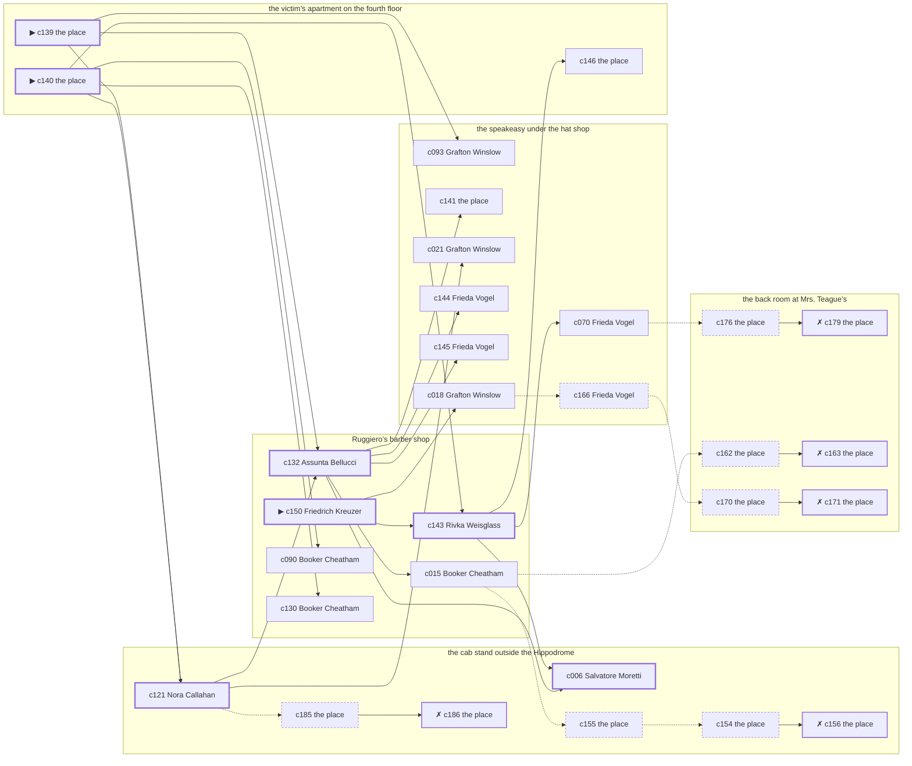

# Little Italy — case 15

**Seed** 15 · **Difficulty** 2 · **Attempts** 1 · **Detective** Humphrey

**Par** 6 actions · **Budget** 20 · **Slack** 14 · **Findable** 30 (spine 7, corroboration 11, noise 7 + 5 disqualifiers) · **Noise ratio** 40% · **Candidate pool** 187

## 1. The Truth

Rivka Weisglass, a seamstress, the victim’s tenant, killed Ellsworth Havemeyer, the landlord of three tenements on Ninth Avenue, with a gunshot at the victim’s apartment on the fourth floor at 11:00 PM. Rivka Weisglass wanted the victim out of a lease (property). Rivka Weisglass had been at the speakeasy under the hat shop earlier in the evening, where the weapon lived, and was alone with Ellsworth Havemeyer when it happened. Friedrich Kreuzer hired us.

## 2. Dramatis Personae

| Name | Role | Relationship | Class of secret | Motive | Found at | Killer |
| --- | --- | --- | --- | --- | --- | --- |
| Ellsworth Havemeyer | the landlord of three tenements on Ninth Avenue | the victim | — | — | — | — |
| Salvatore Moretti | a doorman at a club with no sign on it | a witness against the people the victim worked for | fence | — | the cab stand outside the Hippodrome | — |
| Booker Cheatham | a tailor | the victim’s neighbour across the airshaft | hidden-family | — | Ruggiero’s barber shop | — |
| Grafton Winslow | a society columnist | the victim’s rival in trade | affair | — | the speakeasy under the hat shop | — |
| Rivka Weisglass | a seamstress | the victim’s tenant | murder (+ union-organizing) | property | Ruggiero’s barber shop | **YES** |
| Assunta Bellucci | a widow with rooms on the avenue | named in the victim’s will | affair | inheritance | Ruggiero’s barber shop | — |
| Friedrich Kreuzer (client) | an insurance adjuster | a witness against the people the victim worked for | gambling-debt | — | Ruggiero’s barber shop | — |
| Martin Feeney | the man behind the counter | fixture (counterman) | — | — | Ruggiero’s barber shop | — |
| Klara Lindemann | the landlady | fixture (landlady) | — | — | the back room at Mrs. Teague’s | — |
| Frieda Vogel | the bartender | fixture (bartender) | — | — | the speakeasy under the hat shop | — |
| Nora Callahan | the hackman on the stand | fixture (cabbie) | — | — | the cab stand outside the Hippodrome | — |

## 3. Places

- **Ruggiero’s barber shop** (semi) — watched by counterman (Martin Feeney); objects: an ice pick, a folded stack of evening papers
- **the back room at Mrs. Teague’s** (private) — watched by landlady (Klara Lindemann); objects: a framed photograph, a length of sash cord
- **the speakeasy under the hat shop** (semi) — watched by bartender (Frieda Vogel); objects: a nickel-plated revolver, a seltzer siphon, a bottle of chloral drops, a silver cigarette case — where the weapon lived; within earshot of the scene
- **the cab stand outside the Hippodrome** (public) — watched by cabbie (Nora Callahan); objects: a pasted-up timetable
- **the El platform at Twenty-Third Street** (public) — unwatched; objects: none — within earshot of the scene
- **the victim’s apartment on the fourth floor** (private) — unwatched; objects: a japanned cash box, a bronze bookend — **THE SCENE**; the victim’s address

## 4. Anchors

The coroner gives 10:00 PM–11:30 PM, four ticks wide. These are what close it: **drunk-singing** and **el-train**.

- **the drunk singing under the window** — at 10:30 PM; at the speakeasy under the hat shop. You can time things by it: the same two verses until somebody threw a shoe. Only those present know that it was a shoe, and it was thrown by a woman, and it did not land.
- **the El going over** — at 6:00 PM, 7:00 PM, 8:00 PM, 9:00 PM, 10:00 PM, 11:00 PM; across the whole neighbourhood. You can time things by it: everything under the structure stops being audible for twenty seconds.

## 5. Timelines

### Ellsworth Havemeyer — the victim

| Tick | Time | Truth | Claimed | Companion claimed |
| --- | --- | --- | --- | --- |
| 0 | 6:00 PM | Ruggiero’s barber shop | Ruggiero’s barber shop | — |
| 1 | 6:30 PM | Ruggiero’s barber shop | Ruggiero’s barber shop | — |
| 2 | 7:00 PM | Ruggiero’s barber shop | Ruggiero’s barber shop | — |
| 3 | 7:30 PM | Ruggiero’s barber shop | Ruggiero’s barber shop | — |
| 4 | 8:00 PM | Ruggiero’s barber shop | Ruggiero’s barber shop | — |
| 5 | 8:30 PM | Ruggiero’s barber shop | Ruggiero’s barber shop | — |
| 6 | 9:00 PM | Ruggiero’s barber shop | Ruggiero’s barber shop | — |
| 7 | 9:30 PM | Ruggiero’s barber shop | Ruggiero’s barber shop | — |
| 8 | 10:00 PM | Ruggiero’s barber shop | Ruggiero’s barber shop | — |
| 9 | 10:30 PM | the speakeasy under the hat shop | the speakeasy under the hat shop | — |
| 10 | 11:00 PM | the victim’s apartment on the fourth floor ☠ | the victim’s apartment on the fourth floor | — |
| 11 | 11:30 PM | — | — | — |

### Salvatore Moretti

| Tick | Time | Truth | Claimed | Companion claimed |
| --- | --- | --- | --- | --- |
| 0 | 6:00 PM | the cab stand outside the Hippodrome | the cab stand outside the Hippodrome | — |
| 1 | 6:30 PM | the cab stand outside the Hippodrome | the cab stand outside the Hippodrome | — |
| 2 | 7:00 PM | the back room at Mrs. Teague’s | the back room at Mrs. Teague’s | — |
| 3 | 7:30 PM | the cab stand outside the Hippodrome | the cab stand outside the Hippodrome | — |
| 4 | 8:00 PM | the cab stand outside the Hippodrome | the cab stand outside the Hippodrome | — |
| 5 | 8:30 PM | the back room at Mrs. Teague’s | the back room at Mrs. Teague’s | — |
| 6 | 9:00 PM | the El platform at Twenty-Third Street | the El platform at Twenty-Third Street | — |
| 7 | 9:30 PM | the speakeasy under the hat shop | the speakeasy under the hat shop | — |
| 8 | 10:00 PM | the speakeasy under the hat shop | the speakeasy under the hat shop | — |
| 9 | 10:30 PM | the speakeasy under the hat shop | the speakeasy under the hat shop | — |
| 10 | 11:00 PM | the cab stand outside the Hippodrome | **the speakeasy under the hat shop** | Friedrich Kreuzer |
| 11 | 11:30 PM | the cab stand outside the Hippodrome | the cab stand outside the Hippodrome | — |

### Booker Cheatham

| Tick | Time | Truth | Claimed | Companion claimed |
| --- | --- | --- | --- | --- |
| 0 | 6:00 PM | Ruggiero’s barber shop | Ruggiero’s barber shop | — |
| 1 | 6:30 PM | Ruggiero’s barber shop | Ruggiero’s barber shop | — |
| 2 | 7:00 PM | Ruggiero’s barber shop | Ruggiero’s barber shop | — |
| 3 | 7:30 PM | Ruggiero’s barber shop | Ruggiero’s barber shop | — |
| 4 | 8:00 PM | the back room at Mrs. Teague’s | **the El platform at Twenty-Third Street** | — |
| 5 | 8:30 PM | the back room at Mrs. Teague’s | **the El platform at Twenty-Third Street** | — |
| 6 | 9:00 PM | Ruggiero’s barber shop | Ruggiero’s barber shop | — |
| 7 | 9:30 PM | Ruggiero’s barber shop | Ruggiero’s barber shop | — |
| 8 | 10:00 PM | Ruggiero’s barber shop | Ruggiero’s barber shop | — |
| 9 | 10:30 PM | Ruggiero’s barber shop | Ruggiero’s barber shop | — |
| 10 | 11:00 PM | the cab stand outside the Hippodrome | the cab stand outside the Hippodrome | — |
| 11 | 11:30 PM | the cab stand outside the Hippodrome | the cab stand outside the Hippodrome | — |

### Grafton Winslow

| Tick | Time | Truth | Claimed | Companion claimed |
| --- | --- | --- | --- | --- |
| 0 | 6:00 PM | the El platform at Twenty-Third Street | the El platform at Twenty-Third Street | — |
| 1 | 6:30 PM | the El platform at Twenty-Third Street | the El platform at Twenty-Third Street | — |
| 2 | 7:00 PM | the speakeasy under the hat shop | the speakeasy under the hat shop | — |
| 3 | 7:30 PM | the speakeasy under the hat shop | the speakeasy under the hat shop | — |
| 4 | 8:00 PM | the speakeasy under the hat shop | the speakeasy under the hat shop | — |
| 5 | 8:30 PM | the speakeasy under the hat shop | the speakeasy under the hat shop | — |
| 6 | 9:00 PM | the speakeasy under the hat shop | the speakeasy under the hat shop | — |
| 7 | 9:30 PM | the speakeasy under the hat shop | the speakeasy under the hat shop | — |
| 8 | 10:00 PM | the back room at Mrs. Teague’s | **the cab stand outside the Hippodrome** | — |
| 9 | 10:30 PM | the back room at Mrs. Teague’s | **the cab stand outside the Hippodrome** | — |
| 10 | 11:00 PM | the cab stand outside the Hippodrome | the cab stand outside the Hippodrome | — |
| 11 | 11:30 PM | the speakeasy under the hat shop | the speakeasy under the hat shop | — |

### Rivka Weisglass — the killer

| Tick | Time | Truth | Claimed | Companion claimed |
| --- | --- | --- | --- | --- |
| 0 | 6:00 PM | the cab stand outside the Hippodrome | the cab stand outside the Hippodrome | — |
| 1 | 6:30 PM | the cab stand outside the Hippodrome | the cab stand outside the Hippodrome | — |
| 2 | 7:00 PM | the El platform at Twenty-Third Street | the El platform at Twenty-Third Street | — |
| 3 | 7:30 PM | Ruggiero’s barber shop | **the speakeasy under the hat shop** | Assunta Bellucci |
| 4 | 8:00 PM | Ruggiero’s barber shop | **the speakeasy under the hat shop** | Assunta Bellucci |
| 5 | 8:30 PM | Ruggiero’s barber shop | Ruggiero’s barber shop | — |
| 6 | 9:00 PM | Ruggiero’s barber shop | Ruggiero’s barber shop | — |
| 7 | 9:30 PM | the speakeasy under the hat shop | the speakeasy under the hat shop | — |
| 8 | 10:00 PM | the speakeasy under the hat shop | the speakeasy under the hat shop | — |
| 9 | 10:30 PM | the speakeasy under the hat shop | the speakeasy under the hat shop | — |
| 10 | 11:00 PM | the victim’s apartment on the fourth floor ☠ | **the cab stand outside the Hippodrome** | — |
| 11 | 11:30 PM | the speakeasy under the hat shop | the speakeasy under the hat shop | — |

### Assunta Bellucci

| Tick | Time | Truth | Claimed | Companion claimed |
| --- | --- | --- | --- | --- |
| 0 | 6:00 PM | the speakeasy under the hat shop | the speakeasy under the hat shop | — |
| 1 | 6:30 PM | the speakeasy under the hat shop | the speakeasy under the hat shop | — |
| 2 | 7:00 PM | Ruggiero’s barber shop | Ruggiero’s barber shop | — |
| 3 | 7:30 PM | Ruggiero’s barber shop | Ruggiero’s barber shop | — |
| 4 | 8:00 PM | Ruggiero’s barber shop | Ruggiero’s barber shop | — |
| 5 | 8:30 PM | the cab stand outside the Hippodrome | the cab stand outside the Hippodrome | — |
| 6 | 9:00 PM | the cab stand outside the Hippodrome | the cab stand outside the Hippodrome | — |
| 7 | 9:30 PM | the cab stand outside the Hippodrome | the cab stand outside the Hippodrome | — |
| 8 | 10:00 PM | the back room at Mrs. Teague’s | **Ruggiero’s barber shop** | Grafton Winslow |
| 9 | 10:30 PM | the back room at Mrs. Teague’s | **Ruggiero’s barber shop** | Grafton Winslow |
| 10 | 11:00 PM | the cab stand outside the Hippodrome | the cab stand outside the Hippodrome | — |
| 11 | 11:30 PM | Ruggiero’s barber shop | Ruggiero’s barber shop | — |

### Friedrich Kreuzer

| Tick | Time | Truth | Claimed | Companion claimed |
| --- | --- | --- | --- | --- |
| 0 | 6:00 PM | the El platform at Twenty-Third Street | the El platform at Twenty-Third Street | — |
| 1 | 6:30 PM | the speakeasy under the hat shop | the speakeasy under the hat shop | — |
| 2 | 7:00 PM | the speakeasy under the hat shop | the speakeasy under the hat shop | — |
| 3 | 7:30 PM | the speakeasy under the hat shop | the speakeasy under the hat shop | — |
| 4 | 8:00 PM | the back room at Mrs. Teague’s | the back room at Mrs. Teague’s | — |
| 5 | 8:30 PM | Ruggiero’s barber shop | Ruggiero’s barber shop | — |
| 6 | 9:00 PM | Ruggiero’s barber shop | Ruggiero’s barber shop | — |
| 7 | 9:30 PM | Ruggiero’s barber shop | Ruggiero’s barber shop | — |
| 8 | 10:00 PM | Ruggiero’s barber shop | Ruggiero’s barber shop | — |
| 9 | 10:30 PM | the cab stand outside the Hippodrome | **Ruggiero’s barber shop** | — |
| 10 | 11:00 PM | the cab stand outside the Hippodrome | **Ruggiero’s barber shop** | — |
| 11 | 11:30 PM | the cab stand outside the Hippodrome | the cab stand outside the Hippodrome | — |

### Fixtures (never lie, never withhold)

| Tick | Time | Martin Feeney (the man behind the counter) | Klara Lindemann (the landlady) | Frieda Vogel (the bartender) | Nora Callahan (the hackman on the stand) |
| --- | --- | --- | --- | --- | --- |
| 0 | 6:00 PM | Ruggiero’s barber shop | the back room at Mrs. Teague’s | the speakeasy under the hat shop | the cab stand outside the Hippodrome |
| 1 | 6:30 PM | Ruggiero’s barber shop | the back room at Mrs. Teague’s | the speakeasy under the hat shop | the cab stand outside the Hippodrome |
| 2 | 7:00 PM | Ruggiero’s barber shop | the back room at Mrs. Teague’s | the speakeasy under the hat shop | the cab stand outside the Hippodrome |
| 3 | 7:30 PM | Ruggiero’s barber shop | the back room at Mrs. Teague’s | the speakeasy under the hat shop | the cab stand outside the Hippodrome |
| 4 | 8:00 PM | Ruggiero’s barber shop | the back room at Mrs. Teague’s | the speakeasy under the hat shop | the cab stand outside the Hippodrome |
| 5 | 8:30 PM | Ruggiero’s barber shop | the back room at Mrs. Teague’s | the El platform at Twenty-Third Street | the cab stand outside the Hippodrome |
| 6 | 9:00 PM | Ruggiero’s barber shop | the back room at Mrs. Teague’s | the speakeasy under the hat shop | the cab stand outside the Hippodrome |
| 7 | 9:30 PM | Ruggiero’s barber shop | the back room at Mrs. Teague’s | the speakeasy under the hat shop | Ruggiero’s barber shop |
| 8 | 10:00 PM | Ruggiero’s barber shop | the back room at Mrs. Teague’s | the speakeasy under the hat shop | the cab stand outside the Hippodrome |
| 9 | 10:30 PM | Ruggiero’s barber shop | the back room at Mrs. Teague’s | the speakeasy under the hat shop | the cab stand outside the Hippodrome |
| 10 | 11:00 PM | Ruggiero’s barber shop | the back room at Mrs. Teague’s | the speakeasy under the hat shop | the cab stand outside the Hippodrome |
| 11 | 11:30 PM | Ruggiero’s barber shop | the back room at Mrs. Teague’s | the speakeasy under the hat shop | the cab stand outside the Hippodrome |

## 6. Secrets in play

- **Salvatore Moretti** (fence): Salvatore Moretti hands a parcel of stolen goods to a man at the cab stand outside the Hippodrome from 11:00 PM.
- **Booker Cheatham** (hidden-family): Booker Cheatham goes to the back room at Mrs. Teague’s from 8:00 PM to 8:30 PM to see a child nobody is supposed to know about.
- **Grafton Winslow** (affair): Grafton Winslow is with Assunta Bellucci at the back room at Mrs. Teague’s from 10:00 PM to 10:30 PM, and both will say they were somewhere else.
- **Rivka Weisglass** (murder): Rivka Weisglass is at the victim’s apartment on the fourth floor from 11:00 PM, alone with Ellsworth Havemeyer when it happens at 11:00 PM.
- **Rivka Weisglass** also (union-organizing): Rivka Weisglass is at Ruggiero’s barber shop from 7:30 PM to 8:00 PM signing men up, which is a firing offence and worse.
- **Assunta Bellucci** (affair): Assunta Bellucci is with Grafton Winslow at the back room at Mrs. Teague’s from 10:00 PM to 10:30 PM, and both will say they were somewhere else.
- **Friedrich Kreuzer** (gambling-debt): Friedrich Kreuzer slips off to the cab stand outside the Hippodrome from 10:30 PM to 11:00 PM to settle with a bookmaker.

## 7. Clue list — the 30 findable

The opening three, free at the start: c139, c140, c150. Everything else has to be led to. The full candidate pool is in the companion file.

### At Ruggiero’s barber shop

- **c150** [spine ⟨opening⟩] (client; Friedrich Kreuzer on why I was hired) → c143, c018
  - Friedrich Kreuzer hired us. Friedrich Kreuzer wants it known that Rivka Weisglass wanted the victim out of a lease, and would rather we started there.
  - _establishes: Rivka Weisglass had a motive (property)_
- **c143** [spine] (anchor; Rivka Weisglass on Ellsworth Havemeyer that evening) → c006, c146, c070
  - Rivka Weisglass puts Ellsworth Havemeyer at the speakeasy under the hat shop while the singing was still going on, which was 10:30 PM, and alive enough to argue about the weather.
  - _establishes: the victim alive at 10:30 PM; Ellsworth Havemeyer at the speakeasy under the hat shop, 10:30 PM_
- **c132** [spine] (observation; Assunta Bellucci on Rivka Weisglass’s account) → c006, c141, c144, c145, c015
  - Assunta Bellucci was at the cab stand outside the Hippodrome at 11:00 PM and says Rivka Weisglass was not.
  - _establishes: Rivka Weisglass not at the cab stand outside the Hippodrome, 11:00 PM_
- **c090** [corroboration] (observation; Booker Cheatham on who was there at 11:00 PM) → (end)
  - Booker Cheatham runs through it: at 11:00 PM there were Salvatore Moretti, Grafton Winslow, Assunta Bellucci, Friedrich Kreuzer at the cab stand outside the Hippodrome, and nobody else worth naming.
  - _establishes: Salvatore Moretti at the cab stand outside the Hippodrome, 11:00 PM; Grafton Winslow at the cab stand outside the Hippodrome, 11:00 PM; Assunta Bellucci at the cab stand outside the Hippodrome, 11:00 PM; Friedrich Kreuzer at the cab stand outside the Hippodrome, 11:00 PM_
- **c130** [corroboration] (observation; Booker Cheatham on Rivka Weisglass’s account) → (end)
  - Booker Cheatham was at the cab stand outside the Hippodrome at 11:00 PM and says Rivka Weisglass was not.
  - _establishes: Rivka Weisglass not at the cab stand outside the Hippodrome, 11:00 PM_
- **c015** [corroboration] (observation; Booker Cheatham on Assunta Bellucci) → c155, c162
  - Booker Cheatham says Assunta Bellucci was at the cab stand outside the Hippodrome at 11:00 PM.
  - _establishes: Assunta Bellucci at the cab stand outside the Hippodrome, 11:00 PM_

### At the back room at Mrs. Teague’s

- **c176** [noise {b2}] (physical; the place itself) → c179
  - Two glasses at the back room at Mrs. Teague’s, one of them with a lip print on it, and only one of them paid for.
  - _establishes: context only_
- **c179** [disqualifier {b2}] (overheard; the place itself) → (end)
  - Grafton Winslow breaks and says it plainly: Grafton Winslow was with Assunta Bellucci at the back room at Mrs. Teague’s for the whole of it, from 10:00 PM to 10:30 PM, and it is a marriage they are hiding, not a killing.
  - _establishes: Assunta Bellucci’s affair accounted for; Assunta Bellucci at the back room at Mrs. Teague’s, 10:00 PM–10:30 PM_
- **c162** [noise {b4}] (physical; the place itself) → c163
  - A child’s shoe at the back room at Mrs. Teague’s, and nobody at the back room at Mrs. Teague’s has any children.
  - _establishes: context only_
- **c163** [disqualifier {b4}] (overheard; the place itself) → (end)
  - The woman who keeps the child says it straight out: Booker Cheatham was at the back room at Mrs. Teague’s from 8:00 PM to 8:30 PM, the same as every week, and left with the same face as always.
  - _establishes: Booker Cheatham’s hidden-family accounted for; Booker Cheatham at the back room at Mrs. Teague’s, 8:00 PM–8:30 PM_
- **c170** [noise {b5}] (physical; the place itself) → c171
  - A man’s hat at the back room at Mrs. Teague’s that fits nobody who admits to being there.
  - _establishes: context only_
- **c171** [disqualifier {b5}] (overheard; the place itself) → (end)
  - Assunta Bellucci breaks and says it plainly: Assunta Bellucci was with Grafton Winslow at the back room at Mrs. Teague’s for the whole of it, from 10:00 PM to 10:30 PM, and it is a marriage they are hiding, not a killing.
  - _establishes: Grafton Winslow’s affair accounted for; Grafton Winslow at the back room at Mrs. Teague’s, 10:00 PM–10:30 PM_

### At the speakeasy under the hat shop

- **c093** [corroboration] (observation; Grafton Winslow on who was there at 11:00 PM) → (end)
  - Grafton Winslow runs through it: at 11:00 PM there were Salvatore Moretti, Booker Cheatham, Assunta Bellucci, Friedrich Kreuzer at the cab stand outside the Hippodrome, and nobody else worth naming.
  - _establishes: Salvatore Moretti at the cab stand outside the Hippodrome, 11:00 PM; Booker Cheatham at the cab stand outside the Hippodrome, 11:00 PM; Assunta Bellucci at the cab stand outside the Hippodrome, 11:00 PM; Friedrich Kreuzer at the cab stand outside the Hippodrome, 11:00 PM_
- **c141** [corroboration] (physical; the place itself) → (end)
  - A nickel-plated revolver is gone from the speakeasy under the hat shop. The drawer it was kept in is open and the oiled cloth is still in it.
  - _establishes: something gone from the speakeasy under the hat shop; how it was done_
- **c021** [corroboration] (observation; Grafton Winslow on Rivka Weisglass) → (end)
  - Grafton Winslow says Rivka Weisglass was at the speakeasy under the hat shop at 9:30 PM.
  - _establishes: Rivka Weisglass at the speakeasy under the hat shop, 9:30 PM; Rivka Weisglass could reach the weapon_
- **c144** [corroboration] (anchor; Frieda Vogel on Ellsworth Havemeyer that evening) → (end)
  - Frieda Vogel puts Ellsworth Havemeyer at the speakeasy under the hat shop while the singing was still going on, which was 10:30 PM, and alive enough to argue about the weather.
  - _establishes: the victim alive at 10:30 PM; Ellsworth Havemeyer at the speakeasy under the hat shop, 10:30 PM_
- **c145** [corroboration] (anchor; Frieda Vogel on the noise that evening) → (end)
  - Frieda Vogel was at the speakeasy under the hat shop at 11:00 PM and heard a shot from the direction of the victim’s apartment on the fourth floor, just as the El went over.
  - _establishes: noise at the victim’s apartment on the fourth floor at 11:00 PM; the victim dead by 11:00 PM; how it was done_
- **c070** [corroboration] (observation; Frieda Vogel on Rivka Weisglass) → c176
  - Frieda Vogel says Rivka Weisglass was at the speakeasy under the hat shop from 9:30 PM to 10:30 PM.
  - _establishes: Rivka Weisglass at the speakeasy under the hat shop, 9:30 PM–10:30 PM; Rivka Weisglass could reach the weapon_
- **c018** [corroboration] (observation; Grafton Winslow on Salvatore Moretti) → c166
  - Grafton Winslow says Salvatore Moretti was at the speakeasy under the hat shop at 9:30 PM.
  - _establishes: Salvatore Moretti at the speakeasy under the hat shop, 9:30 PM; Salvatore Moretti could reach the weapon_
- **c166** [noise {b5}] (overheard; Frieda Vogel on Grafton Winslow) → c170
  - Frieda Vogel on Grafton Winslow: Somebody asked Grafton Winslow a plain question about the evening and got three different answers.
  - _establishes: context only_

### At the cab stand outside the Hippodrome

- **c121** [spine] (observation; Nora Callahan on who was there at 11:00 PM) → c132, c021, c185
  - Nora Callahan runs through it: at 11:00 PM there were Salvatore Moretti, Booker Cheatham, Grafton Winslow, Assunta Bellucci, Friedrich Kreuzer at the cab stand outside the Hippodrome, and nobody else worth naming.
  - _establishes: Salvatore Moretti at the cab stand outside the Hippodrome, 11:00 PM; Booker Cheatham at the cab stand outside the Hippodrome, 11:00 PM; Grafton Winslow at the cab stand outside the Hippodrome, 11:00 PM; Assunta Bellucci at the cab stand outside the Hippodrome, 11:00 PM; Friedrich Kreuzer at the cab stand outside the Hippodrome, 11:00 PM_
- **c006** [spine] (observation; Salvatore Moretti on Rivka Weisglass) → (end)
  - Salvatore Moretti says Rivka Weisglass was at the speakeasy under the hat shop from 9:30 PM to 10:30 PM.
  - _establishes: Rivka Weisglass at the speakeasy under the hat shop, 9:30 PM–10:30 PM; Rivka Weisglass could reach the weapon_
- **c155** [noise {b1}] (physical; the place itself) → c154
  - A pawn ticket at the cab stand outside the Hippodrome in a name that does not exist, made out at the hour in question.
  - _establishes: context only_
- **c154** [noise {b1}] (physical; the place itself) → c156
  - Wrapping paper and a cut string at the cab stand outside the Hippodrome, and the shop it came from closed two years ago.
  - _establishes: context only_
- **c156** [disqualifier {b1}] (overheard; the place itself) → (end)
  - The receiver at the cab stand outside the Hippodrome would rather talk than be held: Salvatore Moretti was there from 11:00 PM handing over a parcel of somebody else’s silver, which is a charge Salvatore Moretti will take over this one.
  - _establishes: Salvatore Moretti’s fence accounted for; Salvatore Moretti at the cab stand outside the Hippodrome, 11:00 PM_
- **c185** [noise {b3}] (physical; the place itself) → c186
  - A book of markers at the cab stand outside the Hippodrome with Friedrich Kreuzer’s initials against four of them.
  - _establishes: context only_
- **c186** [disqualifier {b3}] (overheard; the place itself) → (end)
  - The bookmaker’s runner is found and will say it: Friedrich Kreuzer was at the cab stand outside the Hippodrome from 10:30 PM to 11:00 PM paying off eleven hundred dollars, a dollar at a time, and went nowhere near the killing.
  - _establishes: Friedrich Kreuzer’s gambling-debt accounted for; Friedrich Kreuzer at the cab stand outside the Hippodrome, 10:30 PM–11:00 PM_

### At the victim’s apartment on the fourth floor

- **c139** [spine ⟨opening⟩] (scene; the place itself) → c121, c132, c093
  - Ellsworth Havemeyer was found at the victim’s apartment on the fourth floor. The cigarette he had going burned itself out on the sill where it fell. The El going over came at 11:00 PM, and the El was running to timetable and it covers the half hour exactly. That puts the killing in that half hour and no later.
  - _establishes: the victim dead by 11:00 PM; how it was done_
- **c140** [spine ⟨opening⟩] (morgue; the place itself) → c121, c143, c090, c130
  - The coroner puts death between 10:00 PM and 11:30 PM — two hours of nothing useful. One bullet below the sternum. Powder burns on the shirt front: fired close.
  - _establishes: death between 10:00 PM and 11:30 PM; how it was done_
- **c146** [corroboration] (document; the place itself) → (end)
  - Found at the victim’s apartment on the fourth floor: A lease assignment made out in Rivka Weisglass’s name, waiting only on Ellsworth Havemeyer’s signature.
  - _establishes: Rivka Weisglass had a motive (property)_

## 8. Clue graph

## 9. Deduction path

Par is **6 actions** against a budget of 20: 14 spare. Every id below is a spine clue.

**Time of death.** The coroner gives four ticks. The anchors close it to 11:00 PM: one puts Ellsworth Havemeyer alive at 10:30 PM, the other times the scene at 11:00 PM. _(c140, c143, c139; + 2 corroborating)_

**Clearing the innocent.**

- Salvatore Moretti was not at the victim’s apartment on the fourth floor at 11:00 PM, on two independent sources. _(c121; + 3 corroborating)_
- Booker Cheatham was not at the victim’s apartment on the fourth floor at 11:00 PM, on two independent sources. _(c121; + 1 corroborating)_
- Grafton Winslow was not at the victim’s apartment on the fourth floor at 11:00 PM, on two independent sources. _(c121; + 1 corroborating)_
- Assunta Bellucci was not at the victim’s apartment on the fourth floor at 11:00 PM, on two independent sources. _(c121; + 3 corroborating)_
- Friedrich Kreuzer was not at the victim’s apartment on the fourth floor at 11:00 PM, on two independent sources. _(c121; + 3 corroborating)_

**Naming the killer.** Rivka Weisglass claims the cab stand outside the Hippodrome at 11:00 PM. Two independent sources put that out of the question. _(c132; + 1 corroborating)_

**The weapon.** Rivka Weisglass was at the speakeasy under the hat shop before 11:00 PM, where a nickel-plated revolver was kept. _(c006; + 2 corroborating)_

**Method.** A gunshot, on two physical sources. _(c139, c140; + 2 corroborating)_

**Motive.** property, on two independent sources. _(c150; + 1 corroborating)_

## 10. Red herrings

**Innocents who lie about the murder tick:**

- Salvatore Moretti claims the speakeasy under the hat shop at 11:00 PM and was really at the cab stand outside the Hippodrome. Reason: Salvatore Moretti hands a parcel of stolen goods to a man at the cab stand outside the Hippodrome from 11:00 PM.
- Friedrich Kreuzer claims Ruggiero’s barber shop at 11:00 PM and was really at the cab stand outside the Hippodrome. Reason: Friedrich Kreuzer slips off to the cab stand outside the Hippodrome from 10:30 PM to 11:00 PM to settle with a bookmaker.

**Innocents with a motive:**

- Assunta Bellucci — inheritance: stands to inherit.

**Noise branches, and what knocks each one down:**

- **b1** (Salvatore Moretti, fence): c155 → c154 → **c156** — The receiver at the cab stand outside the Hippodrome would rather talk than be held: Salvatore Moretti was there from 11:00 PM handing over a parcel of somebody else’s silver, which is a charge Salvatore Moretti will take over this one.
- **b2** (Assunta Bellucci, affair): c176 → **c179** — Grafton Winslow breaks and says it plainly: Grafton Winslow was with Assunta Bellucci at the back room at Mrs. Teague’s for the whole of it, from 10:00 PM to 10:30 PM, and it is a marriage they are hiding, not a killing.
- **b3** (Friedrich Kreuzer, gambling-debt): c185 → **c186** — The bookmaker’s runner is found and will say it: Friedrich Kreuzer was at the cab stand outside the Hippodrome from 10:30 PM to 11:00 PM paying off eleven hundred dollars, a dollar at a time, and went nowhere near the killing.
- **b4** (Booker Cheatham, hidden-family): c162 → **c163** — The woman who keeps the child says it straight out: Booker Cheatham was at the back room at Mrs. Teague’s from 8:00 PM to 8:30 PM, the same as every week, and left with the same face as always.
- **b5** (Grafton Winslow, affair): c166 → c170 → **c171** — Assunta Bellucci breaks and says it plainly: Assunta Bellucci was with Grafton Winslow at the back room at Mrs. Teague’s for the whole of it, from 10:00 PM to 10:30 PM, and it is a marriage they are hiding, not a killing.

