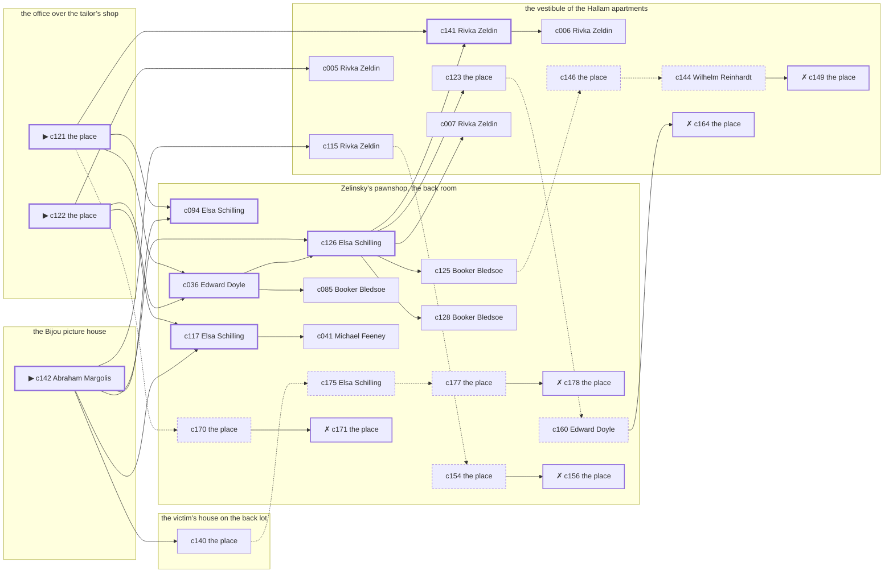

# the Gas House District — case 16

**Seed** 16 · **Difficulty** 2 · **Attempts** 1 · **Detective** Humphrey

**Par** 7 actions · **Budget** 20 · **Slack** 13 · **Findable** 30 (spine 8, corroboration 10, noise 7 + 5 disqualifiers) · **Noise ratio** 40% · **Candidate pool** 179

## 1. The Truth

Michael Feeney, a curb broker, in the victim’s debt, killed Karl Brauer, a buildings inspector, with a gunshot at the office over the tailor’s shop at 10:00 PM. Michael Feeney was about to be exposed by the victim (exposure). Michael Feeney had been at the vestibule of the Hallam apartments earlier in the evening, where the weapon lived, and was alone with Karl Brauer when it happened. Abraham Margolis hired us.

## 2. Dramatis Personae

| Name | Role | Relationship | Class of secret | Motive | Found at | Killer |
| --- | --- | --- | --- | --- | --- | --- |
| Karl Brauer | a buildings inspector | the victim | — | — | — | — |
| Rivka Zeldin | a switchboard operator | the victim’s tenant | affair | — | the vestibule of the Hallam apartments | — |
| Fannie Feldman | a chambermaid | the victim’s tenant | fence | revenge | the El platform at Twenty-Third Street | — |
| Booker Bledsoe | a dentist with rooms on the third floor | in the victim’s debt | affair | — | Zelinsky’s pawnshop, the back room | — |
| Edward Doyle | a doorman at a club with no sign on it | in the victim’s debt | fence | debt | Zelinsky’s pawnshop, the back room | — |
| Michael Feeney | a curb broker | in the victim’s debt | murder (+ gambling-debt) | exposure | Zelinsky’s pawnshop, the back room | **YES** |
| Abraham Margolis (client) | the victim’s nephew, at loose ends | the victim’s brother-in-law | gambling-debt | — | the Bijou picture house | — |
| Elsa Schilling | the man behind the counter | fixture (counterman) | — | — | Zelinsky’s pawnshop, the back room | — |
| Wilhelm Reinhardt | the elevator man | fixture (elevator-man) | — | — | the vestibule of the Hallam apartments | — |
| Gittel Hurwitz | the ticket-taker | fixture (ticket-taker) | — | — | the Bijou picture house | — |
| Rutherford Stannard | the patrolman on the beat | fixture (beat-cop) | — | — | the Bijou picture house | — |

## 3. Places

- **Zelinsky’s pawnshop, the back room** (semi) — watched by counterman (Elsa Schilling); objects: a silver cigarette case, a bronze bookend — within earshot of the scene
- **the office over the tailor’s shop** (private) — unwatched; objects: a japanned cash box, an Underwood typewriter — **THE SCENE**
- **the vestibule of the Hallam apartments** (private) — watched by elevator-man (Wilhelm Reinhardt); objects: a nickel-plated revolver, a day ledger, a camel-hair overcoat on a hook — where the weapon lived
- **the Bijou picture house** (public) — watched by ticket-taker (Gittel Hurwitz); objects: a standing ashtray, a length of sash cord
- **the victim’s house on the back lot** (private) — unwatched; objects: the roof-door key, a mechanic’s toolbox — the victim’s address
- **the El platform at Twenty-Third Street** (public) — unwatched; objects: a pasted-up timetable, a folded stack of evening papers — within earshot of the scene

## 4. Anchors

The coroner gives 9:30 PM–11:00 PM, four ticks wide. These are what close it: **ice-delivery** and **steam-whistle**.

- **the ice being brought in** — at 9:30 PM; at Zelinsky’s pawnshop, the back room. Somebody reliable notes who was there. Those present carry it: a wet patch down one side of a coat.
- **the whistle off the river** — at 6:00 PM, 8:00 PM, 10:00 PM; across the whole neighbourhood. You can time things by it: two long and one short, and you can hear it a mile inland.
- **the beat cop’s pass** — at 7:00 PM, 8:30 PM, 10:00 PM, 11:30 PM; on a round through the Bijou picture house → Zelinsky’s pawnshop, the back room → the El platform at Twenty-Third Street. Somebody reliable notes who was there.

## 5. Timelines

### Karl Brauer — the victim

| Tick | Time | Truth | Claimed | Companion claimed |
| --- | --- | --- | --- | --- |
| 0 | 6:00 PM | the Bijou picture house | the Bijou picture house | — |
| 1 | 6:30 PM | the Bijou picture house | the Bijou picture house | — |
| 2 | 7:00 PM | the Bijou picture house | the Bijou picture house | — |
| 3 | 7:30 PM | the Bijou picture house | the Bijou picture house | — |
| 4 | 8:00 PM | the El platform at Twenty-Third Street | the El platform at Twenty-Third Street | — |
| 5 | 8:30 PM | the El platform at Twenty-Third Street | the El platform at Twenty-Third Street | — |
| 6 | 9:00 PM | the office over the tailor’s shop | the office over the tailor’s shop | — |
| 7 | 9:30 PM | Zelinsky’s pawnshop, the back room | Zelinsky’s pawnshop, the back room | — |
| 8 | 10:00 PM | the office over the tailor’s shop ☠ | the office over the tailor’s shop | — |
| 9 | 10:30 PM | — | — | — |
| 10 | 11:00 PM | — | — | — |
| 11 | 11:30 PM | — | — | — |

### Rivka Zeldin

| Tick | Time | Truth | Claimed | Companion claimed |
| --- | --- | --- | --- | --- |
| 0 | 6:00 PM | the vestibule of the Hallam apartments | the vestibule of the Hallam apartments | — |
| 1 | 6:30 PM | the vestibule of the Hallam apartments | the vestibule of the Hallam apartments | — |
| 2 | 7:00 PM | the El platform at Twenty-Third Street | the El platform at Twenty-Third Street | — |
| 3 | 7:30 PM | Zelinsky’s pawnshop, the back room | Zelinsky’s pawnshop, the back room | — |
| 4 | 8:00 PM | Zelinsky’s pawnshop, the back room | Zelinsky’s pawnshop, the back room | — |
| 5 | 8:30 PM | the victim’s house on the back lot | the victim’s house on the back lot | — |
| 6 | 9:00 PM | Zelinsky’s pawnshop, the back room | Zelinsky’s pawnshop, the back room | — |
| 7 | 9:30 PM | Zelinsky’s pawnshop, the back room | Zelinsky’s pawnshop, the back room | — |
| 8 | 10:00 PM | Zelinsky’s pawnshop, the back room | Zelinsky’s pawnshop, the back room | — |
| 9 | 10:30 PM | the vestibule of the Hallam apartments | **Zelinsky’s pawnshop, the back room** | — |
| 10 | 11:00 PM | the vestibule of the Hallam apartments | **Zelinsky’s pawnshop, the back room** | — |
| 11 | 11:30 PM | the vestibule of the Hallam apartments | **Zelinsky’s pawnshop, the back room** | — |

### Fannie Feldman

| Tick | Time | Truth | Claimed | Companion claimed |
| --- | --- | --- | --- | --- |
| 0 | 6:00 PM | the El platform at Twenty-Third Street | the El platform at Twenty-Third Street | — |
| 1 | 6:30 PM | the victim’s house on the back lot | the victim’s house on the back lot | — |
| 2 | 7:00 PM | Zelinsky’s pawnshop, the back room | Zelinsky’s pawnshop, the back room | — |
| 3 | 7:30 PM | Zelinsky’s pawnshop, the back room | Zelinsky’s pawnshop, the back room | — |
| 4 | 8:00 PM | the El platform at Twenty-Third Street | the El platform at Twenty-Third Street | — |
| 5 | 8:30 PM | the El platform at Twenty-Third Street | the El platform at Twenty-Third Street | — |
| 6 | 9:00 PM | the El platform at Twenty-Third Street | the El platform at Twenty-Third Street | — |
| 7 | 9:30 PM | the El platform at Twenty-Third Street | the El platform at Twenty-Third Street | — |
| 8 | 10:00 PM | Zelinsky’s pawnshop, the back room | **the El platform at Twenty-Third Street** | — |
| 9 | 10:30 PM | Zelinsky’s pawnshop, the back room | **the El platform at Twenty-Third Street** | — |
| 10 | 11:00 PM | the vestibule of the Hallam apartments | the vestibule of the Hallam apartments | — |
| 11 | 11:30 PM | Zelinsky’s pawnshop, the back room | Zelinsky’s pawnshop, the back room | — |

### Booker Bledsoe

| Tick | Time | Truth | Claimed | Companion claimed |
| --- | --- | --- | --- | --- |
| 0 | 6:00 PM | Zelinsky’s pawnshop, the back room | Zelinsky’s pawnshop, the back room | — |
| 1 | 6:30 PM | Zelinsky’s pawnshop, the back room | Zelinsky’s pawnshop, the back room | — |
| 2 | 7:00 PM | Zelinsky’s pawnshop, the back room | Zelinsky’s pawnshop, the back room | — |
| 3 | 7:30 PM | Zelinsky’s pawnshop, the back room | Zelinsky’s pawnshop, the back room | — |
| 4 | 8:00 PM | Zelinsky’s pawnshop, the back room | Zelinsky’s pawnshop, the back room | — |
| 5 | 8:30 PM | Zelinsky’s pawnshop, the back room | Zelinsky’s pawnshop, the back room | — |
| 6 | 9:00 PM | Zelinsky’s pawnshop, the back room | Zelinsky’s pawnshop, the back room | — |
| 7 | 9:30 PM | Zelinsky’s pawnshop, the back room | Zelinsky’s pawnshop, the back room | — |
| 8 | 10:00 PM | Zelinsky’s pawnshop, the back room | Zelinsky’s pawnshop, the back room | — |
| 9 | 10:30 PM | the vestibule of the Hallam apartments | **the Bijou picture house** | — |
| 10 | 11:00 PM | the vestibule of the Hallam apartments | **the Bijou picture house** | — |
| 11 | 11:30 PM | the vestibule of the Hallam apartments | **the Bijou picture house** | — |

### Edward Doyle

| Tick | Time | Truth | Claimed | Companion claimed |
| --- | --- | --- | --- | --- |
| 0 | 6:00 PM | the El platform at Twenty-Third Street | the El platform at Twenty-Third Street | — |
| 1 | 6:30 PM | the Bijou picture house | the Bijou picture house | — |
| 2 | 7:00 PM | the vestibule of the Hallam apartments | the vestibule of the Hallam apartments | — |
| 3 | 7:30 PM | the office over the tailor’s shop | the office over the tailor’s shop | — |
| 4 | 8:00 PM | the El platform at Twenty-Third Street | the El platform at Twenty-Third Street | — |
| 5 | 8:30 PM | the El platform at Twenty-Third Street | the El platform at Twenty-Third Street | — |
| 6 | 9:00 PM | Zelinsky’s pawnshop, the back room | Zelinsky’s pawnshop, the back room | — |
| 7 | 9:30 PM | Zelinsky’s pawnshop, the back room | **the Bijou picture house** | Rivka Zeldin |
| 8 | 10:00 PM | Zelinsky’s pawnshop, the back room | **the Bijou picture house** | Rivka Zeldin |
| 9 | 10:30 PM | Zelinsky’s pawnshop, the back room | Zelinsky’s pawnshop, the back room | — |
| 10 | 11:00 PM | Zelinsky’s pawnshop, the back room | Zelinsky’s pawnshop, the back room | — |
| 11 | 11:30 PM | the vestibule of the Hallam apartments | the vestibule of the Hallam apartments | — |

### Michael Feeney — the killer

| Tick | Time | Truth | Claimed | Companion claimed |
| --- | --- | --- | --- | --- |
| 0 | 6:00 PM | the vestibule of the Hallam apartments | the vestibule of the Hallam apartments | — |
| 1 | 6:30 PM | the vestibule of the Hallam apartments | the vestibule of the Hallam apartments | — |
| 2 | 7:00 PM | the vestibule of the Hallam apartments | the vestibule of the Hallam apartments | — |
| 3 | 7:30 PM | Zelinsky’s pawnshop, the back room | **the El platform at Twenty-Third Street** | — |
| 4 | 8:00 PM | Zelinsky’s pawnshop, the back room | **the El platform at Twenty-Third Street** | — |
| 5 | 8:30 PM | Zelinsky’s pawnshop, the back room | Zelinsky’s pawnshop, the back room | — |
| 6 | 9:00 PM | Zelinsky’s pawnshop, the back room | Zelinsky’s pawnshop, the back room | — |
| 7 | 9:30 PM | the office over the tailor’s shop | **Zelinsky’s pawnshop, the back room** | Fannie Feldman |
| 8 | 10:00 PM | the office over the tailor’s shop ☠ | **Zelinsky’s pawnshop, the back room** | Fannie Feldman |
| 9 | 10:30 PM | the El platform at Twenty-Third Street | the El platform at Twenty-Third Street | — |
| 10 | 11:00 PM | the El platform at Twenty-Third Street | the El platform at Twenty-Third Street | — |
| 11 | 11:30 PM | the El platform at Twenty-Third Street | the El platform at Twenty-Third Street | — |

### Abraham Margolis

| Tick | Time | Truth | Claimed | Companion claimed |
| --- | --- | --- | --- | --- |
| 0 | 6:00 PM | the victim’s house on the back lot | the victim’s house on the back lot | — |
| 1 | 6:30 PM | the office over the tailor’s shop | the office over the tailor’s shop | — |
| 2 | 7:00 PM | the Bijou picture house | the Bijou picture house | — |
| 3 | 7:30 PM | the Bijou picture house | the Bijou picture house | — |
| 4 | 8:00 PM | the Bijou picture house | the Bijou picture house | — |
| 5 | 8:30 PM | the Bijou picture house | the Bijou picture house | — |
| 6 | 9:00 PM | the Bijou picture house | the Bijou picture house | — |
| 7 | 9:30 PM | the vestibule of the Hallam apartments | the vestibule of the Hallam apartments | — |
| 8 | 10:00 PM | Zelinsky’s pawnshop, the back room | **the vestibule of the Hallam apartments** | Booker Bledsoe |
| 9 | 10:30 PM | the Bijou picture house | the Bijou picture house | — |
| 10 | 11:00 PM | the El platform at Twenty-Third Street | the El platform at Twenty-Third Street | — |
| 11 | 11:30 PM | the El platform at Twenty-Third Street | the El platform at Twenty-Third Street | — |

### Fixtures (never lie, never withhold)

| Tick | Time | Elsa Schilling (the man behind the counter) | Wilhelm Reinhardt (the elevator man) | Gittel Hurwitz (the ticket-taker) | Rutherford Stannard (the patrolman on the beat) |
| --- | --- | --- | --- | --- | --- |
| 0 | 6:00 PM | Zelinsky’s pawnshop, the back room | the vestibule of the Hallam apartments | the Bijou picture house | — |
| 1 | 6:30 PM | Zelinsky’s pawnshop, the back room | the vestibule of the Hallam apartments | the Bijou picture house | — |
| 2 | 7:00 PM | the El platform at Twenty-Third Street | the vestibule of the Hallam apartments | the Bijou picture house | the Bijou picture house |
| 3 | 7:30 PM | Zelinsky’s pawnshop, the back room | the vestibule of the Hallam apartments | the Bijou picture house | — |
| 4 | 8:00 PM | Zelinsky’s pawnshop, the back room | the vestibule of the Hallam apartments | the Bijou picture house | — |
| 5 | 8:30 PM | Zelinsky’s pawnshop, the back room | the vestibule of the Hallam apartments | the Bijou picture house | Zelinsky’s pawnshop, the back room |
| 6 | 9:00 PM | Zelinsky’s pawnshop, the back room | the vestibule of the Hallam apartments | the Bijou picture house | — |
| 7 | 9:30 PM | Zelinsky’s pawnshop, the back room | the vestibule of the Hallam apartments | the Bijou picture house | — |
| 8 | 10:00 PM | Zelinsky’s pawnshop, the back room | the vestibule of the Hallam apartments | the Bijou picture house | the El platform at Twenty-Third Street |
| 9 | 10:30 PM | Zelinsky’s pawnshop, the back room | the vestibule of the Hallam apartments | the Bijou picture house | — |
| 10 | 11:00 PM | Zelinsky’s pawnshop, the back room | the vestibule of the Hallam apartments | the Bijou picture house | — |
| 11 | 11:30 PM | Zelinsky’s pawnshop, the back room | the vestibule of the Hallam apartments | the Bijou picture house | the Bijou picture house |

## 6. Secrets in play

- **Rivka Zeldin** (affair): Rivka Zeldin is with Booker Bledsoe at the vestibule of the Hallam apartments from 10:30 PM to 11:30 PM, and both will say they were somewhere else.
- **Fannie Feldman** (fence): Fannie Feldman hands a parcel of stolen goods to a man at Zelinsky’s pawnshop, the back room from 10:00 PM to 10:30 PM.
- **Booker Bledsoe** (affair): Booker Bledsoe is with Rivka Zeldin at the vestibule of the Hallam apartments from 10:30 PM to 11:30 PM, and both will say they were somewhere else.
- **Edward Doyle** (fence): Edward Doyle hands a parcel of stolen goods to a man at Zelinsky’s pawnshop, the back room from 9:30 PM to 10:00 PM.
- **Michael Feeney** (murder): Michael Feeney is at the office over the tailor’s shop from 9:30 PM to 10:00 PM, alone with Karl Brauer when it happens at 10:00 PM.
- **Michael Feeney** also (gambling-debt): Michael Feeney slips off to Zelinsky’s pawnshop, the back room from 7:30 PM to 8:00 PM to settle with a bookmaker.
- **Abraham Margolis** (gambling-debt): Abraham Margolis slips off to Zelinsky’s pawnshop, the back room from 10:00 PM to settle with a bookmaker.

## 7. Clue list — the 30 findable

The opening three, free at the start: c121, c122, c142. Everything else has to be led to. The full candidate pool is in the companion file.

### At Zelinsky’s pawnshop, the back room

- **c094** [spine] (observation; Elsa Schilling on who was there at 10:00 PM) → (end)
  - Elsa Schilling runs through it: at 10:00 PM there were Rivka Zeldin, Fannie Feldman, Booker Bledsoe, Edward Doyle, Abraham Margolis at Zelinsky’s pawnshop, the back room, and nobody else worth naming.
  - _establishes: Rivka Zeldin at Zelinsky’s pawnshop, the back room, 10:00 PM; Fannie Feldman at Zelinsky’s pawnshop, the back room, 10:00 PM; Booker Bledsoe at Zelinsky’s pawnshop, the back room, 10:00 PM; Edward Doyle at Zelinsky’s pawnshop, the back room, 10:00 PM; Abraham Margolis at Zelinsky’s pawnshop, the back room, 10:00 PM_
- **c117** [spine] (observation; Elsa Schilling on Michael Feeney’s account) → c041
  - Elsa Schilling was at Zelinsky’s pawnshop, the back room from 9:30 PM to 10:00 PM and says Michael Feeney was not.
  - _establishes: Michael Feeney not at Zelinsky’s pawnshop, the back room, 9:30 PM–10:00 PM_
- **c036** [spine] (observation; Edward Doyle on Michael Feeney) → c126, c085
  - Edward Doyle says Michael Feeney was at the vestibule of the Hallam apartments at 7:00 PM.
  - _establishes: Michael Feeney at the vestibule of the Hallam apartments, 7:00 PM; Michael Feeney could reach the weapon_
- **c126** [spine] (anchor; Elsa Schilling on Karl Brauer that evening) → c141, c123, c007, c125, c128
  - Elsa Schilling puts Karl Brauer at Zelinsky’s pawnshop, the back room when the ice came, which was 9:30 PM, and alive enough to argue about the weather.
  - _establishes: the victim alive at 9:30 PM; Karl Brauer at Zelinsky’s pawnshop, the back room, 9:30 PM_
- **c085** [corroboration] (observation; Booker Bledsoe on who was there at 10:00 PM) → (end)
  - Booker Bledsoe runs through it: at 10:00 PM there were Rivka Zeldin, Fannie Feldman, Edward Doyle, Abraham Margolis at Zelinsky’s pawnshop, the back room, and nobody else worth naming.
  - _establishes: Rivka Zeldin at Zelinsky’s pawnshop, the back room, 10:00 PM; Fannie Feldman at Zelinsky’s pawnshop, the back room, 10:00 PM; Edward Doyle at Zelinsky’s pawnshop, the back room, 10:00 PM; Abraham Margolis at Zelinsky’s pawnshop, the back room, 10:00 PM_
- **c125** [corroboration] (anchor; Booker Bledsoe on Karl Brauer that evening) → c146
  - Booker Bledsoe puts Karl Brauer at Zelinsky’s pawnshop, the back room when the ice came, which was 9:30 PM, and alive enough to argue about the weather.
  - _establishes: the victim alive at 9:30 PM; Karl Brauer at Zelinsky’s pawnshop, the back room, 9:30 PM_
- **c128** [corroboration] (anchor; Booker Bledsoe on the noise that evening) → (end)
  - Booker Bledsoe was at Zelinsky’s pawnshop, the back room at 10:00 PM and heard a shot from the direction of the office over the tailor’s shop, when the whistle went off the river.
  - _establishes: noise at the office over the tailor’s shop at 10:00 PM; the victim dead by 10:00 PM; how it was done_
- **c041** [corroboration] (observation; Michael Feeney on Edward Doyle) → (end)
  - Michael Feeney says Edward Doyle was at the vestibule of the Hallam apartments at 7:00 PM.
  - _establishes: Edward Doyle at the vestibule of the Hallam apartments, 7:00 PM; Edward Doyle could reach the weapon_
- **c175** [noise {b2}] (overheard; Elsa Schilling on Abraham Margolis) → c177
  - Elsa Schilling on Abraham Margolis: Abraham Margolis goes very quiet when the racing wire is mentioned.
  - _establishes: context only_
- **c177** [noise {b2}] (physical; the place itself) → c178
  - A book of markers at Zelinsky’s pawnshop, the back room with Abraham Margolis’s initials against four of them.
  - _establishes: context only_
- **c178** [disqualifier {b2}] (overheard; the place itself) → (end)
  - The bookmaker’s runner is found and will say it: Abraham Margolis was at Zelinsky’s pawnshop, the back room from 10:00 PM paying off eleven hundred dollars, a dollar at a time, and went nowhere near the killing.
  - _establishes: Abraham Margolis’s gambling-debt accounted for; Abraham Margolis at Zelinsky’s pawnshop, the back room, 10:00 PM_
- **c160** [noise {b3}] (overheard; Edward Doyle on Booker Bledsoe) → c164
  - Edward Doyle on Booker Bledsoe: Rivka Zeldin answers for Booker Bledsoe before Booker Bledsoe can answer, and neither of them likes being asked twice.
  - _establishes: context only_
- **c170** [noise {b4}] (physical; the place itself) → c171
  - A pawn ticket at Zelinsky’s pawnshop, the back room in a name that does not exist, made out at the hour in question.
  - _establishes: context only_
- **c171** [disqualifier {b4}] (overheard; the place itself) → (end)
  - The receiver at Zelinsky’s pawnshop, the back room would rather talk than be held: Edward Doyle was there from 9:30 PM to 10:00 PM handing over a parcel of somebody else’s silver, which is a charge Edward Doyle will take over this one.
  - _establishes: Edward Doyle’s fence accounted for; Edward Doyle at Zelinsky’s pawnshop, the back room, 9:30 PM–10:00 PM_
- **c154** [noise {b5}] (physical; the place itself) → c156
  - Wrapping paper and a cut string at Zelinsky’s pawnshop, the back room, and the shop it came from closed two years ago.
  - _establishes: context only_
- **c156** [disqualifier {b5}] (overheard; the place itself) → (end)
  - The receiver at Zelinsky’s pawnshop, the back room would rather talk than be held: Fannie Feldman was there from 10:00 PM to 10:30 PM handing over a parcel of somebody else’s silver, which is a charge Fannie Feldman will take over this one.
  - _establishes: Fannie Feldman’s fence accounted for; Fannie Feldman at Zelinsky’s pawnshop, the back room, 10:00 PM–10:30 PM_

### At the office over the tailor’s shop

- **c121** [spine ⟨opening⟩] (scene; the place itself) → c094, c036, c141, c170
  - Karl Brauer was found at the office over the tailor’s shop. The cigarette he had going burned itself out on the sill where it fell. The whistle off the river came at 10:00 PM, and the boat keeps a schedule and the whistle is logged. That puts the killing in that half hour and no later.
  - _establishes: the victim dead by 10:00 PM; how it was done_
- **c122** [spine ⟨opening⟩] (morgue; the place itself) → c117, c036, c005
  - The coroner puts death between 9:30 PM and 11:00 PM — two hours of nothing useful. One bullet below the sternum. Powder burns on the shirt front: fired close.
  - _establishes: death between 9:30 PM and 11:00 PM; how it was done_

### At the vestibule of the Hallam apartments

- **c141** [spine] (overheard; Rivka Zeldin on Michael Feeney and Karl Brauer) → c006
  - Rivka Zeldin says Karl Brauer told Michael Feeney that the story would run whether Michael Feeney liked it or not.
  - _establishes: Michael Feeney had a motive (exposure)_
- **c123** [corroboration] (physical; the place itself) → c160
  - A nickel-plated revolver is gone from the vestibule of the Hallam apartments. The drawer it was kept in is open and the oiled cloth is still in it.
  - _establishes: something gone from the vestibule of the Hallam apartments; how it was done_
- **c007** [corroboration] (observation; Rivka Zeldin on Michael Feeney) → (end)
  - Rivka Zeldin says Michael Feeney was at the vestibule of the Hallam apartments from 6:00 PM to 6:30 PM.
  - _establishes: Michael Feeney at the vestibule of the Hallam apartments, 6:00 PM–6:30 PM; Michael Feeney could reach the weapon_
- **c115** [corroboration] (observation; Rivka Zeldin on Michael Feeney’s account) → c154
  - Rivka Zeldin was at Zelinsky’s pawnshop, the back room from 9:30 PM to 10:00 PM and says Michael Feeney was not.
  - _establishes: Michael Feeney not at Zelinsky’s pawnshop, the back room, 9:30 PM–10:00 PM_
- **c005** [corroboration] (observation; Rivka Zeldin on Booker Bledsoe) → (end)
  - Rivka Zeldin says Booker Bledsoe was at Zelinsky’s pawnshop, the back room from 9:00 PM to 10:00 PM.
  - _establishes: Booker Bledsoe at Zelinsky’s pawnshop, the back room, 9:00 PM–10:00 PM_
- **c006** [corroboration] (observation; Rivka Zeldin on Edward Doyle) → (end)
  - Rivka Zeldin says Edward Doyle was at Zelinsky’s pawnshop, the back room from 9:00 PM to 10:00 PM.
  - _establishes: Edward Doyle at Zelinsky’s pawnshop, the back room, 9:00 PM–10:00 PM_
- **c146** [noise {b1}] (physical; the place itself) → c144
  - Two glasses at the vestibule of the Hallam apartments, one of them with a lip print on it, and only one of them paid for.
  - _establishes: context only_
- **c144** [noise {b1}] (overheard; Wilhelm Reinhardt on Rivka Zeldin) → c149
  - Wilhelm Reinhardt on Rivka Zeldin: Somebody asked Rivka Zeldin a plain question about the evening and got three different answers.
  - _establishes: context only_
- **c149** [disqualifier {b1}] (overheard; the place itself) → (end)
  - Booker Bledsoe breaks and says it plainly: Booker Bledsoe was with Rivka Zeldin at the vestibule of the Hallam apartments for the whole of it, from 10:30 PM to 11:30 PM, and it is a marriage they are hiding, not a killing.
  - _establishes: Rivka Zeldin’s affair accounted for; Rivka Zeldin at the vestibule of the Hallam apartments, 10:30 PM–11:30 PM_
- **c164** [disqualifier {b3}] (overheard; the place itself) → (end)
  - Rivka Zeldin breaks and says it plainly: Rivka Zeldin was with Booker Bledsoe at the vestibule of the Hallam apartments for the whole of it, from 10:30 PM to 11:30 PM, and it is a marriage they are hiding, not a killing.
  - _establishes: Booker Bledsoe’s affair accounted for; Booker Bledsoe at the vestibule of the Hallam apartments, 10:30 PM–11:30 PM_

### At the Bijou picture house

- **c142** [spine ⟨opening⟩] (client; Abraham Margolis on why I was hired) → c094, c117, c126, c140, c115
  - Abraham Margolis hired us. Abraham Margolis wants it known that Fannie Feldman blamed the victim for a ruin, and would rather we started there.
  - _establishes: Fannie Feldman had a motive (revenge)_

### At the victim’s house on the back lot

- **c140** [corroboration] (document; the place itself) → c175
  - Found at the victim’s house on the back lot: A typed page of dates and sums in Karl Brauer’s file, headed with Michael Feeney’s name.
  - _establishes: Michael Feeney had a motive (exposure)_

## 8. Clue graph

## 9. Deduction path

Par is **7 actions** against a budget of 20: 13 spare. Every id below is a spine clue.

**Time of death.** The coroner gives four ticks. The anchors close it to 10:00 PM: one puts Karl Brauer alive at 9:30 PM, the other times the scene at 10:00 PM. _(c122, c126, c121; + 2 corroborating)_

**Clearing the innocent.**

- Rivka Zeldin was not at the office over the tailor’s shop at 10:00 PM, on two independent sources. _(c094; + 1 corroborating)_
- Fannie Feldman was not at the office over the tailor’s shop at 10:00 PM, on two independent sources. _(c094; + 2 corroborating)_
- Booker Bledsoe was not at the office over the tailor’s shop at 10:00 PM, on two independent sources. _(c094; + 1 corroborating)_
- Edward Doyle was not at the office over the tailor’s shop at 10:00 PM, on two independent sources. _(c094; + 3 corroborating)_
- Abraham Margolis was not at the office over the tailor’s shop at 10:00 PM, on two independent sources. _(c094; + 2 corroborating)_

**Naming the killer.** Michael Feeney claims Zelinsky’s pawnshop, the back room at 10:00 PM. Two independent sources put that out of the question. _(c117; + 1 corroborating)_

**The weapon.** Michael Feeney was at the vestibule of the Hallam apartments before 10:00 PM, where a nickel-plated revolver was kept. _(c036; + 1 corroborating)_

**Method.** A gunshot, on two physical sources. _(c121, c122; + 2 corroborating)_

**Motive.** exposure, on two independent sources. _(c141; + 1 corroborating)_

## 10. Red herrings

**Innocents who lie about the murder tick:**

- Fannie Feldman claims the El platform at Twenty-Third Street at 10:00 PM and was really at Zelinsky’s pawnshop, the back room. Reason: Fannie Feldman hands a parcel of stolen goods to a man at Zelinsky’s pawnshop, the back room from 10:00 PM to 10:30 PM.
- Edward Doyle claims the Bijou picture house at 10:00 PM and was really at Zelinsky’s pawnshop, the back room. Reason: Edward Doyle hands a parcel of stolen goods to a man at Zelinsky’s pawnshop, the back room from 9:30 PM to 10:00 PM.
- Abraham Margolis claims the vestibule of the Hallam apartments at 10:00 PM and was really at Zelinsky’s pawnshop, the back room. Reason: Abraham Margolis slips off to Zelinsky’s pawnshop, the back room from 10:00 PM to settle with a bookmaker.

**Innocents with a motive:**

- Fannie Feldman — revenge: blamed the victim for a ruin.
- Edward Doyle — debt: owed the victim money.

**Noise branches, and what knocks each one down:**

- **b1** (Rivka Zeldin, affair): c146 → c144 → **c149** — Booker Bledsoe breaks and says it plainly: Booker Bledsoe was with Rivka Zeldin at the vestibule of the Hallam apartments for the whole of it, from 10:30 PM to 11:30 PM, and it is a marriage they are hiding, not a killing.
- **b2** (Abraham Margolis, gambling-debt): c175 → c177 → **c178** — The bookmaker’s runner is found and will say it: Abraham Margolis was at Zelinsky’s pawnshop, the back room from 10:00 PM paying off eleven hundred dollars, a dollar at a time, and went nowhere near the killing.
- **b3** (Booker Bledsoe, affair): c160 → **c164** — Rivka Zeldin breaks and says it plainly: Rivka Zeldin was with Booker Bledsoe at the vestibule of the Hallam apartments for the whole of it, from 10:30 PM to 11:30 PM, and it is a marriage they are hiding, not a killing.
- **b4** (Edward Doyle, fence): c170 → **c171** — The receiver at Zelinsky’s pawnshop, the back room would rather talk than be held: Edward Doyle was there from 9:30 PM to 10:00 PM handing over a parcel of somebody else’s silver, which is a charge Edward Doyle will take over this one.
- **b5** (Fannie Feldman, fence): c154 → **c156** — The receiver at Zelinsky’s pawnshop, the back room would rather talk than be held: Fannie Feldman was there from 10:00 PM to 10:30 PM handing over a parcel of somebody else’s silver, which is a charge Fannie Feldman will take over this one.

