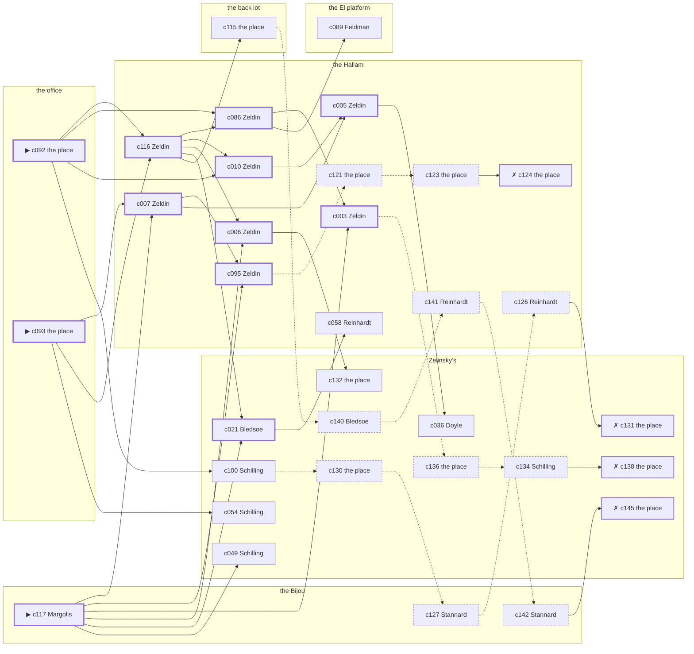

# the Gas House District — case 16

**Seed** 16 · **Difficulty** 2 · **Attempts** 1 · **Detective** Humphrey

**Par** 11 actions · **Slack** 6 · **Budget** 17 · **Findable** 34 (spine 12, corroboration 8, noise 10 + 4 disqualifiers) · **Noise ratio** 41% · **Candidate pool** 146

## 1. The Truth

Michael Feeney, a curb broker, in the victim’s debt, killed Karl Brauer, a buildings inspector, with a gunshot at the office at 10:00 PM. Feeney was about to be exposed by the victim (exposure). Feeney had been at the Hallam earlier in the evening, where the weapon lived, and was alone with Brauer when it happened. Margolis hired us.

## 2. Dramatis Personae

| Name | Role | Relationship | Class of secret | Motive | Found at | Killer |
| --- | --- | --- | --- | --- | --- | --- |
| Karl Brauer | a buildings inspector | the victim | — | — | — | — |
| Rivka Zeldin | a switchboard operator | the victim’s tenant | affair | — | the Hallam | — |
| Fannie Feldman | a chambermaid | the victim’s tenant | fence | revenge | the El platform | — |
| Booker Bledsoe | a dentist with rooms on the third floor | in the victim’s debt | affair | — | Zelinsky’s | — |
| Edward Doyle | a doorman at a club with no sign on it | in the victim’s debt | fence | debt | Zelinsky’s | — |
| Michael Feeney | a curb broker | in the victim’s debt | murder (+ gambling-debt) | exposure | Zelinsky’s | **YES** |
| Abraham Margolis (client) | a young man living on expectations | the victim’s brother-in-law | gambling-debt | — | the Bijou | — |
| Elsa Schilling | the man behind the counter | fixture (counterman) | — | — | Zelinsky’s | — |
| Wilhelm Reinhardt | the elevator man | fixture (elevator-man) | — | — | the Hallam | — |
| Gittel Hurwitz | the ticket-taker | fixture (ticket-taker) | — | — | the Bijou | — |
| Rutherford Stannard | the patrolman on the beat | fixture (beat-cop) | — | — | the Bijou | — |

## 3. Places

- **Zelinsky’s pawnshop, the back room** (semi) — watched by counterman (Schilling); objects: a silver cigarette case, a bronze bookend — within earshot of the scene
- **the office over the tailor’s shop** (private) — unwatched; objects: a japanned cash box, an Underwood typewriter — **THE SCENE**
- **the vestibule of the Hallam apartments** (private) — watched by elevator-man (Reinhardt); objects: a nickel-plated revolver, a day ledger, a camel-hair overcoat on a hook — where the weapon lived
- **the Bijou picture house** (public) — watched by ticket-taker (Hurwitz); objects: a standing ashtray, a length of sash cord
- **the victim’s house on the back lot** (private) — unwatched; objects: the roof-door key, a mechanic’s toolbox — the victim’s address
- **the El platform at Twenty-Third Street** (public) — unwatched; objects: a pasted-up timetable, a folded stack of evening papers — within earshot of the scene

## 4. Anchors

The coroner gives 9:30 PM–11:00 PM, four ticks wide. These are what close it: **ice-delivery** and **steam-whistle**.

- **the ice being brought in** — at 9:30 PM; at Zelinsky’s. Somebody reliable notes who was there. Only those present know that the iceman dropped a block on the step and it went in three. Those present carry it: a wet patch down one side of a coat.
- **the whistle off the river** — at 6:00 PM, 8:00 PM, 10:00 PM; across the whole neighbourhood. You can time things by it: two long and one short, and you can hear it a mile inland.
- **the beat cop’s pass** — at 7:00 PM, 8:30 PM, 10:00 PM, 11:30 PM; on a round through the Bijou → Zelinsky’s → the El platform. Somebody reliable notes who was there.

## 5. Timelines

### Brauer — the victim

| Tick | Time | Truth | Claimed | Companion claimed |
| --- | --- | --- | --- | --- |
| 0 | 6:00 PM | the Bijou | the Bijou | — |
| 1 | 6:30 PM | the Bijou | the Bijou | — |
| 2 | 7:00 PM | the Bijou | the Bijou | — |
| 3 | 7:30 PM | the Bijou | the Bijou | — |
| 4 | 8:00 PM | the El platform | the El platform | — |
| 5 | 8:30 PM | the El platform | the El platform | — |
| 6 | 9:00 PM | the office | the office | — |
| 7 | 9:30 PM | Zelinsky’s | Zelinsky’s | — |
| 8 | 10:00 PM | the office ☠ | the office | — |
| 9 | 10:30 PM | — | — | — |
| 10 | 11:00 PM | — | — | — |
| 11 | 11:30 PM | — | — | — |

### Zeldin

| Tick | Time | Truth | Claimed | Companion claimed |
| --- | --- | --- | --- | --- |
| 0 | 6:00 PM | the Hallam | the Hallam | — |
| 1 | 6:30 PM | the Hallam | the Hallam | — |
| 2 | 7:00 PM | the El platform | the El platform | — |
| 3 | 7:30 PM | Zelinsky’s | Zelinsky’s | — |
| 4 | 8:00 PM | Zelinsky’s | Zelinsky’s | — |
| 5 | 8:30 PM | the back lot | the back lot | — |
| 6 | 9:00 PM | Zelinsky’s | Zelinsky’s | — |
| 7 | 9:30 PM | Zelinsky’s | Zelinsky’s | — |
| 8 | 10:00 PM | Zelinsky’s | Zelinsky’s | — |
| 9 | 10:30 PM | the Hallam | **Zelinsky’s** | — |
| 10 | 11:00 PM | the Hallam | **Zelinsky’s** | — |
| 11 | 11:30 PM | the Hallam | **Zelinsky’s** | — |

### Feldman

| Tick | Time | Truth | Claimed | Companion claimed |
| --- | --- | --- | --- | --- |
| 0 | 6:00 PM | the El platform | the El platform | — |
| 1 | 6:30 PM | the back lot | the back lot | — |
| 2 | 7:00 PM | Zelinsky’s | Zelinsky’s | — |
| 3 | 7:30 PM | Zelinsky’s | Zelinsky’s | — |
| 4 | 8:00 PM | the El platform | the El platform | — |
| 5 | 8:30 PM | the El platform | the El platform | — |
| 6 | 9:00 PM | the El platform | the El platform | — |
| 7 | 9:30 PM | the El platform | the El platform | — |
| 8 | 10:00 PM | Zelinsky’s | **the El platform** | — |
| 9 | 10:30 PM | Zelinsky’s | **the El platform** | — |
| 10 | 11:00 PM | the Hallam | the Hallam | — |
| 11 | 11:30 PM | Zelinsky’s | Zelinsky’s | — |

### Bledsoe

| Tick | Time | Truth | Claimed | Companion claimed |
| --- | --- | --- | --- | --- |
| 0 | 6:00 PM | Zelinsky’s | Zelinsky’s | — |
| 1 | 6:30 PM | Zelinsky’s | Zelinsky’s | — |
| 2 | 7:00 PM | Zelinsky’s | Zelinsky’s | — |
| 3 | 7:30 PM | Zelinsky’s | Zelinsky’s | — |
| 4 | 8:00 PM | Zelinsky’s | Zelinsky’s | — |
| 5 | 8:30 PM | Zelinsky’s | Zelinsky’s | — |
| 6 | 9:00 PM | Zelinsky’s | Zelinsky’s | — |
| 7 | 9:30 PM | Zelinsky’s | Zelinsky’s | — |
| 8 | 10:00 PM | Zelinsky’s | Zelinsky’s | — |
| 9 | 10:30 PM | the Hallam | **the Bijou** | — |
| 10 | 11:00 PM | the Hallam | **the Bijou** | — |
| 11 | 11:30 PM | the Hallam | **the Bijou** | — |

### Doyle

| Tick | Time | Truth | Claimed | Companion claimed |
| --- | --- | --- | --- | --- |
| 0 | 6:00 PM | the El platform | the El platform | — |
| 1 | 6:30 PM | the Bijou | the Bijou | — |
| 2 | 7:00 PM | the Hallam | the Hallam | — |
| 3 | 7:30 PM | the office | the office | — |
| 4 | 8:00 PM | the El platform | the El platform | — |
| 5 | 8:30 PM | the El platform | the El platform | — |
| 6 | 9:00 PM | Zelinsky’s | Zelinsky’s | — |
| 7 | 9:30 PM | Zelinsky’s | **the Bijou** | Zeldin |
| 8 | 10:00 PM | Zelinsky’s | **the Bijou** | Zeldin |
| 9 | 10:30 PM | Zelinsky’s | Zelinsky’s | — |
| 10 | 11:00 PM | Zelinsky’s | Zelinsky’s | — |
| 11 | 11:30 PM | the Hallam | the Hallam | — |

### Feeney — the killer

| Tick | Time | Truth | Claimed | Companion claimed |
| --- | --- | --- | --- | --- |
| 0 | 6:00 PM | the Hallam | the Hallam | — |
| 1 | 6:30 PM | the Hallam | the Hallam | — |
| 2 | 7:00 PM | the Hallam | the Hallam | — |
| 3 | 7:30 PM | Zelinsky’s | **the El platform** | — |
| 4 | 8:00 PM | Zelinsky’s | **the El platform** | — |
| 5 | 8:30 PM | Zelinsky’s | Zelinsky’s | — |
| 6 | 9:00 PM | Zelinsky’s | Zelinsky’s | — |
| 7 | 9:30 PM | the office | **Zelinsky’s** | Feldman |
| 8 | 10:00 PM | the office ☠ | **Zelinsky’s** | Feldman |
| 9 | 10:30 PM | the El platform | the El platform | — |
| 10 | 11:00 PM | the El platform | the El platform | — |
| 11 | 11:30 PM | the El platform | the El platform | — |

### Margolis

| Tick | Time | Truth | Claimed | Companion claimed |
| --- | --- | --- | --- | --- |
| 0 | 6:00 PM | the back lot | the back lot | — |
| 1 | 6:30 PM | the office | the office | — |
| 2 | 7:00 PM | the Bijou | the Bijou | — |
| 3 | 7:30 PM | the Bijou | the Bijou | — |
| 4 | 8:00 PM | the Bijou | the Bijou | — |
| 5 | 8:30 PM | the Bijou | the Bijou | — |
| 6 | 9:00 PM | the Bijou | the Bijou | — |
| 7 | 9:30 PM | the Hallam | the Hallam | — |
| 8 | 10:00 PM | Zelinsky’s | **the Hallam** | Bledsoe |
| 9 | 10:30 PM | the Bijou | the Bijou | — |
| 10 | 11:00 PM | the El platform | the El platform | — |
| 11 | 11:30 PM | the El platform | the El platform | — |

### Fixtures (never lie, never withhold)

| Tick | Time | Schilling (the man behind the counter) | Reinhardt (the elevator man) | Hurwitz (the ticket-taker) | Stannard (the patrolman on the beat) |
| --- | --- | --- | --- | --- | --- |
| 0 | 6:00 PM | Zelinsky’s | the Hallam | the Bijou | — |
| 1 | 6:30 PM | Zelinsky’s | the Hallam | the Bijou | — |
| 2 | 7:00 PM | the El platform | the Hallam | the Bijou | the Bijou |
| 3 | 7:30 PM | Zelinsky’s | the Hallam | the Bijou | — |
| 4 | 8:00 PM | Zelinsky’s | the Hallam | the Bijou | — |
| 5 | 8:30 PM | Zelinsky’s | the Hallam | the Bijou | Zelinsky’s |
| 6 | 9:00 PM | Zelinsky’s | the Hallam | the Bijou | — |
| 7 | 9:30 PM | Zelinsky’s | the Hallam | the Bijou | — |
| 8 | 10:00 PM | Zelinsky’s | the Hallam | the Bijou | the El platform |
| 9 | 10:30 PM | Zelinsky’s | the Hallam | the Bijou | — |
| 10 | 11:00 PM | Zelinsky’s | the Hallam | the Bijou | — |
| 11 | 11:30 PM | Zelinsky’s | the Hallam | the Bijou | the Bijou |

## 6. Secrets in play

- **Zeldin** (affair): Zeldin is with Bledsoe at the Hallam from 10:30 PM to 11:30 PM, and both will say they were somewhere else.
- **Feldman** (fence): Feldman hands a parcel of stolen goods to a man at Zelinsky’s from 10:00 PM to 10:30 PM.
- **Bledsoe** (affair): Bledsoe is with Zeldin at the Hallam from 10:30 PM to 11:30 PM, and both will say they were somewhere else.
- **Doyle** (fence): Doyle hands a parcel of stolen goods to a man at Zelinsky’s from 9:30 PM to 10:00 PM.
- **Feeney** (murder): Feeney is at the office from 9:30 PM to 10:00 PM, alone with Brauer when it happens at 10:00 PM.
- **Feeney** also (gambling-debt): Feeney slips off to Zelinsky’s from 7:30 PM to 8:00 PM to settle with a bookmaker.
- **Margolis** (gambling-debt): Margolis slips off to Zelinsky’s from 10:00 PM to settle with a bookmaker.

## 7. Clue list — the 34 findable

The opening three, free at the start: c092, c093, c117. Everything else has to be led to. The full candidate pool is in the companion file.

### At Zelinsky’s

- **c021** [spine] (observation; Bledsoe on Zeldin) → c058
  - Bledsoe says Zeldin was at Zelinsky’s from 9:00 PM to 10:00 PM.
  - _establishes: Zeldin at Zelinsky’s, 9:00 PM–10:00 PM_
- **c100** [corroboration] (anchor; Schilling on the noise that evening) → c130
  - Schilling was at Zelinsky’s at 10:00 PM and heard a shot from the direction of the office, as the whistle went off the river.
  - _establishes: noise at the office at 10:00 PM; the victim dead by 10:00 PM; how it was done_
- **c036** [corroboration] (observation; Doyle on Feeney) → (end)
  - Doyle says Feeney was at the Hallam at 7:00 PM.
  - _establishes: Feeney at the Hallam, 7:00 PM; Feeney could reach the weapon_
- **c049** [corroboration] (observation; Schilling on Zeldin) → (end)
  - Schilling says Zeldin was at Zelinsky’s from 9:00 PM to 10:00 PM.
  - _establishes: Zeldin at Zelinsky’s, 9:00 PM–10:00 PM_
- **c132** [corroboration] (overheard; the place itself) → (end)
  - The goods turn up, tagged and dated, and the tag puts Feldman at Zelinsky’s from 10:00 PM to 10:30 PM with both hands full.
  - _establishes: Feldman’s fence accounted for; Feldman at Zelinsky’s, 10:00 PM–10:30 PM_
- **c054** [corroboration] (observation; Schilling on Bledsoe) → (end)
  - Schilling says Bledsoe was at Zelinsky’s from 7:30 PM to 10:00 PM.
  - _establishes: Bledsoe at Zelinsky’s, 7:30 PM–10:00 PM_
- **c130** [noise {b1}] (physical; the place itself) → c127
  - A pawn ticket at Zelinsky’s in a name that does not exist, made out at the hour in question.
  - _establishes: context only_
- **c131** [disqualifier {b1}] (overheard; the place itself) → (end)
  - The receiver at Zelinsky’s would rather talk than be held: Feldman was there from 10:00 PM to 10:30 PM handing over a parcel of somebody else’s silver, which is a charge Feldman will take over this one.
  - _establishes: Feldman’s fence accounted for; Feldman at Zelinsky’s, 10:00 PM–10:30 PM_
- **c140** [noise {b2}] (overheard; Bledsoe on Margolis) → c141
  - Bledsoe on Margolis: Margolis was asking around for a hundred dollars in a hurry earlier in the week.
  - _establishes: context only_
- **c145** [disqualifier {b2}] (overheard; the place itself) → (end)
  - The bookmaker’s runner is found and will say it: Margolis was at Zelinsky’s from 10:00 PM paying off eleven hundred dollars, a dollar at a time, and went nowhere near the killing.
  - _establishes: Margolis’s gambling-debt accounted for; Margolis at Zelinsky’s, 10:00 PM_
- **c136** [noise {b3}] (physical; the place itself) → c134
  - Wrapping paper and a cut string at Zelinsky’s, and the shop it came from closed two years ago.
  - _establishes: context only_
- **c134** [noise {b3}] (overheard; Schilling on Doyle) → c138
  - Schilling on Doyle: There is a man who meets people at Zelinsky’s and nobody will say his name out loud.
  - _establishes: context only_
- **c138** [disqualifier {b3}] (overheard; the place itself) → (end)
  - The receiver at Zelinsky’s would rather talk than be held: Doyle was there from 9:30 PM to 10:00 PM handing over a parcel of somebody else’s silver, which is a charge Doyle will take over this one.
  - _establishes: Doyle’s fence accounted for; Doyle at Zelinsky’s, 9:30 PM–10:00 PM_

### At the office

- **c092** [spine ⟨opening⟩] (scene; the place itself) → c116, c086, c010, c100
  - Brauer was found at the office. The cigarette he had going burned itself out on the sill where it fell. The whistle went off the river at 10:00 PM, two long and one short, and the boat’s log has the hour.
  - _establishes: the victim dead by 10:00 PM; how it was done_
- **c093** [spine ⟨opening⟩] (morgue; the place itself) → c007, c116, c054
  - The coroner puts death between 9:30 PM and 11:00 PM — two hours of nothing useful. One bullet below the sternum. Powder burns on the shirt front: fired close.
  - _establishes: death between 9:30 PM and 11:00 PM; how it was done_

### At the Hallam

- **c007** [spine] (observation; Zeldin on Feeney) → c095, c005
  - Zeldin says Feeney was at the Hallam from 6:00 PM to 6:30 PM.
  - _establishes: Feeney at the Hallam, 6:00 PM–6:30 PM; Feeney could reach the weapon_
- **c116** [spine] (overheard; Zeldin on Feeney and Brauer) → c086, c010, c006, c021, c115
  - Zeldin says Brauer told Feeney that the story would run whether Feeney liked it or not.
  - _establishes: Feeney had a motive (exposure)_
- **c095** [spine] (anchor; Zeldin on Brauer that evening) → c121
  - Zeldin puts Brauer at Zelinsky’s when the ice came, which was 9:30 PM, and alive enough to argue about the weather.
  - _establishes: the victim alive at 9:30 PM; Brauer at Zelinsky’s, 9:30 PM_
- **c086** [spine] (observation; Zeldin on Feeney’s account) → c003, c089
  - Zeldin was at Zelinsky’s from 9:30 PM to 10:00 PM and says Feeney was not.
  - _establishes: Feeney not at Zelinsky’s, 9:30 PM–10:00 PM_
- **c003** [spine] (observation; Zeldin on Feldman) → c136
  - Zeldin says Feldman was at Zelinsky’s at 10:00 PM.
  - _establishes: Feldman at Zelinsky’s, 10:00 PM_
- **c010** [spine] (observation; Zeldin on Margolis) → c005
  - Zeldin says Margolis was at Zelinsky’s at 10:00 PM.
  - _establishes: Margolis at Zelinsky’s, 10:00 PM_
- **c006** [spine] (observation; Zeldin on Doyle) → c132
  - Zeldin says Doyle was at Zelinsky’s from 9:00 PM to 10:00 PM.
  - _establishes: Doyle at Zelinsky’s, 9:00 PM–10:00 PM_
- **c005** [spine] (observation; Zeldin on Bledsoe) → c036
  - Zeldin says Bledsoe was at Zelinsky’s from 9:00 PM to 10:00 PM.
  - _establishes: Bledsoe at Zelinsky’s, 9:00 PM–10:00 PM_
- **c058** [corroboration] (observation; Reinhardt on Zeldin) → (end)
  - Reinhardt says Zeldin was at the Hallam from 6:00 PM to 6:30 PM.
  - _establishes: Zeldin at the Hallam, 6:00 PM–6:30 PM; Zeldin could reach the weapon_
- **c126** [noise {b1}] (overheard; Reinhardt on Feldman) → c131
  - Reinhardt on Feldman: Feldman was carrying a parcel into Zelinsky’s and came out without it.
  - _establishes: context only_
- **c141** [noise {b2}] (overheard; Reinhardt on Margolis) → c142
  - Reinhardt on Margolis: A man nobody knew was waiting for Margolis at Zelinsky’s and would not give a name.
  - _establishes: context only_
- **c121** [noise {b4}] (physical; the place itself) → c123
  - Two glasses at the Hallam, one of them with a lip print on it, and only one of them paid for.
  - _establishes: context only_
- **c123** [noise {b4}] (physical; the place itself) → c124
  - A man’s hat at the Hallam that fits nobody who admits to being there.
  - _establishes: context only_
- **c124** [disqualifier {b4}] (overheard; the place itself) → (end)
  - Bledsoe breaks and says it plainly: Bledsoe was with Zeldin at the Hallam for the whole of it, from 10:30 PM to 11:30 PM, and it is a marriage they are hiding, not a killing.
  - _establishes: Zeldin’s affair accounted for; Zeldin at the Hallam, 10:30 PM–11:30 PM; Bledsoe’s affair accounted for; Bledsoe at the Hallam, 10:30 PM–11:30 PM_

### At the Bijou

- **c117** [spine ⟨opening⟩] (client; Margolis on why I was hired) → c007, c095, c003, c006, c021, c049
  - Margolis hired us, and wants it known that Feldman blamed the victim for a ruin, and would rather we started there.
  - _establishes: Feldman had a motive (revenge)_
- **c127** [noise {b1}] (overheard; Stannard on Feldman) → c126
  - Stannard on Feldman: There is a man who meets people at Zelinsky’s and nobody will say his name out loud.
  - _establishes: context only_
- **c142** [noise {b2}] (overheard; Stannard on Margolis) → c145
  - Stannard on Margolis: Margolis goes very quiet when the racing wire is mentioned.
  - _establishes: context only_

### At the back lot

- **c115** [corroboration] (document; the place itself) → c140
  - Found at the back lot: A typed page of dates and sums in Brauer’s file, headed with Feeney’s name.
  - _establishes: Feeney had a motive (exposure)_

### At the El platform

- **c089** [corroboration] (denial; Feldman on Feeney’s account) → (end)
  - Feeney names Feldman as the company for Zelinsky’s from 9:30 PM to 10:00 PM. Feldman says they were not together that evening.
  - _establishes: Feeney not at Zelinsky’s, 9:30 PM–10:00 PM_

## 8. Clue graph

## 9. Deduction path

Par is **11 actions** and the budget is par plus 6: **17**. Every id below is a spine clue; the inference is the sheet’s, not the clue’s.

**Time of death.** The coroner gives four ticks. The anchors close it to 10:00 PM: one puts Brauer alive at 9:30 PM, the other times the scene at 10:00 PM. _(c093, c095, c092; + 1 corroborating)_

**Clearing the innocent.**

- Zeldin was not at the office at 10:00 PM. _(c021; + 1 corroborating)_
- Feldman was not at the office at 10:00 PM. _(c003; + 2 corroborating)_
- Bledsoe was not at the office at 10:00 PM. _(c005; + 1 corroborating)_
- Doyle was not at the office at 10:00 PM. _(c006; + 1 corroborating)_
- Margolis was not at the office at 10:00 PM. _(c010; + 1 corroborating)_

**Naming the killer.** Feeney claims Zelinsky’s at 10:00 PM. Two independent sources put that out of the question. _(c086; + 1 corroborating)_

**The weapon.** Feeney was at the Hallam before 10:00 PM, where a nickel-plated revolver was kept. _(c007; + 1 corroborating)_

**Method.** A gunshot, on two physical sources. _(c092, c093; + 1 corroborating)_

**Motive.** exposure, on two independent sources. _(c116; + 1 corroborating)_

## 10. Red herrings

**Innocents who lie about the murder tick:**

- Feldman claims the El platform at 10:00 PM and was really at Zelinsky’s. Reason: Feldman hands a parcel of stolen goods to a man at Zelinsky’s from 10:00 PM to 10:30 PM.
- Doyle claims the Bijou at 10:00 PM and was really at Zelinsky’s. Reason: Doyle hands a parcel of stolen goods to a man at Zelinsky’s from 9:30 PM to 10:00 PM.
- Margolis claims the Hallam at 10:00 PM and was really at Zelinsky’s. Reason: Margolis slips off to Zelinsky’s from 10:00 PM to settle with a bookmaker.

**Innocents with a motive:**

- Feldman — revenge: blamed the victim for a ruin.
- Doyle — debt: owed the victim money.

**Noise branches, and what knocks each one down:**

- **b1** (Feldman, fence): c130 → c127 → c126 → **c131** — The receiver at Zelinsky’s would rather talk than be held: Feldman was there from 10:00 PM to 10:30 PM handing over a parcel of somebody else’s silver, which is a charge Feldman will take over this one.
- **b2** (Margolis, gambling-debt): c140 → c141 → c142 → **c145** — The bookmaker’s runner is found and will say it: Margolis was at Zelinsky’s from 10:00 PM paying off eleven hundred dollars, a dollar at a time, and went nowhere near the killing.
- **b3** (Doyle, fence): c136 → c134 → **c138** — The receiver at Zelinsky’s would rather talk than be held: Doyle was there from 9:30 PM to 10:00 PM handing over a parcel of somebody else’s silver, which is a charge Doyle will take over this one.
- **b4** (Zeldin, affair): c121 → c123 → **c124** — Bledsoe breaks and says it plainly: Bledsoe was with Zeldin at the Hallam for the whole of it, from 10:30 PM to 11:30 PM, and it is a marriage they are hiding, not a killing.

