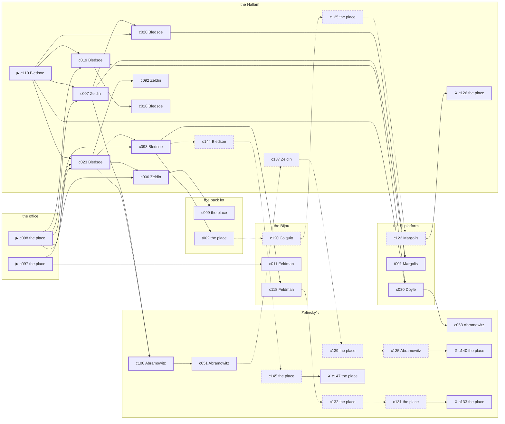

# the Gas House District — case 16

**Seed** 16 · **Difficulty** 2 · **Attempts** 1 · **Detective** Dashiell

**Type** robbery · **Trope** payroll · **Unknowns** who, goods, how

**Par** 12 actions · **Slack** 6 · **Budget** 18 · **Findable** 34 (spine 12, corroboration 8, noise 10 + 4 disqualifiers) · **Noise ratio** 41% · **Candidate pool** 150

## 1. The Truth

Michael Feeney, a curb broker, in Brauer’s debt, took a payroll envelope from the office, which belonged to Karl Brauer, a buildings inspector, at 10:30 PM, by a cord made fast to the fire escape. Feeney was about to be exposed by Brauer (exposure). Feeney had been at the back lot earlier in the evening, where the means lived, and was alone at the office when it happened. Bledsoe hired us.

## 2. The Act

**robbery** · **payroll** · actor **Feeney** · at **the office** · at **10:30 PM**

- taken: a payroll envelope
- entry: window
- goods went to the back lot

**Givens** — what the briefing states and the report does not ask:

- A payroll envelope went from Zelinsky’s to the office the way it goes every Friday, and Brauer carried it.
- Brauer had it at Zelinsky’s at 10:00 PM, buttoned into an inside pocket.
- It was gone from the office by 10:30 PM.
- Nobody was hurt and nothing was broken.

**Unknowns** — exactly what the report asks: **who**, **goods**, **how**.

## 3. Dramatis Personae

| Name | Role | Relationship | Class of secret | Motive | Found at | Killer |
| --- | --- | --- | --- | --- | --- | --- |
| Karl Brauer | a buildings inspector | the victim | — | — | — | — |
| Rivka Zeldin | a switchboard operator | Brauer’s tenant | affair | — | the Hallam | — |
| Fannie Feldman | a chambermaid | Brauer’s tenant | fence | revenge | the Bijou | — |
| Booker Bledsoe (client) | a dentist with a chair and a waiting room | in Brauer’s debt | affair | — | the Hallam | — |
| Edward Doyle | a doorman at a club with no sign on it | in Brauer’s debt | fence | debt | the El platform | — |
| Michael Feeney | a curb broker | in Brauer’s debt | murder (+ gambling-debt) | exposure | the El platform | **YES** |
| Abraham Margolis | a young man living on expectations | Brauer’s brother-in-law | gambling-debt | — | the El platform | — |
| Louis Abramowitz | the man behind the counter | fixture (counterman) | — | — | Zelinsky’s | — |
| Rocco Vitale | the elevator man | fixture (elevator-man) | — | — | the Hallam | — |
| Alonzo Broadnax | the ticket-taker | fixture (ticket-taker) | — | — | the Bijou | — |
| Ezekiel Colquitt | the patrolman on the beat | fixture (beat-cop) | — | — | the Bijou | — |

## 4. Dossiers

Every person, by layer: **0** on sight, **1** volunteered, **2** from other people, **3** in the documents.

### Brauer — the victim

55, a man, a buildings inspector. Wants: to-keep-what-they-have.

- **Standing** — Brauer was the reason three houses on the street were still standing open.
- **Profession** — Brauer walked the buildings with a book and wrote in it what he was asked to.
- **Found** — Zeldin found the door at the office shut and a payroll envelope gone, at 11:30 PM. By Zeldin, at the office, at 11:30 PM. Precinct: took-a-statement.

**Layer 0, on sight**

- _gender_ — A man.
- _age_ — In his fifties.

**Layer 1, volunteered**

- _profession_ — A buildings inspector.
- _detail_ — Brauer walked the buildings with a book and wrote in it what he was asked to.

**Layer 2, from other people**

- _tie_ — Brauer was the reason three houses on the street were still standing open.
- _want_ — Brauer wants to keep what they have and add nothing to it.

**Self-account** (layer 1, what they say when asked about themselves)

- Brauer is 55 years old and a buildings inspector.
- Brauer walked the buildings with a book and wrote in it what he was asked to.
- Brauer is the one this is about.

### Zeldin

37, a woman, a switchboard operator. Wants: to-get-out. Tie: Brauer’s tenant, four years in the same rooms.

**Layer 0, on sight**

- _gender_ — A woman.
- _age_ — In her thirties.
- _profession_ — A switchboard operator.

**Layer 1, volunteered**

- _detail_ — Zeldin sits the board from four until midnight and hears both ends of everything.

**Layer 2, from other people**

- _tie_ — Brauer put Zeldin’s rent up twice in a year and Zeldin paid it twice.
- _want_ — Zeldin wants out of the neighbourhood and has wanted it for years.
- _since_ — Zeldin has been Brauer’s tenant, four years in the same rooms.

**Layer 3, in the documents**

- _secret-hint_ — Zeldin was seen going into the Hallam alone and came out with somebody half an hour later.

**Self-account** (layer 1, what they say when asked about themselves)

- Zeldin is 37 years old and a switchboard operator.
- Zeldin sits the board from four until midnight and hears both ends of everything.
- Zeldin is Brauer’s tenant.

### Feldman

33, a woman, a chambermaid. Wants: to-get-out. Tie: Brauer’s tenant, since ’22.

**Layer 0, on sight**

- _gender_ — A woman.
- _age_ — In her thirties.
- _profession_ — A chambermaid.

**Layer 1, volunteered**

- _detail_ — Feldman has the third and fourth floors and is finished at four.

**Layer 2, from other people**

- _tie_ — Brauer put Feldman’s rent up twice in a year and Feldman paid it twice.
- _want_ — Feldman wants out of the neighbourhood and has wanted it for years.
- _since_ — Feldman has been Brauer’s tenant, since ’22.

**Layer 3, in the documents**

- _secret-hint_ — Feldman was carrying a parcel into Zelinsky’s and came out without it.

**Self-account** (layer 1, what they say when asked about themselves)

- Feldman is 33 years old and a chambermaid.
- Feldman has the third and fourth floors and is finished at four.
- Feldman is Brauer’s tenant.

### Bledsoe — the client

56, a man, a dentist with a chair and a waiting room. Wants: money. Tie: in Brauer’s debt, two winters running.

**Layer 0, on sight**

- _gender_ — A man.
- _age_ — In his fifties.

**Layer 1, volunteered**

- _profession_ — A dentist with a chair and a waiting room.
- _detail_ — Bledsoe pulls teeth for the neighbourhood at a dollar a time.

**Layer 2, from other people**

- _tie_ — Bledsoe has owed Brauer money since ’20 and has not been asked for it lately.
- _want_ — Bledsoe wants money, and is not particular about the shape it arrives in.
- _since_ — Bledsoe has been in Brauer’s debt, two winters running.

**Layer 3, in the documents**

- _secret-hint_ — Bledsoe was seen going into the Hallam alone and came out with somebody half an hour later.

**Self-account** (layer 1, what they say when asked about themselves)

- Bledsoe is 56 years old and a dentist with a chair and a waiting room.
- Bledsoe pulls teeth for the neighbourhood at a dollar a time.
- Bledsoe is in Brauer’s debt.

### Doyle

44, a man, a doorman at a club with no sign on it. Wants: money. Tie: in Brauer’s debt, since the flu year.

**Layer 0, on sight**

- _gender_ — A man.
- _age_ — In his forties.
- _profession_ — A doorman at a club with no sign on it.

**Layer 1, volunteered**

- _detail_ — Doyle keeps the wrong people out and the right people quiet.

**Layer 2, from other people**

- _tie_ — Brauer carried Doyle through a bad winter and has been collecting on it ever since.
- _want_ — Doyle wants money, and is not particular about the shape it arrives in.
- _since_ — Doyle has been in Brauer’s debt, since the flu year.

**Layer 3, in the documents**

- _secret-hint_ — Doyle was carrying a parcel into Zelinsky’s and came out without it.

**Self-account** (layer 1, what they say when asked about themselves)

- Doyle is 44 years old and a doorman at a club with no sign on it.
- Doyle keeps the wrong people out and the right people quiet.
- Doyle is in Brauer’s debt.

### Feeney — the killer

38, a man, a curb broker. Wants: to-be-somebody. Tie: in Brauer’s debt, two winters running.

**Layer 0, on sight**

- _gender_ — A man.
- _age_ — In his thirties.

**Layer 1, volunteered**

- _profession_ — A curb broker.
- _detail_ — Feeney works the curb outside the Exchange in all weathers.

**Layer 2, from other people**

- _tie_ — Brauer carried Feeney through a bad winter and has been collecting on it ever since.
- _want_ — Feeney wants a name people know.
- _since_ — Feeney has been in Brauer’s debt, two winters running.

**Layer 3, in the documents**

- _secret-hint_ — Feeney was asking around for a hundred dollars in a hurry earlier in the week.

**Self-account** (layer 1, what they say when asked about themselves)

- Feeney is 38 years old and a curb broker.
- Feeney works the curb outside the Exchange in all weathers.
- Feeney is in Brauer’s debt.

### Margolis

25, a man, a young man living on expectations. Wants: to-be-somebody. Tie: Brauer’s brother-in-law, since ’27.

**Layer 0, on sight**

- _gender_ — A man.
- _age_ — In the late twenties.

**Layer 1, volunteered**

- _profession_ — A young man living on expectations.
- _detail_ — Margolis has no occupation anybody can name and an account at three tailors.

**Layer 2, from other people**

- _tie_ — Brauer stood up at Margolis’s wedding and Lorraine Renfro has never let either of them forget it.
- _want_ — Margolis wants a name people know.
- _since_ — Margolis has been Brauer’s brother-in-law, since ’27.
- _third_ — Lorraine Renfro is the landlady at the old address.

**Layer 3, in the documents**

- _secret-hint_ — Margolis was asking around for a hundred dollars in a hurry earlier in the week.

**Self-account** (layer 1, what they say when asked about themselves)

- Margolis is 25 years old and a young man living on expectations.
- Margolis has no occupation anybody can name and an account at three tailors.
- Margolis is Brauer’s brother-in-law.

### Abramowitz

38, a man, the man behind the counter. Wants: to-get-out. Tie: behind the counter at Zelinsky’s.

**Layer 0, on sight**

- _gender_ — A man.
- _age_ — In his thirties.
- _profession_ — The man behind the counter.

**Layer 1, volunteered**

- _detail_ — Abramowitz serves at Zelinsky’s and has never once been asked his name.

**Layer 2, from other people**

- _tie_ — Abramowitz is behind the counter at Zelinsky’s.
- _want_ — Abramowitz wants out of the neighbourhood and has wanted it for years.

**Self-account** (layer 1, what they say when asked about themselves)

- Abramowitz is 38 years old and the man behind the counter.
- Abramowitz serves at Zelinsky’s and has never once been asked his name.
- Abramowitz is behind the counter at Zelinsky’s.

### Vitale

35, a man, the elevator man. Wants: money. Tie: in the car at the Hallam.

**Layer 0, on sight**

- _gender_ — A man.
- _age_ — In his thirties.
- _profession_ — The elevator man.

**Layer 1, volunteered**

- _detail_ — Vitale runs the car at the Hallam and knows which floor everybody wants before they say it.

**Layer 2, from other people**

- _tie_ — Vitale is in the car at the Hallam.
- _want_ — Vitale wants money, and is not particular about the shape it arrives in.

**Self-account** (layer 1, what they say when asked about themselves)

- Vitale is 35 years old and the elevator man.
- Vitale runs the car at the Hallam and knows which floor everybody wants before they say it.
- Vitale is in the car at the Hallam.

### Broadnax

49, a man, the ticket-taker. Wants: to-be-left-alone. Tie: on the door at the Bijou, every performance.

**Layer 0, on sight**

- _gender_ — A man.
- _age_ — In his forties.
- _profession_ — The ticket-taker.

**Layer 1, volunteered**

- _detail_ — Broadnax has taken tickets at the Bijou since the house opened.

**Layer 2, from other people**

- _tie_ — Broadnax is on the door at the Bijou, every performance.
- _want_ — Broadnax wants to be left alone.

**Self-account** (layer 1, what they say when asked about themselves)

- Broadnax is 49 years old and the ticket-taker.
- Broadnax has taken tickets at the Bijou since the house opened.
- Broadnax is on the door at the Bijou, every performance.

### Colquitt

31, a man, the patrolman on the beat. Wants: to-keep-what-they-have. Tie: the patrolman whose post takes in the Bijou.

**Layer 0, on sight**

- _gender_ — A man.
- _age_ — In his thirties.
- _profession_ — The patrolman on the beat.

**Layer 1, volunteered**

- _detail_ — Colquitt came on at six and will go off at two, the same as every night.

**Layer 2, from other people**

- _tie_ — Colquitt is the patrolman whose post takes in the Bijou.
- _want_ — Colquitt wants to keep what they have and add nothing to it.

**Self-account** (layer 1, what they say when asked about themselves)

- Colquitt is 31 years old and the patrolman on the beat.
- Colquitt came on at six and will go off at two, the same as every night.
- Colquitt is the patrolman whose post takes in the Bijou.

## 5. The Client

**Bledsoe**, in Brauer’s debt. Purpose: **keep-it-quiet**.

- **Why** — Bledsoe wants it settled quietly, before it is settled loudly.
- **What it costs** — Bledsoe is paying to have something found and then not said.
- **Points at** — Feeney: Feeney was about to be exposed by Brauer. Honest: **yes**.

**Tells:**

- A payroll envelope went from Zelinsky’s to the office the way it goes every Friday, and Brauer carried it.
- Brauer had it at Zelinsky’s at 10:00 PM, buttoned into an inside pocket.
- It was gone from the office by 10:30 PM.
- Nobody was hurt and nothing was broken.
- Bledsoe would rather we started with Feeney: Feeney was about to be exposed by Brauer.

**Withholds:**

- Bledsoe does not mention it, but Bledsoe is with Zeldin at the Hallam from 6:00 PM to 7:00 PM, and both will say they were somewhere else.

**Their own evening, as they tell it:**

- Bledsoe says he was at the El platform from 6:00 PM to 7:00 PM.
- Bledsoe says he was at the Hallam from 7:30 PM to 8:00 PM.
- Bledsoe says he was at the back lot from 8:30 PM to 9:30 PM.
- Bledsoe says he was at the El platform at 10:00 PM.

## 6. The Briefing

16 plain sentences, derived. This is the model of the plain register: the engine renders it, and Phase 2 measures pages against it.

1. A man came up the stairs after midnight, and sat down.
2. Booker Bledsoe is 56 years old and a dentist with a chair and a waiting room.
3. Bledsoe pulls teeth for the neighbourhood at a dollar a time.
4. Brauer was the reason three houses on the street were still standing open.
5. A payroll envelope went from Zelinsky’s to the office the way it goes every Friday, and Brauer carried it.
6. Brauer had it at Zelinsky’s at 10:00 PM, buttoned into an inside pocket.
7. It was gone from the office by 10:30 PM.
8. Nobody was hurt and nothing was broken.
9. Zeldin found the door at the office shut and a payroll envelope gone, at 11:30 PM.
10. The precinct took a statement at the desk and filed it.
11. Bledsoe is in Brauer’s debt.
12. Bledsoe has owed Brauer money since ’20 and has not been asked for it lately.
13. Bledsoe wants it settled quietly, before it is settled loudly.
14. Bledsoe is paying to have something found and then not said.
15. Bledsoe wants us to start with Feeney.
16. Feeney was about to be exposed by Brauer.

## 7. Mentions

- **Lorraine Renfro** (m-1) — the landlady at the old address. Lorraine Renfro is the landlady at the old address.

## 8. Places

- **Zelinsky’s pawnshop, the back room** (semi) — watched by counterman (Abramowitz); objects: a nickel-plated revolver, a silver cigarette case — within earshot of the scene
- **the office over the tailor’s shop** (private) — unwatched; objects: a payroll envelope, a japanned cash box, a bronze bookend — **THE SCENE**
- **the vestibule of the Hallam apartments** (private) — watched by elevator-man (Vitale); objects: a camel-hair overcoat on a hook, the roof-door key, a day ledger
- **the Bijou picture house** (public) — watched by ticket-taker (Broadnax); objects: a standing ashtray
- **Brauer’s house on the back lot** (private) — unwatched; objects: a length of sash cord, a framed photograph, a mechanic’s toolbox — the victim’s address; where the weapon lived
- **the El platform at Twenty-Third Street** (public) — unwatched; objects: a pasted-up timetable, a folded stack of evening papers — within earshot of the scene

## 9. Anchors

The coroner gives 9:00 PM–10:30 PM, four ticks wide. These are what close it: **ice-delivery** and **steam-whistle**.

- **the ice being brought in** — at 10:00 PM; at Zelinsky’s. Somebody reliable notes who was there. Only those present know that the iceman dropped a block on the step and it went in three. Those present carry it: a wet patch down one side of a coat.
- **the whistle off the river** — at 6:30 PM, 8:30 PM, 10:30 PM; across the whole neighbourhood. You can time things by it: two long and one short, and you can hear it a mile inland.
- **the beat cop’s pass** — at 7:00 PM, 8:30 PM, 10:00 PM, 11:30 PM; on a round through the Bijou → Zelinsky’s → the El platform. Somebody reliable notes who was there.

## 10. Timelines

### Brauer — the victim

| Tick | Time | Truth | Claimed | Companion claimed |
| --- | --- | --- | --- | --- |
| 0 | 6:00 PM | the Bijou | the Bijou | — |
| 1 | 6:30 PM | the Bijou | the Bijou | — |
| 2 | 7:00 PM | the Bijou | the Bijou | — |
| 3 | 7:30 PM | the Hallam | the Hallam | — |
| 4 | 8:00 PM | the Bijou | the Bijou | — |
| 5 | 8:30 PM | the Bijou | the Bijou | — |
| 6 | 9:00 PM | the Bijou | the Bijou | — |
| 7 | 9:30 PM | the Bijou | the Bijou | — |
| 8 | 10:00 PM | Zelinsky’s | Zelinsky’s | — |
| 9 | 10:30 PM | Zelinsky’s | Zelinsky’s | — |
| 10 | 11:00 PM | Zelinsky’s | Zelinsky’s | — |
| 11 | 11:30 PM | the back lot | the back lot | — |

### Zeldin

| Tick | Time | Truth | Claimed | Companion claimed |
| --- | --- | --- | --- | --- |
| 0 | 6:00 PM | the Hallam | **the Bijou** | — |
| 1 | 6:30 PM | the Hallam | **the Bijou** | — |
| 2 | 7:00 PM | the Hallam | **the Bijou** | — |
| 3 | 7:30 PM | the Hallam | the Hallam | — |
| 4 | 8:00 PM | the Hallam | the Hallam | — |
| 5 | 8:30 PM | the back lot | the back lot | — |
| 6 | 9:00 PM | the back lot | the back lot | — |
| 7 | 9:30 PM | the back lot | the back lot | — |
| 8 | 10:00 PM | the back lot | the back lot | — |
| 9 | 10:30 PM | Zelinsky’s | Zelinsky’s | — |
| 10 | 11:00 PM | Zelinsky’s | Zelinsky’s | — |
| 11 | 11:30 PM | the office | the office | — |

### Feldman

| Tick | Time | Truth | Claimed | Companion claimed |
| --- | --- | --- | --- | --- |
| 0 | 6:00 PM | the El platform | the El platform | — |
| 1 | 6:30 PM | the back lot | the back lot | — |
| 2 | 7:00 PM | Zelinsky’s | Zelinsky’s | — |
| 3 | 7:30 PM | Zelinsky’s | Zelinsky’s | — |
| 4 | 8:00 PM | Zelinsky’s | Zelinsky’s | — |
| 5 | 8:30 PM | the Hallam | the Hallam | — |
| 6 | 9:00 PM | the Bijou | the Bijou | — |
| 7 | 9:30 PM | the Bijou | the Bijou | — |
| 8 | 10:00 PM | the Bijou | the Bijou | — |
| 9 | 10:30 PM | Zelinsky’s | **the Bijou** | Doyle |
| 10 | 11:00 PM | the Bijou | the Bijou | — |
| 11 | 11:30 PM | the Bijou | the Bijou | — |

### Bledsoe

| Tick | Time | Truth | Claimed | Companion claimed |
| --- | --- | --- | --- | --- |
| 0 | 6:00 PM | the Hallam | **the El platform** | Margolis |
| 1 | 6:30 PM | the Hallam | **the El platform** | Margolis |
| 2 | 7:00 PM | the Hallam | **the El platform** | Margolis |
| 3 | 7:30 PM | the Hallam | the Hallam | — |
| 4 | 8:00 PM | the Hallam | the Hallam | — |
| 5 | 8:30 PM | the back lot | the back lot | — |
| 6 | 9:00 PM | the back lot | the back lot | — |
| 7 | 9:30 PM | the back lot | the back lot | — |
| 8 | 10:00 PM | the El platform | the El platform | — |
| 9 | 10:30 PM | Zelinsky’s | Zelinsky’s | — |
| 10 | 11:00 PM | Zelinsky’s | Zelinsky’s | — |
| 11 | 11:30 PM | Zelinsky’s | Zelinsky’s | — |

### Doyle

| Tick | Time | Truth | Claimed | Companion claimed |
| --- | --- | --- | --- | --- |
| 0 | 6:00 PM | the Bijou | the Bijou | — |
| 1 | 6:30 PM | the back lot | the back lot | — |
| 2 | 7:00 PM | the El platform | the El platform | — |
| 3 | 7:30 PM | the office | the office | — |
| 4 | 8:00 PM | the office | the office | — |
| 5 | 8:30 PM | the El platform | the El platform | — |
| 6 | 9:00 PM | the El platform | the El platform | — |
| 7 | 9:30 PM | the El platform | the El platform | — |
| 8 | 10:00 PM | the El platform | the El platform | — |
| 9 | 10:30 PM | Zelinsky’s | **the Bijou** | Feldman |
| 10 | 11:00 PM | Zelinsky’s | Zelinsky’s | — |
| 11 | 11:30 PM | Zelinsky’s | Zelinsky’s | — |

### Feeney — the killer

| Tick | Time | Truth | Claimed | Companion claimed |
| --- | --- | --- | --- | --- |
| 0 | 6:00 PM | the back lot | the back lot | — |
| 1 | 6:30 PM | the back lot | the back lot | — |
| 2 | 7:00 PM | the Bijou | the Bijou | — |
| 3 | 7:30 PM | the El platform | **the back lot** | — |
| 4 | 8:00 PM | the El platform | **the back lot** | — |
| 5 | 8:30 PM | the El platform | the El platform | — |
| 6 | 9:00 PM | the El platform | the El platform | — |
| 7 | 9:30 PM | the office | **Zelinsky’s** | — |
| 8 | 10:00 PM | the office | **Zelinsky’s** | — |
| 9 | 10:30 PM | the office ☠ | **Zelinsky’s** | — |
| 10 | 11:00 PM | the Bijou | the Bijou | — |
| 11 | 11:30 PM | the Bijou | the Bijou | — |

### Margolis

| Tick | Time | Truth | Claimed | Companion claimed |
| --- | --- | --- | --- | --- |
| 0 | 6:00 PM | the office | the office | — |
| 1 | 6:30 PM | the back lot | the back lot | — |
| 2 | 7:00 PM | the back lot | the back lot | — |
| 3 | 7:30 PM | the back lot | the back lot | — |
| 4 | 8:00 PM | the El platform | the El platform | — |
| 5 | 8:30 PM | the El platform | the El platform | — |
| 6 | 9:00 PM | the El platform | the El platform | — |
| 7 | 9:30 PM | the El platform | the El platform | — |
| 8 | 10:00 PM | Zelinsky’s | **the back lot** | Feldman |
| 9 | 10:30 PM | Zelinsky’s | **the back lot** | Feldman |
| 10 | 11:00 PM | the Bijou | the Bijou | — |
| 11 | 11:30 PM | the Bijou | the Bijou | — |

### Fixtures (never lie, never withhold)

| Tick | Time | Abramowitz (the man behind the counter) | Vitale (the elevator man) | Broadnax (the ticket-taker) | Colquitt (the patrolman on the beat) |
| --- | --- | --- | --- | --- | --- |
| 0 | 6:00 PM | Zelinsky’s | the Hallam | the Bijou | — |
| 1 | 6:30 PM | the Hallam | the El platform | the Bijou | — |
| 2 | 7:00 PM | Zelinsky’s | the Hallam | the Bijou | the Bijou |
| 3 | 7:30 PM | Zelinsky’s | the Hallam | the Bijou | — |
| 4 | 8:00 PM | Zelinsky’s | the Hallam | the Bijou | — |
| 5 | 8:30 PM | Zelinsky’s | the Hallam | the Bijou | Zelinsky’s |
| 6 | 9:00 PM | Zelinsky’s | the Hallam | the Bijou | — |
| 7 | 9:30 PM | Zelinsky’s | the Hallam | the Bijou | — |
| 8 | 10:00 PM | Zelinsky’s | the Hallam | the Bijou | the El platform |
| 9 | 10:30 PM | Zelinsky’s | the Hallam | the Bijou | — |
| 10 | 11:00 PM | Zelinsky’s | the Hallam | the Bijou | — |
| 11 | 11:30 PM | Zelinsky’s | the Hallam | the Bijou | the Bijou |

## 11. Secrets in play

- **Zeldin** (affair): Zeldin is with Bledsoe at the Hallam from 6:00 PM to 7:00 PM, and both will say they were somewhere else.
- **Feldman** (fence): Feldman hands a parcel of stolen goods to a man at Zelinsky’s from 10:30 PM.
- **Bledsoe** (affair): Bledsoe is with Zeldin at the Hallam from 6:00 PM to 7:00 PM, and both will say they were somewhere else.
- **Doyle** (fence): Doyle hands a parcel of stolen goods to a man at Zelinsky’s from 10:30 PM.
- **Feeney** (murder): Feeney is at the office from 9:30 PM to 10:30 PM, alone with what Brauer kept there, and takes it at 10:30 PM.
- **Feeney** also (gambling-debt): Feeney slips off to the El platform from 7:30 PM to 8:00 PM to settle with a bookmaker.
- **Margolis** (gambling-debt): Margolis slips off to Zelinsky’s from 10:00 PM to 10:30 PM to settle with a bookmaker.

## 12. Clue list — the 34 findable

The opening three, free at the start: c097, c098, c119. Everything else has to be led to. The full candidate pool is in the companion file.

### At Zelinsky’s

- **c100** [spine] (anchor; Abramowitz on Brauer that evening) → c051
  - Abramowitz puts Brauer at Zelinsky’s when the ice came, which was 10:00 PM, and nothing had been touched then.
  - _establishes: the victim alive at 10:00 PM; Brauer at Zelinsky’s, 10:00 PM_
- **c051** [corroboration] (observation; Abramowitz on Zeldin) → c137
  - Abramowitz says Zeldin was at Zelinsky’s from 10:30 PM to 11:00 PM.
  - _establishes: Zeldin at Zelinsky’s, 10:30 PM–11:00 PM_
- **c053** [corroboration] (observation; Abramowitz on Feldman) → (end)
  - Abramowitz says Feldman was at Zelinsky’s at 10:30 PM.
  - _establishes: Feldman at Zelinsky’s, 10:30 PM_
- **c139** [noise {b1}] (physical; the place itself) → c135
  - A pawn ticket at Zelinsky’s in a name that does not exist, made out at the hour in question.
  - _establishes: context only_
- **c135** [noise {b1}] (overheard; Abramowitz on Doyle) → c140
  - Abramowitz on Doyle: Doyle was carrying a parcel into Zelinsky’s and came out without it.
  - _establishes: context only_
- **c140** [disqualifier {b1}] (overheard; the place itself) → (end)
  - The receiver at Zelinsky’s would rather talk than be held: Doyle was there from 10:30 PM handing over a parcel of somebody else’s silver, which is a charge Doyle will take over this one.
  - _establishes: Doyle’s fence accounted for; Doyle at Zelinsky’s, 10:30 PM_
- **c145** [noise {b3}] (physical; the place itself) → c147
  - Betting slips at Zelinsky’s in Margolis’s pocketbook, all of them losers, all of them this month.
  - _establishes: context only_
- **c147** [disqualifier {b3}] (overheard; the place itself) → (end)
  - The bookmaker’s runner is found and will say it: Margolis was at Zelinsky’s from 10:00 PM to 10:30 PM paying off eleven hundred dollars, a dollar at a time, and went nowhere near the killing.
  - _establishes: Margolis’s gambling-debt accounted for; Margolis at Zelinsky’s, 10:00 PM–10:30 PM_
- **c132** [noise {b4}] (physical; the place itself) → c131
  - A pawn ticket at Zelinsky’s in a name that does not exist, made out at the hour in question.
  - _establishes: context only_
- **c131** [noise {b4}] (physical; the place itself) → c133
  - Wrapping paper and a cut string at Zelinsky’s, and the shop it came from closed two years ago.
  - _establishes: context only_
- **c133** [disqualifier {b4}] (overheard; the place itself) → (end)
  - The receiver at Zelinsky’s would rather talk than be held: Feldman was there from 10:30 PM handing over a parcel of somebody else’s silver, which is a charge Feldman will take over this one.
  - _establishes: Feldman’s fence accounted for; Feldman at Zelinsky’s, 10:30 PM_

### At the office

- **c097** [spine ⟨opening⟩] (scene; the place itself) → c023, c011
  - A payroll envelope is gone from the office, which is Brauer’s. The window is down but not latched, and there is grit from the fire escape on the sill. The whistle went off the river at 10:30 PM, two long and one short, and the boat’s log has the hour.
  - _establishes: the victim dead by 10:30 PM; how it was done_
- **c098** [spine ⟨opening⟩] (morgue; the place itself) → c023, c007, c006, c093, c019
  - The desk sergeant's report puts it between 9:00 PM and 10:30 PM — two hours of nothing useful. The precinct report says the window catch was sprung from outside and the sill was scraped.
  - _establishes: death between 9:00 PM and 10:30 PM; how it was done_

### At the Hallam

- **c119** [spine ⟨opening⟩] (client; Bledsoe on why I was hired) → c023, c007, c020, c019, c030
  - Bledsoe hired us, and wants it known that Feeney was about to be exposed by Brauer, and would rather we started there.
  - _establishes: Feeney had a motive (exposure)_
- **c023** [spine] (observation; Bledsoe on Margolis) → c006, c093, c100, c092
  - Bledsoe says Margolis was at Zelinsky’s at 10:30 PM.
  - _establishes: Margolis at Zelinsky’s, 10:30 PM_
- **c007** [spine] (observation; Zeldin on Doyle) → c020, t001, c100
  - Zeldin says Doyle was at Zelinsky’s from 10:30 PM to 11:00 PM.
  - _establishes: Doyle at Zelinsky’s, 10:30 PM–11:00 PM_
- **c006** [spine] (observation; Zeldin on Bledsoe) → c099
  - Zeldin says Bledsoe was at Zelinsky’s from 10:30 PM to 11:00 PM.
  - _establishes: Bledsoe at Zelinsky’s, 10:30 PM–11:00 PM_
- **c093** [spine] (observation; Bledsoe on Feeney’s account) → c118, t002, c144
  - Bledsoe was at Zelinsky’s at 10:30 PM and says Feeney was not.
  - _establishes: Feeney not at Zelinsky’s, 10:30 PM_
- **c020** [spine] (observation; Bledsoe on Feldman) → t001
  - Bledsoe says Feldman was at Zelinsky’s at 10:30 PM.
  - _establishes: Feldman at Zelinsky’s, 10:30 PM_
- **c019** [spine] (observation; Bledsoe on Zeldin) → c030, c018
  - Bledsoe says Zeldin was at Zelinsky’s from 10:30 PM to 11:00 PM.
  - _establishes: Zeldin at Zelinsky’s, 10:30 PM–11:00 PM_
- **c092** [corroboration] (observation; Zeldin on Feeney’s account) → (end)
  - Zeldin was at Zelinsky’s at 10:30 PM and says Feeney was not.
  - _establishes: Feeney not at Zelinsky’s, 10:30 PM_
- **c018** [corroboration] (observation; Bledsoe on Zeldin) → (end)
  - Bledsoe says Zeldin was at the back lot from 8:30 PM to 9:30 PM.
  - _establishes: Zeldin at the back lot, 8:30 PM–9:30 PM; Zeldin could reach the weapon_
- **c137** [noise {b1}] (overheard; Zeldin on Doyle) → c139
  - Zeldin on Doyle: Doyle has been selling things that were never Doyle’s to sell.
  - _establishes: context only_
- **c125** [noise {b2}] (physical; the place itself) → c122
  - A man’s hat at the Hallam that fits nobody who admits to being there.
  - _establishes: context only_
- **c126** [disqualifier {b2}] (overheard; the place itself) → (end)
  - Bledsoe breaks and says it plainly: Bledsoe was with Zeldin at the Hallam for the whole of it, from 6:00 PM to 7:00 PM, and it is a marriage they are hiding, not a killing.
  - _establishes: Zeldin’s affair accounted for; Zeldin at the Hallam, 6:00 PM–7:00 PM; Bledsoe’s affair accounted for; Bledsoe at the Hallam, 6:00 PM–7:00 PM_
- **c144** [noise {b3}] (overheard; Bledsoe on Margolis) → c145
  - Bledsoe on Margolis: Margolis goes very quiet when the racing wire is mentioned.
  - _establishes: context only_

### At the Bijou

- **c118** [corroboration] (overheard; Feldman on Feeney and Brauer) → c132
  - Feldman says Brauer told Feeney that the story would run whether Feeney liked it or not.
  - _establishes: Feeney had a motive (exposure)_
- **c011** [corroboration] (observation; Feldman on Feeney) → (end)
  - Feldman says Feeney was at the back lot at 6:30 PM.
  - _establishes: Feeney at the back lot, 6:30 PM; Feeney could reach the weapon_
- **c120** [noise {b2}] (overheard; Colquitt on Zeldin) → c125
  - Colquitt on Zeldin: Zeldin was seen going into the Hallam alone and came out with somebody half an hour later.
  - _establishes: context only_

### At the back lot

- **c099** [corroboration] (physical; the place itself) → (end)
  - A length of sash cord is gone from the back lot. A cut end of the same hemp is still tied to the rail it was taken from.
  - _establishes: something gone from the back lot; how it was done_
- **t002** [corroboration] (physical; the place itself) → c120
  - A payroll envelope turned up at the back lot, behind the pipes, empty and slit along the fold.
  - _establishes: something gone from the office_

### At the El platform

- **c030** [spine] (observation; Doyle on Feeney) → c053
  - Doyle says Feeney was at the back lot at 6:30 PM.
  - _establishes: Feeney at the back lot, 6:30 PM; Feeney could reach the weapon_
- **t001** [spine] (overheard; Margolis on the route that evening) → (end)
  - Margolis sees Brauer come past Zelinsky’s at 10:00 PM every week of the year, and saw it that evening, with the envelope still buttoned in.
  - _establishes: Brauer at Zelinsky’s, 10:00 PM_
- **c122** [noise {b2}] (overheard; Margolis on Zeldin) → c126
  - Margolis on Zeldin: Bledsoe answers for Zeldin before Zeldin can answer, and neither of them likes being asked twice.
  - _establishes: context only_

## 13. Clue graph

## 14. Deduction path

Par is **12 actions** and the budget is par plus 6: **18**. Every id below is a spine clue; the inference is the sheet’s, not the clue’s.

**Time of death.** The coroner gives four ticks. The anchors close it to 10:30 PM: one puts Brauer alive at 10:00 PM, the other times the scene at 10:30 PM. _(c098, c100, c097)_

**Clearing the innocent.**

- Zeldin was not at the office at 10:30 PM. _(c019; + 1 corroborating)_
- Feldman was not at the office at 10:30 PM. _(c020; + 2 corroborating)_
- Bledsoe was not at the office at 10:30 PM. _(c006)_
- Doyle was not at the office at 10:30 PM. _(c007; + 1 corroborating)_
- Margolis was not at the office at 10:30 PM. _(c023; + 1 corroborating)_

**Naming the killer.** Feeney claims Zelinsky’s at 10:30 PM. Two independent sources put that out of the question. _(c093; + 1 corroborating)_

**The weapon.** Feeney was at the back lot before 10:30 PM, where a length of sash cord was kept. _(c030; + 1 corroborating)_

**Method.** A cord made fast to the fire escape, on two physical sources. _(c097, c098; + 1 corroborating)_

**Motive.** exposure, on two independent sources. _(c119; + 1 corroborating)_

## 15. Red herrings

**Innocents who lie about the murder tick:**

- Feldman claims the Bijou at 10:30 PM and was really at Zelinsky’s. Reason: Feldman hands a parcel of stolen goods to a man at Zelinsky’s from 10:30 PM.
- Doyle claims the Bijou at 10:30 PM and was really at Zelinsky’s. Reason: Doyle hands a parcel of stolen goods to a man at Zelinsky’s from 10:30 PM.
- Margolis claims the back lot at 10:30 PM and was really at Zelinsky’s. Reason: Margolis slips off to Zelinsky’s from 10:00 PM to 10:30 PM to settle with a bookmaker.

**Innocents with a motive:**

- Feldman — revenge: blamed Brauer for the ruin of Feldman’s business.
- Doyle — debt: owed Brauer four thousand dollars and was past due on it.

**Noise branches, and what knocks each one down:**

- **b1** (Doyle, fence): c137 → c139 → c135 → **c140** — The receiver at Zelinsky’s would rather talk than be held: Doyle was there from 10:30 PM handing over a parcel of somebody else’s silver, which is a charge Doyle will take over this one.
- **b2** (Zeldin, affair): c120 → c125 → c122 → **c126** — Bledsoe breaks and says it plainly: Bledsoe was with Zeldin at the Hallam for the whole of it, from 6:00 PM to 7:00 PM, and it is a marriage they are hiding, not a killing.
- **b3** (Margolis, gambling-debt): c144 → c145 → **c147** — The bookmaker’s runner is found and will say it: Margolis was at Zelinsky’s from 10:00 PM to 10:30 PM paying off eleven hundred dollars, a dollar at a time, and went nowhere near the killing.
- **b4** (Feldman, fence): c132 → c131 → **c133** — The receiver at Zelinsky’s would rather talk than be held: Feldman was there from 10:30 PM handing over a parcel of somebody else’s silver, which is a charge Feldman will take over this one.

