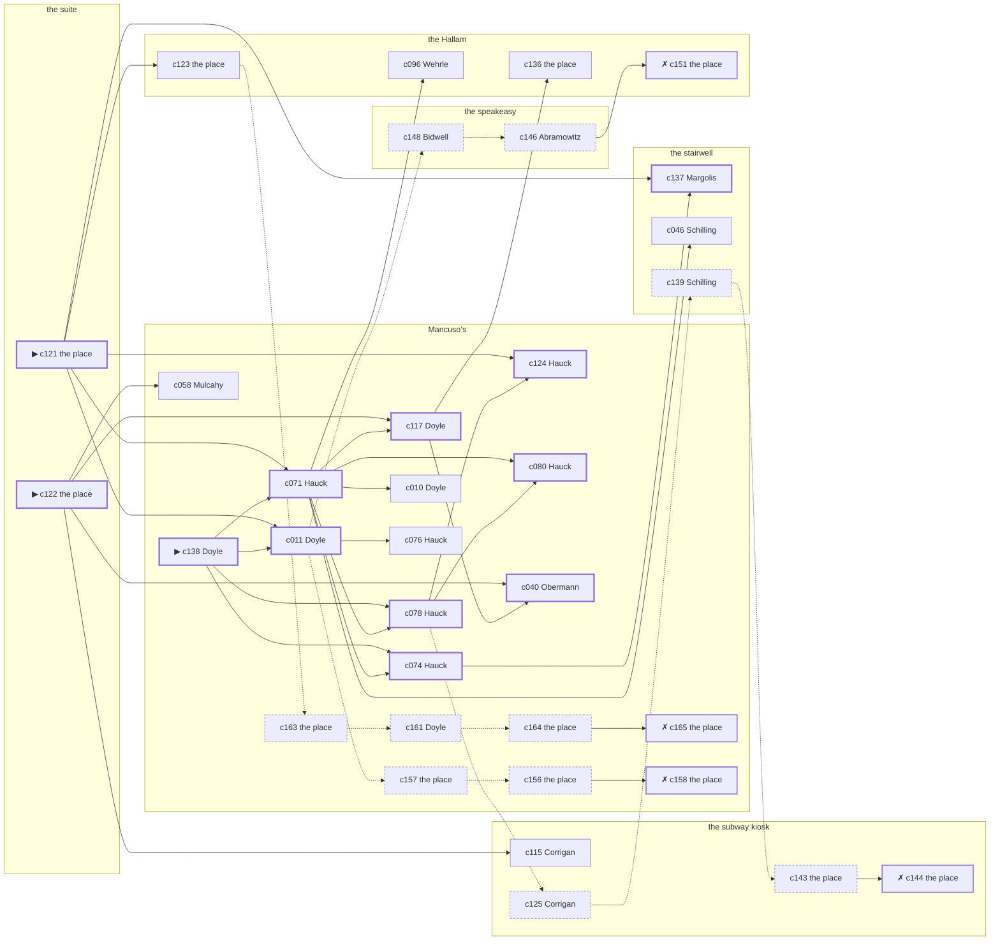

# Hell’s Kitchen — case 17

**Seed** 17 · **Difficulty** 2 · **Attempts** 1 · **Detective** Dashiell

**Par** 11 actions · **Slack** 6 · **Budget** 17 · **Findable** 34 (spine 12, corroboration 8, noise 10 + 4 disqualifiers) · **Noise ratio** 41% · **Candidate pool** 173

## 1. The Truth

James Mulcahy, a curb broker, the victim’s business partner, killed Klara Kreuzer, a bail bondsman, with a gunshot at the suite at 9:00 PM. Mulcahy wanted the victim out of a lease (property). Mulcahy had been at the Hallam earlier in the evening, where the weapon lived, and was alone with Kreuzer when it happened. Doyle hired us.

## 2. Dramatis Personae

| Name | Role | Relationship | Class of secret | Motive | Found at | Killer |
| --- | --- | --- | --- | --- | --- | --- |
| Klara Kreuzer | a bail bondsman | the victim | — | — | — | — |
| Nora Corrigan | a private nurse | named in the victim’s will | dope | — | the subway kiosk | — |
| Maureen Doyle (client) | a switchboard operator | the victim’s tenant | blackmail | — | Mancuso’s | — |
| Sol Sirkin | a policy runner | a childhood friend of the victim’s from the same block | fence | — | Mancuso’s | — |
| Konrad Obermann | a longshoreman | a childhood friend of the victim’s from the same block | fence | debt | Mancuso’s | — |
| Wilhelm Schilling | a hack driver | in the victim’s debt | fence | — | the stairwell | — |
| James Mulcahy | a curb broker | the victim’s business partner | murder | property | Mancuso’s | **YES** |
| Abraham Abramowitz | the bartender | fixture (bartender) | — | — | the speakeasy | — |
| Gretchen Hauck | the man behind the counter | fixture (counterman) | — | — | Mancuso’s | — |
| Bella Margolis | the landlady | fixture (landlady) | — | — | the stairwell | — |
| Albrecht Wehrle | the elevator man | fixture (elevator-man) | — | — | the Hallam | — |
| Lyman Bidwell | the patrolman on the beat | fixture (beat-cop) | — | — | the speakeasy | — |

## 3. Places

- **the victim’s suite at the residential hotel** (private) — unwatched; objects: a bottle of chloral drops, a camel-hair overcoat on a hook — **THE SCENE**; the victim’s address
- **the speakeasy under the hat shop** (semi) — watched by bartender (Abramowitz); objects: a silver cigarette case, a seltzer siphon
- **Mancuso’s pool hall** (semi) — watched by counterman (Hauck); objects: an ice pick, a standing ashtray
- **the subway kiosk at the corner** (public) — unwatched; objects: a brass umbrella stand, a folded stack of evening papers — within earshot of the scene
- **the stairwell of the Mott Street tenement** (semi) — watched by landlady (Margolis); objects: the roof-door key, a bronze bookend, a mop and bucket — within earshot of the scene
- **the vestibule of the Hallam apartments** (private) — watched by elevator-man (Wehrle); objects: a nickel-plated revolver, a day ledger — where the weapon lived

## 4. Anchors

The coroner gives 7:30 PM–9:00 PM, four ticks wide. These are what close it: **bar-radio** and **el-train**.

- **the fight card on the bar radio** — at 8:30 PM; at Mancuso’s. Only those present know that the challenger went down in the fourth and the crowd booed it. You can time things by it: the set was turned up loud enough to carry into the street.
- **the El going over** — at 6:00 PM, 7:00 PM, 8:00 PM, 9:00 PM, 10:00 PM, 11:00 PM; across the whole neighbourhood. You can time things by it: everything under the structure stops being audible for twenty seconds.
- **the beat cop’s pass** — at 6:00 PM, 7:30 PM, 9:00 PM, 10:30 PM; on a round through the speakeasy → the stairwell → the subway kiosk → Mancuso’s. Somebody reliable notes who was there.

## 5. Timelines

### Kreuzer — the victim

| Tick | Time | Truth | Claimed | Companion claimed |
| --- | --- | --- | --- | --- |
| 0 | 6:00 PM | the stairwell | the stairwell | — |
| 1 | 6:30 PM | the stairwell | the stairwell | — |
| 2 | 7:00 PM | the Hallam | the Hallam | — |
| 3 | 7:30 PM | the Hallam | the Hallam | — |
| 4 | 8:00 PM | the Hallam | the Hallam | — |
| 5 | 8:30 PM | Mancuso’s | Mancuso’s | — |
| 6 | 9:00 PM | the suite ☠ | the suite | — |
| 7 | 9:30 PM | — | — | — |
| 8 | 10:00 PM | — | — | — |
| 9 | 10:30 PM | — | — | — |
| 10 | 11:00 PM | — | — | — |
| 11 | 11:30 PM | — | — | — |

### Corrigan

| Tick | Time | Truth | Claimed | Companion claimed |
| --- | --- | --- | --- | --- |
| 0 | 6:00 PM | the Hallam | the Hallam | — |
| 1 | 6:30 PM | the Hallam | the Hallam | — |
| 2 | 7:00 PM | the stairwell | the stairwell | — |
| 3 | 7:30 PM | the subway kiosk | the subway kiosk | — |
| 4 | 8:00 PM | the subway kiosk | the subway kiosk | — |
| 5 | 8:30 PM | the subway kiosk | **Mancuso’s** | — |
| 6 | 9:00 PM | Mancuso’s | Mancuso’s | — |
| 7 | 9:30 PM | Mancuso’s | Mancuso’s | — |
| 8 | 10:00 PM | Mancuso’s | Mancuso’s | — |
| 9 | 10:30 PM | Mancuso’s | Mancuso’s | — |
| 10 | 11:00 PM | the subway kiosk | the subway kiosk | — |
| 11 | 11:30 PM | the subway kiosk | the subway kiosk | — |

### Doyle

| Tick | Time | Truth | Claimed | Companion claimed |
| --- | --- | --- | --- | --- |
| 0 | 6:00 PM | Mancuso’s | Mancuso’s | — |
| 1 | 6:30 PM | Mancuso’s | Mancuso’s | — |
| 2 | 7:00 PM | the Hallam | **the stairwell** | Sirkin |
| 3 | 7:30 PM | the Hallam | **the stairwell** | Sirkin |
| 4 | 8:00 PM | Mancuso’s | Mancuso’s | — |
| 5 | 8:30 PM | the subway kiosk | the subway kiosk | — |
| 6 | 9:00 PM | Mancuso’s | Mancuso’s | — |
| 7 | 9:30 PM | Mancuso’s | Mancuso’s | — |
| 8 | 10:00 PM | the stairwell | the stairwell | — |
| 9 | 10:30 PM | the stairwell | the stairwell | — |
| 10 | 11:00 PM | the stairwell | the stairwell | — |
| 11 | 11:30 PM | Mancuso’s | Mancuso’s | — |

### Sirkin

| Tick | Time | Truth | Claimed | Companion claimed |
| --- | --- | --- | --- | --- |
| 0 | 6:00 PM | the stairwell | the stairwell | — |
| 1 | 6:30 PM | the stairwell | the stairwell | — |
| 2 | 7:00 PM | the speakeasy | the speakeasy | — |
| 3 | 7:30 PM | the speakeasy | the speakeasy | — |
| 4 | 8:00 PM | the speakeasy | the speakeasy | — |
| 5 | 8:30 PM | the speakeasy | the speakeasy | — |
| 6 | 9:00 PM | Mancuso’s | **the Hallam** | — |
| 7 | 9:30 PM | Mancuso’s | Mancuso’s | — |
| 8 | 10:00 PM | Mancuso’s | Mancuso’s | — |
| 9 | 10:30 PM | Mancuso’s | Mancuso’s | — |
| 10 | 11:00 PM | Mancuso’s | Mancuso’s | — |
| 11 | 11:30 PM | the stairwell | the stairwell | — |

### Obermann

| Tick | Time | Truth | Claimed | Companion claimed |
| --- | --- | --- | --- | --- |
| 0 | 6:00 PM | Mancuso’s | Mancuso’s | — |
| 1 | 6:30 PM | Mancuso’s | Mancuso’s | — |
| 2 | 7:00 PM | the Hallam | the Hallam | — |
| 3 | 7:30 PM | the Hallam | the Hallam | — |
| 4 | 8:00 PM | the Hallam | the Hallam | — |
| 5 | 8:30 PM | the Hallam | the Hallam | — |
| 6 | 9:00 PM | Mancuso’s | **the subway kiosk** | — |
| 7 | 9:30 PM | Mancuso’s | Mancuso’s | — |
| 8 | 10:00 PM | Mancuso’s | Mancuso’s | — |
| 9 | 10:30 PM | Mancuso’s | Mancuso’s | — |
| 10 | 11:00 PM | Mancuso’s | Mancuso’s | — |
| 11 | 11:30 PM | Mancuso’s | Mancuso’s | — |

### Schilling

| Tick | Time | Truth | Claimed | Companion claimed |
| --- | --- | --- | --- | --- |
| 0 | 6:00 PM | the stairwell | the stairwell | — |
| 1 | 6:30 PM | Mancuso’s | Mancuso’s | — |
| 2 | 7:00 PM | Mancuso’s | Mancuso’s | — |
| 3 | 7:30 PM | the stairwell | the stairwell | — |
| 4 | 8:00 PM | the stairwell | the stairwell | — |
| 5 | 8:30 PM | the speakeasy | the speakeasy | — |
| 6 | 9:00 PM | Mancuso’s | Mancuso’s | — |
| 7 | 9:30 PM | Mancuso’s | Mancuso’s | — |
| 8 | 10:00 PM | the stairwell | the stairwell | — |
| 9 | 10:30 PM | Mancuso’s | **the stairwell** | — |
| 10 | 11:00 PM | the subway kiosk | the subway kiosk | — |
| 11 | 11:30 PM | the stairwell | the stairwell | — |

### Mulcahy — the killer

| Tick | Time | Truth | Claimed | Companion claimed |
| --- | --- | --- | --- | --- |
| 0 | 6:00 PM | the speakeasy | the speakeasy | — |
| 1 | 6:30 PM | the Hallam | the Hallam | — |
| 2 | 7:00 PM | the Hallam | the Hallam | — |
| 3 | 7:30 PM | the Hallam | the Hallam | — |
| 4 | 8:00 PM | the suite | **Mancuso’s** | Obermann |
| 5 | 8:30 PM | the suite | **Mancuso’s** | Obermann |
| 6 | 9:00 PM | the suite ☠ | **Mancuso’s** | Obermann |
| 7 | 9:30 PM | Mancuso’s | Mancuso’s | — |
| 8 | 10:00 PM | Mancuso’s | Mancuso’s | — |
| 9 | 10:30 PM | Mancuso’s | Mancuso’s | — |
| 10 | 11:00 PM | Mancuso’s | Mancuso’s | — |
| 11 | 11:30 PM | Mancuso’s | Mancuso’s | — |

### Fixtures (never lie, never withhold)

| Tick | Time | Abramowitz (the bartender) | Hauck (the man behind the counter) | Margolis (the landlady) | Wehrle (the elevator man) | Bidwell (the patrolman on the beat) |
| --- | --- | --- | --- | --- | --- | --- |
| 0 | 6:00 PM | the speakeasy | Mancuso’s | the stairwell | the Hallam | the speakeasy |
| 1 | 6:30 PM | the speakeasy | Mancuso’s | the stairwell | the speakeasy | — |
| 2 | 7:00 PM | the speakeasy | the stairwell | the stairwell | the Hallam | — |
| 3 | 7:30 PM | the speakeasy | Mancuso’s | the stairwell | the Hallam | the stairwell |
| 4 | 8:00 PM | the speakeasy | Mancuso’s | the stairwell | the Hallam | — |
| 5 | 8:30 PM | the speakeasy | Mancuso’s | the stairwell | the Hallam | — |
| 6 | 9:00 PM | the speakeasy | Mancuso’s | the stairwell | the Hallam | the subway kiosk |
| 7 | 9:30 PM | the speakeasy | Mancuso’s | the stairwell | the Hallam | — |
| 8 | 10:00 PM | the speakeasy | Mancuso’s | the stairwell | the Hallam | — |
| 9 | 10:30 PM | the speakeasy | Mancuso’s | the stairwell | the Hallam | Mancuso’s |
| 10 | 11:00 PM | the speakeasy | Mancuso’s | the stairwell | the Hallam | — |
| 11 | 11:30 PM | the speakeasy | Mancuso’s | the stairwell | the Hallam | — |

## 6. Secrets in play

- **Corrigan** (dope): Corrigan buys morphine at the subway kiosk from 8:30 PM and would rather be thought a murderer than a hop-head.
- **Doyle** (blackmail): Doyle meets the victim alone at the Hallam from 7:00 PM to 7:30 PM and asks for money.
- **Sirkin** (fence): Sirkin hands a parcel of stolen goods to a man at Mancuso’s from 9:00 PM.
- **Obermann** (fence): Obermann hands a parcel of stolen goods to a man at Mancuso’s from 9:00 PM.
- **Schilling** (fence): Schilling hands a parcel of stolen goods to a man at Mancuso’s from 10:30 PM.
- **Mulcahy** (murder): Mulcahy is at the suite from 8:00 PM to 9:00 PM, alone with Kreuzer when it happens at 9:00 PM.

## 7. Clue list — the 34 findable

The opening three, free at the start: c121, c122, c138. Everything else has to be led to. The full candidate pool is in the companion file.

### At the suite

- **c121** [spine ⟨opening⟩] (scene; the place itself) → c071, c011, c124, c137, c123
  - Kreuzer was found at the suite. The cigarette he had going burned itself out on the sill where it fell. The El went over at 9:00 PM, running to timetable, and for twenty seconds nothing under the structure can be heard at all.
  - _establishes: the victim dead by 9:00 PM; how it was done_
- **c122** [spine ⟨opening⟩] (morgue; the place itself) → c117, c040, c115, c058
  - The coroner puts death between 7:30 PM and 9:00 PM — two hours of nothing useful. One bullet below the sternum. Powder burns on the shirt front: fired close.
  - _establishes: death between 7:30 PM and 9:00 PM; how it was done_

### At the speakeasy

- **c148** [noise {b3}] (overheard; Bidwell on Doyle) → c146
  - Bidwell on Doyle: The victim had been drawing cash in amounts that did not match anything in the accounts.
  - _establishes: context only_
- **c146** [noise {b3}] (overheard; Abramowitz on Doyle) → c151
  - Abramowitz on Doyle: Doyle and the victim were heard at the Hallam, and one of them was doing all the talking.
  - _establishes: context only_

### At Mancuso’s

- **c138** [spine ⟨opening⟩] (client; Doyle on why I was hired) → c071, c078, c011, c074
  - Doyle hired us, and wants it known that Obermann owed the victim money, and would rather we started there.
  - _establishes: Obermann had a motive (debt)_
- **c071** [spine] (observation; Hauck on Corrigan) → c117, c078, c074, c080, c096, c010, c046
  - Hauck says Corrigan was at Mancuso’s from 9:00 PM to 10:30 PM.
  - _establishes: Corrigan at Mancuso’s, 9:00 PM–10:30 PM_
- **c117** [spine] (observation; Doyle on Mulcahy’s account) → c040, c136
  - Doyle was at Mancuso’s at 9:00 PM and says Mulcahy was not.
  - _establishes: Mulcahy not at Mancuso’s, 9:00 PM_
- **c078** [spine] (observation; Hauck on Obermann) → c124, c080, c125
  - Hauck says Obermann was at Mancuso’s from 9:00 PM to 11:30 PM.
  - _establishes: Obermann at Mancuso’s, 9:00 PM–11:30 PM_
- **c011** [spine] (observation; Doyle on Sirkin) → c076, c148, c157
  - Doyle says Sirkin was at Mancuso’s from 9:00 PM to 9:30 PM.
  - _establishes: Sirkin at Mancuso’s, 9:00 PM–9:30 PM_
- **c074** [spine] (observation; Hauck on Doyle) → c137
  - Hauck says Doyle was at Mancuso’s from 9:00 PM to 9:30 PM.
  - _establishes: Doyle at Mancuso’s, 9:00 PM–9:30 PM_
- **c124** [spine] (anchor; Hauck on Kreuzer that evening) → (end)
  - Hauck puts Kreuzer at Mancuso’s while the fight was on the radio, which was 8:30 PM, and alive enough to argue about the weather.
  - _establishes: the victim alive at 8:30 PM; Kreuzer at Mancuso’s, 8:30 PM_
- **c080** [spine] (observation; Hauck on Schilling) → (end)
  - Hauck says Schilling was at Mancuso’s from 9:00 PM to 9:30 PM.
  - _establishes: Schilling at Mancuso’s, 9:00 PM–9:30 PM_
- **c040** [spine] (observation; Obermann on Mulcahy) → (end)
  - Obermann says Mulcahy was at the Hallam from 7:00 PM to 7:30 PM.
  - _establishes: Mulcahy at the Hallam, 7:00 PM–7:30 PM; Mulcahy could reach the weapon_
- **c058** [corroboration] (observation; Mulcahy on Doyle) → (end)
  - Mulcahy says Doyle was at the Hallam from 7:00 PM to 7:30 PM.
  - _establishes: Doyle at the Hallam, 7:00 PM–7:30 PM; Doyle could reach the weapon_
- **c010** [corroboration] (observation; Doyle on Corrigan) → (end)
  - Doyle says Corrigan was at Mancuso’s from 9:00 PM to 9:30 PM.
  - _establishes: Corrigan at Mancuso’s, 9:00 PM–9:30 PM_
- **c076** [corroboration] (observation; Hauck on Sirkin) → (end)
  - Hauck says Sirkin was at Mancuso’s from 9:00 PM to 11:00 PM.
  - _establishes: Sirkin at Mancuso’s, 9:00 PM–11:00 PM_
- **c163** [noise {b2}] (physical; the place itself) → c161
  - Wrapping paper and a cut string at Mancuso’s, and the shop it came from closed two years ago.
  - _establishes: context only_
- **c161** [noise {b2}] (overheard; Doyle on Obermann) → c164
  - Doyle on Obermann: There is a man who meets people at Mancuso’s and nobody will say his name out loud.
  - _establishes: context only_
- **c164** [noise {b2}] (physical; the place itself) → c165
  - A pawn ticket at Mancuso’s in a name that does not exist, made out at the hour in question.
  - _establishes: context only_
- **c165** [disqualifier {b2}] (overheard; the place itself) → (end)
  - The receiver at Mancuso’s would rather talk than be held: Obermann was there from 9:00 PM handing over a parcel of somebody else’s silver, which is a charge Obermann will take over this one.
  - _establishes: Obermann’s fence accounted for; Obermann at Mancuso’s, 9:00 PM_
- **c157** [noise {b4}] (physical; the place itself) → c156
  - A pawn ticket at Mancuso’s in a name that does not exist, made out at the hour in question.
  - _establishes: context only_
- **c156** [noise {b4}] (physical; the place itself) → c158
  - Wrapping paper and a cut string at Mancuso’s, and the shop it came from closed two years ago.
  - _establishes: context only_
- **c158** [disqualifier {b4}] (overheard; the place itself) → (end)
  - The receiver at Mancuso’s would rather talk than be held: Sirkin was there from 9:00 PM handing over a parcel of somebody else’s silver, which is a charge Sirkin will take over this one.
  - _establishes: Sirkin’s fence accounted for; Sirkin at Mancuso’s, 9:00 PM_

### At the subway kiosk

- **c115** [corroboration] (observation; Corrigan on Mulcahy’s account) → (end)
  - Corrigan was at Mancuso’s at 9:00 PM and says Mulcahy was not.
  - _establishes: Mulcahy not at Mancuso’s, 9:00 PM_
- **c125** [noise {b1}] (anchor; Corrigan on the fight card on the bar radio) → c139
  - Corrigan claims Mancuso’s at 8:30 PM, which is when the fight card on the bar radio was on. Asked about it, Corrigan cannot say that the challenger went down in the fourth and the crowd booed it — and everybody who was there can.
  - _establishes: Corrigan not at Mancuso’s, 8:30 PM_
- **c143** [noise {b1}] (physical; the place itself) → c144
  - A prescription blank at the subway kiosk signed by a doctor who has been dead since the spring.
  - _establishes: context only_
- **c144** [disqualifier {b1}] (overheard; the place itself) → (end)
  - The man who sells it at the subway kiosk gives it up rather than be held: Corrigan was there from 8:30 PM, and stayed until it took hold.
  - _establishes: Corrigan’s dope accounted for; Corrigan at the subway kiosk, 8:30 PM_

### At the stairwell

- **c137** [spine] (overheard; Margolis on Mulcahy and Kreuzer) → (end)
  - Margolis says Kreuzer told Mulcahy the lease would go to somebody else at the quarter day.
  - _establishes: Mulcahy had a motive (property)_
- **c046** [corroboration] (observation; Schilling on Doyle) → (end)
  - Schilling says Doyle was at Mancuso’s from 9:00 PM to 9:30 PM.
  - _establishes: Doyle at Mancuso’s, 9:00 PM–9:30 PM_
- **c139** [noise {b1}] (overheard; Schilling on Corrigan) → c143
  - Schilling on Corrigan: Corrigan’s sleeves are buttoned at the wrist in a warm room.
  - _establishes: context only_

### At the Hallam

- **c136** [corroboration] (document; the place itself) → (end)
  - Found at the Hallam: A lease assignment made out in Mulcahy’s name, waiting only on Kreuzer’s signature.
  - _establishes: Mulcahy had a motive (property)_
- **c096** [corroboration] (observation; Wehrle on Mulcahy) → (end)
  - Wehrle says Mulcahy was at the Hallam from 7:00 PM to 7:30 PM.
  - _establishes: Mulcahy at the Hallam, 7:00 PM–7:30 PM; Mulcahy could reach the weapon_
- **c123** [corroboration] (physical; the place itself) → c163
  - A nickel-plated revolver is gone from the Hallam. The drawer it was kept in is open and the oiled cloth is still in it.
  - _establishes: something gone from the Hallam; how it was done_
- **c151** [disqualifier {b3}] (overheard; the place itself) → (end)
  - The victim’s bank book settles it: four payments, and Doyle at the Hallam from 7:00 PM to 7:30 PM collecting the fifth. It is extortion, and an extortionist wants the man alive.
  - _establishes: Doyle’s blackmail accounted for; Doyle at the Hallam, 7:00 PM–7:30 PM_

## 8. Clue graph

## 9. Deduction path

Par is **11 actions** and the budget is par plus 6: **17**. Every id below is a spine clue; the inference is the sheet’s, not the clue’s.

**Time of death.** The coroner gives four ticks. The anchors close it to 9:00 PM: one puts Kreuzer alive at 8:30 PM, the other times the scene at 9:00 PM. _(c122, c124, c121)_

**Clearing the innocent.**

- Corrigan was not at the suite at 9:00 PM. _(c071; + 1 corroborating)_
- Doyle was not at the suite at 9:00 PM. _(c074; + 1 corroborating)_
- Sirkin was not at the suite at 9:00 PM. _(c011; + 2 corroborating)_
- Obermann was not at the suite at 9:00 PM. _(c078; + 1 corroborating)_
- Schilling was not at the suite at 9:00 PM. _(c080)_

**Naming the killer.** Mulcahy claims Mancuso’s at 9:00 PM. Two independent sources put that out of the question. _(c117; + 1 corroborating)_

**The weapon.** Mulcahy was at the Hallam before 9:00 PM, where a nickel-plated revolver was kept. _(c040; + 1 corroborating)_

**Method.** A gunshot, on two physical sources. _(c121, c122; + 1 corroborating)_

**Motive.** property, on two independent sources. _(c137; + 1 corroborating)_

## 10. Red herrings

**Innocents who lie about the murder tick:**

- Sirkin claims the Hallam at 9:00 PM and was really at Mancuso’s. Reason: Sirkin hands a parcel of stolen goods to a man at Mancuso’s from 9:00 PM.
- Obermann claims the subway kiosk at 9:00 PM and was really at Mancuso’s. Reason: Obermann hands a parcel of stolen goods to a man at Mancuso’s from 9:00 PM.

**Innocents with a motive:**

- Obermann — debt: owed the victim money.

**Noise branches, and what knocks each one down:**

- **b1** (Corrigan, dope): c125 → c139 → c143 → **c144** — The man who sells it at the subway kiosk gives it up rather than be held: Corrigan was there from 8:30 PM, and stayed until it took hold.
- **b2** (Obermann, fence): c163 → c161 → c164 → **c165** — The receiver at Mancuso’s would rather talk than be held: Obermann was there from 9:00 PM handing over a parcel of somebody else’s silver, which is a charge Obermann will take over this one.
- **b3** (Doyle, blackmail): c148 → c146 → **c151** — The victim’s bank book settles it: four payments, and Doyle at the Hallam from 7:00 PM to 7:30 PM collecting the fifth. It is extortion, and an extortionist wants the man alive.
- **b4** (Sirkin, fence): c157 → c156 → **c158** — The receiver at Mancuso’s would rather talk than be held: Sirkin was there from 9:00 PM handing over a parcel of somebody else’s silver, which is a charge Sirkin will take over this one.

