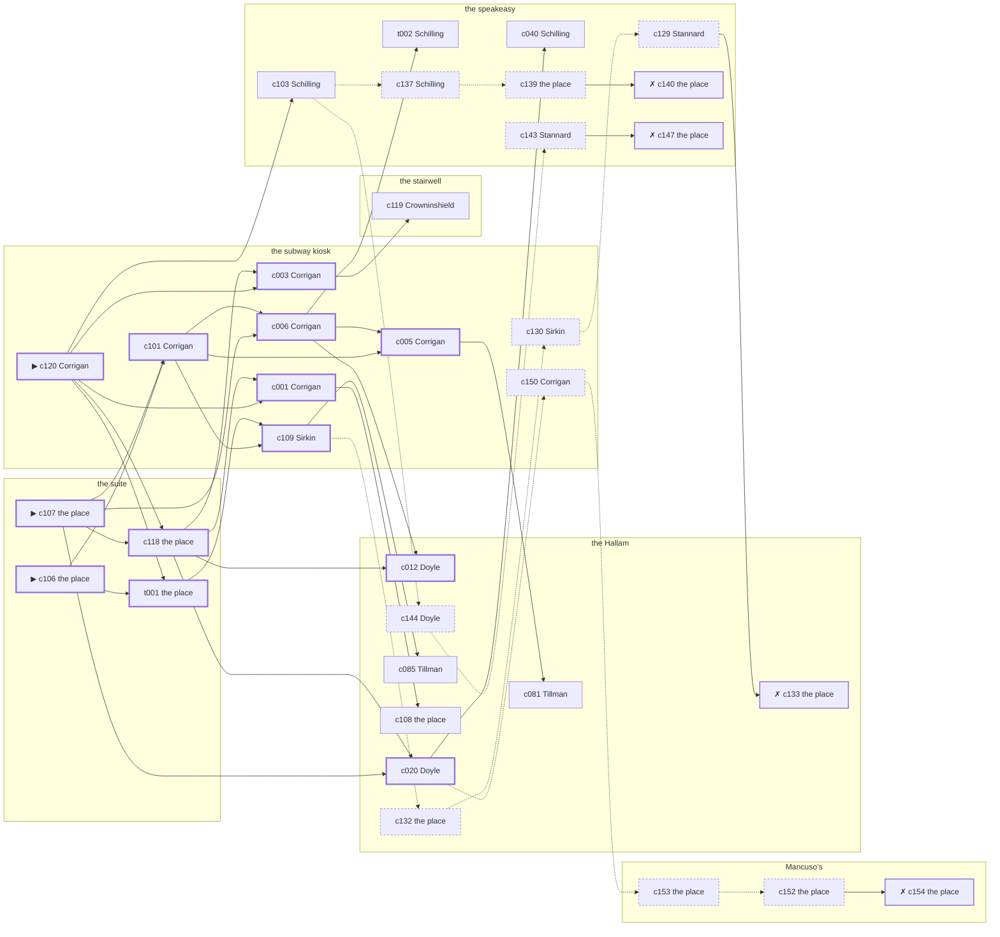

# Hell’s Kitchen — case 17

**Seed** 17 · **Difficulty** 2 · **Attempts** 1 · **Detective** Dashiell

**Type** murder · **Trope** body-at-scene · **Unknowns** who, why, when

**Par** 12 actions · **Slack** 6 · **Budget** 18 · **Findable** 34 (spine 13, corroboration 7, noise 10 + 4 disqualifiers) · **Noise ratio** 41% · **Candidate pool** 157

## 1. The Truth

James Mulcahy, a curb broker, Kreuzer’s business partner, killed Klara Kreuzer, a bail bondsman, with a gunshot at the suite at 10:00 PM. Mulcahy wanted Kreuzer out of the lease and the lease in Mulcahy’s name (property). Mulcahy had been at the Hallam earlier in the evening, where the means lived, and was alone with Kreuzer when it happened. Corrigan hired us.

## 2. The Act

**murder** · **body-at-scene** · actor **Mulcahy** · at **the suite** · at **10:00 PM**

- found at the suite
- fate: dead

**Givens** — what the briefing states and the report does not ask:

- Kreuzer was found dead at the suite.
- Kreuzer was killed at the suite, and nothing was carried out of the room afterwards.
- The coroner puts it between 10:00 PM and 11:30 PM, which is two hours of nothing useful.
- It was a gunshot.

**Unknowns** — exactly what the report asks: **who**, **why**, **when**.

## 3. Dramatis Personae

| Name | Role | Relationship | Class of secret | Motive | Found at | Killer |
| --- | --- | --- | --- | --- | --- | --- |
| Klara Kreuzer | a bail bondsman | the victim | — | — | — | — |
| Nora Corrigan (client) | a private nurse | named in Kreuzer’s will | dope | — | the subway kiosk | — |
| Maureen Doyle | a switchboard operator | Kreuzer’s tenant | blackmail | — | the Hallam | — |
| Sol Sirkin | a policy runner | a childhood friend of Kreuzer’s from the same block | fence | — | the subway kiosk | — |
| Konrad Obermann | a longshoreman | a childhood friend of Kreuzer’s from the same block | fence | debt | Mancuso’s | — |
| Wilhelm Schilling | a hack driver | in Kreuzer’s debt | fence | — | the speakeasy | — |
| James Mulcahy | a curb broker | Kreuzer’s business partner | murder | property | the Hallam | **YES** |
| Abraham Abramowitz | the bartender | fixture (bartender) | — | — | the speakeasy | — |
| Friedrich Reinhardt | the man behind the counter | fixture (counterman) | — | — | Mancuso’s | — |
| Marion Crowninshield | the landlady | fixture (landlady) | — | — | the stairwell | — |
| Augustus Tillman | the elevator man | fixture (elevator-man) | — | — | the Hallam | — |
| Prescott Stannard | the patrolman on the beat | fixture (beat-cop) | — | — | the speakeasy | — |

## 4. Dossiers

Every person, by layer: **0** on sight, **1** volunteered, **2** from other people, **3** in the documents.

### Kreuzer — the victim

51, a woman, a bail bondsman. Wants: money.

- **Standing** — Kreuzer was the first telephone call anybody on the street made at two in the morning.
- **Profession** — Kreuzer took a house or a wedding ring as security and kept the paper on both.
- **Found** — Corrigan found Kreuzer at the suite at 11:30 PM. By Corrigan, at the suite, at 11:30 PM. Precinct: came-and-went.

**Layer 0, on sight**

- _gender_ — A woman.
- _age_ — In her fifties.

**Layer 1, volunteered**

- _profession_ — A bail bondsman.
- _detail_ — Kreuzer took a house or a wedding ring as security and kept the paper on both.

**Layer 2, from other people**

- _tie_ — Kreuzer was the first telephone call anybody on the street made at two in the morning.
- _want_ — Kreuzer wants money, and is not particular about the shape it arrives in.

**Self-account** (layer 1, what they say when asked about themselves)

- Kreuzer is 51 years old and a bail bondsman.
- Kreuzer took a house or a wedding ring as security and kept the paper on both.
- Kreuzer is the one this is about.

### Corrigan — the client

33, a woman, a private nurse. Wants: to-be-forgiven. Tie: named in Kreuzer’s will, for as long as there has been a will.

**Layer 0, on sight**

- _gender_ — A woman.
- _age_ — In her thirties.
- _profession_ — A private nurse.

**Layer 1, volunteered**

- _detail_ — Corrigan has a registry card and takes the cases nobody else will.

**Layer 2, from other people**

- _tie_ — Kreuzer told Corrigan there was something in the will and never said how much.
- _want_ — Corrigan wants to be forgiven for something nobody else remembers.
- _since_ — Corrigan has been named in Kreuzer’s will, for as long as there has been a will.

**Layer 3, in the documents**

- _secret-hint_ — Corrigan’s sleeves are buttoned at the wrist in a warm room.

**Self-account** (layer 1, what they say when asked about themselves)

- Corrigan is 33 years old and a private nurse.
- Corrigan has a registry card and takes the cases nobody else will.
- Corrigan is named in Kreuzer’s will.

### Doyle

20, a woman, a switchboard operator. Wants: to-get-out. Tie: Kreuzer’s tenant, four years in the same rooms.

**Layer 0, on sight**

- _gender_ — A woman.
- _age_ — Not much past twenty.
- _profession_ — A switchboard operator.

**Layer 1, volunteered**

- _detail_ — Doyle plugs the calls through and is not supposed to listen.

**Layer 2, from other people**

- _tie_ — Doyle took the rooms over the speakeasy from Kreuzer and has been two weeks behind since the spring.
- _want_ — Doyle wants out of the neighbourhood and has wanted it for years.
- _since_ — Doyle has been Kreuzer’s tenant, four years in the same rooms.

**Layer 3, in the documents**

- _secret-hint_ — Doyle and Kreuzer were heard at the Hallam, and one of them was doing all the talking.

**Self-account** (layer 1, what they say when asked about themselves)

- Doyle is 20 years old and a switchboard operator.
- Doyle plugs the calls through and is not supposed to listen.
- Doyle is Kreuzer’s tenant.

### Sirkin

26, a man, a policy runner. Wants: to-get-out. Tie: a childhood friend of Kreuzer’s from the same block, since they were boys on the same stoop.

**Layer 0, on sight**

- _gender_ — A man.
- _age_ — In the late twenties.

**Layer 1, volunteered**

- _profession_ — A policy runner.
- _detail_ — Sirkin carries the slips between four corners and a candy store.

**Layer 2, from other people**

- _tie_ — Sirkin and Kreuzer grew up on the same block and have known each other since ’22.
- _want_ — Sirkin wants out of the neighbourhood and has wanted it for years.
- _since_ — Sirkin has been a childhood friend of Kreuzer’s from the same block, since they were boys on the same stoop.

**Layer 3, in the documents**

- _secret-hint_ — Sirkin was carrying a parcel into the speakeasy and came out without it.

**Self-account** (layer 1, what they say when asked about themselves)

- Sirkin is 26 years old and a policy runner.
- Sirkin carries the slips between four corners and a candy store.
- Sirkin is a childhood friend of Kreuzer’s from the same block.

### Obermann

29, a man, a longshoreman. Wants: to-keep-what-they-have. Tie: a childhood friend of Kreuzer’s from the same block, all their lives.

**Layer 0, on sight**

- _gender_ — A man.
- _age_ — In the late twenties.
- _profession_ — A longshoreman.

**Layer 1, volunteered**

- _detail_ — Obermann works the Elizabeth Street pier when there is work.

**Layer 2, from other people**

- _tie_ — Obermann, Kreuzer and Martin Quill were inseparable for ten years and have not been in a room together since.
- _want_ — Obermann wants to keep what they have and add nothing to it.
- _since_ — Obermann has been a childhood friend of Kreuzer’s from the same block, all their lives.
- _third_ — Martin Quill is a partner who walked out of the business.

**Layer 3, in the documents**

- _secret-hint_ — Obermann was carrying a parcel into the speakeasy and came out without it.

**Self-account** (layer 1, what they say when asked about themselves)

- Obermann is 29 years old and a longshoreman.
- Obermann works the Elizabeth Street pier when there is work.
- Obermann is a childhood friend of Kreuzer’s from the same block.

### Schilling

31, a man, a hack driver. Wants: to-keep-what-they-have. Tie: in Kreuzer’s debt, since the flu year.

**Layer 0, on sight**

- _gender_ — A man.
- _age_ — In his thirties.
- _profession_ — A hack driver.

**Layer 1, volunteered**

- _detail_ — Schilling works the stand outside the hotel from six until the small hours.

**Layer 2, from other people**

- _tie_ — Schilling has owed Kreuzer money since ’25 and has not been asked for it lately.
- _want_ — Schilling wants to keep what they have and add nothing to it.
- _since_ — Schilling has been in Kreuzer’s debt, since the flu year.

**Layer 3, in the documents**

- _secret-hint_ — Schilling was carrying a parcel into Mancuso’s and came out without it.

**Self-account** (layer 1, what they say when asked about themselves)

- Schilling is 31 years old and a hack driver.
- Schilling works the stand outside the hotel from six until the small hours.
- Schilling is in Kreuzer’s debt.

### Mulcahy — the killer

52, a man, a curb broker. Wants: to-be-somebody. Tie: Kreuzer’s business partner, going on eight years.

**Layer 0, on sight**

- _gender_ — A man.
- _age_ — In his fifties.

**Layer 1, volunteered**

- _profession_ — A curb broker.
- _detail_ — Mulcahy carries three telephone numbers and no office.

**Layer 2, from other people**

- _tie_ — Mulcahy and Kreuzer took the lease together in ’23 and have been arguing about it since.
- _want_ — Mulcahy wants a name people know.
- _since_ — Mulcahy has been Kreuzer’s business partner, going on eight years.

**Self-account** (layer 1, what they say when asked about themselves)

- Mulcahy is 52 years old and a curb broker.
- Mulcahy carries three telephone numbers and no office.
- Mulcahy is Kreuzer’s business partner.

### Abramowitz

31, a man, the bartender. Wants: money. Tie: behind the bar at the speakeasy, every night of the week.

**Layer 0, on sight**

- _gender_ — A man.
- _age_ — In his thirties.
- _profession_ — The bartender.

**Layer 1, volunteered**

- _detail_ — Abramowitz works the speakeasy from four until they lock the door.

**Layer 2, from other people**

- _tie_ — Abramowitz is behind the bar at the speakeasy, every night of the week.
- _want_ — Abramowitz wants money, and is not particular about the shape it arrives in.

**Self-account** (layer 1, what they say when asked about themselves)

- Abramowitz is 31 years old and the bartender.
- Abramowitz works the speakeasy from four until they lock the door.
- Abramowitz is behind the bar at the speakeasy, every night of the week.

### Reinhardt

43, a man, the man behind the counter. Wants: to-be-left-alone. Tie: behind the counter at Mancuso’s.

**Layer 0, on sight**

- _gender_ — A man.
- _age_ — In his forties.
- _profession_ — The man behind the counter.

**Layer 1, volunteered**

- _detail_ — Reinhardt has the counter at Mancuso’s from four until midnight.

**Layer 2, from other people**

- _tie_ — Reinhardt is behind the counter at Mancuso’s.
- _want_ — Reinhardt wants to be left alone.

**Self-account** (layer 1, what they say when asked about themselves)

- Reinhardt is 43 years old and the man behind the counter.
- Reinhardt has the counter at Mancuso’s from four until midnight.
- Reinhardt is behind the counter at Mancuso’s.

### Crowninshield

59, a woman, the landlady. Wants: money. Tie: the keeper of the stairwell.

**Layer 0, on sight**

- _gender_ — A woman.
- _age_ — In her fifties.
- _profession_ — The landlady.

**Layer 1, volunteered**

- _detail_ — Crowninshield has kept the stairwell for twenty-two years and knows every board that creaks.

**Layer 2, from other people**

- _tie_ — Crowninshield is the keeper of the stairwell.
- _want_ — Crowninshield wants money, and is not particular about the shape it arrives in.

**Self-account** (layer 1, what they say when asked about themselves)

- Crowninshield is 59 years old and the landlady.
- Crowninshield has kept the stairwell for twenty-two years and knows every board that creaks.
- Crowninshield is the keeper of the stairwell.

### Tillman

41, a man, the elevator man. Wants: money. Tie: in the car at the Hallam.

**Layer 0, on sight**

- _gender_ — A man.
- _age_ — In his forties.
- _profession_ — The elevator man.

**Layer 1, volunteered**

- _detail_ — Tillman has the car at the Hallam from three until eleven.

**Layer 2, from other people**

- _tie_ — Tillman is in the car at the Hallam.
- _want_ — Tillman wants money, and is not particular about the shape it arrives in.

**Self-account** (layer 1, what they say when asked about themselves)

- Tillman is 41 years old and the elevator man.
- Tillman has the car at the Hallam from three until eleven.
- Tillman is in the car at the Hallam.

### Stannard

46, a man, the patrolman on the beat. Wants: respectability. Tie: the patrolman whose post takes in the speakeasy.

**Layer 0, on sight**

- _gender_ — A man.
- _age_ — In his forties.
- _profession_ — The patrolman on the beat.

**Layer 1, volunteered**

- _detail_ — Stannard came on at six and will go off at two, the same as every night.

**Layer 2, from other people**

- _tie_ — Stannard is the patrolman whose post takes in the speakeasy.
- _want_ — Stannard wants to be thought respectable by people who are not.

**Self-account** (layer 1, what they say when asked about themselves)

- Stannard is 46 years old and the patrolman on the beat.
- Stannard came on at six and will go off at two, the same as every night.
- Stannard is the patrolman whose post takes in the speakeasy.

## 5. The Client

**Corrigan**, named in Kreuzer’s will. Purpose: **clear-my-name**.

- **Why** — Corrigan wants it established that it was not them, before anybody says otherwise.
- **What it costs** — Corrigan was near enough to it that night to know exactly how it looks, and says so first.
- **Points at** — Obermann: Obermann owed Kreuzer four thousand dollars and was past due on it. Honest: **yes**.

**Tells:**

- Kreuzer was found dead at the suite.
- Kreuzer was killed at the suite, and nothing was carried out of the room afterwards.
- The coroner puts it between 10:00 PM and 11:30 PM, which is two hours of nothing useful.
- It was a gunshot.
- Corrigan would rather we started with Obermann: Obermann owed Kreuzer four thousand dollars and was past due on it.

**Withholds:**

- Corrigan does not mention it, but Corrigan buys morphine at the subway kiosk from 9:00 PM to 9:30 PM and would rather be thought a murderer than a hop-head.

**Their own evening, as they tell it:**

- Corrigan says she was at Mancuso’s at 6:00 PM.
- Corrigan says she was at the Hallam from 6:30 PM to 7:00 PM.
- Corrigan says she was at the subway kiosk from 7:30 PM to 8:30 PM.
- Corrigan says she was at the stairwell from 9:00 PM to 9:30 PM.

## 6. The Briefing

16 plain sentences, derived. This is the model of the plain register: the engine renders it, and Phase 2 measures pages against it.

1. A woman came up the stairs after midnight, and sat down.
2. Nora Corrigan is 33 years old and a private nurse.
3. Corrigan has a registry card and takes the cases nobody else will.
4. Kreuzer was the first telephone call anybody on the street made at two in the morning.
5. Kreuzer was found dead at the suite.
6. Kreuzer was killed at the suite, and nothing was carried out of the room afterwards.
7. The coroner puts it between 10:00 PM and 11:30 PM, which is two hours of nothing useful.
8. It was a gunshot.
9. Corrigan found Kreuzer at the suite at 11:30 PM.
10. The precinct came, walked through it, and went.
11. Corrigan is named in Kreuzer’s will.
12. Kreuzer told Corrigan there was something in the will and never said how much.
13. Corrigan wants it established that it was not them, before anybody says otherwise.
14. Corrigan was near enough to it that night to know exactly how it looks, and says so first.
15. Corrigan wants us to start with Obermann.
16. Obermann owed Kreuzer four thousand dollars and was past due on it.

## 7. Mentions

- **Martin Quill** (m-1) — a partner who walked out of the business. Martin Quill is a partner who walked out of the business.

## 8. Places

- **Kreuzer’s suite at the residential hotel** (private) — unwatched; objects: a bottle of chloral drops, a camel-hair overcoat on a hook — **THE SCENE**; the victim’s address
- **the speakeasy under the hat shop** (semi) — watched by bartender (Abramowitz); objects: a silver cigarette case, a seltzer siphon
- **Mancuso’s pool hall** (semi) — watched by counterman (Reinhardt); objects: an ice pick, a standing ashtray
- **the subway kiosk at the corner** (public) — unwatched; objects: a brass umbrella stand, a folded stack of evening papers — within earshot of the scene
- **the stairwell of the Mott Street tenement** (semi) — watched by landlady (Crowninshield); objects: the roof-door key, a bronze bookend, a mop and bucket — within earshot of the scene
- **the vestibule of the Hallam apartments** (private) — watched by elevator-man (Tillman); objects: a nickel-plated revolver, a day ledger — where the weapon lived

## 9. Anchors

The coroner gives 10:00 PM–11:30 PM, four ticks wide. These are what close it: **bar-radio** and **el-train**.

- **the fight card on the bar radio** — at 9:30 PM; at Mancuso’s. Only those present know that the challenger went down in the fourth and the crowd booed it. You can time things by it: the set was turned up loud enough to carry into the street.
- **the El going over** — at 6:00 PM, 7:00 PM, 8:00 PM, 9:00 PM, 10:00 PM, 11:00 PM; across the whole neighbourhood. You can time things by it: everything under the structure stops being audible for twenty seconds.
- **the beat cop’s pass** — at 6:00 PM, 7:30 PM, 9:00 PM, 10:30 PM; on a round through the speakeasy → the stairwell → the subway kiosk → Mancuso’s. Somebody reliable notes who was there.

## 10. Timelines

### Kreuzer — the victim

| Tick | Time | Truth | Claimed | Companion claimed |
| --- | --- | --- | --- | --- |
| 0 | 6:00 PM | the stairwell | the stairwell | — |
| 1 | 6:30 PM | the stairwell | the stairwell | — |
| 2 | 7:00 PM | the stairwell | the stairwell | — |
| 3 | 7:30 PM | the Hallam | the Hallam | — |
| 4 | 8:00 PM | the Hallam | the Hallam | — |
| 5 | 8:30 PM | the Hallam | the Hallam | — |
| 6 | 9:00 PM | the Hallam | the Hallam | — |
| 7 | 9:30 PM | Mancuso’s | Mancuso’s | — |
| 8 | 10:00 PM | the suite ☠ | the suite | — |
| 9 | 10:30 PM | — | — | — |
| 10 | 11:00 PM | — | — | — |
| 11 | 11:30 PM | — | — | — |

### Corrigan

| Tick | Time | Truth | Claimed | Companion claimed |
| --- | --- | --- | --- | --- |
| 0 | 6:00 PM | Mancuso’s | Mancuso’s | — |
| 1 | 6:30 PM | the Hallam | the Hallam | — |
| 2 | 7:00 PM | the Hallam | the Hallam | — |
| 3 | 7:30 PM | the subway kiosk | the subway kiosk | — |
| 4 | 8:00 PM | the subway kiosk | the subway kiosk | — |
| 5 | 8:30 PM | the subway kiosk | the subway kiosk | — |
| 6 | 9:00 PM | the subway kiosk | **the stairwell** | — |
| 7 | 9:30 PM | the subway kiosk | **the stairwell** | — |
| 8 | 10:00 PM | the speakeasy | the speakeasy | — |
| 9 | 10:30 PM | the speakeasy | the speakeasy | — |
| 10 | 11:00 PM | the speakeasy | the speakeasy | — |
| 11 | 11:30 PM | the suite | the suite | — |

### Doyle

| Tick | Time | Truth | Claimed | Companion claimed |
| --- | --- | --- | --- | --- |
| 0 | 6:00 PM | the speakeasy | the speakeasy | — |
| 1 | 6:30 PM | the stairwell | the stairwell | — |
| 2 | 7:00 PM | the stairwell | the stairwell | — |
| 3 | 7:30 PM | the Hallam | **the subway kiosk** | — |
| 4 | 8:00 PM | the Hallam | the Hallam | — |
| 5 | 8:30 PM | Mancuso’s | Mancuso’s | — |
| 6 | 9:00 PM | the Hallam | the Hallam | — |
| 7 | 9:30 PM | the Hallam | the Hallam | — |
| 8 | 10:00 PM | the speakeasy | the speakeasy | — |
| 9 | 10:30 PM | the subway kiosk | the subway kiosk | — |
| 10 | 11:00 PM | the subway kiosk | the subway kiosk | — |
| 11 | 11:30 PM | the Hallam | the Hallam | — |

### Sirkin

| Tick | Time | Truth | Claimed | Companion claimed |
| --- | --- | --- | --- | --- |
| 0 | 6:00 PM | the subway kiosk | the subway kiosk | — |
| 1 | 6:30 PM | the subway kiosk | the subway kiosk | — |
| 2 | 7:00 PM | the stairwell | the stairwell | — |
| 3 | 7:30 PM | the stairwell | the stairwell | — |
| 4 | 8:00 PM | the subway kiosk | the subway kiosk | — |
| 5 | 8:30 PM | the subway kiosk | the subway kiosk | — |
| 6 | 9:00 PM | the suite | the suite | — |
| 7 | 9:30 PM | Mancuso’s | Mancuso’s | — |
| 8 | 10:00 PM | the speakeasy | **the Hallam** | Schilling |
| 9 | 10:30 PM | the speakeasy | the speakeasy | — |
| 10 | 11:00 PM | the speakeasy | the speakeasy | — |
| 11 | 11:30 PM | the subway kiosk | the subway kiosk | — |

### Obermann

| Tick | Time | Truth | Claimed | Companion claimed |
| --- | --- | --- | --- | --- |
| 0 | 6:00 PM | Mancuso’s | Mancuso’s | — |
| 1 | 6:30 PM | Mancuso’s | Mancuso’s | — |
| 2 | 7:00 PM | Mancuso’s | Mancuso’s | — |
| 3 | 7:30 PM | the stairwell | the stairwell | — |
| 4 | 8:00 PM | the stairwell | the stairwell | — |
| 5 | 8:30 PM | Mancuso’s | Mancuso’s | — |
| 6 | 9:00 PM | the stairwell | the stairwell | — |
| 7 | 9:30 PM | the stairwell | the stairwell | — |
| 8 | 10:00 PM | the speakeasy | **the stairwell** | — |
| 9 | 10:30 PM | the speakeasy | the speakeasy | — |
| 10 | 11:00 PM | the speakeasy | the speakeasy | — |
| 11 | 11:30 PM | the speakeasy | the speakeasy | — |

### Schilling

| Tick | Time | Truth | Claimed | Companion claimed |
| --- | --- | --- | --- | --- |
| 0 | 6:00 PM | the speakeasy | the speakeasy | — |
| 1 | 6:30 PM | Mancuso’s | **the stairwell** | — |
| 2 | 7:00 PM | Mancuso’s | Mancuso’s | — |
| 3 | 7:30 PM | Mancuso’s | Mancuso’s | — |
| 4 | 8:00 PM | Mancuso’s | Mancuso’s | — |
| 5 | 8:30 PM | Mancuso’s | Mancuso’s | — |
| 6 | 9:00 PM | the speakeasy | the speakeasy | — |
| 7 | 9:30 PM | the speakeasy | the speakeasy | — |
| 8 | 10:00 PM | the speakeasy | the speakeasy | — |
| 9 | 10:30 PM | the speakeasy | the speakeasy | — |
| 10 | 11:00 PM | the speakeasy | the speakeasy | — |
| 11 | 11:30 PM | the speakeasy | the speakeasy | — |

### Mulcahy — the killer

| Tick | Time | Truth | Claimed | Companion claimed |
| --- | --- | --- | --- | --- |
| 0 | 6:00 PM | Mancuso’s | Mancuso’s | — |
| 1 | 6:30 PM | Mancuso’s | Mancuso’s | — |
| 2 | 7:00 PM | the subway kiosk | the subway kiosk | — |
| 3 | 7:30 PM | the subway kiosk | the subway kiosk | — |
| 4 | 8:00 PM | the subway kiosk | the subway kiosk | — |
| 5 | 8:30 PM | the Hallam | the Hallam | — |
| 6 | 9:00 PM | the Hallam | the Hallam | — |
| 7 | 9:30 PM | the suite | **the speakeasy** | Sirkin |
| 8 | 10:00 PM | the suite ☠ | **the speakeasy** | Sirkin |
| 9 | 10:30 PM | the Hallam | the Hallam | — |
| 10 | 11:00 PM | the Hallam | the Hallam | — |
| 11 | 11:30 PM | the Hallam | the Hallam | — |

### Fixtures (never lie, never withhold)

| Tick | Time | Abramowitz (the bartender) | Reinhardt (the man behind the counter) | Crowninshield (the landlady) | Tillman (the elevator man) | Stannard (the patrolman on the beat) |
| --- | --- | --- | --- | --- | --- | --- |
| 0 | 6:00 PM | the speakeasy | Mancuso’s | the stairwell | the Hallam | the speakeasy |
| 1 | 6:30 PM | the speakeasy | Mancuso’s | the stairwell | the Hallam | — |
| 2 | 7:00 PM | the Hallam | Mancuso’s | the stairwell | the Hallam | — |
| 3 | 7:30 PM | the speakeasy | the Hallam | the stairwell | the Hallam | the stairwell |
| 4 | 8:00 PM | the speakeasy | Mancuso’s | the stairwell | the Hallam | — |
| 5 | 8:30 PM | the speakeasy | Mancuso’s | the stairwell | the Hallam | — |
| 6 | 9:00 PM | the speakeasy | Mancuso’s | the stairwell | the Hallam | the subway kiosk |
| 7 | 9:30 PM | the speakeasy | Mancuso’s | the stairwell | the Hallam | — |
| 8 | 10:00 PM | the speakeasy | Mancuso’s | the stairwell | the Hallam | — |
| 9 | 10:30 PM | the speakeasy | Mancuso’s | the stairwell | the Hallam | Mancuso’s |
| 10 | 11:00 PM | the speakeasy | Mancuso’s | the stairwell | the Hallam | — |
| 11 | 11:30 PM | the speakeasy | Mancuso’s | the stairwell | the Hallam | — |

## 11. Secrets in play

- **Corrigan** (dope): Corrigan buys morphine at the subway kiosk from 9:00 PM to 9:30 PM and would rather be thought a murderer than a hop-head.
- **Doyle** (blackmail): Doyle meets Kreuzer alone at the Hallam from 7:30 PM and asks for money.
- **Sirkin** (fence): Sirkin hands a parcel of stolen goods to a man at the speakeasy from 10:00 PM.
- **Obermann** (fence): Obermann hands a parcel of stolen goods to a man at the speakeasy from 10:00 PM.
- **Schilling** (fence): Schilling hands a parcel of stolen goods to a man at Mancuso’s from 6:30 PM.
- **Mulcahy** (murder): Mulcahy is at the suite from 9:30 PM to 10:00 PM, alone with Kreuzer when it happens at 10:00 PM.

## 12. Clue list — the 34 findable

The opening three, free at the start: c106, c107, c120. Everything else has to be led to. The full candidate pool is in the companion file.

### At the suite

- **c106** [spine ⟨opening⟩] (scene; the place itself) → c101, t001
  - Kreuzer was found at the suite. The cigarette he had going burned itself out on the sill where it fell. The El went over at 10:00 PM, running to timetable, and for twenty seconds nothing under the structure can be heard at all.
  - _establishes: the victim dead by 10:00 PM; how it was done_
- **c107** [spine ⟨opening⟩] (morgue; the place itself) → c101, c118, c006, c020
  - The coroner puts death between 10:00 PM and 11:30 PM — two hours of nothing useful. One bullet below the sternum. Powder burns on the shirt front: fired close.
  - _establishes: death between 10:00 PM and 11:30 PM; how it was done_
- **c118** [spine] (document; the place itself) → c001, c003, c012, c020
  - Found at the suite: A lease assignment made out in Mulcahy’s name, waiting only on Kreuzer’s signature.
  - _establishes: Mulcahy had a motive (property)_
- **t001** [spine] (physical; the place itself) → c109
  - The rug at the suite is rucked up under Kreuzer and the chair beside it went over backwards. Nothing was carried out of the room.
  - _establishes: Kreuzer at the suite, 10:00 PM_

### At the speakeasy

- **c103** [corroboration] (observation; Schilling on Mulcahy’s account) → c137, c144
  - Schilling was at the speakeasy from 9:30 PM to 10:00 PM and says Mulcahy was not.
  - _establishes: Mulcahy not at the speakeasy, 9:30 PM–10:00 PM_
- **t002** [corroboration] (overheard; Schilling on the suite that evening) → (end)
  - Schilling says the door at the suite was shut from 10:00 PM on, and nobody came out of it carrying anything.
  - _establishes: Kreuzer at the suite, 10:00 PM_
- **c040** [corroboration] (observation; Schilling on Corrigan) → (end)
  - Schilling says Corrigan was at the speakeasy from 10:00 PM to 11:00 PM.
  - _establishes: Corrigan at the speakeasy, 10:00 PM–11:00 PM_
- **c129** [noise {b1}] (overheard; Stannard on Doyle) → c133
  - Stannard on Doyle: Doyle has come into money lately and has no visible way of having come into money.
  - _establishes: context only_
- **c137** [noise {b3}] (overheard; Schilling on Sirkin) → c139
  - Schilling on Sirkin: Sirkin has been selling things that were never Sirkin’s to sell.
  - _establishes: context only_
- **c139** [noise {b3}] (physical; the place itself) → c140
  - A pawn ticket at the speakeasy in a name that does not exist, made out at the hour in question.
  - _establishes: context only_
- **c140** [disqualifier {b3}] (overheard; the place itself) → (end)
  - The receiver at the speakeasy would rather talk than be held: Sirkin was there from 10:00 PM handing over a parcel of somebody else’s silver, which is a charge Sirkin will take over this one.
  - _establishes: Sirkin’s fence accounted for; Sirkin at the speakeasy, 10:00 PM_
- **c143** [noise {b4}] (overheard; Stannard on Obermann) → c147
  - Stannard on Obermann: There is a man who meets people at the speakeasy and nobody will say his name out loud.
  - _establishes: context only_
- **c147** [disqualifier {b4}] (overheard; the place itself) → (end)
  - The receiver at the speakeasy would rather talk than be held: Obermann was there from 10:00 PM handing over a parcel of somebody else’s silver, which is a charge Obermann will take over this one.
  - _establishes: Obermann’s fence accounted for; Obermann at the speakeasy, 10:00 PM_

### At Mancuso’s

- **c153** [noise {b2}] (physical; the place itself) → c152
  - A pawn ticket at Mancuso’s in a name that does not exist, made out at the hour in question.
  - _establishes: context only_
- **c152** [noise {b2}] (physical; the place itself) → c154
  - Wrapping paper and a cut string at Mancuso’s, and the shop it came from closed two years ago.
  - _establishes: context only_
- **c154** [disqualifier {b2}] (overheard; the place itself) → (end)
  - The receiver at Mancuso’s would rather talk than be held: Schilling was there from 6:30 PM handing over a parcel of somebody else’s silver, which is a charge Schilling will take over this one.
  - _establishes: Schilling’s fence accounted for; Schilling at Mancuso’s, 6:30 PM_

### At the subway kiosk

- **c120** [spine ⟨opening⟩] (client; Corrigan on why I was hired) → c118, t001, c001, c003, c103
  - Corrigan hired us, and wants it known that Obermann owed Kreuzer four thousand dollars and was past due on it, and would rather we started there.
  - _establishes: Obermann had a motive (debt)_
- **c101** [spine] (observation; Corrigan on Mulcahy’s account) → c006, c109, c005
  - Corrigan was at the speakeasy at 10:00 PM and says Mulcahy was not.
  - _establishes: Mulcahy not at the speakeasy, 10:00 PM_
- **c006** [spine] (observation; Corrigan on Schilling) → c005, c012, t002
  - Corrigan says Schilling was at the speakeasy from 10:00 PM to 11:00 PM.
  - _establishes: Schilling at the speakeasy, 10:00 PM–11:00 PM_
- **c109** [spine] (anchor; Sirkin on Kreuzer that evening) → c085, c132
  - Sirkin puts Kreuzer at Mancuso’s while the fight was on the radio, which was 9:30 PM, and alive enough to argue about the weather.
  - _establishes: the victim alive at 9:30 PM; Kreuzer at Mancuso’s, 9:30 PM_
- **c001** [spine] (observation; Corrigan on Doyle) → c108
  - Corrigan says Doyle was at the speakeasy at 10:00 PM.
  - _establishes: Doyle at the speakeasy, 10:00 PM_
- **c003** [spine] (observation; Corrigan on Sirkin) → c119
  - Corrigan says Sirkin was at the speakeasy from 10:00 PM to 11:00 PM.
  - _establishes: Sirkin at the speakeasy, 10:00 PM–11:00 PM_
- **c005** [spine] (observation; Corrigan on Obermann) → c081
  - Corrigan says Obermann was at the speakeasy from 10:00 PM to 11:00 PM.
  - _establishes: Obermann at the speakeasy, 10:00 PM–11:00 PM_
- **c130** [noise {b1}] (overheard; Sirkin on Doyle) → c129
  - Sirkin on Doyle: Kreuzer had been drawing cash in amounts that did not match anything in the accounts.
  - _establishes: context only_
- **c150** [noise {b2}] (overheard; Corrigan on Schilling) → c153
  - Corrigan on Schilling: There is a man who meets people at Mancuso’s and nobody will say his name out loud.
  - _establishes: context only_

### At the stairwell

- **c119** [corroboration] (overheard; Crowninshield on Mulcahy and Kreuzer) → (end)
  - Crowninshield says Kreuzer told Mulcahy the lease would go to somebody else at the quarter day.
  - _establishes: Mulcahy had a motive (property)_

### At the Hallam

- **c012** [spine] (observation; Doyle on Corrigan) → (end)
  - Doyle says Corrigan was at the speakeasy at 10:00 PM.
  - _establishes: Corrigan at the speakeasy, 10:00 PM_
- **c020** [spine] (observation; Doyle on Mulcahy) → c040, c150
  - Doyle says Mulcahy was at the Hallam at 9:00 PM.
  - _establishes: Mulcahy at the Hallam, 9:00 PM; Mulcahy could reach the weapon_
- **c085** [corroboration] (observation; Tillman on Mulcahy) → (end)
  - Tillman says Mulcahy was at the Hallam from 8:30 PM to 9:00 PM.
  - _establishes: Mulcahy at the Hallam, 8:30 PM–9:00 PM; Mulcahy could reach the weapon_
- **c108** [corroboration] (physical; the place itself) → (end)
  - A nickel-plated revolver is gone from the Hallam. The drawer it was kept in is open and the oiled cloth is still in it.
  - _establishes: something gone from the Hallam; how it was done_
- **c081** [corroboration] (observation; Tillman on Corrigan) → (end)
  - Tillman says Corrigan was at the Hallam from 6:30 PM to 7:00 PM.
  - _establishes: Corrigan at the Hallam, 6:30 PM–7:00 PM; Corrigan could reach the weapon_
- **c132** [noise {b1}] (physical; the place itself) → c130
  - A photograph at the Hallam, folded small, of something Kreuzer would have paid to keep folded.
  - _establishes: context only_
- **c133** [disqualifier {b1}] (overheard; the place itself) → (end)
  - Kreuzer’s bank book settles it: four payments, and Doyle at the Hallam from 7:30 PM collecting the fifth. It is extortion, and an extortionist wants Kreuzer alive.
  - _establishes: Doyle’s blackmail accounted for; Doyle at the Hallam, 7:30 PM_
- **c144** [noise {b4}] (overheard; Doyle on Obermann) → c143
  - Doyle on Obermann: Obermann has been selling things that were never Obermann’s to sell.
  - _establishes: context only_

## 13. Clue graph

## 14. Deduction path

Par is **12 actions** and the budget is par plus 6: **18**. Every id below is a spine clue; the inference is the sheet’s, not the clue’s.

**Time of death.** The coroner gives four ticks. The anchors close it to 10:00 PM: one puts Kreuzer alive at 9:30 PM, the other times the scene at 10:00 PM. _(c107, c109, c106)_

**Clearing the innocent.**

- Corrigan was not at the suite at 10:00 PM. _(c012; + 1 corroborating)_
- Doyle was not at the suite at 10:00 PM. _(c001)_
- Sirkin was not at the suite at 10:00 PM. _(c003; + 1 corroborating)_
- Obermann was not at the suite at 10:00 PM. _(c005; + 1 corroborating)_
- Schilling was not at the suite at 10:00 PM. _(c006)_

**Naming the killer.** Mulcahy claims the speakeasy at 10:00 PM. Two independent sources put that out of the question. _(c101; + 1 corroborating)_

**The weapon.** Mulcahy was at the Hallam before 10:00 PM, where a nickel-plated revolver was kept. _(c020; + 1 corroborating)_

**Method.** A gunshot, on two physical sources. _(c106, c107; + 1 corroborating)_

**Motive.** property, on two independent sources. _(c118; + 1 corroborating)_

## 15. Red herrings

**Innocents who lie about the murder tick:**

- Sirkin claims the Hallam at 10:00 PM and was really at the speakeasy. Reason: Sirkin hands a parcel of stolen goods to a man at the speakeasy from 10:00 PM.
- Obermann claims the stairwell at 10:00 PM and was really at the speakeasy. Reason: Obermann hands a parcel of stolen goods to a man at the speakeasy from 10:00 PM.

**Innocents with a motive:**

- Obermann — debt: owed Kreuzer four thousand dollars and was past due on it.

**Noise branches, and what knocks each one down:**

- **b1** (Doyle, blackmail): c132 → c130 → c129 → **c133** — Kreuzer’s bank book settles it: four payments, and Doyle at the Hallam from 7:30 PM collecting the fifth. It is extortion, and an extortionist wants Kreuzer alive.
- **b2** (Schilling, fence): c150 → c153 → c152 → **c154** — The receiver at Mancuso’s would rather talk than be held: Schilling was there from 6:30 PM handing over a parcel of somebody else’s silver, which is a charge Schilling will take over this one.
- **b3** (Sirkin, fence): c137 → c139 → **c140** — The receiver at the speakeasy would rather talk than be held: Sirkin was there from 10:00 PM handing over a parcel of somebody else’s silver, which is a charge Sirkin will take over this one.
- **b4** (Obermann, fence): c144 → c143 → **c147** — The receiver at the speakeasy would rather talk than be held: Obermann was there from 10:00 PM handing over a parcel of somebody else’s silver, which is a charge Obermann will take over this one.

