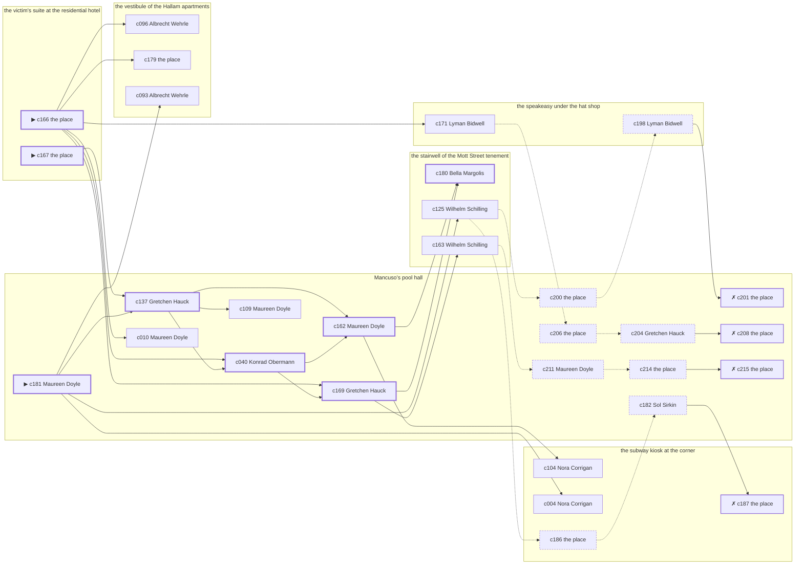

# Hell’s Kitchen — case 17

**Seed** 17 · **Difficulty** 2 · **Attempts** 1 · **Detective** Humphrey

**Par** 7 actions · **Budget** 20 · **Slack** 13 · **Findable** 30 (spine 8, corroboration 10, noise 8 + 4 disqualifiers) · **Noise ratio** 40% · **Candidate pool** 216

## 1. The Truth

James Mulcahy, a curb broker, the victim’s business partner, killed Klara Kreuzer, a bail bondsman, with a gunshot at the victim’s suite at the residential hotel at 9:00 PM. James Mulcahy wanted the victim out of a lease (property). James Mulcahy had been at the vestibule of the Hallam apartments earlier in the evening, where the weapon lived, and was alone with Klara Kreuzer when it happened. Maureen Doyle hired us.

## 2. Dramatis Personae

| Name | Role | Relationship | Class of secret | Motive | Found at | Killer |
| --- | --- | --- | --- | --- | --- | --- |
| Klara Kreuzer | a bail bondsman | the victim | — | — | — | — |
| Nora Corrigan | a private nurse | named in the victim’s will | dope | — | the subway kiosk at the corner | — |
| Maureen Doyle (client) | a switchboard operator | the victim’s tenant | blackmail | — | Mancuso’s pool hall | — |
| Sol Sirkin | a policy runner | a childhood friend of the victim’s from the same block | fence | — | Mancuso’s pool hall | — |
| Konrad Obermann | a longshoreman | a childhood friend of the victim’s from the same block | fence | debt | Mancuso’s pool hall | — |
| Wilhelm Schilling | a hack driver | in the victim’s debt | fence | — | the stairwell of the Mott Street tenement | — |
| James Mulcahy | a curb broker | the victim’s business partner | murder | property | Mancuso’s pool hall | **YES** |
| Abraham Abramowitz | the bartender | fixture (bartender) | — | — | the speakeasy under the hat shop | — |
| Gretchen Hauck | the man behind the counter | fixture (counterman) | — | — | Mancuso’s pool hall | — |
| Bella Margolis | the landlady | fixture (landlady) | — | — | the stairwell of the Mott Street tenement | — |
| Albrecht Wehrle | the elevator man | fixture (elevator-man) | — | — | the vestibule of the Hallam apartments | — |
| Lyman Bidwell | the patrolman on the beat | fixture (beat-cop) | — | — | the speakeasy under the hat shop | — |

## 3. Places

- **the victim’s suite at the residential hotel** (private) — unwatched; objects: a bottle of chloral drops, a camel-hair overcoat on a hook — **THE SCENE**; the victim’s address
- **the speakeasy under the hat shop** (semi) — watched by bartender (Abraham Abramowitz); objects: a silver cigarette case, a seltzer siphon
- **Mancuso’s pool hall** (semi) — watched by counterman (Gretchen Hauck); objects: an ice pick, a standing ashtray
- **the subway kiosk at the corner** (public) — unwatched; objects: a brass umbrella stand, a folded stack of evening papers — within earshot of the scene
- **the stairwell of the Mott Street tenement** (semi) — watched by landlady (Bella Margolis); objects: the roof-door key, a bronze bookend, a mop and bucket — within earshot of the scene
- **the vestibule of the Hallam apartments** (private) — watched by elevator-man (Albrecht Wehrle); objects: a nickel-plated revolver, a day ledger — where the weapon lived

## 4. Anchors

The coroner gives 7:30 PM–9:00 PM, four ticks wide. These are what close it: **bar-radio** and **el-train**.

- **the fight card on the bar radio** — at 8:30 PM; at Mancuso’s pool hall. Only those present know that the challenger went down in the fourth and the crowd booed it. You can time things by it: the set was turned up loud enough to carry into the street.
- **the El going over** — at 6:00 PM, 7:00 PM, 8:00 PM, 9:00 PM, 10:00 PM, 11:00 PM; across the whole neighbourhood. You can time things by it: everything under the structure stops being audible for twenty seconds.
- **the beat cop’s pass** — at 6:00 PM, 7:30 PM, 9:00 PM, 10:30 PM; on a round through the speakeasy under the hat shop → the stairwell of the Mott Street tenement → the subway kiosk at the corner → Mancuso’s pool hall. Somebody reliable notes who was there.

## 5. Timelines

### Klara Kreuzer — the victim

| Tick | Time | Truth | Claimed | Companion claimed |
| --- | --- | --- | --- | --- |
| 0 | 6:00 PM | the stairwell of the Mott Street tenement | the stairwell of the Mott Street tenement | — |
| 1 | 6:30 PM | the stairwell of the Mott Street tenement | the stairwell of the Mott Street tenement | — |
| 2 | 7:00 PM | the vestibule of the Hallam apartments | the vestibule of the Hallam apartments | — |
| 3 | 7:30 PM | the vestibule of the Hallam apartments | the vestibule of the Hallam apartments | — |
| 4 | 8:00 PM | the vestibule of the Hallam apartments | the vestibule of the Hallam apartments | — |
| 5 | 8:30 PM | Mancuso’s pool hall | Mancuso’s pool hall | — |
| 6 | 9:00 PM | the victim’s suite at the residential hotel ☠ | the victim’s suite at the residential hotel | — |
| 7 | 9:30 PM | — | — | — |
| 8 | 10:00 PM | — | — | — |
| 9 | 10:30 PM | — | — | — |
| 10 | 11:00 PM | — | — | — |
| 11 | 11:30 PM | — | — | — |

### Nora Corrigan

| Tick | Time | Truth | Claimed | Companion claimed |
| --- | --- | --- | --- | --- |
| 0 | 6:00 PM | the vestibule of the Hallam apartments | the vestibule of the Hallam apartments | — |
| 1 | 6:30 PM | the vestibule of the Hallam apartments | the vestibule of the Hallam apartments | — |
| 2 | 7:00 PM | the stairwell of the Mott Street tenement | the stairwell of the Mott Street tenement | — |
| 3 | 7:30 PM | the subway kiosk at the corner | the subway kiosk at the corner | — |
| 4 | 8:00 PM | the subway kiosk at the corner | the subway kiosk at the corner | — |
| 5 | 8:30 PM | the subway kiosk at the corner | **Mancuso’s pool hall** | — |
| 6 | 9:00 PM | Mancuso’s pool hall | Mancuso’s pool hall | — |
| 7 | 9:30 PM | Mancuso’s pool hall | Mancuso’s pool hall | — |
| 8 | 10:00 PM | Mancuso’s pool hall | Mancuso’s pool hall | — |
| 9 | 10:30 PM | Mancuso’s pool hall | Mancuso’s pool hall | — |
| 10 | 11:00 PM | the subway kiosk at the corner | the subway kiosk at the corner | — |
| 11 | 11:30 PM | the subway kiosk at the corner | the subway kiosk at the corner | — |

### Maureen Doyle

| Tick | Time | Truth | Claimed | Companion claimed |
| --- | --- | --- | --- | --- |
| 0 | 6:00 PM | Mancuso’s pool hall | Mancuso’s pool hall | — |
| 1 | 6:30 PM | Mancuso’s pool hall | Mancuso’s pool hall | — |
| 2 | 7:00 PM | the vestibule of the Hallam apartments | **the stairwell of the Mott Street tenement** | Sol Sirkin |
| 3 | 7:30 PM | the vestibule of the Hallam apartments | **the stairwell of the Mott Street tenement** | Sol Sirkin |
| 4 | 8:00 PM | Mancuso’s pool hall | Mancuso’s pool hall | — |
| 5 | 8:30 PM | the subway kiosk at the corner | the subway kiosk at the corner | — |
| 6 | 9:00 PM | Mancuso’s pool hall | Mancuso’s pool hall | — |
| 7 | 9:30 PM | Mancuso’s pool hall | Mancuso’s pool hall | — |
| 8 | 10:00 PM | the stairwell of the Mott Street tenement | the stairwell of the Mott Street tenement | — |
| 9 | 10:30 PM | the stairwell of the Mott Street tenement | the stairwell of the Mott Street tenement | — |
| 10 | 11:00 PM | the stairwell of the Mott Street tenement | the stairwell of the Mott Street tenement | — |
| 11 | 11:30 PM | Mancuso’s pool hall | Mancuso’s pool hall | — |

### Sol Sirkin

| Tick | Time | Truth | Claimed | Companion claimed |
| --- | --- | --- | --- | --- |
| 0 | 6:00 PM | the stairwell of the Mott Street tenement | the stairwell of the Mott Street tenement | — |
| 1 | 6:30 PM | the stairwell of the Mott Street tenement | the stairwell of the Mott Street tenement | — |
| 2 | 7:00 PM | the speakeasy under the hat shop | the speakeasy under the hat shop | — |
| 3 | 7:30 PM | the speakeasy under the hat shop | the speakeasy under the hat shop | — |
| 4 | 8:00 PM | the speakeasy under the hat shop | the speakeasy under the hat shop | — |
| 5 | 8:30 PM | the speakeasy under the hat shop | the speakeasy under the hat shop | — |
| 6 | 9:00 PM | Mancuso’s pool hall | **the vestibule of the Hallam apartments** | — |
| 7 | 9:30 PM | Mancuso’s pool hall | Mancuso’s pool hall | — |
| 8 | 10:00 PM | Mancuso’s pool hall | Mancuso’s pool hall | — |
| 9 | 10:30 PM | Mancuso’s pool hall | Mancuso’s pool hall | — |
| 10 | 11:00 PM | Mancuso’s pool hall | Mancuso’s pool hall | — |
| 11 | 11:30 PM | the stairwell of the Mott Street tenement | the stairwell of the Mott Street tenement | — |

### Konrad Obermann

| Tick | Time | Truth | Claimed | Companion claimed |
| --- | --- | --- | --- | --- |
| 0 | 6:00 PM | Mancuso’s pool hall | Mancuso’s pool hall | — |
| 1 | 6:30 PM | Mancuso’s pool hall | Mancuso’s pool hall | — |
| 2 | 7:00 PM | the vestibule of the Hallam apartments | the vestibule of the Hallam apartments | — |
| 3 | 7:30 PM | the vestibule of the Hallam apartments | the vestibule of the Hallam apartments | — |
| 4 | 8:00 PM | the vestibule of the Hallam apartments | the vestibule of the Hallam apartments | — |
| 5 | 8:30 PM | the vestibule of the Hallam apartments | the vestibule of the Hallam apartments | — |
| 6 | 9:00 PM | Mancuso’s pool hall | **the subway kiosk at the corner** | — |
| 7 | 9:30 PM | Mancuso’s pool hall | Mancuso’s pool hall | — |
| 8 | 10:00 PM | Mancuso’s pool hall | Mancuso’s pool hall | — |
| 9 | 10:30 PM | Mancuso’s pool hall | Mancuso’s pool hall | — |
| 10 | 11:00 PM | Mancuso’s pool hall | Mancuso’s pool hall | — |
| 11 | 11:30 PM | Mancuso’s pool hall | Mancuso’s pool hall | — |

### Wilhelm Schilling

| Tick | Time | Truth | Claimed | Companion claimed |
| --- | --- | --- | --- | --- |
| 0 | 6:00 PM | the stairwell of the Mott Street tenement | the stairwell of the Mott Street tenement | — |
| 1 | 6:30 PM | Mancuso’s pool hall | Mancuso’s pool hall | — |
| 2 | 7:00 PM | Mancuso’s pool hall | Mancuso’s pool hall | — |
| 3 | 7:30 PM | the stairwell of the Mott Street tenement | the stairwell of the Mott Street tenement | — |
| 4 | 8:00 PM | the stairwell of the Mott Street tenement | the stairwell of the Mott Street tenement | — |
| 5 | 8:30 PM | the speakeasy under the hat shop | the speakeasy under the hat shop | — |
| 6 | 9:00 PM | Mancuso’s pool hall | Mancuso’s pool hall | — |
| 7 | 9:30 PM | Mancuso’s pool hall | Mancuso’s pool hall | — |
| 8 | 10:00 PM | the stairwell of the Mott Street tenement | the stairwell of the Mott Street tenement | — |
| 9 | 10:30 PM | Mancuso’s pool hall | **the stairwell of the Mott Street tenement** | — |
| 10 | 11:00 PM | the subway kiosk at the corner | the subway kiosk at the corner | — |
| 11 | 11:30 PM | the stairwell of the Mott Street tenement | the stairwell of the Mott Street tenement | — |

### James Mulcahy — the killer

| Tick | Time | Truth | Claimed | Companion claimed |
| --- | --- | --- | --- | --- |
| 0 | 6:00 PM | the speakeasy under the hat shop | the speakeasy under the hat shop | — |
| 1 | 6:30 PM | the vestibule of the Hallam apartments | the vestibule of the Hallam apartments | — |
| 2 | 7:00 PM | the vestibule of the Hallam apartments | the vestibule of the Hallam apartments | — |
| 3 | 7:30 PM | the vestibule of the Hallam apartments | the vestibule of the Hallam apartments | — |
| 4 | 8:00 PM | the victim’s suite at the residential hotel | **Mancuso’s pool hall** | Konrad Obermann |
| 5 | 8:30 PM | the victim’s suite at the residential hotel | **Mancuso’s pool hall** | Konrad Obermann |
| 6 | 9:00 PM | the victim’s suite at the residential hotel ☠ | **Mancuso’s pool hall** | Konrad Obermann |
| 7 | 9:30 PM | Mancuso’s pool hall | Mancuso’s pool hall | — |
| 8 | 10:00 PM | Mancuso’s pool hall | Mancuso’s pool hall | — |
| 9 | 10:30 PM | Mancuso’s pool hall | Mancuso’s pool hall | — |
| 10 | 11:00 PM | Mancuso’s pool hall | Mancuso’s pool hall | — |
| 11 | 11:30 PM | Mancuso’s pool hall | Mancuso’s pool hall | — |

### Fixtures (never lie, never withhold)

| Tick | Time | Abraham Abramowitz (the bartender) | Gretchen Hauck (the man behind the counter) | Bella Margolis (the landlady) | Albrecht Wehrle (the elevator man) | Lyman Bidwell (the patrolman on the beat) |
| --- | --- | --- | --- | --- | --- | --- |
| 0 | 6:00 PM | the speakeasy under the hat shop | Mancuso’s pool hall | the stairwell of the Mott Street tenement | the vestibule of the Hallam apartments | the speakeasy under the hat shop |
| 1 | 6:30 PM | the speakeasy under the hat shop | Mancuso’s pool hall | the stairwell of the Mott Street tenement | the speakeasy under the hat shop | — |
| 2 | 7:00 PM | the speakeasy under the hat shop | the stairwell of the Mott Street tenement | the stairwell of the Mott Street tenement | the vestibule of the Hallam apartments | — |
| 3 | 7:30 PM | the speakeasy under the hat shop | Mancuso’s pool hall | the stairwell of the Mott Street tenement | the vestibule of the Hallam apartments | the stairwell of the Mott Street tenement |
| 4 | 8:00 PM | the speakeasy under the hat shop | Mancuso’s pool hall | the stairwell of the Mott Street tenement | the vestibule of the Hallam apartments | — |
| 5 | 8:30 PM | the speakeasy under the hat shop | Mancuso’s pool hall | the stairwell of the Mott Street tenement | the vestibule of the Hallam apartments | — |
| 6 | 9:00 PM | the speakeasy under the hat shop | Mancuso’s pool hall | the stairwell of the Mott Street tenement | the vestibule of the Hallam apartments | the subway kiosk at the corner |
| 7 | 9:30 PM | the speakeasy under the hat shop | Mancuso’s pool hall | the stairwell of the Mott Street tenement | the vestibule of the Hallam apartments | — |
| 8 | 10:00 PM | the speakeasy under the hat shop | Mancuso’s pool hall | the stairwell of the Mott Street tenement | the vestibule of the Hallam apartments | — |
| 9 | 10:30 PM | the speakeasy under the hat shop | Mancuso’s pool hall | the stairwell of the Mott Street tenement | the vestibule of the Hallam apartments | Mancuso’s pool hall |
| 10 | 11:00 PM | the speakeasy under the hat shop | Mancuso’s pool hall | the stairwell of the Mott Street tenement | the vestibule of the Hallam apartments | — |
| 11 | 11:30 PM | the speakeasy under the hat shop | Mancuso’s pool hall | the stairwell of the Mott Street tenement | the vestibule of the Hallam apartments | — |

## 6. Secrets in play

- **Nora Corrigan** (dope): Nora Corrigan buys morphine at the subway kiosk at the corner from 8:30 PM and would rather be thought a murderer than a hop-head.
- **Maureen Doyle** (blackmail): Maureen Doyle meets the victim alone at the vestibule of the Hallam apartments from 7:00 PM to 7:30 PM and asks for money.
- **Sol Sirkin** (fence): Sol Sirkin hands a parcel of stolen goods to a man at Mancuso’s pool hall from 9:00 PM.
- **Konrad Obermann** (fence): Konrad Obermann hands a parcel of stolen goods to a man at Mancuso’s pool hall from 9:00 PM.
- **Wilhelm Schilling** (fence): Wilhelm Schilling hands a parcel of stolen goods to a man at Mancuso’s pool hall from 10:30 PM.
- **James Mulcahy** (murder): James Mulcahy is at the victim’s suite at the residential hotel from 8:00 PM to 9:00 PM, alone with Klara Kreuzer when it happens at 9:00 PM.

## 7. Clue list — the 30 findable

The opening three, free at the start: c166, c167, c181. Everything else has to be led to. The full candidate pool is in the companion file.

### At the victim’s suite at the residential hotel

- **c166** [spine ⟨opening⟩] (scene; the place itself) → c040, c169, c171, c096, c179, c010
  - Klara Kreuzer was found at the victim’s suite at the residential hotel. The cigarette he had going burned itself out on the sill where it fell. The El going over came at 9:00 PM, and the El was running to timetable and it covers the half hour exactly. That puts the killing in that half hour and no later.
  - _establishes: the victim dead by 9:00 PM; how it was done_
- **c167** [spine ⟨opening⟩] (morgue; the place itself) → c137
  - The coroner puts death between 7:30 PM and 9:00 PM — two hours of nothing useful. One bullet below the sternum. Powder burns on the shirt front: fired close.
  - _establishes: death between 7:30 PM and 9:00 PM; how it was done_

### At the speakeasy under the hat shop

- **c171** [corroboration] (anchor; Lyman Bidwell on the noise that evening) → c206
  - Lyman Bidwell was at the subway kiosk at the corner at 9:00 PM and heard a shot from the direction of the victim’s suite at the residential hotel, just as the El went over.
  - _establishes: noise at the victim’s suite at the residential hotel at 9:00 PM; the victim dead by 9:00 PM; how it was done_
- **c198** [noise {b1}] (overheard; Lyman Bidwell on Sol Sirkin) → c201
  - Lyman Bidwell on Sol Sirkin: Sol Sirkin has been selling things that were never Sol Sirkin’s to sell.
  - _establishes: context only_

### At Mancuso’s pool hall

- **c181** [spine ⟨opening⟩] (client; Maureen Doyle on why I was hired) → c137, c125, c004, c093
  - Maureen Doyle hired us. Maureen Doyle wants it known that Konrad Obermann owed the victim money, and would rather we started there.
  - _establishes: Konrad Obermann had a motive (debt)_
- **c137** [spine] (observation; Gretchen Hauck on who was there at 9:00 PM) → c040, c162, c109
  - Gretchen Hauck runs through it: at 9:00 PM there were Nora Corrigan, Maureen Doyle, Sol Sirkin, Konrad Obermann, Wilhelm Schilling at Mancuso’s pool hall, and nobody else worth naming.
  - _establishes: Nora Corrigan at Mancuso’s pool hall, 9:00 PM; Maureen Doyle at Mancuso’s pool hall, 9:00 PM; Sol Sirkin at Mancuso’s pool hall, 9:00 PM; Konrad Obermann at Mancuso’s pool hall, 9:00 PM; Wilhelm Schilling at Mancuso’s pool hall, 9:00 PM_
- **c040** [spine] (observation; Konrad Obermann on James Mulcahy) → c162, c169
  - Konrad Obermann says James Mulcahy was at the vestibule of the Hallam apartments from 7:00 PM to 7:30 PM.
  - _establishes: James Mulcahy at the vestibule of the Hallam apartments, 7:00 PM–7:30 PM; James Mulcahy could reach the weapon_
- **c162** [spine] (observation; Maureen Doyle on James Mulcahy’s account) → c180, c104
  - Maureen Doyle was at Mancuso’s pool hall at 9:00 PM and says James Mulcahy was not.
  - _establishes: James Mulcahy not at Mancuso’s pool hall, 9:00 PM_
- **c169** [spine] (anchor; Gretchen Hauck on Klara Kreuzer that evening) → c180, c163
  - Gretchen Hauck puts Klara Kreuzer at Mancuso’s pool hall while the fight was on the radio, which was 8:30 PM, and alive enough to argue about the weather.
  - _establishes: the victim alive at 8:30 PM; Klara Kreuzer at Mancuso’s pool hall, 8:30 PM_
- **c010** [corroboration] (observation; Maureen Doyle on Nora Corrigan) → (end)
  - Maureen Doyle says Nora Corrigan was at Mancuso’s pool hall from 9:00 PM to 9:30 PM.
  - _establishes: Nora Corrigan at Mancuso’s pool hall, 9:00 PM–9:30 PM_
- **c109** [corroboration] (observation; Maureen Doyle on who was there at 9:00 PM) → (end)
  - Maureen Doyle runs through it: at 9:00 PM there were Nora Corrigan, Sol Sirkin, Konrad Obermann, Wilhelm Schilling at Mancuso’s pool hall, and nobody else worth naming.
  - _establishes: Nora Corrigan at Mancuso’s pool hall, 9:00 PM; Sol Sirkin at Mancuso’s pool hall, 9:00 PM; Konrad Obermann at Mancuso’s pool hall, 9:00 PM; Wilhelm Schilling at Mancuso’s pool hall, 9:00 PM_
- **c200** [noise {b1}] (physical; the place itself) → c198
  - A pawn ticket at Mancuso’s pool hall in a name that does not exist, made out at the hour in question.
  - _establishes: context only_
- **c201** [disqualifier {b1}] (overheard; the place itself) → (end)
  - The receiver at Mancuso’s pool hall would rather talk than be held: Sol Sirkin was there from 9:00 PM handing over a parcel of somebody else’s silver, which is a charge Sol Sirkin will take over this one.
  - _establishes: Sol Sirkin’s fence accounted for; Sol Sirkin at Mancuso’s pool hall, 9:00 PM_
- **c206** [noise {b2}] (physical; the place itself) → c204
  - Wrapping paper and a cut string at Mancuso’s pool hall, and the shop it came from closed two years ago.
  - _establishes: context only_
- **c204** [noise {b2}] (overheard; Gretchen Hauck on Konrad Obermann) → c208
  - Gretchen Hauck on Konrad Obermann: There is a man who meets people at Mancuso’s pool hall and nobody will say his name out loud.
  - _establishes: context only_
- **c208** [disqualifier {b2}] (overheard; the place itself) → (end)
  - The receiver at Mancuso’s pool hall would rather talk than be held: Konrad Obermann was there from 9:00 PM handing over a parcel of somebody else’s silver, which is a charge Konrad Obermann will take over this one.
  - _establishes: Konrad Obermann’s fence accounted for; Konrad Obermann at Mancuso’s pool hall, 9:00 PM_
- **c211** [noise {b3}] (overheard; Maureen Doyle on Wilhelm Schilling) → c214
  - Maureen Doyle on Wilhelm Schilling: There is a man who meets people at Mancuso’s pool hall and nobody will say his name out loud.
  - _establishes: context only_
- **c214** [noise {b3}] (physical; the place itself) → c215
  - A pawn ticket at Mancuso’s pool hall in a name that does not exist, made out at the hour in question.
  - _establishes: context only_
- **c215** [disqualifier {b3}] (overheard; the place itself) → (end)
  - The receiver at Mancuso’s pool hall would rather talk than be held: Wilhelm Schilling was there from 10:30 PM handing over a parcel of somebody else’s silver, which is a charge Wilhelm Schilling will take over this one.
  - _establishes: Wilhelm Schilling’s fence accounted for; Wilhelm Schilling at Mancuso’s pool hall, 10:30 PM_
- **c182** [noise {b4}] (overheard; Sol Sirkin on Nora Corrigan) → c187
  - Sol Sirkin on Nora Corrigan: Nora Corrigan’s sleeves are buttoned at the wrist in a warm room.
  - _establishes: context only_

### At the subway kiosk at the corner

- **c104** [corroboration] (observation; Nora Corrigan on who was there at 9:00 PM) → (end)
  - Nora Corrigan runs through it: at 9:00 PM there were Maureen Doyle, Sol Sirkin, Konrad Obermann, Wilhelm Schilling at Mancuso’s pool hall, and nobody else worth naming.
  - _establishes: Maureen Doyle at Mancuso’s pool hall, 9:00 PM; Sol Sirkin at Mancuso’s pool hall, 9:00 PM; Konrad Obermann at Mancuso’s pool hall, 9:00 PM; Wilhelm Schilling at Mancuso’s pool hall, 9:00 PM_
- **c004** [corroboration] (observation; Nora Corrigan on Wilhelm Schilling) → (end)
  - Nora Corrigan says Wilhelm Schilling was at Mancuso’s pool hall from 9:00 PM to 9:30 PM.
  - _establishes: Wilhelm Schilling at Mancuso’s pool hall, 9:00 PM–9:30 PM_
- **c186** [noise {b4}] (physical; the place itself) → c182
  - A prescription blank at the subway kiosk at the corner signed by a doctor who has been dead since the spring.
  - _establishes: context only_
- **c187** [disqualifier {b4}] (overheard; the place itself) → (end)
  - The man who sells it at the subway kiosk at the corner gives it up rather than be held: Nora Corrigan was there from 8:30 PM, and stayed until it took hold.
  - _establishes: Nora Corrigan’s dope accounted for; Nora Corrigan at the subway kiosk at the corner, 8:30 PM_

### At the stairwell of the Mott Street tenement

- **c180** [spine] (overheard; Bella Margolis on James Mulcahy and Klara Kreuzer) → (end)
  - Bella Margolis says Klara Kreuzer told James Mulcahy the lease would go to somebody else at the quarter day.
  - _establishes: James Mulcahy had a motive (property)_
- **c125** [corroboration] (observation; Wilhelm Schilling on who was there at 9:00 PM) → c200, c186
  - Wilhelm Schilling runs through it: at 9:00 PM there were Nora Corrigan, Maureen Doyle, Sol Sirkin, Konrad Obermann at Mancuso’s pool hall, and nobody else worth naming.
  - _establishes: Nora Corrigan at Mancuso’s pool hall, 9:00 PM; Maureen Doyle at Mancuso’s pool hall, 9:00 PM; Sol Sirkin at Mancuso’s pool hall, 9:00 PM; Konrad Obermann at Mancuso’s pool hall, 9:00 PM_
- **c163** [corroboration] (observation; Wilhelm Schilling on James Mulcahy’s account) → c211
  - Wilhelm Schilling was at Mancuso’s pool hall at 9:00 PM and says James Mulcahy was not.
  - _establishes: James Mulcahy not at Mancuso’s pool hall, 9:00 PM_

### At the vestibule of the Hallam apartments

- **c096** [corroboration] (observation; Albrecht Wehrle on James Mulcahy) → (end)
  - Albrecht Wehrle says James Mulcahy was at the vestibule of the Hallam apartments from 7:00 PM to 7:30 PM.
  - _establishes: James Mulcahy at the vestibule of the Hallam apartments, 7:00 PM–7:30 PM; James Mulcahy could reach the weapon_
- **c179** [corroboration] (document; the place itself) → (end)
  - Found at the vestibule of the Hallam apartments: A lease assignment made out in James Mulcahy’s name, waiting only on Klara Kreuzer’s signature.
  - _establishes: James Mulcahy had a motive (property)_
- **c093** [corroboration] (observation; Albrecht Wehrle on Nora Corrigan) → (end)
  - Albrecht Wehrle says Nora Corrigan was at the vestibule of the Hallam apartments at 6:00 PM.
  - _establishes: Nora Corrigan at the vestibule of the Hallam apartments, 6:00 PM; Nora Corrigan could reach the weapon_

## 8. Clue graph

## 9. Deduction path

Par is **7 actions** against a budget of 20: 13 spare. Every id below is a spine clue.

**Time of death.** The coroner gives four ticks. The anchors close it to 9:00 PM: one puts Klara Kreuzer alive at 8:30 PM, the other times the scene at 9:00 PM. _(c167, c169, c166; + 1 corroborating)_

**Clearing the innocent.**

- Nora Corrigan was not at the victim’s suite at the residential hotel at 9:00 PM, on two independent sources. _(c137; + 3 corroborating)_
- Maureen Doyle was not at the victim’s suite at the residential hotel at 9:00 PM, on two independent sources. _(c137; + 2 corroborating)_
- Sol Sirkin was not at the victim’s suite at the residential hotel at 9:00 PM, on two independent sources. _(c137; + 4 corroborating)_
- Konrad Obermann was not at the victim’s suite at the residential hotel at 9:00 PM, on two independent sources. _(c137; + 4 corroborating)_
- Wilhelm Schilling was not at the victim’s suite at the residential hotel at 9:00 PM, on two independent sources. _(c137; + 3 corroborating)_

**Naming the killer.** James Mulcahy claims Mancuso’s pool hall at 9:00 PM. Two independent sources put that out of the question. _(c162; + 1 corroborating)_

**The weapon.** James Mulcahy was at the vestibule of the Hallam apartments before 9:00 PM, where a nickel-plated revolver was kept. _(c040; + 1 corroborating)_

**Method.** A gunshot, on two physical sources. _(c166, c167; + 1 corroborating)_

**Motive.** property, on two independent sources. _(c180; + 1 corroborating)_

## 10. Red herrings

**Innocents who lie about the murder tick:**

- Sol Sirkin claims the vestibule of the Hallam apartments at 9:00 PM and was really at Mancuso’s pool hall. Reason: Sol Sirkin hands a parcel of stolen goods to a man at Mancuso’s pool hall from 9:00 PM.
- Konrad Obermann claims the subway kiosk at the corner at 9:00 PM and was really at Mancuso’s pool hall. Reason: Konrad Obermann hands a parcel of stolen goods to a man at Mancuso’s pool hall from 9:00 PM.

**Innocents with a motive:**

- Konrad Obermann — debt: owed the victim money.

**Noise branches, and what knocks each one down:**

- **b1** (Sol Sirkin, fence): c200 → c198 → **c201** — The receiver at Mancuso’s pool hall would rather talk than be held: Sol Sirkin was there from 9:00 PM handing over a parcel of somebody else’s silver, which is a charge Sol Sirkin will take over this one.
- **b2** (Konrad Obermann, fence): c206 → c204 → **c208** — The receiver at Mancuso’s pool hall would rather talk than be held: Konrad Obermann was there from 9:00 PM handing over a parcel of somebody else’s silver, which is a charge Konrad Obermann will take over this one.
- **b3** (Wilhelm Schilling, fence): c211 → c214 → **c215** — The receiver at Mancuso’s pool hall would rather talk than be held: Wilhelm Schilling was there from 10:30 PM handing over a parcel of somebody else’s silver, which is a charge Wilhelm Schilling will take over this one.
- **b4** (Nora Corrigan, dope): c186 → c182 → **c187** — The man who sells it at the subway kiosk at the corner gives it up rather than be held: Nora Corrigan was there from 8:30 PM, and stayed until it took hold.

