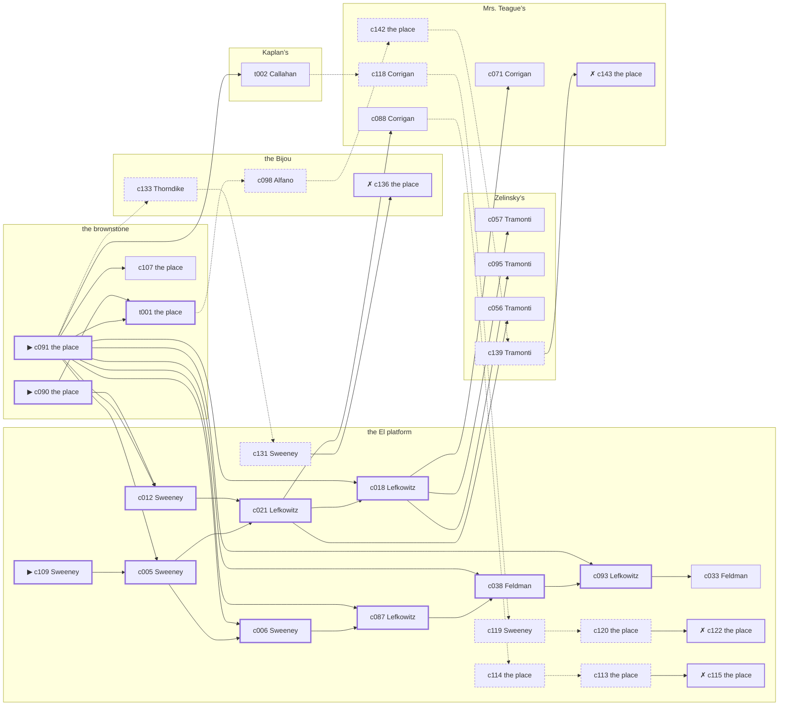

# the Bowery — case 18

**Seed** 18 · **Difficulty** 2 · **Attempts** 1 · **Detective** Dashiell

**Type** murder · **Trope** body-at-scene · **Unknowns** who, why, when

**Par** 10 actions · **Slack** 6 · **Budget** 16 · **Findable** 34 (spine 12, corroboration 8, noise 10 + 4 disqualifiers) · **Noise ratio** 41% · **Candidate pool** 146

## 1. The Truth

Grafton Thorndike, a bookkeeper, in Vogel’s debt, killed Gretchen Vogel, a theatrical agent, with a gunshot at the brownstone at 8:30 PM. Thorndike was about to be exposed by Vogel (exposure). Thorndike had been at Zelinsky’s earlier in the evening, where the means lived, and was alone with Vogel when it happened. Sweeney hired us.

## 2. The Act

**murder** · **body-at-scene** · actor **Thorndike** · at **the brownstone** · at **8:30 PM**

- found at the brownstone
- fate: dead

**Givens** — what the briefing states and the report does not ask:

- Vogel was found dead at the brownstone.
- Vogel was killed at the brownstone, and nothing was carried out of the room afterwards.
- The coroner puts it between 8:00 PM and 9:30 PM, which is two hours of nothing useful.
- It was a gunshot.

**Unknowns** — exactly what the report asks: **who**, **why**, **when**.

## 3. Dramatis Personae

| Name | Role | Relationship | Class of secret | Motive | Found at | Killer |
| --- | --- | --- | --- | --- | --- | --- |
| Gretchen Vogel | a theatrical agent | the victim | — | — | — | — |
| Daniel Sweeney (client) | a ward heeler | a witness against the people Vogel worked for | fence | silence-a-witness | the El platform | — |
| Isidore Lefkowitz | an insurance adjuster | a witness against the people Vogel worked for | forged-identity | — | the El platform | — |
| Clementine Cheatham | a seamstress | Vogel’s former employee | hidden-family | — | Mrs. Teague’s | — |
| Rachel Feldman | a piano teacher | a childhood friend of Vogel’s from the same block | secret-drinking | — | the El platform | — |
| Salvatore Alfano | a young man living on expectations | engaged to Vogel’s daughter | secret-drinking | jealousy | the Bijou | — |
| Grafton Thorndike | a bookkeeper | in Vogel’s debt | murder (+ forged-identity) | exposure | the Bijou | **YES** |
| Domenico Tramonti | the man behind the counter | fixture (counterman) | — | — | Zelinsky’s | — |
| Edward Callahan | the druggist | fixture (druggist) | — | — | Kaplan’s | — |
| Roscoe Dandridge | the ticket-taker | fixture (ticket-taker) | — | — | the Bijou | — |
| Delia Corrigan | the landlady | fixture (landlady) | — | — | Mrs. Teague’s | — |
| Louis Kessler | the patrolman on the beat | fixture (beat-cop) | — | — | Zelinsky’s | — |

## 4. Dossiers

Every person, by layer: **0** on sight, **1** volunteered, **2** from other people, **3** in the documents.

### Vogel — the victim

49, a woman, a theatrical agent. Wants: money.

- **Standing** — Vogel had half the neighbourhood waiting on a telephone call that never came.
- **Profession** — Vogel booked acts into four houses and took ten per cent of all of it.
- **Found** — Sweeney found Vogel at the brownstone at 11:30 PM. By Sweeney, at the brownstone, at 11:30 PM. Precinct: took-a-statement.

**Layer 0, on sight**

- _gender_ — A woman.
- _age_ — In her forties.

**Layer 1, volunteered**

- _profession_ — A theatrical agent.
- _detail_ — Vogel booked acts into four houses and took ten per cent of all of it.

**Layer 2, from other people**

- _tie_ — Vogel had half the neighbourhood waiting on a telephone call that never came.
- _want_ — Vogel wants money, and is not particular about the shape it arrives in.

**Self-account** (layer 1, what they say when asked about themselves)

- Vogel is 49 years old and a theatrical agent.
- Vogel booked acts into four houses and took ten per cent of all of it.
- Vogel is the one this is about.

### Sweeney — the client

37, a man, a ward heeler. Wants: money. Tie: a witness against the people Vogel worked for, since ’18.

**Layer 0, on sight**

- _gender_ — A man.
- _age_ — In his thirties.

**Layer 1, volunteered**

- _profession_ — A ward heeler.
- _detail_ — Sweeney delivers the vote on the block and the coal in February.

**Layer 2, from other people**

- _tie_ — Sweeney gave a statement about the people Vogel worked for and has been careful ever since.
- _want_ — Sweeney wants money, and is not particular about the shape it arrives in.
- _since_ — Sweeney has been a witness against the people Vogel worked for, since ’18.

**Layer 3, in the documents**

- _secret-hint_ — Sweeney was carrying a parcel into the El platform and came out without it.

**Self-account** (layer 1, what they say when asked about themselves)

- Sweeney is 37 years old and a ward heeler.
- Sweeney delivers the vote on the block and the coal in February.
- Sweeney is a witness against the people Vogel worked for.

### Lefkowitz

32, a man, an insurance adjuster. Wants: money. Tie: a witness against the people Vogel worked for, since the indictment.

**Layer 0, on sight**

- _gender_ — A man.
- _age_ — In his thirties.

**Layer 1, volunteered**

- _profession_ — An insurance adjuster.
- _detail_ — Lefkowitz walks fire jobs for the company and writes up what he finds.

**Layer 2, from other people**

- _tie_ — Lefkowitz is due before the grand jury about Vogel’s people, and the date is set.
- _want_ — Lefkowitz wants money, and is not particular about the shape it arrives in.
- _since_ — Lefkowitz has been a witness against the people Vogel worked for, since the indictment.

**Layer 3, in the documents**

- _secret-hint_ — Lefkowitz’s registration card gives an address on a street that does not exist.

**Self-account** (layer 1, what they say when asked about themselves)

- Lefkowitz is 32 years old and an insurance adjuster.
- Lefkowitz walks fire jobs for the company and writes up what he finds.
- Lefkowitz is a witness against the people Vogel worked for.

### Cheatham

23, a woman, a seamstress. Wants: money. Tie: Vogel’s former employee, since ’21.

**Layer 0, on sight**

- _gender_ — A woman.
- _age_ — Not much past twenty.
- _profession_ — A seamstress.

**Layer 1, volunteered**

- _detail_ — Cheatham finishes coats at home by the piece and takes the bundles back on Fridays.

**Layer 2, from other people**

- _tie_ — Cheatham kept Vogel’s books until Gustav Hochstetter was brought in over Cheatham’s head.
- _want_ — Cheatham wants money, and is not particular about the shape it arrives in.
- _since_ — Cheatham has been Vogel’s former employee, since ’21.
- _third_ — Gustav Hochstetter is an old friend who once put up the bail.

**Layer 3, in the documents**

- _secret-hint_ — Cheatham sends money out of every pay envelope and cannot say where it goes.

**Self-account** (layer 1, what they say when asked about themselves)

- Cheatham is 23 years old and a seamstress.
- Cheatham finishes coats at home by the piece and takes the bundles back on Fridays.
- Cheatham is Vogel’s former employee.

### Feldman

58, a woman, a piano teacher. Wants: to-be-forgiven. Tie: a childhood friend of Vogel’s from the same block, all their lives.

**Layer 0, on sight**

- _gender_ — A woman.
- _age_ — In her fifties.

**Layer 1, volunteered**

- _profession_ — A piano teacher.
- _detail_ — Feldman has eleven pupils and a piano that wants tuning.

**Layer 2, from other people**

- _tie_ — Feldman, Vogel and Michael Mulcahy were inseparable for ten years and have not been in a room together since.
- _want_ — Feldman wants to be forgiven for something nobody else remembers.
- _since_ — Feldman has been a childhood friend of Vogel’s from the same block, all their lives.
- _third_ — Michael Mulcahy is the man who held the second mortgage.

**Layer 3, in the documents**

- _secret-hint_ — Feldman had taken a drink and had gone to some trouble about the smell of it.

**Self-account** (layer 1, what they say when asked about themselves)

- Feldman is 58 years old and a piano teacher.
- Feldman has eleven pupils and a piano that wants tuning.
- Feldman is a childhood friend of Vogel’s from the same block.

### Alfano

30, a man, a young man living on expectations. Wants: to-be-somebody. Tie: engaged to Vogel’s daughter, since last Easter.

**Layer 0, on sight**

- _gender_ — A man.
- _age_ — In his thirties.

**Layer 1, volunteered**

- _profession_ — A young man living on expectations.
- _detail_ — Alfano draws an allowance on the first of the month and has it spent by the eighth.

**Layer 2, from other people**

- _tie_ — Alfano has been engaged to Vogel’s daughter since ’23, with no date set.
- _want_ — Alfano wants a name people know.
- _since_ — Alfano has been engaged to Vogel’s daughter, since last Easter.

**Layer 3, in the documents**

- _secret-hint_ — Alfano had taken a drink and had gone to some trouble about the smell of it.

**Self-account** (layer 1, what they say when asked about themselves)

- Alfano is 30 years old and a young man living on expectations.
- Alfano draws an allowance on the first of the month and has it spent by the eighth.
- Alfano is engaged to Vogel’s daughter.

### Thorndike — the killer

38, a man, a bookkeeper. Wants: money. Tie: in Vogel’s debt, two winters running.

**Layer 0, on sight**

- _gender_ — A man.
- _age_ — In his thirties.

**Layer 1, volunteered**

- _profession_ — A bookkeeper.
- _detail_ — Thorndike does the payroll on Thursdays and the ledgers the rest of the week.

**Layer 2, from other people**

- _tie_ — Thorndike has owed Vogel money since ’24 and has not been asked for it lately.
- _want_ — Thorndike wants money, and is not particular about the shape it arrives in.
- _since_ — Thorndike has been in Vogel’s debt, two winters running.

**Layer 3, in the documents**

- _secret-hint_ — Thorndike’s registration card gives an address on a street that does not exist.

**Self-account** (layer 1, what they say when asked about themselves)

- Thorndike is 38 years old and a bookkeeper.
- Thorndike does the payroll on Thursdays and the ledgers the rest of the week.
- Thorndike is in Vogel’s debt.

### Tramonti

41, a man, the man behind the counter. Wants: to-get-out. Tie: behind the counter at Zelinsky’s.

**Layer 0, on sight**

- _gender_ — A man.
- _age_ — In his forties.
- _profession_ — The man behind the counter.

**Layer 1, volunteered**

- _detail_ — Tramonti works the counter at Zelinsky’s on the evening shift.

**Layer 2, from other people**

- _tie_ — Tramonti is behind the counter at Zelinsky’s.
- _want_ — Tramonti wants out of the neighbourhood and has wanted it for years.

**Self-account** (layer 1, what they say when asked about themselves)

- Tramonti is 41 years old and the man behind the counter.
- Tramonti works the counter at Zelinsky’s on the evening shift.
- Tramonti is behind the counter at Zelinsky’s.

### Callahan

57, a man, the druggist. Wants: money. Tie: behind the counter at Kaplan’s.

**Layer 0, on sight**

- _gender_ — A man.
- _age_ — In his fifties.
- _profession_ — The druggist.

**Layer 1, volunteered**

- _detail_ — Callahan stands the counter at Kaplan’s and writes down every prescription twice.

**Layer 2, from other people**

- _tie_ — Callahan is behind the counter at Kaplan’s.
- _want_ — Callahan wants money, and is not particular about the shape it arrives in.

**Self-account** (layer 1, what they say when asked about themselves)

- Callahan is 57 years old and the druggist.
- Callahan stands the counter at Kaplan’s and writes down every prescription twice.
- Callahan is behind the counter at Kaplan’s.

### Dandridge

55, a man, the ticket-taker. Wants: to-be-left-alone. Tie: on the door at the Bijou, every performance.

**Layer 0, on sight**

- _gender_ — A man.
- _age_ — In his fifties.
- _profession_ — The ticket-taker.

**Layer 1, volunteered**

- _detail_ — Dandridge stands the box at the Bijou from seven until the last house goes in.

**Layer 2, from other people**

- _tie_ — Dandridge is on the door at the Bijou, every performance.
- _want_ — Dandridge wants to be left alone.

**Self-account** (layer 1, what they say when asked about themselves)

- Dandridge is 55 years old and the ticket-taker.
- Dandridge stands the box at the Bijou from seven until the last house goes in.
- Dandridge is on the door at the Bijou, every performance.

### Corrigan

60, a woman, the landlady. Wants: respectability. Tie: the keeper of Mrs. Teague’s.

**Layer 0, on sight**

- _gender_ — A woman.
- _age_ — In her sixties.
- _profession_ — The landlady.

**Layer 1, volunteered**

- _detail_ — Corrigan has kept Mrs. Teague’s for twenty-two years and knows every board that creaks.

**Layer 2, from other people**

- _tie_ — Corrigan is the keeper of Mrs. Teague’s.
- _want_ — Corrigan wants to be thought respectable by people who are not.

**Self-account** (layer 1, what they say when asked about themselves)

- Corrigan is 60 years old and the landlady.
- Corrigan has kept Mrs. Teague’s for twenty-two years and knows every board that creaks.
- Corrigan is the keeper of Mrs. Teague’s.

### Kessler

40, a man, the patrolman on the beat. Wants: to-keep-what-they-have. Tie: the patrolman whose post takes in Zelinsky’s.

**Layer 0, on sight**

- _gender_ — A man.
- _age_ — In his forties.
- _profession_ — The patrolman on the beat.

**Layer 1, volunteered**

- _detail_ — Kessler walks the same eight corners every night and rattles every door on them.

**Layer 2, from other people**

- _tie_ — Kessler is the patrolman whose post takes in Zelinsky’s.
- _want_ — Kessler wants to keep what they have and add nothing to it.

**Self-account** (layer 1, what they say when asked about themselves)

- Kessler is 40 years old and the patrolman on the beat.
- Kessler walks the same eight corners every night and rattles every door on them.
- Kessler is the patrolman whose post takes in Zelinsky’s.

## 5. The Client

**Sweeney**, a witness against the people Vogel worked for. Purpose: **clear-my-name**.

- **Why** — Sweeney wants it established that it was not them, before anybody says otherwise.
- **What it costs** — Sweeney was near enough to it that night to know exactly how it looks, and says so first.
- **Points at** — Thorndike: Thorndike was about to be exposed by Vogel. Honest: **yes**.

**Tells:**

- Vogel was found dead at the brownstone.
- Vogel was killed at the brownstone, and nothing was carried out of the room afterwards.
- The coroner puts it between 8:00 PM and 9:30 PM, which is two hours of nothing useful.
- It was a gunshot.
- Sweeney would rather we started with Thorndike: Thorndike was about to be exposed by Vogel.

**Withholds:**

- Sweeney does not mention it, but Sweeney hands a parcel of stolen goods to a man at the El platform from 7:00 PM to 7:30 PM.

**Their own evening, as they tell it:**

- Sweeney says he was at the El platform from 6:00 PM to 6:30 PM.
- Sweeney says he was at the Bijou from 7:00 PM to 7:30 PM.
- Sweeney says he was at the El platform at 8:00 PM.
- Sweeney says he was at Mrs. Teague’s at 8:30 PM.

## 6. The Briefing

16 plain sentences, derived. This is the model of the plain register: the engine renders it, and Phase 2 measures pages against it.

1. A man came up the stairs after midnight, and sat down.
2. Daniel Sweeney is 37 years old and a ward heeler.
3. Sweeney delivers the vote on the block and the coal in February.
4. Vogel had half the neighbourhood waiting on a telephone call that never came.
5. Vogel was found dead at the brownstone.
6. Vogel was killed at the brownstone, and nothing was carried out of the room afterwards.
7. The coroner puts it between 8:00 PM and 9:30 PM, which is two hours of nothing useful.
8. It was a gunshot.
9. Sweeney found Vogel at the brownstone at 11:30 PM.
10. The precinct took a statement at the desk and filed it.
11. Sweeney is a witness against the people Vogel worked for.
12. Sweeney gave a statement about the people Vogel worked for and has been careful ever since.
13. Sweeney wants it established that it was not them, before anybody says otherwise.
14. Sweeney was near enough to it that night to know exactly how it looks, and says so first.
15. Sweeney wants us to start with Thorndike.
16. Thorndike was about to be exposed by Vogel.

## 7. Mentions

- **Verity Pickering** (m-1) — a woman they had both been seeing. Verity Pickering is a woman they had both been seeing.
- **Gustav Hochstetter** (m-2) — an old friend who once put up the bail. Gustav Hochstetter is an old friend who once put up the bail.
- **Michael Mulcahy** (m-3) — the man who held the second mortgage. Michael Mulcahy is the man who held the second mortgage.

## 8. Places

- **the El platform at Twenty-Third Street** (public) — unwatched; objects: a folded stack of evening papers, a pasted-up timetable
- **Vogel’s rooms in the brownstone** (private) — unwatched; objects: a wall telephone, a length of sash cord, a framed photograph — **THE SCENE**; the victim’s address
- **Zelinsky’s pawnshop, the back room** (semi) — watched by counterman (Tramonti); objects: a nickel-plated revolver, a silver cigarette case, a spike of pawn tickets — where the weapon lived; within earshot of the scene
- **Kaplan’s drugstore with the soda fountain** (public) — watched by druggist (Callahan); objects: a bottle of chloral drops, an ice pick — within earshot of the scene
- **the Bijou picture house** (public) — watched by ticket-taker (Dandridge); objects: a standing ashtray
- **the back room at Mrs. Teague’s** (private) — watched by landlady (Corrigan); objects: a bronze bookend, a strapped suitcase

## 9. Anchors

The coroner gives 8:00 PM–9:30 PM, four ticks wide. These are what close it: **last-edition** and **piano-lesson**.

- **the piano lesson on the floor above** — at 8:00 PM; at Mrs. Teague’s. You can time things by it: the same four bars, over and over, and then nothing. Only those present know that the child never did get the passage right.
- **the last edition coming off the truck** — at 8:30 PM; at Kaplan’s. Somebody reliable notes who was there. Only those present know that the late edition led with the bridge contract and not the hold-up. Those present carry it: ink still wet enough to come off on a glove.
- **the beat cop’s pass** — at 6:30 PM, 8:00 PM, 9:30 PM, 11:00 PM; on a round through Zelinsky’s → Kaplan’s → the Bijou → the El platform. Somebody reliable notes who was there.

## 10. Timelines

### Vogel — the victim

| Tick | Time | Truth | Claimed | Companion claimed |
| --- | --- | --- | --- | --- |
| 0 | 6:00 PM | the El platform | the El platform | — |
| 1 | 6:30 PM | the El platform | the El platform | — |
| 2 | 7:00 PM | the El platform | the El platform | — |
| 3 | 7:30 PM | the Bijou | the Bijou | — |
| 4 | 8:00 PM | Mrs. Teague’s | Mrs. Teague’s | — |
| 5 | 8:30 PM | the brownstone ☠ | the brownstone | — |
| 6 | 9:00 PM | — | — | — |
| 7 | 9:30 PM | — | — | — |
| 8 | 10:00 PM | — | — | — |
| 9 | 10:30 PM | — | — | — |
| 10 | 11:00 PM | — | — | — |
| 11 | 11:30 PM | — | — | — |

### Sweeney

| Tick | Time | Truth | Claimed | Companion claimed |
| --- | --- | --- | --- | --- |
| 0 | 6:00 PM | the El platform | the El platform | — |
| 1 | 6:30 PM | the El platform | the El platform | — |
| 2 | 7:00 PM | the El platform | **the Bijou** | — |
| 3 | 7:30 PM | the El platform | **the Bijou** | — |
| 4 | 8:00 PM | the El platform | the El platform | — |
| 5 | 8:30 PM | Mrs. Teague’s | Mrs. Teague’s | — |
| 6 | 9:00 PM | the El platform | the El platform | — |
| 7 | 9:30 PM | the El platform | the El platform | — |
| 8 | 10:00 PM | Kaplan’s | Kaplan’s | — |
| 9 | 10:30 PM | the El platform | the El platform | — |
| 10 | 11:00 PM | Mrs. Teague’s | Mrs. Teague’s | — |
| 11 | 11:30 PM | the brownstone | the brownstone | — |

### Lefkowitz

| Tick | Time | Truth | Claimed | Companion claimed |
| --- | --- | --- | --- | --- |
| 0 | 6:00 PM | the El platform | the El platform | — |
| 1 | 6:30 PM | the El platform | the El platform | — |
| 2 | 7:00 PM | the brownstone | the brownstone | — |
| 3 | 7:30 PM | Mrs. Teague’s | Mrs. Teague’s | — |
| 4 | 8:00 PM | Mrs. Teague’s | Mrs. Teague’s | — |
| 5 | 8:30 PM | Mrs. Teague’s | Mrs. Teague’s | — |
| 6 | 9:00 PM | Mrs. Teague’s | Mrs. Teague’s | — |
| 7 | 9:30 PM | the El platform | the El platform | — |
| 8 | 10:00 PM | the El platform | the El platform | — |
| 9 | 10:30 PM | the El platform | the El platform | — |
| 10 | 11:00 PM | the El platform | the El platform | — |
| 11 | 11:30 PM | the El platform | the El platform | — |

### Cheatham

| Tick | Time | Truth | Claimed | Companion claimed |
| --- | --- | --- | --- | --- |
| 0 | 6:00 PM | the brownstone | the brownstone | — |
| 1 | 6:30 PM | the brownstone | the brownstone | — |
| 2 | 7:00 PM | the brownstone | the brownstone | — |
| 3 | 7:30 PM | Zelinsky’s | Zelinsky’s | — |
| 4 | 8:00 PM | Zelinsky’s | Zelinsky’s | — |
| 5 | 8:30 PM | Mrs. Teague’s | **Zelinsky’s** | — |
| 6 | 9:00 PM | Mrs. Teague’s | Mrs. Teague’s | — |
| 7 | 9:30 PM | Mrs. Teague’s | Mrs. Teague’s | — |
| 8 | 10:00 PM | Mrs. Teague’s | Mrs. Teague’s | — |
| 9 | 10:30 PM | Mrs. Teague’s | Mrs. Teague’s | — |
| 10 | 11:00 PM | Mrs. Teague’s | Mrs. Teague’s | — |
| 11 | 11:30 PM | Mrs. Teague’s | Mrs. Teague’s | — |

### Feldman

| Tick | Time | Truth | Claimed | Companion claimed |
| --- | --- | --- | --- | --- |
| 0 | 6:00 PM | Zelinsky’s | Zelinsky’s | — |
| 1 | 6:30 PM | Zelinsky’s | Zelinsky’s | — |
| 2 | 7:00 PM | Zelinsky’s | Zelinsky’s | — |
| 3 | 7:30 PM | the El platform | the El platform | — |
| 4 | 8:00 PM | the El platform | the El platform | — |
| 5 | 8:30 PM | Mrs. Teague’s | Mrs. Teague’s | — |
| 6 | 9:00 PM | Mrs. Teague’s | Mrs. Teague’s | — |
| 7 | 9:30 PM | Mrs. Teague’s | Mrs. Teague’s | — |
| 8 | 10:00 PM | the El platform | the El platform | — |
| 9 | 10:30 PM | the El platform | the El platform | — |
| 10 | 11:00 PM | the Bijou | **the El platform** | — |
| 11 | 11:30 PM | the Bijou | **the El platform** | — |

### Alfano

| Tick | Time | Truth | Claimed | Companion claimed |
| --- | --- | --- | --- | --- |
| 0 | 6:00 PM | the El platform | the El platform | — |
| 1 | 6:30 PM | Kaplan’s | Kaplan’s | — |
| 2 | 7:00 PM | Kaplan’s | Kaplan’s | — |
| 3 | 7:30 PM | the Bijou | the Bijou | — |
| 4 | 8:00 PM | Mrs. Teague’s | **Kaplan’s** | — |
| 5 | 8:30 PM | Mrs. Teague’s | **Kaplan’s** | — |
| 6 | 9:00 PM | Mrs. Teague’s | Mrs. Teague’s | — |
| 7 | 9:30 PM | Mrs. Teague’s | Mrs. Teague’s | — |
| 8 | 10:00 PM | the Bijou | the Bijou | — |
| 9 | 10:30 PM | the Bijou | the Bijou | — |
| 10 | 11:00 PM | the Bijou | the Bijou | — |
| 11 | 11:30 PM | the Bijou | the Bijou | — |

### Thorndike — the killer

| Tick | Time | Truth | Claimed | Companion claimed |
| --- | --- | --- | --- | --- |
| 0 | 6:00 PM | the Bijou | the Bijou | — |
| 1 | 6:30 PM | Zelinsky’s | Zelinsky’s | — |
| 2 | 7:00 PM | the El platform | the El platform | — |
| 3 | 7:30 PM | the El platform | the El platform | — |
| 4 | 8:00 PM | the brownstone | **Mrs. Teague’s** | Feldman |
| 5 | 8:30 PM | the brownstone ☠ | **Mrs. Teague’s** | Feldman |
| 6 | 9:00 PM | the Bijou | the Bijou | — |
| 7 | 9:30 PM | the Bijou | the Bijou | — |
| 8 | 10:00 PM | the El platform | the El platform | — |
| 9 | 10:30 PM | Zelinsky’s | Zelinsky’s | — |
| 10 | 11:00 PM | Zelinsky’s | Zelinsky’s | — |
| 11 | 11:30 PM | Kaplan’s | Kaplan’s | — |

### Fixtures (never lie, never withhold)

| Tick | Time | Tramonti (the man behind the counter) | Callahan (the druggist) | Dandridge (the ticket-taker) | Corrigan (the landlady) | Kessler (the patrolman on the beat) |
| --- | --- | --- | --- | --- | --- | --- |
| 0 | 6:00 PM | Zelinsky’s | Kaplan’s | the Bijou | Mrs. Teague’s | — |
| 1 | 6:30 PM | Zelinsky’s | Kaplan’s | the Bijou | Mrs. Teague’s | Zelinsky’s |
| 2 | 7:00 PM | Zelinsky’s | Kaplan’s | the Bijou | Mrs. Teague’s | — |
| 3 | 7:30 PM | Zelinsky’s | Kaplan’s | the Bijou | Mrs. Teague’s | — |
| 4 | 8:00 PM | Zelinsky’s | Kaplan’s | the Bijou | Mrs. Teague’s | Kaplan’s |
| 5 | 8:30 PM | Zelinsky’s | Kaplan’s | the Bijou | Mrs. Teague’s | — |
| 6 | 9:00 PM | Zelinsky’s | Kaplan’s | the Bijou | Mrs. Teague’s | — |
| 7 | 9:30 PM | Zelinsky’s | Kaplan’s | the Bijou | Mrs. Teague’s | the Bijou |
| 8 | 10:00 PM | Zelinsky’s | Kaplan’s | the Bijou | Mrs. Teague’s | — |
| 9 | 10:30 PM | Zelinsky’s | Kaplan’s | the Bijou | Mrs. Teague’s | — |
| 10 | 11:00 PM | Zelinsky’s | Kaplan’s | the Bijou | Mrs. Teague’s | the El platform |
| 11 | 11:30 PM | Zelinsky’s | Kaplan’s | the Bijou | Mrs. Teague’s | — |

## 11. Secrets in play

- **Sweeney** (fence): Sweeney hands a parcel of stolen goods to a man at the El platform from 7:00 PM to 7:30 PM.
- **Lefkowitz** (forged-identity): Lefkowitz is not the person the papers say. Nothing about the evening is hidden; the lie is all in the paperwork.
- **Cheatham** (hidden-family): Cheatham goes to Mrs. Teague’s from 8:30 PM to see a child nobody is supposed to know about.
- **Feldman** (secret-drinking): Feldman drinks alone at the Bijou from 11:00 PM to 11:30 PM and will claim to have been anywhere else.
- **Alfano** (secret-drinking): Alfano drinks alone at Mrs. Teague’s from 8:00 PM to 8:30 PM and will claim to have been anywhere else.
- **Thorndike** (murder): Thorndike is at the brownstone from 8:00 PM to 8:30 PM, alone with Vogel when it happens at 8:30 PM.
- **Thorndike** also (forged-identity): Thorndike is not the person the papers say. Nothing about the evening is hidden; the lie is all in the paperwork.

## 12. Clue list — the 34 findable

The opening three, free at the start: c090, c091, c109. Everything else has to be led to. The full candidate pool is in the companion file.

### At the El platform

- **c109** [spine ⟨opening⟩] (client; Sweeney on why I was hired) → c005
  - Sweeney hired us, and wants it known that Thorndike was about to be exposed by Vogel, and would rather we started there.
  - _establishes: Thorndike had a motive (exposure)_
- **c012** [spine] (observation; Sweeney on Alfano) → c021
  - Sweeney says Alfano was at Mrs. Teague’s at 8:30 PM.
  - _establishes: Alfano at Mrs. Teague’s, 8:30 PM_
- **c005** [spine] (observation; Sweeney on Lefkowitz) → c021, c006
  - Sweeney says Lefkowitz was at Mrs. Teague’s at 8:30 PM.
  - _establishes: Lefkowitz at Mrs. Teague’s, 8:30 PM_
- **c021** [spine] (observation; Lefkowitz on Feldman) → c018, c088, c056
  - Lefkowitz says Feldman was at Mrs. Teague’s from 8:30 PM to 9:00 PM.
  - _establishes: Feldman at Mrs. Teague’s, 8:30 PM–9:00 PM_
- **c006** [spine] (observation; Sweeney on Cheatham) → c087
  - Sweeney says Cheatham was at Mrs. Teague’s at 8:30 PM.
  - _establishes: Cheatham at Mrs. Teague’s, 8:30 PM_
- **c018** [spine] (observation; Lefkowitz on Sweeney) → c057, c095, c071
  - Lefkowitz says Sweeney was at Mrs. Teague’s at 8:30 PM.
  - _establishes: Sweeney at Mrs. Teague’s, 8:30 PM_
- **c087** [spine] (observation; Lefkowitz on Thorndike’s account) → c038
  - Lefkowitz was at Mrs. Teague’s from 8:00 PM to 8:30 PM and says Thorndike was not.
  - _establishes: Thorndike not at Mrs. Teague’s, 8:00 PM–8:30 PM_
- **c038** [spine] (observation; Feldman on Thorndike) → c093
  - Feldman says Thorndike was at Zelinsky’s at 6:30 PM.
  - _establishes: Thorndike at Zelinsky’s, 6:30 PM; Thorndike could reach the weapon_
- **c093** [spine] (anchor; Lefkowitz on Vogel that evening) → c033
  - Lefkowitz puts Vogel at Mrs. Teague’s while the lesson was still going on overhead, which was 8:00 PM, and alive enough to argue about the weather.
  - _establishes: the victim alive at 8:00 PM; Vogel at Mrs. Teague’s, 8:00 PM_
- **c033** [corroboration] (observation; Feldman on Sweeney) → (end)
  - Feldman says Sweeney was at Mrs. Teague’s at 8:30 PM.
  - _establishes: Sweeney at Mrs. Teague’s, 8:30 PM_
- **c119** [noise {b2}] (overheard; Sweeney on Lefkowitz) → c120
  - Sweeney on Lefkowitz: Lefkowitz answers to the name a half-second late, every time.
  - _establishes: context only_
- **c120** [noise {b2}] (physical; the place itself) → c122
  - A union card in Lefkowitz’s coat lining carries a different surname and a 1919 date.
  - _establishes: context only_
- **c122** [disqualifier {b2}] (overheard; the place itself) → (end)
  - The name Lefkowitz was born with turns up on a desertion warrant from 1918. Lefkowitz has been hiding from the Army for eleven years and from nobody else.
  - _establishes: Lefkowitz’s forged-identity accounted for_
- **c131** [noise {b3}] (overheard; Sweeney on Feldman) → c136
  - Sweeney on Feldman: Feldman had taken a drink and had gone to some trouble about the smell of it.
  - _establishes: context only_
- **c114** [noise {b4}] (physical; the place itself) → c113
  - A pawn ticket at the El platform in a name that does not exist, made out at the hour in question.
  - _establishes: context only_
- **c113** [noise {b4}] (physical; the place itself) → c115
  - Wrapping paper and a cut string at the El platform, and the shop it came from closed two years ago.
  - _establishes: context only_
- **c115** [disqualifier {b4}] (overheard; the place itself) → (end)
  - The receiver at the El platform would rather talk than be held: Sweeney was there from 7:00 PM to 7:30 PM handing over a parcel of somebody else’s silver, which is a charge Sweeney will take over this one.
  - _establishes: Sweeney’s fence accounted for; Sweeney at the El platform, 7:00 PM–7:30 PM_

### At the brownstone

- **c090** [spine ⟨opening⟩] (scene; the place itself) → c012, t001
  - Vogel was found at the brownstone. The cigarette he had going burned itself out on the sill where it fell. The last edition came off the truck at 8:30 PM, and a paper from that run is here with the ink still wet.
  - _establishes: the victim dead by 8:30 PM; how it was done_
- **c091** [spine ⟨opening⟩] (morgue; the place itself) → c012, c005, c006, c018, t001, c087, c038, c093, t002, c107, c133
  - The coroner puts death between 8:00 PM and 9:30 PM — two hours of nothing useful. One bullet below the sternum. Powder burns on the shirt front: fired close.
  - _establishes: death between 8:00 PM and 9:30 PM; how it was done_
- **t001** [spine] (physical; the place itself) → c098
  - The rug at the brownstone is rucked up under Vogel and the chair beside it went over backwards. Nothing was carried out of the room.
  - _establishes: Vogel at the brownstone, 8:30 PM_
- **c107** [corroboration] (document; the place itself) → (end)
  - Found at the brownstone: A typed page of dates and sums in Vogel’s file, headed with Thorndike’s name.
  - _establishes: Thorndike had a motive (exposure)_

### At Zelinsky’s

- **c057** [corroboration] (observation; Tramonti on Thorndike) → (end)
  - Tramonti says Thorndike was at Zelinsky’s at 6:30 PM.
  - _establishes: Thorndike at Zelinsky’s, 6:30 PM; Thorndike could reach the weapon_
- **c095** [corroboration] (anchor; Tramonti on the noise that evening) → (end)
  - Tramonti was at Zelinsky’s at 8:30 PM and heard a shot from the direction of the brownstone, as the last edition was coming up.
  - _establishes: noise at the brownstone at 8:30 PM; the victim dead by 8:30 PM; how it was done_
- **c056** [corroboration] (observation; Tramonti on Feldman) → (end)
  - Tramonti says Feldman was at Zelinsky’s from 6:00 PM to 7:00 PM.
  - _establishes: Feldman at Zelinsky’s, 6:00 PM–7:00 PM; Feldman could reach the weapon_
- **c139** [noise {b1}] (overheard; Tramonti on Alfano) → c143
  - Tramonti on Alfano: Alfano is on a temperance pledge that Alfano mentions before anybody asks.
  - _establishes: context only_

### At Kaplan’s

- **t002** [corroboration] (overheard; Callahan on the brownstone that evening) → c118
  - Callahan says the door at the brownstone was shut from 8:30 PM on, and nobody came out of it carrying anything.
  - _establishes: Vogel at the brownstone, 8:30 PM_

### At the Bijou

- **c098** [noise {b1}] (anchor; Alfano on the last edition coming off the truck) → c142
  - Alfano claims Kaplan’s at 8:30 PM, which is when the last edition coming off the truck was on. Asked about it, Alfano cannot say that the late edition led with the bridge contract and not the hold-up — and everybody who was there can.
  - _establishes: Alfano not at Kaplan’s, 8:30 PM_
- **c133** [noise {b3}] (overheard; Thorndike on Feldman) → c131
  - Thorndike on Feldman: Somebody at the Bijou says Feldman is in more often than Feldman lets on.
  - _establishes: context only_
- **c136** [disqualifier {b3}] (overheard; the place itself) → (end)
  - The man behind the counter at the Bijou knows exactly: Feldman was on the same stool from 11:00 PM to 11:30 PM and was in no condition to walk anywhere, let alone do this.
  - _establishes: Feldman’s secret-drinking accounted for; Feldman at the Bijou, 11:00 PM–11:30 PM_

### At Mrs. Teague’s

- **c088** [corroboration] (observation; Corrigan on Thorndike’s account) → c114
  - Corrigan was at Mrs. Teague’s from 8:00 PM to 8:30 PM and says Thorndike was not.
  - _establishes: Thorndike not at Mrs. Teague’s, 8:00 PM–8:30 PM_
- **c071** [corroboration] (observation; Corrigan on Lefkowitz) → (end)
  - Corrigan says Lefkowitz was at Mrs. Teague’s from 7:30 PM to 9:00 PM.
  - _establishes: Lefkowitz at Mrs. Teague’s, 7:30 PM–9:00 PM_
- **c142** [noise {b1}] (physical; the place itself) → c139
  - A tab at Mrs. Teague’s in a name that is not Alfano’s, in Alfano’s handwriting.
  - _establishes: context only_
- **c143** [disqualifier {b1}] (overheard; the place itself) → (end)
  - The man behind the counter at Mrs. Teague’s knows exactly: Alfano was on the same stool from 8:00 PM to 8:30 PM and was in no condition to walk anywhere, let alone do this.
  - _establishes: Alfano’s secret-drinking accounted for; Alfano at Mrs. Teague’s, 8:00 PM–8:30 PM_
- **c118** [noise {b2}] (overheard; Corrigan on Lefkowitz) → c119
  - Corrigan on Lefkowitz: Two signatures of Lefkowitz’s, a month apart, are in different hands.
  - _establishes: context only_

## 13. Clue graph

## 14. Deduction path

Par is **10 actions** and the budget is par plus 6: **16**. Every id below is a spine clue; the inference is the sheet’s, not the clue’s.

**Time of death.** The coroner gives four ticks. The anchors close it to 8:30 PM: one puts Vogel alive at 8:00 PM, the other times the scene at 8:30 PM. _(c091, c093, c090; + 1 corroborating)_

**Clearing the innocent.**

- Sweeney was not at the brownstone at 8:30 PM. _(c018; + 1 corroborating)_
- Lefkowitz was not at the brownstone at 8:30 PM. _(c005; + 1 corroborating)_
- Cheatham was not at the brownstone at 8:30 PM. _(c006)_
- Feldman was not at the brownstone at 8:30 PM. _(c021)_
- Alfano was not at the brownstone at 8:30 PM. _(c012; + 1 corroborating)_

**Naming the killer.** Thorndike claims Mrs. Teague’s at 8:30 PM. Two independent sources put that out of the question. _(c087; + 1 corroborating)_

**The weapon.** Thorndike was at Zelinsky’s before 8:30 PM, where a nickel-plated revolver was kept. _(c038; + 1 corroborating)_

**Method.** A gunshot, on two physical sources. _(c090, c091; + 1 corroborating)_

**Motive.** exposure, on two independent sources. _(c109; + 1 corroborating)_

## 15. Red herrings

**Innocents who lie about the murder tick:**

- Cheatham claims Zelinsky’s at 8:30 PM and was really at Mrs. Teague’s. Reason: Cheatham goes to Mrs. Teague’s from 8:30 PM to see a child nobody is supposed to know about.
- Alfano claims Kaplan’s at 8:30 PM and was really at Mrs. Teague’s. Reason: Alfano drinks alone at Mrs. Teague’s from 8:00 PM to 8:30 PM and will claim to have been anywhere else.

**Innocents with a motive:**

- Sweeney — silence-a-witness: needed Vogel silent before the grand jury.
- Alfano — jealousy: was jealous of Vogel over Verity Pickering.

**Noise branches, and what knocks each one down:**

- **b1** (Alfano, secret-drinking): c098 → c142 → c139 → **c143** — The man behind the counter at Mrs. Teague’s knows exactly: Alfano was on the same stool from 8:00 PM to 8:30 PM and was in no condition to walk anywhere, let alone do this.
- **b2** (Lefkowitz, forged-identity): c118 → c119 → c120 → **c122** — The name Lefkowitz was born with turns up on a desertion warrant from 1918. Lefkowitz has been hiding from the Army for eleven years and from nobody else.
- **b3** (Feldman, secret-drinking): c133 → c131 → **c136** — The man behind the counter at the Bijou knows exactly: Feldman was on the same stool from 11:00 PM to 11:30 PM and was in no condition to walk anywhere, let alone do this.
- **b4** (Sweeney, fence): c114 → c113 → **c115** — The receiver at the El platform would rather talk than be held: Sweeney was there from 7:00 PM to 7:30 PM handing over a parcel of somebody else’s silver, which is a charge Sweeney will take over this one.

