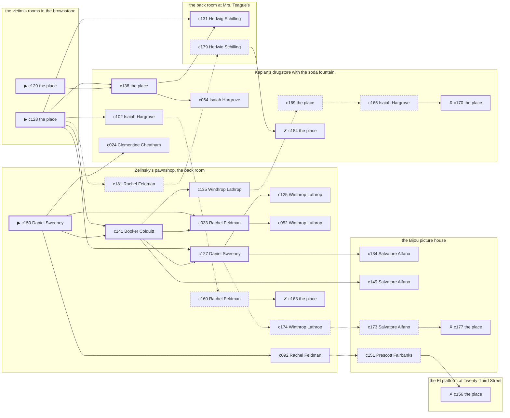

# the Bowery — case 18

**Seed** 18 · **Difficulty** 2 · **Attempts** 1 · **Detective** Humphrey

**Par** 8 actions · **Budget** 20 · **Slack** 12 · **Findable** 30 (spine 8, corroboration 9, noise 8 + 5 disqualifiers) · **Noise ratio** 43% · **Candidate pool** 185

## 1. The Truth

Grafton Thorndike, a bookkeeper, in the victim’s debt, killed Gretchen Vogel, a theatrical agent, with a gunshot at the victim’s rooms in the brownstone at 6:30 PM. Grafton Thorndike was about to be exposed by the victim (exposure). Grafton Thorndike had been at Zelinsky’s pawnshop, the back room earlier in the evening, where the weapon lived, and was alone with Gretchen Vogel when it happened. Daniel Sweeney hired us.

## 2. Dramatis Personae

| Name | Role | Relationship | Class of secret | Motive | Found at | Killer |
| --- | --- | --- | --- | --- | --- | --- |
| Gretchen Vogel | a theatrical agent | the victim | — | — | — | — |
| Daniel Sweeney (client) | a ward heeler | the victim’s rival in trade | gambling-debt | property | Zelinsky’s pawnshop, the back room | — |
| Isidore Lefkowitz | an insurance adjuster | a witness against the people the victim worked for | gambling-debt | — | Kaplan’s drugstore with the soda fountain | — |
| Clementine Cheatham | a seamstress | the victim’s former employee | hidden-family | — | Kaplan’s drugstore with the soda fountain | — |
| Rachel Feldman | a piano teacher | a childhood friend of the victim’s from the same block | secret-drinking | — | Zelinsky’s pawnshop, the back room | — |
| Salvatore Alfano | the victim’s nephew, at loose ends | engaged to the victim’s daughter | dope | jealousy | the Bijou picture house | — |
| Grafton Thorndike | a bookkeeper | in the victim’s debt | murder (+ forged-identity) | exposure | the El platform at Twenty-Third Street | **YES** |
| Winthrop Lathrop | the man behind the counter | fixture (counterman) | — | — | Zelinsky’s pawnshop, the back room | — |
| Isaiah Hargrove | the druggist | fixture (druggist) | — | — | Kaplan’s drugstore with the soda fountain | — |
| Prescott Fairbanks | the ticket-taker | fixture (ticket-taker) | — | — | the Bijou picture house | — |
| Hedwig Schilling | the landlady | fixture (landlady) | — | — | the back room at Mrs. Teague’s | — |
| Booker Colquitt | the patrolman on the beat | fixture (beat-cop) | — | — | Zelinsky’s pawnshop, the back room | — |

## 3. Places

- **the El platform at Twenty-Third Street** (public) — unwatched; objects: a folded stack of evening papers, a pasted-up timetable
- **the victim’s rooms in the brownstone** (private) — unwatched; objects: a wall telephone, a length of sash cord, a framed photograph — **THE SCENE**; the victim’s address
- **Zelinsky’s pawnshop, the back room** (semi) — watched by counterman (Winthrop Lathrop); objects: a nickel-plated revolver, a silver cigarette case, a spike of pawn tickets — where the weapon lived; within earshot of the scene
- **Kaplan’s drugstore with the soda fountain** (public) — watched by druggist (Isaiah Hargrove); objects: a bottle of chloral drops, an ice pick — within earshot of the scene
- **the Bijou picture house** (public) — watched by ticket-taker (Prescott Fairbanks); objects: a standing ashtray
- **the back room at Mrs. Teague’s** (private) — watched by landlady (Hedwig Schilling); objects: a bronze bookend, a strapped suitcase

## 4. Anchors

The coroner gives 6:00 PM–7:30 PM, four ticks wide. These are what close it: **last-edition** and **piano-lesson**.

- **the piano lesson on the floor above** — at 6:00 PM; at the back room at Mrs. Teague’s. You can time things by it: the same four bars, over and over, and then nothing. Only those present know that the child never did get the passage right.
- **the last edition coming off the truck** — at 6:30 PM; at Kaplan’s drugstore with the soda fountain. Somebody reliable notes who was there. Those present carry it: ink still wet enough to come off on a glove.
- **the beat cop’s pass** — at 6:30 PM, 8:00 PM, 9:30 PM, 11:00 PM; on a round through Zelinsky’s pawnshop, the back room → Kaplan’s drugstore with the soda fountain → the Bijou picture house → the El platform at Twenty-Third Street. Somebody reliable notes who was there.

## 5. Timelines

### Gretchen Vogel — the victim

| Tick | Time | Truth | Claimed | Companion claimed |
| --- | --- | --- | --- | --- |
| 0 | 6:00 PM | the back room at Mrs. Teague’s | the back room at Mrs. Teague’s | — |
| 1 | 6:30 PM | the victim’s rooms in the brownstone ☠ | the victim’s rooms in the brownstone | — |
| 2 | 7:00 PM | — | — | — |
| 3 | 7:30 PM | — | — | — |
| 4 | 8:00 PM | — | — | — |
| 5 | 8:30 PM | — | — | — |
| 6 | 9:00 PM | — | — | — |
| 7 | 9:30 PM | — | — | — |
| 8 | 10:00 PM | — | — | — |
| 9 | 10:30 PM | — | — | — |
| 10 | 11:00 PM | — | — | — |
| 11 | 11:30 PM | — | — | — |

### Daniel Sweeney

| Tick | Time | Truth | Claimed | Companion claimed |
| --- | --- | --- | --- | --- |
| 0 | 6:00 PM | the Bijou picture house | the Bijou picture house | — |
| 1 | 6:30 PM | Kaplan’s drugstore with the soda fountain | Kaplan’s drugstore with the soda fountain | — |
| 2 | 7:00 PM | the El platform at Twenty-Third Street | **the back room at Mrs. Teague’s** | Isidore Lefkowitz |
| 3 | 7:30 PM | the El platform at Twenty-Third Street | the El platform at Twenty-Third Street | — |
| 4 | 8:00 PM | Zelinsky’s pawnshop, the back room | Zelinsky’s pawnshop, the back room | — |
| 5 | 8:30 PM | Zelinsky’s pawnshop, the back room | Zelinsky’s pawnshop, the back room | — |
| 6 | 9:00 PM | Zelinsky’s pawnshop, the back room | Zelinsky’s pawnshop, the back room | — |
| 7 | 9:30 PM | Zelinsky’s pawnshop, the back room | Zelinsky’s pawnshop, the back room | — |
| 8 | 10:00 PM | Zelinsky’s pawnshop, the back room | Zelinsky’s pawnshop, the back room | — |
| 9 | 10:30 PM | Zelinsky’s pawnshop, the back room | Zelinsky’s pawnshop, the back room | — |
| 10 | 11:00 PM | Zelinsky’s pawnshop, the back room | Zelinsky’s pawnshop, the back room | — |
| 11 | 11:30 PM | Kaplan’s drugstore with the soda fountain | Kaplan’s drugstore with the soda fountain | — |

### Isidore Lefkowitz

| Tick | Time | Truth | Claimed | Companion claimed |
| --- | --- | --- | --- | --- |
| 0 | 6:00 PM | Zelinsky’s pawnshop, the back room | Zelinsky’s pawnshop, the back room | — |
| 1 | 6:30 PM | Zelinsky’s pawnshop, the back room | **Kaplan’s drugstore with the soda fountain** | — |
| 2 | 7:00 PM | Kaplan’s drugstore with the soda fountain | Kaplan’s drugstore with the soda fountain | — |
| 3 | 7:30 PM | Kaplan’s drugstore with the soda fountain | Kaplan’s drugstore with the soda fountain | — |
| 4 | 8:00 PM | the back room at Mrs. Teague’s | the back room at Mrs. Teague’s | — |
| 5 | 8:30 PM | the El platform at Twenty-Third Street | the El platform at Twenty-Third Street | — |
| 6 | 9:00 PM | Kaplan’s drugstore with the soda fountain | Kaplan’s drugstore with the soda fountain | — |
| 7 | 9:30 PM | Kaplan’s drugstore with the soda fountain | Kaplan’s drugstore with the soda fountain | — |
| 8 | 10:00 PM | the Bijou picture house | the Bijou picture house | — |
| 9 | 10:30 PM | the Bijou picture house | the Bijou picture house | — |
| 10 | 11:00 PM | the back room at Mrs. Teague’s | the back room at Mrs. Teague’s | — |
| 11 | 11:30 PM | Kaplan’s drugstore with the soda fountain | Kaplan’s drugstore with the soda fountain | — |

### Clementine Cheatham

| Tick | Time | Truth | Claimed | Companion claimed |
| --- | --- | --- | --- | --- |
| 0 | 6:00 PM | Zelinsky’s pawnshop, the back room | Zelinsky’s pawnshop, the back room | — |
| 1 | 6:30 PM | Kaplan’s drugstore with the soda fountain | **Zelinsky’s pawnshop, the back room** | — |
| 2 | 7:00 PM | Kaplan’s drugstore with the soda fountain | Kaplan’s drugstore with the soda fountain | — |
| 3 | 7:30 PM | Kaplan’s drugstore with the soda fountain | Kaplan’s drugstore with the soda fountain | — |
| 4 | 8:00 PM | Kaplan’s drugstore with the soda fountain | Kaplan’s drugstore with the soda fountain | — |
| 5 | 8:30 PM | Kaplan’s drugstore with the soda fountain | Kaplan’s drugstore with the soda fountain | — |
| 6 | 9:00 PM | Kaplan’s drugstore with the soda fountain | Kaplan’s drugstore with the soda fountain | — |
| 7 | 9:30 PM | Kaplan’s drugstore with the soda fountain | Kaplan’s drugstore with the soda fountain | — |
| 8 | 10:00 PM | Kaplan’s drugstore with the soda fountain | Kaplan’s drugstore with the soda fountain | — |
| 9 | 10:30 PM | Kaplan’s drugstore with the soda fountain | Kaplan’s drugstore with the soda fountain | — |
| 10 | 11:00 PM | Kaplan’s drugstore with the soda fountain | Kaplan’s drugstore with the soda fountain | — |
| 11 | 11:30 PM | the Bijou picture house | the Bijou picture house | — |

### Rachel Feldman

| Tick | Time | Truth | Claimed | Companion claimed |
| --- | --- | --- | --- | --- |
| 0 | 6:00 PM | Zelinsky’s pawnshop, the back room | Zelinsky’s pawnshop, the back room | — |
| 1 | 6:30 PM | Kaplan’s drugstore with the soda fountain | Kaplan’s drugstore with the soda fountain | — |
| 2 | 7:00 PM | Zelinsky’s pawnshop, the back room | Zelinsky’s pawnshop, the back room | — |
| 3 | 7:30 PM | Zelinsky’s pawnshop, the back room | Zelinsky’s pawnshop, the back room | — |
| 4 | 8:00 PM | Zelinsky’s pawnshop, the back room | Zelinsky’s pawnshop, the back room | — |
| 5 | 8:30 PM | the Bijou picture house | **the back room at Mrs. Teague’s** | Daniel Sweeney |
| 6 | 9:00 PM | the Bijou picture house | **the back room at Mrs. Teague’s** | Daniel Sweeney |
| 7 | 9:30 PM | the Bijou picture house | the Bijou picture house | — |
| 8 | 10:00 PM | Zelinsky’s pawnshop, the back room | Zelinsky’s pawnshop, the back room | — |
| 9 | 10:30 PM | Zelinsky’s pawnshop, the back room | Zelinsky’s pawnshop, the back room | — |
| 10 | 11:00 PM | Zelinsky’s pawnshop, the back room | Zelinsky’s pawnshop, the back room | — |
| 11 | 11:30 PM | Zelinsky’s pawnshop, the back room | Zelinsky’s pawnshop, the back room | — |

### Salvatore Alfano

| Tick | Time | Truth | Claimed | Companion claimed |
| --- | --- | --- | --- | --- |
| 0 | 6:00 PM | the Bijou picture house | the Bijou picture house | — |
| 1 | 6:30 PM | Kaplan’s drugstore with the soda fountain | Kaplan’s drugstore with the soda fountain | — |
| 2 | 7:00 PM | Kaplan’s drugstore with the soda fountain | **the Bijou picture house** | Daniel Sweeney |
| 3 | 7:30 PM | Kaplan’s drugstore with the soda fountain | **the Bijou picture house** | Daniel Sweeney |
| 4 | 8:00 PM | the Bijou picture house | the Bijou picture house | — |
| 5 | 8:30 PM | the Bijou picture house | the Bijou picture house | — |
| 6 | 9:00 PM | the El platform at Twenty-Third Street | the El platform at Twenty-Third Street | — |
| 7 | 9:30 PM | the El platform at Twenty-Third Street | the El platform at Twenty-Third Street | — |
| 8 | 10:00 PM | the El platform at Twenty-Third Street | the El platform at Twenty-Third Street | — |
| 9 | 10:30 PM | the Bijou picture house | the Bijou picture house | — |
| 10 | 11:00 PM | the Bijou picture house | the Bijou picture house | — |
| 11 | 11:30 PM | the El platform at Twenty-Third Street | the El platform at Twenty-Third Street | — |

### Grafton Thorndike — the killer

| Tick | Time | Truth | Claimed | Companion claimed |
| --- | --- | --- | --- | --- |
| 0 | 6:00 PM | Zelinsky’s pawnshop, the back room | Zelinsky’s pawnshop, the back room | — |
| 1 | 6:30 PM | the victim’s rooms in the brownstone ☠ | **Zelinsky’s pawnshop, the back room** | Daniel Sweeney |
| 2 | 7:00 PM | the El platform at Twenty-Third Street | the El platform at Twenty-Third Street | — |
| 3 | 7:30 PM | the El platform at Twenty-Third Street | the El platform at Twenty-Third Street | — |
| 4 | 8:00 PM | the El platform at Twenty-Third Street | the El platform at Twenty-Third Street | — |
| 5 | 8:30 PM | the El platform at Twenty-Third Street | the El platform at Twenty-Third Street | — |
| 6 | 9:00 PM | the El platform at Twenty-Third Street | the El platform at Twenty-Third Street | — |
| 7 | 9:30 PM | the El platform at Twenty-Third Street | the El platform at Twenty-Third Street | — |
| 8 | 10:00 PM | the Bijou picture house | the Bijou picture house | — |
| 9 | 10:30 PM | the Bijou picture house | the Bijou picture house | — |
| 10 | 11:00 PM | the Bijou picture house | the Bijou picture house | — |
| 11 | 11:30 PM | the Bijou picture house | the Bijou picture house | — |

### Fixtures (never lie, never withhold)

| Tick | Time | Winthrop Lathrop (the man behind the counter) | Isaiah Hargrove (the druggist) | Prescott Fairbanks (the ticket-taker) | Hedwig Schilling (the landlady) | Booker Colquitt (the patrolman on the beat) |
| --- | --- | --- | --- | --- | --- | --- |
| 0 | 6:00 PM | Zelinsky’s pawnshop, the back room | Kaplan’s drugstore with the soda fountain | the Bijou picture house | the back room at Mrs. Teague’s | — |
| 1 | 6:30 PM | Zelinsky’s pawnshop, the back room | Kaplan’s drugstore with the soda fountain | the Bijou picture house | the back room at Mrs. Teague’s | Zelinsky’s pawnshop, the back room |
| 2 | 7:00 PM | Zelinsky’s pawnshop, the back room | Kaplan’s drugstore with the soda fountain | the Bijou picture house | the back room at Mrs. Teague’s | — |
| 3 | 7:30 PM | Zelinsky’s pawnshop, the back room | Kaplan’s drugstore with the soda fountain | the Bijou picture house | the back room at Mrs. Teague’s | — |
| 4 | 8:00 PM | Zelinsky’s pawnshop, the back room | the back room at Mrs. Teague’s | the Bijou picture house | the back room at Mrs. Teague’s | Kaplan’s drugstore with the soda fountain |
| 5 | 8:30 PM | Zelinsky’s pawnshop, the back room | Kaplan’s drugstore with the soda fountain | the Bijou picture house | the back room at Mrs. Teague’s | — |
| 6 | 9:00 PM | Zelinsky’s pawnshop, the back room | Kaplan’s drugstore with the soda fountain | the Bijou picture house | the back room at Mrs. Teague’s | — |
| 7 | 9:30 PM | Zelinsky’s pawnshop, the back room | Kaplan’s drugstore with the soda fountain | the Bijou picture house | the back room at Mrs. Teague’s | the Bijou picture house |
| 8 | 10:00 PM | Zelinsky’s pawnshop, the back room | Kaplan’s drugstore with the soda fountain | the Bijou picture house | the back room at Mrs. Teague’s | — |
| 9 | 10:30 PM | Zelinsky’s pawnshop, the back room | Kaplan’s drugstore with the soda fountain | the El platform at Twenty-Third Street | the back room at Mrs. Teague’s | — |
| 10 | 11:00 PM | Zelinsky’s pawnshop, the back room | Kaplan’s drugstore with the soda fountain | the Bijou picture house | the back room at Mrs. Teague’s | the El platform at Twenty-Third Street |
| 11 | 11:30 PM | Zelinsky’s pawnshop, the back room | Kaplan’s drugstore with the soda fountain | the Bijou picture house | the back room at Mrs. Teague’s | — |

## 6. Secrets in play

- **Daniel Sweeney** (gambling-debt): Daniel Sweeney slips off to the El platform at Twenty-Third Street from 7:00 PM to settle with a bookmaker.
- **Isidore Lefkowitz** (gambling-debt): Isidore Lefkowitz slips off to Zelinsky’s pawnshop, the back room from 6:30 PM to settle with a bookmaker.
- **Clementine Cheatham** (hidden-family): Clementine Cheatham goes to Kaplan’s drugstore with the soda fountain from 6:30 PM to see a child nobody is supposed to know about.
- **Rachel Feldman** (secret-drinking): Rachel Feldman drinks alone at the Bijou picture house from 8:30 PM to 9:00 PM and will claim to have been anywhere else.
- **Salvatore Alfano** (dope): Salvatore Alfano buys morphine at Kaplan’s drugstore with the soda fountain from 7:00 PM to 7:30 PM and would rather be thought a murderer than a hop-head.
- **Grafton Thorndike** (murder): Grafton Thorndike is at the victim’s rooms in the brownstone from 6:30 PM, alone with Gretchen Vogel when it happens at 6:30 PM.
- **Grafton Thorndike** also (forged-identity): Grafton Thorndike is not the person the papers say. Nothing about the evening is hidden; the lie is all in the paperwork.

## 7. Clue list — the 30 findable

The opening three, free at the start: c128, c129, c150. Everything else has to be led to. The full candidate pool is in the companion file.

### At the El platform at Twenty-Third Street

- **c156** [disqualifier {b4}] (overheard; the place itself) → (end)
  - The bookmaker’s runner is found and will say it: Daniel Sweeney was at the El platform at Twenty-Third Street from 7:00 PM paying off eleven hundred dollars, a dollar at a time, and went nowhere near the killing.
  - _establishes: Daniel Sweeney’s gambling-debt accounted for; Daniel Sweeney at the El platform at Twenty-Third Street, 7:00 PM_

### At the victim’s rooms in the brownstone

- **c128** [spine ⟨opening⟩] (scene; the place itself) → c138, c141, c127, c131, c102, c181
  - Gretchen Vogel was found at the victim’s rooms in the brownstone. The cigarette he had going burned itself out on the sill where it fell. The last edition coming off the truck came at 6:30 PM, and the truck run is timed to the minute and the papers were out on the stand. That puts the killing in that half hour and no later.
  - _establishes: the victim dead by 6:30 PM; how it was done_
- **c129** [spine ⟨opening⟩] (morgue; the place itself) → c138
  - The coroner puts death between 6:00 PM and 7:30 PM — two hours of nothing useful. One bullet below the sternum. Powder burns on the shirt front: fired close.
  - _establishes: death between 6:00 PM and 7:30 PM; how it was done_

### At Zelinsky’s pawnshop, the back room

- **c150** [spine ⟨opening⟩] (client; Daniel Sweeney on why I was hired) → c141, c033, c024, c092
  - Daniel Sweeney hired us. Daniel Sweeney wants it known that Grafton Thorndike was about to be exposed by the victim, and would rather we started there.
  - _establishes: Grafton Thorndike had a motive (exposure)_
- **c141** [spine] (anchor; Booker Colquitt on the 6:30 PM round) → c033, c127, c149, c135
  - The beat cop’s pass at 6:30 PM puts Isidore Lefkowitz at Zelinsky’s pawnshop, the back room.
  - _establishes: Isidore Lefkowitz at Zelinsky’s pawnshop, the back room, 6:30 PM_
- **c033** [spine] (observation; Rachel Feldman on Grafton Thorndike) → c052
  - Rachel Feldman says Grafton Thorndike was at Zelinsky’s pawnshop, the back room at 6:00 PM.
  - _establishes: Grafton Thorndike at Zelinsky’s pawnshop, the back room, 6:00 PM; Grafton Thorndike could reach the weapon_
- **c127** [spine] (observation; Daniel Sweeney on Grafton Thorndike’s account) → c134, c125, c174
  - Grafton Thorndike says Daniel Sweeney was there for it. Daniel Sweeney says otherwise: Daniel Sweeney was at Kaplan’s drugstore with the soda fountain at 6:30 PM, nowhere near Zelinsky’s pawnshop, the back room.
  - _establishes: Grafton Thorndike not at Zelinsky’s pawnshop, the back room, 6:30 PM_
- **c125** [corroboration] (observation; Winthrop Lathrop on Grafton Thorndike’s account) → (end)
  - Winthrop Lathrop was at Zelinsky’s pawnshop, the back room at 6:30 PM and says Grafton Thorndike was not.
  - _establishes: Grafton Thorndike not at Zelinsky’s pawnshop, the back room, 6:30 PM_
- **c052** [corroboration] (observation; Winthrop Lathrop on Isidore Lefkowitz) → (end)
  - Winthrop Lathrop says Isidore Lefkowitz was at Zelinsky’s pawnshop, the back room from 6:00 PM to 6:30 PM.
  - _establishes: Isidore Lefkowitz at Zelinsky’s pawnshop, the back room, 6:00 PM–6:30 PM; Isidore Lefkowitz could reach the weapon_
- **c135** [corroboration] (anchor; Winthrop Lathrop on the noise that evening) → c169
  - Winthrop Lathrop was at Zelinsky’s pawnshop, the back room at 6:30 PM and heard a shot from the direction of the victim’s rooms in the brownstone, when the last edition came up.
  - _establishes: noise at the victim’s rooms in the brownstone at 6:30 PM; the victim dead by 6:30 PM; how it was done_
- **c092** [corroboration] (observation; Rachel Feldman on who was there at 6:30 PM) → c151
  - Rachel Feldman runs through it: at 6:30 PM there were Daniel Sweeney, Clementine Cheatham, Salvatore Alfano at Kaplan’s drugstore with the soda fountain, and nobody else worth naming.
  - _establishes: Daniel Sweeney at Kaplan’s drugstore with the soda fountain, 6:30 PM; Clementine Cheatham at Kaplan’s drugstore with the soda fountain, 6:30 PM; Salvatore Alfano at Kaplan’s drugstore with the soda fountain, 6:30 PM_
- **c174** [noise {b2}] (overheard; Winthrop Lathrop on Rachel Feldman) → c173
  - Winthrop Lathrop on Rachel Feldman: Somebody at the Bijou picture house says Rachel Feldman is in more often than Rachel Feldman lets on.
  - _establishes: context only_
- **c160** [noise {b3}] (overheard; Rachel Feldman on Isidore Lefkowitz) → c163
  - Rachel Feldman on Isidore Lefkowitz: Isidore Lefkowitz goes very quiet when the racing wire is mentioned.
  - _establishes: context only_
- **c163** [disqualifier {b3}] (overheard; the place itself) → (end)
  - The bookmaker’s runner is found and will say it: Isidore Lefkowitz was at Zelinsky’s pawnshop, the back room from 6:30 PM paying off eleven hundred dollars, a dollar at a time, and went nowhere near the killing.
  - _establishes: Isidore Lefkowitz’s gambling-debt accounted for; Isidore Lefkowitz at Zelinsky’s pawnshop, the back room, 6:30 PM_
- **c181** [noise {b5}] (overheard; Rachel Feldman on Salvatore Alfano) → c179
  - Rachel Feldman on Salvatore Alfano: Salvatore Alfano was steady at nine and shaking at seven, and it was not nerves about the police.
  - _establishes: context only_

### At Kaplan’s drugstore with the soda fountain

- **c138** [spine] (anchor; the place itself) → c131, c064
  - The last edition coming off the truck at 6:30 PM puts Daniel Sweeney, Clementine Cheatham, Rachel Feldman, Salvatore Alfano at Kaplan’s drugstore with the soda fountain.
  - _establishes: Daniel Sweeney at Kaplan’s drugstore with the soda fountain, 6:30 PM; Clementine Cheatham at Kaplan’s drugstore with the soda fountain, 6:30 PM; Rachel Feldman at Kaplan’s drugstore with the soda fountain, 6:30 PM; Salvatore Alfano at Kaplan’s drugstore with the soda fountain, 6:30 PM_
- **c102** [corroboration] (observation; Isaiah Hargrove on who was there at 6:30 PM) → c160
  - Isaiah Hargrove runs through it: at 6:30 PM there were Daniel Sweeney, Clementine Cheatham, Rachel Feldman, Salvatore Alfano at Kaplan’s drugstore with the soda fountain, and nobody else worth naming.
  - _establishes: Daniel Sweeney at Kaplan’s drugstore with the soda fountain, 6:30 PM; Clementine Cheatham at Kaplan’s drugstore with the soda fountain, 6:30 PM; Rachel Feldman at Kaplan’s drugstore with the soda fountain, 6:30 PM; Salvatore Alfano at Kaplan’s drugstore with the soda fountain, 6:30 PM_
- **c024** [corroboration] (observation; Clementine Cheatham on Grafton Thorndike) → (end)
  - Clementine Cheatham says Grafton Thorndike was at Zelinsky’s pawnshop, the back room at 6:00 PM.
  - _establishes: Grafton Thorndike at Zelinsky’s pawnshop, the back room, 6:00 PM; Grafton Thorndike could reach the weapon_
- **c064** [corroboration] (observation; Isaiah Hargrove on Clementine Cheatham) → (end)
  - Isaiah Hargrove says Clementine Cheatham was at Kaplan’s drugstore with the soda fountain from 6:30 PM to 7:30 PM.
  - _establishes: Clementine Cheatham at Kaplan’s drugstore with the soda fountain, 6:30 PM–7:30 PM_
- **c169** [noise {b1}] (physical; the place itself) → c165
  - A child’s shoe at Kaplan’s drugstore with the soda fountain, and nobody at Kaplan’s drugstore with the soda fountain has any children.
  - _establishes: context only_
- **c165** [noise {b1}] (overheard; Isaiah Hargrove on Clementine Cheatham) → c170
  - Isaiah Hargrove on Clementine Cheatham: Clementine Cheatham sends money out of every pay envelope and cannot say where it goes.
  - _establishes: context only_
- **c170** [disqualifier {b1}] (overheard; the place itself) → (end)
  - The woman who keeps the child says it straight out: Clementine Cheatham was at Kaplan’s drugstore with the soda fountain from 6:30 PM, the same as every week, and left with the same face as always.
  - _establishes: Clementine Cheatham’s hidden-family accounted for; Clementine Cheatham at Kaplan’s drugstore with the soda fountain, 6:30 PM_
- **c184** [disqualifier {b5}] (overheard; the place itself) → (end)
  - The man who sells it at Kaplan’s drugstore with the soda fountain gives it up rather than be held: Salvatore Alfano was there from 7:00 PM to 7:30 PM, and stayed until it took hold.
  - _establishes: Salvatore Alfano’s dope accounted for; Salvatore Alfano at Kaplan’s drugstore with the soda fountain, 7:00 PM–7:30 PM_

### At the Bijou picture house

- **c134** [corroboration] (anchor; Salvatore Alfano on the noise that evening) → (end)
  - Salvatore Alfano was at Kaplan’s drugstore with the soda fountain at 6:30 PM and heard a shot from the direction of the victim’s rooms in the brownstone, when the last edition came up.
  - _establishes: noise at the victim’s rooms in the brownstone at 6:30 PM; the victim dead by 6:30 PM; how it was done_
- **c149** [corroboration] (overheard; Salvatore Alfano on Grafton Thorndike and Gretchen Vogel) → (end)
  - Salvatore Alfano says Gretchen Vogel told Grafton Thorndike that the story would run whether Grafton Thorndike liked it or not.
  - _establishes: Grafton Thorndike had a motive (exposure)_
- **c173** [noise {b2}] (overheard; Salvatore Alfano on Rachel Feldman) → c177
  - Salvatore Alfano on Rachel Feldman: Rachel Feldman is on a temperance pledge that Rachel Feldman mentions before anybody asks.
  - _establishes: context only_
- **c177** [disqualifier {b2}] (overheard; the place itself) → (end)
  - The man behind the counter at the Bijou picture house knows exactly: Rachel Feldman was on the same stool from 8:30 PM to 9:00 PM and was in no condition to walk anywhere, let alone do this.
  - _establishes: Rachel Feldman’s secret-drinking accounted for; Rachel Feldman at the Bijou picture house, 8:30 PM–9:00 PM_
- **c151** [noise {b4}] (overheard; Prescott Fairbanks on Daniel Sweeney) → c156
  - Prescott Fairbanks on Daniel Sweeney: Daniel Sweeney was asking around for a hundred dollars in a hurry earlier in the week.
  - _establishes: context only_

### At the back room at Mrs. Teague’s

- **c131** [spine] (anchor; Hedwig Schilling on Gretchen Vogel that evening) → (end)
  - Hedwig Schilling puts Gretchen Vogel at the back room at Mrs. Teague’s while the lesson was still going on overhead, which was 6:00 PM, and alive enough to argue about the weather.
  - _establishes: the victim alive at 6:00 PM; Gretchen Vogel at the back room at Mrs. Teague’s, 6:00 PM_
- **c179** [noise {b5}] (overheard; Hedwig Schilling on Salvatore Alfano) → c184
  - Hedwig Schilling on Salvatore Alfano: Salvatore Alfano’s sleeves are buttoned at the wrist in a warm room.
  - _establishes: context only_

## 8. Clue graph

## 9. Deduction path

Par is **8 actions** against a budget of 20: 12 spare. Every id below is a spine clue.

**Time of death.** The coroner gives four ticks. The anchors close it to 6:30 PM: one puts Gretchen Vogel alive at 6:00 PM, the other times the scene at 6:30 PM. _(c129, c131, c128; + 2 corroborating)_

**Clearing the innocent.**

- Daniel Sweeney was not at the victim’s rooms in the brownstone at 6:30 PM, on two independent sources. _(c138; + 2 corroborating)_
- Isidore Lefkowitz was not at the victim’s rooms in the brownstone at 6:30 PM, on two independent sources. _(c141; + 2 corroborating)_
- Clementine Cheatham was not at the victim’s rooms in the brownstone at 6:30 PM, on two independent sources. _(c138; + 4 corroborating)_
- Rachel Feldman was not at the victim’s rooms in the brownstone at 6:30 PM, on two independent sources. _(c138; + 1 corroborating)_
- Salvatore Alfano was not at the victim’s rooms in the brownstone at 6:30 PM, on two independent sources. _(c138; + 2 corroborating)_

**Naming the killer.** Grafton Thorndike claims Zelinsky’s pawnshop, the back room at 6:30 PM. Two independent sources put that out of the question. _(c127; + 1 corroborating)_

**The weapon.** Grafton Thorndike was at Zelinsky’s pawnshop, the back room before 6:30 PM, where a nickel-plated revolver was kept. _(c033; + 1 corroborating)_

**Method.** A gunshot, on two physical sources. _(c128, c129; + 2 corroborating)_

**Motive.** exposure, on two independent sources. _(c150; + 1 corroborating)_

## 10. Red herrings

**Innocents who lie about the murder tick:**

- Isidore Lefkowitz claims Kaplan’s drugstore with the soda fountain at 6:30 PM and was really at Zelinsky’s pawnshop, the back room. Reason: Isidore Lefkowitz slips off to Zelinsky’s pawnshop, the back room from 6:30 PM to settle with a bookmaker.
- Clementine Cheatham claims Zelinsky’s pawnshop, the back room at 6:30 PM and was really at Kaplan’s drugstore with the soda fountain. Reason: Clementine Cheatham goes to Kaplan’s drugstore with the soda fountain from 6:30 PM to see a child nobody is supposed to know about.

**Innocents with a motive:**

- Daniel Sweeney — property: wanted the victim out of a lease.
- Salvatore Alfano — jealousy: was jealous of the victim.

**Noise branches, and what knocks each one down:**

- **b1** (Clementine Cheatham, hidden-family): c169 → c165 → **c170** — The woman who keeps the child says it straight out: Clementine Cheatham was at Kaplan’s drugstore with the soda fountain from 6:30 PM, the same as every week, and left with the same face as always.
- **b2** (Rachel Feldman, secret-drinking): c174 → c173 → **c177** — The man behind the counter at the Bijou picture house knows exactly: Rachel Feldman was on the same stool from 8:30 PM to 9:00 PM and was in no condition to walk anywhere, let alone do this.
- **b3** (Isidore Lefkowitz, gambling-debt): c160 → **c163** — The bookmaker’s runner is found and will say it: Isidore Lefkowitz was at Zelinsky’s pawnshop, the back room from 6:30 PM paying off eleven hundred dollars, a dollar at a time, and went nowhere near the killing.
- **b4** (Daniel Sweeney, gambling-debt): c151 → **c156** — The bookmaker’s runner is found and will say it: Daniel Sweeney was at the El platform at Twenty-Third Street from 7:00 PM paying off eleven hundred dollars, a dollar at a time, and went nowhere near the killing.
- **b5** (Salvatore Alfano, dope): c181 → c179 → **c184** — The man who sells it at Kaplan’s drugstore with the soda fountain gives it up rather than be held: Salvatore Alfano was there from 7:00 PM to 7:30 PM, and stayed until it took hold.

