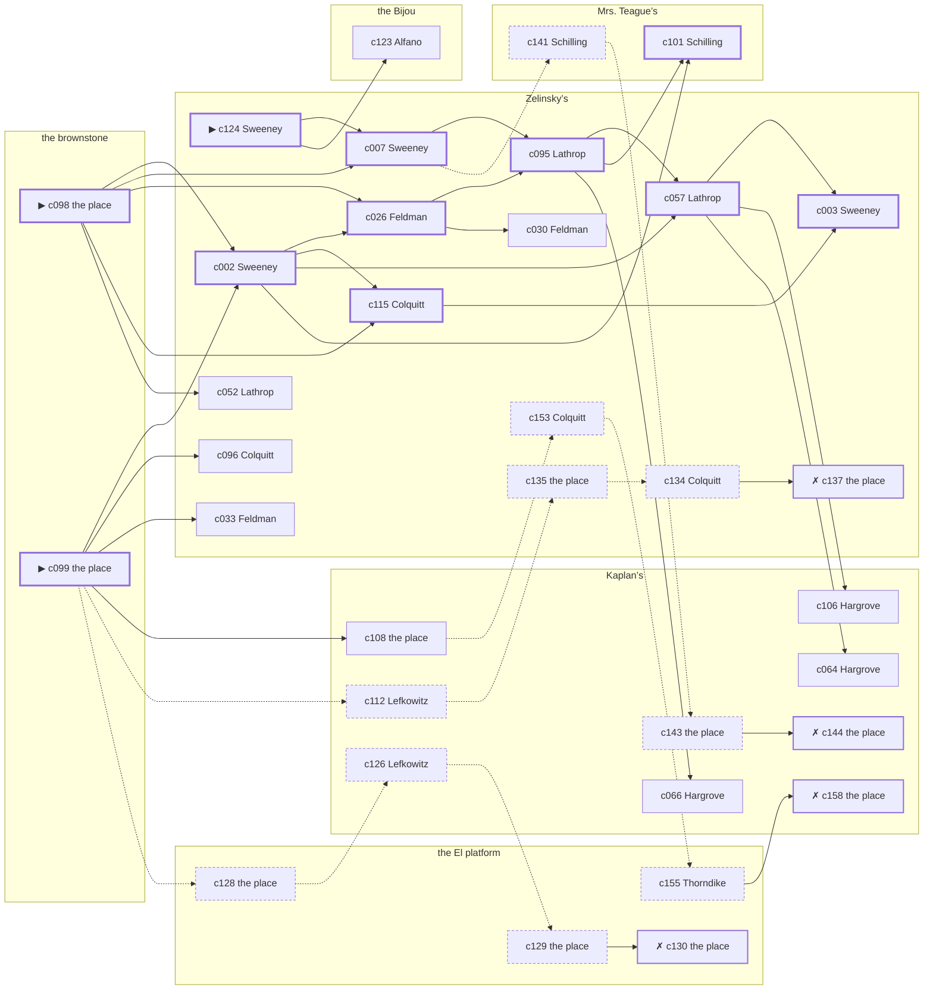

# the Bowery — case 18

**Seed** 18 · **Difficulty** 2 · **Attempts** 1 · **Detective** Humphrey

**Par** 10 actions · **Slack** 6 · **Budget** 16 · **Findable** 34 (spine 11, corroboration 9, noise 10 + 4 disqualifiers) · **Noise ratio** 41% · **Candidate pool** 159

## 1. The Truth

Grafton Thorndike, a bookkeeper, in the victim’s debt, killed Gretchen Vogel, a theatrical agent, with a gunshot at the brownstone at 6:30 PM. Thorndike was about to be exposed by the victim (exposure). Thorndike had been at Zelinsky’s earlier in the evening, where the weapon lived, and was alone with Vogel when it happened. Sweeney hired us.

## 2. Dramatis Personae

| Name | Role | Relationship | Class of secret | Motive | Found at | Killer |
| --- | --- | --- | --- | --- | --- | --- |
| Gretchen Vogel | a theatrical agent | the victim | — | — | — | — |
| Daniel Sweeney (client) | a ward heeler | a witness against the people the victim worked for | gambling-debt | silence-a-witness | Zelinsky’s | — |
| Isidore Lefkowitz | an insurance adjuster | a witness against the people the victim worked for | gambling-debt | — | Kaplan’s | — |
| Clementine Cheatham | a seamstress | the victim’s former employee | hidden-family | — | Kaplan’s | — |
| Rachel Feldman | a piano teacher | a childhood friend of the victim’s from the same block | secret-drinking | — | Zelinsky’s | — |
| Salvatore Alfano | a young man living on expectations | engaged to the victim’s daughter | dope | jealousy | the Bijou | — |
| Grafton Thorndike | a bookkeeper | in the victim’s debt | murder (+ forged-identity) | exposure | the El platform | **YES** |
| Winthrop Lathrop | the man behind the counter | fixture (counterman) | — | — | Zelinsky’s | — |
| Isaiah Hargrove | the druggist | fixture (druggist) | — | — | Kaplan’s | — |
| Prescott Fairbanks | the ticket-taker | fixture (ticket-taker) | — | — | the Bijou | — |
| Hedwig Schilling | the landlady | fixture (landlady) | — | — | Mrs. Teague’s | — |
| Booker Colquitt | the patrolman on the beat | fixture (beat-cop) | — | — | Zelinsky’s | — |

## 3. Places

- **the El platform at Twenty-Third Street** (public) — unwatched; objects: a folded stack of evening papers, a pasted-up timetable
- **the victim’s rooms in the brownstone** (private) — unwatched; objects: a wall telephone, a length of sash cord, a framed photograph — **THE SCENE**; the victim’s address
- **Zelinsky’s pawnshop, the back room** (semi) — watched by counterman (Lathrop); objects: a nickel-plated revolver, a silver cigarette case, a spike of pawn tickets — where the weapon lived; within earshot of the scene
- **Kaplan’s drugstore with the soda fountain** (public) — watched by druggist (Hargrove); objects: a bottle of chloral drops, an ice pick — within earshot of the scene
- **the Bijou picture house** (public) — watched by ticket-taker (Fairbanks); objects: a standing ashtray
- **the back room at Mrs. Teague’s** (private) — watched by landlady (Schilling); objects: a bronze bookend, a strapped suitcase

## 4. Anchors

The coroner gives 6:00 PM–7:30 PM, four ticks wide. These are what close it: **last-edition** and **piano-lesson**.

- **the piano lesson on the floor above** — at 6:00 PM; at Mrs. Teague’s. You can time things by it: the same four bars, over and over, and then nothing. Only those present know that the child never did get the passage right.
- **the last edition coming off the truck** — at 6:30 PM; at Kaplan’s. Somebody reliable notes who was there. Only those present know that the late edition led with the bridge contract and not the hold-up. Those present carry it: ink still wet enough to come off on a glove.
- **the beat cop’s pass** — at 6:30 PM, 8:00 PM, 9:30 PM, 11:00 PM; on a round through Zelinsky’s → Kaplan’s → the Bijou → the El platform. Somebody reliable notes who was there.

## 5. Timelines

### Vogel — the victim

| Tick | Time | Truth | Claimed | Companion claimed |
| --- | --- | --- | --- | --- |
| 0 | 6:00 PM | Mrs. Teague’s | Mrs. Teague’s | — |
| 1 | 6:30 PM | the brownstone ☠ | the brownstone | — |
| 2 | 7:00 PM | — | — | — |
| 3 | 7:30 PM | — | — | — |
| 4 | 8:00 PM | — | — | — |
| 5 | 8:30 PM | — | — | — |
| 6 | 9:00 PM | — | — | — |
| 7 | 9:30 PM | — | — | — |
| 8 | 10:00 PM | — | — | — |
| 9 | 10:30 PM | — | — | — |
| 10 | 11:00 PM | — | — | — |
| 11 | 11:30 PM | — | — | — |

### Sweeney

| Tick | Time | Truth | Claimed | Companion claimed |
| --- | --- | --- | --- | --- |
| 0 | 6:00 PM | the Bijou | the Bijou | — |
| 1 | 6:30 PM | Kaplan’s | Kaplan’s | — |
| 2 | 7:00 PM | the El platform | **Mrs. Teague’s** | Lefkowitz |
| 3 | 7:30 PM | the El platform | the El platform | — |
| 4 | 8:00 PM | Zelinsky’s | Zelinsky’s | — |
| 5 | 8:30 PM | Zelinsky’s | Zelinsky’s | — |
| 6 | 9:00 PM | Zelinsky’s | Zelinsky’s | — |
| 7 | 9:30 PM | Zelinsky’s | Zelinsky’s | — |
| 8 | 10:00 PM | Zelinsky’s | Zelinsky’s | — |
| 9 | 10:30 PM | Zelinsky’s | Zelinsky’s | — |
| 10 | 11:00 PM | Zelinsky’s | Zelinsky’s | — |
| 11 | 11:30 PM | Kaplan’s | Kaplan’s | — |

### Lefkowitz

| Tick | Time | Truth | Claimed | Companion claimed |
| --- | --- | --- | --- | --- |
| 0 | 6:00 PM | Zelinsky’s | Zelinsky’s | — |
| 1 | 6:30 PM | Zelinsky’s | **Kaplan’s** | — |
| 2 | 7:00 PM | Kaplan’s | Kaplan’s | — |
| 3 | 7:30 PM | Kaplan’s | Kaplan’s | — |
| 4 | 8:00 PM | Mrs. Teague’s | Mrs. Teague’s | — |
| 5 | 8:30 PM | the El platform | the El platform | — |
| 6 | 9:00 PM | Kaplan’s | Kaplan’s | — |
| 7 | 9:30 PM | Kaplan’s | Kaplan’s | — |
| 8 | 10:00 PM | the Bijou | the Bijou | — |
| 9 | 10:30 PM | the Bijou | the Bijou | — |
| 10 | 11:00 PM | Mrs. Teague’s | Mrs. Teague’s | — |
| 11 | 11:30 PM | Kaplan’s | Kaplan’s | — |

### Cheatham

| Tick | Time | Truth | Claimed | Companion claimed |
| --- | --- | --- | --- | --- |
| 0 | 6:00 PM | Zelinsky’s | Zelinsky’s | — |
| 1 | 6:30 PM | Kaplan’s | **Zelinsky’s** | — |
| 2 | 7:00 PM | Kaplan’s | Kaplan’s | — |
| 3 | 7:30 PM | Kaplan’s | Kaplan’s | — |
| 4 | 8:00 PM | Kaplan’s | Kaplan’s | — |
| 5 | 8:30 PM | Kaplan’s | Kaplan’s | — |
| 6 | 9:00 PM | Kaplan’s | Kaplan’s | — |
| 7 | 9:30 PM | Kaplan’s | Kaplan’s | — |
| 8 | 10:00 PM | Kaplan’s | Kaplan’s | — |
| 9 | 10:30 PM | Kaplan’s | Kaplan’s | — |
| 10 | 11:00 PM | Kaplan’s | Kaplan’s | — |
| 11 | 11:30 PM | the Bijou | the Bijou | — |

### Feldman

| Tick | Time | Truth | Claimed | Companion claimed |
| --- | --- | --- | --- | --- |
| 0 | 6:00 PM | Zelinsky’s | Zelinsky’s | — |
| 1 | 6:30 PM | Kaplan’s | Kaplan’s | — |
| 2 | 7:00 PM | Zelinsky’s | Zelinsky’s | — |
| 3 | 7:30 PM | Zelinsky’s | Zelinsky’s | — |
| 4 | 8:00 PM | Zelinsky’s | Zelinsky’s | — |
| 5 | 8:30 PM | the Bijou | **Mrs. Teague’s** | Sweeney |
| 6 | 9:00 PM | the Bijou | **Mrs. Teague’s** | Sweeney |
| 7 | 9:30 PM | the Bijou | the Bijou | — |
| 8 | 10:00 PM | Zelinsky’s | Zelinsky’s | — |
| 9 | 10:30 PM | Zelinsky’s | Zelinsky’s | — |
| 10 | 11:00 PM | Zelinsky’s | Zelinsky’s | — |
| 11 | 11:30 PM | Zelinsky’s | Zelinsky’s | — |

### Alfano

| Tick | Time | Truth | Claimed | Companion claimed |
| --- | --- | --- | --- | --- |
| 0 | 6:00 PM | the Bijou | the Bijou | — |
| 1 | 6:30 PM | Kaplan’s | Kaplan’s | — |
| 2 | 7:00 PM | Kaplan’s | **the Bijou** | Sweeney |
| 3 | 7:30 PM | Kaplan’s | **the Bijou** | Sweeney |
| 4 | 8:00 PM | the Bijou | the Bijou | — |
| 5 | 8:30 PM | the Bijou | the Bijou | — |
| 6 | 9:00 PM | the El platform | the El platform | — |
| 7 | 9:30 PM | the El platform | the El platform | — |
| 8 | 10:00 PM | the El platform | the El platform | — |
| 9 | 10:30 PM | the Bijou | the Bijou | — |
| 10 | 11:00 PM | the Bijou | the Bijou | — |
| 11 | 11:30 PM | the El platform | the El platform | — |

### Thorndike — the killer

| Tick | Time | Truth | Claimed | Companion claimed |
| --- | --- | --- | --- | --- |
| 0 | 6:00 PM | Zelinsky’s | Zelinsky’s | — |
| 1 | 6:30 PM | the brownstone ☠ | **Zelinsky’s** | Sweeney |
| 2 | 7:00 PM | the El platform | the El platform | — |
| 3 | 7:30 PM | the El platform | the El platform | — |
| 4 | 8:00 PM | the El platform | the El platform | — |
| 5 | 8:30 PM | the El platform | the El platform | — |
| 6 | 9:00 PM | the El platform | the El platform | — |
| 7 | 9:30 PM | the El platform | the El platform | — |
| 8 | 10:00 PM | the Bijou | the Bijou | — |
| 9 | 10:30 PM | the Bijou | the Bijou | — |
| 10 | 11:00 PM | the Bijou | the Bijou | — |
| 11 | 11:30 PM | the Bijou | the Bijou | — |

### Fixtures (never lie, never withhold)

| Tick | Time | Lathrop (the man behind the counter) | Hargrove (the druggist) | Fairbanks (the ticket-taker) | Schilling (the landlady) | Colquitt (the patrolman on the beat) |
| --- | --- | --- | --- | --- | --- | --- |
| 0 | 6:00 PM | Zelinsky’s | Kaplan’s | the Bijou | Mrs. Teague’s | — |
| 1 | 6:30 PM | Zelinsky’s | Kaplan’s | the Bijou | Mrs. Teague’s | Zelinsky’s |
| 2 | 7:00 PM | Zelinsky’s | Kaplan’s | the Bijou | Mrs. Teague’s | — |
| 3 | 7:30 PM | Zelinsky’s | Kaplan’s | the Bijou | Mrs. Teague’s | — |
| 4 | 8:00 PM | Zelinsky’s | Mrs. Teague’s | the Bijou | Mrs. Teague’s | Kaplan’s |
| 5 | 8:30 PM | Zelinsky’s | Kaplan’s | the Bijou | Mrs. Teague’s | — |
| 6 | 9:00 PM | Zelinsky’s | Kaplan’s | the Bijou | Mrs. Teague’s | — |
| 7 | 9:30 PM | Zelinsky’s | Kaplan’s | the Bijou | Mrs. Teague’s | the Bijou |
| 8 | 10:00 PM | Zelinsky’s | Kaplan’s | the Bijou | Mrs. Teague’s | — |
| 9 | 10:30 PM | Zelinsky’s | Kaplan’s | the El platform | Mrs. Teague’s | — |
| 10 | 11:00 PM | Zelinsky’s | Kaplan’s | the Bijou | Mrs. Teague’s | the El platform |
| 11 | 11:30 PM | Zelinsky’s | Kaplan’s | the Bijou | Mrs. Teague’s | — |

## 6. Secrets in play

- **Sweeney** (gambling-debt): Sweeney slips off to the El platform from 7:00 PM to settle with a bookmaker.
- **Lefkowitz** (gambling-debt): Lefkowitz slips off to Zelinsky’s from 6:30 PM to settle with a bookmaker.
- **Cheatham** (hidden-family): Cheatham goes to Kaplan’s from 6:30 PM to see a child nobody is supposed to know about.
- **Feldman** (secret-drinking): Feldman drinks alone at the Bijou from 8:30 PM to 9:00 PM and will claim to have been anywhere else.
- **Alfano** (dope): Alfano buys morphine at Kaplan’s from 7:00 PM to 7:30 PM and would rather be thought a murderer than a hop-head.
- **Thorndike** (murder): Thorndike is at the brownstone from 6:30 PM, alone with Vogel when it happens at 6:30 PM.
- **Thorndike** also (forged-identity): Thorndike is not the person the papers say. Nothing about the evening is hidden; the lie is all in the paperwork.

## 7. Clue list — the 34 findable

The opening three, free at the start: c098, c099, c124. Everything else has to be led to. The full candidate pool is in the companion file.

### At the El platform

- **c128** [noise {b2}] (physical; the place itself) → c126
  - Betting slips at the El platform in Sweeney’s pocketbook, all of them losers, all of them this month.
  - _establishes: context only_
- **c129** [noise {b2}] (physical; the place itself) → c130
  - A book of markers at the El platform with Sweeney’s initials against four of them.
  - _establishes: context only_
- **c130** [disqualifier {b2}] (overheard; the place itself) → (end)
  - The bookmaker’s runner is found and will say it: Sweeney was at the El platform from 7:00 PM paying off eleven hundred dollars, a dollar at a time, and went nowhere near the killing.
  - _establishes: Sweeney’s gambling-debt accounted for; Sweeney at the El platform, 7:00 PM_
- **c155** [noise {b4}] (overheard; Thorndike on Alfano) → c158
  - Thorndike on Alfano: Alfano was steady at nine and shaking at seven, and it was not nerves about the police.
  - _establishes: context only_

### At the brownstone

- **c098** [spine ⟨opening⟩] (scene; the place itself) → c002, c007, c026, c115, c052
  - Vogel was found at the brownstone. The cigarette he had going burned itself out on the sill where it fell. The last edition came off the truck at 6:30 PM, and a paper from that run is here with the ink still wet.
  - _establishes: the victim dead by 6:30 PM; how it was done_
- **c099** [spine ⟨opening⟩] (morgue; the place itself) → c002, c096, c033, c108, c112, c128
  - The coroner puts death between 6:00 PM and 7:30 PM — two hours of nothing useful. One bullet below the sternum. Powder burns on the shirt front: fired close.
  - _establishes: death between 6:00 PM and 7:30 PM; how it was done_

### At Zelinsky’s

- **c124** [spine ⟨opening⟩] (client; Sweeney on why I was hired) → c007, c123
  - Sweeney hired us, and wants it known that Thorndike was about to be exposed by the victim, and would rather we started there.
  - _establishes: Thorndike had a motive (exposure)_
- **c002** [spine] (observation; Sweeney on Cheatham) → c026, c115, c057, c101
  - Sweeney says Cheatham was at Kaplan’s at 6:30 PM.
  - _establishes: Cheatham at Kaplan’s, 6:30 PM_
- **c007** [spine] (observation; Sweeney on Alfano) → c095, c141
  - Sweeney says Alfano was at Kaplan’s at 6:30 PM.
  - _establishes: Alfano at Kaplan’s, 6:30 PM_
- **c026** [spine] (observation; Feldman on Sweeney) → c095, c030
  - Feldman says Sweeney was at Kaplan’s at 6:30 PM.
  - _establishes: Sweeney at Kaplan’s, 6:30 PM_
- **c095** [spine] (observation; Lathrop on Thorndike’s account) → c057, c101, c066
  - Lathrop was at Zelinsky’s at 6:30 PM and says Thorndike was not.
  - _establishes: Thorndike not at Zelinsky’s, 6:30 PM_
- **c115** [spine] (anchor; Colquitt on Lefkowitz) → c003
  - Colquitt came round at 6:30 PM and had Lefkowitz at Zelinsky’s.
  - _establishes: Lefkowitz at Zelinsky’s, 6:30 PM_
- **c057** [spine] (observation; Lathrop on Thorndike) → c003, c106, c064
  - Lathrop says Thorndike was at Zelinsky’s at 6:00 PM.
  - _establishes: Thorndike at Zelinsky’s, 6:00 PM; Thorndike could reach the weapon_
- **c003** [spine] (observation; Sweeney on Feldman) → (end)
  - Sweeney says Feldman was at Kaplan’s at 6:30 PM.
  - _establishes: Feldman at Kaplan’s, 6:30 PM_
- **c096** [corroboration] (observation; Colquitt on Thorndike’s account) → (end)
  - Colquitt was at Zelinsky’s at 6:30 PM and says Thorndike was not.
  - _establishes: Thorndike not at Zelinsky’s, 6:30 PM_
- **c033** [corroboration] (observation; Feldman on Thorndike) → (end)
  - Feldman says Thorndike was at Zelinsky’s at 6:00 PM.
  - _establishes: Thorndike at Zelinsky’s, 6:00 PM; Thorndike could reach the weapon_
- **c030** [corroboration] (observation; Feldman on Cheatham) → (end)
  - Feldman says Cheatham was at Zelinsky’s at 6:00 PM.
  - _establishes: Cheatham at Zelinsky’s, 6:00 PM; Cheatham could reach the weapon_
- **c052** [corroboration] (observation; Lathrop on Lefkowitz) → (end)
  - Lathrop says Lefkowitz was at Zelinsky’s from 6:00 PM to 6:30 PM.
  - _establishes: Lefkowitz at Zelinsky’s, 6:00 PM–6:30 PM; Lefkowitz could reach the weapon_
- **c135** [noise {b1}] (physical; the place itself) → c134
  - Betting slips at Zelinsky’s in Lefkowitz’s pocketbook, all of them losers, all of them this month.
  - _establishes: context only_
- **c134** [noise {b1}] (overheard; Colquitt on Lefkowitz) → c137
  - Colquitt on Lefkowitz: Lefkowitz goes very quiet when the racing wire is mentioned.
  - _establishes: context only_
- **c137** [disqualifier {b1}] (overheard; the place itself) → (end)
  - The bookmaker’s runner is found and will say it: Lefkowitz was at Zelinsky’s from 6:30 PM paying off eleven hundred dollars, a dollar at a time, and went nowhere near the killing.
  - _establishes: Lefkowitz’s gambling-debt accounted for; Lefkowitz at Zelinsky’s, 6:30 PM_
- **c153** [noise {b4}] (overheard; Colquitt on Alfano) → c155
  - Colquitt on Alfano: Alfano’s sleeves are buttoned at the wrist in a warm room.
  - _establishes: context only_

### At Kaplan’s

- **c106** [corroboration] (anchor; Hargrove on the noise that evening) → (end)
  - Hargrove was at Kaplan’s at 6:30 PM and heard a shot from the direction of the brownstone, as the last edition was coming up.
  - _establishes: noise at the brownstone at 6:30 PM; the victim dead by 6:30 PM; how it was done_
- **c108** [corroboration] (anchor; the place itself) → c153
  - The last edition coming off the truck was at 6:30 PM, and Sweeney was at Kaplan’s for it.
  - _establishes: Sweeney at Kaplan’s, 6:30 PM_
- **c064** [corroboration] (observation; Hargrove on Cheatham) → (end)
  - Hargrove says Cheatham was at Kaplan’s from 6:30 PM to 7:30 PM.
  - _establishes: Cheatham at Kaplan’s, 6:30 PM–7:30 PM_
- **c066** [corroboration] (observation; Hargrove on Feldman) → (end)
  - Hargrove says Feldman was at Kaplan’s at 6:30 PM.
  - _establishes: Feldman at Kaplan’s, 6:30 PM_
- **c112** [noise {b1}] (anchor; Lefkowitz on the last edition coming off the truck) → c135
  - Lefkowitz claims Kaplan’s at 6:30 PM, which is when the last edition coming off the truck was on. Asked about it, Lefkowitz cannot say that the late edition led with the bridge contract and not the hold-up — and everybody who was there can.
  - _establishes: Lefkowitz not at Kaplan’s, 6:30 PM_
- **c126** [noise {b2}] (overheard; Lefkowitz on Sweeney) → c129
  - Lefkowitz on Sweeney: A man nobody knew was waiting for Sweeney at the El platform and would not give a name.
  - _establishes: context only_
- **c143** [noise {b3}] (physical; the place itself) → c144
  - A child’s shoe at Kaplan’s, and nobody at Kaplan’s has any children.
  - _establishes: context only_
- **c144** [disqualifier {b3}] (overheard; the place itself) → (end)
  - The woman who keeps the child says it straight out: Cheatham was at Kaplan’s from 6:30 PM, the same as every week, and left with the same face as always.
  - _establishes: Cheatham’s hidden-family accounted for; Cheatham at Kaplan’s, 6:30 PM_
- **c158** [disqualifier {b4}] (overheard; the place itself) → (end)
  - The man who sells it at Kaplan’s gives it up rather than be held: Alfano was there from 7:00 PM to 7:30 PM, and stayed until it took hold.
  - _establishes: Alfano’s dope accounted for; Alfano at Kaplan’s, 7:00 PM–7:30 PM_

### At the Bijou

- **c123** [corroboration] (overheard; Alfano on Thorndike and Vogel) → (end)
  - Alfano says Vogel told Thorndike that the story would run whether Thorndike liked it or not.
  - _establishes: Thorndike had a motive (exposure)_

### At Mrs. Teague’s

- **c101** [spine] (anchor; Schilling on Vogel that evening) → (end)
  - Schilling puts Vogel at Mrs. Teague’s while the lesson was still going on overhead, which was 6:00 PM, and alive enough to argue about the weather.
  - _establishes: the victim alive at 6:00 PM; Vogel at Mrs. Teague’s, 6:00 PM_
- **c141** [noise {b3}] (overheard; Schilling on Cheatham) → c143
  - Schilling on Cheatham: Cheatham keeps a photograph and will not be asked about it twice.
  - _establishes: context only_

## 8. Clue graph

## 9. Deduction path

Par is **10 actions** and the budget is par plus 6: **16**. Every id below is a spine clue; the inference is the sheet’s, not the clue’s.

**Time of death.** The coroner gives four ticks. The anchors close it to 6:30 PM: one puts Vogel alive at 6:00 PM, the other times the scene at 6:30 PM. _(c099, c101, c098; + 1 corroborating)_

**Clearing the innocent.**

- Sweeney was not at the brownstone at 6:30 PM. _(c026; + 1 corroborating)_
- Lefkowitz was not at the brownstone at 6:30 PM. _(c115; + 2 corroborating)_
- Cheatham was not at the brownstone at 6:30 PM. _(c002; + 2 corroborating)_
- Feldman was not at the brownstone at 6:30 PM. _(c003; + 1 corroborating)_
- Alfano was not at the brownstone at 6:30 PM. _(c007)_

**Naming the killer.** Thorndike claims Zelinsky’s at 6:30 PM. Two independent sources put that out of the question. _(c095; + 1 corroborating)_

**The weapon.** Thorndike was at Zelinsky’s before 6:30 PM, where a nickel-plated revolver was kept. _(c057; + 1 corroborating)_

**Method.** A gunshot, on two physical sources. _(c098, c099; + 1 corroborating)_

**Motive.** exposure, on two independent sources. _(c124; + 1 corroborating)_

## 10. Red herrings

**Innocents who lie about the murder tick:**

- Lefkowitz claims Kaplan’s at 6:30 PM and was really at Zelinsky’s. Reason: Lefkowitz slips off to Zelinsky’s from 6:30 PM to settle with a bookmaker.
- Cheatham claims Zelinsky’s at 6:30 PM and was really at Kaplan’s. Reason: Cheatham goes to Kaplan’s from 6:30 PM to see a child nobody is supposed to know about.

**Innocents with a motive:**

- Sweeney — silence-a-witness: needed the victim silent.
- Alfano — jealousy: was jealous of the victim.

**Noise branches, and what knocks each one down:**

- **b1** (Lefkowitz, gambling-debt): c112 → c135 → c134 → **c137** — The bookmaker’s runner is found and will say it: Lefkowitz was at Zelinsky’s from 6:30 PM paying off eleven hundred dollars, a dollar at a time, and went nowhere near the killing.
- **b2** (Sweeney, gambling-debt): c128 → c126 → c129 → **c130** — The bookmaker’s runner is found and will say it: Sweeney was at the El platform from 7:00 PM paying off eleven hundred dollars, a dollar at a time, and went nowhere near the killing.
- **b3** (Cheatham, hidden-family): c141 → c143 → **c144** — The woman who keeps the child says it straight out: Cheatham was at Kaplan’s from 6:30 PM, the same as every week, and left with the same face as always.
- **b4** (Alfano, dope): c153 → c155 → **c158** — The man who sells it at Kaplan’s gives it up rather than be held: Alfano was there from 7:00 PM to 7:30 PM, and stayed until it took hold.

