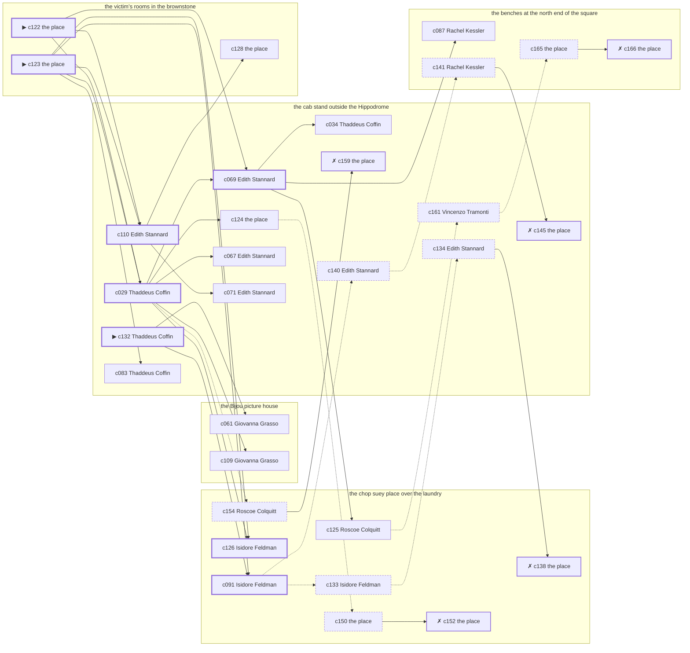

# Greenwich Village — case 19

**Seed** 19 · **Difficulty** 2 · **Attempts** 2 · **Detective** Humphrey

**Par** 7 actions · **Budget** 20 · **Slack** 13 · **Findable** 31 (spine 8, corroboration 10, noise 8 + 5 disqualifiers) · **Noise ratio** 42% · **Candidate pool** 167

## 1. The Truth

Vincenzo Tramonti, a lawyer with one clerk, the victim’s creditor, killed Winthrop Fairbanks, a pawnbroker, with a gunshot at the victim’s rooms in the brownstone at 8:30 PM. Vincenzo Tramonti wanted the victim out of a lease (property). Vincenzo Tramonti had been at the cab stand outside the Hippodrome earlier in the evening, where the weapon lived, and was alone with Winthrop Fairbanks when it happened. Thaddeus Coffin hired us.

## 2. Dramatis Personae

| Name | Role | Relationship | Class of secret | Motive | Found at | Killer |
| --- | --- | --- | --- | --- | --- | --- |
| Winthrop Fairbanks | a pawnbroker | the victim | — | — | — | — |
| Vincenzo Tramonti | a lawyer with one clerk | the victim’s creditor | murder (+ gambling-debt) | property | the cab stand outside the Hippodrome | **YES** |
| Roscoe Colquitt | the night manager at the hotel | the victim’s former employee | fence | debt | the chop suey place over the laundry | — |
| Michael Mulcahy | a hack driver | the victim’s tenant | fence | — | the chop suey place over the laundry | — |
| Lorraine Tillman | the owner of the block | the victim’s business partner | fence | — | the chop suey place over the laundry | — |
| Thaddeus Coffin (client) | a bookmaker in a small way | in the victim’s debt | fence | — | the cab stand outside the Hippodrome | — |
| Rachel Kessler | a switchboard operator | the victim’s former employee | hidden-family | — | the benches at the north end of the square | — |
| Isidore Feldman | the man behind the counter | fixture (counterman) | — | — | the chop suey place over the laundry | — |
| Giovanna Grasso | the ticket-taker | fixture (ticket-taker) | — | — | the Bijou picture house | — |
| Edith Stannard | the hackman on the stand | fixture (cabbie) | — | — | the cab stand outside the Hippodrome | — |

## 3. Places

- **the chop suey place over the laundry** (semi) — watched by counterman (Isidore Feldman); objects: a wall telephone, an ice pick, a bottle of chloral drops
- **the Bijou picture house** (public) — watched by ticket-taker (Giovanna Grasso); objects: a standing ashtray, a length of sash cord, a silver cigarette case — within earshot of the scene
- **the roof over the Dover** (private) — unwatched; objects: the roof-door key, a terracotta flower pot
- **the cab stand outside the Hippodrome** (public) — watched by cabbie (Edith Stannard); objects: a nickel-plated revolver, a folded stack of evening papers, a pasted-up timetable — where the weapon lived
- **the benches at the north end of the square** (public) — unwatched; objects: a brass umbrella stand — within earshot of the scene
- **the victim’s rooms in the brownstone** (private) — unwatched; objects: a framed photograph, a bronze bookend — **THE SCENE**; the victim’s address

## 4. Anchors

The coroner gives 8:00 PM–9:30 PM, four ticks wide. These are what close it: **milk-wagon** and **theater-out**.

- **the theatre letting out** — at 8:00 PM; at the chop suey place over the laundry. Somebody reliable notes who was there.
- **the milk wagon on its rounds** — at 6:30 PM, 8:30 PM, 10:30 PM; across the whole neighbourhood. You can time things by it: iron tyres and a horse that will not stand still.

## 5. Timelines

### Winthrop Fairbanks — the victim

| Tick | Time | Truth | Claimed | Companion claimed |
| --- | --- | --- | --- | --- |
| 0 | 6:00 PM | the cab stand outside the Hippodrome | the cab stand outside the Hippodrome | — |
| 1 | 6:30 PM | the cab stand outside the Hippodrome | the cab stand outside the Hippodrome | — |
| 2 | 7:00 PM | the cab stand outside the Hippodrome | the cab stand outside the Hippodrome | — |
| 3 | 7:30 PM | the Bijou picture house | the Bijou picture house | — |
| 4 | 8:00 PM | the chop suey place over the laundry | the chop suey place over the laundry | — |
| 5 | 8:30 PM | the victim’s rooms in the brownstone ☠ | the victim’s rooms in the brownstone | — |
| 6 | 9:00 PM | — | — | — |
| 7 | 9:30 PM | — | — | — |
| 8 | 10:00 PM | — | — | — |
| 9 | 10:30 PM | — | — | — |
| 10 | 11:00 PM | — | — | — |
| 11 | 11:30 PM | — | — | — |

### Vincenzo Tramonti — the killer

| Tick | Time | Truth | Claimed | Companion claimed |
| --- | --- | --- | --- | --- |
| 0 | 6:00 PM | the cab stand outside the Hippodrome | the cab stand outside the Hippodrome | — |
| 1 | 6:30 PM | the cab stand outside the Hippodrome | the cab stand outside the Hippodrome | — |
| 2 | 7:00 PM | the chop suey place over the laundry | the chop suey place over the laundry | — |
| 3 | 7:30 PM | the cab stand outside the Hippodrome | **the chop suey place over the laundry** | — |
| 4 | 8:00 PM | the victim’s rooms in the brownstone | **the cab stand outside the Hippodrome** | — |
| 5 | 8:30 PM | the victim’s rooms in the brownstone ☠ | **the cab stand outside the Hippodrome** | — |
| 6 | 9:00 PM | the benches at the north end of the square | the benches at the north end of the square | — |
| 7 | 9:30 PM | the benches at the north end of the square | the benches at the north end of the square | — |
| 8 | 10:00 PM | the Bijou picture house | the Bijou picture house | — |
| 9 | 10:30 PM | the benches at the north end of the square | the benches at the north end of the square | — |
| 10 | 11:00 PM | the Bijou picture house | the Bijou picture house | — |
| 11 | 11:30 PM | the roof over the Dover | the roof over the Dover | — |

### Roscoe Colquitt

| Tick | Time | Truth | Claimed | Companion claimed |
| --- | --- | --- | --- | --- |
| 0 | 6:00 PM | the benches at the north end of the square | the benches at the north end of the square | — |
| 1 | 6:30 PM | the Bijou picture house | the Bijou picture house | — |
| 2 | 7:00 PM | the roof over the Dover | the roof over the Dover | — |
| 3 | 7:30 PM | the chop suey place over the laundry | the chop suey place over the laundry | — |
| 4 | 8:00 PM | the chop suey place over the laundry | the chop suey place over the laundry | — |
| 5 | 8:30 PM | the chop suey place over the laundry | **the cab stand outside the Hippodrome** | — |
| 6 | 9:00 PM | the chop suey place over the laundry | the chop suey place over the laundry | — |
| 7 | 9:30 PM | the chop suey place over the laundry | the chop suey place over the laundry | — |
| 8 | 10:00 PM | the chop suey place over the laundry | the chop suey place over the laundry | — |
| 9 | 10:30 PM | the chop suey place over the laundry | the chop suey place over the laundry | — |
| 10 | 11:00 PM | the Bijou picture house | the Bijou picture house | — |
| 11 | 11:30 PM | the Bijou picture house | the Bijou picture house | — |

### Michael Mulcahy

| Tick | Time | Truth | Claimed | Companion claimed |
| --- | --- | --- | --- | --- |
| 0 | 6:00 PM | the chop suey place over the laundry | the chop suey place over the laundry | — |
| 1 | 6:30 PM | the chop suey place over the laundry | the chop suey place over the laundry | — |
| 2 | 7:00 PM | the chop suey place over the laundry | the chop suey place over the laundry | — |
| 3 | 7:30 PM | the chop suey place over the laundry | the chop suey place over the laundry | — |
| 4 | 8:00 PM | the Bijou picture house | the Bijou picture house | — |
| 5 | 8:30 PM | the cab stand outside the Hippodrome | **the chop suey place over the laundry** | Vincenzo Tramonti |
| 6 | 9:00 PM | the cab stand outside the Hippodrome | the cab stand outside the Hippodrome | — |
| 7 | 9:30 PM | the cab stand outside the Hippodrome | the cab stand outside the Hippodrome | — |
| 8 | 10:00 PM | the benches at the north end of the square | the benches at the north end of the square | — |
| 9 | 10:30 PM | the benches at the north end of the square | the benches at the north end of the square | — |
| 10 | 11:00 PM | the cab stand outside the Hippodrome | the cab stand outside the Hippodrome | — |
| 11 | 11:30 PM | the benches at the north end of the square | the benches at the north end of the square | — |

### Lorraine Tillman

| Tick | Time | Truth | Claimed | Companion claimed |
| --- | --- | --- | --- | --- |
| 0 | 6:00 PM | the victim’s rooms in the brownstone | the victim’s rooms in the brownstone | — |
| 1 | 6:30 PM | the benches at the north end of the square | the benches at the north end of the square | — |
| 2 | 7:00 PM | the roof over the Dover | the roof over the Dover | — |
| 3 | 7:30 PM | the roof over the Dover | the roof over the Dover | — |
| 4 | 8:00 PM | the roof over the Dover | the roof over the Dover | — |
| 5 | 8:30 PM | the chop suey place over the laundry | **the benches at the north end of the square** | — |
| 6 | 9:00 PM | the chop suey place over the laundry | **the benches at the north end of the square** | — |
| 7 | 9:30 PM | the chop suey place over the laundry | the chop suey place over the laundry | — |
| 8 | 10:00 PM | the chop suey place over the laundry | the chop suey place over the laundry | — |
| 9 | 10:30 PM | the chop suey place over the laundry | the chop suey place over the laundry | — |
| 10 | 11:00 PM | the chop suey place over the laundry | the chop suey place over the laundry | — |
| 11 | 11:30 PM | the chop suey place over the laundry | the chop suey place over the laundry | — |

### Thaddeus Coffin

| Tick | Time | Truth | Claimed | Companion claimed |
| --- | --- | --- | --- | --- |
| 0 | 6:00 PM | the cab stand outside the Hippodrome | the cab stand outside the Hippodrome | — |
| 1 | 6:30 PM | the cab stand outside the Hippodrome | the cab stand outside the Hippodrome | — |
| 2 | 7:00 PM | the cab stand outside the Hippodrome | the cab stand outside the Hippodrome | — |
| 3 | 7:30 PM | the cab stand outside the Hippodrome | the cab stand outside the Hippodrome | — |
| 4 | 8:00 PM | the cab stand outside the Hippodrome | the cab stand outside the Hippodrome | — |
| 5 | 8:30 PM | the chop suey place over the laundry | the chop suey place over the laundry | — |
| 6 | 9:00 PM | the chop suey place over the laundry | the chop suey place over the laundry | — |
| 7 | 9:30 PM | the chop suey place over the laundry | the chop suey place over the laundry | — |
| 8 | 10:00 PM | the Bijou picture house | the Bijou picture house | — |
| 9 | 10:30 PM | the cab stand outside the Hippodrome | **the benches at the north end of the square** | — |
| 10 | 11:00 PM | the cab stand outside the Hippodrome | **the benches at the north end of the square** | — |
| 11 | 11:30 PM | the cab stand outside the Hippodrome | the cab stand outside the Hippodrome | — |

### Rachel Kessler

| Tick | Time | Truth | Claimed | Companion claimed |
| --- | --- | --- | --- | --- |
| 0 | 6:00 PM | the cab stand outside the Hippodrome | the cab stand outside the Hippodrome | — |
| 1 | 6:30 PM | the benches at the north end of the square | the benches at the north end of the square | — |
| 2 | 7:00 PM | the benches at the north end of the square | **the chop suey place over the laundry** | — |
| 3 | 7:30 PM | the benches at the north end of the square | the benches at the north end of the square | — |
| 4 | 8:00 PM | the benches at the north end of the square | the benches at the north end of the square | — |
| 5 | 8:30 PM | the chop suey place over the laundry | the chop suey place over the laundry | — |
| 6 | 9:00 PM | the cab stand outside the Hippodrome | the cab stand outside the Hippodrome | — |
| 7 | 9:30 PM | the benches at the north end of the square | the benches at the north end of the square | — |
| 8 | 10:00 PM | the benches at the north end of the square | the benches at the north end of the square | — |
| 9 | 10:30 PM | the Bijou picture house | the Bijou picture house | — |
| 10 | 11:00 PM | the cab stand outside the Hippodrome | the cab stand outside the Hippodrome | — |
| 11 | 11:30 PM | the Bijou picture house | the Bijou picture house | — |

### Fixtures (never lie, never withhold)

| Tick | Time | Isidore Feldman (the man behind the counter) | Giovanna Grasso (the ticket-taker) | Edith Stannard (the hackman on the stand) |
| --- | --- | --- | --- | --- |
| 0 | 6:00 PM | the chop suey place over the laundry | the Bijou picture house | the cab stand outside the Hippodrome |
| 1 | 6:30 PM | the chop suey place over the laundry | the Bijou picture house | the cab stand outside the Hippodrome |
| 2 | 7:00 PM | the chop suey place over the laundry | the Bijou picture house | the cab stand outside the Hippodrome |
| 3 | 7:30 PM | the chop suey place over the laundry | the Bijou picture house | the cab stand outside the Hippodrome |
| 4 | 8:00 PM | the chop suey place over the laundry | the Bijou picture house | the cab stand outside the Hippodrome |
| 5 | 8:30 PM | the chop suey place over the laundry | the cab stand outside the Hippodrome | the cab stand outside the Hippodrome |
| 6 | 9:00 PM | the chop suey place over the laundry | the Bijou picture house | the cab stand outside the Hippodrome |
| 7 | 9:30 PM | the chop suey place over the laundry | the Bijou picture house | the benches at the north end of the square |
| 8 | 10:00 PM | the chop suey place over the laundry | the Bijou picture house | the cab stand outside the Hippodrome |
| 9 | 10:30 PM | the chop suey place over the laundry | the Bijou picture house | the cab stand outside the Hippodrome |
| 10 | 11:00 PM | the chop suey place over the laundry | the Bijou picture house | the cab stand outside the Hippodrome |
| 11 | 11:30 PM | the chop suey place over the laundry | the Bijou picture house | the cab stand outside the Hippodrome |

## 6. Secrets in play

- **Vincenzo Tramonti** (murder): Vincenzo Tramonti is at the victim’s rooms in the brownstone from 8:00 PM to 8:30 PM, alone with Winthrop Fairbanks when it happens at 8:30 PM.
- **Vincenzo Tramonti** also (gambling-debt): Vincenzo Tramonti slips off to the cab stand outside the Hippodrome from 7:30 PM to settle with a bookmaker.
- **Roscoe Colquitt** (fence): Roscoe Colquitt hands a parcel of stolen goods to a man at the chop suey place over the laundry from 8:30 PM.
- **Michael Mulcahy** (fence): Michael Mulcahy hands a parcel of stolen goods to a man at the cab stand outside the Hippodrome from 8:30 PM.
- **Lorraine Tillman** (fence): Lorraine Tillman hands a parcel of stolen goods to a man at the chop suey place over the laundry from 8:30 PM to 9:00 PM.
- **Thaddeus Coffin** (fence): Thaddeus Coffin hands a parcel of stolen goods to a man at the cab stand outside the Hippodrome from 10:30 PM to 11:00 PM.
- **Rachel Kessler** (hidden-family): Rachel Kessler goes to the benches at the north end of the square from 7:00 PM to see a child nobody is supposed to know about.

## 7. Clue list — the 31 findable

The opening three, free at the start: c122, c123, c132. Everything else has to be led to. The full candidate pool is in the companion file.

### At the chop suey place over the laundry

- **c091** [spine] (observation; Isidore Feldman on who was there at 8:30 PM) → c133, c140
  - Isidore Feldman runs through it: at 8:30 PM there were Roscoe Colquitt, Lorraine Tillman, Thaddeus Coffin, Rachel Kessler at the chop suey place over the laundry, and nobody else worth naming.
  - _establishes: Roscoe Colquitt at the chop suey place over the laundry, 8:30 PM; Lorraine Tillman at the chop suey place over the laundry, 8:30 PM; Thaddeus Coffin at the chop suey place over the laundry, 8:30 PM; Rachel Kessler at the chop suey place over the laundry, 8:30 PM_
- **c126** [spine] (anchor; Isidore Feldman on Winthrop Fairbanks that evening) → (end)
  - Isidore Feldman puts Winthrop Fairbanks at the chop suey place over the laundry in the crush when the theatre let out, which was 8:00 PM, and alive enough to argue about the weather.
  - _establishes: the victim alive at 8:00 PM; Winthrop Fairbanks at the chop suey place over the laundry, 8:00 PM_
- **c125** [corroboration] (anchor; Roscoe Colquitt on Winthrop Fairbanks that evening) → c161
  - Roscoe Colquitt puts Winthrop Fairbanks at the chop suey place over the laundry in the crush when the theatre let out, which was 8:00 PM, and alive enough to argue about the weather.
  - _establishes: the victim alive at 8:00 PM; Winthrop Fairbanks at the chop suey place over the laundry, 8:00 PM_
- **c154** [noise {b1}] (overheard; Roscoe Colquitt on Thaddeus Coffin) → c159
  - Roscoe Colquitt on Thaddeus Coffin: Thaddeus Coffin was carrying a parcel into the cab stand outside the Hippodrome and came out without it.
  - _establishes: context only_
- **c133** [noise {b3}] (overheard; Isidore Feldman on Roscoe Colquitt) → c134
  - Isidore Feldman on Roscoe Colquitt: Roscoe Colquitt was carrying a parcel into the chop suey place over the laundry and came out without it.
  - _establishes: context only_
- **c138** [disqualifier {b3}] (overheard; the place itself) → (end)
  - The receiver at the chop suey place over the laundry would rather talk than be held: Roscoe Colquitt was there from 8:30 PM handing over a parcel of somebody else’s silver, which is a charge Roscoe Colquitt will take over this one.
  - _establishes: Roscoe Colquitt’s fence accounted for; Roscoe Colquitt at the chop suey place over the laundry, 8:30 PM_
- **c150** [noise {b5}] (physical; the place itself) → c152
  - Wrapping paper and a cut string at the chop suey place over the laundry, and the shop it came from closed two years ago.
  - _establishes: context only_
- **c152** [disqualifier {b5}] (overheard; the place itself) → (end)
  - The receiver at the chop suey place over the laundry would rather talk than be held: Lorraine Tillman was there from 8:30 PM to 9:00 PM handing over a parcel of somebody else’s silver, which is a charge Lorraine Tillman will take over this one.
  - _establishes: Lorraine Tillman’s fence accounted for; Lorraine Tillman at the chop suey place over the laundry, 8:30 PM–9:00 PM_

### At the Bijou picture house

- **c061** [corroboration] (observation; Giovanna Grasso on Michael Mulcahy) → (end)
  - Giovanna Grasso says Michael Mulcahy was at the cab stand outside the Hippodrome at 8:30 PM.
  - _establishes: Michael Mulcahy at the cab stand outside the Hippodrome, 8:30 PM_
- **c109** [corroboration] (observation; Giovanna Grasso on Vincenzo Tramonti’s account) → (end)
  - Giovanna Grasso was at the cab stand outside the Hippodrome at 8:30 PM and says Vincenzo Tramonti was not.
  - _establishes: Vincenzo Tramonti not at the cab stand outside the Hippodrome, 8:30 PM_

### At the cab stand outside the Hippodrome

- **c132** [spine ⟨opening⟩] (client; Thaddeus Coffin on why I was hired) → c091, c061
  - Thaddeus Coffin hired us. Thaddeus Coffin wants it known that Vincenzo Tramonti wanted the victim out of a lease, and would rather we started there.
  - _establishes: Vincenzo Tramonti had a motive (property)_
- **c029** [spine] (observation; Thaddeus Coffin on Vincenzo Tramonti) → c126, c069, c124, c067, c109, c154
  - Thaddeus Coffin says Vincenzo Tramonti was at the cab stand outside the Hippodrome at 7:30 PM.
  - _establishes: Vincenzo Tramonti at the cab stand outside the Hippodrome, 7:30 PM; Vincenzo Tramonti could reach the weapon_
- **c110** [spine] (observation; Edith Stannard on Vincenzo Tramonti’s account) → c128, c071
  - Edith Stannard was at the cab stand outside the Hippodrome from 8:00 PM to 8:30 PM and says Vincenzo Tramonti was not.
  - _establishes: Vincenzo Tramonti not at the cab stand outside the Hippodrome, 8:00 PM–8:30 PM_
- **c069** [spine] (observation; Edith Stannard on Michael Mulcahy) → c087, c125, c034
  - Edith Stannard says Michael Mulcahy was at the cab stand outside the Hippodrome from 8:30 PM to 9:00 PM.
  - _establishes: Michael Mulcahy at the cab stand outside the Hippodrome, 8:30 PM–9:00 PM_
- **c124** [corroboration] (physical; the place itself) → c150
  - A nickel-plated revolver is gone from the cab stand outside the Hippodrome. The drawer it was kept in is open and the oiled cloth is still in it.
  - _establishes: something gone from the cab stand outside the Hippodrome; how it was done_
- **c067** [corroboration] (observation; Edith Stannard on Vincenzo Tramonti) → (end)
  - Edith Stannard says Vincenzo Tramonti was at the cab stand outside the Hippodrome at 7:30 PM.
  - _establishes: Vincenzo Tramonti at the cab stand outside the Hippodrome, 7:30 PM; Vincenzo Tramonti could reach the weapon_
- **c083** [corroboration] (observation; Thaddeus Coffin on who was there at 8:30 PM) → (end)
  - Thaddeus Coffin runs through it: at 8:30 PM there were Roscoe Colquitt, Lorraine Tillman, Rachel Kessler at the chop suey place over the laundry, and nobody else worth naming.
  - _establishes: Roscoe Colquitt at the chop suey place over the laundry, 8:30 PM; Lorraine Tillman at the chop suey place over the laundry, 8:30 PM; Rachel Kessler at the chop suey place over the laundry, 8:30 PM_
- **c034** [corroboration] (observation; Thaddeus Coffin on Rachel Kessler) → (end)
  - Thaddeus Coffin says Rachel Kessler was at the chop suey place over the laundry at 8:30 PM.
  - _establishes: Rachel Kessler at the chop suey place over the laundry, 8:30 PM_
- **c071** [corroboration] (observation; Edith Stannard on Thaddeus Coffin) → (end)
  - Edith Stannard says Thaddeus Coffin was at the cab stand outside the Hippodrome from 6:00 PM to 8:00 PM.
  - _establishes: Thaddeus Coffin at the cab stand outside the Hippodrome, 6:00 PM–8:00 PM; Thaddeus Coffin could reach the weapon_
- **c159** [disqualifier {b1}] (overheard; the place itself) → (end)
  - The receiver at the cab stand outside the Hippodrome would rather talk than be held: Thaddeus Coffin was there from 10:30 PM to 11:00 PM handing over a parcel of somebody else’s silver, which is a charge Thaddeus Coffin will take over this one.
  - _establishes: Thaddeus Coffin’s fence accounted for; Thaddeus Coffin at the cab stand outside the Hippodrome, 10:30 PM–11:00 PM_
- **c161** [noise {b2}] (overheard; Vincenzo Tramonti on Rachel Kessler) → c165
  - Vincenzo Tramonti on Rachel Kessler: Rachel Kessler sends money out of every pay envelope and cannot say where it goes.
  - _establishes: context only_
- **c134** [noise {b3}] (overheard; Edith Stannard on Roscoe Colquitt) → c138
  - Edith Stannard on Roscoe Colquitt: There is a man who meets people at the chop suey place over the laundry and nobody will say his name out loud.
  - _establishes: context only_
- **c140** [noise {b4}] (overheard; Edith Stannard on Michael Mulcahy) → c141
  - Edith Stannard on Michael Mulcahy: Michael Mulcahy was carrying a parcel into the cab stand outside the Hippodrome and came out without it.
  - _establishes: context only_
- **c145** [disqualifier {b4}] (overheard; the place itself) → (end)
  - The receiver at the cab stand outside the Hippodrome would rather talk than be held: Michael Mulcahy was there from 8:30 PM handing over a parcel of somebody else’s silver, which is a charge Michael Mulcahy will take over this one.
  - _establishes: Michael Mulcahy’s fence accounted for; Michael Mulcahy at the cab stand outside the Hippodrome, 8:30 PM_

### At the benches at the north end of the square

- **c087** [corroboration] (observation; Rachel Kessler on who was there at 8:30 PM) → (end)
  - Rachel Kessler runs through it: at 8:30 PM there were Roscoe Colquitt, Lorraine Tillman, Thaddeus Coffin at the chop suey place over the laundry, and nobody else worth naming.
  - _establishes: Roscoe Colquitt at the chop suey place over the laundry, 8:30 PM; Lorraine Tillman at the chop suey place over the laundry, 8:30 PM; Thaddeus Coffin at the chop suey place over the laundry, 8:30 PM_
- **c165** [noise {b2}] (physical; the place itself) → c166
  - A child’s shoe at the benches at the north end of the square, and nobody at the benches at the north end of the square has any children.
  - _establishes: context only_
- **c166** [disqualifier {b2}] (overheard; the place itself) → (end)
  - The woman who keeps the child says it straight out: Rachel Kessler was at the benches at the north end of the square from 7:00 PM, the same as every week, and left with the same face as always.
  - _establishes: Rachel Kessler’s hidden-family accounted for; Rachel Kessler at the benches at the north end of the square, 7:00 PM_
- **c141** [noise {b4}] (overheard; Rachel Kessler on Michael Mulcahy) → c145
  - Rachel Kessler on Michael Mulcahy: There is a man who meets people at the cab stand outside the Hippodrome and nobody will say his name out loud.
  - _establishes: context only_

### At the victim’s rooms in the brownstone

- **c122** [spine ⟨opening⟩] (scene; the place itself) → c029, c110, c069
  - Winthrop Fairbanks was found at the victim’s rooms in the brownstone. The cigarette he had going burned itself out on the sill where it fell. The milk wagon on its rounds came at 8:30 PM, and the driver keeps to his round and he was at the corner for it. That puts the killing in that half hour and no later.
  - _establishes: the victim dead by 8:30 PM; how it was done_
- **c123** [spine ⟨opening⟩] (morgue; the place itself) → c091, c029, c126, c110, c083
  - The coroner puts death between 8:00 PM and 9:30 PM — two hours of nothing useful. One bullet below the sternum. Powder burns on the shirt front: fired close.
  - _establishes: death between 8:00 PM and 9:30 PM; how it was done_
- **c128** [corroboration] (document; the place itself) → (end)
  - Found at the victim’s rooms in the brownstone: A lease assignment made out in Vincenzo Tramonti’s name, waiting only on Winthrop Fairbanks’s signature.
  - _establishes: Vincenzo Tramonti had a motive (property)_

## 8. Clue graph

## 9. Deduction path

Par is **7 actions** against a budget of 20: 13 spare. Every id below is a spine clue.

**Time of death.** The coroner gives four ticks. The anchors close it to 8:30 PM: one puts Winthrop Fairbanks alive at 8:00 PM, the other times the scene at 8:30 PM. _(c123, c126, c122; + 1 corroborating)_

**Clearing the innocent.**

- Roscoe Colquitt was not at the victim’s rooms in the brownstone at 8:30 PM, on two independent sources. _(c091; + 3 corroborating)_
- Michael Mulcahy was not at the victim’s rooms in the brownstone at 8:30 PM, on two independent sources. _(c069; + 2 corroborating)_
- Lorraine Tillman was not at the victim’s rooms in the brownstone at 8:30 PM, on two independent sources. _(c091; + 3 corroborating)_
- Thaddeus Coffin was not at the victim’s rooms in the brownstone at 8:30 PM, on two independent sources. _(c091; + 1 corroborating)_
- Rachel Kessler was not at the victim’s rooms in the brownstone at 8:30 PM, on two independent sources. _(c091; + 2 corroborating)_

**Naming the killer.** Vincenzo Tramonti claims the cab stand outside the Hippodrome at 8:30 PM. Two independent sources put that out of the question. _(c110; + 1 corroborating)_

**The weapon.** Vincenzo Tramonti was at the cab stand outside the Hippodrome before 8:30 PM, where a nickel-plated revolver was kept. _(c029; + 1 corroborating)_

**Method.** A gunshot, on two physical sources. _(c122, c123; + 1 corroborating)_

**Motive.** property, on two independent sources. _(c132; + 1 corroborating)_

## 10. Red herrings

**Innocents who lie about the murder tick:**

- Roscoe Colquitt claims the cab stand outside the Hippodrome at 8:30 PM and was really at the chop suey place over the laundry. Reason: Roscoe Colquitt hands a parcel of stolen goods to a man at the chop suey place over the laundry from 8:30 PM.
- Michael Mulcahy claims the chop suey place over the laundry at 8:30 PM and was really at the cab stand outside the Hippodrome. Reason: Michael Mulcahy hands a parcel of stolen goods to a man at the cab stand outside the Hippodrome from 8:30 PM.
- Lorraine Tillman claims the benches at the north end of the square at 8:30 PM and was really at the chop suey place over the laundry. Reason: Lorraine Tillman hands a parcel of stolen goods to a man at the chop suey place over the laundry from 8:30 PM to 9:00 PM.

**Innocents with a motive:**

- Roscoe Colquitt — debt: owed the victim money.

**Noise branches, and what knocks each one down:**

- **b1** (Thaddeus Coffin, fence): c154 → **c159** — The receiver at the cab stand outside the Hippodrome would rather talk than be held: Thaddeus Coffin was there from 10:30 PM to 11:00 PM handing over a parcel of somebody else’s silver, which is a charge Thaddeus Coffin will take over this one.
- **b2** (Rachel Kessler, hidden-family): c161 → c165 → **c166** — The woman who keeps the child says it straight out: Rachel Kessler was at the benches at the north end of the square from 7:00 PM, the same as every week, and left with the same face as always.
- **b3** (Roscoe Colquitt, fence): c133 → c134 → **c138** — The receiver at the chop suey place over the laundry would rather talk than be held: Roscoe Colquitt was there from 8:30 PM handing over a parcel of somebody else’s silver, which is a charge Roscoe Colquitt will take over this one.
- **b4** (Michael Mulcahy, fence): c140 → c141 → **c145** — The receiver at the cab stand outside the Hippodrome would rather talk than be held: Michael Mulcahy was there from 8:30 PM handing over a parcel of somebody else’s silver, which is a charge Michael Mulcahy will take over this one.
- **b5** (Lorraine Tillman, fence): c150 → **c152** — The receiver at the chop suey place over the laundry would rather talk than be held: Lorraine Tillman was there from 8:30 PM to 9:00 PM handing over a parcel of somebody else’s silver, which is a charge Lorraine Tillman will take over this one.

