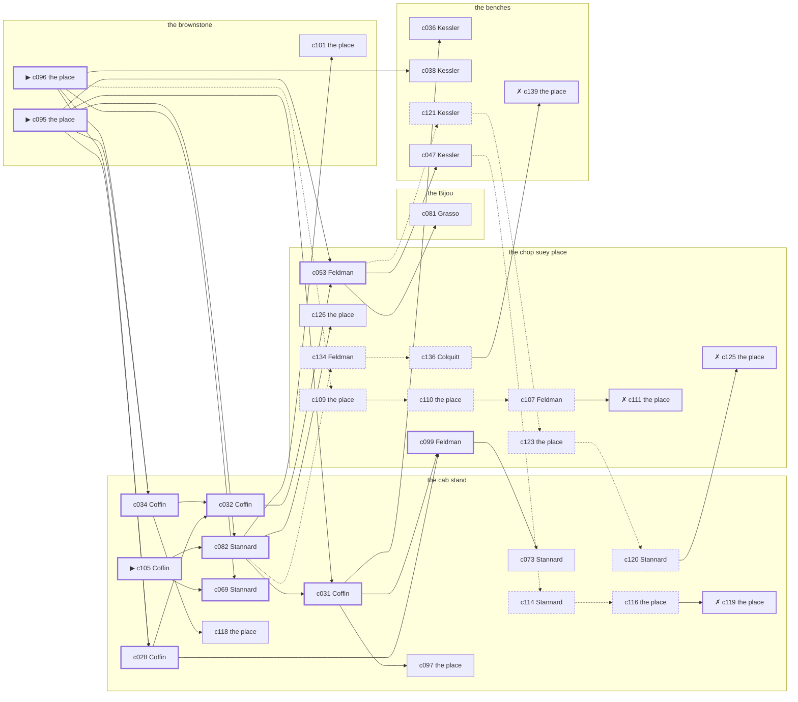

# Greenwich Village — case 19

**Seed** 19 · **Difficulty** 2 · **Attempts** 2 · **Detective** Dashiell

**Par** 10 actions · **Slack** 6 · **Budget** 16 · **Findable** 34 (spine 11, corroboration 9, noise 10 + 4 disqualifiers) · **Noise ratio** 41% · **Candidate pool** 140

## 1. The Truth

Vincenzo Tramonti, a lawyer with one clerk, the victim’s creditor, killed Winthrop Fairbanks, a pawnbroker, with a gunshot at the brownstone at 8:30 PM. Tramonti wanted the victim out of a lease (property). Tramonti had been at the cab stand earlier in the evening, where the weapon lived, and was alone with Fairbanks when it happened. Coffin hired us.

## 2. Dramatis Personae

| Name | Role | Relationship | Class of secret | Motive | Found at | Killer |
| --- | --- | --- | --- | --- | --- | --- |
| Winthrop Fairbanks | a pawnbroker | the victim | — | — | — | — |
| Vincenzo Tramonti | a lawyer with one clerk | the victim’s creditor | murder (+ gambling-debt) | property | the cab stand | **YES** |
| Roscoe Colquitt | the night manager at the hotel | the victim’s tenant | fence | debt | the chop suey place | — |
| Michael Mulcahy | a hack driver | the victim’s tenant | fence | — | the chop suey place | — |
| Lorraine Tillman | the owner of the block | the victim’s business partner | fence | — | the chop suey place | — |
| Thaddeus Coffin (client) | a bookmaker in a small way | in the victim’s debt | fence | — | the cab stand | — |
| Rachel Kessler | a switchboard operator | the victim’s former employee | hidden-family | — | the benches | — |
| Isidore Feldman | the man behind the counter | fixture (counterman) | — | — | the chop suey place | — |
| Giovanna Grasso | the ticket-taker | fixture (ticket-taker) | — | — | the Bijou | — |
| Edith Stannard | the hackman on the stand | fixture (cabbie) | — | — | the cab stand | — |

## 3. Places

- **the chop suey place over the laundry** (semi) — watched by counterman (Feldman); objects: a wall telephone, an ice pick, a bottle of chloral drops
- **the Bijou picture house** (public) — watched by ticket-taker (Grasso); objects: a standing ashtray, a length of sash cord, a silver cigarette case — within earshot of the scene
- **the roof over the Dover** (private) — unwatched; objects: the roof-door key, a terracotta flower pot
- **the cab stand outside the Hippodrome** (public) — watched by cabbie (Stannard); objects: a nickel-plated revolver, a folded stack of evening papers, a pasted-up timetable — where the weapon lived
- **the benches at the north end of the square** (public) — unwatched; objects: a brass umbrella stand — within earshot of the scene
- **the victim’s rooms in the brownstone** (private) — unwatched; objects: a framed photograph, a bronze bookend — **THE SCENE**; the victim’s address

## 4. Anchors

The coroner gives 8:00 PM–9:30 PM, four ticks wide. These are what close it: **milk-wagon** and **theater-out**.

- **the theatre letting out** — at 8:00 PM; at the chop suey place. Somebody reliable notes who was there. Only those present know that there was an understudy on, and the house was told about it at the door.
- **the milk wagon on its rounds** — at 6:30 PM, 8:30 PM, 10:30 PM; across the whole neighbourhood. You can time things by it: iron tyres and a horse that will not stand still.

## 5. Timelines

### Fairbanks — the victim

| Tick | Time | Truth | Claimed | Companion claimed |
| --- | --- | --- | --- | --- |
| 0 | 6:00 PM | the cab stand | the cab stand | — |
| 1 | 6:30 PM | the cab stand | the cab stand | — |
| 2 | 7:00 PM | the cab stand | the cab stand | — |
| 3 | 7:30 PM | the Bijou | the Bijou | — |
| 4 | 8:00 PM | the chop suey place | the chop suey place | — |
| 5 | 8:30 PM | the brownstone ☠ | the brownstone | — |
| 6 | 9:00 PM | — | — | — |
| 7 | 9:30 PM | — | — | — |
| 8 | 10:00 PM | — | — | — |
| 9 | 10:30 PM | — | — | — |
| 10 | 11:00 PM | — | — | — |
| 11 | 11:30 PM | — | — | — |

### Tramonti — the killer

| Tick | Time | Truth | Claimed | Companion claimed |
| --- | --- | --- | --- | --- |
| 0 | 6:00 PM | the cab stand | the cab stand | — |
| 1 | 6:30 PM | the cab stand | the cab stand | — |
| 2 | 7:00 PM | the chop suey place | the chop suey place | — |
| 3 | 7:30 PM | the cab stand | **the chop suey place** | — |
| 4 | 8:00 PM | the brownstone | **the cab stand** | — |
| 5 | 8:30 PM | the brownstone ☠ | **the cab stand** | — |
| 6 | 9:00 PM | the benches | the benches | — |
| 7 | 9:30 PM | the benches | the benches | — |
| 8 | 10:00 PM | the Bijou | the Bijou | — |
| 9 | 10:30 PM | the benches | the benches | — |
| 10 | 11:00 PM | the Bijou | the Bijou | — |
| 11 | 11:30 PM | the roof | the roof | — |

### Colquitt

| Tick | Time | Truth | Claimed | Companion claimed |
| --- | --- | --- | --- | --- |
| 0 | 6:00 PM | the benches | the benches | — |
| 1 | 6:30 PM | the Bijou | the Bijou | — |
| 2 | 7:00 PM | the roof | the roof | — |
| 3 | 7:30 PM | the chop suey place | the chop suey place | — |
| 4 | 8:00 PM | the chop suey place | the chop suey place | — |
| 5 | 8:30 PM | the chop suey place | **the cab stand** | — |
| 6 | 9:00 PM | the chop suey place | the chop suey place | — |
| 7 | 9:30 PM | the chop suey place | the chop suey place | — |
| 8 | 10:00 PM | the chop suey place | the chop suey place | — |
| 9 | 10:30 PM | the chop suey place | the chop suey place | — |
| 10 | 11:00 PM | the Bijou | the Bijou | — |
| 11 | 11:30 PM | the Bijou | the Bijou | — |

### Mulcahy

| Tick | Time | Truth | Claimed | Companion claimed |
| --- | --- | --- | --- | --- |
| 0 | 6:00 PM | the chop suey place | the chop suey place | — |
| 1 | 6:30 PM | the chop suey place | the chop suey place | — |
| 2 | 7:00 PM | the chop suey place | the chop suey place | — |
| 3 | 7:30 PM | the chop suey place | the chop suey place | — |
| 4 | 8:00 PM | the Bijou | the Bijou | — |
| 5 | 8:30 PM | the cab stand | **the chop suey place** | Tramonti |
| 6 | 9:00 PM | the cab stand | the cab stand | — |
| 7 | 9:30 PM | the cab stand | the cab stand | — |
| 8 | 10:00 PM | the benches | the benches | — |
| 9 | 10:30 PM | the benches | the benches | — |
| 10 | 11:00 PM | the cab stand | the cab stand | — |
| 11 | 11:30 PM | the benches | the benches | — |

### Tillman

| Tick | Time | Truth | Claimed | Companion claimed |
| --- | --- | --- | --- | --- |
| 0 | 6:00 PM | the brownstone | the brownstone | — |
| 1 | 6:30 PM | the benches | the benches | — |
| 2 | 7:00 PM | the roof | the roof | — |
| 3 | 7:30 PM | the roof | the roof | — |
| 4 | 8:00 PM | the roof | the roof | — |
| 5 | 8:30 PM | the chop suey place | **the benches** | — |
| 6 | 9:00 PM | the chop suey place | **the benches** | — |
| 7 | 9:30 PM | the chop suey place | the chop suey place | — |
| 8 | 10:00 PM | the chop suey place | the chop suey place | — |
| 9 | 10:30 PM | the chop suey place | the chop suey place | — |
| 10 | 11:00 PM | the chop suey place | the chop suey place | — |
| 11 | 11:30 PM | the chop suey place | the chop suey place | — |

### Coffin

| Tick | Time | Truth | Claimed | Companion claimed |
| --- | --- | --- | --- | --- |
| 0 | 6:00 PM | the cab stand | the cab stand | — |
| 1 | 6:30 PM | the cab stand | the cab stand | — |
| 2 | 7:00 PM | the cab stand | the cab stand | — |
| 3 | 7:30 PM | the cab stand | the cab stand | — |
| 4 | 8:00 PM | the cab stand | the cab stand | — |
| 5 | 8:30 PM | the chop suey place | the chop suey place | — |
| 6 | 9:00 PM | the chop suey place | the chop suey place | — |
| 7 | 9:30 PM | the chop suey place | the chop suey place | — |
| 8 | 10:00 PM | the Bijou | the Bijou | — |
| 9 | 10:30 PM | the cab stand | **the benches** | — |
| 10 | 11:00 PM | the cab stand | **the benches** | — |
| 11 | 11:30 PM | the cab stand | the cab stand | — |

### Kessler

| Tick | Time | Truth | Claimed | Companion claimed |
| --- | --- | --- | --- | --- |
| 0 | 6:00 PM | the cab stand | the cab stand | — |
| 1 | 6:30 PM | the benches | the benches | — |
| 2 | 7:00 PM | the benches | **the chop suey place** | — |
| 3 | 7:30 PM | the benches | the benches | — |
| 4 | 8:00 PM | the benches | the benches | — |
| 5 | 8:30 PM | the chop suey place | the chop suey place | — |
| 6 | 9:00 PM | the cab stand | the cab stand | — |
| 7 | 9:30 PM | the benches | the benches | — |
| 8 | 10:00 PM | the benches | the benches | — |
| 9 | 10:30 PM | the Bijou | the Bijou | — |
| 10 | 11:00 PM | the cab stand | the cab stand | — |
| 11 | 11:30 PM | the Bijou | the Bijou | — |

### Fixtures (never lie, never withhold)

| Tick | Time | Feldman (the man behind the counter) | Grasso (the ticket-taker) | Stannard (the hackman on the stand) |
| --- | --- | --- | --- | --- |
| 0 | 6:00 PM | the chop suey place | the Bijou | the cab stand |
| 1 | 6:30 PM | the chop suey place | the Bijou | the cab stand |
| 2 | 7:00 PM | the chop suey place | the Bijou | the cab stand |
| 3 | 7:30 PM | the chop suey place | the Bijou | the cab stand |
| 4 | 8:00 PM | the chop suey place | the Bijou | the cab stand |
| 5 | 8:30 PM | the chop suey place | the cab stand | the cab stand |
| 6 | 9:00 PM | the chop suey place | the Bijou | the cab stand |
| 7 | 9:30 PM | the chop suey place | the Bijou | the benches |
| 8 | 10:00 PM | the chop suey place | the Bijou | the cab stand |
| 9 | 10:30 PM | the chop suey place | the Bijou | the cab stand |
| 10 | 11:00 PM | the chop suey place | the Bijou | the cab stand |
| 11 | 11:30 PM | the chop suey place | the Bijou | the cab stand |

## 6. Secrets in play

- **Tramonti** (murder): Tramonti is at the brownstone from 8:00 PM to 8:30 PM, alone with Fairbanks when it happens at 8:30 PM.
- **Tramonti** also (gambling-debt): Tramonti slips off to the cab stand from 7:30 PM to settle with a bookmaker.
- **Colquitt** (fence): Colquitt hands a parcel of stolen goods to a man at the chop suey place from 8:30 PM.
- **Mulcahy** (fence): Mulcahy hands a parcel of stolen goods to a man at the cab stand from 8:30 PM.
- **Tillman** (fence): Tillman hands a parcel of stolen goods to a man at the chop suey place from 8:30 PM to 9:00 PM.
- **Coffin** (fence): Coffin hands a parcel of stolen goods to a man at the cab stand from 10:30 PM to 11:00 PM.
- **Kessler** (hidden-family): Kessler goes to the benches from 7:00 PM to see a child nobody is supposed to know about.

## 7. Clue list — the 34 findable

The opening three, free at the start: c095, c096, c105. Everything else has to be led to. The full candidate pool is in the companion file.

### At the chop suey place

- **c099** [spine] (anchor; Feldman on Fairbanks that evening) → c073
  - Feldman puts Fairbanks at the chop suey place in the crush when the theatre let out, which was 8:00 PM, and alive enough to argue about the weather.
  - _establishes: the victim alive at 8:00 PM; Fairbanks at the chop suey place, 8:00 PM_
- **c053** [spine] (observation; Feldman on Coffin) → c081, c047, c121
  - Feldman says Coffin was at the chop suey place from 8:30 PM to 9:30 PM.
  - _establishes: Coffin at the chop suey place, 8:30 PM–9:30 PM_
- **c126** [corroboration] (overheard; the place itself) → (end)
  - The goods turn up, tagged and dated, and the tag puts Tillman at the chop suey place from 8:30 PM to 9:00 PM with both hands full.
  - _establishes: Tillman’s fence accounted for; Tillman at the chop suey place, 8:30 PM–9:00 PM_
- **c123** [noise {b1}] (physical; the place itself) → c120
  - Wrapping paper and a cut string at the chop suey place, and the shop it came from closed two years ago.
  - _establishes: context only_
- **c125** [disqualifier {b1}] (overheard; the place itself) → (end)
  - The receiver at the chop suey place would rather talk than be held: Tillman was there from 8:30 PM to 9:00 PM handing over a parcel of somebody else’s silver, which is a charge Tillman will take over this one.
  - _establishes: Tillman’s fence accounted for; Tillman at the chop suey place, 8:30 PM–9:00 PM_
- **c109** [noise {b2}] (physical; the place itself) → c110
  - Wrapping paper and a cut string at the chop suey place, and the shop it came from closed two years ago.
  - _establishes: context only_
- **c110** [noise {b2}] (physical; the place itself) → c107
  - A pawn ticket at the chop suey place in a name that does not exist, made out at the hour in question.
  - _establishes: context only_
- **c107** [noise {b2}] (overheard; Feldman on Colquitt) → c111
  - Feldman on Colquitt: There is a man who meets people at the chop suey place and nobody will say his name out loud.
  - _establishes: context only_
- **c111** [disqualifier {b2}] (overheard; the place itself) → (end)
  - The receiver at the chop suey place would rather talk than be held: Colquitt was there from 8:30 PM handing over a parcel of somebody else’s silver, which is a charge Colquitt will take over this one.
  - _establishes: Colquitt’s fence accounted for; Colquitt at the chop suey place, 8:30 PM_
- **c134** [noise {b4}] (overheard; Feldman on Kessler) → c136
  - Feldman on Kessler: Kessler sends money out of every pay envelope and cannot say where it goes.
  - _establishes: context only_
- **c136** [noise {b4}] (overheard; Colquitt on Kessler) → c139
  - Colquitt on Kessler: Kessler keeps a photograph and will not be asked about it twice.
  - _establishes: context only_

### At the Bijou

- **c081** [corroboration] (observation; Grasso on Tramonti’s account) → (end)
  - Grasso was at the cab stand at 8:30 PM and says Tramonti was not.
  - _establishes: Tramonti not at the cab stand, 8:30 PM_

### At the cab stand

- **c105** [spine ⟨opening⟩] (client; Coffin on why I was hired) → c082, c069
  - Coffin hired us, and wants it known that Tramonti wanted the victim out of a lease, and would rather we started there.
  - _establishes: Tramonti had a motive (property)_
- **c028** [spine] (observation; Coffin on Tramonti) → c032, c099
  - Coffin says Tramonti was at the cab stand from 6:00 PM to 6:30 PM.
  - _establishes: Tramonti at the cab stand, 6:00 PM–6:30 PM; Tramonti could reach the weapon_
- **c082** [spine] (observation; Stannard on Tramonti’s account) → c031, c101, c126, c134
  - Stannard was at the cab stand from 8:00 PM to 8:30 PM and says Tramonti was not.
  - _establishes: Tramonti not at the cab stand, 8:00 PM–8:30 PM_
- **c034** [spine] (observation; Coffin on Kessler) → c032, c118
  - Coffin says Kessler was at the chop suey place at 8:30 PM.
  - _establishes: Kessler at the chop suey place, 8:30 PM_
- **c031** [spine] (observation; Coffin on Colquitt) → c099, c036, c097
  - Coffin says Colquitt was at the chop suey place from 8:30 PM to 9:30 PM.
  - _establishes: Colquitt at the chop suey place, 8:30 PM–9:30 PM_
- **c032** [spine] (observation; Coffin on Tillman) → c053
  - Coffin says Tillman was at the chop suey place from 8:30 PM to 9:30 PM.
  - _establishes: Tillman at the chop suey place, 8:30 PM–9:30 PM_
- **c069** [spine] (observation; Stannard on Mulcahy) → (end)
  - Stannard says Mulcahy was at the cab stand from 8:30 PM to 9:00 PM.
  - _establishes: Mulcahy at the cab stand, 8:30 PM–9:00 PM_
- **c097** [corroboration] (physical; the place itself) → (end)
  - A nickel-plated revolver is gone from the cab stand. The drawer it was kept in is open and the oiled cloth is still in it.
  - _establishes: something gone from the cab stand; how it was done_
- **c073** [corroboration] (observation; Stannard on Kessler) → (end)
  - Stannard says Kessler was at the cab stand at 6:00 PM.
  - _establishes: Kessler at the cab stand, 6:00 PM; Kessler could reach the weapon_
- **c118** [corroboration] (overheard; the place itself) → (end)
  - The receiver at the cab stand would rather talk than be held: Mulcahy was there from 8:30 PM handing over a parcel of somebody else’s silver, which is a charge Mulcahy will take over this one.
  - _establishes: Mulcahy’s fence accounted for; Mulcahy at the cab stand, 8:30 PM_
- **c120** [noise {b1}] (overheard; Stannard on Tillman) → c125
  - Stannard on Tillman: Tillman was carrying a parcel into the chop suey place and came out without it.
  - _establishes: context only_
- **c114** [noise {b3}] (overheard; Stannard on Mulcahy) → c116
  - Stannard on Mulcahy: There is a man who meets people at the cab stand and nobody will say his name out loud.
  - _establishes: context only_
- **c116** [noise {b3}] (physical; the place itself) → c119
  - Wrapping paper and a cut string at the cab stand, and the shop it came from closed two years ago.
  - _establishes: context only_
- **c119** [disqualifier {b3}] (overheard; the place itself) → (end)
  - The goods turn up, tagged and dated, and the tag puts Mulcahy at the cab stand from 8:30 PM with both hands full.
  - _establishes: Mulcahy’s fence accounted for; Mulcahy at the cab stand, 8:30 PM_

### At the benches

- **c036** [corroboration] (observation; Kessler on Tramonti) → (end)
  - Kessler says Tramonti was at the cab stand at 6:00 PM.
  - _establishes: Tramonti at the cab stand, 6:00 PM; Tramonti could reach the weapon_
- **c038** [corroboration] (observation; Kessler on Colquitt) → (end)
  - Kessler says Colquitt was at the chop suey place at 8:30 PM.
  - _establishes: Colquitt at the chop suey place, 8:30 PM_
- **c047** [corroboration] (observation; Kessler on Coffin) → c114
  - Kessler says Coffin was at the chop suey place at 8:30 PM.
  - _establishes: Coffin at the chop suey place, 8:30 PM_
- **c121** [noise {b1}] (overheard; Kessler on Tillman) → c123
  - Kessler on Tillman: There is a man who meets people at the chop suey place and nobody will say his name out loud.
  - _establishes: context only_
- **c139** [disqualifier {b4}] (overheard; the place itself) → (end)
  - The woman who keeps the child says it straight out: Kessler was at the benches from 7:00 PM, the same as every week, and left with the same face as always.
  - _establishes: Kessler’s hidden-family accounted for; Kessler at the benches, 7:00 PM_

### At the brownstone

- **c095** [spine ⟨opening⟩] (scene; the place itself) → c028, c082, c034, c031, c053
  - Fairbanks was found at the brownstone. The cigarette he had going burned itself out on the sill where it fell. The milk wagon was at the corner at 8:30 PM, where the driver’s round puts him every night.
  - _establishes: the victim dead by 8:30 PM; how it was done_
- **c096** [spine ⟨opening⟩] (morgue; the place itself) → c028, c034, c069, c038, c109
  - The coroner puts death between 8:00 PM and 9:30 PM — two hours of nothing useful. One bullet below the sternum. Powder burns on the shirt front: fired close.
  - _establishes: death between 8:00 PM and 9:30 PM; how it was done_
- **c101** [corroboration] (document; the place itself) → (end)
  - Found at the brownstone: A lease assignment made out in Tramonti’s name, waiting only on Fairbanks’s signature.
  - _establishes: Tramonti had a motive (property)_

## 8. Clue graph

## 9. Deduction path

Par is **10 actions** and the budget is par plus 6: **16**. Every id below is a spine clue; the inference is the sheet’s, not the clue’s.

**Time of death.** The coroner gives four ticks. The anchors close it to 8:30 PM: one puts Fairbanks alive at 8:00 PM, the other times the scene at 8:30 PM. _(c096, c099, c095)_

**Clearing the innocent.**

- Colquitt was not at the brownstone at 8:30 PM. _(c031; + 2 corroborating)_
- Mulcahy was not at the brownstone at 8:30 PM. _(c069; + 2 corroborating)_
- Tillman was not at the brownstone at 8:30 PM. _(c032; + 2 corroborating)_
- Coffin was not at the brownstone at 8:30 PM. _(c053; + 1 corroborating)_
- Kessler was not at the brownstone at 8:30 PM. _(c034)_

**Naming the killer.** Tramonti claims the cab stand at 8:30 PM. Two independent sources put that out of the question. _(c082; + 1 corroborating)_

**The weapon.** Tramonti was at the cab stand before 8:30 PM, where a nickel-plated revolver was kept. _(c028; + 1 corroborating)_

**Method.** A gunshot, on two physical sources. _(c095, c096; + 1 corroborating)_

**Motive.** property, on two independent sources. _(c105; + 1 corroborating)_

## 10. Red herrings

**Innocents who lie about the murder tick:**

- Colquitt claims the cab stand at 8:30 PM and was really at the chop suey place. Reason: Colquitt hands a parcel of stolen goods to a man at the chop suey place from 8:30 PM.
- Mulcahy claims the chop suey place at 8:30 PM and was really at the cab stand. Reason: Mulcahy hands a parcel of stolen goods to a man at the cab stand from 8:30 PM.
- Tillman claims the benches at 8:30 PM and was really at the chop suey place. Reason: Tillman hands a parcel of stolen goods to a man at the chop suey place from 8:30 PM to 9:00 PM.

**Innocents with a motive:**

- Colquitt — debt: owed the victim money.

**Noise branches, and what knocks each one down:**

- **b1** (Tillman, fence): c121 → c123 → c120 → **c125** — The receiver at the chop suey place would rather talk than be held: Tillman was there from 8:30 PM to 9:00 PM handing over a parcel of somebody else’s silver, which is a charge Tillman will take over this one.
- **b2** (Colquitt, fence): c109 → c110 → c107 → **c111** — The receiver at the chop suey place would rather talk than be held: Colquitt was there from 8:30 PM handing over a parcel of somebody else’s silver, which is a charge Colquitt will take over this one.
- **b3** (Mulcahy, fence): c114 → c116 → **c119** — The goods turn up, tagged and dated, and the tag puts Mulcahy at the cab stand from 8:30 PM with both hands full.
- **b4** (Kessler, hidden-family): c134 → c136 → **c139** — The woman who keeps the child says it straight out: Kessler was at the benches from 7:00 PM, the same as every week, and left with the same face as always.

