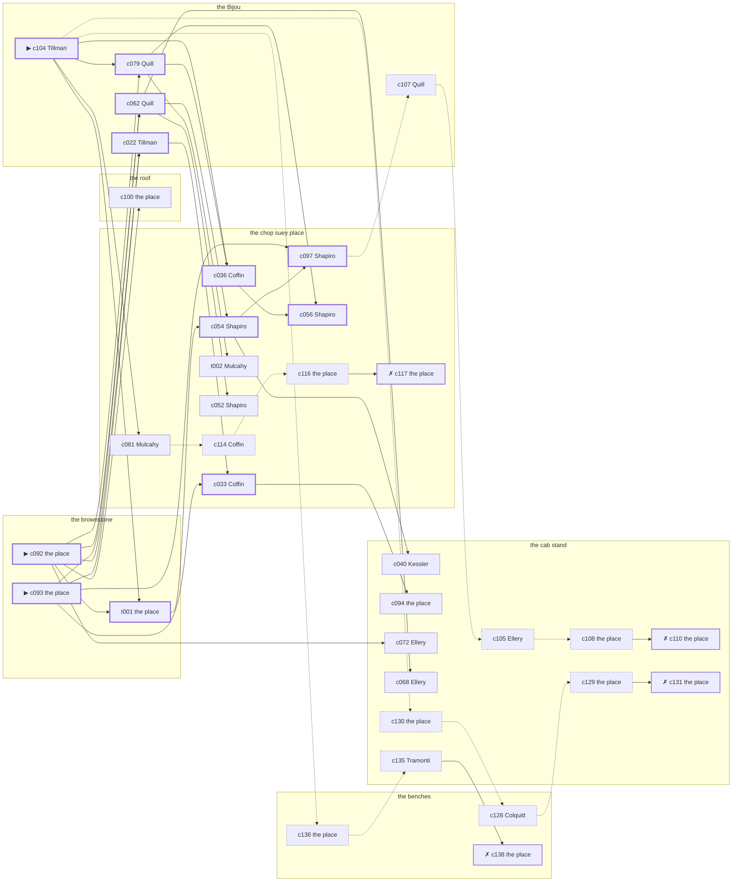

# Greenwich Village — case 19

**Seed** 19 · **Difficulty** 2 · **Attempts** 1 · **Detective** Dashiell

**Type** murder · **Trope** body-at-scene · **Unknowns** who, why, when

**Par** 11 actions · **Slack** 6 · **Budget** 17 · **Findable** 34 (spine 12, corroboration 8, noise 10 + 4 disqualifiers) · **Noise ratio** 41% · **Candidate pool** 141

## 1. The Truth

Vincenzo Tramonti, a lawyer with one clerk, Fairbanks’s creditor, killed Winthrop Fairbanks, a pawnbroker, with a gunshot at the brownstone at 9:30 PM. Tramonti wanted Fairbanks out of the lease and the lease in Tramonti’s name (property). Tramonti had been at the cab stand earlier in the evening, where the means lived, and was alone with Fairbanks when it happened. Tillman hired us.

## 2. The Act

**murder** · **body-at-scene** · actor **Tramonti** · at **the brownstone** · at **9:30 PM**

- found at the brownstone
- fate: dead

**Givens** — what the briefing states and the report does not ask:

- Fairbanks was found dead at the brownstone.
- Fairbanks was killed at the brownstone, and nothing was carried out of the room afterwards.
- The coroner puts it between 8:00 PM and 9:30 PM, which is two hours of nothing useful.
- It was a gunshot.

**Unknowns** — exactly what the report asks: **who**, **why**, **when**.

## 3. Dramatis Personae

| Name | Role | Relationship | Class of secret | Motive | Found at | Killer |
| --- | --- | --- | --- | --- | --- | --- |
| Winthrop Fairbanks | a pawnbroker | the victim | — | — | — | — |
| Vincenzo Tramonti | a lawyer with one clerk | Fairbanks’s creditor | murder (+ gambling-debt) | property | the cab stand | **YES** |
| Roscoe Colquitt | the night manager at the hotel | Fairbanks’s tenant | fence | debt | the benches | — |
| Michael Mulcahy | a hack driver | Fairbanks’s tenant | fence | — | the chop suey place | — |
| Lorraine Tillman (client) | the owner of the block | Fairbanks’s business partner | fence | — | the Bijou | — |
| Thaddeus Coffin | a bookmaker in a small way | in Fairbanks’s debt | fence | — | the chop suey place | — |
| Rachel Kessler | a switchboard operator | Fairbanks’s former employee | hidden-family | — | the cab stand | — |
| Sol Shapiro | the man behind the counter | fixture (counterman) | — | — | the chop suey place | — |
| Nora Quill | the ticket-taker | fixture (ticket-taker) | — | — | the Bijou | — |
| Lyman Ellery | the hackman on the stand | fixture (cabbie) | — | — | the cab stand | — |

## 4. Dossiers

Every person, by layer: **0** on sight, **1** volunteered, **2** from other people, **3** in the documents.

### Fairbanks — the victim

53, a man, a pawnbroker. Wants: to-be-left-alone.

- **Standing** — Fairbanks was the last resort on the block, and charged accordingly.
- **Profession** — Fairbanks lent on watches, coats and wedding rings, at a quarter of what they were worth.
- **Found** — Colquitt found Fairbanks at the brownstone at 11:30 PM. By Colquitt, at the brownstone, at 11:30 PM. Precinct: took-a-statement.

**Layer 0, on sight**

- _gender_ — A man.
- _age_ — In his fifties.

**Layer 1, volunteered**

- _profession_ — A pawnbroker.
- _detail_ — Fairbanks lent on watches, coats and wedding rings, at a quarter of what they were worth.

**Layer 2, from other people**

- _tie_ — Fairbanks was the last resort on the block, and charged accordingly.
- _want_ — Fairbanks wants to be left alone.

**Self-account** (layer 1, what they say when asked about themselves)

- Fairbanks is 53 years old and a pawnbroker.
- Fairbanks lent on watches, coats and wedding rings, at a quarter of what they were worth.
- Fairbanks is the one this is about.

### Tramonti — the killer

56, a man, a lawyer with one clerk. Wants: respectability. Tie: Fairbanks’s creditor, three renewals running.

**Layer 0, on sight**

- _gender_ — A man.
- _age_ — In his fifties.

**Layer 1, volunteered**

- _profession_ — A lawyer with one clerk.
- _detail_ — Tramonti has a list of clients and will not read any of it aloud.

**Layer 2, from other people**

- _tie_ — Tramonti has been carrying Fairbanks’s paper since ’23 and renewing it every ninety days.
- _want_ — Tramonti wants to be thought respectable by people who are not.
- _since_ — Tramonti has been Fairbanks’s creditor, three renewals running.

**Layer 3, in the documents**

- _secret-hint_ — Tramonti was asking around for a hundred dollars in a hurry earlier in the week.

**Self-account** (layer 1, what they say when asked about themselves)

- Tramonti is 56 years old and a lawyer with one clerk.
- Tramonti has a list of clients and will not read any of it aloud.
- Tramonti is Fairbanks’s creditor.

### Colquitt

34, a man, the night manager at the hotel. Wants: to-keep-what-they-have. Tie: Fairbanks’s tenant, since ’27.

**Layer 0, on sight**

- _gender_ — A man.
- _age_ — In his thirties.
- _profession_ — The night manager at the hotel.

**Layer 1, volunteered**

- _detail_ — Colquitt keeps the register, the keys, and a memory of who is not in the register.

**Layer 2, from other people**

- _tie_ — Colquitt took the rooms over the roof from Fairbanks and has been two weeks behind since the spring.
- _want_ — Colquitt wants to keep what they have and add nothing to it.
- _since_ — Colquitt has been Fairbanks’s tenant, since ’27.

**Layer 3, in the documents**

- _secret-hint_ — Colquitt was carrying a parcel into the cab stand and came out without it.

**Self-account** (layer 1, what they say when asked about themselves)

- Colquitt is 34 years old and the night manager at the hotel.
- Colquitt keeps the register, the keys, and a memory of who is not in the register.
- Colquitt is Fairbanks’s tenant.

### Mulcahy

39, a man, a hack driver. Wants: to-keep-what-they-have. Tie: Fairbanks’s tenant, since the flu year.

**Layer 0, on sight**

- _gender_ — A man.
- _age_ — In his thirties.
- _profession_ — A hack driver.

**Layer 1, volunteered**

- _detail_ — Mulcahy works the stand outside the hotel from six until the small hours.

**Layer 2, from other people**

- _tie_ — Mulcahy has rented from Fairbanks since ’21 and has the same window and the same complaint.
- _want_ — Mulcahy wants to keep what they have and add nothing to it.
- _since_ — Mulcahy has been Fairbanks’s tenant, since the flu year.

**Layer 3, in the documents**

- _secret-hint_ — Mulcahy was carrying a parcel into the chop suey place and came out without it.

**Self-account** (layer 1, what they say when asked about themselves)

- Mulcahy is 39 years old and a hack driver.
- Mulcahy works the stand outside the hotel from six until the small hours.
- Mulcahy is Fairbanks’s tenant.

### Tillman — the client

64, a woman, the owner of the block. Wants: to-keep-what-they-have. Tie: Fairbanks’s business partner, three years this spring.

**Layer 0, on sight**

- _gender_ — A woman.
- _age_ — In her sixties.

**Layer 1, volunteered**

- _profession_ — The owner of the block.
- _detail_ — Tillman carries the rent book himself on the first of the month.

**Layer 2, from other people**

- _tie_ — Tillman bought into Fairbanks’s business the year Cornelius Corrigan walked out of it.
- _want_ — Tillman wants to keep what they have and add nothing to it.
- _since_ — Tillman has been Fairbanks’s business partner, three years this spring.
- _third_ — Cornelius Corrigan is a younger brother in trouble upstate.

**Layer 3, in the documents**

- _secret-hint_ — Tillman was carrying a parcel into the chop suey place and came out without it.

**Self-account** (layer 1, what they say when asked about themselves)

- Tillman is 64 years old and the owner of the block.
- Tillman carries the rent book himself on the first of the month.
- Tillman is Fairbanks’s business partner.

### Coffin

51, a man, a bookmaker in a small way. Wants: money. Tie: in Fairbanks’s debt, two winters running.

**Layer 0, on sight**

- _gender_ — A man.
- _age_ — In his fifties.

**Layer 1, volunteered**

- _profession_ — A bookmaker in a small way.
- _detail_ — Coffin writes the odds on a slate and rubs them off before six.

**Layer 2, from other people**

- _tie_ — Coffin has owed Fairbanks money since ’20 and has not been asked for it lately.
- _want_ — Coffin wants money, and is not particular about the shape it arrives in.
- _since_ — Coffin has been in Fairbanks’s debt, two winters running.

**Layer 3, in the documents**

- _secret-hint_ — Coffin was carrying a parcel into the cab stand and came out without it.

**Self-account** (layer 1, what they say when asked about themselves)

- Coffin is 51 years old and a bookmaker in a small way.
- Coffin writes the odds on a slate and rubs them off before six.
- Coffin is in Fairbanks’s debt.

### Kessler

30, a woman, a switchboard operator. Wants: money. Tie: Fairbanks’s former employee, four years, and then nothing.

**Layer 0, on sight**

- _gender_ — A woman.
- _age_ — In her thirties.
- _profession_ — A switchboard operator.

**Layer 1, volunteered**

- _detail_ — Kessler plugs the calls through and is not supposed to listen.

**Layer 2, from other people**

- _tie_ — Kessler kept Fairbanks’s books until Rutherford Ainsworth was brought in over Kessler’s head.
- _want_ — Kessler wants money, and is not particular about the shape it arrives in.
- _since_ — Kessler has been Fairbanks’s former employee, four years, and then nothing.
- _third_ — Rutherford Ainsworth is a cousin who went back to the old country.

**Layer 3, in the documents**

- _secret-hint_ — Kessler sends money out of every pay envelope and cannot say where it goes.

**Self-account** (layer 1, what they say when asked about themselves)

- Kessler is 30 years old and a switchboard operator.
- Kessler plugs the calls through and is not supposed to listen.
- Kessler is Fairbanks’s former employee.

### Shapiro

50, a man, the man behind the counter. Wants: to-be-left-alone. Tie: behind the counter at the chop suey place.

**Layer 0, on sight**

- _gender_ — A man.
- _age_ — In his fifties.
- _profession_ — The man behind the counter.

**Layer 1, volunteered**

- _detail_ — Shapiro has the counter at the chop suey place from four until midnight.

**Layer 2, from other people**

- _tie_ — Shapiro is behind the counter at the chop suey place.
- _want_ — Shapiro wants to be left alone.

**Self-account** (layer 1, what they say when asked about themselves)

- Shapiro is 50 years old and the man behind the counter.
- Shapiro has the counter at the chop suey place from four until midnight.
- Shapiro is behind the counter at the chop suey place.

### Quill

25, a woman, the ticket-taker. Wants: to-be-left-alone. Tie: on the door at the Bijou, every performance.

**Layer 0, on sight**

- _gender_ — A woman.
- _age_ — In the late twenties.
- _profession_ — The ticket-taker.

**Layer 1, volunteered**

- _detail_ — Quill has taken tickets at the Bijou since the house opened.

**Layer 2, from other people**

- _tie_ — Quill is on the door at the Bijou, every performance.
- _want_ — Quill wants to be left alone.

**Self-account** (layer 1, what they say when asked about themselves)

- Quill is 25 years old and the ticket-taker.
- Quill has taken tickets at the Bijou since the house opened.
- Quill is on the door at the Bijou, every performance.

### Ellery

37, a man, the hackman on the stand. Wants: money. Tie: on the stand at the cab stand.

**Layer 0, on sight**

- _gender_ — A man.
- _age_ — In his thirties.
- _profession_ — The hackman on the stand.

**Layer 1, volunteered**

- _detail_ — Ellery has worked the stand at the cab stand for six years and knows every regular fare on it.

**Layer 2, from other people**

- _tie_ — Ellery is on the stand at the cab stand.
- _want_ — Ellery wants money, and is not particular about the shape it arrives in.

**Self-account** (layer 1, what they say when asked about themselves)

- Ellery is 37 years old and the hackman on the stand.
- Ellery has worked the stand at the cab stand for six years and knows every regular fare on it.
- Ellery is on the stand at the cab stand.

## 5. The Client

**Tillman**, Fairbanks’s business partner. Purpose: **settle-a-debt-with-the-dead**.

- **Why** — Tillman has something owing with Fairbanks that death did not settle.
- **What it costs** — Tillman is spending money Tillman was owed and may never see.
- **Points at** — Tramonti: Tramonti wanted Fairbanks out of the lease and the lease in Tramonti’s name. Honest: **yes**.

**Tells:**

- Fairbanks was found dead at the brownstone.
- Fairbanks was killed at the brownstone, and nothing was carried out of the room afterwards.
- The coroner puts it between 8:00 PM and 9:30 PM, which is two hours of nothing useful.
- It was a gunshot.
- Tillman would rather we started with Tramonti: Tramonti wanted Fairbanks out of the lease and the lease in Tramonti’s name.

**Withholds:**

- Tillman does not mention it, but Tillman hands a parcel of stolen goods to a man at the chop suey place from 9:30 PM to 10:00 PM.

**Their own evening, as they tell it:**

- Tillman says she was at the benches at 6:00 PM.
- Tillman says she was at the cab stand at 6:30 PM.
- Tillman says she was at the Bijou from 7:00 PM to 10:00 PM.
- Tillman says she was at the chop suey place from 10:30 PM to 11:30 PM.

## 6. The Briefing

16 plain sentences, derived. This is the model of the plain register: the engine renders it, and Phase 2 measures pages against it.

1. A woman came up the stairs after midnight, and sat down.
2. Lorraine Tillman is 64 years old and the owner of the block.
3. Tillman carries the rent book himself on the first of the month.
4. Fairbanks was the last resort on the block, and charged accordingly.
5. Fairbanks was found dead at the brownstone.
6. Fairbanks was killed at the brownstone, and nothing was carried out of the room afterwards.
7. The coroner puts it between 8:00 PM and 9:30 PM, which is two hours of nothing useful.
8. It was a gunshot.
9. Colquitt found Fairbanks at the brownstone at 11:30 PM.
10. The precinct took a statement at the desk and filed it.
11. Tillman is Fairbanks’s business partner.
12. Tillman bought into Fairbanks’s business the year Cornelius Corrigan walked out of it.
13. Tillman has something owing with Fairbanks that death did not settle.
14. Tillman is spending money Tillman was owed and may never see.
15. Tillman wants us to start with Tramonti.
16. Tramonti wanted Fairbanks out of the lease and the lease in Tramonti’s name.

## 7. Mentions

- **Cornelius Corrigan** (m-1) — a younger brother in trouble upstate. Cornelius Corrigan is a younger brother in trouble upstate.
- **Rutherford Ainsworth** (m-2) — a cousin who went back to the old country. Rutherford Ainsworth is a cousin who went back to the old country.

## 8. Places

- **the chop suey place over the laundry** (semi) — watched by counterman (Shapiro); objects: a wall telephone, an ice pick, a bottle of chloral drops
- **the Bijou picture house** (public) — watched by ticket-taker (Quill); objects: a standing ashtray, a length of sash cord, a silver cigarette case — within earshot of the scene
- **the roof over the Dover** (private) — unwatched; objects: the roof-door key, a terracotta flower pot
- **the cab stand outside the Hippodrome** (public) — watched by cabbie (Ellery); objects: a nickel-plated revolver, a folded stack of evening papers, a pasted-up timetable — where the weapon lived
- **the benches at the north end of the square** (public) — unwatched; objects: a brass umbrella stand — within earshot of the scene
- **Fairbanks’s rooms in the brownstone** (private) — unwatched; objects: a framed photograph, a bronze bookend — **THE SCENE**; the victim’s address

## 9. Anchors

The coroner gives 8:00 PM–9:30 PM, four ticks wide. These are what close it: **milk-wagon** and **theater-out**.

- **the theatre letting out** — at 9:00 PM; at the chop suey place. Somebody reliable notes who was there. Only those present know that there was an understudy on, and the house was told about it at the door.
- **the milk wagon on its rounds** — at 7:30 PM, 9:30 PM, 11:30 PM; across the whole neighbourhood. You can time things by it: iron tyres and a horse that will not stand still.

## 10. Timelines

### Fairbanks — the victim

| Tick | Time | Truth | Claimed | Companion claimed |
| --- | --- | --- | --- | --- |
| 0 | 6:00 PM | the benches | the benches | — |
| 1 | 6:30 PM | the benches | the benches | — |
| 2 | 7:00 PM | the benches | the benches | — |
| 3 | 7:30 PM | the benches | the benches | — |
| 4 | 8:00 PM | the benches | the benches | — |
| 5 | 8:30 PM | the benches | the benches | — |
| 6 | 9:00 PM | the chop suey place | the chop suey place | — |
| 7 | 9:30 PM | the brownstone ☠ | the brownstone | — |
| 8 | 10:00 PM | — | — | — |
| 9 | 10:30 PM | — | — | — |
| 10 | 11:00 PM | — | — | — |
| 11 | 11:30 PM | — | — | — |

### Tramonti — the killer

| Tick | Time | Truth | Claimed | Companion claimed |
| --- | --- | --- | --- | --- |
| 0 | 6:00 PM | the cab stand | **the benches** | Colquitt |
| 1 | 6:30 PM | the cab stand | the cab stand | — |
| 2 | 7:00 PM | the cab stand | the cab stand | — |
| 3 | 7:30 PM | the cab stand | the cab stand | — |
| 4 | 8:00 PM | the cab stand | the cab stand | — |
| 5 | 8:30 PM | the cab stand | the cab stand | — |
| 6 | 9:00 PM | the brownstone | **the cab stand** | Mulcahy |
| 7 | 9:30 PM | the brownstone ☠ | **the cab stand** | Mulcahy |
| 8 | 10:00 PM | the roof | the roof | — |
| 9 | 10:30 PM | the roof | the roof | — |
| 10 | 11:00 PM | the roof | the roof | — |
| 11 | 11:30 PM | the roof | the roof | — |

### Colquitt

| Tick | Time | Truth | Claimed | Companion claimed |
| --- | --- | --- | --- | --- |
| 0 | 6:00 PM | the chop suey place | the chop suey place | — |
| 1 | 6:30 PM | the chop suey place | the chop suey place | — |
| 2 | 7:00 PM | the Bijou | the Bijou | — |
| 3 | 7:30 PM | the Bijou | the Bijou | — |
| 4 | 8:00 PM | the benches | the benches | — |
| 5 | 8:30 PM | the Bijou | the Bijou | — |
| 6 | 9:00 PM | the benches | the benches | — |
| 7 | 9:30 PM | the cab stand | **the chop suey place** | — |
| 8 | 10:00 PM | the cab stand | the cab stand | — |
| 9 | 10:30 PM | the benches | the benches | — |
| 10 | 11:00 PM | the benches | the benches | — |
| 11 | 11:30 PM | the brownstone | the brownstone | — |

### Mulcahy

| Tick | Time | Truth | Claimed | Companion claimed |
| --- | --- | --- | --- | --- |
| 0 | 6:00 PM | the benches | the benches | — |
| 1 | 6:30 PM | the benches | the benches | — |
| 2 | 7:00 PM | the benches | the benches | — |
| 3 | 7:30 PM | the chop suey place | the chop suey place | — |
| 4 | 8:00 PM | the benches | the benches | — |
| 5 | 8:30 PM | the chop suey place | the chop suey place | — |
| 6 | 9:00 PM | the chop suey place | the chop suey place | — |
| 7 | 9:30 PM | the chop suey place | **the roof** | Tramonti |
| 8 | 10:00 PM | the chop suey place | **the roof** | Tramonti |
| 9 | 10:30 PM | the chop suey place | the chop suey place | — |
| 10 | 11:00 PM | the roof | the roof | — |
| 11 | 11:30 PM | the roof | the roof | — |

### Tillman

| Tick | Time | Truth | Claimed | Companion claimed |
| --- | --- | --- | --- | --- |
| 0 | 6:00 PM | the benches | the benches | — |
| 1 | 6:30 PM | the cab stand | the cab stand | — |
| 2 | 7:00 PM | the Bijou | the Bijou | — |
| 3 | 7:30 PM | the Bijou | the Bijou | — |
| 4 | 8:00 PM | the Bijou | the Bijou | — |
| 5 | 8:30 PM | the Bijou | the Bijou | — |
| 6 | 9:00 PM | the Bijou | the Bijou | — |
| 7 | 9:30 PM | the chop suey place | **the Bijou** | — |
| 8 | 10:00 PM | the chop suey place | **the Bijou** | — |
| 9 | 10:30 PM | the chop suey place | the chop suey place | — |
| 10 | 11:00 PM | the chop suey place | the chop suey place | — |
| 11 | 11:30 PM | the chop suey place | the chop suey place | — |

### Coffin

| Tick | Time | Truth | Claimed | Companion claimed |
| --- | --- | --- | --- | --- |
| 0 | 6:00 PM | the chop suey place | the chop suey place | — |
| 1 | 6:30 PM | the chop suey place | the chop suey place | — |
| 2 | 7:00 PM | the chop suey place | the chop suey place | — |
| 3 | 7:30 PM | the cab stand | **the benches** | — |
| 4 | 8:00 PM | the cab stand | **the benches** | — |
| 5 | 8:30 PM | the benches | the benches | — |
| 6 | 9:00 PM | the chop suey place | the chop suey place | — |
| 7 | 9:30 PM | the chop suey place | the chop suey place | — |
| 8 | 10:00 PM | the Bijou | the Bijou | — |
| 9 | 10:30 PM | the Bijou | the Bijou | — |
| 10 | 11:00 PM | the benches | the benches | — |
| 11 | 11:30 PM | the benches | the benches | — |

### Kessler

| Tick | Time | Truth | Claimed | Companion claimed |
| --- | --- | --- | --- | --- |
| 0 | 6:00 PM | the cab stand | the cab stand | — |
| 1 | 6:30 PM | the cab stand | the cab stand | — |
| 2 | 7:00 PM | the chop suey place | the chop suey place | — |
| 3 | 7:30 PM | the benches | the benches | — |
| 4 | 8:00 PM | the cab stand | the cab stand | — |
| 5 | 8:30 PM | the cab stand | the cab stand | — |
| 6 | 9:00 PM | the cab stand | the cab stand | — |
| 7 | 9:30 PM | the chop suey place | the chop suey place | — |
| 8 | 10:00 PM | the cab stand | the cab stand | — |
| 9 | 10:30 PM | the cab stand | the cab stand | — |
| 10 | 11:00 PM | the chop suey place | the chop suey place | — |
| 11 | 11:30 PM | the benches | **the cab stand** | — |

### Fixtures (never lie, never withhold)

| Tick | Time | Shapiro (the man behind the counter) | Quill (the ticket-taker) | Ellery (the hackman on the stand) |
| --- | --- | --- | --- | --- |
| 0 | 6:00 PM | the chop suey place | the Bijou | the cab stand |
| 1 | 6:30 PM | the chop suey place | the Bijou | the cab stand |
| 2 | 7:00 PM | the chop suey place | the Bijou | the benches |
| 3 | 7:30 PM | the chop suey place | the Bijou | the cab stand |
| 4 | 8:00 PM | the Bijou | the Bijou | the cab stand |
| 5 | 8:30 PM | the chop suey place | the Bijou | the cab stand |
| 6 | 9:00 PM | the chop suey place | the Bijou | the cab stand |
| 7 | 9:30 PM | the chop suey place | the cab stand | the cab stand |
| 8 | 10:00 PM | the chop suey place | the Bijou | the cab stand |
| 9 | 10:30 PM | the chop suey place | the Bijou | the cab stand |
| 10 | 11:00 PM | the chop suey place | the Bijou | the cab stand |
| 11 | 11:30 PM | the chop suey place | the Bijou | the cab stand |

## 11. Secrets in play

- **Tramonti** (murder): Tramonti is at the brownstone from 9:00 PM to 9:30 PM, alone with Fairbanks when it happens at 9:30 PM.
- **Tramonti** also (gambling-debt): Tramonti slips off to the cab stand from 6:00 PM to settle with a bookmaker.
- **Colquitt** (fence): Colquitt hands a parcel of stolen goods to a man at the cab stand from 9:30 PM.
- **Mulcahy** (fence): Mulcahy hands a parcel of stolen goods to a man at the chop suey place from 9:30 PM to 10:00 PM.
- **Tillman** (fence): Tillman hands a parcel of stolen goods to a man at the chop suey place from 9:30 PM to 10:00 PM.
- **Coffin** (fence): Coffin hands a parcel of stolen goods to a man at the cab stand from 7:30 PM to 8:00 PM.
- **Kessler** (hidden-family): Kessler goes to the benches from 11:30 PM to see a child nobody is supposed to know about.

## 12. Clue list — the 34 findable

The opening three, free at the start: c092, c093, c104. Everything else has to be led to. The full candidate pool is in the companion file.

### At the chop suey place

- **c036** [spine] (observation; Coffin on Kessler) → c056
  - Coffin says Kessler was at the chop suey place at 9:30 PM.
  - _establishes: Kessler at the chop suey place, 9:30 PM_
- **c054** [spine] (observation; Shapiro on Tillman) → c097, c040
  - Shapiro says Tillman was at the chop suey place from 9:30 PM to 11:30 PM.
  - _establishes: Tillman at the chop suey place, 9:30 PM–11:30 PM_
- **c033** [spine] (observation; Coffin on Mulcahy) → c094
  - Coffin says Mulcahy was at the chop suey place from 9:00 PM to 9:30 PM.
  - _establishes: Mulcahy at the chop suey place, 9:00 PM–9:30 PM_
- **c097** [spine] (anchor; Shapiro on Fairbanks that evening) → c107
  - Shapiro puts Fairbanks at the chop suey place in the crush when the theatre let out, which was 9:00 PM, and alive enough to argue about the weather.
  - _establishes: the victim alive at 9:00 PM; Fairbanks at the chop suey place, 9:00 PM_
- **c056** [spine] (observation; Shapiro on Coffin) → (end)
  - Shapiro says Coffin was at the chop suey place from 9:00 PM to 9:30 PM.
  - _establishes: Coffin at the chop suey place, 9:00 PM–9:30 PM_
- **c081** [corroboration] (denial; Mulcahy on Tramonti’s account) → c114
  - Tramonti names Mulcahy as the company for the cab stand from 9:00 PM to 9:30 PM. Mulcahy says they were not together that evening.
  - _establishes: Tramonti not at the cab stand, 9:00 PM–9:30 PM_
- **t002** [corroboration] (overheard; Mulcahy on the brownstone that evening) → (end)
  - Mulcahy says the door at the brownstone was shut from 9:30 PM on, and nobody came out of it carrying anything.
  - _establishes: Fairbanks at the brownstone, 9:30 PM_
- **c052** [corroboration] (observation; Shapiro on Mulcahy) → (end)
  - Shapiro says Mulcahy was at the chop suey place from 8:30 PM to 10:30 PM.
  - _establishes: Mulcahy at the chop suey place, 8:30 PM–10:30 PM_
- **c114** [noise {b4}] (overheard; Coffin on Mulcahy) → c116
  - Coffin on Mulcahy: Mulcahy has been selling things that were never Mulcahy’s to sell.
  - _establishes: context only_
- **c116** [noise {b4}] (physical; the place itself) → c117
  - A pawn ticket at the chop suey place in a name that does not exist, made out at the hour in question.
  - _establishes: context only_
- **c117** [disqualifier {b4}] (overheard; the place itself) → (end)
  - The receiver at the chop suey place would rather talk than be held: Mulcahy was there from 9:30 PM to 10:00 PM handing over a parcel of somebody else’s silver, which is a charge Mulcahy will take over this one.
  - _establishes: Mulcahy’s fence accounted for; Mulcahy at the chop suey place, 9:30 PM–10:00 PM_

### At the Bijou

- **c104** [spine ⟨opening⟩] (client; Tillman on why I was hired) → c079, t001, c036, c081, c130, c136
  - Tillman hired us, and wants it known that Tramonti wanted Fairbanks out of the lease and the lease in Tramonti’s name, and would rather we started there.
  - _establishes: Tramonti had a motive (property)_
- **c079** [spine] (observation; Quill on Tramonti’s account) → c036, c056, t002
  - Quill was at the cab stand at 9:30 PM and says Tramonti was not.
  - _establishes: Tramonti not at the cab stand, 9:30 PM_
- **c022** [spine] (observation; Tillman on Tramonti) → c033
  - Tillman says Tramonti was at the cab stand at 6:30 PM.
  - _establishes: Tramonti at the cab stand, 6:30 PM; Tramonti could reach the weapon_
- **c062** [spine] (observation; Quill on Colquitt) → c054, c068, c052
  - Quill says Colquitt was at the cab stand at 9:30 PM.
  - _establishes: Colquitt at the cab stand, 9:30 PM_
- **c107** [noise {b1}] (overheard; Quill on Colquitt) → c105
  - Quill on Colquitt: Colquitt has been selling things that were never Colquitt’s to sell.
  - _establishes: context only_

### At the roof

- **c100** [corroboration] (document; the place itself) → (end)
  - Found at the roof: A lease assignment made out in Tramonti’s name, waiting only on Fairbanks’s signature.
  - _establishes: Tramonti had a motive (property)_

### At the cab stand

- **c040** [corroboration] (observation; Kessler on Tramonti) → (end)
  - Kessler says Tramonti was at the cab stand from 8:00 PM to 8:30 PM.
  - _establishes: Tramonti at the cab stand, 8:00 PM–8:30 PM; Tramonti could reach the weapon_
- **c094** [corroboration] (physical; the place itself) → (end)
  - A nickel-plated revolver is gone from the cab stand. The drawer it was kept in is open and the oiled cloth is still in it.
  - _establishes: something gone from the cab stand; how it was done_
- **c072** [corroboration] (observation; Ellery on Kessler) → (end)
  - Ellery says Kessler was at the cab stand from 6:00 PM to 6:30 PM.
  - _establishes: Kessler at the cab stand, 6:00 PM–6:30 PM; Kessler could reach the weapon_
- **c068** [corroboration] (observation; Ellery on Colquitt) → (end)
  - Ellery says Colquitt was at the cab stand from 9:30 PM to 10:00 PM.
  - _establishes: Colquitt at the cab stand, 9:30 PM–10:00 PM_
- **c105** [noise {b1}] (overheard; Ellery on Colquitt) → c108
  - Ellery on Colquitt: Colquitt was carrying a parcel into the cab stand and came out without it.
  - _establishes: context only_
- **c108** [noise {b1}] (physical; the place itself) → c110
  - Wrapping paper and a cut string at the cab stand, and the shop it came from closed two years ago.
  - _establishes: context only_
- **c110** [disqualifier {b1}] (overheard; the place itself) → (end)
  - The receiver at the cab stand would rather talk than be held: Colquitt was there from 9:30 PM handing over a parcel of somebody else’s silver, which is a charge Colquitt will take over this one.
  - _establishes: Colquitt’s fence accounted for; Colquitt at the cab stand, 9:30 PM_
- **c130** [noise {b2}] (physical; the place itself) → c128
  - A pawn ticket at the cab stand in a name that does not exist, made out at the hour in question.
  - _establishes: context only_
- **c129** [noise {b2}] (physical; the place itself) → c131
  - Wrapping paper and a cut string at the cab stand, and the shop it came from closed two years ago.
  - _establishes: context only_
- **c131** [disqualifier {b2}] (overheard; the place itself) → (end)
  - The receiver at the cab stand would rather talk than be held: Coffin was there from 7:30 PM to 8:00 PM handing over a parcel of somebody else’s silver, which is a charge Coffin will take over this one.
  - _establishes: Coffin’s fence accounted for; Coffin at the cab stand, 7:30 PM–8:00 PM_
- **c135** [noise {b3}] (overheard; Tramonti on Kessler) → c138
  - Tramonti on Kessler: Kessler keeps a photograph and will not be asked about it twice.
  - _establishes: context only_

### At the benches

- **c128** [noise {b2}] (overheard; Colquitt on Coffin) → c129
  - Colquitt on Coffin: Coffin has been selling things that were never Coffin’s to sell.
  - _establishes: context only_
- **c136** [noise {b3}] (physical; the place itself) → c135
  - A board-and-keep receipt at the benches, monthly, eight years of them.
  - _establishes: context only_
- **c138** [disqualifier {b3}] (overheard; the place itself) → (end)
  - The woman who keeps the child says it straight out: Kessler was at the benches from 11:30 PM, the same as every week, and left with the same face as always.
  - _establishes: Kessler’s hidden-family accounted for; Kessler at the benches, 11:30 PM_

### At the brownstone

- **c092** [spine ⟨opening⟩] (scene; the place itself) → c079, c022, t001, c062, c100, c072
  - Fairbanks was found at the brownstone. The cigarette he had going burned itself out on the sill where it fell. The milk wagon was at the corner at 9:30 PM, where the driver’s round puts him every night.
  - _establishes: the victim dead by 9:30 PM; how it was done_
- **c093** [spine ⟨opening⟩] (morgue; the place itself) → c022, c062, c033, c097
  - The coroner puts death between 8:00 PM and 9:30 PM — two hours of nothing useful. One bullet below the sternum. Powder burns on the shirt front: fired close.
  - _establishes: death between 8:00 PM and 9:30 PM; how it was done_
- **t001** [spine] (physical; the place itself) → c054
  - The rug at the brownstone is rucked up under Fairbanks and the chair beside it went over backwards. Nothing was carried out of the room.
  - _establishes: Fairbanks at the brownstone, 9:30 PM_

## 13. Clue graph

## 14. Deduction path

Par is **11 actions** and the budget is par plus 6: **17**. Every id below is a spine clue; the inference is the sheet’s, not the clue’s.

**Time of death.** The coroner gives four ticks. The anchors close it to 9:30 PM: one puts Fairbanks alive at 9:00 PM, the other times the scene at 9:30 PM. _(c093, c097, c092)_

**Clearing the innocent.**

- Colquitt was not at the brownstone at 9:30 PM. _(c062; + 2 corroborating)_
- Mulcahy was not at the brownstone at 9:30 PM. _(c033; + 2 corroborating)_
- Tillman was not at the brownstone at 9:30 PM. _(c054)_
- Coffin was not at the brownstone at 9:30 PM. _(c056)_
- Kessler was not at the brownstone at 9:30 PM. _(c036)_

**Naming the killer.** Tramonti claims the cab stand at 9:30 PM. Two independent sources put that out of the question. _(c079; + 1 corroborating)_

**The weapon.** Tramonti was at the cab stand before 9:30 PM, where a nickel-plated revolver was kept. _(c022; + 1 corroborating)_

**Method.** A gunshot, on two physical sources. _(c092, c093; + 1 corroborating)_

**Motive.** property, on two independent sources. _(c104; + 1 corroborating)_

## 15. Red herrings

**Innocents who lie about the murder tick:**

- Colquitt claims the chop suey place at 9:30 PM and was really at the cab stand. Reason: Colquitt hands a parcel of stolen goods to a man at the cab stand from 9:30 PM.
- Mulcahy claims the roof at 9:30 PM and was really at the chop suey place. Reason: Mulcahy hands a parcel of stolen goods to a man at the chop suey place from 9:30 PM to 10:00 PM.
- Tillman claims the Bijou at 9:30 PM and was really at the chop suey place. Reason: Tillman hands a parcel of stolen goods to a man at the chop suey place from 9:30 PM to 10:00 PM.

**Innocents with a motive:**

- Colquitt — debt: owed Fairbanks four thousand dollars and was past due on it.

**Noise branches, and what knocks each one down:**

- **b1** (Colquitt, fence): c107 → c105 → c108 → **c110** — The receiver at the cab stand would rather talk than be held: Colquitt was there from 9:30 PM handing over a parcel of somebody else’s silver, which is a charge Colquitt will take over this one.
- **b2** (Coffin, fence): c130 → c128 → c129 → **c131** — The receiver at the cab stand would rather talk than be held: Coffin was there from 7:30 PM to 8:00 PM handing over a parcel of somebody else’s silver, which is a charge Coffin will take over this one.
- **b3** (Kessler, hidden-family): c136 → c135 → **c138** — The woman who keeps the child says it straight out: Kessler was at the benches from 11:30 PM, the same as every week, and left with the same face as always.
- **b4** (Mulcahy, fence): c114 → c116 → **c117** — The receiver at the chop suey place would rather talk than be held: Mulcahy was there from 9:30 PM to 10:00 PM handing over a parcel of somebody else’s silver, which is a charge Mulcahy will take over this one.

