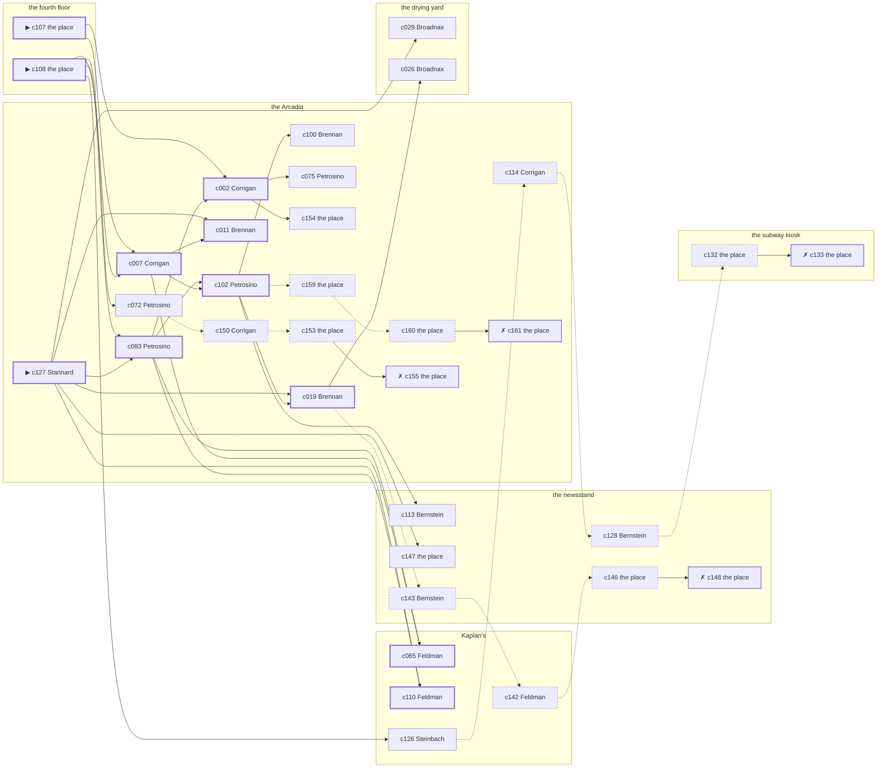

# the Gas House District — case 2

**Seed** 2 · **Difficulty** 2 · **Attempts** 1 · **Detective** Dashiell

**Par** 10 actions · **Slack** 6 · **Budget** 16 · **Findable** 34 (spine 11, corroboration 9, noise 10 + 4 disqualifiers) · **Noise ratio** 41% · **Candidate pool** 162

## 1. The Truth

Sadie Shapiro, a chorus girl between engagements, a customer of the victim’s, killed Edward Doyle, a theatrical agent, with strangling with a cord at the fourth floor at 8:00 PM. Shapiro owed the victim money (debt). Shapiro had been at the drying yard earlier in the evening, where the weapon lived, and was alone with Doyle when it happened. Stannard hired us.

## 2. Dramatis Personae

| Name | Role | Relationship | Class of secret | Motive | Found at | Killer |
| --- | --- | --- | --- | --- | --- | --- |
| Edward Doyle | a theatrical agent | the victim | — | — | — | — |
| Patrick Corrigan | a doorman at a club with no sign on it | in the victim’s debt | fence | — | the Arcadia | — |
| Bridget Brennan | a society columnist | a witness against the people the victim worked for | dope | — | the Arcadia | — |
| Alonzo Broadnax | a hack driver | a childhood friend of the victim’s from the same block | fence | revenge | the drying yard | — |
| Marion Stannard (client) | a dentist with rooms on the third floor | the victim’s neighbour across the airshaft | dope | property | the Arcadia | — |
| Sadie Shapiro | a chorus girl between engagements | a customer of the victim’s | murder (+ secret-drinking) | debt | the drying yard | **YES** |
| Wilhelm Steinbach | the night manager at the hotel | the victim’s tenant | secret-drinking | — | Kaplan’s | — |
| Ernst Brauer | the news dealer | fixture (newsstand) | — | — | the newsstand | — |
| Bernard Feldman | the druggist | fixture (druggist) | — | — | Kaplan’s | — |
| Rosaria Petrosino | the ticket-taker | fixture (ticket-taker) | — | — | the Arcadia | — |
| Louis Bernstein | the patrolman on the beat | fixture (beat-cop) | — | — | the newsstand | — |

## 3. Places

- **the newsstand on the corner** (public) — watched by newsstand (Brauer); objects: a folded stack of evening papers, the roof-door key, a pasted-up timetable — within earshot of the scene
- **the subway kiosk at the corner** (public) — unwatched; objects: a brass umbrella stand — within earshot of the scene
- **Kaplan’s drugstore with the soda fountain** (public) — watched by druggist (Feldman); objects: a wall telephone, a bottle of chloral drops, an ice pick
- **the victim’s apartment on the fourth floor** (private) — unwatched; objects: a nickel-plated revolver, a framed photograph, a japanned cash box — **THE SCENE**; the victim’s address
- **the Arcadia dance hall** (public) — watched by ticket-taker (Petrosino); objects: a standing ashtray, a silver cigarette case
- **the drying yard behind the laundry** (private) — unwatched; objects: a length of sash cord, a mop and bucket — where the weapon lived

## 4. Anchors

The coroner gives 7:30 PM–9:00 PM, four ticks wide. These are what close it: **dumbwaiter** and **ice-delivery**.

- **the ice being brought in** — at 7:30 PM; at Kaplan’s. Somebody reliable notes who was there. Only those present know that the iceman dropped a block on the step and it went in three. Those present carry it: a wet patch down one side of a coat.
- **the dumbwaiter squeal** — at 6:30 PM, 8:00 PM, 9:30 PM, 11:00 PM; at the fourth floor. You can time things by it: a noise the whole shaft hears and nobody in the building can sleep through. Only those present know that the car came up with somebody’s wash still in it, and stuck halfway.
- **the beat cop’s pass** — at 6:30 PM, 8:00 PM, 9:30 PM, 11:00 PM; on a round through the newsstand → the subway kiosk → Kaplan’s → the Arcadia. Somebody reliable notes who was there.

## 5. Timelines

### Doyle — the victim

| Tick | Time | Truth | Claimed | Companion claimed |
| --- | --- | --- | --- | --- |
| 0 | 6:00 PM | the newsstand | the newsstand | — |
| 1 | 6:30 PM | the newsstand | the newsstand | — |
| 2 | 7:00 PM | the newsstand | the newsstand | — |
| 3 | 7:30 PM | Kaplan’s | Kaplan’s | — |
| 4 | 8:00 PM | the fourth floor ☠ | the fourth floor | — |
| 5 | 8:30 PM | — | — | — |
| 6 | 9:00 PM | — | — | — |
| 7 | 9:30 PM | — | — | — |
| 8 | 10:00 PM | — | — | — |
| 9 | 10:30 PM | — | — | — |
| 10 | 11:00 PM | — | — | — |
| 11 | 11:30 PM | — | — | — |

### Corrigan

| Tick | Time | Truth | Claimed | Companion claimed |
| --- | --- | --- | --- | --- |
| 0 | 6:00 PM | the Arcadia | the Arcadia | — |
| 1 | 6:30 PM | the newsstand | the newsstand | — |
| 2 | 7:00 PM | the newsstand | the newsstand | — |
| 3 | 7:30 PM | the subway kiosk | **Kaplan’s** | — |
| 4 | 8:00 PM | the Arcadia | the Arcadia | — |
| 5 | 8:30 PM | the Arcadia | the Arcadia | — |
| 6 | 9:00 PM | the Arcadia | the Arcadia | — |
| 7 | 9:30 PM | the Arcadia | the Arcadia | — |
| 8 | 10:00 PM | the drying yard | the drying yard | — |
| 9 | 10:30 PM | the subway kiosk | the subway kiosk | — |
| 10 | 11:00 PM | the Arcadia | the Arcadia | — |
| 11 | 11:30 PM | the Arcadia | the Arcadia | — |

### Brennan

| Tick | Time | Truth | Claimed | Companion claimed |
| --- | --- | --- | --- | --- |
| 0 | 6:00 PM | the fourth floor | the fourth floor | — |
| 1 | 6:30 PM | the Arcadia | the Arcadia | — |
| 2 | 7:00 PM | the drying yard | the drying yard | — |
| 3 | 7:30 PM | the drying yard | the drying yard | — |
| 4 | 8:00 PM | the Arcadia | the Arcadia | — |
| 5 | 8:30 PM | the Arcadia | the Arcadia | — |
| 6 | 9:00 PM | the subway kiosk | the subway kiosk | — |
| 7 | 9:30 PM | the subway kiosk | the subway kiosk | — |
| 8 | 10:00 PM | the subway kiosk | the subway kiosk | — |
| 9 | 10:30 PM | the newsstand | the newsstand | — |
| 10 | 11:00 PM | the Arcadia | **the drying yard** | Steinbach |
| 11 | 11:30 PM | the Arcadia | the Arcadia | — |

### Broadnax

| Tick | Time | Truth | Claimed | Companion claimed |
| --- | --- | --- | --- | --- |
| 0 | 6:00 PM | the Arcadia | the Arcadia | — |
| 1 | 6:30 PM | the Arcadia | the Arcadia | — |
| 2 | 7:00 PM | the drying yard | the drying yard | — |
| 3 | 7:30 PM | the Arcadia | the Arcadia | — |
| 4 | 8:00 PM | the newsstand | **the Arcadia** | — |
| 5 | 8:30 PM | the newsstand | the newsstand | — |
| 6 | 9:00 PM | the drying yard | the drying yard | — |
| 7 | 9:30 PM | Kaplan’s | Kaplan’s | — |
| 8 | 10:00 PM | the drying yard | the drying yard | — |
| 9 | 10:30 PM | the drying yard | the drying yard | — |
| 10 | 11:00 PM | the drying yard | the drying yard | — |
| 11 | 11:30 PM | Kaplan’s | Kaplan’s | — |

### Stannard

| Tick | Time | Truth | Claimed | Companion claimed |
| --- | --- | --- | --- | --- |
| 0 | 6:00 PM | the Arcadia | the Arcadia | — |
| 1 | 6:30 PM | the subway kiosk | the subway kiosk | — |
| 2 | 7:00 PM | the subway kiosk | the subway kiosk | — |
| 3 | 7:30 PM | the subway kiosk | the subway kiosk | — |
| 4 | 8:00 PM | the Arcadia | **the subway kiosk** | — |
| 5 | 8:30 PM | the Arcadia | **the subway kiosk** | — |
| 6 | 9:00 PM | the Arcadia | the Arcadia | — |
| 7 | 9:30 PM | the Arcadia | the Arcadia | — |
| 8 | 10:00 PM | the subway kiosk | the subway kiosk | — |
| 9 | 10:30 PM | the Arcadia | the Arcadia | — |
| 10 | 11:00 PM | the Arcadia | the Arcadia | — |
| 11 | 11:30 PM | the Arcadia | the Arcadia | — |

### Shapiro — the killer

| Tick | Time | Truth | Claimed | Companion claimed |
| --- | --- | --- | --- | --- |
| 0 | 6:00 PM | the Arcadia | **Kaplan’s** | — |
| 1 | 6:30 PM | the Arcadia | **Kaplan’s** | — |
| 2 | 7:00 PM | the drying yard | the drying yard | — |
| 3 | 7:30 PM | the fourth floor | **the Arcadia** | Corrigan |
| 4 | 8:00 PM | the fourth floor ☠ | **the Arcadia** | Corrigan |
| 5 | 8:30 PM | the drying yard | the drying yard | — |
| 6 | 9:00 PM | the drying yard | the drying yard | — |
| 7 | 9:30 PM | the subway kiosk | the subway kiosk | — |
| 8 | 10:00 PM | the subway kiosk | the subway kiosk | — |
| 9 | 10:30 PM | Kaplan’s | Kaplan’s | — |
| 10 | 11:00 PM | Kaplan’s | Kaplan’s | — |
| 11 | 11:30 PM | Kaplan’s | Kaplan’s | — |

### Steinbach

| Tick | Time | Truth | Claimed | Companion claimed |
| --- | --- | --- | --- | --- |
| 0 | 6:00 PM | Kaplan’s | Kaplan’s | — |
| 1 | 6:30 PM | Kaplan’s | Kaplan’s | — |
| 2 | 7:00 PM | the drying yard | the drying yard | — |
| 3 | 7:30 PM | the drying yard | the drying yard | — |
| 4 | 8:00 PM | the Arcadia | **the newsstand** | — |
| 5 | 8:30 PM | the Arcadia | **the newsstand** | — |
| 6 | 9:00 PM | the Arcadia | the Arcadia | — |
| 7 | 9:30 PM | Kaplan’s | Kaplan’s | — |
| 8 | 10:00 PM | Kaplan’s | Kaplan’s | — |
| 9 | 10:30 PM | Kaplan’s | Kaplan’s | — |
| 10 | 11:00 PM | the subway kiosk | the subway kiosk | — |
| 11 | 11:30 PM | the subway kiosk | the subway kiosk | — |

### Fixtures (never lie, never withhold)

| Tick | Time | Brauer (the news dealer) | Feldman (the druggist) | Petrosino (the ticket-taker) | Bernstein (the patrolman on the beat) |
| --- | --- | --- | --- | --- | --- |
| 0 | 6:00 PM | the newsstand | Kaplan’s | the Arcadia | — |
| 1 | 6:30 PM | the newsstand | Kaplan’s | the Arcadia | the newsstand |
| 2 | 7:00 PM | the newsstand | Kaplan’s | the Arcadia | — |
| 3 | 7:30 PM | the newsstand | Kaplan’s | the Arcadia | — |
| 4 | 8:00 PM | the newsstand | the newsstand | the Arcadia | the subway kiosk |
| 5 | 8:30 PM | the newsstand | Kaplan’s | the Arcadia | — |
| 6 | 9:00 PM | the newsstand | Kaplan’s | the Arcadia | — |
| 7 | 9:30 PM | the newsstand | Kaplan’s | the Arcadia | Kaplan’s |
| 8 | 10:00 PM | Kaplan’s | Kaplan’s | the Arcadia | — |
| 9 | 10:30 PM | the newsstand | Kaplan’s | the Arcadia | — |
| 10 | 11:00 PM | the newsstand | Kaplan’s | the Arcadia | the Arcadia |
| 11 | 11:30 PM | the newsstand | Kaplan’s | the Arcadia | — |

## 6. Secrets in play

- **Corrigan** (fence): Corrigan hands a parcel of stolen goods to a man at the subway kiosk from 7:30 PM.
- **Brennan** (dope): Brennan buys morphine at the Arcadia from 11:00 PM and would rather be thought a murderer than a hop-head.
- **Broadnax** (fence): Broadnax hands a parcel of stolen goods to a man at the newsstand from 8:00 PM.
- **Stannard** (dope): Stannard buys morphine at the Arcadia from 8:00 PM to 8:30 PM and would rather be thought a murderer than a hop-head.
- **Shapiro** (murder): Shapiro is at the fourth floor from 7:30 PM to 8:00 PM, alone with Doyle when it happens at 8:00 PM.
- **Shapiro** also (secret-drinking): Shapiro drinks alone at the Arcadia from 6:00 PM to 6:30 PM and will claim to have been anywhere else.
- **Steinbach** (secret-drinking): Steinbach drinks alone at the Arcadia from 8:00 PM to 8:30 PM and will claim to have been anywhere else.

## 7. Clue list — the 34 findable

The opening three, free at the start: c107, c108, c127. Everything else has to be led to. The full candidate pool is in the companion file.

### At the newsstand

- **c113** [corroboration] (anchor; Bernstein on the noise that evening) → (end)
  - Bernstein was at the subway kiosk at 8:00 PM and heard a scuffle and a chair dragging from the direction of the fourth floor, as the dumbwaiter was going up.
  - _establishes: noise at the fourth floor at 8:00 PM; the victim dead by 8:00 PM; how it was done_
- **c147** [corroboration] (overheard; the place itself) → (end)
  - The receiver at the newsstand would rather talk than be held: Broadnax was there from 8:00 PM handing over a parcel of somebody else’s silver, which is a charge Broadnax will take over this one.
  - _establishes: Broadnax’s fence accounted for; Broadnax at the newsstand, 8:00 PM_
- **c128** [noise {b1}] (overheard; Bernstein on Corrigan) → c132
  - Bernstein on Corrigan: Corrigan was carrying a parcel into the subway kiosk and came out without it.
  - _establishes: context only_
- **c143** [noise {b2}] (overheard; Bernstein on Broadnax) → c142
  - Bernstein on Broadnax: There is a man who meets people at the newsstand and nobody will say his name out loud.
  - _establishes: context only_
- **c146** [noise {b2}] (physical; the place itself) → c148
  - A pawn ticket at the newsstand in a name that does not exist, made out at the hour in question.
  - _establishes: context only_
- **c148** [disqualifier {b2}] (overheard; the place itself) → (end)
  - The goods turn up, tagged and dated, and the tag puts Broadnax at the newsstand from 8:00 PM with both hands full.
  - _establishes: Broadnax’s fence accounted for; Broadnax at the newsstand, 8:00 PM_

### At the subway kiosk

- **c132** [noise {b1}] (physical; the place itself) → c133
  - A pawn ticket at the subway kiosk in a name that does not exist, made out at the hour in question.
  - _establishes: context only_
- **c133** [disqualifier {b1}] (overheard; the place itself) → (end)
  - The receiver at the subway kiosk would rather talk than be held: Corrigan was there from 7:30 PM handing over a parcel of somebody else’s silver, which is a charge Corrigan will take over this one.
  - _establishes: Corrigan’s fence accounted for; Corrigan at the subway kiosk, 7:30 PM_

### At Kaplan’s

- **c065** [spine] (observation; Feldman on Broadnax) → (end)
  - Feldman says Broadnax was at the newsstand at 8:00 PM.
  - _establishes: Broadnax at the newsstand, 8:00 PM_
- **c110** [spine] (anchor; Feldman on Doyle that evening) → (end)
  - Feldman puts Doyle at Kaplan’s when the ice came, which was 7:30 PM, and alive enough to argue about the weather.
  - _establishes: the victim alive at 7:30 PM; Doyle at Kaplan’s, 7:30 PM_
- **c126** [corroboration] (overheard; Steinbach on Shapiro and Doyle) → c114
  - Steinbach says Doyle told Shapiro that Friday was the end of it, one way or the other.
  - _establishes: Shapiro had a motive (debt)_
- **c142** [noise {b2}] (overheard; Feldman on Broadnax) → c146
  - Feldman on Broadnax: Broadnax was carrying a parcel into the newsstand and came out without it.
  - _establishes: context only_

### At the fourth floor

- **c107** [spine ⟨opening⟩] (scene; the place itself) → c007, c002
  - Doyle was found at the fourth floor. His watch glass broke against the floor and the hands have not moved since. The dumbwaiter car was worked at 8:00 PM, as it is on the hour and the half hour.
  - _establishes: the victim dead by 8:00 PM; how it was done_
- **c108** [spine ⟨opening⟩] (morgue; the place itself) → c083, c007, c126, c072
  - The coroner puts death between 7:30 PM and 9:00 PM — two hours of nothing useful. A ligature furrow across the throat. Three fibres of hemp in the skin.
  - _establishes: death between 7:30 PM and 9:00 PM; how it was done_

### At the Arcadia

- **c127** [spine ⟨opening⟩] (client; Stannard on why I was hired) → c083, c011, c019, c110, c029, c147
  - Stannard hired us, and wants it known that Shapiro owed the victim money, and would rather we started there.
  - _establishes: Shapiro had a motive (debt)_
- **c083** [spine] (observation; Petrosino on Steinbach) → c102, c002, c065, c110
  - Petrosino says Steinbach was at the Arcadia from 8:00 PM to 9:00 PM.
  - _establishes: Steinbach at the Arcadia, 8:00 PM–9:00 PM_
- **c007** [spine] (observation; Corrigan on Stannard) → c102, c011, c065
  - Corrigan says Stannard was at the Arcadia from 8:00 PM to 9:30 PM.
  - _establishes: Stannard at the Arcadia, 8:00 PM–9:30 PM_
- **c102** [spine] (observation; Petrosino on Shapiro’s account) → c019, c113, c100, c159
  - Petrosino was at the Arcadia from 7:30 PM to 8:00 PM and says Shapiro was not.
  - _establishes: Shapiro not at the Arcadia, 7:30 PM–8:00 PM_
- **c002** [spine] (observation; Corrigan on Brennan) → c075, c154
  - Corrigan says Brennan was at the Arcadia from 8:00 PM to 8:30 PM.
  - _establishes: Brennan at the Arcadia, 8:00 PM–8:30 PM_
- **c011** [spine] (observation; Brennan on Corrigan) → (end)
  - Brennan says Corrigan was at the Arcadia from 8:00 PM to 8:30 PM.
  - _establishes: Corrigan at the Arcadia, 8:00 PM–8:30 PM_
- **c019** [spine] (observation; Brennan on Shapiro) → c026, c143
  - Brennan says Shapiro was at the drying yard at 7:00 PM.
  - _establishes: Shapiro at the drying yard, 7:00 PM; Shapiro could reach the weapon_
- **c100** [corroboration] (observation; Brennan on Shapiro’s account) → (end)
  - Brennan was at the Arcadia at 8:00 PM and says Shapiro was not.
  - _establishes: Shapiro not at the Arcadia, 8:00 PM_
- **c072** [corroboration] (observation; Petrosino on Corrigan) → c150
  - Petrosino says Corrigan was at the Arcadia from 8:00 PM to 9:30 PM.
  - _establishes: Corrigan at the Arcadia, 8:00 PM–9:30 PM_
- **c075** [corroboration] (observation; Petrosino on Brennan) → (end)
  - Petrosino says Brennan was at the Arcadia from 8:00 PM to 8:30 PM.
  - _establishes: Brennan at the Arcadia, 8:00 PM–8:30 PM_
- **c154** [corroboration] (overheard; the place itself) → (end)
  - The man who sells it at the Arcadia gives it up rather than be held: Stannard was there from 8:00 PM to 8:30 PM, and stayed until it took hold.
  - _establishes: Stannard’s dope accounted for; Stannard at the Arcadia, 8:00 PM–8:30 PM_
- **c114** [noise {b1}] (anchor; Corrigan on the ice being brought in) → c128
  - Corrigan claims Kaplan’s at 7:30 PM, which is when the ice being brought in was on. Asked about it, Corrigan cannot say that the iceman dropped a block on the step and it went in three — and everybody who was there can.
  - _establishes: Corrigan not at Kaplan’s, 7:30 PM_
- **c159** [noise {b3}] (physical; the place itself) → c160
  - A bottle at the Arcadia pushed behind the pipes, the seal broken and the level down.
  - _establishes: context only_
- **c160** [noise {b3}] (physical; the place itself) → c161
  - A tab at the Arcadia in a name that is not Steinbach’s, in Steinbach’s handwriting.
  - _establishes: context only_
- **c161** [disqualifier {b3}] (overheard; the place itself) → (end)
  - The man behind the counter at the Arcadia knows exactly: Steinbach was on the same stool from 8:00 PM to 8:30 PM and was in no condition to walk anywhere, let alone do this.
  - _establishes: Steinbach’s secret-drinking accounted for; Steinbach at the Arcadia, 8:00 PM–8:30 PM_
- **c150** [noise {b4}] (overheard; Corrigan on Stannard) → c153
  - Corrigan on Stannard: Somebody at the Arcadia sells what a druggist will not, and Stannard knows which door.
  - _establishes: context only_
- **c153** [noise {b4}] (physical; the place itself) → c155
  - A prescription blank at the Arcadia signed by a doctor who has been dead since the spring.
  - _establishes: context only_
- **c155** [disqualifier {b4}] (overheard; the place itself) → (end)
  - The doctor Stannard used to see confirms the habit and the hour: Stannard was at the Arcadia from 8:00 PM to 8:30 PM, and could not have crossed the street unhelped.
  - _establishes: Stannard’s dope accounted for; Stannard at the Arcadia, 8:00 PM–8:30 PM_

### At the drying yard

- **c029** [corroboration] (observation; Broadnax on Shapiro) → (end)
  - Broadnax says Shapiro was at the drying yard at 7:00 PM.
  - _establishes: Shapiro at the drying yard, 7:00 PM; Shapiro could reach the weapon_
- **c026** [corroboration] (observation; Broadnax on Brennan) → (end)
  - Broadnax says Brennan was at the drying yard at 7:00 PM.
  - _establishes: Brennan at the drying yard, 7:00 PM; Brennan could reach the weapon_

## 8. Clue graph

## 9. Deduction path

Par is **10 actions** and the budget is par plus 6: **16**. Every id below is a spine clue; the inference is the sheet’s, not the clue’s.

**Time of death.** The coroner gives four ticks. The anchors close it to 8:00 PM: one puts Doyle alive at 7:30 PM, the other times the scene at 8:00 PM. _(c108, c110, c107; + 1 corroborating)_

**Clearing the innocent.**

- Corrigan was not at the fourth floor at 8:00 PM. _(c011; + 1 corroborating)_
- Brennan was not at the fourth floor at 8:00 PM. _(c002; + 1 corroborating)_
- Broadnax was not at the fourth floor at 8:00 PM. _(c065; + 2 corroborating)_
- Stannard was not at the fourth floor at 8:00 PM. _(c007; + 2 corroborating)_
- Steinbach was not at the fourth floor at 8:00 PM. _(c083; + 1 corroborating)_

**Naming the killer.** Shapiro claims the Arcadia at 8:00 PM. Two independent sources put that out of the question. _(c102; + 1 corroborating)_

**The weapon.** Shapiro was at the drying yard before 8:00 PM, where a length of sash cord was kept. _(c019; + 1 corroborating)_

**Method.** Strangling with a cord, on two physical sources. _(c107, c108; + 1 corroborating)_

**Motive.** debt, on two independent sources. _(c127; + 1 corroborating)_

## 10. Red herrings

**Innocents who lie about the murder tick:**

- Broadnax claims the Arcadia at 8:00 PM and was really at the newsstand. Reason: Broadnax hands a parcel of stolen goods to a man at the newsstand from 8:00 PM.
- Stannard claims the subway kiosk at 8:00 PM and was really at the Arcadia. Reason: Stannard buys morphine at the Arcadia from 8:00 PM to 8:30 PM and would rather be thought a murderer than a hop-head.
- Steinbach claims the newsstand at 8:00 PM and was really at the Arcadia. Reason: Steinbach drinks alone at the Arcadia from 8:00 PM to 8:30 PM and will claim to have been anywhere else.

**Innocents with a motive:**

- Broadnax — revenge: blamed the victim for a ruin.
- Stannard — property: wanted the victim out of a lease.

**Noise branches, and what knocks each one down:**

- **b1** (Corrigan, fence): c114 → c128 → c132 → **c133** — The receiver at the subway kiosk would rather talk than be held: Corrigan was there from 7:30 PM handing over a parcel of somebody else’s silver, which is a charge Corrigan will take over this one.
- **b2** (Broadnax, fence): c143 → c142 → c146 → **c148** — The goods turn up, tagged and dated, and the tag puts Broadnax at the newsstand from 8:00 PM with both hands full.
- **b3** (Steinbach, secret-drinking): c159 → c160 → **c161** — The man behind the counter at the Arcadia knows exactly: Steinbach was on the same stool from 8:00 PM to 8:30 PM and was in no condition to walk anywhere, let alone do this.
- **b4** (Stannard, dope): c150 → c153 → **c155** — The doctor Stannard used to see confirms the habit and the hour: Stannard was at the Arcadia from 8:00 PM to 8:30 PM, and could not have crossed the street unhelped.

