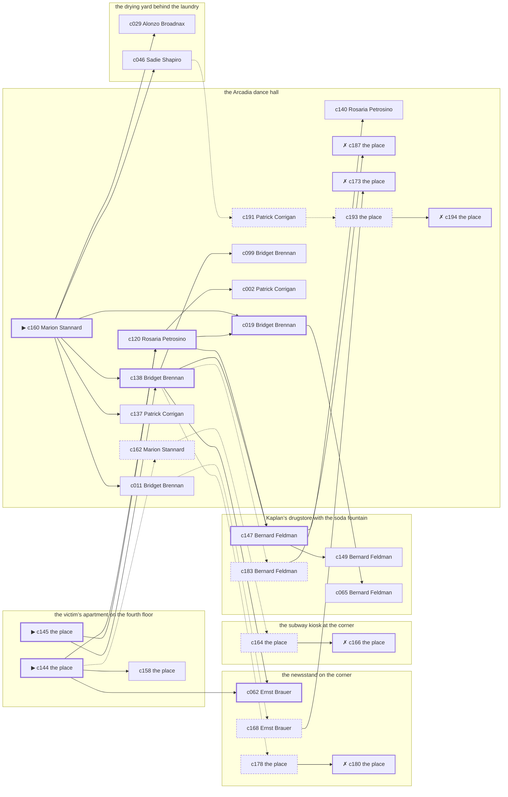

# the Gas House District — case 2

**Seed** 2 · **Difficulty** 2 · **Attempts** 1 · **Detective** Humphrey

**Par** 8 actions · **Budget** 20 · **Slack** 12 · **Findable** 30 (spine 8, corroboration 10, noise 7 + 5 disqualifiers) · **Noise ratio** 40% · **Candidate pool** 195

## 1. The Truth

Sadie Shapiro, a chorus girl between engagements, a customer of the victim’s, killed Edward Doyle, a theatrical agent, with strangling with a cord at the victim’s apartment on the fourth floor at 8:00 PM. Sadie Shapiro owed the victim money (debt). Sadie Shapiro had been at the drying yard behind the laundry earlier in the evening, where the weapon lived, and was alone with Edward Doyle when it happened. Marion Stannard hired us.

## 2. Dramatis Personae

| Name | Role | Relationship | Class of secret | Motive | Found at | Killer |
| --- | --- | --- | --- | --- | --- | --- |
| Edward Doyle | a theatrical agent | the victim | — | — | — | — |
| Patrick Corrigan | a doorman at a club with no sign on it | in the victim’s debt | fence | — | the Arcadia dance hall | — |
| Bridget Brennan | a society columnist | a witness against the people the victim worked for | dope | — | the Arcadia dance hall | — |
| Alonzo Broadnax | a hack driver | a childhood friend of the victim’s from the same block | fence | revenge | the drying yard behind the laundry | — |
| Marion Stannard (client) | a dentist with rooms on the third floor | the victim’s neighbour across the airshaft | dope | property | the Arcadia dance hall | — |
| Sadie Shapiro | a chorus girl between engagements | a customer of the victim’s | murder (+ secret-drinking) | debt | the drying yard behind the laundry | **YES** |
| Wilhelm Steinbach | the night manager at the hotel | the victim’s tenant | secret-drinking | — | Kaplan’s drugstore with the soda fountain | — |
| Ernst Brauer | the news dealer | fixture (newsstand) | — | — | the newsstand on the corner | — |
| Bernard Feldman | the druggist | fixture (druggist) | — | — | Kaplan’s drugstore with the soda fountain | — |
| Rosaria Petrosino | the ticket-taker | fixture (ticket-taker) | — | — | the Arcadia dance hall | — |
| Louis Bernstein | the patrolman on the beat | fixture (beat-cop) | — | — | the newsstand on the corner | — |

## 3. Places

- **the newsstand on the corner** (public) — watched by newsstand (Ernst Brauer); objects: a folded stack of evening papers, the roof-door key, a pasted-up timetable — within earshot of the scene
- **the subway kiosk at the corner** (public) — unwatched; objects: a brass umbrella stand — within earshot of the scene
- **Kaplan’s drugstore with the soda fountain** (public) — watched by druggist (Bernard Feldman); objects: a wall telephone, a bottle of chloral drops, an ice pick
- **the victim’s apartment on the fourth floor** (private) — unwatched; objects: a nickel-plated revolver, a framed photograph, a japanned cash box — **THE SCENE**; the victim’s address
- **the Arcadia dance hall** (public) — watched by ticket-taker (Rosaria Petrosino); objects: a standing ashtray, a silver cigarette case
- **the drying yard behind the laundry** (private) — unwatched; objects: a length of sash cord, a mop and bucket — where the weapon lived

## 4. Anchors

The coroner gives 7:30 PM–9:00 PM, four ticks wide. These are what close it: **dumbwaiter** and **ice-delivery**.

- **the ice being brought in** — at 7:30 PM; at Kaplan’s drugstore with the soda fountain. Somebody reliable notes who was there. Those present carry it: a wet patch down one side of a coat.
- **the dumbwaiter squeal** — at 6:30 PM, 8:00 PM, 9:30 PM, 11:00 PM; at the victim’s apartment on the fourth floor. You can time things by it: a noise the whole shaft hears and nobody in the building can sleep through.
- **the beat cop’s pass** — at 6:30 PM, 8:00 PM, 9:30 PM, 11:00 PM; on a round through the newsstand on the corner → the subway kiosk at the corner → Kaplan’s drugstore with the soda fountain → the Arcadia dance hall. Somebody reliable notes who was there.

## 5. Timelines

### Edward Doyle — the victim

| Tick | Time | Truth | Claimed | Companion claimed |
| --- | --- | --- | --- | --- |
| 0 | 6:00 PM | the newsstand on the corner | the newsstand on the corner | — |
| 1 | 6:30 PM | the newsstand on the corner | the newsstand on the corner | — |
| 2 | 7:00 PM | the newsstand on the corner | the newsstand on the corner | — |
| 3 | 7:30 PM | Kaplan’s drugstore with the soda fountain | Kaplan’s drugstore with the soda fountain | — |
| 4 | 8:00 PM | the victim’s apartment on the fourth floor ☠ | the victim’s apartment on the fourth floor | — |
| 5 | 8:30 PM | — | — | — |
| 6 | 9:00 PM | — | — | — |
| 7 | 9:30 PM | — | — | — |
| 8 | 10:00 PM | — | — | — |
| 9 | 10:30 PM | — | — | — |
| 10 | 11:00 PM | — | — | — |
| 11 | 11:30 PM | — | — | — |

### Patrick Corrigan

| Tick | Time | Truth | Claimed | Companion claimed |
| --- | --- | --- | --- | --- |
| 0 | 6:00 PM | the Arcadia dance hall | the Arcadia dance hall | — |
| 1 | 6:30 PM | the newsstand on the corner | the newsstand on the corner | — |
| 2 | 7:00 PM | the newsstand on the corner | the newsstand on the corner | — |
| 3 | 7:30 PM | the subway kiosk at the corner | **Kaplan’s drugstore with the soda fountain** | — |
| 4 | 8:00 PM | the Arcadia dance hall | the Arcadia dance hall | — |
| 5 | 8:30 PM | the Arcadia dance hall | the Arcadia dance hall | — |
| 6 | 9:00 PM | the Arcadia dance hall | the Arcadia dance hall | — |
| 7 | 9:30 PM | the Arcadia dance hall | the Arcadia dance hall | — |
| 8 | 10:00 PM | the drying yard behind the laundry | the drying yard behind the laundry | — |
| 9 | 10:30 PM | the subway kiosk at the corner | the subway kiosk at the corner | — |
| 10 | 11:00 PM | the Arcadia dance hall | the Arcadia dance hall | — |
| 11 | 11:30 PM | the Arcadia dance hall | the Arcadia dance hall | — |

### Bridget Brennan

| Tick | Time | Truth | Claimed | Companion claimed |
| --- | --- | --- | --- | --- |
| 0 | 6:00 PM | the victim’s apartment on the fourth floor | the victim’s apartment on the fourth floor | — |
| 1 | 6:30 PM | the Arcadia dance hall | the Arcadia dance hall | — |
| 2 | 7:00 PM | the drying yard behind the laundry | the drying yard behind the laundry | — |
| 3 | 7:30 PM | the drying yard behind the laundry | the drying yard behind the laundry | — |
| 4 | 8:00 PM | the Arcadia dance hall | the Arcadia dance hall | — |
| 5 | 8:30 PM | the Arcadia dance hall | the Arcadia dance hall | — |
| 6 | 9:00 PM | the subway kiosk at the corner | the subway kiosk at the corner | — |
| 7 | 9:30 PM | the subway kiosk at the corner | the subway kiosk at the corner | — |
| 8 | 10:00 PM | the subway kiosk at the corner | the subway kiosk at the corner | — |
| 9 | 10:30 PM | the newsstand on the corner | the newsstand on the corner | — |
| 10 | 11:00 PM | the Arcadia dance hall | **the drying yard behind the laundry** | Wilhelm Steinbach |
| 11 | 11:30 PM | the Arcadia dance hall | the Arcadia dance hall | — |

### Alonzo Broadnax

| Tick | Time | Truth | Claimed | Companion claimed |
| --- | --- | --- | --- | --- |
| 0 | 6:00 PM | the Arcadia dance hall | the Arcadia dance hall | — |
| 1 | 6:30 PM | the Arcadia dance hall | the Arcadia dance hall | — |
| 2 | 7:00 PM | the drying yard behind the laundry | the drying yard behind the laundry | — |
| 3 | 7:30 PM | the Arcadia dance hall | the Arcadia dance hall | — |
| 4 | 8:00 PM | the newsstand on the corner | **the Arcadia dance hall** | — |
| 5 | 8:30 PM | the newsstand on the corner | the newsstand on the corner | — |
| 6 | 9:00 PM | the drying yard behind the laundry | the drying yard behind the laundry | — |
| 7 | 9:30 PM | Kaplan’s drugstore with the soda fountain | Kaplan’s drugstore with the soda fountain | — |
| 8 | 10:00 PM | the drying yard behind the laundry | the drying yard behind the laundry | — |
| 9 | 10:30 PM | the drying yard behind the laundry | the drying yard behind the laundry | — |
| 10 | 11:00 PM | the drying yard behind the laundry | the drying yard behind the laundry | — |
| 11 | 11:30 PM | Kaplan’s drugstore with the soda fountain | Kaplan’s drugstore with the soda fountain | — |

### Marion Stannard

| Tick | Time | Truth | Claimed | Companion claimed |
| --- | --- | --- | --- | --- |
| 0 | 6:00 PM | the Arcadia dance hall | the Arcadia dance hall | — |
| 1 | 6:30 PM | the subway kiosk at the corner | the subway kiosk at the corner | — |
| 2 | 7:00 PM | the subway kiosk at the corner | the subway kiosk at the corner | — |
| 3 | 7:30 PM | the subway kiosk at the corner | the subway kiosk at the corner | — |
| 4 | 8:00 PM | the Arcadia dance hall | **the subway kiosk at the corner** | — |
| 5 | 8:30 PM | the Arcadia dance hall | **the subway kiosk at the corner** | — |
| 6 | 9:00 PM | the Arcadia dance hall | the Arcadia dance hall | — |
| 7 | 9:30 PM | the Arcadia dance hall | the Arcadia dance hall | — |
| 8 | 10:00 PM | the subway kiosk at the corner | the subway kiosk at the corner | — |
| 9 | 10:30 PM | the Arcadia dance hall | the Arcadia dance hall | — |
| 10 | 11:00 PM | the Arcadia dance hall | the Arcadia dance hall | — |
| 11 | 11:30 PM | the Arcadia dance hall | the Arcadia dance hall | — |

### Sadie Shapiro — the killer

| Tick | Time | Truth | Claimed | Companion claimed |
| --- | --- | --- | --- | --- |
| 0 | 6:00 PM | the Arcadia dance hall | **Kaplan’s drugstore with the soda fountain** | — |
| 1 | 6:30 PM | the Arcadia dance hall | **Kaplan’s drugstore with the soda fountain** | — |
| 2 | 7:00 PM | the drying yard behind the laundry | the drying yard behind the laundry | — |
| 3 | 7:30 PM | the victim’s apartment on the fourth floor | **the Arcadia dance hall** | Patrick Corrigan |
| 4 | 8:00 PM | the victim’s apartment on the fourth floor ☠ | **the Arcadia dance hall** | Patrick Corrigan |
| 5 | 8:30 PM | the drying yard behind the laundry | the drying yard behind the laundry | — |
| 6 | 9:00 PM | the drying yard behind the laundry | the drying yard behind the laundry | — |
| 7 | 9:30 PM | the subway kiosk at the corner | the subway kiosk at the corner | — |
| 8 | 10:00 PM | the subway kiosk at the corner | the subway kiosk at the corner | — |
| 9 | 10:30 PM | Kaplan’s drugstore with the soda fountain | Kaplan’s drugstore with the soda fountain | — |
| 10 | 11:00 PM | Kaplan’s drugstore with the soda fountain | Kaplan’s drugstore with the soda fountain | — |
| 11 | 11:30 PM | Kaplan’s drugstore with the soda fountain | Kaplan’s drugstore with the soda fountain | — |

### Wilhelm Steinbach

| Tick | Time | Truth | Claimed | Companion claimed |
| --- | --- | --- | --- | --- |
| 0 | 6:00 PM | Kaplan’s drugstore with the soda fountain | Kaplan’s drugstore with the soda fountain | — |
| 1 | 6:30 PM | Kaplan’s drugstore with the soda fountain | Kaplan’s drugstore with the soda fountain | — |
| 2 | 7:00 PM | the drying yard behind the laundry | the drying yard behind the laundry | — |
| 3 | 7:30 PM | the drying yard behind the laundry | the drying yard behind the laundry | — |
| 4 | 8:00 PM | the Arcadia dance hall | **the newsstand on the corner** | — |
| 5 | 8:30 PM | the Arcadia dance hall | **the newsstand on the corner** | — |
| 6 | 9:00 PM | the Arcadia dance hall | the Arcadia dance hall | — |
| 7 | 9:30 PM | Kaplan’s drugstore with the soda fountain | Kaplan’s drugstore with the soda fountain | — |
| 8 | 10:00 PM | Kaplan’s drugstore with the soda fountain | Kaplan’s drugstore with the soda fountain | — |
| 9 | 10:30 PM | Kaplan’s drugstore with the soda fountain | Kaplan’s drugstore with the soda fountain | — |
| 10 | 11:00 PM | the subway kiosk at the corner | the subway kiosk at the corner | — |
| 11 | 11:30 PM | the subway kiosk at the corner | the subway kiosk at the corner | — |

### Fixtures (never lie, never withhold)

| Tick | Time | Ernst Brauer (the news dealer) | Bernard Feldman (the druggist) | Rosaria Petrosino (the ticket-taker) | Louis Bernstein (the patrolman on the beat) |
| --- | --- | --- | --- | --- | --- |
| 0 | 6:00 PM | the newsstand on the corner | Kaplan’s drugstore with the soda fountain | the Arcadia dance hall | — |
| 1 | 6:30 PM | the newsstand on the corner | Kaplan’s drugstore with the soda fountain | the Arcadia dance hall | the newsstand on the corner |
| 2 | 7:00 PM | the newsstand on the corner | Kaplan’s drugstore with the soda fountain | the Arcadia dance hall | — |
| 3 | 7:30 PM | the newsstand on the corner | Kaplan’s drugstore with the soda fountain | the Arcadia dance hall | — |
| 4 | 8:00 PM | the newsstand on the corner | the newsstand on the corner | the Arcadia dance hall | the subway kiosk at the corner |
| 5 | 8:30 PM | the newsstand on the corner | Kaplan’s drugstore with the soda fountain | the Arcadia dance hall | — |
| 6 | 9:00 PM | the newsstand on the corner | Kaplan’s drugstore with the soda fountain | the Arcadia dance hall | — |
| 7 | 9:30 PM | the newsstand on the corner | Kaplan’s drugstore with the soda fountain | the Arcadia dance hall | Kaplan’s drugstore with the soda fountain |
| 8 | 10:00 PM | Kaplan’s drugstore with the soda fountain | Kaplan’s drugstore with the soda fountain | the Arcadia dance hall | — |
| 9 | 10:30 PM | the newsstand on the corner | Kaplan’s drugstore with the soda fountain | the Arcadia dance hall | — |
| 10 | 11:00 PM | the newsstand on the corner | Kaplan’s drugstore with the soda fountain | the Arcadia dance hall | the Arcadia dance hall |
| 11 | 11:30 PM | the newsstand on the corner | Kaplan’s drugstore with the soda fountain | the Arcadia dance hall | — |

## 6. Secrets in play

- **Patrick Corrigan** (fence): Patrick Corrigan hands a parcel of stolen goods to a man at the subway kiosk at the corner from 7:30 PM.
- **Bridget Brennan** (dope): Bridget Brennan buys morphine at the Arcadia dance hall from 11:00 PM and would rather be thought a murderer than a hop-head.
- **Alonzo Broadnax** (fence): Alonzo Broadnax hands a parcel of stolen goods to a man at the newsstand on the corner from 8:00 PM.
- **Marion Stannard** (dope): Marion Stannard buys morphine at the Arcadia dance hall from 8:00 PM to 8:30 PM and would rather be thought a murderer than a hop-head.
- **Sadie Shapiro** (murder): Sadie Shapiro is at the victim’s apartment on the fourth floor from 7:30 PM to 8:00 PM, alone with Edward Doyle when it happens at 8:00 PM.
- **Sadie Shapiro** also (secret-drinking): Sadie Shapiro drinks alone at the Arcadia dance hall from 6:00 PM to 6:30 PM and will claim to have been anywhere else.
- **Wilhelm Steinbach** (secret-drinking): Wilhelm Steinbach drinks alone at the Arcadia dance hall from 8:00 PM to 8:30 PM and will claim to have been anywhere else.

## 7. Clue list — the 30 findable

The opening three, free at the start: c144, c145, c160. Everything else has to be led to. The full candidate pool is in the companion file.

### At the newsstand on the corner

- **c062** [spine] (observation; Ernst Brauer on Alonzo Broadnax) → (end)
  - Ernst Brauer says Alonzo Broadnax was at the newsstand on the corner from 8:00 PM to 8:30 PM.
  - _establishes: Alonzo Broadnax at the newsstand on the corner, 8:00 PM–8:30 PM_
- **c168** [noise {b3}] (overheard; Ernst Brauer on Bridget Brennan) → c173
  - Ernst Brauer on Bridget Brennan: Bridget Brennan’s sleeves are buttoned at the wrist in a warm room.
  - _establishes: context only_
- **c178** [noise {b4}] (physical; the place itself) → c180
  - Wrapping paper and a cut string at the newsstand on the corner, and the shop it came from closed two years ago.
  - _establishes: context only_
- **c180** [disqualifier {b4}] (overheard; the place itself) → (end)
  - The receiver at the newsstand on the corner would rather talk than be held: Alonzo Broadnax was there from 8:00 PM handing over a parcel of somebody else’s silver, which is a charge Alonzo Broadnax will take over this one.
  - _establishes: Alonzo Broadnax’s fence accounted for; Alonzo Broadnax at the newsstand on the corner, 8:00 PM_

### At the subway kiosk at the corner

- **c164** [noise {b2}] (physical; the place itself) → c166
  - Wrapping paper and a cut string at the subway kiosk at the corner, and the shop it came from closed two years ago.
  - _establishes: context only_
- **c166** [disqualifier {b2}] (overheard; the place itself) → (end)
  - The receiver at the subway kiosk at the corner would rather talk than be held: Patrick Corrigan was there from 7:30 PM handing over a parcel of somebody else’s silver, which is a charge Patrick Corrigan will take over this one.
  - _establishes: Patrick Corrigan’s fence accounted for; Patrick Corrigan at the subway kiosk at the corner, 7:30 PM_

### At Kaplan’s drugstore with the soda fountain

- **c147** [spine] (anchor; Bernard Feldman on Edward Doyle that evening) → c149, c140
  - Bernard Feldman puts Edward Doyle at Kaplan’s drugstore with the soda fountain when the ice came, which was 7:30 PM, and alive enough to argue about the weather.
  - _establishes: the victim alive at 7:30 PM; Edward Doyle at Kaplan’s drugstore with the soda fountain, 7:30 PM_
- **c149** [corroboration] (anchor; Bernard Feldman on the noise that evening) → (end)
  - Bernard Feldman was at the newsstand on the corner at 8:00 PM and heard a scuffle and a chair dragging from the direction of the victim’s apartment on the fourth floor, when the dumbwaiter went up.
  - _establishes: noise at the victim’s apartment on the fourth floor at 8:00 PM; the victim dead by 8:00 PM; how it was done_
- **c065** [corroboration] (observation; Bernard Feldman on Alonzo Broadnax) → (end)
  - Bernard Feldman says Alonzo Broadnax was at the newsstand on the corner at 8:00 PM.
  - _establishes: Alonzo Broadnax at the newsstand on the corner, 8:00 PM_
- **c183** [noise {b1}] (overheard; Bernard Feldman on Marion Stannard) → c187
  - Bernard Feldman on Marion Stannard: Somebody at the Arcadia dance hall sells what a druggist will not, and Marion Stannard knows which door.
  - _establishes: context only_

### At the victim’s apartment on the fourth floor

- **c144** [spine ⟨opening⟩] (scene; the place itself) → c120, c062, c158, c162
  - Edward Doyle was found at the victim’s apartment on the fourth floor. His watch glass broke against the floor and the hands have not moved since. The dumbwaiter squeal came at 8:00 PM, and the shaft carries and the car was worked on the hour and the half hour. That puts the killing in that half hour and no later.
  - _establishes: the victim dead by 8:00 PM; how it was done_
- **c145** [spine ⟨opening⟩] (morgue; the place itself) → c120, c138
  - The coroner puts death between 7:30 PM and 9:00 PM — two hours of nothing useful. A ligature furrow across the throat. Three fibres of hemp in the skin.
  - _establishes: death between 7:30 PM and 9:00 PM; how it was done_
- **c158** [corroboration] (document; the place itself) → (end)
  - Found at the victim’s apartment on the fourth floor: A promissory note for $4,000 signed by Sadie Shapiro, endorsed to Edward Doyle, three months past due.
  - _establishes: Sadie Shapiro had a motive (debt)_

### At the Arcadia dance hall

- **c160** [spine ⟨opening⟩] (client; Marion Stannard on why I was hired) → c138, c019, c029, c011, c137, c046
  - Marion Stannard hired us. Marion Stannard wants it known that Sadie Shapiro owed the victim money, and would rather we started there.
  - _establishes: Sadie Shapiro had a motive (debt)_
- **c120** [spine] (observation; Rosaria Petrosino on who was there at 8:00 PM) → c019, c147, c002
  - Rosaria Petrosino runs through it: at 8:00 PM there were Patrick Corrigan, Bridget Brennan, Marion Stannard, Wilhelm Steinbach at the Arcadia dance hall, and nobody else worth naming.
  - _establishes: Patrick Corrigan at the Arcadia dance hall, 8:00 PM; Bridget Brennan at the Arcadia dance hall, 8:00 PM; Marion Stannard at the Arcadia dance hall, 8:00 PM; Wilhelm Steinbach at the Arcadia dance hall, 8:00 PM_
- **c138** [spine] (observation; Bridget Brennan on Sadie Shapiro’s account) → c062, c147, c099, c183, c178
  - Bridget Brennan was at the Arcadia dance hall at 8:00 PM and says Sadie Shapiro was not.
  - _establishes: Sadie Shapiro not at the Arcadia dance hall, 8:00 PM_
- **c019** [spine] (observation; Bridget Brennan on Sadie Shapiro) → c065
  - Bridget Brennan says Sadie Shapiro was at the drying yard behind the laundry at 7:00 PM.
  - _establishes: Sadie Shapiro at the drying yard behind the laundry, 7:00 PM; Sadie Shapiro could reach the weapon_
- **c099** [corroboration] (observation; Bridget Brennan on who was there at 8:00 PM) → (end)
  - Bridget Brennan runs through it: at 8:00 PM there were Patrick Corrigan, Marion Stannard, Wilhelm Steinbach at the Arcadia dance hall, and nobody else worth naming.
  - _establishes: Patrick Corrigan at the Arcadia dance hall, 8:00 PM; Marion Stannard at the Arcadia dance hall, 8:00 PM; Wilhelm Steinbach at the Arcadia dance hall, 8:00 PM_
- **c002** [corroboration] (observation; Patrick Corrigan on Bridget Brennan) → (end)
  - Patrick Corrigan says Bridget Brennan was at the Arcadia dance hall from 8:00 PM to 8:30 PM.
  - _establishes: Bridget Brennan at the Arcadia dance hall, 8:00 PM–8:30 PM_
- **c140** [corroboration] (observation; Rosaria Petrosino on Sadie Shapiro’s account) → (end)
  - Rosaria Petrosino was at the Arcadia dance hall from 7:30 PM to 8:00 PM and says Sadie Shapiro was not.
  - _establishes: Sadie Shapiro not at the Arcadia dance hall, 7:30 PM–8:00 PM_
- **c011** [corroboration] (observation; Bridget Brennan on Patrick Corrigan) → c168
  - Bridget Brennan says Patrick Corrigan was at the Arcadia dance hall from 8:00 PM to 8:30 PM.
  - _establishes: Patrick Corrigan at the Arcadia dance hall, 8:00 PM–8:30 PM_
- **c137** [corroboration] (observation; Patrick Corrigan on Sadie Shapiro’s account) → (end)
  - Patrick Corrigan was at the Arcadia dance hall at 8:00 PM and says Sadie Shapiro was not.
  - _establishes: Sadie Shapiro not at the Arcadia dance hall, 8:00 PM_
- **c187** [disqualifier {b1}] (overheard; the place itself) → (end)
  - The man who sells it at the Arcadia dance hall gives it up rather than be held: Marion Stannard was there from 8:00 PM to 8:30 PM, and stayed until it took hold.
  - _establishes: Marion Stannard’s dope accounted for; Marion Stannard at the Arcadia dance hall, 8:00 PM–8:30 PM_
- **c162** [noise {b2}] (overheard; Marion Stannard on Patrick Corrigan) → c164
  - Marion Stannard on Patrick Corrigan: There is a man who meets people at the subway kiosk at the corner and nobody will say his name out loud.
  - _establishes: context only_
- **c173** [disqualifier {b3}] (overheard; the place itself) → (end)
  - The man who sells it at the Arcadia dance hall gives it up rather than be held: Bridget Brennan was there from 11:00 PM, and stayed until it took hold.
  - _establishes: Bridget Brennan’s dope accounted for; Bridget Brennan at the Arcadia dance hall, 11:00 PM_
- **c191** [noise {b5}] (overheard; Patrick Corrigan on Wilhelm Steinbach) → c193
  - Patrick Corrigan on Wilhelm Steinbach: Somebody at the Arcadia dance hall says Wilhelm Steinbach is in more often than Wilhelm Steinbach lets on.
  - _establishes: context only_
- **c193** [noise {b5}] (physical; the place itself) → c194
  - A tab at the Arcadia dance hall in a name that is not Wilhelm Steinbach’s, in Wilhelm Steinbach’s handwriting.
  - _establishes: context only_
- **c194** [disqualifier {b5}] (overheard; the place itself) → (end)
  - The man behind the counter at the Arcadia dance hall knows exactly: Wilhelm Steinbach was on the same stool from 8:00 PM to 8:30 PM and was in no condition to walk anywhere, let alone do this.
  - _establishes: Wilhelm Steinbach’s secret-drinking accounted for; Wilhelm Steinbach at the Arcadia dance hall, 8:00 PM–8:30 PM_

### At the drying yard behind the laundry

- **c029** [corroboration] (observation; Alonzo Broadnax on Sadie Shapiro) → (end)
  - Alonzo Broadnax says Sadie Shapiro was at the drying yard behind the laundry at 7:00 PM.
  - _establishes: Sadie Shapiro at the drying yard behind the laundry, 7:00 PM; Sadie Shapiro could reach the weapon_
- **c046** [corroboration] (observation; Sadie Shapiro on Alonzo Broadnax) → c191
  - Sadie Shapiro says Alonzo Broadnax was at the drying yard behind the laundry at 7:00 PM.
  - _establishes: Alonzo Broadnax at the drying yard behind the laundry, 7:00 PM; Alonzo Broadnax could reach the weapon_

## 8. Clue graph

## 9. Deduction path

Par is **8 actions** against a budget of 20: 12 spare. Every id below is a spine clue.

**Time of death.** The coroner gives four ticks. The anchors close it to 8:00 PM: one puts Edward Doyle alive at 7:30 PM, the other times the scene at 8:00 PM. _(c145, c147, c144; + 1 corroborating)_

**Clearing the innocent.**

- Patrick Corrigan was not at the victim’s apartment on the fourth floor at 8:00 PM, on two independent sources. _(c120; + 2 corroborating)_
- Bridget Brennan was not at the victim’s apartment on the fourth floor at 8:00 PM, on two independent sources. _(c120; + 1 corroborating)_
- Alonzo Broadnax was not at the victim’s apartment on the fourth floor at 8:00 PM, on two independent sources. _(c062; + 2 corroborating)_
- Marion Stannard was not at the victim’s apartment on the fourth floor at 8:00 PM, on two independent sources. _(c120; + 2 corroborating)_
- Wilhelm Steinbach was not at the victim’s apartment on the fourth floor at 8:00 PM, on two independent sources. _(c120; + 2 corroborating)_

**Naming the killer.** Sadie Shapiro claims the Arcadia dance hall at 8:00 PM. Two independent sources put that out of the question. _(c138; + 2 corroborating)_

**The weapon.** Sadie Shapiro was at the drying yard behind the laundry before 8:00 PM, where a length of sash cord was kept. _(c019; + 1 corroborating)_

**Method.** Strangling with a cord, on two physical sources. _(c144, c145; + 1 corroborating)_

**Motive.** debt, on two independent sources. _(c160; + 1 corroborating)_

## 10. Red herrings

**Innocents who lie about the murder tick:**

- Alonzo Broadnax claims the Arcadia dance hall at 8:00 PM and was really at the newsstand on the corner. Reason: Alonzo Broadnax hands a parcel of stolen goods to a man at the newsstand on the corner from 8:00 PM.
- Marion Stannard claims the subway kiosk at the corner at 8:00 PM and was really at the Arcadia dance hall. Reason: Marion Stannard buys morphine at the Arcadia dance hall from 8:00 PM to 8:30 PM and would rather be thought a murderer than a hop-head.
- Wilhelm Steinbach claims the newsstand on the corner at 8:00 PM and was really at the Arcadia dance hall. Reason: Wilhelm Steinbach drinks alone at the Arcadia dance hall from 8:00 PM to 8:30 PM and will claim to have been anywhere else.

**Innocents with a motive:**

- Alonzo Broadnax — revenge: blamed the victim for a ruin.
- Marion Stannard — property: wanted the victim out of a lease.

**Noise branches, and what knocks each one down:**

- **b1** (Marion Stannard, dope): c183 → **c187** — The man who sells it at the Arcadia dance hall gives it up rather than be held: Marion Stannard was there from 8:00 PM to 8:30 PM, and stayed until it took hold.
- **b2** (Patrick Corrigan, fence): c162 → c164 → **c166** — The receiver at the subway kiosk at the corner would rather talk than be held: Patrick Corrigan was there from 7:30 PM handing over a parcel of somebody else’s silver, which is a charge Patrick Corrigan will take over this one.
- **b3** (Bridget Brennan, dope): c168 → **c173** — The man who sells it at the Arcadia dance hall gives it up rather than be held: Bridget Brennan was there from 11:00 PM, and stayed until it took hold.
- **b4** (Alonzo Broadnax, fence): c178 → **c180** — The receiver at the newsstand on the corner would rather talk than be held: Alonzo Broadnax was there from 8:00 PM handing over a parcel of somebody else’s silver, which is a charge Alonzo Broadnax will take over this one.
- **b5** (Wilhelm Steinbach, secret-drinking): c191 → c193 → **c194** — The man behind the counter at the Arcadia dance hall knows exactly: Wilhelm Steinbach was on the same stool from 8:00 PM to 8:30 PM and was in no condition to walk anywhere, let alone do this.

