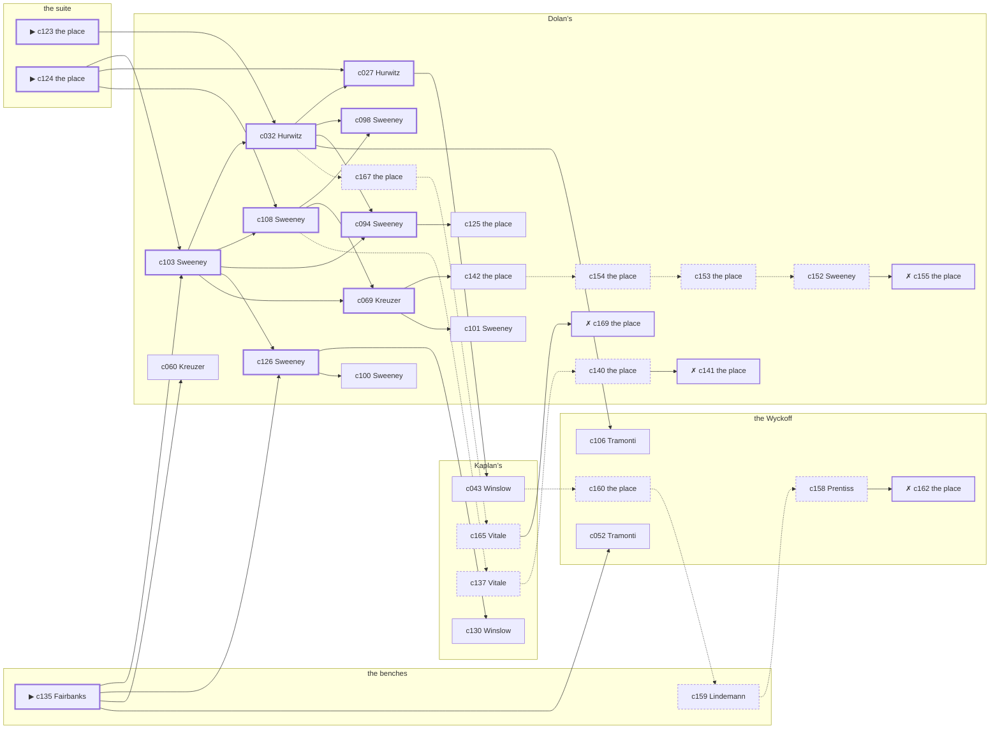

# the Bowery — case 20

**Seed** 20 · **Difficulty** 2 · **Attempts** 1 · **Detective** Dashiell

**Par** 9 actions · **Slack** 6 · **Budget** 15 · **Findable** 34 (spine 11, corroboration 9, noise 10 + 4 disqualifiers) · **Noise ratio** 41% · **Candidate pool** 170

## 1. The Truth

Ilse Lindemann, a curb broker, the victim’s business partner, killed Isaiah Ashby, a union treasurer, with poison in a drink at the suite at 10:30 PM. Lindemann owed the victim money (debt). Lindemann had been at Dolan’s earlier in the evening, where the weapon lived, and was alone with Ashby when it happened. Fairbanks hired us.

## 2. Dramatis Personae

| Name | Role | Relationship | Class of secret | Motive | Found at | Killer |
| --- | --- | --- | --- | --- | --- | --- |
| Isaiah Ashby | a union treasurer | the victim | — | — | — | — |
| Ilse Lindemann | a curb broker | the victim’s business partner | murder (+ fence) | debt | the benches | **YES** |
| Prescott Fairbanks (client) | a bookmaker in a small way | in the victim’s debt | fence | revenge | the benches | — |
| Isidore Hurwitz | a policy runner | a customer of the victim’s | dope | — | Dolan’s | — |
| Thaddeus Winslow | a lawyer with one clerk | the victim’s lawyer | gambling-debt | property | Kaplan’s | — |
| Emilio Tramonti | a private secretary | engaged to the victim’s daughter | blackmail | — | the Wyckoff | — |
| Gustav Kreuzer | a hack driver | the victim’s tenant | fence | — | Dolan’s | — |
| Otto Vogel | the elevator man | fixture (elevator-man) | — | — | the Hallam | — |
| Teresa Vitale | the druggist | fixture (druggist) | — | — | Kaplan’s | — |
| Booker Prentiss | the doorman | fixture (doorman) | — | — | the Wyckoff | — |
| Cornelius Sweeney | the bartender | fixture (bartender) | — | — | Dolan’s | — |

## 3. Places

- **the victim’s suite at the residential hotel** (private) — unwatched; objects: a camel-hair overcoat on a hook, a silver cigarette case — **THE SCENE**; the victim’s address
- **the benches at the north end of the square** (public) — unwatched; objects: a folded stack of evening papers, a brass umbrella stand — within earshot of the scene
- **the vestibule of the Hallam apartments** (private) — watched by elevator-man (Vogel); objects: the roof-door key, a day ledger, a nickel-plated revolver
- **Kaplan’s drugstore with the soda fountain** (public) — watched by druggist (Vitale); objects: a wall telephone, an ice pick
- **the lobby of the Wyckoff** (semi) — watched by doorman (Prentiss); objects: a bronze bookend — within earshot of the scene
- **Dolan’s Bar** (semi) — watched by bartender (Sweeney); objects: a bottle of chloral drops, a seltzer siphon — where the weapon lived

## 4. Anchors

The coroner gives 10:00 PM–11:30 PM, four ticks wide. These are what close it: **el-train** and **ice-delivery**.

- **the ice being brought in** — at 10:00 PM; at Dolan’s. Somebody reliable notes who was there. Only those present know that the iceman dropped a block on the step and it went in three. Those present carry it: a wet patch down one side of a coat.
- **the El going over** — at 6:30 PM, 7:30 PM, 8:30 PM, 9:30 PM, 10:30 PM, 11:30 PM; across the whole neighbourhood. You can time things by it: everything under the structure stops being audible for twenty seconds.

## 5. Timelines

### Ashby — the victim

| Tick | Time | Truth | Claimed | Companion claimed |
| --- | --- | --- | --- | --- |
| 0 | 6:00 PM | the Wyckoff | the Wyckoff | — |
| 1 | 6:30 PM | the Wyckoff | the Wyckoff | — |
| 2 | 7:00 PM | the Wyckoff | the Wyckoff | — |
| 3 | 7:30 PM | Kaplan’s | Kaplan’s | — |
| 4 | 8:00 PM | the Wyckoff | the Wyckoff | — |
| 5 | 8:30 PM | the Wyckoff | the Wyckoff | — |
| 6 | 9:00 PM | the Wyckoff | the Wyckoff | — |
| 7 | 9:30 PM | the Wyckoff | the Wyckoff | — |
| 8 | 10:00 PM | Dolan’s | Dolan’s | — |
| 9 | 10:30 PM | the suite ☠ | the suite | — |
| 10 | 11:00 PM | — | — | — |
| 11 | 11:30 PM | — | — | — |

### Lindemann — the killer

| Tick | Time | Truth | Claimed | Companion claimed |
| --- | --- | --- | --- | --- |
| 0 | 6:00 PM | Kaplan’s | Kaplan’s | — |
| 1 | 6:30 PM | the benches | the benches | — |
| 2 | 7:00 PM | the benches | the benches | — |
| 3 | 7:30 PM | the Wyckoff | the Wyckoff | — |
| 4 | 8:00 PM | Dolan’s | Dolan’s | — |
| 5 | 8:30 PM | the benches | the benches | — |
| 6 | 9:00 PM | the benches | the benches | — |
| 7 | 9:30 PM | Dolan’s | **the Hallam** | — |
| 8 | 10:00 PM | Dolan’s | **the Hallam** | — |
| 9 | 10:30 PM | the suite ☠ | **Dolan’s** | — |
| 10 | 11:00 PM | the benches | the benches | — |
| 11 | 11:30 PM | the Hallam | the Hallam | — |

### Fairbanks

| Tick | Time | Truth | Claimed | Companion claimed |
| --- | --- | --- | --- | --- |
| 0 | 6:00 PM | the benches | the benches | — |
| 1 | 6:30 PM | the benches | the benches | — |
| 2 | 7:00 PM | Dolan’s | Dolan’s | — |
| 3 | 7:30 PM | the Hallam | the Hallam | — |
| 4 | 8:00 PM | the benches | the benches | — |
| 5 | 8:30 PM | the benches | the benches | — |
| 6 | 9:00 PM | the benches | the benches | — |
| 7 | 9:30 PM | the Wyckoff | the Wyckoff | — |
| 8 | 10:00 PM | the Wyckoff | the Wyckoff | — |
| 9 | 10:30 PM | Dolan’s | **Kaplan’s** | Winslow |
| 10 | 11:00 PM | Dolan’s | Dolan’s | — |
| 11 | 11:30 PM | the benches | the benches | — |

### Hurwitz

| Tick | Time | Truth | Claimed | Companion claimed |
| --- | --- | --- | --- | --- |
| 0 | 6:00 PM | Dolan’s | Dolan’s | — |
| 1 | 6:30 PM | Dolan’s | Dolan’s | — |
| 2 | 7:00 PM | Dolan’s | Dolan’s | — |
| 3 | 7:30 PM | Kaplan’s | **the Wyckoff** | — |
| 4 | 8:00 PM | Kaplan’s | **the Wyckoff** | — |
| 5 | 8:30 PM | Kaplan’s | Kaplan’s | — |
| 6 | 9:00 PM | the Wyckoff | the Wyckoff | — |
| 7 | 9:30 PM | the Wyckoff | the Wyckoff | — |
| 8 | 10:00 PM | the Wyckoff | the Wyckoff | — |
| 9 | 10:30 PM | Dolan’s | Dolan’s | — |
| 10 | 11:00 PM | the benches | the benches | — |
| 11 | 11:30 PM | the benches | the benches | — |

### Winslow

| Tick | Time | Truth | Claimed | Companion claimed |
| --- | --- | --- | --- | --- |
| 0 | 6:00 PM | Kaplan’s | Kaplan’s | — |
| 1 | 6:30 PM | Kaplan’s | Kaplan’s | — |
| 2 | 7:00 PM | Kaplan’s | Kaplan’s | — |
| 3 | 7:30 PM | Kaplan’s | Kaplan’s | — |
| 4 | 8:00 PM | Kaplan’s | Kaplan’s | — |
| 5 | 8:30 PM | Dolan’s | Dolan’s | — |
| 6 | 9:00 PM | Dolan’s | Dolan’s | — |
| 7 | 9:30 PM | the benches | the benches | — |
| 8 | 10:00 PM | the benches | the benches | — |
| 9 | 10:30 PM | Dolan’s | **the Hallam** | Hurwitz |
| 10 | 11:00 PM | Dolan’s | Dolan’s | — |
| 11 | 11:30 PM | Dolan’s | Dolan’s | — |

### Tramonti

| Tick | Time | Truth | Claimed | Companion claimed |
| --- | --- | --- | --- | --- |
| 0 | 6:00 PM | Kaplan’s | Kaplan’s | — |
| 1 | 6:30 PM | the benches | the benches | — |
| 2 | 7:00 PM | the benches | the benches | — |
| 3 | 7:30 PM | the benches | the benches | — |
| 4 | 8:00 PM | the Wyckoff | **Dolan’s** | — |
| 5 | 8:30 PM | the Wyckoff | **Dolan’s** | — |
| 6 | 9:00 PM | the Wyckoff | the Wyckoff | — |
| 7 | 9:30 PM | the Wyckoff | the Wyckoff | — |
| 8 | 10:00 PM | the Wyckoff | the Wyckoff | — |
| 9 | 10:30 PM | Dolan’s | Dolan’s | — |
| 10 | 11:00 PM | Dolan’s | Dolan’s | — |
| 11 | 11:30 PM | Dolan’s | Dolan’s | — |

### Kreuzer

| Tick | Time | Truth | Claimed | Companion claimed |
| --- | --- | --- | --- | --- |
| 0 | 6:00 PM | Kaplan’s | Kaplan’s | — |
| 1 | 6:30 PM | Kaplan’s | Kaplan’s | — |
| 2 | 7:00 PM | Dolan’s | **the Wyckoff** | Tramonti |
| 3 | 7:30 PM | Dolan’s | **the Wyckoff** | Tramonti |
| 4 | 8:00 PM | Dolan’s | Dolan’s | — |
| 5 | 8:30 PM | Dolan’s | Dolan’s | — |
| 6 | 9:00 PM | the benches | the benches | — |
| 7 | 9:30 PM | the Wyckoff | the Wyckoff | — |
| 8 | 10:00 PM | Kaplan’s | Kaplan’s | — |
| 9 | 10:30 PM | Dolan’s | Dolan’s | — |
| 10 | 11:00 PM | Dolan’s | Dolan’s | — |
| 11 | 11:30 PM | Dolan’s | Dolan’s | — |

### Fixtures (never lie, never withhold)

| Tick | Time | Vogel (the elevator man) | Vitale (the druggist) | Prentiss (the doorman) | Sweeney (the bartender) |
| --- | --- | --- | --- | --- | --- |
| 0 | 6:00 PM | the Hallam | Kaplan’s | the Wyckoff | Dolan’s |
| 1 | 6:30 PM | the Hallam | Kaplan’s | the Wyckoff | Dolan’s |
| 2 | 7:00 PM | the Hallam | Kaplan’s | the Wyckoff | Dolan’s |
| 3 | 7:30 PM | the Hallam | Kaplan’s | the Wyckoff | Dolan’s |
| 4 | 8:00 PM | the Hallam | the Wyckoff | the Wyckoff | Dolan’s |
| 5 | 8:30 PM | the Hallam | Kaplan’s | the Wyckoff | Dolan’s |
| 6 | 9:00 PM | the Hallam | Kaplan’s | the Wyckoff | Kaplan’s |
| 7 | 9:30 PM | the Hallam | Kaplan’s | the Wyckoff | Dolan’s |
| 8 | 10:00 PM | the Hallam | Kaplan’s | the Wyckoff | Dolan’s |
| 9 | 10:30 PM | the Hallam | Kaplan’s | the Wyckoff | Dolan’s |
| 10 | 11:00 PM | the Hallam | Kaplan’s | the Wyckoff | Dolan’s |
| 11 | 11:30 PM | the Hallam | Kaplan’s | the Wyckoff | Dolan’s |

## 6. Secrets in play

- **Lindemann** (murder): Lindemann is at the suite from 10:30 PM, alone with Ashby when it happens at 10:30 PM.
- **Lindemann** also (fence): Lindemann hands a parcel of stolen goods to a man at Dolan’s from 9:30 PM to 10:00 PM.
- **Fairbanks** (fence): Fairbanks hands a parcel of stolen goods to a man at Dolan’s from 10:30 PM.
- **Hurwitz** (dope): Hurwitz buys morphine at Kaplan’s from 7:30 PM to 8:00 PM and would rather be thought a murderer than a hop-head.
- **Winslow** (gambling-debt): Winslow slips off to Dolan’s from 10:30 PM to settle with a bookmaker.
- **Tramonti** (blackmail): Tramonti meets the victim alone at the Wyckoff from 8:00 PM to 8:30 PM and asks for money.
- **Kreuzer** (fence): Kreuzer hands a parcel of stolen goods to a man at Dolan’s from 7:00 PM to 7:30 PM.

## 7. Clue list — the 34 findable

The opening three, free at the start: c123, c124, c135. Everything else has to be led to. The full candidate pool is in the companion file.

### At the suite

- **c123** [spine ⟨opening⟩] (scene; the place itself) → c032
  - Ashby was found at the suite. A glass is on its side and the spill had not yet reached the edge of the table when it dried. The El went over at 10:30 PM, running to timetable, and for twenty seconds nothing under the structure can be heard at all.
  - _establishes: the victim dead by 10:30 PM; how it was done_
- **c124** [spine ⟨opening⟩] (morgue; the place itself) → c103, c027, c108
  - The coroner puts death between 10:00 PM and 11:30 PM — two hours of nothing useful. Chloral hydrate in the stomach. No wound, no bruising, no sign of a struggle.
  - _establishes: death between 10:00 PM and 11:30 PM; how it was done_

### At the benches

- **c135** [spine ⟨opening⟩] (client; Fairbanks on why I was hired) → c103, c126, c060, c052
  - Fairbanks hired us, and wants it known that Lindemann owed the victim money, and would rather we started there.
  - _establishes: Lindemann had a motive (debt)_
- **c159** [noise {b2}] (overheard; Lindemann on Tramonti) → c158
  - Lindemann on Tramonti: The victim had been drawing cash in amounts that did not match anything in the accounts.
  - _establishes: context only_

### At Kaplan’s

- **c130** [corroboration] (overheard; Winslow on Lindemann and Ashby) → (end)
  - Winslow says Ashby told Lindemann that Friday was the end of it, one way or the other.
  - _establishes: Lindemann had a motive (debt)_
- **c043** [corroboration] (observation; Winslow on Kreuzer) → c160
  - Winslow says Kreuzer was at Dolan’s at 8:30 PM.
  - _establishes: Kreuzer at Dolan’s, 8:30 PM; Kreuzer could reach the weapon_
- **c137** [noise {b3}] (overheard; Vitale on Fairbanks) → c140
  - Vitale on Fairbanks: There is a man who meets people at Dolan’s and nobody will say his name out loud.
  - _establishes: context only_
- **c165** [noise {b4}] (overheard; Vitale on Kreuzer) → c169
  - Vitale on Kreuzer: There is a man who meets people at Dolan’s and nobody will say his name out loud.
  - _establishes: context only_

### At the Wyckoff

- **c106** [corroboration] (observation; Tramonti on Lindemann’s account) → (end)
  - Tramonti was at Dolan’s at 10:30 PM and says Lindemann was not.
  - _establishes: Lindemann not at Dolan’s, 10:30 PM_
- **c052** [corroboration] (observation; Tramonti on Hurwitz) → (end)
  - Tramonti says Hurwitz was at Dolan’s at 10:30 PM.
  - _establishes: Hurwitz at Dolan’s, 10:30 PM_
- **c160** [noise {b2}] (physical; the place itself) → c159
  - An envelope at the Wyckoff with nothing in it, addressed in the victim’s hand to no one.
  - _establishes: context only_
- **c158** [noise {b2}] (overheard; Prentiss on Tramonti) → c162
  - Prentiss on Tramonti: Tramonti has come into money lately and has no visible way of having come into money.
  - _establishes: context only_
- **c162** [disqualifier {b2}] (overheard; the place itself) → (end)
  - The victim’s bank book settles it: four payments, and Tramonti at the Wyckoff from 8:00 PM to 8:30 PM collecting the fifth. It is extortion, and an extortionist wants the man alive.
  - _establishes: Tramonti’s blackmail accounted for; Tramonti at the Wyckoff, 8:00 PM–8:30 PM_

### At Dolan’s

- **c103** [spine] (observation; Sweeney on Kreuzer) → c032, c108, c094, c126, c069
  - Sweeney says Kreuzer was at Dolan’s from 10:30 PM to 11:30 PM.
  - _establishes: Kreuzer at Dolan’s, 10:30 PM–11:30 PM_
- **c032** [spine] (observation; Hurwitz on Tramonti) → c027, c098, c094, c106, c167
  - Hurwitz says Tramonti was at Dolan’s at 10:30 PM.
  - _establishes: Tramonti at Dolan’s, 10:30 PM_
- **c027** [spine] (observation; Hurwitz on Fairbanks) → c043
  - Hurwitz says Fairbanks was at Dolan’s at 10:30 PM.
  - _establishes: Fairbanks at Dolan’s, 10:30 PM_
- **c108** [spine] (observation; Sweeney on Lindemann’s account) → c098, c069, c137
  - Sweeney was at Dolan’s at 10:30 PM and says Lindemann was not.
  - _establishes: Lindemann not at Dolan’s, 10:30 PM_
- **c098** [spine] (observation; Sweeney on Hurwitz) → (end)
  - Sweeney says Hurwitz was at Dolan’s at 10:30 PM.
  - _establishes: Hurwitz at Dolan’s, 10:30 PM_
- **c094** [spine] (observation; Sweeney on Lindemann) → c125
  - Sweeney says Lindemann was at Dolan’s from 9:30 PM to 10:00 PM.
  - _establishes: Lindemann at Dolan’s, 9:30 PM–10:00 PM; Lindemann could reach the weapon_
- **c126** [spine] (anchor; Sweeney on Ashby that evening) → c130, c100
  - Sweeney puts Ashby at Dolan’s when the ice came, which was 10:00 PM, and alive enough to argue about the weather.
  - _establishes: the victim alive at 10:00 PM; Ashby at Dolan’s, 10:00 PM_
- **c069** [spine] (observation; Kreuzer on Winslow) → c142, c101
  - Kreuzer says Winslow was at Dolan’s from 10:30 PM to 11:30 PM.
  - _establishes: Winslow at Dolan’s, 10:30 PM–11:30 PM_
- **c125** [corroboration] (physical; the place itself) → (end)
  - A bottle of chloral drops is gone from Dolan’s. The bottle is gone from the shelf and the ring of dust it stood in is still there.
  - _establishes: something gone from Dolan’s; how it was done_
- **c060** [corroboration] (observation; Kreuzer on Lindemann) → (end)
  - Kreuzer says Lindemann was at Dolan’s at 8:00 PM.
  - _establishes: Lindemann at Dolan’s, 8:00 PM; Lindemann could reach the weapon_
- **c142** [corroboration] (overheard; the place itself) → c154
  - The goods turn up, tagged and dated, and the tag puts Fairbanks at Dolan’s from 10:30 PM with both hands full.
  - _establishes: Fairbanks’s fence accounted for; Fairbanks at Dolan’s, 10:30 PM_
- **c100** [corroboration] (observation; Sweeney on Winslow) → (end)
  - Sweeney says Winslow was at Dolan’s from 10:30 PM to 11:30 PM.
  - _establishes: Winslow at Dolan’s, 10:30 PM–11:30 PM_
- **c101** [corroboration] (observation; Sweeney on Tramonti) → (end)
  - Sweeney says Tramonti was at Dolan’s from 10:30 PM to 11:30 PM.
  - _establishes: Tramonti at Dolan’s, 10:30 PM–11:30 PM_
- **c154** [noise {b1}] (physical; the place itself) → c153
  - A book of markers at Dolan’s with Winslow’s initials against four of them.
  - _establishes: context only_
- **c153** [noise {b1}] (physical; the place itself) → c152
  - Betting slips at Dolan’s in Winslow’s pocketbook, all of them losers, all of them this month.
  - _establishes: context only_
- **c152** [noise {b1}] (overheard; Sweeney on Winslow) → c155
  - Sweeney on Winslow: Winslow goes very quiet when the racing wire is mentioned.
  - _establishes: context only_
- **c155** [disqualifier {b1}] (overheard; the place itself) → (end)
  - The bookmaker’s runner is found and will say it: Winslow was at Dolan’s from 10:30 PM paying off eleven hundred dollars, a dollar at a time, and went nowhere near the killing.
  - _establishes: Winslow’s gambling-debt accounted for; Winslow at Dolan’s, 10:30 PM_
- **c140** [noise {b3}] (physical; the place itself) → c141
  - A pawn ticket at Dolan’s in a name that does not exist, made out at the hour in question.
  - _establishes: context only_
- **c141** [disqualifier {b3}] (overheard; the place itself) → (end)
  - The receiver at Dolan’s would rather talk than be held: Fairbanks was there from 10:30 PM handing over a parcel of somebody else’s silver, which is a charge Fairbanks will take over this one.
  - _establishes: Fairbanks’s fence accounted for; Fairbanks at Dolan’s, 10:30 PM_
- **c167** [noise {b4}] (physical; the place itself) → c165
  - Wrapping paper and a cut string at Dolan’s, and the shop it came from closed two years ago.
  - _establishes: context only_
- **c169** [disqualifier {b4}] (overheard; the place itself) → (end)
  - The receiver at Dolan’s would rather talk than be held: Kreuzer was there from 7:00 PM to 7:30 PM handing over a parcel of somebody else’s silver, which is a charge Kreuzer will take over this one.
  - _establishes: Kreuzer’s fence accounted for; Kreuzer at Dolan’s, 7:00 PM–7:30 PM_

## 8. Clue graph

## 9. Deduction path

Par is **9 actions** and the budget is par plus 6: **15**. Every id below is a spine clue; the inference is the sheet’s, not the clue’s.

**Time of death.** The coroner gives four ticks. The anchors close it to 10:30 PM: one puts Ashby alive at 10:00 PM, the other times the scene at 10:30 PM. _(c124, c126, c123)_

**Clearing the innocent.**

- Fairbanks was not at the suite at 10:30 PM. _(c027; + 2 corroborating)_
- Hurwitz was not at the suite at 10:30 PM. _(c098; + 1 corroborating)_
- Winslow was not at the suite at 10:30 PM. _(c069; + 2 corroborating)_
- Tramonti was not at the suite at 10:30 PM. _(c032; + 1 corroborating)_
- Kreuzer was not at the suite at 10:30 PM. _(c103)_

**Naming the killer.** Lindemann claims Dolan’s at 10:30 PM. Two independent sources put that out of the question. _(c108; + 1 corroborating)_

**The weapon.** Lindemann was at Dolan’s before 10:30 PM, where a bottle of chloral drops was kept. _(c094; + 1 corroborating)_

**Method.** Poison in a drink, on two physical sources. _(c123, c124; + 1 corroborating)_

**Motive.** debt, on two independent sources. _(c135; + 1 corroborating)_

## 10. Red herrings

**Innocents who lie about the murder tick:**

- Fairbanks claims Kaplan’s at 10:30 PM and was really at Dolan’s. Reason: Fairbanks hands a parcel of stolen goods to a man at Dolan’s from 10:30 PM.
- Winslow claims the Hallam at 10:30 PM and was really at Dolan’s. Reason: Winslow slips off to Dolan’s from 10:30 PM to settle with a bookmaker.

**Innocents with a motive:**

- Fairbanks — revenge: blamed the victim for a ruin.
- Winslow — property: wanted the victim out of a lease.

**Noise branches, and what knocks each one down:**

- **b1** (Winslow, gambling-debt): c154 → c153 → c152 → **c155** — The bookmaker’s runner is found and will say it: Winslow was at Dolan’s from 10:30 PM paying off eleven hundred dollars, a dollar at a time, and went nowhere near the killing.
- **b2** (Tramonti, blackmail): c160 → c159 → c158 → **c162** — The victim’s bank book settles it: four payments, and Tramonti at the Wyckoff from 8:00 PM to 8:30 PM collecting the fifth. It is extortion, and an extortionist wants the man alive.
- **b3** (Fairbanks, fence): c137 → c140 → **c141** — The receiver at Dolan’s would rather talk than be held: Fairbanks was there from 10:30 PM handing over a parcel of somebody else’s silver, which is a charge Fairbanks will take over this one.
- **b4** (Kreuzer, fence): c167 → c165 → **c169** — The receiver at Dolan’s would rather talk than be held: Kreuzer was there from 7:00 PM to 7:30 PM handing over a parcel of somebody else’s silver, which is a charge Kreuzer will take over this one.

