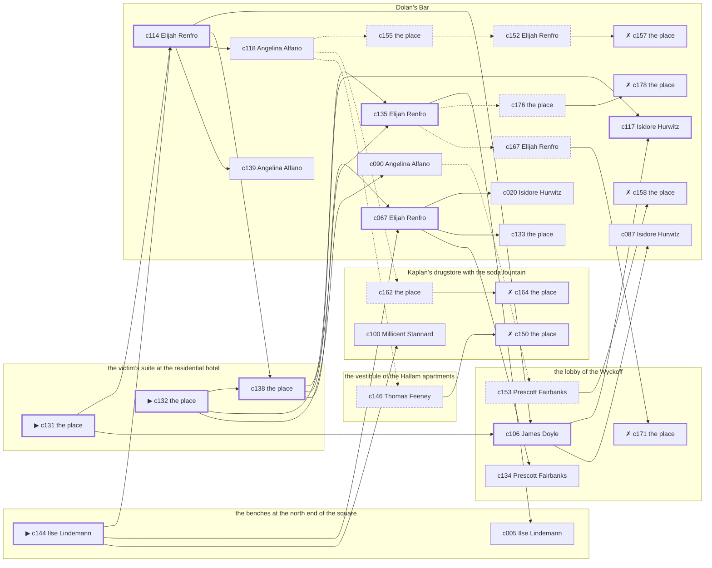

# the Bowery — case 20

**Seed** 20 · **Difficulty** 2 · **Attempts** 2 · **Detective** Humphrey

**Par** 8 actions · **Budget** 20 · **Slack** 12 · **Findable** 31 (spine 9, corroboration 9, noise 7 + 6 disqualifiers) · **Noise ratio** 42% · **Candidate pool** 179

## 1. The Truth

Ilse Lindemann, a curb broker, the victim’s business partner, killed Isaiah Ashby, a union treasurer, with poison in a drink at the victim’s suite at the residential hotel at 10:30 PM. Ilse Lindemann was about to be exposed by the victim (exposure). Ilse Lindemann had been at Dolan’s Bar earlier in the evening, where the weapon lived, and was alone with Isaiah Ashby when it happened. Ilse Lindemann is also the client: the killer hired us.

## 2. Dramatis Personae

| Name | Role | Relationship | Class of secret | Motive | Found at | Killer |
| --- | --- | --- | --- | --- | --- | --- |
| Isaiah Ashby | a union treasurer | the victim | — | — | — | — |
| Ilse Lindemann (client) | a curb broker | the victim’s business partner | murder | exposure | the benches at the north end of the square | **YES** |
| Prescott Fairbanks | a bookmaker in a small way | in the victim’s debt | gambling-debt | revenge | the lobby of the Wyckoff | — |
| Isidore Hurwitz | a policy runner | a customer of the victim’s | fence | debt | Dolan’s Bar | — |
| Thaddeus Winslow | a lawyer with one clerk | the victim’s lawyer | gambling-debt | — | Kaplan’s drugstore with the soda fountain | — |
| Angelina Alfano | a private secretary | the victim’s former employee | blackmail | — | Dolan’s Bar | — |
| Sol Shapiro | a hack driver | in the victim’s debt | secret-drinking | — | the benches at the north end of the square | — |
| Thomas Feeney | the elevator man | fixture (elevator-man) | — | — | the vestibule of the Hallam apartments | — |
| Millicent Stannard | the druggist | fixture (druggist) | — | — | Kaplan’s drugstore with the soda fountain | — |
| James Doyle | the doorman | fixture (doorman) | — | — | the lobby of the Wyckoff | — |
| Elijah Renfro | the bartender | fixture (bartender) | — | — | Dolan’s Bar | — |

## 3. Places

- **the victim’s suite at the residential hotel** (private) — unwatched; objects: a camel-hair overcoat on a hook, a silver cigarette case — **THE SCENE**; the victim’s address
- **the benches at the north end of the square** (public) — unwatched; objects: a folded stack of evening papers, a brass umbrella stand — within earshot of the scene
- **the vestibule of the Hallam apartments** (private) — watched by elevator-man (Thomas Feeney); objects: the roof-door key, a day ledger, a nickel-plated revolver
- **Kaplan’s drugstore with the soda fountain** (public) — watched by druggist (Millicent Stannard); objects: a wall telephone, an ice pick
- **the lobby of the Wyckoff** (semi) — watched by doorman (James Doyle); objects: a bronze bookend — within earshot of the scene
- **Dolan’s Bar** (semi) — watched by bartender (Elijah Renfro); objects: a bottle of chloral drops, a seltzer siphon — where the weapon lived

## 4. Anchors

The coroner gives 10:00 PM–11:30 PM, four ticks wide. These are what close it: **el-train** and **ice-delivery**.

- **the ice being brought in** — at 10:00 PM; at Dolan’s Bar. Somebody reliable notes who was there. Those present carry it: a wet patch down one side of a coat.
- **the El going over** — at 6:30 PM, 7:30 PM, 8:30 PM, 9:30 PM, 10:30 PM, 11:30 PM; across the whole neighbourhood. You can time things by it: everything under the structure stops being audible for twenty seconds.

## 5. Timelines

### Isaiah Ashby — the victim

| Tick | Time | Truth | Claimed | Companion claimed |
| --- | --- | --- | --- | --- |
| 0 | 6:00 PM | the benches at the north end of the square | the benches at the north end of the square | — |
| 1 | 6:30 PM | the benches at the north end of the square | the benches at the north end of the square | — |
| 2 | 7:00 PM | the benches at the north end of the square | the benches at the north end of the square | — |
| 3 | 7:30 PM | the lobby of the Wyckoff | the lobby of the Wyckoff | — |
| 4 | 8:00 PM | the lobby of the Wyckoff | the lobby of the Wyckoff | — |
| 5 | 8:30 PM | the lobby of the Wyckoff | the lobby of the Wyckoff | — |
| 6 | 9:00 PM | the lobby of the Wyckoff | the lobby of the Wyckoff | — |
| 7 | 9:30 PM | the lobby of the Wyckoff | the lobby of the Wyckoff | — |
| 8 | 10:00 PM | Dolan’s Bar | Dolan’s Bar | — |
| 9 | 10:30 PM | the victim’s suite at the residential hotel ☠ | the victim’s suite at the residential hotel | — |
| 10 | 11:00 PM | — | — | — |
| 11 | 11:30 PM | — | — | — |

### Ilse Lindemann — the killer

| Tick | Time | Truth | Claimed | Companion claimed |
| --- | --- | --- | --- | --- |
| 0 | 6:00 PM | the lobby of the Wyckoff | the lobby of the Wyckoff | — |
| 1 | 6:30 PM | the lobby of the Wyckoff | the lobby of the Wyckoff | — |
| 2 | 7:00 PM | the benches at the north end of the square | the benches at the north end of the square | — |
| 3 | 7:30 PM | the benches at the north end of the square | the benches at the north end of the square | — |
| 4 | 8:00 PM | the benches at the north end of the square | the benches at the north end of the square | — |
| 5 | 8:30 PM | the lobby of the Wyckoff | the lobby of the Wyckoff | — |
| 6 | 9:00 PM | the lobby of the Wyckoff | the lobby of the Wyckoff | — |
| 7 | 9:30 PM | Dolan’s Bar | Dolan’s Bar | — |
| 8 | 10:00 PM | the victim’s suite at the residential hotel | **Dolan’s Bar** | Thaddeus Winslow |
| 9 | 10:30 PM | the victim’s suite at the residential hotel ☠ | **Dolan’s Bar** | Thaddeus Winslow |
| 10 | 11:00 PM | the benches at the north end of the square | the benches at the north end of the square | — |
| 11 | 11:30 PM | the benches at the north end of the square | the benches at the north end of the square | — |

### Prescott Fairbanks

| Tick | Time | Truth | Claimed | Companion claimed |
| --- | --- | --- | --- | --- |
| 0 | 6:00 PM | the lobby of the Wyckoff | the lobby of the Wyckoff | — |
| 1 | 6:30 PM | the lobby of the Wyckoff | the lobby of the Wyckoff | — |
| 2 | 7:00 PM | the lobby of the Wyckoff | the lobby of the Wyckoff | — |
| 3 | 7:30 PM | the lobby of the Wyckoff | the lobby of the Wyckoff | — |
| 4 | 8:00 PM | the lobby of the Wyckoff | the lobby of the Wyckoff | — |
| 5 | 8:30 PM | Kaplan’s drugstore with the soda fountain | Kaplan’s drugstore with the soda fountain | — |
| 6 | 9:00 PM | Kaplan’s drugstore with the soda fountain | Kaplan’s drugstore with the soda fountain | — |
| 7 | 9:30 PM | Kaplan’s drugstore with the soda fountain | Kaplan’s drugstore with the soda fountain | — |
| 8 | 10:00 PM | Dolan’s Bar | Dolan’s Bar | — |
| 9 | 10:30 PM | Kaplan’s drugstore with the soda fountain | **the vestibule of the Hallam apartments** | — |
| 10 | 11:00 PM | Kaplan’s drugstore with the soda fountain | Kaplan’s drugstore with the soda fountain | — |
| 11 | 11:30 PM | the benches at the north end of the square | the benches at the north end of the square | — |

### Isidore Hurwitz

| Tick | Time | Truth | Claimed | Companion claimed |
| --- | --- | --- | --- | --- |
| 0 | 6:00 PM | Dolan’s Bar | Dolan’s Bar | — |
| 1 | 6:30 PM | Dolan’s Bar | Dolan’s Bar | — |
| 2 | 7:00 PM | Dolan’s Bar | **the benches at the north end of the square** | — |
| 3 | 7:30 PM | Dolan’s Bar | **the benches at the north end of the square** | — |
| 4 | 8:00 PM | Dolan’s Bar | Dolan’s Bar | — |
| 5 | 8:30 PM | Dolan’s Bar | Dolan’s Bar | — |
| 6 | 9:00 PM | Dolan’s Bar | Dolan’s Bar | — |
| 7 | 9:30 PM | Dolan’s Bar | Dolan’s Bar | — |
| 8 | 10:00 PM | the benches at the north end of the square | the benches at the north end of the square | — |
| 9 | 10:30 PM | Dolan’s Bar | Dolan’s Bar | — |
| 10 | 11:00 PM | Dolan’s Bar | Dolan’s Bar | — |
| 11 | 11:30 PM | Dolan’s Bar | Dolan’s Bar | — |

### Thaddeus Winslow

| Tick | Time | Truth | Claimed | Companion claimed |
| --- | --- | --- | --- | --- |
| 0 | 6:00 PM | Kaplan’s drugstore with the soda fountain | Kaplan’s drugstore with the soda fountain | — |
| 1 | 6:30 PM | Kaplan’s drugstore with the soda fountain | Kaplan’s drugstore with the soda fountain | — |
| 2 | 7:00 PM | Kaplan’s drugstore with the soda fountain | Kaplan’s drugstore with the soda fountain | — |
| 3 | 7:30 PM | Kaplan’s drugstore with the soda fountain | Kaplan’s drugstore with the soda fountain | — |
| 4 | 8:00 PM | Dolan’s Bar | Dolan’s Bar | — |
| 5 | 8:30 PM | Dolan’s Bar | Dolan’s Bar | — |
| 6 | 9:00 PM | Dolan’s Bar | Dolan’s Bar | — |
| 7 | 9:30 PM | Dolan’s Bar | Dolan’s Bar | — |
| 8 | 10:00 PM | Kaplan’s drugstore with the soda fountain | **the vestibule of the Hallam apartments** | Sol Shapiro |
| 9 | 10:30 PM | Kaplan’s drugstore with the soda fountain | **the vestibule of the Hallam apartments** | Sol Shapiro |
| 10 | 11:00 PM | the benches at the north end of the square | the benches at the north end of the square | — |
| 11 | 11:30 PM | the lobby of the Wyckoff | the lobby of the Wyckoff | — |

### Angelina Alfano

| Tick | Time | Truth | Claimed | Companion claimed |
| --- | --- | --- | --- | --- |
| 0 | 6:00 PM | Dolan’s Bar | Dolan’s Bar | — |
| 1 | 6:30 PM | Dolan’s Bar | Dolan’s Bar | — |
| 2 | 7:00 PM | Dolan’s Bar | Dolan’s Bar | — |
| 3 | 7:30 PM | the lobby of the Wyckoff | **Dolan’s Bar** | — |
| 4 | 8:00 PM | the lobby of the Wyckoff | **Dolan’s Bar** | — |
| 5 | 8:30 PM | the lobby of the Wyckoff | the lobby of the Wyckoff | — |
| 6 | 9:00 PM | Kaplan’s drugstore with the soda fountain | Kaplan’s drugstore with the soda fountain | — |
| 7 | 9:30 PM | Kaplan’s drugstore with the soda fountain | Kaplan’s drugstore with the soda fountain | — |
| 8 | 10:00 PM | the lobby of the Wyckoff | the lobby of the Wyckoff | — |
| 9 | 10:30 PM | Dolan’s Bar | Dolan’s Bar | — |
| 10 | 11:00 PM | Dolan’s Bar | Dolan’s Bar | — |
| 11 | 11:30 PM | Kaplan’s drugstore with the soda fountain | Kaplan’s drugstore with the soda fountain | — |

### Sol Shapiro

| Tick | Time | Truth | Claimed | Companion claimed |
| --- | --- | --- | --- | --- |
| 0 | 6:00 PM | the lobby of the Wyckoff | the lobby of the Wyckoff | — |
| 1 | 6:30 PM | the lobby of the Wyckoff | the lobby of the Wyckoff | — |
| 2 | 7:00 PM | Kaplan’s drugstore with the soda fountain | Kaplan’s drugstore with the soda fountain | — |
| 3 | 7:30 PM | Kaplan’s drugstore with the soda fountain | Kaplan’s drugstore with the soda fountain | — |
| 4 | 8:00 PM | the lobby of the Wyckoff | the lobby of the Wyckoff | — |
| 5 | 8:30 PM | the benches at the north end of the square | the benches at the north end of the square | — |
| 6 | 9:00 PM | the benches at the north end of the square | the benches at the north end of the square | — |
| 7 | 9:30 PM | the benches at the north end of the square | the benches at the north end of the square | — |
| 8 | 10:00 PM | Kaplan’s drugstore with the soda fountain | Kaplan’s drugstore with the soda fountain | — |
| 9 | 10:30 PM | Dolan’s Bar | **Kaplan’s drugstore with the soda fountain** | Ilse Lindemann |
| 10 | 11:00 PM | Dolan’s Bar | **Kaplan’s drugstore with the soda fountain** | Ilse Lindemann |
| 11 | 11:30 PM | the benches at the north end of the square | the benches at the north end of the square | — |

### Fixtures (never lie, never withhold)

| Tick | Time | Thomas Feeney (the elevator man) | Millicent Stannard (the druggist) | James Doyle (the doorman) | Elijah Renfro (the bartender) |
| --- | --- | --- | --- | --- | --- |
| 0 | 6:00 PM | the vestibule of the Hallam apartments | Kaplan’s drugstore with the soda fountain | the lobby of the Wyckoff | Dolan’s Bar |
| 1 | 6:30 PM | the vestibule of the Hallam apartments | Kaplan’s drugstore with the soda fountain | the lobby of the Wyckoff | Dolan’s Bar |
| 2 | 7:00 PM | the vestibule of the Hallam apartments | Kaplan’s drugstore with the soda fountain | the lobby of the Wyckoff | Dolan’s Bar |
| 3 | 7:30 PM | the vestibule of the Hallam apartments | Kaplan’s drugstore with the soda fountain | the lobby of the Wyckoff | Dolan’s Bar |
| 4 | 8:00 PM | the vestibule of the Hallam apartments | Kaplan’s drugstore with the soda fountain | the lobby of the Wyckoff | Dolan’s Bar |
| 5 | 8:30 PM | the vestibule of the Hallam apartments | Kaplan’s drugstore with the soda fountain | the lobby of the Wyckoff | the lobby of the Wyckoff |
| 6 | 9:00 PM | the vestibule of the Hallam apartments | Kaplan’s drugstore with the soda fountain | the lobby of the Wyckoff | Dolan’s Bar |
| 7 | 9:30 PM | the vestibule of the Hallam apartments | the benches at the north end of the square | the lobby of the Wyckoff | Dolan’s Bar |
| 8 | 10:00 PM | the vestibule of the Hallam apartments | Kaplan’s drugstore with the soda fountain | the lobby of the Wyckoff | Dolan’s Bar |
| 9 | 10:30 PM | the vestibule of the Hallam apartments | Kaplan’s drugstore with the soda fountain | Kaplan’s drugstore with the soda fountain | Dolan’s Bar |
| 10 | 11:00 PM | the vestibule of the Hallam apartments | Kaplan’s drugstore with the soda fountain | the lobby of the Wyckoff | Dolan’s Bar |
| 11 | 11:30 PM | the vestibule of the Hallam apartments | Kaplan’s drugstore with the soda fountain | the lobby of the Wyckoff | Dolan’s Bar |

## 6. Secrets in play

- **Ilse Lindemann** (murder): Ilse Lindemann is at the victim’s suite at the residential hotel from 10:00 PM to 10:30 PM, alone with Isaiah Ashby when it happens at 10:30 PM.
- **Prescott Fairbanks** (gambling-debt): Prescott Fairbanks slips off to Kaplan’s drugstore with the soda fountain from 10:30 PM to settle with a bookmaker.
- **Isidore Hurwitz** (fence): Isidore Hurwitz hands a parcel of stolen goods to a man at Dolan’s Bar from 7:00 PM to 7:30 PM.
- **Thaddeus Winslow** (gambling-debt): Thaddeus Winslow slips off to Kaplan’s drugstore with the soda fountain from 10:00 PM to 10:30 PM to settle with a bookmaker.
- **Angelina Alfano** (blackmail): Angelina Alfano meets the victim alone at the lobby of the Wyckoff from 7:30 PM to 8:00 PM and asks for money.
- **Sol Shapiro** (secret-drinking): Sol Shapiro drinks alone at Dolan’s Bar from 10:30 PM to 11:00 PM and will claim to have been anywhere else.

## 7. Clue list — the 31 findable

The opening three, free at the start: c131, c132, c144. Everything else has to be led to. The full candidate pool is in the companion file.

### At the victim’s suite at the residential hotel

- **c131** [spine ⟨opening⟩] (scene; the place itself) → c114, c106
  - Isaiah Ashby was found at the victim’s suite at the residential hotel. A glass is on its side and the spill had not yet reached the edge of the table when it dried. The El going over came at 10:30 PM, and the El was running to timetable and it covers the half hour exactly. That puts the killing in that half hour and no later.
  - _establishes: the victim dead by 10:30 PM; how it was done_
- **c132** [spine ⟨opening⟩] (morgue; the place itself) → c138, c135, c090
  - The coroner puts death between 10:00 PM and 11:30 PM — two hours of nothing useful. Chloral hydrate in the stomach. No wound, no bruising, no sign of a struggle.
  - _establishes: death between 10:00 PM and 11:30 PM; how it was done_
- **c138** [spine] (document; the place itself) → c135, c117, c067
  - Found at the victim’s suite at the residential hotel: A typed page of dates and sums in Isaiah Ashby’s file, headed with Ilse Lindemann’s name.
  - _establishes: Ilse Lindemann had a motive (exposure)_

### At the benches at the north end of the square

- **c144** [spine ⟨opening⟩] (client; Ilse Lindemann on why I was hired) → c114, c067, c100
  - Ilse Lindemann hired us. Ilse Lindemann wants it known that Prescott Fairbanks blamed the victim for a ruin, and would rather we started there.
  - _establishes: Prescott Fairbanks had a motive (revenge)_
- **c005** [corroboration] (observation; Ilse Lindemann on Isidore Hurwitz) → (end)
  - Ilse Lindemann says Isidore Hurwitz was at Dolan’s Bar at 9:30 PM.
  - _establishes: Isidore Hurwitz at Dolan’s Bar, 9:30 PM; Isidore Hurwitz could reach the weapon_

### At the vestibule of the Hallam apartments

- **c146** [noise {b5}] (overheard; Thomas Feeney on Prescott Fairbanks) → c150
  - Thomas Feeney on Prescott Fairbanks: A man nobody knew was waiting for Prescott Fairbanks at Kaplan’s drugstore with the soda fountain and would not give a name.
  - _establishes: context only_

### At Kaplan’s drugstore with the soda fountain

- **c100** [corroboration] (observation; Millicent Stannard on who was there at 10:30 PM) → (end)
  - Millicent Stannard runs through it: at 10:30 PM there were Prescott Fairbanks, Thaddeus Winslow at Kaplan’s drugstore with the soda fountain, and nobody else worth naming.
  - _establishes: Prescott Fairbanks at Kaplan’s drugstore with the soda fountain, 10:30 PM; Thaddeus Winslow at Kaplan’s drugstore with the soda fountain, 10:30 PM_
- **c162** [noise {b3}] (physical; the place itself) → c164
  - Betting slips at Kaplan’s drugstore with the soda fountain in Thaddeus Winslow’s pocketbook, all of them losers, all of them this month.
  - _establishes: context only_
- **c164** [disqualifier {b3}] (overheard; the place itself) → (end)
  - The bookmaker’s runner is found and will say it: Thaddeus Winslow was at Kaplan’s drugstore with the soda fountain from 10:00 PM to 10:30 PM paying off eleven hundred dollars, a dollar at a time, and went nowhere near the killing.
  - _establishes: Thaddeus Winslow’s gambling-debt accounted for; Thaddeus Winslow at Kaplan’s drugstore with the soda fountain, 10:00 PM–10:30 PM_
- **c150** [disqualifier {b5}] (overheard; the place itself) → (end)
  - The bookmaker’s runner is found and will say it: Prescott Fairbanks was at Kaplan’s drugstore with the soda fountain from 10:30 PM paying off eleven hundred dollars, a dollar at a time, and went nowhere near the killing.
  - _establishes: Prescott Fairbanks’s gambling-debt accounted for; Prescott Fairbanks at Kaplan’s drugstore with the soda fountain, 10:30 PM_

### At the lobby of the Wyckoff

- **c106** [spine] (observation; James Doyle on who was there at 10:30 PM) → c117, c087
  - James Doyle runs through it: at 10:30 PM there were Prescott Fairbanks, Thaddeus Winslow at Kaplan’s drugstore with the soda fountain, and nobody else worth naming.
  - _establishes: Prescott Fairbanks at Kaplan’s drugstore with the soda fountain, 10:30 PM; Thaddeus Winslow at Kaplan’s drugstore with the soda fountain, 10:30 PM_
- **c134** [corroboration] (anchor; Prescott Fairbanks on Isaiah Ashby that evening) → (end)
  - Prescott Fairbanks puts Isaiah Ashby at Dolan’s Bar when the ice came, which was 10:00 PM, and alive enough to argue about the weather.
  - _establishes: the victim alive at 10:00 PM; Isaiah Ashby at Dolan’s Bar, 10:00 PM_
- **c171** [disqualifier {b4}] (overheard; the place itself) → (end)
  - The victim’s bank book settles it: four payments, and Angelina Alfano at the lobby of the Wyckoff from 7:30 PM to 8:00 PM collecting the fifth. It is extortion, and an extortionist wants the man alive.
  - _establishes: Angelina Alfano’s blackmail accounted for; Angelina Alfano at the lobby of the Wyckoff, 7:30 PM–8:00 PM_
- **c153** [noise {b6}] (overheard; Prescott Fairbanks on Isidore Hurwitz) → c158
  - Prescott Fairbanks on Isidore Hurwitz: There is a man who meets people at Dolan’s Bar and nobody will say his name out loud.
  - _establishes: context only_

### At Dolan’s Bar

- **c114** [spine] (observation; Elijah Renfro on who was there at 10:30 PM) → c106, c138, c118, c139
  - Elijah Renfro runs through it: at 10:30 PM there were Isidore Hurwitz, Angelina Alfano, Sol Shapiro at Dolan’s Bar, and nobody else worth naming.
  - _establishes: Isidore Hurwitz at Dolan’s Bar, 10:30 PM; Angelina Alfano at Dolan’s Bar, 10:30 PM; Sol Shapiro at Dolan’s Bar, 10:30 PM_
- **c135** [spine] (anchor; Elijah Renfro on Isaiah Ashby that evening) → c005, c176, c167
  - Elijah Renfro puts Isaiah Ashby at Dolan’s Bar when the ice came, which was 10:00 PM, and alive enough to argue about the weather.
  - _establishes: the victim alive at 10:00 PM; Isaiah Ashby at Dolan’s Bar, 10:00 PM_
- **c117** [spine] (observation; Isidore Hurwitz on Ilse Lindemann’s account) → (end)
  - Isidore Hurwitz was at Dolan’s Bar at 10:30 PM and says Ilse Lindemann was not.
  - _establishes: Ilse Lindemann not at Dolan’s Bar, 10:30 PM_
- **c067** [spine] (observation; Elijah Renfro on Ilse Lindemann) → c020, c133, c134
  - Elijah Renfro says Ilse Lindemann was at Dolan’s Bar at 9:30 PM.
  - _establishes: Ilse Lindemann at Dolan’s Bar, 9:30 PM; Ilse Lindemann could reach the weapon_
- **c087** [corroboration] (observation; Isidore Hurwitz on who was there at 10:30 PM) → (end)
  - Isidore Hurwitz runs through it: at 10:30 PM there were Angelina Alfano, Sol Shapiro at Dolan’s Bar, and nobody else worth naming.
  - _establishes: Angelina Alfano at Dolan’s Bar, 10:30 PM; Sol Shapiro at Dolan’s Bar, 10:30 PM_
- **c090** [corroboration] (observation; Angelina Alfano on who was there at 10:30 PM) → c153
  - Angelina Alfano runs through it: at 10:30 PM there were Isidore Hurwitz, Sol Shapiro at Dolan’s Bar, and nobody else worth naming.
  - _establishes: Isidore Hurwitz at Dolan’s Bar, 10:30 PM; Sol Shapiro at Dolan’s Bar, 10:30 PM_
- **c020** [corroboration] (observation; Isidore Hurwitz on Ilse Lindemann) → (end)
  - Isidore Hurwitz says Ilse Lindemann was at Dolan’s Bar at 9:30 PM.
  - _establishes: Ilse Lindemann at Dolan’s Bar, 9:30 PM; Ilse Lindemann could reach the weapon_
- **c118** [corroboration] (observation; Angelina Alfano on Ilse Lindemann’s account) → c155, c162, c146
  - Angelina Alfano was at Dolan’s Bar at 10:30 PM and says Ilse Lindemann was not.
  - _establishes: Ilse Lindemann not at Dolan’s Bar, 10:30 PM_
- **c139** [corroboration] (overheard; Angelina Alfano on Ilse Lindemann and Isaiah Ashby) → (end)
  - Angelina Alfano says Isaiah Ashby told Ilse Lindemann that the story would run whether Ilse Lindemann liked it or not.
  - _establishes: Ilse Lindemann had a motive (exposure)_
- **c133** [corroboration] (physical; the place itself) → (end)
  - A bottle of chloral drops is gone from Dolan’s Bar. The bottle is gone from the shelf and the ring of dust it stood in is still there.
  - _establishes: something gone from Dolan’s Bar; how it was done_
- **c155** [noise {b1}] (physical; the place itself) → c152
  - Wrapping paper and a cut string at Dolan’s Bar, and the shop it came from closed two years ago.
  - _establishes: context only_
- **c152** [noise {b1}] (overheard; Elijah Renfro on Isidore Hurwitz) → c157
  - Elijah Renfro on Isidore Hurwitz: Isidore Hurwitz was carrying a parcel into Dolan’s Bar and came out without it.
  - _establishes: context only_
- **c157** [disqualifier {b1}] (overheard; the place itself) → (end)
  - The receiver at Dolan’s Bar would rather talk than be held: Isidore Hurwitz was there from 7:00 PM to 7:30 PM handing over a parcel of somebody else’s silver, which is a charge Isidore Hurwitz will take over this one.
  - _establishes: Isidore Hurwitz’s fence accounted for; Isidore Hurwitz at Dolan’s Bar, 7:00 PM–7:30 PM_
- **c176** [noise {b2}] (physical; the place itself) → c178
  - A bottle at Dolan’s Bar pushed behind the pipes, the seal broken and the level down.
  - _establishes: context only_
- **c178** [disqualifier {b2}] (overheard; the place itself) → (end)
  - The man behind the counter at Dolan’s Bar knows exactly: Sol Shapiro was on the same stool from 10:30 PM to 11:00 PM and was in no condition to walk anywhere, let alone do this.
  - _establishes: Sol Shapiro’s secret-drinking accounted for; Sol Shapiro at Dolan’s Bar, 10:30 PM–11:00 PM_
- **c167** [noise {b4}] (overheard; Elijah Renfro on Angelina Alfano) → c171
  - Elijah Renfro on Angelina Alfano: Angelina Alfano has come into money lately and has no visible way of having come into money.
  - _establishes: context only_
- **c158** [disqualifier {b6}] (overheard; the place itself) → (end)
  - The goods turn up, tagged and dated, and the tag puts Isidore Hurwitz at Dolan’s Bar from 7:00 PM to 7:30 PM with both hands full.
  - _establishes: Isidore Hurwitz’s fence accounted for; Isidore Hurwitz at Dolan’s Bar, 7:00 PM–7:30 PM_

## 8. Clue graph

## 9. Deduction path

Par is **8 actions** against a budget of 20: 12 spare. Every id below is a spine clue.

**Time of death.** The coroner gives four ticks. The anchors close it to 10:30 PM: one puts Isaiah Ashby alive at 10:00 PM, the other times the scene at 10:30 PM. _(c132, c135, c131; + 1 corroborating)_

**Clearing the innocent.**

- Prescott Fairbanks was not at the victim’s suite at the residential hotel at 10:30 PM, on two independent sources. _(c106; + 2 corroborating)_
- Isidore Hurwitz was not at the victim’s suite at the residential hotel at 10:30 PM, on two independent sources. _(c114; + 1 corroborating)_
- Thaddeus Winslow was not at the victim’s suite at the residential hotel at 10:30 PM, on two independent sources. _(c106; + 2 corroborating)_
- Angelina Alfano was not at the victim’s suite at the residential hotel at 10:30 PM, on two independent sources. _(c114; + 1 corroborating)_
- Sol Shapiro was not at the victim’s suite at the residential hotel at 10:30 PM, on two independent sources. _(c114; + 3 corroborating)_

**Naming the killer.** Ilse Lindemann claims Dolan’s Bar at 10:30 PM. Two independent sources put that out of the question. _(c117; + 1 corroborating)_

**The weapon.** Ilse Lindemann was at Dolan’s Bar before 10:30 PM, where a bottle of chloral drops was kept. _(c067; + 1 corroborating)_

**Method.** Poison in a drink, on two physical sources. _(c131, c132; + 1 corroborating)_

**Motive.** exposure, on two independent sources. _(c138; + 1 corroborating)_

## 10. Red herrings

**Innocents who lie about the murder tick:**

- Prescott Fairbanks claims the vestibule of the Hallam apartments at 10:30 PM and was really at Kaplan’s drugstore with the soda fountain. Reason: Prescott Fairbanks slips off to Kaplan’s drugstore with the soda fountain from 10:30 PM to settle with a bookmaker.
- Thaddeus Winslow claims the vestibule of the Hallam apartments at 10:30 PM and was really at Kaplan’s drugstore with the soda fountain. Reason: Thaddeus Winslow slips off to Kaplan’s drugstore with the soda fountain from 10:00 PM to 10:30 PM to settle with a bookmaker.
- Sol Shapiro claims Kaplan’s drugstore with the soda fountain at 10:30 PM and was really at Dolan’s Bar. Reason: Sol Shapiro drinks alone at Dolan’s Bar from 10:30 PM to 11:00 PM and will claim to have been anywhere else.

**Innocents with a motive:**

- Prescott Fairbanks — revenge: blamed the victim for a ruin.
- Isidore Hurwitz — debt: owed the victim money.

**Noise branches, and what knocks each one down:**

- **b1** (Isidore Hurwitz, fence): c155 → c152 → **c157** — The receiver at Dolan’s Bar would rather talk than be held: Isidore Hurwitz was there from 7:00 PM to 7:30 PM handing over a parcel of somebody else’s silver, which is a charge Isidore Hurwitz will take over this one.
- **b2** (Sol Shapiro, secret-drinking): c176 → **c178** — The man behind the counter at Dolan’s Bar knows exactly: Sol Shapiro was on the same stool from 10:30 PM to 11:00 PM and was in no condition to walk anywhere, let alone do this.
- **b3** (Thaddeus Winslow, gambling-debt): c162 → **c164** — The bookmaker’s runner is found and will say it: Thaddeus Winslow was at Kaplan’s drugstore with the soda fountain from 10:00 PM to 10:30 PM paying off eleven hundred dollars, a dollar at a time, and went nowhere near the killing.
- **b4** (Angelina Alfano, blackmail): c167 → **c171** — The victim’s bank book settles it: four payments, and Angelina Alfano at the lobby of the Wyckoff from 7:30 PM to 8:00 PM collecting the fifth. It is extortion, and an extortionist wants the man alive.
- **b5** (Prescott Fairbanks, gambling-debt): c146 → **c150** — The bookmaker’s runner is found and will say it: Prescott Fairbanks was at Kaplan’s drugstore with the soda fountain from 10:30 PM paying off eleven hundred dollars, a dollar at a time, and went nowhere near the killing.
- **b6** (Isidore Hurwitz, fence): c153 → **c158** — The goods turn up, tagged and dated, and the tag puts Isidore Hurwitz at Dolan’s Bar from 7:00 PM to 7:30 PM with both hands full.

