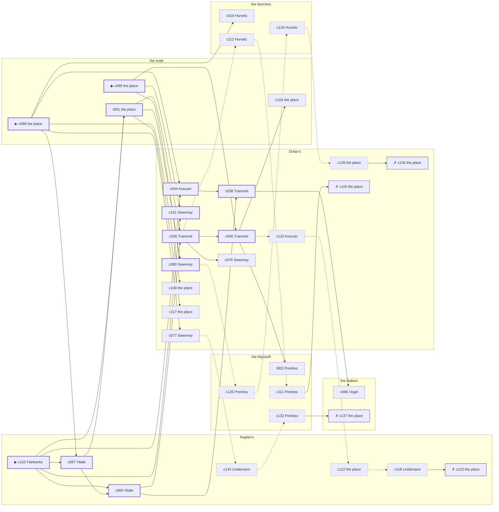

# the Bowery — case 20

**Seed** 20 · **Difficulty** 2 · **Attempts** 1 · **Detective** Dashiell

**Type** murder · **Trope** body-at-scene · **Unknowns** who, why, when

**Par** 11 actions · **Slack** 6 · **Budget** 17 · **Findable** 34 (spine 12, corroboration 8, noise 10 + 4 disqualifiers) · **Noise ratio** 41% · **Candidate pool** 147

## 1. The Truth

Ilse Lindemann, a curb broker, Ashby’s business partner, killed Isaiah Ashby, a union treasurer, with poison in a drink at the suite at 8:00 PM. Lindemann owed Ashby four thousand dollars and was past due on it (debt). Lindemann had been at Dolan’s earlier in the evening, where the means lived, and was alone with Ashby when it happened. Fairbanks hired us.

## 2. The Act

**murder** · **body-at-scene** · actor **Lindemann** · at **the suite** · at **8:00 PM**

- found at the suite
- fate: dead

**Givens** — what the briefing states and the report does not ask:

- Ashby was found dead at the suite.
- Ashby was killed at the suite, and nothing was carried out of the room afterwards.
- The coroner puts it between 7:00 PM and 8:30 PM, which is two hours of nothing useful.
- It was poison in a drink.

**Unknowns** — exactly what the report asks: **who**, **why**, **when**.

## 3. Dramatis Personae

| Name | Role | Relationship | Class of secret | Motive | Found at | Killer |
| --- | --- | --- | --- | --- | --- | --- |
| Isaiah Ashby | a union treasurer | the victim | — | — | — | — |
| Ilse Lindemann | a curb broker | Ashby’s business partner | murder (+ fence) | debt | Kaplan’s | **YES** |
| Prescott Fairbanks (client) | a bookmaker in a small way | in Ashby’s debt | fence | revenge | Kaplan’s | — |
| Isidore Hurwitz | a policy runner | a customer of Ashby’s | dope | — | the benches | — |
| Thaddeus Winslow | a lawyer with one clerk | Ashby’s lawyer | gambling-debt | property | Dolan’s | — |
| Emilio Tramonti | a private secretary | engaged to Ashby’s daughter | blackmail | — | Dolan’s | — |
| Gustav Kreuzer | a hack driver | Ashby’s tenant | fence | — | Dolan’s | — |
| Otto Vogel | the elevator man | fixture (elevator-man) | — | — | the Hallam | — |
| Teresa Vitale | the druggist | fixture (druggist) | — | — | Kaplan’s | — |
| Booker Prentiss | the doorman | fixture (doorman) | — | — | the Wyckoff | — |
| Cornelius Sweeney | the bartender | fixture (bartender) | — | — | Dolan’s | — |

## 4. Dossiers

Every person, by layer: **0** on sight, **1** volunteered, **2** from other people, **3** in the documents.

### Ashby — the victim

45, a man, a union treasurer. Wants: to-be-feared.

- **Standing** — Ashby was the local, as far as the street was concerned.
- **Profession** — Ashby held the local’s books and the local’s cash box.
- **Found** — Fairbanks found Ashby at the suite at 11:30 PM. By Fairbanks, at the suite, at 11:30 PM. Precinct: took-a-statement.

**Layer 0, on sight**

- _gender_ — A man.
- _age_ — In his forties.

**Layer 1, volunteered**

- _profession_ — A union treasurer.
- _detail_ — Ashby held the local’s books and the local’s cash box.

**Layer 2, from other people**

- _tie_ — Ashby was the local, as far as the street was concerned.
- _want_ — Ashby wants to be the one people are careful around.

**Self-account** (layer 1, what they say when asked about themselves)

- Ashby is 45 years old and a union treasurer.
- Ashby held the local’s books and the local’s cash box.
- Ashby is the one this is about.

### Lindemann — the killer

36, a woman, a curb broker. Wants: to-be-somebody. Tie: Ashby’s business partner, going on eight years.

**Layer 0, on sight**

- _gender_ — A woman.
- _age_ — In her thirties.

**Layer 1, volunteered**

- _profession_ — A curb broker.
- _detail_ — Lindemann carries three telephone numbers and no office.

**Layer 2, from other people**

- _tie_ — Lindemann bought into Ashby’s business the year Nunzio Lanza walked out of it.
- _want_ — Lindemann wants a name people know.
- _since_ — Lindemann has been Ashby’s business partner, going on eight years.
- _third_ — Nunzio Lanza is an old friend who once put up the bail.

**Layer 3, in the documents**

- _secret-hint_ — Lindemann was carrying a parcel into Dolan’s and came out without it.

**Self-account** (layer 1, what they say when asked about themselves)

- Lindemann is 36 years old and a curb broker.
- Lindemann carries three telephone numbers and no office.
- Lindemann is Ashby’s business partner.

### Fairbanks — the client

40, a man, a bookmaker in a small way. Wants: money. Tie: in Ashby’s debt, since the flu year.

**Layer 0, on sight**

- _gender_ — A man.
- _age_ — In his forties.

**Layer 1, volunteered**

- _profession_ — A bookmaker in a small way.
- _detail_ — Fairbanks takes bets in a small way out of the back of a cigar store.

**Layer 2, from other people**

- _tie_ — Fairbanks signed a note to Ashby that Bridget Corrigan witnessed and nobody has torn up.
- _want_ — Fairbanks wants money, and is not particular about the shape it arrives in.
- _since_ — Fairbanks has been in Ashby’s debt, since the flu year.
- _third_ — Bridget Corrigan is a daughter who married and moved to Newark.

**Layer 3, in the documents**

- _secret-hint_ — Fairbanks was carrying a parcel into Dolan’s and came out without it.

**Self-account** (layer 1, what they say when asked about themselves)

- Fairbanks is 40 years old and a bookmaker in a small way.
- Fairbanks takes bets in a small way out of the back of a cigar store.
- Fairbanks is in Ashby’s debt.

### Hurwitz

29, a man, a policy runner. Wants: to-get-out. Tie: a customer of Ashby’s, since the shop opened.

**Layer 0, on sight**

- _gender_ — A man.
- _age_ — In the late twenties.

**Layer 1, volunteered**

- _profession_ — A policy runner.
- _detail_ — Hurwitz carries the slips between four corners and a candy store.

**Layer 2, from other people**

- _tie_ — Hurwitz has been on Ashby’s books as a customer since ’24.
- _want_ — Hurwitz wants out of the neighbourhood and has wanted it for years.
- _since_ — Hurwitz has been a customer of Ashby’s, since the shop opened.

**Layer 3, in the documents**

- _secret-hint_ — Hurwitz’s sleeves are buttoned at the wrist in a warm room.

**Self-account** (layer 1, what they say when asked about themselves)

- Hurwitz is 29 years old and a policy runner.
- Hurwitz carries the slips between four corners and a candy store.
- Hurwitz is a customer of Ashby’s.

### Winslow

54, a man, a lawyer with one clerk. Wants: respectability. Tie: Ashby’s lawyer, going back to the war.

**Layer 0, on sight**

- _gender_ — A man.
- _age_ — In his fifties.

**Layer 1, volunteered**

- _profession_ — A lawyer with one clerk.
- _detail_ — Winslow has a list of clients and will not read any of it aloud.

**Layer 2, from other people**

- _tie_ — Winslow keeps Ashby’s will in a box and has read it more often than Ashby did.
- _want_ — Winslow wants to be thought respectable by people who are not.
- _since_ — Winslow has been Ashby’s lawyer, going back to the war.

**Layer 3, in the documents**

- _secret-hint_ — Winslow was asking around for a hundred dollars in a hurry earlier in the week.

**Self-account** (layer 1, what they say when asked about themselves)

- Winslow is 54 years old and a lawyer with one clerk.
- Winslow has a list of clients and will not read any of it aloud.
- Winslow is Ashby’s lawyer.

### Tramonti

37, a man, a private secretary. Wants: money. Tie: engaged to Ashby’s daughter, two years engaged.

**Layer 0, on sight**

- _gender_ — A man.
- _age_ — In his thirties.

**Layer 1, volunteered**

- _profession_ — A private secretary.
- _detail_ — Tramonti takes the dictation and does the banking.

**Layer 2, from other people**

- _tie_ — Tramonti has been engaged to Ashby’s daughter since ’21, with no date set.
- _want_ — Tramonti wants money, and is not particular about the shape it arrives in.
- _since_ — Tramonti has been engaged to Ashby’s daughter, two years engaged.

**Layer 3, in the documents**

- _secret-hint_ — Tramonti and Ashby were heard at the Hallam, and one of them was doing all the talking.

**Self-account** (layer 1, what they say when asked about themselves)

- Tramonti is 37 years old and a private secretary.
- Tramonti takes the dictation and does the banking.
- Tramonti is engaged to Ashby’s daughter.

### Kreuzer

51, a man, a hack driver. Wants: to-be-left-alone. Tie: Ashby’s tenant, four years in the same rooms.

**Layer 0, on sight**

- _gender_ — A man.
- _age_ — In his fifties.
- _profession_ — A hack driver.

**Layer 1, volunteered**

- _detail_ — Kreuzer works the stand outside the hotel from six until the small hours.

**Layer 2, from other people**

- _tie_ — Ashby put Kreuzer’s rent up twice in a year and Kreuzer paid it twice.
- _want_ — Kreuzer wants to be left alone.
- _since_ — Kreuzer has been Ashby’s tenant, four years in the same rooms.

**Layer 3, in the documents**

- _secret-hint_ — Kreuzer was carrying a parcel into Dolan’s and came out without it.

**Self-account** (layer 1, what they say when asked about themselves)

- Kreuzer is 51 years old and a hack driver.
- Kreuzer works the stand outside the hotel from six until the small hours.
- Kreuzer is Ashby’s tenant.

### Vogel

38, a man, the elevator man. Wants: to-be-left-alone. Tie: in the car at the Hallam.

**Layer 0, on sight**

- _gender_ — A man.
- _age_ — In his thirties.
- _profession_ — The elevator man.

**Layer 1, volunteered**

- _detail_ — Vogel has the car at the Hallam from three until eleven.

**Layer 2, from other people**

- _tie_ — Vogel is in the car at the Hallam.
- _want_ — Vogel wants to be left alone.

**Self-account** (layer 1, what they say when asked about themselves)

- Vogel is 38 years old and the elevator man.
- Vogel has the car at the Hallam from three until eleven.
- Vogel is in the car at the Hallam.

### Vitale

37, a woman, the druggist. Wants: money. Tie: behind the counter at Kaplan’s.

**Layer 0, on sight**

- _gender_ — A woman.
- _age_ — In her thirties.
- _profession_ — The druggist.

**Layer 1, volunteered**

- _detail_ — Vitale has had Kaplan’s since before the war and knows what everybody on the block takes.

**Layer 2, from other people**

- _tie_ — Vitale is behind the counter at Kaplan’s.
- _want_ — Vitale wants money, and is not particular about the shape it arrives in.

**Self-account** (layer 1, what they say when asked about themselves)

- Vitale is 37 years old and the druggist.
- Vitale has had Kaplan’s since before the war and knows what everybody on the block takes.
- Vitale is behind the counter at Kaplan’s.

### Prentiss

56, a man, the doorman. Wants: money. Tie: on the door at the Wyckoff.

**Layer 0, on sight**

- _gender_ — A man.
- _age_ — In his fifties.
- _profession_ — The doorman.

**Layer 1, volunteered**

- _detail_ — Prentiss stands the door at the Wyckoff and logs nobody, and forgets nobody.

**Layer 2, from other people**

- _tie_ — Prentiss is on the door at the Wyckoff.
- _want_ — Prentiss wants money, and is not particular about the shape it arrives in.

**Self-account** (layer 1, what they say when asked about themselves)

- Prentiss is 56 years old and the doorman.
- Prentiss stands the door at the Wyckoff and logs nobody, and forgets nobody.
- Prentiss is on the door at the Wyckoff.

### Sweeney

50, a man, the bartender. Wants: to-keep-what-they-have. Tie: behind the bar at Dolan’s, every night of the week.

**Layer 0, on sight**

- _gender_ — A man.
- _age_ — In his fifties.
- _profession_ — The bartender.

**Layer 1, volunteered**

- _detail_ — Sweeney has had the stick at Dolan’s for nine years and remembers what everybody drinks.

**Layer 2, from other people**

- _tie_ — Sweeney is behind the bar at Dolan’s, every night of the week.
- _want_ — Sweeney wants to keep what they have and add nothing to it.

**Self-account** (layer 1, what they say when asked about themselves)

- Sweeney is 50 years old and the bartender.
- Sweeney has had the stick at Dolan’s for nine years and remembers what everybody drinks.
- Sweeney is behind the bar at Dolan’s, every night of the week.

## 5. The Client

**Fairbanks**, in Ashby’s debt. Purpose: **clear-my-name**.

- **Why** — Fairbanks wants it established that it was not them, before anybody says otherwise.
- **What it costs** — Fairbanks was near enough to it that night to know exactly how it looks, and says so first.
- **Points at** — Lindemann: Lindemann owed Ashby four thousand dollars and was past due on it. Honest: **yes**.

**Tells:**

- Ashby was found dead at the suite.
- Ashby was killed at the suite, and nothing was carried out of the room afterwards.
- The coroner puts it between 7:00 PM and 8:30 PM, which is two hours of nothing useful.
- It was poison in a drink.
- Fairbanks would rather we started with Lindemann: Lindemann owed Ashby four thousand dollars and was past due on it.

**Withholds:**

- Fairbanks does not mention it, but Fairbanks hands a parcel of stolen goods to a man at Dolan’s from 7:30 PM to 8:00 PM.

**Their own evening, as they tell it:**

- Fairbanks says he was at Kaplan’s at 6:00 PM.
- Fairbanks says he was at the Wyckoff from 6:30 PM to 8:00 PM.
- Fairbanks says he was at Kaplan’s from 8:30 PM to 10:00 PM.
- Fairbanks says he was at the Wyckoff at 10:30 PM.

## 6. The Briefing

16 plain sentences, derived. This is the model of the plain register: the engine renders it, and Phase 2 measures pages against it.

1. A man came up the stairs after midnight, and sat down.
2. Prescott Fairbanks is 40 years old and a bookmaker in a small way.
3. Fairbanks takes bets in a small way out of the back of a cigar store.
4. Ashby was the local, as far as the street was concerned.
5. Ashby was found dead at the suite.
6. Ashby was killed at the suite, and nothing was carried out of the room afterwards.
7. The coroner puts it between 7:00 PM and 8:30 PM, which is two hours of nothing useful.
8. It was poison in a drink.
9. Fairbanks found Ashby at the suite at 11:30 PM.
10. The precinct took a statement at the desk and filed it.
11. Fairbanks is in Ashby’s debt.
12. Fairbanks signed a note to Ashby that Bridget Corrigan witnessed and nobody has torn up.
13. Fairbanks wants it established that it was not them, before anybody says otherwise.
14. Fairbanks was near enough to it that night to know exactly how it looks, and says so first.
15. Fairbanks wants us to start with Lindemann.
16. Lindemann owed Ashby four thousand dollars and was past due on it.

## 7. Mentions

- **Nunzio Lanza** (m-1) — an old friend who once put up the bail. Nunzio Lanza is an old friend who once put up the bail.
- **Bridget Corrigan** (m-2) — a daughter who married and moved to Newark. Bridget Corrigan is a daughter who married and moved to Newark.

## 8. Places

- **Ashby’s suite at the residential hotel** (private) — unwatched; objects: a camel-hair overcoat on a hook, a silver cigarette case — **THE SCENE**; the victim’s address
- **the benches at the north end of the square** (public) — unwatched; objects: a folded stack of evening papers, a brass umbrella stand — within earshot of the scene
- **the vestibule of the Hallam apartments** (private) — watched by elevator-man (Vogel); objects: the roof-door key, a day ledger, a nickel-plated revolver
- **Kaplan’s drugstore with the soda fountain** (public) — watched by druggist (Vitale); objects: a wall telephone, an ice pick
- **the lobby of the Wyckoff** (semi) — watched by doorman (Prentiss); objects: a bronze bookend — within earshot of the scene
- **Dolan’s Bar** (semi) — watched by bartender (Sweeney); objects: a bottle of chloral drops, a seltzer siphon — where the weapon lived

## 9. Anchors

The coroner gives 7:00 PM–8:30 PM, four ticks wide. These are what close it: **el-train** and **ice-delivery**.

- **the ice being brought in** — at 7:30 PM; at Dolan’s. Somebody reliable notes who was there. Only those present know that the iceman dropped a block on the step and it went in three. Those present carry it: a wet patch down one side of a coat.
- **the El going over** — at 6:00 PM, 7:00 PM, 8:00 PM, 9:00 PM, 10:00 PM, 11:00 PM; across the whole neighbourhood. You can time things by it: everything under the structure stops being audible for twenty seconds.

## 10. Timelines

### Ashby — the victim

| Tick | Time | Truth | Claimed | Companion claimed |
| --- | --- | --- | --- | --- |
| 0 | 6:00 PM | Kaplan’s | Kaplan’s | — |
| 1 | 6:30 PM | the Hallam | the Hallam | — |
| 2 | 7:00 PM | the Hallam | the Hallam | — |
| 3 | 7:30 PM | Dolan’s | Dolan’s | — |
| 4 | 8:00 PM | the suite ☠ | the suite | — |
| 5 | 8:30 PM | — | — | — |
| 6 | 9:00 PM | — | — | — |
| 7 | 9:30 PM | — | — | — |
| 8 | 10:00 PM | — | — | — |
| 9 | 10:30 PM | — | — | — |
| 10 | 11:00 PM | — | — | — |
| 11 | 11:30 PM | — | — | — |

### Lindemann — the killer

| Tick | Time | Truth | Claimed | Companion claimed |
| --- | --- | --- | --- | --- |
| 0 | 6:00 PM | Dolan’s | **the Wyckoff** | — |
| 1 | 6:30 PM | Dolan’s | Dolan’s | — |
| 2 | 7:00 PM | Dolan’s | Dolan’s | — |
| 3 | 7:30 PM | the suite | **the Hallam** | — |
| 4 | 8:00 PM | the suite ☠ | **the Hallam** | — |
| 5 | 8:30 PM | the Wyckoff | the Wyckoff | — |
| 6 | 9:00 PM | the benches | the benches | — |
| 7 | 9:30 PM | the Wyckoff | the Wyckoff | — |
| 8 | 10:00 PM | Kaplan’s | Kaplan’s | — |
| 9 | 10:30 PM | Kaplan’s | Kaplan’s | — |
| 10 | 11:00 PM | Kaplan’s | Kaplan’s | — |
| 11 | 11:30 PM | Kaplan’s | Kaplan’s | — |

### Fairbanks

| Tick | Time | Truth | Claimed | Companion claimed |
| --- | --- | --- | --- | --- |
| 0 | 6:00 PM | Kaplan’s | Kaplan’s | — |
| 1 | 6:30 PM | the Wyckoff | the Wyckoff | — |
| 2 | 7:00 PM | the Wyckoff | the Wyckoff | — |
| 3 | 7:30 PM | Dolan’s | **the Wyckoff** | — |
| 4 | 8:00 PM | Dolan’s | **the Wyckoff** | — |
| 5 | 8:30 PM | Kaplan’s | Kaplan’s | — |
| 6 | 9:00 PM | Kaplan’s | Kaplan’s | — |
| 7 | 9:30 PM | Kaplan’s | Kaplan’s | — |
| 8 | 10:00 PM | Kaplan’s | Kaplan’s | — |
| 9 | 10:30 PM | the Wyckoff | the Wyckoff | — |
| 10 | 11:00 PM | the benches | the benches | — |
| 11 | 11:30 PM | the suite | the suite | — |

### Hurwitz

| Tick | Time | Truth | Claimed | Companion claimed |
| --- | --- | --- | --- | --- |
| 0 | 6:00 PM | Kaplan’s | Kaplan’s | — |
| 1 | 6:30 PM | Kaplan’s | Kaplan’s | — |
| 2 | 7:00 PM | Dolan’s | Dolan’s | — |
| 3 | 7:30 PM | the benches | the benches | — |
| 4 | 8:00 PM | Dolan’s | Dolan’s | — |
| 5 | 8:30 PM | the benches | the benches | — |
| 6 | 9:00 PM | the benches | the benches | — |
| 7 | 9:30 PM | the benches | the benches | — |
| 8 | 10:00 PM | Kaplan’s | **Dolan’s** | — |
| 9 | 10:30 PM | Kaplan’s | Kaplan’s | — |
| 10 | 11:00 PM | the benches | the benches | — |
| 11 | 11:30 PM | the benches | the benches | — |

### Winslow

| Tick | Time | Truth | Claimed | Companion claimed |
| --- | --- | --- | --- | --- |
| 0 | 6:00 PM | the benches | the benches | — |
| 1 | 6:30 PM | the benches | the benches | — |
| 2 | 7:00 PM | the benches | the benches | — |
| 3 | 7:30 PM | Kaplan’s | Kaplan’s | — |
| 4 | 8:00 PM | Dolan’s | **the benches** | Hurwitz |
| 5 | 8:30 PM | Dolan’s | **the benches** | Hurwitz |
| 6 | 9:00 PM | Dolan’s | Dolan’s | — |
| 7 | 9:30 PM | Dolan’s | Dolan’s | — |
| 8 | 10:00 PM | the Wyckoff | the Wyckoff | — |
| 9 | 10:30 PM | the Wyckoff | the Wyckoff | — |
| 10 | 11:00 PM | the Wyckoff | the Wyckoff | — |
| 11 | 11:30 PM | the Wyckoff | the Wyckoff | — |

### Tramonti

| Tick | Time | Truth | Claimed | Companion claimed |
| --- | --- | --- | --- | --- |
| 0 | 6:00 PM | Dolan’s | Dolan’s | — |
| 1 | 6:30 PM | the Hallam | **the Wyckoff** | — |
| 2 | 7:00 PM | the Hallam | the Hallam | — |
| 3 | 7:30 PM | the Hallam | the Hallam | — |
| 4 | 8:00 PM | Dolan’s | Dolan’s | — |
| 5 | 8:30 PM | Dolan’s | Dolan’s | — |
| 6 | 9:00 PM | Dolan’s | Dolan’s | — |
| 7 | 9:30 PM | Dolan’s | Dolan’s | — |
| 8 | 10:00 PM | Kaplan’s | Kaplan’s | — |
| 9 | 10:30 PM | the Wyckoff | the Wyckoff | — |
| 10 | 11:00 PM | the Wyckoff | the Wyckoff | — |
| 11 | 11:30 PM | the Wyckoff | the Wyckoff | — |

### Kreuzer

| Tick | Time | Truth | Claimed | Companion claimed |
| --- | --- | --- | --- | --- |
| 0 | 6:00 PM | Kaplan’s | Kaplan’s | — |
| 1 | 6:30 PM | Dolan’s | Dolan’s | — |
| 2 | 7:00 PM | the Wyckoff | the Wyckoff | — |
| 3 | 7:30 PM | the Wyckoff | the Wyckoff | — |
| 4 | 8:00 PM | the Hallam | the Hallam | — |
| 5 | 8:30 PM | the Hallam | the Hallam | — |
| 6 | 9:00 PM | Dolan’s | **Kaplan’s** | Lindemann |
| 7 | 9:30 PM | Dolan’s | **Kaplan’s** | Lindemann |
| 8 | 10:00 PM | Dolan’s | Dolan’s | — |
| 9 | 10:30 PM | the Hallam | the Hallam | — |
| 10 | 11:00 PM | the Hallam | the Hallam | — |
| 11 | 11:30 PM | the benches | the benches | — |

### Fixtures (never lie, never withhold)

| Tick | Time | Vogel (the elevator man) | Vitale (the druggist) | Prentiss (the doorman) | Sweeney (the bartender) |
| --- | --- | --- | --- | --- | --- |
| 0 | 6:00 PM | the Hallam | Kaplan’s | the Wyckoff | Dolan’s |
| 1 | 6:30 PM | the Hallam | Kaplan’s | the Wyckoff | Dolan’s |
| 2 | 7:00 PM | Dolan’s | Kaplan’s | the Wyckoff | Dolan’s |
| 3 | 7:30 PM | the Hallam | Kaplan’s | the Wyckoff | Dolan’s |
| 4 | 8:00 PM | the Hallam | the Hallam | the Wyckoff | Dolan’s |
| 5 | 8:30 PM | the Hallam | Kaplan’s | the Wyckoff | Dolan’s |
| 6 | 9:00 PM | the Hallam | Kaplan’s | the Wyckoff | Dolan’s |
| 7 | 9:30 PM | the Hallam | Kaplan’s | the Wyckoff | Dolan’s |
| 8 | 10:00 PM | the Hallam | Kaplan’s | the Wyckoff | Dolan’s |
| 9 | 10:30 PM | the Hallam | Kaplan’s | the Wyckoff | Dolan’s |
| 10 | 11:00 PM | the Hallam | Kaplan’s | the Wyckoff | Dolan’s |
| 11 | 11:30 PM | the Hallam | Kaplan’s | the Wyckoff | Dolan’s |

## 11. Secrets in play

- **Lindemann** (murder): Lindemann is at the suite from 7:30 PM to 8:00 PM, alone with Ashby when it happens at 8:00 PM.
- **Lindemann** also (fence): Lindemann hands a parcel of stolen goods to a man at Dolan’s from 6:00 PM.
- **Fairbanks** (fence): Fairbanks hands a parcel of stolen goods to a man at Dolan’s from 7:30 PM to 8:00 PM.
- **Hurwitz** (dope): Hurwitz buys morphine at Kaplan’s from 10:00 PM and would rather be thought a murderer than a hop-head.
- **Winslow** (gambling-debt): Winslow slips off to Dolan’s from 8:00 PM to 8:30 PM to settle with a bookmaker.
- **Tramonti** (blackmail): Tramonti meets Ashby alone at the Hallam from 6:30 PM and asks for money.
- **Kreuzer** (fence): Kreuzer hands a parcel of stolen goods to a man at Dolan’s from 9:00 PM to 9:30 PM.

## 12. Clue list — the 34 findable

The opening three, free at the start: c098, c099, c110. Everything else has to be led to. The full candidate pool is in the companion file.

### At the suite

- **c098** [spine ⟨opening⟩] (scene; the place itself) → c087, c044, c018, c100, c077
  - Ashby was found at the suite. A glass is on its side and the spill had not yet reached the edge of the table when it dried. The El went over at 8:00 PM, running to timetable, and for twenty seconds nothing under the structure can be heard at all.
  - _establishes: the victim dead by 8:00 PM; how it was done_
- **c099** [spine ⟨opening⟩] (morgue; the place itself) → c040, c101, c080
  - The coroner puts death between 7:00 PM and 8:30 PM — two hours of nothing useful. Chloral hydrate in the stomach. No wound, no bruising, no sign of a struggle.
  - _establishes: death between 7:00 PM and 8:30 PM; how it was done_
- **t001** [spine] (physical; the place itself) → c035, c080, c117
  - The rug at the suite is rucked up under Ashby and the chair beside it went over backwards. Nothing was carried out of the room.
  - _establishes: Ashby at the suite, 8:00 PM_
- **c104** [corroboration] (document; the place itself) → (end)
  - Found at the suite: A promissory note for $4,000 signed by Lindemann, endorsed to Ashby, three months past due.
  - _establishes: Lindemann had a motive (debt)_

### At the benches

- **c018** [corroboration] (observation; Hurwitz on Lindemann) → (end)
  - Hurwitz says Lindemann was at Dolan’s at 7:00 PM.
  - _establishes: Lindemann at Dolan’s, 7:00 PM; Lindemann could reach the weapon_
- **c126** [noise {b2}] (overheard; Hurwitz on Winslow) → c128
  - Hurwitz on Winslow: A man nobody knew was waiting for Winslow at Dolan’s and would not give a name.
  - _establishes: context only_
- **c112** [noise {b4}] (overheard; Hurwitz on Fairbanks) → c111
  - Hurwitz on Fairbanks: There is a man who meets people at Dolan’s and nobody will say his name out loud.
  - _establishes: context only_

### At the Hallam

- **c086** [corroboration] (observation; Vogel on Lindemann’s account) → (end)
  - Vogel was at the Hallam from 7:30 PM to 8:00 PM and says Lindemann was not.
  - _establishes: Lindemann not at the Hallam, 7:30 PM–8:00 PM_
- **c137** [disqualifier {b3}] (overheard; the place itself) → (end)
  - Ashby’s bank book settles it: four payments, and Tramonti at the Hallam from 6:30 PM collecting the fifth. It is extortion, and an extortionist wants Ashby alive.
  - _establishes: Tramonti’s blackmail accounted for; Tramonti at the Hallam, 6:30 PM_

### At Kaplan’s

- **c110** [spine ⟨opening⟩] (client; Fairbanks on why I was hired) → c087, c065, t001, c101, c044
  - Fairbanks hired us, and wants it known that Lindemann owed Ashby four thousand dollars and was past due on it, and would rather we started there.
  - _establishes: Lindemann had a motive (debt)_
- **c087** [spine] (observation; Vitale on Lindemann’s account) → c065, t001
  - Vitale was at the Hallam at 8:00 PM and says Lindemann was not.
  - _establishes: Lindemann not at the Hallam, 8:00 PM_
- **c065** [spine] (observation; Vitale on Kreuzer) → c035, c038
  - Vitale says Kreuzer was at the Hallam at 8:00 PM.
  - _establishes: Kreuzer at the Hallam, 8:00 PM_
- **c122** [noise {b1}] (physical; the place itself) → c118
  - A prescription blank at Kaplan’s signed by a doctor who has been dead since the spring.
  - _establishes: context only_
- **c118** [noise {b1}] (overheard; Lindemann on Hurwitz) → c123
  - Lindemann on Hurwitz: Hurwitz’s sleeves are buttoned at the wrist in a warm room.
  - _establishes: context only_
- **c123** [disqualifier {b1}] (overheard; the place itself) → (end)
  - The man who sells it at Kaplan’s gives it up rather than be held: Hurwitz was there from 10:00 PM, and stayed until it took hold.
  - _establishes: Hurwitz’s dope accounted for; Hurwitz at Kaplan’s, 10:00 PM_
- **c134** [noise {b3}] (overheard; Lindemann on Tramonti) → c133
  - Lindemann on Tramonti: Ashby had been drawing cash in amounts that did not match anything in the accounts.
  - _establishes: context only_

### At the Wyckoff

- **t002** [corroboration] (overheard; Prentiss on the suite that evening) → (end)
  - Prentiss says the door at the suite was shut from 8:00 PM on, and nobody came out of it carrying anything.
  - _establishes: Ashby at the suite, 8:00 PM_
- **c125** [noise {b2}] (overheard; Prentiss on Winslow) → c126
  - Prentiss on Winslow: Winslow was asking around for a hundred dollars in a hurry earlier in the week.
  - _establishes: context only_
- **c133** [noise {b3}] (overheard; Prentiss on Tramonti) → c137
  - Prentiss on Tramonti: Tramonti has come into money lately and has no visible way of having come into money.
  - _establishes: context only_
- **c111** [noise {b4}] (overheard; Prentiss on Fairbanks) → c116
  - Prentiss on Fairbanks: Fairbanks was carrying a parcel into Dolan’s and came out without it.
  - _establishes: context only_

### At Dolan’s

- **c035** [spine] (observation; Tramonti on Fairbanks) → c040, c076, c112
  - Tramonti says Fairbanks was at Dolan’s at 8:00 PM.
  - _establishes: Fairbanks at Dolan’s, 8:00 PM_
- **c040** [spine] (observation; Tramonti on Winslow) → t002, c104, c120
  - Tramonti says Winslow was at Dolan’s from 8:00 PM to 9:30 PM.
  - _establishes: Winslow at Dolan’s, 8:00 PM–9:30 PM_
- **c101** [spine] (anchor; Sweeney on Ashby that evening) → (end)
  - Sweeney puts Ashby at Dolan’s when the ice came, which was 7:30 PM, and alive enough to argue about the weather.
  - _establishes: the victim alive at 7:30 PM; Ashby at Dolan’s, 7:30 PM_
- **c044** [spine] (observation; Kreuzer on Lindemann) → c038
  - Kreuzer says Lindemann was at Dolan’s at 6:30 PM.
  - _establishes: Lindemann at Dolan’s, 6:30 PM; Lindemann could reach the weapon_
- **c038** [spine] (observation; Tramonti on Hurwitz) → c086
  - Tramonti says Hurwitz was at Dolan’s at 8:00 PM.
  - _establishes: Hurwitz at Dolan’s, 8:00 PM_
- **c080** [spine] (observation; Sweeney on Tramonti) → c125
  - Sweeney says Tramonti was at Dolan’s from 8:00 PM to 9:30 PM.
  - _establishes: Tramonti at Dolan’s, 8:00 PM–9:30 PM_
- **c100** [corroboration] (physical; the place itself) → (end)
  - A bottle of chloral drops is gone from Dolan’s. The bottle is gone from the shelf and the ring of dust it stood in is still there.
  - _establishes: something gone from Dolan’s; how it was done_
- **c076** [corroboration] (observation; Sweeney on Hurwitz) → (end)
  - Sweeney says Hurwitz was at Dolan’s at 7:00 PM.
  - _establishes: Hurwitz at Dolan’s, 7:00 PM; Hurwitz could reach the weapon_
- **c117** [corroboration] (overheard; the place itself) → (end)
  - The goods turn up, tagged and dated, and the tag puts Fairbanks at Dolan’s from 7:30 PM to 8:00 PM with both hands full.
  - _establishes: Fairbanks’s fence accounted for; Fairbanks at Dolan’s, 7:30 PM–8:00 PM_
- **c077** [corroboration] (observation; Sweeney on Hurwitz) → c134
  - Sweeney says Hurwitz was at Dolan’s at 8:00 PM.
  - _establishes: Hurwitz at Dolan’s, 8:00 PM_
- **c120** [noise {b1}] (overheard; Kreuzer on Hurwitz) → c122
  - Kreuzer on Hurwitz: Hurwitz was steady at nine and shaking at seven, and it was not nerves about the police.
  - _establishes: context only_
- **c128** [noise {b2}] (physical; the place itself) → c130
  - Betting slips at Dolan’s in Winslow’s pocketbook, all of them losers, all of them this month.
  - _establishes: context only_
- **c130** [disqualifier {b2}] (overheard; the place itself) → (end)
  - The bookmaker’s runner is found and will say it: Winslow was at Dolan’s from 8:00 PM to 8:30 PM paying off eleven hundred dollars, a dollar at a time, and went nowhere near the killing.
  - _establishes: Winslow’s gambling-debt accounted for; Winslow at Dolan’s, 8:00 PM–8:30 PM_
- **c116** [disqualifier {b4}] (overheard; the place itself) → (end)
  - The receiver at Dolan’s would rather talk than be held: Fairbanks was there from 7:30 PM to 8:00 PM handing over a parcel of somebody else’s silver, which is a charge Fairbanks will take over this one.
  - _establishes: Fairbanks’s fence accounted for; Fairbanks at Dolan’s, 7:30 PM–8:00 PM_

## 13. Clue graph

## 14. Deduction path

Par is **11 actions** and the budget is par plus 6: **17**. Every id below is a spine clue; the inference is the sheet’s, not the clue’s.

**Time of death.** The coroner gives four ticks. The anchors close it to 8:00 PM: one puts Ashby alive at 7:30 PM, the other times the scene at 8:00 PM. _(c099, c101, c098)_

**Clearing the innocent.**

- Fairbanks was not at the suite at 8:00 PM. _(c035; + 2 corroborating)_
- Hurwitz was not at the suite at 8:00 PM. _(c038; + 1 corroborating)_
- Winslow was not at the suite at 8:00 PM. _(c040; + 1 corroborating)_
- Tramonti was not at the suite at 8:00 PM. _(c080)_
- Kreuzer was not at the suite at 8:00 PM. _(c065)_

**Naming the killer.** Lindemann claims the Hallam at 8:00 PM. Two independent sources put that out of the question. _(c087; + 1 corroborating)_

**The weapon.** Lindemann was at Dolan’s before 8:00 PM, where a bottle of chloral drops was kept. _(c044; + 1 corroborating)_

**Method.** Poison in a drink, on two physical sources. _(c098, c099; + 1 corroborating)_

**Motive.** debt, on two independent sources. _(c110; + 1 corroborating)_

## 15. Red herrings

**Innocents who lie about the murder tick:**

- Fairbanks claims the Wyckoff at 8:00 PM and was really at Dolan’s. Reason: Fairbanks hands a parcel of stolen goods to a man at Dolan’s from 7:30 PM to 8:00 PM.
- Winslow claims the benches at 8:00 PM and was really at Dolan’s. Reason: Winslow slips off to Dolan’s from 8:00 PM to 8:30 PM to settle with a bookmaker.

**Innocents with a motive:**

- Fairbanks — revenge: blamed Ashby for the ruin of Fairbanks’s business.
- Winslow — property: wanted Ashby out of the lease and the lease in Winslow’s name.

**Noise branches, and what knocks each one down:**

- **b1** (Hurwitz, dope): c120 → c122 → c118 → **c123** — The man who sells it at Kaplan’s gives it up rather than be held: Hurwitz was there from 10:00 PM, and stayed until it took hold.
- **b2** (Winslow, gambling-debt): c125 → c126 → c128 → **c130** — The bookmaker’s runner is found and will say it: Winslow was at Dolan’s from 8:00 PM to 8:30 PM paying off eleven hundred dollars, a dollar at a time, and went nowhere near the killing.
- **b3** (Tramonti, blackmail): c134 → c133 → **c137** — Ashby’s bank book settles it: four payments, and Tramonti at the Hallam from 6:30 PM collecting the fifth. It is extortion, and an extortionist wants Ashby alive.
- **b4** (Fairbanks, fence): c112 → c111 → **c116** — The receiver at Dolan’s would rather talk than be held: Fairbanks was there from 7:30 PM to 8:00 PM handing over a parcel of somebody else’s silver, which is a charge Fairbanks will take over this one.

