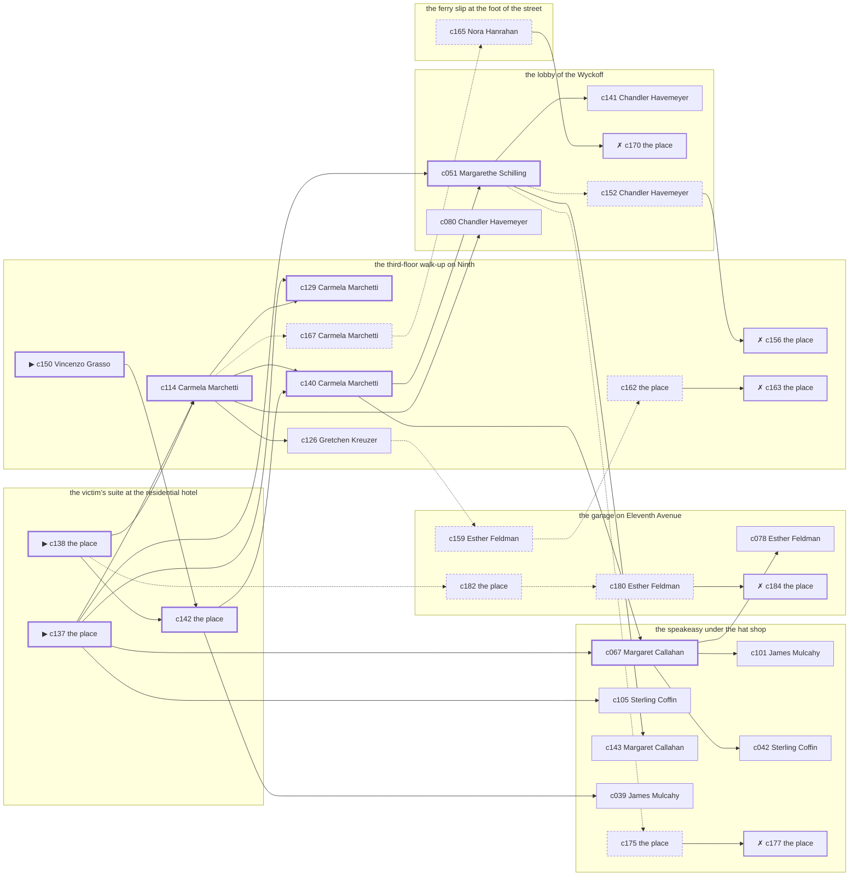

# the Lower East Side — case 3

**Seed** 3 · **Difficulty** 2 · **Attempts** 1 · **Detective** Humphrey

**Par** 9 actions · **Budget** 20 · **Slack** 11 · **Findable** 31 (spine 9, corroboration 9, noise 8 + 5 disqualifiers) · **Noise ratio** 42% · **Candidate pool** 185

## 1. The Truth

Vincenzo Grasso, a longshoreman, the victim’s tenant, killed Martin Sweeney, a bootlegger with the lease on the top floor, with a blunt object at the victim’s suite at the residential hotel at 8:30 PM. Vincenzo Grasso blamed the victim for a ruin (revenge). Vincenzo Grasso had been at the lobby of the Wyckoff earlier in the evening, where the weapon lived, and was alone with Martin Sweeney when it happened. Vincenzo Grasso is also the client: the killer hired us.

## 2. Dramatis Personae

| Name | Role | Relationship | Class of secret | Motive | Found at | Killer |
| --- | --- | --- | --- | --- | --- | --- |
| Martin Sweeney | a bootlegger with the lease on the top floor | the victim | — | — | — | — |
| Vincenzo Grasso (client) | a longshoreman | the victim’s tenant | murder | revenge | the third-floor walk-up on Ninth | **YES** |
| Gretchen Kreuzer | a pawnbroker’s man | a customer of the victim’s | forged-identity | debt | the third-floor walk-up on Ninth | — |
| Nora Hanrahan | a private secretary | the victim’s secretary | embezzling | — | the ferry slip at the foot of the street | — |
| James Mulcahy | a society columnist | the victim’s neighbour across the airshaft | blackmail | — | the speakeasy under the hat shop | — |
| Sterling Coffin | a doorman at a club with no sign on it | a witness against the people the victim worked for | fence | silence-a-witness | the speakeasy under the hat shop | — |
| Margarethe Schilling | a chambermaid | the victim’s former employee | fence | exposure | the lobby of the Wyckoff | — |
| Margaret Callahan | the bartender | fixture (bartender) | — | — | the speakeasy under the hat shop | — |
| Carmela Marchetti | the landlady | fixture (landlady) | — | — | the third-floor walk-up on Ninth | — |
| Esther Feldman | the man behind the counter | fixture (counterman) | — | — | the garage on Eleventh Avenue | — |
| Chandler Havemeyer | the doorman | fixture (doorman) | — | — | the lobby of the Wyckoff | — |

## 3. Places

- **the ferry slip at the foot of the street** (public) — unwatched; objects: a strapped suitcase, a folded stack of evening papers, a pasted-up timetable — within earshot of the scene
- **the speakeasy under the hat shop** (semi) — watched by bartender (Margaret Callahan); objects: a silver cigarette case, a bottle of chloral drops
- **the third-floor walk-up on Ninth** (private) — watched by landlady (Carmela Marchetti); objects: the roof-door key, a length of sash cord, a stack of hatboxes
- **the victim’s suite at the residential hotel** (private) — unwatched; objects: a day ledger, a nickel-plated revolver — **THE SCENE**; the victim’s address
- **the garage on Eleventh Avenue** (semi) — watched by counterman (Esther Feldman); objects: a mechanic’s toolbox, an ice pick
- **the lobby of the Wyckoff** (semi) — watched by doorman (Chandler Havemeyer); objects: a bronze bookend, a camel-hair overcoat on a hook, a brass umbrella stand — where the weapon lived; within earshot of the scene

## 4. Anchors

The coroner gives 8:30 PM–10:00 PM, four ticks wide. These are what close it: **el-train** and **piano-lesson**.

- **the piano lesson on the floor above** — at 8:00 PM; at the third-floor walk-up on Ninth. You can time things by it: the same four bars, over and over, and then nothing. Only those present know that the child never did get the passage right.
- **the El going over** — at 6:30 PM, 7:30 PM, 8:30 PM, 9:30 PM, 10:30 PM, 11:30 PM; across the whole neighbourhood. You can time things by it: everything under the structure stops being audible for twenty seconds.

## 5. Timelines

### Martin Sweeney — the victim

| Tick | Time | Truth | Claimed | Companion claimed |
| --- | --- | --- | --- | --- |
| 0 | 6:00 PM | the third-floor walk-up on Ninth | the third-floor walk-up on Ninth | — |
| 1 | 6:30 PM | the third-floor walk-up on Ninth | the third-floor walk-up on Ninth | — |
| 2 | 7:00 PM | the lobby of the Wyckoff | the lobby of the Wyckoff | — |
| 3 | 7:30 PM | the lobby of the Wyckoff | the lobby of the Wyckoff | — |
| 4 | 8:00 PM | the third-floor walk-up on Ninth | the third-floor walk-up on Ninth | — |
| 5 | 8:30 PM | the victim’s suite at the residential hotel ☠ | the victim’s suite at the residential hotel | — |
| 6 | 9:00 PM | — | — | — |
| 7 | 9:30 PM | — | — | — |
| 8 | 10:00 PM | — | — | — |
| 9 | 10:30 PM | — | — | — |
| 10 | 11:00 PM | — | — | — |
| 11 | 11:30 PM | — | — | — |

### Vincenzo Grasso — the killer

| Tick | Time | Truth | Claimed | Companion claimed |
| --- | --- | --- | --- | --- |
| 0 | 6:00 PM | the lobby of the Wyckoff | the lobby of the Wyckoff | — |
| 1 | 6:30 PM | the lobby of the Wyckoff | the lobby of the Wyckoff | — |
| 2 | 7:00 PM | the lobby of the Wyckoff | the lobby of the Wyckoff | — |
| 3 | 7:30 PM | the speakeasy under the hat shop | the speakeasy under the hat shop | — |
| 4 | 8:00 PM | the speakeasy under the hat shop | the speakeasy under the hat shop | — |
| 5 | 8:30 PM | the victim’s suite at the residential hotel ☠ | **the third-floor walk-up on Ninth** | — |
| 6 | 9:00 PM | the third-floor walk-up on Ninth | the third-floor walk-up on Ninth | — |
| 7 | 9:30 PM | the third-floor walk-up on Ninth | the third-floor walk-up on Ninth | — |
| 8 | 10:00 PM | the third-floor walk-up on Ninth | the third-floor walk-up on Ninth | — |
| 9 | 10:30 PM | the third-floor walk-up on Ninth | the third-floor walk-up on Ninth | — |
| 10 | 11:00 PM | the third-floor walk-up on Ninth | the third-floor walk-up on Ninth | — |
| 11 | 11:30 PM | the ferry slip at the foot of the street | the ferry slip at the foot of the street | — |

### Gretchen Kreuzer

| Tick | Time | Truth | Claimed | Companion claimed |
| --- | --- | --- | --- | --- |
| 0 | 6:00 PM | the victim’s suite at the residential hotel | the victim’s suite at the residential hotel | — |
| 1 | 6:30 PM | the victim’s suite at the residential hotel | the victim’s suite at the residential hotel | — |
| 2 | 7:00 PM | the speakeasy under the hat shop | the speakeasy under the hat shop | — |
| 3 | 7:30 PM | the ferry slip at the foot of the street | the ferry slip at the foot of the street | — |
| 4 | 8:00 PM | the speakeasy under the hat shop | the speakeasy under the hat shop | — |
| 5 | 8:30 PM | the third-floor walk-up on Ninth | the third-floor walk-up on Ninth | — |
| 6 | 9:00 PM | the third-floor walk-up on Ninth | the third-floor walk-up on Ninth | — |
| 7 | 9:30 PM | the third-floor walk-up on Ninth | the third-floor walk-up on Ninth | — |
| 8 | 10:00 PM | the third-floor walk-up on Ninth | the third-floor walk-up on Ninth | — |
| 9 | 10:30 PM | the third-floor walk-up on Ninth | the third-floor walk-up on Ninth | — |
| 10 | 11:00 PM | the third-floor walk-up on Ninth | the third-floor walk-up on Ninth | — |
| 11 | 11:30 PM | the third-floor walk-up on Ninth | the third-floor walk-up on Ninth | — |

### Nora Hanrahan

| Tick | Time | Truth | Claimed | Companion claimed |
| --- | --- | --- | --- | --- |
| 0 | 6:00 PM | the garage on Eleventh Avenue | the garage on Eleventh Avenue | — |
| 1 | 6:30 PM | the ferry slip at the foot of the street | the ferry slip at the foot of the street | — |
| 2 | 7:00 PM | the speakeasy under the hat shop | the speakeasy under the hat shop | — |
| 3 | 7:30 PM | the ferry slip at the foot of the street | the ferry slip at the foot of the street | — |
| 4 | 8:00 PM | the garage on Eleventh Avenue | the garage on Eleventh Avenue | — |
| 5 | 8:30 PM | the third-floor walk-up on Ninth | **the lobby of the Wyckoff** | — |
| 6 | 9:00 PM | the third-floor walk-up on Ninth | the third-floor walk-up on Ninth | — |
| 7 | 9:30 PM | the third-floor walk-up on Ninth | the third-floor walk-up on Ninth | — |
| 8 | 10:00 PM | the ferry slip at the foot of the street | the ferry slip at the foot of the street | — |
| 9 | 10:30 PM | the ferry slip at the foot of the street | the ferry slip at the foot of the street | — |
| 10 | 11:00 PM | the ferry slip at the foot of the street | the ferry slip at the foot of the street | — |
| 11 | 11:30 PM | the ferry slip at the foot of the street | the ferry slip at the foot of the street | — |

### James Mulcahy

| Tick | Time | Truth | Claimed | Companion claimed |
| --- | --- | --- | --- | --- |
| 0 | 6:00 PM | the garage on Eleventh Avenue | the garage on Eleventh Avenue | — |
| 1 | 6:30 PM | the lobby of the Wyckoff | the lobby of the Wyckoff | — |
| 2 | 7:00 PM | the lobby of the Wyckoff | **the third-floor walk-up on Ninth** | Margarethe Schilling |
| 3 | 7:30 PM | the speakeasy under the hat shop | the speakeasy under the hat shop | — |
| 4 | 8:00 PM | the speakeasy under the hat shop | the speakeasy under the hat shop | — |
| 5 | 8:30 PM | the third-floor walk-up on Ninth | the third-floor walk-up on Ninth | — |
| 6 | 9:00 PM | the third-floor walk-up on Ninth | the third-floor walk-up on Ninth | — |
| 7 | 9:30 PM | the third-floor walk-up on Ninth | the third-floor walk-up on Ninth | — |
| 8 | 10:00 PM | the lobby of the Wyckoff | the lobby of the Wyckoff | — |
| 9 | 10:30 PM | the speakeasy under the hat shop | the speakeasy under the hat shop | — |
| 10 | 11:00 PM | the speakeasy under the hat shop | the speakeasy under the hat shop | — |
| 11 | 11:30 PM | the speakeasy under the hat shop | the speakeasy under the hat shop | — |

### Sterling Coffin

| Tick | Time | Truth | Claimed | Companion claimed |
| --- | --- | --- | --- | --- |
| 0 | 6:00 PM | the speakeasy under the hat shop | the speakeasy under the hat shop | — |
| 1 | 6:30 PM | the speakeasy under the hat shop | the speakeasy under the hat shop | — |
| 2 | 7:00 PM | the lobby of the Wyckoff | the lobby of the Wyckoff | — |
| 3 | 7:30 PM | the lobby of the Wyckoff | the lobby of the Wyckoff | — |
| 4 | 8:00 PM | the lobby of the Wyckoff | the lobby of the Wyckoff | — |
| 5 | 8:30 PM | the third-floor walk-up on Ninth | the third-floor walk-up on Ninth | — |
| 6 | 9:00 PM | the ferry slip at the foot of the street | the ferry slip at the foot of the street | — |
| 7 | 9:30 PM | the speakeasy under the hat shop | **the garage on Eleventh Avenue** | Nora Hanrahan |
| 8 | 10:00 PM | the ferry slip at the foot of the street | the ferry slip at the foot of the street | — |
| 9 | 10:30 PM | the ferry slip at the foot of the street | the ferry slip at the foot of the street | — |
| 10 | 11:00 PM | the speakeasy under the hat shop | the speakeasy under the hat shop | — |
| 11 | 11:30 PM | the speakeasy under the hat shop | the speakeasy under the hat shop | — |

### Margarethe Schilling

| Tick | Time | Truth | Claimed | Companion claimed |
| --- | --- | --- | --- | --- |
| 0 | 6:00 PM | the lobby of the Wyckoff | the lobby of the Wyckoff | — |
| 1 | 6:30 PM | the lobby of the Wyckoff | the lobby of the Wyckoff | — |
| 2 | 7:00 PM | the lobby of the Wyckoff | the lobby of the Wyckoff | — |
| 3 | 7:30 PM | the garage on Eleventh Avenue | the garage on Eleventh Avenue | — |
| 4 | 8:00 PM | the garage on Eleventh Avenue | the garage on Eleventh Avenue | — |
| 5 | 8:30 PM | the garage on Eleventh Avenue | **the lobby of the Wyckoff** | — |
| 6 | 9:00 PM | the garage on Eleventh Avenue | the garage on Eleventh Avenue | — |
| 7 | 9:30 PM | the garage on Eleventh Avenue | the garage on Eleventh Avenue | — |
| 8 | 10:00 PM | the lobby of the Wyckoff | the lobby of the Wyckoff | — |
| 9 | 10:30 PM | the lobby of the Wyckoff | the lobby of the Wyckoff | — |
| 10 | 11:00 PM | the lobby of the Wyckoff | the lobby of the Wyckoff | — |
| 11 | 11:30 PM | the ferry slip at the foot of the street | the ferry slip at the foot of the street | — |

### Fixtures (never lie, never withhold)

| Tick | Time | Margaret Callahan (the bartender) | Carmela Marchetti (the landlady) | Esther Feldman (the man behind the counter) | Chandler Havemeyer (the doorman) |
| --- | --- | --- | --- | --- | --- |
| 0 | 6:00 PM | the speakeasy under the hat shop | the third-floor walk-up on Ninth | the garage on Eleventh Avenue | the lobby of the Wyckoff |
| 1 | 6:30 PM | the speakeasy under the hat shop | the third-floor walk-up on Ninth | the garage on Eleventh Avenue | the lobby of the Wyckoff |
| 2 | 7:00 PM | the speakeasy under the hat shop | the third-floor walk-up on Ninth | the garage on Eleventh Avenue | the lobby of the Wyckoff |
| 3 | 7:30 PM | the speakeasy under the hat shop | the third-floor walk-up on Ninth | the garage on Eleventh Avenue | the lobby of the Wyckoff |
| 4 | 8:00 PM | the speakeasy under the hat shop | the third-floor walk-up on Ninth | the garage on Eleventh Avenue | the lobby of the Wyckoff |
| 5 | 8:30 PM | the garage on Eleventh Avenue | the third-floor walk-up on Ninth | the garage on Eleventh Avenue | the lobby of the Wyckoff |
| 6 | 9:00 PM | the speakeasy under the hat shop | the third-floor walk-up on Ninth | the garage on Eleventh Avenue | the lobby of the Wyckoff |
| 7 | 9:30 PM | the speakeasy under the hat shop | the third-floor walk-up on Ninth | the garage on Eleventh Avenue | the lobby of the Wyckoff |
| 8 | 10:00 PM | the speakeasy under the hat shop | the third-floor walk-up on Ninth | the garage on Eleventh Avenue | the lobby of the Wyckoff |
| 9 | 10:30 PM | the speakeasy under the hat shop | the third-floor walk-up on Ninth | the garage on Eleventh Avenue | the lobby of the Wyckoff |
| 10 | 11:00 PM | the speakeasy under the hat shop | the third-floor walk-up on Ninth | the garage on Eleventh Avenue | the lobby of the Wyckoff |
| 11 | 11:30 PM | the speakeasy under the hat shop | the third-floor walk-up on Ninth | the garage on Eleventh Avenue | the lobby of the Wyckoff |

## 6. Secrets in play

- **Vincenzo Grasso** (murder): Vincenzo Grasso is at the victim’s suite at the residential hotel from 8:30 PM, alone with Martin Sweeney when it happens at 8:30 PM.
- **Gretchen Kreuzer** (forged-identity): Gretchen Kreuzer is not the person the papers say. Nothing about the evening is hidden; the lie is all in the paperwork.
- **Nora Hanrahan** (embezzling): Nora Hanrahan goes through the books at the third-floor walk-up on Ninth from 8:30 PM, while there is nobody to see.
- **James Mulcahy** (blackmail): James Mulcahy meets the victim alone at the lobby of the Wyckoff from 7:00 PM and asks for money.
- **Sterling Coffin** (fence): Sterling Coffin hands a parcel of stolen goods to a man at the speakeasy under the hat shop from 9:30 PM.
- **Margarethe Schilling** (fence): Margarethe Schilling hands a parcel of stolen goods to a man at the garage on Eleventh Avenue from 8:30 PM.

## 7. Clue list — the 31 findable

The opening three, free at the start: c137, c138, c150. Everything else has to be led to. The full candidate pool is in the companion file.

### At the ferry slip at the foot of the street

- **c165** [noise {b2}] (overheard; Nora Hanrahan on James Mulcahy) → c170
  - Nora Hanrahan on James Mulcahy: James Mulcahy and the victim were heard at the lobby of the Wyckoff, and one of them was doing all the talking.
  - _establishes: context only_

### At the speakeasy under the hat shop

- **c067** [spine] (observation; Margaret Callahan on Margarethe Schilling) → c078, c101, c042
  - Margaret Callahan says Margarethe Schilling was at the garage on Eleventh Avenue at 8:30 PM.
  - _establishes: Margarethe Schilling at the garage on Eleventh Avenue, 8:30 PM_
- **c105** [corroboration] (observation; Sterling Coffin on who was there at 8:30 PM) → (end)
  - Sterling Coffin runs through it: at 8:30 PM there were Gretchen Kreuzer, Nora Hanrahan, James Mulcahy at the third-floor walk-up on Ninth, and nobody else worth naming.
  - _establishes: Gretchen Kreuzer at the third-floor walk-up on Ninth, 8:30 PM; Nora Hanrahan at the third-floor walk-up on Ninth, 8:30 PM; James Mulcahy at the third-floor walk-up on Ninth, 8:30 PM_
- **c101** [corroboration] (observation; James Mulcahy on who was there at 8:30 PM) → (end)
  - James Mulcahy runs through it: at 8:30 PM there were Gretchen Kreuzer, Nora Hanrahan, Sterling Coffin at the third-floor walk-up on Ninth, and nobody else worth naming.
  - _establishes: Gretchen Kreuzer at the third-floor walk-up on Ninth, 8:30 PM; Nora Hanrahan at the third-floor walk-up on Ninth, 8:30 PM; Sterling Coffin at the third-floor walk-up on Ninth, 8:30 PM_
- **c143** [corroboration] (overheard; Margaret Callahan on Vincenzo Grasso and Martin Sweeney) → (end)
  - Margaret Callahan says Vincenzo Grasso said Martin Sweeney had taken everything and would be made to feel it.
  - _establishes: Vincenzo Grasso had a motive (revenge)_
- **c042** [corroboration] (observation; Sterling Coffin on Vincenzo Grasso) → (end)
  - Sterling Coffin says Vincenzo Grasso was at the lobby of the Wyckoff at 7:00 PM.
  - _establishes: Vincenzo Grasso at the lobby of the Wyckoff, 7:00 PM; Vincenzo Grasso could reach the weapon_
- **c039** [corroboration] (observation; James Mulcahy on Margarethe Schilling) → (end)
  - James Mulcahy says Margarethe Schilling was at the lobby of the Wyckoff at 6:30 PM.
  - _establishes: Margarethe Schilling at the lobby of the Wyckoff, 6:30 PM; Margarethe Schilling could reach the weapon_
- **c175** [noise {b5}] (physical; the place itself) → c177
  - Wrapping paper and a cut string at the speakeasy under the hat shop, and the shop it came from closed two years ago.
  - _establishes: context only_
- **c177** [disqualifier {b5}] (overheard; the place itself) → (end)
  - The receiver at the speakeasy under the hat shop would rather talk than be held: Sterling Coffin was there from 9:30 PM handing over a parcel of somebody else’s silver, which is a charge Sterling Coffin will take over this one.
  - _establishes: Sterling Coffin’s fence accounted for; Sterling Coffin at the speakeasy under the hat shop, 9:30 PM_

### At the third-floor walk-up on Ninth

- **c150** [spine ⟨opening⟩] (client; Vincenzo Grasso on why I was hired) → c142
  - Vincenzo Grasso hired us. Vincenzo Grasso wants it known that Gretchen Kreuzer owed the victim money, and would rather we started there.
  - _establishes: Gretchen Kreuzer had a motive (debt)_
- **c114** [spine] (observation; Carmela Marchetti on who was there at 8:30 PM) → c129, c140, c126, c080, c167
  - Carmela Marchetti runs through it: at 8:30 PM there were Gretchen Kreuzer, Nora Hanrahan, James Mulcahy, Sterling Coffin at the third-floor walk-up on Ninth, and nobody else worth naming.
  - _establishes: Gretchen Kreuzer at the third-floor walk-up on Ninth, 8:30 PM; Nora Hanrahan at the third-floor walk-up on Ninth, 8:30 PM; James Mulcahy at the third-floor walk-up on Ninth, 8:30 PM; Sterling Coffin at the third-floor walk-up on Ninth, 8:30 PM_
- **c129** [spine] (observation; Carmela Marchetti on Vincenzo Grasso’s account) → (end)
  - Carmela Marchetti was at the third-floor walk-up on Ninth at 8:30 PM and says Vincenzo Grasso was not.
  - _establishes: Vincenzo Grasso not at the third-floor walk-up on Ninth, 8:30 PM_
- **c140** [spine] (anchor; Carmela Marchetti on Martin Sweeney that evening) → c051, c067
  - Carmela Marchetti puts Martin Sweeney at the third-floor walk-up on Ninth while the lesson was still going on overhead, which was 8:00 PM, and alive enough to argue about the weather.
  - _establishes: the victim alive at 8:00 PM; Martin Sweeney at the third-floor walk-up on Ninth, 8:00 PM_
- **c126** [corroboration] (observation; Gretchen Kreuzer on Vincenzo Grasso’s account) → c159
  - Gretchen Kreuzer was at the third-floor walk-up on Ninth at 8:30 PM and says Vincenzo Grasso was not.
  - _establishes: Vincenzo Grasso not at the third-floor walk-up on Ninth, 8:30 PM_
- **c167** [noise {b2}] (overheard; Carmela Marchetti on James Mulcahy) → c165
  - Carmela Marchetti on James Mulcahy: The victim had been drawing cash in amounts that did not match anything in the accounts.
  - _establishes: context only_
- **c156** [disqualifier {b3}] (overheard; the place itself) → (end)
  - The name Gretchen Kreuzer was born with turns up on a desertion warrant from 1918. Gretchen Kreuzer has been hiding from the Army for eleven years and from nobody else.
  - _establishes: Gretchen Kreuzer’s forged-identity accounted for_
- **c162** [noise {b4}] (physical; the place itself) → c163
  - Ledger pages at the third-floor walk-up on Ninth where the totals have been rubbed and written over.
  - _establishes: context only_
- **c163** [disqualifier {b4}] (overheard; the place itself) → (end)
  - The bank confirms the account: Nora Hanrahan has been taking two hundred a month for a year, and was at the third-floor walk-up on Ninth doing exactly that from 8:30 PM. It is theft, and it is not murder.
  - _establishes: Nora Hanrahan’s embezzling accounted for; Nora Hanrahan at the third-floor walk-up on Ninth, 8:30 PM_

### At the victim’s suite at the residential hotel

- **c137** [spine ⟨opening⟩] (scene; the place itself) → c114, c129, c051, c067, c105
  - Martin Sweeney was found at the victim’s suite at the residential hotel. The lamp came down with him and the bulb is still warm in its socket, unbroken. The El going over came at 8:30 PM, and the El was running to timetable and it covers the half hour exactly. That puts the killing in that half hour and no later.
  - _establishes: the victim dead by 8:30 PM; how it was done_
- **c138** [spine ⟨opening⟩] (morgue; the place itself) → c114, c142, c182
  - The coroner puts death between 8:30 PM and 10:00 PM — two hours of nothing useful. One depressed fracture at the back of the skull. Death was not instant.
  - _establishes: death between 8:30 PM and 10:00 PM; how it was done_
- **c142** [spine] (document; the place itself) → c140, c039
  - Found at the victim’s suite at the residential hotel: A clipping about the failure of Vincenzo Grasso’s business, with Martin Sweeney’s name underlined twice in pencil.
  - _establishes: Vincenzo Grasso had a motive (revenge)_

### At the garage on Eleventh Avenue

- **c078** [corroboration] (observation; Esther Feldman on Margarethe Schilling) → (end)
  - Esther Feldman says Margarethe Schilling was at the garage on Eleventh Avenue from 7:30 PM to 9:30 PM.
  - _establishes: Margarethe Schilling at the garage on Eleventh Avenue, 7:30 PM–9:30 PM_
- **c182** [noise {b1}] (physical; the place itself) → c180
  - Wrapping paper and a cut string at the garage on Eleventh Avenue, and the shop it came from closed two years ago.
  - _establishes: context only_
- **c180** [noise {b1}] (overheard; Esther Feldman on Margarethe Schilling) → c184
  - Esther Feldman on Margarethe Schilling: There is a man who meets people at the garage on Eleventh Avenue and nobody will say his name out loud.
  - _establishes: context only_
- **c184** [disqualifier {b1}] (overheard; the place itself) → (end)
  - The receiver at the garage on Eleventh Avenue would rather talk than be held: Margarethe Schilling was there from 8:30 PM handing over a parcel of somebody else’s silver, which is a charge Margarethe Schilling will take over this one.
  - _establishes: Margarethe Schilling’s fence accounted for; Margarethe Schilling at the garage on Eleventh Avenue, 8:30 PM_
- **c159** [noise {b4}] (overheard; Esther Feldman on Nora Hanrahan) → c162
  - Esther Feldman on Nora Hanrahan: The accounts at the third-floor walk-up on Ninth are in two hands, and the second hand only appears in the last column.
  - _establishes: context only_

### At the lobby of the Wyckoff

- **c051** [spine] (observation; Margarethe Schilling on Vincenzo Grasso) → c143, c141, c152, c175
  - Margarethe Schilling says Vincenzo Grasso was at the lobby of the Wyckoff from 6:00 PM to 7:00 PM.
  - _establishes: Vincenzo Grasso at the lobby of the Wyckoff, 6:00 PM–7:00 PM; Vincenzo Grasso could reach the weapon_
- **c080** [corroboration] (observation; Chandler Havemeyer on Vincenzo Grasso) → (end)
  - Chandler Havemeyer says Vincenzo Grasso was at the lobby of the Wyckoff from 6:00 PM to 7:00 PM.
  - _establishes: Vincenzo Grasso at the lobby of the Wyckoff, 6:00 PM–7:00 PM; Vincenzo Grasso could reach the weapon_
- **c141** [corroboration] (anchor; Chandler Havemeyer on the noise that evening) → (end)
  - Chandler Havemeyer was at the lobby of the Wyckoff at 8:30 PM and heard a heavy fall and a cry cut short from the direction of the victim’s suite at the residential hotel, just as the El went over.
  - _establishes: noise at the victim’s suite at the residential hotel at 8:30 PM; the victim dead by 8:30 PM; how it was done_
- **c170** [disqualifier {b2}] (overheard; the place itself) → (end)
  - The victim’s bank book settles it: four payments, and James Mulcahy at the lobby of the Wyckoff from 7:00 PM collecting the fifth. It is extortion, and an extortionist wants the man alive.
  - _establishes: James Mulcahy’s blackmail accounted for; James Mulcahy at the lobby of the Wyckoff, 7:00 PM_
- **c152** [noise {b3}] (overheard; Chandler Havemeyer on Gretchen Kreuzer) → c156
  - Chandler Havemeyer on Gretchen Kreuzer: Two signatures of Gretchen Kreuzer’s, a month apart, are in different hands.
  - _establishes: context only_

## 8. Clue graph

## 9. Deduction path

Par is **9 actions** against a budget of 20: 11 spare. Every id below is a spine clue.

**Time of death.** The coroner gives four ticks. The anchors close it to 8:30 PM: one puts Martin Sweeney alive at 8:00 PM, the other times the scene at 8:30 PM. _(c138, c140, c137; + 1 corroborating)_

**Clearing the innocent.**

- Gretchen Kreuzer was not at the victim’s suite at the residential hotel at 8:30 PM, on two independent sources. _(c114; + 2 corroborating)_
- Nora Hanrahan was not at the victim’s suite at the residential hotel at 8:30 PM, on two independent sources. _(c114; + 3 corroborating)_
- James Mulcahy was not at the victim’s suite at the residential hotel at 8:30 PM, on two independent sources. _(c114; + 1 corroborating)_
- Sterling Coffin was not at the victim’s suite at the residential hotel at 8:30 PM, on two independent sources. _(c114; + 1 corroborating)_
- Margarethe Schilling was not at the victim’s suite at the residential hotel at 8:30 PM, on two independent sources. _(c067; + 2 corroborating)_

**Naming the killer.** Vincenzo Grasso claims the third-floor walk-up on Ninth at 8:30 PM. Two independent sources put that out of the question. _(c129; + 1 corroborating)_

**The weapon.** Vincenzo Grasso was at the lobby of the Wyckoff before 8:30 PM, where a bronze bookend was kept. _(c051; + 2 corroborating)_

**Method.** A blunt object, on two physical sources. _(c137, c138; + 1 corroborating)_

**Motive.** revenge, on two independent sources. _(c142; + 1 corroborating)_

## 10. Red herrings

**Innocents who lie about the murder tick:**

- Nora Hanrahan claims the lobby of the Wyckoff at 8:30 PM and was really at the third-floor walk-up on Ninth. Reason: Nora Hanrahan goes through the books at the third-floor walk-up on Ninth from 8:30 PM, while there is nobody to see.
- Margarethe Schilling claims the lobby of the Wyckoff at 8:30 PM and was really at the garage on Eleventh Avenue. Reason: Margarethe Schilling hands a parcel of stolen goods to a man at the garage on Eleventh Avenue from 8:30 PM.

**Innocents with a motive:**

- Gretchen Kreuzer — debt: owed the victim money.
- Sterling Coffin — silence-a-witness: needed the victim silent.
- Margarethe Schilling — exposure: was about to be exposed by the victim.

**Noise branches, and what knocks each one down:**

- **b1** (Margarethe Schilling, fence): c182 → c180 → **c184** — The receiver at the garage on Eleventh Avenue would rather talk than be held: Margarethe Schilling was there from 8:30 PM handing over a parcel of somebody else’s silver, which is a charge Margarethe Schilling will take over this one.
- **b2** (James Mulcahy, blackmail): c167 → c165 → **c170** — The victim’s bank book settles it: four payments, and James Mulcahy at the lobby of the Wyckoff from 7:00 PM collecting the fifth. It is extortion, and an extortionist wants the man alive.
- **b3** (Gretchen Kreuzer, forged-identity): c152 → **c156** — The name Gretchen Kreuzer was born with turns up on a desertion warrant from 1918. Gretchen Kreuzer has been hiding from the Army for eleven years and from nobody else.
- **b4** (Nora Hanrahan, embezzling): c159 → c162 → **c163** — The bank confirms the account: Nora Hanrahan has been taking two hundred a month for a year, and was at the third-floor walk-up on Ninth doing exactly that from 8:30 PM. It is theft, and it is not murder.
- **b5** (Sterling Coffin, fence): c175 → **c177** — The receiver at the speakeasy under the hat shop would rather talk than be held: Sterling Coffin was there from 9:30 PM handing over a parcel of somebody else’s silver, which is a charge Sterling Coffin will take over this one.

