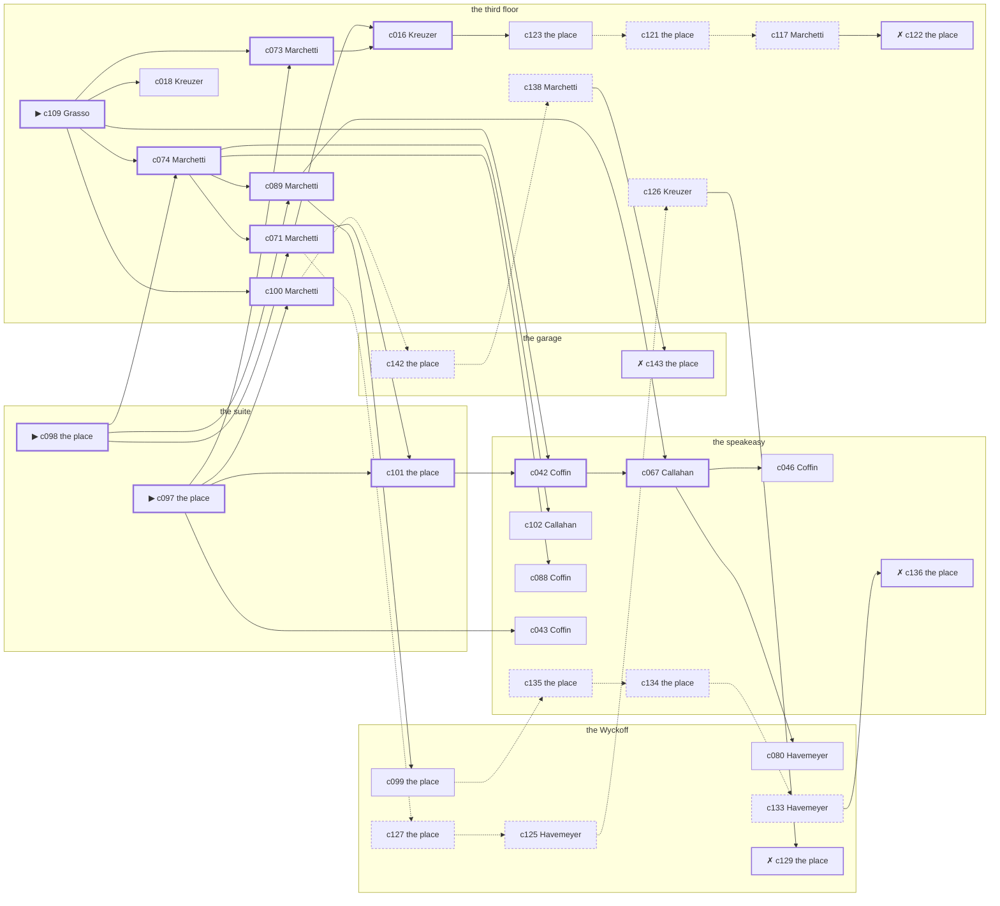

# the Lower East Side — case 3

**Seed** 3 · **Difficulty** 2 · **Attempts** 1 · **Detective** Humphrey

**Par** 11 actions · **Slack** 6 · **Budget** 17 · **Findable** 34 (spine 12, corroboration 8, noise 10 + 4 disqualifiers) · **Noise ratio** 41% · **Candidate pool** 144

## 1. The Truth

Vincenzo Grasso, a longshoreman, the victim’s tenant, killed Martin Sweeney, a bootlegger with the lease on the top floor, with a blunt object at the suite at 8:30 PM. Grasso blamed the victim for a ruin (revenge). Grasso had been at the Wyckoff earlier in the evening, where the weapon lived, and was alone with Sweeney when it happened. Grasso is also the client: the killer hired us.

## 2. Dramatis Personae

| Name | Role | Relationship | Class of secret | Motive | Found at | Killer |
| --- | --- | --- | --- | --- | --- | --- |
| Martin Sweeney | a bootlegger with the lease on the top floor | the victim | — | — | — | — |
| Vincenzo Grasso (client) | a longshoreman | the victim’s tenant | murder | revenge | the third floor | **YES** |
| Gretchen Kreuzer | a pawnbroker’s man | a customer of the victim’s | forged-identity | debt | the third floor | — |
| Nora Hanrahan | a private secretary | the victim’s secretary | embezzling | — | the ferry slip | — |
| James Mulcahy | a society columnist | a witness against the people the victim worked for | blackmail | exposure | the speakeasy | — |
| Sterling Coffin | a doorman at a club with no sign on it | a witness against the people the victim worked for | fence | silence-a-witness | the speakeasy | — |
| Margarethe Schilling | a chambermaid | the victim’s former employee | fence | — | the Wyckoff | — |
| Margaret Callahan | the bartender | fixture (bartender) | — | — | the speakeasy | — |
| Carmela Marchetti | the landlady | fixture (landlady) | — | — | the third floor | — |
| Esther Feldman | the man behind the counter | fixture (counterman) | — | — | the garage | — |
| Chandler Havemeyer | the doorman | fixture (doorman) | — | — | the Wyckoff | — |

## 3. Places

- **the ferry slip at the foot of the street** (public) — unwatched; objects: a strapped suitcase, a folded stack of evening papers, a pasted-up timetable — within earshot of the scene
- **the speakeasy under the hat shop** (semi) — watched by bartender (Callahan); objects: a silver cigarette case, a bottle of chloral drops
- **the third-floor walk-up on Ninth** (private) — watched by landlady (Marchetti); objects: the roof-door key, a length of sash cord, a stack of hatboxes
- **the victim’s suite at the residential hotel** (private) — unwatched; objects: a day ledger, a nickel-plated revolver — **THE SCENE**; the victim’s address
- **the garage on Eleventh Avenue** (semi) — watched by counterman (Feldman); objects: a mechanic’s toolbox, an ice pick
- **the lobby of the Wyckoff** (semi) — watched by doorman (Havemeyer); objects: a bronze bookend, a camel-hair overcoat on a hook, a brass umbrella stand — where the weapon lived; within earshot of the scene

## 4. Anchors

The coroner gives 8:30 PM–10:00 PM, four ticks wide. These are what close it: **el-train** and **piano-lesson**.

- **the piano lesson on the floor above** — at 8:00 PM; at the third floor. You can time things by it: the same four bars, over and over, and then nothing. Only those present know that the child never did get the passage right.
- **the El going over** — at 6:30 PM, 7:30 PM, 8:30 PM, 9:30 PM, 10:30 PM, 11:30 PM; across the whole neighbourhood. You can time things by it: everything under the structure stops being audible for twenty seconds.

## 5. Timelines

### Sweeney — the victim

| Tick | Time | Truth | Claimed | Companion claimed |
| --- | --- | --- | --- | --- |
| 0 | 6:00 PM | the third floor | the third floor | — |
| 1 | 6:30 PM | the third floor | the third floor | — |
| 2 | 7:00 PM | the Wyckoff | the Wyckoff | — |
| 3 | 7:30 PM | the Wyckoff | the Wyckoff | — |
| 4 | 8:00 PM | the third floor | the third floor | — |
| 5 | 8:30 PM | the suite ☠ | the suite | — |
| 6 | 9:00 PM | — | — | — |
| 7 | 9:30 PM | — | — | — |
| 8 | 10:00 PM | — | — | — |
| 9 | 10:30 PM | — | — | — |
| 10 | 11:00 PM | — | — | — |
| 11 | 11:30 PM | — | — | — |

### Grasso — the killer

| Tick | Time | Truth | Claimed | Companion claimed |
| --- | --- | --- | --- | --- |
| 0 | 6:00 PM | the Wyckoff | the Wyckoff | — |
| 1 | 6:30 PM | the Wyckoff | the Wyckoff | — |
| 2 | 7:00 PM | the Wyckoff | the Wyckoff | — |
| 3 | 7:30 PM | the speakeasy | the speakeasy | — |
| 4 | 8:00 PM | the speakeasy | the speakeasy | — |
| 5 | 8:30 PM | the suite ☠ | **the third floor** | — |
| 6 | 9:00 PM | the third floor | the third floor | — |
| 7 | 9:30 PM | the third floor | the third floor | — |
| 8 | 10:00 PM | the third floor | the third floor | — |
| 9 | 10:30 PM | the third floor | the third floor | — |
| 10 | 11:00 PM | the third floor | the third floor | — |
| 11 | 11:30 PM | the ferry slip | the ferry slip | — |

### Kreuzer

| Tick | Time | Truth | Claimed | Companion claimed |
| --- | --- | --- | --- | --- |
| 0 | 6:00 PM | the suite | the suite | — |
| 1 | 6:30 PM | the suite | the suite | — |
| 2 | 7:00 PM | the speakeasy | the speakeasy | — |
| 3 | 7:30 PM | the ferry slip | the ferry slip | — |
| 4 | 8:00 PM | the speakeasy | the speakeasy | — |
| 5 | 8:30 PM | the third floor | the third floor | — |
| 6 | 9:00 PM | the third floor | the third floor | — |
| 7 | 9:30 PM | the third floor | the third floor | — |
| 8 | 10:00 PM | the third floor | the third floor | — |
| 9 | 10:30 PM | the third floor | the third floor | — |
| 10 | 11:00 PM | the third floor | the third floor | — |
| 11 | 11:30 PM | the third floor | the third floor | — |

### Hanrahan

| Tick | Time | Truth | Claimed | Companion claimed |
| --- | --- | --- | --- | --- |
| 0 | 6:00 PM | the garage | the garage | — |
| 1 | 6:30 PM | the ferry slip | the ferry slip | — |
| 2 | 7:00 PM | the speakeasy | the speakeasy | — |
| 3 | 7:30 PM | the ferry slip | the ferry slip | — |
| 4 | 8:00 PM | the garage | the garage | — |
| 5 | 8:30 PM | the third floor | **the Wyckoff** | — |
| 6 | 9:00 PM | the third floor | the third floor | — |
| 7 | 9:30 PM | the third floor | the third floor | — |
| 8 | 10:00 PM | the ferry slip | the ferry slip | — |
| 9 | 10:30 PM | the ferry slip | the ferry slip | — |
| 10 | 11:00 PM | the ferry slip | the ferry slip | — |
| 11 | 11:30 PM | the ferry slip | the ferry slip | — |

### Mulcahy

| Tick | Time | Truth | Claimed | Companion claimed |
| --- | --- | --- | --- | --- |
| 0 | 6:00 PM | the garage | the garage | — |
| 1 | 6:30 PM | the Wyckoff | the Wyckoff | — |
| 2 | 7:00 PM | the Wyckoff | **the third floor** | Schilling |
| 3 | 7:30 PM | the speakeasy | the speakeasy | — |
| 4 | 8:00 PM | the speakeasy | the speakeasy | — |
| 5 | 8:30 PM | the third floor | the third floor | — |
| 6 | 9:00 PM | the third floor | the third floor | — |
| 7 | 9:30 PM | the third floor | the third floor | — |
| 8 | 10:00 PM | the Wyckoff | the Wyckoff | — |
| 9 | 10:30 PM | the speakeasy | the speakeasy | — |
| 10 | 11:00 PM | the speakeasy | the speakeasy | — |
| 11 | 11:30 PM | the speakeasy | the speakeasy | — |

### Coffin

| Tick | Time | Truth | Claimed | Companion claimed |
| --- | --- | --- | --- | --- |
| 0 | 6:00 PM | the speakeasy | the speakeasy | — |
| 1 | 6:30 PM | the speakeasy | the speakeasy | — |
| 2 | 7:00 PM | the Wyckoff | the Wyckoff | — |
| 3 | 7:30 PM | the Wyckoff | the Wyckoff | — |
| 4 | 8:00 PM | the Wyckoff | the Wyckoff | — |
| 5 | 8:30 PM | the third floor | the third floor | — |
| 6 | 9:00 PM | the ferry slip | the ferry slip | — |
| 7 | 9:30 PM | the speakeasy | **the garage** | Hanrahan |
| 8 | 10:00 PM | the ferry slip | the ferry slip | — |
| 9 | 10:30 PM | the ferry slip | the ferry slip | — |
| 10 | 11:00 PM | the speakeasy | the speakeasy | — |
| 11 | 11:30 PM | the speakeasy | the speakeasy | — |

### Schilling

| Tick | Time | Truth | Claimed | Companion claimed |
| --- | --- | --- | --- | --- |
| 0 | 6:00 PM | the Wyckoff | the Wyckoff | — |
| 1 | 6:30 PM | the Wyckoff | the Wyckoff | — |
| 2 | 7:00 PM | the Wyckoff | the Wyckoff | — |
| 3 | 7:30 PM | the garage | the garage | — |
| 4 | 8:00 PM | the garage | the garage | — |
| 5 | 8:30 PM | the garage | **the Wyckoff** | — |
| 6 | 9:00 PM | the garage | the garage | — |
| 7 | 9:30 PM | the garage | the garage | — |
| 8 | 10:00 PM | the Wyckoff | the Wyckoff | — |
| 9 | 10:30 PM | the Wyckoff | the Wyckoff | — |
| 10 | 11:00 PM | the Wyckoff | the Wyckoff | — |
| 11 | 11:30 PM | the ferry slip | the ferry slip | — |

### Fixtures (never lie, never withhold)

| Tick | Time | Callahan (the bartender) | Marchetti (the landlady) | Feldman (the man behind the counter) | Havemeyer (the doorman) |
| --- | --- | --- | --- | --- | --- |
| 0 | 6:00 PM | the speakeasy | the third floor | the garage | the Wyckoff |
| 1 | 6:30 PM | the speakeasy | the third floor | the garage | the Wyckoff |
| 2 | 7:00 PM | the speakeasy | the third floor | the garage | the Wyckoff |
| 3 | 7:30 PM | the speakeasy | the third floor | the garage | the Wyckoff |
| 4 | 8:00 PM | the speakeasy | the third floor | the garage | the Wyckoff |
| 5 | 8:30 PM | the garage | the third floor | the garage | the Wyckoff |
| 6 | 9:00 PM | the speakeasy | the third floor | the garage | the Wyckoff |
| 7 | 9:30 PM | the speakeasy | the third floor | the garage | the Wyckoff |
| 8 | 10:00 PM | the speakeasy | the third floor | the garage | the Wyckoff |
| 9 | 10:30 PM | the speakeasy | the third floor | the garage | the Wyckoff |
| 10 | 11:00 PM | the speakeasy | the third floor | the garage | the Wyckoff |
| 11 | 11:30 PM | the speakeasy | the third floor | the garage | the Wyckoff |

## 6. Secrets in play

- **Grasso** (murder): Grasso is at the suite from 8:30 PM, alone with Sweeney when it happens at 8:30 PM.
- **Kreuzer** (forged-identity): Kreuzer is not the person the papers say. Nothing about the evening is hidden; the lie is all in the paperwork.
- **Hanrahan** (embezzling): Hanrahan goes through the books at the third floor from 8:30 PM, while there is nobody to see.
- **Mulcahy** (blackmail): Mulcahy meets the victim alone at the Wyckoff from 7:00 PM and asks for money.
- **Coffin** (fence): Coffin hands a parcel of stolen goods to a man at the speakeasy from 9:30 PM.
- **Schilling** (fence): Schilling hands a parcel of stolen goods to a man at the garage from 8:30 PM.

## 7. Clue list — the 34 findable

The opening three, free at the start: c097, c098, c109. Everything else has to be led to. The full candidate pool is in the companion file.

### At the speakeasy

- **c042** [spine] (observation; Coffin on Grasso) → c067
  - Coffin says Grasso was at the Wyckoff at 7:00 PM.
  - _establishes: Grasso at the Wyckoff, 7:00 PM; Grasso could reach the weapon_
- **c067** [spine] (observation; Callahan on Schilling) → c080, c046
  - Callahan says Schilling was at the garage at 8:30 PM.
  - _establishes: Schilling at the garage, 8:30 PM_
- **c102** [corroboration] (overheard; Callahan on Grasso and Sweeney) → (end)
  - Callahan says Grasso said Sweeney had taken everything and would be made to feel it.
  - _establishes: Grasso had a motive (revenge)_
- **c088** [corroboration] (observation; Coffin on Grasso’s account) → (end)
  - Coffin was at the third floor at 8:30 PM and says Grasso was not.
  - _establishes: Grasso not at the third floor, 8:30 PM_
- **c046** [corroboration] (observation; Coffin on Mulcahy) → (end)
  - Coffin says Mulcahy was at the Wyckoff at 7:00 PM.
  - _establishes: Mulcahy at the Wyckoff, 7:00 PM; Mulcahy could reach the weapon_
- **c043** [corroboration] (observation; Coffin on Kreuzer) → (end)
  - Coffin says Kreuzer was at the third floor at 8:30 PM.
  - _establishes: Kreuzer at the third floor, 8:30 PM_
- **c135** [noise {b1}] (physical; the place itself) → c134
  - A pawn ticket at the speakeasy in a name that does not exist, made out at the hour in question.
  - _establishes: context only_
- **c134** [noise {b1}] (physical; the place itself) → c133
  - Wrapping paper and a cut string at the speakeasy, and the shop it came from closed two years ago.
  - _establishes: context only_
- **c136** [disqualifier {b1}] (overheard; the place itself) → (end)
  - The receiver at the speakeasy would rather talk than be held: Coffin was there from 9:30 PM handing over a parcel of somebody else’s silver, which is a charge Coffin will take over this one.
  - _establishes: Coffin’s fence accounted for; Coffin at the speakeasy, 9:30 PM_

### At the third floor

- **c109** [spine ⟨opening⟩] (client; Grasso on why I was hired) → c074, c073, c100, c042, c018
  - Grasso hired us, and wants it known that Kreuzer owed the victim money, and would rather we started there.
  - _establishes: Kreuzer had a motive (debt)_
- **c074** [spine] (observation; Marchetti on Coffin) → c089, c071, c102, c088
  - Marchetti says Coffin was at the third floor at 8:30 PM.
  - _establishes: Coffin at the third floor, 8:30 PM_
- **c089** [spine] (observation; Marchetti on Grasso’s account) → c067, c099
  - Marchetti was at the third floor at 8:30 PM and says Grasso was not.
  - _establishes: Grasso not at the third floor, 8:30 PM_
- **c073** [spine] (observation; Marchetti on Mulcahy) → c016
  - Marchetti says Mulcahy was at the third floor from 8:30 PM to 9:30 PM.
  - _establishes: Mulcahy at the third floor, 8:30 PM–9:30 PM_
- **c100** [spine] (anchor; Marchetti on Sweeney that evening) → c142
  - Marchetti puts Sweeney at the third floor while the lesson was still going on overhead, which was 8:00 PM, and alive enough to argue about the weather.
  - _establishes: the victim alive at 8:00 PM; Sweeney at the third floor, 8:00 PM_
- **c071** [spine] (observation; Marchetti on Kreuzer) → c016, c101, c127
  - Marchetti says Kreuzer was at the third floor from 8:30 PM to 11:30 PM.
  - _establishes: Kreuzer at the third floor, 8:30 PM–11:30 PM_
- **c016** [spine] (observation; Kreuzer on Hanrahan) → c123
  - Kreuzer says Hanrahan was at the third floor from 8:30 PM to 9:30 PM.
  - _establishes: Hanrahan at the third floor, 8:30 PM–9:30 PM_
- **c123** [corroboration] (overheard; the place itself) → c121
  - The books at the third floor settle it. Hanrahan spent from 8:30 PM covering a hole in the accounts, which is why Hanrahan would rather be suspected of anything else.
  - _establishes: Hanrahan’s embezzling accounted for; Hanrahan at the third floor, 8:30 PM_
- **c018** [corroboration] (observation; Kreuzer on Mulcahy) → (end)
  - Kreuzer says Mulcahy was at the third floor from 8:30 PM to 9:30 PM.
  - _establishes: Mulcahy at the third floor, 8:30 PM–9:30 PM_
- **c126** [noise {b2}] (overheard; Kreuzer on Mulcahy) → c129
  - Kreuzer on Mulcahy: The victim had been drawing cash in amounts that did not match anything in the accounts.
  - _establishes: context only_
- **c138** [noise {b3}] (overheard; Marchetti on Schilling) → c143
  - Marchetti on Schilling: Schilling was carrying a parcel into the garage and came out without it.
  - _establishes: context only_
- **c121** [noise {b4}] (physical; the place itself) → c117
  - Ledger pages at the third floor where the totals have been rubbed and written over.
  - _establishes: context only_
- **c117** [noise {b4}] (overheard; Marchetti on Hanrahan) → c122
  - Marchetti on Hanrahan: Hanrahan had a key to the third floor that Hanrahan had no business having.
  - _establishes: context only_
- **c122** [disqualifier {b4}] (overheard; the place itself) → (end)
  - The bank confirms the account: Hanrahan has been taking two hundred a month for a year, and was at the third floor doing exactly that from 8:30 PM. It is theft, and it is not murder.
  - _establishes: Hanrahan’s embezzling accounted for; Hanrahan at the third floor, 8:30 PM_

### At the suite

- **c097** [spine ⟨opening⟩] (scene; the place itself) → c073, c100, c101, c043
  - Sweeney was found at the suite. The lamp came down with him and the bulb is still warm in its socket, unbroken. The El went over at 8:30 PM, running to timetable, and for twenty seconds nothing under the structure can be heard at all.
  - _establishes: the victim dead by 8:30 PM; how it was done_
- **c098** [spine ⟨opening⟩] (morgue; the place itself) → c074, c089, c071
  - The coroner puts death between 8:30 PM and 10:00 PM — two hours of nothing useful. One depressed fracture at the back of the skull. Death was not instant.
  - _establishes: death between 8:30 PM and 10:00 PM; how it was done_
- **c101** [spine] (document; the place itself) → c042
  - Found at the suite: A clipping about the failure of Grasso’s business, with Sweeney’s name underlined twice in pencil.
  - _establishes: Grasso had a motive (revenge)_

### At the garage

- **c142** [noise {b3}] (physical; the place itself) → c138
  - A pawn ticket at the garage in a name that does not exist, made out at the hour in question.
  - _establishes: context only_
- **c143** [disqualifier {b3}] (overheard; the place itself) → (end)
  - The receiver at the garage would rather talk than be held: Schilling was there from 8:30 PM handing over a parcel of somebody else’s silver, which is a charge Schilling will take over this one.
  - _establishes: Schilling’s fence accounted for; Schilling at the garage, 8:30 PM_

### At the Wyckoff

- **c080** [corroboration] (observation; Havemeyer on Grasso) → (end)
  - Havemeyer says Grasso was at the Wyckoff from 6:00 PM to 7:00 PM.
  - _establishes: Grasso at the Wyckoff, 6:00 PM–7:00 PM; Grasso could reach the weapon_
- **c099** [corroboration] (physical; the place itself) → c135
  - A bronze bookend is gone from the Wyckoff. There is a clean square in the dust where it stood.
  - _establishes: something gone from the Wyckoff; how it was done_
- **c133** [noise {b1}] (overheard; Havemeyer on Coffin) → c136
  - Havemeyer on Coffin: Coffin has been selling things that were never Coffin’s to sell.
  - _establishes: context only_
- **c127** [noise {b2}] (physical; the place itself) → c125
  - An envelope at the Wyckoff with nothing in it, addressed in the victim’s hand to no one.
  - _establishes: context only_
- **c125** [noise {b2}] (overheard; Havemeyer on Mulcahy) → c126
  - Havemeyer on Mulcahy: Mulcahy has come into money lately and has no visible way of having come into money.
  - _establishes: context only_
- **c129** [disqualifier {b2}] (overheard; the place itself) → (end)
  - The victim’s bank book settles it: four payments, and Mulcahy at the Wyckoff from 7:00 PM collecting the fifth. It is extortion, and an extortionist wants the man alive.
  - _establishes: Mulcahy’s blackmail accounted for; Mulcahy at the Wyckoff, 7:00 PM_

## 8. Clue graph

## 9. Deduction path

Par is **11 actions** and the budget is par plus 6: **17**. Every id below is a spine clue; the inference is the sheet’s, not the clue’s.

**Time of death.** The coroner gives four ticks. The anchors close it to 8:30 PM: one puts Sweeney alive at 8:00 PM, the other times the scene at 8:30 PM. _(c098, c100, c097)_

**Clearing the innocent.**

- Kreuzer was not at the suite at 8:30 PM. _(c071; + 1 corroborating)_
- Hanrahan was not at the suite at 8:30 PM. _(c016; + 2 corroborating)_
- Mulcahy was not at the suite at 8:30 PM. _(c073; + 1 corroborating)_
- Coffin was not at the suite at 8:30 PM. _(c074)_
- Schilling was not at the suite at 8:30 PM. _(c067; + 1 corroborating)_

**Naming the killer.** Grasso claims the third floor at 8:30 PM. Two independent sources put that out of the question. _(c089; + 1 corroborating)_

**The weapon.** Grasso was at the Wyckoff before 8:30 PM, where a bronze bookend was kept. _(c042; + 1 corroborating)_

**Method.** A blunt object, on two physical sources. _(c097, c098; + 1 corroborating)_

**Motive.** revenge, on two independent sources. _(c101; + 1 corroborating)_

## 10. Red herrings

**Innocents who lie about the murder tick:**

- Hanrahan claims the Wyckoff at 8:30 PM and was really at the third floor. Reason: Hanrahan goes through the books at the third floor from 8:30 PM, while there is nobody to see.
- Schilling claims the Wyckoff at 8:30 PM and was really at the garage. Reason: Schilling hands a parcel of stolen goods to a man at the garage from 8:30 PM.

**Innocents with a motive:**

- Kreuzer — debt: owed the victim money.
- Mulcahy — exposure: was about to be exposed by the victim.
- Coffin — silence-a-witness: needed the victim silent.

**Noise branches, and what knocks each one down:**

- **b1** (Coffin, fence): c135 → c134 → c133 → **c136** — The receiver at the speakeasy would rather talk than be held: Coffin was there from 9:30 PM handing over a parcel of somebody else’s silver, which is a charge Coffin will take over this one.
- **b2** (Mulcahy, blackmail): c127 → c125 → c126 → **c129** — The victim’s bank book settles it: four payments, and Mulcahy at the Wyckoff from 7:00 PM collecting the fifth. It is extortion, and an extortionist wants the man alive.
- **b3** (Schilling, fence): c142 → c138 → **c143** — The receiver at the garage would rather talk than be held: Schilling was there from 8:30 PM handing over a parcel of somebody else’s silver, which is a charge Schilling will take over this one.
- **b4** (Hanrahan, embezzling): c121 → c117 → **c122** — The bank confirms the account: Hanrahan has been taking two hundred a month for a year, and was at the third floor doing exactly that from 8:30 PM. It is theft, and it is not murder.

