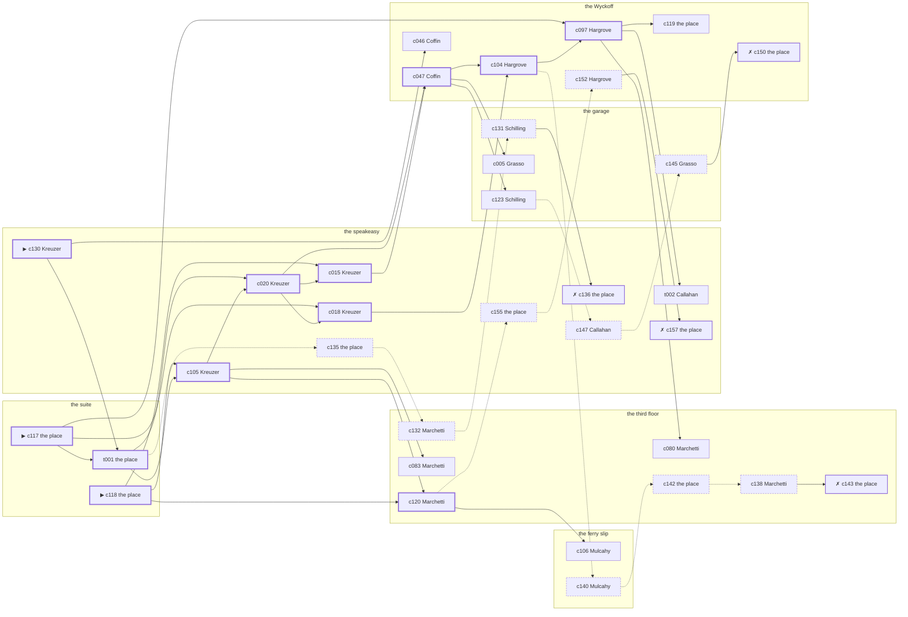

# the Lower East Side — case 3

**Seed** 3 · **Difficulty** 2 · **Attempts** 1 · **Detective** Dashiell

**Type** murder · **Trope** body-at-scene · **Unknowns** who, why, when

**Par** 12 actions · **Slack** 6 · **Budget** 18 · **Findable** 34 (spine 12, corroboration 8, noise 10 + 4 disqualifiers) · **Noise ratio** 41% · **Candidate pool** 167

## 1. The Truth

Vincenzo Grasso, a longshoreman, Sweeney’s tenant, killed Martin Sweeney, a bootlegger with the lease on the top floor, with a blunt object at the suite at 10:00 PM. Grasso blamed Sweeney for the ruin of Grasso’s business (revenge). Grasso had been at the Wyckoff earlier in the evening, where the means lived, and was alone with Sweeney when it happened. Kreuzer hired us.

## 2. The Act

**murder** · **body-at-scene** · actor **Grasso** · at **the suite** · at **10:00 PM**

- found at the suite
- fate: dead

**Givens** — what the briefing states and the report does not ask:

- Sweeney was found dead at the suite.
- Sweeney was killed at the suite, and nothing was carried out of the room afterwards.
- The coroner puts it between 9:30 PM and 11:00 PM, which is two hours of nothing useful.
- It was a blunt object.

**Unknowns** — exactly what the report asks: **who**, **why**, **when**.

## 3. Dramatis Personae

| Name | Role | Relationship | Class of secret | Motive | Found at | Killer |
| --- | --- | --- | --- | --- | --- | --- |
| Martin Sweeney | a bootlegger with the lease on the top floor | the victim | — | — | — | — |
| Vincenzo Grasso | a longshoreman | Sweeney’s tenant | murder | revenge | the garage | **YES** |
| Gretchen Kreuzer (client) | a pawnbroker’s clerk | a customer of Sweeney’s | forged-identity | debt | the speakeasy | — |
| Nora Hanrahan | a private secretary | Sweeney’s secretary | embezzling | — | the ferry slip | — |
| James Mulcahy | a society columnist | a witness against the people Sweeney worked for | blackmail | exposure | the ferry slip | — |
| Sterling Coffin | a doorman at a club with no sign on it | a witness against the people Sweeney worked for | fence | silence-a-witness | the Wyckoff | — |
| Margarethe Schilling | a chambermaid | Sweeney’s former employee | fence | — | the garage | — |
| Margaret Callahan | the bartender | fixture (bartender) | — | — | the speakeasy | — |
| Carmela Marchetti | the landlady | fixture (landlady) | — | — | the third floor | — |
| Bernard Lefkowitz | the man behind the counter | fixture (counterman) | — | — | the garage | — |
| Alonzo Hargrove | the doorman | fixture (doorman) | — | — | the Wyckoff | — |

## 4. Dossiers

Every person, by layer: **0** on sight, **1** volunteered, **2** from other people, **3** in the documents.

### Sweeney — the victim

37, a man, a bootlegger with the lease on the top floor. Wants: to-be-feared.

- **Standing** — Sweeney was the reason four places on the street stayed open, and everyone knew it.
- **Profession** — Sweeney supplied four houses on the block and took cash only.
- **Found** — Kreuzer found Sweeney at the suite at 11:30 PM. By Kreuzer, at the suite, at 11:30 PM. Precinct: took-a-statement.

**Layer 0, on sight**

- _gender_ — A man.
- _age_ — In his thirties.

**Layer 1, volunteered**

- _profession_ — A bootlegger with the lease on the top floor.
- _detail_ — Sweeney supplied four houses on the block and took cash only.

**Layer 2, from other people**

- _tie_ — Sweeney was the reason four places on the street stayed open, and everyone knew it.
- _want_ — Sweeney wants to be the one people are careful around.

**Self-account** (layer 1, what they say when asked about themselves)

- Sweeney is 37 years old and a bootlegger with the lease on the top floor.
- Sweeney supplied four houses on the block and took cash only.
- Sweeney is the one this is about.

### Grasso — the killer

40, a man, a longshoreman. Wants: to-be-feared. Tie: Sweeney’s tenant, since the flu year.

**Layer 0, on sight**

- _gender_ — A man.
- _age_ — In his forties.
- _profession_ — A longshoreman.

**Layer 1, volunteered**

- _detail_ — Grasso shapes up at seven and takes whatever the boss hands out.

**Layer 2, from other people**

- _tie_ — Grasso took the rooms over the speakeasy from Sweeney and has been two weeks behind since the spring.
- _want_ — Grasso wants to be the one people are careful around.
- _since_ — Grasso has been Sweeney’s tenant, since the flu year.

**Self-account** (layer 1, what they say when asked about themselves)

- Grasso is 40 years old and a longshoreman.
- Grasso shapes up at seven and takes whatever the boss hands out.
- Grasso is Sweeney’s tenant.

### Kreuzer — the client

30, a woman, a pawnbroker’s clerk. Wants: money. Tie: a customer of Sweeney’s, for years.

**Layer 0, on sight**

- _gender_ — A woman.
- _age_ — In her thirties.

**Layer 1, volunteered**

- _profession_ — A pawnbroker’s clerk.
- _detail_ — Kreuzer writes the tickets behind the grille and knows what a thing is worth.

**Layer 2, from other people**

- _tie_ — Kreuzer came to Sweeney on Domenico Tramonti’s introduction and has stayed a customer.
- _want_ — Kreuzer wants money, and is not particular about the shape it arrives in.
- _since_ — Kreuzer has been a customer of Sweeney’s, for years.
- _third_ — Domenico Tramonti is the foreman who did the hiring.

**Layer 3, in the documents**

- _secret-hint_ — Kreuzer’s registration card gives an address on a street that does not exist.

**Self-account** (layer 1, what they say when asked about themselves)

- Kreuzer is 30 years old and a pawnbroker’s clerk.
- Kreuzer writes the tickets behind the grille and knows what a thing is worth.
- Kreuzer is a customer of Sweeney’s.

### Hanrahan

42, a woman, a private secretary. Wants: money. Tie: Sweeney’s secretary, since ’18.

**Layer 0, on sight**

- _gender_ — A woman.
- _age_ — In her forties.

**Layer 1, volunteered**

- _profession_ — A private secretary.
- _detail_ — Hanrahan has worked for three men in six years and left none of them badly.

**Layer 2, from other people**

- _tie_ — Hanrahan keeps Sweeney’s diary and knows which of the entries are true.
- _want_ — Hanrahan wants money, and is not particular about the shape it arrives in.
- _since_ — Hanrahan has been Sweeney’s secretary, since ’18.

**Layer 3, in the documents**

- _secret-hint_ — Hanrahan had a key to the third floor that Hanrahan had no business having.

**Self-account** (layer 1, what they say when asked about themselves)

- Hanrahan is 42 years old and a private secretary.
- Hanrahan has worked for three men in six years and left none of them badly.
- Hanrahan is Sweeney’s secretary.

### Mulcahy

45, a man, a society columnist. Wants: respectability. Tie: a witness against the people Sweeney worked for, since the indictment.

**Layer 0, on sight**

- _gender_ — A man.
- _age_ — In his forties.

**Layer 1, volunteered**

- _profession_ — A society columnist.
- _detail_ — Mulcahy files three columns a week and dines out for all of them.

**Layer 2, from other people**

- _tie_ — Mulcahy talked to the district attorney in ’20 and Rosaria Salerno has not spoken to Mulcahy since.
- _want_ — Mulcahy wants to be thought respectable by people who are not.
- _since_ — Mulcahy has been a witness against the people Sweeney worked for, since the indictment.
- _third_ — Rosaria Salerno is a sister who married out of the neighbourhood.

**Layer 3, in the documents**

- _secret-hint_ — Mulcahy and Sweeney were heard at the Wyckoff, and one of them was doing all the talking.

**Self-account** (layer 1, what they say when asked about themselves)

- Mulcahy is 45 years old and a society columnist.
- Mulcahy files three columns a week and dines out for all of them.
- Mulcahy is a witness against the people Sweeney worked for.

### Coffin

44, a man, a doorman at a club with no sign on it. Wants: money. Tie: a witness against the people Sweeney worked for, since ’22.

**Layer 0, on sight**

- _gender_ — A man.
- _age_ — In his forties.
- _profession_ — A doorman at a club with no sign on it.

**Layer 1, volunteered**

- _detail_ — Coffin stands the door at a club with no sign on it and knows every face that comes to it.

**Layer 2, from other people**

- _tie_ — Coffin talked to the district attorney in ’22 and Thaddeus Thorndike has not spoken to Coffin since.
- _want_ — Coffin wants money, and is not particular about the shape it arrives in.
- _since_ — Coffin has been a witness against the people Sweeney worked for, since ’22.
- _third_ — Thaddeus Thorndike is the man who held the second mortgage.

**Layer 3, in the documents**

- _secret-hint_ — Coffin was carrying a parcel into the speakeasy and came out without it.

**Self-account** (layer 1, what they say when asked about themselves)

- Coffin is 44 years old and a doorman at a club with no sign on it.
- Coffin stands the door at a club with no sign on it and knows every face that comes to it.
- Coffin is a witness against the people Sweeney worked for.

### Schilling

25, a woman, a chambermaid. Wants: to-be-left-alone. Tie: Sweeney’s former employee, since ’23.

**Layer 0, on sight**

- _gender_ — A woman.
- _age_ — In the late twenties.
- _profession_ — A chambermaid.

**Layer 1, volunteered**

- _detail_ — Schilling has the third and fourth floors and is finished at four.

**Layer 2, from other people**

- _tie_ — Schilling worked for Sweeney for four years and was let go in ’23 without a reference.
- _want_ — Schilling wants to be left alone.
- _since_ — Schilling has been Sweeney’s former employee, since ’23.

**Layer 3, in the documents**

- _secret-hint_ — Schilling was carrying a parcel into the garage and came out without it.

**Self-account** (layer 1, what they say when asked about themselves)

- Schilling is 25 years old and a chambermaid.
- Schilling has the third and fourth floors and is finished at four.
- Schilling is Sweeney’s former employee.

### Callahan

48, a woman, the bartender. Wants: to-be-left-alone. Tie: behind the bar at the speakeasy, every night of the week.

**Layer 0, on sight**

- _gender_ — A woman.
- _age_ — In her forties.
- _profession_ — The bartender.

**Layer 1, volunteered**

- _detail_ — Callahan pours at the speakeasy six nights a week and takes Mondays.

**Layer 2, from other people**

- _tie_ — Callahan is behind the bar at the speakeasy, every night of the week.
- _want_ — Callahan wants to be left alone.

**Self-account** (layer 1, what they say when asked about themselves)

- Callahan is 48 years old and the bartender.
- Callahan pours at the speakeasy six nights a week and takes Mondays.
- Callahan is behind the bar at the speakeasy, every night of the week.

### Marchetti

50, a woman, the landlady. Wants: respectability. Tie: the keeper of the third floor.

**Layer 0, on sight**

- _gender_ — A woman.
- _age_ — In her fifties.
- _profession_ — The landlady.

**Layer 1, volunteered**

- _detail_ — Marchetti lets the rooms at the third floor and collects on Saturdays.

**Layer 2, from other people**

- _tie_ — Marchetti is the keeper of the third floor.
- _want_ — Marchetti wants to be thought respectable by people who are not.

**Self-account** (layer 1, what they say when asked about themselves)

- Marchetti is 50 years old and the landlady.
- Marchetti lets the rooms at the third floor and collects on Saturdays.
- Marchetti is the keeper of the third floor.

### Lefkowitz

43, a man, the man behind the counter. Wants: money. Tie: behind the counter at the garage.

**Layer 0, on sight**

- _gender_ — A man.
- _age_ — In his forties.
- _profession_ — The man behind the counter.

**Layer 1, volunteered**

- _detail_ — Lefkowitz works the counter at the garage on the evening shift.

**Layer 2, from other people**

- _tie_ — Lefkowitz is behind the counter at the garage.
- _want_ — Lefkowitz wants money, and is not particular about the shape it arrives in.

**Self-account** (layer 1, what they say when asked about themselves)

- Lefkowitz is 43 years old and the man behind the counter.
- Lefkowitz works the counter at the garage on the evening shift.
- Lefkowitz is behind the counter at the garage.

### Hargrove

32, a man, the doorman. Wants: respectability. Tie: on the door at the Wyckoff.

**Layer 0, on sight**

- _gender_ — A man.
- _age_ — In his thirties.
- _profession_ — The doorman.

**Layer 1, volunteered**

- _detail_ — Hargrove has had the door at the Wyckoff since the building changed hands.

**Layer 2, from other people**

- _tie_ — Hargrove is on the door at the Wyckoff.
- _want_ — Hargrove wants to be thought respectable by people who are not.

**Self-account** (layer 1, what they say when asked about themselves)

- Hargrove is 32 years old and the doorman.
- Hargrove has had the door at the Wyckoff since the building changed hands.
- Hargrove is on the door at the Wyckoff.

## 5. The Client

**Kreuzer**, a customer of Sweeney’s. Purpose: **clear-my-name**.

- **Why** — Kreuzer wants it established that it was not them, before anybody says otherwise.
- **What it costs** — Kreuzer was near enough to it that night to know exactly how it looks, and says so first.
- **Points at** — Grasso: Grasso blamed Sweeney for the ruin of Grasso’s business. Honest: **yes**.

**Tells:**

- Sweeney was found dead at the suite.
- Sweeney was killed at the suite, and nothing was carried out of the room afterwards.
- The coroner puts it between 9:30 PM and 11:00 PM, which is two hours of nothing useful.
- It was a blunt object.
- Kreuzer would rather we started with Grasso: Grasso blamed Sweeney for the ruin of Grasso’s business.

**Withholds:**

- Kreuzer does not mention it, but Kreuzer is not the person the papers say. Nothing about the evening is hidden; the lie is all in the paperwork.

**Their own evening, as they tell it:**

- Kreuzer says she was at the ferry slip at 6:00 PM.
- Kreuzer says she was at the third floor from 6:30 PM to 7:00 PM.
- Kreuzer says she was at the ferry slip at 7:30 PM.
- Kreuzer says she was at the speakeasy from 8:00 PM to 9:30 PM.

## 6. The Briefing

16 plain sentences, derived. This is the model of the plain register: the engine renders it, and Phase 2 measures pages against it.

1. A woman came up the stairs after midnight, and sat down.
2. Gretchen Kreuzer is 30 years old and a pawnbroker’s clerk.
3. Kreuzer writes the tickets behind the grille and knows what a thing is worth.
4. Sweeney was the reason four places on the street stayed open, and everyone knew it.
5. Sweeney was found dead at the suite.
6. Sweeney was killed at the suite, and nothing was carried out of the room afterwards.
7. The coroner puts it between 9:30 PM and 11:00 PM, which is two hours of nothing useful.
8. It was a blunt object.
9. Kreuzer found Sweeney at the suite at 11:30 PM.
10. The precinct took a statement at the desk and filed it.
11. Kreuzer is a customer of Sweeney’s.
12. Kreuzer came to Sweeney on Domenico Tramonti’s introduction and has stayed a customer.
13. Kreuzer wants it established that it was not them, before anybody says otherwise.
14. Kreuzer was near enough to it that night to know exactly how it looks, and says so first.
15. Kreuzer wants us to start with Grasso.
16. Grasso blamed Sweeney for the ruin of Grasso’s business.

## 7. Mentions

- **Domenico Tramonti** (m-1) — the foreman who did the hiring. Domenico Tramonti is the foreman who did the hiring.
- **Rosaria Salerno** (m-2) — a sister who married out of the neighbourhood. Rosaria Salerno is a sister who married out of the neighbourhood.
- **Thaddeus Thorndike** (m-3) — the man who held the second mortgage. Thaddeus Thorndike is the man who held the second mortgage.

## 8. Places

- **the ferry slip at the foot of the street** (public) — unwatched; objects: a strapped suitcase, a folded stack of evening papers, a pasted-up timetable — within earshot of the scene
- **the speakeasy under the hat shop** (semi) — watched by bartender (Callahan); objects: a silver cigarette case, a bottle of chloral drops
- **the third-floor walk-up on Ninth** (private) — watched by landlady (Marchetti); objects: the roof-door key, a length of sash cord, a stack of hatboxes
- **Sweeney’s suite at the residential hotel** (private) — unwatched; objects: a day ledger, a nickel-plated revolver — **THE SCENE**; the victim’s address
- **the garage on Eleventh Avenue** (semi) — watched by counterman (Lefkowitz); objects: a mechanic’s toolbox, an ice pick
- **the lobby of the Wyckoff** (semi) — watched by doorman (Hargrove); objects: a bronze bookend, a camel-hair overcoat on a hook, a brass umbrella stand — where the weapon lived; within earshot of the scene

## 9. Anchors

The coroner gives 9:30 PM–11:00 PM, four ticks wide. These are what close it: **el-train** and **piano-lesson**.

- **the piano lesson on the floor above** — at 9:30 PM; at the third floor. You can time things by it: the same four bars, over and over, and then nothing. Only those present know that the child never did get the passage right.
- **the El going over** — at 6:00 PM, 7:00 PM, 8:00 PM, 9:00 PM, 10:00 PM, 11:00 PM; across the whole neighbourhood. You can time things by it: everything under the structure stops being audible for twenty seconds.

## 10. Timelines

### Sweeney — the victim

| Tick | Time | Truth | Claimed | Companion claimed |
| --- | --- | --- | --- | --- |
| 0 | 6:00 PM | the Wyckoff | the Wyckoff | — |
| 1 | 6:30 PM | the garage | the garage | — |
| 2 | 7:00 PM | the garage | the garage | — |
| 3 | 7:30 PM | the garage | the garage | — |
| 4 | 8:00 PM | the Wyckoff | the Wyckoff | — |
| 5 | 8:30 PM | the third floor | the third floor | — |
| 6 | 9:00 PM | the third floor | the third floor | — |
| 7 | 9:30 PM | the third floor | the third floor | — |
| 8 | 10:00 PM | the suite ☠ | the suite | — |
| 9 | 10:30 PM | — | — | — |
| 10 | 11:00 PM | — | — | — |
| 11 | 11:30 PM | — | — | — |

### Grasso — the killer

| Tick | Time | Truth | Claimed | Companion claimed |
| --- | --- | --- | --- | --- |
| 0 | 6:00 PM | the suite | the suite | — |
| 1 | 6:30 PM | the garage | the garage | — |
| 2 | 7:00 PM | the garage | the garage | — |
| 3 | 7:30 PM | the garage | the garage | — |
| 4 | 8:00 PM | the speakeasy | the speakeasy | — |
| 5 | 8:30 PM | the Wyckoff | the Wyckoff | — |
| 6 | 9:00 PM | the suite | **the third floor** | Coffin |
| 7 | 9:30 PM | the suite | **the third floor** | Coffin |
| 8 | 10:00 PM | the suite ☠ | **the third floor** | Coffin |
| 9 | 10:30 PM | the speakeasy | the speakeasy | — |
| 10 | 11:00 PM | the speakeasy | the speakeasy | — |
| 11 | 11:30 PM | the garage | the garage | — |

### Kreuzer

| Tick | Time | Truth | Claimed | Companion claimed |
| --- | --- | --- | --- | --- |
| 0 | 6:00 PM | the ferry slip | the ferry slip | — |
| 1 | 6:30 PM | the third floor | the third floor | — |
| 2 | 7:00 PM | the third floor | the third floor | — |
| 3 | 7:30 PM | the ferry slip | the ferry slip | — |
| 4 | 8:00 PM | the speakeasy | the speakeasy | — |
| 5 | 8:30 PM | the speakeasy | the speakeasy | — |
| 6 | 9:00 PM | the speakeasy | the speakeasy | — |
| 7 | 9:30 PM | the speakeasy | the speakeasy | — |
| 8 | 10:00 PM | the third floor | the third floor | — |
| 9 | 10:30 PM | the third floor | the third floor | — |
| 10 | 11:00 PM | the speakeasy | the speakeasy | — |
| 11 | 11:30 PM | the suite | the suite | — |

### Hanrahan

| Tick | Time | Truth | Claimed | Companion claimed |
| --- | --- | --- | --- | --- |
| 0 | 6:00 PM | the ferry slip | the ferry slip | — |
| 1 | 6:30 PM | the ferry slip | the ferry slip | — |
| 2 | 7:00 PM | the ferry slip | the ferry slip | — |
| 3 | 7:30 PM | the ferry slip | the ferry slip | — |
| 4 | 8:00 PM | the ferry slip | the ferry slip | — |
| 5 | 8:30 PM | the garage | the garage | — |
| 6 | 9:00 PM | the garage | the garage | — |
| 7 | 9:30 PM | the ferry slip | the ferry slip | — |
| 8 | 10:00 PM | the third floor | **the garage** | Grasso |
| 9 | 10:30 PM | the third floor | the third floor | — |
| 10 | 11:00 PM | the speakeasy | the speakeasy | — |
| 11 | 11:30 PM | the Wyckoff | the Wyckoff | — |

### Mulcahy

| Tick | Time | Truth | Claimed | Companion claimed |
| --- | --- | --- | --- | --- |
| 0 | 6:00 PM | the ferry slip | the ferry slip | — |
| 1 | 6:30 PM | the speakeasy | the speakeasy | — |
| 2 | 7:00 PM | the speakeasy | the speakeasy | — |
| 3 | 7:30 PM | the Wyckoff | the Wyckoff | — |
| 4 | 8:00 PM | the Wyckoff | **the third floor** | — |
| 5 | 8:30 PM | the Wyckoff | the Wyckoff | — |
| 6 | 9:00 PM | the ferry slip | the ferry slip | — |
| 7 | 9:30 PM | the ferry slip | the ferry slip | — |
| 8 | 10:00 PM | the third floor | the third floor | — |
| 9 | 10:30 PM | the third floor | the third floor | — |
| 10 | 11:00 PM | the third floor | the third floor | — |
| 11 | 11:30 PM | the ferry slip | the ferry slip | — |

### Coffin

| Tick | Time | Truth | Claimed | Companion claimed |
| --- | --- | --- | --- | --- |
| 0 | 6:00 PM | the Wyckoff | the Wyckoff | — |
| 1 | 6:30 PM | the garage | the garage | — |
| 2 | 7:00 PM | the garage | the garage | — |
| 3 | 7:30 PM | the speakeasy | the speakeasy | — |
| 4 | 8:00 PM | the speakeasy | **the ferry slip** | — |
| 5 | 8:30 PM | the Wyckoff | the Wyckoff | — |
| 6 | 9:00 PM | the Wyckoff | the Wyckoff | — |
| 7 | 9:30 PM | the Wyckoff | the Wyckoff | — |
| 8 | 10:00 PM | the third floor | the third floor | — |
| 9 | 10:30 PM | the third floor | the third floor | — |
| 10 | 11:00 PM | the garage | the garage | — |
| 11 | 11:30 PM | the ferry slip | the ferry slip | — |

### Schilling

| Tick | Time | Truth | Claimed | Companion claimed |
| --- | --- | --- | --- | --- |
| 0 | 6:00 PM | the Wyckoff | the Wyckoff | — |
| 1 | 6:30 PM | the Wyckoff | the Wyckoff | — |
| 2 | 7:00 PM | the garage | the garage | — |
| 3 | 7:30 PM | the ferry slip | the ferry slip | — |
| 4 | 8:00 PM | the speakeasy | the speakeasy | — |
| 5 | 8:30 PM | the speakeasy | the speakeasy | — |
| 6 | 9:00 PM | the speakeasy | the speakeasy | — |
| 7 | 9:30 PM | the speakeasy | the speakeasy | — |
| 8 | 10:00 PM | the garage | **the speakeasy** | — |
| 9 | 10:30 PM | the garage | **the speakeasy** | — |
| 10 | 11:00 PM | the garage | the garage | — |
| 11 | 11:30 PM | the Wyckoff | the Wyckoff | — |

### Fixtures (never lie, never withhold)

| Tick | Time | Callahan (the bartender) | Marchetti (the landlady) | Lefkowitz (the man behind the counter) | Hargrove (the doorman) |
| --- | --- | --- | --- | --- | --- |
| 0 | 6:00 PM | the speakeasy | the third floor | the garage | the Wyckoff |
| 1 | 6:30 PM | the speakeasy | the third floor | the garage | the Wyckoff |
| 2 | 7:00 PM | the speakeasy | the third floor | the garage | the Wyckoff |
| 3 | 7:30 PM | the speakeasy | the ferry slip | the garage | the Wyckoff |
| 4 | 8:00 PM | the speakeasy | the third floor | the garage | the Wyckoff |
| 5 | 8:30 PM | the speakeasy | the third floor | the garage | the Wyckoff |
| 6 | 9:00 PM | the third floor | the third floor | the garage | the Wyckoff |
| 7 | 9:30 PM | the speakeasy | the third floor | the garage | the Wyckoff |
| 8 | 10:00 PM | the speakeasy | the third floor | the garage | the garage |
| 9 | 10:30 PM | the speakeasy | the third floor | the garage | the Wyckoff |
| 10 | 11:00 PM | the speakeasy | the third floor | the garage | the Wyckoff |
| 11 | 11:30 PM | the speakeasy | the third floor | the garage | the Wyckoff |

## 11. Secrets in play

- **Grasso** (murder): Grasso is at the suite from 9:00 PM to 10:00 PM, alone with Sweeney when it happens at 10:00 PM.
- **Kreuzer** (forged-identity): Kreuzer is not the person the papers say. Nothing about the evening is hidden; the lie is all in the paperwork.
- **Hanrahan** (embezzling): Hanrahan goes through the books at the third floor from 10:00 PM, while there is nobody to see.
- **Mulcahy** (blackmail): Mulcahy meets Sweeney alone at the Wyckoff from 8:00 PM and asks for money.
- **Coffin** (fence): Coffin hands a parcel of stolen goods to a man at the speakeasy from 8:00 PM.
- **Schilling** (fence): Schilling hands a parcel of stolen goods to a man at the garage from 10:00 PM to 10:30 PM.

## 12. Clue list — the 34 findable

The opening three, free at the start: c117, c118, c130. Everything else has to be led to. The full candidate pool is in the companion file.

### At the ferry slip

- **c106** [corroboration] (observation; Mulcahy on Grasso’s account) → (end)
  - Mulcahy was at the third floor at 10:00 PM and says Grasso was not.
  - _establishes: Grasso not at the third floor, 10:00 PM_
- **c140** [noise {b1}] (overheard; Mulcahy on Hanrahan) → c142
  - Mulcahy on Hanrahan: Somebody heard a drawer being worked at the third floor some time after 10:00 PM.
  - _establishes: context only_

### At the speakeasy

- **c130** [spine ⟨opening⟩] (client; Kreuzer on why I was hired) → t001, c046
  - Kreuzer hired us, and wants it known that Grasso blamed Sweeney for the ruin of Grasso’s business, and would rather we started there.
  - _establishes: Grasso had a motive (revenge)_
- **c105** [spine] (observation; Kreuzer on Grasso’s account) → c020, c120, c083
  - Kreuzer was at the third floor at 10:00 PM and says Grasso was not.
  - _establishes: Grasso not at the third floor, 10:00 PM_
- **c020** [spine] (observation; Kreuzer on Coffin) → c015, c018, c047
  - Kreuzer says Coffin was at the third floor from 10:00 PM to 10:30 PM.
  - _establishes: Coffin at the third floor, 10:00 PM–10:30 PM_
- **c015** [spine] (observation; Kreuzer on Hanrahan) → c047
  - Kreuzer says Hanrahan was at the third floor from 10:00 PM to 10:30 PM.
  - _establishes: Hanrahan at the third floor, 10:00 PM–10:30 PM_
- **c018** [spine] (observation; Kreuzer on Mulcahy) → c104
  - Kreuzer says Mulcahy was at the third floor from 10:00 PM to 10:30 PM.
  - _establishes: Mulcahy at the third floor, 10:00 PM–10:30 PM_
- **t002** [corroboration] (overheard; Callahan on the suite that evening) → (end)
  - Callahan says the door at the suite was shut from 10:00 PM on, and nobody came out of it carrying anything.
  - _establishes: Sweeney at the suite, 10:00 PM_
- **c135** [noise {b2}] (physical; the place itself) → c132
  - A steamship ticket stub among Kreuzer’s things, in the name of a man who died at Belleau Wood.
  - _establishes: context only_
- **c136** [disqualifier {b2}] (overheard; the place itself) → (end)
  - The name Kreuzer was born with turns up on a desertion warrant from 1918. Kreuzer has been hiding from the Army for eleven years and from nobody else.
  - _establishes: Kreuzer’s forged-identity accounted for_
- **c147** [noise {b3}] (overheard; Callahan on Mulcahy) → c145
  - Callahan on Mulcahy: Sweeney had been drawing cash in amounts that did not match anything in the accounts.
  - _establishes: context only_
- **c155** [noise {b4}] (physical; the place itself) → c152
  - Wrapping paper and a cut string at the speakeasy, and the shop it came from closed two years ago.
  - _establishes: context only_
- **c157** [disqualifier {b4}] (overheard; the place itself) → (end)
  - The receiver at the speakeasy would rather talk than be held: Coffin was there from 8:00 PM handing over a parcel of somebody else’s silver, which is a charge Coffin will take over this one.
  - _establishes: Coffin’s fence accounted for; Coffin at the speakeasy, 8:00 PM_

### At the third floor

- **c120** [spine] (anchor; Marchetti on Sweeney that evening) → c106, c155
  - Marchetti puts Sweeney at the third floor while the lesson was still going on overhead, which was 9:30 PM, and alive enough to argue about the weather.
  - _establishes: the victim alive at 9:30 PM; Sweeney at the third floor, 9:30 PM_
- **c080** [corroboration] (observation; Marchetti on Kreuzer) → (end)
  - Marchetti says Kreuzer was at the third floor from 10:00 PM to 10:30 PM.
  - _establishes: Kreuzer at the third floor, 10:00 PM–10:30 PM_
- **c083** [corroboration] (observation; Marchetti on Hanrahan) → (end)
  - Marchetti says Hanrahan was at the third floor from 10:00 PM to 10:30 PM.
  - _establishes: Hanrahan at the third floor, 10:00 PM–10:30 PM_
- **c142** [noise {b1}] (physical; the place itself) → c138
  - Ledger pages at the third floor where the totals have been rubbed and written over.
  - _establishes: context only_
- **c138** [noise {b1}] (overheard; Marchetti on Hanrahan) → c143
  - Marchetti on Hanrahan: Hanrahan had a key to the third floor that Hanrahan had no business having.
  - _establishes: context only_
- **c143** [disqualifier {b1}] (overheard; the place itself) → (end)
  - The bank confirms the account: Hanrahan has been taking two hundred a month for a year, and was at the third floor doing exactly that from 10:00 PM. It is theft, and it is not murder.
  - _establishes: Hanrahan’s embezzling accounted for; Hanrahan at the third floor, 10:00 PM_
- **c132** [noise {b2}] (overheard; Marchetti on Kreuzer) → c131
  - Marchetti on Kreuzer: Two signatures of Kreuzer’s, a month apart, are in different hands.
  - _establishes: context only_

### At the suite

- **c117** [spine ⟨opening⟩] (scene; the place itself) → t001, c018, c097
  - Sweeney was found at the suite. The lamp came down with him and the bulb is still warm in its socket, unbroken. The El went over at 10:00 PM, running to timetable, and for twenty seconds nothing under the structure can be heard at all.
  - _establishes: the victim dead by 10:00 PM; how it was done_
- **c118** [spine ⟨opening⟩] (morgue; the place itself) → c105, c015, c120
  - The coroner puts death between 9:30 PM and 11:00 PM — two hours of nothing useful. One depressed fracture at the back of the skull. Death was not instant.
  - _establishes: death between 9:30 PM and 11:00 PM; how it was done_
- **t001** [spine] (physical; the place itself) → c105, c020, c135
  - The rug at the suite is rucked up under Sweeney and the chair beside it went over backwards. Nothing was carried out of the room.
  - _establishes: Sweeney at the suite, 10:00 PM_

### At the garage

- **c123** [corroboration] (overheard; Schilling on Grasso and Sweeney) → c147
  - Schilling says Grasso said Sweeney had taken everything and would be made to feel it.
  - _establishes: Grasso had a motive (revenge)_
- **c005** [corroboration] (observation; Grasso on Mulcahy) → (end)
  - Grasso says Mulcahy was at the Wyckoff at 8:30 PM.
  - _establishes: Mulcahy at the Wyckoff, 8:30 PM; Mulcahy could reach the weapon_
- **c131** [noise {b2}] (overheard; Schilling on Kreuzer) → c136
  - Schilling on Kreuzer: Kreuzer’s registration card gives an address on a street that does not exist.
  - _establishes: context only_
- **c145** [noise {b3}] (overheard; Grasso on Mulcahy) → c150
  - Grasso on Mulcahy: Mulcahy and Sweeney were heard at the Wyckoff, and one of them was doing all the talking.
  - _establishes: context only_

### At the Wyckoff

- **c047** [spine] (observation; Coffin on Kreuzer) → c104, c123, c005
  - Coffin says Kreuzer was at the third floor from 10:00 PM to 10:30 PM.
  - _establishes: Kreuzer at the third floor, 10:00 PM–10:30 PM_
- **c104** [spine] (observation; Hargrove on Schilling) → c097, c140
  - Hargrove says Schilling was at the garage at 10:00 PM.
  - _establishes: Schilling at the garage, 10:00 PM_
- **c097** [spine] (observation; Hargrove on Grasso) → t002, c119, c080
  - Hargrove says Grasso was at the Wyckoff at 8:30 PM.
  - _establishes: Grasso at the Wyckoff, 8:30 PM; Grasso could reach the weapon_
- **c119** [corroboration] (physical; the place itself) → (end)
  - A bronze bookend is gone from the Wyckoff. There is a clean square in the dust where it stood.
  - _establishes: something gone from the Wyckoff; how it was done_
- **c046** [corroboration] (observation; Coffin on Grasso) → (end)
  - Coffin says Grasso was at the Wyckoff at 8:30 PM.
  - _establishes: Grasso at the Wyckoff, 8:30 PM; Grasso could reach the weapon_
- **c150** [disqualifier {b3}] (overheard; the place itself) → (end)
  - Sweeney’s bank book settles it: four payments, and Mulcahy at the Wyckoff from 8:00 PM collecting the fifth. It is extortion, and an extortionist wants Sweeney alive.
  - _establishes: Mulcahy’s blackmail accounted for; Mulcahy at the Wyckoff, 8:00 PM_
- **c152** [noise {b4}] (overheard; Hargrove on Coffin) → c157
  - Hargrove on Coffin: Coffin was carrying a parcel into the speakeasy and came out without it.
  - _establishes: context only_

## 13. Clue graph

## 14. Deduction path

Par is **12 actions** and the budget is par plus 6: **18**. Every id below is a spine clue; the inference is the sheet’s, not the clue’s.

**Time of death.** The coroner gives four ticks. The anchors close it to 10:00 PM: one puts Sweeney alive at 9:30 PM, the other times the scene at 10:00 PM. _(c118, c120, c117)_

**Clearing the innocent.**

- Kreuzer was not at the suite at 10:00 PM. _(c047; + 1 corroborating)_
- Hanrahan was not at the suite at 10:00 PM. _(c015; + 2 corroborating)_
- Mulcahy was not at the suite at 10:00 PM. _(c018)_
- Coffin was not at the suite at 10:00 PM. _(c020)_
- Schilling was not at the suite at 10:00 PM. _(c104)_

**Naming the killer.** Grasso claims the third floor at 10:00 PM. Two independent sources put that out of the question. _(c105; + 1 corroborating)_

**The weapon.** Grasso was at the Wyckoff before 10:00 PM, where a bronze bookend was kept. _(c097; + 1 corroborating)_

**Method.** A blunt object, on two physical sources. _(c117, c118; + 1 corroborating)_

**Motive.** revenge, on two independent sources. _(c130; + 1 corroborating)_

## 15. Red herrings

**Innocents who lie about the murder tick:**

- Hanrahan claims the garage at 10:00 PM and was really at the third floor. Reason: Hanrahan goes through the books at the third floor from 10:00 PM, while there is nobody to see.
- Schilling claims the speakeasy at 10:00 PM and was really at the garage. Reason: Schilling hands a parcel of stolen goods to a man at the garage from 10:00 PM to 10:30 PM.

**Innocents with a motive:**

- Kreuzer — debt: owed Sweeney four thousand dollars and was past due on it.
- Mulcahy — exposure: was about to be exposed by Sweeney.
- Coffin — silence-a-witness: needed Sweeney silent before the grand jury.

**Noise branches, and what knocks each one down:**

- **b1** (Hanrahan, embezzling): c140 → c142 → c138 → **c143** — The bank confirms the account: Hanrahan has been taking two hundred a month for a year, and was at the third floor doing exactly that from 10:00 PM. It is theft, and it is not murder.
- **b2** (Kreuzer, forged-identity): c135 → c132 → c131 → **c136** — The name Kreuzer was born with turns up on a desertion warrant from 1918. Kreuzer has been hiding from the Army for eleven years and from nobody else.
- **b3** (Mulcahy, blackmail): c147 → c145 → **c150** — Sweeney’s bank book settles it: four payments, and Mulcahy at the Wyckoff from 8:00 PM collecting the fifth. It is extortion, and an extortionist wants Sweeney alive.
- **b4** (Coffin, fence): c155 → c152 → **c157** — The receiver at the speakeasy would rather talk than be held: Coffin was there from 8:00 PM handing over a parcel of somebody else’s silver, which is a charge Coffin will take over this one.

