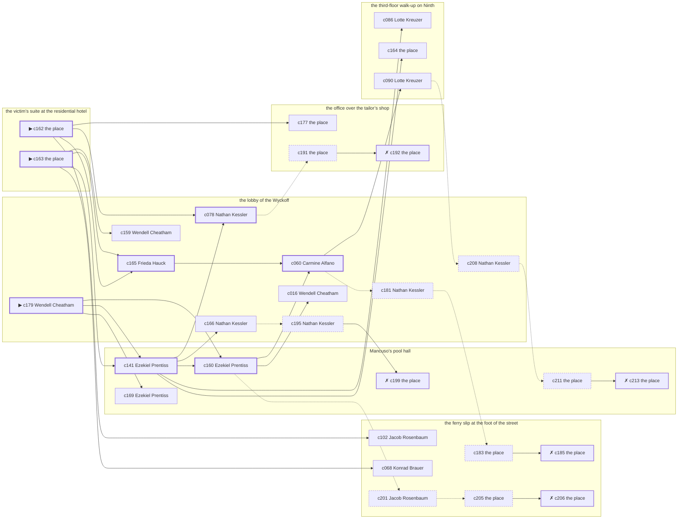

# Hell’s Kitchen — case 4

**Seed** 4 · **Difficulty** 2 · **Attempts** 1 · **Detective** Humphrey

**Par** 7 actions · **Budget** 20 · **Slack** 13 · **Findable** 31 (spine 8, corroboration 10, noise 8 + 5 disqualifiers) · **Noise ratio** 42% · **Candidate pool** 214

## 1. The Truth

Konrad Brauer, a lawyer with one clerk, the victim’s lawyer, killed Morris Hurwitz, a retired dry-goods wholesaler, with strangling with a cord at the victim’s suite at the residential hotel at 8:00 PM. Konrad Brauer wanted the victim out of a lease (property). Konrad Brauer had been at the third-floor walk-up on Ninth earlier in the evening, where the weapon lived, and was alone with Morris Hurwitz when it happened. Wendell Cheatham hired us.

## 2. Dramatis Personae

| Name | Role | Relationship | Class of secret | Motive | Found at | Killer |
| --- | --- | --- | --- | --- | --- | --- |
| Morris Hurwitz | a retired dry-goods wholesaler | the victim | — | — | — | — |
| Jacob Rosenbaum | a pawnbroker’s man | a customer of the victim’s | forged-identity | exposure | the ferry slip at the foot of the street | — |
| Wendell Cheatham (client) | a society columnist | the victim’s rival in trade | blackmail | — | the lobby of the Wyckoff | — |
| Wilhelm Vogel | a longshoreman | the victim’s tenant | fence | — | Mancuso’s pool hall | — |
| Frieda Hauck | a seamstress | the victim’s former employee | union-organizing | revenge | the lobby of the Wyckoff | — |
| Carmine Alfano | a doorman at a club with no sign on it | in the victim’s debt | gambling-debt | — | the lobby of the Wyckoff | — |
| Konrad Brauer | a lawyer with one clerk | the victim’s lawyer | murder (+ blackmail) | property | the ferry slip at the foot of the street | **YES** |
| Nathan Kessler | the doorman | fixture (doorman) | — | — | the lobby of the Wyckoff | — |
| Lotte Kreuzer | the landlady | fixture (landlady) | — | — | the third-floor walk-up on Ninth | — |
| Ezekiel Prentiss | the man behind the counter | fixture (counterman) | — | — | Mancuso’s pool hall | — |

## 3. Places

- **the office over the tailor’s shop** (private) — unwatched; objects: a bronze bookend, a day ledger
- **the lobby of the Wyckoff** (semi) — watched by doorman (Nathan Kessler); objects: a nickel-plated revolver, a brass umbrella stand, a camel-hair overcoat on a hook
- **the third-floor walk-up on Ninth** (private) — watched by landlady (Lotte Kreuzer); objects: a length of sash cord, a bottle of chloral drops, a stack of hatboxes — where the weapon lived
- **the ferry slip at the foot of the street** (public) — unwatched; objects: a pasted-up timetable, a strapped suitcase, a folded stack of evening papers — within earshot of the scene
- **the victim’s suite at the residential hotel** (private) — unwatched; objects: a silver cigarette case — **THE SCENE**; the victim’s address
- **Mancuso’s pool hall** (semi) — watched by counterman (Ezekiel Prentiss); objects: a standing ashtray, an ice pick — within earshot of the scene

## 4. Anchors

The coroner gives 7:00 PM–8:30 PM, four ticks wide. These are what close it: **milk-wagon** and **regular-stool**.

- **the regular who takes the same seat every night** — at 7:30 PM; at the lobby of the Wyckoff. Somebody reliable notes who was there.
- **the milk wagon on its rounds** — at 6:00 PM, 8:00 PM, 10:00 PM; across the whole neighbourhood. You can time things by it: iron tyres and a horse that will not stand still.
- **the rain starting** — at 10:00 PM; across the whole neighbourhood. Those present carry it: a coat soaked through at the shoulders.

## 5. Timelines

### Morris Hurwitz — the victim

| Tick | Time | Truth | Claimed | Companion claimed |
| --- | --- | --- | --- | --- |
| 0 | 6:00 PM | the lobby of the Wyckoff | the lobby of the Wyckoff | — |
| 1 | 6:30 PM | the lobby of the Wyckoff | the lobby of the Wyckoff | — |
| 2 | 7:00 PM | the office over the tailor’s shop | the office over the tailor’s shop | — |
| 3 | 7:30 PM | the lobby of the Wyckoff | the lobby of the Wyckoff | — |
| 4 | 8:00 PM | the victim’s suite at the residential hotel ☠ | the victim’s suite at the residential hotel | — |
| 5 | 8:30 PM | — | — | — |
| 6 | 9:00 PM | — | — | — |
| 7 | 9:30 PM | — | — | — |
| 8 | 10:00 PM | — | — | — |
| 9 | 10:30 PM | — | — | — |
| 10 | 11:00 PM | — | — | — |
| 11 | 11:30 PM | — | — | — |

### Jacob Rosenbaum

| Tick | Time | Truth | Claimed | Companion claimed |
| --- | --- | --- | --- | --- |
| 0 | 6:00 PM | the lobby of the Wyckoff | the lobby of the Wyckoff | — |
| 1 | 6:30 PM | the lobby of the Wyckoff | the lobby of the Wyckoff | — |
| 2 | 7:00 PM | the third-floor walk-up on Ninth | the third-floor walk-up on Ninth | — |
| 3 | 7:30 PM | the third-floor walk-up on Ninth | the third-floor walk-up on Ninth | — |
| 4 | 8:00 PM | Mancuso’s pool hall | Mancuso’s pool hall | — |
| 5 | 8:30 PM | Mancuso’s pool hall | Mancuso’s pool hall | — |
| 6 | 9:00 PM | the ferry slip at the foot of the street | the ferry slip at the foot of the street | — |
| 7 | 9:30 PM | the ferry slip at the foot of the street | the ferry slip at the foot of the street | — |
| 8 | 10:00 PM | the ferry slip at the foot of the street | the ferry slip at the foot of the street | — |
| 9 | 10:30 PM | the ferry slip at the foot of the street | the ferry slip at the foot of the street | — |
| 10 | 11:00 PM | the ferry slip at the foot of the street | the ferry slip at the foot of the street | — |
| 11 | 11:30 PM | the ferry slip at the foot of the street | the ferry slip at the foot of the street | — |

### Wendell Cheatham

| Tick | Time | Truth | Claimed | Companion claimed |
| --- | --- | --- | --- | --- |
| 0 | 6:00 PM | the lobby of the Wyckoff | the lobby of the Wyckoff | — |
| 1 | 6:30 PM | the office over the tailor’s shop | the office over the tailor’s shop | — |
| 2 | 7:00 PM | the office over the tailor’s shop | **Mancuso’s pool hall** | Frieda Hauck |
| 3 | 7:30 PM | the victim’s suite at the residential hotel | the victim’s suite at the residential hotel | — |
| 4 | 8:00 PM | Mancuso’s pool hall | Mancuso’s pool hall | — |
| 5 | 8:30 PM | the lobby of the Wyckoff | the lobby of the Wyckoff | — |
| 6 | 9:00 PM | the lobby of the Wyckoff | the lobby of the Wyckoff | — |
| 7 | 9:30 PM | the third-floor walk-up on Ninth | the third-floor walk-up on Ninth | — |
| 8 | 10:00 PM | the ferry slip at the foot of the street | the ferry slip at the foot of the street | — |
| 9 | 10:30 PM | the lobby of the Wyckoff | the lobby of the Wyckoff | — |
| 10 | 11:00 PM | the lobby of the Wyckoff | the lobby of the Wyckoff | — |
| 11 | 11:30 PM | the lobby of the Wyckoff | the lobby of the Wyckoff | — |

### Wilhelm Vogel

| Tick | Time | Truth | Claimed | Companion claimed |
| --- | --- | --- | --- | --- |
| 0 | 6:00 PM | Mancuso’s pool hall | Mancuso’s pool hall | — |
| 1 | 6:30 PM | Mancuso’s pool hall | Mancuso’s pool hall | — |
| 2 | 7:00 PM | Mancuso’s pool hall | Mancuso’s pool hall | — |
| 3 | 7:30 PM | Mancuso’s pool hall | **the ferry slip at the foot of the street** | — |
| 4 | 8:00 PM | Mancuso’s pool hall | **the ferry slip at the foot of the street** | — |
| 5 | 8:30 PM | Mancuso’s pool hall | Mancuso’s pool hall | — |
| 6 | 9:00 PM | the ferry slip at the foot of the street | the ferry slip at the foot of the street | — |
| 7 | 9:30 PM | the lobby of the Wyckoff | the lobby of the Wyckoff | — |
| 8 | 10:00 PM | the lobby of the Wyckoff | the lobby of the Wyckoff | — |
| 9 | 10:30 PM | the ferry slip at the foot of the street | the ferry slip at the foot of the street | — |
| 10 | 11:00 PM | the lobby of the Wyckoff | the lobby of the Wyckoff | — |
| 11 | 11:30 PM | the ferry slip at the foot of the street | the ferry slip at the foot of the street | — |

### Frieda Hauck

| Tick | Time | Truth | Claimed | Companion claimed |
| --- | --- | --- | --- | --- |
| 0 | 6:00 PM | the lobby of the Wyckoff | the lobby of the Wyckoff | — |
| 1 | 6:30 PM | the lobby of the Wyckoff | the lobby of the Wyckoff | — |
| 2 | 7:00 PM | the lobby of the Wyckoff | the lobby of the Wyckoff | — |
| 3 | 7:30 PM | the lobby of the Wyckoff | the lobby of the Wyckoff | — |
| 4 | 8:00 PM | the lobby of the Wyckoff | the lobby of the Wyckoff | — |
| 5 | 8:30 PM | the lobby of the Wyckoff | the lobby of the Wyckoff | — |
| 6 | 9:00 PM | the lobby of the Wyckoff | the lobby of the Wyckoff | — |
| 7 | 9:30 PM | the third-floor walk-up on Ninth | the third-floor walk-up on Ninth | — |
| 8 | 10:00 PM | the lobby of the Wyckoff | the lobby of the Wyckoff | — |
| 9 | 10:30 PM | the ferry slip at the foot of the street | **the lobby of the Wyckoff** | — |
| 10 | 11:00 PM | the ferry slip at the foot of the street | **the lobby of the Wyckoff** | — |
| 11 | 11:30 PM | the ferry slip at the foot of the street | the ferry slip at the foot of the street | — |

### Carmine Alfano

| Tick | Time | Truth | Claimed | Companion claimed |
| --- | --- | --- | --- | --- |
| 0 | 6:00 PM | the third-floor walk-up on Ninth | the third-floor walk-up on Ninth | — |
| 1 | 6:30 PM | the third-floor walk-up on Ninth | the third-floor walk-up on Ninth | — |
| 2 | 7:00 PM | the office over the tailor’s shop | the office over the tailor’s shop | — |
| 3 | 7:30 PM | the office over the tailor’s shop | the office over the tailor’s shop | — |
| 4 | 8:00 PM | Mancuso’s pool hall | **the lobby of the Wyckoff** | Jacob Rosenbaum |
| 5 | 8:30 PM | Mancuso’s pool hall | **the lobby of the Wyckoff** | Jacob Rosenbaum |
| 6 | 9:00 PM | the lobby of the Wyckoff | the lobby of the Wyckoff | — |
| 7 | 9:30 PM | the lobby of the Wyckoff | the lobby of the Wyckoff | — |
| 8 | 10:00 PM | the lobby of the Wyckoff | the lobby of the Wyckoff | — |
| 9 | 10:30 PM | the lobby of the Wyckoff | the lobby of the Wyckoff | — |
| 10 | 11:00 PM | the third-floor walk-up on Ninth | the third-floor walk-up on Ninth | — |
| 11 | 11:30 PM | the lobby of the Wyckoff | the lobby of the Wyckoff | — |

### Konrad Brauer — the killer

| Tick | Time | Truth | Claimed | Companion claimed |
| --- | --- | --- | --- | --- |
| 0 | 6:00 PM | the third-floor walk-up on Ninth | the third-floor walk-up on Ninth | — |
| 1 | 6:30 PM | the lobby of the Wyckoff | **the office over the tailor’s shop** | — |
| 2 | 7:00 PM | the lobby of the Wyckoff | the lobby of the Wyckoff | — |
| 3 | 7:30 PM | the ferry slip at the foot of the street | the ferry slip at the foot of the street | — |
| 4 | 8:00 PM | the victim’s suite at the residential hotel ☠ | **Mancuso’s pool hall** | Frieda Hauck |
| 5 | 8:30 PM | the third-floor walk-up on Ninth | the third-floor walk-up on Ninth | — |
| 6 | 9:00 PM | the third-floor walk-up on Ninth | the third-floor walk-up on Ninth | — |
| 7 | 9:30 PM | the lobby of the Wyckoff | the lobby of the Wyckoff | — |
| 8 | 10:00 PM | the ferry slip at the foot of the street | the ferry slip at the foot of the street | — |
| 9 | 10:30 PM | the ferry slip at the foot of the street | the ferry slip at the foot of the street | — |
| 10 | 11:00 PM | the ferry slip at the foot of the street | the ferry slip at the foot of the street | — |
| 11 | 11:30 PM | Mancuso’s pool hall | Mancuso’s pool hall | — |

### Fixtures (never lie, never withhold)

| Tick | Time | Nathan Kessler (the doorman) | Lotte Kreuzer (the landlady) | Ezekiel Prentiss (the man behind the counter) |
| --- | --- | --- | --- | --- |
| 0 | 6:00 PM | the lobby of the Wyckoff | the third-floor walk-up on Ninth | Mancuso’s pool hall |
| 1 | 6:30 PM | the lobby of the Wyckoff | the third-floor walk-up on Ninth | Mancuso’s pool hall |
| 2 | 7:00 PM | the lobby of the Wyckoff | the third-floor walk-up on Ninth | Mancuso’s pool hall |
| 3 | 7:30 PM | the lobby of the Wyckoff | the third-floor walk-up on Ninth | Mancuso’s pool hall |
| 4 | 8:00 PM | the lobby of the Wyckoff | the lobby of the Wyckoff | Mancuso’s pool hall |
| 5 | 8:30 PM | the lobby of the Wyckoff | the third-floor walk-up on Ninth | Mancuso’s pool hall |
| 6 | 9:00 PM | the lobby of the Wyckoff | the third-floor walk-up on Ninth | Mancuso’s pool hall |
| 7 | 9:30 PM | the lobby of the Wyckoff | the third-floor walk-up on Ninth | Mancuso’s pool hall |
| 8 | 10:00 PM | the lobby of the Wyckoff | the third-floor walk-up on Ninth | Mancuso’s pool hall |
| 9 | 10:30 PM | the lobby of the Wyckoff | the third-floor walk-up on Ninth | Mancuso’s pool hall |
| 10 | 11:00 PM | the lobby of the Wyckoff | the third-floor walk-up on Ninth | the ferry slip at the foot of the street |
| 11 | 11:30 PM | the lobby of the Wyckoff | the third-floor walk-up on Ninth | Mancuso’s pool hall |

## 6. Secrets in play

- **Jacob Rosenbaum** (forged-identity): Jacob Rosenbaum is not the person the papers say. Nothing about the evening is hidden; the lie is all in the paperwork.
- **Wendell Cheatham** (blackmail): Wendell Cheatham meets the victim alone at the office over the tailor’s shop from 7:00 PM and asks for money.
- **Wilhelm Vogel** (fence): Wilhelm Vogel hands a parcel of stolen goods to a man at Mancuso’s pool hall from 7:30 PM to 8:00 PM.
- **Frieda Hauck** (union-organizing): Frieda Hauck is at the ferry slip at the foot of the street from 10:30 PM to 11:00 PM signing men up, which is a firing offence and worse.
- **Carmine Alfano** (gambling-debt): Carmine Alfano slips off to Mancuso’s pool hall from 8:00 PM to 8:30 PM to settle with a bookmaker.
- **Konrad Brauer** (murder): Konrad Brauer is at the victim’s suite at the residential hotel from 8:00 PM, alone with Morris Hurwitz when it happens at 8:00 PM.
- **Konrad Brauer** also (blackmail): Konrad Brauer meets the victim alone at the lobby of the Wyckoff from 6:30 PM and asks for money.

## 7. Clue list — the 30 findable

The opening three, free at the start: c162, c163, c179. Everything else has to be led to. The full candidate pool is in the companion file.

### At the office over the tailor’s shop

- **c177** [corroboration] (document; the place itself) → (end)
  - Found at the office over the tailor’s shop: A lease assignment made out in Konrad Brauer’s name, waiting only on Morris Hurwitz’s signature.
  - _establishes: Konrad Brauer had a motive (property)_
- **c191** [noise {b5}] (physical; the place itself) → c192
  - A photograph at the office over the tailor’s shop, folded small, of something the victim would have paid to keep folded.
  - _establishes: context only_
- **c192** [disqualifier {b5}] (overheard; the place itself) → (end)
  - The victim’s bank book settles it: four payments, and Wendell Cheatham at the office over the tailor’s shop from 7:00 PM collecting the fifth. It is extortion, and an extortionist wants the man alive.
  - _establishes: Wendell Cheatham’s blackmail accounted for; Wendell Cheatham at the office over the tailor’s shop, 7:00 PM_

### At the lobby of the Wyckoff

- **c179** [spine ⟨opening⟩] (client; Wendell Cheatham on why I was hired) → c141, c160, c169
  - Wendell Cheatham hired us. Wendell Cheatham wants it known that Konrad Brauer wanted the victim out of a lease, and would rather we started there.
  - _establishes: Konrad Brauer had a motive (property)_
- **c165** [spine] (anchor; Frieda Hauck on Morris Hurwitz that evening) → c060
  - Frieda Hauck puts Morris Hurwitz at the lobby of the Wyckoff when the regular came in for his seat, which was 7:30 PM, and alive enough to argue about the weather.
  - _establishes: the victim alive at 7:30 PM; Morris Hurwitz at the lobby of the Wyckoff, 7:30 PM_
- **c078** [spine] (observation; Nathan Kessler on Frieda Hauck) → c191
  - Nathan Kessler says Frieda Hauck was at the lobby of the Wyckoff from 6:00 PM to 9:00 PM.
  - _establishes: Frieda Hauck at the lobby of the Wyckoff, 6:00 PM–9:00 PM_
- **c060** [spine] (observation; Carmine Alfano on Konrad Brauer) → c090, c181
  - Carmine Alfano says Konrad Brauer was at the third-floor walk-up on Ninth at 6:00 PM.
  - _establishes: Konrad Brauer at the third-floor walk-up on Ninth, 6:00 PM; Konrad Brauer could reach the weapon_
- **c159** [corroboration] (observation; Wendell Cheatham on Konrad Brauer’s account) → (end)
  - Wendell Cheatham was at Mancuso’s pool hall at 8:00 PM and says Konrad Brauer was not.
  - _establishes: Konrad Brauer not at Mancuso’s pool hall, 8:00 PM_
- **c016** [corroboration] (observation; Wendell Cheatham on Jacob Rosenbaum) → (end)
  - Wendell Cheatham says Jacob Rosenbaum was at Mancuso’s pool hall at 8:00 PM.
  - _establishes: Jacob Rosenbaum at Mancuso’s pool hall, 8:00 PM_
- **c166** [corroboration] (anchor; Nathan Kessler on Morris Hurwitz that evening) → c195
  - Nathan Kessler puts Morris Hurwitz at the lobby of the Wyckoff when the regular came in for his seat, which was 7:30 PM, and alive enough to argue about the weather.
  - _establishes: the victim alive at 7:30 PM; Morris Hurwitz at the lobby of the Wyckoff, 7:30 PM_
- **c181** [noise {b1}] (overheard; Nathan Kessler on Jacob Rosenbaum) → c183
  - Nathan Kessler on Jacob Rosenbaum: Two signatures of Jacob Rosenbaum’s, a month apart, are in different hands.
  - _establishes: context only_
- **c195** [noise {b2}] (overheard; Nathan Kessler on Wilhelm Vogel) → c199
  - Nathan Kessler on Wilhelm Vogel: There is a man who meets people at Mancuso’s pool hall and nobody will say his name out loud.
  - _establishes: context only_
- **c208** [noise {b4}] (overheard; Nathan Kessler on Carmine Alfano) → c211
  - Nathan Kessler on Carmine Alfano: Carmine Alfano was asking around for a hundred dollars in a hurry earlier in the week.
  - _establishes: context only_

### At the third-floor walk-up on Ninth

- **c086** [corroboration] (observation; Lotte Kreuzer on Frieda Hauck) → (end)
  - Lotte Kreuzer says Frieda Hauck was at the lobby of the Wyckoff at 8:00 PM.
  - _establishes: Frieda Hauck at the lobby of the Wyckoff, 8:00 PM_
- **c164** [corroboration] (physical; the place itself) → (end)
  - A length of sash cord is gone from the third-floor walk-up on Ninth. A cut end of the same hemp is still tied to the fitting it was taken from.
  - _establishes: something gone from the third-floor walk-up on Ninth; how it was done_
- **c090** [corroboration] (observation; Lotte Kreuzer on Konrad Brauer) → c208
  - Lotte Kreuzer says Konrad Brauer was at the third-floor walk-up on Ninth at 6:00 PM.
  - _establishes: Konrad Brauer at the third-floor walk-up on Ninth, 6:00 PM; Konrad Brauer could reach the weapon_

### At the ferry slip at the foot of the street

- **c102** [corroboration] (observation; Jacob Rosenbaum on who was there at 8:00 PM) → (end)
  - Jacob Rosenbaum runs through it: at 8:00 PM there were Wendell Cheatham, Wilhelm Vogel, Carmine Alfano at Mancuso’s pool hall, and nobody else worth naming.
  - _establishes: Wendell Cheatham at Mancuso’s pool hall, 8:00 PM; Wilhelm Vogel at Mancuso’s pool hall, 8:00 PM; Carmine Alfano at Mancuso’s pool hall, 8:00 PM_
- **c068** [corroboration] (observation; Konrad Brauer on Carmine Alfano) → (end)
  - Konrad Brauer says Carmine Alfano was at the third-floor walk-up on Ninth at 6:00 PM.
  - _establishes: Carmine Alfano at the third-floor walk-up on Ninth, 6:00 PM; Carmine Alfano could reach the weapon_
- **c183** [noise {b1}] (physical; the place itself) → c185
  - A union card in Jacob Rosenbaum’s coat lining carries a different surname and a 1919 date.
  - _establishes: context only_
- **c185** [disqualifier {b1}] (overheard; the place itself) → (end)
  - The name Jacob Rosenbaum was born with turns up on a desertion warrant from 1918. Jacob Rosenbaum has been hiding from the Army for eleven years and from nobody else.
  - _establishes: Jacob Rosenbaum’s forged-identity accounted for_
- **c201** [noise {b3}] (overheard; Jacob Rosenbaum on Frieda Hauck) → c205
  - Jacob Rosenbaum on Frieda Hauck: Frieda Hauck has been seen with men from three different shops and none of them were drinking.
  - _establishes: context only_
- **c205** [noise {b3}] (physical; the place itself) → c206
  - A hall rental receipt at the ferry slip at the foot of the street made out to a name that means nothing to anyone.
  - _establishes: context only_
- **c206** [disqualifier {b3}] (overheard; the place itself) → (end)
  - Forty men will swear to it if they have to: Frieda Hauck was at the ferry slip at the foot of the street from 10:30 PM to 11:00 PM taking their names, and the only thing Frieda Hauck is guilty of is a charter.
  - _establishes: Frieda Hauck’s union-organizing accounted for; Frieda Hauck at the ferry slip at the foot of the street, 10:30 PM–11:00 PM_

### At the victim’s suite at the residential hotel

- **c162** [spine ⟨opening⟩] (scene; the place itself) → c165, c078, c102, c177
  - Morris Hurwitz was found at the victim’s suite at the residential hotel. His watch glass broke against the floor and the hands have not moved since. The milk wagon on its rounds came at 8:00 PM, and the driver keeps to his round and he was at the corner for it. That puts the killing in that half hour and no later.
  - _establishes: the victim dead by 8:00 PM; how it was done_
- **c163** [spine ⟨opening⟩] (morgue; the place itself) → c141, c165, c159, c068
  - The coroner puts death between 7:00 PM and 8:30 PM — two hours of nothing useful. A ligature furrow across the throat. Three fibres of hemp in the skin.
  - _establishes: death between 7:00 PM and 8:30 PM; how it was done_

### At Mancuso’s pool hall

- **c141** [spine] (observation; Ezekiel Prentiss on who was there at 8:00 PM) → c160, c078, c086, c164, c166
  - Ezekiel Prentiss runs through it: at 8:00 PM there were Jacob Rosenbaum, Wendell Cheatham, Wilhelm Vogel, Carmine Alfano at Mancuso’s pool hall, and nobody else worth naming.
  - _establishes: Jacob Rosenbaum at Mancuso’s pool hall, 8:00 PM; Wendell Cheatham at Mancuso’s pool hall, 8:00 PM; Wilhelm Vogel at Mancuso’s pool hall, 8:00 PM; Carmine Alfano at Mancuso’s pool hall, 8:00 PM_
- **c160** [spine] (observation; Ezekiel Prentiss on Konrad Brauer’s account) → c060, c016, c201
  - Ezekiel Prentiss was at Mancuso’s pool hall at 8:00 PM and says Konrad Brauer was not.
  - _establishes: Konrad Brauer not at Mancuso’s pool hall, 8:00 PM_
- **c169** [corroboration] (anchor; Ezekiel Prentiss on the noise that evening) → (end)
  - Ezekiel Prentiss was at Mancuso’s pool hall at 8:00 PM and heard a scuffle and a chair dragging from the direction of the victim’s suite at the residential hotel, while the milk wagon was in the street.
  - _establishes: noise at the victim’s suite at the residential hotel at 8:00 PM; the victim dead by 8:00 PM; how it was done_
- **c199** [disqualifier {b2}] (overheard; the place itself) → (end)
  - The receiver at Mancuso’s pool hall would rather talk than be held: Wilhelm Vogel was there from 7:30 PM to 8:00 PM handing over a parcel of somebody else’s silver, which is a charge Wilhelm Vogel will take over this one.
  - _establishes: Wilhelm Vogel’s fence accounted for; Wilhelm Vogel at Mancuso’s pool hall, 7:30 PM–8:00 PM_
- **c211** [noise {b4}] (physical; the place itself) → c213
  - Betting slips at Mancuso’s pool hall in Carmine Alfano’s pocketbook, all of them losers, all of them this month.
  - _establishes: context only_
- **c213** [disqualifier {b4}] (overheard; the place itself) → (end)
  - The bookmaker’s runner is found and will say it: Carmine Alfano was at Mancuso’s pool hall from 8:00 PM to 8:30 PM paying off eleven hundred dollars, a dollar at a time, and went nowhere near the killing.
  - _establishes: Carmine Alfano’s gambling-debt accounted for; Carmine Alfano at Mancuso’s pool hall, 8:00 PM–8:30 PM_

## 8. Clue graph

## 9. Deduction path

Par is **7 actions** against a budget of 20: 13 spare. Every id below is a spine clue.

**Time of death.** The coroner gives four ticks. The anchors close it to 8:00 PM: one puts Morris Hurwitz alive at 7:30 PM, the other times the scene at 8:00 PM. _(c163, c165, c162; + 2 corroborating)_

**Clearing the innocent.**

- Jacob Rosenbaum was not at the victim’s suite at the residential hotel at 8:00 PM, on two independent sources. _(c141; + 1 corroborating)_
- Wendell Cheatham was not at the victim’s suite at the residential hotel at 8:00 PM, on two independent sources. _(c141; + 1 corroborating)_
- Wilhelm Vogel was not at the victim’s suite at the residential hotel at 8:00 PM, on two independent sources. _(c141; + 2 corroborating)_
- Frieda Hauck was not at the victim’s suite at the residential hotel at 8:00 PM, on two independent sources. _(c078; + 1 corroborating)_
- Carmine Alfano was not at the victim’s suite at the residential hotel at 8:00 PM, on two independent sources. _(c141; + 2 corroborating)_

**Naming the killer.** Konrad Brauer claims Mancuso’s pool hall at 8:00 PM. Two independent sources put that out of the question. _(c160; + 1 corroborating)_

**The weapon.** Konrad Brauer was at the third-floor walk-up on Ninth before 8:00 PM, where a length of sash cord was kept. _(c060; + 1 corroborating)_

**Method.** Strangling with a cord, on two physical sources. _(c162, c163; + 2 corroborating)_

**Motive.** property, on two independent sources. _(c179; + 1 corroborating)_

## 10. Red herrings

**Innocents who lie about the murder tick:**

- Wilhelm Vogel claims the ferry slip at the foot of the street at 8:00 PM and was really at Mancuso’s pool hall. Reason: Wilhelm Vogel hands a parcel of stolen goods to a man at Mancuso’s pool hall from 7:30 PM to 8:00 PM.
- Carmine Alfano claims the lobby of the Wyckoff at 8:00 PM and was really at Mancuso’s pool hall. Reason: Carmine Alfano slips off to Mancuso’s pool hall from 8:00 PM to 8:30 PM to settle with a bookmaker.

**Innocents with a motive:**

- Jacob Rosenbaum — exposure: was about to be exposed by the victim.
- Frieda Hauck — revenge: blamed the victim for a ruin.

**Noise branches, and what knocks each one down:**

- **b1** (Jacob Rosenbaum, forged-identity): c181 → c183 → **c185** — The name Jacob Rosenbaum was born with turns up on a desertion warrant from 1918. Jacob Rosenbaum has been hiding from the Army for eleven years and from nobody else.
- **b2** (Wilhelm Vogel, fence): c195 → **c199** — The receiver at Mancuso’s pool hall would rather talk than be held: Wilhelm Vogel was there from 7:30 PM to 8:00 PM handing over a parcel of somebody else’s silver, which is a charge Wilhelm Vogel will take over this one.
- **b3** (Frieda Hauck, union-organizing): c201 → c205 → **c206** — Forty men will swear to it if they have to: Frieda Hauck was at the ferry slip at the foot of the street from 10:30 PM to 11:00 PM taking their names, and the only thing Frieda Hauck is guilty of is a charter.
- **b4** (Carmine Alfano, gambling-debt): c208 → c211 → **c213** — The bookmaker’s runner is found and will say it: Carmine Alfano was at Mancuso’s pool hall from 8:00 PM to 8:30 PM paying off eleven hundred dollars, a dollar at a time, and went nowhere near the killing.
- **b5** (Wendell Cheatham, blackmail): c191 → **c192** — The victim’s bank book settles it: four payments, and Wendell Cheatham at the office over the tailor’s shop from 7:00 PM collecting the fifth. It is extortion, and an extortionist wants the man alive.

