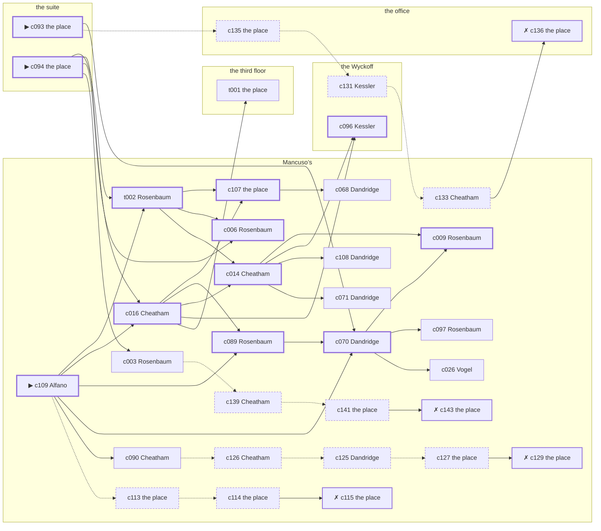

# Hell’s Kitchen — case 4

**Seed** 4 · **Difficulty** 2 · **Attempts** 1 · **Detective** Dashiell

**Type** murder · **Trope** locked-room · **Unknowns** who, why, when, entry

**Par** 11 actions · **Slack** 6 · **Budget** 17 · **Findable** 34 (spine 12, corroboration 8, noise 10 + 4 disqualifiers) · **Noise ratio** 41% · **Candidate pool** 146

## 1. The Truth

Konrad Brauer, a lawyer with one clerk, Hurwitz’s lawyer, killed Morris Hurwitz, a retired dry-goods wholesaler, with strangling with a cord at the suite at 9:30 PM. Brauer wanted Hurwitz out of the lease and the lease in Brauer’s name (property). Brauer had been at the third floor earlier in the evening, where the means lived, and was alone with Hurwitz when it happened. Alfano hired us.

## 2. The Act

**murder** · **locked-room** · actor **Brauer** · at **the suite** · at **9:30 PM**

- found at the suite
- entry: key
- fate: dead

**Givens** — what the briefing states and the report does not ask:

- Hurwitz was found dead at the suite.
- The door at the suite was locked and the windows were painted shut.
- There is one key to the suite, and it was on its hook at the third floor this morning.
- The coroner puts it between 9:00 PM and 10:30 PM.
- It was strangling with a cord.

**Unknowns** — exactly what the report asks: **who**, **why**, **when**, **entry**.

## 3. Dramatis Personae

| Name | Role | Relationship | Class of secret | Motive | Found at | Killer |
| --- | --- | --- | --- | --- | --- | --- |
| Morris Hurwitz | a retired dry-goods wholesaler | the victim | — | — | — | — |
| Jacob Rosenbaum | a pawnbroker’s clerk | a customer of Hurwitz’s | forged-identity | exposure | Mancuso’s | — |
| Wendell Cheatham | a society columnist | Hurwitz’s neighbour across the airshaft | blackmail | — | Mancuso’s | — |
| Wilhelm Vogel | a longshoreman | Hurwitz’s tenant | fence | — | Mancuso’s | — |
| Frieda Hauck | a seamstress | Hurwitz’s former employee | union-organizing | revenge | the Wyckoff | — |
| Carmine Alfano (client) | a doorman at a club with no sign on it | in Hurwitz’s debt | gambling-debt | — | Mancuso’s | — |
| Konrad Brauer | a lawyer with one clerk | Hurwitz’s lawyer | murder (+ blackmail) | property | Mancuso’s | **YES** |
| Nathan Kessler | the doorman | fixture (doorman) | — | — | the Wyckoff | — |
| Lotte Kreuzer | the landlady | fixture (landlady) | — | — | the third floor | — |
| Elijah Dandridge | the man behind the counter | fixture (counterman) | — | — | Mancuso’s | — |

## 4. Dossiers

Every person, by layer: **0** on sight, **1** volunteered, **2** from other people, **3** in the documents.

### Hurwitz — the victim

63, a man, a retired dry-goods wholesaler. Wants: respectability.

- **Standing** — Hurwitz had lent money to four families on the block and forgiven none of it.
- **Profession** — Hurwitz kept his hand in by lending to people who had been his customers.
- **Found** — Rosenbaum found Hurwitz at the suite at 11:30 PM. By Rosenbaum, at the suite, at 11:30 PM. Precinct: called-it-a-fall.

**Layer 0, on sight**

- _gender_ — A man.
- _age_ — In his sixties.

**Layer 1, volunteered**

- _profession_ — A retired dry-goods wholesaler.
- _detail_ — Hurwitz kept his hand in by lending to people who had been his customers.

**Layer 2, from other people**

- _tie_ — Hurwitz had lent money to four families on the block and forgiven none of it.
- _want_ — Hurwitz wants to be thought respectable by people who are not.

**Self-account** (layer 1, what they say when asked about themselves)

- Hurwitz is 63 years old and a retired dry-goods wholesaler.
- Hurwitz kept his hand in by lending to people who had been his customers.
- Hurwitz is the one this is about.

### Rosenbaum

34, a man, a pawnbroker’s clerk. Wants: to-be-left-alone. Tie: a customer of Hurwitz’s, since the shop opened.

**Layer 0, on sight**

- _gender_ — A man.
- _age_ — In his thirties.

**Layer 1, volunteered**

- _profession_ — A pawnbroker’s clerk.
- _detail_ — Rosenbaum minds the shop while the broker is at the auctions.

**Layer 2, from other people**

- _tie_ — Rosenbaum has bought from Hurwitz for years and settled at the end of every month.
- _want_ — Rosenbaum wants to be left alone.
- _since_ — Rosenbaum has been a customer of Hurwitz’s, since the shop opened.

**Layer 3, in the documents**

- _secret-hint_ — Rosenbaum’s registration card gives an address on a street that does not exist.

**Self-account** (layer 1, what they say when asked about themselves)

- Rosenbaum is 34 years old and a pawnbroker’s clerk.
- Rosenbaum minds the shop while the broker is at the auctions.
- Rosenbaum is a customer of Hurwitz’s.

### Cheatham

35, a man, a society columnist. Wants: to-be-somebody. Tie: Hurwitz’s neighbour across the airshaft, since the building changed hands.

**Layer 0, on sight**

- _gender_ — A man.
- _age_ — In his thirties.

**Layer 1, volunteered**

- _profession_ — A society columnist.
- _detail_ — Cheatham keeps a card index of everybody worth a paragraph.

**Layer 2, from other people**

- _tie_ — Cheatham and Hurwitz share a wall, a landing and a long argument about Percival Mosley.
- _want_ — Cheatham wants a name people know.
- _since_ — Cheatham has been Hurwitz’s neighbour across the airshaft, since the building changed hands.
- _third_ — Percival Mosley is a younger brother in trouble upstate.

**Layer 3, in the documents**

- _secret-hint_ — Cheatham and Hurwitz were heard at the office, and one of them was doing all the talking.

**Self-account** (layer 1, what they say when asked about themselves)

- Cheatham is 35 years old and a society columnist.
- Cheatham keeps a card index of everybody worth a paragraph.
- Cheatham is Hurwitz’s neighbour across the airshaft.

### Vogel

26, a man, a longshoreman. Wants: to-be-feared. Tie: Hurwitz’s tenant, since the flu year.

**Layer 0, on sight**

- _gender_ — A man.
- _age_ — In the late twenties.
- _profession_ — A longshoreman.

**Layer 1, volunteered**

- _detail_ — Vogel shapes up at seven and takes whatever the boss hands out.

**Layer 2, from other people**

- _tie_ — Vogel took the rooms over Mancuso’s from Hurwitz and has been two weeks behind since the spring.
- _want_ — Vogel wants to be the one people are careful around.
- _since_ — Vogel has been Hurwitz’s tenant, since the flu year.

**Layer 3, in the documents**

- _secret-hint_ — Vogel was carrying a parcel into Mancuso’s and came out without it.

**Self-account** (layer 1, what they say when asked about themselves)

- Vogel is 26 years old and a longshoreman.
- Vogel shapes up at seven and takes whatever the boss hands out.
- Vogel is Hurwitz’s tenant.

### Hauck

40, a woman, a seamstress. Wants: respectability. Tie: Hurwitz’s former employee, since ’21.

**Layer 0, on sight**

- _gender_ — A woman.
- _age_ — In her forties.
- _profession_ — A seamstress.

**Layer 1, volunteered**

- _detail_ — Hauck sews for a house on the avenue and is never named in it.

**Layer 2, from other people**

- _tie_ — Hauck worked for Hurwitz for four years and was let go in ’21 without a reference.
- _want_ — Hauck wants to be thought respectable by people who are not.
- _since_ — Hauck has been Hurwitz’s former employee, since ’21.

**Layer 3, in the documents**

- _secret-hint_ — Hauck has been seen with men from three different shops and none of them were drinking.

**Self-account** (layer 1, what they say when asked about themselves)

- Hauck is 40 years old and a seamstress.
- Hauck sews for a house on the avenue and is never named in it.
- Hauck is Hurwitz’s former employee.

### Alfano — the client

32, a man, a doorman at a club with no sign on it. Wants: money. Tie: in Hurwitz’s debt, two winters running.

**Layer 0, on sight**

- _gender_ — A man.
- _age_ — In his thirties.
- _profession_ — A doorman at a club with no sign on it.

**Layer 1, volunteered**

- _detail_ — Alfano stands the door at a club with no sign on it and knows every face that comes to it.

**Layer 2, from other people**

- _tie_ — Hurwitz carried Alfano through a bad winter and has been collecting on it ever since.
- _want_ — Alfano wants money, and is not particular about the shape it arrives in.
- _since_ — Alfano has been in Hurwitz’s debt, two winters running.

**Layer 3, in the documents**

- _secret-hint_ — Alfano was asking around for a hundred dollars in a hurry earlier in the week.

**Self-account** (layer 1, what they say when asked about themselves)

- Alfano is 32 years old and a doorman at a club with no sign on it.
- Alfano stands the door at a club with no sign on it and knows every face that comes to it.
- Alfano is in Hurwitz’s debt.

### Brauer — the killer

46, a man, a lawyer with one clerk. Wants: respectability. Tie: Hurwitz’s lawyer, going back to the war.

**Layer 0, on sight**

- _gender_ — A man.
- _age_ — In his forties.

**Layer 1, volunteered**

- _profession_ — A lawyer with one clerk.
- _detail_ — Brauer practises alone and takes whatever walks up the stairs.

**Layer 2, from other people**

- _tie_ — Brauer has drawn every paper Hurwitz ever signed, going back to ’20.
- _want_ — Brauer wants to be thought respectable by people who are not.
- _since_ — Brauer has been Hurwitz’s lawyer, going back to the war.

**Layer 3, in the documents**

- _secret-hint_ — Brauer and Hurwitz were heard at the office, and one of them was doing all the talking.

**Self-account** (layer 1, what they say when asked about themselves)

- Brauer is 46 years old and a lawyer with one clerk.
- Brauer practises alone and takes whatever walks up the stairs.
- Brauer is Hurwitz’s lawyer.

### Kessler

30, a man, the doorman. Wants: money. Tie: on the door at the Wyckoff.

**Layer 0, on sight**

- _gender_ — A man.
- _age_ — In his thirties.
- _profession_ — The doorman.

**Layer 1, volunteered**

- _detail_ — Kessler opens the door at the Wyckoff from six until two and sees every face twice.

**Layer 2, from other people**

- _tie_ — Kessler is on the door at the Wyckoff.
- _want_ — Kessler wants money, and is not particular about the shape it arrives in.

**Self-account** (layer 1, what they say when asked about themselves)

- Kessler is 30 years old and the doorman.
- Kessler opens the door at the Wyckoff from six until two and sees every face twice.
- Kessler is on the door at the Wyckoff.

### Kreuzer

47, a woman, the landlady. Wants: money. Tie: the keeper of the third floor.

**Layer 0, on sight**

- _gender_ — A woman.
- _age_ — In her forties.
- _profession_ — The landlady.

**Layer 1, volunteered**

- _detail_ — Kreuzer keeps the third floor and sits where she can see the stairs.

**Layer 2, from other people**

- _tie_ — Kreuzer is the keeper of the third floor.
- _want_ — Kreuzer wants money, and is not particular about the shape it arrives in.

**Self-account** (layer 1, what they say when asked about themselves)

- Kreuzer is 47 years old and the landlady.
- Kreuzer keeps the third floor and sits where she can see the stairs.
- Kreuzer is the keeper of the third floor.

### Dandridge

48, a man, the man behind the counter. Wants: to-get-out. Tie: behind the counter at Mancuso’s.

**Layer 0, on sight**

- _gender_ — A man.
- _age_ — In his forties.
- _profession_ — The man behind the counter.

**Layer 1, volunteered**

- _detail_ — Dandridge serves at Mancuso’s and has never once been asked his name.

**Layer 2, from other people**

- _tie_ — Dandridge is behind the counter at Mancuso’s.
- _want_ — Dandridge wants out of the neighbourhood and has wanted it for years.

**Self-account** (layer 1, what they say when asked about themselves)

- Dandridge is 48 years old and the man behind the counter.
- Dandridge serves at Mancuso’s and has never once been asked his name.
- Dandridge is behind the counter at Mancuso’s.

## 5. The Client

**Alfano**, in Hurwitz’s debt. Purpose: **clear-my-name**.

- **Why** — Alfano wants it established that it was not them, before anybody says otherwise.
- **What it costs** — Alfano was near enough to it that night to know exactly how it looks, and says so first.
- **Points at** — Hauck: Hauck blamed Hurwitz for the ruin of Hauck’s business. Honest: **yes**.

**Tells:**

- Hurwitz was found dead at the suite.
- The door at the suite was locked and the windows were painted shut.
- There is one key to the suite, and it was on its hook at the third floor this morning.
- The coroner puts it between 9:00 PM and 10:30 PM.
- It was strangling with a cord.
- Alfano would rather we started with Hauck: Hauck blamed Hurwitz for the ruin of Hauck’s business.

**Withholds:**

- Alfano does not mention it, but Alfano slips off to Mancuso’s from 9:30 PM to 10:00 PM to settle with a bookmaker.

**Their own evening, as they tell it:**

- Alfano says he was at Mancuso’s from 6:00 PM to 6:30 PM.
- Alfano says he was at the Wyckoff from 7:00 PM to 8:00 PM.
- Alfano says he was at the ferry slip from 8:30 PM to 9:00 PM.
- Alfano says he was at the Wyckoff from 9:30 PM to 10:00 PM.

## 6. The Briefing

16 plain sentences, derived. This is the model of the plain register: the engine renders it, and Phase 2 measures pages against it.

1. A man came up the stairs after midnight, and sat down.
2. Carmine Alfano is 32 years old and a doorman at a club with no sign on it.
3. Alfano stands the door at a club with no sign on it and knows every face that comes to it.
4. Hurwitz had lent money to four families on the block and forgiven none of it.
5. Hurwitz was found dead at the suite.
6. The door at the suite was locked and the windows were painted shut.
7. There is one key to the suite, and it was on its hook at the third floor this morning.
8. The coroner puts it between 9:00 PM and 10:30 PM.
9. Rosenbaum found Hurwitz at the suite at 11:30 PM.
10. The precinct wrote it down as a fall and closed the book on it.
11. Alfano is in Hurwitz’s debt.
12. Hurwitz carried Alfano through a bad winter and has been collecting on it ever since.
13. Alfano wants it established that it was not them, before anybody says otherwise.
14. Alfano was near enough to it that night to know exactly how it looks, and says so first.
15. Alfano wants us to start with Hauck.
16. Hauck blamed Hurwitz for the ruin of Hauck’s business.

## 7. Mentions

- **Percival Mosley** (m-1) — a younger brother in trouble upstate. Percival Mosley is a younger brother in trouble upstate.

## 8. Places

- **the office over the tailor’s shop** (private) — unwatched; objects: a bronze bookend, a day ledger
- **the lobby of the Wyckoff** (semi) — watched by doorman (Kessler); objects: a nickel-plated revolver, a brass umbrella stand, a camel-hair overcoat on a hook
- **the third-floor walk-up on Ninth** (private) — watched by landlady (Kreuzer); objects: a length of sash cord, a bottle of chloral drops, a stack of hatboxes — where the weapon lived
- **the ferry slip at the foot of the street** (public) — unwatched; objects: a pasted-up timetable, a strapped suitcase, a folded stack of evening papers — within earshot of the scene
- **Hurwitz’s suite at the residential hotel** (private) — unwatched; objects: a silver cigarette case — **THE SCENE**; the victim’s address
- **Mancuso’s pool hall** (semi) — watched by counterman (Dandridge); objects: a standing ashtray, an ice pick — within earshot of the scene

## 9. Anchors

The coroner gives 9:00 PM–10:30 PM, four ticks wide. These are what close it: **milk-wagon** and **regular-stool**.

- **the regular who takes the same seat every night** — at 9:00 PM; at the Wyckoff. Somebody reliable notes who was there. Only those present know that the regular was drinking sherry, and said twice what he thought of the beer.
- **the milk wagon on its rounds** — at 7:30 PM, 9:30 PM, 11:30 PM; across the whole neighbourhood. You can time things by it: iron tyres and a horse that will not stand still.
- **the rain starting** — at 7:00 PM; across the whole neighbourhood. Those present carry it: a coat soaked through at the shoulders.

## 10. Timelines

### Hurwitz — the victim

| Tick | Time | Truth | Claimed | Companion claimed |
| --- | --- | --- | --- | --- |
| 0 | 6:00 PM | the ferry slip | the ferry slip | — |
| 1 | 6:30 PM | the ferry slip | the ferry slip | — |
| 2 | 7:00 PM | the ferry slip | the ferry slip | — |
| 3 | 7:30 PM | the ferry slip | the ferry slip | — |
| 4 | 8:00 PM | the ferry slip | the ferry slip | — |
| 5 | 8:30 PM | the office | the office | — |
| 6 | 9:00 PM | the Wyckoff | the Wyckoff | — |
| 7 | 9:30 PM | the suite ☠ | the suite | — |
| 8 | 10:00 PM | — | — | — |
| 9 | 10:30 PM | — | — | — |
| 10 | 11:00 PM | — | — | — |
| 11 | 11:30 PM | — | — | — |

### Rosenbaum

| Tick | Time | Truth | Claimed | Companion claimed |
| --- | --- | --- | --- | --- |
| 0 | 6:00 PM | Mancuso’s | Mancuso’s | — |
| 1 | 6:30 PM | Mancuso’s | Mancuso’s | — |
| 2 | 7:00 PM | the ferry slip | the ferry slip | — |
| 3 | 7:30 PM | the ferry slip | the ferry slip | — |
| 4 | 8:00 PM | the ferry slip | the ferry slip | — |
| 5 | 8:30 PM | Mancuso’s | Mancuso’s | — |
| 6 | 9:00 PM | Mancuso’s | Mancuso’s | — |
| 7 | 9:30 PM | Mancuso’s | Mancuso’s | — |
| 8 | 10:00 PM | Mancuso’s | Mancuso’s | — |
| 9 | 10:30 PM | Mancuso’s | Mancuso’s | — |
| 10 | 11:00 PM | Mancuso’s | Mancuso’s | — |
| 11 | 11:30 PM | the suite | the suite | — |

### Cheatham

| Tick | Time | Truth | Claimed | Companion claimed |
| --- | --- | --- | --- | --- |
| 0 | 6:00 PM | the ferry slip | the ferry slip | — |
| 1 | 6:30 PM | Mancuso’s | Mancuso’s | — |
| 2 | 7:00 PM | the third floor | the third floor | — |
| 3 | 7:30 PM | the third floor | the third floor | — |
| 4 | 8:00 PM | the third floor | the third floor | — |
| 5 | 8:30 PM | the office | **the Wyckoff** | — |
| 6 | 9:00 PM | the office | the office | — |
| 7 | 9:30 PM | Mancuso’s | Mancuso’s | — |
| 8 | 10:00 PM | Mancuso’s | Mancuso’s | — |
| 9 | 10:30 PM | Mancuso’s | Mancuso’s | — |
| 10 | 11:00 PM | Mancuso’s | Mancuso’s | — |
| 11 | 11:30 PM | Mancuso’s | Mancuso’s | — |

### Vogel

| Tick | Time | Truth | Claimed | Companion claimed |
| --- | --- | --- | --- | --- |
| 0 | 6:00 PM | the office | the office | — |
| 1 | 6:30 PM | the suite | the suite | — |
| 2 | 7:00 PM | the suite | the suite | — |
| 3 | 7:30 PM | the suite | the suite | — |
| 4 | 8:00 PM | the third floor | the third floor | — |
| 5 | 8:30 PM | the third floor | the third floor | — |
| 6 | 9:00 PM | Mancuso’s | Mancuso’s | — |
| 7 | 9:30 PM | Mancuso’s | **the third floor** | Hauck |
| 8 | 10:00 PM | Mancuso’s | **the third floor** | Hauck |
| 9 | 10:30 PM | Mancuso’s | Mancuso’s | — |
| 10 | 11:00 PM | the office | the office | — |
| 11 | 11:30 PM | the office | the office | — |

### Hauck

| Tick | Time | Truth | Claimed | Companion claimed |
| --- | --- | --- | --- | --- |
| 0 | 6:00 PM | Mancuso’s | Mancuso’s | — |
| 1 | 6:30 PM | Mancuso’s | Mancuso’s | — |
| 2 | 7:00 PM | the ferry slip | the ferry slip | — |
| 3 | 7:30 PM | the office | **the Wyckoff** | Rosenbaum |
| 4 | 8:00 PM | the office | **the Wyckoff** | Rosenbaum |
| 5 | 8:30 PM | the suite | the suite | — |
| 6 | 9:00 PM | the suite | the suite | — |
| 7 | 9:30 PM | Mancuso’s | Mancuso’s | — |
| 8 | 10:00 PM | the Wyckoff | the Wyckoff | — |
| 9 | 10:30 PM | the Wyckoff | the Wyckoff | — |
| 10 | 11:00 PM | the Wyckoff | the Wyckoff | — |
| 11 | 11:30 PM | the Wyckoff | the Wyckoff | — |

### Alfano

| Tick | Time | Truth | Claimed | Companion claimed |
| --- | --- | --- | --- | --- |
| 0 | 6:00 PM | Mancuso’s | Mancuso’s | — |
| 1 | 6:30 PM | Mancuso’s | Mancuso’s | — |
| 2 | 7:00 PM | the Wyckoff | the Wyckoff | — |
| 3 | 7:30 PM | the Wyckoff | the Wyckoff | — |
| 4 | 8:00 PM | the Wyckoff | the Wyckoff | — |
| 5 | 8:30 PM | the ferry slip | the ferry slip | — |
| 6 | 9:00 PM | the ferry slip | the ferry slip | — |
| 7 | 9:30 PM | Mancuso’s | **the Wyckoff** | — |
| 8 | 10:00 PM | Mancuso’s | **the Wyckoff** | — |
| 9 | 10:30 PM | Mancuso’s | Mancuso’s | — |
| 10 | 11:00 PM | Mancuso’s | Mancuso’s | — |
| 11 | 11:30 PM | Mancuso’s | Mancuso’s | — |

### Brauer — the killer

| Tick | Time | Truth | Claimed | Companion claimed |
| --- | --- | --- | --- | --- |
| 0 | 6:00 PM | Mancuso’s | Mancuso’s | — |
| 1 | 6:30 PM | Mancuso’s | Mancuso’s | — |
| 2 | 7:00 PM | the third floor | the third floor | — |
| 3 | 7:30 PM | the office | **the ferry slip** | — |
| 4 | 8:00 PM | the office | **the ferry slip** | — |
| 5 | 8:30 PM | the office | the office | — |
| 6 | 9:00 PM | the suite | the suite | — |
| 7 | 9:30 PM | the suite ☠ | **Mancuso’s** | — |
| 8 | 10:00 PM | Mancuso’s | Mancuso’s | — |
| 9 | 10:30 PM | Mancuso’s | Mancuso’s | — |
| 10 | 11:00 PM | Mancuso’s | Mancuso’s | — |
| 11 | 11:30 PM | the ferry slip | the ferry slip | — |

### Fixtures (never lie, never withhold)

| Tick | Time | Kessler (the doorman) | Kreuzer (the landlady) | Dandridge (the man behind the counter) |
| --- | --- | --- | --- | --- |
| 0 | 6:00 PM | the Wyckoff | the third floor | Mancuso’s |
| 1 | 6:30 PM | the Wyckoff | the third floor | Mancuso’s |
| 2 | 7:00 PM | the Wyckoff | the third floor | Mancuso’s |
| 3 | 7:30 PM | the Wyckoff | the third floor | Mancuso’s |
| 4 | 8:00 PM | the Wyckoff | the third floor | the Wyckoff |
| 5 | 8:30 PM | the Wyckoff | the third floor | Mancuso’s |
| 6 | 9:00 PM | the Wyckoff | the third floor | Mancuso’s |
| 7 | 9:30 PM | the Wyckoff | the third floor | Mancuso’s |
| 8 | 10:00 PM | the Wyckoff | the third floor | Mancuso’s |
| 9 | 10:30 PM | the Wyckoff | the third floor | Mancuso’s |
| 10 | 11:00 PM | the Wyckoff | the third floor | Mancuso’s |
| 11 | 11:30 PM | the Wyckoff | the third floor | Mancuso’s |

## 11. Secrets in play

- **Rosenbaum** (forged-identity): Rosenbaum is not the person the papers say. Nothing about the evening is hidden; the lie is all in the paperwork.
- **Cheatham** (blackmail): Cheatham meets Hurwitz alone at the office from 8:30 PM and asks for money.
- **Vogel** (fence): Vogel hands a parcel of stolen goods to a man at Mancuso’s from 9:30 PM to 10:00 PM.
- **Hauck** (union-organizing): Hauck is at the office from 7:30 PM to 8:00 PM signing men up, which is a firing offence and worse.
- **Alfano** (gambling-debt): Alfano slips off to Mancuso’s from 9:30 PM to 10:00 PM to settle with a bookmaker.
- **Brauer** (murder): Brauer is at the suite from 9:30 PM, alone with Hurwitz when it happens at 9:30 PM.
- **Brauer** also (blackmail): Brauer meets Hurwitz alone at the office from 7:30 PM to 8:00 PM and asks for money.

## 12. Clue list — the 34 findable

The opening three, free at the start: c093, c094, c109. Everything else has to be led to. The full candidate pool is in the companion file.

### At the office

- **c135** [noise {b2}] (physical; the place itself) → c131
  - A hall rental receipt at the office made out to a name that means nothing to anyone.
  - _establishes: context only_
- **c136** [disqualifier {b2}] (overheard; the place itself) → (end)
  - Forty men will swear to it if they have to: Hauck was at the office from 7:30 PM to 8:00 PM taking their names, and the only thing Hauck is guilty of is a charter.
  - _establishes: Hauck’s union-organizing accounted for; Hauck at the office, 7:30 PM–8:00 PM_

### At the Wyckoff

- **c096** [spine] (anchor; Kessler on Hurwitz that evening) → (end)
  - Kessler puts Hurwitz at the Wyckoff when the regular came in for his seat, which was 9:00 PM, and alive enough to argue about the weather.
  - _establishes: the victim alive at 9:00 PM; Hurwitz at the Wyckoff, 9:00 PM_
- **c131** [noise {b2}] (overheard; Kessler on Hauck) → c133
  - Kessler on Hauck: Hauck has been seen with men from three different shops and none of them were drinking.
  - _establishes: context only_

### At the third floor

- **t001** [corroboration] (document; the place itself) → (end)
  - The key book at the third floor is signed out and in for every night this month, and at 7:00 PM it is signed in Brauer’s hand.
  - _establishes: Brauer could reach the weapon; Brauer at the third floor, 7:00 PM_

### At the suite

- **c093** [spine ⟨opening⟩] (scene; the place itself) → c070, c135
  - Hurwitz was found at the suite. His watch glass broke against the floor and the hands have not moved since. The milk wagon was at the corner at 9:30 PM, where the driver’s round puts him every night.
  - _establishes: the victim dead by 9:30 PM; how it was done_
- **c094** [spine ⟨opening⟩] (morgue; the place itself) → t002, c016, c006, c003
  - The coroner puts death between 9:00 PM and 10:30 PM — two hours of nothing useful. A ligature furrow across the throat. Three fibres of hemp in the skin.
  - _establishes: death between 9:00 PM and 10:30 PM; how it was done_

### At Mancuso’s

- **c109** [spine ⟨opening⟩] (client; Alfano on why I was hired) → t002, c016, c089, c070, c090, c113
  - Alfano hired us, and wants it known that Hauck blamed Hurwitz for the ruin of Hauck’s business, and would rather we started there.
  - _establishes: Hauck had a motive (revenge)_
- **t002** [spine] (overheard; Rosenbaum on the key) → c107, c006, c014
  - Rosenbaum says there has only ever been the one key to the suite, that it lives at the third floor, and that Brauer had it off the hook that evening.
  - _establishes: Brauer could reach the weapon_
- **c016** [spine] (observation; Cheatham on Vogel) → c107, c089, c014, c096, t001
  - Cheatham says Vogel was at Mancuso’s from 9:30 PM to 10:30 PM.
  - _establishes: Vogel at Mancuso’s, 9:30 PM–10:30 PM_
- **c107** [spine] (document; the place itself) → c068
  - Found at Mancuso’s: A lease assignment made out in Brauer’s name, waiting only on Hurwitz’s signature.
  - _establishes: Brauer had a motive (property)_
- **c006** [spine] (observation; Rosenbaum on Hauck) → (end)
  - Rosenbaum says Hauck was at Mancuso’s at 9:30 PM.
  - _establishes: Hauck at Mancuso’s, 9:30 PM_
- **c089** [spine] (observation; Rosenbaum on Brauer’s account) → c070
  - Rosenbaum was at Mancuso’s at 9:30 PM and says Brauer was not.
  - _establishes: Brauer not at Mancuso’s, 9:30 PM_
- **c014** [spine] (observation; Cheatham on Rosenbaum) → c009, c096, c108, c071
  - Cheatham says Rosenbaum was at Mancuso’s from 9:30 PM to 11:00 PM.
  - _establishes: Rosenbaum at Mancuso’s, 9:30 PM–11:00 PM_
- **c070** [spine] (observation; Dandridge on Cheatham) → c009, c097, c026
  - Dandridge says Cheatham was at Mancuso’s from 9:30 PM to 11:30 PM.
  - _establishes: Cheatham at Mancuso’s, 9:30 PM–11:30 PM_
- **c009** [spine] (observation; Rosenbaum on Alfano) → (end)
  - Rosenbaum says Alfano was at Mancuso’s from 9:30 PM to 11:00 PM.
  - _establishes: Alfano at Mancuso’s, 9:30 PM–11:00 PM_
- **c097** [corroboration] (anchor; Rosenbaum on the noise that evening) → (end)
  - Rosenbaum was at Mancuso’s at 9:30 PM and heard a scuffle and a chair dragging from the direction of the suite, while the milk wagon was in the street.
  - _establishes: noise at the suite at 9:30 PM; the victim dead by 9:30 PM; how it was done_
- **c108** [corroboration] (overheard; Dandridge on Brauer and Hurwitz) → (end)
  - Dandridge says Hurwitz told Brauer the lease would go to somebody else at the quarter day.
  - _establishes: Brauer had a motive (property)_
- **c090** [corroboration] (observation; Cheatham on Brauer’s account) → c126
  - Cheatham was at Mancuso’s at 9:30 PM and says Brauer was not.
  - _establishes: Brauer not at Mancuso’s, 9:30 PM_
- **c026** [corroboration] (observation; Vogel on Cheatham) → (end)
  - Vogel says Cheatham was at the third floor at 8:00 PM.
  - _establishes: Cheatham at the third floor, 8:00 PM; Cheatham could reach the weapon_
- **c068** [corroboration] (observation; Dandridge on Rosenbaum) → (end)
  - Dandridge says Rosenbaum was at Mancuso’s from 8:30 PM to 11:00 PM.
  - _establishes: Rosenbaum at Mancuso’s, 8:30 PM–11:00 PM_
- **c003** [corroboration] (observation; Rosenbaum on Cheatham) → c139
  - Rosenbaum says Cheatham was at Mancuso’s from 9:30 PM to 11:00 PM.
  - _establishes: Cheatham at Mancuso’s, 9:30 PM–11:00 PM_
- **c071** [corroboration] (observation; Dandridge on Vogel) → (end)
  - Dandridge says Vogel was at Mancuso’s from 9:00 PM to 10:30 PM.
  - _establishes: Vogel at Mancuso’s, 9:00 PM–10:30 PM_
- **c126** [noise {b1}] (overheard; Cheatham on Vogel) → c125
  - Cheatham on Vogel: Vogel has been selling things that were never Vogel’s to sell.
  - _establishes: context only_
- **c125** [noise {b1}] (overheard; Dandridge on Vogel) → c127
  - Dandridge on Vogel: There is a man who meets people at Mancuso’s and nobody will say his name out loud.
  - _establishes: context only_
- **c127** [noise {b1}] (physical; the place itself) → c129
  - Wrapping paper and a cut string at Mancuso’s, and the shop it came from closed two years ago.
  - _establishes: context only_
- **c129** [disqualifier {b1}] (overheard; the place itself) → (end)
  - The receiver at Mancuso’s would rather talk than be held: Vogel was there from 9:30 PM to 10:00 PM handing over a parcel of somebody else’s silver, which is a charge Vogel will take over this one.
  - _establishes: Vogel’s fence accounted for; Vogel at Mancuso’s, 9:30 PM–10:00 PM_
- **c133** [noise {b2}] (overheard; Cheatham on Hauck) → c136
  - Cheatham on Hauck: A private agency has had a man on Hauck for a fortnight.
  - _establishes: context only_
- **c113** [noise {b3}] (physical; the place itself) → c114
  - A union card in Rosenbaum’s coat lining carries a different surname and a 1919 date.
  - _establishes: context only_
- **c114** [noise {b3}] (physical; the place itself) → c115
  - A steamship ticket stub among Rosenbaum’s things, in the name of a man who died at Belleau Wood.
  - _establishes: context only_
- **c115** [disqualifier {b3}] (overheard; the place itself) → (end)
  - The name Rosenbaum was born with turns up on a desertion warrant from 1918. Rosenbaum has been hiding from the Army for eleven years and from nobody else.
  - _establishes: Rosenbaum’s forged-identity accounted for_
- **c139** [noise {b4}] (overheard; Cheatham on Alfano) → c141
  - Cheatham on Alfano: A man nobody knew was waiting for Alfano at Mancuso’s and would not give a name.
  - _establishes: context only_
- **c141** [noise {b4}] (physical; the place itself) → c143
  - Betting slips at Mancuso’s in Alfano’s pocketbook, all of them losers, all of them this month.
  - _establishes: context only_
- **c143** [disqualifier {b4}] (overheard; the place itself) → (end)
  - The bookmaker’s runner is found and will say it: Alfano was at Mancuso’s from 9:30 PM to 10:00 PM paying off eleven hundred dollars, a dollar at a time, and went nowhere near the killing.
  - _establishes: Alfano’s gambling-debt accounted for; Alfano at Mancuso’s, 9:30 PM–10:00 PM_

## 13. Clue graph

## 14. Deduction path

Par is **11 actions** and the budget is par plus 6: **17**. Every id below is a spine clue; the inference is the sheet’s, not the clue’s.

**Time of death.** The coroner gives four ticks. The anchors close it to 9:30 PM: one puts Hurwitz alive at 9:00 PM, the other times the scene at 9:30 PM. _(c094, c096, c093; + 1 corroborating)_

**Clearing the innocent.**

- Rosenbaum was not at the suite at 9:30 PM. _(c014; + 1 corroborating)_
- Cheatham was not at the suite at 9:30 PM. _(c070; + 1 corroborating)_
- Vogel was not at the suite at 9:30 PM. _(c016; + 2 corroborating)_
- Hauck was not at the suite at 9:30 PM. _(c006)_
- Alfano was not at the suite at 9:30 PM. _(c009; + 1 corroborating)_

**Naming the killer.** Brauer claims Mancuso’s at 9:30 PM. Two independent sources put that out of the question. _(c089; + 1 corroborating)_

**The weapon.** Brauer was at the third floor before 9:30 PM, where a length of sash cord was kept. _(t002; + 1 corroborating)_

**Method.** Strangling with a cord, on two physical sources. _(c093, c094; + 1 corroborating)_

**Motive.** property, on two independent sources. _(c107; + 1 corroborating)_

## 15. Red herrings

**Innocents who lie about the murder tick:**

- Vogel claims the third floor at 9:30 PM and was really at Mancuso’s. Reason: Vogel hands a parcel of stolen goods to a man at Mancuso’s from 9:30 PM to 10:00 PM.
- Alfano claims the Wyckoff at 9:30 PM and was really at Mancuso’s. Reason: Alfano slips off to Mancuso’s from 9:30 PM to 10:00 PM to settle with a bookmaker.

**Innocents with a motive:**

- Rosenbaum — exposure: was about to be exposed by Hurwitz.
- Hauck — revenge: blamed Hurwitz for the ruin of Hauck’s business.

**Noise branches, and what knocks each one down:**

- **b1** (Vogel, fence): c126 → c125 → c127 → **c129** — The receiver at Mancuso’s would rather talk than be held: Vogel was there from 9:30 PM to 10:00 PM handing over a parcel of somebody else’s silver, which is a charge Vogel will take over this one.
- **b2** (Hauck, union-organizing): c135 → c131 → c133 → **c136** — Forty men will swear to it if they have to: Hauck was at the office from 7:30 PM to 8:00 PM taking their names, and the only thing Hauck is guilty of is a charter.
- **b3** (Rosenbaum, forged-identity): c113 → c114 → **c115** — The name Rosenbaum was born with turns up on a desertion warrant from 1918. Rosenbaum has been hiding from the Army for eleven years and from nobody else.
- **b4** (Alfano, gambling-debt): c139 → c141 → **c143** — The bookmaker’s runner is found and will say it: Alfano was at Mancuso’s from 9:30 PM to 10:00 PM paying off eleven hundred dollars, a dollar at a time, and went nowhere near the killing.

