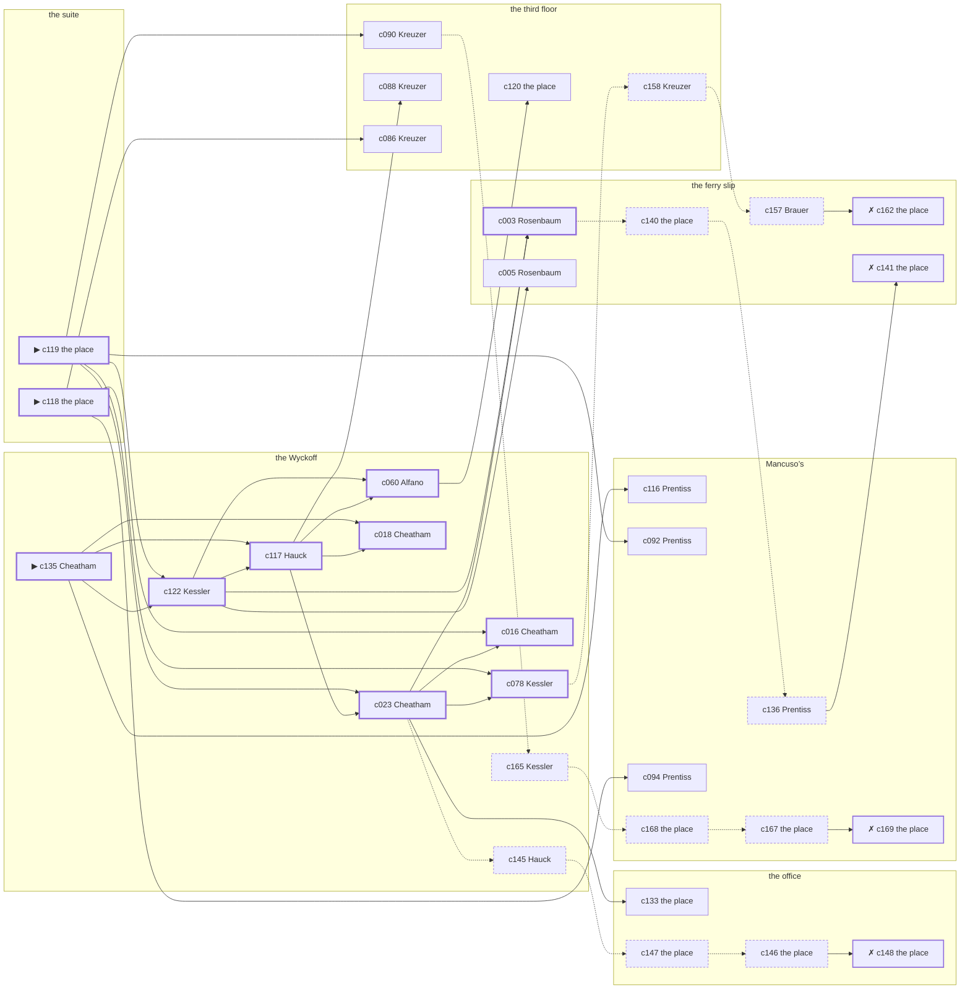

# Hell’s Kitchen — case 4

**Seed** 4 · **Difficulty** 2 · **Attempts** 1 · **Detective** Humphrey

**Par** 10 actions · **Slack** 6 · **Budget** 16 · **Findable** 34 (spine 11, corroboration 9, noise 10 + 4 disqualifiers) · **Noise ratio** 41% · **Candidate pool** 170

## 1. The Truth

Konrad Brauer, a lawyer with one clerk, the victim’s lawyer, killed Morris Hurwitz, a retired dry-goods wholesaler, with strangling with a cord at the suite at 8:00 PM. Brauer wanted the victim out of a lease (property). Brauer had been at the third floor earlier in the evening, where the weapon lived, and was alone with Hurwitz when it happened. Cheatham hired us.

## 2. Dramatis Personae

| Name | Role | Relationship | Class of secret | Motive | Found at | Killer |
| --- | --- | --- | --- | --- | --- | --- |
| Morris Hurwitz | a retired dry-goods wholesaler | the victim | — | — | — | — |
| Jacob Rosenbaum | a pawnbroker’s man | a customer of the victim’s | forged-identity | exposure | the ferry slip | — |
| Wendell Cheatham (client) | a society columnist | the victim’s neighbour across the airshaft | blackmail | — | the Wyckoff | — |
| Wilhelm Vogel | a longshoreman | the victim’s tenant | fence | — | Mancuso’s | — |
| Frieda Hauck | a seamstress | the victim’s former employee | union-organizing | revenge | the Wyckoff | — |
| Carmine Alfano | a doorman at a club with no sign on it | in the victim’s debt | gambling-debt | — | the Wyckoff | — |
| Konrad Brauer | a lawyer with one clerk | the victim’s lawyer | murder (+ blackmail) | property | the ferry slip | **YES** |
| Nathan Kessler | the doorman | fixture (doorman) | — | — | the Wyckoff | — |
| Lotte Kreuzer | the landlady | fixture (landlady) | — | — | the third floor | — |
| Ezekiel Prentiss | the man behind the counter | fixture (counterman) | — | — | Mancuso’s | — |

## 3. Places

- **the office over the tailor’s shop** (private) — unwatched; objects: a bronze bookend, a day ledger
- **the lobby of the Wyckoff** (semi) — watched by doorman (Kessler); objects: a nickel-plated revolver, a brass umbrella stand, a camel-hair overcoat on a hook
- **the third-floor walk-up on Ninth** (private) — watched by landlady (Kreuzer); objects: a length of sash cord, a bottle of chloral drops, a stack of hatboxes — where the weapon lived
- **the ferry slip at the foot of the street** (public) — unwatched; objects: a pasted-up timetable, a strapped suitcase, a folded stack of evening papers — within earshot of the scene
- **the victim’s suite at the residential hotel** (private) — unwatched; objects: a silver cigarette case — **THE SCENE**; the victim’s address
- **Mancuso’s pool hall** (semi) — watched by counterman (Prentiss); objects: a standing ashtray, an ice pick — within earshot of the scene

## 4. Anchors

The coroner gives 7:00 PM–8:30 PM, four ticks wide. These are what close it: **milk-wagon** and **regular-stool**.

- **the regular who takes the same seat every night** — at 7:30 PM; at the Wyckoff. Somebody reliable notes who was there. Only those present know that the regular was drinking sherry, and said twice what he thought of the beer.
- **the milk wagon on its rounds** — at 6:00 PM, 8:00 PM, 10:00 PM; across the whole neighbourhood. You can time things by it: iron tyres and a horse that will not stand still.
- **the rain starting** — at 10:00 PM; across the whole neighbourhood. Those present carry it: a coat soaked through at the shoulders.

## 5. Timelines

### Hurwitz — the victim

| Tick | Time | Truth | Claimed | Companion claimed |
| --- | --- | --- | --- | --- |
| 0 | 6:00 PM | the Wyckoff | the Wyckoff | — |
| 1 | 6:30 PM | the Wyckoff | the Wyckoff | — |
| 2 | 7:00 PM | the office | the office | — |
| 3 | 7:30 PM | the Wyckoff | the Wyckoff | — |
| 4 | 8:00 PM | the suite ☠ | the suite | — |
| 5 | 8:30 PM | — | — | — |
| 6 | 9:00 PM | — | — | — |
| 7 | 9:30 PM | — | — | — |
| 8 | 10:00 PM | — | — | — |
| 9 | 10:30 PM | — | — | — |
| 10 | 11:00 PM | — | — | — |
| 11 | 11:30 PM | — | — | — |

### Rosenbaum

| Tick | Time | Truth | Claimed | Companion claimed |
| --- | --- | --- | --- | --- |
| 0 | 6:00 PM | the Wyckoff | the Wyckoff | — |
| 1 | 6:30 PM | the Wyckoff | the Wyckoff | — |
| 2 | 7:00 PM | the third floor | the third floor | — |
| 3 | 7:30 PM | the third floor | the third floor | — |
| 4 | 8:00 PM | Mancuso’s | Mancuso’s | — |
| 5 | 8:30 PM | Mancuso’s | Mancuso’s | — |
| 6 | 9:00 PM | the ferry slip | the ferry slip | — |
| 7 | 9:30 PM | the ferry slip | the ferry slip | — |
| 8 | 10:00 PM | the ferry slip | the ferry slip | — |
| 9 | 10:30 PM | the ferry slip | the ferry slip | — |
| 10 | 11:00 PM | the ferry slip | the ferry slip | — |
| 11 | 11:30 PM | the ferry slip | the ferry slip | — |

### Cheatham

| Tick | Time | Truth | Claimed | Companion claimed |
| --- | --- | --- | --- | --- |
| 0 | 6:00 PM | the Wyckoff | the Wyckoff | — |
| 1 | 6:30 PM | the office | the office | — |
| 2 | 7:00 PM | the office | **Mancuso’s** | Hauck |
| 3 | 7:30 PM | the suite | the suite | — |
| 4 | 8:00 PM | Mancuso’s | Mancuso’s | — |
| 5 | 8:30 PM | the Wyckoff | the Wyckoff | — |
| 6 | 9:00 PM | the Wyckoff | the Wyckoff | — |
| 7 | 9:30 PM | the third floor | the third floor | — |
| 8 | 10:00 PM | the ferry slip | the ferry slip | — |
| 9 | 10:30 PM | the Wyckoff | the Wyckoff | — |
| 10 | 11:00 PM | the Wyckoff | the Wyckoff | — |
| 11 | 11:30 PM | the Wyckoff | the Wyckoff | — |

### Vogel

| Tick | Time | Truth | Claimed | Companion claimed |
| --- | --- | --- | --- | --- |
| 0 | 6:00 PM | Mancuso’s | Mancuso’s | — |
| 1 | 6:30 PM | Mancuso’s | Mancuso’s | — |
| 2 | 7:00 PM | Mancuso’s | Mancuso’s | — |
| 3 | 7:30 PM | Mancuso’s | **the ferry slip** | — |
| 4 | 8:00 PM | Mancuso’s | **the ferry slip** | — |
| 5 | 8:30 PM | Mancuso’s | Mancuso’s | — |
| 6 | 9:00 PM | the ferry slip | the ferry slip | — |
| 7 | 9:30 PM | the Wyckoff | the Wyckoff | — |
| 8 | 10:00 PM | the Wyckoff | the Wyckoff | — |
| 9 | 10:30 PM | the ferry slip | the ferry slip | — |
| 10 | 11:00 PM | the Wyckoff | the Wyckoff | — |
| 11 | 11:30 PM | the ferry slip | the ferry slip | — |

### Hauck

| Tick | Time | Truth | Claimed | Companion claimed |
| --- | --- | --- | --- | --- |
| 0 | 6:00 PM | the Wyckoff | the Wyckoff | — |
| 1 | 6:30 PM | the Wyckoff | the Wyckoff | — |
| 2 | 7:00 PM | the Wyckoff | the Wyckoff | — |
| 3 | 7:30 PM | the Wyckoff | the Wyckoff | — |
| 4 | 8:00 PM | the Wyckoff | the Wyckoff | — |
| 5 | 8:30 PM | the Wyckoff | the Wyckoff | — |
| 6 | 9:00 PM | the Wyckoff | the Wyckoff | — |
| 7 | 9:30 PM | the third floor | the third floor | — |
| 8 | 10:00 PM | the Wyckoff | the Wyckoff | — |
| 9 | 10:30 PM | the ferry slip | **the Wyckoff** | — |
| 10 | 11:00 PM | the ferry slip | **the Wyckoff** | — |
| 11 | 11:30 PM | the ferry slip | the ferry slip | — |

### Alfano

| Tick | Time | Truth | Claimed | Companion claimed |
| --- | --- | --- | --- | --- |
| 0 | 6:00 PM | the third floor | the third floor | — |
| 1 | 6:30 PM | the third floor | the third floor | — |
| 2 | 7:00 PM | the office | the office | — |
| 3 | 7:30 PM | the office | the office | — |
| 4 | 8:00 PM | Mancuso’s | **the Wyckoff** | Rosenbaum |
| 5 | 8:30 PM | Mancuso’s | **the Wyckoff** | Rosenbaum |
| 6 | 9:00 PM | the Wyckoff | the Wyckoff | — |
| 7 | 9:30 PM | the Wyckoff | the Wyckoff | — |
| 8 | 10:00 PM | the Wyckoff | the Wyckoff | — |
| 9 | 10:30 PM | the Wyckoff | the Wyckoff | — |
| 10 | 11:00 PM | the third floor | the third floor | — |
| 11 | 11:30 PM | the Wyckoff | the Wyckoff | — |

### Brauer — the killer

| Tick | Time | Truth | Claimed | Companion claimed |
| --- | --- | --- | --- | --- |
| 0 | 6:00 PM | the third floor | the third floor | — |
| 1 | 6:30 PM | the Wyckoff | **the office** | — |
| 2 | 7:00 PM | the Wyckoff | the Wyckoff | — |
| 3 | 7:30 PM | the ferry slip | the ferry slip | — |
| 4 | 8:00 PM | the suite ☠ | **Mancuso’s** | Hauck |
| 5 | 8:30 PM | the third floor | the third floor | — |
| 6 | 9:00 PM | the third floor | the third floor | — |
| 7 | 9:30 PM | the Wyckoff | the Wyckoff | — |
| 8 | 10:00 PM | the ferry slip | the ferry slip | — |
| 9 | 10:30 PM | the ferry slip | the ferry slip | — |
| 10 | 11:00 PM | the ferry slip | the ferry slip | — |
| 11 | 11:30 PM | Mancuso’s | Mancuso’s | — |

### Fixtures (never lie, never withhold)

| Tick | Time | Kessler (the doorman) | Kreuzer (the landlady) | Prentiss (the man behind the counter) |
| --- | --- | --- | --- | --- |
| 0 | 6:00 PM | the Wyckoff | the third floor | Mancuso’s |
| 1 | 6:30 PM | the Wyckoff | the third floor | Mancuso’s |
| 2 | 7:00 PM | the Wyckoff | the third floor | Mancuso’s |
| 3 | 7:30 PM | the Wyckoff | the third floor | Mancuso’s |
| 4 | 8:00 PM | the Wyckoff | the Wyckoff | Mancuso’s |
| 5 | 8:30 PM | the Wyckoff | the third floor | Mancuso’s |
| 6 | 9:00 PM | the Wyckoff | the third floor | Mancuso’s |
| 7 | 9:30 PM | the Wyckoff | the third floor | Mancuso’s |
| 8 | 10:00 PM | the Wyckoff | the third floor | Mancuso’s |
| 9 | 10:30 PM | the Wyckoff | the third floor | Mancuso’s |
| 10 | 11:00 PM | the Wyckoff | the third floor | the ferry slip |
| 11 | 11:30 PM | the Wyckoff | the third floor | Mancuso’s |

## 6. Secrets in play

- **Rosenbaum** (forged-identity): Rosenbaum is not the person the papers say. Nothing about the evening is hidden; the lie is all in the paperwork.
- **Cheatham** (blackmail): Cheatham meets the victim alone at the office from 7:00 PM and asks for money.
- **Vogel** (fence): Vogel hands a parcel of stolen goods to a man at Mancuso’s from 7:30 PM to 8:00 PM.
- **Hauck** (union-organizing): Hauck is at the ferry slip from 10:30 PM to 11:00 PM signing men up, which is a firing offence and worse.
- **Alfano** (gambling-debt): Alfano slips off to Mancuso’s from 8:00 PM to 8:30 PM to settle with a bookmaker.
- **Brauer** (murder): Brauer is at the suite from 8:00 PM, alone with Hurwitz when it happens at 8:00 PM.
- **Brauer** also (blackmail): Brauer meets the victim alone at the Wyckoff from 6:30 PM and asks for money.

## 7. Clue list — the 34 findable

The opening three, free at the start: c118, c119, c135. Everything else has to be led to. The full candidate pool is in the companion file.

### At the office

- **c133** [corroboration] (document; the place itself) → (end)
  - Found at the office: A lease assignment made out in Brauer’s name, waiting only on Hurwitz’s signature.
  - _establishes: Brauer had a motive (property)_
- **c147** [noise {b1}] (physical; the place itself) → c146
  - A photograph at the office, folded small, of something the victim would have paid to keep folded.
  - _establishes: context only_
- **c146** [noise {b1}] (physical; the place itself) → c148
  - An envelope at the office with nothing in it, addressed in the victim’s hand to no one.
  - _establishes: context only_
- **c148** [disqualifier {b1}] (overheard; the place itself) → (end)
  - The victim’s bank book settles it: four payments, and Cheatham at the office from 7:00 PM collecting the fifth. It is extortion, and an extortionist wants the man alive.
  - _establishes: Cheatham’s blackmail accounted for; Cheatham at the office, 7:00 PM_

### At the Wyckoff

- **c135** [spine ⟨opening⟩] (client; Cheatham on why I was hired) → c122, c117, c018, c116
  - Cheatham hired us, and wants it known that Brauer wanted the victim out of a lease, and would rather we started there.
  - _establishes: Brauer had a motive (property)_
- **c122** [spine] (anchor; Kessler on Hurwitz that evening) → c117, c060, c003, c005
  - Kessler puts Hurwitz at the Wyckoff when the regular came in for his seat, which was 7:30 PM, and alive enough to argue about the weather.
  - _establishes: the victim alive at 7:30 PM; Hurwitz at the Wyckoff, 7:30 PM_
- **c117** [spine] (denial; Hauck on Brauer’s account) → c023, c018, c060, c088
  - Brauer names Hauck as the company for it. Hauck was at the Wyckoff at 8:00 PM, and says Brauer was not there.
  - _establishes: Brauer not at Mancuso’s, 8:00 PM_
- **c023** [spine] (observation; Cheatham on Alfano) → c016, c078, c003, c133, c145
  - Cheatham says Alfano was at Mancuso’s at 8:00 PM.
  - _establishes: Alfano at Mancuso’s, 8:00 PM_
- **c016** [spine] (observation; Cheatham on Rosenbaum) → (end)
  - Cheatham says Rosenbaum was at Mancuso’s at 8:00 PM.
  - _establishes: Rosenbaum at Mancuso’s, 8:00 PM_
- **c018** [spine] (observation; Cheatham on Vogel) → (end)
  - Cheatham says Vogel was at Mancuso’s at 8:00 PM.
  - _establishes: Vogel at Mancuso’s, 8:00 PM_
- **c060** [spine] (observation; Alfano on Brauer) → c120
  - Alfano says Brauer was at the third floor at 6:00 PM.
  - _establishes: Brauer at the third floor, 6:00 PM; Brauer could reach the weapon_
- **c078** [spine] (observation; Kessler on Hauck) → c158
  - Kessler says Hauck was at the Wyckoff from 6:00 PM to 9:00 PM.
  - _establishes: Hauck at the Wyckoff, 6:00 PM–9:00 PM_
- **c145** [noise {b1}] (overheard; Hauck on Cheatham) → c147
  - Hauck on Cheatham: The victim had been drawing cash in amounts that did not match anything in the accounts.
  - _establishes: context only_
- **c165** [noise {b2}] (overheard; Kessler on Alfano) → c168
  - Kessler on Alfano: A man nobody knew was waiting for Alfano at Mancuso’s and would not give a name.
  - _establishes: context only_

### At the third floor

- **c120** [corroboration] (physical; the place itself) → (end)
  - A length of sash cord is gone from the third floor. A cut end of the same hemp is still tied to the fitting it was taken from.
  - _establishes: something gone from the third floor; how it was done_
- **c090** [corroboration] (observation; Kreuzer on Brauer) → c165
  - Kreuzer says Brauer was at the third floor at 6:00 PM.
  - _establishes: Brauer at the third floor, 6:00 PM; Brauer could reach the weapon_
- **c088** [corroboration] (observation; Kreuzer on Alfano) → (end)
  - Kreuzer says Alfano was at the third floor from 6:00 PM to 6:30 PM.
  - _establishes: Alfano at the third floor, 6:00 PM–6:30 PM; Alfano could reach the weapon_
- **c086** [corroboration] (observation; Kreuzer on Hauck) → (end)
  - Kreuzer says Hauck was at the Wyckoff at 8:00 PM.
  - _establishes: Hauck at the Wyckoff, 8:00 PM_
- **c158** [noise {b3}] (overheard; Kreuzer on Hauck) → c157
  - Kreuzer on Hauck: There is a list going round and Hauck’s name is at the top of it.
  - _establishes: context only_

### At the ferry slip

- **c003** [spine] (observation; Rosenbaum on Cheatham) → c140
  - Rosenbaum says Cheatham was at Mancuso’s at 8:00 PM.
  - _establishes: Cheatham at Mancuso’s, 8:00 PM_
- **c005** [corroboration] (observation; Rosenbaum on Vogel) → (end)
  - Rosenbaum says Vogel was at Mancuso’s from 8:00 PM to 8:30 PM.
  - _establishes: Vogel at Mancuso’s, 8:00 PM–8:30 PM_
- **c157** [noise {b3}] (overheard; Brauer on Hauck) → c162
  - Brauer on Hauck: Hauck has been seen with men from three different shops and none of them were drinking.
  - _establishes: context only_
- **c162** [disqualifier {b3}] (overheard; the place itself) → (end)
  - Forty men will swear to it if they have to: Hauck was at the ferry slip from 10:30 PM to 11:00 PM taking their names, and the only thing Hauck is guilty of is a charter.
  - _establishes: Hauck’s union-organizing accounted for; Hauck at the ferry slip, 10:30 PM–11:00 PM_
- **c140** [noise {b4}] (physical; the place itself) → c136
  - A steamship ticket stub among Rosenbaum’s things, in the name of a man who died at Belleau Wood.
  - _establishes: context only_
- **c141** [disqualifier {b4}] (overheard; the place itself) → (end)
  - The name Rosenbaum was born with turns up on a desertion warrant from 1918. Rosenbaum has been hiding from the Army for eleven years and from nobody else.
  - _establishes: Rosenbaum’s forged-identity accounted for_

### At the suite

- **c118** [spine ⟨opening⟩] (scene; the place itself) → c016, c094, c086
  - Hurwitz was found at the suite. His watch glass broke against the floor and the hands have not moved since. The milk wagon was at the corner at 8:00 PM, where the driver’s round puts him every night.
  - _establishes: the victim dead by 8:00 PM; how it was done_
- **c119** [spine ⟨opening⟩] (morgue; the place itself) → c122, c023, c078, c090, c092
  - The coroner puts death between 7:00 PM and 8:30 PM — two hours of nothing useful. A ligature furrow across the throat. Three fibres of hemp in the skin.
  - _establishes: death between 7:00 PM and 8:30 PM; how it was done_

### At Mancuso’s

- **c116** [corroboration] (observation; Prentiss on Brauer’s account) → (end)
  - Prentiss was at Mancuso’s at 8:00 PM and says Brauer was not.
  - _establishes: Brauer not at Mancuso’s, 8:00 PM_
- **c092** [corroboration] (observation; Prentiss on Rosenbaum) → (end)
  - Prentiss says Rosenbaum was at Mancuso’s from 8:00 PM to 8:30 PM.
  - _establishes: Rosenbaum at Mancuso’s, 8:00 PM–8:30 PM_
- **c094** [corroboration] (observation; Prentiss on Cheatham) → (end)
  - Prentiss says Cheatham was at Mancuso’s at 8:00 PM.
  - _establishes: Cheatham at Mancuso’s, 8:00 PM_
- **c168** [noise {b2}] (physical; the place itself) → c167
  - A book of markers at Mancuso’s with Alfano’s initials against four of them.
  - _establishes: context only_
- **c167** [noise {b2}] (physical; the place itself) → c169
  - Betting slips at Mancuso’s in Alfano’s pocketbook, all of them losers, all of them this month.
  - _establishes: context only_
- **c169** [disqualifier {b2}] (overheard; the place itself) → (end)
  - The bookmaker’s runner is found and will say it: Alfano was at Mancuso’s from 8:00 PM to 8:30 PM paying off eleven hundred dollars, a dollar at a time, and went nowhere near the killing.
  - _establishes: Alfano’s gambling-debt accounted for; Alfano at Mancuso’s, 8:00 PM–8:30 PM_
- **c136** [noise {b4}] (overheard; Prentiss on Rosenbaum) → c141
  - Prentiss on Rosenbaum: Rosenbaum’s registration card gives an address on a street that does not exist.
  - _establishes: context only_

## 8. Clue graph

## 9. Deduction path

Par is **10 actions** and the budget is par plus 6: **16**. Every id below is a spine clue; the inference is the sheet’s, not the clue’s.

**Time of death.** The coroner gives four ticks. The anchors close it to 8:00 PM: one puts Hurwitz alive at 7:30 PM, the other times the scene at 8:00 PM. _(c119, c122, c118)_

**Clearing the innocent.**

- Rosenbaum was not at the suite at 8:00 PM. _(c016; + 1 corroborating)_
- Cheatham was not at the suite at 8:00 PM. _(c003; + 1 corroborating)_
- Vogel was not at the suite at 8:00 PM. _(c018; + 1 corroborating)_
- Hauck was not at the suite at 8:00 PM. _(c078; + 1 corroborating)_
- Alfano was not at the suite at 8:00 PM. _(c023; + 1 corroborating)_

**Naming the killer.** Brauer claims Mancuso’s at 8:00 PM. Two independent sources put that out of the question. _(c117; + 1 corroborating)_

**The weapon.** Brauer was at the third floor before 8:00 PM, where a length of sash cord was kept. _(c060; + 1 corroborating)_

**Method.** Strangling with a cord, on two physical sources. _(c118, c119; + 1 corroborating)_

**Motive.** property, on two independent sources. _(c135; + 1 corroborating)_

## 10. Red herrings

**Innocents who lie about the murder tick:**

- Vogel claims the ferry slip at 8:00 PM and was really at Mancuso’s. Reason: Vogel hands a parcel of stolen goods to a man at Mancuso’s from 7:30 PM to 8:00 PM.
- Alfano claims the Wyckoff at 8:00 PM and was really at Mancuso’s. Reason: Alfano slips off to Mancuso’s from 8:00 PM to 8:30 PM to settle with a bookmaker.

**Innocents with a motive:**

- Rosenbaum — exposure: was about to be exposed by the victim.
- Hauck — revenge: blamed the victim for a ruin.

**Noise branches, and what knocks each one down:**

- **b1** (Cheatham, blackmail): c145 → c147 → c146 → **c148** — The victim’s bank book settles it: four payments, and Cheatham at the office from 7:00 PM collecting the fifth. It is extortion, and an extortionist wants the man alive.
- **b2** (Alfano, gambling-debt): c165 → c168 → c167 → **c169** — The bookmaker’s runner is found and will say it: Alfano was at Mancuso’s from 8:00 PM to 8:30 PM paying off eleven hundred dollars, a dollar at a time, and went nowhere near the killing.
- **b3** (Hauck, union-organizing): c158 → c157 → **c162** — Forty men will swear to it if they have to: Hauck was at the ferry slip from 10:30 PM to 11:00 PM taking their names, and the only thing Hauck is guilty of is a charter.
- **b4** (Rosenbaum, forged-identity): c140 → c136 → **c141** — The name Rosenbaum was born with turns up on a desertion warrant from 1918. Rosenbaum has been hiding from the Army for eleven years and from nobody else.

