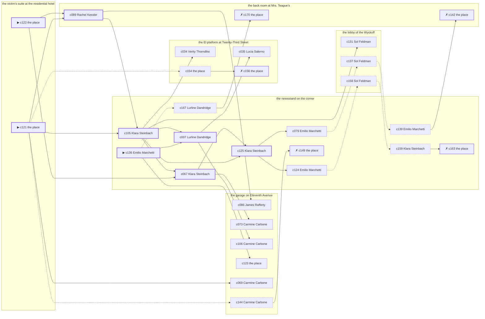

# Harlem — case 5

**Seed** 5 · **Difficulty** 2 · **Attempts** 1 · **Detective** Humphrey

**Par** 7 actions · **Budget** 20 · **Slack** 13 · **Findable** 30 (spine 8, corroboration 10, noise 7 + 5 disqualifiers) · **Noise ratio** 40% · **Candidate pool** 171

## 1. The Truth

Eunice Bledsoe, a stringer for the evening papers, the victim’s rival in trade, killed Friedrich Kreuzer, a theatrical agent, with an ice pick at the victim’s suite at the residential hotel at 8:00 PM. Eunice Bledsoe blamed the victim for a ruin (revenge). Eunice Bledsoe had been at the garage on Eleventh Avenue earlier in the evening, where the weapon lived, and was alone with Friedrich Kreuzer when it happened. Emilio Marchetti hired us.

## 2. Dramatis Personae

| Name | Role | Relationship | Class of secret | Motive | Found at | Killer |
| --- | --- | --- | --- | --- | --- | --- |
| Friedrich Kreuzer | a theatrical agent | the victim | — | — | — | — |
| Eunice Bledsoe | a stringer for the evening papers | the victim’s rival in trade | murder (+ gambling-debt) | revenge | the newsstand on the corner | **YES** |
| Lurline Dandridge | a chambermaid | the victim’s tenant | hidden-family | — | the newsstand on the corner | — |
| Emilio Marchetti (client) | a policy runner | a childhood friend of the victim’s from the same block | fence | — | the newsstand on the corner | — |
| Verity Thorndike | a curb broker | the victim’s rival in trade | fence | exposure | the El platform at Twenty-Third Street | — |
| Lucia Salerno | an insurance adjuster | the victim’s rival in trade | gambling-debt | — | the El platform at Twenty-Third Street | — |
| James Rafferty | the victim’s nephew, at loose ends | the victim’s brother-in-law | secret-drinking | inheritance | the garage on Eleventh Avenue | — |
| Sol Feldman | the doorman | fixture (doorman) | — | — | the lobby of the Wyckoff | — |
| Rachel Kessler | the landlady | fixture (landlady) | — | — | the back room at Mrs. Teague’s | — |
| Klara Steinbach | the news dealer | fixture (newsstand) | — | — | the newsstand on the corner | — |
| Carmine Carbone | the man behind the counter | fixture (counterman) | — | — | the garage on Eleventh Avenue | — |

## 3. Places

- **the lobby of the Wyckoff** (semi) — watched by doorman (Sol Feldman); objects: a brass umbrella stand, a nickel-plated revolver
- **the back room at Mrs. Teague’s** (private) — watched by landlady (Rachel Kessler); objects: the roof-door key, a strapped suitcase, a length of sash cord
- **the El platform at Twenty-Third Street** (public) — unwatched; objects: a folded stack of evening papers, a pasted-up timetable — within earshot of the scene
- **the newsstand on the corner** (public) — watched by newsstand (Klara Steinbach); objects: a spike of pawn tickets
- **the victim’s suite at the residential hotel** (private) — unwatched; objects: a camel-hair overcoat on a hook, a silver cigarette case — **THE SCENE**; the victim’s address
- **the garage on Eleventh Avenue** (semi) — watched by counterman (Carmine Carbone); objects: an ice pick, a mechanic’s toolbox — where the weapon lived; within earshot of the scene

## 4. Anchors

The coroner gives 6:30 PM–8:00 PM, four ticks wide. These are what close it: **drunk-singing** and **last-edition**.

- **the last edition coming off the truck** — at 7:30 PM; at the newsstand on the corner. Somebody reliable notes who was there. Those present carry it: ink still wet enough to come off on a glove.
- **the drunk singing under the window** — at 8:00 PM; at the victim’s suite at the residential hotel. You can time things by it: the same two verses until somebody threw a shoe. Only those present know that it was a shoe, and it was thrown by a woman, and it did not land.
- **the shift change at the garage** — at 11:00 PM; at the garage on Eleventh Avenue. Somebody reliable notes who was there. Those present carry it: cylinder oil on a cuff.

## 5. Timelines

### Friedrich Kreuzer — the victim

| Tick | Time | Truth | Claimed | Companion claimed |
| --- | --- | --- | --- | --- |
| 0 | 6:00 PM | the El platform at Twenty-Third Street | the El platform at Twenty-Third Street | — |
| 1 | 6:30 PM | the El platform at Twenty-Third Street | the El platform at Twenty-Third Street | — |
| 2 | 7:00 PM | the back room at Mrs. Teague’s | the back room at Mrs. Teague’s | — |
| 3 | 7:30 PM | the newsstand on the corner | the newsstand on the corner | — |
| 4 | 8:00 PM | the victim’s suite at the residential hotel ☠ | the victim’s suite at the residential hotel | — |
| 5 | 8:30 PM | — | — | — |
| 6 | 9:00 PM | — | — | — |
| 7 | 9:30 PM | — | — | — |
| 8 | 10:00 PM | — | — | — |
| 9 | 10:30 PM | — | — | — |
| 10 | 11:00 PM | — | — | — |
| 11 | 11:30 PM | — | — | — |

### Eunice Bledsoe — the killer

| Tick | Time | Truth | Claimed | Companion claimed |
| --- | --- | --- | --- | --- |
| 0 | 6:00 PM | the garage on Eleventh Avenue | the garage on Eleventh Avenue | — |
| 1 | 6:30 PM | the El platform at Twenty-Third Street | **the back room at Mrs. Teague’s** | — |
| 2 | 7:00 PM | the El platform at Twenty-Third Street | **the back room at Mrs. Teague’s** | — |
| 3 | 7:30 PM | the victim’s suite at the residential hotel | **the newsstand on the corner** | — |
| 4 | 8:00 PM | the victim’s suite at the residential hotel ☠ | **the newsstand on the corner** | — |
| 5 | 8:30 PM | the newsstand on the corner | the newsstand on the corner | — |
| 6 | 9:00 PM | the newsstand on the corner | the newsstand on the corner | — |
| 7 | 9:30 PM | the newsstand on the corner | the newsstand on the corner | — |
| 8 | 10:00 PM | the newsstand on the corner | the newsstand on the corner | — |
| 9 | 10:30 PM | the lobby of the Wyckoff | the lobby of the Wyckoff | — |
| 10 | 11:00 PM | the lobby of the Wyckoff | the lobby of the Wyckoff | — |
| 11 | 11:30 PM | the lobby of the Wyckoff | the lobby of the Wyckoff | — |

### Lurline Dandridge

| Tick | Time | Truth | Claimed | Companion claimed |
| --- | --- | --- | --- | --- |
| 0 | 6:00 PM | the garage on Eleventh Avenue | the garage on Eleventh Avenue | — |
| 1 | 6:30 PM | the newsstand on the corner | the newsstand on the corner | — |
| 2 | 7:00 PM | the victim’s suite at the residential hotel | the victim’s suite at the residential hotel | — |
| 3 | 7:30 PM | the lobby of the Wyckoff | the lobby of the Wyckoff | — |
| 4 | 8:00 PM | the back room at Mrs. Teague’s | **the garage on Eleventh Avenue** | Eunice Bledsoe |
| 5 | 8:30 PM | the back room at Mrs. Teague’s | **the garage on Eleventh Avenue** | Eunice Bledsoe |
| 6 | 9:00 PM | the newsstand on the corner | the newsstand on the corner | — |
| 7 | 9:30 PM | the garage on Eleventh Avenue | the garage on Eleventh Avenue | — |
| 8 | 10:00 PM | the lobby of the Wyckoff | the lobby of the Wyckoff | — |
| 9 | 10:30 PM | the lobby of the Wyckoff | the lobby of the Wyckoff | — |
| 10 | 11:00 PM | the newsstand on the corner | the newsstand on the corner | — |
| 11 | 11:30 PM | the newsstand on the corner | the newsstand on the corner | — |

### Emilio Marchetti

| Tick | Time | Truth | Claimed | Companion claimed |
| --- | --- | --- | --- | --- |
| 0 | 6:00 PM | the El platform at Twenty-Third Street | the El platform at Twenty-Third Street | — |
| 1 | 6:30 PM | the newsstand on the corner | the newsstand on the corner | — |
| 2 | 7:00 PM | the victim’s suite at the residential hotel | the victim’s suite at the residential hotel | — |
| 3 | 7:30 PM | the newsstand on the corner | the newsstand on the corner | — |
| 4 | 8:00 PM | the back room at Mrs. Teague’s | the back room at Mrs. Teague’s | — |
| 5 | 8:30 PM | the back room at Mrs. Teague’s | the back room at Mrs. Teague’s | — |
| 6 | 9:00 PM | the back room at Mrs. Teague’s | the back room at Mrs. Teague’s | — |
| 7 | 9:30 PM | the newsstand on the corner | **the El platform at Twenty-Third Street** | Eunice Bledsoe |
| 8 | 10:00 PM | the newsstand on the corner | the newsstand on the corner | — |
| 9 | 10:30 PM | the newsstand on the corner | the newsstand on the corner | — |
| 10 | 11:00 PM | the newsstand on the corner | the newsstand on the corner | — |
| 11 | 11:30 PM | the newsstand on the corner | the newsstand on the corner | — |

### Verity Thorndike

| Tick | Time | Truth | Claimed | Companion claimed |
| --- | --- | --- | --- | --- |
| 0 | 6:00 PM | the lobby of the Wyckoff | the lobby of the Wyckoff | — |
| 1 | 6:30 PM | the victim’s suite at the residential hotel | the victim’s suite at the residential hotel | — |
| 2 | 7:00 PM | the garage on Eleventh Avenue | the garage on Eleventh Avenue | — |
| 3 | 7:30 PM | the garage on Eleventh Avenue | the garage on Eleventh Avenue | — |
| 4 | 8:00 PM | the back room at Mrs. Teague’s | the back room at Mrs. Teague’s | — |
| 5 | 8:30 PM | the lobby of the Wyckoff | the lobby of the Wyckoff | — |
| 6 | 9:00 PM | the El platform at Twenty-Third Street | the El platform at Twenty-Third Street | — |
| 7 | 9:30 PM | the El platform at Twenty-Third Street | **the garage on Eleventh Avenue** | Lucia Salerno |
| 8 | 10:00 PM | the El platform at Twenty-Third Street | **the garage on Eleventh Avenue** | Lucia Salerno |
| 9 | 10:30 PM | the El platform at Twenty-Third Street | the El platform at Twenty-Third Street | — |
| 10 | 11:00 PM | the newsstand on the corner | the newsstand on the corner | — |
| 11 | 11:30 PM | the newsstand on the corner | the newsstand on the corner | — |

### Lucia Salerno

| Tick | Time | Truth | Claimed | Companion claimed |
| --- | --- | --- | --- | --- |
| 0 | 6:00 PM | the garage on Eleventh Avenue | the garage on Eleventh Avenue | — |
| 1 | 6:30 PM | the garage on Eleventh Avenue | the garage on Eleventh Avenue | — |
| 2 | 7:00 PM | the garage on Eleventh Avenue | the garage on Eleventh Avenue | — |
| 3 | 7:30 PM | the garage on Eleventh Avenue | the garage on Eleventh Avenue | — |
| 4 | 8:00 PM | the newsstand on the corner | **the lobby of the Wyckoff** | — |
| 5 | 8:30 PM | the newsstand on the corner | the newsstand on the corner | — |
| 6 | 9:00 PM | the El platform at Twenty-Third Street | the El platform at Twenty-Third Street | — |
| 7 | 9:30 PM | the El platform at Twenty-Third Street | the El platform at Twenty-Third Street | — |
| 8 | 10:00 PM | the El platform at Twenty-Third Street | the El platform at Twenty-Third Street | — |
| 9 | 10:30 PM | the El platform at Twenty-Third Street | the El platform at Twenty-Third Street | — |
| 10 | 11:00 PM | the El platform at Twenty-Third Street | the El platform at Twenty-Third Street | — |
| 11 | 11:30 PM | the El platform at Twenty-Third Street | the El platform at Twenty-Third Street | — |

### James Rafferty

| Tick | Time | Truth | Claimed | Companion claimed |
| --- | --- | --- | --- | --- |
| 0 | 6:00 PM | the back room at Mrs. Teague’s | **the garage on Eleventh Avenue** | — |
| 1 | 6:30 PM | the back room at Mrs. Teague’s | **the garage on Eleventh Avenue** | — |
| 2 | 7:00 PM | the back room at Mrs. Teague’s | the back room at Mrs. Teague’s | — |
| 3 | 7:30 PM | the lobby of the Wyckoff | the lobby of the Wyckoff | — |
| 4 | 8:00 PM | the back room at Mrs. Teague’s | the back room at Mrs. Teague’s | — |
| 5 | 8:30 PM | the garage on Eleventh Avenue | the garage on Eleventh Avenue | — |
| 6 | 9:00 PM | the garage on Eleventh Avenue | the garage on Eleventh Avenue | — |
| 7 | 9:30 PM | the garage on Eleventh Avenue | the garage on Eleventh Avenue | — |
| 8 | 10:00 PM | the garage on Eleventh Avenue | the garage on Eleventh Avenue | — |
| 9 | 10:30 PM | the garage on Eleventh Avenue | the garage on Eleventh Avenue | — |
| 10 | 11:00 PM | the garage on Eleventh Avenue | the garage on Eleventh Avenue | — |
| 11 | 11:30 PM | the garage on Eleventh Avenue | the garage on Eleventh Avenue | — |

### Fixtures (never lie, never withhold)

| Tick | Time | Sol Feldman (the doorman) | Rachel Kessler (the landlady) | Klara Steinbach (the news dealer) | Carmine Carbone (the man behind the counter) |
| --- | --- | --- | --- | --- | --- |
| 0 | 6:00 PM | the lobby of the Wyckoff | the back room at Mrs. Teague’s | the newsstand on the corner | the garage on Eleventh Avenue |
| 1 | 6:30 PM | the lobby of the Wyckoff | the back room at Mrs. Teague’s | the newsstand on the corner | the garage on Eleventh Avenue |
| 2 | 7:00 PM | the lobby of the Wyckoff | the back room at Mrs. Teague’s | the newsstand on the corner | the garage on Eleventh Avenue |
| 3 | 7:30 PM | the lobby of the Wyckoff | the back room at Mrs. Teague’s | the newsstand on the corner | the garage on Eleventh Avenue |
| 4 | 8:00 PM | the lobby of the Wyckoff | the back room at Mrs. Teague’s | the newsstand on the corner | the newsstand on the corner |
| 5 | 8:30 PM | the lobby of the Wyckoff | the back room at Mrs. Teague’s | the newsstand on the corner | the garage on Eleventh Avenue |
| 6 | 9:00 PM | the lobby of the Wyckoff | the lobby of the Wyckoff | the newsstand on the corner | the garage on Eleventh Avenue |
| 7 | 9:30 PM | the lobby of the Wyckoff | the back room at Mrs. Teague’s | the newsstand on the corner | the garage on Eleventh Avenue |
| 8 | 10:00 PM | the lobby of the Wyckoff | the back room at Mrs. Teague’s | the newsstand on the corner | the garage on Eleventh Avenue |
| 9 | 10:30 PM | the lobby of the Wyckoff | the back room at Mrs. Teague’s | the newsstand on the corner | the garage on Eleventh Avenue |
| 10 | 11:00 PM | the lobby of the Wyckoff | the back room at Mrs. Teague’s | the newsstand on the corner | the garage on Eleventh Avenue |
| 11 | 11:30 PM | the lobby of the Wyckoff | the back room at Mrs. Teague’s | the newsstand on the corner | the garage on Eleventh Avenue |

## 6. Secrets in play

- **Eunice Bledsoe** (murder): Eunice Bledsoe is at the victim’s suite at the residential hotel from 7:30 PM to 8:00 PM, alone with Friedrich Kreuzer when it happens at 8:00 PM.
- **Eunice Bledsoe** also (gambling-debt): Eunice Bledsoe slips off to the El platform at Twenty-Third Street from 6:30 PM to 7:00 PM to settle with a bookmaker.
- **Lurline Dandridge** (hidden-family): Lurline Dandridge goes to the back room at Mrs. Teague’s from 8:00 PM to 8:30 PM to see a child nobody is supposed to know about.
- **Emilio Marchetti** (fence): Emilio Marchetti hands a parcel of stolen goods to a man at the newsstand on the corner from 9:30 PM.
- **Verity Thorndike** (fence): Verity Thorndike hands a parcel of stolen goods to a man at the El platform at Twenty-Third Street from 9:30 PM to 10:00 PM.
- **Lucia Salerno** (gambling-debt): Lucia Salerno slips off to the newsstand on the corner from 8:00 PM to settle with a bookmaker.
- **James Rafferty** (secret-drinking): James Rafferty drinks alone at the back room at Mrs. Teague’s from 6:00 PM to 6:30 PM and will claim to have been anywhere else.

## 7. Clue list — the 30 findable

The opening three, free at the start: c121, c122, c136. Everything else has to be led to. The full candidate pool is in the companion file.

### At the lobby of the Wyckoff

- **c131** [corroboration] (overheard; Sol Feldman on Eunice Bledsoe and Friedrich Kreuzer) → (end)
  - Sol Feldman says Eunice Bledsoe said Friedrich Kreuzer had taken everything and would be made to feel it.
  - _establishes: Eunice Bledsoe had a motive (revenge)_
- **c137** [noise {b4}] (overheard; Sol Feldman on Lurline Dandridge) → c139
  - Sol Feldman on Lurline Dandridge: Lurline Dandridge sends money out of every pay envelope and cannot say where it goes.
  - _establishes: context only_
- **c158** [noise {b5}] (overheard; Sol Feldman on Lucia Salerno) → c159
  - Sol Feldman on Lucia Salerno: Lucia Salerno was asking around for a hundred dollars in a hurry earlier in the week.
  - _establishes: context only_

### At the back room at Mrs. Teague’s

- **c089** [spine] (observation; Rachel Kessler on who was there at 8:00 PM) → c105, c086
  - Rachel Kessler runs through it: at 8:00 PM there were Lurline Dandridge, Emilio Marchetti, Verity Thorndike, James Rafferty at the back room at Mrs. Teague’s, and nobody else worth naming.
  - _establishes: Lurline Dandridge at the back room at Mrs. Teague’s, 8:00 PM; Emilio Marchetti at the back room at Mrs. Teague’s, 8:00 PM; Verity Thorndike at the back room at Mrs. Teague’s, 8:00 PM; James Rafferty at the back room at Mrs. Teague’s, 8:00 PM_
- **c170** [disqualifier {b3}] (overheard; the place itself) → (end)
  - The man behind the counter at the back room at Mrs. Teague’s knows exactly: James Rafferty was on the same stool from 6:00 PM to 6:30 PM and was in no condition to walk anywhere, let alone do this.
  - _establishes: James Rafferty’s secret-drinking accounted for; James Rafferty at the back room at Mrs. Teague’s, 6:00 PM–6:30 PM_
- **c142** [disqualifier {b4}] (overheard; the place itself) → (end)
  - The woman who keeps the child says it straight out: Lurline Dandridge was at the back room at Mrs. Teague’s from 8:00 PM to 8:30 PM, the same as every week, and left with the same face as always.
  - _establishes: Lurline Dandridge’s hidden-family accounted for; Lurline Dandridge at the back room at Mrs. Teague’s, 8:00 PM–8:30 PM_

### At the El platform at Twenty-Third Street

- **c035** [corroboration] (observation; Lucia Salerno on Eunice Bledsoe) → (end)
  - Lucia Salerno says Eunice Bledsoe was at the garage on Eleventh Avenue at 6:00 PM.
  - _establishes: Eunice Bledsoe at the garage on Eleventh Avenue, 6:00 PM; Eunice Bledsoe could reach the weapon_
- **c034** [corroboration] (observation; Verity Thorndike on James Rafferty) → (end)
  - Verity Thorndike says James Rafferty was at the back room at Mrs. Teague’s at 8:00 PM.
  - _establishes: James Rafferty at the back room at Mrs. Teague’s, 8:00 PM_
- **c154** [noise {b1}] (physical; the place itself) → c156
  - Wrapping paper and a cut string at the El platform at Twenty-Third Street, and the shop it came from closed two years ago.
  - _establishes: context only_
- **c156** [disqualifier {b1}] (overheard; the place itself) → (end)
  - The receiver at the El platform at Twenty-Third Street would rather talk than be held: Verity Thorndike was there from 9:30 PM to 10:00 PM handing over a parcel of somebody else’s silver, which is a charge Verity Thorndike will take over this one.
  - _establishes: Verity Thorndike’s fence accounted for; Verity Thorndike at the El platform at Twenty-Third Street, 9:30 PM–10:00 PM_

### At the newsstand on the corner

- **c136** [spine ⟨opening⟩] (client; Emilio Marchetti on why I was hired) → c007, c123, c167
  - Emilio Marchetti hired us. Emilio Marchetti wants it known that Eunice Bledsoe blamed the victim for a ruin, and would rather we started there.
  - _establishes: Eunice Bledsoe had a motive (revenge)_
- **c105** [spine] (observation; Klara Steinbach on Eunice Bledsoe’s account) → c067, c125, c007, c131, c034
  - Klara Steinbach was at the newsstand on the corner from 7:30 PM to 8:00 PM and says Eunice Bledsoe was not.
  - _establishes: Eunice Bledsoe not at the newsstand on the corner, 7:30 PM–8:00 PM_
- **c067** [spine] (observation; Klara Steinbach on Lucia Salerno) → c125, c073
  - Klara Steinbach says Lucia Salerno was at the newsstand on the corner from 8:00 PM to 8:30 PM.
  - _establishes: Lucia Salerno at the newsstand on the corner, 8:00 PM–8:30 PM_
- **c125** [spine] (anchor; Klara Steinbach on Friedrich Kreuzer that evening) → c124, c079
  - Klara Steinbach puts Friedrich Kreuzer at the newsstand on the corner when the last edition came up, which was 7:30 PM, and alive enough to argue about the weather.
  - _establishes: the victim alive at 7:30 PM; Friedrich Kreuzer at the newsstand on the corner, 7:30 PM_
- **c007** [spine] (observation; Lurline Dandridge on Eunice Bledsoe) → c035, c106
  - Lurline Dandridge says Eunice Bledsoe was at the garage on Eleventh Avenue at 6:00 PM.
  - _establishes: Eunice Bledsoe at the garage on Eleventh Avenue, 6:00 PM; Eunice Bledsoe could reach the weapon_
- **c124** [corroboration] (anchor; Emilio Marchetti on Friedrich Kreuzer that evening) → c158
  - Emilio Marchetti puts Friedrich Kreuzer at the newsstand on the corner when the last edition came up, which was 7:30 PM, and alive enough to argue about the weather.
  - _establishes: the victim alive at 7:30 PM; Friedrich Kreuzer at the newsstand on the corner, 7:30 PM_
- **c079** [corroboration] (observation; Emilio Marchetti on who was there at 8:00 PM) → c137
  - Emilio Marchetti runs through it: at 8:00 PM there were Lurline Dandridge, Verity Thorndike, James Rafferty at the back room at Mrs. Teague’s, and nobody else worth naming.
  - _establishes: Lurline Dandridge at the back room at Mrs. Teague’s, 8:00 PM; Verity Thorndike at the back room at Mrs. Teague’s, 8:00 PM; James Rafferty at the back room at Mrs. Teague’s, 8:00 PM_
- **c149** [disqualifier {b2}] (overheard; the place itself) → (end)
  - The receiver at the newsstand on the corner would rather talk than be held: Emilio Marchetti was there from 9:30 PM handing over a parcel of somebody else’s silver, which is a charge Emilio Marchetti will take over this one.
  - _establishes: Emilio Marchetti’s fence accounted for; Emilio Marchetti at the newsstand on the corner, 9:30 PM_
- **c167** [noise {b3}] (overheard; Lurline Dandridge on James Rafferty) → c170
  - Lurline Dandridge on James Rafferty: Somebody at the back room at Mrs. Teague’s says James Rafferty is in more often than James Rafferty lets on.
  - _establishes: context only_
- **c139** [noise {b4}] (overheard; Emilio Marchetti on Lurline Dandridge) → c142
  - Emilio Marchetti on Lurline Dandridge: Lurline Dandridge keeps a photograph and will not be asked about it twice.
  - _establishes: context only_
- **c159** [noise {b5}] (overheard; Klara Steinbach on Lucia Salerno) → c163
  - Klara Steinbach on Lucia Salerno: A man nobody knew was waiting for Lucia Salerno at the newsstand on the corner and would not give a name.
  - _establishes: context only_
- **c163** [disqualifier {b5}] (overheard; the place itself) → (end)
  - The bookmaker’s runner is found and will say it: Lucia Salerno was at the newsstand on the corner from 8:00 PM paying off eleven hundred dollars, a dollar at a time, and went nowhere near the killing.
  - _establishes: Lucia Salerno’s gambling-debt accounted for; Lucia Salerno at the newsstand on the corner, 8:00 PM_

### At the victim’s suite at the residential hotel

- **c121** [spine ⟨opening⟩] (scene; the place itself) → c089, c105, c069, c154, c144
  - Friedrich Kreuzer was found at the victim’s suite at the residential hotel. The tap was left running and the basin had overflowed a clean ring onto the boards. The drunk singing under the window came at 8:00 PM, and the singing stopped when the shoe came down, and that was the half hour. That puts the killing in that half hour and no later.
  - _establishes: the victim dead by 8:00 PM; how it was done_
- **c122** [spine ⟨opening⟩] (morgue; the place itself) → c089, c067
  - The coroner puts death between 6:30 PM and 8:00 PM — two hours of nothing useful. A single narrow puncture under the ribs. Very little blood outside the body.
  - _establishes: death between 6:30 PM and 8:00 PM; how it was done_

### At the garage on Eleventh Avenue

- **c086** [corroboration] (observation; James Rafferty on who was there at 8:00 PM) → (end)
  - James Rafferty runs through it: at 8:00 PM there were Lurline Dandridge, Emilio Marchetti, Verity Thorndike at the back room at Mrs. Teague’s, and nobody else worth naming.
  - _establishes: Lurline Dandridge at the back room at Mrs. Teague’s, 8:00 PM; Emilio Marchetti at the back room at Mrs. Teague’s, 8:00 PM; Verity Thorndike at the back room at Mrs. Teague’s, 8:00 PM_
- **c073** [corroboration] (observation; Carmine Carbone on Lucia Salerno) → (end)
  - Carmine Carbone says Lucia Salerno was at the newsstand on the corner at 8:00 PM.
  - _establishes: Lucia Salerno at the newsstand on the corner, 8:00 PM_
- **c106** [corroboration] (observation; Carmine Carbone on Eunice Bledsoe’s account) → (end)
  - Carmine Carbone was at the newsstand on the corner at 8:00 PM and says Eunice Bledsoe was not.
  - _establishes: Eunice Bledsoe not at the newsstand on the corner, 8:00 PM_
- **c123** [corroboration] (physical; the place itself) → (end)
  - An ice pick is gone from the garage on Eleventh Avenue. The block is out and half melted and the pick that belongs with it is gone.
  - _establishes: something gone from the garage on Eleventh Avenue; how it was done_
- **c069** [corroboration] (observation; Carmine Carbone on Lurline Dandridge) → (end)
  - Carmine Carbone says Lurline Dandridge was at the garage on Eleventh Avenue at 6:00 PM.
  - _establishes: Lurline Dandridge at the garage on Eleventh Avenue, 6:00 PM; Lurline Dandridge could reach the weapon_
- **c144** [noise {b2}] (overheard; Carmine Carbone on Emilio Marchetti) → c149
  - Carmine Carbone on Emilio Marchetti: Emilio Marchetti was carrying a parcel into the newsstand on the corner and came out without it.
  - _establishes: context only_

## 8. Clue graph

## 9. Deduction path

Par is **7 actions** against a budget of 20: 13 spare. Every id below is a spine clue.

**Time of death.** The coroner gives four ticks. The anchors close it to 8:00 PM: one puts Friedrich Kreuzer alive at 7:30 PM, the other times the scene at 8:00 PM. _(c122, c125, c121; + 1 corroborating)_

**Clearing the innocent.**

- Lurline Dandridge was not at the victim’s suite at the residential hotel at 8:00 PM, on two independent sources. _(c089; + 3 corroborating)_
- Emilio Marchetti was not at the victim’s suite at the residential hotel at 8:00 PM, on two independent sources. _(c089; + 1 corroborating)_
- Verity Thorndike was not at the victim’s suite at the residential hotel at 8:00 PM, on two independent sources. _(c089; + 2 corroborating)_
- Lucia Salerno was not at the victim’s suite at the residential hotel at 8:00 PM, on two independent sources. _(c067; + 2 corroborating)_
- James Rafferty was not at the victim’s suite at the residential hotel at 8:00 PM, on two independent sources. _(c089; + 2 corroborating)_

**Naming the killer.** Eunice Bledsoe claims the newsstand on the corner at 8:00 PM. Two independent sources put that out of the question. _(c105; + 1 corroborating)_

**The weapon.** Eunice Bledsoe was at the garage on Eleventh Avenue before 8:00 PM, where an ice pick was kept. _(c007; + 1 corroborating)_

**Method.** An ice pick, on two physical sources. _(c121, c122; + 1 corroborating)_

**Motive.** revenge, on two independent sources. _(c136; + 1 corroborating)_

## 10. Red herrings

**Innocents who lie about the murder tick:**

- Lurline Dandridge claims the garage on Eleventh Avenue at 8:00 PM and was really at the back room at Mrs. Teague’s. Reason: Lurline Dandridge goes to the back room at Mrs. Teague’s from 8:00 PM to 8:30 PM to see a child nobody is supposed to know about.
- Lucia Salerno claims the lobby of the Wyckoff at 8:00 PM and was really at the newsstand on the corner. Reason: Lucia Salerno slips off to the newsstand on the corner from 8:00 PM to settle with a bookmaker.

**Innocents with a motive:**

- Verity Thorndike — exposure: was about to be exposed by the victim.
- James Rafferty — inheritance: stands to inherit.

**Noise branches, and what knocks each one down:**

- **b1** (Verity Thorndike, fence): c154 → **c156** — The receiver at the El platform at Twenty-Third Street would rather talk than be held: Verity Thorndike was there from 9:30 PM to 10:00 PM handing over a parcel of somebody else’s silver, which is a charge Verity Thorndike will take over this one.
- **b2** (Emilio Marchetti, fence): c144 → **c149** — The receiver at the newsstand on the corner would rather talk than be held: Emilio Marchetti was there from 9:30 PM handing over a parcel of somebody else’s silver, which is a charge Emilio Marchetti will take over this one.
- **b3** (James Rafferty, secret-drinking): c167 → **c170** — The man behind the counter at the back room at Mrs. Teague’s knows exactly: James Rafferty was on the same stool from 6:00 PM to 6:30 PM and was in no condition to walk anywhere, let alone do this.
- **b4** (Lurline Dandridge, hidden-family): c137 → c139 → **c142** — The woman who keeps the child says it straight out: Lurline Dandridge was at the back room at Mrs. Teague’s from 8:00 PM to 8:30 PM, the same as every week, and left with the same face as always.
- **b5** (Lucia Salerno, gambling-debt): c158 → c159 → **c163** — The bookmaker’s runner is found and will say it: Lucia Salerno was at the newsstand on the corner from 8:00 PM paying off eleven hundred dollars, a dollar at a time, and went nowhere near the killing.

