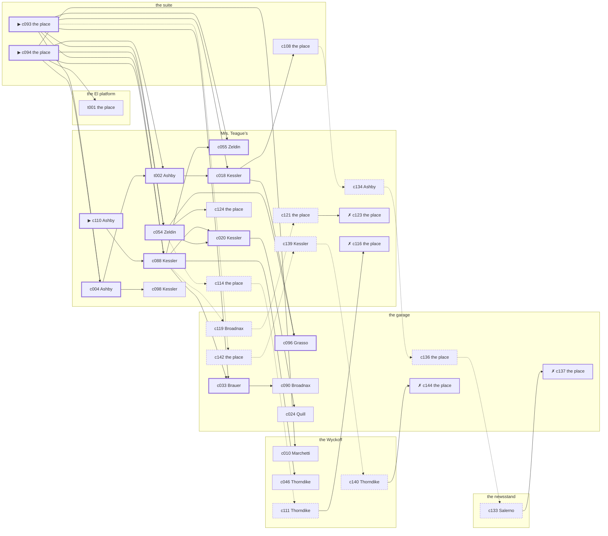

# Harlem — case 5

**Seed** 5 · **Difficulty** 2 · **Attempts** 1 · **Detective** Dashiell

**Type** missing · **Trope** left · **Unknowns** whereabouts, why

**Par** 11 actions · **Slack** 6 · **Budget** 17 · **Findable** 34 (spine 12, corroboration 8, noise 10 + 4 disqualifiers) · **Noise ratio** 41% · **Candidate pool** 147

## 1. The Truth

Michael Quill, a curb broker, Shapiro’s business partner, was the last to be with Minnie Shapiro, an heiress between marriages, at the suite at 11:00 PM, and saw them off by a coat borrowed off a hook and never brought back. Quill wanted Shapiro out of the lease and the lease in Quill’s name (property). Quill had been at the Wyckoff earlier in the evening, where the means lived, and was alone with Shapiro when it happened. Ashby hired us.

## 2. The Act

**missing** · **left** · actor **Shapiro** · at **the suite** · at **11:00 PM**

- whereabouts: the El platform
- fate: left

**Givens** — what the briefing states and the report does not ask:

- Shapiro has not been seen since 10:30 PM on Tuesday evening.
- Grasso saw Shapiro at the newsstand at 10:30 PM, and nobody has seen Shapiro since.
- Shapiro’s rooms were left tidy and the rent was paid to the end of the month.
- The precinct took a statement and filed it, because a grown person may go where they like.

**Unknowns** — exactly what the report asks: **whereabouts**, **why**.

## 3. Dramatis Personae

| Name | Role | Relationship | Class of secret | Motive | Found at | Killer |
| --- | --- | --- | --- | --- | --- | --- |
| Minnie Shapiro | an heiress between marriages | the victim | — | — | — | — |
| Althea Ashby (client) | a switchboard operator | Shapiro’s tenant | hidden-family | — | Mrs. Teague’s | — |
| Angelina Marchetti | a chorus girl between engagements | Shapiro’s neighbour across the airshaft | secret-drinking | — | the Wyckoff | — |
| Morris Kessler | the night manager at the hotel | Shapiro’s business partner | secret-drinking | exposure | Mrs. Teague’s | — |
| Michael Quill | a curb broker | Shapiro’s business partner | murder (+ gambling-debt) | property | the garage | **YES** |
| Margarethe Brauer | a dentist with a chair and a waiting room | Shapiro’s neighbour across the airshaft | forged-identity | — | the garage | — |
| Giuseppe Grasso | a doorman at a club with no sign on it | a childhood friend of Shapiro’s from the same block | fence | — | the garage | — |
| Harrison Thorndike | the doorman | fixture (doorman) | — | — | the Wyckoff | — |
| Hannah Zeldin | the landlady | fixture (landlady) | — | — | Mrs. Teague’s | — |
| Antonio Salerno | the news dealer | fixture (newsstand) | — | — | the newsstand | — |
| Augustus Broadnax | the man behind the counter | fixture (counterman) | — | — | the garage | — |

## 4. Dossiers

Every person, by layer: **0** on sight, **1** volunteered, **2** from other people, **3** in the documents.

### Shapiro — the victim

30, a woman, an heiress between marriages. Wants: respectability.

- **Standing** — Shapiro lent to people who could not pay it back and never asked twice.
- **Profession** — Shapiro kept an apartment, a maid and no occupation at all.
- **Last seen** — Grasso saw Shapiro at the newsstand at 10:30 PM, and nobody has seen Shapiro since. By Grasso, at the newsstand, at 10:30 PM.

**Layer 0, on sight**

- _gender_ — A woman.
- _age_ — In her thirties.

**Layer 1, volunteered**

- _profession_ — An heiress between marriages.
- _detail_ — Shapiro kept an apartment, a maid and no occupation at all.

**Layer 2, from other people**

- _tie_ — Shapiro lent to people who could not pay it back and never asked twice.
- _want_ — Shapiro wants to be thought respectable by people who are not.

**Self-account** (layer 1, what they say when asked about themselves)

- Shapiro is 30 years old and an heiress between marriages.
- Shapiro kept an apartment, a maid and no occupation at all.
- Shapiro is the one this is about.

### Ashby — the client

26, a woman, a switchboard operator. Wants: to-get-out. Tie: Shapiro’s tenant, four years in the same rooms.

**Layer 0, on sight**

- _gender_ — A woman.
- _age_ — In the late twenties.
- _profession_ — A switchboard operator.

**Layer 1, volunteered**

- _detail_ — Ashby sits the board from four until midnight and hears both ends of everything.

**Layer 2, from other people**

- _tie_ — Ashby has rented from Shapiro since ’26 and has the same window and the same complaint.
- _want_ — Ashby wants out of the neighbourhood and has wanted it for years.
- _since_ — Ashby has been Shapiro’s tenant, four years in the same rooms.

**Layer 3, in the documents**

- _secret-hint_ — Ashby sends money out of every pay envelope and cannot say where it goes.

**Self-account** (layer 1, what they say when asked about themselves)

- Ashby is 26 years old and a switchboard operator.
- Ashby sits the board from four until midnight and hears both ends of everything.
- Ashby is Shapiro’s tenant.

### Marchetti

21, a woman, a chorus girl between engagements. Wants: to-get-out. Tie: Shapiro’s neighbour across the airshaft, five years on the same landing.

**Layer 0, on sight**

- _gender_ — A woman.
- _age_ — Not much past twenty.

**Layer 1, volunteered**

- _profession_ — A chorus girl between engagements.
- _detail_ — Marchetti rehearses when there is anything to rehearse for.

**Layer 2, from other people**

- _tie_ — Marchetti and Shapiro share a wall, a landing and a long argument about Percival Whitfield.
- _want_ — Marchetti wants out of the neighbourhood and has wanted it for years.
- _since_ — Marchetti has been Shapiro’s neighbour across the airshaft, five years on the same landing.
- _third_ — Percival Whitfield is the foreman who did the hiring.

**Layer 3, in the documents**

- _secret-hint_ — Marchetti had taken a drink and had gone to some trouble about the smell of it.

**Self-account** (layer 1, what they say when asked about themselves)

- Marchetti is 21 years old and a chorus girl between engagements.
- Marchetti rehearses when there is anything to rehearse for.
- Marchetti is Shapiro’s neighbour across the airshaft.

### Kessler

49, a man, the night manager at the hotel. Wants: respectability. Tie: Shapiro’s business partner, three years this spring.

**Layer 0, on sight**

- _gender_ — A man.
- _age_ — In his forties.
- _profession_ — The night manager at the hotel.

**Layer 1, volunteered**

- _detail_ — Kessler has the desk from six at night until six in the morning.

**Layer 2, from other people**

- _tie_ — Kessler and Shapiro took the lease together in ’26 and have been arguing about it since.
- _want_ — Kessler wants to be thought respectable by people who are not.
- _since_ — Kessler has been Shapiro’s business partner, three years this spring.

**Layer 3, in the documents**

- _secret-hint_ — Kessler had taken a drink and had gone to some trouble about the smell of it.

**Self-account** (layer 1, what they say when asked about themselves)

- Kessler is 49 years old and the night manager at the hotel.
- Kessler has the desk from six at night until six in the morning.
- Kessler is Shapiro’s business partner.

### Quill — the killer

42, a man, a curb broker. Wants: to-keep-what-they-have. Tie: Shapiro’s business partner, since ’19.

**Layer 0, on sight**

- _gender_ — A man.
- _age_ — In his forties.

**Layer 1, volunteered**

- _profession_ — A curb broker.
- _detail_ — Quill trades on the street for men who would rather not be seen doing it.

**Layer 2, from other people**

- _tie_ — Quill bought into Shapiro’s business the year Albrecht Dettweiler walked out of it.
- _want_ — Quill wants to keep what they have and add nothing to it.
- _since_ — Quill has been Shapiro’s business partner, since ’19.
- _third_ — Albrecht Dettweiler is an old friend who once put up the bail.

**Layer 3, in the documents**

- _secret-hint_ — Quill was asking around for a hundred dollars in a hurry earlier in the week.

**Self-account** (layer 1, what they say when asked about themselves)

- Quill is 42 years old and a curb broker.
- Quill trades on the street for men who would rather not be seen doing it.
- Quill is Shapiro’s business partner.

### Brauer

52, a woman, a dentist with a chair and a waiting room. Wants: money. Tie: Shapiro’s neighbour across the airshaft, since the building changed hands.

**Layer 0, on sight**

- _gender_ — A woman.
- _age_ — In her fifties.

**Layer 1, volunteered**

- _profession_ — A dentist with a chair and a waiting room.
- _detail_ — Brauer bought the practice second-hand and is still paying for the chair.

**Layer 2, from other people**

- _tie_ — Brauer has lived on the same landing as Shapiro since ’24.
- _want_ — Brauer wants money, and is not particular about the shape it arrives in.
- _since_ — Brauer has been Shapiro’s neighbour across the airshaft, since the building changed hands.

**Layer 3, in the documents**

- _secret-hint_ — Brauer’s registration card gives an address on a street that does not exist.

**Self-account** (layer 1, what they say when asked about themselves)

- Brauer is 52 years old and a dentist with a chair and a waiting room.
- Brauer bought the practice second-hand and is still paying for the chair.
- Brauer is Shapiro’s neighbour across the airshaft.

### Grasso

43, a man, a doorman at a club with no sign on it. Wants: to-keep-what-they-have. Tie: a childhood friend of Shapiro’s from the same block, all their lives.

**Layer 0, on sight**

- _gender_ — A man.
- _age_ — In his forties.
- _profession_ — A doorman at a club with no sign on it.

**Layer 1, volunteered**

- _detail_ — Grasso has the door from nine until they close.

**Layer 2, from other people**

- _tie_ — Grasso and Shapiro grew up on the same block and have known each other since ’18.
- _want_ — Grasso wants to keep what they have and add nothing to it.
- _since_ — Grasso has been a childhood friend of Shapiro’s from the same block, all their lives.

**Layer 3, in the documents**

- _secret-hint_ — Grasso was carrying a parcel into the garage and came out without it.

**Self-account** (layer 1, what they say when asked about themselves)

- Grasso is 43 years old and a doorman at a club with no sign on it.
- Grasso has the door from nine until they close.
- Grasso is a childhood friend of Shapiro’s from the same block.

### Thorndike

50, a man, the doorman. Wants: to-keep-what-they-have. Tie: on the door at the Wyckoff.

**Layer 0, on sight**

- _gender_ — A man.
- _age_ — In his fifties.
- _profession_ — The doorman.

**Layer 1, volunteered**

- _detail_ — Thorndike opens the door at the Wyckoff from six until two and sees every face twice.

**Layer 2, from other people**

- _tie_ — Thorndike is on the door at the Wyckoff.
- _want_ — Thorndike wants to keep what they have and add nothing to it.

**Self-account** (layer 1, what they say when asked about themselves)

- Thorndike is 50 years old and the doorman.
- Thorndike opens the door at the Wyckoff from six until two and sees every face twice.
- Thorndike is on the door at the Wyckoff.

### Zeldin

40, a woman, the landlady. Wants: money. Tie: the keeper of Mrs. Teague’s.

**Layer 0, on sight**

- _gender_ — A woman.
- _age_ — In her forties.
- _profession_ — The landlady.

**Layer 1, volunteered**

- _detail_ — Zeldin has kept Mrs. Teague’s for twenty-two years and knows every board that creaks.

**Layer 2, from other people**

- _tie_ — Zeldin is the keeper of Mrs. Teague’s.
- _want_ — Zeldin wants money, and is not particular about the shape it arrives in.

**Self-account** (layer 1, what they say when asked about themselves)

- Zeldin is 40 years old and the landlady.
- Zeldin has kept Mrs. Teague’s for twenty-two years and knows every board that creaks.
- Zeldin is the keeper of Mrs. Teague’s.

### Salerno

64, a man, the news dealer. Wants: to-keep-what-they-have. Tie: at the stand at the newsstand, every day of the year.

**Layer 0, on sight**

- _gender_ — A man.
- _age_ — In his sixties.
- _profession_ — The news dealer.

**Layer 1, volunteered**

- _detail_ — Salerno runs the stand at the newsstand and misses nothing that crosses the pavement.

**Layer 2, from other people**

- _tie_ — Salerno is at the stand at the newsstand, every day of the year.
- _want_ — Salerno wants to keep what they have and add nothing to it.

**Self-account** (layer 1, what they say when asked about themselves)

- Salerno is 64 years old and the news dealer.
- Salerno runs the stand at the newsstand and misses nothing that crosses the pavement.
- Salerno is at the stand at the newsstand, every day of the year.

### Broadnax

26, a man, the man behind the counter. Wants: to-be-left-alone. Tie: behind the counter at the garage.

**Layer 0, on sight**

- _gender_ — A man.
- _age_ — In the late twenties.
- _profession_ — The man behind the counter.

**Layer 1, volunteered**

- _detail_ — Broadnax has the counter at the garage from four until midnight.

**Layer 2, from other people**

- _tie_ — Broadnax is behind the counter at the garage.
- _want_ — Broadnax wants to be left alone.

**Self-account** (layer 1, what they say when asked about themselves)

- Broadnax is 26 years old and the man behind the counter.
- Broadnax has the counter at the garage from four until midnight.
- Broadnax is behind the counter at the garage.

## 5. The Client

**Ashby**, Shapiro’s tenant. Purpose: **clear-my-name**.

- **Why** — Ashby wants it established that it was not them, before anybody says otherwise.
- **What it costs** — Ashby was near enough to it that night to know exactly how it looks, and says so first.
- **Points at** — Quill: Quill wanted Shapiro out of the lease and the lease in Quill’s name. Honest: **yes**.

**Tells:**

- Shapiro has not been seen since 10:30 PM on Tuesday evening.
- Grasso saw Shapiro at the newsstand at 10:30 PM, and nobody has seen Shapiro since.
- Shapiro’s rooms were left tidy and the rent was paid to the end of the month.
- The precinct took a statement and filed it, because a grown person may go where they like.
- Ashby would rather we started with Quill: Quill wanted Shapiro out of the lease and the lease in Quill’s name.

**Withholds:**

- Ashby does not mention it, but Ashby goes to Mrs. Teague’s from 11:00 PM to 11:30 PM to see a child nobody is supposed to know about.

**Their own evening, as they tell it:**

- Ashby says she was at the El platform at 6:00 PM.
- Ashby says she was at the newsstand from 6:30 PM to 7:00 PM.
- Ashby says she was at the Wyckoff at 7:30 PM.
- Ashby says she was at the El platform from 8:00 PM to 8:30 PM.

## 6. The Briefing

15 plain sentences, derived. This is the model of the plain register: the engine renders it, and Phase 2 measures pages against it.

1. A woman came up the stairs after midnight, and sat down.
2. Althea Ashby is 26 years old and a switchboard operator.
3. Ashby sits the board from four until midnight and hears both ends of everything.
4. Shapiro lent to people who could not pay it back and never asked twice.
5. Shapiro has not been seen since 10:30 PM on Tuesday evening.
6. Grasso saw Shapiro at the newsstand at 10:30 PM, and nobody has seen Shapiro since.
7. Shapiro’s rooms were left tidy and the rent was paid to the end of the month.
8. The precinct took a statement and filed it, because a grown person may go where they like.
9. Grasso saw Shapiro at the newsstand at 10:30 PM, and nobody has seen Shapiro since.
10. Ashby is Shapiro’s tenant.
11. Ashby has rented from Shapiro since ’26 and has the same window and the same complaint.
12. Ashby wants it established that it was not them, before anybody says otherwise.
13. Ashby was near enough to it that night to know exactly how it looks, and says so first.
14. Ashby wants us to start with Quill.
15. Quill wanted Shapiro out of the lease and the lease in Quill’s name.

## 7. Mentions

- **Percival Whitfield** (m-1) — the foreman who did the hiring. Percival Whitfield is the foreman who did the hiring.
- **Albrecht Dettweiler** (m-2) — an old friend who once put up the bail. Albrecht Dettweiler is an old friend who once put up the bail.

## 8. Places

- **the lobby of the Wyckoff** (semi) — watched by doorman (Thorndike); objects: a camel-hair overcoat on a hook, a nickel-plated revolver, a day ledger — where the weapon lived
- **the back room at Mrs. Teague’s** (private) — watched by landlady (Zeldin); objects: the roof-door key, a framed photograph, a strapped suitcase
- **the El platform at Twenty-Third Street** (public) — unwatched; objects: a folded stack of evening papers, a pasted-up timetable — within earshot of the scene
- **the newsstand on the corner** (public) — watched by newsstand (Salerno); objects: a spike of pawn tickets
- **Shapiro’s suite at the residential hotel** (private) — unwatched; objects: a silver cigarette case, a bottle of chloral drops — **THE SCENE**; the victim’s address
- **the garage on Eleventh Avenue** (semi) — watched by counterman (Broadnax); objects: a mechanic’s toolbox, an ice pick — within earshot of the scene

## 9. Anchors

The coroner gives 9:30 PM–11:00 PM, four ticks wide. These are what close it: **drunk-singing** and **last-edition**.

- **the last edition coming off the truck** — at 10:30 PM; at the newsstand. Somebody reliable notes who was there. Only those present know that the late edition led with the bridge contract and not the hold-up. Those present carry it: ink still wet enough to come off on a glove.
- **the drunk singing under the window** — at 11:00 PM; at the suite. You can time things by it: the same two verses until somebody threw a shoe. Only those present know that it was a shoe, and it was thrown by a woman, and it did not land.
- **the shift change at the garage** — at 10:00 PM; at the garage. Somebody reliable notes who was there. Only those present know that the foreman was two men short and said in front of everybody what he thought of it. Those present carry it: cylinder oil on a cuff.

## 10. Timelines

### Shapiro — the victim

| Tick | Time | Truth | Claimed | Companion claimed |
| --- | --- | --- | --- | --- |
| 0 | 6:00 PM | the garage | the garage | — |
| 1 | 6:30 PM | the newsstand | the newsstand | — |
| 2 | 7:00 PM | the newsstand | the newsstand | — |
| 3 | 7:30 PM | the newsstand | the newsstand | — |
| 4 | 8:00 PM | the newsstand | the newsstand | — |
| 5 | 8:30 PM | the garage | the garage | — |
| 6 | 9:00 PM | the garage | the garage | — |
| 7 | 9:30 PM | the El platform | the El platform | — |
| 8 | 10:00 PM | the El platform | the El platform | — |
| 9 | 10:30 PM | the newsstand | the newsstand | — |
| 10 | 11:00 PM | the suite ☠ | the suite | — |
| 11 | 11:30 PM | the El platform | the El platform | — |

### Ashby

| Tick | Time | Truth | Claimed | Companion claimed |
| --- | --- | --- | --- | --- |
| 0 | 6:00 PM | the El platform | the El platform | — |
| 1 | 6:30 PM | the newsstand | the newsstand | — |
| 2 | 7:00 PM | the newsstand | the newsstand | — |
| 3 | 7:30 PM | the Wyckoff | the Wyckoff | — |
| 4 | 8:00 PM | the El platform | the El platform | — |
| 5 | 8:30 PM | the El platform | the El platform | — |
| 6 | 9:00 PM | Mrs. Teague’s | Mrs. Teague’s | — |
| 7 | 9:30 PM | Mrs. Teague’s | Mrs. Teague’s | — |
| 8 | 10:00 PM | Mrs. Teague’s | Mrs. Teague’s | — |
| 9 | 10:30 PM | Mrs. Teague’s | Mrs. Teague’s | — |
| 10 | 11:00 PM | Mrs. Teague’s | **the El platform** | — |
| 11 | 11:30 PM | Mrs. Teague’s | **the El platform** | — |

### Marchetti

| Tick | Time | Truth | Claimed | Companion claimed |
| --- | --- | --- | --- | --- |
| 0 | 6:00 PM | the Wyckoff | the Wyckoff | — |
| 1 | 6:30 PM | the Wyckoff | the Wyckoff | — |
| 2 | 7:00 PM | the Wyckoff | the Wyckoff | — |
| 3 | 7:30 PM | the Wyckoff | the Wyckoff | — |
| 4 | 8:00 PM | the Wyckoff | the Wyckoff | — |
| 5 | 8:30 PM | the newsstand | the newsstand | — |
| 6 | 9:00 PM | the newsstand | the newsstand | — |
| 7 | 9:30 PM | the newsstand | the newsstand | — |
| 8 | 10:00 PM | the El platform | the El platform | — |
| 9 | 10:30 PM | the garage | the garage | — |
| 10 | 11:00 PM | Mrs. Teague’s | **the Wyckoff** | — |
| 11 | 11:30 PM | Mrs. Teague’s | **the Wyckoff** | — |

### Kessler

| Tick | Time | Truth | Claimed | Companion claimed |
| --- | --- | --- | --- | --- |
| 0 | 6:00 PM | Mrs. Teague’s | **the Wyckoff** | — |
| 1 | 6:30 PM | Mrs. Teague’s | **the Wyckoff** | — |
| 2 | 7:00 PM | Mrs. Teague’s | Mrs. Teague’s | — |
| 3 | 7:30 PM | Mrs. Teague’s | Mrs. Teague’s | — |
| 4 | 8:00 PM | Mrs. Teague’s | Mrs. Teague’s | — |
| 5 | 8:30 PM | Mrs. Teague’s | Mrs. Teague’s | — |
| 6 | 9:00 PM | Mrs. Teague’s | Mrs. Teague’s | — |
| 7 | 9:30 PM | Mrs. Teague’s | Mrs. Teague’s | — |
| 8 | 10:00 PM | the El platform | the El platform | — |
| 9 | 10:30 PM | the Wyckoff | the Wyckoff | — |
| 10 | 11:00 PM | the garage | the garage | — |
| 11 | 11:30 PM | the garage | the garage | — |

### Quill — the killer

| Tick | Time | Truth | Claimed | Companion claimed |
| --- | --- | --- | --- | --- |
| 0 | 6:00 PM | the garage | the garage | — |
| 1 | 6:30 PM | the garage | the garage | — |
| 2 | 7:00 PM | the garage | the garage | — |
| 3 | 7:30 PM | the Wyckoff | the Wyckoff | — |
| 4 | 8:00 PM | the Wyckoff | the Wyckoff | — |
| 5 | 8:30 PM | the Wyckoff | the Wyckoff | — |
| 6 | 9:00 PM | the garage | the garage | — |
| 7 | 9:30 PM | the El platform | **the garage** | Brauer |
| 8 | 10:00 PM | the El platform | **the garage** | Brauer |
| 9 | 10:30 PM | the suite | **the garage** | — |
| 10 | 11:00 PM | the suite ☠ | **the garage** | — |
| 11 | 11:30 PM | the Wyckoff | the Wyckoff | — |

### Brauer

| Tick | Time | Truth | Claimed | Companion claimed |
| --- | --- | --- | --- | --- |
| 0 | 6:00 PM | the Wyckoff | the Wyckoff | — |
| 1 | 6:30 PM | the El platform | the El platform | — |
| 2 | 7:00 PM | the newsstand | the newsstand | — |
| 3 | 7:30 PM | the newsstand | the newsstand | — |
| 4 | 8:00 PM | the garage | the garage | — |
| 5 | 8:30 PM | the garage | the garage | — |
| 6 | 9:00 PM | the garage | the garage | — |
| 7 | 9:30 PM | the El platform | the El platform | — |
| 8 | 10:00 PM | the garage | the garage | — |
| 9 | 10:30 PM | the garage | the garage | — |
| 10 | 11:00 PM | the garage | the garage | — |
| 11 | 11:30 PM | the garage | the garage | — |

### Grasso

| Tick | Time | Truth | Claimed | Companion claimed |
| --- | --- | --- | --- | --- |
| 0 | 6:00 PM | the garage | the garage | — |
| 1 | 6:30 PM | the garage | the garage | — |
| 2 | 7:00 PM | the garage | the garage | — |
| 3 | 7:30 PM | the garage | the garage | — |
| 4 | 8:00 PM | the garage | the garage | — |
| 5 | 8:30 PM | the garage | the garage | — |
| 6 | 9:00 PM | Mrs. Teague’s | Mrs. Teague’s | — |
| 7 | 9:30 PM | Mrs. Teague’s | Mrs. Teague’s | — |
| 8 | 10:00 PM | the newsstand | the newsstand | — |
| 9 | 10:30 PM | the newsstand | the newsstand | — |
| 10 | 11:00 PM | the garage | **Mrs. Teague’s** | — |
| 11 | 11:30 PM | the El platform | the El platform | — |

### Fixtures (never lie, never withhold)

| Tick | Time | Thorndike (the doorman) | Zeldin (the landlady) | Salerno (the news dealer) | Broadnax (the man behind the counter) |
| --- | --- | --- | --- | --- | --- |
| 0 | 6:00 PM | the Wyckoff | Mrs. Teague’s | the newsstand | the garage |
| 1 | 6:30 PM | the Wyckoff | Mrs. Teague’s | the newsstand | the garage |
| 2 | 7:00 PM | the Wyckoff | Mrs. Teague’s | the newsstand | the garage |
| 3 | 7:30 PM | the Wyckoff | Mrs. Teague’s | the newsstand | the Wyckoff |
| 4 | 8:00 PM | the Wyckoff | Mrs. Teague’s | the newsstand | the garage |
| 5 | 8:30 PM | the Wyckoff | Mrs. Teague’s | the newsstand | the garage |
| 6 | 9:00 PM | the Wyckoff | Mrs. Teague’s | the newsstand | the garage |
| 7 | 9:30 PM | the Wyckoff | the garage | the newsstand | the garage |
| 8 | 10:00 PM | the Wyckoff | Mrs. Teague’s | the newsstand | the garage |
| 9 | 10:30 PM | the Wyckoff | Mrs. Teague’s | the newsstand | the garage |
| 10 | 11:00 PM | Mrs. Teague’s | Mrs. Teague’s | the newsstand | the garage |
| 11 | 11:30 PM | the Wyckoff | Mrs. Teague’s | the newsstand | the garage |

## 11. Secrets in play

- **Ashby** (hidden-family): Ashby goes to Mrs. Teague’s from 11:00 PM to 11:30 PM to see a child nobody is supposed to know about.
- **Marchetti** (secret-drinking): Marchetti drinks alone at Mrs. Teague’s from 11:00 PM to 11:30 PM and will claim to have been anywhere else.
- **Kessler** (secret-drinking): Kessler drinks alone at Mrs. Teague’s from 6:00 PM to 6:30 PM and will claim to have been anywhere else.
- **Quill** (murder): Quill is at the suite from 10:30 PM to 11:00 PM, alone with Shapiro, who is not seen again after 11:00 PM.
- **Quill** also (gambling-debt): Quill slips off to the El platform from 9:30 PM to 10:00 PM to settle with a bookmaker.
- **Brauer** (forged-identity): Brauer is not the person the papers say. Nothing about the evening is hidden; the lie is all in the paperwork.
- **Grasso** (fence): Grasso hands a parcel of stolen goods to a man at the garage from 11:00 PM.

## 12. Clue list — the 34 findable

The opening three, free at the start: c093, c094, c110. Everything else has to be led to. The full candidate pool is in the companion file.

### At the Wyckoff

- **c010** [corroboration] (observation; Marchetti on Quill) → (end)
  - Marchetti says Quill was at the Wyckoff from 7:30 PM to 8:00 PM.
  - _establishes: Quill at the Wyckoff, 7:30 PM–8:00 PM; Quill could reach the weapon_
- **c046** [corroboration] (observation; Thorndike on Ashby) → (end)
  - Thorndike says Ashby was at Mrs. Teague’s at 11:00 PM.
  - _establishes: Ashby at Mrs. Teague’s, 11:00 PM_
- **c140** [noise {b2}] (overheard; Thorndike on Grasso) → c144
  - Thorndike on Grasso: There is a man who meets people at the garage and nobody will say his name out loud.
  - _establishes: context only_
- **c111** [noise {b4}] (overheard; Thorndike on Ashby) → c116
  - Thorndike on Ashby: Ashby sends money out of every pay envelope and cannot say where it goes.
  - _establishes: context only_

### At Mrs. Teague’s

- **c110** [spine ⟨opening⟩] (client; Ashby on why I was hired) → c088
  - Ashby hired us, and wants it known that Quill wanted Shapiro out of the lease and the lease in Quill’s name, and would rather we started there.
  - _establishes: Quill had a motive (property)_
- **c004** [spine] (observation; Ashby on Quill) → t002, c098
  - Ashby says Quill was at the Wyckoff at 7:30 PM.
  - _establishes: Quill at the Wyckoff, 7:30 PM; Quill could reach the weapon_
- **t002** [spine] (overheard; Ashby on Shapiro since Tuesday) → c018
  - Ashby says there was somebody at the El platform at 11:30 PM reading the departures off a timetable, and that it was Shapiro.
  - _establishes: Shapiro at the El platform, 11:30 PM_
- **c088** [spine] (observation; Kessler on Quill’s account) → c055, c020, c033, c046, c119
  - Kessler was at the garage at 11:00 PM and says Quill was not.
  - _establishes: Quill not at the garage, 11:00 PM_
- **c055** [spine] (observation; Zeldin on Marchetti) → (end)
  - Zeldin says Marchetti was at Mrs. Teague’s from 11:00 PM to 11:30 PM.
  - _establishes: Marchetti at Mrs. Teague’s, 11:00 PM–11:30 PM_
- **c018** [spine] (observation; Kessler on Brauer) → c096, c108
  - Kessler says Brauer was at the garage from 11:00 PM to 11:30 PM.
  - _establishes: Brauer at the garage, 11:00 PM–11:30 PM_
- **c054** [spine] (observation; Zeldin on Ashby) → c020, c096, c124, c114
  - Zeldin says Ashby was at Mrs. Teague’s from 10:00 PM to 11:30 PM.
  - _establishes: Ashby at Mrs. Teague’s, 10:00 PM–11:30 PM_
- **c020** [spine] (observation; Kessler on Grasso) → c024
  - Kessler says Grasso was at the garage at 11:00 PM.
  - _establishes: Grasso at the garage, 11:00 PM_
- **c098** [corroboration] (anchor; Kessler on the noise that evening) → (end)
  - Kessler was at the garage at 11:00 PM and heard the street door going, and nobody coming back through it from the direction of the suite, just as the singing stopped.
  - _establishes: noise at the suite at 11:00 PM; the victim dead by 11:00 PM; how it was done_
- **c124** [corroboration] (overheard; the place itself) → (end)
  - The tab at Mrs. Teague’s is dated and timed, from 11:00 PM to 11:30 PM, and Marchetti was there to run it up.
  - _establishes: Marchetti’s secret-drinking accounted for; Marchetti at Mrs. Teague’s, 11:00 PM–11:30 PM_
- **c134** [noise {b1}] (overheard; Ashby on Brauer) → c136
  - Ashby on Brauer: Brauer answers to the name a half-second late, every time.
  - _establishes: context only_
- **c139** [noise {b2}] (overheard; Kessler on Grasso) → c140
  - Kessler on Grasso: Grasso was carrying a parcel into the garage and came out without it.
  - _establishes: context only_
- **c121** [noise {b3}] (physical; the place itself) → c123
  - A bottle at Mrs. Teague’s pushed behind the pipes, the seal broken and the level down.
  - _establishes: context only_
- **c123** [disqualifier {b3}] (overheard; the place itself) → (end)
  - The man behind the counter at Mrs. Teague’s knows exactly: Marchetti was on the same stool from 11:00 PM to 11:30 PM and was in no condition to walk anywhere, let alone do this.
  - _establishes: Marchetti’s secret-drinking accounted for; Marchetti at Mrs. Teague’s, 11:00 PM–11:30 PM_
- **c114** [noise {b4}] (physical; the place itself) → c111
  - A board-and-keep receipt at Mrs. Teague’s, monthly, eight years of them.
  - _establishes: context only_
- **c116** [disqualifier {b4}] (overheard; the place itself) → (end)
  - The woman who keeps the child says it straight out: Ashby was at Mrs. Teague’s from 11:00 PM to 11:30 PM, the same as every week, and left with the same face as always.
  - _establishes: Ashby’s hidden-family accounted for; Ashby at Mrs. Teague’s, 11:00 PM–11:30 PM_

### At the El platform

- **t001** [corroboration] (document; the place itself) → (end)
  - A pawn ticket written at the El platform at 11:30 PM, for a ring, in a hand that matches the rent book Shapiro signs.
  - _establishes: Shapiro at the El platform, 11:30 PM_

### At the newsstand

- **c133** [noise {b1}] (overheard; Salerno on Brauer) → c137
  - Salerno on Brauer: Two signatures of Brauer’s, a month apart, are in different hands.
  - _establishes: context only_

### At the suite

- **c093** [spine ⟨opening⟩] (scene; the place itself) → c004, c088, c055, c018, c054, c033, c142
  - Shapiro is not at the suite and has not been since that evening. The lamp was left burning and the door was left on the latch. The singing under the window stopped at 11:00 PM, when the shoe came down.
  - _establishes: the victim dead by 11:00 PM; how it was done_
- **c094** [spine ⟨opening⟩] (morgue; the place itself) → c004, t002, c088, c054, c010, t001
  - Nobody can put it closer than between 9:30 PM and 11:00 PM, which is two hours of nothing useful. The precinct came, looked at the room, and said to wait a day or two.
  - _establishes: death between 9:30 PM and 11:00 PM; how it was done_
- **c108** [corroboration] (document; the place itself) → c134
  - Found at the suite: A lease assignment made out in Quill’s name, waiting only on Shapiro’s signature.
  - _establishes: Quill had a motive (property)_

### At the garage

- **c033** [spine] (observation; Brauer on Kessler) → c090
  - Brauer says Kessler was at the garage from 11:00 PM to 11:30 PM.
  - _establishes: Kessler at the garage, 11:00 PM–11:30 PM_
- **c096** [spine] (anchor; Grasso on Shapiro that evening) → (end)
  - Grasso puts Shapiro at the newsstand when the last edition came up, which was 10:30 PM, and in no hurry to be anywhere.
  - _establishes: the victim alive at 10:30 PM; Shapiro at the newsstand, 10:30 PM_
- **c090** [corroboration] (observation; Broadnax on Quill’s account) → (end)
  - Broadnax was at the garage from 10:30 PM to 11:00 PM and says Quill was not.
  - _establishes: Quill not at the garage, 10:30 PM–11:00 PM_
- **c024** [corroboration] (observation; Quill on Marchetti) → (end)
  - Quill says Marchetti was at the Wyckoff from 7:30 PM to 8:00 PM.
  - _establishes: Marchetti at the Wyckoff, 7:30 PM–8:00 PM; Marchetti could reach the weapon_
- **c136** [noise {b1}] (physical; the place itself) → c133
  - A steamship ticket stub among Brauer’s things, in the name of a man who died at Belleau Wood.
  - _establishes: context only_
- **c137** [disqualifier {b1}] (overheard; the place itself) → (end)
  - The name Brauer was born with turns up on a desertion warrant from 1918. Brauer has been hiding from the Army for eleven years and from nobody else.
  - _establishes: Brauer’s forged-identity accounted for_
- **c142** [noise {b2}] (physical; the place itself) → c139
  - Wrapping paper and a cut string at the garage, and the shop it came from closed two years ago.
  - _establishes: context only_
- **c144** [disqualifier {b2}] (overheard; the place itself) → (end)
  - The receiver at the garage would rather talk than be held: Grasso was there from 11:00 PM handing over a parcel of somebody else’s silver, which is a charge Grasso will take over this one.
  - _establishes: Grasso’s fence accounted for; Grasso at the garage, 11:00 PM_
- **c119** [noise {b3}] (overheard; Broadnax on Marchetti) → c121
  - Broadnax on Marchetti: Marchetti is on a temperance pledge that Marchetti mentions before anybody asks.
  - _establishes: context only_

## 13. Clue graph

## 14. Deduction path

Par is **11 actions** and the budget is par plus 6: **17**. Every id below is a spine clue; the inference is the sheet’s, not the clue’s.

**Time of death.** The coroner gives four ticks. The anchors close it to 11:00 PM: one puts Shapiro alive at 10:30 PM, the other times the scene at 11:00 PM. _(c094, c096, c093; + 1 corroborating)_

**Clearing the innocent.**

- Ashby was not at the suite at 11:00 PM. _(c054; + 2 corroborating)_
- Marchetti was not at the suite at 11:00 PM. _(c055; + 2 corroborating)_
- Kessler was not at the suite at 11:00 PM. _(c033)_
- Brauer was not at the suite at 11:00 PM. _(c018)_
- Grasso was not at the suite at 11:00 PM. _(c020; + 1 corroborating)_

**Naming the killer.** Quill claims the garage at 11:00 PM. Two independent sources put that out of the question. _(c088; + 1 corroborating)_

**The weapon.** Quill was at the Wyckoff before 11:00 PM, where a camel-hair overcoat on a hook was kept. _(c004; + 1 corroborating)_

**Method.** A coat borrowed off a hook and never brought back, on two physical sources. _(c093, c094; + 1 corroborating)_

**Motive.** property, on two independent sources. _(c110; + 1 corroborating)_

## 15. Red herrings

**Innocents who lie about the murder tick:**

- Ashby claims the El platform at 11:00 PM and was really at Mrs. Teague’s. Reason: Ashby goes to Mrs. Teague’s from 11:00 PM to 11:30 PM to see a child nobody is supposed to know about.
- Marchetti claims the Wyckoff at 11:00 PM and was really at Mrs. Teague’s. Reason: Marchetti drinks alone at Mrs. Teague’s from 11:00 PM to 11:30 PM and will claim to have been anywhere else.
- Grasso claims Mrs. Teague’s at 11:00 PM and was really at the garage. Reason: Grasso hands a parcel of stolen goods to a man at the garage from 11:00 PM.

**Innocents with a motive:**

- Kessler — exposure: was about to be exposed by Shapiro.

**Noise branches, and what knocks each one down:**

- **b1** (Brauer, forged-identity): c134 → c136 → c133 → **c137** — The name Brauer was born with turns up on a desertion warrant from 1918. Brauer has been hiding from the Army for eleven years and from nobody else.
- **b2** (Grasso, fence): c142 → c139 → c140 → **c144** — The receiver at the garage would rather talk than be held: Grasso was there from 11:00 PM handing over a parcel of somebody else’s silver, which is a charge Grasso will take over this one.
- **b3** (Marchetti, secret-drinking): c119 → c121 → **c123** — The man behind the counter at Mrs. Teague’s knows exactly: Marchetti was on the same stool from 11:00 PM to 11:30 PM and was in no condition to walk anywhere, let alone do this.
- **b4** (Ashby, hidden-family): c114 → c111 → **c116** — The woman who keeps the child says it straight out: Ashby was at Mrs. Teague’s from 11:00 PM to 11:30 PM, the same as every week, and left with the same face as always.

