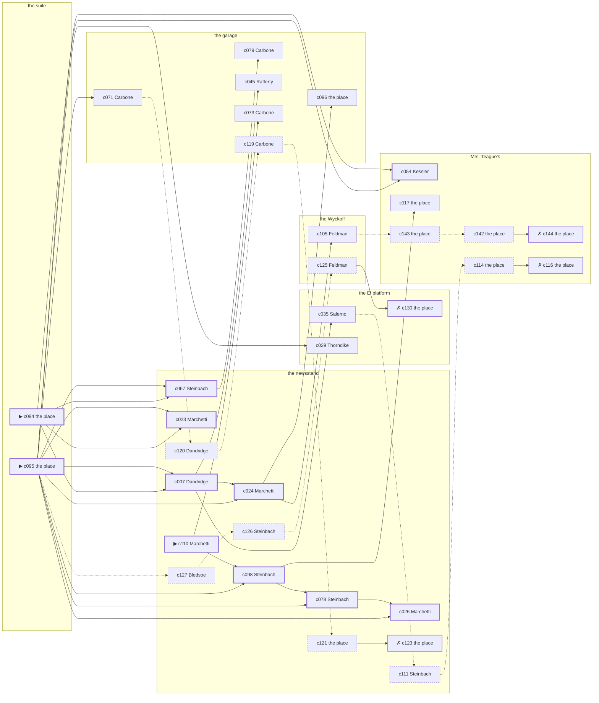

# Harlem — case 5

**Seed** 5 · **Difficulty** 2 · **Attempts** 1 · **Detective** Humphrey

**Par** 10 actions · **Slack** 6 · **Budget** 16 · **Findable** 34 (spine 11, corroboration 9, noise 10 + 4 disqualifiers) · **Noise ratio** 41% · **Candidate pool** 145

## 1. The Truth

Eunice Bledsoe, a stringer for the evening papers, a witness against the people the victim worked for, killed Friedrich Kreuzer, a theatrical agent, with an ice pick at the suite at 8:00 PM. Bledsoe needed the victim silent (silence-a-witness). Bledsoe had been at the garage earlier in the evening, where the weapon lived, and was alone with Kreuzer when it happened. Marchetti hired us.

## 2. Dramatis Personae

| Name | Role | Relationship | Class of secret | Motive | Found at | Killer |
| --- | --- | --- | --- | --- | --- | --- |
| Friedrich Kreuzer | a theatrical agent | the victim | — | — | — | — |
| Eunice Bledsoe | a stringer for the evening papers | a witness against the people the victim worked for | murder (+ gambling-debt) | silence-a-witness | the newsstand | **YES** |
| Lurline Dandridge | a chambermaid | the victim’s tenant | hidden-family | — | the newsstand | — |
| Emilio Marchetti (client) | a policy runner | a childhood friend of the victim’s from the same block | fence | — | the newsstand | — |
| Verity Thorndike | a curb broker | the victim’s brother-in-law | fence | debt | the El platform | — |
| Lucia Salerno | an insurance adjuster | the victim’s creditor | gambling-debt | — | the El platform | — |
| James Rafferty | a young man living on expectations | the victim’s brother-in-law | secret-drinking | inheritance | the garage | — |
| Sol Feldman | the doorman | fixture (doorman) | — | — | the Wyckoff | — |
| Rachel Kessler | the landlady | fixture (landlady) | — | — | Mrs. Teague’s | — |
| Klara Steinbach | the news dealer | fixture (newsstand) | — | — | the newsstand | — |
| Carmine Carbone | the man behind the counter | fixture (counterman) | — | — | the garage | — |

## 3. Places

- **the lobby of the Wyckoff** (semi) — watched by doorman (Feldman); objects: a brass umbrella stand, a nickel-plated revolver
- **the back room at Mrs. Teague’s** (private) — watched by landlady (Kessler); objects: the roof-door key, a strapped suitcase, a length of sash cord
- **the El platform at Twenty-Third Street** (public) — unwatched; objects: a folded stack of evening papers, a pasted-up timetable — within earshot of the scene
- **the newsstand on the corner** (public) — watched by newsstand (Steinbach); objects: a spike of pawn tickets
- **the victim’s suite at the residential hotel** (private) — unwatched; objects: a camel-hair overcoat on a hook, a silver cigarette case — **THE SCENE**; the victim’s address
- **the garage on Eleventh Avenue** (semi) — watched by counterman (Carbone); objects: an ice pick, a mechanic’s toolbox — where the weapon lived; within earshot of the scene

## 4. Anchors

The coroner gives 6:30 PM–8:00 PM, four ticks wide. These are what close it: **drunk-singing** and **last-edition**.

- **the last edition coming off the truck** — at 7:30 PM; at the newsstand. Somebody reliable notes who was there. Only those present know that the late edition led with the bridge contract and not the hold-up. Those present carry it: ink still wet enough to come off on a glove.
- **the drunk singing under the window** — at 8:00 PM; at the suite. You can time things by it: the same two verses until somebody threw a shoe. Only those present know that it was a shoe, and it was thrown by a woman, and it did not land.
- **the shift change at the garage** — at 11:00 PM; at the garage. Somebody reliable notes who was there. Only those present know that the foreman was two men short and said in front of everybody what he thought of it. Those present carry it: cylinder oil on a cuff.

## 5. Timelines

### Kreuzer — the victim

| Tick | Time | Truth | Claimed | Companion claimed |
| --- | --- | --- | --- | --- |
| 0 | 6:00 PM | the El platform | the El platform | — |
| 1 | 6:30 PM | the El platform | the El platform | — |
| 2 | 7:00 PM | Mrs. Teague’s | Mrs. Teague’s | — |
| 3 | 7:30 PM | the newsstand | the newsstand | — |
| 4 | 8:00 PM | the suite ☠ | the suite | — |
| 5 | 8:30 PM | — | — | — |
| 6 | 9:00 PM | — | — | — |
| 7 | 9:30 PM | — | — | — |
| 8 | 10:00 PM | — | — | — |
| 9 | 10:30 PM | — | — | — |
| 10 | 11:00 PM | — | — | — |
| 11 | 11:30 PM | — | — | — |

### Bledsoe — the killer

| Tick | Time | Truth | Claimed | Companion claimed |
| --- | --- | --- | --- | --- |
| 0 | 6:00 PM | the garage | the garage | — |
| 1 | 6:30 PM | the El platform | **Mrs. Teague’s** | — |
| 2 | 7:00 PM | the El platform | **Mrs. Teague’s** | — |
| 3 | 7:30 PM | the suite | **the newsstand** | — |
| 4 | 8:00 PM | the suite ☠ | **the newsstand** | — |
| 5 | 8:30 PM | the newsstand | the newsstand | — |
| 6 | 9:00 PM | the newsstand | the newsstand | — |
| 7 | 9:30 PM | the newsstand | the newsstand | — |
| 8 | 10:00 PM | the newsstand | the newsstand | — |
| 9 | 10:30 PM | the Wyckoff | the Wyckoff | — |
| 10 | 11:00 PM | the Wyckoff | the Wyckoff | — |
| 11 | 11:30 PM | the Wyckoff | the Wyckoff | — |

### Dandridge

| Tick | Time | Truth | Claimed | Companion claimed |
| --- | --- | --- | --- | --- |
| 0 | 6:00 PM | the garage | the garage | — |
| 1 | 6:30 PM | the newsstand | the newsstand | — |
| 2 | 7:00 PM | the suite | the suite | — |
| 3 | 7:30 PM | the Wyckoff | the Wyckoff | — |
| 4 | 8:00 PM | Mrs. Teague’s | **the garage** | Bledsoe |
| 5 | 8:30 PM | Mrs. Teague’s | **the garage** | Bledsoe |
| 6 | 9:00 PM | the newsstand | the newsstand | — |
| 7 | 9:30 PM | the garage | the garage | — |
| 8 | 10:00 PM | the Wyckoff | the Wyckoff | — |
| 9 | 10:30 PM | the Wyckoff | the Wyckoff | — |
| 10 | 11:00 PM | the newsstand | the newsstand | — |
| 11 | 11:30 PM | the newsstand | the newsstand | — |

### Marchetti

| Tick | Time | Truth | Claimed | Companion claimed |
| --- | --- | --- | --- | --- |
| 0 | 6:00 PM | the El platform | the El platform | — |
| 1 | 6:30 PM | the newsstand | the newsstand | — |
| 2 | 7:00 PM | the suite | the suite | — |
| 3 | 7:30 PM | the newsstand | the newsstand | — |
| 4 | 8:00 PM | Mrs. Teague’s | Mrs. Teague’s | — |
| 5 | 8:30 PM | Mrs. Teague’s | Mrs. Teague’s | — |
| 6 | 9:00 PM | Mrs. Teague’s | Mrs. Teague’s | — |
| 7 | 9:30 PM | the newsstand | **the El platform** | Bledsoe |
| 8 | 10:00 PM | the newsstand | the newsstand | — |
| 9 | 10:30 PM | the newsstand | the newsstand | — |
| 10 | 11:00 PM | the newsstand | the newsstand | — |
| 11 | 11:30 PM | the newsstand | the newsstand | — |

### Thorndike

| Tick | Time | Truth | Claimed | Companion claimed |
| --- | --- | --- | --- | --- |
| 0 | 6:00 PM | the Wyckoff | the Wyckoff | — |
| 1 | 6:30 PM | the suite | the suite | — |
| 2 | 7:00 PM | the garage | the garage | — |
| 3 | 7:30 PM | the garage | the garage | — |
| 4 | 8:00 PM | Mrs. Teague’s | Mrs. Teague’s | — |
| 5 | 8:30 PM | the Wyckoff | the Wyckoff | — |
| 6 | 9:00 PM | the El platform | the El platform | — |
| 7 | 9:30 PM | the El platform | **the garage** | Salerno |
| 8 | 10:00 PM | the El platform | **the garage** | Salerno |
| 9 | 10:30 PM | the El platform | the El platform | — |
| 10 | 11:00 PM | the newsstand | the newsstand | — |
| 11 | 11:30 PM | the newsstand | the newsstand | — |

### Salerno

| Tick | Time | Truth | Claimed | Companion claimed |
| --- | --- | --- | --- | --- |
| 0 | 6:00 PM | the garage | the garage | — |
| 1 | 6:30 PM | the garage | the garage | — |
| 2 | 7:00 PM | the garage | the garage | — |
| 3 | 7:30 PM | the garage | the garage | — |
| 4 | 8:00 PM | the newsstand | **the Wyckoff** | — |
| 5 | 8:30 PM | the newsstand | the newsstand | — |
| 6 | 9:00 PM | the El platform | the El platform | — |
| 7 | 9:30 PM | the El platform | the El platform | — |
| 8 | 10:00 PM | the El platform | the El platform | — |
| 9 | 10:30 PM | the El platform | the El platform | — |
| 10 | 11:00 PM | the El platform | the El platform | — |
| 11 | 11:30 PM | the El platform | the El platform | — |

### Rafferty

| Tick | Time | Truth | Claimed | Companion claimed |
| --- | --- | --- | --- | --- |
| 0 | 6:00 PM | Mrs. Teague’s | **the garage** | — |
| 1 | 6:30 PM | Mrs. Teague’s | **the garage** | — |
| 2 | 7:00 PM | Mrs. Teague’s | Mrs. Teague’s | — |
| 3 | 7:30 PM | the Wyckoff | the Wyckoff | — |
| 4 | 8:00 PM | Mrs. Teague’s | Mrs. Teague’s | — |
| 5 | 8:30 PM | the garage | the garage | — |
| 6 | 9:00 PM | the garage | the garage | — |
| 7 | 9:30 PM | the garage | the garage | — |
| 8 | 10:00 PM | the garage | the garage | — |
| 9 | 10:30 PM | the garage | the garage | — |
| 10 | 11:00 PM | the garage | the garage | — |
| 11 | 11:30 PM | the garage | the garage | — |

### Fixtures (never lie, never withhold)

| Tick | Time | Feldman (the doorman) | Kessler (the landlady) | Steinbach (the news dealer) | Carbone (the man behind the counter) |
| --- | --- | --- | --- | --- | --- |
| 0 | 6:00 PM | the Wyckoff | Mrs. Teague’s | the newsstand | the garage |
| 1 | 6:30 PM | the Wyckoff | Mrs. Teague’s | the newsstand | the garage |
| 2 | 7:00 PM | the Wyckoff | Mrs. Teague’s | the newsstand | the garage |
| 3 | 7:30 PM | the Wyckoff | Mrs. Teague’s | the newsstand | the garage |
| 4 | 8:00 PM | the Wyckoff | Mrs. Teague’s | the newsstand | the newsstand |
| 5 | 8:30 PM | the Wyckoff | Mrs. Teague’s | the newsstand | the garage |
| 6 | 9:00 PM | the Wyckoff | the Wyckoff | the newsstand | the garage |
| 7 | 9:30 PM | the Wyckoff | Mrs. Teague’s | the newsstand | the garage |
| 8 | 10:00 PM | the Wyckoff | Mrs. Teague’s | the newsstand | the garage |
| 9 | 10:30 PM | the Wyckoff | Mrs. Teague’s | the newsstand | the garage |
| 10 | 11:00 PM | the Wyckoff | Mrs. Teague’s | the newsstand | the garage |
| 11 | 11:30 PM | the Wyckoff | Mrs. Teague’s | the newsstand | the garage |

## 6. Secrets in play

- **Bledsoe** (murder): Bledsoe is at the suite from 7:30 PM to 8:00 PM, alone with Kreuzer when it happens at 8:00 PM.
- **Bledsoe** also (gambling-debt): Bledsoe slips off to the El platform from 6:30 PM to 7:00 PM to settle with a bookmaker.
- **Dandridge** (hidden-family): Dandridge goes to Mrs. Teague’s from 8:00 PM to 8:30 PM to see a child nobody is supposed to know about.
- **Marchetti** (fence): Marchetti hands a parcel of stolen goods to a man at the newsstand from 9:30 PM.
- **Thorndike** (fence): Thorndike hands a parcel of stolen goods to a man at the El platform from 9:30 PM to 10:00 PM.
- **Salerno** (gambling-debt): Salerno slips off to the newsstand from 8:00 PM to settle with a bookmaker.
- **Rafferty** (secret-drinking): Rafferty drinks alone at Mrs. Teague’s from 6:00 PM to 6:30 PM and will claim to have been anywhere else.

## 7. Clue list — the 34 findable

The opening three, free at the start: c094, c095, c110. Everything else has to be led to. The full candidate pool is in the companion file.

### At the Wyckoff

- **c105** [corroboration] (overheard; Feldman on Bledsoe and Kreuzer) → c143
  - Feldman says Kreuzer said to Bledsoe that a man who testifies sleeps better.
  - _establishes: Bledsoe had a motive (silence-a-witness)_
- **c125** [noise {b2}] (overheard; Feldman on Thorndike) → c130
  - Feldman on Thorndike: Thorndike was carrying a parcel into the El platform and came out without it.
  - _establishes: context only_

### At Mrs. Teague’s

- **c054** [spine] (observation; Kessler on Marchetti) → (end)
  - Kessler says Marchetti was at Mrs. Teague’s from 8:00 PM to 8:30 PM.
  - _establishes: Marchetti at Mrs. Teague’s, 8:00 PM–8:30 PM_
- **c117** [corroboration] (overheard; the place itself) → (end)
  - The parish register at Mrs. Teague’s has the christening in it, and the board money receipted through the evening in question.
  - _establishes: Dandridge’s hidden-family accounted for; Dandridge at Mrs. Teague’s, 8:00 PM–8:30 PM_
- **c143** [noise {b3}] (physical; the place itself) → c142
  - A tab at Mrs. Teague’s in a name that is not Rafferty’s, in Rafferty’s handwriting.
  - _establishes: context only_
- **c142** [noise {b3}] (physical; the place itself) → c144
  - A bottle at Mrs. Teague’s pushed behind the pipes, the seal broken and the level down.
  - _establishes: context only_
- **c144** [disqualifier {b3}] (overheard; the place itself) → (end)
  - The man behind the counter at Mrs. Teague’s knows exactly: Rafferty was on the same stool from 6:00 PM to 6:30 PM and was in no condition to walk anywhere, let alone do this.
  - _establishes: Rafferty’s secret-drinking accounted for; Rafferty at Mrs. Teague’s, 6:00 PM–6:30 PM_
- **c114** [noise {b4}] (physical; the place itself) → c116
  - A board-and-keep receipt at Mrs. Teague’s, monthly, eight years of them.
  - _establishes: context only_
- **c116** [disqualifier {b4}] (overheard; the place itself) → (end)
  - The woman who keeps the child says it straight out: Dandridge was at Mrs. Teague’s from 8:00 PM to 8:30 PM, the same as every week, and left with the same face as always.
  - _establishes: Dandridge’s hidden-family accounted for; Dandridge at Mrs. Teague’s, 8:00 PM–8:30 PM_

### At the El platform

- **c035** [corroboration] (observation; Salerno on Bledsoe) → c111
  - Salerno says Bledsoe was at the garage at 6:00 PM.
  - _establishes: Bledsoe at the garage, 6:00 PM; Bledsoe could reach the weapon_
- **c029** [corroboration] (observation; Thorndike on Marchetti) → (end)
  - Thorndike says Marchetti was at Mrs. Teague’s at 8:00 PM.
  - _establishes: Marchetti at Mrs. Teague’s, 8:00 PM_
- **c130** [disqualifier {b2}] (overheard; the place itself) → (end)
  - The receiver at the El platform would rather talk than be held: Thorndike was there from 9:30 PM to 10:00 PM handing over a parcel of somebody else’s silver, which is a charge Thorndike will take over this one.
  - _establishes: Thorndike’s fence accounted for; Thorndike at the El platform, 9:30 PM–10:00 PM_

### At the newsstand

- **c110** [spine ⟨opening⟩] (client; Marchetti on why I was hired) → c098, c073
  - Marchetti hired us, and wants it known that Bledsoe needed the victim silent, and would rather we started there.
  - _establishes: Bledsoe had a motive (silence-a-witness)_
- **c098** [spine] (anchor; Steinbach on Kreuzer that evening) → c078, c117
  - Steinbach puts Kreuzer at the newsstand when the last edition came up, which was 7:30 PM, and alive enough to argue about the weather.
  - _establishes: the victim alive at 7:30 PM; Kreuzer at the newsstand, 7:30 PM_
- **c023** [spine] (observation; Marchetti on Dandridge) → (end)
  - Marchetti says Dandridge was at Mrs. Teague’s from 8:00 PM to 8:30 PM.
  - _establishes: Dandridge at Mrs. Teague’s, 8:00 PM–8:30 PM_
- **c007** [spine] (observation; Dandridge on Bledsoe) → c024, c035, c045
  - Dandridge says Bledsoe was at the garage at 6:00 PM.
  - _establishes: Bledsoe at the garage, 6:00 PM; Bledsoe could reach the weapon_
- **c067** [spine] (observation; Steinbach on Salerno) → c079
  - Steinbach says Salerno was at the newsstand from 8:00 PM to 8:30 PM.
  - _establishes: Salerno at the newsstand, 8:00 PM–8:30 PM_
- **c024** [spine] (observation; Marchetti on Thorndike) → c105, c096
  - Marchetti says Thorndike was at Mrs. Teague’s at 8:00 PM.
  - _establishes: Thorndike at Mrs. Teague’s, 8:00 PM_
- **c078** [spine] (observation; Steinbach on Bledsoe’s account) → c026
  - Steinbach was at the newsstand from 7:30 PM to 8:00 PM and says Bledsoe was not.
  - _establishes: Bledsoe not at the newsstand, 7:30 PM–8:00 PM_
- **c026** [spine] (observation; Marchetti on Rafferty) → (end)
  - Marchetti says Rafferty was at Mrs. Teague’s at 8:00 PM.
  - _establishes: Rafferty at Mrs. Teague’s, 8:00 PM_
- **c120** [noise {b1}] (overheard; Dandridge on Marchetti) → c119
  - Dandridge on Marchetti: Marchetti has been selling things that were never Marchetti’s to sell.
  - _establishes: context only_
- **c121** [noise {b1}] (physical; the place itself) → c123
  - Wrapping paper and a cut string at the newsstand, and the shop it came from closed two years ago.
  - _establishes: context only_
- **c123** [disqualifier {b1}] (overheard; the place itself) → (end)
  - The receiver at the newsstand would rather talk than be held: Marchetti was there from 9:30 PM handing over a parcel of somebody else’s silver, which is a charge Marchetti will take over this one.
  - _establishes: Marchetti’s fence accounted for; Marchetti at the newsstand, 9:30 PM_
- **c127** [noise {b2}] (overheard; Bledsoe on Thorndike) → c126
  - Bledsoe on Thorndike: Thorndike has been selling things that were never Thorndike’s to sell.
  - _establishes: context only_
- **c126** [noise {b2}] (overheard; Steinbach on Thorndike) → c125
  - Steinbach on Thorndike: There is a man who meets people at the El platform and nobody will say his name out loud.
  - _establishes: context only_
- **c111** [noise {b4}] (overheard; Steinbach on Dandridge) → c114
  - Steinbach on Dandridge: Dandridge sends money out of every pay envelope and cannot say where it goes.
  - _establishes: context only_

### At the suite

- **c094** [spine ⟨opening⟩] (scene; the place itself) → c023, c007, c067, c054
  - Kreuzer was found at the suite. The tap was left running and the basin had overflowed a clean ring onto the boards. The singing under the window stopped at 8:00 PM, when the shoe came down.
  - _establishes: the victim dead by 8:00 PM; how it was done_
- **c095** [spine ⟨opening⟩] (morgue; the place itself) → c098, c023, c007, c067, c024, c078, c026, c054, c071, c029, c127
  - The coroner puts death between 6:30 PM and 8:00 PM — two hours of nothing useful. A single narrow puncture under the ribs. Very little blood outside the body.
  - _establishes: death between 6:30 PM and 8:00 PM; how it was done_

### At the garage

- **c079** [corroboration] (observation; Carbone on Bledsoe’s account) → (end)
  - Carbone was at the newsstand at 8:00 PM and says Bledsoe was not.
  - _establishes: Bledsoe not at the newsstand, 8:00 PM_
- **c096** [corroboration] (physical; the place itself) → (end)
  - An ice pick is gone from the garage. The block is out and half melted and the pick that belongs with it is gone.
  - _establishes: something gone from the garage; how it was done_
- **c071** [corroboration] (observation; Carbone on Thorndike) → c120
  - Carbone says Thorndike was at the garage from 7:00 PM to 7:30 PM.
  - _establishes: Thorndike at the garage, 7:00 PM–7:30 PM; Thorndike could reach the weapon_
- **c045** [corroboration] (observation; Rafferty on Thorndike) → (end)
  - Rafferty says Thorndike was at Mrs. Teague’s at 8:00 PM.
  - _establishes: Thorndike at Mrs. Teague’s, 8:00 PM_
- **c073** [corroboration] (observation; Carbone on Salerno) → (end)
  - Carbone says Salerno was at the newsstand at 8:00 PM.
  - _establishes: Salerno at the newsstand, 8:00 PM_
- **c119** [noise {b1}] (overheard; Carbone on Marchetti) → c121
  - Carbone on Marchetti: There is a man who meets people at the newsstand and nobody will say his name out loud.
  - _establishes: context only_

## 8. Clue graph

## 9. Deduction path

Par is **10 actions** and the budget is par plus 6: **16**. Every id below is a spine clue; the inference is the sheet’s, not the clue’s.

**Time of death.** The coroner gives four ticks. The anchors close it to 8:00 PM: one puts Kreuzer alive at 7:30 PM, the other times the scene at 8:00 PM. _(c095, c098, c094)_

**Clearing the innocent.**

- Dandridge was not at the suite at 8:00 PM. _(c023; + 2 corroborating)_
- Marchetti was not at the suite at 8:00 PM. _(c054; + 1 corroborating)_
- Thorndike was not at the suite at 8:00 PM. _(c024; + 1 corroborating)_
- Salerno was not at the suite at 8:00 PM. _(c067; + 1 corroborating)_
- Rafferty was not at the suite at 8:00 PM. _(c026)_

**Naming the killer.** Bledsoe claims the newsstand at 8:00 PM. Two independent sources put that out of the question. _(c078; + 1 corroborating)_

**The weapon.** Bledsoe was at the garage before 8:00 PM, where an ice pick was kept. _(c007; + 1 corroborating)_

**Method.** An ice pick, on two physical sources. _(c094, c095; + 1 corroborating)_

**Motive.** silence-a-witness, on two independent sources. _(c110; + 1 corroborating)_

## 10. Red herrings

**Innocents who lie about the murder tick:**

- Dandridge claims the garage at 8:00 PM and was really at Mrs. Teague’s. Reason: Dandridge goes to Mrs. Teague’s from 8:00 PM to 8:30 PM to see a child nobody is supposed to know about.
- Salerno claims the Wyckoff at 8:00 PM and was really at the newsstand. Reason: Salerno slips off to the newsstand from 8:00 PM to settle with a bookmaker.

**Innocents with a motive:**

- Thorndike — debt: owed the victim money.
- Rafferty — inheritance: stands to inherit.

**Noise branches, and what knocks each one down:**

- **b1** (Marchetti, fence): c120 → c119 → c121 → **c123** — The receiver at the newsstand would rather talk than be held: Marchetti was there from 9:30 PM handing over a parcel of somebody else’s silver, which is a charge Marchetti will take over this one.
- **b2** (Thorndike, fence): c127 → c126 → c125 → **c130** — The receiver at the El platform would rather talk than be held: Thorndike was there from 9:30 PM to 10:00 PM handing over a parcel of somebody else’s silver, which is a charge Thorndike will take over this one.
- **b3** (Rafferty, secret-drinking): c143 → c142 → **c144** — The man behind the counter at Mrs. Teague’s knows exactly: Rafferty was on the same stool from 6:00 PM to 6:30 PM and was in no condition to walk anywhere, let alone do this.
- **b4** (Dandridge, hidden-family): c111 → c114 → **c116** — The woman who keeps the child says it straight out: Dandridge was at Mrs. Teague’s from 8:00 PM to 8:30 PM, the same as every week, and left with the same face as always.

