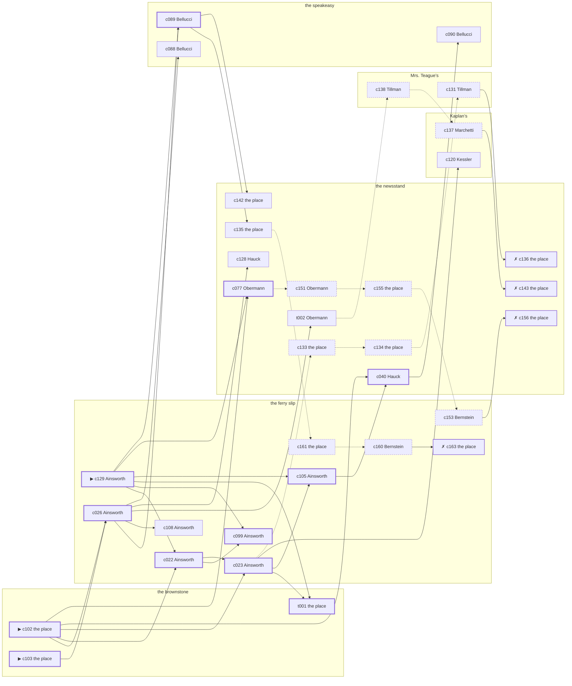

# the Gas House District — case 6

**Seed** 6 · **Difficulty** 2 · **Attempts** 1 · **Detective** Dashiell

**Type** murder · **Trope** body-at-scene · **Unknowns** who, why, when

**Par** 12 actions · **Slack** 6 · **Budget** 18 · **Findable** 34 (spine 12, corroboration 8, noise 10 + 4 disqualifiers) · **Noise ratio** 41% · **Candidate pool** 166

## 1. The Truth

Hyman Kessler, an insurance adjuster, a witness against the people Lindemann worked for, killed Gustav Lindemann, a bootlegger with the lease on the top floor, with poison in a drink at the brownstone at 10:30 PM. Kessler was about to be exposed by Lindemann (exposure). Kessler had been at the speakeasy earlier in the evening, where the means lived, and was alone with Lindemann when it happened. Ainsworth hired us.

## 2. The Act

**murder** · **body-at-scene** · actor **Kessler** · at **the brownstone** · at **10:30 PM**

- found at the brownstone
- fate: dead

**Givens** — what the briefing states and the report does not ask:

- Lindemann was found dead at the brownstone.
- Lindemann was killed at the brownstone, and nothing was carried out of the room afterwards.
- The coroner puts it between 9:00 PM and 10:30 PM, which is two hours of nothing useful.
- It was poison in a drink.

**Unknowns** — exactly what the report asks: **who**, **why**, **when**.

## 3. Dramatis Personae

| Name | Role | Relationship | Class of secret | Motive | Found at | Killer |
| --- | --- | --- | --- | --- | --- | --- |
| Gustav Lindemann | a bootlegger with the lease on the top floor | the victim | — | — | — | — |
| Lyman Coffin | a policy runner | a customer of Lindemann’s | fence | debt | the speakeasy | — |
| Bernard Bernstein | a young man living on expectations | Lindemann’s brother-in-law | gambling-debt | — | the ferry slip | — |
| Winthrop Ainsworth (client) | a hack driver | a childhood friend of Lindemann’s from the same block | fence | — | the ferry slip | — |
| Hedwig Hauck | a dentist with a chair and a waiting room | Lindemann’s neighbour across the airshaft | forged-identity | — | the newsstand | — |
| Grafton Stannard | a tailor | Lindemann’s neighbour across the airshaft | hidden-family | revenge | the ferry slip | — |
| Hyman Kessler | an insurance adjuster | a witness against the people Lindemann worked for | murder (+ gambling-debt) | exposure | Kaplan’s | **YES** |
| Rosaria Marchetti | the druggist | fixture (druggist) | — | — | Kaplan’s | — |
| Klara Obermann | the news dealer | fixture (newsstand) | — | — | the newsstand | — |
| Clementine Tillman | the landlady | fixture (landlady) | — | — | Mrs. Teague’s | — |
| Giuseppe Bellucci | the bartender | fixture (bartender) | — | — | the speakeasy | — |

## 4. Dossiers

Every person, by layer: **0** on sight, **1** volunteered, **2** from other people, **3** in the documents.

### Lindemann — the victim

39, a man, a bootlegger with the lease on the top floor. Wants: money.

- **Standing** — Lindemann was owed favours by people who would rather not be reminded of them.
- **Profession** — Lindemann supplied four houses on the block and took cash only.
- **Found** — Coffin found Lindemann at the brownstone at 11:30 PM. By Coffin, at the brownstone, at 11:30 PM. Precinct: took-a-statement.

**Layer 0, on sight**

- _gender_ — A man.
- _age_ — In his thirties.

**Layer 1, volunteered**

- _profession_ — A bootlegger with the lease on the top floor.
- _detail_ — Lindemann supplied four houses on the block and took cash only.

**Layer 2, from other people**

- _tie_ — Lindemann was owed favours by people who would rather not be reminded of them.
- _want_ — Lindemann wants money, and is not particular about the shape it arrives in.

**Self-account** (layer 1, what they say when asked about themselves)

- Lindemann is 39 years old and a bootlegger with the lease on the top floor.
- Lindemann supplied four houses on the block and took cash only.
- Lindemann is the one this is about.

### Coffin

36, a man, a policy runner. Wants: money. Tie: a customer of Lindemann’s, for years.

**Layer 0, on sight**

- _gender_ — A man.
- _age_ — In his thirties.

**Layer 1, volunteered**

- _profession_ — A policy runner.
- _detail_ — Coffin runs policy for a bank uptown and is trusted with the bag.

**Layer 2, from other people**

- _tie_ — Coffin came to Lindemann on Althea Hargrove’s introduction and has stayed a customer.
- _want_ — Coffin wants money, and is not particular about the shape it arrives in.
- _since_ — Coffin has been a customer of Lindemann’s, for years.
- _third_ — Althea Hargrove is a sister who married out of the neighbourhood.

**Layer 3, in the documents**

- _secret-hint_ — Coffin was carrying a parcel into the newsstand and came out without it.

**Self-account** (layer 1, what they say when asked about themselves)

- Coffin is 36 years old and a policy runner.
- Coffin runs policy for a bank uptown and is trusted with the bag.
- Coffin is a customer of Lindemann’s.

### Bernstein

26, a man, a young man living on expectations. Wants: money. Tie: Lindemann’s brother-in-law, since ’23.

**Layer 0, on sight**

- _gender_ — A man.
- _age_ — In the late twenties.

**Layer 1, volunteered**

- _profession_ — A young man living on expectations.
- _detail_ — Bernstein keeps a desk at a brokerage where nobody expects him before noon.

**Layer 2, from other people**

- _tie_ — Lindemann stood up at Bernstein’s wedding and Patrick Quill has never let either of them forget it.
- _want_ — Bernstein wants money, and is not particular about the shape it arrives in.
- _since_ — Bernstein has been Lindemann’s brother-in-law, since ’23.
- _third_ — Patrick Quill is a partner who walked out of the business.

**Layer 3, in the documents**

- _secret-hint_ — Bernstein was asking around for a hundred dollars in a hurry earlier in the week.

**Self-account** (layer 1, what they say when asked about themselves)

- Bernstein is 26 years old and a young man living on expectations.
- Bernstein keeps a desk at a brokerage where nobody expects him before noon.
- Bernstein is Lindemann’s brother-in-law.

### Ainsworth — the client

30, a man, a hack driver. Wants: money. Tie: a childhood friend of Lindemann’s from the same block, since they were boys on the same stoop.

**Layer 0, on sight**

- _gender_ — A man.
- _age_ — In his thirties.
- _profession_ — A hack driver.

**Layer 1, volunteered**

- _detail_ — Ainsworth drives nights and sleeps while the city works.

**Layer 2, from other people**

- _tie_ — Ainsworth and Lindemann were boys together and neither of them ever left the neighbourhood.
- _want_ — Ainsworth wants money, and is not particular about the shape it arrives in.
- _since_ — Ainsworth has been a childhood friend of Lindemann’s from the same block, since they were boys on the same stoop.

**Layer 3, in the documents**

- _secret-hint_ — Ainsworth was carrying a parcel into the ferry slip and came out without it.

**Self-account** (layer 1, what they say when asked about themselves)

- Ainsworth is 30 years old and a hack driver.
- Ainsworth drives nights and sleeps while the city works.
- Ainsworth is a childhood friend of Lindemann’s from the same block.

### Hauck

37, a woman, a dentist with a chair and a waiting room. Wants: respectability. Tie: Lindemann’s neighbour across the airshaft, since ’24.

**Layer 0, on sight**

- _gender_ — A woman.
- _age_ — In her thirties.

**Layer 1, volunteered**

- _profession_ — A dentist with a chair and a waiting room.
- _detail_ — Hauck pulls teeth for the neighbourhood at a dollar a time.

**Layer 2, from other people**

- _tie_ — Hauck has lived on the same landing as Lindemann since ’24.
- _want_ — Hauck wants to be thought respectable by people who are not.
- _since_ — Hauck has been Lindemann’s neighbour across the airshaft, since ’24.

**Layer 3, in the documents**

- _secret-hint_ — Hauck’s registration card gives an address on a street that does not exist.

**Self-account** (layer 1, what they say when asked about themselves)

- Hauck is 37 years old and a dentist with a chair and a waiting room.
- Hauck pulls teeth for the neighbourhood at a dollar a time.
- Hauck is Lindemann’s neighbour across the airshaft.

### Stannard

59, a man, a tailor. Wants: respectability. Tie: Lindemann’s neighbour across the airshaft, five years on the same landing.

**Layer 0, on sight**

- _gender_ — A man.
- _age_ — In his fifties.
- _profession_ — A tailor.

**Layer 1, volunteered**

- _detail_ — Stannard presses and turns coats in a shop the width of a hallway.

**Layer 2, from other people**

- _tie_ — Stannard and Lindemann share a wall, a landing and a long argument about Vincenzo Lanza.
- _want_ — Stannard wants to be thought respectable by people who are not.
- _since_ — Stannard has been Lindemann’s neighbour across the airshaft, five years on the same landing.
- _third_ — Vincenzo Lanza is the man who held the second mortgage.

**Layer 3, in the documents**

- _secret-hint_ — Stannard sends money out of every pay envelope and cannot say where it goes.

**Self-account** (layer 1, what they say when asked about themselves)

- Stannard is 59 years old and a tailor.
- Stannard presses and turns coats in a shop the width of a hallway.
- Stannard is Lindemann’s neighbour across the airshaft.

### Kessler — the killer

40, a man, an insurance adjuster. Wants: to-keep-what-they-have. Tie: a witness against the people Lindemann worked for, since the indictment.

**Layer 0, on sight**

- _gender_ — A man.
- _age_ — In his forties.

**Layer 1, volunteered**

- _profession_ — An insurance adjuster.
- _detail_ — Kessler walks fire jobs for the company and writes up what he finds.

**Layer 2, from other people**

- _tie_ — Kessler talked to the district attorney in ’27 and Ezekiel Broadnax has not spoken to Kessler since.
- _want_ — Kessler wants to keep what they have and add nothing to it.
- _since_ — Kessler has been a witness against the people Lindemann worked for, since the indictment.
- _third_ — Ezekiel Broadnax is an old friend who once put up the bail.

**Layer 3, in the documents**

- _secret-hint_ — Kessler was asking around for a hundred dollars in a hurry earlier in the week.

**Self-account** (layer 1, what they say when asked about themselves)

- Kessler is 40 years old and an insurance adjuster.
- Kessler walks fire jobs for the company and writes up what he finds.
- Kessler is a witness against the people Lindemann worked for.

### Marchetti

55, a woman, the druggist. Wants: respectability. Tie: behind the counter at Kaplan’s.

**Layer 0, on sight**

- _gender_ — A woman.
- _age_ — In her fifties.
- _profession_ — The druggist.

**Layer 1, volunteered**

- _detail_ — Marchetti stands the counter at Kaplan’s and writes down every prescription twice.

**Layer 2, from other people**

- _tie_ — Marchetti is behind the counter at Kaplan’s.
- _want_ — Marchetti wants to be thought respectable by people who are not.

**Self-account** (layer 1, what they say when asked about themselves)

- Marchetti is 55 years old and the druggist.
- Marchetti stands the counter at Kaplan’s and writes down every prescription twice.
- Marchetti is behind the counter at Kaplan’s.

### Obermann

40, a woman, the news dealer. Wants: to-keep-what-they-have. Tie: at the stand at the newsstand, every day of the year.

**Layer 0, on sight**

- _gender_ — A woman.
- _age_ — In her forties.
- _profession_ — The news dealer.

**Layer 1, volunteered**

- _detail_ — Obermann runs the stand at the newsstand and misses nothing that crosses the pavement.

**Layer 2, from other people**

- _tie_ — Obermann is at the stand at the newsstand, every day of the year.
- _want_ — Obermann wants to keep what they have and add nothing to it.

**Self-account** (layer 1, what they say when asked about themselves)

- Obermann is 40 years old and the news dealer.
- Obermann runs the stand at the newsstand and misses nothing that crosses the pavement.
- Obermann is at the stand at the newsstand, every day of the year.

### Tillman

41, a woman, the landlady. Wants: money. Tie: the keeper of Mrs. Teague’s.

**Layer 0, on sight**

- _gender_ — A woman.
- _age_ — In her forties.
- _profession_ — The landlady.

**Layer 1, volunteered**

- _detail_ — Tillman has kept Mrs. Teague’s for twenty-two years and knows every board that creaks.

**Layer 2, from other people**

- _tie_ — Tillman is the keeper of Mrs. Teague’s.
- _want_ — Tillman wants money, and is not particular about the shape it arrives in.

**Self-account** (layer 1, what they say when asked about themselves)

- Tillman is 41 years old and the landlady.
- Tillman has kept Mrs. Teague’s for twenty-two years and knows every board that creaks.
- Tillman is the keeper of Mrs. Teague’s.

### Bellucci

53, a man, the bartender. Wants: to-be-left-alone. Tie: behind the bar at the speakeasy, every night of the week.

**Layer 0, on sight**

- _gender_ — A man.
- _age_ — In his fifties.
- _profession_ — The bartender.

**Layer 1, volunteered**

- _detail_ — Bellucci works the speakeasy from four until they lock the door.

**Layer 2, from other people**

- _tie_ — Bellucci is behind the bar at the speakeasy, every night of the week.
- _want_ — Bellucci wants to be left alone.

**Self-account** (layer 1, what they say when asked about themselves)

- Bellucci is 53 years old and the bartender.
- Bellucci works the speakeasy from four until they lock the door.
- Bellucci is behind the bar at the speakeasy, every night of the week.

## 5. The Client

**Ainsworth**, a childhood friend of Lindemann’s from the same block. Purpose: **settle-a-debt-with-the-dead**.

- **Why** — Ainsworth has something owing with Lindemann that death did not settle.
- **What it costs** — Ainsworth is spending money Ainsworth was owed and may never see.
- **Points at** — Kessler: Kessler was about to be exposed by Lindemann. Honest: **yes**.

**Tells:**

- Lindemann was found dead at the brownstone.
- Lindemann was killed at the brownstone, and nothing was carried out of the room afterwards.
- The coroner puts it between 9:00 PM and 10:30 PM, which is two hours of nothing useful.
- It was poison in a drink.
- Ainsworth would rather we started with Kessler: Kessler was about to be exposed by Lindemann.

**Withholds:**

- Ainsworth does not mention it, but Ainsworth hands a parcel of stolen goods to a man at the ferry slip from 6:30 PM to 7:00 PM.

**Their own evening, as they tell it:**

- Ainsworth says he was at the speakeasy at 6:00 PM.
- Ainsworth says he was at the newsstand from 6:30 PM to 7:00 PM.
- Ainsworth says he was at the ferry slip from 7:30 PM to 8:00 PM.
- Ainsworth says he was at the newsstand from 8:30 PM to 9:00 PM.

## 6. The Briefing

16 plain sentences, derived. This is the model of the plain register: the engine renders it, and Phase 2 measures pages against it.

1. A man came up the stairs after midnight, and sat down.
2. Winthrop Ainsworth is 30 years old and a hack driver.
3. Ainsworth drives nights and sleeps while the city works.
4. Lindemann was owed favours by people who would rather not be reminded of them.
5. Lindemann was found dead at the brownstone.
6. Lindemann was killed at the brownstone, and nothing was carried out of the room afterwards.
7. The coroner puts it between 9:00 PM and 10:30 PM, which is two hours of nothing useful.
8. It was poison in a drink.
9. Coffin found Lindemann at the brownstone at 11:30 PM.
10. The precinct took a statement at the desk and filed it.
11. Ainsworth is a childhood friend of Lindemann’s from the same block.
12. Ainsworth and Lindemann were boys together and neither of them ever left the neighbourhood.
13. Ainsworth has something owing with Lindemann that death did not settle.
14. Ainsworth is spending money Ainsworth was owed and may never see.
15. Ainsworth wants us to start with Kessler.
16. Kessler was about to be exposed by Lindemann.

## 7. Mentions

- **Althea Hargrove** (m-1) — a sister who married out of the neighbourhood. Althea Hargrove is a sister who married out of the neighbourhood.
- **Patrick Quill** (m-2) — a partner who walked out of the business. Patrick Quill is a partner who walked out of the business.
- **Vincenzo Lanza** (m-3) — the man who held the second mortgage. Vincenzo Lanza is the man who held the second mortgage.
- **Ezekiel Broadnax** (m-4) — an old friend who once put up the bail. Ezekiel Broadnax is an old friend who once put up the bail.

## 8. Places

- **Kaplan’s drugstore with the soda fountain** (public) — watched by druggist (Marchetti); objects: an ice pick, a wall telephone
- **the newsstand on the corner** (public) — watched by newsstand (Obermann); objects: a spike of pawn tickets, the roof-door key — within earshot of the scene
- **the back room at Mrs. Teague’s** (private) — watched by landlady (Tillman); objects: a strapped suitcase, a framed photograph
- **Lindemann’s rooms in the brownstone** (private) — unwatched; objects: a length of sash cord, a bronze bookend — **THE SCENE**; the victim’s address
- **the ferry slip at the foot of the street** (public) — unwatched; objects: a folded stack of evening papers, a pasted-up timetable — within earshot of the scene
- **the speakeasy under the hat shop** (semi) — watched by bartender (Bellucci); objects: a bottle of chloral drops, a seltzer siphon, a nickel-plated revolver, a silver cigarette case — where the weapon lived

## 9. Anchors

The coroner gives 9:00 PM–10:30 PM, four ticks wide. These are what close it: **ice-delivery** and **last-edition**.

- **the last edition coming off the truck** — at 10:00 PM; at the newsstand. Somebody reliable notes who was there. Only those present know that the late edition led with the bridge contract and not the hold-up. Those present carry it: ink still wet enough to come off on a glove.
- **the ice being brought in** — at 10:30 PM; at the newsstand. Somebody reliable notes who was there. Only those present know that the iceman dropped a block on the step and it went in three. Those present carry it: a wet patch down one side of a coat.

## 10. Timelines

### Lindemann — the victim

| Tick | Time | Truth | Claimed | Companion claimed |
| --- | --- | --- | --- | --- |
| 0 | 6:00 PM | Kaplan’s | Kaplan’s | — |
| 1 | 6:30 PM | the newsstand | the newsstand | — |
| 2 | 7:00 PM | the ferry slip | the ferry slip | — |
| 3 | 7:30 PM | the ferry slip | the ferry slip | — |
| 4 | 8:00 PM | the newsstand | the newsstand | — |
| 5 | 8:30 PM | the newsstand | the newsstand | — |
| 6 | 9:00 PM | Kaplan’s | Kaplan’s | — |
| 7 | 9:30 PM | the speakeasy | the speakeasy | — |
| 8 | 10:00 PM | the newsstand | the newsstand | — |
| 9 | 10:30 PM | the brownstone ☠ | the brownstone | — |
| 10 | 11:00 PM | — | — | — |
| 11 | 11:30 PM | — | — | — |

### Coffin

| Tick | Time | Truth | Claimed | Companion claimed |
| --- | --- | --- | --- | --- |
| 0 | 6:00 PM | Mrs. Teague’s | Mrs. Teague’s | — |
| 1 | 6:30 PM | Mrs. Teague’s | Mrs. Teague’s | — |
| 2 | 7:00 PM | the speakeasy | the speakeasy | — |
| 3 | 7:30 PM | the speakeasy | the speakeasy | — |
| 4 | 8:00 PM | the speakeasy | the speakeasy | — |
| 5 | 8:30 PM | the newsstand | the newsstand | — |
| 6 | 9:00 PM | the newsstand | the newsstand | — |
| 7 | 9:30 PM | the newsstand | the newsstand | — |
| 8 | 10:00 PM | the ferry slip | the ferry slip | — |
| 9 | 10:30 PM | the newsstand | **Mrs. Teague’s** | — |
| 10 | 11:00 PM | the speakeasy | the speakeasy | — |
| 11 | 11:30 PM | the brownstone | the brownstone | — |

### Bernstein

| Tick | Time | Truth | Claimed | Companion claimed |
| --- | --- | --- | --- | --- |
| 0 | 6:00 PM | the ferry slip | the ferry slip | — |
| 1 | 6:30 PM | the ferry slip | the ferry slip | — |
| 2 | 7:00 PM | the brownstone | the brownstone | — |
| 3 | 7:30 PM | the brownstone | the brownstone | — |
| 4 | 8:00 PM | the brownstone | the brownstone | — |
| 5 | 8:30 PM | the brownstone | the brownstone | — |
| 6 | 9:00 PM | Mrs. Teague’s | Mrs. Teague’s | — |
| 7 | 9:30 PM | the speakeasy | the speakeasy | — |
| 8 | 10:00 PM | the ferry slip | the ferry slip | — |
| 9 | 10:30 PM | the newsstand | **Kaplan’s** | Kessler |
| 10 | 11:00 PM | Kaplan’s | Kaplan’s | — |
| 11 | 11:30 PM | the newsstand | the newsstand | — |

### Ainsworth

| Tick | Time | Truth | Claimed | Companion claimed |
| --- | --- | --- | --- | --- |
| 0 | 6:00 PM | the speakeasy | the speakeasy | — |
| 1 | 6:30 PM | the ferry slip | **the newsstand** | — |
| 2 | 7:00 PM | the ferry slip | **the newsstand** | — |
| 3 | 7:30 PM | the ferry slip | the ferry slip | — |
| 4 | 8:00 PM | the ferry slip | the ferry slip | — |
| 5 | 8:30 PM | the newsstand | the newsstand | — |
| 6 | 9:00 PM | the newsstand | the newsstand | — |
| 7 | 9:30 PM | Kaplan’s | Kaplan’s | — |
| 8 | 10:00 PM | the newsstand | the newsstand | — |
| 9 | 10:30 PM | the newsstand | the newsstand | — |
| 10 | 11:00 PM | the newsstand | the newsstand | — |
| 11 | 11:30 PM | the ferry slip | the ferry slip | — |

### Hauck

| Tick | Time | Truth | Claimed | Companion claimed |
| --- | --- | --- | --- | --- |
| 0 | 6:00 PM | the speakeasy | the speakeasy | — |
| 1 | 6:30 PM | the speakeasy | the speakeasy | — |
| 2 | 7:00 PM | the speakeasy | the speakeasy | — |
| 3 | 7:30 PM | the newsstand | the newsstand | — |
| 4 | 8:00 PM | the newsstand | the newsstand | — |
| 5 | 8:30 PM | the newsstand | the newsstand | — |
| 6 | 9:00 PM | the newsstand | the newsstand | — |
| 7 | 9:30 PM | the newsstand | the newsstand | — |
| 8 | 10:00 PM | the newsstand | the newsstand | — |
| 9 | 10:30 PM | the newsstand | the newsstand | — |
| 10 | 11:00 PM | the newsstand | the newsstand | — |
| 11 | 11:30 PM | the newsstand | the newsstand | — |

### Stannard

| Tick | Time | Truth | Claimed | Companion claimed |
| --- | --- | --- | --- | --- |
| 0 | 6:00 PM | the ferry slip | **the newsstand** | — |
| 1 | 6:30 PM | the ferry slip | **the newsstand** | — |
| 2 | 7:00 PM | the brownstone | the brownstone | — |
| 3 | 7:30 PM | the brownstone | the brownstone | — |
| 4 | 8:00 PM | the ferry slip | the ferry slip | — |
| 5 | 8:30 PM | the ferry slip | the ferry slip | — |
| 6 | 9:00 PM | the ferry slip | the ferry slip | — |
| 7 | 9:30 PM | the speakeasy | the speakeasy | — |
| 8 | 10:00 PM | the ferry slip | the ferry slip | — |
| 9 | 10:30 PM | Mrs. Teague’s | Mrs. Teague’s | — |
| 10 | 11:00 PM | the ferry slip | the ferry slip | — |
| 11 | 11:30 PM | the ferry slip | the ferry slip | — |

### Kessler — the killer

| Tick | Time | Truth | Claimed | Companion claimed |
| --- | --- | --- | --- | --- |
| 0 | 6:00 PM | Kaplan’s | Kaplan’s | — |
| 1 | 6:30 PM | the ferry slip | the ferry slip | — |
| 2 | 7:00 PM | the speakeasy | the speakeasy | — |
| 3 | 7:30 PM | the speakeasy | the speakeasy | — |
| 4 | 8:00 PM | the ferry slip | the ferry slip | — |
| 5 | 8:30 PM | Kaplan’s | **the speakeasy** | — |
| 6 | 9:00 PM | Kaplan’s | **the speakeasy** | — |
| 7 | 9:30 PM | the ferry slip | the ferry slip | — |
| 8 | 10:00 PM | the brownstone | **the newsstand** | — |
| 9 | 10:30 PM | the brownstone ☠ | **the newsstand** | — |
| 10 | 11:00 PM | Kaplan’s | Kaplan’s | — |
| 11 | 11:30 PM | Kaplan’s | Kaplan’s | — |

### Fixtures (never lie, never withhold)

| Tick | Time | Marchetti (the druggist) | Obermann (the news dealer) | Tillman (the landlady) | Bellucci (the bartender) |
| --- | --- | --- | --- | --- | --- |
| 0 | 6:00 PM | Kaplan’s | the newsstand | Mrs. Teague’s | the speakeasy |
| 1 | 6:30 PM | the ferry slip | the newsstand | Mrs. Teague’s | the speakeasy |
| 2 | 7:00 PM | Kaplan’s | Kaplan’s | Mrs. Teague’s | the speakeasy |
| 3 | 7:30 PM | Kaplan’s | the newsstand | Mrs. Teague’s | the speakeasy |
| 4 | 8:00 PM | Kaplan’s | the newsstand | Mrs. Teague’s | the speakeasy |
| 5 | 8:30 PM | Kaplan’s | the newsstand | Mrs. Teague’s | the speakeasy |
| 6 | 9:00 PM | Kaplan’s | the newsstand | Mrs. Teague’s | the speakeasy |
| 7 | 9:30 PM | Kaplan’s | the newsstand | Mrs. Teague’s | the speakeasy |
| 8 | 10:00 PM | Kaplan’s | the newsstand | Mrs. Teague’s | the speakeasy |
| 9 | 10:30 PM | Kaplan’s | the newsstand | Mrs. Teague’s | Mrs. Teague’s |
| 10 | 11:00 PM | Kaplan’s | the newsstand | Mrs. Teague’s | the speakeasy |
| 11 | 11:30 PM | Kaplan’s | the newsstand | Mrs. Teague’s | the speakeasy |

## 11. Secrets in play

- **Coffin** (fence): Coffin hands a parcel of stolen goods to a man at the newsstand from 10:30 PM.
- **Bernstein** (gambling-debt): Bernstein slips off to the newsstand from 10:30 PM to settle with a bookmaker.
- **Ainsworth** (fence): Ainsworth hands a parcel of stolen goods to a man at the ferry slip from 6:30 PM to 7:00 PM.
- **Hauck** (forged-identity): Hauck is not the person the papers say. Nothing about the evening is hidden; the lie is all in the paperwork.
- **Stannard** (hidden-family): Stannard goes to the ferry slip from 6:00 PM to 6:30 PM to see a child nobody is supposed to know about.
- **Kessler** (murder): Kessler is at the brownstone from 10:00 PM to 10:30 PM, alone with Lindemann when it happens at 10:30 PM.
- **Kessler** also (gambling-debt): Kessler slips off to Kaplan’s from 8:30 PM to 9:00 PM to settle with a bookmaker.

## 12. Clue list — the 34 findable

The opening three, free at the start: c102, c103, c129. Everything else has to be led to. The full candidate pool is in the companion file.

### At Kaplan’s

- **c120** [corroboration] (anchor; Kessler on the ice being brought in) → (end)
  - Kessler claims the newsstand at 10:30 PM, which is when the ice being brought in was on. Asked about it, Kessler cannot say that the iceman dropped a block on the step and it went in three — and everybody who was there can.
  - _establishes: Kessler not at the newsstand, 10:30 PM_
- **c137** [noise {b4}] (overheard; Marchetti on Bernstein) → c143
  - Marchetti on Bernstein: Bernstein was asking around for a hundred dollars in a hurry earlier in the week.
  - _establishes: context only_

### At the newsstand

- **c040** [spine] (observation; Hauck on Kessler) → c090
  - Hauck says Kessler was at the speakeasy at 7:00 PM.
  - _establishes: Kessler at the speakeasy, 7:00 PM; Kessler could reach the weapon_
- **c077** [spine] (observation; Obermann on Ainsworth) → c151
  - Obermann says Ainsworth was at the newsstand from 10:00 PM to 11:00 PM.
  - _establishes: Ainsworth at the newsstand, 10:00 PM–11:00 PM_
- **t002** [corroboration] (overheard; Obermann on the brownstone that evening) → c138
  - Obermann says the door at the brownstone was shut from 10:30 PM on, and nobody came out of it carrying anything.
  - _establishes: Lindemann at the brownstone, 10:30 PM_
- **c128** [corroboration] (overheard; Hauck on Kessler and Lindemann) → (end)
  - Hauck says Lindemann told Kessler that the story would run whether Kessler liked it or not.
  - _establishes: Kessler had a motive (exposure)_
- **c135** [corroboration] (overheard; the place itself) → c161
  - The receiver at the newsstand would rather talk than be held: Coffin was there from 10:30 PM handing over a parcel of somebody else’s silver, which is a charge Coffin will take over this one.
  - _establishes: Coffin’s fence accounted for; Coffin at the newsstand, 10:30 PM_
- **c142** [corroboration] (overheard; the place itself) → (end)
  - The bookmaker’s runner is found and will say it: Bernstein was at the newsstand from 10:30 PM paying off eleven hundred dollars, a dollar at a time, and went nowhere near the killing.
  - _establishes: Bernstein’s gambling-debt accounted for; Bernstein at the newsstand, 10:30 PM_
- **c133** [noise {b1}] (physical; the place itself) → c134
  - Wrapping paper and a cut string at the newsstand, and the shop it came from closed two years ago.
  - _establishes: context only_
- **c134** [noise {b1}] (physical; the place itself) → c131
  - A pawn ticket at the newsstand in a name that does not exist, made out at the hour in question.
  - _establishes: context only_
- **c136** [disqualifier {b1}] (overheard; the place itself) → (end)
  - The goods turn up, tagged and dated, and the tag puts Coffin at the newsstand from 10:30 PM with both hands full.
  - _establishes: Coffin’s fence accounted for; Coffin at the newsstand, 10:30 PM_
- **c151** [noise {b2}] (overheard; Obermann on Hauck) → c155
  - Obermann on Hauck: Hauck’s registration card gives an address on a street that does not exist.
  - _establishes: context only_
- **c155** [noise {b2}] (physical; the place itself) → c153
  - A steamship ticket stub among Hauck’s things, in the name of a man who died at Belleau Wood.
  - _establishes: context only_
- **c156** [disqualifier {b2}] (overheard; the place itself) → (end)
  - The name Hauck was born with turns up on a desertion warrant from 1918. Hauck has been hiding from the Army for eleven years and from nobody else.
  - _establishes: Hauck’s forged-identity accounted for_
- **c143** [disqualifier {b4}] (overheard; the place itself) → (end)
  - The book at the newsstand has the payment entered against Bernstein’s name and the time beside it, from 10:30 PM, in the clerk’s own hand.
  - _establishes: Bernstein’s gambling-debt accounted for; Bernstein at the newsstand, 10:30 PM_

### At Mrs. Teague’s

- **c131** [noise {b1}] (overheard; Tillman on Coffin) → c136
  - Tillman on Coffin: There is a man who meets people at the newsstand and nobody will say his name out loud.
  - _establishes: context only_
- **c138** [noise {b4}] (overheard; Tillman on Bernstein) → c137
  - Tillman on Bernstein: A man nobody knew was waiting for Bernstein at the newsstand and would not give a name.
  - _establishes: context only_

### At the brownstone

- **c102** [spine ⟨opening⟩] (scene; the place itself) → c026, c022, c023, c040, c077
  - Lindemann was found at the brownstone. A glass is on its side and the spill had not yet reached the edge of the table when it dried. The ice was brought in at 10:30 PM and the iceman’s book has the delivery timed and signed for.
  - _establishes: the victim dead by 10:30 PM; how it was done_
- **c103** [spine ⟨opening⟩] (morgue; the place itself) → c026
  - The coroner puts death between 9:00 PM and 10:30 PM — two hours of nothing useful. Chloral hydrate in the stomach. No wound, no bruising, no sign of a struggle.
  - _establishes: death between 9:00 PM and 10:30 PM; how it was done_
- **t001** [spine] (physical; the place itself) → (end)
  - The rug at the brownstone is rucked up under Lindemann and the chair beside it went over backwards. Nothing was carried out of the room.
  - _establishes: Lindemann at the brownstone, 10:30 PM_

### At the ferry slip

- **c129** [spine ⟨opening⟩] (client; Ainsworth on why I was hired) → c022, c099, t001, c105, c077, c089
  - Ainsworth hired us, and wants it known that Kessler was about to be exposed by Lindemann, and would rather we started there.
  - _establishes: Kessler had a motive (exposure)_
- **c026** [spine] (observation; Ainsworth on Hauck) → c089, c108, t002, c128, c088
  - Ainsworth says Hauck was at the newsstand from 10:00 PM to 11:00 PM.
  - _establishes: Hauck at the newsstand, 10:00 PM–11:00 PM_
- **c022** [spine] (observation; Ainsworth on Coffin) → c099, c023
  - Ainsworth says Coffin was at the newsstand at 10:30 PM.
  - _establishes: Coffin at the newsstand, 10:30 PM_
- **c099** [spine] (observation; Ainsworth on Kessler’s account) → (end)
  - Ainsworth was at the newsstand from 10:00 PM to 10:30 PM and says Kessler was not.
  - _establishes: Kessler not at the newsstand, 10:00 PM–10:30 PM_
- **c023** [spine] (observation; Ainsworth on Bernstein) → t001, c105, c120, c133
  - Ainsworth says Bernstein was at the newsstand at 10:30 PM.
  - _establishes: Bernstein at the newsstand, 10:30 PM_
- **c105** [spine] (anchor; Ainsworth on Lindemann that evening) → c040
  - Ainsworth puts Lindemann at the newsstand when the last edition came up, which was 10:00 PM, and alive enough to argue about the weather.
  - _establishes: the victim alive at 10:00 PM; Lindemann at the newsstand, 10:00 PM_
- **c108** [corroboration] (anchor; Ainsworth on the noise that evening) → (end)
  - Ainsworth was at the newsstand at 10:30 PM and heard a chair going over from the direction of the brownstone, as the ice was being brought in.
  - _establishes: noise at the brownstone at 10:30 PM; the victim dead by 10:30 PM; how it was done_
- **c153** [noise {b2}] (overheard; Bernstein on Hauck) → c156
  - Bernstein on Hauck: Hauck answers to the name a half-second late, every time.
  - _establishes: context only_
- **c161** [noise {b3}] (physical; the place itself) → c160
  - A board-and-keep receipt at the ferry slip, monthly, eight years of them.
  - _establishes: context only_
- **c160** [noise {b3}] (overheard; Bernstein on Stannard) → c163
  - Bernstein on Stannard: Stannard keeps a photograph and will not be asked about it twice.
  - _establishes: context only_
- **c163** [disqualifier {b3}] (overheard; the place itself) → (end)
  - The woman who keeps the child says it straight out: Stannard was at the ferry slip from 6:00 PM to 6:30 PM, the same as every week, and left with the same face as always.
  - _establishes: Stannard’s hidden-family accounted for; Stannard at the ferry slip, 6:00 PM–6:30 PM_

### At the speakeasy

- **c089** [spine] (observation; Bellucci on Stannard) → c135, c142
  - Bellucci says Stannard was at Mrs. Teague’s at 10:30 PM.
  - _establishes: Stannard at Mrs. Teague’s, 10:30 PM_
- **c090** [corroboration] (observation; Bellucci on Kessler) → (end)
  - Bellucci says Kessler was at the speakeasy from 7:00 PM to 7:30 PM.
  - _establishes: Kessler at the speakeasy, 7:00 PM–7:30 PM; Kessler could reach the weapon_
- **c088** [corroboration] (observation; Bellucci on Stannard) → (end)
  - Bellucci says Stannard was at the speakeasy at 9:30 PM.
  - _establishes: Stannard at the speakeasy, 9:30 PM; Stannard could reach the weapon_

## 13. Clue graph

## 14. Deduction path

Par is **12 actions** and the budget is par plus 6: **18**. Every id below is a spine clue; the inference is the sheet’s, not the clue’s.

**Time of death.** The coroner gives four ticks. The anchors close it to 10:30 PM: one puts Lindemann alive at 10:00 PM, the other times the scene at 10:30 PM. _(c103, c105, c102; + 1 corroborating)_

**Clearing the innocent.**

- Coffin was not at the brownstone at 10:30 PM. _(c022; + 2 corroborating)_
- Bernstein was not at the brownstone at 10:30 PM. _(c023; + 2 corroborating)_
- Ainsworth was not at the brownstone at 10:30 PM. _(c077)_
- Hauck was not at the brownstone at 10:30 PM. _(c026)_
- Stannard was not at the brownstone at 10:30 PM. _(c089)_

**Naming the killer.** Kessler claims the newsstand at 10:30 PM. Two independent sources put that out of the question. _(c099; + 1 corroborating)_

**The weapon.** Kessler was at the speakeasy before 10:30 PM, where a bottle of chloral drops was kept. _(c040; + 1 corroborating)_

**Method.** Poison in a drink, on two physical sources. _(c102, c103; + 1 corroborating)_

**Motive.** exposure, on two independent sources. _(c129; + 1 corroborating)_

## 15. Red herrings

**Innocents who lie about the murder tick:**

- Coffin claims Mrs. Teague’s at 10:30 PM and was really at the newsstand. Reason: Coffin hands a parcel of stolen goods to a man at the newsstand from 10:30 PM.
- Bernstein claims Kaplan’s at 10:30 PM and was really at the newsstand. Reason: Bernstein slips off to the newsstand from 10:30 PM to settle with a bookmaker.

**Innocents with a motive:**

- Coffin — debt: owed Lindemann four thousand dollars and was past due on it.
- Stannard — revenge: blamed Lindemann for the ruin of Stannard’s business.

**Noise branches, and what knocks each one down:**

- **b1** (Coffin, fence): c133 → c134 → c131 → **c136** — The goods turn up, tagged and dated, and the tag puts Coffin at the newsstand from 10:30 PM with both hands full.
- **b2** (Hauck, forged-identity): c151 → c155 → c153 → **c156** — The name Hauck was born with turns up on a desertion warrant from 1918. Hauck has been hiding from the Army for eleven years and from nobody else.
- **b3** (Stannard, hidden-family): c161 → c160 → **c163** — The woman who keeps the child says it straight out: Stannard was at the ferry slip from 6:00 PM to 6:30 PM, the same as every week, and left with the same face as always.
- **b4** (Bernstein, gambling-debt): c138 → c137 → **c143** — The book at the newsstand has the payment entered against Bernstein’s name and the time beside it, from 10:30 PM, in the clerk’s own hand.

