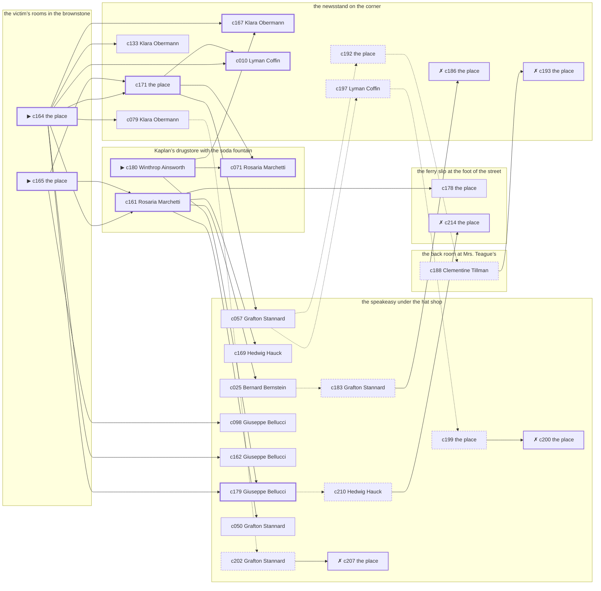

# the Gas House District — case 6

**Seed** 6 · **Difficulty** 2 · **Attempts** 1 · **Detective** Humphrey

**Par** 9 actions · **Budget** 20 · **Slack** 11 · **Findable** 30 (spine 9, corroboration 9, noise 7 + 5 disqualifiers) · **Noise ratio** 40% · **Candidate pool** 215

## 1. The Truth

Hyman Kessler, an insurance adjuster, the victim’s rival in trade, killed Gustav Lindemann, a bootlegger with the lease on the top floor, with poison in a drink at the victim’s rooms in the brownstone at 11:00 PM. Hyman Kessler was about to be exposed by the victim (exposure). Hyman Kessler had been at the speakeasy under the hat shop earlier in the evening, where the weapon lived, and was alone with Gustav Lindemann when it happened. Winthrop Ainsworth hired us.

## 2. Dramatis Personae

| Name | Role | Relationship | Class of secret | Motive | Found at | Killer |
| --- | --- | --- | --- | --- | --- | --- |
| Gustav Lindemann | a bootlegger with the lease on the top floor | the victim | — | — | — | — |
| Lyman Coffin | a policy runner | a customer of the victim’s | fence | debt | the newsstand on the corner | — |
| Bernard Bernstein | the victim’s nephew, at loose ends | the victim’s brother-in-law | gambling-debt | — | the speakeasy under the hat shop | — |
| Winthrop Ainsworth (client) | a hack driver | a childhood friend of the victim’s from the same block | fence | — | Kaplan’s drugstore with the soda fountain | — |
| Hedwig Hauck | a dentist with rooms on the third floor | the victim’s neighbour across the airshaft | forged-identity | — | the speakeasy under the hat shop | — |
| Grafton Stannard | a tailor | the victim’s neighbour across the airshaft | hidden-family | revenge | the speakeasy under the hat shop | — |
| Hyman Kessler | an insurance adjuster | the victim’s rival in trade | murder (+ gambling-debt) | exposure | the newsstand on the corner | **YES** |
| Rosaria Marchetti | the druggist | fixture (druggist) | — | — | Kaplan’s drugstore with the soda fountain | — |
| Klara Obermann | the news dealer | fixture (newsstand) | — | — | the newsstand on the corner | — |
| Clementine Tillman | the landlady | fixture (landlady) | — | — | the back room at Mrs. Teague’s | — |
| Giuseppe Bellucci | the bartender | fixture (bartender) | — | — | the speakeasy under the hat shop | — |

## 3. Places

- **Kaplan’s drugstore with the soda fountain** (public) — watched by druggist (Rosaria Marchetti); objects: an ice pick, a wall telephone
- **the newsstand on the corner** (public) — watched by newsstand (Klara Obermann); objects: a spike of pawn tickets, the roof-door key — within earshot of the scene
- **the back room at Mrs. Teague’s** (private) — watched by landlady (Clementine Tillman); objects: a strapped suitcase, a framed photograph
- **the victim’s rooms in the brownstone** (private) — unwatched; objects: a length of sash cord, a bronze bookend — **THE SCENE**; the victim’s address
- **the ferry slip at the foot of the street** (public) — unwatched; objects: a folded stack of evening papers, a pasted-up timetable — within earshot of the scene
- **the speakeasy under the hat shop** (semi) — watched by bartender (Giuseppe Bellucci); objects: a bottle of chloral drops, a seltzer siphon, a nickel-plated revolver, a silver cigarette case — where the weapon lived

## 4. Anchors

The coroner gives 10:00 PM–11:30 PM, four ticks wide. These are what close it: **ice-delivery** and **last-edition**.

- **the last edition coming off the truck** — at 10:30 PM; at the newsstand on the corner. Somebody reliable notes who was there. Those present carry it: ink still wet enough to come off on a glove.
- **the ice being brought in** — at 11:00 PM; at the newsstand on the corner. Somebody reliable notes who was there. Those present carry it: a wet patch down one side of a coat.

## 5. Timelines

### Gustav Lindemann — the victim

| Tick | Time | Truth | Claimed | Companion claimed |
| --- | --- | --- | --- | --- |
| 0 | 6:00 PM | the speakeasy under the hat shop | the speakeasy under the hat shop | — |
| 1 | 6:30 PM | the speakeasy under the hat shop | the speakeasy under the hat shop | — |
| 2 | 7:00 PM | the speakeasy under the hat shop | the speakeasy under the hat shop | — |
| 3 | 7:30 PM | the speakeasy under the hat shop | the speakeasy under the hat shop | — |
| 4 | 8:00 PM | the speakeasy under the hat shop | the speakeasy under the hat shop | — |
| 5 | 8:30 PM | the speakeasy under the hat shop | the speakeasy under the hat shop | — |
| 6 | 9:00 PM | the speakeasy under the hat shop | the speakeasy under the hat shop | — |
| 7 | 9:30 PM | the victim’s rooms in the brownstone | the victim’s rooms in the brownstone | — |
| 8 | 10:00 PM | the victim’s rooms in the brownstone | the victim’s rooms in the brownstone | — |
| 9 | 10:30 PM | the newsstand on the corner | the newsstand on the corner | — |
| 10 | 11:00 PM | the victim’s rooms in the brownstone ☠ | the victim’s rooms in the brownstone | — |
| 11 | 11:30 PM | — | — | — |

### Lyman Coffin

| Tick | Time | Truth | Claimed | Companion claimed |
| --- | --- | --- | --- | --- |
| 0 | 6:00 PM | the newsstand on the corner | the newsstand on the corner | — |
| 1 | 6:30 PM | the newsstand on the corner | the newsstand on the corner | — |
| 2 | 7:00 PM | the speakeasy under the hat shop | the speakeasy under the hat shop | — |
| 3 | 7:30 PM | the victim’s rooms in the brownstone | the victim’s rooms in the brownstone | — |
| 4 | 8:00 PM | the back room at Mrs. Teague’s | the back room at Mrs. Teague’s | — |
| 5 | 8:30 PM | the back room at Mrs. Teague’s | the back room at Mrs. Teague’s | — |
| 6 | 9:00 PM | the newsstand on the corner | the newsstand on the corner | — |
| 7 | 9:30 PM | the back room at Mrs. Teague’s | the back room at Mrs. Teague’s | — |
| 8 | 10:00 PM | the speakeasy under the hat shop | the speakeasy under the hat shop | — |
| 9 | 10:30 PM | the speakeasy under the hat shop | the speakeasy under the hat shop | — |
| 10 | 11:00 PM | the newsstand on the corner | **the speakeasy under the hat shop** | — |
| 11 | 11:30 PM | the newsstand on the corner | the newsstand on the corner | — |

### Bernard Bernstein

| Tick | Time | Truth | Claimed | Companion claimed |
| --- | --- | --- | --- | --- |
| 0 | 6:00 PM | Kaplan’s drugstore with the soda fountain | Kaplan’s drugstore with the soda fountain | — |
| 1 | 6:30 PM | the speakeasy under the hat shop | the speakeasy under the hat shop | — |
| 2 | 7:00 PM | the speakeasy under the hat shop | the speakeasy under the hat shop | — |
| 3 | 7:30 PM | the speakeasy under the hat shop | the speakeasy under the hat shop | — |
| 4 | 8:00 PM | the speakeasy under the hat shop | the speakeasy under the hat shop | — |
| 5 | 8:30 PM | the speakeasy under the hat shop | the speakeasy under the hat shop | — |
| 6 | 9:00 PM | the victim’s rooms in the brownstone | the victim’s rooms in the brownstone | — |
| 7 | 9:30 PM | the victim’s rooms in the brownstone | the victim’s rooms in the brownstone | — |
| 8 | 10:00 PM | the victim’s rooms in the brownstone | the victim’s rooms in the brownstone | — |
| 9 | 10:30 PM | the speakeasy under the hat shop | the speakeasy under the hat shop | — |
| 10 | 11:00 PM | the newsstand on the corner | **the back room at Mrs. Teague’s** | — |
| 11 | 11:30 PM | the newsstand on the corner | the newsstand on the corner | — |

### Winthrop Ainsworth

| Tick | Time | Truth | Claimed | Companion claimed |
| --- | --- | --- | --- | --- |
| 0 | 6:00 PM | Kaplan’s drugstore with the soda fountain | Kaplan’s drugstore with the soda fountain | — |
| 1 | 6:30 PM | Kaplan’s drugstore with the soda fountain | Kaplan’s drugstore with the soda fountain | — |
| 2 | 7:00 PM | Kaplan’s drugstore with the soda fountain | Kaplan’s drugstore with the soda fountain | — |
| 3 | 7:30 PM | Kaplan’s drugstore with the soda fountain | Kaplan’s drugstore with the soda fountain | — |
| 4 | 8:00 PM | Kaplan’s drugstore with the soda fountain | Kaplan’s drugstore with the soda fountain | — |
| 5 | 8:30 PM | the speakeasy under the hat shop | **Kaplan’s drugstore with the soda fountain** | — |
| 6 | 9:00 PM | Kaplan’s drugstore with the soda fountain | Kaplan’s drugstore with the soda fountain | — |
| 7 | 9:30 PM | the back room at Mrs. Teague’s | the back room at Mrs. Teague’s | — |
| 8 | 10:00 PM | Kaplan’s drugstore with the soda fountain | Kaplan’s drugstore with the soda fountain | — |
| 9 | 10:30 PM | the back room at Mrs. Teague’s | the back room at Mrs. Teague’s | — |
| 10 | 11:00 PM | the newsstand on the corner | the newsstand on the corner | — |
| 11 | 11:30 PM | the newsstand on the corner | the newsstand on the corner | — |

### Hedwig Hauck

| Tick | Time | Truth | Claimed | Companion claimed |
| --- | --- | --- | --- | --- |
| 0 | 6:00 PM | the speakeasy under the hat shop | the speakeasy under the hat shop | — |
| 1 | 6:30 PM | Kaplan’s drugstore with the soda fountain | Kaplan’s drugstore with the soda fountain | — |
| 2 | 7:00 PM | the ferry slip at the foot of the street | the ferry slip at the foot of the street | — |
| 3 | 7:30 PM | the ferry slip at the foot of the street | the ferry slip at the foot of the street | — |
| 4 | 8:00 PM | the ferry slip at the foot of the street | the ferry slip at the foot of the street | — |
| 5 | 8:30 PM | the speakeasy under the hat shop | the speakeasy under the hat shop | — |
| 6 | 9:00 PM | the speakeasy under the hat shop | the speakeasy under the hat shop | — |
| 7 | 9:30 PM | the speakeasy under the hat shop | the speakeasy under the hat shop | — |
| 8 | 10:00 PM | the speakeasy under the hat shop | the speakeasy under the hat shop | — |
| 9 | 10:30 PM | the speakeasy under the hat shop | the speakeasy under the hat shop | — |
| 10 | 11:00 PM | the newsstand on the corner | the newsstand on the corner | — |
| 11 | 11:30 PM | the newsstand on the corner | the newsstand on the corner | — |

### Grafton Stannard

| Tick | Time | Truth | Claimed | Companion claimed |
| --- | --- | --- | --- | --- |
| 0 | 6:00 PM | Kaplan’s drugstore with the soda fountain | Kaplan’s drugstore with the soda fountain | — |
| 1 | 6:30 PM | Kaplan’s drugstore with the soda fountain | Kaplan’s drugstore with the soda fountain | — |
| 2 | 7:00 PM | Kaplan’s drugstore with the soda fountain | Kaplan’s drugstore with the soda fountain | — |
| 3 | 7:30 PM | the speakeasy under the hat shop | the speakeasy under the hat shop | — |
| 4 | 8:00 PM | the ferry slip at the foot of the street | the ferry slip at the foot of the street | — |
| 5 | 8:30 PM | the speakeasy under the hat shop | the speakeasy under the hat shop | — |
| 6 | 9:00 PM | the speakeasy under the hat shop | the speakeasy under the hat shop | — |
| 7 | 9:30 PM | the speakeasy under the hat shop | the speakeasy under the hat shop | — |
| 8 | 10:00 PM | the ferry slip at the foot of the street | **the speakeasy under the hat shop** | — |
| 9 | 10:30 PM | the ferry slip at the foot of the street | the ferry slip at the foot of the street | — |
| 10 | 11:00 PM | the speakeasy under the hat shop | the speakeasy under the hat shop | — |
| 11 | 11:30 PM | the speakeasy under the hat shop | the speakeasy under the hat shop | — |

### Hyman Kessler — the killer

| Tick | Time | Truth | Claimed | Companion claimed |
| --- | --- | --- | --- | --- |
| 0 | 6:00 PM | the newsstand on the corner | the newsstand on the corner | — |
| 1 | 6:30 PM | the newsstand on the corner | **the speakeasy under the hat shop** | Hedwig Hauck |
| 2 | 7:00 PM | the newsstand on the corner | **the speakeasy under the hat shop** | Hedwig Hauck |
| 3 | 7:30 PM | the back room at Mrs. Teague’s | the back room at Mrs. Teague’s | — |
| 4 | 8:00 PM | the newsstand on the corner | the newsstand on the corner | — |
| 5 | 8:30 PM | the speakeasy under the hat shop | the speakeasy under the hat shop | — |
| 6 | 9:00 PM | the speakeasy under the hat shop | the speakeasy under the hat shop | — |
| 7 | 9:30 PM | the speakeasy under the hat shop | the speakeasy under the hat shop | — |
| 8 | 10:00 PM | the speakeasy under the hat shop | the speakeasy under the hat shop | — |
| 9 | 10:30 PM | the victim’s rooms in the brownstone | **the speakeasy under the hat shop** | Grafton Stannard |
| 10 | 11:00 PM | the victim’s rooms in the brownstone ☠ | **the speakeasy under the hat shop** | Grafton Stannard |
| 11 | 11:30 PM | Kaplan’s drugstore with the soda fountain | Kaplan’s drugstore with the soda fountain | — |

### Fixtures (never lie, never withhold)

| Tick | Time | Rosaria Marchetti (the druggist) | Klara Obermann (the news dealer) | Clementine Tillman (the landlady) | Giuseppe Bellucci (the bartender) |
| --- | --- | --- | --- | --- | --- |
| 0 | 6:00 PM | Kaplan’s drugstore with the soda fountain | the newsstand on the corner | the back room at Mrs. Teague’s | the speakeasy under the hat shop |
| 1 | 6:30 PM | Kaplan’s drugstore with the soda fountain | the newsstand on the corner | the back room at Mrs. Teague’s | the speakeasy under the hat shop |
| 2 | 7:00 PM | Kaplan’s drugstore with the soda fountain | the newsstand on the corner | the back room at Mrs. Teague’s | the speakeasy under the hat shop |
| 3 | 7:30 PM | Kaplan’s drugstore with the soda fountain | the newsstand on the corner | the back room at Mrs. Teague’s | the speakeasy under the hat shop |
| 4 | 8:00 PM | Kaplan’s drugstore with the soda fountain | the speakeasy under the hat shop | the back room at Mrs. Teague’s | the speakeasy under the hat shop |
| 5 | 8:30 PM | Kaplan’s drugstore with the soda fountain | the newsstand on the corner | the back room at Mrs. Teague’s | the speakeasy under the hat shop |
| 6 | 9:00 PM | Kaplan’s drugstore with the soda fountain | the newsstand on the corner | the back room at Mrs. Teague’s | the speakeasy under the hat shop |
| 7 | 9:30 PM | Kaplan’s drugstore with the soda fountain | the newsstand on the corner | the back room at Mrs. Teague’s | the speakeasy under the hat shop |
| 8 | 10:00 PM | Kaplan’s drugstore with the soda fountain | the newsstand on the corner | the back room at Mrs. Teague’s | the speakeasy under the hat shop |
| 9 | 10:30 PM | Kaplan’s drugstore with the soda fountain | the newsstand on the corner | the back room at Mrs. Teague’s | the speakeasy under the hat shop |
| 10 | 11:00 PM | the speakeasy under the hat shop | the newsstand on the corner | the back room at Mrs. Teague’s | the speakeasy under the hat shop |
| 11 | 11:30 PM | Kaplan’s drugstore with the soda fountain | the newsstand on the corner | the back room at Mrs. Teague’s | the speakeasy under the hat shop |

## 6. Secrets in play

- **Lyman Coffin** (fence): Lyman Coffin hands a parcel of stolen goods to a man at the newsstand on the corner from 11:00 PM.
- **Bernard Bernstein** (gambling-debt): Bernard Bernstein slips off to the newsstand on the corner from 11:00 PM to settle with a bookmaker.
- **Winthrop Ainsworth** (fence): Winthrop Ainsworth hands a parcel of stolen goods to a man at the speakeasy under the hat shop from 8:30 PM.
- **Hedwig Hauck** (forged-identity): Hedwig Hauck is not the person the papers say. Nothing about the evening is hidden; the lie is all in the paperwork.
- **Grafton Stannard** (hidden-family): Grafton Stannard goes to the ferry slip at the foot of the street from 10:00 PM to see a child nobody is supposed to know about.
- **Hyman Kessler** (murder): Hyman Kessler is at the victim’s rooms in the brownstone from 10:30 PM to 11:00 PM, alone with Gustav Lindemann when it happens at 11:00 PM.
- **Hyman Kessler** also (gambling-debt): Hyman Kessler slips off to the newsstand on the corner from 6:30 PM to 7:00 PM to settle with a bookmaker.

## 7. Clue list — the 30 findable

The opening three, free at the start: c164, c165, c180. Everything else has to be led to. The full candidate pool is in the companion file.

### At Kaplan’s drugstore with the soda fountain

- **c180** [spine ⟨opening⟩] (client; Winthrop Ainsworth on why I was hired) → c071, c167, c179
  - Winthrop Ainsworth hired us. Winthrop Ainsworth wants it known that Lyman Coffin owed the victim money, and would rather we started there.
  - _establishes: Lyman Coffin had a motive (debt)_
- **c071** [spine] (observation; Rosaria Marchetti on Grafton Stannard) → (end)
  - Rosaria Marchetti says Grafton Stannard was at the speakeasy under the hat shop at 11:00 PM.
  - _establishes: Grafton Stannard at the speakeasy under the hat shop, 11:00 PM_
- **c161** [spine] (observation; Rosaria Marchetti on Hyman Kessler’s account) → c178, c169, c025, c050
  - Rosaria Marchetti was at the speakeasy under the hat shop at 11:00 PM and says Hyman Kessler was not.
  - _establishes: Hyman Kessler not at the speakeasy under the hat shop, 11:00 PM_

### At the newsstand on the corner

- **c171** [spine] (anchor; the place itself) → c071, c010, c057
  - The ice being brought in at 11:00 PM puts Lyman Coffin, Bernard Bernstein, Winthrop Ainsworth, Hedwig Hauck at the newsstand on the corner.
  - _establishes: Lyman Coffin at the newsstand on the corner, 11:00 PM; Bernard Bernstein at the newsstand on the corner, 11:00 PM; Winthrop Ainsworth at the newsstand on the corner, 11:00 PM; Hedwig Hauck at the newsstand on the corner, 11:00 PM_
- **c167** [spine] (anchor; Klara Obermann on Gustav Lindemann that evening) → (end)
  - Klara Obermann puts Gustav Lindemann at the newsstand on the corner when the last edition came up, which was 10:30 PM, and alive enough to argue about the weather.
  - _establishes: the victim alive at 10:30 PM; Gustav Lindemann at the newsstand on the corner, 10:30 PM_
- **c010** [spine] (observation; Lyman Coffin on Hyman Kessler) → (end)
  - Lyman Coffin says Hyman Kessler was at the speakeasy under the hat shop at 10:00 PM.
  - _establishes: Hyman Kessler at the speakeasy under the hat shop, 10:00 PM; Hyman Kessler could reach the weapon_
- **c133** [corroboration] (observation; Klara Obermann on who was there at 11:00 PM) → (end)
  - Klara Obermann runs through it: at 11:00 PM there were Lyman Coffin, Bernard Bernstein, Winthrop Ainsworth, Hedwig Hauck at the newsstand on the corner, and nobody else worth naming.
  - _establishes: Lyman Coffin at the newsstand on the corner, 11:00 PM; Bernard Bernstein at the newsstand on the corner, 11:00 PM; Winthrop Ainsworth at the newsstand on the corner, 11:00 PM; Hedwig Hauck at the newsstand on the corner, 11:00 PM_
- **c079** [corroboration] (observation; Klara Obermann on Bernard Bernstein) → c202
  - Klara Obermann says Bernard Bernstein was at the newsstand on the corner from 11:00 PM to 11:30 PM.
  - _establishes: Bernard Bernstein at the newsstand on the corner, 11:00 PM–11:30 PM_
- **c186** [disqualifier {b1}] (overheard; the place itself) → (end)
  - The receiver at the newsstand on the corner would rather talk than be held: Lyman Coffin was there from 11:00 PM handing over a parcel of somebody else’s silver, which is a charge Lyman Coffin will take over this one.
  - _establishes: Lyman Coffin’s fence accounted for; Lyman Coffin at the newsstand on the corner, 11:00 PM_
- **c192** [noise {b2}] (physical; the place itself) → c188
  - A book of markers at the newsstand on the corner with Bernard Bernstein’s initials against four of them.
  - _establishes: context only_
- **c193** [disqualifier {b2}] (overheard; the place itself) → (end)
  - The bookmaker’s runner is found and will say it: Bernard Bernstein was at the newsstand on the corner from 11:00 PM paying off eleven hundred dollars, a dollar at a time, and went nowhere near the killing.
  - _establishes: Bernard Bernstein’s gambling-debt accounted for; Bernard Bernstein at the newsstand on the corner, 11:00 PM_
- **c197** [noise {b4}] (overheard; Lyman Coffin on Winthrop Ainsworth) → c199
  - Lyman Coffin on Winthrop Ainsworth: Winthrop Ainsworth has been selling things that were never Winthrop Ainsworth’s to sell.
  - _establishes: context only_

### At the back room at Mrs. Teague’s

- **c188** [noise {b2}] (overheard; Clementine Tillman on Bernard Bernstein) → c193
  - Clementine Tillman on Bernard Bernstein: Bernard Bernstein was asking around for a hundred dollars in a hurry earlier in the week.
  - _establishes: context only_

### At the victim’s rooms in the brownstone

- **c164** [spine ⟨opening⟩] (scene; the place itself) → c171, c161, c167, c010, c179, c133, c162, c079
  - Gustav Lindemann was found at the victim’s rooms in the brownstone. A glass is on its side and the spill had not yet reached the edge of the table when it dried. The ice being brought in came at 11:00 PM, and the iceman’s book has the delivery timed and signed for. That puts the killing in that half hour and no later.
  - _establishes: the victim dead by 11:00 PM; how it was done_
- **c165** [spine ⟨opening⟩] (morgue; the place itself) → c171, c161, c098
  - The coroner puts death between 10:00 PM and 11:30 PM — two hours of nothing useful. Chloral hydrate in the stomach. No wound, no bruising, no sign of a struggle.
  - _establishes: death between 10:00 PM and 11:30 PM; how it was done_

### At the ferry slip at the foot of the street

- **c178** [corroboration] (document; the place itself) → (end)
  - Found at the ferry slip at the foot of the street: A typed page of dates and sums in Gustav Lindemann’s file, headed with Hyman Kessler’s name.
  - _establishes: Hyman Kessler had a motive (exposure)_
- **c214** [disqualifier {b3}] (overheard; the place itself) → (end)
  - The woman who keeps the child says it straight out: Grafton Stannard was at the ferry slip at the foot of the street from 10:00 PM, the same as every week, and left with the same face as always.
  - _establishes: Grafton Stannard’s hidden-family accounted for; Grafton Stannard at the ferry slip at the foot of the street, 10:00 PM_

### At the speakeasy under the hat shop

- **c179** [spine] (overheard; Giuseppe Bellucci on Hyman Kessler and Gustav Lindemann) → c210
  - Giuseppe Bellucci says Gustav Lindemann told Hyman Kessler that the story would run whether Hyman Kessler liked it or not.
  - _establishes: Hyman Kessler had a motive (exposure)_
- **c169** [corroboration] (anchor; Hedwig Hauck on the noise that evening) → (end)
  - Hedwig Hauck was at the newsstand on the corner at 11:00 PM and heard a chair going over from the direction of the victim’s rooms in the brownstone, when the ice came.
  - _establishes: noise at the victim’s rooms in the brownstone at 11:00 PM; the victim dead by 11:00 PM; how it was done_
- **c057** [corroboration] (observation; Grafton Stannard on Hyman Kessler) → c192, c197
  - Grafton Stannard says Hyman Kessler was at the speakeasy under the hat shop from 8:30 PM to 9:30 PM.
  - _establishes: Hyman Kessler at the speakeasy under the hat shop, 8:30 PM–9:30 PM; Hyman Kessler could reach the weapon_
- **c098** [corroboration] (observation; Giuseppe Bellucci on Grafton Stannard) → (end)
  - Giuseppe Bellucci says Grafton Stannard was at the speakeasy under the hat shop from 11:00 PM to 11:30 PM.
  - _establishes: Grafton Stannard at the speakeasy under the hat shop, 11:00 PM–11:30 PM_
- **c162** [corroboration] (observation; Giuseppe Bellucci on Hyman Kessler’s account) → (end)
  - Giuseppe Bellucci was at the speakeasy under the hat shop from 10:30 PM to 11:00 PM and says Hyman Kessler was not.
  - _establishes: Hyman Kessler not at the speakeasy under the hat shop, 10:30 PM–11:00 PM_
- **c025** [corroboration] (observation; Bernard Bernstein on Hyman Kessler) → c183
  - Bernard Bernstein says Hyman Kessler was at the speakeasy under the hat shop at 8:30 PM.
  - _establishes: Hyman Kessler at the speakeasy under the hat shop, 8:30 PM; Hyman Kessler could reach the weapon_
- **c050** [corroboration] (observation; Grafton Stannard on Bernard Bernstein) → (end)
  - Grafton Stannard says Bernard Bernstein was at the speakeasy under the hat shop at 7:30 PM.
  - _establishes: Bernard Bernstein at the speakeasy under the hat shop, 7:30 PM; Bernard Bernstein could reach the weapon_
- **c183** [noise {b1}] (overheard; Grafton Stannard on Lyman Coffin) → c186
  - Grafton Stannard on Lyman Coffin: Lyman Coffin has been selling things that were never Lyman Coffin’s to sell.
  - _establishes: context only_
- **c210** [noise {b3}] (overheard; Hedwig Hauck on Grafton Stannard) → c214
  - Hedwig Hauck on Grafton Stannard: A woman at the ferry slip at the foot of the street asked for Grafton Stannard by a name Grafton Stannard has not used in years.
  - _establishes: context only_
- **c199** [noise {b4}] (physical; the place itself) → c200
  - A pawn ticket at the speakeasy under the hat shop in a name that does not exist, made out at the hour in question.
  - _establishes: context only_
- **c200** [disqualifier {b4}] (overheard; the place itself) → (end)
  - The receiver at the speakeasy under the hat shop would rather talk than be held: Winthrop Ainsworth was there from 8:30 PM handing over a parcel of somebody else’s silver, which is a charge Winthrop Ainsworth will take over this one.
  - _establishes: Winthrop Ainsworth’s fence accounted for; Winthrop Ainsworth at the speakeasy under the hat shop, 8:30 PM_
- **c202** [noise {b5}] (overheard; Grafton Stannard on Hedwig Hauck) → c207
  - Grafton Stannard on Hedwig Hauck: Hedwig Hauck’s registration card gives an address on a street that does not exist.
  - _establishes: context only_
- **c207** [disqualifier {b5}] (overheard; the place itself) → (end)
  - The name Hedwig Hauck was born with turns up on a desertion warrant from 1918. Hedwig Hauck has been hiding from the Army for eleven years and from nobody else.
  - _establishes: Hedwig Hauck’s forged-identity accounted for_

## 8. Clue graph

## 9. Deduction path

Par is **9 actions** against a budget of 20: 11 spare. Every id below is a spine clue.

**Time of death.** The coroner gives four ticks. The anchors close it to 11:00 PM: one puts Gustav Lindemann alive at 10:30 PM, the other times the scene at 11:00 PM. _(c165, c167, c164; + 1 corroborating)_

**Clearing the innocent.**

- Lyman Coffin was not at the victim’s rooms in the brownstone at 11:00 PM, on two independent sources. _(c171; + 2 corroborating)_
- Bernard Bernstein was not at the victim’s rooms in the brownstone at 11:00 PM, on two independent sources. _(c171; + 3 corroborating)_
- Winthrop Ainsworth was not at the victim’s rooms in the brownstone at 11:00 PM, on two independent sources. _(c171; + 1 corroborating)_
- Hedwig Hauck was not at the victim’s rooms in the brownstone at 11:00 PM, on two independent sources. _(c171; + 1 corroborating)_
- Grafton Stannard was not at the victim’s rooms in the brownstone at 11:00 PM, on two independent sources. _(c071; + 1 corroborating)_

**Naming the killer.** Hyman Kessler claims the speakeasy under the hat shop at 11:00 PM. Two independent sources put that out of the question. _(c161; + 1 corroborating)_

**The weapon.** Hyman Kessler was at the speakeasy under the hat shop before 11:00 PM, where a bottle of chloral drops was kept. _(c010; + 2 corroborating)_

**Method.** Poison in a drink, on two physical sources. _(c164, c165; + 1 corroborating)_

**Motive.** exposure, on two independent sources. _(c179; + 1 corroborating)_

## 10. Red herrings

**Innocents who lie about the murder tick:**

- Lyman Coffin claims the speakeasy under the hat shop at 11:00 PM and was really at the newsstand on the corner. Reason: Lyman Coffin hands a parcel of stolen goods to a man at the newsstand on the corner from 11:00 PM.
- Bernard Bernstein claims the back room at Mrs. Teague’s at 11:00 PM and was really at the newsstand on the corner. Reason: Bernard Bernstein slips off to the newsstand on the corner from 11:00 PM to settle with a bookmaker.

**Innocents with a motive:**

- Lyman Coffin — debt: owed the victim money.
- Grafton Stannard — revenge: blamed the victim for a ruin.

**Noise branches, and what knocks each one down:**

- **b1** (Lyman Coffin, fence): c183 → **c186** — The receiver at the newsstand on the corner would rather talk than be held: Lyman Coffin was there from 11:00 PM handing over a parcel of somebody else’s silver, which is a charge Lyman Coffin will take over this one.
- **b2** (Bernard Bernstein, gambling-debt): c192 → c188 → **c193** — The bookmaker’s runner is found and will say it: Bernard Bernstein was at the newsstand on the corner from 11:00 PM paying off eleven hundred dollars, a dollar at a time, and went nowhere near the killing.
- **b3** (Grafton Stannard, hidden-family): c210 → **c214** — The woman who keeps the child says it straight out: Grafton Stannard was at the ferry slip at the foot of the street from 10:00 PM, the same as every week, and left with the same face as always.
- **b4** (Winthrop Ainsworth, fence): c197 → c199 → **c200** — The receiver at the speakeasy under the hat shop would rather talk than be held: Winthrop Ainsworth was there from 8:30 PM handing over a parcel of somebody else’s silver, which is a charge Winthrop Ainsworth will take over this one.
- **b5** (Hedwig Hauck, forged-identity): c202 → **c207** — The name Hedwig Hauck was born with turns up on a desertion warrant from 1918. Hedwig Hauck has been hiding from the Army for eleven years and from nobody else.

