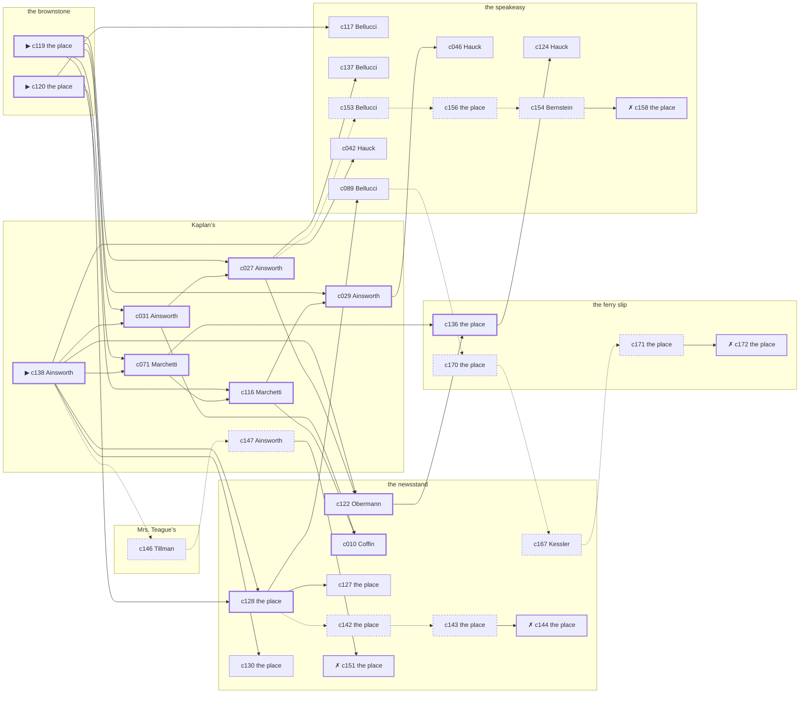

# the Gas House District — case 6

**Seed** 6 · **Difficulty** 2 · **Attempts** 1 · **Detective** Dashiell

**Par** 12 actions · **Slack** 6 · **Budget** 18 · **Findable** 34 (spine 12, corroboration 8, noise 10 + 4 disqualifiers) · **Noise ratio** 41% · **Candidate pool** 173

## 1. The Truth

Hyman Kessler, an insurance adjuster, a witness against the people the victim worked for, killed Gustav Lindemann, a bootlegger with the lease on the top floor, with poison in a drink at the brownstone at 11:00 PM. Kessler was about to be exposed by the victim (exposure). Kessler had been at the speakeasy earlier in the evening, where the weapon lived, and was alone with Lindemann when it happened. Ainsworth hired us.

## 2. Dramatis Personae

| Name | Role | Relationship | Class of secret | Motive | Found at | Killer |
| --- | --- | --- | --- | --- | --- | --- |
| Gustav Lindemann | a bootlegger with the lease on the top floor | the victim | — | — | — | — |
| Lyman Coffin | a policy runner | a customer of the victim’s | fence | debt | the newsstand | — |
| Bernard Bernstein | a young man living on expectations | the victim’s brother-in-law | gambling-debt | — | the speakeasy | — |
| Winthrop Ainsworth (client) | a hack driver | a childhood friend of the victim’s from the same block | fence | — | Kaplan’s | — |
| Hedwig Hauck | a dentist with rooms on the third floor | the victim’s neighbour across the airshaft | forged-identity | — | the speakeasy | — |
| Grafton Stannard | a tailor | the victim’s neighbour across the airshaft | hidden-family | revenge | the speakeasy | — |
| Hyman Kessler | an insurance adjuster | a witness against the people the victim worked for | murder (+ gambling-debt) | exposure | the newsstand | **YES** |
| Rosaria Marchetti | the druggist | fixture (druggist) | — | — | Kaplan’s | — |
| Klara Obermann | the news dealer | fixture (newsstand) | — | — | the newsstand | — |
| Clementine Tillman | the landlady | fixture (landlady) | — | — | Mrs. Teague’s | — |
| Giuseppe Bellucci | the bartender | fixture (bartender) | — | — | the speakeasy | — |

## 3. Places

- **Kaplan’s drugstore with the soda fountain** (public) — watched by druggist (Marchetti); objects: an ice pick, a wall telephone
- **the newsstand on the corner** (public) — watched by newsstand (Obermann); objects: a spike of pawn tickets, the roof-door key — within earshot of the scene
- **the back room at Mrs. Teague’s** (private) — watched by landlady (Tillman); objects: a strapped suitcase, a framed photograph
- **the victim’s rooms in the brownstone** (private) — unwatched; objects: a length of sash cord, a bronze bookend — **THE SCENE**; the victim’s address
- **the ferry slip at the foot of the street** (public) — unwatched; objects: a folded stack of evening papers, a pasted-up timetable — within earshot of the scene
- **the speakeasy under the hat shop** (semi) — watched by bartender (Bellucci); objects: a bottle of chloral drops, a seltzer siphon, a nickel-plated revolver, a silver cigarette case — where the weapon lived

## 4. Anchors

The coroner gives 10:00 PM–11:30 PM, four ticks wide. These are what close it: **ice-delivery** and **last-edition**.

- **the last edition coming off the truck** — at 10:30 PM; at the newsstand. Somebody reliable notes who was there. Only those present know that the late edition led with the bridge contract and not the hold-up. Those present carry it: ink still wet enough to come off on a glove.
- **the ice being brought in** — at 11:00 PM; at the newsstand. Somebody reliable notes who was there. Only those present know that the iceman dropped a block on the step and it went in three. Those present carry it: a wet patch down one side of a coat.

## 5. Timelines

### Lindemann — the victim

| Tick | Time | Truth | Claimed | Companion claimed |
| --- | --- | --- | --- | --- |
| 0 | 6:00 PM | the speakeasy | the speakeasy | — |
| 1 | 6:30 PM | the speakeasy | the speakeasy | — |
| 2 | 7:00 PM | the speakeasy | the speakeasy | — |
| 3 | 7:30 PM | the speakeasy | the speakeasy | — |
| 4 | 8:00 PM | the speakeasy | the speakeasy | — |
| 5 | 8:30 PM | the speakeasy | the speakeasy | — |
| 6 | 9:00 PM | the speakeasy | the speakeasy | — |
| 7 | 9:30 PM | the brownstone | the brownstone | — |
| 8 | 10:00 PM | the brownstone | the brownstone | — |
| 9 | 10:30 PM | the newsstand | the newsstand | — |
| 10 | 11:00 PM | the brownstone ☠ | the brownstone | — |
| 11 | 11:30 PM | — | — | — |

### Coffin

| Tick | Time | Truth | Claimed | Companion claimed |
| --- | --- | --- | --- | --- |
| 0 | 6:00 PM | the newsstand | the newsstand | — |
| 1 | 6:30 PM | the newsstand | the newsstand | — |
| 2 | 7:00 PM | the speakeasy | the speakeasy | — |
| 3 | 7:30 PM | the brownstone | the brownstone | — |
| 4 | 8:00 PM | Mrs. Teague’s | Mrs. Teague’s | — |
| 5 | 8:30 PM | Mrs. Teague’s | Mrs. Teague’s | — |
| 6 | 9:00 PM | the newsstand | the newsstand | — |
| 7 | 9:30 PM | Mrs. Teague’s | Mrs. Teague’s | — |
| 8 | 10:00 PM | the speakeasy | the speakeasy | — |
| 9 | 10:30 PM | the speakeasy | the speakeasy | — |
| 10 | 11:00 PM | the newsstand | **the speakeasy** | — |
| 11 | 11:30 PM | the newsstand | the newsstand | — |

### Bernstein

| Tick | Time | Truth | Claimed | Companion claimed |
| --- | --- | --- | --- | --- |
| 0 | 6:00 PM | Kaplan’s | Kaplan’s | — |
| 1 | 6:30 PM | the speakeasy | the speakeasy | — |
| 2 | 7:00 PM | the speakeasy | the speakeasy | — |
| 3 | 7:30 PM | the speakeasy | the speakeasy | — |
| 4 | 8:00 PM | the speakeasy | the speakeasy | — |
| 5 | 8:30 PM | the speakeasy | the speakeasy | — |
| 6 | 9:00 PM | the brownstone | the brownstone | — |
| 7 | 9:30 PM | the brownstone | the brownstone | — |
| 8 | 10:00 PM | the brownstone | the brownstone | — |
| 9 | 10:30 PM | the speakeasy | the speakeasy | — |
| 10 | 11:00 PM | the newsstand | **Mrs. Teague’s** | — |
| 11 | 11:30 PM | the newsstand | the newsstand | — |

### Ainsworth

| Tick | Time | Truth | Claimed | Companion claimed |
| --- | --- | --- | --- | --- |
| 0 | 6:00 PM | Kaplan’s | Kaplan’s | — |
| 1 | 6:30 PM | Kaplan’s | Kaplan’s | — |
| 2 | 7:00 PM | Kaplan’s | Kaplan’s | — |
| 3 | 7:30 PM | Kaplan’s | Kaplan’s | — |
| 4 | 8:00 PM | Kaplan’s | Kaplan’s | — |
| 5 | 8:30 PM | the speakeasy | **Kaplan’s** | — |
| 6 | 9:00 PM | Kaplan’s | Kaplan’s | — |
| 7 | 9:30 PM | Mrs. Teague’s | Mrs. Teague’s | — |
| 8 | 10:00 PM | Kaplan’s | Kaplan’s | — |
| 9 | 10:30 PM | Mrs. Teague’s | Mrs. Teague’s | — |
| 10 | 11:00 PM | the newsstand | the newsstand | — |
| 11 | 11:30 PM | the newsstand | the newsstand | — |

### Hauck

| Tick | Time | Truth | Claimed | Companion claimed |
| --- | --- | --- | --- | --- |
| 0 | 6:00 PM | the speakeasy | the speakeasy | — |
| 1 | 6:30 PM | Kaplan’s | Kaplan’s | — |
| 2 | 7:00 PM | the ferry slip | the ferry slip | — |
| 3 | 7:30 PM | the ferry slip | the ferry slip | — |
| 4 | 8:00 PM | the ferry slip | the ferry slip | — |
| 5 | 8:30 PM | the speakeasy | the speakeasy | — |
| 6 | 9:00 PM | the speakeasy | the speakeasy | — |
| 7 | 9:30 PM | the speakeasy | the speakeasy | — |
| 8 | 10:00 PM | the speakeasy | the speakeasy | — |
| 9 | 10:30 PM | the speakeasy | the speakeasy | — |
| 10 | 11:00 PM | the newsstand | the newsstand | — |
| 11 | 11:30 PM | the newsstand | the newsstand | — |

### Stannard

| Tick | Time | Truth | Claimed | Companion claimed |
| --- | --- | --- | --- | --- |
| 0 | 6:00 PM | Kaplan’s | Kaplan’s | — |
| 1 | 6:30 PM | Kaplan’s | Kaplan’s | — |
| 2 | 7:00 PM | Kaplan’s | Kaplan’s | — |
| 3 | 7:30 PM | the speakeasy | the speakeasy | — |
| 4 | 8:00 PM | the ferry slip | the ferry slip | — |
| 5 | 8:30 PM | the speakeasy | the speakeasy | — |
| 6 | 9:00 PM | the speakeasy | the speakeasy | — |
| 7 | 9:30 PM | the speakeasy | the speakeasy | — |
| 8 | 10:00 PM | the ferry slip | **the speakeasy** | — |
| 9 | 10:30 PM | the ferry slip | the ferry slip | — |
| 10 | 11:00 PM | the speakeasy | the speakeasy | — |
| 11 | 11:30 PM | the speakeasy | the speakeasy | — |

### Kessler — the killer

| Tick | Time | Truth | Claimed | Companion claimed |
| --- | --- | --- | --- | --- |
| 0 | 6:00 PM | the newsstand | the newsstand | — |
| 1 | 6:30 PM | the newsstand | **the speakeasy** | Hauck |
| 2 | 7:00 PM | the newsstand | **the speakeasy** | Hauck |
| 3 | 7:30 PM | Mrs. Teague’s | Mrs. Teague’s | — |
| 4 | 8:00 PM | the newsstand | the newsstand | — |
| 5 | 8:30 PM | the speakeasy | the speakeasy | — |
| 6 | 9:00 PM | the speakeasy | the speakeasy | — |
| 7 | 9:30 PM | the speakeasy | the speakeasy | — |
| 8 | 10:00 PM | the speakeasy | the speakeasy | — |
| 9 | 10:30 PM | the brownstone | **the speakeasy** | Stannard |
| 10 | 11:00 PM | the brownstone ☠ | **the speakeasy** | Stannard |
| 11 | 11:30 PM | Kaplan’s | Kaplan’s | — |

### Fixtures (never lie, never withhold)

| Tick | Time | Marchetti (the druggist) | Obermann (the news dealer) | Tillman (the landlady) | Bellucci (the bartender) |
| --- | --- | --- | --- | --- | --- |
| 0 | 6:00 PM | Kaplan’s | the newsstand | Mrs. Teague’s | the speakeasy |
| 1 | 6:30 PM | Kaplan’s | the newsstand | Mrs. Teague’s | the speakeasy |
| 2 | 7:00 PM | Kaplan’s | the newsstand | Mrs. Teague’s | the speakeasy |
| 3 | 7:30 PM | Kaplan’s | the newsstand | Mrs. Teague’s | the speakeasy |
| 4 | 8:00 PM | Kaplan’s | the speakeasy | Mrs. Teague’s | the speakeasy |
| 5 | 8:30 PM | Kaplan’s | the newsstand | Mrs. Teague’s | the speakeasy |
| 6 | 9:00 PM | Kaplan’s | the newsstand | Mrs. Teague’s | the speakeasy |
| 7 | 9:30 PM | Kaplan’s | the newsstand | Mrs. Teague’s | the speakeasy |
| 8 | 10:00 PM | Kaplan’s | the newsstand | Mrs. Teague’s | the speakeasy |
| 9 | 10:30 PM | Kaplan’s | the newsstand | Mrs. Teague’s | the speakeasy |
| 10 | 11:00 PM | the speakeasy | the newsstand | Mrs. Teague’s | the speakeasy |
| 11 | 11:30 PM | Kaplan’s | the newsstand | Mrs. Teague’s | the speakeasy |

## 6. Secrets in play

- **Coffin** (fence): Coffin hands a parcel of stolen goods to a man at the newsstand from 11:00 PM.
- **Bernstein** (gambling-debt): Bernstein slips off to the newsstand from 11:00 PM to settle with a bookmaker.
- **Ainsworth** (fence): Ainsworth hands a parcel of stolen goods to a man at the speakeasy from 8:30 PM.
- **Hauck** (forged-identity): Hauck is not the person the papers say. Nothing about the evening is hidden; the lie is all in the paperwork.
- **Stannard** (hidden-family): Stannard goes to the ferry slip from 10:00 PM to see a child nobody is supposed to know about.
- **Kessler** (murder): Kessler is at the brownstone from 10:30 PM to 11:00 PM, alone with Lindemann when it happens at 11:00 PM.
- **Kessler** also (gambling-debt): Kessler slips off to the newsstand from 6:30 PM to 7:00 PM to settle with a bookmaker.

## 7. Clue list — the 34 findable

The opening three, free at the start: c119, c120, c138. Everything else has to be led to. The full candidate pool is in the companion file.

### At Kaplan’s

- **c138** [spine ⟨opening⟩] (client; Ainsworth on why I was hired) → c031, c071, c122, c128, c130, c042, c146
  - Ainsworth hired us, and wants it known that Coffin owed the victim money, and would rather we started there.
  - _establishes: Coffin had a motive (debt)_
- **c031** [spine] (observation; Ainsworth on Hauck) → c027, c010
  - Ainsworth says Hauck was at the newsstand from 11:00 PM to 11:30 PM.
  - _establishes: Hauck at the newsstand, 11:00 PM–11:30 PM_
- **c027** [spine] (observation; Ainsworth on Coffin) → c122, c137, c153
  - Ainsworth says Coffin was at the newsstand from 11:00 PM to 11:30 PM.
  - _establishes: Coffin at the newsstand, 11:00 PM–11:30 PM_
- **c071** [spine] (observation; Marchetti on Stannard) → c116, c136
  - Marchetti says Stannard was at the speakeasy at 11:00 PM.
  - _establishes: Stannard at the speakeasy, 11:00 PM_
- **c116** [spine] (observation; Marchetti on Kessler’s account) → c029, c010
  - Marchetti was at the speakeasy at 11:00 PM and says Kessler was not.
  - _establishes: Kessler not at the speakeasy, 11:00 PM_
- **c029** [spine] (observation; Ainsworth on Bernstein) → c046
  - Ainsworth says Bernstein was at the newsstand from 11:00 PM to 11:30 PM.
  - _establishes: Bernstein at the newsstand, 11:00 PM–11:30 PM_
- **c147** [noise {b4}] (overheard; Ainsworth on Bernstein) → c151
  - Ainsworth on Bernstein: A man nobody knew was waiting for Bernstein at the newsstand and would not give a name.
  - _establishes: context only_

### At the newsstand

- **c122** [spine] (anchor; Obermann on Lindemann that evening) → c136
  - Obermann puts Lindemann at the newsstand when the last edition came up, which was 10:30 PM, and alive enough to argue about the weather.
  - _establishes: the victim alive at 10:30 PM; Lindemann at the newsstand, 10:30 PM_
- **c128** [spine] (anchor; the place itself) → c089, c127, c142
  - The ice being brought in was at 11:00 PM, and Ainsworth was at the newsstand for it.
  - _establishes: Ainsworth at the newsstand, 11:00 PM_
- **c010** [spine] (observation; Coffin on Kessler) → (end)
  - Coffin says Kessler was at the speakeasy at 10:00 PM.
  - _establishes: Kessler at the speakeasy, 10:00 PM; Kessler could reach the weapon_
- **c130** [corroboration] (physical; the place itself) → (end)
  - Coffin still carries it: a wet patch down one side of a coat. The ice being brought in was at 11:00 PM, at the newsstand.
  - _establishes: Coffin at the newsstand, 11:00 PM_
- **c127** [corroboration] (anchor; the place itself) → (end)
  - The ice being brought in was at 11:00 PM, and Bernstein was at the newsstand for it.
  - _establishes: Bernstein at the newsstand, 11:00 PM_
- **c167** [noise {b2}] (overheard; Kessler on Stannard) → c171
  - Kessler on Stannard: Stannard sends money out of every pay envelope and cannot say where it goes.
  - _establishes: context only_
- **c142** [noise {b3}] (physical; the place itself) → c143
  - Wrapping paper and a cut string at the newsstand, and the shop it came from closed two years ago.
  - _establishes: context only_
- **c143** [noise {b3}] (physical; the place itself) → c144
  - A pawn ticket at the newsstand in a name that does not exist, made out at the hour in question.
  - _establishes: context only_
- **c144** [disqualifier {b3}] (overheard; the place itself) → (end)
  - The receiver at the newsstand would rather talk than be held: Coffin was there from 11:00 PM handing over a parcel of somebody else’s silver, which is a charge Coffin will take over this one.
  - _establishes: Coffin’s fence accounted for; Coffin at the newsstand, 11:00 PM_
- **c151** [disqualifier {b4}] (overheard; the place itself) → (end)
  - The bookmaker’s runner is found and will say it: Bernstein was at the newsstand from 11:00 PM paying off eleven hundred dollars, a dollar at a time, and went nowhere near the killing.
  - _establishes: Bernstein’s gambling-debt accounted for; Bernstein at the newsstand, 11:00 PM_

### At Mrs. Teague’s

- **c146** [noise {b4}] (overheard; Tillman on Bernstein) → c147
  - Tillman on Bernstein: Bernstein was asking around for a hundred dollars in a hurry earlier in the week.
  - _establishes: context only_

### At the brownstone

- **c119** [spine ⟨opening⟩] (scene; the place itself) → c031, c027, c071, c116, c029
  - Lindemann was found at the brownstone. A glass is on its side and the spill had not yet reached the edge of the table when it dried. The ice was brought in at 11:00 PM and the iceman’s book has the delivery timed and signed for.
  - _establishes: the victim dead by 11:00 PM; how it was done_
- **c120** [spine ⟨opening⟩] (morgue; the place itself) → c128, c117
  - The coroner puts death between 10:00 PM and 11:30 PM — two hours of nothing useful. Chloral hydrate in the stomach. No wound, no bruising, no sign of a struggle.
  - _establishes: death between 10:00 PM and 11:30 PM; how it was done_

### At the ferry slip

- **c136** [spine] (document; the place itself) → c124
  - Found at the ferry slip: A typed page of dates and sums in Lindemann’s file, headed with Kessler’s name.
  - _establishes: Kessler had a motive (exposure)_
- **c170** [noise {b2}] (physical; the place itself) → c167
  - A board-and-keep receipt at the ferry slip, monthly, eight years of them.
  - _establishes: context only_
- **c171** [noise {b2}] (physical; the place itself) → c172
  - A child’s shoe at the ferry slip, and nobody at the ferry slip has any children.
  - _establishes: context only_
- **c172** [disqualifier {b2}] (overheard; the place itself) → (end)
  - The woman who keeps the child says it straight out: Stannard was at the ferry slip from 10:00 PM, the same as every week, and left with the same face as always.
  - _establishes: Stannard’s hidden-family accounted for; Stannard at the ferry slip, 10:00 PM_

### At the speakeasy

- **c046** [corroboration] (observation; Hauck on Kessler) → (end)
  - Hauck says Kessler was at the speakeasy from 8:30 PM to 10:00 PM.
  - _establishes: Kessler at the speakeasy, 8:30 PM–10:00 PM; Kessler could reach the weapon_
- **c117** [corroboration] (observation; Bellucci on Kessler’s account) → (end)
  - Bellucci was at the speakeasy from 10:30 PM to 11:00 PM and says Kessler was not.
  - _establishes: Kessler not at the speakeasy, 10:30 PM–11:00 PM_
- **c124** [corroboration] (anchor; Hauck on the noise that evening) → (end)
  - Hauck was at the newsstand at 11:00 PM and heard a chair going over from the direction of the brownstone, as the ice was being brought in.
  - _establishes: noise at the brownstone at 11:00 PM; the victim dead by 11:00 PM; how it was done_
- **c137** [corroboration] (overheard; Bellucci on Kessler and Lindemann) → (end)
  - Bellucci says Lindemann told Kessler that the story would run whether Kessler liked it or not.
  - _establishes: Kessler had a motive (exposure)_
- **c089** [corroboration] (observation; Bellucci on Coffin) → c170
  - Bellucci says Coffin was at the speakeasy at 7:00 PM.
  - _establishes: Coffin at the speakeasy, 7:00 PM; Coffin could reach the weapon_
- **c042** [corroboration] (observation; Hauck on Ainsworth) → (end)
  - Hauck says Ainsworth was at the newsstand from 11:00 PM to 11:30 PM.
  - _establishes: Ainsworth at the newsstand, 11:00 PM–11:30 PM_
- **c153** [noise {b1}] (overheard; Bellucci on Ainsworth) → c156
  - Bellucci on Ainsworth: Ainsworth was carrying a parcel into the speakeasy and came out without it.
  - _establishes: context only_
- **c156** [noise {b1}] (physical; the place itself) → c154
  - Wrapping paper and a cut string at the speakeasy, and the shop it came from closed two years ago.
  - _establishes: context only_
- **c154** [noise {b1}] (overheard; Bernstein on Ainsworth) → c158
  - Bernstein on Ainsworth: There is a man who meets people at the speakeasy and nobody will say his name out loud.
  - _establishes: context only_
- **c158** [disqualifier {b1}] (overheard; the place itself) → (end)
  - The receiver at the speakeasy would rather talk than be held: Ainsworth was there from 8:30 PM handing over a parcel of somebody else’s silver, which is a charge Ainsworth will take over this one.
  - _establishes: Ainsworth’s fence accounted for; Ainsworth at the speakeasy, 8:30 PM_

## 8. Clue graph

## 9. Deduction path

Par is **12 actions** and the budget is par plus 6: **18**. Every id below is a spine clue; the inference is the sheet’s, not the clue’s.

**Time of death.** The coroner gives four ticks. The anchors close it to 11:00 PM: one puts Lindemann alive at 10:30 PM, the other times the scene at 11:00 PM. _(c120, c122, c119; + 1 corroborating)_

**Clearing the innocent.**

- Coffin was not at the brownstone at 11:00 PM. _(c027; + 2 corroborating)_
- Bernstein was not at the brownstone at 11:00 PM. _(c029; + 2 corroborating)_
- Ainsworth was not at the brownstone at 11:00 PM. _(c128; + 1 corroborating)_
- Hauck was not at the brownstone at 11:00 PM. _(c031)_
- Stannard was not at the brownstone at 11:00 PM. _(c071)_

**Naming the killer.** Kessler claims the speakeasy at 11:00 PM. Two independent sources put that out of the question. _(c116; + 1 corroborating)_

**The weapon.** Kessler was at the speakeasy before 11:00 PM, where a bottle of chloral drops was kept. _(c010; + 1 corroborating)_

**Method.** Poison in a drink, on two physical sources. _(c119, c120; + 1 corroborating)_

**Motive.** exposure, on two independent sources. _(c136; + 1 corroborating)_

## 10. Red herrings

**Innocents who lie about the murder tick:**

- Coffin claims the speakeasy at 11:00 PM and was really at the newsstand. Reason: Coffin hands a parcel of stolen goods to a man at the newsstand from 11:00 PM.
- Bernstein claims Mrs. Teague’s at 11:00 PM and was really at the newsstand. Reason: Bernstein slips off to the newsstand from 11:00 PM to settle with a bookmaker.

**Innocents with a motive:**

- Coffin — debt: owed the victim money.
- Stannard — revenge: blamed the victim for a ruin.

**Noise branches, and what knocks each one down:**

- **b1** (Ainsworth, fence): c153 → c156 → c154 → **c158** — The receiver at the speakeasy would rather talk than be held: Ainsworth was there from 8:30 PM handing over a parcel of somebody else’s silver, which is a charge Ainsworth will take over this one.
- **b2** (Stannard, hidden-family): c170 → c167 → c171 → **c172** — The woman who keeps the child says it straight out: Stannard was at the ferry slip from 10:00 PM, the same as every week, and left with the same face as always.
- **b3** (Coffin, fence): c142 → c143 → **c144** — The receiver at the newsstand would rather talk than be held: Coffin was there from 11:00 PM handing over a parcel of somebody else’s silver, which is a charge Coffin will take over this one.
- **b4** (Bernstein, gambling-debt): c146 → c147 → **c151** — The bookmaker’s runner is found and will say it: Bernstein was at the newsstand from 11:00 PM paying off eleven hundred dollars, a dollar at a time, and went nowhere near the killing.

