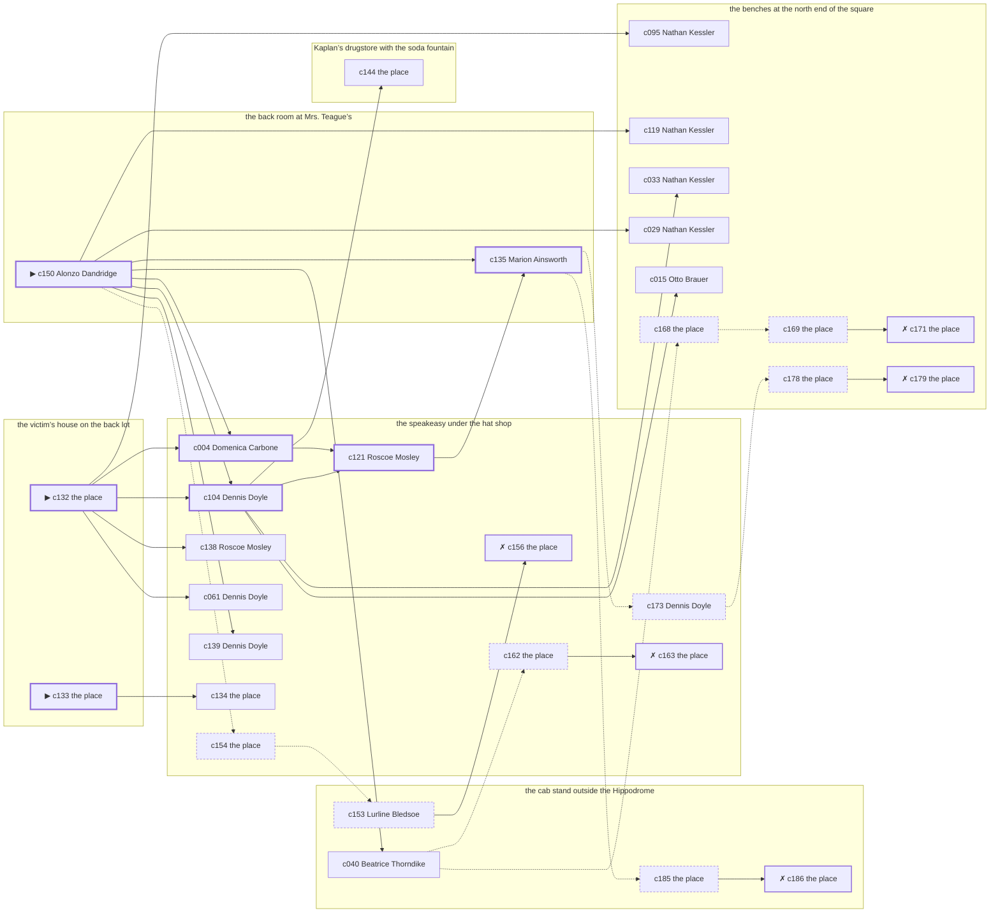

# the Bowery — case 7

**Seed** 7 · **Difficulty** 2 · **Attempts** 1 · **Detective** Humphrey

**Par** 6 actions · **Budget** 20 · **Slack** 14 · **Findable** 31 (spine 7, corroboration 11, noise 8 + 5 disqualifiers) · **Noise ratio** 42% · **Candidate pool** 187

## 1. The Truth

Otto Brauer, a stagehand at the Selwyn, the victim’s neighbour across the airshaft, killed Salvatore Vitale, a retired dry-goods wholesaler, with a gunshot at the victim’s house on the back lot at 9:30 PM. Otto Brauer blamed the victim for a ruin (revenge). Otto Brauer had been at the speakeasy under the hat shop earlier in the evening, where the weapon lived, and was alone with Salvatore Vitale when it happened. Alonzo Dandridge hired us.

## 2. Dramatis Personae

| Name | Role | Relationship | Class of secret | Motive | Found at | Killer |
| --- | --- | --- | --- | --- | --- | --- |
| Salvatore Vitale | a retired dry-goods wholesaler | the victim | — | — | — | — |
| Domenica Carbone | a piano teacher | the victim’s tenant | secret-drinking | — | the speakeasy under the hat shop | — |
| Alonzo Dandridge (client) | a doorman at a club with no sign on it | in the victim’s debt | gambling-debt | — | the back room at Mrs. Teague’s | — |
| Otto Brauer | a stagehand at the Selwyn | the victim’s neighbour across the airshaft | murder | revenge | the benches at the north end of the square | **YES** |
| Nathan Kessler | the victim’s nephew, at loose ends | the victim’s cousin | affair | inheritance | the benches at the north end of the square | — |
| Beatrice Thorndike | a seamstress | the victim’s tenant | affair | — | the cab stand outside the Hippodrome | — |
| Roscoe Mosley | a ward heeler | the victim’s rival in trade | fence | property | the speakeasy under the hat shop | — |
| Marion Ainsworth | the landlady | fixture (landlady) | — | — | the back room at Mrs. Teague’s | — |
| Dennis Doyle | the bartender | fixture (bartender) | — | — | the speakeasy under the hat shop | — |
| Bernice Colquitt | the druggist | fixture (druggist) | — | — | Kaplan’s drugstore with the soda fountain | — |
| Lurline Bledsoe | the hackman on the stand | fixture (cabbie) | — | — | the cab stand outside the Hippodrome | — |

## 3. Places

- **the back room at Mrs. Teague’s** (private) — watched by landlady (Marion Ainsworth); objects: a framed photograph, a bronze bookend, a strapped suitcase
- **the speakeasy under the hat shop** (semi) — watched by bartender (Dennis Doyle); objects: a nickel-plated revolver, a seltzer siphon, a silver cigarette case, a bottle of chloral drops — where the weapon lived; within earshot of the scene
- **the victim’s house on the back lot** (private) — unwatched; objects: a length of sash cord, a mechanic’s toolbox, the roof-door key — **THE SCENE**; the victim’s address
- **Kaplan’s drugstore with the soda fountain** (public) — watched by druggist (Bernice Colquitt); objects: a wall telephone, an ice pick
- **the cab stand outside the Hippodrome** (public) — watched by cabbie (Lurline Bledsoe); objects: a pasted-up timetable, a folded stack of evening papers
- **the benches at the north end of the square** (public) — unwatched; objects: a brass umbrella stand — within earshot of the scene

## 4. Anchors

The coroner gives 9:00 PM–10:30 PM, four ticks wide. These are what close it: **bar-radio** and **piano-lesson**.

- **the piano lesson on the floor above** — at 9:00 PM; at the back room at Mrs. Teague’s. You can time things by it: the same four bars, over and over, and then nothing. Only those present know that the child never did get the passage right.
- **the fight card on the bar radio** — at 9:30 PM; at the speakeasy under the hat shop. Only those present know that the challenger went down in the fourth and the crowd booed it. You can time things by it: the set was turned up loud enough to carry into the street.
- **the drunk singing under the window** — at 8:30 PM; at the back room at Mrs. Teague’s. You can time things by it: the same two verses until somebody threw a shoe. Only those present know that it was a shoe, and it was thrown by a woman, and it did not land.

## 5. Timelines

### Salvatore Vitale — the victim

| Tick | Time | Truth | Claimed | Companion claimed |
| --- | --- | --- | --- | --- |
| 0 | 6:00 PM | Kaplan’s drugstore with the soda fountain | Kaplan’s drugstore with the soda fountain | — |
| 1 | 6:30 PM | Kaplan’s drugstore with the soda fountain | Kaplan’s drugstore with the soda fountain | — |
| 2 | 7:00 PM | the benches at the north end of the square | the benches at the north end of the square | — |
| 3 | 7:30 PM | the benches at the north end of the square | the benches at the north end of the square | — |
| 4 | 8:00 PM | the benches at the north end of the square | the benches at the north end of the square | — |
| 5 | 8:30 PM | the benches at the north end of the square | the benches at the north end of the square | — |
| 6 | 9:00 PM | the back room at Mrs. Teague’s | the back room at Mrs. Teague’s | — |
| 7 | 9:30 PM | the victim’s house on the back lot ☠ | the victim’s house on the back lot | — |
| 8 | 10:00 PM | — | — | — |
| 9 | 10:30 PM | — | — | — |
| 10 | 11:00 PM | — | — | — |
| 11 | 11:30 PM | — | — | — |

### Domenica Carbone

| Tick | Time | Truth | Claimed | Companion claimed |
| --- | --- | --- | --- | --- |
| 0 | 6:00 PM | the back room at Mrs. Teague’s | the back room at Mrs. Teague’s | — |
| 1 | 6:30 PM | Kaplan’s drugstore with the soda fountain | Kaplan’s drugstore with the soda fountain | — |
| 2 | 7:00 PM | Kaplan’s drugstore with the soda fountain | Kaplan’s drugstore with the soda fountain | — |
| 3 | 7:30 PM | Kaplan’s drugstore with the soda fountain | Kaplan’s drugstore with the soda fountain | — |
| 4 | 8:00 PM | the speakeasy under the hat shop | the speakeasy under the hat shop | — |
| 5 | 8:30 PM | Kaplan’s drugstore with the soda fountain | Kaplan’s drugstore with the soda fountain | — |
| 6 | 9:00 PM | Kaplan’s drugstore with the soda fountain | Kaplan’s drugstore with the soda fountain | — |
| 7 | 9:30 PM | the speakeasy under the hat shop | **the back room at Mrs. Teague’s** | Beatrice Thorndike |
| 8 | 10:00 PM | the speakeasy under the hat shop | **the back room at Mrs. Teague’s** | Beatrice Thorndike |
| 9 | 10:30 PM | the speakeasy under the hat shop | the speakeasy under the hat shop | — |
| 10 | 11:00 PM | the speakeasy under the hat shop | the speakeasy under the hat shop | — |
| 11 | 11:30 PM | the speakeasy under the hat shop | the speakeasy under the hat shop | — |

### Alonzo Dandridge

| Tick | Time | Truth | Claimed | Companion claimed |
| --- | --- | --- | --- | --- |
| 0 | 6:00 PM | the benches at the north end of the square | the benches at the north end of the square | — |
| 1 | 6:30 PM | the benches at the north end of the square | the benches at the north end of the square | — |
| 2 | 7:00 PM | Kaplan’s drugstore with the soda fountain | Kaplan’s drugstore with the soda fountain | — |
| 3 | 7:30 PM | the speakeasy under the hat shop | the speakeasy under the hat shop | — |
| 4 | 8:00 PM | Kaplan’s drugstore with the soda fountain | Kaplan’s drugstore with the soda fountain | — |
| 5 | 8:30 PM | Kaplan’s drugstore with the soda fountain | Kaplan’s drugstore with the soda fountain | — |
| 6 | 9:00 PM | the speakeasy under the hat shop | **the back room at Mrs. Teague’s** | Domenica Carbone |
| 7 | 9:30 PM | the speakeasy under the hat shop | **the back room at Mrs. Teague’s** | Domenica Carbone |
| 8 | 10:00 PM | the back room at Mrs. Teague’s | the back room at Mrs. Teague’s | — |
| 9 | 10:30 PM | the back room at Mrs. Teague’s | the back room at Mrs. Teague’s | — |
| 10 | 11:00 PM | the back room at Mrs. Teague’s | the back room at Mrs. Teague’s | — |
| 11 | 11:30 PM | the back room at Mrs. Teague’s | the back room at Mrs. Teague’s | — |

### Otto Brauer — the killer

| Tick | Time | Truth | Claimed | Companion claimed |
| --- | --- | --- | --- | --- |
| 0 | 6:00 PM | the benches at the north end of the square | the benches at the north end of the square | — |
| 1 | 6:30 PM | the benches at the north end of the square | the benches at the north end of the square | — |
| 2 | 7:00 PM | the benches at the north end of the square | the benches at the north end of the square | — |
| 3 | 7:30 PM | the benches at the north end of the square | the benches at the north end of the square | — |
| 4 | 8:00 PM | the speakeasy under the hat shop | the speakeasy under the hat shop | — |
| 5 | 8:30 PM | the victim’s house on the back lot | **the speakeasy under the hat shop** | Domenica Carbone |
| 6 | 9:00 PM | the victim’s house on the back lot | **the speakeasy under the hat shop** | Domenica Carbone |
| 7 | 9:30 PM | the victim’s house on the back lot ☠ | **the speakeasy under the hat shop** | Domenica Carbone |
| 8 | 10:00 PM | the benches at the north end of the square | the benches at the north end of the square | — |
| 9 | 10:30 PM | the benches at the north end of the square | the benches at the north end of the square | — |
| 10 | 11:00 PM | the benches at the north end of the square | the benches at the north end of the square | — |
| 11 | 11:30 PM | the cab stand outside the Hippodrome | the cab stand outside the Hippodrome | — |

### Nathan Kessler

| Tick | Time | Truth | Claimed | Companion claimed |
| --- | --- | --- | --- | --- |
| 0 | 6:00 PM | the benches at the north end of the square | the benches at the north end of the square | — |
| 1 | 6:30 PM | the benches at the north end of the square | the benches at the north end of the square | — |
| 2 | 7:00 PM | the benches at the north end of the square | the benches at the north end of the square | — |
| 3 | 7:30 PM | the benches at the north end of the square | the benches at the north end of the square | — |
| 4 | 8:00 PM | the speakeasy under the hat shop | the speakeasy under the hat shop | — |
| 5 | 8:30 PM | the speakeasy under the hat shop | the speakeasy under the hat shop | — |
| 6 | 9:00 PM | Kaplan’s drugstore with the soda fountain | Kaplan’s drugstore with the soda fountain | — |
| 7 | 9:30 PM | the speakeasy under the hat shop | the speakeasy under the hat shop | — |
| 8 | 10:00 PM | the benches at the north end of the square | **the cab stand outside the Hippodrome** | Roscoe Mosley |
| 9 | 10:30 PM | the benches at the north end of the square | **the cab stand outside the Hippodrome** | Roscoe Mosley |
| 10 | 11:00 PM | the benches at the north end of the square | the benches at the north end of the square | — |
| 11 | 11:30 PM | the benches at the north end of the square | the benches at the north end of the square | — |

### Beatrice Thorndike

| Tick | Time | Truth | Claimed | Companion claimed |
| --- | --- | --- | --- | --- |
| 0 | 6:00 PM | the cab stand outside the Hippodrome | the cab stand outside the Hippodrome | — |
| 1 | 6:30 PM | the cab stand outside the Hippodrome | the cab stand outside the Hippodrome | — |
| 2 | 7:00 PM | the cab stand outside the Hippodrome | the cab stand outside the Hippodrome | — |
| 3 | 7:30 PM | the cab stand outside the Hippodrome | the cab stand outside the Hippodrome | — |
| 4 | 8:00 PM | the cab stand outside the Hippodrome | the cab stand outside the Hippodrome | — |
| 5 | 8:30 PM | the cab stand outside the Hippodrome | the cab stand outside the Hippodrome | — |
| 6 | 9:00 PM | Kaplan’s drugstore with the soda fountain | Kaplan’s drugstore with the soda fountain | — |
| 7 | 9:30 PM | the speakeasy under the hat shop | the speakeasy under the hat shop | — |
| 8 | 10:00 PM | the benches at the north end of the square | **the cab stand outside the Hippodrome** | Roscoe Mosley |
| 9 | 10:30 PM | the benches at the north end of the square | **the cab stand outside the Hippodrome** | Roscoe Mosley |
| 10 | 11:00 PM | the benches at the north end of the square | the benches at the north end of the square | — |
| 11 | 11:30 PM | the speakeasy under the hat shop | the speakeasy under the hat shop | — |

### Roscoe Mosley

| Tick | Time | Truth | Claimed | Companion claimed |
| --- | --- | --- | --- | --- |
| 0 | 6:00 PM | the speakeasy under the hat shop | the speakeasy under the hat shop | — |
| 1 | 6:30 PM | the speakeasy under the hat shop | the speakeasy under the hat shop | — |
| 2 | 7:00 PM | the speakeasy under the hat shop | the speakeasy under the hat shop | — |
| 3 | 7:30 PM | the cab stand outside the Hippodrome | the cab stand outside the Hippodrome | — |
| 4 | 8:00 PM | the cab stand outside the Hippodrome | the cab stand outside the Hippodrome | — |
| 5 | 8:30 PM | the cab stand outside the Hippodrome | **the back room at Mrs. Teague’s** | Alonzo Dandridge |
| 6 | 9:00 PM | the cab stand outside the Hippodrome | **the back room at Mrs. Teague’s** | Alonzo Dandridge |
| 7 | 9:30 PM | the speakeasy under the hat shop | the speakeasy under the hat shop | — |
| 8 | 10:00 PM | the speakeasy under the hat shop | the speakeasy under the hat shop | — |
| 9 | 10:30 PM | the cab stand outside the Hippodrome | the cab stand outside the Hippodrome | — |
| 10 | 11:00 PM | the speakeasy under the hat shop | the speakeasy under the hat shop | — |
| 11 | 11:30 PM | the speakeasy under the hat shop | the speakeasy under the hat shop | — |

### Fixtures (never lie, never withhold)

| Tick | Time | Marion Ainsworth (the landlady) | Dennis Doyle (the bartender) | Bernice Colquitt (the druggist) | Lurline Bledsoe (the hackman on the stand) |
| --- | --- | --- | --- | --- | --- |
| 0 | 6:00 PM | the back room at Mrs. Teague’s | the speakeasy under the hat shop | Kaplan’s drugstore with the soda fountain | the cab stand outside the Hippodrome |
| 1 | 6:30 PM | the back room at Mrs. Teague’s | the speakeasy under the hat shop | Kaplan’s drugstore with the soda fountain | the cab stand outside the Hippodrome |
| 2 | 7:00 PM | the cab stand outside the Hippodrome | the speakeasy under the hat shop | Kaplan’s drugstore with the soda fountain | the cab stand outside the Hippodrome |
| 3 | 7:30 PM | the back room at Mrs. Teague’s | the speakeasy under the hat shop | Kaplan’s drugstore with the soda fountain | the cab stand outside the Hippodrome |
| 4 | 8:00 PM | the back room at Mrs. Teague’s | the speakeasy under the hat shop | Kaplan’s drugstore with the soda fountain | the cab stand outside the Hippodrome |
| 5 | 8:30 PM | the back room at Mrs. Teague’s | the speakeasy under the hat shop | Kaplan’s drugstore with the soda fountain | the cab stand outside the Hippodrome |
| 6 | 9:00 PM | the back room at Mrs. Teague’s | the speakeasy under the hat shop | Kaplan’s drugstore with the soda fountain | the cab stand outside the Hippodrome |
| 7 | 9:30 PM | the back room at Mrs. Teague’s | the speakeasy under the hat shop | Kaplan’s drugstore with the soda fountain | the cab stand outside the Hippodrome |
| 8 | 10:00 PM | the back room at Mrs. Teague’s | the speakeasy under the hat shop | Kaplan’s drugstore with the soda fountain | the cab stand outside the Hippodrome |
| 9 | 10:30 PM | the back room at Mrs. Teague’s | the speakeasy under the hat shop | Kaplan’s drugstore with the soda fountain | the cab stand outside the Hippodrome |
| 10 | 11:00 PM | the back room at Mrs. Teague’s | the cab stand outside the Hippodrome | Kaplan’s drugstore with the soda fountain | the cab stand outside the Hippodrome |
| 11 | 11:30 PM | the back room at Mrs. Teague’s | the speakeasy under the hat shop | Kaplan’s drugstore with the soda fountain | the cab stand outside the Hippodrome |

## 6. Secrets in play

- **Domenica Carbone** (secret-drinking): Domenica Carbone drinks alone at the speakeasy under the hat shop from 9:30 PM to 10:00 PM and will claim to have been anywhere else.
- **Alonzo Dandridge** (gambling-debt): Alonzo Dandridge slips off to the speakeasy under the hat shop from 9:00 PM to 9:30 PM to settle with a bookmaker.
- **Otto Brauer** (murder): Otto Brauer is at the victim’s house on the back lot from 8:30 PM to 9:30 PM, alone with Salvatore Vitale when it happens at 9:30 PM.
- **Nathan Kessler** (affair): Nathan Kessler is with Beatrice Thorndike at the benches at the north end of the square from 10:00 PM to 10:30 PM, and both will say they were somewhere else.
- **Beatrice Thorndike** (affair): Beatrice Thorndike is with Nathan Kessler at the benches at the north end of the square from 10:00 PM to 10:30 PM, and both will say they were somewhere else.
- **Roscoe Mosley** (fence): Roscoe Mosley hands a parcel of stolen goods to a man at the cab stand outside the Hippodrome from 8:30 PM to 9:00 PM.

## 7. Clue list — the 30 findable

The opening three, free at the start: c132, c133, c150. Everything else has to be led to. The full candidate pool is in the companion file.

### At the back room at Mrs. Teague’s

- **c150** [spine ⟨opening⟩] (client; Alonzo Dandridge on why I was hired) → c104, c004, c135, c040, c119, c139, c029, c154
  - Alonzo Dandridge hired us. Alonzo Dandridge wants it known that Otto Brauer blamed the victim for a ruin, and would rather we started there.
  - _establishes: Otto Brauer had a motive (revenge)_
- **c135** [spine] (anchor; Marion Ainsworth on Salvatore Vitale that evening) → c173, c185
  - Marion Ainsworth puts Salvatore Vitale at the back room at Mrs. Teague’s while the lesson was still going on overhead, which was 9:00 PM, and alive enough to argue about the weather.
  - _establishes: the victim alive at 9:00 PM; Salvatore Vitale at the back room at Mrs. Teague’s, 9:00 PM_

### At the speakeasy under the hat shop

- **c104** [spine] (observation; Dennis Doyle on who was there at 9:30 PM) → c121, c144, c033, c015
  - Dennis Doyle runs through it: at 9:30 PM there were Domenica Carbone, Alonzo Dandridge, Nathan Kessler, Beatrice Thorndike, Roscoe Mosley at the speakeasy under the hat shop, and nobody else worth naming.
  - _establishes: Domenica Carbone at the speakeasy under the hat shop, 9:30 PM; Alonzo Dandridge at the speakeasy under the hat shop, 9:30 PM; Nathan Kessler at the speakeasy under the hat shop, 9:30 PM; Beatrice Thorndike at the speakeasy under the hat shop, 9:30 PM; Roscoe Mosley at the speakeasy under the hat shop, 9:30 PM_
- **c004** [spine] (observation; Domenica Carbone on Otto Brauer) → c121
  - Domenica Carbone says Otto Brauer was at the speakeasy under the hat shop at 8:00 PM.
  - _establishes: Otto Brauer at the speakeasy under the hat shop, 8:00 PM; Otto Brauer could reach the weapon_
- **c121** [spine] (observation; Roscoe Mosley on Otto Brauer’s account) → c135
  - Roscoe Mosley was at the speakeasy under the hat shop at 9:30 PM and says Otto Brauer was not.
  - _establishes: Otto Brauer not at the speakeasy under the hat shop, 9:30 PM_
- **c138** [corroboration] (anchor; Roscoe Mosley on the noise that evening) → (end)
  - Roscoe Mosley was at the speakeasy under the hat shop at 9:30 PM and heard a shot from the direction of the victim’s house on the back lot, while the fight was on the radio.
  - _establishes: noise at the victim’s house on the back lot at 9:30 PM; the victim dead by 9:30 PM; how it was done_
- **c061** [corroboration] (observation; Dennis Doyle on Otto Brauer) → (end)
  - Dennis Doyle says Otto Brauer was at the speakeasy under the hat shop at 8:00 PM.
  - _establishes: Otto Brauer at the speakeasy under the hat shop, 8:00 PM; Otto Brauer could reach the weapon_
- **c139** [corroboration] (anchor; Dennis Doyle on the noise that evening) → (end)
  - Dennis Doyle was at the speakeasy under the hat shop at 9:30 PM and heard a shot from the direction of the victim’s house on the back lot, while the fight was on the radio.
  - _establishes: noise at the victim’s house on the back lot at 9:30 PM; the victim dead by 9:30 PM; how it was done_
- **c134** [corroboration] (physical; the place itself) → (end)
  - A nickel-plated revolver is gone from the speakeasy under the hat shop. The drawer it was kept in is open and the oiled cloth is still in it.
  - _establishes: something gone from the speakeasy under the hat shop; how it was done_
- **c154** [noise {b1}] (physical; the place itself) → c153
  - A bottle at the speakeasy under the hat shop pushed behind the pipes, the seal broken and the level down.
  - _establishes: context only_
- **c156** [disqualifier {b1}] (overheard; the place itself) → (end)
  - The man behind the counter at the speakeasy under the hat shop knows exactly: Domenica Carbone was on the same stool from 9:30 PM to 10:00 PM and was in no condition to walk anywhere, let alone do this.
  - _establishes: Domenica Carbone’s secret-drinking accounted for; Domenica Carbone at the speakeasy under the hat shop, 9:30 PM–10:00 PM_
- **c173** [noise {b3}] (overheard; Dennis Doyle on Beatrice Thorndike) → c178
  - Dennis Doyle on Beatrice Thorndike: Beatrice Thorndike was seen going into the benches at the north end of the square alone and came out with somebody half an hour later.
  - _establishes: context only_
- **c162** [noise {b5}] (physical; the place itself) → c163
  - A book of markers at the speakeasy under the hat shop with Alonzo Dandridge’s initials against four of them.
  - _establishes: context only_
- **c163** [disqualifier {b5}] (overheard; the place itself) → (end)
  - The bookmaker’s runner is found and will say it: Alonzo Dandridge was at the speakeasy under the hat shop from 9:00 PM to 9:30 PM paying off eleven hundred dollars, a dollar at a time, and went nowhere near the killing.
  - _establishes: Alonzo Dandridge’s gambling-debt accounted for; Alonzo Dandridge at the speakeasy under the hat shop, 9:00 PM–9:30 PM_

### At the victim’s house on the back lot

- **c132** [spine ⟨opening⟩] (scene; the place itself) → c104, c004, c095, c138, c061
  - Salvatore Vitale was found at the victim’s house on the back lot. The cigarette he had going burned itself out on the sill where it fell. The fight card on the bar radio came at 9:30 PM, and the set was loud enough to cover it, and it was only loud for that half hour. That puts the killing in that half hour and no later.
  - _establishes: the victim dead by 9:30 PM; how it was done_
- **c133** [spine ⟨opening⟩] (morgue; the place itself) → c134
  - The coroner puts death between 9:00 PM and 10:30 PM — two hours of nothing useful. One bullet below the sternum. Powder burns on the shirt front: fired close.
  - _establishes: death between 9:00 PM and 10:30 PM; how it was done_

### At Kaplan’s drugstore with the soda fountain

- **c144** [corroboration] (document; the place itself) → (end)
  - Found at Kaplan’s drugstore with the soda fountain: A clipping about the failure of Otto Brauer’s business, with Salvatore Vitale’s name underlined twice in pencil.
  - _establishes: Otto Brauer had a motive (revenge)_

### At the cab stand outside the Hippodrome

- **c040** [corroboration] (observation; Beatrice Thorndike on Nathan Kessler) → c168, c162
  - Beatrice Thorndike says Nathan Kessler was at the speakeasy under the hat shop at 9:30 PM.
  - _establishes: Nathan Kessler at the speakeasy under the hat shop, 9:30 PM_
- **c153** [noise {b1}] (overheard; Lurline Bledsoe on Domenica Carbone) → c156
  - Lurline Bledsoe on Domenica Carbone: Somebody at the speakeasy under the hat shop says Domenica Carbone is in more often than Domenica Carbone lets on.
  - _establishes: context only_
- **c185** [noise {b4}] (physical; the place itself) → c186
  - A pawn ticket at the cab stand outside the Hippodrome in a name that does not exist, made out at the hour in question.
  - _establishes: context only_
- **c186** [disqualifier {b4}] (overheard; the place itself) → (end)
  - The receiver at the cab stand outside the Hippodrome would rather talk than be held: Roscoe Mosley was there from 8:30 PM to 9:00 PM handing over a parcel of somebody else’s silver, which is a charge Roscoe Mosley will take over this one.
  - _establishes: Roscoe Mosley’s fence accounted for; Roscoe Mosley at the cab stand outside the Hippodrome, 8:30 PM–9:00 PM_

### At the benches at the north end of the square

- **c095** [corroboration] (observation; Nathan Kessler on who was there at 9:30 PM) → (end)
  - Nathan Kessler runs through it: at 9:30 PM there were Domenica Carbone, Alonzo Dandridge, Beatrice Thorndike, Roscoe Mosley at the speakeasy under the hat shop, and nobody else worth naming.
  - _establishes: Domenica Carbone at the speakeasy under the hat shop, 9:30 PM; Alonzo Dandridge at the speakeasy under the hat shop, 9:30 PM; Beatrice Thorndike at the speakeasy under the hat shop, 9:30 PM; Roscoe Mosley at the speakeasy under the hat shop, 9:30 PM_
- **c119** [corroboration] (observation; Nathan Kessler on Otto Brauer’s account) → (end)
  - Nathan Kessler was at the speakeasy under the hat shop at 9:30 PM and says Otto Brauer was not.
  - _establishes: Otto Brauer not at the speakeasy under the hat shop, 9:30 PM_
- **c033** [corroboration] (observation; Nathan Kessler on Roscoe Mosley) → (end)
  - Nathan Kessler says Roscoe Mosley was at the speakeasy under the hat shop at 9:30 PM.
  - _establishes: Roscoe Mosley at the speakeasy under the hat shop, 9:30 PM_
- **c029** [corroboration] (observation; Nathan Kessler on Otto Brauer) → (end)
  - Nathan Kessler says Otto Brauer was at the speakeasy under the hat shop at 8:00 PM.
  - _establishes: Otto Brauer at the speakeasy under the hat shop, 8:00 PM; Otto Brauer could reach the weapon_
- **c015** [corroboration] (observation; Otto Brauer on Domenica Carbone) → (end)
  - Otto Brauer says Domenica Carbone was at the speakeasy under the hat shop at 8:00 PM.
  - _establishes: Domenica Carbone at the speakeasy under the hat shop, 8:00 PM; Domenica Carbone could reach the weapon_
- **c168** [noise {b2}] (physical; the place itself) → c169
  - Two glasses at the benches at the north end of the square, one of them with a lip print on it, and only one of them paid for.
  - _establishes: context only_
- **c169** [noise {b2}] (physical; the place itself) → c171
  - A note in a woman’s hand at the benches at the north end of the square, no name on it, naming a time and nothing else.
  - _establishes: context only_
- **c171** [disqualifier {b2}] (overheard; the place itself) → (end)
  - Beatrice Thorndike breaks and says it plainly: Beatrice Thorndike was with Nathan Kessler at the benches at the north end of the square for the whole of it, from 10:00 PM to 10:30 PM, and it is a marriage they are hiding, not a killing.
  - _establishes: Nathan Kessler’s affair accounted for; Nathan Kessler at the benches at the north end of the square, 10:00 PM–10:30 PM_
- **c178** [noise {b3}] (physical; the place itself) → c179
  - A man’s hat at the benches at the north end of the square that fits nobody who admits to being there.
  - _establishes: context only_
- **c179** [disqualifier {b3}] (overheard; the place itself) → (end)
  - Nathan Kessler breaks and says it plainly: Nathan Kessler was with Beatrice Thorndike at the benches at the north end of the square for the whole of it, from 10:00 PM to 10:30 PM, and it is a marriage they are hiding, not a killing.
  - _establishes: Beatrice Thorndike’s affair accounted for; Beatrice Thorndike at the benches at the north end of the square, 10:00 PM–10:30 PM_

## 8. Clue graph

## 9. Deduction path

Par is **6 actions** against a budget of 20: 14 spare. Every id below is a spine clue.

**Time of death.** The coroner gives four ticks. The anchors close it to 9:30 PM: one puts Salvatore Vitale alive at 9:00 PM, the other times the scene at 9:30 PM. _(c133, c135, c132; + 2 corroborating)_

**Clearing the innocent.**

- Domenica Carbone was not at the victim’s house on the back lot at 9:30 PM, on two independent sources. _(c104; + 2 corroborating)_
- Alonzo Dandridge was not at the victim’s house on the back lot at 9:30 PM, on two independent sources. _(c104; + 2 corroborating)_
- Nathan Kessler was not at the victim’s house on the back lot at 9:30 PM, on two independent sources. _(c104; + 1 corroborating)_
- Beatrice Thorndike was not at the victim’s house on the back lot at 9:30 PM, on two independent sources. _(c104; + 1 corroborating)_
- Roscoe Mosley was not at the victim’s house on the back lot at 9:30 PM, on two independent sources. _(c104; + 2 corroborating)_

**Naming the killer.** Otto Brauer claims the speakeasy under the hat shop at 9:30 PM. Two independent sources put that out of the question. _(c121; + 1 corroborating)_

**The weapon.** Otto Brauer was at the speakeasy under the hat shop before 9:30 PM, where a nickel-plated revolver was kept. _(c004; + 2 corroborating)_

**Method.** A gunshot, on two physical sources. _(c132, c133; + 3 corroborating)_

**Motive.** revenge, on two independent sources. _(c150; + 1 corroborating)_

## 10. Red herrings

**Innocents who lie about the murder tick:**

- Domenica Carbone claims the back room at Mrs. Teague’s at 9:30 PM and was really at the speakeasy under the hat shop. Reason: Domenica Carbone drinks alone at the speakeasy under the hat shop from 9:30 PM to 10:00 PM and will claim to have been anywhere else.
- Alonzo Dandridge claims the back room at Mrs. Teague’s at 9:30 PM and was really at the speakeasy under the hat shop. Reason: Alonzo Dandridge slips off to the speakeasy under the hat shop from 9:00 PM to 9:30 PM to settle with a bookmaker.

**Innocents with a motive:**

- Nathan Kessler — inheritance: stands to inherit.
- Roscoe Mosley — property: wanted the victim out of a lease.

**Noise branches, and what knocks each one down:**

- **b1** (Domenica Carbone, secret-drinking): c154 → c153 → **c156** — The man behind the counter at the speakeasy under the hat shop knows exactly: Domenica Carbone was on the same stool from 9:30 PM to 10:00 PM and was in no condition to walk anywhere, let alone do this.
- **b2** (Nathan Kessler, affair): c168 → c169 → **c171** — Beatrice Thorndike breaks and says it plainly: Beatrice Thorndike was with Nathan Kessler at the benches at the north end of the square for the whole of it, from 10:00 PM to 10:30 PM, and it is a marriage they are hiding, not a killing.
- **b3** (Beatrice Thorndike, affair): c173 → c178 → **c179** — Nathan Kessler breaks and says it plainly: Nathan Kessler was with Beatrice Thorndike at the benches at the north end of the square for the whole of it, from 10:00 PM to 10:30 PM, and it is a marriage they are hiding, not a killing.
- **b4** (Roscoe Mosley, fence): c185 → **c186** — The receiver at the cab stand outside the Hippodrome would rather talk than be held: Roscoe Mosley was there from 8:30 PM to 9:00 PM handing over a parcel of somebody else’s silver, which is a charge Roscoe Mosley will take over this one.
- **b5** (Alonzo Dandridge, gambling-debt): c162 → **c163** — The bookmaker’s runner is found and will say it: Alonzo Dandridge was at the speakeasy under the hat shop from 9:00 PM to 9:30 PM paying off eleven hundred dollars, a dollar at a time, and went nowhere near the killing.

