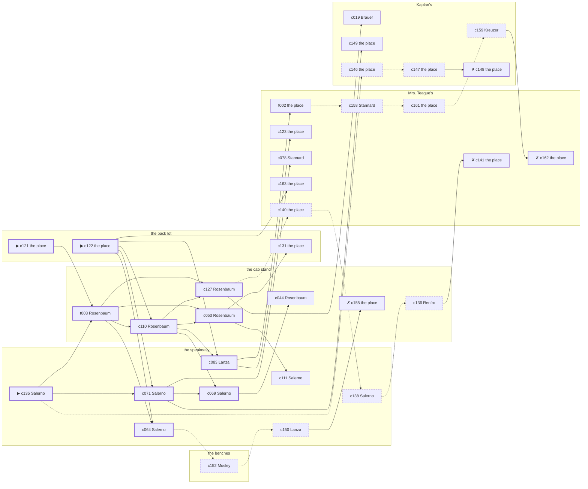

# the Bowery — case 7

**Seed** 7 · **Difficulty** 2 · **Attempts** 1 · **Detective** Dashiell

**Type** robbery · **Trope** inside-job · **Unknowns** who, entry, goods

**Par** 10 actions · **Slack** 6 · **Budget** 16 · **Findable** 34 (spine 11, corroboration 9, noise 10 + 4 disqualifiers) · **Noise ratio** 41% · **Candidate pool** 173

## 1. The Truth

Eunice Mosley, a pawnbroker’s clerk, a customer of Brennan’s, took a japanned cash box from the back lot, which belonged to Rose Brennan, an heiress between marriages, at 10:30 PM, by a case left in the cloakroom that morning. Mosley owed Brennan four thousand dollars and was past due on it (debt). Mosley had been at Mrs. Teague’s earlier in the evening, where the means lived, and was alone at the back lot when it happened. Salerno hired us.

## 2. The Act

**robbery** · **inside-job** · actor **Mosley** · at **the back lot** · at **10:30 PM**

- taken: a japanned cash box
- entry: never-left
- goods went to the benches

**Givens** — what the briefing states and the report does not ask:

- A japanned cash box was taken from the back lot, which is Brennan’s.
- Nothing at the back lot was forced: the lock was turned and the door was shut again after.
- The precinct puts it between 10:00 PM and 11:30 PM.
- Brennan is not saying much about what was in it.

**Unknowns** — exactly what the report asks: **who**, **entry**, **goods**.

## 3. Dramatis Personae

| Name | Role | Relationship | Class of secret | Motive | Found at | Killer |
| --- | --- | --- | --- | --- | --- | --- |
| Rose Brennan | an heiress between marriages | the victim | — | — | — | — |
| Percival Bledsoe | a hack driver | Brennan’s tenant | secret-drinking | — | Mrs. Teague’s | — |
| Karl Brauer | a young man living on expectations | named in Brennan’s will | gambling-debt | inheritance | Kaplan’s | — |
| Eunice Mosley | a pawnbroker’s clerk | a customer of Brennan’s | murder (+ forged-identity) | debt | the benches | **YES** |
| Meyer Rosenbaum | a ward heeler | Brennan’s business partner | fence | — | the cab stand | — |
| Lavinia Bidwell | the night manager at the hotel | Brennan’s former employee | secret-drinking | — | the benches | — |
| Lucia Salerno (client) | a chambermaid | Brennan’s tenant | fence | revenge | the speakeasy | — |
| Edith Stannard | the landlady | fixture (landlady) | — | — | Mrs. Teague’s | — |
| Angelina Lanza | the bartender | fixture (bartender) | — | — | the speakeasy | — |
| Frieda Kreuzer | the druggist | fixture (druggist) | — | — | Kaplan’s | — |
| Ezekiel Renfro | the hackman on the stand | fixture (cabbie) | — | — | the cab stand | — |

## 4. Dossiers

Every person, by layer: **0** on sight, **1** volunteered, **2** from other people, **3** in the documents.

### Brennan — the victim

46, a woman, an heiress between marriages. Wants: to-keep-what-they-have.

- **Standing** — Brennan was the one name on the block the papers would have printed.
- **Profession** — Brennan kept an apartment, a maid and no occupation at all.
- **Found** — Bledsoe found the door at the back lot shut and a japanned cash box gone, at 11:30 PM. By Bledsoe, at the back lot, at 11:30 PM. Precinct: came-and-went.

**Layer 0, on sight**

- _gender_ — A woman.
- _age_ — In her forties.

**Layer 1, volunteered**

- _profession_ — An heiress between marriages.
- _detail_ — Brennan kept an apartment, a maid and no occupation at all.

**Layer 2, from other people**

- _tie_ — Brennan was the one name on the block the papers would have printed.
- _want_ — Brennan wants to keep what they have and add nothing to it.

**Self-account** (layer 1, what they say when asked about themselves)

- Brennan is 46 years old and an heiress between marriages.
- Brennan kept an apartment, a maid and no occupation at all.
- Brennan is the one this is about.

### Bledsoe

34, a man, a hack driver. Wants: money. Tie: Brennan’s tenant, since the flu year.

**Layer 0, on sight**

- _gender_ — A man.
- _age_ — In his thirties.
- _profession_ — A hack driver.

**Layer 1, volunteered**

- _detail_ — Bledsoe drives nights and sleeps while the city works.

**Layer 2, from other people**

- _tie_ — Bledsoe has rented from Brennan since ’26 and has the same window and the same complaint.
- _want_ — Bledsoe wants money, and is not particular about the shape it arrives in.
- _since_ — Bledsoe has been Brennan’s tenant, since the flu year.

**Layer 3, in the documents**

- _secret-hint_ — Bledsoe had taken a drink and had gone to some trouble about the smell of it.

**Self-account** (layer 1, what they say when asked about themselves)

- Bledsoe is 34 years old and a hack driver.
- Bledsoe drives nights and sleeps while the city works.
- Bledsoe is Brennan’s tenant.

### Brauer

28, a man, a young man living on expectations. Wants: money. Tie: named in Brennan’s will, since the will was redrawn.

**Layer 0, on sight**

- _gender_ — A man.
- _age_ — In the late twenties.

**Layer 1, volunteered**

- _profession_ — A young man living on expectations.
- _detail_ — Brauer has no occupation anybody can name and an account at three tailors.

**Layer 2, from other people**

- _tie_ — Brennan told Brauer there was something in the will and never said how much.
- _want_ — Brauer wants money, and is not particular about the shape it arrives in.
- _since_ — Brauer has been named in Brennan’s will, since the will was redrawn.

**Layer 3, in the documents**

- _secret-hint_ — Brauer was asking around for a hundred dollars in a hurry earlier in the week.

**Self-account** (layer 1, what they say when asked about themselves)

- Brauer is 28 years old and a young man living on expectations.
- Brauer has no occupation anybody can name and an account at three tailors.
- Brauer is named in Brennan’s will.

### Mosley — the killer

35, a woman, a pawnbroker’s clerk. Wants: to-keep-what-they-have. Tie: a customer of Brennan’s, for years.

**Layer 0, on sight**

- _gender_ — A woman.
- _age_ — In her thirties.

**Layer 1, volunteered**

- _profession_ — A pawnbroker’s clerk.
- _detail_ — Mosley handles the redemptions, and the ones nobody comes back for.

**Layer 2, from other people**

- _tie_ — Mosley has been on Brennan’s books as a customer since ’20.
- _want_ — Mosley wants to keep what they have and add nothing to it.
- _since_ — Mosley has been a customer of Brennan’s, for years.

**Layer 3, in the documents**

- _secret-hint_ — Mosley’s registration card gives an address on a street that does not exist.

**Self-account** (layer 1, what they say when asked about themselves)

- Mosley is 35 years old and a pawnbroker’s clerk.
- Mosley handles the redemptions, and the ones nobody comes back for.
- Mosley is a customer of Brennan’s.

### Rosenbaum

55, a man, a ward heeler. Wants: to-be-somebody. Tie: Brennan’s business partner, three years this spring.

**Layer 0, on sight**

- _gender_ — A man.
- _age_ — In his fifties.

**Layer 1, volunteered**

- _profession_ — A ward heeler.
- _detail_ — Rosenbaum delivers the vote on the block and the coal in February.

**Layer 2, from other people**

- _tie_ — Rosenbaum bought into Brennan’s business the year Sterling Crowninshield walked out of it.
- _want_ — Rosenbaum wants a name people know.
- _since_ — Rosenbaum has been Brennan’s business partner, three years this spring.
- _third_ — Sterling Crowninshield is a partner who walked out of the business.

**Layer 3, in the documents**

- _secret-hint_ — Rosenbaum was carrying a parcel into the cab stand and came out without it.

**Self-account** (layer 1, what they say when asked about themselves)

- Rosenbaum is 55 years old and a ward heeler.
- Rosenbaum delivers the vote on the block and the coal in February.
- Rosenbaum is Brennan’s business partner.

### Bidwell

30, a woman, the night manager at the hotel. Wants: money. Tie: Brennan’s former employee, since ’23.

**Layer 0, on sight**

- _gender_ — A woman.
- _age_ — In her thirties.
- _profession_ — The night manager at the hotel.

**Layer 1, volunteered**

- _detail_ — Bidwell runs the house while the day manager sleeps.

**Layer 2, from other people**

- _tie_ — Bidwell kept Brennan’s books until Constance Lathrop was brought in over Bidwell’s head.
- _want_ — Bidwell wants money, and is not particular about the shape it arrives in.
- _since_ — Bidwell has been Brennan’s former employee, since ’23.
- _third_ — Constance Lathrop is a daughter who married and moved to Newark.

**Layer 3, in the documents**

- _secret-hint_ — Bidwell had taken a drink and had gone to some trouble about the smell of it.

**Self-account** (layer 1, what they say when asked about themselves)

- Bidwell is 30 years old and the night manager at the hotel.
- Bidwell runs the house while the day manager sleeps.
- Bidwell is Brennan’s former employee.

### Salerno — the client

37, a woman, a chambermaid. Wants: money. Tie: Brennan’s tenant, four years in the same rooms.

**Layer 0, on sight**

- _gender_ — A woman.
- _age_ — In her thirties.
- _profession_ — A chambermaid.

**Layer 1, volunteered**

- _detail_ — Salerno does eleven rooms a day and the linen after.

**Layer 2, from other people**

- _tie_ — Brennan put Salerno’s rent up twice in a year and Salerno paid it twice.
- _want_ — Salerno wants money, and is not particular about the shape it arrives in.
- _since_ — Salerno has been Brennan’s tenant, four years in the same rooms.

**Layer 3, in the documents**

- _secret-hint_ — Salerno was carrying a parcel into the cab stand and came out without it.

**Self-account** (layer 1, what they say when asked about themselves)

- Salerno is 37 years old and a chambermaid.
- Salerno does eleven rooms a day and the linen after.
- Salerno is Brennan’s tenant.

### Stannard

52, a woman, the landlady. Wants: to-keep-what-they-have. Tie: the keeper of Mrs. Teague’s.

**Layer 0, on sight**

- _gender_ — A woman.
- _age_ — In her fifties.
- _profession_ — The landlady.

**Layer 1, volunteered**

- _detail_ — Stannard lets the rooms at Mrs. Teague’s and collects on Saturdays.

**Layer 2, from other people**

- _tie_ — Stannard is the keeper of Mrs. Teague’s.
- _want_ — Stannard wants to keep what they have and add nothing to it.

**Self-account** (layer 1, what they say when asked about themselves)

- Stannard is 52 years old and the landlady.
- Stannard lets the rooms at Mrs. Teague’s and collects on Saturdays.
- Stannard is the keeper of Mrs. Teague’s.

### Lanza

30, a woman, the bartender. Wants: to-be-left-alone. Tie: behind the bar at the speakeasy, every night of the week.

**Layer 0, on sight**

- _gender_ — A woman.
- _age_ — In her thirties.
- _profession_ — The bartender.

**Layer 1, volunteered**

- _detail_ — Lanza has had the stick at the speakeasy for nine years and remembers what everybody drinks.

**Layer 2, from other people**

- _tie_ — Lanza is behind the bar at the speakeasy, every night of the week.
- _want_ — Lanza wants to be left alone.

**Self-account** (layer 1, what they say when asked about themselves)

- Lanza is 30 years old and the bartender.
- Lanza has had the stick at the speakeasy for nine years and remembers what everybody drinks.
- Lanza is behind the bar at the speakeasy, every night of the week.

### Kreuzer

51, a woman, the druggist. Wants: respectability. Tie: behind the counter at Kaplan’s.

**Layer 0, on sight**

- _gender_ — A woman.
- _age_ — In her fifties.
- _profession_ — The druggist.

**Layer 1, volunteered**

- _detail_ — Kreuzer has had Kaplan’s since before the war and knows what everybody on the block takes.

**Layer 2, from other people**

- _tie_ — Kreuzer is behind the counter at Kaplan’s.
- _want_ — Kreuzer wants to be thought respectable by people who are not.

**Self-account** (layer 1, what they say when asked about themselves)

- Kreuzer is 51 years old and the druggist.
- Kreuzer has had Kaplan’s since before the war and knows what everybody on the block takes.
- Kreuzer is behind the counter at Kaplan’s.

### Renfro

50, a man, the hackman on the stand. Wants: money. Tie: on the stand at the cab stand.

**Layer 0, on sight**

- _gender_ — A man.
- _age_ — In his fifties.
- _profession_ — The hackman on the stand.

**Layer 1, volunteered**

- _detail_ — Renfro has worked the stand at the cab stand for six years and knows every regular fare on it.

**Layer 2, from other people**

- _tie_ — Renfro is on the stand at the cab stand.
- _want_ — Renfro wants money, and is not particular about the shape it arrives in.

**Self-account** (layer 1, what they say when asked about themselves)

- Renfro is 50 years old and the hackman on the stand.
- Renfro has worked the stand at the cab stand for six years and knows every regular fare on it.
- Renfro is on the stand at the cab stand.

## 5. The Client

**Salerno**, Brennan’s tenant. Purpose: **get-it-back**.

- **Why** — Salerno wants it back, and does not much care who took it.
- **What it costs** — Salerno cannot report the loss without saying where the thing came from.
- **Points at** — Mosley: Mosley owed Brennan four thousand dollars and was past due on it. Honest: **yes**.

**Tells:**

- A japanned cash box was taken from the back lot, which is Brennan’s.
- Nothing at the back lot was forced: the lock was turned and the door was shut again after.
- The precinct puts it between 10:00 PM and 11:30 PM.
- Brennan is not saying much about what was in it.
- Salerno would rather we started with Mosley: Mosley owed Brennan four thousand dollars and was past due on it.

**Withholds:**

- Salerno does not mention it, but Salerno hands a parcel of stolen goods to a man at the cab stand from 9:30 PM to 10:00 PM.

**Their own evening, as they tell it:**

- Salerno says she was at the benches at 6:00 PM.
- Salerno says she was at the speakeasy from 6:30 PM to 7:30 PM.
- Salerno says she was at Kaplan’s at 8:00 PM.
- Salerno says she was at the benches from 8:30 PM to 9:00 PM.

## 6. The Briefing

16 plain sentences, derived. This is the model of the plain register: the engine renders it, and Phase 2 measures pages against it.

1. A woman came up the stairs after midnight, and sat down.
2. Lucia Salerno is 37 years old and a chambermaid.
3. Salerno does eleven rooms a day and the linen after.
4. Brennan was the one name on the block the papers would have printed.
5. A japanned cash box was taken from the back lot, which is Brennan’s.
6. Nothing at the back lot was forced: the lock was turned and the door was shut again after.
7. The precinct puts it between 10:00 PM and 11:30 PM.
8. Brennan is not saying much about what was in it.
9. Bledsoe found the door at the back lot shut and a japanned cash box gone, at 11:30 PM.
10. The precinct came, walked through it, and went.
11. Salerno is Brennan’s tenant.
12. Brennan put Salerno’s rent up twice in a year and Salerno paid it twice.
13. Salerno wants it back, and does not much care who took it.
14. Salerno cannot report the loss without saying where the thing came from.
15. Salerno wants us to start with Mosley.
16. Mosley owed Brennan four thousand dollars and was past due on it.

## 7. Mentions

- **Sterling Crowninshield** (m-1) — a partner who walked out of the business. Sterling Crowninshield is a partner who walked out of the business.
- **Constance Lathrop** (m-2) — a daughter who married and moved to Newark. Constance Lathrop is a daughter who married and moved to Newark.

## 8. Places

- **the back room at Mrs. Teague’s** (private) — watched by landlady (Stannard); objects: a strapped suitcase, a framed photograph, a bronze bookend — where the weapon lived
- **the speakeasy under the hat shop** (semi) — watched by bartender (Lanza); objects: a nickel-plated revolver, a silver cigarette case, a bottle of chloral drops — within earshot of the scene
- **Brennan’s house on the back lot** (private) — unwatched; objects: a japanned cash box, a length of sash cord, the roof-door key, a mechanic’s toolbox — **THE SCENE**; the victim’s address
- **Kaplan’s drugstore with the soda fountain** (public) — watched by druggist (Kreuzer); objects: a wall telephone, an ice pick
- **the cab stand outside the Hippodrome** (public) — watched by cabbie (Renfro); objects: a pasted-up timetable, a folded stack of evening papers
- **the benches at the north end of the square** (public) — unwatched; objects: a brass umbrella stand — within earshot of the scene

## 9. Anchors

The coroner gives 10:00 PM–11:30 PM, four ticks wide. These are what close it: **bar-radio** and **piano-lesson**.

- **the piano lesson on the floor above** — at 10:00 PM; at Mrs. Teague’s. You can time things by it: the same four bars, over and over, and then nothing. Only those present know that the child never did get the passage right.
- **the fight card on the bar radio** — at 10:30 PM; at the speakeasy. Only those present know that the challenger went down in the fourth and the crowd booed it. You can time things by it: the set was turned up loud enough to carry into the street.
- **the drunk singing under the window** — at 10:00 PM; at Mrs. Teague’s. You can time things by it: the same two verses until somebody threw a shoe. Only those present know that it was a shoe, and it was thrown by a woman, and it did not land.

## 10. Timelines

### Brennan — the victim

| Tick | Time | Truth | Claimed | Companion claimed |
| --- | --- | --- | --- | --- |
| 0 | 6:00 PM | the speakeasy | the speakeasy | — |
| 1 | 6:30 PM | the speakeasy | the speakeasy | — |
| 2 | 7:00 PM | the speakeasy | the speakeasy | — |
| 3 | 7:30 PM | the speakeasy | the speakeasy | — |
| 4 | 8:00 PM | Kaplan’s | Kaplan’s | — |
| 5 | 8:30 PM | Kaplan’s | Kaplan’s | — |
| 6 | 9:00 PM | the cab stand | the cab stand | — |
| 7 | 9:30 PM | Kaplan’s | Kaplan’s | — |
| 8 | 10:00 PM | Mrs. Teague’s | Mrs. Teague’s | — |
| 9 | 10:30 PM | Mrs. Teague’s | Mrs. Teague’s | — |
| 10 | 11:00 PM | Kaplan’s | Kaplan’s | — |
| 11 | 11:30 PM | Mrs. Teague’s | Mrs. Teague’s | — |

### Bledsoe

| Tick | Time | Truth | Claimed | Companion claimed |
| --- | --- | --- | --- | --- |
| 0 | 6:00 PM | the benches | the benches | — |
| 1 | 6:30 PM | Kaplan’s | Kaplan’s | — |
| 2 | 7:00 PM | Kaplan’s | Kaplan’s | — |
| 3 | 7:30 PM | the benches | the benches | — |
| 4 | 8:00 PM | the speakeasy | the speakeasy | — |
| 5 | 8:30 PM | Mrs. Teague’s | **the cab stand** | Mosley |
| 6 | 9:00 PM | Mrs. Teague’s | **the cab stand** | Mosley |
| 7 | 9:30 PM | Mrs. Teague’s | Mrs. Teague’s | — |
| 8 | 10:00 PM | Mrs. Teague’s | Mrs. Teague’s | — |
| 9 | 10:30 PM | Mrs. Teague’s | Mrs. Teague’s | — |
| 10 | 11:00 PM | Mrs. Teague’s | Mrs. Teague’s | — |
| 11 | 11:30 PM | the back lot | the back lot | — |

### Brauer

| Tick | Time | Truth | Claimed | Companion claimed |
| --- | --- | --- | --- | --- |
| 0 | 6:00 PM | Kaplan’s | Kaplan’s | — |
| 1 | 6:30 PM | the cab stand | the cab stand | — |
| 2 | 7:00 PM | the cab stand | the cab stand | — |
| 3 | 7:30 PM | the cab stand | the cab stand | — |
| 4 | 8:00 PM | Kaplan’s | Kaplan’s | — |
| 5 | 8:30 PM | Kaplan’s | Kaplan’s | — |
| 6 | 9:00 PM | Kaplan’s | Kaplan’s | — |
| 7 | 9:30 PM | Kaplan’s | Kaplan’s | — |
| 8 | 10:00 PM | Mrs. Teague’s | Mrs. Teague’s | — |
| 9 | 10:30 PM | Kaplan’s | **the cab stand** | Bledsoe |
| 10 | 11:00 PM | Kaplan’s | Kaplan’s | — |
| 11 | 11:30 PM | Kaplan’s | Kaplan’s | — |

### Mosley — the killer

| Tick | Time | Truth | Claimed | Companion claimed |
| --- | --- | --- | --- | --- |
| 0 | 6:00 PM | the benches | the benches | — |
| 1 | 6:30 PM | the benches | the benches | — |
| 2 | 7:00 PM | the benches | the benches | — |
| 3 | 7:30 PM | the benches | the benches | — |
| 4 | 8:00 PM | the benches | the benches | — |
| 5 | 8:30 PM | the benches | the benches | — |
| 6 | 9:00 PM | the back lot | the back lot | — |
| 7 | 9:30 PM | the cab stand | the cab stand | — |
| 8 | 10:00 PM | Mrs. Teague’s | Mrs. Teague’s | — |
| 9 | 10:30 PM | the back lot ☠ | **Mrs. Teague’s** | — |
| 10 | 11:00 PM | the benches | the benches | — |
| 11 | 11:30 PM | Kaplan’s | Kaplan’s | — |

### Rosenbaum

| Tick | Time | Truth | Claimed | Companion claimed |
| --- | --- | --- | --- | --- |
| 0 | 6:00 PM | the benches | the benches | — |
| 1 | 6:30 PM | the benches | the benches | — |
| 2 | 7:00 PM | Kaplan’s | Kaplan’s | — |
| 3 | 7:30 PM | Kaplan’s | Kaplan’s | — |
| 4 | 8:00 PM | the cab stand | **the benches** | — |
| 5 | 8:30 PM | the cab stand | **the benches** | — |
| 6 | 9:00 PM | the cab stand | the cab stand | — |
| 7 | 9:30 PM | the cab stand | the cab stand | — |
| 8 | 10:00 PM | Mrs. Teague’s | Mrs. Teague’s | — |
| 9 | 10:30 PM | Mrs. Teague’s | Mrs. Teague’s | — |
| 10 | 11:00 PM | Mrs. Teague’s | Mrs. Teague’s | — |
| 11 | 11:30 PM | Mrs. Teague’s | Mrs. Teague’s | — |

### Bidwell

| Tick | Time | Truth | Claimed | Companion claimed |
| --- | --- | --- | --- | --- |
| 0 | 6:00 PM | the benches | the benches | — |
| 1 | 6:30 PM | the benches | the benches | — |
| 2 | 7:00 PM | the benches | the benches | — |
| 3 | 7:30 PM | the benches | the benches | — |
| 4 | 8:00 PM | the speakeasy | the speakeasy | — |
| 5 | 8:30 PM | the speakeasy | the speakeasy | — |
| 6 | 9:00 PM | the speakeasy | the speakeasy | — |
| 7 | 9:30 PM | the speakeasy | the speakeasy | — |
| 8 | 10:00 PM | Mrs. Teague’s | **Kaplan’s** | Mosley |
| 9 | 10:30 PM | Mrs. Teague’s | **Kaplan’s** | Mosley |
| 10 | 11:00 PM | the cab stand | the cab stand | — |
| 11 | 11:30 PM | the benches | the benches | — |

### Salerno

| Tick | Time | Truth | Claimed | Companion claimed |
| --- | --- | --- | --- | --- |
| 0 | 6:00 PM | the benches | the benches | — |
| 1 | 6:30 PM | the speakeasy | the speakeasy | — |
| 2 | 7:00 PM | the speakeasy | the speakeasy | — |
| 3 | 7:30 PM | the speakeasy | the speakeasy | — |
| 4 | 8:00 PM | Kaplan’s | Kaplan’s | — |
| 5 | 8:30 PM | the benches | the benches | — |
| 6 | 9:00 PM | the benches | the benches | — |
| 7 | 9:30 PM | the cab stand | **Kaplan’s** | Mosley |
| 8 | 10:00 PM | the cab stand | **Kaplan’s** | Mosley |
| 9 | 10:30 PM | Mrs. Teague’s | Mrs. Teague’s | — |
| 10 | 11:00 PM | the speakeasy | the speakeasy | — |
| 11 | 11:30 PM | the speakeasy | the speakeasy | — |

### Fixtures (never lie, never withhold)

| Tick | Time | Stannard (the landlady) | Lanza (the bartender) | Kreuzer (the druggist) | Renfro (the hackman on the stand) |
| --- | --- | --- | --- | --- | --- |
| 0 | 6:00 PM | Mrs. Teague’s | the speakeasy | Kaplan’s | the cab stand |
| 1 | 6:30 PM | Mrs. Teague’s | the speakeasy | Kaplan’s | the cab stand |
| 2 | 7:00 PM | Mrs. Teague’s | the speakeasy | Kaplan’s | the cab stand |
| 3 | 7:30 PM | Mrs. Teague’s | the speakeasy | Kaplan’s | the cab stand |
| 4 | 8:00 PM | Mrs. Teague’s | the speakeasy | Kaplan’s | the cab stand |
| 5 | 8:30 PM | the cab stand | the speakeasy | Kaplan’s | the cab stand |
| 6 | 9:00 PM | Mrs. Teague’s | the speakeasy | Kaplan’s | the cab stand |
| 7 | 9:30 PM | Mrs. Teague’s | the speakeasy | Kaplan’s | the cab stand |
| 8 | 10:00 PM | Mrs. Teague’s | the speakeasy | Kaplan’s | the cab stand |
| 9 | 10:30 PM | Mrs. Teague’s | Kaplan’s | Kaplan’s | the cab stand |
| 10 | 11:00 PM | Mrs. Teague’s | the speakeasy | Kaplan’s | the cab stand |
| 11 | 11:30 PM | Mrs. Teague’s | the speakeasy | Kaplan’s | the cab stand |

## 11. Secrets in play

- **Bledsoe** (secret-drinking): Bledsoe drinks alone at Mrs. Teague’s from 8:30 PM to 9:00 PM and will claim to have been anywhere else.
- **Brauer** (gambling-debt): Brauer slips off to Kaplan’s from 10:30 PM to settle with a bookmaker.
- **Mosley** (murder): Mosley is at the back lot from 10:30 PM, alone with what Brennan kept there, and takes it at 10:30 PM.
- **Mosley** also (forged-identity): Mosley is not the person the papers say. Nothing about the evening is hidden; the lie is all in the paperwork.
- **Rosenbaum** (fence): Rosenbaum hands a parcel of stolen goods to a man at the cab stand from 8:00 PM to 8:30 PM.
- **Bidwell** (secret-drinking): Bidwell drinks alone at Mrs. Teague’s from 10:00 PM to 10:30 PM and will claim to have been anywhere else.
- **Salerno** (fence): Salerno hands a parcel of stolen goods to a man at the cab stand from 9:30 PM to 10:00 PM.

## 12. Clue list — the 34 findable

The opening three, free at the start: c121, c122, c135. Everything else has to be led to. The full candidate pool is in the companion file.

### At Mrs. Teague’s

- **t002** [corroboration] (document; the place itself) → c158
  - The key list at Mrs. Teague’s runs to four names, and Mosley is the third of them. The book has Mosley there at 10:00 PM.
  - _establishes: Mosley could reach the weapon; Mosley at Mrs. Teague’s, 10:00 PM_
- **c123** [corroboration] (physical; the place itself) → (end)
  - A strapped suitcase is gone from Mrs. Teague’s. The strapped case is gone from where it was checked, and the check is still in the book.
  - _establishes: something gone from Mrs. Teague’s; how it was done_
- **c078** [corroboration] (observation; Stannard on Rosenbaum) → (end)
  - Stannard says Rosenbaum was at Mrs. Teague’s from 10:00 PM to 11:30 PM.
  - _establishes: Rosenbaum at Mrs. Teague’s, 10:00 PM–11:30 PM; Rosenbaum could reach the weapon_
- **c163** [corroboration] (overheard; the place itself) → (end)
  - The tab at Mrs. Teague’s is dated and timed, from 10:00 PM to 10:30 PM, and Bidwell was there to run it up.
  - _establishes: Bidwell’s secret-drinking accounted for; Bidwell at Mrs. Teague’s, 10:00 PM–10:30 PM_
- **c158** [noise {b1}] (overheard; Stannard on Bidwell) → c161
  - Stannard on Bidwell: Bidwell is on a temperance pledge that Bidwell mentions before anybody asks.
  - _establishes: context only_
- **c161** [noise {b1}] (physical; the place itself) → c159
  - A tab at Mrs. Teague’s in a name that is not Bidwell’s, in Bidwell’s handwriting.
  - _establishes: context only_
- **c162** [disqualifier {b1}] (overheard; the place itself) → (end)
  - The man behind the counter at Mrs. Teague’s knows exactly: Bidwell was on the same stool from 10:00 PM to 10:30 PM and was in no condition to walk anywhere, let alone do this.
  - _establishes: Bidwell’s secret-drinking accounted for; Bidwell at Mrs. Teague’s, 10:00 PM–10:30 PM_
- **c140** [noise {b2}] (physical; the place itself) → c138
  - A tab at Mrs. Teague’s in a name that is not Bledsoe’s, in Bledsoe’s handwriting.
  - _establishes: context only_
- **c141** [disqualifier {b2}] (overheard; the place itself) → (end)
  - The man behind the counter at Mrs. Teague’s knows exactly: Bledsoe was on the same stool from 8:30 PM to 9:00 PM and was in no condition to walk anywhere, let alone do this.
  - _establishes: Bledsoe’s secret-drinking accounted for; Bledsoe at Mrs. Teague’s, 8:30 PM–9:00 PM_

### At the speakeasy

- **c135** [spine ⟨opening⟩] (client; Salerno on why I was hired) → t003, c071, c146
  - Salerno hired us, and wants it known that Mosley owed Brennan four thousand dollars and was past due on it, and would rather we started there.
  - _establishes: Mosley had a motive (debt)_
- **c064** [spine] (observation; Salerno on Bledsoe) → c152
  - Salerno says Bledsoe was at Mrs. Teague’s at 10:30 PM.
  - _establishes: Bledsoe at Mrs. Teague’s, 10:30 PM_
- **c071** [spine] (observation; Salerno on Bidwell) → c069, c149, c078
  - Salerno says Bidwell was at Mrs. Teague’s at 10:30 PM.
  - _establishes: Bidwell at Mrs. Teague’s, 10:30 PM_
- **c069** [spine] (observation; Salerno on Rosenbaum) → c044
  - Salerno says Rosenbaum was at Mrs. Teague’s at 10:30 PM.
  - _establishes: Rosenbaum at Mrs. Teague’s, 10:30 PM_
- **c083** [spine] (observation; Lanza on Brauer) → t002, c123
  - Lanza says Brauer was at Kaplan’s at 10:30 PM.
  - _establishes: Brauer at Kaplan’s, 10:30 PM_
- **c111** [corroboration] (observation; Salerno on Mosley’s account) → (end)
  - Salerno was at Mrs. Teague’s at 10:30 PM and says Mosley was not.
  - _establishes: Mosley not at Mrs. Teague’s, 10:30 PM_
- **c138** [noise {b2}] (overheard; Salerno on Bledsoe) → c136
  - Salerno on Bledsoe: Somebody at Mrs. Teague’s says Bledsoe is in more often than Bledsoe lets on.
  - _establishes: context only_
- **c150** [noise {b4}] (overheard; Lanza on Rosenbaum) → c155
  - Lanza on Rosenbaum: Rosenbaum was carrying a parcel into the cab stand and came out without it.
  - _establishes: context only_

### At the back lot

- **c121** [spine ⟨opening⟩] (scene; the place itself) → t003
  - A japanned cash box is gone from the back lot, which is Brennan’s. Nothing was forced and nothing was broken. Whoever it was had all night and took twenty minutes. The fight card was on the bar radio at 10:30 PM, turned up loud enough to carry into the street, and off when the card ended.
  - _establishes: the victim dead by 10:30 PM; how it was done_
- **c122** [spine ⟨opening⟩] (morgue; the place itself) → c110, c064, c071, c083, c163
  - The desk sergeant's report puts it between 10:00 PM and 11:30 PM — two hours of nothing useful. The precinct report says there was no entry at all. Whoever it was was inside before the door was shut.
  - _establishes: death between 10:00 PM and 11:30 PM; how it was done_
- **c131** [corroboration] (document; the place itself) → (end)
  - Found at the back lot: A promissory note for $4,000 signed by Mosley, endorsed to Brennan, three months past due.
  - _establishes: Mosley had a motive (debt)_

### At Kaplan’s

- **c019** [corroboration] (observation; Brauer on Bledsoe) → (end)
  - Brauer says Bledsoe was at Mrs. Teague’s at 10:00 PM.
  - _establishes: Bledsoe at Mrs. Teague’s, 10:00 PM; Bledsoe could reach the weapon_
- **c149** [corroboration] (overheard; the place itself) → (end)
  - The book at Kaplan’s has the payment entered against Brauer’s name and the time beside it, from 10:30 PM, in the clerk’s own hand.
  - _establishes: Brauer’s gambling-debt accounted for; Brauer at Kaplan’s, 10:30 PM_
- **c159** [noise {b1}] (overheard; Kreuzer on Bidwell) → c162
  - Kreuzer on Bidwell: Somebody at Mrs. Teague’s says Bidwell is in more often than Bidwell lets on.
  - _establishes: context only_
- **c146** [noise {b3}] (physical; the place itself) → c147
  - Betting slips at Kaplan’s in Brauer’s pocketbook, all of them losers, all of them this month.
  - _establishes: context only_
- **c147** [noise {b3}] (physical; the place itself) → c148
  - A book of markers at Kaplan’s with Brauer’s initials against four of them.
  - _establishes: context only_
- **c148** [disqualifier {b3}] (overheard; the place itself) → (end)
  - The bookmaker’s runner is found and will say it: Brauer was at Kaplan’s from 10:30 PM paying off eleven hundred dollars, a dollar at a time, and went nowhere near the killing.
  - _establishes: Brauer’s gambling-debt accounted for; Brauer at Kaplan’s, 10:30 PM_

### At the cab stand

- **t003** [spine] (overheard; Rosenbaum on the lock) → c110, c064, c127, c053
  - Rosenbaum says the lock at the back lot has never been changed, and that the people who can open it can be counted on one hand.
  - _establishes: Mosley could reach the weapon_
- **c110** [spine] (observation; Rosenbaum on Mosley’s account) → c127, c069, c083, c053
  - Rosenbaum was at Mrs. Teague’s at 10:30 PM and says Mosley was not.
  - _establishes: Mosley not at Mrs. Teague’s, 10:30 PM_
- **c127** [spine] (anchor; Rosenbaum on Brennan that evening) → c019, c140
  - Rosenbaum puts Brennan at Mrs. Teague’s while the lesson was still going on overhead, which was 10:00 PM, and nothing had been touched then.
  - _establishes: the victim alive at 10:00 PM; Brennan at Mrs. Teague’s, 10:00 PM_
- **c053** [spine] (observation; Rosenbaum on Salerno) → c131, c111
  - Rosenbaum says Salerno was at Mrs. Teague’s at 10:30 PM.
  - _establishes: Salerno at Mrs. Teague’s, 10:30 PM_
- **c044** [corroboration] (observation; Rosenbaum on Bledsoe) → (end)
  - Rosenbaum says Bledsoe was at Mrs. Teague’s from 10:00 PM to 11:00 PM.
  - _establishes: Bledsoe at Mrs. Teague’s, 10:00 PM–11:00 PM; Bledsoe could reach the weapon_
- **c136** [noise {b2}] (overheard; Renfro on Bledsoe) → c141
  - Renfro on Bledsoe: Bledsoe had taken a drink and had gone to some trouble about the smell of it.
  - _establishes: context only_
- **c155** [disqualifier {b4}] (overheard; the place itself) → (end)
  - The receiver at the cab stand would rather talk than be held: Rosenbaum was there from 8:00 PM to 8:30 PM handing over a parcel of somebody else’s silver, which is a charge Rosenbaum will take over this one.
  - _establishes: Rosenbaum’s fence accounted for; Rosenbaum at the cab stand, 8:00 PM–8:30 PM_

### At the benches

- **c152** [noise {b4}] (overheard; Mosley on Rosenbaum) → c150
  - Mosley on Rosenbaum: Rosenbaum has been selling things that were never Rosenbaum’s to sell.
  - _establishes: context only_

## 13. Clue graph

## 14. Deduction path

Par is **10 actions** and the budget is par plus 6: **16**. Every id below is a spine clue; the inference is the sheet’s, not the clue’s.

**Time of death.** The coroner gives four ticks. The anchors close it to 10:30 PM: one puts Brennan alive at 10:00 PM, the other times the scene at 10:30 PM. _(c122, c127, c121)_

**Clearing the innocent.**

- Bledsoe was not at the back lot at 10:30 PM. _(c064; + 1 corroborating)_
- Brauer was not at the back lot at 10:30 PM. _(c083; + 2 corroborating)_
- Rosenbaum was not at the back lot at 10:30 PM. _(c069; + 1 corroborating)_
- Bidwell was not at the back lot at 10:30 PM. _(c071; + 2 corroborating)_
- Salerno was not at the back lot at 10:30 PM. _(c053)_

**Naming the killer.** Mosley claims Mrs. Teague’s at 10:30 PM. Two independent sources put that out of the question. _(c110; + 1 corroborating)_

**The weapon.** Mosley was at Mrs. Teague’s before 10:30 PM, where a strapped suitcase was kept. _(t003; + 1 corroborating)_

**Method.** A case left in the cloakroom that morning, on two physical sources. _(c121, c122; + 1 corroborating)_

**Motive.** debt, on two independent sources. _(c135; + 1 corroborating)_

## 15. Red herrings

**Innocents who lie about the murder tick:**

- Brauer claims the cab stand at 10:30 PM and was really at Kaplan’s. Reason: Brauer slips off to Kaplan’s from 10:30 PM to settle with a bookmaker.
- Bidwell claims Kaplan’s at 10:30 PM and was really at Mrs. Teague’s. Reason: Bidwell drinks alone at Mrs. Teague’s from 10:00 PM to 10:30 PM and will claim to have been anywhere else.

**Innocents with a motive:**

- Brauer — inheritance: stands to inherit from Brennan.
- Salerno — revenge: blamed Brennan for the ruin of Salerno’s business.

**Noise branches, and what knocks each one down:**

- **b1** (Bidwell, secret-drinking): c158 → c161 → c159 → **c162** — The man behind the counter at Mrs. Teague’s knows exactly: Bidwell was on the same stool from 10:00 PM to 10:30 PM and was in no condition to walk anywhere, let alone do this.
- **b2** (Bledsoe, secret-drinking): c140 → c138 → c136 → **c141** — The man behind the counter at Mrs. Teague’s knows exactly: Bledsoe was on the same stool from 8:30 PM to 9:00 PM and was in no condition to walk anywhere, let alone do this.
- **b3** (Brauer, gambling-debt): c146 → c147 → **c148** — The bookmaker’s runner is found and will say it: Brauer was at Kaplan’s from 10:30 PM paying off eleven hundred dollars, a dollar at a time, and went nowhere near the killing.
- **b4** (Rosenbaum, fence): c152 → c150 → **c155** — The receiver at the cab stand would rather talk than be held: Rosenbaum was there from 8:00 PM to 8:30 PM handing over a parcel of somebody else’s silver, which is a charge Rosenbaum will take over this one.

